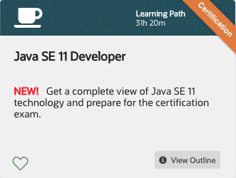

# 510 Java SE 11 Developer

Learning Path 31h 20m

NEW! Get a complete view of Java SE 11 technology and prepare for the certification exam.
 
Welcome to the Java SE 11 Developer learning path!

* If you're completely new to programming, try the [Java Explorer]((https://learn.oracle.com/ols/learning-path/java-explorer/40805/79726)) learning path.
* If you have some programming experience and would like to learn at an accelerated pace, try the course [Java SE 11: Programming Complete](https://learn.oracle.com/ols/course/java-se-11-programming-complete/40805/78835).
* You'll also find resources on Java certification preparation, new features, and developing Java applications for Oracle Cloud Infrastructure.
* The [Java SE: Programming I]((https://learn.oracle.com/ols/course/java-se-programming-i/40805/54605)) and [Java SE: Programming II](https://learn.oracle.com/ols/course/java-se-programming-ii/40805/54247) courses are scheduled to be archived soon. [Java SE 11: Programming Complete]((https://learn.oracle.com/ols/course/java-se-11-programming-complete/40805/78835)) will replace them.
* The Java SE: Programmer I (1Z0-815) and Java SE: Programmer II (1Z0-816) exams have been retired. They are replaced by the new exam Java SE 11 Developer (1Z0-819).

* [Course for Experienced Developers	- Java SE 11: Programming Complete](510_Java_SE_11_Developer/01-Java-SE-11-Programming-Complete.md)
   
   Course 
   15 Skill Checks 
   Lab
   30h 29m
   
* [Java SE Exam Prep	- Prepare for Java SE Certification](510_Java_SE_11_Developer/02-Prepare-for-Java-SE-Certification.md)

   Course
   2h 53m
   
* Practice Exam	- Practice Exam - Java SE Certification

   Module 
   1 Skill Check

* Certification - Java SE 11 Developer (1Z0-819)
 
   Get certified online 
