## 01. Introduction to Java

1. Introduction to Java, Part 1 21m
2. Introduction to Java, Part 2 24m
3. Introduction to Java, Part 3 26m
4. Practice 1-1: Verify the JDK Installation 4m
5. Practice 1-2: Create, Compile, and Execute a Java Application 6m
6. Introduction to Java - Score 80% or higher to pass

## 01. Introduction to Java, Part 1 21m

Introduction to Java-- in this first lesson of the course, we're looking at the overall course goals and objectives, what we're going to learn throughout the training, and that would be object-oriented programming approach that Java presents us with, explain Java syntax coding conventions, use a variety of different Java constructs and operators, use core APIs, such as collections, streams, input/output concurrency, et cetera. And also, we look at how we could package and deploy Java SE applications. Before we talk about the details of the course itself, let's just very quickly highlight the target audience for which the course is intended. This would be anybody who has some non-Java programming experience, or maybe basic knowledge of Java, and you want to improve that. Also, this course is designed to be complete enough to give you grounds, the basis for the preparation, for the Java SE 11 certification exams.

Looking at the course structure, we can see that there are 15 main lessons within the course itself, starting from this introductory lesson, and then proceeding to learning things about Java primitive types, operators, and flow control statements. Then from there, we take it a notch further, and we'll look at more complex types, such as dates, text, time, numeric objects. Then we'll look at the ways in which we design our classes and objects, improve the class design, study inheritance interfaces, looking at arrays and loops, and Java collections API, a way which we can write nested classes, and how we can utilize lambda expressions. We'll look at Java streams API and ways in which we can handle exceptions and debug the program. And then finally, looking at the Java IO API input/output concurrency, multi-threaded APIs, and Java modules.

In addition to the main structured lessons, the course comes with several appendices. They are advanced, various advanced, topics, or topics that maybe are not associated with any specific exercise, and that's why they're an appendix rather than a normal lesson, or topics that may be outside of the scope of the actual certification exam. That's why they could be an appendices. Now, let me be a little bit more specific about it.

Appendices A, B, C, and D, Annotations, JDBC API, Security, and Generics are actually in the scope of certification exam. They simply just don't have specific exercises. Or like in the appendix, which is the Generics Appendix, that's a very advanced topic.

But when it comes to Appendix C, that is actually out of the scope of the certification exam. But what it does is that it shows us how we can think about the application, not just as a standalone Java application running in your client, but also the application that can be deployed to the cloud, and what that deployment entails-- how the cloud deployment is different from any other deployment situation. So that's Appendix E.

Well, in terms of the exercises for the course, as I say, all lessons come with exercises. And the exercises look at the way in which we explore our Java features that are covered in the lessons in more depth from a practical angle. There would be a lot of things that the lesson doesn't-- a lot of detail that a lesson might not necessarily go into, but the exercise does, so a practical angle. Or ways of exploring the code and just seeing how you can write a code this way, you can write the code another way-- what are the similarities and differences between these approaches. So having a hands-on experience in addition to some presentations is obviously quite useful.

Practices are done in the following tools. We use JShell, which is part of JDK, in our case, JDK 11, JShell command line tool, which allows you to experiment with Java code. It's not really writing like proper Java programs, but if you want to try out certain constructs, just see how they function, see how they work, do a bit of scripting, then JShell could be quite useful. And then the Integrated Development Environment, IDE, NetBeans 11, which is where we do most of our exercises.

NetBeans is an open source IDE currently under the ownership and development from Apache group. It's one of the Apache projects now. And it's an open source, a very basic IDE, but for the purposes of this course, that should do. In production, you may use more advanced IDEs, and there are plenty of them. You can choose from a variety of different IDEs. But what we're trying to do is keep this course as vanilla as possible without having to go into any proprietary integrated development environments, well, because we need to support a certification program that would be same for everybody regardless of which specific providers they work with.

Why the choice of JDK 11 for this course? Well, that's what we consider to be long-term support edition of Java. As of version 8 onwards, so after version 8 and later versions, so versions 9, 10, 11, 12, 13, 14, et cetera, all Java versions are released at a six-month release cycles. Every six months a new version of Java emerges, but not all of these versions are considered to be long-term support versions.

Actually, they contain many features that are consider to be experimental features, and they're around for like six months, and then the next version is released. And actually, many experimental features may be gone in the next version. They're not necessarily even present, but they're there to try things out and to see how the language can be evolved.

SE 11 specifically is a version that was chosen to be long-term support, to be a bit more stable than other versions. So its features are not going anywhere. And hence, it makes sense to get a deeper understanding of that. And obviously, that is a clear migration path.

For example, if your Java application is currently in the earlier version, like 8 or earlier, then the next logical step is to move it to 11. And after that, to the next long-term support version, which would probably be 17, but we'll see when that will be released.

So in terms of what we're going to study in the first lesson, we start straight ahead with learning some things about Java language, so why Java is the way it is. And to understand that better, we need to quickly look at some of the language origins, and use cases, how Java implements portability and provide neutrality features, explain some of the basic object-oriented concepts-- well, we need to start somewhere-- and look at the syntax coding conventions, and eventually, get ready to write our first basic Java program with main method compile and run it.

Let's take a closer look. So what is Java? It's a general purpose programming language. It's syntactically very similar to C or C++. It has a lot of features with these two languages in common.

Conceptually, actually quite different, but still, you can find obvious similarities. And if you previously learned any of C family languages, like C, C++, maybe C Sharp, or Objective C, then Java will be fairly straightforward and similar to what your previous experiences were. So it's the same big family of languages.

In fact, there is a very good reason the guys, who created Java language back in 1995 in Sun Microsystems, intended it to be syntactically similar to C as possible. So they wanted to that compatibility in terms of the syntax and the logic of the language in general. But then they changed it, and they introduced some other important concepts, which, obviously, we'll study throughout this course.

Java happens to be object-oriented language, but again, there's an interesting point about it. Object oriented is one of the ways in which Java can be used. If you closely look at the Java language, you'll find there are procedural capabilities, traditional structural programming features.

In modern versions of Java, with the introduction of lambda expressions, there's a huge chunk of the language which essentially is functional programming. So object-oriented is one of many styles of coding, which, obviously, Java supports. But then as we progress through the course, we'll find out that you could do other styles of programming in Java. It's not purely just object oriented.

So like I say, for example, lambda expressions and functional programming, which is, again, a big area of modern Java in the language, and it's quite useful. You'll find out later. It is also platform independent, meaning that you can run Java program, compile it, and without any further recompilation, run that program on a variety of different platforms.

In fact, that was the whole premise behind the Java design in the first place. Because it was originally intended, back in 1995, to be used as a program language for consumer electronics. And obviously, portability between different consumer electronic providers, well, that's a challenge, right? So they are not in any way happened to be hardware or software compatible, so you have to overcome that incompatibility, and that was the design goal of the Java language-- how to figure out that platform independence, that portability of compiled code, across platforms and providers.

Modern users of Java include Internet of Things, cloud computing, so all sorts of server side applications, consumer electronics as well actually, and so on-- different areas where the Java could be used. As I already mentioned, this course is based on Java SE, Standard Edition, Version 11, as a long-term support Java edition.

Now, we need to say a few words about what are the Java editions, so what flavors Java comes in. So Java SE, or Standard Edition, is the one on which any other editions of Java are based. So Java SE is like the core language itself.

So any other edition of Java will be built on top of Standard Edition, if you like. Now what are the other editions? There's an edition of Java use the smart cards.

Every sim card, every credit card, there's a chip that you have in a card-- well, that one-- actually runs Java applications that are written for these chips are written in Java. But obviously, it's a very minimalistic version of Java environment. You don't have much hardware capability there. This is a very basic device.

And yet, it can execute Java code. So for that basic environment, we use a special edition of Java called Java Card. Java ME, or Micro Edition, that's for various consumer electronic devices, like Internet of Things, or maybe, I don't know, things like smart tallies, or maybe mobile devices in some cases-- so these sort of platforms.

We've mentioned Standard Edition is the basis of everything else. Micro Profile-- well, Micro Profile is a service side edition of Java. You could think of Micro Profile as a subset of another edition, which is an Enterprise Edition, which is, well, not strictly speaking what Micro Profile definition is, but you'll find a lot of similarities between Enterprise Edition and Micro Profile Edition. A lot of technologies are actually the same.

But what Micro Profile is designed to do is to give you enough features to run server side Java code and host microservice applications. So it's for micro services. And Enterprise Edition is a kind of a full-blown, big enterprise-level environment hosting server side job applications.

So that's not just for micro services, although it could be used for that purpose as well. But I guess it's for any other server side Java deployment where you require a more complex server side to support complex business processes. So that's Enterprise Edition.

So that's a bit of what Java is all about. Now, how Java actually works. So we mentioned that Java is portable across different platforms. But how it actually physically functions?

Well, first, we wrote Java source code, and that's just plain text. And frankly, you can use any text editor you like. Of course, you'll probably use some kind of automation and form of Java IDE, Integrated Development Environment, but the basic source code is just plain text file.

And you create these Java sources. They must be saved in files with extension .java. That's actually a requirement. You have to save them in files that have extension, .java.

Now, otherwise they're just plain text. And you type the source code of the program. Then you compile that source code.

The compiler, javac, or Java C, is a tool that comes with the Java Development Kit with your development environment which allows you to compile your Java program. So you tell it which source code you want it to compile. As a result of the compilation, javac tool, Java C tool, create a class file. A class file is an actual binary code formed from your source code based on the source code.

However, that binary code contains instructions that are actually different from your usual kind of executable is that you have for your operating system. And the differences that, say, for example, you're compiling a C program. You also end up with byte codes, and these are the byte codes that can be executed on a specific platform for which the C program has been compiled. So they are for a particular computer.

Now, Java byte codes are not for a specific platform. They're not for a given computer type. They're for a fictional computer called Virtual Machine. So Java Virtual Machine provides an environment which basically takes the byte codes that are of a fictional machine, basically a virtual machine, and translates these byte codes on the fly to a specific machine where that Java program should run to the way in which the binary code is executed on a given platform, which is different for different platforms.

So the job of Java Virtual Machine is to provide this environment which allows the same compiled code to be translated differently to whichever current target platform you want to run that code on, and therefore, make Java program portable across all these different platforms. So the exact same shape of Java byte codes will be translated differently to the current platform codes, depending on which platform you run and the program. And that translation is what the Java Virtual Machine would do.

To launch Java Virtual Machine, you simply use a program called Java that launches the JVM, and you tell it which particular Java program you would like to run. And it will start interpreting these byte codes as appropriate for whichever target platform the program is hosted on. Now, there is something very profound about this virtual machine invention, which probably explains why Java became so popular. So that's a brief moment of history on the subject.

Originally, the idea of Java Virtual Machine was just that. You take the byte codes of an abstract machine and translate it to whatever current platform. But there's something else Java Virtual Machine does. It organizes the entire memory management of the program, the entire environment which hosts your code.

And I suppose the great invention about Java was the idea of taking that Java Virtual Machine and not just running it as a standalone program on your computer, but actually embedding it into other programs. The first example of that was Java embedded into the browser. That was done by the Netscape first, and then that started opening up this idea of embedding Java into another piece of software.

So you have Java now in various devices, and you've got it in databases-- everywhere pretty much. And that is possible because of the way Java Virtual Machine isolates your code from the environment and environment from the code. It would not be safe to just take any program and run it inside another program, because of the obvious repercussions to the memory, potential memory corruption, potential conflicts. But if the program is well-isolated from its environment, which is precisely what Java Virtual Machine will do, then it becomes a supportable solution.

And that explains why so many different companies took Java on board, because it allowed them to create an environment where it takes programs written by third party programmers, third party software, and embeds it inside their own software in a way that's safe and supportable. And that is a really unique proposition of Java. It's not just the fact that you could put it on a platform.

It's also the fact that you can put your program into an environment which is of another provider and it will be hosted within that environment. So that's a unique Java proposition here. So portability, not just across platforms, but I'd say probably across providers as well, which is an important facet.

## 02. Introduction to Java, Part 2 24m

Now, how Java code is organized. The unit of coding in Java is a class. So when you write Java code, you write classes. What's a class? Well, it's one of the key object-oriented concepts-- class and the object-- two key object-oriented concepts.

Let's start with the explanation of the class very briefly, because that's like a core unit of code in the language. So class represents a concept or a thing-- it could be a physical thing, it could be a concept-- which you want to have in your program. You want to reflect the behaviors of that real-world thing in your code.

So for example, I don't know, real-world things like dog, cat, ball, person, right? Just an example, doesn't matter. The point is, let's say you need to write a program that allows people to play with dogs and cats and throw a ball and whatever. So that's your piece of software.

So for that, you would need to have classes that reflect these concepts. For each one of these concepts, you have a class. Lovely. In each class, you would describe what are the pieces of information you'd like to know about-- I don't know, about a dog. What do you want to know? You want to know the dog's name, color, size. What do you know-- what do you want to know about a ball? The material it's made of, et cetera.

And then also, the class will contain a description of operations or behaviors that that particular type, that particular thing, can do. So a dog can bark and fetch the ball. Cat could meow, probably won't fetch the ball, I don't know. So it depends.

The point is, the class seems like a place where the information related to that particular type and operations related to that type are kind of fused together. So a class represents both information about something and behaviors.

Now, the words attribute, variable, field are often used interchangeably. And they basically represent pieces of information. The word behavior, operation, method, function, procedure, again, often used interchangeably and pretty much mean the same thing-- a behavior that that class can perform. So that's conceptually what the classes are.

And when you're writing your source codes, Java source codes, that's what you write. You're writing classes. And then within your classes, you describe variables. You describe operations. And inside operations you describe actual algorithms, how the program should carry out its actions, do whatever it needs to do.

So the next thing we need to talk about is, what's an object. And this is really important concept. An object is a specific instance or example of a class. For example, if the class is a dog, then objects are, you know, that Fido dog, which is brown and small, and that Rex dog, which is orange and big. Anyway, so they are particular specific examples of the class.

Each object will be capable of having exactly the structure of attributes and behaviors that the class defines. So if the class says the dog should have a name and color, well then the object type of that class will provide the name and color values, the actual name and the actual color-- and size, and whatever the class says it should have.

Likewise, we could say that if the class describes certain behaviors, then all objects of that type of that class will basically have these behaviors. They will be capable of carrying out these particular actions, like the dog can fetch, for example. The dog has a name, and the dog can fetch.

So think about a class as, once again, a type of something and an object as a specific value or an instance or example of that something. Quite often, many people who talk about object-oriented programming compare the class to a cookie cutter and an object to a cookie. So if you apply the cookie cutter to a dough, you'd get cookies of the same shape, basically. And depending on which cookie cutter you use, you'll get different shape of your cookies. So the shape of the instance, of the object, is based on what the class frames it should be, what the class code describes that object should be.

So that's kind of the way to memorize what the class and object concepts are. And the way a program runs, the way it actually physically performs its logic, is through interaction of different objects. Objects invoke operations upon each other. So a person calls an operation upon a dog, saying fetch, passing a ball as parameter. Kind of makes sense, right?

So we're trying to reflect within the logic of the program itself the real-life interaction, the real-world interactions between relevant objects. So we describe these balls and dogs. And then we make them play. We make them do things. OK, so that's the idea of the object-oriented approach in programming-- kind of reflect real life in a way.

And of course, I guess, instead of dogs and cats and people, your program will deal with whatever business objects it actually needs. So, I don't know, customer's orders-- whatever is the business case you are implementing.

Now, another important concept of object-oriented approach is the concept of inheritance. And inheritance is an idea that you could have classes that are very generic and classes that are quite specific. And the generic classes can describe some attributes and some behaviors that should be common for many other classes. And then specific classes can inherit these common attributes and behaviors from generic ones, and then maybe add extra sort of more specific behaviors or attributes that are specific to that particular type that are not common for everybody else.

You could think about inheritance in a way in which we think about taxonomy of, I don't know, living organisms for example. It's a good association with what kind of inheritance represents. If you think about it, then there might be some kind of living organism class which describes an absolutely bare minimum of generic features that all living organisms share, something that's fundamentally common for everyone. And then you can have extensions of that living organisms, more specific classes.

And actually, the real keyword there is "extends." So we're saying a particular class like Animal extends a LivingOrganism. So Animal is a more specific subtype of a LivingOrganism. And what is important is that Animal will inherit whatever are the generic features of LivingOrganism and can add extra features.

On the next level, you could say, well, Dog extends Animal. And what will happen is, Dog will inherit everything that the Animal defines and everything that Animal has inherited from the LivingOrganism. So it works all the way up the hierarchy. You inherit whatever code is described at a level of your parent type which you're extending and, at further levels, grandparent, grand-grandparent, that hierarchy could have as many levels as you like.

Parent types are called superclasses. Subtypes are called subclasses. So often the words parent or superclass or subclass and child are kind of just synonymous, and people use them interchangeably. So once again, the subclass represents a more specific child type, and it inherits whatever generic stuff the parent that it extends describes, and then the parents of its parents, et cetera.

So this way you can imagine this big class hierarchy comprised of multiple levels and having different branches with different behaviors and different attributes described per branch, I guess, but common things described at the root of that hierarchical structure. And as you can guess, this idea comes from a notion of a code re-usability. We're trying to introduce code re-usability into the program.

If there's something that is generally applicable to different classes, well, that something could be present in a superclass so we don't have to write the code several times. We just define it once in a particular place, in a particular class, and then inherit that code to whatever subclasses we need.

Now, you'll find the Java Development Kit provides lots of-- we mean lots of-- different existing classes that just are there already for you to use. And it's important to learn the existing capabilities. But because there are like hundreds of them, it's obviously not impossible to cover each and every class that exists in Java Development Kit.

So what we will try to do in this course, we'll try to kind of logically group these classes into different APIs and different categories regarding their purpose, why they're designed, what it is that they do, and study some examples that will be representative of that type or group of classes. So for example, we learned about things like basic representation of basic types in Java, like how to represent text and numbers and dates, or how to manipulate with collections in various ways, enumerations, array lists, hash maps, and many others. So that's not a complete list of what we learned in this course. How to do the generic behaviors or system actions, how to implement input, output, and so on and so forth.

So there will be-- we'll be talking about classes that manage concurrency. There will be an appendix that talks about database interactions. But-- or security or logging. We don't do some of the Java APIs that are there, but we just don't cover every API within this course. It will not be humanly possible. Ti's just too much information.

For example, we don't really talk about graphical user interfaces within this course. But these APIs are out there. And the principle in which they are organized is no different from the principle in which any other API is organized. You kind of learn a couple of different APIs, a couple of different-- these subsets of classes. And you-- after that, you get an idea of how to continue to learn about other APIs, really, because the way they're formed follows the same pattern.

And sort of generally, you need to get a grasp on as many different APIs as possible. But again, you need to start somewhere. And I would say documentation is really your friend here. And this Java API is well-documented. Documentation is available online. We will not be able to cover every nitty gritty detail about each and every class that we cover within this course. So obviously, please refer to the documentation for more detail.

And the more you learn, the easier these become to learn next API, because you will follow the similar sort of design logic that was applied across the entire JDK design. So all of these core APIs, they have different purposes, but they still are pretty consistent in terms of the design approaches. You may find an oddity here and there, but generally speaking, the idea that upon the completion of this course, you should get a good grasp on how the Java APIs are generally structured.

That said, of course, beyond the Java Development Kit, the core sort of Java SE set of Java APIs, there are a lot more Java API is available that might be specific to particular Java editions, like Java MP, Java EE, or Java ME-- we mentioned that. There might be specific to these editions. They're not core Java SE.

There might be third-party APIs just designed by other providers. There are lots of additional open-source APIs available. So yeah, kind of-- it's a constant process, learning what different Java classes do for you.

And obviously, not writing code that's already there, that's kind of one of the important things-- understanding which capabilities are already available so you write the code around these capabilities, you utilize them, you don't write them from scratch. So you borrow that code, if you like, into your program. You use that code in your program.

OK. So before you start writing any Java code, whatever, you need to know what are the reserved and keywords and identifiers that a language uses. We will have to learn all of these different keywords later throughout the course. It will take some time. It's not something we can cover possibly on one page.

But you need to know what they are, just as a reference. Because for example, if that's a reserved word in a language, well, you can't name a variable like that. If you're creating a variable, you can't give it a name byte, because byte is already a reserved word. So you kind of have to know just the list first. And then we'll cover what is the exact meaning of these different operators.

Most of them were introduced in Java 1. However, there were couple that were actually removed from the language. That's const and goto. However, funny enough, they're still considered to be reserved words. Although they don't do anything, and if you try to use them you will get an error-- so the compiler will say, no, no, no, you're not supposed to use that-- but they're still kind of reserved by compiler. So you cannot call a variable goto. That's just not allowed.

There were some key words introduced in later editions of Java-- strictfp for [? strict ?] floating point calculations, assertions, and enums, and a bunch of keywords related to modules and to modular design. And in Java 10, there's a special identifier called var was added. As I say, we'll cover them in due course throughout the language.

For now, just-- I guess you just need to know-- at least so you wouldn't run into trouble when you're creating your code-- you know which words are already in use in the language. So you wouldn't use these words for your own ends. You would use them as appropriate constructs of the language itself.

Also, notice that they're all lowercase. And that will become rather important because, as we'll find down, Java is case sensitive. So all the reserved words, all the keywords are lowercase. That's important.

OK. So talking of case sensitivity, that's part of Java naming convention. So Java is case sensitive. And spelling something from upper or lowercase character makes the difference. It's not the same thing. So Java distinguishes that.

There are certain conventions that you're advised to follow. Now, talking of conventions, you don't have to follow them, because they're conventions. But you're really, really advised to follow them. So your code could get pretty [? irreadable ?] very quickly if you don't consider sticking to good, sort of, naming practices.

Anyway, so we'll find out that very soon, but Java classes are apparently grouped together into something called packages. The package name plus the class name must form a unique name and must be universally unique. So class name on its own is not necessarily unique. Package name, obviously, is the same for several classes. But together, package name plus class name must be unique.

And how to achieve universal uniqueness? Well, obviously different people write classes and, you know, they might accidentally use the exact same name. So the idea is that you take your company internet domain name-- and domain names on the internet are unique in the first place. You spell it backwards-- so you could do like com.oracle.whatever-- so your company domain name followed by whichever naming convention you're adopted within a company.

So in this example, com.oracle.demos.animals. Suppose that's the naming convention. And then you create a class within that package. So that's the package plus class name, which guarantees the uniqueness.

Class names are typically nouns. If you use a mixed case, then first letter of every word is uppercase, and then all other letters are lowercase. OK. Variable names, pretty much the same as class names, but the first letter is lowercase but also noun-- well, typically.

Names must not start with a numeric character or underscore or dollar. These are not allowed. But they may actually contain numeric characters in the middle of the name. It's just the first character mustn't be any one of these. And generally, I would advise to steer clear from dollar and underscore anyway. Although, underscore is allowed, but not as the only symbol and not on the first position.

OK. Constant names are typically written in uppercase. And that's probably the only situation when underscores are actually used in convention. So your constant name, all uppercase characters with underscores between words. Once again, you don't have to make the code look like that.

But then if you do, then when you look at a variable and you see it's in all uppercase with underscores between words, you don't have to think. You kind of know, that's a constant, probably, because somebody just declared it like that. So it makes the code more readable. Hence, it's easier to support. If you can understand your own code, or if other people read your code, it's kind of more friendly if you follow certain patterns in naming.

Method names follow the same sort of mixed case convention as classes or variables. But they start with a verb. And the first letter in the first word in the method name is lowercase-- very similar to a variable, actually. But then if you've got more words, these could be nouns, and these could start with uppercase. That's the method name.

Now, there are some kind of good examples on this page. And there are also a set of examples which is, well, what we consider to be ill-advised examples. Package animals. Technically, that's correct package name, and it will work, except that how would you guarantee the universal uniqueness? If somebody else called their package animals, and they also create a class Dog there, then you're in trouble, because, you know, universal uniqueness is important.

So the fact that the package name is not used on that package-- domain name is not used on that package, that's ill-advised. But do you know what? In the exercises for this course, that's going to be the case. There is a finite amount of space in a PowerPoint, and you cannot spell out the domain name every time.

So in your real code, yeah, you put the domain name in the package name. But in many examples, this is something that people just skip if it's not a production code that no one cares really. Just for you to know, that shortening of the name in production code is big no-no. In a play with code it doesn't matter.

Space cannot be part of the name. So class Shepard space Dog, well, that's not going to work. The compiler will object to that. You cannot do spaces as part of the name.

Underscore in the first position-- actually, it was allowed in Java before version 8. But 9 onwards it's not allowed, so don't do it. You could do constant names exactly as variable names. But that's against-- that's allowed, technically, but according to convention that's probably not advisable, just, again, for code readability reasons.

And finally, this xyz example-- technically, this is a legal name. This-- [? kind ?] of, compiler will not object. But is that name meaningful? That's another very important facet of naming things. Try to use meaningful names.

They don't have to be long. They don't have to be exhaustively descriptive. But when you look at a variable or look at the method, when you see that, you understand what it's doing. What xyz is doing, I've no idea. It doesn't really help.

Maybe it's getting some kind of a special coordinate. But then why is it then not called "get me a coordinate," you know what. I mean, right? So it has to have some meaning. And yeah. So just consider that. Be graceful to whoever reads your code-- actually, including yourself.

I don't know how about you, but I tend to very quickly forget what I've written the other day. So, you know, going back to my own code could be a puzzle sometimes. If I didn't follow a proper descriptive or a meaningful name, I'd struggle understanding what it is I was doing, actually, never mind somebody else reading my code. OK. So that is something worth considering.

## 03. Introduction to Java, Part 3 26m

In terms of us syntaxical rules, well, there are two crucial rules you need to follow. Java code is written in blocks, and the blocks of code are delimited with the beginning and the end, which is open in curly brackets, close in curly brackets. So these parentheses, opening, closing, blocks of code. The statements in Java terminate terminated at the end of state with a semicolon.

Indentations, carriage returns, are not meaningful from the compiler perspective. So all of these nice indentations and all of these carriage returns are purely for your own readability. They help you read the code. The help whoever looks at the code to read it. But from a compiler point of view, if the entire program was written on the same line technically, the compiler will agree with that. The compiler will not object.

It's not very readable, of course, without indentations and without carriage returns, but compilers is governed purely by blocks of codes and semicolons. That's the only thing that compiler cares about. There are some cases where the block of code-- the actual explicit open and close and curly brace-- can be emitted, like in if else statements or in while loops. If there's a single statement inside an if, or a single statement inside an else, or a single statement aside a while loop, technically you can omit curly races. And we'll talk about it later.

But even though you cannot omit them for just one code line, you can't omit them if there's more than one line of code there. So if there's more than one statement inside side, more than one semicolon, if you like, yeah? Line of code is not precisely the correct term, because you can write several statements on the same line. But naming convention-wise, code styling-wise, we tend to write statements on lines-- one statement per line. Although it's not requirement.

So anyway, quite often people will say single line of code, but what they really mean is just a single statement. Just terminology-wise, people interchangeably use these words quite often. So there are cases where curly brackets could be omitted. But even then they're sort of implied, and if you spell them out explicitly, well, I guess, there's absolutely nothing wrong with that. And really, most of the time you have to spell them out explicitly-- you have to put curly brackets around your code.

Anyway, we'll have a chance to explore all of these statements later in more detail. So far, these are the kind of basic syntaxical rules for the language. Now, let's start by defining some classes of ours. Of course, let's define a class.

So what's the syntax? Well, first of all, class can be described without placing it into the package. It's technically allowed. And then, in that case, if the class is not a member of the package, it will be considered to belong to default package.

But there are lots of environments which will reject such classes. For example, Java EE will just refuse to deal with classes that are not members of packages. And that's down to the idea of the unique combination of the class name and a package name to ensure universal uniqueness. Because if you just rely upon a class name, guaranteeing that that universe is universally unique is practically impossible. Together with a package name, well, yeah.

So you describe a package, and you put a class into the package-- that's the idea. As I say, the package uses reverse DNS domain notation. And the class name just reflects whatever is the business concept that you're trying to convey here-- whatever that concept, object, or thing that you're modeling is.

Notice that you save the class into a file with extension .java. And actually, you put it in a folder where subfolders match your package segments. So that is matching. Again, because you can't really put all of these Java sources into the same folder, because, potentially, in another package, you may have a class with the same name. And how do you ensure that the two different files with the same name don't arrive in the same folder? Because that's going to be impossible. Well, just put them in subfolders that correspond to your package names. That's kind of the idea.

So describing classes. And then, whatever other code you intend to write. It doesn't matter-- whatever other code you want right. You basically put that code in whichever class you were defining. So this open and close and curly brackets, that's your class body, and that will contain variables, math, whatever you need that class to have. So that will go inside that class.

Can you access classes that are in another package? Yeah, you can. Sure.

So suppose there is this class dog, and it's in a package animals-- I know that's not a proper package name. Imagine the whole reverse DNS domain prefix in front of it. But as I say, this is just saving space on the PowerPoint.

So there's some class dog and some package animals. There's a class owner, and it's in a package people. Owner wants to use the dog. So how do we organize that? Well, when he type the dog class name, you can just type the package name in front of it. So you're saying there's a class dog and package animals-- animals.dog. That's fine.

So that is how it works. However, considering that package name could be quite lengthy and a lot to type, you probably don't want to type the package name in front of the class name every time you want to use that class, right? So to avoid typing the package name in front of the class name, you can place an import statement into the program. Input statement just basically says, oh, there is this package .dog, and then a class name, and then within that class, you can just use the class name instead of prefixing that with the full package prefix every time. So import basically cuts on your typing.

And if there are lots of different classes you would like to use from the package animals, not just dog, but maybe other classes as well, actually you don't have to have an import per class. I mean, you can, but you're technically not obliged to do it. You could just do the star. animals.*, meaning any class in the animals package you allow the class owner to use without having to put a prefix of the package name in front of the class name every time. Just saves your typing really.

What's important about package import statements-- these imports-- is they're actually removed from compiled code. They only exist in a source code. The compiled code always uses a full prefix of the package and class. In the actual compiled result, classes are referred to with specific package prefixes, full names-- fully qualified names. So imports are completely gone from compiled code. They're purely a source code editing trick that helps you not to type too much. That's all they do.

Which basically means having an excess of imports, if you import a package that you're not actually using-- classes that you're not actually using-- will have no effect on compiled code whatsoever, because it will be just removed. And that's it. So having excessive imports in your source code doesn't really harm your compiled code in any way.

Probably whoever reads that source code will kind of look at that and say, why do you have these imports? Are you really using these classes? Doesn't seem like it. So it could be confusing to whoever reads the code to read imports that you're not actually using. So probably don't do it from that point of view, but from a technical level, you're not obliged to enlist every specific class you want to use explicitly. You can just do the star, and it will be perfectly fine.

[? ID ?] [? is ?] normally maintaining [? ports ?] for you. So when you start typing your code, you will realize that IDs will for you to add import statements automatically. There you go.

Now, there's one more thing here, and there's this keyword public that you probably notice using on all of these classes. Well, that's called an access modifier, and that's the next thing we'll talk about. So the reason why I'm using this keyword public here is because with that access modifier-- public is one of the four possible access modifiers you could use-- you can control who can see your code.

So let's discuss that. There are four possibilities here. You describe a class. You put some variables, math, whatever you like in that class. Who could see them? If you mark your variable or method within a class as private, well, that's it. Only the code in that class would be able to access such variables or methods. So visible only to same class.

If you mark something as public, the opposite side of the spectrum, well, then it's visible to everybody. All of the classes in all of the packages can see whatever is marked as public. So variable, math, that class, whatever you mark as public.

Protected means you're making something visible only to classes that are in the same package. Now you realize why the previous PowerPoint page used public keyword on a class definition, because I wanted class that was in the package animals to be used by a class there was in a package people. And they are different packages. And if something isn't public, then, well, how do you see it in another package? That's an issue, right?

So public visible two classes that are in other packages to everyone. Protected-- visible to classes in the same package or subclasses. Well, there is this idea that a class can extend another class. Remember, class hierarchy? Top level, superclass, extended by subclasses-- we've talked about it on a conceptual level. So you can create a subclass that extends another one-- that extends a parent superclass-- in a different package. That's actually allowed.

And here is how the protected would work-- generally speaking, if something is protected then you can't see it from another package. But if another package contains the class that extends that class, that describes something of a protected type, although they are in different packages, that other class-- that subclass-- can still see that. It can still access whatever was described as protected through the virtue of extending the class. Although, as I say, its in a different package.

If you don't put any access modifier at all, that would be considered a default case. In this particular situation, default isn't a keyword. It's the absence of access modifier. So that means that whatever you marked with default access modifier-- or better say, not marked with access modifier-- that method, that variable, whatever it is, will be visible only inside this package. And that's a tiny difference between protected and default. Protected means reasonable to the members of the same package and subclasses, and default means visible just to members of the same package. Of course, if it's subclass is in the same package that could still see it, because it's in the same package. But if it's in a different package, the default methods and variables will not be accessible to such a subclass, and, for that matter, to any other class that's not in the same package.

So here's a couple of examples. I mentioned there is this class X-- oh, terrible naming, I know-- in a package a. But then again, we're striving for space here, so we're trying to make names short. Anyway, this one contains some variables that are public protected, default, and private. And then there is another class, and it's in package b, as you could see. Class Y is in the package b, and it happens to use class X. As you can see, there's an import of a*, which includes X obviously. And Y actually extends X.

So Y is a subclass of X. And that's why inside of class Y you can actually see that variable Y1. And that's why, in the class Y you could see the protected variable Y2, because it extends X. So you can see public. You can see protected things. You can't see default variables, and you can't see private. Because, well, private is anyway visible only inside X.

So that's kind of the concept of the access modifier, which really kind of helps you to describe where things should be used. When you describe a class, when you describe methods and variables, you decide who else could see that stuff-- where that code is invokable from. Lovely.

Now, during this exercise, you will be asked to create a class with this method called main. The purpose of this method main, well, it's a special method, special behavior, that you may define in your class. And what's special about it is that unlike any other method-- which you can also right here, of course-- method main is considered to be default entry point into the program. If you run the program-- if you say, I want to run this class whatever-- Java runtime-- Java Virtual Machine-- will look for the method with that particular signature. It will look for the method that is exactly that-- public, static, void, main, [? accepting ?] string array of arguments.

This is a very specific entry point. You may have any other methods in your class, whatever. And I guess what you can do next is inside method main, you start calling these other methods. You invoke other classes, you invoke other methods, you invoke other methods of this class, you invoke methods upon other classes. But the first method, the Java Virtual Machine itself will invoke upon your program is this method main.

In other words, think about it for a moment. You're writing your Java source-- .java file source codes. You compile them. What you end up with is a bunch of .class files. After you compile your .java files, you end up with byte codes .class files. What's the difference between an executable and a library? If you compiled a platform-specific code, I guess, then, you have your exes and dlls, right? But in Java, everything is .class.

So how do you tell that that's an executable and that's the library? Well, the presence of method main, that particular operation, makes whatever class kind of an executable. It's an entry point to your program. That's how you start the execution.

So the method main must be named main. That's a very specific name. Lowercase-- by the way, remember Java is case-sensitive. It must be public. So that basically means the Java Virtual Machine will invoke it from outside of this class, obviously. It must be static. We'll talk about static and the word keywords a little later. But for now, it means that you don't need to create an object out of the class whatever. You don't have to say new whatever. You don't have to create an instance of class whatever.

This class you are not creating an instance of it to invoke method main. That's what static word means, that you can just say whatever.main. You're literally just calling that method upon the type itself. But we'll talk about the static later in more detail.

Void-- again, we cover it later in more detail. But for now, it doesn't return a value. So void means you don't intend to return anything from that method. Just call the method, that's it.

The method accepts a string array of arguments. The parameter name args is irrelevant. You can call it blah blah. For all I know, it doesn't matter. It doesn't have to be called args.

What's important is the type. And a type of that parameter args is String array. The square brackets, that means array. Again, we'll talk about arrays later. So we'll cover that later.

But that is the signature of method main. And I can tell you what that string array represents actually. It represents command line parameters. If you want to pass any parameters to the program when you launch it, they will be present in that string array. They will be presented to your program through that.

Let's make sure we know how to compile and run. So we formed that class. We formed the class that has method main. Maybe we formed some other classes-- as many as we need. And then we need to compile them.

So what do we do? The utility that we use to compile is Java-- javac-- and there are several parameters you probably want to set. First of all, what you need of course? You need a path to the source code. So where's my class, whatever, that I would like to compile?

Here's another thing. This variable minus class path-- say class Whatever uses some other classes. The class Whatever uses some other classes. You invoke them from class Whatever. You already compiled these other classes and you stored them somewhere. The class path points to where other compiled classes are.

So you could say, oh, yeah, yeah, yeah. I've got a bunch of classes. I already compiled them. They're in that folder. So these are classes that the class Whatever uses.

What's the -d parameter. The -d parameter points to the folder where you want to store the compiled result. So when you compile the class Whatever, where do you want to put the .class file? So that's -d.

As a matter of fact, the -d parameter points to a parent folder. And if the class Whatever is in a particular package-- like, in this cases, it's in package demos-- then what the compiler will do is it will create a subfolder within that parent, the -d-- subfolder within that parent-- which corresponds to the package name. And if the package name is kind of proper reverse DNS, then I have [? seeded ?] several subfolders. And it will put the compiled Whatever class, result of the compilation, into that subfolder.

So the parameter -d us pointing to the folder just above that subfolder that will be created for you, which will stand for whichever package the class [INAUDIBLE]. So is actually class path. The class path points to a parent folder underneath which you would have your subfolders that correspond to packages. And within them, you'll have your classes. So that's the result of the compilation.

You need to point to other classes-- that's class path. And you need to say where to put the output-- which folder to put the output. That's -d. And path to the source code, of course.

Now, how to execute a Java program? Well, you use Java runtime, java, minus class path-- -cp-- path to the root folder underneath which other package and class folders reside. And actually, it could be a list of folders, by the way. The class path could contain a list of folders. And as we'll learn later, you can actually archive these folders-- create zip files basically-- and the class path can point to archives instead of folders. So a collection of folders or archives which contain your code, that's what the class path references.

Then you put here package name .class-- so what it is that you want to run. And that should be the class that has your method main-- that's the one you're executing-- and then, optionally, any other parameters you would like to pass. Parameters are passed as a space separated list. If you want space to be part of the parameter value, enclose the parameter in double quotes.

From within method main, parameters are accessed from that string array, which main method receives as an argument. And you're access array elements using the array index, which starts at 0. 0 is the first parameter. So Jo is 0, John is 1, "A Name" is 2, and Jane is 3. and Hello John, in this case, because I'm accessing parameter at position 1. So there you go.

In Java 11, but not earlier, it's also possible to create a single file source code-- just a Java source code file-- which contains all the code you want. And then you can just run it without compiling first. So it will kind of act a bit like a script, I guess. It will automatically compile and execute the code for you.

This is by no means something that you'll probably want to use as a production solution. You probably want to compile classes properly. But, you know, if you just want to try things out, like something without going through the formalities of actually compiling, then you could do this single source file as well-- single source file execution.

What else you can put into your Java source? Well, obviously, your code, but you can also place comments there. And the comments could be of three types-- single line comments, slash slash, just one liner, multi-line comments, slash star is beginning, star slash is the end, and then any number of lines of comments, and then these, comments with kind of double star. These are documentation comments.

Documentation comments can contain special additional annotations that describe how to form documentation. And there is a utility called javadoc, where when you run that utility it scans your sources and it extracts all the documentation comments out of them. javadoc ignores the regular comments. It only looks at documentation comments-- at these ones. It extracts these comments out of your sources and actually generates HTML documentation for you. So you could then browse it just using a browser literally as HTML. Documenting your code, it's quite useful.

So that is it for this first introductory lesson. We looked at the purpose of Java language and where it could be applied, at its origins, at use cases, at how Java is designed to be portable and provide neutrality, that you can embed Java programs into different environments and run them on different platforms. That Java is apparently an object-oriented language, although we've mentioned there will be other non-object-oriented features that we will discover throughout this course, such as, for example, capabilities of Java related functional programming.

But in terms of object-oriented, important concepts were, what's the class, type of thing? What's the object-- an instance of a class, a concrete example of a thing? And that they could form hierarchies, that classes can extend other classes, and then just the general sort of syntax-- how do you form the class? How do you create a source code? How you compile, how you run, and how do group classes together into packages? And possibly use classes that were in all the packages-- utilize code across these packages.

Now, in terms of the practical exercise for this lesson, you will be asked to verify the presence of Java Development Kit and its version. So you know how you make sure that you have correct working environment. You create HelloWorld job application with method main, compile, run, pass some parameters, look at the output. There you go. That's a starting point.

## 04. Practice 1-1: Verify the JDK Installation 4m

Let's take a look at the practices for the Java SE 11 Programming Complete course. We'll start with the first lesson. That's the first exercise for this course.

And you could locate the PDF file with your exercise description. Should be available both on the remote desktop to which you connect for performing exercises, or if you downloaded the e-kit with the PDF file describing the exercises locally. Whichever way you open that description or exercises file, then you start doing exercises starting from lesson, as you complete different segments of the course.

We'll start with the first lesson here. And in this practice, we just explore the configuration of this machine, look at where things are, kind of understand the practice environment, and also create and compile a very first sort of simple Java program. Now as you could see the location of the files on that machine, if you look at the Home folder, underneath the Home folder, you'll find Folder Labs. And that's where all the practice exercises are, so for example, practices for various lessons.

You"ll also find here a Solutions folder. If you are unable to complete whatever exercise, you'll find the solution for it. And there's also an important folder called Resources that contains certain files that you may need throughout, you know, performing various exercises.

Now first, let's just verify if we've got correct Java development keyed installation here, which is useful anyway, I suppose. If you're dealing with your own local machine, how do you know that you've got things correctly installed? Well, Java minus version. There you go. That's 11.04.

That will do. It's a Java SE 11 course. So Java is already installed. We're good. You can also check if you can access Oracle website that contains Java SE documentation. But that's up to you.

Throughout this exercise, we'll be using Java Development Kit to compile and run Java programs. So obviously, because we are able to call Java-- and you could test. Can we call Java back? Yeah. Java compiler, yes you can.

So it's in the path. But if you're configuring an environment yourself, that's what you need to verify to make sure that you actually have relevant components in your system path. In this machine, they actually are.

Now let's go to the Labs Practice One folder, and just check out what we've got in there. So two sub folders-- Classes, Sources. Fine. So we'll be forming some source codes here and then Compile, and Create Classes. That's our task.

## 05. Practice 1-2: Create, Compile, and Execute a Java Application 6m

So let's start with us. Let's create ourselves a simple Java class. So the class that we'll create, we'll do it with a tool called jEdit, but you can use any editor. It doesn't matter.

So in the Sources folder, and then we'll create subfolder labs. And the file that we'll be creating, HelloWorld.java. The ampersand at the end allows you to pop up the editor and not block the terminal window. So you could continue typing commands in this terminal window.

So that pops up the editor. We create file, HelloWorld.java. Now we need to write some code. Let's put it into package labs, and class, HelloWorld.

So that's that. What we'll do next is put some actual logic into the class in a form of a method main that will perform whatever actions we need, so avoid main. Actually, you can copy/paste from the menu if you want to.

You don't really have to type everything, which is what I'll do next probably, start copy/pasting, because that's not a typing exercise. The purpose of the lab is for you to understand the code and the environment. And I'm sure that we all can type. That's not a big deal.

Anyway, arrange it nicely. Grab the first parameter from the command line, which will pass to this class. So that's our get position zero is grabbing the first parameter from command line, and just print it in HelloWorld printout.

Save the file. There you go. And we're ready to compile.

So what we could do is simply switch back to the terminal window. Because remember, we did the ampersand, which basically means we are not blocking the window. We're launching an editor without blocking the terminal.

So the next thing we need to do is compile with Java, Java compiler minus d. We put the compile output in a classes folder, and we pick the source that we've just created from Sources, Labs, and the file HelloWorld.java. There you go. So that should compile the code.

You can actually check all of your compiled folders, if you do the LS command, recursively listing subfolders so you can see what's inside the classes directory basically. You could see that inside. There is a subfolder, Labs. That stands for your package.

And in this subfolder, Labs, there's HelloWorld class, which is what we just produced. This is what we just compiled. So that's just in case this is the sample output of the program to verify that you're doing everything fine. And then let's run it.

So what do we need to do to run? Java minus class path, or CP. That's the same thing. A class path pointing to classes folder, that's where our code, compiled code, is-- package name, class name.

And then, well, we're supposed to pass some parameters, right? Now, let's pass some arguments. So how about Hello to Niels Bohr, yeah? Well, why not?

Let's do that. There's a very strange paste command here, control shift, shift control v, rather. Normal control v, but that's Linux terminal for you. There you go. And it prints out Hello Niels Bohr.

Notice the reason why we have quotes. If I do that same thing without quotes, then it will just say, Hello, Niels, because the parameter is a space separated list. So obviously, quotes were needed to ensure that what would grab, the first parameter, are at position zero here in a program.

We're actually grabbing the entire value even though it actually includes space. Well, there you go. We compiled and executed a Java program. If you want, you can now close the editor. And that's the end of this exercise.

## 06. Introduction to Java - Score 80% or higher to pass

View Quiz

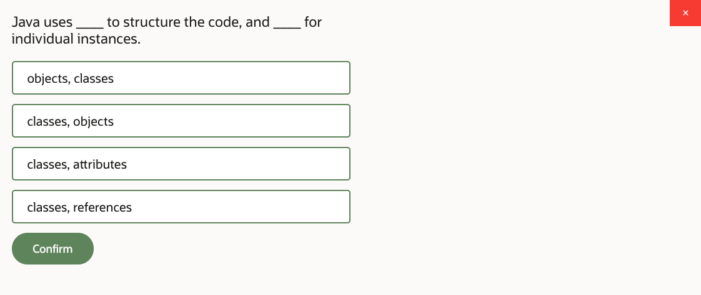
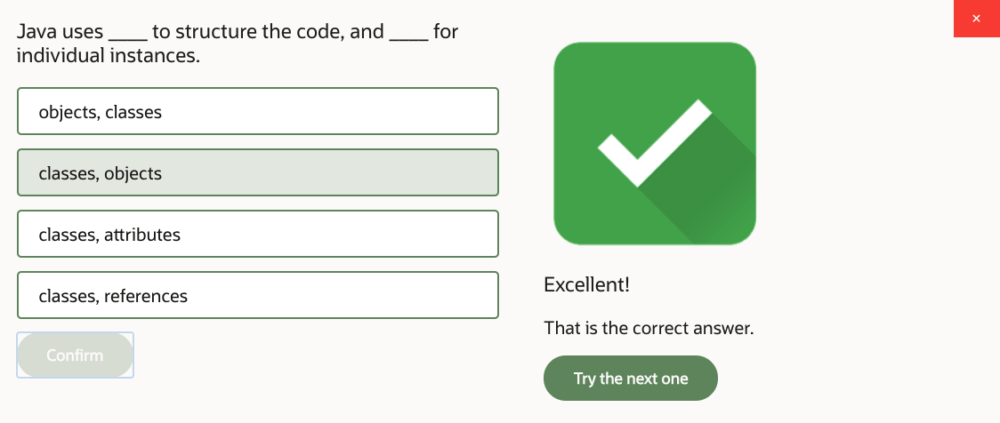
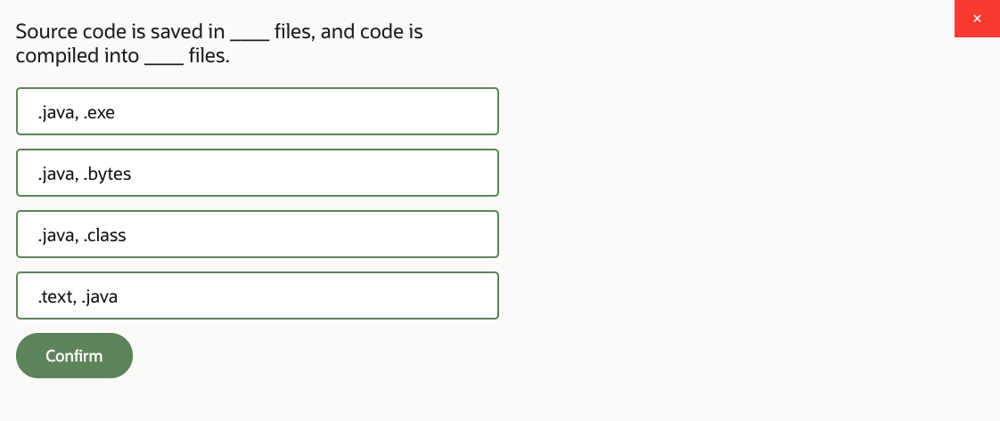
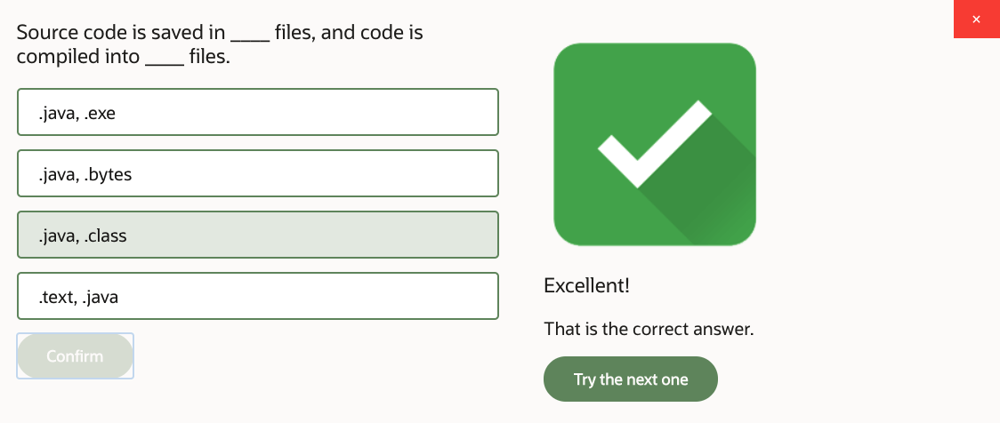
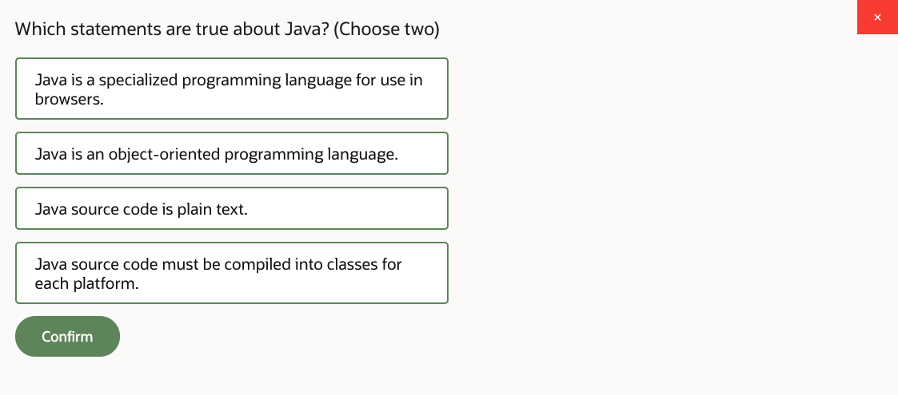
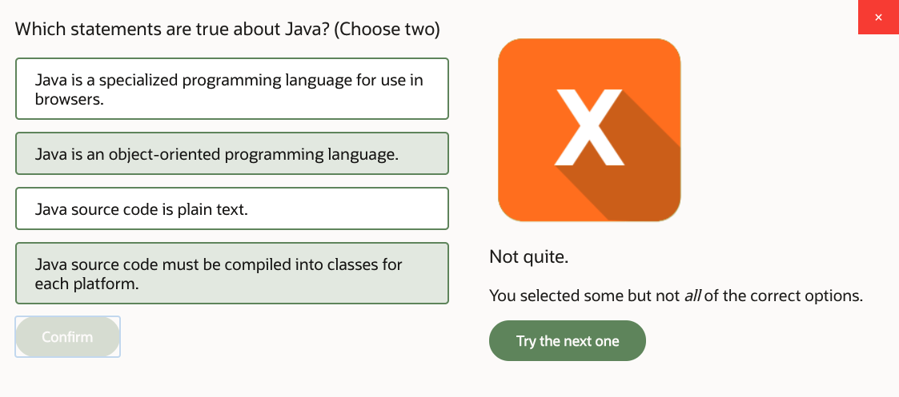
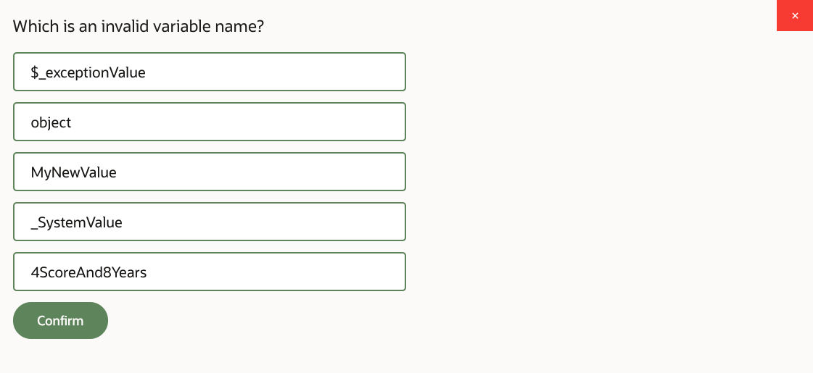
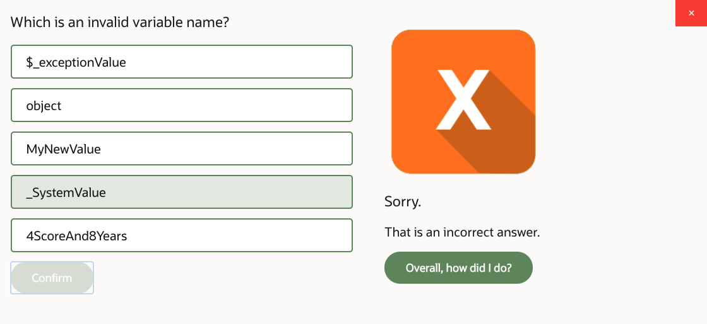
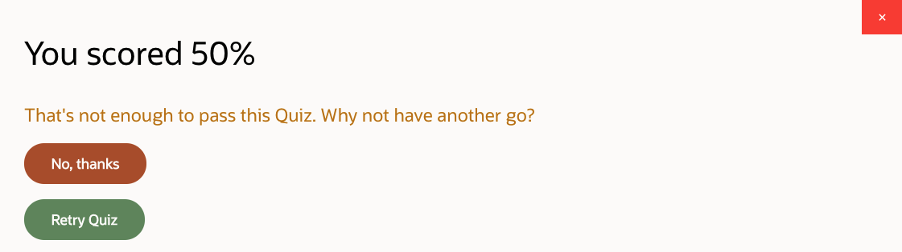
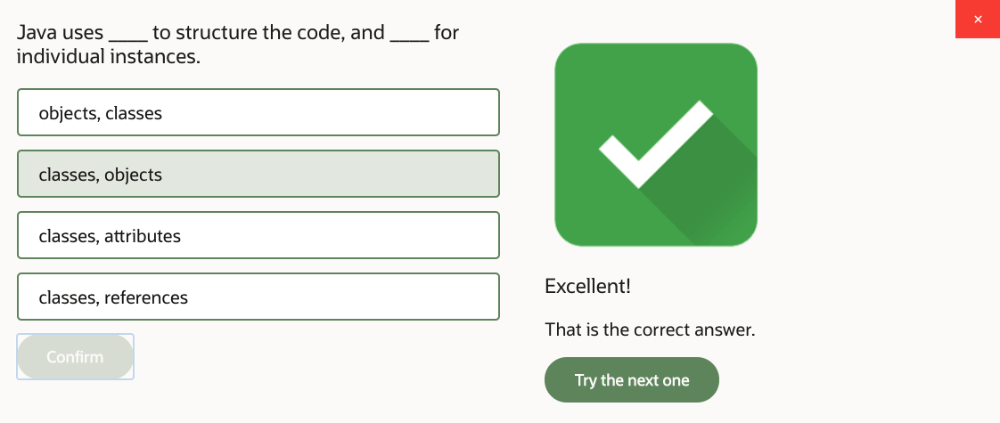

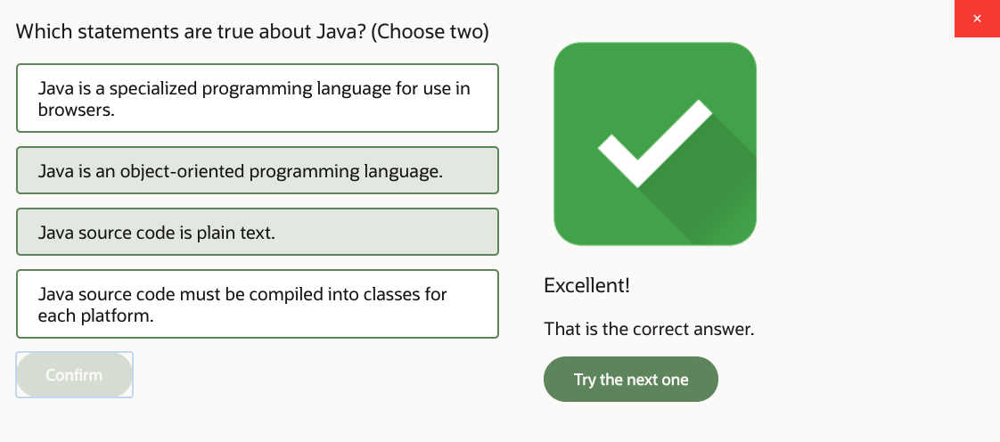
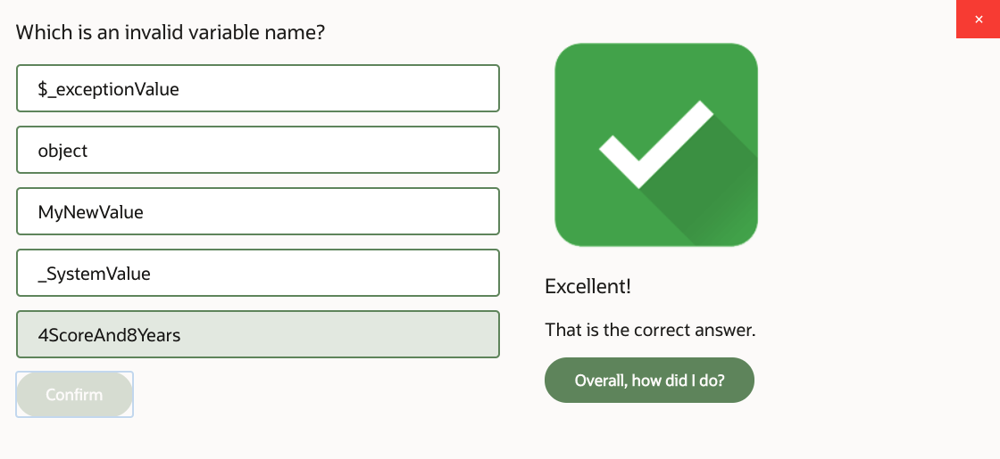
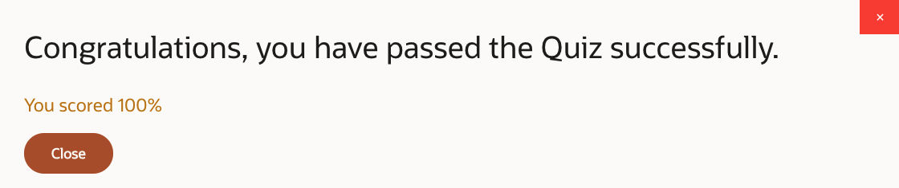
