# 02 Primitive Types, Operators, and Flow Control Statements

1. Primitive Types, Operators, and Flow Control Statements, Part 1 16m
2. Primitive Types, Operators, and Flow Control Statements, Part 2 24m
3. Primitive Types, Operators, and Flow Control Statements, Part 3 20m
4. Practice 2-1: Manipulate with Primitive Types 22m
5. Practice 2-2: Use the if/else and switch Constructs and a Ternary Operator 19m
6. Primitive Types, Operators, and Flow Control Statements - Score 80% or higher to pass

## 1. Primitive Types, Operators, and Flow Control Statements, Part 1 16m

Primitive Types, Operators, and Flow Control Statements-- in this lesson, we're looking at the way Java represents basic types, like numbers, for example, and what sort of operations we can apply to that, various arithmetic operations, et cetera. We are also looking at the way we convert types known as primitive type casting, and some more advanced mathematical functionalities available from the Math class.

Part of this lesson will discuss Boolean type and various types of expressions with which we can do conditional processing in a code, like if/else. And also, we're looking at a way to control the flow with switch statements. Another topic in the lesson is describing the program called JShell, which is a very useful tool to experiment with code without actually having to write full-blown Java programs. The reason why JShell is mentioned here is because, in fact, at the end of the lesson, you're encouraged to do exercises in that tool, using JShell.

All right, well, let's start with what are the primitive types. There are eight primitive types available in Java, four types describing whole numbers from smallest to biggest-- byte, short, int, and long, 8-bit, 16-bit, 32-bit, and 64-bit numbers-- two types representing floating point numbers. The smaller one is float, 32-bit number, and the bigger one is double, 64-bit number.

Then we've got a type called char, or character. And the char is a 16-bit value representing a character code. So that you can represent as single character using char type. And finally, the Boolean, which can represent true or false values.

Now, what this page shows us is precision for each type, so ranges of values. And please note that all numeric values here are signed, i.e. they could be both positive or negative. So for example, for the byte, the range of values is from minus 128 to plus 127. And you could see the ranges.

We also could see here what's a default value for a variable of a certain type. And as you notice, the numbers are all defaulted to 0. Well, actually, char is defaulted to Unicode character 0, which does not correspond to any particular character on a keyboard. So it's a character code 0.

Now, the other thing that you could see from this page is how could you express values for corresponding types? So for whole numbers, for example, you could use binary-- 0b and then 0's and 1's-- a binary representation, octal, 8-base numbers, decimal, 10-base numbers, and 16-base numbers, hex representation.

Also note that to distinguish the value of int from long on the end of the long number, you add letter l. You can use lower l uppercase L. That's up to you. But obviously, lowercase l is probably less readable, because it could be confused with 1. So uppercase L is probably mostly used.

Now, with floating point, you could use exponential notation, powers of e, or just write the floating point number, as these. And a very similar trick to distinguish float from double-- at the end of the float value, you add F, indicating that that's float rather than double. Again, you can use upper or lowercase F, but probably uppercase for readability reasons.

With the char, the values could be expressed-- it's just a character. Single quotes, which is very important-- has to be in single quotes. Or it could be character codes, could be Unicode codes. Slash u means the Unicode code. If there's no slash u, if it's just slash and then the number, then it's basically ASCII code.

You could also use escape sequences, such as slash t for tab slash b for backspace, n for new line, et cetera. Oh, and you could obviously notice that quote itself could be escaped with a slash symbol. Actually, even slash could be escaped with a slash symbol. Just put slash slash.

And Boolean values are expressed as two reserved words, true and false. So you cannot really assign a string or number to a Boolean. It actually has to be one of these two reserved words.

So now, what do we do with these primitive numbers? Well, we perform various operations. But before we do that, let's just make sure we understand how we declare a variable of a particular primitive type and initialize it.

So the syntax looks like this-- type, followed by variable name, optionally, equals value. You don't have to initialize the variable immediately. That might be a good idea, but technically, you don't have to do it. You could initialize a variable later in a code so long as you initialize it before you actually try to use it. If not, the compiler would probably object to that. And then, as usual, the statement is terminated by a semicolon, which is expected for any Java statement anyway.

A variable can be expressed, variable value can be expressed, in all of these different ways. You see the examples here. A is expressed as a binary number, B is expressed as octals, C's decimal, D is hex-- whatever you like, really. Also, don't forget that if you have a flow to indicate F at the end-- and this one is using exponential notation, wow, just because she can, I guess-- with the double, you don't need to put F at the end, obviously.

Now, here's another interesting thing. Variable can be assigned a value of a previously initialized variable. In this particular case, long variable g equals 5, and h equals c. And c is some other variable you previously have initialized. So one variable can be used to initialize another.

Notice that it's perfectly plausible to initialize values of bigger types with values that represent smaller types. So for example, in this particular case, h happens to be long, and c happens to be byte. And byte is obviously smaller than long. It's 8-bit versus 64-bit, right? So you can take this smaller value and just assign it to a larger variable. And your delta is automatically promoted to the larger type. So it will be accepted.

And it works across different types. So for example, in this case, g happens to be a long value, and you assigned it to float. Floating point number's considered to be larger than the whole number. That's kind of the idea. So you can basically take any whole number and assign it to a floating point variable. That will work.

Now, the next example here initializes a char. It's just double quotes-- oh, sorry, single quote. Oh, gosh. Yeah, that's very important. char is initialized using a single-quoted character. And then you could use Unicode codes or ASCII codes.

Also notice that multiple initializations can appear on the same line, comma separated, so long as they are the same type. So g and h are both longs, k and l are both chars. And yeah, you could initialize several variables and declare several variables in one go using this comma separated format.

And the last example basically just shows us that a variable s is declared and initialized a little bit later. So long as you do it before you try to use variable s, you are perfectly fine.

Now, this is how you declare and initialize primitives. The next page shows you how not to do it. Let's take a quick look at typical errors, problems that you may encounter when you initialize and declare in primitives.

So first of all, you can not use a non-initialized primitives like this. a is not initialized, and char assigned it to be. And the compiler will object to that. Yes, you can't do that. Also, on the next example, you could see that clearly the value is bigger outside of a range, if you like, of a byte type. Yeah, the byte is from minus 128 to plus 127. And 128 is clearly outside of the range. So the value doesn't fit the capacity of the type. The code will not compile.

And the next line, 42L-- you see, L indicates that that value is long rather than int. The 42, per se, is within boundaries of an int, you're perfectly fine. But you're explicitly indicating that you want a long number rather than the int number. So the value on right-hand side of the equals sign, right-hand side of expression, can't be larger than the variable you're trying to-- capacity of the variable you're trying to assign it to on the left-hand side.

Likewise, on the next line of code, what's wrong with that? Well, there's a missing letter F to indicate that that's 1.2 float, because by default, 1.2 without letter F-- that's considered to be double rather than float. So it cannot be assigned to the float variable.

Double quotes around the char-- well, it should be single quotes. Two letters and char-- well, that's not possible, A and B. The char is a character code, a single character. So you can't have two characters. And of course, you cannot use true or false, as strings or chars or whatever, or even as numbers, 0, 1, as Boolean values. They actually have to be keywords, reserved words, true and false.

Actually, on that note, you know that Java is case-sensitive. So all Java keywords and reserved words are lowercase, including the true and false. So spell it in a different case, and the compiler will say, well, I don't know what that is. So all of these examples will cause Java code not to compile.

OK, now let's take a look at the operators you can apply to primitives. So what is important about this page is that it shows us, generally, what the operators are. Actually, some of them apply not just to primitives but to objects, as well. But we'll talk about it later.

But what's most important about this page is the precedence, the order in which operators are applied if you use them in the same expression. So obviously, you can use multiple different operators together. Of course, the order can be changed with round brackets, with parentheses. You can override the order, but that's the default order.

Now, what we're going to do next is just look at these operators sort of one by one and try to figure out what they do, how they work. And we start with arithmetic operators, arithmetic and, on that note-- well, assignment, as well, actually. Assignment is a simple equals sign, so 1 assigned to A. It's just that.

But assignment can also handle expressions such as arithmetic expressions. So on the right-hand side of assignment, you can have some expression. You evaluate that, and a result is assigned to whatever is on the left-hand side of the expression.

The expressions themselves may represent various arithmetic operations-- addition, subtraction, multiplication, division. The percent sign stands for modulus, or remainder of division. And you can see how the math works here.

Now, you may combine the arithmetic operator and the assignment together in one compound assignment statement. In a sense, you could write A equals A plus B, but actually, A plus equals B does exactly same thing. There is no difference at all whatsoever.

So if you want to apply arithmetic operator to a variable and then assign the result, basically, to the same variable, well, you could just do this plus equals minus equals divide equals, whatever. So you could just do it in one go. There is no preference as to which way you do it. It's entirely up to you-- whatever you feel is more readable, basically. Readability is important.

Now, the order, as I've already mentioned-- if you use multiple operators in the same equation, then the order is controlled with round brackets, with parentheses. So yeah, obviously, they affect-- whatever is inside the brackets, whatever is inside the parentheses is evaluated first. They kind of override the default order.

Now, the plus plus and minus minus-- these are really interesting operators. They increment a number or decrement a number by 1. So you have a variable here, and integer A equals 1. And you do A plus plus, and it becomes 2. You do plus plus A, it becomes 3.

So hm, what's the difference then? Why do we have this prefix and postfix notations? It's seemingly doing the same thing, incrementing or decrementing a variable. But you see, the difference would be obvious if you start combining the plus plus and minus minus with the assignment in a same line of code. And then the difference becomes obvious, because you see, what happens here is the order in which you do things matters.

If you're saying B equals A plus plus, then you will first take the value of A and assign it to B and only then increment the A variable. If you do it the other way around, if you're saying and B equals plus plus A, which is the next line, basically, then you first increment A-- well, it would be minus minus, decrement, whatever. And then assign the result to B. So it's the order in which it is done.

If you're not doing that assignment, if you're just doing plus plus or minus minus on its own, well, apparently, recursively modifying the same variable, right? So A variable gets incremented or decremented, right? So no assignment is really required, as such, just to perform increment or decrement.

The assignment is kind of a separate action applied to some other variable. And then the order in which you do it matters. Do you assign first and then increment or decrement? That's the postfix notation. Or do increment or decrement first and then assign? That's the prefix notation.

## 2. Primitive Types, Operators, and Flow Control Statements, Part 2 24m

Now, a little bit on the arithmetic operators and the way they affect the type casting. So what's the type casting? You've already observed that if you take the variable, which is of a certain size, a certain capacity, you can assign to that variable something, some value, that is smaller than that capacity. So, for example, you've got an int and you can assign byte to it, but not the other way around.

The other way around, the bigger value can not be assigned to a smaller capacity variable just as is. You have to think, what's going to happen here? So you'll have a problem. You'll have an overflow of potential capacity of the variable-- how much data it can actually store.

So there are certain rules about how this promotion or casting works. And the first rule goes like this-- if you take two variables which are smaller than int and apply some kind of arithmetic operation to them-- an arithmetic operation on data smaller than int-- the result is automatically promoted to int for safety reasons. Because it's so easy to overflow very small types. You're doing a small modification of the value and then suddenly you're out of the boundaries of that tiny small type.

So just to be on the safe side, compiler assumes that if you're performing byte and byte kind of operation, that result should really, by default, be treated as a int, just in case. So you wouldn't accidentally overflow the capacity of the byte type. And it's precisely what's happening in this case. You've got byte a, 127, which is a perfectly legal value for the byte. There's nothing wrong with that. It's just about filling the byte capacity.

Then I've got byte b equals 5. And again, that's perfectly fine. It's within the boundaries of the byte type. But then you add 1 to another And similarly it's not a large modification, but it does overflow the byte capacity.

So the default rule that a compiler assumes it should take with these type of operations is when you write a plus b-- so byte plus byte essentially-- it automatically promotes the result to be an int. And actually, this line of code, where you're saying byte c equals a plus b is not going to compile, because the Java compiler will say, well, c has to be an int really, because a plus b is an int.

Which is precisely what's happened in our next line of code, int d equals a plus b. That compiles. That runs. That's perfectly fine. And the value of d will be 132, which is obviously an integer result of 127 plus 5. So that's perfectly fine.

Can you insist that a variable stays confined to the smaller type boundaries? Well, yeah, with casting. Casting works like this-- you just put a new type you want to cast the value too in round brackets in front of whatever variable or expression. So with inside this parenthesis, within these group of round brackets, a plus b results in an int. But then you take that int and you force it to become a byte. And then, of course, in some cases, it will, if it's between minus 128 and plus 127, you're perfectly safe. That's fine.

But if it's not, something interesting is going to happen. In this particular case, a plus b, we know it's 132, which obviously exceeds the capacity of the byte. And yet, you're forcing it with casting to be treated as byte. So what will happen is that when you reach 127-- basically the largest possible value for a byte-- and you keep adding to it-- you add plus 1, say-- the value flips from 127. When you add plus 1, it becomes minus 128.

You add one more to it, minus 127. You add one more to it and minus 126. And you need to add, well, obviously, five of such values. So that's how you will get minus 124. You're going to the highest possible value and you're flipping, starting from the lowest possible value. If you were subtracting, you'll be doing it the other way around. Subtraction will drive you from the lowest possible value back to highest, whichever direction you go.

So if you like to think about it, the value starts circling around the type. It reaches the top or bottom margin and it just starts from the opposite side of the range. So that is the behavior that will be exhibited when you're performing the casting of a bigger value to a smaller type variable.

So you can do it, but you have to be cautious about it basically. You just have to remember that maybe you would like to perform some checks, whatever your value is and the correct boundaries. Or just leave it to the default. By default compiler does the right thing, basically promoting the result to an int just in case. So an int has a lower chance of overflowing. It's kind of typically considered to be big enough to hold your data.

Now, what about if a participant in your expression is a char? Oh, that's interesting. Notice, the char can also participate in arithmetics. Because apparently you can perform operations on character codes-- they're numbers.

And char is a 16-bit number. So it's smaller than int. So operation on a char will result-- [? in my ?] arithmetic-- in you producing an int. So it's basically treated the same way as byte or short.

What if a participant arithmetic operation is bigger than the int? So float, double, long. Then the resulting type of the arithmetic operation will be the biggest participant. So int plus float is float. That's kind of the idea-- the biggest participant. And the progression can clearly be seen here-- whichever participant is biggest.

But if no participant in arithmetic operation is bigger than int-- so if all participants are int or smaller-- the result of the arithmetic stays int no matter what. If no single participant at all is bigger than int, the result stays int. So in this particular case, when you say a divided b, you're dividing 127 by 5. So you expect a floating point number. Oh, well, but both participants are not bigger than int. So the result will still be an int.

That int f, it will compile. It's probably not what you want. You have to be cautious about it, because you basically truncate the floating point part here. You're left only with the whole part. You kind of just ignore the floating point part, because the result is an int essentially.

Even if you declare the variable on the left-hand side float g-- you declare a variable to be float-- it doesn't really help. I mean, you'll get the 25.0, which is clearly missing the whole floating point part there, right? So because on the right-hand side of expression the value is essentially still an int. At least one participant needs to be bigger than int.

No use casting an int to float. None of these, a or b, is bigger than int, so the result within this parenthesis, a divided by b, is still int. Casting to float, you'll still get a number with no floating point part.

It will work. It's just that we won't have a floating point park. It's not an error, well, per se. It's kind of, from a compile point of view, that will function. But logically, I guess, this is a fallacy, right?

So all you need to do is make sure at least one of the participants is of a bigger type than an int. In this case, float. So either a needs to be individually casted to float, or b, whichever way. It doesn't matter. These two lines basically will do the same thing. And they correctly derive the value as 25.4, which is indeed 107 divided by 5, as you would expect. So either one of them has to be of an actual floating point type for the result to be of a floating point type in the first place.

Now, let's take a look at the next interesting example. You remember the increment and decrement, don't you? Plus plus, minus minus from the earlier page. But the interesting thing is that plus plus and minus minus recursively modify same variable. They're not, from that regard, treated as a regular plus or regular minus. The regular plus or regular minus will cause the expression to yield you an int if it's a type that is smaller than int. So in this particular case, b is byte-- byte plus 1 will be an int.

And if you want to sign that to as byte type variable, you have to actually explicitly cast it to be byte. So b equals, and then do the casting of the result. But b plus plus does not require that. Plus plus does not promote a variable to a bigger type, like plus, or minus minus like minus. The plus plus and minus minus retain their original type of the variable. They don't perform the promotion.

And lastly, it's just kind of driving home the point that char should also be used in arithmetics. If you take char x, value of whatever character, and then you increment, decrement, plus, minus, whatever you want to do, well, you just perform mathematical operation on a character code, you end up with n of a character code. Guess how functions such as uppercase and lowercase are written under the hood? Well, basically, if you know the distance-- as in the number of character codes-- between your upper case and lower case character, you can just subtract or add that number to a character, and that's how you convert upper to lowercase basically. It's very basic mathematics. It's pretty straightforward.

So yeah, chars, sure, you could operate mathematically on them. Don't forget that they will be promoted to int if you just do the plus or minus. In this case, we're doing plus plus, so the plus plus retains the type remember. OK.

And you can always narrow down the type back using the casting. Just be mindful that you may accidentally exceed the capacity. But otherwise, you can explicitly cast whatever you need to an appropriate type. Right.

More mathematical operations are available from the class math-- actually, lots of them. Various exponential, logarithmic, trigonometric functions-- whatever. It's got a lot.

But what I want you to notice here, in all of these different mathematical functions, I want you to look at one particular function in a little bit more detail, the function called round. Because it helps you to appreciate exactly how Java treats arithmetics-- the internal sort of treatment of arithmetics within the language. So, first of all, the round method of the math class always rounds to a whole number. It does not have a parameter that will specify the number of digits after the dot. It just doesn't have it. And there is a reason why it doesn't, bit we'll come to that in a second.

So if you just write here a divided by b, 11 by 3, clearly you should have a number with a floating point part. But remember, round always round to the whole number. So whatever you have here, the result will kind of be just rounded to the whole number. So the thing is, it should be 3-- well, 3.67, right?

Why is it that you're getting 3? I mean, rounding, surely it should have been 4, right? So you divide a by b. Both of them are ints. The result is an int. So you're rounding 3. You're not rounding 3 dot something. At least one of these, a or b, has to be a floating point number.

So, for example, in this case, you're saying round of a divided by b. You're still rounding the whole number 3. So it just stays 3. Even if you assign the result a double variable, that doesn't really change anything. Because the value that you're evaluating here in the first place, that didn't have a floating point part.

So what do you need to do to make it have a floating point part? Just simply take a or b and cast it to be a float or double, depending on what you want. So either a or b, at least one participant, has to be floating point. And then, immediately, a divided by b becomes a floating point number.

Now, the next thing that we need to figure out here is what to do if we want to get specific precision, like a particular number of digits after the dot, for example. Now, we know that round does not have a parameter that tells the number of digits after the dot. We just don't really know why.

And there is a reason. And a reason is really this-- Java mathematics are not, by default, assuming that your math is actually decimal. Remember, you can initialize your numbers as being octal, binary, hex. Yeah, they could be decimal, but they don't have to be decimal.

So, hmm, how do you round something if you don't even know if it's decimal number? What's the whole number? Is it 8? Is it 16? Is it 10-based? Go figure, right?

So there is a very simple workaround here. What you need to do is you know what it is, right? You know if it's binary, octal, or hex. You know your numbers, right, to its decimal? Just use the powers of 8, or powers of 10, or powers of 16, and multiply your number-- your floating point number-- to that amount of 10's, or 8's, or 16's, or whatever is your mathematical base.

So in this particular case, I want to get two digits after the dot, I multiply by 100. Want to get three digits after the dot, multiply by 1,000, and then divide, after you perform the rounding to the whole number, by the equal amount. So you multiply and divide by the same amount of powers of 2, powers of 8, powers of 16, powers of 10, whatever is the hex, octal decimal system you need to use.

Notice that round always returns a whole number, so you need to make sure you're actually dividing by something that is not the whole number, as in 100.0. Otherwise, you're getting too int divided by int again right, or long divided by long is still long. It's not double or float. At least one participant in the expression has to be of a floating point type for the result actually be floating point.

So now you're actually correctly handling the division. You do get the floating point number. Then you say, OK, well, it's a decimal. It's 10 based. So I will multiply and divide by powers of 10. And just make sure that in that last division at least one participant is floating point, and that's how you get your 3.67. Which kind of makes sense for 11 divided by 3, doesn't it?

So that explains the mechanics behind Java mathematical operations. But there are lots of more mathematical functions you can tap into. Binary number representation-- this slightly an academic, let's put it this way. It's nice to know, but I doubt you will everyday think of your mathematics in a binary form. Most of the time you don't have to go down to that level of coding. But nevertheless, if you're ever wondered how Java physically stores values, it's basically in binary mode as 0's and 1's.

And the representation that Java uses, there are different theories about how that can be handled. Different programming languages present numbers in different ways and different platforms present numbers in different ways. Java presents numbers always the same, in this particular way, which is called 2's complement.

Now, never mind the theory, the practice of it is really straightforward. So 0 is basically all 0's. Then, if you go the positive direction, you'll get 0, 1, that's 1. 1, 0, that's 2. 1, 1, that's 3. And on you go till you get to the top range of the value.

If you want to go reverse direction, from 0 downwards, what you do, you invert the positive number-- or negative to positive-- you invert 0's into 1's and 1's into 0's. So 0 is all 0's, and minus 1 is all 1's. And minus 2, well, take the number 1, invert all 0's into 1's, and the 1 into 0, and that would be your minus 2, et cetera.

So the negative number is an inversion of a positive on a binary level. 0's and 1's are literally flipped around. This is the way it works. And there's actually even an operator called bitwise complement that does exactly that. It does this inversion.

You can think about, from kind of a non-binary math perspective, about what bitwise complement is doing is like taking a value, adding 1 to it, and then negating the result. That's basically the mechanic of the bitwise complement. So inverting all 0's to 1's and 1's to 0's

I doubt you will use that a lot in your regular coding, but this functionality sometimes occurs in various cryptographic algorithms. So you may encounter it. So now you know what the bitwise compliment does-- flips all 1's to 0's and 0's to 1's.

Talking of other binary operators that are available in Java, well, there are also some interesting bitwise operations, like AND, OR, exclusive OR, and also the left and right shifting. All of these consider the binary representation of a value. So, for example, decimal value of 5 in byte-- I'm using bytes here because they're smaller, so I don't have to type too many 0's and 1's-- that would be 101 basically. Byte b 3, that will be 011.

So what will happen if I'll use the bitwise AND operator? On every position where I have 1, the result will be 1. On every position where the value is not 1, the result is 0. So if there is 0, 1, or 1, 0, the result is 0. And for 1, 1, the result is 1. That's what the bitwise AND.

Bitwise OR, vertical line, this one considers that if either position has 1, the result is 1. Otherwise, the result is 0. So there you go. That will be 111 in this case.

And then, lastly, exclusive OR, when corresponding bits are different, the result is 1. But when they're the same, the result is 0. So, again, mostly kind of cryptographic APIs, this is where this stuff is used.

Left and right shift-- well, imagine a binary number, like this 5 and minus 5. I'm just giving two examples which is negative and positive, so you can kind of see how it behaves in either case. And then you're just shifting to-- well, first we shift it to the left-- two positions to the left. So the whole number kind of literally pushed to the left. And the right-hand side we fill in with the 0's.

So you could push the number to the right. So that's the right shift. But there's also a variant of the right shift. The variant of the right shift which fills in the outmost left-hand side part with 0's rather than retains whatever [? sign ?] there was there. So with a negative number-- rememberr, negative number is all 1's, right? So basically, in negative numbers, the first position is always 1. You can tell. It's kind of clear from the earlier page.

So if that's the case, and you're doing the normal right shift, then the value will be filled in with 1's on the left-hand side. But if you're doing this [? unsigned ?] right shift, then the value will be filled with 0's on the left-hand side. So it will behave the same for a positive and a negative number.

Again, this is mostly network programming, cryptographics, these sort of areas. But probably not that much use in regular day-to-day sort of business logic coding. Nevertheless, nice to know, just in case if you encounter these operators, what do they actually mean.

## 3. Primitive Types, Operators, and Flow Control Statements, Part 3 20m

Now let's get from these slightly esoteric subjects to more sort of practical angle of Java, and this is relational equality and conditional operators.

So we're comparing things-- equals, double equals sign. Don't confuse it with [? assign. ?] That's single equals sign. Not equals, that's an exclamation mark. In general, exclamation mark means not, so it negates true and false, basically.

Greater, less than operators, comparing things, and also we've got AND, OR, and exclusive OR. So that allows you to combine conditions, so for example, A greater than B, and B is 2, something like that.

So for AND, both parts must be true in order for the overall results to be true. For OR, one part must be true, either one of these. The other may be false, it doesn't matter. The overall result will be true. And for exclusive OR, either part has to be true, and the other part has to be false for the overall result to become true.

Now, you don't have to put round brackets around Booleans, but that may make you code a little bit more readable, just sort of from a visual point of view so the Boolean expression will stand out. Now, there's also, instead of double ampersand and double vertical line, there are also single ampersand and single vertical line operators available, and they're known as full evaluation versus the double ampersand and double vertical line, which are known as short circuit evaluation.

The next page actually explains the difference, and the difference is this. If you look at a Boolean expression, which uses-- sorry, short circuit, short circuit first. If you look at a Boolean expression that you use a short circuit, for example, double ampersand is AND, the first part evaluates to true.

Well, the second part can evaluate to true or to false. We don't know. And it depends-- the overall result of expression will really depend on what the second part would say in this case. Would it be true? Would it be false? Because, remember, in AND condition, both parts need to be true for the overall results to become true. So we have to evaluate both parts to tell that.

But in the next case, if the first part yields you false, so you evaluate the first part and you get false, can you predict the overall outcome of this expression? Sure, because it doesn't matter what the second part is, if it's true, if it's false. If the first part is false and you use an AND, well, clearly, the result will be false. So with a double ampersand, the second part will not be evaluated, and child will simply ignore it. If the first part is false, it wouldn't try to evaluate the second part.

And with an OR, if you're using double vertical line, if the first part is true, there's no point evaluating the second part because you can predict the overall result of expression anyway. With exclusive OR, such prediction is not possible. You actually have to evaluate both parts because they're mutually exclusive.

But with the normal AND and OR, you could switch off, turn off that short circuit evaluation mechanic, and force Java to always evaluate both sides of expression by using single ampersand or single vertical line. So that will cause both left and right hand sides to be evaluated regardless.

The thing is, do you want to do that? Because it kind of switches off optimization. You seem to be doing extra work. You seem to be validated in parts of expression where you don't really need to because you can predict the overall result, anyway. And generally, yes, you probably don't want to do it.

But there is a strange case. What if the second part of expression isn't just doing the Boolean check? What if the second part of expression actually performs actions as well? So in this particular case, as you can see in this example, this B plus plus. So that's an action, and it's not just the logical check.

And then if you use the double ampersand, a double vertical line, then execution of a second part of expression becomes hinged conditioned, by what would be the value, true or false, derived in the first part. So that means that in some cases B will be incremented, and in other cases, it won't be. And it would be hinged on what the first part of that expression is.

And you can switch that off. That will force B to always be evaluated by using a single vertical line or a single ampersand, basically, full version of evaluation rather than short circuit. Is that a good idea? Do you know? Probably not. I would consider doing that B plus plus, that action outside of a condition that-- do you use [INAUDIBLE] perform some logical checks. So do the B plus plus before or after that if, but not inside it, inside the condition, because then you'll have to think about what type of short circuit, not short circuit, whatever evaluation you're using. And the code becomes kind of less transparent to read, and it could be difficult to understand.

So general idea is probably that you don't want to mix the Boolean logic and actions inside the same expression, precisely because of that ambiguity potentially and dependency to the type of evaluation you're using, full or short circuit. And generally, then, if you avoid doing actions and Boolean checks inside a same expression, then you can always use short circuit evaluation. You'll be fine.

Now, where these Boolean expressions are used, well anywhere you like. But you can use them to control the flow of the program with an if/else construct. The syntax is pretty straightforward, if followed by the Boolean expression, which could yield you true or false. And if yields you true, then a block of code after the if will be executed. And if the Boolean expression yields you false, then a block of code after the else will be executed.

The else block is actually optional. You don't have to put it. You can just have if, some condition, and then the block of code.

If there's one single statement inside if or inside else, just one statement, then you may avoid writing the block of code around it, curly brackets. You could just put a single statement. But beware of that because you can sort of forget that that's supposed to really be a block of code here. And yeah, so obviously, if you put more than one statement aside if, and then the else the compiler will object if you don't have curly brackets around it. Same with the else.

But with else, it could actually be kind of tricky because you forgot to put the curly brackets. You put one statement inside else, and everything works as intended. But then you put a second statement, actually, you may think it's inside that else, but it isn't because you don't have curly brackets around it. So the next line of code is actually executed unconditionally. This A plus plus will be still conditioned, but the next line won't be.

If you try to put these two lines without curly brackets around them in the if, you'll just get compiler error. If you're trying to do it in the else without curly brackets, then only the first line will consider to belong to the else, and then the next line will just be executed unconditionally.

Remember, indentations in Java don't matter. I mean, they are useful for readability reasons, but you don't have to [? indent ?] the code in any particular way. What matters is curly brackets and semicolons. They control the structure of the program.

Now, you may bed an if/else construct inside an if or inside and else, sure, as much as you like. So in this particular case, there's some if construct here. The single statement inside this if, so I could have skipped curly brackets. But then if you add another statement inside, then you need to put them back in.

Then there's this else block, and inside this else I just about another if/else. And you can do it as much as you like. You can bed if/elses into ifs or into elses.

However, if you skip these curly brackets, if you decided to omit them, then you can get into a bit of trouble reading that code. It may be difficult to read because, you see, alignments and indentations don't matter in Java. So you may misread it.

I've seen people kind of even assuming that there is an else/if statement in Java. No, there isn't. It's just an if embedded into else inside a block of code, essentially. So that else aligns to that if, this inner if. This else has nothing to do with the outer one.

Essentially, this block of code is doing exact same thing as this code example. There is no difference at all whatsoever. It's just here the curly brackets are omitted. And then the alignments are a little bit off, and you may have a problem reading that code. So consider always putting whatever is best for readability, basically, whatever is the best way of conveying the idea of what a program is doing. So you need curly brackets, then just put them. But that's as far as I want to go with that.

So that's if/else. Now, in addition to this flow control construct, we also have another interesting sort of twist on this if/else statement, and that's a ternary operator. The ternary operator is used specifically for just one reason, conditional assignment of a value. So if you've got a variable here, variable C, and I want to assign a value to it based on condition, then what I could do is put the condition in round brackets here, then question mark, value that-- after the question mark-- value that you want assign to variable C when that expression yields you true, then column, and then a value you want assign to variable c when that expression yields you false, so literally that, Boolean expression, value when true, value when false.

You could have written that as an if/else block, sure. Absolutely, you could have. You've got an if condition and you assign C to something if it's true and C to something else if it's false. Fine. But then whoever reads that killed thinks that's more going on. So you have an if/else statement, then you have a block of code. So what are you doing? Well, actually I'm just assigning one variable. You might as well do it as the ternary operator.

Again, the point is you need to try to clearly convey the purpose of what you're trying to do. If you've got a block of code executing logic, write if/else. If you just want assign a variable, write a ternary. Otherwise, they're complete equivalents.

Can you embed one ternary inside another? Well, technically, yes, you can. But again, at some stage it just becomes not very readable. So putting the condition then question mark, value when true, then column value when false has another condition, and other question mark and other value when true. So it's like embedding an if/else into if/else kind of thing.

Can you do it? Technically, yes. Consider probably writing a proper if/else in this case because at some stage, you will get quite [? irreadable. ?] So be careful about readability.

Now, one more flow control statement we need to cover in this lesson is switch. Switch statement is kind of very, very different from if/else. Firstly, it doesn't work with Boolean expressions. In fact, the switch works with a variable here, with the expression, with a value, that has to be byte, short, int, char, string, or enum. We cover enums and strings later, so don't worry about that at the moment. We will actually see the example of switch with the enums in stuff later.

But for now, these are the possible types that you could use with enums. Notice, Boolean isn't one of them. So it's not like an if/else.

So what it is that you evaluate in a switch? You're essentially evaluating a target to which the code should jump. It's a bit like [? goto, ?] not really, but sort of vaguely related to similar idea. Cases are essentially targets where you go to. The switch derives which one of these targets you want to jump to, basically. So cases could be labeled with something that is either byte, short, int, char, string, or enum value. In this particular case, it's char.

So let's imagine I've got some product, and it could be new, special, discounted, expired, and maybe I need to calculate a price or whatever differently based on that status. So I have all of these different cases, and I calculate the price differently.

How this algorithm works, so when you get into the switch, the switch looks at the value of the expression here. The status in this particular case, it equals N, so we'll jump to whichever case matches that, so case N. If, say, for example, expression will be S, then we'll have jumped to the case S, et cetera. So it jumps to whichever case matches the expression.

And then it continues executing this case, and then it continues executing the next case, and so on, until it encounters a break operator. You don't have to put the break in. You may put your break in inside every case. That's entirely up to you. You may put break in some cases but not in others.

So when you derive a certain case, you go for whatever killed this case does, and possibly go to the next case if this particular case didn't contain break statement. Then you continue to the next one until you encounter a break, or until you get to the end of this block. If you encounter the break, then you jump out of the switch block. If you don't encounter the break, you just continue line by line executing the code in forward fashion.

If the switch expression derives you a value that matches no case whatsoever, then you may handle that situation by placing default case. Default case is triggered when the switch expression matches no other case. Default is optional, but it's up to you.

Oh, and the order of cases, it's completely irrelevant. There is no any particular order in which you have to put them, whatever you feel logical, whatever reflects the requirements of your algorithm. So there you go. So that's the switch statement.

And in terms of primitive types, arithmetics, and flow control statements, like conditions and switches, if/else and switch, well that's kind of it. In the exercise, you will be asked to use the tool called JShell to basically practice these expressions and declare there is variables before arithmetics, type castings, and so on.

The JShell is known as a Read-Evaluate-Print Loop tool, REPL. It allows you to type Java code as kind of expressions, and they are immediately evaluated and equaled back. So this really handy because you don't have to form a class, write a main method, do all these formalities. If you just want to play with a code, see what's what, how it works, you can even break syntax a little bit by not, for example, putting semicolons at the end of lines.

Well, if you write in a block of code in JShell, you still need to terminate statements inside a block with semicolons. So you type curly bracket open, you start typing. Inside a block, you have to put proper semicolons at the end of statements. But outside of the block, if it's just an individual line of code, you don't have to bother with semicolon.

I usually still do it because that's the normal Java syntax. But well, you know, if you just want to try something out, just do it. It's a great tool for learning things. You can also do some kind of basic scripting with that because you can save and open files with that.

If you need help on any of the JShell commands, just type help, or question mark gets you the help message. And to exit, it's-- and yeah, slash in front of the JShell commands. A slash help, slash exit, et cetera. There you go.

So you will be playing with this tool. It's really useful to learn Java to practice code without actually having to properly form classes, just to study things. That's that for this particular lesson.

So we looked at primitives. Remember, [? eight ?] primitives for whole numbers to floating points, number types, char, and Boolean. We looked at what operators we can apply to them, the order of precedence, the type castings, the type promotions, some more advanced mathematics using math class. Then we looked at the flow control constructs, such as if/else and switch, and finally the tool that we will explore during in the exercise, which is JShell.

Practical exercise for this lesson asks you to use the JShell tool, and then within it practice how you declare, initialize variables, perform various operations on them, and also do some flow control with if/else and switch constructs, and a ternary operator.

## 4. Practice 2-1: Manipulate with Primitive Types 22m

Let's take a look at the set of exercises for lesson 2. In this set of exercises, we're going to explore the work with the primitive types, operators, and flow control statements. The tool that we're going to use is JShell. So first, we'll write some evals calls, [? for instance, ?] declare some variables, do some operations on variables.

Well, the assumption for this exercise is that you already have Java Development kit 11 installed, and obviously, on this machine it's already set up. You open the terminal, or if you've done the previous lab you can just continue to use the same terminal window. It doesn't matter.

The only thing is, if you are proceeding from the previous exercise, then your current path is practice 1, and what you need to do is basically go to practice 2 instead. You could use absolute path, you can use relative path. So now you're in a practice 2 folder. There you go.

Just in case, as you can see, there is a solution.txt file right there in a practice folder. But well, if you feel like you cannot complete some of the steps, you can always look up the solution file.

So first, let's launch the JShell because that's where we'll be doing all the exercises here. So JShell is up, and within the JShell, just in case, if you wonder how you access slash exit, if you need help, slash help, so like that if you need to get help. So that prints out the help message.

Anyway, we will start with a simple declaration of few byte variables, x, y, and z. And initialize these to values of 2, 3 and 5. And as you could see, JShell immediately echoes these variables back. So that's kind of this evaluate and respond loop that JShell maintains.

Now, recalculate the value of z by adding x and y. If you just do that equals x plus y, you're going to have a problem because they're byte type, and that would mean that the arithmetic operation at types smaller than bytes will inevitably result in the value which is int. And that's precisely what you get in here is an error.

But what you could do is cast the result to byte, and this way you avoid the problem, which is precisely what the exercise tells you to do. Now let's try to do the same thing, but this time we'll be doing some divisions, so float a equals will cast the result to float, x divided by y.

But what are we casting to float in this case? Are we and a result of an a x by y division? No. We're casting one of the participants. We're casting x to float.

Let's see what will happen if I will cast the result of division of x by y to float. Well, I get 0. So access to y is 3, 2 divided by 3. Why am I getting 0? Because integer divided by integer is an integer. I'm kind of missing the floating point part.

But if I'll cast one of the participants to float x or y, like so, oh, well, that would be different story. Now I'm getting somewhere. Yeah, I've got my floating point part. I'm not just losing it. And actually, it doesn't matter which one of them you've cast it to float. You could have done it with x, you could have done it with y. It doesn't matter.

One more thing you could do with JShell, you don't have to put semicolon at the end of the statement. But then again, you really should, and the reason is you get away in this situation not putting the semicolon. But if you'd be writing a block of code, like opening curly bracket and writing some block of code and closing curly brackets, then you'd need the semicolons because in Java syntax they're actually mandatory.

Also JShell implicitly creates what we call scratch variables. So if you don't assign the result of expression anywhere, it kind of creates this sort of [? dollar ?] 10 variable. You can echo its value. Yeah, that would work. Just type that, and echoes the value back. But obviously, you could be a bit more explicit about it and actually declare the variable proper and do your statements proper.

Anyway, so we explored what's going to happen with the x divided by y. We tried casting it different ways. Now let's try another statement, double b. And we will be doing exact same mathematic. We will be divided x by y, exactly as we did with earlier float case, isn't it?

However, check out this. You got a different precision. That's because float is 32-bit precision and double is 64-bit precision, so you kind of need to be aware of that when you're performing your mathematical operations.

Anyway, assign variable a a value which is a float type created in earlier practical step. Yeah, we have that. We created variable a, indeed. But now what we will do is assign it to b.

Now, let's remind ourselves what b is. b is this double variable. So what will happen if we will just take variable a and assign it to b? Now, what the b is, see, there's a very strange kind of rounding thing happening here because what's going on is that you've taken 32-bit number and you're just shoveling it into the 64-bit capacity storage. So anything that goes beyond the 32-bit correct precision after the end of the valley 32-bit number becomes anybody's guess because you're kind of expanding the type to fit 64 bits. So you are getting really strange rounding effect.

And we were going to solve this problem eventually, and there are different ways of solving this problem. And some of them are covered later in the course. But we could also do the proper mathematical rounding. So in a later lesson, we'll discover that apparently we could have avoided this problem in the first place by using a classical big decimal, but that's still to come. For now, let's try it the hard way, and we'll do the rounding.

The round function of the math class accepts an integer along, and then it returns you an integer or a long value. It depends what you round [? and ?] float or double. And you assume that-- well, in this particular case, let's assume that we're doing the decimal math. So we'll be multiplying the value by powers of 10.

And how many digits after the dot we'd like? Well, if we multiply by 1,000 and dividing by 1,000, it looks like we will get three digits after the dot, which is, well, exactly what the task tells us to do, get ourselves three decimal digits. So float c equals Math-- capital M, of course-- dot round.

And what are we rounding? b multiple 1,000, so that's that number, multiple 1,000. And then divided by-- what we need is a floating point number.

Now, after you do the rounding, the result here will be a whole number. The round always returns you a whole number. So you need to divide by something that's actually floating point. And you can simply do it as you know 1,000 f, which is obviously floating point number. The result here is declared as float. We don't need a 64-bit capacity to store the results of this rounding.

So let's execute this line of code, and there's your nice rounding. So we got rid of the strange sort of artifacts that we were getting because of the precision expansion from float to double. We kind of perform proper mathematical rounding now. So, so far, so good.

This is the confirmation part of the exercise, which simply tells you, if you just do these commands that the manual tells you to do, that would be the output. We're doing a little bit more in this demonstration, but that's up to you, really. If you want to experiment with the code, you're more than welcome.

So now, how about this statement, about a char? So what we're trying to do, declare some char variables, and just explore different ways of initializing chars. So we can initialize char as a char, so we could do that. But obviously, what we could also do is initialize it as a code of a character. And you could use Unicode codes, you can use ASCII codes.

So these are basically three ways of doing exact same thing, initializing character a, as you could see. So character a is just a char, or it's ASCII code, or it's Unicode code.

Now, actually, what you need to realize, that these are octal, 8-base, and hex, 16-base, numerics that you're dealing with here. There is no way kind of typecasting or anything. it's just basically the interpretation of the character code as the character. So you discover that these are apparently just character codes, and that's what notes tells you.

Now let's try to manipulate with similar numbers using an int. You can actually create an octal or hex number and just assign it an int. See what will happen in this case? I think didn't copy the I. Anyway, let's just type it and press Enter.

As you could see, character a char a in fact corresponds to an integer 97. Lowercase a is an integer 97 in decimal math, which is 141 in octal math or 61 in hex math. It depends what numeric system you are using.

And we can easily prove that. How about char a4 equals-- let's cast 2 char, that variable, well, i1, for example, or any of these integers that we just declared. And there you go. You could see that that's actually a character-- a. So you could mathematically derive the character, basically. That's, again, the confirmation of what output you should get from the JShell during this exercise.

Next, let's manipulate with characters a little bit more, and our next task would be to do some operations, mathematical operations, on chars because apparently we can, because we just discovered that behind the char type there's actually a character code, which is a number. So yeah, you can do mathematics.

First, let's declare some char which is char k. Let's do that. Let's see. So there's your someChar k. And now what we'd like to do is apply the remainder of division modulus operator to that to determine if the character code of a character k is divisible by 2 or not. In other words, is it even or an odd number? Yeah, why not?

So we'll assign it to a variable is even. Let's try that, and we'll just put it into the JShell. So modulus compared to 0 will be checking if the division by 2 leaves the remainder of division or not. So apparently, not an even number. So we'll discover that. You could just directly say character k and modulus division by 2, if it hasn't been declared before.

You may use this expression without round brackets. These are optional. You don't actually have to put round brackets around Boolean expressions. That would also work.

However, here's the thing. Readability-wise, you see, here is the equal sign, and here is a double equal sign. It's kind of just visually easy to confuse. If you put in round brackets, I suppose it just stands out a little bit more that what you're looking at is a Boolean expression. But otherwise, it's completely optional. Again, here is a piece that just confirms the part of the exercise you just performed.

Now, set a variable someChar to any character between a and y. So obviously, look at what we're doing. We're not using the last letter of the alphabet here, any letter but the last letter of the alphabet. So someChar k satisfies this criteria, yeah? It's some letter between a and y. It's just somewhere in the middle. So we could certainly do that.

And then create variable nextChar, and what we're going to do is add 1 to the previous char that we've got. And hopefully what we'll get is the next character. Now, of course, if you're doing plus 1, what's going to happen is that you are performing arithmetic operation, so the type changes to an int. You operate on char, but the type changes to an int. So you need to narrow down the tie back to char.

And the next letter in the alphabet after k is l. Well, that's good, yes. Our plus one gets you the next character code, essentially. If you will be doing the same thing with z, so basically, if I'll do z plus plus plus plus, remember, it does not change the type of a variable.

Or if I'll do char of z plus 1, which will do the same thing, I will run out of the alphabet, so to say. So my next character code will be a character beyond that, so char sum equals that, z plus 1. And you will see that I kind of ran out of the alphabet here because z is the last character. So that's just character code which isn't an alphabetic character, basically. That's what we're saying. In fact, if you wonder what it corresponds to, that's curly bracket symbol, actually.

Anyway, so of course, if you're not careful only you try to just do z plus one and assign it back to char, you'll get the same error as you know byte last byte assigned to byte. You have to cast down the type because inside it's round brackets. The type is an int.

And you could have certainly done the plus plus operator instead. Yeah, works exactly the same. So let's just-- the someChar, remember, is k. If you're doing plus plus, that will make the next char l.

Now let's set some char to character b. Let's do that, set it to b. And what we want to do in this situation, once we set it to be, we want to decrement it.

Now, remember, increment and decrement actually change the variable itself. So in other words, if you just do minus minus someChar, you don't really need to assign it anywhere. someChar itself changes. And notice that unlike minus 1 or plus 1, which casts the variable to an int, the minus minus or plus plus don't. They retain the regional type.

Now, repeat this line of code several times, and notice how you're sort of progressing through various symbols. These are character codes, and eventually we get to z. Oh, interesting. So when we're decrementing from lowercase a, we eventually get to the uppercase z, then uppercase y, and that's how the actual characters are laid out against their character codes. So that's kind of an interesting discovery, I guess. So you can mathematically get from one character to another.

Actually, as a matter of fact, what if we'll do this? We'll take a couple of characters, lowercase and uppercase a, and we will try to find out what is the distance between them, the number of symbols between these two characters, between uppercase and lowercase. So just subtract one from the other, and you'll get your integer, distance.

So there you go. Let's try that. Subtract one character from the other, and the distance is 32. There are exactly 32 character codes between these two characters, according to [INAUDIBLE].

So now let's try this. Set someChar to h. someChar equals h. And let's convert it to an uppercase. So all we need to do is subtract 32 symbols. Well, obviously, that will get us an integer because we're doing a mathematical operation. But then you cast it back to char, and voila. That's your uppercase H.

Guess how the uppercase and lowercase functions work in Java. They basically convert one character to another by knowing the distance between characters in a given encoding. Right, In this particular case, that's just ASCII symbols, but it works for Unicode as well. So class as such a string, which we'll discover in detail at a later stage, contain functions that perform such conversions for you. But you could see the mechanics of how it's kind of done on very low level using primitives.

## 5. Practice 2-2: Use the if/else and switch Constructs and a Ternary Operator 19m

Now, what we're going to do next is play around with if/else and switch constructs and ternary operator. So we finished exploring the basic primitives, and now we're going to explore flow control statements, if/else, constructs, switch construct, and ternary.

First, let's open ourselves a text editor, this one. And the reason why we open in text editor is because we actually want to create a script. So it tells you to click on a Save button, which we'll do. Sorry, I scrolled too far. Click on the Save button and call this file script1.txt.

So where do we put it? Make sure you place it in Labs folder, and then underneath this, Practice 2. Labs, Practice 2, script1.txt, 16t and Save. In this file, we're going to write some conditional logic, which will operate on the someChar variable, play around with someChar variable, to see how we could handle various operations on it.

Well, apparently what we'll do is kind of mimic uppercase, lowercase conversions. So the assignment is that we know that the distance between upper case and lower case is 32 characters, so what we could do is look at someChar, see if that someChar variable is indeed a lowercase variable. Well, fine, let's do that. See if it's a lowercase variable, so between lowercase A and lowercase Z. And then if that's the case, subtract 32 from it or add 32 to it. OK, interesting.

Now, note-- I will just write it here as kind of an alternative way of doing it. Instead of plus equals, you could have done someChar plus 32. But then that will cast the result [? to an int. ?] So if you want to assign it back to someChar, you actually have to take that integer and cast it back to char.

But if you would be using the shorter style of writing it, the plus equals style instead, then, actually, you won't need to do any of that because Java compiler will understand that you are operating on the same variable. You're adding 32 to someChar, and you want to retain the same type. Anyway, so it's just an observation on how the compound assignment works.

So we created this small scriptlet. There is this comment that you could have done it without compound assignment, yeah. So I suppose now we need to save the file and just execute it. So save it, we already set the file name, we already set where it's located.

Now let's go back to JShell and we'll just execute it. And open command opens the file, script1.txt, that should open it. If you want to find out what you just opened, there is a command called list, and that tells you what's in the file. So well, not just what's in the file, it tells you whatever you've executed before. But obviously, you've opened the file. You can see that that part comes from the file. That's what was in the script.

So apparently, we can just echo back, what is the current value of someChar? Remember, we started with someChar being equal to q, lowercase q. someChar, just like that, and press Enter. Oh, gosh, it's an upper case Q. So apparently, when you opened the script, that code has executed. And you could see that the conversion happened. We would check if the character is between lower and upper case boundaries for our alphabet, subtract it to make it uppercase, or if it's otherwise, then add a 32 to make it to lowercase.

Now, however, there is still a space for improvement here. Although we coded this logic, we are not actually checking [? in ?] else clause that what we have is a character. So what if that someChar is not a character as in alphabetical character? What if it's some kind of symbol, like dash, curly bracket? Then I suppose the logic of adding or subtracting 32 to convert the upper lowercase will really make not much sense.

So hence, before just adding 32 to it, how about we'll actually check if it is indeed a character, as in we are checking the lower case situation, if it's between lowercase a and lowercase z. But we never actually check the upper case situation, if it is between uppercase A and Z. And now we do, and in these two situations, we [? are ?] indeed apply the conversion. Otherwise, I suppose lower or upper case doesn't really make sense.

So save the file again. Oh, yeah, we saved it already. Yeah, we saved it. So save the file again, and then open it again, script1.txt. And just echo back someChar because, remember, the script has executed.

But you can actually test if you want to change which character that is. So it doesn't have to be lowercase q. You can now try to see what's going to happen if it will be an upper case character, if you set that q to be upper case. Well, it doesn't have to be q, but whatever character you like. And again, just reopen the file, and then see what the value of someChar is. You can simply press arrow up in the terminal to invoke previous command.

So it's pretty straightforward. You could do this sort of test and see how the values are converted.

Now, the next assignment is basically the exact same thing as you did before, but this time instead of use if/else statement, how about we'll use the question mark column ternary operator. So you can just do it in line as a script. You don't really need blocks of code. You don't need to if/else logic. You could embed your checks in line.

So the expression will look like this. All we do in if/else is basically assigning someChar based on condition. So what we could say, someChar equals-- what's the condition? Condition is someChar greater equals A and someChar less equals z, in that case, question mark.

And what do we do next? Well, we do someChar minus 32 colon, that's the true case. And the false case, char-- someChar plus 32. It's exact same logic, but this time written as the ternary. And you could see how these expressions sort of worked itself out.

Now, I guess, again, you could-- oh, variable some, not someChar. That's why I'm getting a very strange symbol here, because presumably variable some is 0 or something. I have no idea or what it is. So I should have been more careful and type here someChar.

There's a great educational value, my typo. Apparently, you could see-- let's re-initialize someChar equals uppercase Q because god knows what someChar is at the moment. It's just some character code because I've operated on a variable which has never been properly initialized. It's basically by default, it will be set to 0. So yeah, it will not be a meaningful code, a meaningful character code. So we re-initialize that, and there you go. That's your conversion from uppercase Q to lower case q and vice versa.

And you could see the effect of trying to handle the situation when the code you are dealing with isn't one of the character codes. Mathematically, everything will still compute because you're not-- you're just doing plus and minus. There's nothing special about it. But obviously, you will be getting very strange side effects here. So that will be some unicode character. Go figure what it is, some character code which might not even correspond to any character on a keyboard. It doesn't have to be-- there are character codes that are not mapped and actual characters.

So there you go. That's the expression that tests the range of values for char, and then reassigns it based on conditions.

Now we're are about to create another script, so script 2. Let's go and create another script file, create new document. And again do the save, and make sure you save it in labs/practice2. And these one is called script 2, script2.txt. And save the file. So we've got ourselves a second script.

Why do we need this script? Well, we're about to do some interesting calculations. First, let's prepare the ground for these calculations. We're about to create a switch, but we'll get to that. First, let's just declare some variables with which we will play.

So an integer of a period and couple of flowed variables representing some kind of a mound and rate. So what we will go about to do is construct a piece of logic that calculates various rates applied to an amount-- fiscal amount, probably, we're talking about monetary values-- based on different periods of time.

So what are our periods of time? Let's suppose this could be years, months, days, whatever. So let's assume that we deal with the periods of 1, 2, and 3. OK, 1, 2, 3.

And that would be our switch statement. We're looking for period to be equal 1 or 2 or 3. There you go. Now, what are we going to do in these cases? In each one of these cases, we will change that amount. An amount will be multiplied by rate and then recursively added back to the amount variable, so amount plus equals amount multiple rate. And just put this into each one of the cases.

Now let's try to understand what would be the result of running this code? Please note the absence of actual break statements [? and ?] side cases. We're not doing breaks. So if the period is 1, then our algorithm jumps to case 1, and it applies the rate added to the amount once. If the period is 2, it will jump to the case 2, apply that, and then contain it into case 1. So in other words, it calculates compound interest, which is precisely what we're trying to achieve in this situation.

Well, anyway, save the file. And what we're going to do next is execute it in JShell. So remember, how we do that, we just go to the terminal, and we do open script2.txt. And then all we need to do is look at the amount variable. You could do the listing of the script/list to see what the code was.

So we started with amount of 10, and now it became 10.5, well, because we kind of applied that rate to the period, based on the period of 1. So we applied it just once.

Now what we could do is we could change that, let's say, to period 3. Save the file again, reload. Just press arrow up an arrow up again, and then press arrow up again to refresh the amount, and there you go. So now we're applying a different period, and the value is recalculated. So as you can see, the compound interest is growing based on how many periods we applied it to. Again, you could see the code echoed here.

Now what we're asked to do is change this calculation to add a different case, extra case to reflect a period of four months. So this would be a period of four months. And the idea is that in this situation we don't want compound interest to be applied, but instead apply just fixed 20% value [INAUDIBLE] of the interest. So we need to modify that in the script, in the script2.txt and add that case. Let's add it.

Now, where do we add it, that case number 4? Where do we put that? We put it at the beginning of the switch. And the reason why we decided to put in the beginning of the switch is because it actually has the break.

So now if we test that with a period of 4, what's going to happen, it will jump to case 4, and it will execute only that case. For any other case, 3, 2, or 1, the compound interest will be calculated by applying it over and over again because there are no breaks inside these cases. But in case 4, we'll break out of this block, and the cases 3, 2, and 1 will not be applied.

Save that, reload the file again, and let's see what the amount variable now is. As you can see, 20% were just applied to it. Yeah, that's it. So that's that calculation.

So we played around with the switch case as well. You may close JShell if you like, so slash exit. And that's about it for this exercise.

## 6. Primitive Types, Operators, and Flow Control Statements - Score 80% or higher to pass

Primitive Types, Operators, and Flow Control Statements

View Quiz

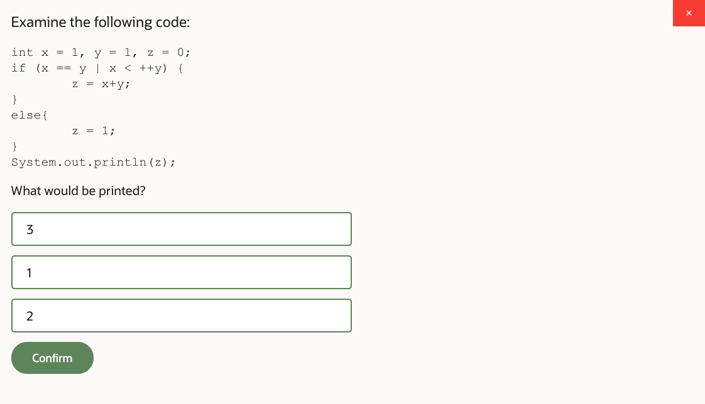
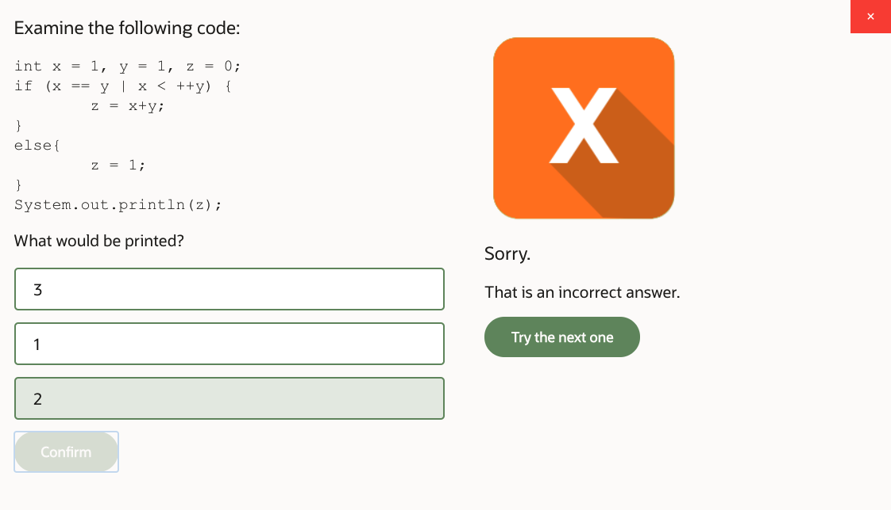
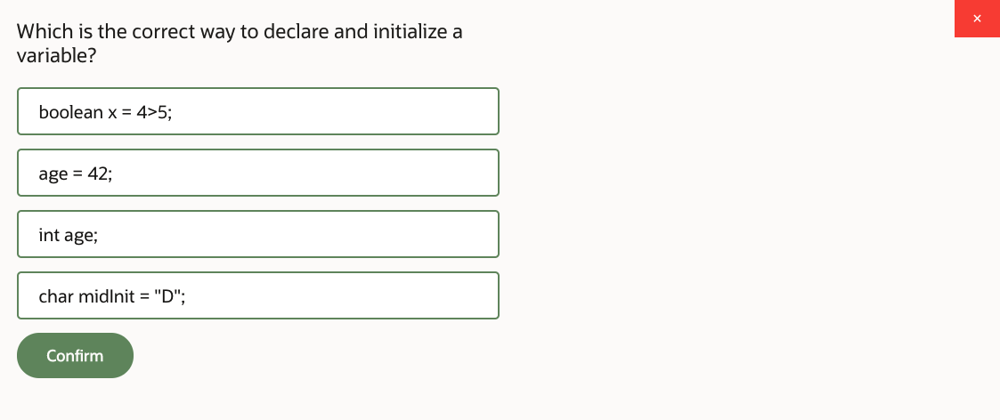
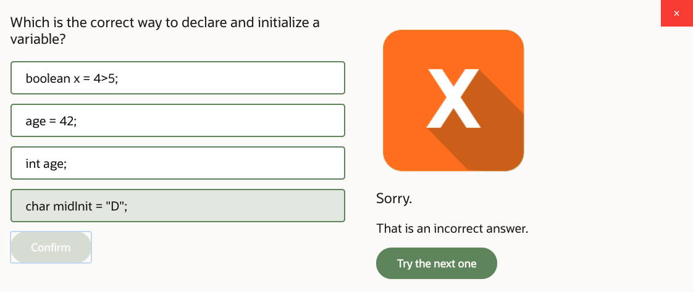
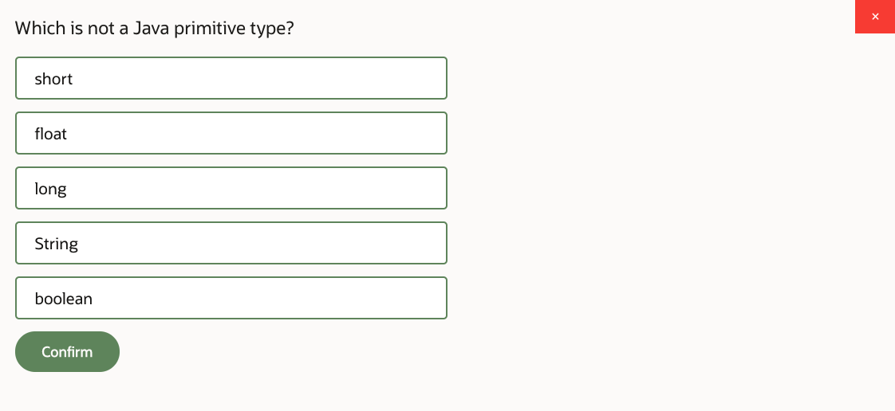
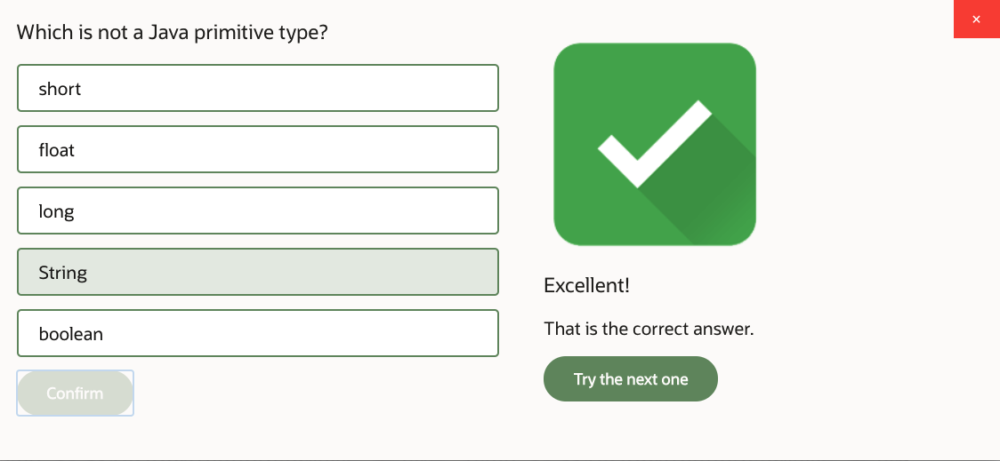
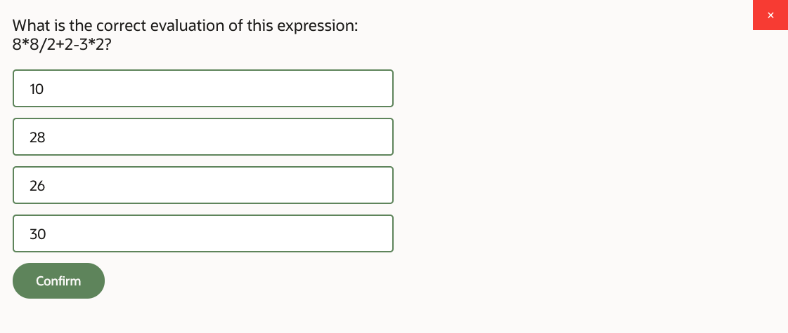
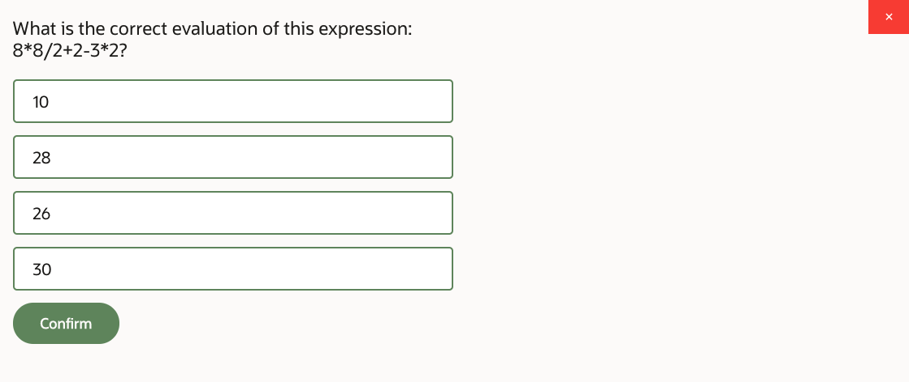
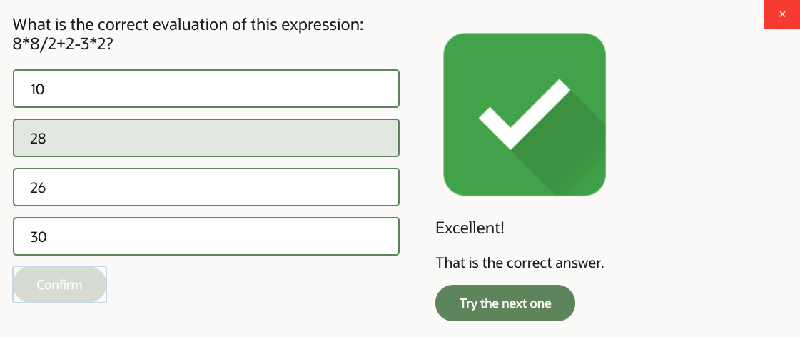
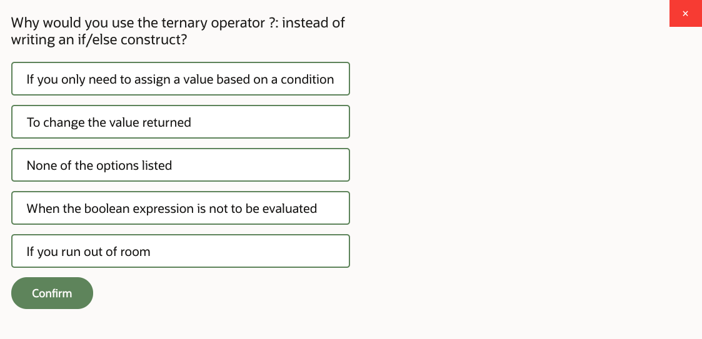
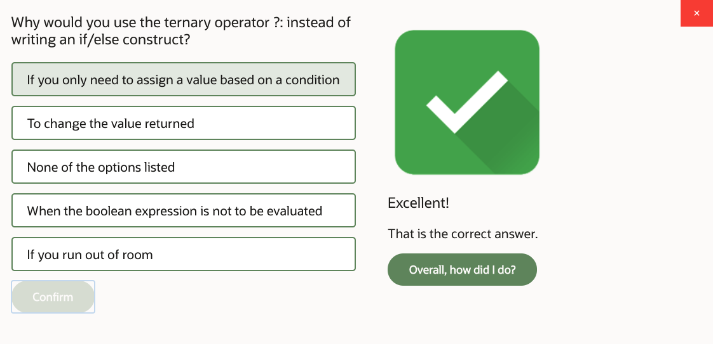
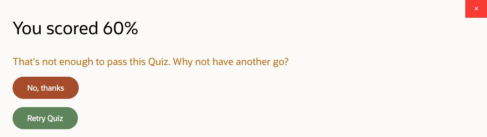
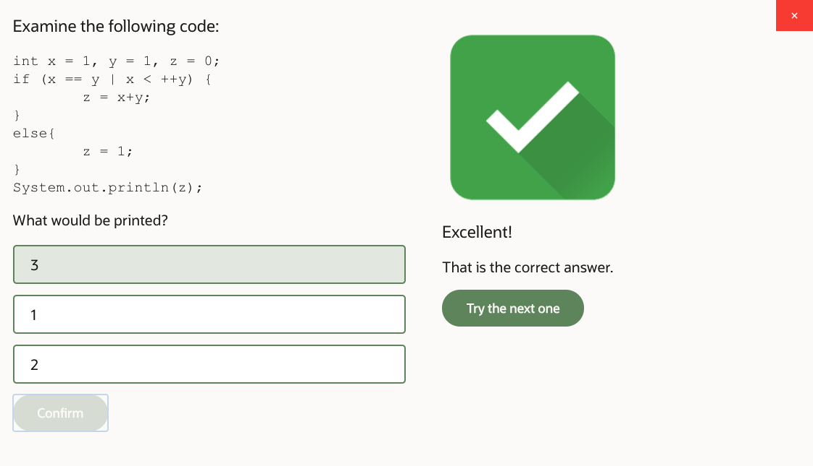
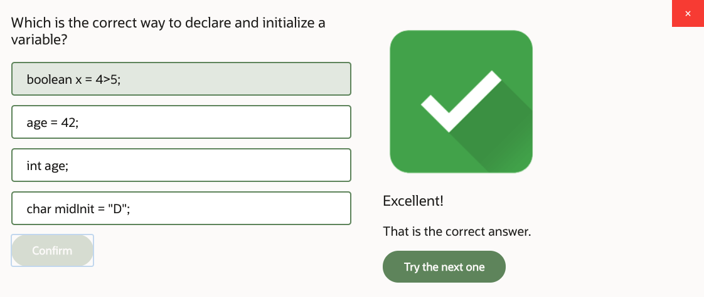
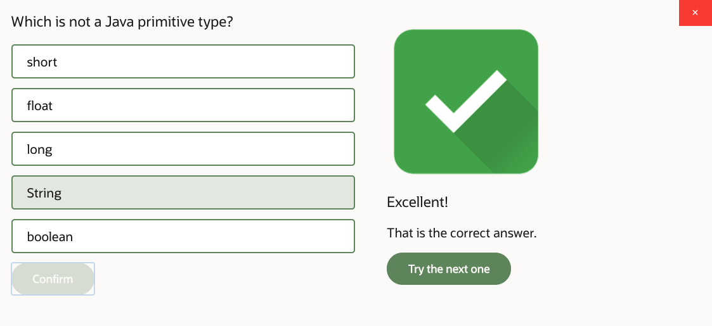
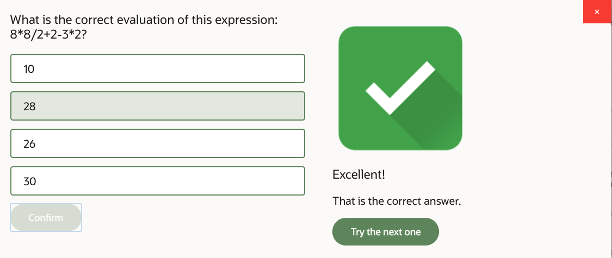

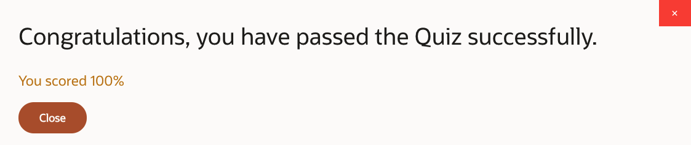
