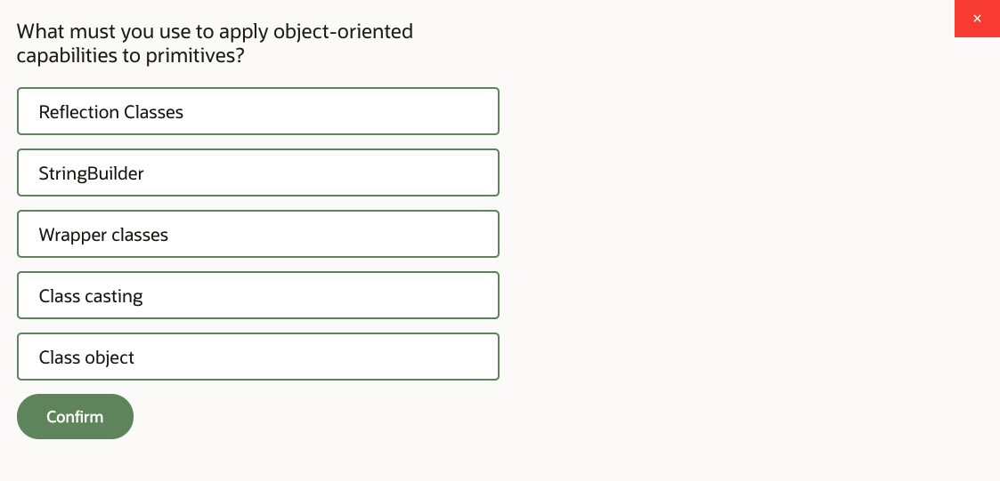
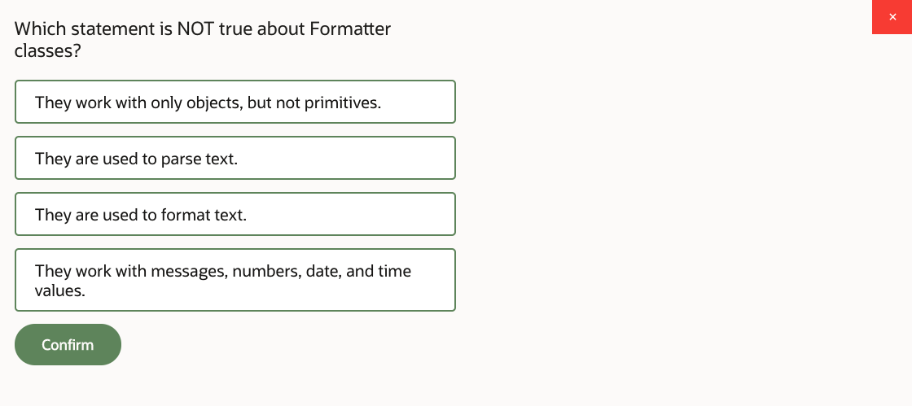
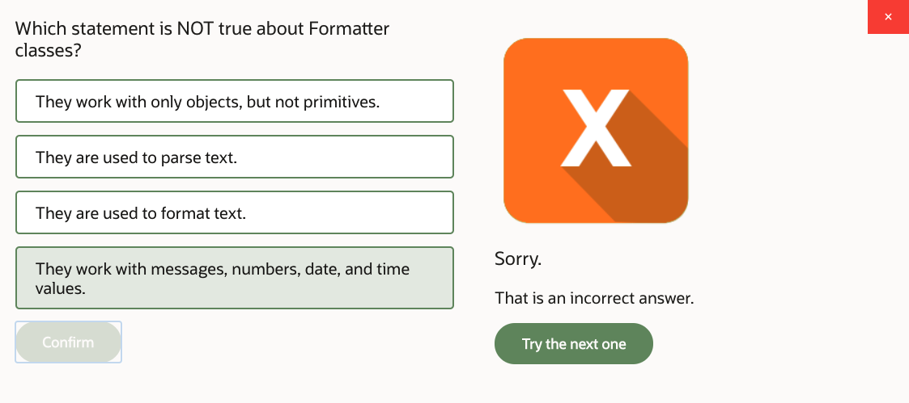
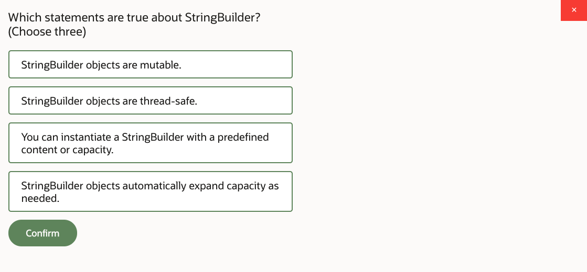
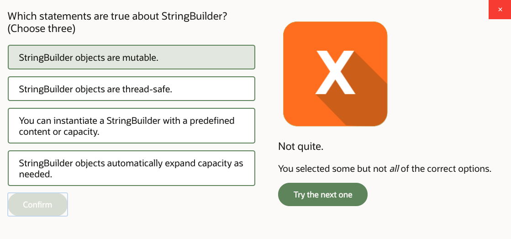
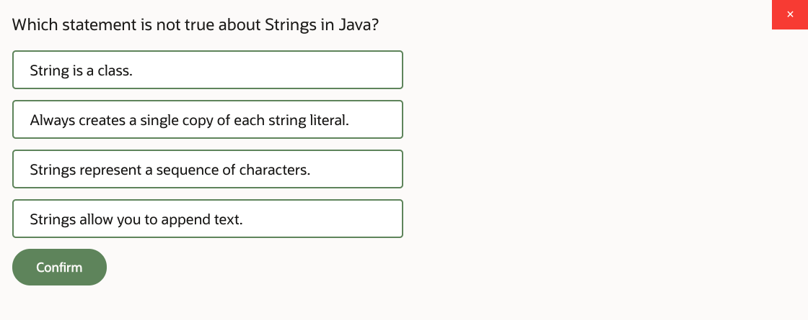
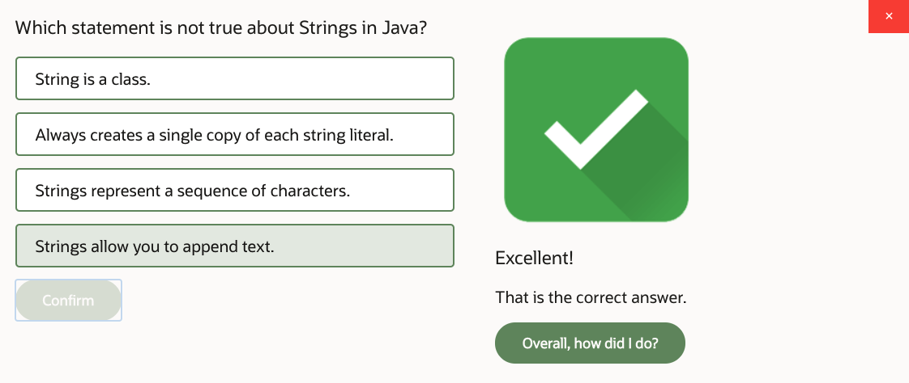
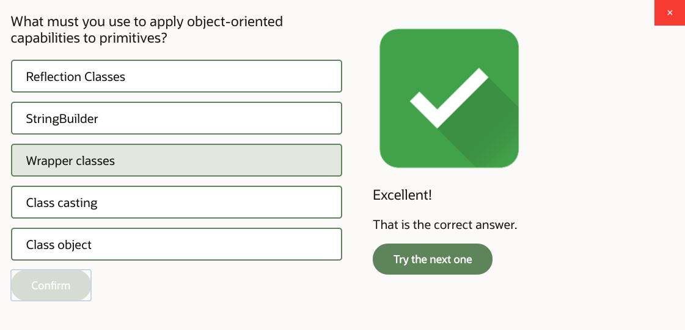
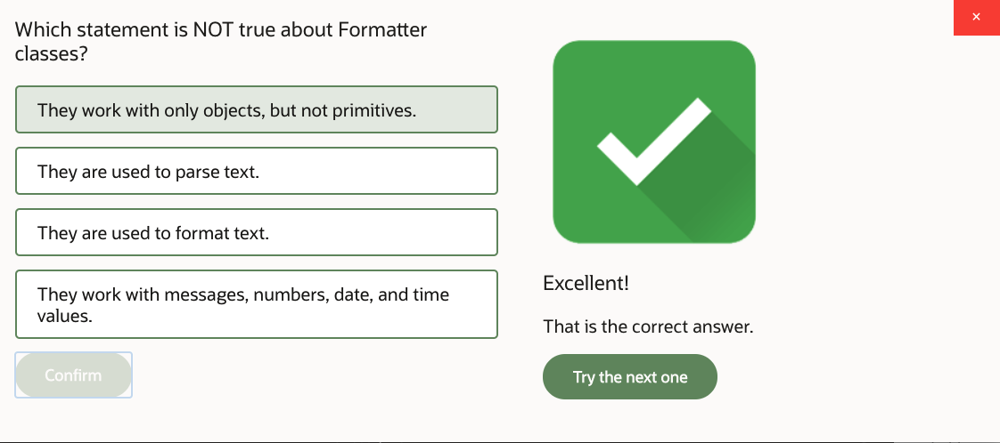

# 03: Text, Date, Time, and Numeric Objects

1. Text, Date, Time, and Numeric Objects, Part 1 22m
2. Text, Date, Time, and Numeric Objects, Part 2 19m
3. Text, Date, Time, and Numeric Objects, Part 3 New 19m
4. Practice 3-1: Explore String and StringBuilder Objects 15m
5. Practice 3-2: Use BigDecimal Class and Format Numeric Values 10m
6. Practice 3-3: Use and Format Date and Time Value 14m
7. Practice 3-4: Apply Localization and Format Messages 11m
8. Text, Date, Time, and Numeric Objects - Score 80% or higher to pass 

## 1. Text, Date, Time, and Numeric Objects, Part 1 22m

Let's take a look at how Java handles text, date, time, and numeric objects. In this particular lesson, we're examining how can we handle text values, not just individual chars, primitive chars, but actual text of multiple characters using classes such as String and StringBuilder. So we're studying the cases for using String and StringBuilder.

Then we're looking at different primitive wrapper classes. So for every primitive, like int, byte, short, whatever, we have a wrapper class that represents the primitive value as an actual object. So we look at that and why do we use primitives, and what's the point of that. And also, we look at a conversion between text and primitive types. When the user, for example, types in some text, and he wants to express it within Java as a number, or vice versa if you've got some number maybe, and you want to output it to the user as text.

We also look at an interesting class which is specifically designed to handle decimal math in Java. It's called BigDecimal. There's another one called BigInteger. But basically, as you're probably aware, the primitives are not necessarily decimal. So they handle numeric operations that could be binary octal, hex, whatever. But BigDecimal is a class that's specifically designed to cater for decimal math, and it may be handy for us to do that.

And also, we'll look at the ways in which we express date, time values. And finally, because we deal with the ways in which different numbers and dates are represented as text, then we need to think of localization, because the way you represent number as text depends on the language, and the country, and so with dates. So we have to consider formatting and localization topics.

And that should cover, really, all the basic types that you usually use in business programming-- text, numbers, and dates, right? This is kind of the core of any business logic of the application, I guess.

So first let's start with a String. String is a class that represents a sequence of characters-- not just one char as a char primitive, but a sequence of characters. It's a class. It's not a primitive.

Thus, it actually has more to it than simply holding a value like primitive state. So you could invoke various operations upon a String. It has different functions that you could utilize to handle the behaviors of the text.

Just like any other object, String can be instantiated using new operator. You can create an instance of String using new operator-- however, actually advise not to do it. String has a unique own way of being initialized by simply typing text enclosed in double quotes-- so that piece of text enclosed in double quotes. And it's actually a recommended approach.

And the reason why it's recommended approach-- well, it has to do with the way strings are allocated in Java memory. Apparently, Java virtual machine performs some optimization around String handling. And that is-- it's called String internment. And the idea is that Java virtual machine will try to maintain a single copy of a String literal and then use that single copy of a String literal from different places in a program.

There's a special area of memory called String Pool where these String literal constants are stored. And you may reference the same String literal from different places in a program. You don't need to recreate it over and over again.

So for example, if I, just say, double quotes word "Hello," that allocates that Hello text in that String Pool. If I later say String a equals, and I type the same text, actually it does not allocate memory for that text again. Instead, it simply references variable a to point to the same memory where the text has been placed earlier. So it reuses the same text over and over again.

So if you say b equals a, that will result in b referencing exact same memory as the a variable. c equals "Hello" again. They all point to the same memory chunk that contains that text.

You can use new operator with a String. For example, you can create a char array. We'll study arrays later, so never mind the syntax. But yeah, OK, you can create a char array. And then you can initialize String as using an array of characters.

Or you can use new operator or new String around the double-quoted text. Whichever way, that switches these two new operators, essentially switch off the internment. They will allocate new memory containing the text rather than reference previous memory that contain that text.

You can call intern operation, which will basically create a version of a String which is interned. So if you were using the intern operations, that basically means that the variables c and d are actually pointing to the same String object rather than to two different String objects, because they can share, right? It's the same text. It's the word "Hello," right?

And so you have to be kind of mindful about it. This is a memory optimization. If in two different places in a program you need exactly the same String literal, why allocating it twice? What's the point?

You may say, well, what if I'll try to modify it in some way? What if I try to change it. Well, that's kind of an interesting question, because apparently, as we'll find out from the next page, String objects can not be changed. They are immutable.

When you create a certain text, when you allocate that memory to contain that text, that String literal is never changed-- ever. Any attempt to modify it, every time you call some operation and you say, concatenate, substring, whatever, so any attempt to change it will basically result in the creation of another String. The original memory that contained the original String literal will not be affected in any way.

So that's why the String can actually be shared by different variables, because it's reliable. It's essentially immutable. It never changes. Any attempt to change it will just create a new one.

So operations such as, for example trim, concat, lowercase, uppercase, and so on, any operations on a String never modify the actual original they always create a new copy, which is modified text. But it will be an independent memory area with an independent value in it.

So trim, for example-- trim's a leading, trailing spaces. concat was a concatenation of two Strings. Actually, instead of concat, you could have used a plus sign. It works exactly the same-- no difference at all whatsoever. So you can say, a concat "World" or a plus "World"-- doesn't matter. They basically reference exact same case, where "HelloWorld" is concatenated together. They produce the same result.

You can reassign String references as much as you like. For example, in this case, String a, which equals "Hello," and there's some leading and trailing spaces, and then you trim. So obviously, you produce a new String, technically completely new String, which has no leading and trailing spaces. But then you can take that new String and assign it back to variable a.

So a now references the value of "Hello" with no spaces in front and behind. That did not destroy the original value that still is present in the String pool, the "Hello" with spaces. If nothing references that, eventually it will be gone, because it's eligible for garbage collection. But we'll talk about it later.

But the point is, the original value technically isn't really immediately gone. You just simply say now a references some other String. But the original String still stays in the String pool until it's cleaned up from memory at some later stage if nothing references that String anymore.

So you could perform conversions to lower, uppercase-- just basically producing a new String but in different case. There's some other functions like contains, for example. So you can check if a String d contains the letter W, you know, true or false? Well, in this case, false, because that's uppercase W. And obviously, after you convert it to lowercase, that's lowercase w.

Please note that the variable c still references the mixed case String. When you call c.toLowerCase, c is still referencing whatever it was referencing. It's the d String that's referencing the lowercase equivalent.

Could you reassign c here instead of declaring new variable d? Yeah, you could have. You could have done the same trick as was done here or when you trimmed a. You could have reassigned variable c, sure. But we declared another variable d in this case. It's entirely up to you.

With a plus sign, you can get into a little bit of trouble if you think about it, because in the expression, what if you're doing plus as arithmetic and as concatenation? Well, the order of evaluation is from left to right. So if you've got the plus sign here, 1 plus 1, that would be arithmetic, because 1 and 1 are numbers. So it will be evaluated as two and then concatenated with a String u, so that will be 2u, right?

And then if you do it the other way around, if the first plus here is concatenation, so that would produce u1. And then you would concatenate again with 1, so that would produce a u11. If you want it to be any other way, well, just use round brackets. Whatever is inside your braces will be evaluated first. Hence, you change the order of precedence within that expression. So these are the basics of String manipulation.

Now, String indexing-- if you want to access specific characters within a String, you can. But you need to know how they're indexed. The String index starts at 0. It's an integer index. And it basically says, the first letter is at position 0, second letter is position 1, et cetera.

You can find out how many letters you've got in a String in total by calling the method length. So that tells you the number of positions, basically, the number of characters. But remember, the last valid position is essentially length minus 1, because the counter started at 0, not at 1.

You can apply various operations to a String using these indexes. For example, substring, where you can designate the begin index and the end index. Please note that a substring operation, the begin index is inclusive to the result, and the end index is not inclusive to the result.

So for example, if you take the substring tea length, you don't end up with an invalid index, because length, remember, is plus 1 to the last valid position. So the substring does not take the last position. That's kind of the idea. So for example, in this case, from 0 to 5 I'm taking H-e-l-l-o, but I'm not taking the position 5. So substring from 0 to 5 results in the word hello without taking that W into the result.

You can find out the occurrence of certain characters within a String using indexOf operation. So for example, indexOf o-- we'll look for the first occurrence of o, which is the position 4. If you tell indexOf to start looking from a certain position, look for o starting at position 5, that will find the next occurrence of o, which is the position 6. So it returns you an integer position number.

There's reverse of indexOf, which is lastIndexOf. It's doing the same thing but starting at the end rather than beginning. So lastIndexOf l is 8, and an index of l is 2.

IndexOf a character that is not present within a String yields you the response of minus 1. Index starts from 0, so minus 1 clearly is an impossible index. So if you're looking for a letter A in "HelloWorld," well, there is no A in "HelloWorld," so you get minus 1 as an indicator of an absence of whatever you are looking for.

charAt a given position-- so char at position 0 yields you H, for example. A length, as I say, it's the total number of characters within a String. And what if you tried to do char at, say, for example position 10 in this case? Well, length is 10, but the last valid position is 9 and trying to get beyond the boundaries of that index, beyond 0, to length minus 1 will get you StringIndexOutOfBoundsException.

Basically, Java program will throw you an error. We'll talk about exception handling later. But for you to know, that's how you can easily produce one, by not checking the boundaries of a String and just sort of wandering in with an invalid index position.

Now, String, as you probably observed already, is convenient. It has some basic text manipulation operations, but it's immutable. So all of these different actions, like substring, for example, or trim, or lowercase, uppercase, they always produce a new String, which may not be very efficient if you need to handle a significant volume of text with lots of different manipulations.

If you need to manipulate, count, and add, and remove characters, and reposition stuff, and things like that, String will keep creating new String objects for you upon every attempt to update it, to change it in any way, because it's immutable. It's read-only. So instead, because it's not particularly optimal flooding your memory with all these String objects, you may consider that for complex text manipulation cases, you probably would like to use a class that is not immutable. And the example of that is StringBuilder.

A StringBuilder is basically mutable equivalent of String. It kind of behaves very similar to String. It has-- actually, lots of operations are exactly the same, but StringBuilder also gives you extra operations that String doesn't have, which actually modify the content. So operations on a StringBuilder don't produce new instances of StringBuilder. No, they modify that particular instance of StringBuilder.

StringBuilder can be initialized just as an empty StringBuilder object. If you do the empty initialization, if you don't parameterize how you initialize StringBuilder, by default it will create you a StringBuilder of 16 character capacity but actually will out increment as necessary. So it will add more capacity to its internal storage as required.

You may initialize the StringBuilder with specific capacity. Again, it will grow beyond that capacity if needed. The capacity is purely tuning things. So if you feel like you can predict the overall amount of text you need to put into it to prevent memory rescaling, you better tell it. But if you get it wrong, that's not a problem. It would not fail you in any way except performance-wise, probably.

And of course, you can initialize StringBuilder with some predefined text. You can put kind of initial text into it as a String.

So it has some methods that are exactly the same as in String class, like substring, indexOf, charAt. They kind of work the same. But then you also have methods that actually change content-- append, insert, delete, reverse. They're not available on String. They're kind of unique StringBuilder behaviors, because they update the contents within that builder.

So here's an example. We allocate a new StringBuilder object, and then we append the word tea to it. So initially, it was kind of empty. There was no characters, per se, in it. But then you add word tea, and then you add append s. That goes at the end. So we got teas. Then we've got insert-- oh, that's interesting-- position number, position 3. And then you insert-- what do you want to insert?-- m.

So what will happen is the position 3 will slot in the m character. And any other characters beyond that will be pushed forward in that StringBuilder. So kind of insert in the middle, and we push whatever after it forward. You could delete a range of characters, for example. So remove positions from 2 to 4.

Please note, just like with the substring, the lower bound is inclusive to the result. The upper bound is not inclusive to the result. So delete from position 2 position 4. We'll delete positions 2 and 3. So that's the letter a and m. So instead of the word teams, you end up with a word tes.

Reverse basically spells whatever is in a StringBuilder backwards. So you get set instead. You could check the length. That's actually the amount of characters you have in StringBuilder. And then you also could check capacity. Capacity is how many characters can you put in before the rescaling will be required. But rescaling happens automatically if necessary.

Also, what you can do, of course, you can insert spaces. But you cannot jump positions. So if you've got-- the last valid position is 2, so that's the letter t. If you're trying to do the insert at position 4, then it seems like you just jumped position 3. You can insert space at position 3. That's perfectly fine. You can do that.

But you cannot just not do anything with it and immediately try to jump beyond-- keep the position and go to position 4. That will result in StringIndexOutOfBoundsException. So StringBuilder insists on you filling something into these positions without jumping the index.

So there you go. It's basically pretty much like String. But if you need to handle large amount of text with complex manipulations, maybe StringBuilder would be preferred way of doing it. For input-output, I'd probably say String is more convenient if you accept user input. It's just text, whatever user typed.

If you want to output something to the user, again, String. It's just text-- whatever you want to output. But internally, within a program, sometimes when you get to complex, large chunks of text, you may decide oh, maybe is String is not particularly efficient. Let's switch to StringBuilder instead. So it's perfectly up to you.

## 2. Text, Date, Time, and Numeric Objects, Part 2 19m

Now primitives. Primitives, remember-- but, short, int, long, flow, double, char, boolean-- they apparently have equivalent classes that represent them. So for every primitive, there's an equivalent kind of object-oriented way of present in that primitive value. So these are wrapper classes.

They're usually call the same as a primitive, except primitives are old keywords of the Java language. So they're all lowercase. Remember, all Java keywords a lowercase. But wrapper classes, they might be called the same as primitive, but they are mixed case, so capital-- you need capital on the first letter.

There are couple of exceptions from this rule. Int is represented as a wrapper class integer, and char is represented as a wrapper class character. Otherwise, the names are equivalent.

What primitives don't have? Why would you want to use wrapper classes? Primitives don't have operations. You can apply operators to them, but they don't have operations. That don't have methods. They're just simple values. That's it. They don't have behaviors beyond what the value they have.

Wrapper classes do. So they give you actually some operations. For example, you may take the value of primitive or text, and using the valueOf method produce an actual instance of wrapper, or the other way around maybe. Maybe if you have a wrapper object, then you can extract a primitive out of it. That would be some value method, like int value, double value, well, depending on the type that you want to get.

You don't actually have to do the formal conversion between the wrapper and a primitive. You can just do the direct assignment instead that's called auto-box and auto-unboxing. So for example, a more formal approach is to say, I've got an int a is 42, and I, using the valueOf method, convert it to an integer. And if I want to convert it back, like that integer b I want to convert to primitive c, then I just call the method int value.

But in fact, you could just do the direct assignments and assign wrapper to a primitive or primitive to wrapper, and the conversion between the wrapper presentation and primitive presentation will just happen for you automatically. That's the automatic box and unboxing.

You can also use these operations to interpret strings as primitives or objects. For example, in this case, I've got a string d, and that represents some text, but I want to convert it to float number maybe. And I could use valueOf method. That creates me a float wrapper.

Well, actually, I could use parsefloat. That creates me a primitive. Or frankly, I could just call float.valueOf and assign directly to primitive anyway because automatic box and unboxing will do the conversion for me. So that helps me to take text and presented as a primitive.

And the other way around, if you have a primitive of some kind, then the string class has a method valueOf, and that basically converts whatever parameters you need to text. Also, each and every wrapper comes with some constants such as min and max value. They actually indicate the boundaries of that primitive type, correspondent primitive type, values. So what is a possible minimum and maximum value, which could be quite useful.

In addition to these wrapper classes, we have more specialized versions of-- ways of representing numbers in Java, classes BigDecimal and BigInteger. The BigDecimal and BigInteger, the interesting thing about them, like BigDecimal, for example, is that actually treats the number as decimal, specifically. Unlike basic primitives that does not necessarily imply that you're using decimal math, BigDecimal does imply you're using decimal math and allows you to create numbers with arbitrary precision.

When you perform mathematics using float or double, the precision is 32- or 64-bit. But when you deal with BigDecimal, you can tell it what you want to be, what you want precision to be. So it can be arbitrary. You can just decide what you want it to be.

And you could convert the precision and handle the number of digits after dot by simply using operations such as scale or round. And you could say, well, in this particular case, you know the number is decimal, so you can say set scale two digits after the dot. And you can even tell it was the rounding algorithm should be. For example, RoundingMode HALF_UP, which is kind of the usual way you'd probably do the rounding. But you could do HALF_DOWN if you like. It's up to you.

And of course, you now deal here with an object rather than a primitive. So instead of operators, you use operations. So instead of this add, subtract, divide symbols, operators, you can use methods, so one number, add another number. That's the idea. You call a method to do it, multiply, et cetera.

Now, I'll guess if you need to represent values in your application, such as, for example, fiscal values, you know that they're decimal. So it kind of makes sense that your fiscal math is decimal 10 based, and surely it will be more convenient to use big decimal than use primitives and then take care about all decimal conversions.

Now, there was one thing that you probably already noticed happening in this chapter, and that was something we did with strings, that was something we did with BigDecimals, and you see it all over the place in Java. This is called method chaining.

Now, if you invoke an operation upon an object, so this is the string, and you call the method concat. What does the method concat return? It returns another string. You concatenate one string to another. You produce another string. So the return type of concat is text string.

Can you call concat upon the string? Yes, sure. So you can call concat again. Actually, you may call any operation upon the results. So if I invoke a method, invoke an operation, and that operation results in another object, I can just keep calling next method and next method and the next method, so long as the method I invoke actually results in another object. And this is a good approach. This is a good way of doing things.

So I have this string "hello," and there's several things I want to do then. I want to concat it with world, I want to take a substrate. And I don't need to create intermediate variables to store these intermediate strings. I can just call dot and call next month, dot next method until I get a result that I desire.

With BigDecimal, exact same story. So I got a couple of BigDecimal variables. I guess I can call operation multiplying, take price, multiply the tax rate, and that will be my new BigDecimal tax. Sure, I can do that.

But actually, I don't have to do that. I could do this multiplication and say, for example, subsequent addition all within the same line of code. I don't need to create an intermediate variables. I could just say, price, multiple tax rate, wrap that up, this piece of code. Instead of this variable text, just put it inside a method add. And then say price.add that, and then call the .setScale.

Alternatively, for example, for the sake of argument, let's assume that I'm not doing this wrapping up and not doing the chain notation. Then I could say price.add(tax), calculate the tax price variable. Declare that, and then tax price call setScale. Sure, I could take it one step at a time and create intermediate variables.

But then if you don't want to use that tax price variable on its own, if the only thing you interested in is actual result produced by setScale, then you might as well just write it all in one line, add the tax and setScale. Its exact same principles you've seen earlier with concat and substring.

You can pile up these method calls, these expressions, onto the same line using the principle of call a method, it returns you something. If that something is another object, just call another method, and do it until you get the result you want to produce. So that's a very commonly used coding technique in Java, and you're kind of discouraged from creating too many intermediate variables.

If you need them, sure, if you want to use that variable on its own somewhere, yeah. There's nothing wrong with creating them. But if you only care about the result of the overall expression, don't create intermediate variables. You don't have to.

Now, the next type we're discussing in this lesson-- we talked about strings, we talked about tax, we talked about number presentation, and then we'll talk about dates and times. So there is an API comprised of classes LocalDate, LocalTime, LocalDateTime. They're all allocated in Java.time package.

Now, a few words about this API. It's a relatively new API. It was first introduced in Java SE 8. So in the history of Java, that's relatively recent, I guess.

Prior to that point, there was another class you were using for representing dates and times, and it was java.util.date. But it had certain limitations. And I guess I don't want to go too much in detail about it. You could still actually use java.util.date. It hasn't been discontinued into anything.

But let me put it this way. LocalDate, LocalTime, and LocalDateTime are more convenient than date most the time. Date kind of represents the time stamp, but LocalDate, LocalTime, and LocalDateTime, they can represent time and date in more kind of specific way. As for example, LocalTime, you can represent a time without the date, just some time. LocalDate, you can represent date but without the time, and LocalDateTime you could combine both.

The way of creating LocalDate and LocalDateTime objects by either using method now, which basically gives your current date and time, or just current date or just current time, depending on what you call it upon. You can also use methods of that allow you to construct specific point in time or specific date. So here, for example, I'm constructing some 1st of April, or I'm constructing a particular time. I could use like hours minutes, seconds, and nanoseconds. But if I'm not bothered, I could just do, for example, hours and minutes, and don't do the rest of it.

And I could do both, local date and time, and combined date and time together. And also if I have previously initialized date or time objects, then I could, for example, take the date object, LocalDate, and just add time to it-- atTime parse a previously constructed time object as an argument.

So I can also extract, for example, I can extract local date out of LocalDateTime, particular portion. It can extract time, you can extract date. So these are convenient ways of representing dates and times.

Now, there are certain operations you can apply to these dates and times, such as plus, minus, with. They all allow you to produce a new date or time object based on previous date and time.

Notice this chained notation. So for example, I have a current date, which is now, and I'm saying, change the minute to 14. It doesn't matter what the current minute is. Just forget it. It will be 14. Or with day of month, doesn't matter what date is it today, just set it to be 3rd of whatever month. And then say, and add 12 hours to that, plus 12 hours. So you have these plus, minus, and with methods that allow you to manipulate with date and time values.

However, just like with a class String, just like with a class BigDecimal, LocalDate, LocalTime, LocalDateTime are immutable. They all are immutable. So every time you're applying a method that you think modifies the value, actually, you're not modifying the value. You're just creating a new LocalDate, LocalTime, LocalDateTime, new String, new BigDecimal object.

In fact, so far, the only mutable object you've seen in this entire lesson was StringBuilder. So all others are immutable. Every time you try to change their values, they just produce you another value. The original stays the same. And surely, you can pile up this modification in a fluent notation.

You can extract parts of values, for example, get me just the year or get me the day of the week or something like that, day of the month, get seconds, hours. And there are also some convenient methods, like isBefore, isAfter, that allow you to judge whenever a certain date is early or late, or a certain time is early or later than another date and time.

In addition to LocalDate, LocalTime, and LocalDateTime classes, you also have classes that expresses the amount of time. They are Duration and Period, and also have an class that expresses a timestamp, which is Instant. Instant is actually kind of logically quite close to the old API java.util.date, which was essentially also a timestamp.

So duration can express the amount of time in nanoseconds, and period can express the amount of time in units such as days or years. Consider this, a distance between two points in time. If you are saying that I want to add or subtract a day, that may be not exactly same as adding or subtracting 24 hours if you're considering things like daylight saving time, you're crossing from daylight saving time, summertime, to wintertime, or vice versa, and then your day's not necessarily 24 hours long. You may have 23 free or 25 hour days in these situations.

So the duration will consider just the amount of nanoseconds. It doesn't care about your calendar, where you are on the calendar, is it the daylight saving time or what. Period does. Period takes a consideration of the amount with respect to the actual time units we operate on.

Just like LocalDateTime API, Duration, Period, and Instant are immutable. The old java.util.date class was not immutable. It was mutable, so you could have modified the value there. But with this, every time you apply any modification, just creates you a new value.

To construct instances of duration, period, and instance, you can use method now, methods of, plus, minus, so all of these kind of similar operations. So here's some examples. Instant now gives you current timestamp. Get me nanoseconds elapsed from the last second.

What else have we got? What's the distance between couple of different dates? That's a period. We calculate that. And then duration, where you can express duration of two hours.

And then you can actually subtract or add or manipulate with that and get the duration expressed in any units you like. For example, in this particular case, I'm saying, well, I want to find out how many seconds I'll have, if I have a duration of 2 hours minus 15 minutes. So that performs the calculation, returns the value. Out of period, you can express the period as amount of days or amount of months or whatever time units you need.

## 3. Text, Date, Time, and Numeric Objects, Part 3 New 19m

You can tie your LocalDateTime objects to time zones. And that is done with a class called ZonedDateTime. To do that, you first need to find out which time zone you need to use. And that's done with ZoneId.

ZoneId can be specified in different ways. You can use ZoneId's as UTC offsets. You can use ZoneId's as GMT offset.

You can do the ZoneId's by name. You can do the ZoneId's by region and city, whichever way. So you can identify the zone in whichever way you feel convenient.

So in this particular case, I'm identifying a couple of time zones, one in London, one in LA, California. And then I'm setting up here a LocalDateTime object on a certain date and time. And then I'm saying, what would be the ZonedDateTime for that if I consider that this local date and time is associated with London? So get LocalDateTime, and then saying, OK, let it be local in London.

And then here's an interesting method, withZoneSameInstant. This method answers me the question, what time and date would that particular time in London-- which is what I've just constructed-- what that would be in LA? So it calculates that and actually takes into the account things like calendars, daylight saving times, international time/date boundaries, and all that. So it calculates that for you. Pretty straightforward.

Now, the last topic in this lesson will be dedicated to the question of localization. And the reason why we need to talk about that is because we've already mentioned that we need to be able to convert between, say, numbers, and strings, and dates. And often, these text-to-number, text-to-date, or vice versa conversions require you to consider differences in locales and the fact that different languages in different countries present dates and numbers as text in different ways.

By default-- when you deal, for example, with LocalDateTime or ZonedDateTime-- by default, Java will assume that you use an ISO calendar and ISO date representation, which is year, month, date, hours, minutes, seconds. But if you want more specific, country-specific or language-specific representation for a date or a number, well, you could do that. But you have to specify which country, language, whatever you would like to use. And for that, you use the class Locale.

Locale could be initialized with just language-- so "fr" for French. It could be initialized with the country and language-- "en," "GB," or "en," "US." You can also have custom variants, like I have some customization I'd like to apply to standard localization.

You can also use designated codes for territories. So sometimes, you deal with a region. Like Caribbean, for example, isn't exactly a country but rather a region. So if you want to say French Caribbean, then that's how you do it. You qualify the region

There's another way of creating instances of Locale. Oh, yeah, you can get current machine default. It's as simple as that, just getDefault.

But there's another one. It's called forLanguageTag-- Locale.forLanguageTag. And it allows you to specify language, country. But then it allows you to go nitty-gritty with that locale. You could say, I would like a Buddhist calendar. I would like to use Thai-- the TH is for Thailand-- Thai in representation of numbers, which is not exactly the same as European.

So you have to sometimes consider these localizations, they might be important. Maybe your users are using different ways of presenting numbers. Maybe you're using a different calendar. So to handle correctly that input and output interactions with the users, you may have to qualify that level of detail.

OK, so Locale represents whatever country and language you need. Now, how do you use the Locale? Well, let's assume the following scenario.

Let's imagine I've got some numbers, and dates, and whatever I need. So first, this page looks at numbers. There will be later page looking at dates.

The numbers here are represented using BigDecimal, using Double class-- that's a wrapper class-- and using an int, which is a primitive. Why these three? Just to show you that the approach that you apply to wrappers, primitives, and BigDecimals is exactly the same. That's the only reason why we have three variables, just to demonstrate that's exact same approach. But also we'll do different formattings on them, just supply different format.

So we then initialize the Locale-- in this case, en-GB, that's British English. And then we create, use a NumberFormat class-- java.text.NumberFormat-- use a NumberFormat. We create instances of currency, percentage, and general number representation.

So that answers the question, what is the format for British English for currency? What's the format for percentage? What's the format for general number?

And then using these formatters, you call the method format. And you pass whatever-- BigDecimals, wrappers, primitives, whatever you need-- you pass as an argument to the format method. And that gets your string result formatted according to that country and language locale, whatever you need it to do.

The other way around, the opposite direction of conversion is when you need to convert some text values into numeric values. In this example, suppose user enters some text, like pound symbol 1.7. So that's some kind of British currency amount. So the user typed that, and then you need to present it, let's say, as BigDecimal. So what do you do?

Well, first, you call parse method. parse method accepts the string and returns you a Number object. There is actually a class called Number, which is the parent class of BigDecimal and all the numeric wrappers. We'll study the class hierarchy later in this course.

For now, basically, what you need to understand is, you need to convert that number to whichever specific type you'd like it to be presented as. Do you want it to be presented as BigDecimal, or as Double, or maybe some kind of primitive-- whatever you like. So when you call the parse method, first you get this general representation of the number. And then you're deciding what specific way of representing in your program that number you want to achieve.

First example here returns the value eventually as BigDecimal. The second example parses percentage and returns it as a Double. And the last one represents the value as just a simple int.

With date and time parsing and formatting, you get very similar approach. Use java.time.format.DateTimeFormatter class, which allows you to construct the formatting pattern either using a style which is default style for a certain locale or a specific pattern that you want to construct. In this particular case, we've got some LocalDate object.

We initialize the Locale as British English. And we create a format object, which will be of a certain pattern. And this pattern takes the day of the week, the day of the month, the month name, and then the year, and formatted according to the British English locale.

So you take date.format. And the method is called format. And I just called that variable format as well. But you can call it whatever you like.

The other way around, you could do the parsing. So the user types some text. And then you can parse it as the local date with that format object in mind.

Now, you can switch the locale. You can reinitialize the Locale to something else. So in this particular case, ru, that's for Russian. And we use the same DateTimeFormatter.

But this time, we are reinitializing that DateTimeFormatter to use the FormatStyle.MEDIUM. We are not qualifying specific format mask. Instead, we're saying whatever is the default medium format for that particular locale. So it could be short, medium, full-- so different styles in which the date or time is represented in a given locale.

And again, we're calling the format operation here. And that is the result on this occasion. So we're parsing and we're formatting using different locales

OK, well, then we need to decide what do we do with all other localizable resources. Because we have to deal not just with dates, times, and numbers, but with any other text that we may show to the user or accept from the user. So all these different text values, they might have to be translated into different languages and handled differently depending on the locale that the user prefers to use.

To do that, we can produce resource bundles. Resource bundles could be produced as just plain text files, .property files. Actually, you can create them as classes as well. There are some examples you could find in notes. But generally, it's just a property file with name-value, key-value pairs, key-value storage.

So here's some examples of these property files. Let's say, for example, we created a file called messages. So I'm going to call it messages.properties.

And then we can create copies of that file per locale that we'd like to use. So we could be specific to particular countries, languages, whatever. And in each one of these copies, we have same keys but basically different values. So we translate values to different languages.

The default bundle, the one with no country and language in it, doesn't have to be English. It's entirely up to you. In this particular case, it actually happens to be Japanese.

So we've got a few different resource bundles. Now, what's in a bundle is key-value pairs, as you can see. But values can have these substitution positions. So apparently, you can treat them as kind of text patterns, into which you can then substitute real values from your program.

Now, how do you get a bundle? So first of all, you create this messages file. And imagine you've put it in a folder, which is one of your Java packages. So suppose resources is some kind of package.

So then you create a Locale object. And then you say, I'd like to get my bundle. And you use the folder which is the package name.

And then you use the file name-- but no .property, just that-- and which locale would you like to use. That gets you an appropriate bundle. And then you can get values from the bundle using the getString method, specifying different keys. So it gets you this "hello" and then gets you the "other."

Notice that a certain key-value pair may not be present in all the bundles. So that means when you're trying to load, say, for example, en-GB bundle, and there is no key "other" there, then it will be picked up from default bundle. So watch out for that. You can get strange mixes of locales that way. OK, so that's how you load the bundle.

Now, what do you do with these texts once you get them? So there's these patterns that we retrieved from the bundle that may contain just text or may contain text with some substitution characters-- substitution positions. Well, you can substitute values.

So how do you do that? That's done with the MessageFormat class. So the idea is that if I retrieve from the bundle the message like this-- there is a key product. There's a message, which is some kind of-- I guess it's an information about a product-- name, price, quantity, best before, with these substitution positions. So I get that from the bundle.

Assume you already formatted all the prices, and quantities, and dates, just like you've seen on earlier pages. Assume that's done. You've got formatted text. That's fine.

Now, what do you do? You get that key from the bundle, get that pattern. So the key product yields you that pattern, that's that string.

And then you use the method format, and you say you want to use that pattern. And then simply enlist all values you want to put inside that pattern in the same order as these positions. So name goes on position 0, price goes on position 1, quantity goes on position 2, best before goes on position 3. And that's the formatted result-- well, assuming you previously formatted all the dates and numbers.

To summarize this chunk of the lesson, we have this page. This is just a summary, basically. This page tells us that if you want to do correct localization of the application, you consider creating resource bundles, translating them to whatever languages you need.

And actually, if you don't want to do the localization, it's worth creating resource bundle, default bundle anyway because it then would pick up values you need from the bundle rather than hard-code them into the program. If you need to change a prompt somewhere, you don't want to recompile your Java classes every time. You can just fix the text in a bundle. That's much easier than going about a source code and messing about it every time.

So anyway, you create a bundle. You translate it to other languages if you want, or just default bundle. Imagine you have certain values, like maybe some numbers, and dates, and pieces of text. So you initialize the Locale, you get the bundle.

Then you do all the format initializations. So in this particular case, I qualify that I would like to use certain date pattern, I would like to use certain locales for currencies and number instances. Then I do all the formattings.

With the date format, actually, there are two ways of doing that. You can say you would like to use DateFormatter class, and call method format, and pass date as an argument. Or the other way around-- you can take date, and call method format, and pass DateFormatter as an argument. It's entirely up to you. There is no difference whatsoever, just two different styles of achieving exactly the same result.

And then we get the message from the bundle. And then we substitute into that message pattern whatever values we've previously formatted. There you go. So that's the formatted result. This is just a summary of what you've seen on this segment of the lesson, which, basically, summarizes all this text-to-number, -to-date, and vice versa conversions.

OK, so that is it for this lesson. We started by just discussing how text is represented in Java. And it's either as immutable String or mutable StringBuilder for more complex text manipulations. Then we looked at all sorts of primitive wrappers, the way we can bring in object-oriented behaviors to primitives. So we can operate on them with methods.

And we then looked at BigDecimal class, which is designed specifically for decimal math, which is jolly useful if you want to represent things like fiscal values, which are presumably decimal. And it could use arbitrary precision, which is also very useful. And then you could represent dates, and times, and periods, and durations, and instance, and manipulate with these, and even go as advanced as time zones.

And then eventually, we've just discussed how do we perform correct handling of text-to-number, -date, and vice versa conversions with respect to different locales. And also, whilst we're at it, we were saying, well, if you're localizing the application, you need resource bundles. And actually, it's a good practice to put resource bundles anyway and not to hard-code text of the program as such.

So practical exercise for this lesson continues to manipulate with these values using JShell. So you're manipulating with some text. And you're using a StringBuilder. And you also manipulate with numbers, dates, and times. And you apply localization and do some formatting of values as well.

## 4. Practice 3-1: Explore String and StringBuilder Objects 15m

Well, let's take a look at the next lesson practice, practice for lesson 3, text, date, time, and numeric objects. That's what we're discovering here. We're manipulating with this. Again, we're using JShell to manipulate with text, numeric, date, and time objects, but we'll also play with localization and value formatting.

Let's start by exploring Strings and StringBuilders. Our job in this practice, declare, initialize, process some string data, exploring Strings and StringBuilders.

The assumptions are that JDK is already installed. If you haven't opened the terminal window, open it. You may use the terminal window from the early exercise. That's perfectly fine. However, if you're doing that, make sure that you changed to folder practice 3. If you want to use the full path, that will be Home, Oracle, Labs, Practice 3. But if you're in previous folder, you can just double dot and one folder up, and then from there go Practice 3 folder.

Again, there is a solution provided, and there's also file here, messages.properties, in this folder. And we'll find out why we need that in a moment.

First, let's start JShell, and let's continue. So we started JShell. And we start by declaring very simple string that contains the word tea. That's my string tea, and JShell obviously echoes that back.

Let's create another string, and that other string-- what a coincidence-- is also tea. Now, can we assign one to the other or test if they're the same? Sure we can.

Let's do the test. tea.txt, and then compare that to variable b. And let's find out. Well, it says true. Why is that? Technically, they're two different objects. But due to the string internment, they will be interpreted as the same object. String is interned.

So now, if I'll create String c, and I'll saying new String tea, which is definitely not recommended way of creating strings. But anyway, we'll do that. And then we'll try to do the same comparison. Actually, you can just press arrow up and arrow up again, and just replace b with c.

So same comparison, tea.txt, is it the same as c? And the answer is false. It was the same as b, but not the same as c. And that's because, you essentially, with the constructor of new String, turn the internment off.

So can you intern the string? Well, yes, but when you call the method in turn, you're actually creating a different string. So in other words, if we can compare tea.txt c, it will still say false.

What I need to do is a sign that in turn string somewhere because, well, string d. c.intern. Now the string c remains separate, but a string d is now interned, and therefore it's the same object as the tea.txt or b, which were created without the new constructor. So there you go. That is true, which kind of makes sense.

The string c remains uninterned. When he called the method intern, you're just creating a replica of string c that is interned, an interned copy, which is basically same as the tea.txt and same as string b. So we've explored that possibility.

Now let's take-- that's just to echo what you were supposed to type and what is reaction in JShell. Now let's take a closer look at some operations we can apply to strings. This time we'll use Strings to concatenate text values and play with substrings, et cetera.

First, let's concatenate tea.txt object with a space represented by char primitive, and then assign as well object b to that. So we need to combine tea.txt, space, and b, and assign a result to c. I know that c previously was referencing that other string, but we're going to reassign it. tea.txt plus space-- that's just a char primitive, single characters-- plus b. So tea space tea is the results, which now variable c references.

Now let's find out if there is a letter capital T there. But we want to find out, obviously, if there is a letter T, but what we want to find out is a position of a second letter T. Now, the first letter T is first position, so that's position 0. Index of T should return as 0 if you just do that because that's the first letter T.

But if you start looking from position 1 onwards, that would look for the next occurrence of capital T in that text. So that would be position 4. First T is 0, then E is 1, A is 2, space is 3, and indeed, the next T is position 4. Count, you'll remember, starts from 0.

You can also find it out if you look the other way around, last index of T. Well, there are only two letters T here, so it's pretty straightforward. Lust index of T, and this time we're looking backwards from the end towards the beginning of a string.

So next one, find the last character in a string c. So which character is the last character? And the logic of the statement is that you take in length minus 1 position. Well, in char at will return you which character that is, but the position needs to be calculated as length minus 1 because, remember, the first character is at position 0. So it's zero-based indexing.

If you just do c length, that would be 7. But the last valid position is 6. That's why we're doing minus 1.

Let's now convert c to the upper case. If you just do this, c.toUppercase, the actual string c, remember, will not change. This is some other string. Scientist's crutch variable, dollar 16. You could find out that dollar, 16. That equals that. That's an uppercase one.

But if you just echo the value of c, that's still mixed case. That's still not uppercase because, remember, all the string operations, they don't actually modify the string String is immutable. So if you want to see the change, you really have to apply the result of that operation to assign it to some variable.

And if you wanted to feel like you just updated string c, then just recursively assign it to the same variable. It will feel like you just changed the string c, although actually, you just produced a new one and simply assigned a new text to variable c and sort of forgot about the old value that c was referencing before that.

The next thing you're asked to do is to extract a portion of text from string c, starting from the last occurrence of character T plus one more character, so last occurrence of T plus one more character. The result should be two characters in total. So we know how to find the last occurrence of T. We can use last index of T.

And then what would need to do is take that as our start position of a substring, last index of T. And then the next position in a substring will be plus 2 because we want to take two characters. Shall we try that?

So let's run this command. And indeed, the result is TE. Now, if you calculate the positions, you'll find out that upper bound index is actually not inclusive to the result. So T plus 2 will give us-- remember, T, last index of T, was position 4. We've already calculated that. But we could calculate it again, position 4.

So 4 plus 2 is 6, and that is the position of letter A, isn't it? But the upper bound of a substring is not inclusive to the results. So when you're doing this substring from essentially what we just calculated, position 2 to position 6, last index of T, last index of T plus 2. That would give us this TE.

Oh, last index of 4, sorry. I'm just I'm not really watching what I'm doing. Last index of T is 4. Why did I say 2? Oh, yes, because I'm adding 2, but that's irrelevant.

And of course, if you will be taking it from the index of 2, then there will be that A character because, remember, the index starts at 0. So A, TE will be that situation.

But now what we want to do is substring from 4 to 6, which is basically the equivalent of the statement. Lovely. So that's done. Now a screenshot here confirms that is what we need to achieve.

Now, next thing we will do is play around with StringBuilders. Create new object, call it txt, type of StringBuilders, and initializes with whatever is currently inside the string C, which is that text. Remember, we converted it to uppercase and reassigned variable C.

So if I'll just create a StringBuilder, it will contain the text T space T, all in the uppercase. Good. Let's find out what its length. So total of seven characters, as you would expect.

And what's the capacity? 23. Apparently, there is more space to store characters inside a StringBuilder. So we could add more characters. But StringBuilder will expand as necessary. So if we'll go beyond that capacity, it will actually just expand.

Anyway so what we're asked to do with this particular scenario is replace the first word tea with this text, what's the price of. That's the text. So how do we do that? The replace method accepts parameters of the position where you start and was issued where you end, so from 0, 1, 2, 3, the third position is this space. But it's not inclusive to the results. so in fact, well we're just replacing the word tea here.

And then what text do we want to put instead of these three positions? And try that. So what's the price of tea? That's what is the contents of the txt object right now. We replaced it.

If we repeat the check of the length and capacity, that's what we're going to get. So let's execute that again. Length 24, capacity 48, just as we expected, the capacity has been increased for us to be capable of storing extra text. And it's an automatic feature that StringBuilder will provide. That's, again, an echo of your commands in JShell.

## 5. Practice 3-2: Use BigDecimal Class and Format Numeric Values 10m

Now, the next one, we'll play with BigDecimal. And we also do some format of numeric values. So let's say-- we'll start with primitives. We'll start with primitives, and we just do some primitive math. And do the math rounding-- kind of really, really basic stuff, just to remind ourselves how that's done.

So once again, as you can see here, we had a couple of double variables, and then we did some mathematics on them. Apparently, we did the multiplication, and then we subtracted that from the price-- price minus, price multiple rate. And this is what we get. Nice.

But of course, if we want to round it, then we need to decide is this a decimal number. It is a decimal. So multiply it by 100 divided by 100. Make sure that here you've got a double number. So that price will-- result will be double. And that's your 1.73. The details of this technique were explained in the exercise of the previous chapter of lesson 2.

Anyway, well, this is how the mathematical rounding works. Now, let's play around with BigDecimal. Technically speaking, you actually don't really have to do these imports. If you just create a BigDecimal object, it works without these imports-- Java Math. So you don't really have to do it. As you could see, it works anyway.

If you do these imports, that's not an error. It's just JShell sort of automatically imports certain packages. However, if you'll be writing this very code not in JShell but in a proper class, oh, yes, then in order to be able to operate on BigDecimal, you'll have to make sure that you either prefix it with the full package prefix, type that in front of BigDecimal every time, or you do the imports.

So in JShell, JShell is a little bit more forgiving. And it allows you not to import certain packages. There is a limited sort of list of packages which JShell automatically imports, and Java Math one of them.

Anyway, so we've created a couple of BigDecimal objects. And as you can see, we use exactly same values. But this time we will do the same mathematical operation, this one. But of course, instead of using operators and primitives, we'll be using BigDecimal methods.

So how do we do that? Price equals-- we're calculating price-- price.subtract-- well, that's that minus that we had in the expression before. We were doing subtraction. Subtract what? price.multiply rate. So we're subtracting that. And that's that part, price multiple rate.

Multiply is a method. Oh, sorry, I meant to type round bracket-- multiple rate, and then price is-- multiply is a method. You pass rate as an argument to it, and then you close the subtract method. So subtract method opens. You call price multiple rate within it.

And then the next thing, the rounding part, essentially, you say in setScale, two digits after the dot, and which rounding mode would you like to use-- rounding mode HALF_UP. OK, let's try that. There you go.

So I guess this sort of fluent notation style, where you just pin one line, write the expression-- you're not using operators. You're using method calls. But it seems a bit more straightforward than what you were previously doing here with primitives and then the rounding functionalities. The BigDecimal kind of takes care of that. You just tell it, basically, what you want to achieve, and it will do the rounding for you with whatever precision you've specified. OK.

So you don't have any kind of primitive side effects that you probably observed in the early exercises for lesson 2. Or in fact, early in these exercises, you could see there's some rounding side effects. So that is your assignment.

Now, next thing we'll do, we'll try to nicely format these numeric values. So if we deal with fiscal values like currencies, we may wish to format them according to particular locales. And we need to use classes locale and class number format.

Again, let's see if we can get away without doing the import. Technically, in a Java class, you should. But JShell, as I say, sort of automatically imports certain classes. And hey, anything in java.util package, including a class locale, is apparently automatically imported.

What about the class number format? We want a number format for the French locale-- for the French locale. And we'll want two instances of number format. One to represent currency, and another is to represent percentage. Let's see if the java.text is automatically imported by JShell, because number format is in java.text package.

And observe. No, it isn't. This is what will happen if you will miss the import. And in Java classes, you really always have to do it. Yeah, you always have to do the import statements properly. It's just certain packages, JShell just imports them for you.

So anyway, we'll just import that Yeah import java.text number format. Now we don't have to use the package prefix in front of the number format class. It will work nicely.

So obviously, if you miss the required import, you'll get an error saying that, what's the number format? No idea. [LAUGHS] That's because it's classed in another package. And now with an import statement, you can actually observe it. You can actually see it.

Anyway, well, we created couple of number format objects here, the currency and a percentage format. And we're going to use these objects to actually do some text manipulations. With percentage format, let's set that the maximum fraction digits of 2.

See, the currency for the French locale defaults to two digits anyway, because it kind of makes sense for the currency. But the percentage doesn't, because with a percentage, that's not obvious, what precision you would like to have. So that's how you could set the precision. for the formatter.

OK, now, once we've set up our formatters, let's just use them to format values of price and rate. Reminder-- this is the value of price as it is. This is the value of rate as it is. So what we're going to do is apply currency and percentage format to these variables.

And what we're going to do with them is get, with these methods, format methods, we're going to get text representation of these values according to the French locale, because remember, our locale variable was set to be French-- so currency, euro. As you can see, instead of dot, there's a comma. Anyway, well, that's the way it's done.

And let's reassign the locale. Say British English, UK locale. OK, now, once we reset the locale, I guess what we need to do is just re-initialize the currency and percentage instance objects according to the new locale, which is created.

So we re-initialized currency and percentage formats. And now let's do the formatting again-- price text and rate text. This time, store them in actual variables, price and rate. So declare a couple of strings, rate text and price text. And store the result of formatting in these variables.

See that, as a result, you've got different locale applied-- pound instead of euro, dot instead of comma. As you may guess, that's the difference between British English or French locale. And they're just different styles of initializing locales.

## 6. Practice 3-3: Use and Format Date and Time Value 14m

Now, once we confirm that that is what we're getting-- yes, we are, that's fine-- we then use the date and time values. And again, we play with formatting here. OK, is java.time package automatically imported in JShell? Let's see. What if I'll try this command, would I get there? There's only one way to tell.

Read the documentation on JShell, or just put the command. And yes, we need the port of java.time. You can just do this, actually. You know what? Instead of importing specific classes, you can do import java.time, star. And that will also work. It doesn't matter. So now if I'll repeat the local deinitialization, it will work perfectly fine. So anyway, we'll initialize in some date-- whatever.

Now, let's add one year to that. Calculate which day of the week is the day in the next year. All right, let's find out. Plus year 1, and get me the day of the week. OK, there you go. Well, it will be Friday. Nice.

So now let's find local time. We'll actually set the time as tea time. So let's do that. Set the time as tea time, half past 5:00. Why not? Create a variable called time gap, type of duration. And what we want to do with that is to figure out the period between current point, the time, and a tea time. Now, that's going to be interesting, because it depends whereabouts you are in terms of the time of the day at the moment.

Now look at the clock on this machine. It says two minutes past midnight. Well, interesting-- so that will be easy to calculate. Time gap between now, local time now, and that time, and let's see what's going to happen. OK, so that gives me a duration of 17 hours and 26 minutes, which is kind of reasonable, if I'm-- well, what, now three minutes past midnight. That is half past 5:00 exactly.

But actually, it is possible that I'll get a different duration. Let me just show you something. So what if I'll calculate duration like this. What if I take now, and then I take local-- I would not assign it to the time gap variable. I'll just assign it to scratch variable temporarily. Just calculate local time of-- and let's construct the time, which is before this point in time.

So that would be two minutes past midnight, instead of, currently, it's four minutes past midnight, and see what's going to happen. As you can see, I'm getting minus two minutes interval. So when you construct the duration, you could be positive and negative, depending on where the points in time are, in the future or in the past. Right, so that's your time gap. I didn't reassign the time gap variable, so it remains 17 hours, 26 minutes.

Let's play around with that time gap now. Let's get minutes, hours. And the interest in math is called two minutes part. That expresses the duration amount in just different ways, really. How many minutes are in that period, how many hours, et cetera? OK, well, this is what we get. Apparently, between these two points in time, which was now and the 17, 30, the number of minutes is 1,046.

The number of hours is 17. Well, that make sense. What's the minutes part? Well, that would be the fractional part of minutes, so 26 minutes within the 17 hours, so 26 minutes past 5:00. That's basically that fragment of the time that you're kind of extracting.

OK, there are other ways of doing that. You see, you could have used another two minutes. That's why there is a difference. Let me show you. What will happen if I'll do time gap, instead of two minutes part, just two minutes. Then I'll get is to see the total amount of minutes. So it will be however many minutes are in 17 hours and 26 minutes. But if I just want to get minutes within the hour, that only segment, then that would be two minutes part method, as you could see.

OK, well, let's just take a look at what we could do next with the calculation of tomorrow's tea time, which is a combination of the today plus one day, and the tea time, which happens to be half past 5:00. OK, so well, let's check this out. That's your tomorrow's tea time. You oculd obviously write it in one line of code.

Now, that's just the output for verification purposes. This is approximately what you should get. And again, the exact values depend on your current local time. It could be anything.

But next, what we'll do is play around with zone ID and zoned date time. Now, remember the way I did the import. I've imported java.time star, so I don't really need to repeat these for zone ID and zone date time. So we could proceed to create two time zones for Kathmandu and for London. Good. So zone IDs for these two time zones.

I'm not sure if I'm copying from PDF correctly, but no matter. We'll try. Yeah, the second one didn't copy correctly. So that's not a problem. Zone ID Kathmandu equals-- you could type, obviously. Anyway, so we've got two time zones, Europe-London, and Asia-Kathmandu.

What do we do with these time zones? Well, first, let's associate the tomorrow tea time object with London. Let's do that. So there's nothing sensational here, half past 5:00 in London.

Now, what we want to do is then figure out what would be that time in Kathmandu. So we need another variable, Kathmandu time, type of zone date time, and assign the result of conversion of London time to the Kathmandu time zone. And that's done with a method called withZoneSameInstant. So let's give that a try and see what will happen. Well, half past 5:00 UK time, London time, for this particular date results in 15 minutes past 10 in Kathmandu.

That's a very unusual offset. Well, apparently there are some unusual time zones that are not divisible by the rounded hour. Apparently, there are time zones which offsets are, like the Kathmandu time offset, five hours and 45 minutes, which kind of explains the strangeness of this particular time. OK, well, that's your offset from Greenwich Mean Time. So that's, again, the script confirming the values that you're supposed to receive.

Now, this time we will work with daytime formatter. It's in a different package java.time format package. So I need that import. OK, we'll put that. And then what we need to do is declare the string variable, which will represent the date pattern. And the pattern you'd like to achieve is this-- you want the weekday-- like Monday, Tuesday, Thursday, whatever-- then comma, space, then the day, then the word of, and spaces around it. Then the month, then the year, then space, at, space, and then hours, minutes, and then the indicator of time zone.

So the day of the week is EE, capital E. Day of the month is D. The month is the month name, full name, MMMM, capitals. Year is YYYY. And then hours, minutes, ignore the seconds, and then the Z for time zone. So that's the pattern you would like to achieve. Just in case, you can find the information about this in your PDF with the student guide, with the actual PDF file describing all presentations. This information is in Notes there.

OK, well, let's try and initialize this pattern. So we have the pattern. It's just the text. It's just the text. But we're going to apply it to format date. So what we need is a locale. And I think it's already set to be UK. But you can verify, is locale variable already set? Yep, ENGB, that's fine, so we don't really need to reset it again. Well, unless you're in a different locale, I guess. And then you just create a date formatter object. And there are two things that are coming together in these date format. You need to supply the pattern, and then say for which locale would you like to use.

OK, so that's of that pattern for a given locale. Now let's do the formatting. So the variable Kathmandu time, once again, if it's not formatted, what does it look like? It looks like this, just to remind us. This is unformatted presentation. In fact, the default format with which the local date time outputs the value is ISO format.

But what we're going to do now is format it with our date format object. And results will be recorded as this time TXT. OK, let's give that a try. And this is formatted as Friday, 19th of June, blah, blah, blah, so you could see. An NPT, that's your Nepal-- Kathmandu is in Nepal-- time zone.

## 7. Practice 3-4: Apply Localization and Format Messages 11m

OK, so now we have few variables. Some of them containing formatted numbers, some of them containing dates. And we're going to put this whole thing together in a formatting of messages. To do that, we need a resource bundle and message format classes. So let's import these.

And what we're going to do is load up the resource bundle. Now, resource bundle, you can actually see that. It's in your labs practice 3 folder. This is the bundle, message properties file. If you look into this bundle, this is what it contains. It contains the text offer. And then it has here substitutions for-- well, I guess that would be a product that we want to offer, then a price, then a discount, and the date.

And actually, that contains date format, as well. So you can pick it up from the bundle. We currently initialize the date format as just hard-coded text. But we can grab it from the bundle. So it could be dynamically specified. Anyway, so that's just lets you know what's in the bundle.

Now, let's go back to the JShell. So we imported resource bundle in message format classes. Now let's load that messages bundle. OK, file name, as you can see messages.properties. So that's the file name. And it's in the folder from which we launched the JShell, so it's in a current folder.

All you need to do is initialize the bundle, and we'll qualify that we'll like to use a locale which is British English. That's our current locale. But in fact, this bundle is not locale-specific at the moment. As you can see from the file name, it's just messages.properties. That doesn't have any kind of country language extension. So it's our default bundle, basically.

Anyway, so we loaded the bundle. That's msg, that bundle. And now we can retrieve text pattern from it. And remember, one of the text pattern. In that bundle was a text pattern called offer. And that's what we're going to do-- get that offer text pattern. Nice.

What are we going to substitute into it are values of teaTxt, which is [INAUDIBLE] priceTxt, which is formatted result. For an earlier stage of the exercise, we were formatting the price. rateTxt also goes into that bundle. That's the formatted text of rate value, and timeTxt, which is, well, obviously, that Kathmandu time that we just nicely formatted.

How do we do that? Well, we need format method of the message format. We take the pattern, and then we substitute values into it. OK, let's do that. So that is the formatted result. This is the text you're getting-- tea, price, applied whatever discount, valid until, which is-- remember that time that we just formatted. Right. There you go.

Now we've created ourselves a nice resource bundle. Now let's translate it to another language. So what do you need to do? In this practice 3 folder, just basically copy and paste messages.properties file. And rename it to whichever country and language you'd like to use. It could be locale of your choice-- doesn't matter. But let's say we'll rename it to Russian locale. Why not? OK.

Of course, we need now to translate it. So we rename the file, and the translation needs to be provided. And I'm sure typing in a different language might be a bit of a challenge. So you can put whatever locale you like. If you know some other language, just create a different locale with matching country and language-- whatever you want to use.

But anyway, we'll open that messages.properties file. And we're going to rename values. We keep the same keys, offer, and date format. But you may change the actual text. And a sample text is provided, so I guess if you don't speak any other language [CHUCKLES] then you could just copy-paste these.

Anyway, so that's some text, obviously in Cyrillic. As you can see, it's different alphabet here. We're slightly changing the format of date, and we're changing the format of that text message. And save that file.

So now what we're going to do is-- as you can guess, what we need to do is re-initialize the locale and re-initialize formatters, reformat values, and substitute the text again. So let's give that a try. So locale will be re-initialized to match our new supported language. Oh, I've made a typo-- locale. OK. So JShell will obviously immediately notify you if you've made a typo.

Anyway, then you re-initialize the messages resource bundle. You need to reload the bundle. Of course, you can type, copy-paste-- same thing. So that's my bundle messages. Note that I'm still pointing to the name messages.

However, what I just loaded to memory is a different copy of that messages file, not this one. No, no, no, I loaded that one, because the second parameter is the locale. And I just changed what locale is. So it's now matching a different bundle.

And then change the patterns, reload patterns from the bundle. So we're just basically repeating previous commands, literally. But this time, as you can see, different text comes back from the bundle, because we are loading it-- loaded different bundle.

Re-initialize currency, percentage, and date formats. Again, these are exact commands we've executed before. There is no difference at all whatsoever, except that we're now using different locale. The rest of the logic is exactly the same. It's simply which locale object you're substituting.

But there is a note here that says, if you don't want to use pattern that you set, and you want to use the pattern that's standard for a given locale, well, then you can actually do that, as well, by saying, say, for example, don't use my pattern. Use the medium, or short, or full, or whatever pattern is appropriate for the locale I specified-- so kind of defaulting it to whatever is adopted as a standard for short, medium, long format for that particular country and language. But it's up to you.

And then you need to reapply these formats to reassign your values. Now this teaTxt-- that's the translation, the word "tea" to Russian. And the rest of it are just basically same values. So anyway, it's just formatting them with a different locale. Nice.

So as you can see, we're changing here the currency symbol. It's just like in French locale-- comma instead of dot. So it's actually very similar in terms of numeric format to French, but obviously different currency. Well, different text format-- it says, your time. Yeah. Time zone abbreviation remains the same, but that's because time zone abbreviations are kind of fixed. But days of the week or names of months-- yeah, that has changed.

And finally, bringing it all back together with the message format, which substitutes all of these values into the offer pattern loaded from the bundle. So we now completely changed this set of values.

But remember, we operated on exactly same string, big decimal, and local date time objects. We took exact same string, big decimal, local date time object and just decided we want apply a different locale to them and format them differently. The date in the program remained the same.

The difference is how we format, and output it, and present it to the user. But you were not actually changing the underpinning values as such. You just presented them differently.

And that concludes this particular exercise. You may leave the JShell. Just type exit. OK, and you could close the open file, save and close these files, because you probably would not need them anymore.

## 8. Text, Date, Time, and Numeric Objects - Score 80% or higher to pass

Text, Date, Time, and Numeric Objects

View Quiz

