# 04: Classes and Objects

1. Classes and Objects, Part 1 25m
2. Classes and Objects, Part 2 17m
3. Classes and Objects, Part 3 17m
4. Practice 4-1: Create the Product Management Application 13m
5. Practice 4-2: Enhance the Product Class 12m
6. Practice 4-3: Document Classes 9m
7. Classes and Objects - Score 80% or higher to pass

## 1. Classes and Objects, Part 1 25m

Let's take a look at classes and objects. In this lesson, we're looking at the ways in which we can model business problems with classes. Java is an object-oriented language, so obviously we produce classes. And we create instances of these, and these instances, they would reflect the actual sort of business data, and they will reflect business objects that interact with the program, invoke methods upon each other.

To reference current instance, we'll use the keyword "this." So we'll learn how to use that. We also need to understand the general process of object instantiation, distinguish different types of variables, like local variables, or instance variables, or static variables, and actually distinguish generally the difference between static and instance context, and invoke operations, axis variables.

And from this lesson onwards, we'll be doing exercises not in a JShell tool, but in NetBeans. So that's an IDE, Integrated Development Environment, and we'll use that to produce our further code and our projects. Let's start with the approach to how you decide which classes you need in the first place and what this class is supposed to be doing. That's done through modeling of the business problem at hand, what it is that you need to design, what kind of code you need to design, and exactly how.

And the primary way of producing these models would probably be UML, Unified Modeling Language. There are lots of different UML diagrams available for you to reflag different aspects of the system architecture and design. Now, this course does not really have an objective to cover, the UML model, in any detail. For that, you actually have another course, Object-Oriented Analysis and Design Using UML, which you may wish to look into, which is rather interesting in terms of just how you do the analysis, and how you reflect the business requirements as various models, and how you do the design of your software.

But in this particular course, we are trained here to be programmers. Now, programmers are not necessarily doing all the design analysis, but they certainly need to understand the design and analysis artifacts, because they need to be able at least to read these diagrams, and they need to be able to communicate with analysts and designers the ideas of what the code is supposed to be doing, how it's supposed to be working. So at least some conceptual level of what UML diagrams represent is probably required.

So here's just some examples of UML models, like use case models that illustrate general use cases of the program, what it is supposed to be doing, what classes you need to model, class diagrams, various forms of diagrams that show the algorithm of the program. This could be activity models. This could be sequence models. Either way, they illustrate the logic of what the program is doing.

There might be a requirement to model the state of the program and a transition, how the object goes from one state to another. There might be requirements to model deployment topology, which piece of software is deployed where, especially in distributed systems. That's rather important. So there are lots of different UML diagrams.

Now, we'll take a look at a couple of these diagrams, for example, the class model. So that model allows us to see what classes we need to create-- what, shop, product, drink, food, whatever our classes we need to produce-- and then what attributes these classes would have, like ID, name, price, best before. These are attributes of the product, or price lists might be an attribute of a shop, et cetera. So attributes and operations, methods, that these classes need to have, so, for example, on a product, get ID, get name, et cetera, apply discount. In a shop, maybe add products, I don't know, get price lists, something like that, et cetera.

The diagram could also demonstrate the relationship between different classes. For example, if shop references products, well, you could basically designate that there might be multiple products sold in a shop, and also, a hierarchical relationship between classes. Remember, classes form class hierarchies, so parent/child relationships, like for example, between drink and product, food and product. So a diagram shows that drink and food are subclasses of product, subtypes of product. So that's generally what-- roughly what you expect the class diagram to illustrate.

The symbols, like pluses and minuses, may be used to show axis modifiers, like private or public. And then variables will obviously indicate the return-- variables indicate their type. Methods could indicate return types and parameters. There you go. So it's a comprehensive model of what the design of your classes ought to look like.

Now, another type of model that I would like to quickly show you is actually two types of models, the activity and sequence diagrams. The reason why they're side by side on the same page is because they actually illustrate similar aspects of the system design. The activity model represents a flow of operations. So you have some kind of event that triggers the activity flow, and then you invoke operation method process products. Then you get best before, and then you may have some choices as to which way your program goes from here.

Sequence diagram-- well, it sort of illustrates a similar premise as in the logic of the program, but it focuses on how one method invokes another. So we're looking at the process product calls the get best before. That returns the value. Then it calls apply discount, and in which class, upon which class, the method invocation is performed.

So, for example, get best before is a method of a product that you can actually see from the class diagram, and a shop invokes it. Apply a discount does is another method of the product-- shop invokes it. Remove product is a method of a shop itself, and so you can see it's kind of recursively invoked on the same class.

So it helps you to appreciate the relationship not just between classes in general, but also the flow of the program, the sequence of activities, what it is that your program actually needs to perform in terms of its algorithm. And these and many other diagrams constitute your application design. So these are just some examples.

Based on whatever your application designers and analysts figured out, you'll start writing code. Your actual Java classes will reflect findings of class diagrams and the algorithms you place into your methods. It should reflect the findings of various types of activity or sequence diagram models.

So how do you go about actually writing class code? Well, the syntax goes like this. You describe the class, which is a member of some package. Theoretically, you can describe the class that it belongs to a default package, but that's really not recommended. Package is a unique name space against which you group your classes.

So package name, and then you may have import statements. We import other packages or other classes, but that's optional. And then you could have the class definition itself which starts with an axis modifier, then the keyword class, then the class name, followed by the actual body of the class. That's the general syntax.

And here's an example. I've got this class product, public class product. It sits inside a package, demos shop. It uses the class big decimal from Java math. So we have an import here.

And then the body of the class would follow. And there, you have your variables, methods. Whatever other code you want to write, well, you put it into the body of this class, whatever code belongs to that class according to your models.

Now, how do you create an instance? How do you instantiate that class to create an actual object? Well, that's done with a new operator.

To create an instance, you call new, and then invoke that class, new, and which class you want to instantiate, followed by round brackets. Now, we'll see why we put this round brackets in a moment, which is apparently significant. But for now, that's how you create an instance.

Now, when you create an instance, new product, you actually allocate memory to store that product. It doesn't have any values just yet. Maybe there's no actual value for price, but it's certainly capable of having that price.

Why it's capable of having a price? Because it actually has an instance variable that says, well, big decimal price, yes. So potentially, you can assign some value to the price.

When you just create a product like this, the value is not necessarily assigned immediately. There is no default initialization. So the price is not initialized. But then we call a method set price.

Hmm, hold on a second. But what do we call this method upon? So when you created a new product, OK, you allocated memory. You placed that memory structure somewhere, but then you need to be able to access that memory.

So what you do is create a reference. A reference is a variable. In this particular case, p1, and this variable is of a compatible type.

So if you creating an instance of product, the variable, I guess, well, type of product as well. Does it always have to be exactly the same as the class you're instantiating? No, not necessarily, but it ought to be compatible type, and we'll discuss that compatibility again a little bit later.

So you have a variable, which you initialize, and this variable references the memory area where you actually allocated that object. And then through that variable, using the dot operator, you can start accessing that memory area. And telling, what do you want to do, invoke methods, access variables if required? So in this particular case, we're invoking the method set price, setting it to 1.99, and then we're getting the prices, retrieving it back from that memory area. OK, well, that's the gist of how you create an object, an instance of appropriate type here, in this particular case, an instance of product, and how you access that instance.

Now, when you define instance variables, you consider, first of all, the fallen syntax. Instance variables are having an axis modifier, variable type, variable name, and maybe initialize to a certain value. You have instance variables within your class definition. You define your instance variables within a class definition to describe what data structure each and every object of that type of that class should have.

In other words, you're saying every product should have an ID, name, price, best before. You may initialize these values immediately. Like in this particular case, best before is initialized as three days from now-- local date now plus three days. But you don't have to. You may initialize these variables later, so long as you initialize them before you use them, I guess.

Now, so every instance of the product, every time you create new product, you would be able to for that product set a different value of ID, set a different value of name price, et cetera, et cetera, or best before. So that's why we call these instance variables, because each of these variables will have a relationship to a specific instance of that class, to specific instance of product. Now, if you do initialize the variable, then, well, it will have whichever value assigned to it. But what if you don't?

Well, you see, the interesting thing is that these variables, instance variables, are going to be defaulted. If the instance variable is a primitive, which is a number like int, float, double, or whatever, or char, is defaulted to 0. If its Boolean, it's defaulted to false.

So if these are primitives, their values would be 0s, and in case of the Boolean, false. If the variable is an object-- string, big decimal, local, date-- well, you know, anything else but the eight primitives basically, then its default value is null-- not referencing any memory unless you explicitly say which memory your referencing. So best before references, this local date object, for example.

So instance variables apparently are defaulted. Good. So, well, of course, you can initialize them explicitly, but if not, then that's the way the product will come out when he just create a new instance of it.

Now, you may describe not just variables, but also operations, methods, that will have a context of a specific instance of that class, specific instance of product. For each method, you describe its axis modifier, its return type, the method name, and then the list of parameters. List of parameters is described as parameter type, followed by parameter name, and that's comma-separated.

If the method promises to return certain value, then the last statement in the method should be a return statement. So it must return something of appropriate type that this method promised to return. The method, however, could be declared with a void return type, in which particular case, well, you don't need to return anything. You're not promising to do any return from the methods, and you don't have to. You don't have to put the return state in this case.

Actually, you can still return from the void method by just putting return and then semicolon, kind of empty return statement, if you just wanted to terminate the method, but that's not required. A return statement is actually required only if you really promise to return something, like this method get name that promises, whoever calls it, to return string. And obviously, what you need to make sure you do is you return appropriate type.

Now, there are a couple of things you probably noticed, that these variables and methods, variables on previous page, and methods on this page, they're all associated with access modifiers, right? Well, it's considered to be a good design practice to make your variables generally private and methods public. We'll discuss later why is this the case.

And no, you don't have to do it. You may create public variables if you like, and there are other access modifiers you could use. But for now, let's just assume as a rule of thumb that you probably would prefer hiding variables inside a given object and then exposes some operations that others can invoke, can manipulate these variables, with these operations. So operations tend to have a wider access modifier than variables, and it's typically variables private and operations public. Later on we'll discuss more of that topic, and we'll find out exactly why this is a recommendation.

Now, talking of parameters, if method does not have any parameters, then just leave empty round brackets. You still have to put parentheses. You still have to put round brackets even though you don't put anything inside.

If method dose have parameters, well-- type, name, comma, next, type, next, parameter name-- as many as you like. And, of course, then after that, the method would have a body. Open, and close, and curly brackets designate where is the start and the end of the method.

Naming convention-- variables, typically nouns, methods, typically verbs. Well, at least starting from verb, and as you could see, using a mixed case to define these. Now, a little bit more about the actual process of creating and initializing objects, so create an instance. That's right.

So the new operator creates an object, creates an instance of a certain type, of a certain class. It actually allocates physical memory. So you could say, new product like this-- new product.

You are not obliged to assign a reference to reference that memory. Sure, you can, and you probably should. But do have to? Technically, not really.

So you can just allocate the memory for the product and not really reference it in any way. OK, well, let's take a look at the definition of the product class. It has a variable name, but it doesn't really set the variable name to anything, right?

There is no default value. It doesn't say, name equals something. So by default, the name is just null.

What about the other cases here? So we create product, p1, new product. A little bit later, will we use p1 to set the name-- set name t.

So initially, it will also be null. But then because we're assigned that instance of the product to reference, now we can access that memory through the reference, and set the name variable, invoke that method set name. And then we'll grab the parameter we're passing and assign it to that instance variable for us. So the product will have a name, tea.

I have another product, p2. And I assign a reference to it. So new product, and assign it to variable p2.

However, here's an interesting thing. I can actually create a second, third, fourth, whatever, reference, reference in same memory area. That is allowed. I know that looks strange.

Why would you do something like that? But it's possible. And we'll actually have a use case for it a little bit later.

So for now, let's just establish the fact that any given object in memory can be referenced by multiple different variables. That's perfectly normal. You could do it.

So when I go and say, p2 set name, cake, I said it to that memory area. But because p2 and p3 are essentially two references, reference and exact same object, it doesn't matter via which reference I'm accessing it. I could say p2 get name, and that would get me cake. Or I can say p3 get name, and it will also get me exact same cake.

So in this particular case, when I run this program, this is the output that I'll see on a console printing, tea in a cup, cake on a plate, and cake to share, because it's basically saying cake again. Now, interesting thing is, that if I try to write code p1.name, like this, and assign something, like coffee, for example, I will fail. Compiler will not allow this line of code. Why? Because the variable is private.

It prevents me from modifying it from outside of the class product. Inside a class product, I could say name equals whatever I like, you know, just assign something that's within the class product. But inside a class shop, it's a different class. I cannot access the variable name directly. I actually have to use methods, like get names, set name, that were made public, that were made available for all the classes.

I have to use these methods to manipulate with these names-- whatever internal data the product has. If you think about it, the method could perform other actions. It doesn't have to just take the parameter and assign it to a variable. It doesn't have to just return the value.

That might be-- the whole algorithm could be written inside these methods. So you can write more logic, and this logic could check what a parameter value is, validate it, modify it, derive things, format things differently, something like that. So these methods could contain some code. And, of course, if you allow variable to be assigned directly, then he can't possibly guarantee that the code of your methods will actually be properly invoked, because then the methods could be bypassed. And hence, the reason why the variable could be marked as private, to ensure that from outside of the class product, whoever tries to manipulate it with a product name, or, well, for that matter, any other variables so you can model into it, they actually have to invoke methods that you've made public so you guarantee that whatever logic you place into these methods will be properly triggered.

So what we've learned from this page, once again, is that new operator allocates memory. You can assign a reference to reference that memory. Through the dot operator, you can invoke methods, and these variables are public access variables as well. And then you can potentially create more than one reference, reference in the same object in your memory.

So that that's plausible. We'll still have to discover why we want to do that and what are the circumstances when that happens. But so far, so good. We're just covering the syntax first.

## 2. Classes and Objects, Part 2 17m

So, now the interesting point is a relationship between your variables that are declared in different places. You can place the variable declaration on the level of the overall-- you see class Product here, right? So "private String name"-- it's not inside any particular method.

Now, in this case, we consider this to be an instance variable, something that describes the overall instance of the product, something that belongs to the overall instance of the product. However, variables may be declared inside methods, such as this variable, String feedback. It's declared inside a method. Moreover, variables can be declared inside blocks of code inside a method, like this variable, dummy, which is created inside if block.

Now, these are the rules-- if a variable is declared inside a particular block of code, then you could see this variable within this block and blocks inside this block, but not outside of that block. So variable dummy is something that you can manipulate with inside this if block, but not outside of it.

Variable feedback, something that you can manipulate with inside this method here, but not outside of that method. That's why the local variables don't have access modifiers because they cannot be public or private or whatever. They're only visible inside that method. They cannot possibly be seen outside of it. And in case of the dummy variable, it's even smaller scope than that. It's not even the entire method, getName. It's just that if block and whatever is inside that if block-- only that code can access variable dummy.

Parameters are also essentially local variables. So when you describe here this variable string, type of string, variable name, you're just creating-- inside of setName, you're just creating a local variable called name. However, did you notice that in this particular occasion, the variable name, which is a local variable, the parameter inside the method setName, coincidentally has the exact same name as the variable name which is the instance variable of the product? We created here something called variable shadowing.

So we created a local variable-- parameter is essentially a local variable. We created a local variable that overshadows the instance variable. Just using the word "name" inside of method setName will get you access to this variable, to the parameter, not to the variable name which is the instance variable. Because coincidentally, well, they're called the same, right?

So there is a Java keyword which is called "this." And you could use that to reference current instance, recursive reference to the current instance. So in this particular case, I created couple of products-- new Product, new Product. I'm referencing them via variables p1 and p2. From outside of the Product class, if I want to access the first instance, I'll say p1.setName, blah, blah, blah. When I access the second instance, I say, p2.setName, blah, blah, blah.

But from within the product itself, I can reference whichever product is current using the keyword "this." So if I say this.name, then I'm explicitly saying I'm actually talking about an instance variable name rather than local variable name.

Generally speaking, the keyword "this" in front of the variable, instance variable, is not required. You don't have to do it. You can generally just type an instance variable name, and that's-- everything is fine.

The Java Virtual Machine figures out that you are talking about an instance variable unless you have the case of variable shadowing, unless you coincidentally created a local variable which has the exact same name as the instance variable, in which case, "this" keyword helps you to distinguish local variable from the instance variable. So with the keyword "this," you're explicitly referring to the current instance rather than just any other local variable. OK.

Local variable type inference-- well, it's a new feature in Java. It's available as of version 10 onwards. And what this feature does is that it allows you not to describe a type for the variable explicitly when you're declaring a variable in some circumstances.

Now, here's what you need to realize-- Java is what we call a strong-typed programming language. In other words, when Java class is compiled, everything has the type in a compiled code. So you cannot have a variable that has no type. That's not allowed conceptually in Java at all whatsoever.

So this is a trick that you do in the source code. When you type in the source, there are cases when Java compiler can guess what a variable type is for you. For example, if it's a local variable, and you assign some value to it, well, the compiler looks at what are you assigning. And it says here, oh, well, you're assigning strings, so that variable surely is a type of string, right?

Or in this particular case, that value2 variable-- I'm assigning this param. Param is explicitly declared to be type of int. So again, the compiler has no problem unambiguously guessing that value2 really is type of int. So all you're doing here is that you just avoid typing yourself what the type is. And instead, you're essentially asking a compiler to guess it for you.

And this is a trick you can use for local variables that are actually explicitly initialized. If the variable is not initialized like this, well, how then compiler will guess what it is, right? So it has to have some kind of initialization so that a compiler can look at the value you assign to the variable, and from that, infer what it is the variable type should be.

It also works for indexes in for loops, but we'll talk about loops later. And also, that would work for variables used for indexes and traditional for loops. But we'll see the loops in a later section of the course.

Generally, let me put it this way-- it works if the compiler can guess what a variable type is from the way you assign the value. And it only works for local variables, essentially. So you cannot do that with a parameter. You cannot do var as parameter-- no, because, go figure, who will call this method and what they will pass in, right? There's no way of guessing that. Compiler doesn't know that.

Because anybody can call the method, pass any parameter, and then what? It has to be some one particular unambiguous type, right? So you cannot use var on a parameter, and you cannot use var on an instance variable, again, because it's kind of ambiguous what the type is supposed to be. We'll talk about polymorphism later for now because it says here polymorphism is not supported. For now, you just need to know, well, it's not supported. But what are these, we'll cover a little later.

Now, I'm must caution you about using this technique, local type variable type inference. If you use it all over the place in a program, what could happen is that you can create a readability problem. You look at that code, and you have to spend an extra effort to guessing what is the variable type, right?

Now sometimes, it may feel like it's convenient. Like, I don't want to know. Let the compiler figure it out for me. And it's OK. But then sometimes when you try to get through the code of a program, you kind of think, oh, am I spending too much time guessing what the type is rather than just type what the type is straight ahead and not have to guess, right?

So, hmm, there are pros and cons using this particular approach. And you certainly don't have to do it. It's just a trick, really-- a syntactical nicety, I guess, in some cases where you kind of feel lazy figuring out what the type is-- just let the compiler assign it based on what you assign to variable.

Now, you can make your variable a constant. A constant is a variable that has to be initialized once, but then cannot be changed. To do that, you need to mark your variable as final. That's the keyword-- "final," stick it in, that's it. You won't be able to modify that variable. You can do the "final" keyword. You can apply it to any type of variable. Notice this could be instance variables. This could be parameters, actually. This could be local variables, right?

Well, why would you want to make parameter final? Well, let's just think about it for a moment. So, OK, somebody calls the method getDiscount, right? And they pass particular value. Maybe this value is used to perform some calculation, like apply that to the price and figure out what a discounted price is, right? So you pass in some discount value here, and then you're performing the multiplication.

Assume for a moment that this variable, discount, is not marked as final. It isn't, right? What would stop you before you do this multiplication to actually say something like, discount equals-- right inside this method, right-- discount equals, and assign something else to it? Oh, well, nothing, really. If the variable is not final, then he can reassign it.

So what could potentially happen is somebody could call this method, right? They pass a certain value of discount, 0.2, for example. And then because inside this code, you just reassigned the discount variable, your calculation yields some other value which has nothing to do with the discount percentage that you actually received as an argument in the first place, so because that percentage amount was changed inside the method.

The "final" keyword prevents you from accidentally doing this mistake, from accidentally taking the parameter and reassigning it to another value, because obviously, that could be very confusing to whoever invokes that method, right? They don't expect you to just ignore the value they supplied and just use some other value instead. So, local variables also could be marked final.

Lastly, what I want to tell you is that actually you don't have to initialize final variables immediately. You may declare a final variable and initialize it later. But once it's initialized, it cannot be changed. And you're probably likely to initialize them immediately. You know, they're kind of constants, and it makes sense that you describe the value straight ahead. But if not, then they can be initialized later. But they cannot reinitialized. Reassignment will not be possible. So there you go.

Now, another keyword which is really important for defining classes is a keyword "static." Static describes variables and methods that do not belong to any particular instance, but are actually shared between all instances of that class. Don't confuse static and final. They are different things. Final is a constant. Static isn't. Static could be a variable. You can reassign it. That's fine.

The difference is that if you have a static variable, then you will place it in memory once and share it between all instances of that type. So if you create, like, new Product and then another new Product, name, price, and bestBefore, these variables-- they will be placed in memory as many times as instances of the product you've created. So in this particular case, I created two product instances. So each one of these products will have its own value for name, its own value for price, its own value for bestBefore. There are two independent sets of values, right?

OK, but the variable, which is this one, defaultExpiryPeriod-- this one will not be stored in memory per instance, but instead will be shared between all instances. So that defaultExpiryPeriod of 3 will be something common for all of these products.

You can also have static methods. And again, the idea is that the static method does not belong to any particular instance of the product, but belongs to all products all together. It's kind of something that belongs generally to that type, to the class. Actually, quite often, people describe static variables and methods-- the terminology that they use-- they say class variables or class methods because they kind of belong to the overall class rather than individual instances. So the context is the overall class, not an individual instance.

If I write an instance method, normal instance method without static keyword-- from within the instance method, from within the context of the instance, I can see static variables, and I can invoke static methods. Any instance can observe shared static context.

The other way around, however, when I describe a static method-- inside a static method, I can certainly access static variables, sure, and invoke other static methods, of course. But what I can't do is I can't access an instance variable or an instance method. Essentially, "this" keyword is nonsensical. It is meaningless inside a static method because the question is, which instance? You don't know that, right? You may create as many products as you like, and they will all be sharing the same static context.

So from perspective of a static context itself from within a static operation, you really don't have any way of telling which "this" instance you're talking about. It's kind of ambiguous. There are lots of instances. From perspective of the instance, static context is just one. It's unambiguous. From perspective of the static context, which instance you're talking about is ambiguous, and you can't refer to instance variables and methods from within a static method. That simply will not compile.

## 3. Classes and Objects, Part 3 17m

Let's take a look at how we access the static context. First of all, let's just lay general rules about it. And then we'll play around with this example. So when you access a static context, you can just use the class itself to access it, like Product rather than specific instance of the Product.

Static variables can be initialized immediately, just like instance variables. But if you want to programmatically play around with the way there are initialized, you can place this block of code into your class. This is called a static initializer.

Static initializer is triggered once when the class is loaded to memory. Just once, that's it. So when the Product class is loaded to memory for the very first time, then this block of code will be executed.

It's executed for you automatically. You don't invoke it. It's just triggered when the class is loaded to memory.

So if your static variable is not initialized immediately, maybe because you want to write some kind of algorithm-- not that this static block actually has anything smart to say. It does not really write any smart algorithm. Whatever it's doing could have been done immediately. It could have just said, equals period of three days, right?

But suppose you have some kind of calculation. Then you can put it in static block. And that will be performed right at a point when the class is loaded to memory and will never be repeated. So it's just one-off.

But then you can also have static methods. You can use them to access-- I mean, populate with that particular variable, getting it, setting it, modifying it. Well, I'd like to play a little bit with this example with you and just to sort of appreciate exactly how the interaction between static and the instance context occurs. OK, well, let's take a look at this example in more detail.

Let's assume what we're trying to do here is load this class Product. So you could see the algorithm of the method main. First thing that happens, we are accessing the class Product.

But before the setExpiryPeriod method will be invoked, the static initializer is going to be invoked. So static initializer will be triggered first when the class Product is loaded to memory and will take the value, what, 3 in this case, period of three days, and assign it to that variable. Immediately after that, we proceed to invoke that setExpiryPeriod, which is this method. And it just changes that period to 4. So we reassign the value. It was 3,, now it became 4.

Now we create couple of products-- new Product, new Product. And then we use p1, one of these products. And we call the same method, setExpiryPeriod, using the p1 instance.

But what you need to realize, the static context is shared between all instances. So as a matter of fact, when you're saying, setExpiryPeriod of 2 on product 1, it changes it not for product 1. It changes it for all products because that variable is shared between them all.

So then, when I getExpiryPeriod from p2, what I actually get is 2. Value of 2 will be returned from that static context because it's shared between p1 and p2. It's the same value.

Likewise, when I create another product, let's say product that I'm referencing from p3, I could actually say, Product.getExpiryPeriod. Sure, could do that because it's a static method-- get and set expiry periods of static methods. So that will return me again the value of 2.

Or I could have used p1 or p2.getExpiryPeriod. It doesn't matter. They all reference the same variable.

Presumably-- I know this is not on this particular page-- but presumably the Product also has methods like get and setName. And let's say they're instance methods. So if you want to get name, that's perfectly fine. That will work.

You will get a name for product 1, or name for product 2, or name for product 3. You could set it, you can get it. Whatever, doesn't matter.

What you can not do is do this-- Product.getName. This will not work. Because if getName method is an instance method, if it's not static, then you actually have to say is it product 1, is it product 2, is it product 3. You have to qualify which one it is, like in previous line of code-- p1.getName.

But you cannot invoke an instance method upon a type itself. The static method, you can. Get and setExpiryPeriod can be invoked upon a Product type itself. And static methods can be invoked just by referencing particular instances, although generally, they will anyway access the static shared memory.

But instance methods must be invoked by qualifying the reference to specific object. Instance method cannot be invoked using the type itself because it will be ambiguous. You have to tell which instance you're talking about, which one of these three products you actually want to get a name of, right?

So we've played this scenario. Let's take a further look. This time, we will discuss that it's plausible to combine some of these keywords together. For example, describe a variable which is both static and final. And it acts like a global constant basically.

So you could have some kind of a variable for that class. That is a constant, it's final. And it's also static, so is shared between all instances of that class.

Now, because the variable really is not modifiable in any way, and you can initialize it immediately, you can make it public actually. It's not like you have any method that will have to invoke and change it. It's final anyway.

So this would allow you to describe a global sort of constant for that particular type, for that class. And the naming convention for such type of variable would be all uppercase with underscores between words. And then you could use the type itself, like Product, and then dot, and then refer to that particular constant. And you can actually use an instance, a specific instance of Product. Because remember, static context is shared between all instances anyway.

Now, other uses of static context-- well, actually, we use it quite a lot without probably even realizing it as such. For example, method main. Notice, that was static, right?

Well, remember, when you run the program through the command line, when you invoked this class Shop on the command line, you didn't really say, new Shop, right? You didn't, right? You just say, Java, Shop.

And that invokes the method main. You didn't create an instance of Shop. You were accessing the static context. Main method was triggered without creating an instance of that class, so it ought to be static.

We've actually seen other examples of static. Like all methods of the Math class apparently are static. It's not like you can have another Math, right? You only have one. So all of these different-- round method, trigonometric methods, whatever-- they are all static methods in a Math class. Random is another example.

Now, here's another interesting trick you could play with imports. Suppose I have this Math class. And there is a method called random in it.

And I want to call it. But I don't want to type Math in front of it every time. I want to pretend that method random is described inside a class Shop, which clearly it isn't.

But I don't want to type the Math in front of it. So what you can do is just put this import static Math dot-- or you could use wildcard star-- random. And that will allow you to refer to methods or variables, actually, static variables or static methods of another class as if they are local, described in this class.

We've seen lots of other examples-- BigDecimal.valueOf, LocalDate.now, ZoneID.of, ResourceBundle.getBundle, NumberFormat.getCurrency. Lots and lots of other operations that apparently are static. Because where do you say here-- you don't say, new BigDecimal, do you? No. So this method is static on a BigDecimal class.

Now, in fact, what these methods are doing, what all of these examples are doing is something very similar. What they're doing is that internally, inside these methods, they actually create an instance of appropriate type. This is a small snapshot of code from the actual BigDecimal class.

So if you look at the source code of BigDecimal, this is what you'll find. The method valueOf accepts, for example, double value, performs some kind of conversion here of double, and then returns a new instance of BigDecimal. That's what it does.

So it invokes the constructor for you. But before invoking that creation of an instance, before actually creating an instance of BigDecimal, it prepares values, it validates them, et cetera, et cetera. We'll actually talk about custom constructors, the ways in which we can customize the creation of the object a little bit later.

But for now, this approach-- a static method that internally creates and returns an instance of a certain type-- we call this factory method. This is called a factory method. This is a typical designed pattern that allows you to hide the complexity of how exactly particular type of object is to be created.

The actual new operator sits inside a static method. You just call the static method, and it does the new for you. This is a very typical programming construct, as you could see from all of these code examples that we've managed to utilize throughout this course so far.

And another example-- System.out out is public static variable within the class System. Apparently, it's referring to an object type of PrintStream, which is actually referencing system console. That's why you can print to console through this.

So it's just for convenience, the class System provides you this variable, which could be utilized to, well, print to the console. There you go. So these are use cases for static context, quite a few of them that we've already apparently observed and used.

The last topic in this lesson introduces us to the NetBeans IDE. And NetBeans is an Integrated Development Environment, which is open source. Currently it belongs to Apache Foundation. Previously, originally, there was a product manufactured by Sun Microsystems, and then by Oracle, and then eventually was donated to the Apache Foundation.

And it's basically an IDE, a development environment where you can create and manage Java code. It's a very basic IDE. But it's what we call a reference implementation, if you like, sort of the original way of constructing the IDE.

There are way more advanced IDEs available on the market commercially. But NetBeans is an open source thing that you can just download and run without any other concerns about using proprietary or commercial software from other companies, so something you can just download and install on your machine, I guess. But it is installed in the environment which we use for the exercises in this course.

So what we have here? In NetBeans, we have a project panel. Project is basically the application you're developing. You can create your own projects. And then you could put some classes, and packages, and whatnot.

Double-clicking on the object inside a project, double-clicking on the class will open the editor so you can start editing the source code. There's a navigator available here at the bottom of the window. That's kind of a quick way of navigating around the class. You can double-click on a particular variable or method, and it will be navigated to the appropriate part of the source code.

And then there's console. The output is displayed here. Some of the toolbar buttons-- Create a New File, Create a New Project, Open an Existing Project.

Now, generally, if you just hit Run button, NetBeans recompiles the code. But if you want to delete all previously compiled code and just compile from scratch, then use Clean and Build button. That just deletes whatever previously was compiled and just compiles everything from scratch.

And that's the Run button. That means you can invoke the runtime. And the next one is Debug. That's invoking debugger.

And then there are lots of other features really available in NetBeans. But these are the basics. And we really would just use this tool to give us some level of alternation of development tasks.

Well, I guess that is it for this particular lesson. We looked first at how do we model different business use cases. Then we looked at how we define instance variables and methods, use "this" object reference-- recursive reference to the current object-- explain the basics of the object in initialization, so when you create an instance, when you use new operator.

We also looked at the fact that we can have local variables, not just instance variables, and static variables, apparently, that are shared between all instances. And local variable, remember, it's just described inside a given method. Parameter is essentially a variant of a local variable.

We also know that for local variables, we can use a trick called variable type-- local variable type inference, where we kind of fast compile it to guess what a variable type is. And then we've looked in detail at how the instance and static context relate and some examples of accessing instance methods, accessing static methods or variables, et cetera. And finally, we looked at NetBeans IDE.

During the exercise for this course, you're asked to use NetBeans IDE to create Product Management application project. In this project, you are asked to create classes such as Product and Shop. The Product will represent information about a product.

And the Shop will contain main method and will actually interact with products, create Product instances, manipulate with them, et cetera. Also part of the exercise will be to place documentation comments in your code-- Documented-- so you'd know how to do documentation. Compile, execute your code, and actually generate documentation as well.

## 4. Practice 4-1: Create the Product Management Application 13m

Let's take a look at practices for lesson 4. In this exercise, we'll finally leave the world of the JShell, which is what we were doing in the first few exercises in this course, and we progressed to the actual development in NetBeans.

But first, let's take a look at a theme of the exercise. Using NetBeans, we're going to create a product management application, classes product and shop. Then we'll also work with documenting our code properly and testing it, compiling, executing the code, so shop trading with products.

First, we assume that, obviously, the relevant software is already present. So you've got JDK 11, you've got NetBeans. You can open it now. In NetBeans, there's the start page that will come up in a moment. Untick this box, Show On Startup, and close the startup page, or otherwise it will be coming up every time you start in NetBeans.

So let's wait for NetBeans to come up. And that's the startup page here. We'd like to-- well, you could actually maximize the window if you like. And then you untick this Show On Startup box, and close that.

So once that's done, what else we need to do? We need to create new project, and let's straight ahead take a look at what it needs to be. It needs to be Ant, Java with Ant, Java application project, and then the project properties should be set like this-- project name, location. And you all saw just straight ahead create a class that will contain method main.

So we are creating here New Project, Java with Ant, Java Application, Next, Product Management. Of course, you can just browse to that folder, Labs, Practices. There's nothing in that folder just yet. It's empty, but we're going to put there this product management subfolder with the project.

And the class will be labs_pm_app_shop, and that will contain our method main. There you go. So that's done.

Now what we need to do with that project is change some of its properties. Specifically, we're going to change the way we document this project. So let's go to Project Properties, and several things that we need to do in the documenting section. Tick the checkboxes in Author and Version, so we did that. Oh, and select HTML5 as well as a format of documentation. Select that.

And then in the Additional Java Doc Options, we need to put this text. Now, let's see. So it goes into this Additional Java Doc Options field. Oh, did I just accidentally deleted the last character? I think I did. Yeah, 3128, as support. So this is basically proxy settings that we need to set up.

And why we need to setup proxy settings? Because we want documentation that will generate for our project to be linked to the standard Java documentation available online. So we want them to be interlinked together. So change these documentation settings.

I think there's something else we need to do. That's not the end of the settings here. Oh, yes. Oh, yes. Continue-- you didn't have to click OK there in this dialogue. You can continue to the next section of this dialogue, which will discuss license headers, this text. So this is the text of the software license you would like to put onto your source code. And you can write your own licenses. This is Added Global Licenses button, but the course tells you just select General Public License 3.0, so we'll do that. So that would be the text of the license. And of course, you can use your own text if you like.

So we changed documentation settings, we changed the license text. Any new classes generated for this project will come up documented this way with these settings. And click OK.

So we changed these project properties. If you expand that, so far what we have in the project, it's just that shop class and labs PM app package, and that's that.

Now let's take it from here. What next we're going to do is create a product class to represent products in our application. So you can just click on this toolbar button for New File and Java Class. Call it Product and Package. Well, you could select the package from dropdown list, but I believe the manual tells you to put it in a package called labs_pm_data, so labs_pm_data. And that's a different package, obviously, from app. So they're in two different packages.

Now let's take a look how the product-- oh, see that's how the product was generated. So you have the author here, you have the license text. That came from Project Properties.

So the next thing we need to do is, once we created that, we will now add some fields here. And we're asked to add the following fields-- integer ID, string name, and big decimal price. Well, let's do that, adding these fields. So they will represent properties of the product.

Now, there's something amiss here. The big decimal is a class that needs to be imported, and there are several ways in sorting out this problem. Now, you can just type the import statement, of course.

But actually, this is what else you could do. You could click on this icon and say, Add Import for Java math big decimal. Let's try that. Add import, Java math, big decimal, there you go. Nice.

What else you could do? Let's say we try a different approach. Right mouse button click anywhere in this file and choose the menu Fix Imports. And they'll do the same trick.

Also, if you want a nice sort of alignments and everything, then you can do this format. Right mouse button click and do the format. It will just line the code nicely for you. So don't worry about alignments. You can reformat at any time.

So we have these three variables. Now we're going to insert some getter and setter methods. Insert Getters and Setters [INAUDIBLE] methods for these three variables. So select all three in that wizard, so anywhere, [INAUDIBLE] a line of code, Insert Code, and then Getters and Setters, and then just tick this box or select individual fields. Click Generate. That's it. So you've got your assessor methods, and they're pretty straightforward.

Next, once we've got getters and setters-- that's a confirmation of what code you're getting-- notice that the way n generates the code is that it names parameter exactly as the instance variable. So it creates a variable shadowing situation, and we're using keyword list to distinguish local variable from the instance variable. Anyway, we'll actually discuss that in much more detail throughout the course of several occasions, but that's the structure of the class and the getters and setters methods we're getting.

Now, what we're going to do next is go to the class shop, and in the main method of the class shop, actually create a product to product object, just new product. Let's do that. So we go into the class shop, and we're creating a new product object.

And again, we have exact same problem, that shop and product are in different packages. Same import statement is missing. You could do Add Imports like this, or you could do Fix Imports, whichever way you want. There you are. And yes, you could format the code nicely as well.

So we now have the class shop actually creating a product, and we corrected the imports. What we need to do now is set various product properties. So that would be ID, 1 of 1, product name T, and price $1.99. And the task here is to express the price as big decimal.

So this is how we do that. In the shop class, that product P1, we Set Up, Properties, Fix Imports, Format. Nice. So we have the big decimal imported as well, and we set it our product. Continue with that.

Once the product has been set, let's print it. And we're just getting the values. ID, name price, can [INAUDIBLE] with spaces and just printing as is. So that's nothing sensational here. That's very straightforward code.

And now run it. Here's the Run Toolbar button. Just hit that. When you hit Compile-- Run button, NetBeans apparently compiles first. It actually runs javac for you, so it compiles the code and executes it immediately. So it runs javac, then it runs Java.

So that's the printout. So compile and run, that's just automatically happening. And that's the output.

## 5. Practice 4-2: Enhance the Product Class 12m

Now let's do some enhancements to the product class. First of all, what we want to do is we want to ensure the consistent assignment of values in the product.

There are kind of several things that may go wrong, I guess, but the first one which we'll discuss here is what's going to happen if when we set the product price, the parameter they're passing is just ignored, and we simply, instead of that price parameter, just set in a different value. See what I mean? So the caller in this particular case, the main method of a shop class, says that a price should be $1.99. That's what it says.

But if the product in the set price method accidentally-- well, you forget that price is a parameter, and you just reassign a value, you say, oh, price is $1. Then it kind of doesn't matter what the shop class says because the price will be just ignored. You simply discard the parameter of $1.99 because you're saying the price is $1. And you run that, and you can see the price is $1 instead of $1.9.

So that's something that can accidentally happen. You may forget that you're not really supposed to override the parameter value. We mentioned a really large chunk of code in this method. And then you forgot the price is your parameter name because there's so many lines of code you don't see that line anymore. You're scrolling down, there's just a big method, lots of code. So generally, what could accidentally happen, you kind of forget that that's the case.

But then if you use a keyword final, well, you won't be able to forget it anymore because, you see, what will happen, if I mark all of these parameters as final, like so, if I try to reassign that, the code will not compile. You can see immediately NetBeans warning you that that's not going to work.

Actually, if you force the compilation, there is this Clean and Rebuild button. You click on that, and it forces NetBeans to [INAUDIBLE], well, delete all classes and run the compiler again. It will give you the straightforward compiler error saying, you cannot reassign final variable because that's a constant, so you're not supposed to do it, which will basically warn you that you're doing something that you're not supposed to.

So you can press Control and slash on a keyboard, and it will comment out that line or just delete that line. And if you compile again, obviously, the error will disappear, and NetBeans immediately stops displaying that warning for you, saying that you've corrected the code. Everything is fine.

So there is actually an interesting point. Making final parameters may be a good design decision to ensure you're not accidentally reassigning parameters because you just forgot what the variable name is, which could happen in complex code. So we fixed this problem. Now, obviously, if you try to compile and run, you'll see that now you're safe. The value will come as $1.99 again, will not be ignoring the value passed by the invoker.

Now, the next thing, we added logic to the product class that will calculate the discount value. So inside a product, we need new constant to represent the discount of 10%, type of big decimal. So somewhere in product class we need to add that.

And the hints go like this. It should be public static final. Type is big decimal, and call it in all caps with underscores between words, and it will be DISCOUNT_RATE. This is the actual code that you need to form. Obviously, you may try not to just copy, paste, but sort of guess what you need to write based on the descriptions, but that's up to you.

So let's just somewhere on the level of this class add this constant. Again, you can do a nice format if any alignments in the code are required. So this is your discount rate of 10%.

Now, once that rate is present, what we need to do is add a method that will use this discount. We'll do some manipulations with that. The method is called getDiscount. It should return bigDecimal, and we'll add some logic here in a moment.

So let's put this method somewhere, just an extra method. Again, you can do the nice formatting. So the method will show us a compiler warning. Obviously, it's not going to compile right now. The NetBeans, we're saying that that's wrong because we're not returning a value. We promise to return bigDecimal, but we didn't actually put in a return statement. But we're going to do it in a moment.

So what do we need to do in this method? Add logic to the getDiscount method that calculates and returns a discount value by applying discount to the price. Ensure that calculated value is rounded to two decimal digits.

So this is what you need to do. Take the price, multiple by discount rate, and set the scale. Let's do that.

Technically, when are you setting the scale, you're using another component here for which you don't have an import. That half up is apparently not found. So do the Fix Imports, and we'll say, oh, do you want to grab the HALF_UP from Java.math RoundingMode? Yes, I do.

You can do it that way, yeah, if I may just cancel from here, or you could do it this way, just directly say what you want to import. There you go. And format. So there you go. So we did that.

And the import that was added, as you can see, is a static import of Java.math RoundingMode HALF_UP constant. So we can treat that HALF_UP as if it's a local constant within a product, pretty much like what we DISCOUNT_RATE, and that's due to the presence of static import. So it's just a convenience trick, really.

Remember, when you will compile this code in the eventual compiled class, all of these imports are actually removed and that prefix is basically used to reference that constant in compiled code. But when you edit the source code, it's convenient to have imports, I guess, so you don't have to type class names in front of variables and package names in front of class names if you don't have to.

So we did the imports. Now let's print out the product ID, name, price, and discounts. So we're adding that additional part, printing the discount, to the existing code in a shop class. We add an extra method, and we'll actually invoke that and run this application.

So it will say that that's the discount available. Fair enough. So calculate at that and return the value. Great. So we tested the discount method. Now what? Observe that.

Now open the shop class editor and do what with that? What we want to do is play around with variable initializations. So first, let's just comment out all of these assignments of set ID, set name, and set price that we're doing in a shop.

So what's going to happen if we never assign them? Just comment, then Control and slash, and run. And we'll definitely run into trouble here. And we run into trouble in a method getDiscount, specifically. Actually, you can see it's an [INAUDIBLE] exception.

Now, you can click here, and you will be navigated to the specific line of code where the error actually occurred. So it's in this multiplication. It's when you call price.multiply, that's when you have having a problem. The price variable has never been initialized because the line of code that is indeed initialized in the variable, that set price, is now commented out. So price is null, and you can't call methods upon it. It's not initialized. So that appears to be a problem.

Well, how are we going to address this? So we have an exception coming up. The product, obviously, is not correctly initialized. The default values for your instance variables go like this. The int ID is set to zero, the name string is set to null. So is bigDecimal price is also set to null. So you've got three variables, primitive is defaulted to 0, and any objects are defaulted to null. And hence when you tried to make the call upon the price to multiply to discount, you're having a problem.

Now, let me uncomment that set price line because it seems like this was the reason for the exception. So let's just uncomment that for a moment and just run it again. It would still not initialize an ID and name, so what's going to happen?

Well, apparently, now the calculation that multiplies price to discount actually worked because the price was actually initialized. We never tried to do anything with name, and we never tried to do anything with ID. That's why we don't have any problems with them. They come up with default value 0, null. Yeah, they're not initialized, but then we're not doing anything with them.

And with the price we were. We were trying to calculate discount from price, so that's why we had a problem. And once the price is initialized, we seem to get away with it. So we've explored that, and we explored the reason why the price variable is now not causing us trouble because it is indeed initialized properly.

## 6. Practice 4-3: Document Classes 9m

Now, the next assignment is to document our code. What? Oh, I'm sorry. I forgot to mention that you have to remove all the comments. To remove comments, you can simply select whatever lines of code and just press Control-Slash again on whichever lines of code you selected. You can do multiple lines in one go.

Pressing Control-Slash once puts the comment. Pressing it again removes the comment. So it's pretty straightforward. So remove all the comments. And just make sure everything is initialized and everything is running properly.

So anyway, now let's document your class. So what you have to do is first go to the product class and copy the license information from product. So scroll to the top. Grab the license information. Go to the shop and paste it there. Shop class has been created before we set the project properties.

So we never had a chance to actually inherit from the project properties the license that we've configured. The product was created afterwards, but the shop wasn't. Now, so we copied and pasted that license information, replacing the license text in the shop with the appropriate license text.

Now, there's something else that we'll do. We'll document the shop class. And we'll specify version information, like this is Practice 4 version, for example. And we just basically describe the purpose of the shop.

OK, so let's put this into the shop class right here. Purpose of the class shop, version number, represent an application that manages products. There you go. So we've placed some documentation.

And then you're asked to do a similar thing with the product, adding documentation that describes the product. A general description of what it meant to be, like what properties it reflects here. And then also highlight certain things in the documentation itself, like highlight the fact the product is not just a word, but a name of the class. You can actually use HTML markups as you can see.

And you could link things, like for example, a description of the class can have a link to the element which describes the discount rate. Anyway, well, let's just put this documentation onto the product right here. So you're documenting what your product is supposed to be. And I think I'm using the British English rather than American English spelling but anyway. So yeah, so we've documented that.

Next, we also could add extra documentation to individual methods, variables, constants, whatever you like. In this particular case, let's apply documentation that describes what is the discount rate. OK, so take that description of the discount rate. Find your discount rate constant and put it in front of it. So we're documenting discount rate. Let's do the nice formatting again.

Now, notice that we're actually linking here to the existing GDK API, so the classes that comprise Java Development Kit itself. You could do that from your documentation, absolutely. Oh, this should be added also to the get discount method, so documenting a constant and documenting a method logic as well. And notice the interesting thing about documenting the method logic is that here we can describe parameters and we can describe return type as well. So see how that will transpire in the documentation.

So we'll go and put this documentation on the get discount and nicely format everything. OK, so calculating discount based on price and discount rate and linking back to the discount rate constant, et cetera. And obviously, you go around your code and different classes and methods. And you're doing this documentation. You type in all this documentation.

And now you can generate the actual documentation. Let's do that, so Generate Java Doc. Right, so it's under the Run menu, Generate Java Doc OK, so as you can see, it forms an HTML documentation. It actually pops up the browser for you, you opening up documentation.

And you can now navigate around it. You could see what, this is your shop class, for example. Shop class represents an application that manages product. That's your test from the actual documentation of yours. You could see that.

Let's go back to all of your classes. Let's look at a product class now. So that's a description of product class. See, it links to this discount rate.

You can navigate to the description of the discount rate variable or constant. And you can actually link to standard GDK classes, in this particular case bigdecimal. Click on that and you'll be navigated to the actual online documentation, which describes how bigdecimal works, for example. And if we look at the class definition, so we have here fields. We have constructors.

Now, you can actually take this shortcut to methods. And then we'll just show you the list of methods. We documented one of them, which is this getDiscount method. And we can click on that and discover what the getDiscount is supposed to be doing. It calculates discount based on rate. And again, the navigation linking us back to the discount rate constant.

So as you can see, the documentation is interlinked. It's automatically generated based on these comment that you placed into the source code. So I guess it's a good habit of providing coherent documentation in a code, describing what the program meant to be doing.

OK, and that's how you could do it. That's how you can generate the documentation. And you just play around with documentation and browser after that. This is it for Practice 4.

## 7. Classes and Objects - Score 80% or higher to pass

Classes and Objects

View Quiz

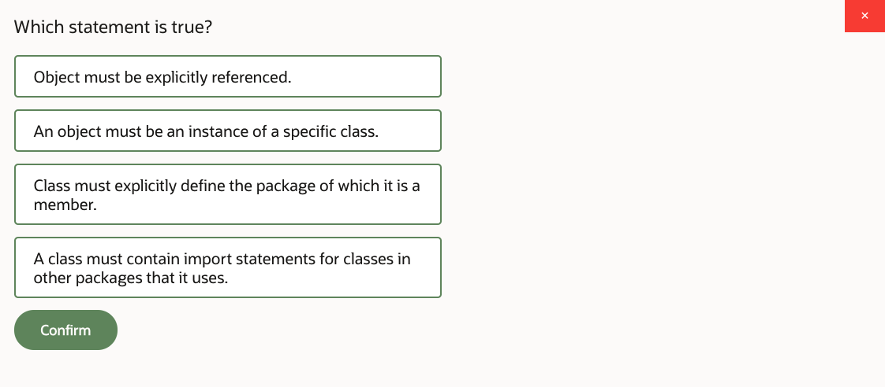
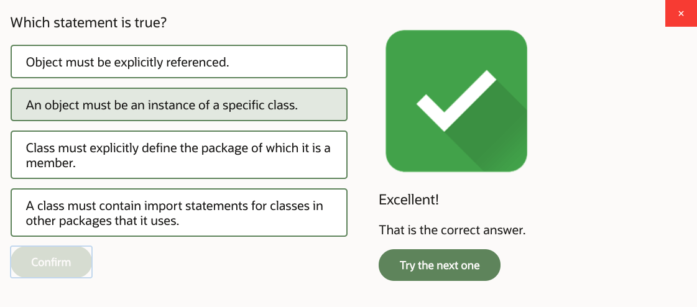
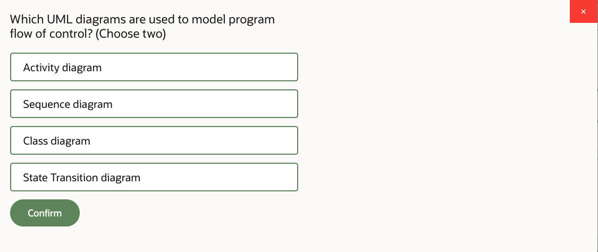
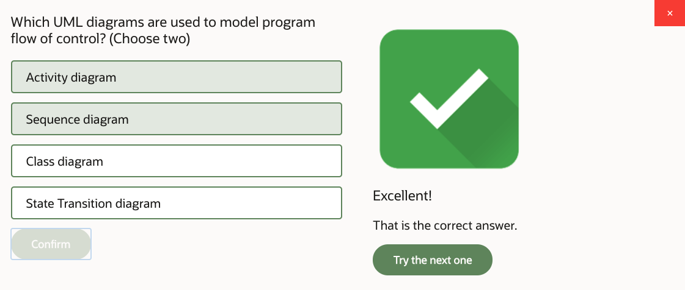
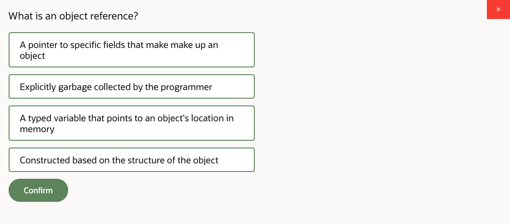
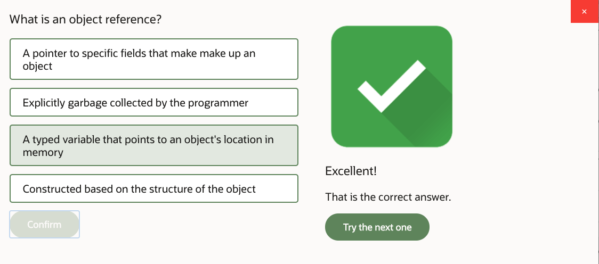
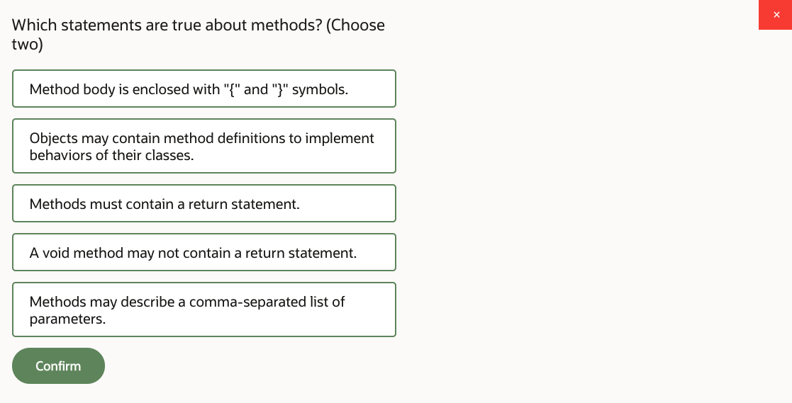
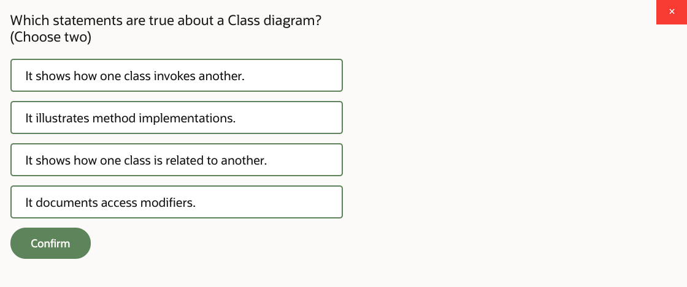
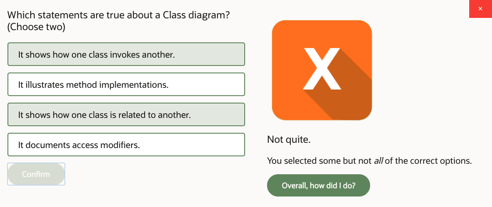

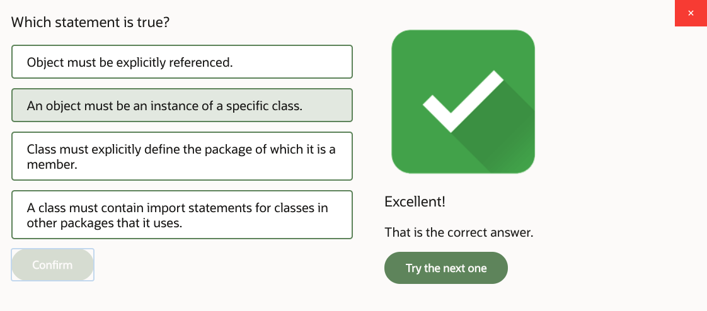

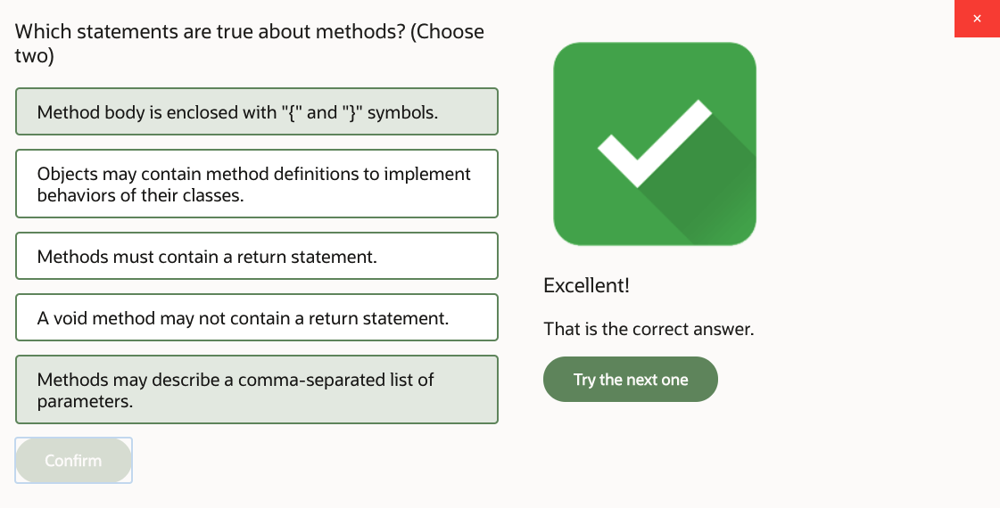
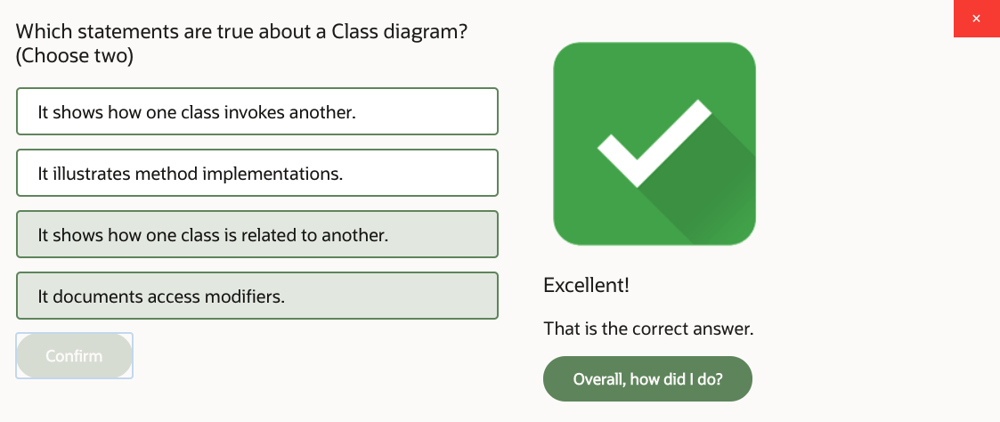

