# 05: Improved Class Design

1. Improved Class Design, Part 1 New 21m
2. Improved Class Design, Part 2 16m
3. Improved Class Design, Part 3 18m
4. Practice 5-1: Create Enumeration to Represent Product Rating 7m
5. Practice 5-2: Add Custom Constructors to the Product Class 16m
6. Practice 5-3: Make Product Objects Immutable 8m
7. Improved Class Design - Score 80% or higher to pass

## 1. Improved Class Design, Part 1 New 21m

In this session, we're looking at how we can improve the design of our classes. So, that would include different techniques that enhance our code. The use of method overloading-- we'll study what that is-- the use of constructors, describe the principles of encapsulation and immutability-- and how to actually achieve that in the code. Then use enumerations, explain the way the parameters are passed, and explained the way the memory is allocated and cleaned up.

Let's start with method overloading. Method overloading is really a fairly straightforward idea. You can, in a given class, design several versions of a particular method. The method name should be the same for all of these versions, but each version should have different method parameters. You can have different parameter types, or maybe different number or order of parameters. Parameter names, however, are irrelevant. Whatever you want to call them doesn't matter.

By the way, there is a term called method signature, which specifically describes a part of the method definition that describes a method name and a parameter order, and types. So you can say that method overloading is really a technique that creates several versions of the method that provide alternative variants of a method signature. Each having a different number or different types of parameters, or both. Note that you can not overload methods using different parameter names, or different return types.

So the class would not compile if two versions of a method got identical number and types of parameters, and differ only on parameter names. Or, if, let's say they differ only on their return types, these cases will not compile. Now the purpose of method overloading is to make it more convenient for the invoker to coal methods. It kind of provide the degree of flexibility on how the parameters are passed.

When you invoke an overloaded method, you just have all of these different ways available for you, in which you can make these calls. So, say for example, in this case, how would you like to set the price? Do you want to set it as a double, or as a big decimal, or maybe set a price and discount at the same time? Whatever you feel like you want to do it, in whichever way you prefer expressing its logic.

If a particular class provides you with that level of flexibility with different versions of the method, then yeah, just take the advantage of these different approaches. A method overloading basically just enables a more flexible design. Invoker doesn't need to learn many different method names. It's the same method name you're invoking, just with different parameters.

Now, this is another interesting trick you can play. It's called variable number of arguments, or vararg. Look at this method definition here, set fiscal details. This method accepts any number of certain values. Triple dot means that you can pass in a single, double number-- but in this cases double, isn't it? Single number, or two numbers, or three numbers, or however many numbers you like.

So this gives you flexibility to invoke this method, and just comma separate any number of parameters. Whatever. You can tell how many parameters you actually get within the method by using a length constant that indicates how many variable arguments you actually received. And then based on that, you can access variable arguments using their position 0, 1, 2, or the indices basically.

Yeah, so, you could save the length is 3, then that means the last valid position of the argument is 2. If the length is 2-- let's just switch case, yeah? Lowercase 2, the length matches the value of 2, then the last valid position is 1. And if there's just one parameter, than the last valid position is position 0, it's a 0 based indexing.

OK, basically as we'll find out in a later session this course, we really treat the vararg parameter as if it's an array of values. But later we'll see how to formally declare arrays. Well, actually this is kind of implicitly dealing with an array for you, and the vararg implicitly handles any number of values as if it's an array of values. But we'll study arrays close a little later.

Actually, on that point, I should note, that when you write in method main, remember main accepts a string array of parameters, right? Well, interesting thing is, you can actually write method main with the same triple dot syntax, instead of square brackets. OK, right.

Now let's take a look at how we can enhance the way we initialize the object. When you use new operator to create an instance of your class, you actually invoke a method called constructor. Now, here's the funny thing about this method. The constructor, if you don't write it into your class, then it is added to your class implicitly, automatically.

So if you don't create a constructor explicitly, it's just created for you. The constructor is a special method that is actually invoked by the new operator. That's why you have these round brackets. This is actually that method you're calling. The new operator calls that method. And if you don't write such method into your class, then it will be created for you automatically. But if you do, this is what that method would look like.

So the method would be called exactly the same as the class. So the class called product, the constructor is also called product. And notice another interesting thing, other methods do have return type method. Can return a value, or the return type could be void, indicating there is no particular value that you return from the method. But a constructor has neither no return time, nor void keyword. And its name must be the same as class name.

The constructor with no parameters is automatically added to your class. So when you create a class like this, and you don't write any constructor toll, then constructor with no parameters is automatically added. And that's why you can just say new product round brackets, and just create an instance without having to write any extra code as such.

However, there is an ability for you to add constructors with parameters, like in this case. Another constructor also has the same name as a class name obviously, but this time it has a string parameter. And an ability to add multiple different constructors basically works like any other overloaded method. You just create that constructor method and you create several versions of that with different number of parameters, or different types of parameters, and that makes your [INAUDIBLE] more flexible in terms of how you create instances of the product.

You may actually provide some values right at a point when you call the new operator, and then the product will not turn out uninitialized or empty shell, empty placeholder, for future values. It will actually turn out to be initialized with whatever values you want. So you can supply some data, and you can default some fields maybe. So price is set to by default, and the name's set to whatever you set a parameter as.

So provide more consistent initialization, that is basically the purpose of constructor. But note one more thing, if you don't write any constructors at all to a class, then constructor with no parameters is automatically added. If you do write some constructor, like this one with string name, this constructor with no parameters is no longer automatically added.

And if you want to have the constructor with no parameters, and the constructor with parameters, like in this example, well, you actually have to write both. So no arg constructor is only added when no other constructor is present. The moment you read in your own constructor, the default no arg constructor is no longer available. If you want to retain the possibility of creating an instance of that class without providing parameters-- and with providing parameters at the same time-- so if you want to have that alternative, make sure you explicitly add constructor with no parameters to your class.

Now, the interesting thing is that one constructor can apparently call another constructor. And to do that, to reuse the code, that you'd reuse that initialization logic for your objects. You use the keyword this. Now we've encountered keyword this before, and we use it in case we encountered variable shadowing. If, for example, a local variable or parameter-- which is really the same thing-- has the same name as the instance variable, then we can distinguish the local variable or parameter from the instance variable by basically prefacing the instance variable with the keyword this.

That was a use case of the keyword this, recursive reference to the current instance that we've encountered before in this course. However, now we'll use the keyword this for a different reason. What we want to do, is we want to share some common initialization logic for initializing the product that has say, for example, a couple of overloaded constructors.

But one of these constructors accepts just product name, and the other accepts product name and price. So what we want to do is not to repeat ourselves, not repeat that initialization of name. I mean, this is just a single line of code and it's pretty trivial, but you can think about more complex cases. You could have more code here, and reusing the code generally seems like a good idea. So when you invoke the constructor with, let's say, with name and price, the first thing that a constructor could do, is it could call another constructor with, let's say, just name, right?

And to do that, all you need to do is put it on the first line of code of the constructor that wants to call another constructor, keyword this followed by round brackets, followed by whichever parameters you want to pass to another constructor. Which, the constructor you invoke is determined by what it is that you pass in as parameters. So in this particular case, I'm passing name. Name is just a string, so we'll be looking for a constructor which just accepts a string, right?

So it matches the type, and it says oh, well, it's this one. So it invokes this constructor. The constructor there accepts the string name, that performs whatever initialization it performs. And then the controllers are returned back to the original constructor, and it continues to perform its own initializations. They could override values, they can assign values. Whatever initializations they need to perform.

Now, there are a couple of rules about how you use this constructor invoking another constructor. The first rule is that if you want one constructor, call another. So, for example, constructor with name and price call constructor with just name, right? Then you cannot do it the other way around. So either a constructor with just name calls the constructor with name and price-- you can put here this name comma price-- and invoke the other constructor the other way around.

But then the first constructor mustn't call the second one. If you tried to do both at the same time, compiler will objected it, saying that you just created a cycle, or indefinite loop of one constructor calling another and that one call it back, et cetera, et cetera. Well, which is less than ideal. OK, so, the other rule about--

So you have to decide basically, which order the constructors call each other. It has to be one order, it cannot be both ways, right? The other rule says that if you want one constructor to invoke another, that line of code that makes the invocation of one constructor from another, must be the first line of code in the invoking constructor.

So if this constructor with two parameters wants to call another constructor with one parameter, it must do it first, before any other code. If fail to do that, the code will just not compile. Now, one more thing. Remember we were saying that no arg constructor-- the constructor with no parameters-- will no longer be automatically added to your class if you created any other constructors with parameters.

So that's why in this particular case, I would be able to create a product with just name, a product with name and price, but I won't be able, any longer, to create products with no parameters at all. I didn't add constructor with no parameters explicitly. OK, well, I could have but I didn't. And then constructor with no parameters is no longer added automatically, because I did create constructors with some parameters. A prescribed, specific way, of initializing product objects.

Now, just a reminder, we did talk about access modifiers before on multiple occasions-- but just a reminder-- there are four types of access modifiers in Java. Public means whatever variable or method is visible to all other classes. Protected means whatever you marked with protected access modifier is visible to classes that are in the same package, and subclasses, and obviously visible within the same class.

We'll look at the subclasses later, but that's the case with protected variables visible to members of the same package, and it's visible to subclasses as well. Even though subclass can technically be in a different package. Default access modifies the case where they access modifier is just not present, right? So you didn't write any access modifier at all.

And within a class, it means that whatever variable or method, doesn't have an access modifier. Would it be visible to other classes in the same package only? Or obviously still visible to the same class? And if something is private, then that is visible only to that particular class.

Now, the reason why this reminder is present is because of what we're about to discuss. We will talk about encapsulation. Encapsulation is a process of hide and implementation detail, information, et cetera, within a particular class. Hiding how things are implemented in the given class internally. And practically that means that you tend to make your instance variables private. And then you provide more widely visible methods, which could be public, or default, or protected, whatever you need the scope of visibility to be, to access variables.

Why is the recommended practice? Why are you usually advised to create variables as private? You don't have to. Technically you can make variables public if you like. But you see, if you have any extra logic inside your methods, like, for example, here, the method that gets the price doesn't just get the price, it actually adds tax to it before it returns the value. Or the method that sets price doesn't just set the price, it also performs some kind of tax calculation.

And by the way, no all the class can perform the tax calculation, because you just made that method private. I don't know, maybe there's some security concern or whatever, you don't want others to call it. So here's the thing, if variables won't be private, then what on Earth would stop you from just directly accessing them from outside of the class product?

And then if you can directly access them, or if you can't directly invoke private method, if that would be possible-- which it isn't obviously-- then you cannot guarantee that this extra logic that you put in the set price method, or getPrice method, will actually be properly invoked. So hiding the implementation details within a given class helps you to ensure that the data stays consistent, that you validate it properly, that you modified if necessary. Kind of protected behind a shell of these are publicly available, or more widely visible methods, that others can call.

It also has another design implication. Think about it this way, if I need to modify some kind of logic inside this class, I don't want to break other classes that interact with it. So if I have certain public operations and I want others to call them, then I know that because they're public, I really shouldn't change the way-- I don't know-- the way they're called, the way their values are returned, the way their parameters are set.

I don't want to change these because it will break any other class that invokes these operations, because they expect particular parameters. They expect particular name, et cetera. But when it comes to private variables, or private methods, well, I can do pretty much whatever I want. If I need to change my internal design here, rename things, modify the way this calculate tax method works, because it's private, the change will really not affect any other class but the class product.

So from code maintenance point of view, having that degree of flexibility is beneficial. You could do some design changes, so long as you're not affecting publicly visible methods, you should be fine. So the other classes like class shop will not necessarily break, which is good. So, I know, of course, if you try-- to from outside of the class-- if you try to access any kind of variables or methods that you are not supposed to see because they have restrictions on the access modifier, whether it's case private, then the code was simply not compile. The compiler checks that for you.

## 2. Improved Class Design, Part 2 16m

Now, next important concept that we did touch upon earlier in this course is the concept of immutability, when you design a particular class and you want instances of that class to essentially be read-only-- when you set values and you never change them again. You never update these values. So, that's immutability.

How immutability can be achieved-- think about it this way. If variables in my class are private, well, that means that they cannot be externally assigned directly. Good. Now the next step-- if I initialize these variables through my constructors, that means-- or directly-- you know, like this here, or through constructors, whichever way-- that means the way you create the product object will guarantee that the variables are actually set because constructor set them, or they're just initialized immediately. So these variables are set through the constructors.

Now, imagine I have some get methods that return these variables. And they're publicly visible, but I do not provide set methods. And that means that there is no way an external call or another class can possibly modify these variables. They don't see them directly. They're private. They have a means of initializing them by providing values through the constructor. They have a means of getting values from getter methods, but they have no means of actually changing them.

So essentially, this class, Product, right now, is actually immutable. And we've seen the immutable design occurring over and over again in standard JDK classes. This-- remember, String, LocalDate, LocalTime, BigDecimal, lots of them-- they're all immutable. That's the kind of general design pattern.

Now, if you want to create a modification, then you basically have to create another object of Product type, in this particular case, which will have a different price or different name. But the regional Product that you created will stay the same. It's immutable. It's initialized at the point when you're constructing a value, and it can never be changed once that's done.

Now, what is the reason for immutable design, why it's promoted across JDK, why it's encouraged? Well, technically, you don't have to make your objects immutable. That's not a hard requirement. It's a recommendation rather than anything.

But there is something about immutability that you might find really beneficial when it comes to multi-threaded programming. The situation when you have an object which can be concurrently accessed, but multiple different threads-- it's shared between different threads. And in this case, if the object is read-only, different threads are perfectly safe in terms of accessing that shared memory. They can't break it. They can't corrupt it because the memory is read-only. It's immutable.

If the object is not immutable, if you can actually modify it, then different threads accessing that object can potentially-- if they do it concurrently, can step on each other's toes basically, and corrupt that memory if they start modifying it. So you have various coding techniques that allow you to work around this problem-- synchronization, whatever. We'll talk about it later in this course.

The point is, you can avoid doing all of this complex coding if your object is just immutable. Then you're perfectly fine in a situation when you require multiple concurrent threads to access it simultaneously. So that's why existing JDK classes are often designed as immutable. And that's why you're encouraged to do the same thing-- if you can, not always.

I mean, obviously, there are cases when you want values to be modified, and that's fine. But if you can avoid doing that, so if you can design your code as immutable, that means you'll have less overhead later managing concurrency-- well, when and if you need it, yeah? So that's kind of the reason behind the design.

Now, one thing you may wonder-- did I have to make these variables final to make them actually constant? What I achieved in this design is because I don't have set methods that are publicly available, and variables themselves are private, and I initialize them through constructors. Well, then they're essentially immutable. But I didn't really mark them with the "final" keyword. I can. There's nothing wrong with that. Sure you can. So you can actually design your class to have these variables in final, as in then you won't be able to assign them anyway.

Moreover, if you do that, compiler will actually insist that you either initialize them immediately or you initialize them through all constructors of that particular class. So every constructor must have an initialization code to initialize these variables. And yeah, sure, a constructor can call another constructor, but that's besides the point.

Now, what's that? What's that small block of code? Hmm. That is an instance initializer. We've actually encountered a similar construct earlier that was called static initializer, or simply block of code with a static keyword on it, yeah? And remember the static initializer fires once when the class is loaded to memory. It's not executed ever again, just when the class is loaded to memory.

Instance initializer is executed every time you create an instance of that class. It's optional to have it. You don't have to build in instance initializers, but you may. An instance initializer will be triggered regardless of which specific constructor you're calling, and will be triggered before any other constructor. And so when you use new operator, you create a new instance of Product, you obviously invoke some constructor. But just before that happens, if you provisioned the instance initializer block within your class, then that will be executed first.

And a reminder, the "final" keyword can also be applied to local variables and parameters. Sure thing-- we've already discussed that.

So, this particular design is also immutable. The variables are marked as final, which forces you to actually initialize them either directly or through all constructors, or in this case, for instance initializer as well. And you won't be able to create set methods. You just won't. The compiler will refuse if you try to. If you didn't mark variables as final, you still would be able to create set method if you choose to do so.

So, that's a small kind of a difference in these designs. But either way, you achieve immutability by, first of all, encapsulating data, and then provisioning the code that initializes it when you create a new instance-- that's constructors-- and then just basically disabling any further updates, not providing set methods, and possibly marking variables as final.

Change of subject-- we'll talk about something called an enumeration. It's actually a different topic, but there's something in enumerations that kind of relates to things that we were discussing in this particular lesson. Enumeration is a special type of class. You see, the thing is you're not using here the word "class." You're creating here a different keyword, using keyword "enum," OK? So there's a slight difference in syntax.

And what enumeration is-- enumeration is a collection of fixed set of instances. It's a fixed set of instances of a particular type. I know it's not obvious, but kind of trust me here, yeah? When you look at this code, you're saying, public enum Condition. The name is up to you. Call it whatever you like. It's just like any other class name.

So suppose I need to model conditions of a product, yeah? And they could be HOT, COLD, or WARM. This is my constraint, yeah? This is my restriction. And what I want to say is that there should be no other conditions. It's either HOT or WARM or COLD, and that's that-- so fixed collection of values.

This HOT, WARM, and COLD are implicitly public, static, final constants-- public static final is a constant-- type of Condition. They're actually three instances of Condition. I know you didn't type the words "public static final" on them, but technically I suppose you could have, because they are implicitly public static final. And they actually are instances of a Condition. And I know you didn't actually call new operator here. You didn't instantiate the condition explicitly. But nonetheless, that is what they are. They're constants representing possible instances of that particular type.

With a normal class, how many instances you create? Well, who cares? As many as you want, right? So you can keep on calling new operator, creating new products as much as you like. With Condition, you hard-coded that it has these three instances, and that's that. It shouldn't have any other instances.

Now, how do you use these enums? Well, first of all, if you want to reference the enum, you can use it as a type, just like you use any other class. So for example, here, I create a new Product. I create a variable, which is type of Condition, right. So that's my type here.

And then I suppose what I could do is I could use Condition-- actually, I could use it as a marker of a case in a switch/case statement, right? So when I'm going into the switch, I'm saying, OK, well, there could be case where it's COLD or WARM or HOT, yeah? Hmm, interesting-- so because they kind of represent this fixed final collection of values.

Because they're public static final-- static final-- a static import works for enums. So if you don't want to type Condition.WARM, Condition.HOT/COLD, but you just want to use the word, COLD, WARM, HOT, then you can do this static import, Condition.*, and just use the name of the actual instance of the enum rather than have to prefix it with the enum name every time. So they're public static constants that represent instances of that type.

Actually, you can add more code to the enum. You can write proper code there. Let me show you. Here's a more complex case for the enum. What do you have here? "Private String caution," right? So I created here some string variable. I created constructor. The enum is called Condition.

And this private Condition-- well, actually, this is constructor. Strangely enough, you notice that constructor has private access modifier. And thinking about it, well, it kind of makes perfect sense because you cannot possibly invoke the constructor of Condition from anywhere except these hard-coded values. HOT, WARM, and COLD are actual instances of enum. So effectively, you're calling constructors here.

So in this particular case, this Condition constructor accepts a string. So you could design it to accept as many parameters as you like. It doesn't have to be a single string. It could be anything you want, any number of parameters. So in this case, you just make sure that when you describe instances of the new HOT, WARM, and COLD, you actually pass appropriate values to the constructor, so you initialize these particular variables.

And then finally, you could have methods to get values here, like get caution, for example. Actually, you can have other values-- other methods. And you can have any number of other public methods you would like to have in this particular enum, yeah? So there is no restriction on that. Just add whatever methods you need.

So, interesting case-- a private constructor, because you kind of don't want the instances of this enum to be created from anywhere except this particular enum itself, yeah? These three instances are the only possible values it could have. Lovely.

So now let's take a look about the way in which Java allocates memory. There are two memory areas in Java called stack and heap. Stack memory is a context of a thread storing local variables that you describe within your methods, basically. So whatever is local to the method-- that's the stack.

Heap, on the other hand, is shared memory area which is accessible from different threads, from different thread contexts, from different methods-- they can all observe the same heap. Stack may contain only two things. It may contain primitives, and it may contain object references. All actual remaining code goes into the heap. So all classes, all actually instances-- they all are in a heap.

Now, in this particular case, what I'd like to do is just zoom into this example a little bit and explain how exactly the memory allocation process works. So let's take a look.

## 3. Improved Class Design, Part 3 18m

So first, in this method main, we've got integer x variable. Then we say it equals 10, and that means it's inside a method. It's a local variable inside a method. It will be allocated in a stack so x is 10.

Now let's assume we try to allocate an object in a heap, and that will be this Product p, new Product, right? So we invoke constructor of the Product first-- new Product. That will place a Product in a heap. But you see, the Product, in turn, also creates an instance of LocalDate, because bestBefore has to be initialized to point to LocalDate. So LocalDate is allocated in a heap.

And then the Product is allocated in a heap, and then the Product bestBefore variable will reference the memory area which stores the LocalDate. So that's the order in which the heap memory will be initialized when you create this new Product. That's that part.

Now, that new Product-- the reference towards the memory in the heap where that Product is allocated-- will be stored inside a p variable. The p variable itself is in a stack, but it's basically contained in a value, which is the identity of the object in a heap, which is that Product which you allocated.

And surely, inside a heap, the object may contain other values and may reference other objects, and actually, there might be primitives in a heap if they're wrapped up in inside an object, right? Of course. They could be in a heap.

They're not in a stack then, because it's only local variables like the variable x, or references to store objects in a heap like the variable p, that are stored in a stack. The rest of the data-- the rest of the stuff-- is placed in the heap. So all your stack has is primitives and references to the heap memory.

The reference to the heap memory-- that alphanumeric thing-- well actually, it's not a real memory address. It's a logical identity of the object. It's not an actual memory address. And well, Java makes, really, a point out of it.

In some other programming languages, like C++, for example, you can manipulate with memory addresses. Well, not in Java. In Java, the memory management is automated, and you're not supposed to know what the memory address of the object really is. So it's a logical identity instead.

So once we've looked at this illustration of how the memory is allocated in a stack and a heap, let's take a look at another interesting facet. How do we pass parameters? When one Java operation calls another and it needs to pass a parameter, what, in fact, it's doing-- it's taking a value that is in the stack, and it copies it, assigning a copy of the value to that argument-- to that parameter.

Again, let's take a look at the illustration that helps us to appreciate exactly what is happening in this process. Let's imagine the following scenario. We have three methods here-- manageProduct, orderProduct, changePrice. orderProduct accepts product as an argument, and changePrice accepts some double number.

In manageProduct, first let's just allocate and new Product object. So we know that the actual new Product will allocate memory in a heap. Whatever, we're allocating it. It doesn't matter if that memory is actually initialized or not. Maybe the constructor set some default values, maybe not. Irrelevant.

But there is some memory in a heap allocated to store that Product, and we reference that memory via the p1 variable. Fine. Now let's call another method. We'll call a method orderProduct, and we'll pass that p1 as an argument.

What in fact is going to happen in this situation is the value of p1 will be copied-- a replica of what is inside the variable p1 will be created, and will be assigned to another variable in the stack, which is the variable p2, which is that parameter, basically. And essentially that means that you now have two variables referencing the exact same object in the heap.

Earlier in this course, you probably noticed in several examples we have a situation when you assign one variable to another-- two object references pointing to the same object. And when you're doing it in a normal, line-by-line sort of code execution, it seems really odd. Why would you want to do that?

But then you realize that it's exactly what is happening when you pass the parameter. Every parameter in a method-- which is an object-- is basically expecting to have a copy of a reference, whatever you're passing to it. You're not duplicating the object in a heap. You're duplicating the reference to it.

So two variables are now referencing the same object in a heap. So now, if inside the method orderProduct, you call p2.setPrice(1.99), guess what happens with the price. It's changed in a heap to that 1.99 value.

Interesting. So what will happen if the manageProduct, using the variable p1, will try to get it? I'm trying to get that price from p1. p1 and p2 are referencing the exact same object, so that variable v1 will be another variable in the stack which will hold the value of 1.99. It will be copied from the heap into the stack, so that value from the heap was copied into the stack. That's what happened.

Now let's use that value v1, and invoke another method, changePrice, and pass v1 as an argument. So guess what? The copy of the v1 value will be produced, assigning it to the variable v2, which is the parameter of the changePrice method.

And then if we have that copy, we can operate on it independently within the changePrice method. That's just another variable in the stack. The double here is not an object. It's a primitive. Primitives are stored in a stack.

Remember wrapper classes. You could have used Double with a capital D. That would be the wrapper class. And in that case, the wrapper will be stored in a heap, and you'll be passing a reference to it. But you're not, because that's a primitive, so you're just copying what you have in a stack.

And then if that changePrice method goes and says, well, v2 equals 2.99, that surely changes the value of the v2 variable. Well, of course it does. But does it have any effect on the variable v1? Not really, because they're not referencing in the same memory in a heap.

When you pass in an object as an argument, two different methods can see the same object, and thus they share the data. And if one method modifies it, the other method could see it. If you pass in primitives as parameters, they're just independent copies of the value, and modifying one copy doesn't have an effect on another. Pass in an object as an argument, what you pass in is a memory reference-- the identity of the object in a heap-- which actually becomes shared between the invoking method and the invoked method.

OK, so hopefully-- hopefully-- we have a nice illustration now of what the parameter passing feels like-- how do we pass these values around when we're making method calls. And now, what happens when we eventually would like to clean up memory-- when we don't need the data anymore?

Well, this is really straightforward. The values that are allocated to the stack-- if they're just local variables inside a given method, then when you get to the end of the method, they are no longer required. They're cleaned. The stack is cleaned.

You can explicitly, actually, clean values from the stack. Like for example here is reference p1, and I say, equals null, which basically means, you're saying, I don't want to reference that object in a heap anymore. You don't really have to do it explicitly, because by the time you reach this end of the curly bracket, the variable p1 will be out of scope anyway, because you see it's declared inside this method, right?

So it cannot possibly be seen outside of this method, so by the time you get to the end of the method, the variable will no longer be valid. But that doesn't mean that the new Product object that you created here will be invalid. Yes, you created a new Product object inside this method, but it's not allocated in a heap. It's allocated in a stack.

And what could have happened is, the reference towards that Product object-- that p1 variable-- was passed to another method. Maybe that other method is still using it. Maybe there's code inside this [? sort of ?] Product that is still actively doing something with that object in a heap. I don't know, maybe. Maybe it continues to use it.

So that means, when this variable p1 goes out of scope, and even if you explicitly set it to null, that does not destroy the actual object in a heap. In fact, you don't really know-- you can't really tell-- by just looking at one method if such an object in a heap is in use or is no longer in use if you pass that reference as an argument to another method, because another method might still be using things.

You don't know. You have to look at the other method code as well, and then maybe that method passed it on somewhere else. That could be any number of different objects referencing this particular object in a heap.

So the way Java tracks this memory utilization is that it basically looks for objects in a heap that still have references pointing to them. If there are some variables in some methods-- doesn't matter where they are, in different stacks, whatever-- that are pointing to that reference in that memory-- so that value is present.

Or maybe other objects in a heap are referencing in it, but anyhow, this memory is still being referenced. Then the object needs to be kept in a heap. You have to continue to use it. But when you reach the situation when this object is no longer referenced by any method-- maybe that method orderProduct came to conclusion, and eventually didn't pass the p2 reference anywhere else, and eventually the p2 reference also goes out of scope.

So these two references both go out of scope. In fact, one of them you've set to null explicitly anyway. Doesn't matter. They went out of scope. And then eventually, this object in a heap will lose all the references pointing to it. Well in this case, this object will be marked as eligible for garbage collection.

Eligible for garbage collection doesn't mean it will actually be immediately cleaned from memory. Probably not. It will eventually be cleaned from memory, but when it will happen is anybody's guess. It's very difficult to predict. There is an algorithm within the Java runtime which defers the garbage collection-- the process of cleaning memory. The Java runtime will track if memory is used or not, and it knows that the memory is no longer in use.

But also, it has this idea that it shouldn't really clean the unused memory immediately, because that takes CPU time as well, and why waste CPU time and cleaning up memory if you don't need it? Maybe your program will not need that memory, or when it will need that memory then we'll be concerned with actually making it available and cleaning it out before we try to write anything to it again.

So the garbage collection [? process is ?] deferred. And basically, there is a mechanism within the Java Virtual Machine which calculates when to clean memory based on various circumstances. Memory pressure, which is the ratio between available memory and used memory-- so basically, if you're running out of memory, then chances are the garbage collection process will kick in and will actually start cleaning memory for you.

But if you have plenty of memory left, and there is no requirement in your program to allocate more objects, then the garbage collector will probably not bother actually cleaning the memory immediately. It will do it sometime later. It's all done on a balance of probabilities, and it's all designed to basically give more time-- more CPU time-- for your program to execute its own logic-- to do business logic-- and only when necessary do the housekeeping tasks such as memory cleanup.

So all you need to be really concerned with is the fact that you need to keep referencing objects if you want to use them, and you need to stop referencing them when you don't want to use them anymore. And then the rest of the memory cleanup will be performed for you. And very simplistically, when a method returns, any local variables that were not passed as parameters anywhere else-- they go out of scope.

So if they were not passed as arguments anywhere else, then essentially whatever they were referencing would probably be eligible for garbage collection and will be cleaned out. If they were passed around, there might be some other parts in the program that are still referencing that memory, but you don't need to worry about it. Java runtime will keep track of these things for you.

And probably one more thing. If you didn't initialize a variable, then it's not referencing anything. If it's a primitive, the default value for a noninitialized primitive is really 0, and for a variable, the default value is null. But obviously, you cannot use such a variable until you initialize it. You have to initialize it first before you use it.

You don't have to do it immediately on the same line of code, although that might be a good idea. And you may assign a variable to null explicitly, but that's not really required. If the method goes out of scope, so is the variable-- if it's a local variable, of course.

OK. Well, I guess that concludes this lesson. And we've learned here about how we perform overloading of methods. Remember, methods with the same name, same return type, but different number or different types of parameters. That's method overloading.

We also figured out that we could create special methods called constructors to help us initialize objects consistently. And apparently, constructors could be overloaded as well, and you can call one constructor from another using this keyword. Remember?

We discussed that this is important to achieve encapsulation and immutability-- to have proper initialization of the object. In immutability scenarios, set values for constructors, but don't have setter methods, basically, or even make variables final. Encapsulation is a prerequisite for immutability, because you have to first make data private. Otherwise, you can't really achieve immutability properly.

Then we've looked at a very special design case, which is enumeration, which is a very restrictive type of class that basically contains a fixed set of instances. Again, very [? tight in ?] the design. Then we looked at parameter passing, and memory allocation, and cleanup.

In this lesson, we have a practical exercise where you're asked to create an enumeration to represent product ratings. So products could be like 1 star, 2 star, 3 star, 5 star, whatever. So these are possible ratings for the product.

You're also asked to create some custom constructors in a Product, and make the Product immutable. So there are some design changes that we're making, and we also introduce a constraint upon how the Products could be rated with an enumeration design.

## 4. Practice 5-1: Create Enumeration to Represent Product Rating 7m

Let's take a look at a practice for lesson 5, which takes us into various improvements we do to the class design. Specifically, what we're going to do is improve the Product class so it will represent our product ratings. And a rating will be an enumeration. So we'll consistently initialize the product ratings. Enumeration of ratings meaning one star, two star, three star, five star, whatever rating objects. Also, we provision appropriate constructors for the product to ensure consistent initialization and make the product objects immutable.

OK, well, we'll start with opening up the project. And that means if you finished Lesson 4 exercise, you could just continue with the project as it is. Just proceed. Otherwise you can open up the solution application to start the Practice 5 with a fresh copy of the project here. But you don't need to do that if you completed the previous practice. Otherwise you open solution for Practice 4 and start from there.

Now, we're about to create an enumeration called rating. So it's a new Java enum in this project here, product management project, rating. Now, if you look at the way we need to fill the properties for that, it should be in Package Labs PMD tab.

Yeah, and it should be called Rating. Is it? Yeah, Labs PM Data, Rating, that's fine, Finish. OK, so that creates a rating and enumeration with no parent values set in there just yet.

So that's the next thing we need to do. We need to describe what ratings would be. Enumeration will be added here. And this is a suggestion of what we could do. We could create visual representation of ratings using stars-- one star, two stars, three stars.

And there are two unicode symbols, I guess, we could use to represent stars if you like here. So these are the actual unicode symbols. And the idea is that every rating will be associated with that number of stars, presented as a text basically. OK, so what are the possibilities? Not rated-- no stars-- one star, two, three, four, and five.

We create these, but that's obviously not a complete code. Because yes, we've enlisted what we want enumerable values to be, but we haven't actually described that string property that they're supposed to have. So that's our next stage. We're describing this private string stars.

OK, so now the enumeration has the stars property. And now we need to create constructor that will initialize stars and maybe some methods to get the value of stars. Because you see, this is essentially a string constructor, right?

We're passing a value to initialize the enum value, passing the screen value to initialize the enum value. And you need to insert a constructor. You can automate that. Just tick the checkbox. Which constructor would you like to have? And that will be-- and then that means it will generate a constructor for you.

So Right Mouse Button Click, Insert Code, Constructor. Tick the box for Stars Variable, and generate it. Now, that's much better. Let's format the code nicely.

Now we have our rating enum values. We have the text that each one of these enums would have. And we have a way of initializing it, a private constructor for the enum, initializing that stars value. And all of the fixed instances of enum basically provide different unicode symbols to put into that stars text.

Now, once constructor is done, we'll insert the code again. And this time, we'll insert a getter method to retrieve the value of stars. Insert code, getter method, just that, and we would like to get the value for stars, string stars. OK, so because the variable is private, and if we want to observe it outside of this enum, then obviously we need to have a publicly available method to get the value. So we achieved that.

Now, let's associate the product class with that enumeration. So within the product, we just need an instance variable that will represent that rating. OK, type of the variable, that enum, rating. Go to the product. And just add another instance variable.

So we have ID, name, price. And now we'll also have rating. Rating and product are in the same package, so no import required. Nice, just that. Again, it's a private variable. Nobody can see it outside of the product.

So maybe you'd like to have some methods to access that variable. And yeah, getter method to retrieve it. Of course, why not get the rating? So let's just somewhere insert that code. It could be anywhere. The order is irrelevant.

Getter method, and we will want to get the rating. There you go. So it just returns us that rating associated with that given product.

## 5. Practice 5-2: Add Custom Constructors to the Product Class 16m

Now we have the getRating method. That's fine. But how are we going to initialize it? Well, let's add custom constructors to the Product class, because at the moment we operate on default constructor, essentially.

And what we want custom constructor to do is initialize all the fields-- ID, name, price, rating, everything. Again, you could just-- so it's basically we're talking about these four instance variables that we need to initialize.

So let's Insert Code. This time, Insert Constructor, and initialize all the fields in that constructor. Generate the code. So constructor remembers the method that matches the class name, so that's that, and we list all the ID, name, price, and rating, and we initialize these instance variables.

Nice. However, when we created this constructor-- this is it. You may do it step by step, but that's basically the idea. This is the constructor code. The next thing you're asked to do is create a slightly different constructor, the constructor that has ID, name, price, but no rating.

So maybe when you create a product, you don't know what the rating for it is yet. Maybe it's not rated yet. So why would you expect somebody who creates the product instance to actually supply the rating value straight ahead? That's not necessarily the case.

So you're asked to create another constructor. You can basically copy the existing one, or whatever. Let's just create another one. Remove the rating from it. And now, create an interaction between these two constructors.

So there's an apparent case here for some code reusability. The ID, name, and price variables seem to be initialized either way, right? So it makes sense to reuse the code. And the suggestion is, why don't we reuse the constructor logic by passing the ID, name, and price values, and then setting the default value for rating if it's not supplied as an argument.

Sure. Well, we can do that. So we take all our parameters-- the parameters for ID, name, and price that we received. We add a default value for rating for that, NOT_RATED. And we essentially match, with these four parameters, this constructor signature.

So one constructor can call another through the this reference. As you can see, you can clearly see which constructor you're invoking. Perfect. So we're recycling that code. That's good.

I suppose you could have done it the other way around. You may decide that-- it's your choice which constructor calls which constructor. It depends on the logic that you want to provide in your class-- what type of initialization you would like to achieve. But in this particular case, we're saying it's plausible that the rating will have to be defaulted to NOT_RATED.

Optionally, you may add a static import here, but that's up to you. So if you don't want to type the word Rating in front of NOT_RATED every time and treat NOT_RATED as if it's a local variable-- a local constant. So just import that enum.

And actually, you know what? You can do the static import for the entire enum. Not just NOT_RATED, but for all of these enum values. And now, anywhere in the Product class where you need to refer to the rating, you don't really have to put the Rating class name in front of one of these fixed instances of Rating-- of that enum. You can just reference them just by their names, because you added a static import to the Product. Once again, that was that bit. It's optional. It's entirely up to you.

OK, now let's go and see what happens to the class Shop. Well first of all, as you could probably already notice, the Shop experiences some issues. At the moment, the Shop is trying to initialize a Product by using a no-arg constructor. But a no-arg constructor does not exist anymore in a Product.

The compiler stops adding a no-argument construct the moment we added any other constructor. Yeah, sure, if you wish, you may retain the no-arg constructor because you feel like it and allow Product to be initialized with no parameters. I know, maybe defaulting all values to something, or whatever is the default initialization logic, and that will allow the Shop to compile. See, the error is gone.

But that's not we want to achieve. If we want to achieve consistent initialization, then we shouldn't really add that no-arg constructor. The compiler will not it add it for us anymore, because we created our own constructors. Yes, the Shop will not now properly compile, but we can fix that. Instead of basically calling all the setter methods, which is what we're doing now, we'll pass relevant values to the Shop's constructor.

So just wrap them up into the constructor. That's all you need to do. You may either erase or comment out these values, and just basically specify them in the constructor itself. You may copy-paste of course, the existing initializations. There you go.

So now the Product is initialized properly. And it's not rated, because we're not using that extra parameter of rating. We could have. We could have. We could do the Rating dot-- oh yes, whatever stars. Yeah, of course we can. But we don't have to, because there's a version of the constructor that just defaults it to NOT_RATED.

OK, so we removed the setter methods, obviously. You can comment them out or just completely delete them. And then you retain the same printout. Nothing else really changes. So let's just test if it works. Just run it.

Oh yeah, it compiles for you. And then you're running that code, and yeah, it works perfectly fine. Exact same logic. You got all of your values initialized in one go without calling setter methods.

Next. Next we will create two more instances of Product within the Shop. A Product-- four-star rating here, and another one five-star rating. So these are the descriptions of what you want to achieve.

102 coffee, same price, FOUR_STARS. Let's put it here. So there you go, extra parameter of rating. You may wish to import the Rating, of course. So there you go-- because it's in a different package.

In the Product class you didn't have to do it, because Product was in the same package as Rating, but now it's in a different package. Shop is in package pm.app. And the import with Rating we did in the Product was different. It was importing using static import, so we don't have to type the word Rating in front of all of these-- NOT_RATED, FOUR_STAR, FIVE_STAR, et cetera-- instances of enumeration.

So it's up to you. You can actually do a static import in Shop as well, and then you wouldn't have to type the word Rating either, but you at least have to import the actual enum because it's in a different package.

And then we have this five-star-rated cake. Nice, five-star-rated cake. Cool. You can do the nice formatting, but that's up to you. OK, let's just nicely format all code.

So we have these few products initialized. Now we're going to play around with these products, and what we're going to do is print information about all of them. Again, you can just copy-paste existing code. You have this line of code that prints information about our first product, so just repeat that and replace with p2 and p3. That's pretty straightforward, and printing the exact same info.

If we'll run that, that's what we're going to get. But we're not yet getting anything about a rating, are we? We're getting the discount information, but we're not getting price and name-- but we're not getting rating information, because it's a new piece of info that we haven't printed before.

So that's what we can do, add the printout of rating and the number of stars. So getRating, getStars. And repeat for whichever products you want to repeat it for.

Product 1, Product 2, Product 3. Just run it again. And now we'll have our stars coming up. Not rated has no stars, and then four and five stars for coffee and cake. Very nice.

Now let's go back to the product and add a no-arg constructor, and then create a Product with no parameters. Can we do that? Sure we can. So going back to the Product class, uncommenting that-- well, which I just added a little earlier. Otherwise you just type it, because remember, a no-arg constructor is automatically added to your code if you don't provide any other constructor.

Fine. And let's create an additional product. Product p4, new product. So obviously, the presence of a no-arg constructor allows us to do that. Fine. So we created this new product, and then we are asked to print the same information for that fourth product with a no-arg constructor.

So let's do that. You don't have to write everything on the same line. And let's just align it nicely. OK. So printing the same information, and run it. And we'll get into some trouble.

Remember, the getDiscount method uses a calculation which is based on the price. Click on the line of code where the error occurred, and you can see that getDiscount takes the price and tries to multiply it to the rate. And price is not initialized-- well, not for Product 4, anyway.

So with other Products, we're fine. We can see the other printouts. They came out just fine. But when it came to the fourth Product, because it wasn't properly initialized, has you getting a problem.

OK, so we proved that good initialization is something that is worth considering. Right. So we see that a NullPointerException occurs. That is because of the getDiscount calculation relying upon the price being present there and initialized, but we didn't initialize it, so surely we'll run into trouble here.

How about we will try to default all the values? Just set the price to 0, I guess. So yeah, we could do that. In the no-arg constructor-- no-arg constructor-- of the Product class-- where's is it? Yeah, here.

Let's invoke another constructor, passing 0 as ID, "no name" as the name, and BigDecimal 0 as the price. So the constructor with no parameters will call the constructor with ID, name, price, which in turn will add NOT_RATED to that rating of NOT_RATED, and called the constructor with four parameters-- ID, name, price, and rating. So this is the chain of constructor invocations.

And just run the Shop again and see what's going to happen. So the Product 4 counts as 0, no name, but it doesn't actually fail anymore, because although the price is 0, the price is not null anymore. So the calculation of discount-- you apply the discount to 0. Well, the discount is 0, but it doesn't fail. It calculates that there is no discount here, sure, but it still works.

OK. So default initialization might be still worth considering. You don't have to provide this no-arg constructor in the first place, of course, but if you decided that it's plausible you'd want to construct the Product without actually supplying any values, well, then this is what you could do. It depends on your business case, really.

## 6. Practice 5-3: Make Product Objects Immutable 8m

Now let's make the Product object immutable. How do we achieve that? Well, for starters, let's get rid of the setter methods-- the setId, setName, and setPrice. Optionally, you may also mark them as final. Absolutely you can, but that's up to you.

Minimalistically, if you just remove all setter methods-- so just get rid of methods that set the id, setName, and setPrice-- you can delete them, of course. So that means that you can't really change any of these properties, right?

And discount doesn't have a set method in the first place. Actually, neither does the rating. It doesn't really have the method setRating. So the only way we can get the discount is through that calculation, and the only way we can get the rating or any other values through the getter methods is if the constructor has set them up earlier.

If that was the case-- if the constructor has actually ensured appropriate initialization of all of these variables-- then yeah, they're just set, right at the creation-- the point with the object creation. And then we get these values, but we can never set them again. We can never reassign.

And surely you can also mark them as final if you like, which prevents you from even trying to create set something method, because final means constant, and if you try to create some set method that sets the final variable, well, the code won't compile. It's as simple as that.

OK. Now-- oh yeah, and one more thing. If you did decide to make them final, make absolutely sure they actually set for all constructors. The compiler will insist on that. It says, well, you know you have to initialize them somehow, and if there's no setter methods and a variable is final, surely you want to set it for all constructors then. But you satisfy that condition, because that's how your constructors are already written.

Now let's create a method called applyRating. And what we want this method to do is create a replica of the Product with a different rating. So the Product remains immutable-- we're not changing the original Product object-- but we intend to create a new Product object with a different rating and all other properties the same.

So let's add this applyRating method. Again, we need to add an actual return statement and some logic to this method, but we'll come to that in a moment. Now, what the applyRating method should do is basically create a new Product object, but copy values from the existing Product, which is ID, name, price, and the new value of rating.

Discount, remember, is dynamically calculated based on price, so there's no property discount as such. It's just a method that calculates it. So this is what you need to return-- a new Product object-- and populate it with instance variable values from the existing Product.

And in addition to that, add this new rating value-- this additional parameter-- and you invoke in the constructor the Product which has ID, name, price, and rating. That's one of the constructors you've created earlier. So when you're applying the rating, you're basically just creating a new Product which is a replica of the original, but with changed rating, of course.

There's no variable shadowing, so technically you're doing this.id, this.name, this.price, but you don't really have local variables that are called id, name, and price, so you don't have to put the this keyword in front of them. If you want, you can. You could be explicit about it, because you're essentially taking the current object ID, name, and price, and populating them into the new object. Sure, whatever. But that's this dot is excessive in this case. You don't really have to type it.

OK, so you have this applyRating method. Now let's test it. And the way we can test it is go to the Shop class and just basically change the rating of the Product. And what you need to realize-- that the original Product will not really change if you do that.

So for example, you had Product 3, and it was five stars. And now if you change that-- let me just add another Product here-- to three stars, the Product 3 remains five stars. Nothing changed there. It's another Product, p5, that is now a replica of Product 3 but with a different rating.

And surely, you could superficially do something like this. You could say, p3 equals p3.applyRating, and it will feel like the p3 has changed. But what happens is that the original object that p3 was referencing-- that remained the same, that really didn't change. You just reassigned a reference p3 to reference a new object. So you could do that if you like.

Anyway, let me comment out that line of code for a moment. So we just have this applyRating, three stars, Product 5, and I guess what we want to do is just see how it plays out. So we'll print p5 as well.

And notice I'm printing p3 a little earlier, just one line of code prior to that. So you will see what the p3 looked like, and even though I applied a different rating to it, that original object hasn't changed. It just created a replica for me.

And run that. So we had a five-star rating, and then this replica thing is exactly like the previous object, with all the same properties, but a three-star rating. OK, so that's the method that allowed us to change the way we present the update functionality of the product.

We're not really updating the Product object. It remains immutable, but we create a replica of it instead if we want to change the property. And that is it for this lesson.

## 7. Improved Class Design - Score 80% or higher to pass

Improved Class Design

View Quiz

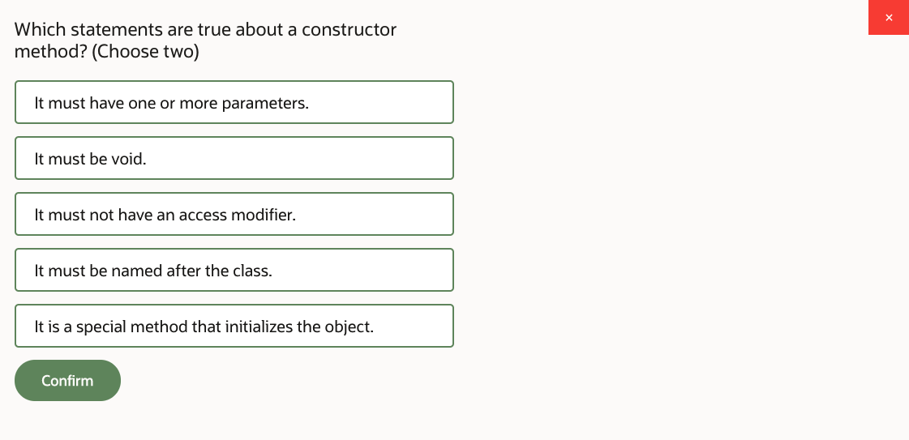
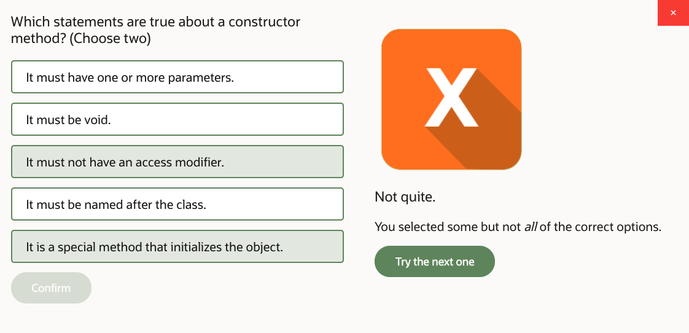
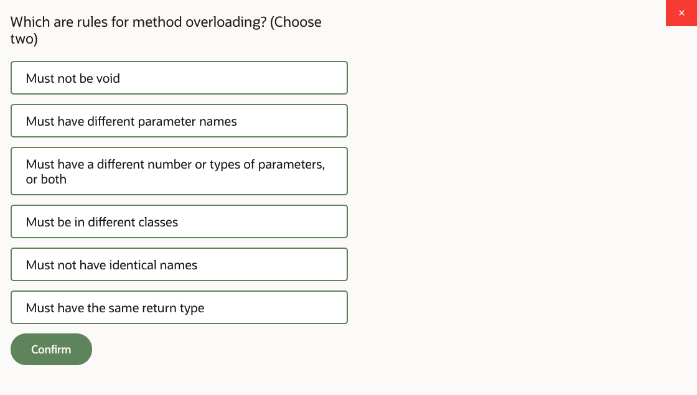
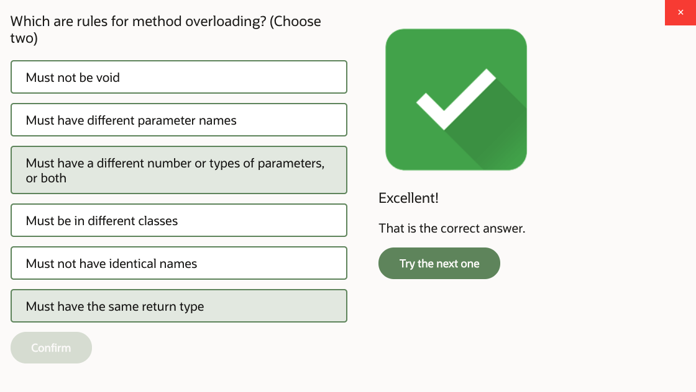
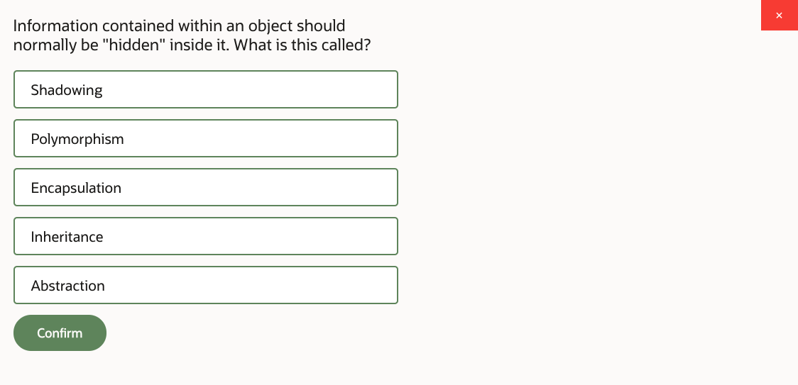
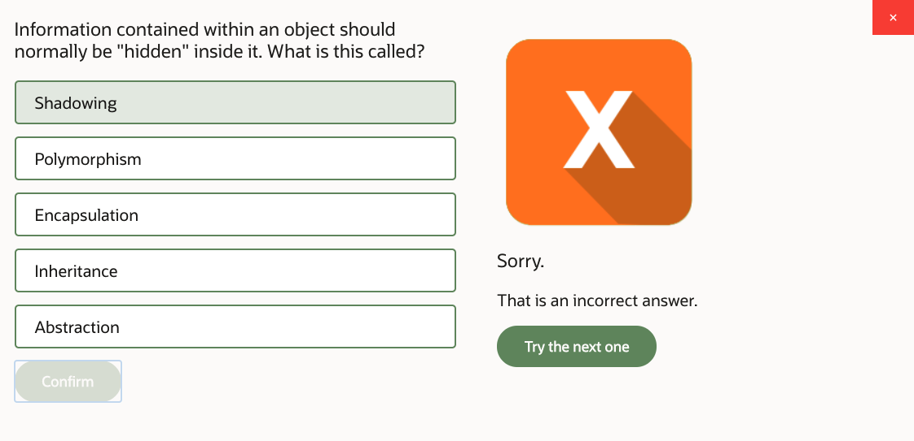
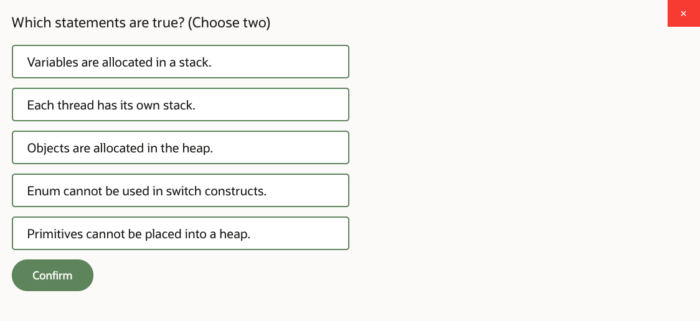
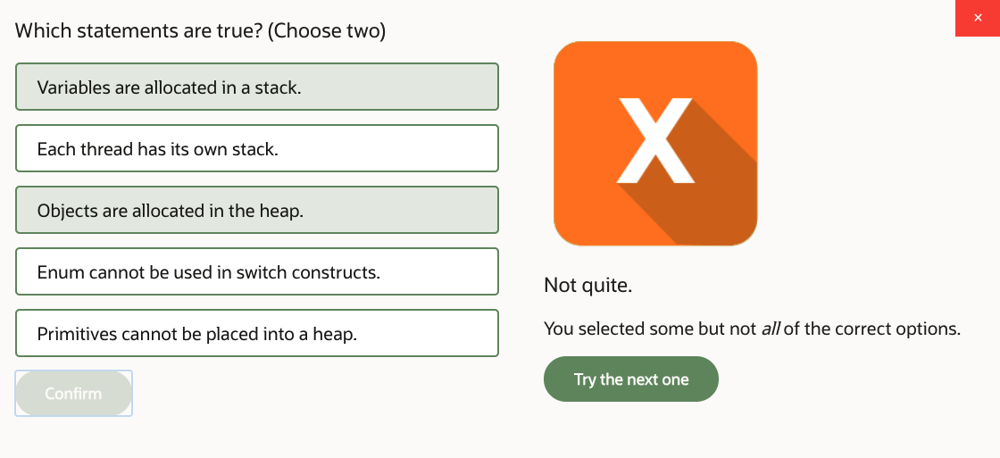
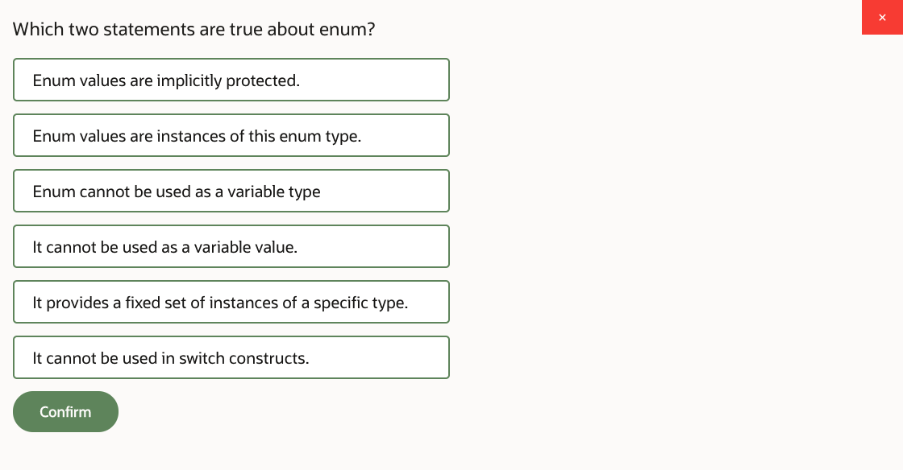
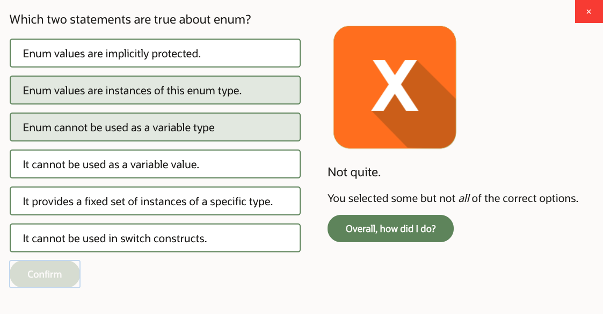

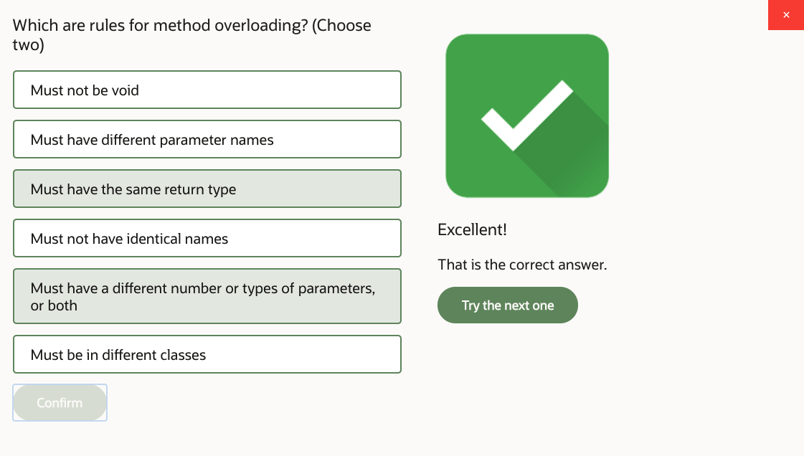
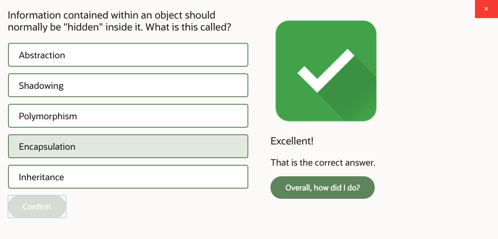
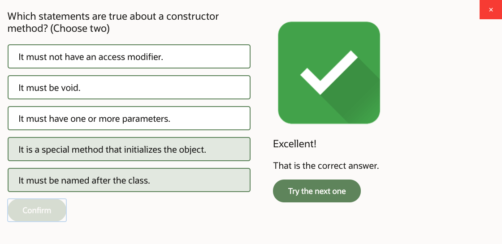
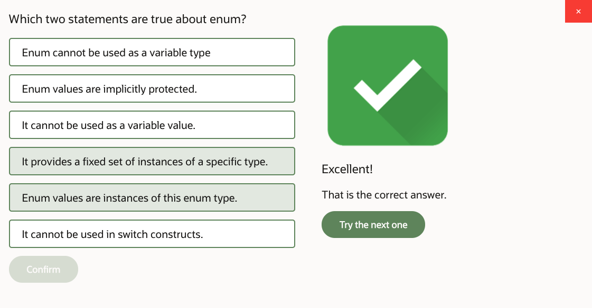

