# 06: Inheritance

1. Inheritance, Part 1 24m
2. Inheritance, Part 2 21m
3. Inheritance, Part 3 16m
4. Inheritance, Part 4 12m
5. Practice 6-1: Create Food and Drink Classes That Extend Product 16m
6. Practice 6-2: Override Methods and Use Polymorphism…Part 1 17m
7. Practice 6-2: Override Methods and Use Polymorphism…Part 2 17m
8. Practice 6-2: Override Methods and Use Polymorphism…Part 3 18m
9. Practice 6-3: Create Factory Methods 9m
10. Inheritance - Score 80% or higher to pass

## 1. Inheritance, Part 1 24m

Let's take a look at inheritance. In this lesson, we're looking at the way in which we can extend classes, and the purpose of which is basically reusing the code through that process of inheriting code from the superclass-- so reusing code through inheritance.

We'll deal with different types of objects, and we need to be able to check what type the object is. And for that, we can use the operator called instanceof. We also need to be able to create interactions between subclass code and superclass code, and for that we're going to use the reference super. We also need to understand how constructors work across superclass-subclass relationships.

Override superclass methods-- we'll see what that behaves like. And subsequently, through the override, understand the feature of polymorphism in Java. We'll then look at abstract classes and methods and at final classes and methods. And lastly, we discuss which methods we gain from the Object class, and how can we override them, and why we would do that.

Let's start with, just generally, how do we extend classes? If you create a class and you don't put any extends clause in it whatsoever, then by default it appears that the compiler assumes that you're extending the class Object. So if you don't see what it is that you extend at all, then implicitly you will be extending the class object.

And of course, you can say, well, I have some class and I extend something specific, like Food extends Product. And Product becomes my parent, and Food becomes a child, or Product is superclass, Food is subclass. But from the perspective of a Product, Object is a superclass and Product is a subclass.

So it could be multilayered. You can have a parent, child, grandchild, et cetera, relation between classes within that hierarchy. But the Object apparently turns out to be the ultimate grandparent of all other Java classes, because, well, it's implicitly extended if you're not saying what it is that you actually extend.

One more thing-- that multiple inheritance is actually not allowed in Java. So your extends clause can only reference one parent. You can't reference more than one. There are some other programming languages, namely C++, where the multiple inheritance is allowed, but it is not allowed in Java. We'll actually later find out why it is the case, but it suffices to say it's not allowed at this point.

Now, because we are extending the class Object-- that's our ultimate grandparent-- it's worth understanding what it is that we gain from it. So remember, the purpose of extending another class is to be able to get-- inherit-- its code. So what are these operations that all Java classes inherit from the class Object?

Well, they are toString, which converts the object to text representation, equals, which allows us to compare pairs of objects, hashCode, that allows us to generate the integer hash value for the object identity, clone, which allows us to create a replica of the object, and methods wait, notify, notifyAll that allow us to exert some thread controls.

Well, actually, throughout this course, we'll zoom into these methods and take a look at what they're doing, but for starters, let's take a look at the toString. This is the actual snippet of code from the Object class itself, and it shows you what the toString method does. It gets the current class name, concatenates that with an at sign, and then basically calls the method hashCode, which is the Object identity, and converts that to hex string.

So for example, in this case, I create an instance of Product, and then I just call the method toString upon it. Why am I so sure I can call the method toString? I didn't define it in our Product, did I? Well, you don't have to, because the toString method is inherited by the Product class from the class Object, right?

So you can just call it, and that's what you'll get. That would be the result. It will tell you which package and class name that is, and then at sign, and then the identity of the current object generated by the hashCode method.

Right. We will take a look at other operations of the Object class a little later, but it gives you an idea that most generic behaviors described by the Object class are instantaneously available for all other Java classes, like in this particular case, the example with the Product.

But of course, we can be more specific. We can keep on extending our classes. So in this particular case, the product-- well, I'm not saying what it extends, which basically means that it extends Object. And whatever code I describe in Product, that becomes, in turn, a generic code for anything that will extend Product.

For example, I create a class Food, and I say extends Product. I create a class Drink, I say it extends Product. And for Food and Drink, whatever code the Product has become available as well. So Food will have a capability of, I don't know, getting ID, and Drink will have a capability of getting ID, because that is what the Product defines.

Of course, in addition to that, the Food and Drink-- these subclasses-- can describe additional variables, additional methods, but they instantaneously do inherit whatever the Product class defines, because they're extending it. And of course, whatever the Object class defines, because ultimately they're all extending Object as well. So you cannot partially inherit things from your parent. Whatever the parent class describes, the entirety of that is always inherited by whichever child extends that parent. Or multiple children, as in this particular case.

Now, how do you reference objects? So we create an instance of something, and then you reference it. And in this particular case, let's assume the following class hierarchy.

So I have a Product. That extends Object, obviously, implicitly. Then I have Food and Drink, and they extend Product. I can create an instance of Product, new Product. I can create an instance of Food, new Food, new Drink. And in these cases, my heap memory is allocated according to what it is that actually instantiated

I create an instance of Product, I'll have a chunk of memory in a heap which will contain everything that a Product has. But actually, everything that the Object has as well, because I'm inheriting that code.

I create a new instance of Food, I create a chunk of memory in a heap that will contain everything that Food has, and everything that the Product has, and everything that the Object has. And also, likewise, when I create a new instance of Drink, I'll have a similar segment of memory which will contain everything of the Object and Product, but obviously would also contain everything of a Drink.

How can I reference these memory chunks? So zoom into one of these examples. Let's say, for example, new Food, right? So in this corner of the page, you can see three instances of Food being created. And I can reference these Food instances.

Of course, I can use a specific type. I could say, OK, I have a variable type of Food. Fine. And I can reference the Food object that way. And for that variable x3, we'll be able to see everything that a Food object has. Everything that it has, everything that inherited from Product, from Object, and that everything it defines itself.

However, I can also reference the Food for any other compatible reference, because Food is a subtype of Product. That means Product is compatible with it. And eventually, Food is a subtype-- well, grandchild-- of Object, and the Object type is also compatible with Food. In fact, the Object type is compatible with all other Java classes, really. It's the most generic type.

So you can declare a variable type of Product to reference Food, or even a variable type of Object to reference Food. If you do that, then you will be able to see only part of a heap. When you create a new Food, you create the heap in its entirety, but how much of that heap can you actually observe depends on the type of variable.

For example, when I declare the reference x2, it's type of Product. I can't really see those behaviors-- those things that are specific to the Food subtype. They're there in a heap, but I just can't see them through the variable x2. I can only see these methods and behaviors that are specific to the Product, and for variable-- well actually, I can also see things that are specific to the Object. They're always visible.

But for a variable x1, I can only see things that belong to the Object level-- that are defined on that level. The memory in a heap still contains stuff that belongs to the Product and to the Food itself, but the variable x1 does not project a wide enough window over the heap to actually be able to see these specific subtype behaviors.

Now, if we take a closer look at this idea, so what we need to figure out-- some ground rules that we need to lay down. An object can be referenced using its specific type or used in any of its parents-- any of the parent types. They are all compatible references.

But in order to be able to invoke a certain behavior-- invoke an operation upon the object-- that operation has to be described at least at a level which matches your reference type. So you cannot call the method that's specific to a particular subtype if your reference is not concrete enough-- is not specific enough. If you reference type is too generic, you just don't see that method. Although it's technically there, you can't you cannot invoke it, because you don't see it. So yeah, let's take a look at this example a little bit closer.

Let's assume that we're allocating two objects, one Food and one Drink object. OK, so we're allocating these two, and this is the memory that will be allocated for us. However, we reference these slightly differently. Variable x1 is type of Food, so it projects the entire Food object.

Variable x2 is type of Product, so it projects part of the Drink object. For variable x2, we'll be able to see only things that belong to the Object or Product, but we won't be able to actually observe code that's specific to Drink, although it technically still is in the heap. So this is perfectly fine. These are valid ways of referencing Food and Drink, because they are compatible types. They're either specific or they're parent of that type.

Now let's make the following assumption. Let's assume that a Product class describes the method getName, and a Food describes the method getBestBefore. So getBestBefore is specific subtype Food, and getName is specific to subtype Product, which is subtype of Object.

If will try to invoke operations upon a variable x1-- call toString, call getName, call getBestBefore-- we will succeed in that. There's nothing wrong with these calls. x1 projects everything that the Object has, everything that the Product has, and everything that a Food has-- getBestBefore is Food-specific, remember.

What if we take variable x1 and assign it to a variable x3, which is type of Product? Hmm. Well, that means that we don't change anything in the heap. The heap remains the same. We're still referencing the same product in the heap-- the same Food object. But this time, we don't see these Food-specific behaviors.

So if I use the variable x3, and I start invoking operations upon it, I would be able to call only those methods that are defined on the level of the Product, but I won't be able to call the method getBestBefore, because that's Food-specific. However, what I want you to notice is that there is absolutely no problem in doing such an assignment.

Variable type of Food, which is x1, is perfectly compatible with a variable type of Product. Think about it like you have an int and you want to assign it to double. That's perfectly fine. Int is smaller than double, so surely it can be assigned that way.

This is the same idea. This is a promotion of the type. You're basically assigning a more specific type of reference to a more generic type of reference, and it works perfectly fine. So the only concern that you have is that you'll still be able to call methods toString, getName, but when you try to call getBestBefore, you will get a compiler error if you try to do that.

The compiler will basically say, sorry, you can't do that, because the variable x3 does not project Food-specific stuff. That variable is too generic. Its type is too generic, because the method getBestBefore is only described in a certain subtype.

Now, can we take it a notch higher? Yeah, sure. Technically, absolutely any Java object can be assigned to a variable type of Object. It could be Product, could be Food, could be Drink, could be anything you like. It doesn't matter, because eventually, it extends the Object anyway. And how much of the memory will you be able to see? Not much.

So you would be able to call the toString method or any of the methods that the Object class defines, but as it happens, you won't be able to invoke getName or getBestBefore, because they are not described on that generic level. The memory in the heap still contains them. You just don't see them. But they're there.

So now, what if we'll do it the other way around? So we have x4, which is the variable type of Object. Can we narrow it down to be Product? Well, technically we can, but-- you could do the casting, but the casting is associated with a caution.

What if the variable x4, which is type of Object, is referencing something that is not compatible to the Product? At this point, it's referencing the object x1, which is Food, which is a subtype of Product, which is perfectly fine.

But what if the variable x4 wasn't actually referencing a Food object? What if the variable x4 was referencing, I don't know, Shop. So something else-- some other object which is not a subtype of Product. Then you will try to cast that object to Product, and you will get an exception. So the code will throw you an error.

The compiler will still compile the code, because potentially, this type of casting can be OK if x4 is referencing something that's compatible to the Product. But you don't really know that, do you?

Just by looking at the variable x4, you can't really tell. So there's a potential danger in this narrowing down of a type when do you go from generic reference type to specific reference type. But you can do it. You can do the casting.

In a way, you can think about it as if you have a double variable, and you're trying to narrow down the type to be an int. So if you have a floating point part, you're going to lose it, right? So with objects, you actually have an exception if you try to do it. So that's just causing the runtime error.

Now, what are you able to call through that x5 reference? Everything of an Object type, everything of the Product type, but you won't be able to call things that are specific to Food, because they're still not visible for that reference type.

Can you narrow it down even further? Well, in this case, for example, I have a variable x2 that was declared as type of Product. In fact, it was actually referencing a Drink, so can I take it and narrow it down to be Drink? Yeah, sure.

But again, how do I know that x2 is really referencing a Drink? Well, in this case it does, but equally happily, the x2 variable could have been referencing something that's not a Drink, right?

For example, so this line of code works, but the exact same scenario where you take the variable x3-- x3 is type of Product, so it is plausible that you can get the situation when you're trying to cast something that is of a Product type to be Drink, but in fact, that Product wasn't actually referencing a Drink. It was referencing Food. And in this case, you'll get an error.

The casting across the hierarchy is not allowed. They're not compatible types. You can cast up and down the hierarchy. You can promote something. That's perfectly fine. You can take the object of specific type and assign it to a generic-type variable, like you did with x1 to x3 or x1 to x4 assignments. That's perfectly normal.

You can cast the type, narrow it down. You can have a generic type of reference assigned to a specific type of variable with casting. But then you have to execute caution, because what if a generic [? reference ?] was referencing something that's not compatible with the type to which you try to cast?

You can't turn a Food into Drink, basically. That's what we're saying, right? They're not compatible types. They are just from different parts of the hierarchical tree of classes, so you cannot cross these branches of the tree. That's just not allowed.

OK, so that is how we understand the rules of typecasting, type promotions and what do we consider to be a compatible reference type. OK, so hopefully that makes sense now.

Now, here's an interesting scenario. I have a method that accepts a generic type, Product. And within this method, I would like to look at some generic behaviors of the Product, like getPrice, for example. Let's say all Products have a price, so I can just get the price.

But then I want to calculate the discount. And let's say, for example, the discount depends upon what type of product that is. Is that a Food or is that a Drink? When I invoke this method-- this method called order, invoke that-- I can pass any value that's compatible to the Product type. I can pass Food, I can pass Drink.

As a matter of fact, that is basically the situation when you have your specific object-- Food or Drink-- assigned to a generic type of reference, Product. This naturally happens when you pass parameters, because remember how you pass parameters in Java? You take the reference in a stack and you make a copy.

And a reference in a stack can be assigned to just another variable. In this case, variable type of Product, which happens to be a type which is more generic than a specific type of reference that you actually used when you were initializing the value to be passed as parameter. Is it a Food or is it a Drink? Could be either one of them.

So that means that within this particular method, the Product parameter can represent specific subtypes. Generic types, in fact, can reference more specific types. So if I want to call an operation like getPrice, which is generic itself-- presumably is defined on the Product level-- then I can just go ahead and call it. That's perfectly fine.

But then if I want to call some operations that are specific to a given subtype, like this getBestBefore, for example, then I need to first take the Product and cast it to Food. But it will only work in a scenario when the order method receives Food as an argument. When the order method receives Drink as an argument, this line of code will throw you an exception, because you're trying to cast a Product to Food, and in fact, the Product is a referencing a Drink, so you can't do that.

To prevent that exception from happening, it may be wise to first check what that parameter actually is. And one of the ways of doing that is using the operator instanceof. So you can basically say, is this parameter Product an instance of Food? And it returns you true if it is and false if it isn't. Actually, if it's not initialized-- if it's null-- it also returns you false, right?

So you can have a check, and you can say, Product is Food? Fine. Let's cast it to Food type. That's perfectly safe now, because I did the instanceof check. And then because I cast it to Food type, I can actually invoke my getBestBefore operation. And what I'm doing here is I'm calculating when the Product expires, and based on that, I'll calculate my discount.

In the other occasion, if that's a Drink, oh well, then the discount calculation is completely different. I'm discounting drinks between 5:30 and 6:30, so that basically means some kind of happy hour or whatever. Some different algorithm that I apply to the instances of Drink to calculate their discounts.

So there's a part of this method that treats the Product in a very generic way, without really caring what subtype it is-- like getting the price, for example-- and then a part of the method logic that actually wants to know what the subtype is-- is it a Food, is it a Drink-- and then alters the behavior accordingly.

## 2. Inheritance, Part 2 21m

Here's an interesting thing-- when you're writing code in your child class, you may reference in things within a child or within a parent. The current instance is referred to using the keyword, "this," and a parent is referred to using the keyword "super." Now, we've already discussed that these dots and variable name could be used if you were doing the shadowing of the variable if you have, like, a local variable with the same name.

But you see, what if your parent class describes a variable which has a same name as the child? Normally, that's not a problem, because parent class variables-- just like a child plus variables-- are really supposed to be private. But what if they're not? If the variable is not private, then the child class can see it, you see. That's the problem. So if the child class can't see the variable discount in a parent and a variable discount in the child itself, then we have a problem.

We have this shadowing situation. How do we know which discount is which, right? So this.discount means the one that belongs to the current instance of food. super.discount means the one that belongs to the current instance of product, which is the parent of food. I'll generally advise to follow the encapsulation rules and talk to the public variables. That would avoid the whole issue in the first place. But you know, if you get into the situation when you have an ambiguous reference, then yeah. "Super" keyword and "this" keyword may help you sort out which one of them you're talking about.

Now, next thing that we need to discuss is the process of actually initializing an object. Well, we know that it's done via the constructor, but here's an interesting thing. Apparently, the constructor of a subclass invokes the constructor of a superclass, and that's actually the first thing the constructor of the subclass does. You might not see that in a situation when there is a no-arg constructor implicitly added. So for example, if I created the class product and I don't write anything inside at all-- just I don't create any constructor at all-- then this constructor is actually added to the product class. And this constructor calls superclass-- constructor with no parameters.

What it is that a product extends? Well, if you don't say what it extends, then by default it, extends object, right? So apparently, the object class actually has constructor with no parameters, and that's precisely what you are invoking from this product class constructor. Likewise with the class food that extends product, the first thing that a constructor of the food class will do, and that's a default constructor added for you implicitly, yeah? The first thing it will do, it will actually call a superclass constructor upon a product with no parameters. Does the product have constructor with no parameters? Well, if you didn't write any other constructor, by default, it does. The constructor with no parameters is added to the class implicitly. So when you call "super," no parameters from the child, that column actually matches the parent class constructor with no parameters. So by default, everything just works. You create a class, you extend it, and subclass constructor calls a superclass constructor, and everything is fine.

But what if I do create constructor in a product which is not nor a constructor? What if I create a constructor in a product which accepts, like, a screened name or something? Then apparently, a default constructor of the food will try to call the constructor with no parameters, and is no longer present in the product because constructor with no parameters is only automatically added if you didn't define any other constructor. And you just did.

So that means that food also needs a constructor, and actually needs to invoke superclass constructor explicitly, matching the parameters that a superclass constructor expects. And it's actually very typical of subclass constructors to accept same parameters as a superclass constructor does, and maybe some extra parameters, actually, and presumably the extra parameters is what the food initializes, you know, locally within itself, and then the constructor parameters that are the same as the constructor parameters.

And a parent are simply passed on to the parent via the super reference. So this exact same idea as one constructor calling another constructor in the same class using this reference, but this time, we're calling constructor upon a parent using a super reference. And it's something that you must do. It's not optional. You must do it, because remember how the heap memory is allocated. When I create a new instance of food, my heap actually creates memory to store everything of food, and everything of product, and everything of object.

So all of these values needs to be initialized, so the constructor is have to fire all the way throughout this class hierarchy to properly initialize these values. OK, and the call to the superclass constructor must be the first line of code in your subclass constructor. The only case when you can avoid doing that-- if your superclass actually has constructor with no parameters, then the call to super with no parameters is implicitly added. You don't need to explicitly type it, which is the case with a class object, actually, because it has the constructor with no parameters.

OK. Now, this is a very important page. It summarizes several things that you've observed in previous course lessons. This is the order of the class and object initialization. There is, per se, no new information on this page, but it just brings together topics that were separately discussed in different other segments of this course. So first let's take a look at the following example. Let's assume we have a class shop. So we want to write a class shop that has a method main. When we invoke the class Shop, that's the first thing that needs to be loaded to memory. Or is it? What class Shop actually extends, if you don't put the extends clause in the class Shop, then by default, we assume that the Shop extends the class object.

So in fact, the first thing that's loaded to memory is class object, and object class actually happens to have a static initializer. It's actually present in the object class. You can check it out. It's there. So that's what will be triggered first-- the static block inside the object class, because object class needs to be loaded to memory first before anything else.

So once the static lock in the object class finishes, what happens next? Well, you don't create an instance of object here. You don't instantiate a Shop, so hence, you don't instantiate the object just yet. So you just now load in the class Shop to memory.

So static initialize on the object completes, then a static initializer on Shop-- well, if you read in one, because you don't have to write it, but suppose you did. Suppose you add a static initializer to the Shop, and that would be the second thing that will be executed in this program. We didn't yet even started the method main. The static initializer object and static initializer shop will be triggered first. Then we'll start method main.

Method main will do whatever it's doing, and apparently, it will create a new instance of Food. But in order to do that, it has to declare a variable type of product, and anyway, Food extends product. So the Product class needs to be loaded to memory, and of course, we know that a product extends objects, so that means that the object needs to be loaded to memory. But object has already been loaded to memory because we've loaded Shop.

So the static initializer on the object is not going to fire again. That's it. It has been loaded.

So the next thing that will fire-- static initializer on a product, so that will be loaded to memory. And then a static initializer on food because we create new instance of food. But the food has not yet been loaded to memory, so that will fire as well.

Static initializers will be triggered in this specific order, and they will not be triggered again. That's it. They are executed just once when these classes is loaded to memory for the first time.

Now, we start the actual instantiation of Food, so the Food needs to trigger its parent class constructor, which is the product, which in turn, needs to trigger its parent class constructor, which is the object. So the object constructor will have to complete its code first. Now, the constructor-- so when you call new Food, first, the thing that will finish running is the constructor of the object.

Then-- well, actually, product happens to have an instance initializer, so that block will all be executed-- the instance initializer. Static initializer will not be triggered again, but if you coded instance initializer, that's executed before the constructor. So constructor of product will complete, then the food instance initializer, if you have one, and eventually, the constructor of food will complete.

This process, object class constructor-- initialize a product. Product constructor initialize a food. Food constructor-- this process will repeat per instance. Every time you create an instance of food, that's the initialization that will be triggered. The static initializers will not be invoked again.

So this is an important summary that tells you the order in which all of these initialization and methods are triggered. Now, let's take a look at a next important concepts, probably one of the most important concepts in this entire lesson, and that is the concept of polymorphism. To get to the polymorphism, first, what we need to do is to introduce the concept of the method override.

So here's the class Product, and it has a method, Get Price. And here's the class Food. Oh, it also has the method Get Price with the exact same signature, same parameters. Well, no parameters in this case, but there could be some parameters, so long as they are the same. Same return type, so same name obviously.

So you create a method that matches the method in the parent-- same signature as the method of the parent. But what you can do in the class Food, you can provide, here, a different algorithm. So there's some algorithm in how you get the price from a Product, but maybe the Food has a different idea of how that should work, and maybe the Drink has yet another idea of how that should work. So they can all introduce a different algorithm, different logic, that's specific to Food or to Drink, that changes the way the Product Get Price method works for that particular subtype.

So remember, in the earlier page, we have this example where we have the method called Order, and it accepted a product. And then we have this-- well, let me actually go back to that example for you for a moment. So we have this example. Yeah, we accepted a product, and then we were doing some generic stuff, getting a price, and then we were doing specific things like, is it a food, is it a drink, and then do different algorithms.

Well, actually, you don't need to do it because what you could have done is that this method, Get Price, you can simply override it in Food and in Drink. And you place this algorithm in a Get Price method of Food, and that algorithm in the Get Price method of Drink. And all you need to do inside this method is just call the method Get Price.

The magic of polymorphism is that, when you pass a product as an argument to this particular method, you will call Get Price, which is that version of the method. When you pass Food, this call will automatically invoke that method. When you pass Drink, this call will automatically invoke that version of the method.

So a lowest available implementation of the method, down the hierarchy, is automatically invoked. You don't need to check instance of. You don't need to cast the type and narrow it down. You just invoke the method, and Java virtual machine will automatically pick up the lowest available implementation of that method down the hierarchy.

And you don't need to cast the type to that subtype. The type remains Product. The type remains generic.

It automatically figures out that if the actual object that you reference in a heap happens to be Food, and it actually overrides that method, then we'll call the Food specific version. You don't have to override that method in every child. No, of course not.

So for example, let's say this method is not overridden in Drink. You didn't create that code. You didn't override it. Fine. You don't have to, in which case, when you pass a Drink as an argument, if the drink doesn't have that method, then when you call a method Get Price for the Drink, in this scenario, you will actually call the generic method Get Price that's available on a Product.

So it has provisioned here a default behavior, which is what a Product does, and then you could have specific subtype behaviors, specific variances, as many as you like, that introduce differences in their behavior. So Food can calculate the price based on when a Product is about to expire, or a Drink can calculate the price based on happy hour. And you really avoid writing the bulky, convoluted code that checks the instance of it and casts the type.

Now, you could clearly see how that declutters code. Your code is much more readable, and hopefully, now, you can understand why this idea of having a specific object and assigning it a generic type actually works. So long as the method you're trying to invoke is declared on a type product-- so Get Price is declared on the level of the type product-- you can call that method. An appropriate subtype version of that method will be invoked for you if it exists. Now, if it doesn't, then generic version of the method Get Price will be invoked, so it's a really powerful coding feature.

Now, one more note-- this annotation here, override, is actually optional. You technically don't have to put it. But what it does-- when you're writing the code, and when you're compiling the code, if you don't put the override annotation, and you create this method, and you made a typo-- suppose you typed the Get Price method incorrectly, or maybe just it's upper or lower case. Go figure. You made a typo.

So this method signature does not exactly match the method signature available in the parent class. If you don't have override annotation, then in this case, the method will be considered to be just some other method. It would not be the override of the parent, because the signature doesn't match. So when you will invoke the method Get Price, you will invoke that parent version of the method because the child doesn't have a method with the same name, for example. Yeah, so that name type differently.

However, when you put the override annotation, what happens is that you tell, in compiler, to check if you typed that method signature correctly. If there is actually a method in the parent with exact same signature-- that's what override annotation does. It validates if you typed the code correctly. It's just a validation thing.

At runtime, it's completely irrelevant because the only thing that matters when you run Java program is so that the child class has a method with a signature that matches the signature of the parent. That's it. So if it does, then this lower level method in subclass takes precedence automatically.

There is one more remark we need to make about overriding methods. When you're overriding the method, the parent method signature may describe an access modifier-- well, for example, this case is public. When you override a method, you cannot narrow that access modifier. You can widen the access modifier, but you cannot narrow it.

Think about it this way-- the parent version of the method describes a promise that that type would make to anybody who uses that type. So the product says whoever uses the product can get the price because it's a public method. So if the parent superclass has described it that way, then the child cannot break that promise. It cannot make this method private, or it cannot make this method default or protected.

The other way around, well, you can. If you had, for example, a protected method, then the child, when overriding them, can make it public. You can widen that access modifier, but you cannot narrow it.

When you override the method, when you create a situation when the method exists in a parent, and also you override it in a child-- and actually, this is the algorithm that you'll put in Food and Drink. So you'll have this price calculated on expiry date, or price calculated on happy hour, whatever. These are your differences.

When you do this method override, it's your choice. Do you want to disable the parent method at all completely, or do you want to augment it, reuse it? So if you call Super Get Price from the child-- like, in this case, I do-- then you can add extra things to the logic of Get Price that's available in the parent anyway.

But you don't have to call Super Get Price. Maybe you write, here, an algorithm that ignores whatever parent class does with the method Get Price and just create your own algorithm, which is different. And yeah, you could do that. It's semantics. It's entirely up to what you're trying to achieve in terms of the business logic.

Sometimes, you want to disable the behavior in a parent and just introduce completely new behavior with the same signature but different logic. Sometimes, you want to augment the behavior of the parent and add your logic around it, extra stuff, but you still call the method Get Price upon a parent to reuse that code. That's entirely your call, and it depends what you're trying to achieve from the algorithm logic-wise.

## 3. Inheritance, Part 3 16m

OK. Now here's another interesting concept, an abstract class. Abstract keyword is added to your class definition. You can add it to the class definition like so.

And if you do that, the remainder of this class can be just a normal class. You can have variables. You can have methods. You can have constructors just as usual. Yeah? But when you add the keyword abstract to the class definition, you immediately prevent it from being instantiated. You can no longer say, new product. You disallow that.

And the idea behind it is that parent classes in your class hierarchy, although they might be useful in terms of containing generic code, and you know, that's fine and you can inherit that code, they might not be particularly useful as actually instances.

When you go to a shop, you don't say, can I buy a product? You say, you know, you want to buy a food or a drink. But product is a little bit too vague to have a concrete instance.

I know what is food is, I know what a drink is. But what a product is? I don't know. It might not be a thing. It may be a concept.

So if the parent class represents such concept, then you probably shouldn't have specific instances of it. And the abstract keyword simply prevents the new operator to ever be applied to that particular class.

So you won't be able to say, new product. That's it. You just won't. Yeah? You'll still be able to extend the class product, inherit methods, and override them whichever way you like. But you won't be able to create the new product directly.

An instance of product will only be possible by instantiating food or drink in sub types, basically.

So [INAUDIBLE] classes in the class hierarchies actually tend to be abstract. Because they normally represent generic concepts. They're place holders for generic code to be inherited by specific types.

However, although the abstract class can have normal code, normal methods, normal variables and all that, it can also, if you wish, be a place holder for abstract methods.

An abstract method describes the method signature but no method body. So instead of the method body, as you can see, there's a semicolon. Abstract method can only exist in the abstract . Class it cannot exist in a concrete, normal class. It has to be an abstract class.

And what the abstract method allows you to do is describe a behavior which you want to be generic-- you want it to be generic, because you want polymorphism to work, because you want that behavior to be on a high level type. [INAUDIBLE] described at a high level type.

But there is no actual logic related to that behavior on such a high level. I don't know how to serve whatever product. I know how to serve food. I put it on a plate. I know how to serve drink. I pour it into the cup. But how to serve a product? Go figure. I don't know. There is no generic way of doing it. Hence, I cannot really provide any particular body that describes the default behavior.

But I know that old products-- well, my design. I know that all products has to be served. So I want this serve method to be present at a parent level so that polymorphism can kick in.

So I can describe a method that accepts any product as an argument and cull the methods that serve upon it without having to cast the type down to specific sub type. Just cull the method serve.

How would that work? Well, apparently, if your class describes abstract methods, then it could only be in the abstract class anyway. When you extend this class, when you create class food, that extends product to drink. That extends product-- Compiler insists on you overriding that method.

With a normal method, you may override it if you wish. With an abstract method, you must override it. If you're extending that class, you get in concrete subclass. You must override abstract methods that you inherited from the parent.

Well, actually, theoretically, food in turn can also be abstract. But eventually, you extend it. And then you get to the level of the class that ain't abstract. At which stage, you just have to override whatever abstract methods you've inherited through that hierarchy.

So by the time you get to the class, which you can actually instantiate, when you can actually say new food, new drink, you guaranteed that any abstract methods described at the parent levels will actually have concrete implementations.

You override the method. You provide specific body, whatever that method is supposed to do. You write the logic there.

So that means that you can call the method serve, an appropriate sub type version of that method due to the polymorphism will be automatically invoked for you. Without you doing any [INAUDIBLE] checks, any narrowing down the types, any type castings. But a prerequisite for that to happen is to have the method definition in a parent type. Otherwise, how do you know that a serve method exists for all sub types?

You accepted not a food, not a drink. Your parameter is generic type product. So how do you know that a method is available in all sub types? Because its description, its abstract method version, is present in the product type. So I guarantee it will be overridden. I guarantee it will be the same signature. I guarantee that it's perfectly safe to call it without having to distinguish the types or do any castings.

This is, again, a really powerful coding technique. I will encourage you to consider using this concept of abstraction, describe method signatures on a higher level and then decide how things to be implemented on more specific level of sub classes.

OK. Almost in complete opposite of the keyword abstract is a keyword final. An abstract class, apparently, is typically top of the class hierarchy. But you can also have final classes, and they are typically at the bottom of the class hierarchy.

So the final class is the class that you cannot extend. So here is the class food. It extends product, but a market is final. So I cannot create a class that extends food. That simply won't compile. So it's almost opposite of abstract. It's like leaf class, whilst abstract is top class.

And you could also have a normal class. But then you can put a final method into it. And again, it's kind of opposite of abstract. The idea is that you cannot override that method. Abstract method, you must override. Final method, you won't be able to override. An attempt to do so will result in a compiler error.

You've already seen the key word final when it was applied to variables, and that made variables constants. But a key word final applied to a method makes method not overrideable. For example, for security reasons. It's a very good use case.

Or applying the final keyword to the class will make the class not extendable if you don't want any further sub classes of a certain type to be created.

Well, what is left for us to discuss in this lesson is those methods that we inherit from the object class. Because we tend to override them quite a lot, actually. So object class, remember, provides us with a few methods that are very generic, but we may wish to override them in our specific sub types. And the first one, the first good use case, is the method toString. Lots of different other classes for [INAUDIBLE] class hierarchy use that, utilize that method.

For example, every time you use println, every time you print, yeah? You are actually invoking toString.

So here's a story, yeah? I've got a class product. And-- well, it extends object. But what I could do is I could override the method toString, match in the signature of the toString of the object class. But instead of-- remember what the toString of the object printed? Class name, at sign, and then the hash code, right?

So instead of doing that, I would like to output the actual values that a product has-- like ID, name, price. In a class food that extends class product, override it again. And I'd call it super, for example. So I'd reuse that logic-- super toString, which means I'll get the name, ID and price. But then I add some other stuff like [INAUDIBLE] before.

So here's the idea. I create a new instance of food. I set up whatever values I need. And then I pass that to the println method, and the println will print me that. Because the println calls the method toString. Well, there's a logic there that eventually invokes the method toString.

How does it know that you've got a method toString? Well, it doesn't really, because it doesn't imply that you have the method toString. But it knows that every Java class has one, because it inherits it from the object. And the fact that you've overridden it simply kicks on the polymorphism.

Your implementation-- lowest implementation of the method down the hierarchy-- is automatically invoked. So when, inside a println, the code invokes the toString, if you've [INAUDIBLE] that, then automatically that would be your version of the method that will present its output, instead of generic version that's available in the object class.

If you don't override this method? Oh, well. You wouldn't have your custom logic. Then this class name and hash code will be printed out instead.

Other methods of the object class that you are encouraged to override are equals and hash code. Equals method is used to compare objects. How can you compare objects?

Generally, you know, what are the grounds of comparison? If I've got a pair of objects, I suppose I can apply the equal equal sign to them, right? But the only thing that equal equal sign will tell me, if I've got a same value in a stack, or a different value in a stack. So in other words, I can tell if two different variables are referencing same place in a heap or not. But I cannot-- with that double equal sign, I can't tell what's in a heap.

So in this particular case, let's say, I've got product P1 and product P2, right? So these two products. And they just incidentally happen to have identical values-- Product 42, Cake, and the same price, right? So they happen to be the same.

If I compare P1 to P2, the answer will be false. Because there are two different objects in a heap, and Variable P1 has one reference value, and a Variable P2 has a different reference value. They're not the same.

But if I will invoke method equals, hm, what will happen then? The method equals is a method that exists in the object class. And what the object class does is really just compares current object to a parameter using double equals sign.

So if you don't override the method equals, the default behavior that object class has is the same as you use double equal sign. There's no difference.

But what you can do is you can go to your product class and you can actually override the method equals and write your own algorithm. Method equals signature is this. It accepts an object as an argument, right? And returns Boolean.

Now the first block of code here-- this if this equals equals object, this is exactly what the object class version of the method equals does. I could have called super here, I guess.

So I'm basically just saying, if this product is exact same reference as the reference I get as an argument-- I am a reference in the same object in a heap or not? Because if I am referencing the same object in a heap, if P1 is exact same object in a heap as P2-- at the moment, they're two different objects. So I use new operator twice.

But if I say, for example, say P1 equals P2. Yeah, then there will be the same object in heap. Then this will return true. Otherwise it's false, right?

Then the next thing I probably want to do is I want to check, what do I actually have here? Is that parameter actually a product? Because go figure what I'm comparing. What if I call P1 equals 2, and that is not a product? Yeah? What if that's something else? I don't know. Shop, customer, whatever. Some other type.

So this is the check I probably want to apply. I need to see if that object is actually an instance of product or not. And if it's not an instance of product, oh well, what's there to compare? It's different, right?

But when it is an instance of product, then it can cast it to product type, and then it can compare data of this object to the data of that other object. And then I could compare the actual values-- see, for example, if these two products have a same ID. Well, obviously, IDs are primitive. So if I just use that pair of primitives, I can compare them with a double equal sign, right?

If I'm dealing with objects, I need to override the method equals to compare the actual content. Fortunately, existing classes in the Java Development Kit, such as string, number, local date, et cetera et cetera, they all override the method equals. So they all have a way of comparing them to, you know, to other objects. Yeah, and you could just call these methods to do the comparison as well.

So the benefit of that is that, inside a product, you can have custom grounds of comparison. How do you know the two products are identical? Maybe because they have the same ID, maybe because they have same names. I don't know, that's up to you. What is the ground of comparison here is entirely your choice.

## 4. Inheritance, Part 4 12m

hashCode method generates an integer which is kind of a unique identity-- well, it doesn't have to be unique, actually. But anyway, it's an identity of the object-- an integer which is this object's identity. Now here are some rules about what that integer should be. So the object class already has the method hashCode, and it returns you an int.

That's fine. It's already there. You don't need to really worry about it. But you may wish to override that method. And the rules of the hashCode method go like this.

If two objects are compared with each other, and they're using equals method-- two objects are compared using equals method, and the equals method returns a true, then these two objects should also return same hashCode. So if a pair of objects compared with equals method is the same-- the equals method says true, they're the same-- then they should use the same hashCode.

hashCode is also something that ought to be immutable. So when you generating the hashCode value, you need to make sure that that is not changing. That stays immutable. It should consistently return the same integer for the same instance. There are various other Java classes that use the hashCode method to optimise performance.

Specifically, classes like HashSet, HashMap, HashTable. We'll actually have a chance to look at these in a later part of the course. So that's that object identity that they're using to implement various bucketing and hashing algorithms to optimize large collection storage.

They kind of pigeonhole objects based on values of the hashCodes to different groups, and that allows them to optimize the search times when they search for large collections of objects. Now the hashCode could be as simple as returning a [INAUDIBLE] meaningful value. Technically, you could do that, I guess.

Or you may generate an arbitrary hash value based on properties of the object. For that, you can use the class called Objects-- don't confuse it with the class Object. It's a different class.

And it has a method hash, and it's a var arg method. You can pass in a number of other objects as parameters, and it just generates the hash value for you-- an integer hash value. There is another concept in Java called secure hash, and that's used for scrambling values if you need to create a secure digital scrambled version of the value.

And that's done with a different class called MessageDigest. The hashCode method is not designed for generating a secure hash. It's designed to just basically generate this identity of the object. That's it.

But it doesn't imply that it is actually related to the secure hashing of values. No, it doesn't. So that's a different API for that purpose. Now we've the equals method, and I've mentioned that existing classes in Java also override the equals method.

However, specifically with a string class, there's a little bit of a problem here because of the string internment. Remember, strings are interned, i.e, if you are allocating string a which is hello, and string b which is also hello, actually, you're not allocating two different strings. It's just one string in the string pool, and in fact, can be a reference in the same object.

Which coincidentally means that if you say a, double equals, b, it will actually be true even though you were not really comparing content. And that's because of the interment. Of course, if interment is turned off, like if you use the new String constructor, for example, and I explicitly called new operator upon it, then although it's the same text, the double equals sign will return false despite the fact that that's the same text because you turned interment off.

However, if you compare strings with the equals method, then that's works reliably because the equals method always compares content unlike double equals sign, which is relying upon a comparison of the reference. And lastly, there's a variant here called equalsIgnoreCase, which is basically doing the same thing as equals, but it ignores the case of the string.

So otherwise, it's performing character comparison. And that algorithm is already written into the string class, so you can just invoke that method, and there you go. We did mention factory methods before. Factory method-- remember the case which we've observed before-- a static method that created instances of objects.

This is a really small twist on the plot, on the story, of factory methods. When you create a factory method, you can return the type which is generic, like product, for example. But in fact, inside of these methods, you can create instances of subtypes.

That might be decided based on what parameters you have. You can dynamically decide that-- whatever. This is like a general idea rather than concrete code. So you may decide which specific subtype of the product you want to create and return it.

So you've got this hierarchy, you got a product, you got the subclasses food and drink. Now here's the beauty of this operation, this approach. When you call this method, createProduct, internally, it creates either the food or the drink, but the program that calls this method doesn't know it.

So I have here a variable type of product, and I don't have a clue if createProduct returns me food, or drink, or whatever. It's based on what parameters I pass, it's based on the logic and the algorithm of that method, but it basically produces me some subtype of the product. Factory methods disguise which exact constructor they are actually invoking, so they can invoke constructor upon any subtype.

Here's the idea. What if, in the future, I'd like to add more subtypes to the product beyond food and drink? So I'd like more classes to extend product. With a factory method, I can just add a little bit of logic here, and say create me and return another subtype.

But anywhere where I use it, I wouldn't need to know. I would use generic type product, and I will just say, well, get me that instance-- create me a product. And which exact subtype of the product I'm getting from the factory method is dynamically decided. I don't have to know that.

This creates much more extendable, flexible code. And if all required operations that I need to use are declared at the abstract product class level-- if this product class provides enough of the appropriate abstract method definitions, then they are obviously overridden on required subtypes. I could just product dot whichever method I need to call. And the lowest available implementation of that method down the hierarchy will be automatically invoked for me, and I'm done.

I don't need to know what subtypes of the product I'm actually operating on-- whatever that method returned. And that creates much more extendable software-- sort of future proofing your software-- because you will be able to add further subtypes later. You won't need to rewrite the program that uses these subtypes if you correctly formed this product class, and you accounted for required behaviors, and you plotted them into the product to be overridden later by whichever future subclasses that you will eventually create.

And the factory method enables this for you because it disguises which specific constructor you're actually calling. Well, that is really an interesting twist on the object oriented programming. The idea of building class hierarchies, inheriting generic code from parents, and ability to distinguish the type of particular object here-- instanceof-- which type are you? You're kind of testing that.

Looking at the code of a parent class with a super reference. You can use it to invoke superclass methods, you can use it to distinguish local from superclass variables. But then again, you probably don't want to make public variables.

You can use it to call superclass constructor. That's really important-- subclass must call a superclass constructor. And then we observe that we can override methods in parent classes. Parent class defines the method, child class overrides the method. Just matching the signature of the parent class method, but providing a different method body.

And apparently, lowest available implementation of the method down the hierarchy is automatically invoked for you, and that is known as polymorphism. You tend to have top-level classes in your class hierarchy described as abstract. And of course, bottom level classes, the ones that you don't want to extend any further, you describe them as final.

Also final is used for those methods that you don't want to override, and abstract is used for those methods that you must override. And finally, we observed that the entire Java class hierarchy descends from the class Object, and we looked at some of the most sort of generic behaviors of the object, which we probably want to override. Typical examples-- toString, equals, and hashCode.

So in this practice, you will be told to create classes food and drink that extends the product. You also will be told to make product abstract, and then add subclass specific attributes and methods to food and drink, and also override some methods of the product. Then in product manager, provide a factory method that actually creates instances of food and drink, and returns you these products.

And in fact, it's a very important point that I wanted to mention once again-- your methods typically operate on parameters that are of generic types, and typically operate on return types that are of generic types, because that relies upon the polymorphism. That's a more flexible and extendable design. In fact, the actual instances could be specific types, but when you describe parameters or you describe return types, you tend to use generic types rather than specific types, which is reinforced by this design.

## 5. Practice 6-1: Create Food and Drink Classes That Extend Product 16m

Let's take a look at the practices for lesson 6. In the lesson 6 practices, we explore inheritance. And the theme of the exercise is to extend the class Product with two subclasses, Food and Drink. So then we'll add some subclass-specific attributes and behaviors, and of course we'll also play around with the methods that we inherit from the Product, and maybe override them. So we'll change some behaviors there.

We also modify the Product class itself to make it abstract, to prevent direct Product instantiation. So we'll want to have instances of Food and Drink, but we don't really want to have instances of Product as such. That's the idea. We want inherit methods from the Product-- inherit some data structures, et cetera-- but we don't want to have instances of just a Product. That's why we'll make it abstract.

So in the ProductManager-- we also need to introduce this new class, ProductManager. And in this class, we will create factory methods that will manufacture instances of Food and Drink based on supplied parameters. So basically, decide what we want to create. And then Shop will invoke these factory methods to actually produce instances of Food or Drink.

OK, so let's take a look. The first assumption is that you completed the previous exercise, exercise 5. If you haven't, then you can open the solution application for it, but you may just continue on the project that you created in earlier exercises. Just continue. And if you haven't completed the previous labs, then you just open the project for the solution for practice 5, and you continue from there.

So let's assume that we continue with the existing project, and we create, now, a couple of new classes, Food and Drink. And what we want to do is we want these classes to extend Product. So New Class, and you create class Food first, and then you create a Drink.

So Food in labs.pm.data, right? OK, so let's create new class. New Java Class, Food. Package, labs.pm.data. It's the same package as the class Product is in. And then what we're going to do is just add here, extends Product clause.

And there you go. So now, Food is a subclass of Product. So adding that extends Product clause, nice. Right. Repeat the process. This time create a Drink class. Same thing, extends Product. New Class. Drink, same package, and say that it extends Product.

OK. Now, the first thing we need to do is to figure out how we would like to initialize the Food or Drink, because obviously there, initialization depends on initialization of their parent-- initialization of the Product.

Now, I'd like to prove that point. If we would remove the no-arg constructor from the Product, we'll see that the Food and Drink classes will not compile. So at the moment, if I rebuild all code-- just force the completion, everything's fine. Food and Drink compile.

But if I go to the class Product and I remove the constructor with no parameters-- this one, that defaults all values. Just place a comment. So the no-arg constructor is no longer present. There are other constructors in this class, but because there are others constructors present, the compiler will not automatically add a no-arg constructor for us.

Now try to compile that code. We'll realize that although the Product class compiles just fine, the class Shop doesn't, because at some stage it actually tries to invoke the constructor with no parameters. So obviously, that would be problematic.

But obviously, look at the Food and Drink. They don't compile either, because the first thing the subclass constructor has to do is called constructor upon a superclass. And when this superclass Product had a constructor with no parameters, then the subclasses' constructor for Food and Drink had something to invoke.

What you need to realize is, by default, the compiler essentially has added code like this. Yeah so in the Food class, the compiler essentially added this constructor. And the compiler essentially assumed that you want to call the superclass constructor with no parameters.

Oh, well, previously there was one, but now there is none, because we just commented it out. So this is the default assumption made by the compiler, which worked when Product had a no-arg constructor, but it's not going to work anymore. So we'll have to figure out how to solve this.

And I guess what we need to do is make Food and Drink call a constructor from the Product with appropriate parameters, because we have other constructors available in Product. Initialize a Product with ID, name, price, and rating, or ID, name, price, and that's that. A default in the rating, essentially.

So that's what we're going to do. We got rid of that no-arg constructor, which prevents the Food and Drink from compiling. If you remove comments, they will now compile again. OK, let's do that. Sure, just prove that point.

Yeah, remove the comments, hit the compile button, and see Food and Drink now compiling. There you go, so Food and Drink are now compiling. Remember, that was just a sample of default code added by the compiler anyway, so you may as well comment it out, because the compiler does that for you.

Anyway, so we played around with that. Now what we want to do is actually properly initialize anyway. Regardless of whatever we do or don't have a default constructor in a parent, it's still a good idea to do the proper initialization.

So in the Food class, we will insert new constructor. Insert code, and what we want to insert is new constructor. But before that, let's add a property. So we want to do is not just initialize properties that are of the Product, but also have some properties that are specific to the food.

In this particular case, bestBefore, type of LocalDate. You can just type it, I guess, but there is a wizard you could use, which is this one, to add properties. And as you can see, what this wizard allows you to do is basically have your property and simultaneously get your encapsulation right, [? get ?] getters, and maybe setter methods if you need to, and also document your code immediately.

So that's a very nice trick. Let's do that. Let's do that. So let's go to the Food, insert code, add a property. Property name, bestBefore. Property type, a LocalDate. Yeah. Just getter, no setter. And generate documentation, make it private. I'm happy with that.

OK. So as you can see, it gets you the small piece of documentation, which you can always customize. So I don't know, get the value of the best before date for the product, which I guess is true, because Food is kind of a Product, isn't it? It extends the Product.

Anyway, so documented whichever way you want. And you've got your method returns the value, and the variable is properly encapsulated. Still the question will be how we initialize it, but we'll get to that. So that's the code that has been generated. And you can see that an import was also added for you automatically.

Now it's time for us to insert the constructor. So inserting code, inserting constructor. And what you're asked to do is basically select the constructor which will invoke the Product constructor with ID, name, price, and rating, and then also initialize this LocalDate as well.

OK, well, let's give it a try. So on one side in that wizard we'll select the parent constructor, and in the other side, we'll select additional details that we want to initialize. OK. Insert Code, Constructor, ID, name, price, rating, and the LocalDate. And then generate that.

So what's going to happen is that this constructor will accept all of these values. The order-- you can swap the order if you like. It's kind of up to you in which order you initialize things. That's not particularly important.

But I guess it makes sense that if you start by accepting all the parameters that the parent class uses, and just pass them to the super-- so ID, name, price, and rating passed to the superclass for initialization. And then you accept any extras, like local variables that are specific for this class-- variables that are specific for this subclass. So it makes sense to initialize them in this particular order, but the order of parameters is entirely up to you. That's up to your design.

OK. So actually, you're told to reorder, just to make it a little bit more logical. You can now see, if you comment the constructor-- no-arg constructor in the Product-- then the Drink will still not work, because it's not actually calling a constructor with parameters, but Food will start working nicely. You can see that.

So now let's add a constructor to-- actually, let me show you that. Let me show you that. So let's just comment out this constructor with no parameters, try to recompile, and see that Food compiles, but Drink doesn't.

So Food, no problem at all. We are using a proper superclass constructor. And Drink is still confused, saying, oh, there is no constructor with no parameters. What should I do? Call another constructor, I guess. That's the idea. Anyway, it's just proving the point.

So the Drink-- just insert another constructor, and just pass values as is. I guess the case here is that a class doesn't really have to introduce extra variables. It may, but it doesn't have to. So you may have a situation when you want to have a subtype because you want to have some different methods here, but you're not necessarily introducing extra instance variables. That's up to you.

So let's insert a constructor, pass all of these values to the superclass. And there are no extra parameters in this case. There could have been, but it depends on your design. So we now have a proper initialization for both the Drink and the Food.

Now what we want to do is modify the main method in the Shop class to actually use the Food and Drink. OK, so product 2 should be Drink, product 3 should be Food. And then if that's the Food, then we obviously need to add a LocalDate saying when it expires. Let's say now plus 2 days. So it expires in 2 days.

Anyway, so product 2 in the Shop class-- coffee. Makes sense, let's make it a Drink. Product 3-- let's make that a food. We need import statements, obviously, so fix the imports, because Food and Drink are in the data package. And Food also needs this extra parameter. And I guess we need to import the local date as well.

So there you go. So now we're initializing some of these as actually instances of Food and Drink. Nice. Now just run it. Sorry, I was just scrolled over. Food and Drink, and now just run it.

OK. Hit the Run button. Everything runs just as well. There's technically no difference in the output, because we're not really using this extra information about this LocalDate-- expiry date, best before date-- in the actual printout. So we haven't modified that yet.

## 6. Practice 6-2: Override Methods and Use Polymorphism…Part 1 17m

What we're going to do next is actually override some methods of our classes. And specifically, what we'd like to do is achieve a nice printout of our values. But first, let's see how the toString method works.

And to see how it works, what I'm going to do is I'm going to replace all of this code that prints out Products with a code that does this-- just print variable p1, p2, p3, p4, p5. That's all I want to do-- just print out these Products.

But I'm not invoking any particular methods. As you can see, I'm not getting the ID, I'm not getting the name, I'm not getting the price. I'm just printing these references as is. And if we'll run this code, this is what we'll get.

Now, what we need to find out is how that's happening-- why we are observing this particular printout. So we're looking at println, and println is printing these objects. So if we navigate to the declaration-- and this is what we are invoking, the method println with an object as an argument.

And the first thing that happens inside the println method is-- this is the actual source code of the class PrintStream, which is doing the printing. The first thing that happens is that apparently, the object is passed to a String.valueOf method. Let's see what that's doing, shall we?

And that apparently takes the object as an argument, checks if it is not null, which makes sense, because maybe it's null. And if it is null, it just returns the word null. It's just a string, right? Otherwise, it takes the object and invokes the method toString upon it.

And what does the toString method do? Well, let's go to the declaration of that. The toString method gets the class name, appends the at sign, invokes the method hashCode, and presents it as a hex string. So that's your class name, that's your at sign, and there's the hash code presented as a hex string.

That's precisely what you observe in the printout. So this is the chain of the method calls that occurs when you're doing println. println, first thing it does, asks the string to convert the parameter to string, which calls the method toString, which is a method of the Object class. And remember, Object is an ultimate parent of all other Java classes in the entire Java class hierarchy. So any Java class apparently has the method toString. That's what you're actually invoking.

In a sense, I suppose you could have done it like this. You could have said, p1.toString, and just do it yourself. But there's no difference, really. You just preconvert it to string. The output is just the same as if you wouldn't call the method toString, because the first thing that happens in println is that it attempts the conversion anyway. So it attempts converting your object to text.

So that's the default behavior, right? This is what the method toString of the Object class does, and println simply prints what it returns. How about, once we've investigated what that default behavior is, and we understand what it's printed, how about we will actually override the method toString in our classes?

So let's go to the Product class, override the method toString, and just print the information about ID, name, price, rating, whatever we like. OK, let's go to the Product. Just anywhere, really. Insert Code, and Override Method.

Well, there is an Override Method menu which allows you to override just any method, but there's a special one for toString, because it's so [? oftenly ?] overridden that it makes sense to have a dedicated menu for it. So overriding toString, ticking all the checkboxes, clicking Generate.

So there you go. That is the version of the method for the product. So we override the default behavior of the Object class. OK, well, the note here asks you to rearrange it a little bit, just to print out this comma-separated version of the product represented as text.

So let's do that. OK, and there's something else that the notes are talking about. If I will accidentally type this name differently-- for example, in the wrong case. Because I have an override annotation, the compiler will prevent my code from compiling. If I try to compile, it won't, because it will say, this isn't the method toString. This is just some other method.

If you don't put an override annotation-- if you don't do that-- the code will compile, you see, because then the compiler has no reason to complain. The compiler just says, well, you just created some method. Whatever.

Now technically, to override a method, all you need to do is match its name and return type and parameters exactly as the parent-- in this case, Object class-- defined it. So you don't really need an override annotation. That's really optional.

But as I say, if you made an accidental typo, the override annotation will trigger the validation and will ensure that you don't leave the code with accidental typos, right? That's all it's done, really.

OK, so you have this method toString now, and I suppose we can just test it. Just run the application again. So no changes in this code at all whatsoever. Just hit the Run button.

And there you go. You immediately got different behavior, because you're essentially-- remember-- calling the method toString. That's what's happening here, right? And of course, because you've overridden that in the Product class, remember, the lowest available implementation down the hierarchy is automatically invoked.

So when the println calls the String.valueOf, String.valueOf calls the toString method, it's actually calling that toString which is this version-- the one you provided-- because that's lowest available down the hierarchy for the Product class. OK, great. So we don't really have to list all of these properties. We could just print. Lovely. Moving on.

So now let's go one level down to the Food class and repeat the process. In the Food class, we would like to override the toString method as well. Sure, let's do that.

So again to the Food class, and just really anywhere. Insert Code, Override toString, and Generate that. So this is the code that was generated by NetBeans, and probably what you want to do is actually replace this logic here.

And the suggestion that is made is actually reuse the superclass code. So call super.toString, which is the version of toString that you have just overridden on our Product, and then append best before date to that. OK, let's give that a try. See what's going to happen.

See, here's the polymorphism in action. Now, I'm printing these for various Products. Only one of these Products is Food, p3. And for that instance-- for p3 instance, referencing Food-- the method is obviously different. The toString method has been changed for this particular instance-- for the p3 instance-- because it's referencing a different class. It's referencing the Food class.

So you can see that the lowest available implementation of the toString method kicks in automatically. And for all other instances, well, that would be the version of the toString provided by the Product. Drink doesn't override it, so the Drink basically recycles whatever behavior is available for the Product, because the Drink does not override the method toString, so generic behavior is used.

And Food does. And notice that a Food recycles whatever logic the toString method of the product did, and augmented that with an extra addition of the best before date, but otherwise pretty much left it as is. So it's just that extra beat bit that the Food class appends to the toString method of the Product.

OK, so that's nice. We have this polymorphic behavior, right? And we've observed the reason why that's the case. And also, notice that all of these variables are declared as just Product. We don't really have to change the definition of these variables.

Actually, do you know what? Let's just make a point out of it. And run. And it works. The lowest available implementation down the class hierarchy is automatically invoked. And as you can see, even though my variable p1 is declared as a type of Object, the toString method that is actually being invoked is that one of a Product, so it works perfectly fine.

Of course, you won't be able to go to variable p1 and call anything but the generic methods that are available for the object. Yeah, sure. For that, the variable has to be of a more specific type, like Product. But you see-- and then yeah, of course, you see the Product-specific methods. That's not a problem. Now you can see this getDiscount, blah, blah, blah.

But you see, in order to call the method toString, which is the one we are overriding now, and the only one we're really using directly-- that's the only method we're actually invoking. We're not really calling any other methods upon this Product at all, because everything is initialized from the constructor, and we're not really invoking any other methods.

So it basically means that how you declare this variable is pretty much irrelevant-- well, in this situation. What's important is what you are allocating in memory on the right-hand side here-- that you're allocating Product or Drink or Food, and therefore you get appropriate behaviors from the relevant object. And it really doesn't matter how you're referencing that.

A Product reference is generic, but that's fine, because you're not using any Food-specific methods. See, that's my point. p3 dot-- I cannot change that date or get that date, because I don't have it on a p3 object. Yet p3 is referencing the Food, so in order to be able to do that, I really have to do the casting of P3 to Food type in order to be able to call any Food-specific operations.

What was that? getBestBefore. Yeah, that was a Food-specific operation. But I'm never calling any of these specific operations, so my references can stay generic. That's fine. That's fine.

Now let's go back to the practice. The next thing we would like to do-- so we played around with a toString, and that's typical generic [? behavior ?] override. And we talked about the fact that no real casting of types is required.

The next thing we'll look at is, how do we compare Products? What do we consider to be the same Product? And to introduce us to this conundrum, we'll create a couple of new Products in the Shop class. So that would be Products 6 and 7.

And they're Food and Drink, but here's the thing. Notice they're both 104. They have the same ID. I know it's strange, but nevertheless. And they actually have same name, Chocolate. I suppose that chocolate can be food and can be drink, so it relatively makes sense.

And it looks like all of their properties are the same, except of course the Food has this expiry date thing-- which Drinks don't, but that's just the way we designed the Food class. But all the other properties-- ID, name, price, everything, rating-- all appears to be the same.

So here's an interesting question. Should we consider them to be the same product? Well, if you just compare them with the equals method, they will not turn out to be the same. Just do the comparison and print out. That will print out the Boolean true or false, right?

So let's see what it has to say. It's false. They are not the same. The result is false. Why are they not the same? Well, because they're two different objects in memory. What is the equals method doing? Let's take a look.

Equals method apparently, by default, inside the Object class, just compares references. So is that the same reference? No it isn't. These are two different objects. You used the new operator twice, so it's two different objects.

OK, so they are not the same in terms of physical reality of which object that is in the heap, right? And we just discovered that's because that's how the equals method works in the Object class. It just compares references.

The only plausible scenario when that would return you true is something like this. If you'd say that p7 equals p6-- oh yes. And then the double equals sign that is used to compare them in the Object class, in the default version of the equals method here, will yield you true, because they will be now the same reference, right? Well, yes, that's true.

But if that's not the case, then they're not the same object. OK, so that's the logic of the equals method of the Object class, but I guess what we could do is change it.

## 7. Practice 6-2: Override Methods and Use Polymorphism…Part 2 17m

So we can override the method equals, and actually it also makes sense to override it together with the method hashCode. And that's down to the hashCode convention that the hash code has to represent immutable properties of the object-- its unique identity, if you like. And any pair of objects that return true when compared with equals should really generate the same hash code. That's the idea.

So that's why when we override an equals and hashCode, we tend to do it in sync, right? You may look at different properties. You don't have to look at exactly the same properties in both of these methods, but what really has to stand is this notion of the same hash value being produced for any pair of objects that, when compared with equals, return true.

So what do we want to compare? We want to compare here ID and name in the equals method, and just ID for the hashCode purposes. Let's do that. So in the Product class, we'll add extra methods. And we override equals and hashCode.

And in the equals method we compare IDs and names, and in hashCode, we just do the IDs-- generate a hash code based on the ID. And here's what the NetBeans will generate. The hashCode methods basically takes current object's ID, does the hashing-- just generates an integer, basically-- returns an integer.

And the equals method compares if that's the same physical object-- this equals obj-- which is fine if it is the same. There's no need to go any further. It also says, well, if the object is null, return false.

Now, this is odd. This is a little strange. But nevertheless, it's safer that way, I guess. If it's null, return false. The reason why I'm saying it's not-- it depends what you want to do next, really, with the algorithm.

But in this particular case, what we're doing next is actually getting the class name, and comparing current class name to the parameter class name. And obj.getClass will throw you a NullPointerException if obj is null.

So now it makes sense. Why did we perform this comparison? Well, that's because we're about to call extra methods upon that parameter, and we don't want to do that if it's not initialized.

So anyhow, if the current class and the parameter that's passed to the equals method isn't in the same, return false. Otherwise, take that parameter, cast it to the type Product-- which is the current class-- and compare the product IDs. If they're not the same, return false. Compare product names. If that's not the same, return false. And otherwise, it returns true.

So we're going here by a process of elimination. We're saying, what are the conditions when they're not the same, and return false in all of these cases. OK, well, that's one way of writing it, but actually, there is another take you can make on this equals method, and this is what the exercise tells you to do next.

So we generated that code. That's fine. But then you're [? asked to ?] change this algorithm. And this is another possibility. Well, first of all, there is a way of writing this algorithm shorter, because apparently, there is an automation.

There is an equals method available in the Objects class. There's a class called Objects, and it has the method called equals, and it just allows you to take a group of properties and compare them together. So yeah, you don't have to compare ID, and name, and whatever it is you want to compare separately. You can do it in groups.

Anyway, but that's just a small automation. However, this is actually the method equals of the Objects class, so you can just basically take a pair of objects and do the comparison.

But there is something else I would like us to do here, and this is a slightly different take on this algorithm. If we override this method, and we use this Objects.equals, and we compare names, then we can combine that with a comparing of IDs. And IDs are primitives, so we can compare them with a double equal sign, right?

OK, so that's just a shorter way of writing the same algorithm, really. Let's try that. So obj equals null, return true. That remains the same if it's the same object. But the remaining part of the algorithm will be changed ever so slightly. Let's format it nicely.

So these are the changes. Object not null and class is the same-- hmm, nice. So apparently you didn't have to write two different if statements here. It could be combined in one. And then cast this parameter obj to Product, and then do the comparison of names and IDs.

And so it's pretty much the same logic as you had before, just written in a more compact sort of way. Execute the test, and we've got here the answer false. Why do we have the answer false, if apparently, it seems like the IDs and names are the same?

OK, let's try to understand that. So we're comparing products 6 and 7. IDs are the same, names are the same. So what's different? Why does the equals method return false?

And the difference is the class name. One of them is Food, another is Drink. They're not the same type. Oh yes, they are both Products. In that sense, they are the same type, and thus this equals method works for them. But what it actually looks at a specific class name, then that doesn't match. They're just different names.

So that's interesting. What if we want to ignore that? Can we? Well, yeah. We could just say, it doesn't matter what specific subtype it is. Maybe doesn't matter. I don't know, depends on your business rules.

Instead, you can do this check-- instanceof Product. Let's try this, see how that will work. So again to the Product class. And we're commenting out this line of code. And we're replacing it with this check-- obj instanceof Product.

Now, I don't need to actually do a not null check in this situation, because instanceof [? a parameter ?] returns false if the parameter is null. So that's good. And then the other thing is I'm not getting the actual class name.

I'm just saying if the parameter is also a Product, but I'm not checking the actual class name-- is that the Food or is it a Drink? No, no, no. I'm just saying it's enough for it to be the Product, and then I compare the names and IDs.

So remember, previously the value printed was false. Let's run it again. Now that would be true, even though one of them is Food and the other one is Drink, because we're not getting the exact class name. Our condition only looks at the fact that they are Products, and that satisfies the condition.

And then it goes and compares the IDs and names. Then they turn out to be the same. Of course, if the ID will be-- let me just show you. If the ID would be different, obviously that will be false now. So you can clearly see that the rest of the algorithm kicks in, right?

So this is a small semantical difference. When you're testing the quality of objects, you have to consider not just their values-- like IDs, names, or whatever-- but you may also consider their type. And you may say, if they're all Products, that's OK, or you may be more picky about it and compare specific types, getting the actual class name and comparing the actual names.

So that distinguishes subtypes, essentially. All right. Well, that's just two different takes on the same algorithm. So we tested that as well. There you go.

Now, the next thing we are looking at is we are providing a slightly different algorithm to calculate discount for food and drink. So we're overriding the method calculate discount. To remind us, the calculate discount method-- getDiscount-- is present in a Product, but what we want to do is change it for Food and Drink.

So let's go to the Food class. Very quickly, this is the getDiscount in a Product. Where is it? There it is. So it takes the price, multiplies discount rate, returns the discount.

Let's go to the Food. And just anywhere really, Insert Code, Override Method, and override the method getDiscount. OK, so that means by default, it places here the call to the superclass getDiscount. If you want, maybe you would like to recycle the superclass method logic, and just augment it and change it in this algorithm in whichever way you feel like you want to change it.

So we've overridden the method. We are calling the superclass version of the method. Now we're asked to modify the logic, and the logic that we are asked to build is this. We want apply a 10% discount if the product's best before date is today. Then we apply a discount. If the best before is not today, we don't, so that discount is 0.

You can achieve it with a simple question mark colon ternary operator. Just check if the best before is today or not, and there you go. So it still calls super.getDiscount, but you're doing it conditionally. You're doing it based on a condition.

OK. Format the code nicely. You can write it on the same line, of course. That's up to you. It doesn't matter. So you're returning either the discount calculated by superclass or 0 as your discount value.

OK. Now in a Drink, we're doing a similar thing. We're doing the getDiscount method in a Drink, but we are now-- you can repeat the process, override the method. But the algorithm now is that you need to apply a 10% discount between 16:30 and 17:30 hours.

Based on LocalTime.now, calculate the discount based on the time. OK, well I'll just fast forward to that part of the exercise. We're going to the class Drink. We're overriding the method. Format it nicely. Make sure you've got all import statements. Fix imports.

So there you go. Get the current time. If current time is after 17:30 and current time is before 18:30, then discount should be set to 10%, which is what the superclass calculates. Otherwise, it should be set to 0. So that's time-hinged, right?

And the Food-- that was related to the best before date, so a different algorithm in each situation. Lovely. So let's test it. Just run and see what will happen.

So some discounts turn out to be zeros, others not. And it depends upon the type of component you're dealing with. So for example, this 103 cake-- which is the last one we're printing out? p5.

This is a replica of p3, Food, so it's this cake. And yes, indeed, it has a discount. The expiry date approaching, so the discount might be applied to that, and it's not necessarily applied to others. Nice.

So the actual values, of course, in your run could be different, because it depends upon what your local time is. So if your local time is between these hours, then apparently your drinks will have discounts as well. So it's a kind of happy hour algorithm.

Now, there is one more problem that we have, and the problem is with the applyRating operation. applyRating is a method in the Product class which basically recreates the Product all over based on the ID, name, price, and just applies a new rating value. And that's because overall, the product is immutable. You don't have any setter methods. If you want to change anything, you just create a new product.

The problem is it's not considering the subtype of the product. This method returns new Product. It's not actually creating a new Food or a new Drink, right? It ignores the presence of subtypes, which is understandable, because this method has been written as part of the Product class design before we designed classes Food and Drink. It's just there already, so it doesn't really know what subtypes we've got.

Well, to address this issue, what we need to do is define this method as abstract. And that will force it to be overridden by appropriate subtypes. So each subtype would know how to recreate itself. Food will create Food, Drink will create Drink, et cetera.

## 8. Practice 6-2: Override Methods and Use Polymorphism…Part 3 18m

So first of all, let's just mark the Product class itself as abstract for starters. Let's start there. So Product now abstract. And if you recompile, everywhere where you try and instantiate the Product directly, you'll get an error. So that's a bunch of places in the Shop class, of course, because there are occasions here where you try to just directly create the Product rather than creating Food and Drink.

And there's also one occasion in the Product class itself, understandably so. And that's that applyProduct method that, again, tries to create an instance of Product directly. And now the Product is abstract, we can't instantiate a Product directly anymore. That's fine.

So what we need to do is obviously remove the direct instantiation of Product, and replace it with an instantiation of an appropriate Food or Drink object. So in Shop, was it here? It's tea. What I want is tea, so it should be Drink, I guess.

Oh, we need a rating. I forgot the rating. Of course, because the drink requires me to pass the rating as well. So that's important. So the manual says it should be three-star. OK, let's do a three-star rating there.

Because remember, Product has a constructor that defaults the rating. Apparently Food and Drink don't provide that version of the constructor. So three-star. And the product number 4-- p4. Let me just copy that from the manual. Should be new food. Cookie, sure. Why not? Let's do the p4 as a cookie.

So now, in this Shop class, we no longer create instances of just Product. They are obviously appropriate Food or Drink types. But there's still a problem with the apply rating method, because that still tries to create just a Product, right? That is still an issue. And of course, that would not work.

So we'll now mark the applyRating method in the Product class as abstract. Lovely, let's do that. Go to the product. Create that method as abstract. So of course, there will be no method body. It's just a method definition, right? There's no actual method body here.

Now, the interesting point is that the Product class will compile. That's fine. But now the Food and Drink classes stop compiling, because they now must override that method. They don't have a choice. They have to. Well, they could be abstract in turn, but eventually you get to a subclass which is not abstract, right?

So you go to the Food, you go to the Drink, and you do this trick-- Implement All Abstract Methods, right? Well, let's do that. So we go into Food and Drink, and we are doing this-- Implement All Abstract Methods.

And this is what's happening. You've got the exact method signature as the applyRating method in Product, but a dummy body, basically. You need to replace that with the actual logic, right? That's fine.

So what would be the logic? Instead of this-- throw an unsupported exception. Well, the logic will be different. Food will create an instance of Food, and Drink will create an instance of Drink. They recreate themselves in whichever way is appropriate for their particular subtype. So when we apply a new rating, we create a new Food object, and we basically use the exact same parameters-- ID, name, price, new value of rating, and the best before.

Why am I calling methods-- getId, getName, getPrice? Because these are not attributes of the food. These are attributes of the Product, and they're private. Food can't see them, so Food has to retrieve them with getter methods. The getter methods on a Product are public, so that's fine.

OK. Repeat that process for the Drink class. So did it for the Food, and now we'll do that same thing for the Drink. And that's basically the result-- what we need to get eventually to. You override the same method, applyProduct, in Drink. Let's format it. And using the Drink class constructor, of course, create a new instance of Drink.

OK. The actual signature of the method applyProduct is declared by the Product class. So Product describes the way any Product should basically-- applyRating. Any subclass of the Product should applyRating in the exact same way.

And they all return type Product, right? But that's a common supertype for Food and Drink, so that would work. But the internal algorithm inside a Drink instantiates a Drink, and inside a Food instantiates a Food, which is appropriate for a given subtype.

OK. So from the Shop class perspective, when you invoke the applyRating method, nothing really changes. It just works. It just works. You just supply the new rating value.

But the logic behind it is now-- we're not getting just a Product. We're get an a specific subtype-- a Food or Drink. Because remember, the applyRating became abstract on the Product level, and it's now just implemented by the appropriate subtype.

So once you finish this algorithm, I guess you can recompile and see everything is recompiling nicely, right? And you're asked to do some tests here. So change the rating for the product p4. Let's do that. And then for the product p1, let's change that.

OK. And you know what? Let's just print everything we've got. So we've got here 5, 6, 7, 8, 9, p6. Let's just print them all so we'll see everything. 8, 9. Format and run.

So if you analyze the output, there are few occasions when the exact same product is printed over and over again, but that's because we were changing the rating, but the product ID name and all other properties remain the same, right?

So we now retain an appropriate type every time we're reapplying the rating. We're getting the product of the same type as the original. So we changed the rating-- for example, 101, tea. We changed it from 3 stars to 2 stars. The original p1 object remained in memory-- it's still there-- but we created a replica of it, which is p9, with a different rating. That's basically the logic of what's going on.

OK. So we've made that test. Now, are there any nonpolymorphic behaviors? Well, yes. The method getBestBefore is nonpolymorphic. It only exists in one of the subtypes-- in a Food-- but does not exist in a Drink, and it's not declared on a Product level either.

So if I take any one of these variables-- like this, p3 for example, which is really referencing Food, as you can see. So if I go to the variable p3 and I try to do something like p3.getBestBefore, I don't see the method. It's not there. I have to cast the type.

And in order to make it safe, I have to first check if p3 is an instance of Food, because it's declared as Product, and maybe it's a Drink. I don't know. I mean, it is assigned to be a Food in this case, but generally speaking it could be assigned to anything.

And then you're doing the casting. You're casting that variable to the Food type. And once the casting is done, then you will be able to invoke the getBestBefore method and get your-- was it LocalDate bestBefore?

So prior to that point you were not able to do that, because you actually have to check the instanceof, and you have to do the casting. And it's only because this method is specific to the Food, and the way we reference it is using the generic type Product. Previously that wasn't a problem, because we're not trying to call any specific subtype methods, but if you're trying, that would be the case.

So that's interesting. But actually, one of the ways of redesigning the code to make it polymorphic would be to promote that method to the superclass, I guess. But be careful with that, because you have to assume that it's actually appropriate for all subtypes.

So in other words, if I make the best before method available on the level of the product, then yes, I won't need to do this check instanceof, and typecasting when I get the Food. But the question is, is the method getBestBefore appropriate for other subtypes of the product? For Food, yes.

But what about for Drink? We may consider it is appropriate, or we may consider it's not. It's your choice. It's your design decision. So do drinks have best before dates? If they do, then yeah, you can promote that method to the product, basically.

So the suggestion is, let's do this promotion. So open the Food, and select that getBestBefore method, and just basically move it to Product, really. OK. So we can do that. Of course, there will be a problem here if we do that-- if we just move the code mechanically like so-- that method.

And the problem will be-- look at the code-- if we just take the method getBestBefore, copy, and go to Product, and try to put it here, the problem is that Product doesn't have the bestBefore variable. It's just not there. It's the variable that's present only in one of the subtypes.

So product doesn't really have the default value for it. However, what we could do is we could consider just defaulting it to current date, for example. So yes, we don't have the bestBefore variable, but maybe-- maybe-- it's appropriate, business logic-wise, to say, well, any product that doesn't have a specific attribute bestBefore should be considered as best before today.

I don't know. Maybe that's a valid assumption. And if it is, then this promotion will make sense. So there are two cases here. This first case with applyRating, when we decided we want abstract behavior on the top level, because there is no generic default behavior that we would like to have.

And there is another case. We would like to have a generic method which has a generic default behavior. So this one is abstract because it doesn't have a default behavior, and this one is a concrete method, because we just figured out that could be some kind of default generic way of doing it.

And now, when this method is available in the Product type, you no longer need the instanceof check. No. Just want to call it on a Product, call it on a Product. Your p3.getBestBefore will work like a charm without doing any typecasting or anything.

But it actually will work for a Drink as well. Oh yes, it will. For a Drink it will also work. It's just that for a Food, you control it by setting up the LocalDate plus whatever number of days, and for the Drink it just defaults to today.

That's the difference, basically, because the Drink inherits the behavior from the Product, and a Product sets it to LocalDate.now. And as you can see, Drink never overrides it. There's no method getBestBefore in Drink. And Food overrides it. Food does override it, and it uses its own attribute.

OK. Well, that's an interesting variation of behavior which we could introduce. So we copied all the code. And I guess what we can do is just print out p3 and p4, p1.getBestBefore, and they're representative, because p3 is Food, p1 is Drink. So they're representative enough to demonstrate the difference between how this getBestBefore method is getting overridden. And we get two different dates here.

OK, so I guess that's it. Now, the last thing that we're asked to do is to play a little bit with the toString method. Let's append that getBestBefore to the toString of the Product. So Product class, toString, and let's just add the best before date.

And what will happen is that every time we print information about a Product, it will invoke the getBestBefore, but not necessarily this version. When it comes to the Food, your lowest available implementation of the getBestBefore method will take precedence.

So look what's going to happen. I'm coming to these lines now. The toString is already used in all of these printouts. Just run the code, basically, and see what will happen. And you could see the difference in the behavior here. Now first of all, all products appear to have best before dates-- both drinks and foods-- because it became a generic method.

And now for the Food, there is a variant in behavior. It just calculates day differently than for the Drink. And that's the idea. And as you can see, we just introduced that as part of the toString algorithm in the Product class.

## 9. Practice 6-3: Create Factory Methods 9m

Lastly, let's create some factory methods. So what's a factory method? It's a method that manufactures instances of other objects. So what we're asked to do is create a new class, call it product manager, and it will be part of our lab's PM data package.

Product manager class. Let's do that. Lab's PM datum. OK. And then in this class-- in the product manager class-- you are asked to create a method that will create instance of the product. Let's do that.

And this time, we're going to create an instance of product that happens to be food. Nicely format that. Fix the imports. So as you can see, we're accepting parameters of ID, name, price, rating, best before, and we're constructing an instance of food. And returning that product.

And then another overloaded variant of the same method with slightly different parameters, basically without best before, as you could see. Yeah? So that's the difference. No best before here. And this one will create an instance of drink.

And the assumption is that we're creating these-- essentially an overloaded version of the same method, right? And then based on parameters, we decide what it is that we want to create, food or a drink.

There might be other conditions really. It's not necessarily just the list of parameters. We can analyze values. We can look at the, sort of, situation, in the code, and then decide what it is that we want to construct, a food or drink, based on values provided.

OK. But we return each product and the method name is the same. So it is an overloaded method. Now how are we going to use this? Well, we're going to go to the shop class, and we're going to replace the invocation of constructors.

Actually, we can force the shop class not to use constructors on product food and drink directly. Indeed. So what we could do is remove the key word public from this constructors. So if we go to the constructor of drink, and we get rid of public key word.

And we go to constructor of food, and we get rid of public key word. And we go to constructors of product-- and there are a few of them-- and we get rid of the public key word. Then all of these constructors will only be invocable once the default access modifier, from the same package.

So the class product manager will be able to call them. But the class shop won't. Because shop was in a different package. So product manager can still do the new drink and new food, and return the instance to whoever wants to know. But a shop will have a problem with that.

So the shop will not be able to construct instances of food and drink anymore. Because that's in a different package. So now, what we can do, once we prevented the relevant classes to be instantiated directly-- actually, there are some additional restrictions you can impose on the code, but that's covered in modules lesson.

Anyway so once we've introduced these restrictions, we could-- oh, yeah, and we're told actually to remove other constructors. Like remove the constructor which is no r constructor completely. But, yeah, we can do that.

And so-- and mark others as default access modifiers. See that a code does not compile. And now we replace the invocation of constructors with the invocation of factory methods. So remove no r constructor. We decided we don't want that.

But it doesn't matter. And what matters is here, we will use the method of the product manager class. So file due, product manager, let's call it PM, equals new product manager, like so. And then I will call-- I need to import that, because it's in different package, data package.

And if instead of these constructor-- instead of the new drink, new food, I'll just call PM dot create product. And there you go. So now, I just replace all of these food and drink direct constructions with the call to create product.

It allows me to essentially disguise which exact subtypes of the product I'm using. This program-- type of manager, capital M-- this program doesn't really need to know if I'm operating on classes food and drink. Now this is really great. Because in future, I may decide to create more subclasses of product beyond food and drink. And you know, have other subclasses, whatever they are.

But the shop would not need to change. Because the shop is blissfully unaware what they are. The shop is only used, using polymorphic behavior, as they all declare it on a product class level. The factory methods disguise which specific subtype you are actually creating.

So if you want to add extra logic to product manager and, you know, have extra other subtypes here, yeah, there you go. You can. And the shop class will be none wiser. It will just use whatever the product manager will give it.

The code runs exactly the same as it's been running before, but you've just managed to isolate your data model design from your application front end. So your data model can now flexibly change. You describe all the relevant behaviors at a top level, and then specific subtypes, well, may introduce extra ones later if you need to.

So that's nice. So we just replace all of these calls with create product calls. Yeah. Yeah. And yeah, we print out our results just the same. Yeah. And we could do the get best before date direct printout if we like, because that's now a direct behavior available on the supertype.

There you go, if you run, it runs exactly the same. There's also an optional part. If you wish, you can prevent classes food and drink from being extended further. So you know, the opposite of the process of making your model more flexible. Just mark them as final.

You don't have to do it. But that would mean that, in the future, nobody will be able to create further subclasses of food and drink. Yeah. They become leaf classes in the class hierarchy. But you still will be able to create other subclasses of product. That's perfectly fine. Yeah. So the product remains their ultimate top-level parent. Right. There you go.

## 10. Inheritance - Score 80% or higher to pass

Inheritance

View Quiz

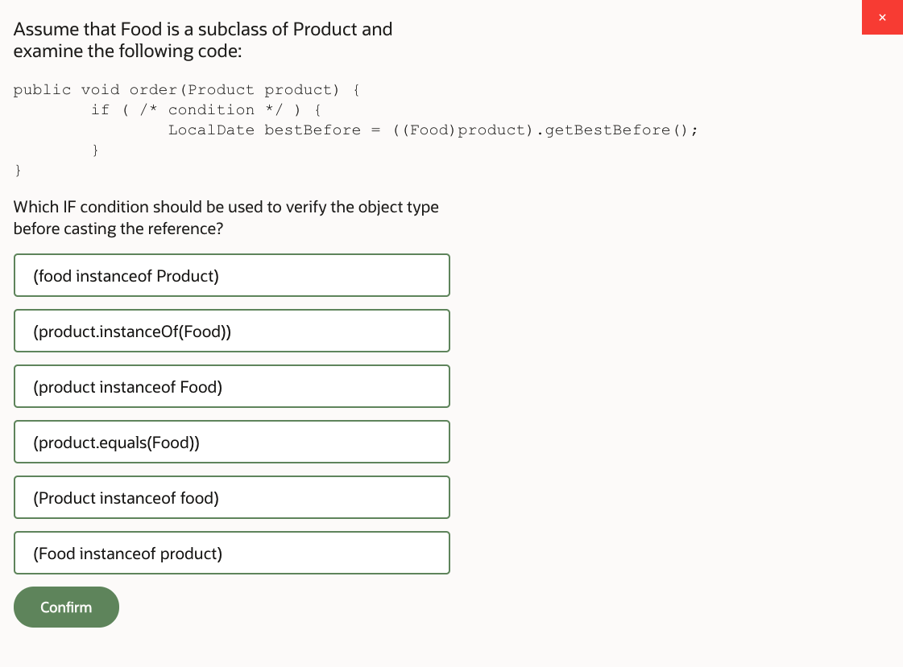
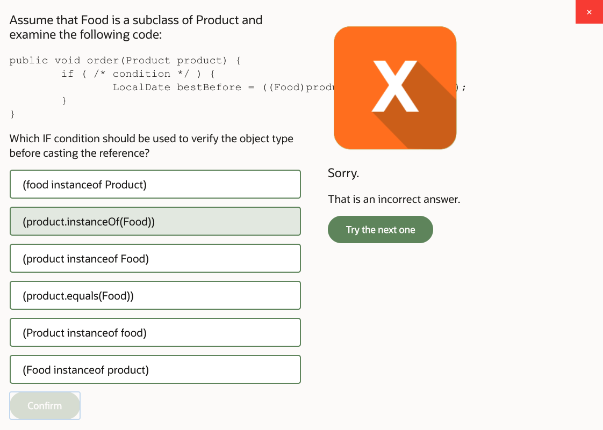
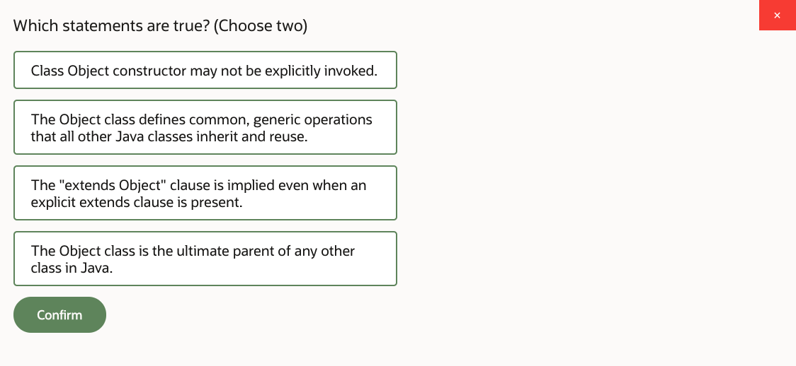
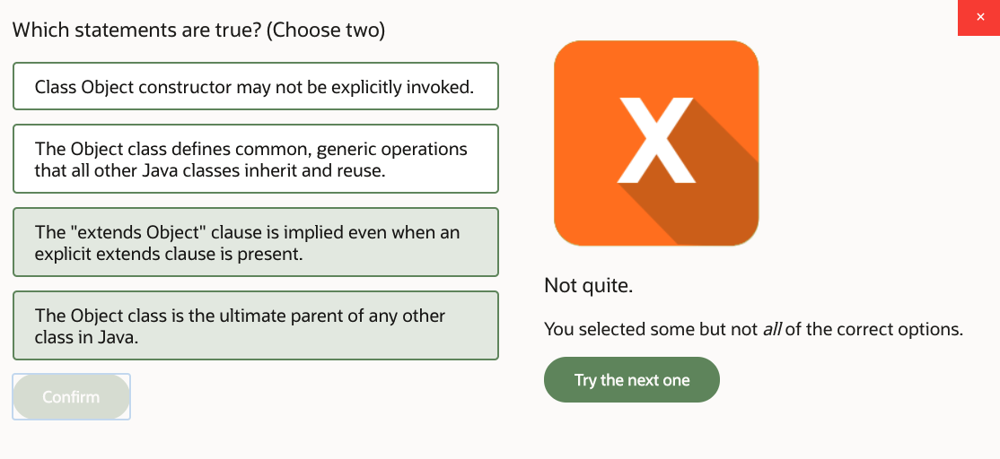
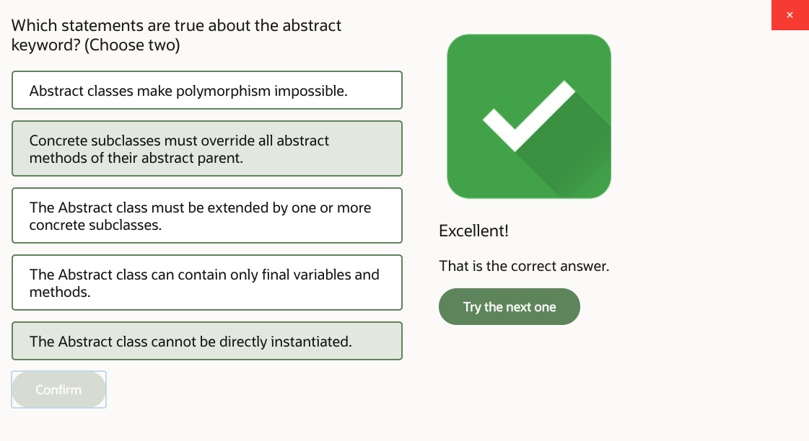

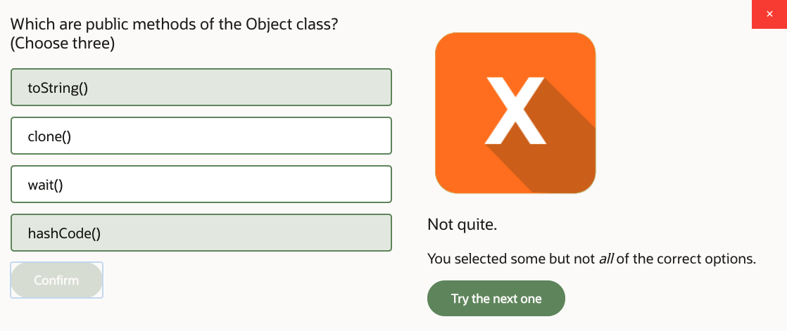
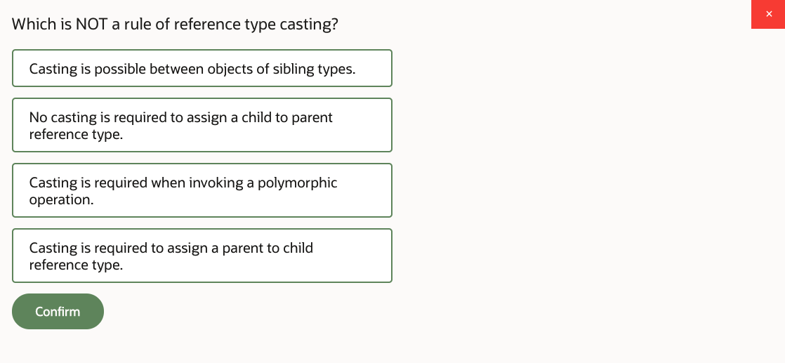
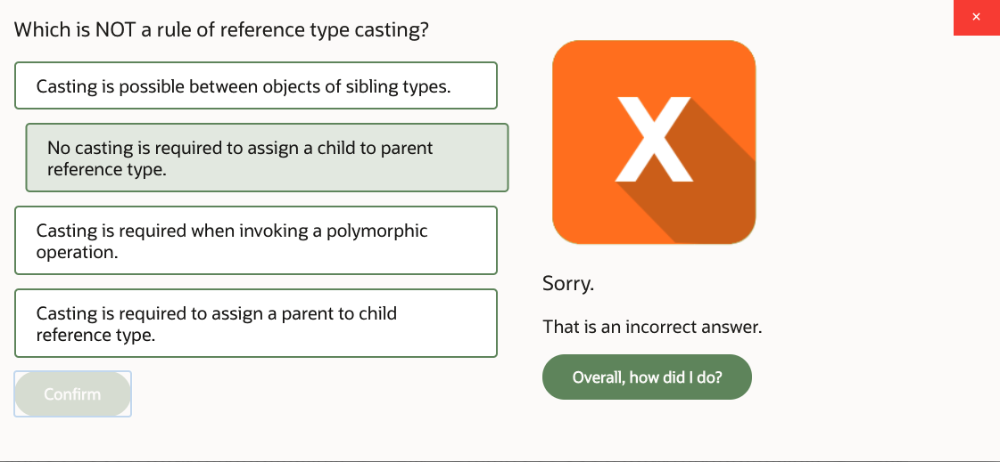

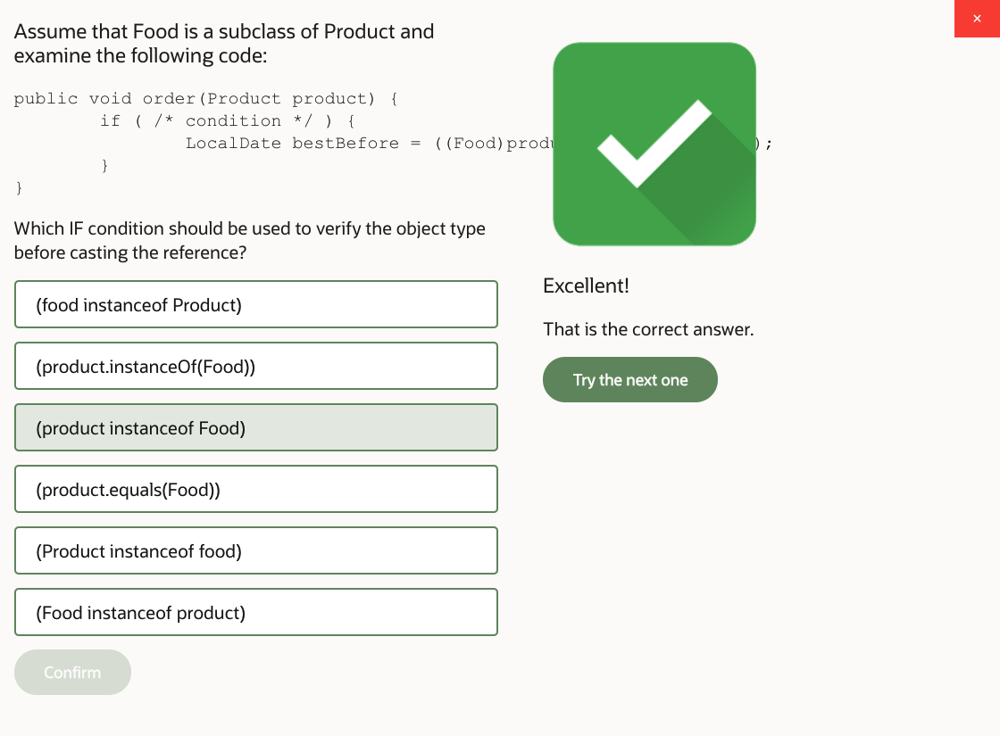
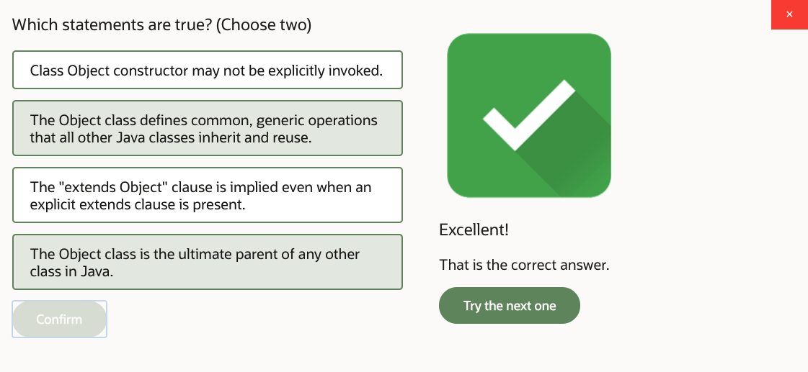

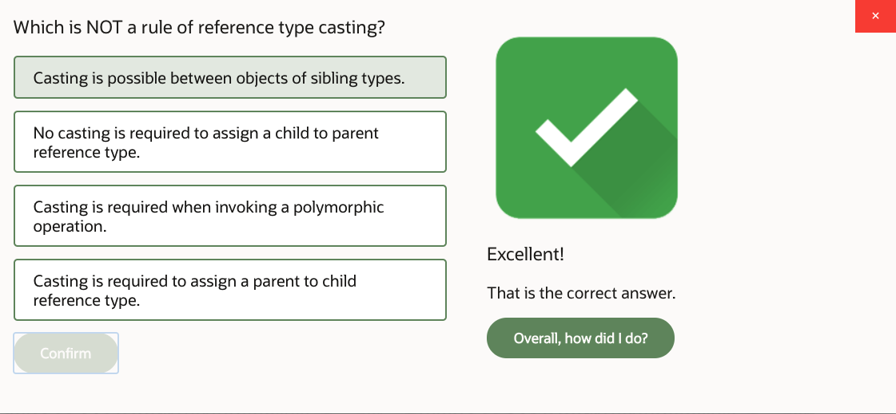

