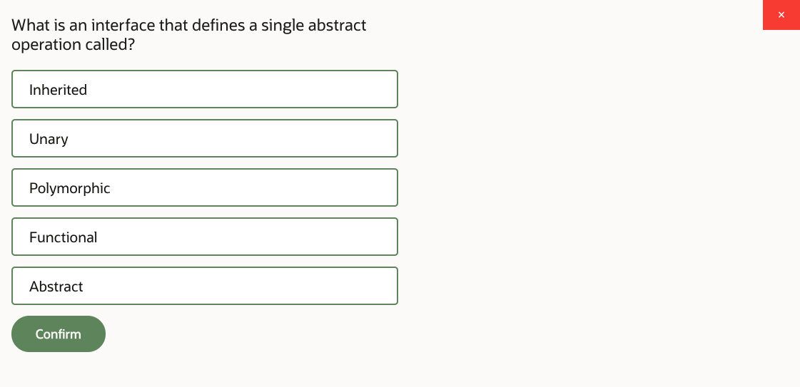
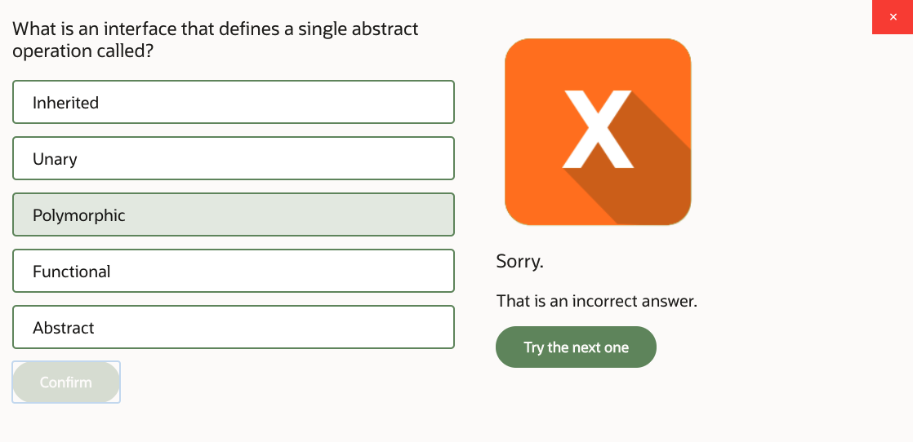
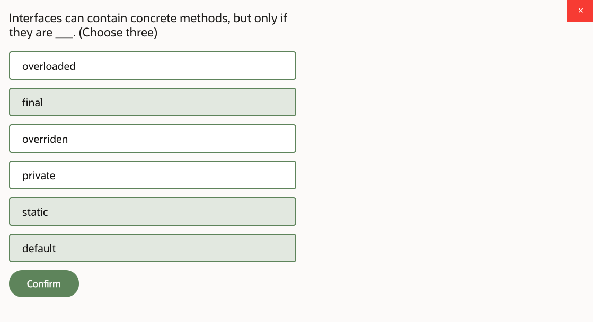
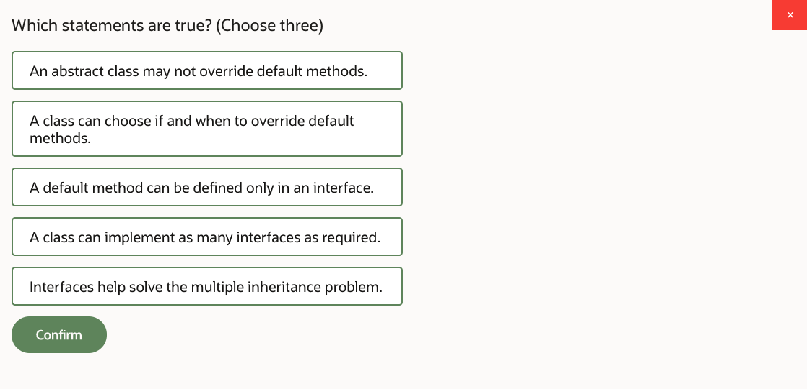
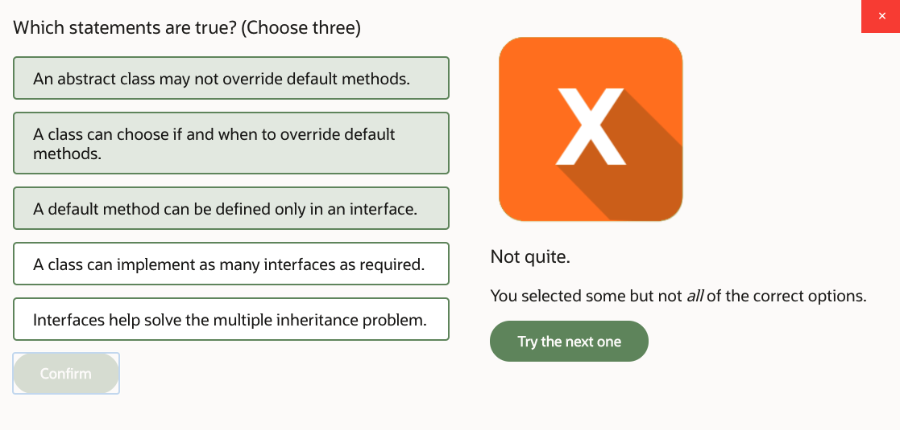
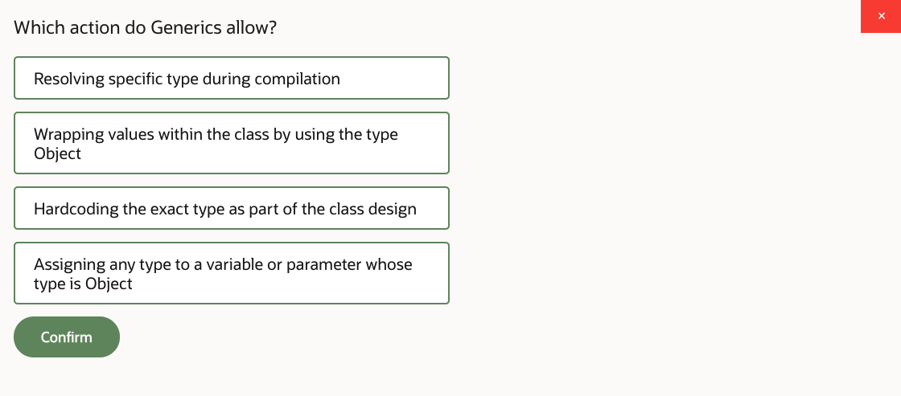
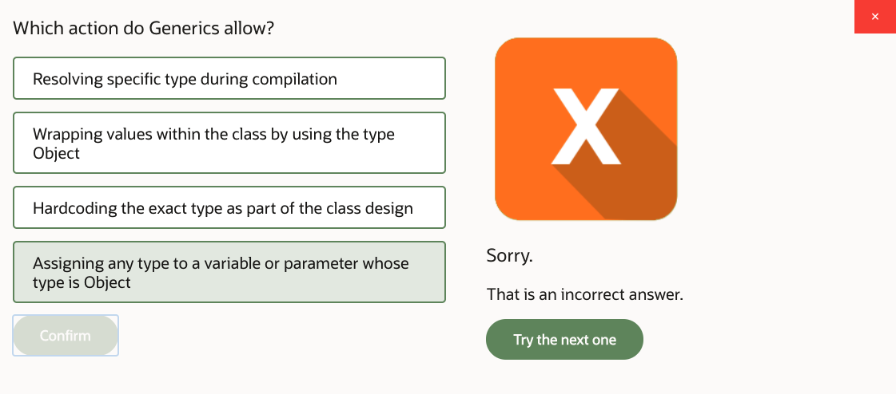
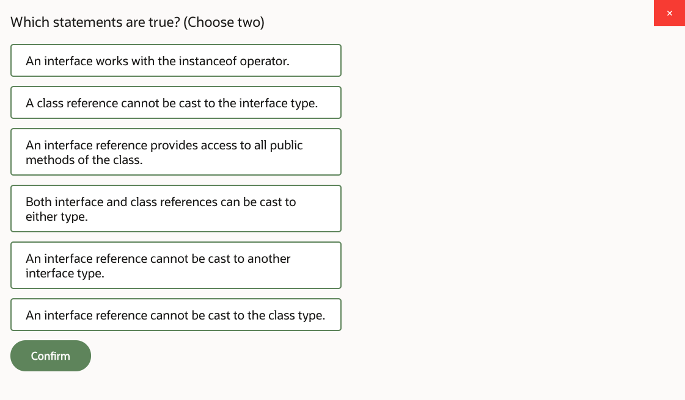
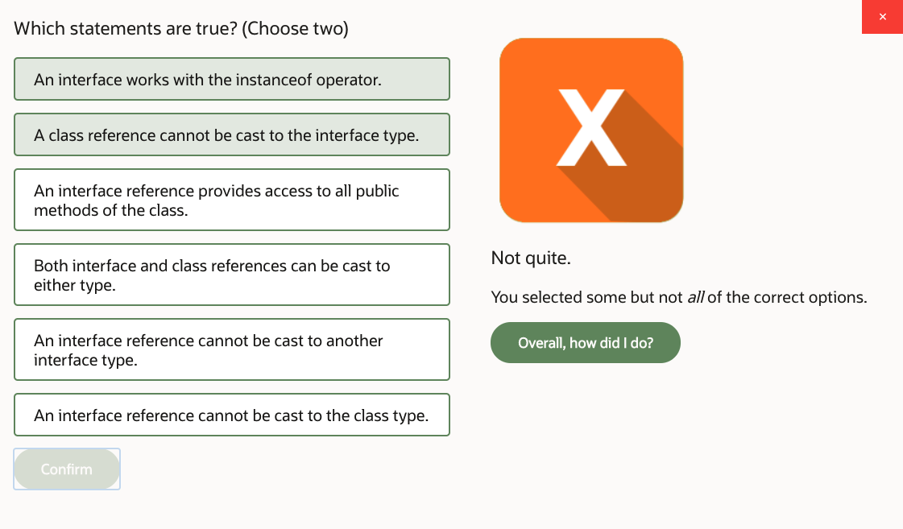

# 07: Interfaces

1. Interfaces, Part 1 24m
2. Interfaces, Part 2 22m
3. Interfaces, Part 3 15m
4. Practice 7-1: Design the Rateable Interface 27m
5. Practice 7-2: Enable Products Review and Rating 22m
6. Practice 7-3: Test the Product Review Functionality 5m
7. Interfaces - Score 80% or higher to pass

## 1. Interfaces, Part 1 24m

Let's take a look at this lesson that describes interfaces. In this lesson, we're looking at what the Java interfaces are, how do we design an interface, how do we implement an interface. And then we'll look at what type of things we can place into the interface. What are the types of operations we can put there? And apparently, we could put their abstract and non-abstract behaviors. And we're going to figure out why we do that, the rationale behind it.

We also talk about a slightly different topic. It's not directly related to interfaces. It's the topic of generics. But it's actually-- generics are often used with interfaces. So it makes sense to couple them in the same lesson. But otherwise, it's a separate topic, really.

So we then look at the commonly utilized Java interfaces. What are they? Just some examples, I guess, just to have a context of the typical use cases. And we also look at how interfaces can improve the design of our program, and we cite as an example a composition design pattern, which actually utilizes interfaces as well.

So let's start with the definition. What is an interface? An interface is a set of features that can be applied to various other classes. So if you look at this example, first of all, you'll notice that, instead of the keyword "class," we're using the keyword "interface." And what it means when you define such a construct-- that all methods are considered to be, by default, public and abstract.

So if you don't write anything, just [INAUDIBLE] definition, then, by default, the method is considered to be public and abstract, which is different from a regular class, isn't it? In a regular class, if you don't put the access modifier, well, that would be the default case, which is package visibility. But in the interface the absence of the access modifier on a method actually means public, strangely enough. And of course, abstract and, hence, there's no method body here. It's just a method definition.

Can you have normal methods in the interface? Well, not really. You could have methods that do have bodies but on certain conditions. And the conditions are these methods have to be marked as default or have to be private or have to be static. These are three cases where the concrete method body, the actual method body would be allowed in the interface for default private and static methods. Otherwise, methods are abstract.

Also, the interface describes constants. Well, you could use it to describe constants. But it can't have instance variables. They're not allowed in the interface as well. So in a way, you can think of an interface as a very restricted way of defining a class but the class that is definitely leaning towards being purely abstract, leaning towards not provision in concrete data and not having variables and not actually having normal, concrete methods. So in that way, the interface resembles the abstract class, right?

Now, why do we need this construct? What is the point of the interface? What we're trying to achieve with it? Well, hopefully, that would explain the restrictions, why the methods are, by default, considered abstract, et cetera. Well, what we're trying to do with interfaces is solve a problem, which is known as a multiple inheritance problem. It's plausible that a given class may wish to extend different parents. It's plausible to say that, well, drink is a kind of product, and inherit whatever methods the product has, whatever data the product defines.

But also, you could say, well, equally so, it's plausible to consider that drink is a liquid and inherit a different set of methods from the liquid. When you extend the class, you are inheriting everything that the class defines. You cannot partially inherit the code of the parent. You inherit the entirety of the parent code. And if the situation is that you inherit one set of operations from product and a different set of operations from liquid, then I guess you'll find there is no conflict here.

But what if they overlap? Now, in Java, extends clause can extend to only one specific parent. You cannot do extends that and that, comma, separated. You cannot write, drink extends product and liquid. That's not allowed in Java. It's allowed in some other object-oriented languages but not in Java. And the reason behind why it is not allowed in Java is precisely what I just described, the potential conflict between two parents.

What if they present you-- both of these parents present you with a method which has exact same signature, so in this case, public void, prepare, yes, so same parameter, same method name, absolutely the same, but a different method body. Then, from the perspective of the subclass, from the class "drink," if you try to call super, dot, that method, well, which one of them you're supposed to call, right? Which code should be executed? Because clearly, they might have different algorithms, and, hence, the conflict. And there is no rational, simple solution to this problem. How do you tell? Yeah, it's completely arbitrary. And there other the programming languages that run into this problem, precisely, which allow multiple inheritance.

Now, in Java, multiple inheritance, for this very reason, has been forbidden. So you cannot do the extends one class and the other. And yet, as we've just discussed, the natural modeling requirement to reuse the code, potentially from different classes, is very practical. You may wish to inherit that set of behaviors and the other set of behaviors, but that's not just possible without running into this problem.

It's not possible to guarantee that you would never have this conflict unless methods in a parent that can potentially cause the conflict are abstract. Oh, well, in that case, what do you do with the abstract method? You don't call, super, dot, that method because that's just not possible. Abstract method doesn't have a body, so you cannot possibly invoke it. But what do you do with that? You override it, and it's your child class version of the method that would automatically take precedence. Lowest available implementation of the method down the hierarchy is automatically invoked. That's polymorphism for you.

So if you have a pair of abstract methods with exact same signatures, the child just overrides, and then that's fine. Child provides whichever version of logic you want to provide. There is no conflict. So hence, the idea of the interface, which actually guarantees absence of such conflicts-- that's why the interface does not allow you to have regular, normal, concrete methods, that-- by default, the interface methods are assumed to be abstract so you have to override them.

So if there's an accidental situation when two different interfaces provide you with exact same method signature, that's fine. You can just override it once in a given child class, and you're OK, right? A similar logic goes for why the interfaces don't have variables, because, again, there would be a state conflict between two parents. If two different parents provide you with the exact same variable name but with two different values, then how do you know which super adult, which variable you're talking about, right? So that's anybody's guess.

But if it's a public, static, final constant, then you can always use the type to reference it, right? So you could say, that type, dot, constant, or, that type, dot, constant. You're not relying upon super because it's not an instance variable. So you're perfectly fine. You can distinguish these. So that is basically the rationale why multiple inheritance in Java is not allowed and why interfaces were introduced, to solve this particular ambiguity.

So once again, how do we solve it? How do we go about it? In this particular case, let's imagine we have a situation where we want Drink class to inherit features from different places, from different sources. So the Drink class can only extend one specific parent, extends product. You cannot put a second class on the extends clause. But when it comes to interfaces, you implement them through the implements clause, and that can contain a comma separated list. So you can say, implements this interface, that interface, and so on, as many as you like.

Let's introduce a real problem. Let's introduce a situation when two interfaces give you the method with the same signature. So we have this consumable interface, and we have a liquid interface. And they both define a method, which is, measure. It returns an index of no parameters. And by default, remember, it's public and abstract, right? So what do you do with a measure method? Well, you override it here. The class Drink will not compile unless it actually overrides the measure behavior.

One of these interfaces also introduces another public abstract method, which is consume, and you need to override that as well. But what about this default method? The default method can exist in the interface. It's marked with a word "default," right? It can exist in an interface, and it can actually have a method body. So hold on a second. Can that cause the conflict? Potentially, yes.

But here's a story. If your class-- in this particular case, Drink-- implements a number of interfaces and gets the default method from one of them and this default method does not coincide, signature-wise, with any other default method so the other interface doesn't have a method with the same signature, then you will inherit this default method into the class, drink, as usual, as if it's a normal concrete method.

However, the moment you have a conflict, the moment you implement some other interface in the drink class, which actually provides an identical method signature in another interface for the default method-- so there's another interface which also has public default void prepare-- Compiler immediately starts treating the default method as if it's abstract. So it basically will insist that you then override it.

So the idea is that you can inherit concrete code if there is no conflict. But if it does cause the conflict, just treat it as any other abstract method. Override it in that particular class and, hence, resolve the problem. Resolve the conflict because your implementation of the method, lowest available [INAUDIBLE] of the method down the hierarchy, will be automatically invoked due to the polymorphism. So that's why the default methods are still allowed.

Now, if we remember, there were two more things that were allowed in the interface. There were private methods that were allowed and static methods that were allowed, right? So everything was abstract by default, but you can't have default methods which are inherited but treat it as if they're abstract if there is a conflict. And then you could also have private and static methods in interfaces.

Why private and static methods are allowed? Well, here's the answer. They never cause the conflict. The private method is not visible outside of a given class or interface anyway. So your child that implements the interface can't possibly see the private method. Even if there is a conflict between a pair of private methods and different interfaces-- so what? They're not visible outside of these interfaces, anyhow, so it doesn't matter.

And as for the static methods, the static method can always be invoked by using the type rather than the instance. So you could say, for example, there's an interface x and there's an interface y. And if I say x.d or I say y.d-- as in this particular case, x.d, y.d-- then I'm unambiguously pointing to specific static method, even if its signature actually coincides with another interface. Of course, I cannot do, in this case, z.d, because this class, z-- yeah, it does inherit the method d from these interfaces, but the method d's not actually described in the z type. So it's not part of a z class. It's part of x or y, and that's why the qualifier of specific type should be used to reference the static method. So that solves the problem.

But there a couple of other interesting things that are happening in this example. So let's just take a closer look. First of all, we have a class W that has a method e. We also have some interfaces here and, incidentally, notice that interface y defines an abstract method with exact same signature, e, as that class W, so they accidentally coincide. Interesting. Let's take a note of that. There's another interface, X, that describes method a. There's a conflict or coincidental match of the b method signature in both interfaces. And there's also the case with c and d methods. But as we've just discussed, method c's not visible outside of a given interface anyway. And method d-- you can always distinguish which one you're calling by using the type, so x or y.

So what about these methods e, a, and b? How do we go about implementing these? So let's imagine we have a class Z that actually extends the class W. So that means it actually inherits concrete method e. The class Z technically now has a concrete body for the math at e, because it has inherited that body from the class W.

The class Z implements interfaces X and Y. There is a method a, which is an abstract method described by the X, and the class Z must override it. There is a conflict between the pair of default methods, hence the class Z must override the method b. If only X or Y would have the b method, then there will be no requirement to override method b in the Z class.

But now there is a conflict. So actually, default method is instantaneously treated as if it's abstract, and hence you must override it in a class that implements corresponding interfaces. So you override method b.

Now, what about method e? Clearly, you have to override that. But you see, the class Z already inherited the concrete body for the method e. So from perspective of Java Compiler, class Z can present a concrete implementation of method e, because it has one from the W class. It inherited it from the extends clause. So there is not actually requirement to implement the abstract method in this situation, because somehow you got the concrete method body for the matching method signature. So you'll be fine.

But now, a couple of things that I really want you to remember. In the interface, the methods-- abstract methods-- are by default public. Want to override method a here. Method a is defined here, and override it inside of Z class. I say it's public. I put the access modify here.

What if I will forget to put the access modify? What if a method will not be marked as public in the class Z? There was a rule that says when you override a method, you can widen the access modifier, but you can't narrow it. So if the parent class says the method is public, and you want to override it, you have to make it public as well. You cannot break the promise that a parent made. If the parent class tells the entire world something is public, then a child must respect that. If they override the method, they keep the public access modifier.

If the parent says OK well the method is protected, default, yeah, sure. It could be the case, right? So you can have a method in the parent class that's marked as protected or default. Then a child can make it public if it wishes, but it cannot narrow. It cannot, for example, make it private.

So if the method is protected, then the child can make it public or protected. If the method in a parent is described with no access modifier, default case, then the child class can make it default, can make it protected or public. Cannot make it private. So that's the idea. It can widen the access modifier. You can't narrow it.

With an interface, the tricky problem is that the default isn't default. The default is actually public. So bear that in mind. You cannot describe the variable a as default in the implementation class that implements that method. It actually has to respect the fact that the interface is promised to the entire world. That's a publicly-available method.

So that's a small difference between override in a method and a class, where the access modifier is expected to be explicitly spelled out, or else it's the default, and the interface where the access modifier on the abstract method is actually public implicitly. It's a quirk of syntax, but just bear that in mind.

Now, can an interface extend another interface? Yeah. And that's all there is to it. So if you have a particular class that implements interface X, they only need to override in method a. If the class implements interface Y, then they need to override methods a and b. And if the class implements interface Z, then they will-- sorry, Z class is the example of that. Z class implements Y, so it has to override both methods. There you go. So yeah, sure, the interface can extend another interface, if you want to.

Now, interfaces are treated as proper valid Java types, just like classes or, you know. So they are regular types. And you can actually describe a variable type of interface. What you can't, obviously, do is directly instantiate the interface, because it has abstract methods, right?

So remember, like with an abstract class, you cannot say "new" on the abstract class itself. You can say "new" for a subclass that provides concrete methods for the abstract methods or the parent. Same as with the interface. You cannot instantiate interface directly. You have to subclass it. You have to implement it. You have to provide the actual bodies for abstract methods.

But nevertheless, you can treat the interface as a perfectly valid Java type. You can describe a variable type of interface, absolutely, and then assign to it a reference to a specific instance of some class that happens to implement that interface. So that's perfectly valid construct.

And of course, in this particular case, let's imagine I have this class Z that implements the interface Y. And then if I create a new instance of Z, I can reference it as Z type. Of course. That's a specific subtype. And through that, I would be able to call any methods that belong to the object class, any methods that are described by Z itself, sure.

But then I could also do things like is Z an instance of Y. Instanceof operator works perfectly fine with interface. It suddenly will tell me, yes, it is, if the class implements a relevant interface. Then you can take this Z reference and cast it down to be of a Y type. Sure, you could do that. Interface is treated as a type exactly as any other class. There's no difference.

What can you invoke through the Y reference? Well, only those methods that actually describe by that interface. And guess what? If you call method a here, you will be calling lowest available implementation of the method a down the hierarchy, which is actually the one that's provided by Z class, I guess.

What about method b? Can you call that? No, because the method b is specific to the Z class. You actually have to have a reference type of Z to see that method. So you cannot call it that. It will be an error.

What about methods of the object class? Well, they are available for all Java classes. You cannot possibly have an instance of something, whatever it is, that doesn't have the two string equals hash code, et cetera, methods. They are mandated. They are inherited from the object class, regardless.

So even if you are referring to the object using some kind of an interface, still, you can call the operations that are described by the object class. And if the class-- concrete class-- that implements that interface overrides these, fine. You will get your lowest available dictation of these methods down the hierarchy, or else the default version of these methods from the object class will be invoked for you. So these are the perfectly plausible things you could use to invoke upon a reference that is type of a certain interface.

So you can always look at a given object and interrogate it and see which interface it implements, [INAUDIBLE] instance of these, instance of that, cast to the interface type. You can have parameters types of interfaces. You can have return values types of interfaces in methods and invoke relevant behaviors.

## 2. Interfaces, Part 2 22m

Now here's an interesting idea. It's called a functional interface. And the reason it's called a functional interface is because it describes a single abstract operation-- single method. Just one.

I guess the functional interface could have a number of different default methods or private methods or static methods, but it only gives you one abstract method. If that is the case, there's something very important about this particular design. If your interface gives you multiple different operations, like the interface X, any class that implements it will have to override all of these abstract methods.

But say, for example, I don't want to override methods A, B, C. I just want override one of them, but not all three. I can't do that. If the interface describes a number of abstract methods, I have to override them all. I can't override one of them. So the class that implements that interface will have to provide concrete methods for each and every abstract method that you get from the interfaces you implement.

It could lead to the situation when you start creating dummy method bodies, because your compiler is forcing you to override the method, and yet you don't want to do it. So what if you design interfaces to have just one method? Then you can implement as many interfaces as you like in a given class-- implements clause, comma-separated list.

And you will only override methods you want, because if you don't want a certain method, then just don't implement that interface. You can combine interfaces on a given class, sure, but you cannot break the interface into two if it's described as just one unit. You actually have to refactor the code and design it as two different interfaces, or three different interfaces, or however many you need.

So functional interfaces, apparently, are a recommended approach. You don't have to form interfaces that way, but I guess it will be more flexible, because if each interface describes just a single feature-- single function-- then it's easy to combine them in any design as required. And the other way around, well, will be rather inflexible.

Now, that is actually it for interfaces. And one important conclusion from the interfaces part that we can draw is that, generally speaking, the purpose of an interface is to describe some kind of programming feature. It could come with a number of default, static, and internal-use private methods-- private methods could be invoked, for example, from default methods of that interface-- but it always comes with some form of convention of what implementing a feature entails.

So if you have a class that implements a certain interface, then you have to provide concrete methods for whatever abstract methods the interface described. So provision some kind of implementation for the feature. Interfaces can easily be combined in any combination on a given class, and thus they're much more flexible than the extends clause, which confines you to just a specific parent.

And it's way more rigid in terms of what you can inherit. The interfaces are way more flexible in that regard. So they solve the multiple inheritance problem in a convenient way. That's the way we can summarize it.

Now we have a bit of a change of subject now. We'll talk about generics. And although generics is really a separate topic-- not really related to interfaces directly, per se. As we'll find out in a moment, they're actually often used together. So these two different coding techniques are often used together.

But anyway, let's just take a look at generics first. Generics are a relatively recent Java feature-- well, give or take. It was introduced in Java SE 5. That has been a while now. But anyway, it hasn't been there from the very first version of the language. Yeah, that's what we're saying.

And thus, Java code can be written in these two different styles, pre-generic style and post-generic style-- pre-Java SE 5, post Java SE 5. So there is a compatibility between these modes, but let's just compare what these code styles are, and then figure out why we care about generics-- why they were introduced.

First, let's assume the following design problem. I have this class Some, and inside the class Some I want to store a reference to another object, and I don't know yet what it is. I don't know. Is it a product? Is that a string? Is it customer? Is it what?

I want to be flexible about it. I want some class to be a wrapper for a value, and I don't yet know what is a specific type of the value that I would like to use. And that's a problem, isn't it, because Java is a strong-type programming language, and it doesn't allow you to create variables that don't have types. You actually have to describe a type for every variable.

Of course, there is a type that all objects eventually are compatible with, and that's a type which is Object, because everything in Java descends from the class object. So if you create a variable type of Object then you could put a reference to that variable that refers to anything you want.

Absolutely any other Java object can be referenced from it. Sure, that's perfectly plausible. And then you can have methods that set that object, get that object-- whatever. So that's the way you do it.

With generics, you use a slightly different construct. You use this token here with greater and less than signs, and the generics identifier. Well in this case, I'm using the letter T, but actually, that's not a keyword. That's not a reserved word.

It's an arbitrary text. You don't have to call it T or whatever. But conventionally, people use certain markers, like T for type, V for value, Key for Key, but you can mark it any way you want it. That's just convention. That's nothing more than that.

So you're saying there is a certain thing that the class Some will have to contain, and I don't know yet what it is. And you describe a variable type of that thing-- whatever it is. And you describe getter and setter methods for it that return or accept parameters of a corresponding type, and yet you don't really know what the type is yet.

When it comes to using this class, this would have to be resolved. The compiler will have to resolve which specific type you will use when you will use it. But when you define the class, you don't have to say which type you intend to use. You defer that decision until a later point, when you actually start using it.

So in an eventual compiled code-- in resulting code that you will use when you use that class Some-- that type will be resolved to some specific type. But at the stage when you define the class Some, you allow anything in there. It could be anything at this stage.

How are generics actually physically used? Well on the left-hand side, this is a pre-Java SE 5 code without using generics. On the right-hand side-- that's post-Java SE 5 code with the use of generics. And without even me reading the details, you can clearly see which one is shorter, so generics definitely allow you shorter coding.

But there are more advantages to that. It's not just the fact that the code looks shorter. On its own, that's kind of whatever. It's not a big deal. But actually, there are some tangible advantages of using generics beyond the shortness of code.

So let's first try to figure out, without generics, what that left-hand side scenario would look like. Suppose I have this class Some and I would like to store something inside. And it could be anything, because the class Some, remember, without generics, allows me to just store whatever I want-- like objects, whatever.

So Object is a reference type compatible with anything, and I could put product, for example, or on the next line of code I put there something, which is a string. So I could store anything I want inside a class Some. The compiler wouldn't have any objections-- put whatever you like.

And if I get the value out of the class Some, I get it just as Object. I don't know what it is. Because I could put anything I want, so how do I know what's inside? I don't know.

And I can then look at that value, and I can say, oh, are you a Product? OK, cast it to an instance of Product. Are you a string? Then cast it to string. So I have to do these tests, where every time I extract the value out of the object I have to verify what that actually is, because inside of class Some it could be anything.

With generics, however, look at the syntax. When I declare the variable type of Some, I will substitute that placeholder-- you remember, T-- I will substitute it with the particular type I would like to use. So when I describe this variable, I say actually, on this particular occasion, I want products to be stored in Some class.

By default, you just repeat the greater and less-than signs on the right-hand side of the expression, and by default you actually don't have to repeat the type. It is implicitly repeated. So if here you say I'm storing Products, then on the right-hand side-- well, you can actually say you're storing Products as well. You can repeat the word Product on the right-hand side as well, but you are not obliged to do it. It's implied that that's how the variable is declared, so hence it should be storing Products inside.

There are cases when the right-hand side and the left-hand side can actually be different, when this expression here can contain slightly different expressions, but they're covered in the appendix on generics. They're very advanced cases, and well, frankly, not that often used as well, so they're tucked into the appendix.

All right. So generally speaking, this is it. You just say, I have this use of a class Some, and on this particular occasion I want it to contain just Products. And if I set the value which is a Product to it, I'm fine.

But if I try to set something that's not a Product-- in this particular case, string something-- I'll actually get a compiler error. The compiler validates the generics for me, it resolves them, and then actually validates that I don't put something stupid into that Some class, because the way I describe this Some variable is with a restriction-- which specific generic would I like to use on this occasion. So that Some is a placeholder for Products, not for anything else.

And of course, if I create a different variable here, I could have a different restriction. Every time I use the class Some, I could say, oh, this time I'm storing Products, and on some other occasion I'm storing customers, and strings, and shops, and whatever I like. And of course, depending on what it is that I've qualified here in this expression, my setValue method will immediately accept only things of that type. I will only be able to put products in there, not shops, or customers, or strings, or whatever.

And then when you get the value, you get it as a specific type. You don't get it back as Object. No, no, no. You're getting it as whatever you prescribed that you want it to be. You're getting it back as a Product, so you don't need the instanceof checks, the casting of types that you had to do otherwise.

And it's compiler-validated. You cannot accidentally make an error here. You cannot accidentally put something inside that does not belong according to your own definition. And yet inside the class Some, you didn't hard-code it-- what the type is that the class Some instances should use in the future. And you could decide it on a per-use case basis-- on one occasion you use one type, another occasion you use another type, and every time that will be compiler-validated for you.

OK, so that is the advantage of generics. You're getting code that works flexibly, and yet you're doing it in a way that's safe-- that does not drive you to write these convoluted code constructs which require you to test what you're getting back before you cast to make sure that you're consistently using a certain object, because it is declarative. You declaratively define what type of generic you want to use, and the compiler can validate it for you now.

Now, the reason why generics are mentioned in this particular chapter-- well, first of all, generics need to be mentioned somewhere-- but also because often, when you use interfaces, you combine them with generics. Think about it this way. An interface q a definition of a set of behaviors-- and a functional interface is probably just one behavior, but otherwise a set of behaviors-- that lots and lots of different other classes are expected to implement. You describe something that is a feature that you want to implement in other places.

So you apply the interface to different classes. There will be different circumstances in which it is used-- different types to which it is applied-- and hence it's very likely that you would like to combine that with generics, because generics also allow you to decide-- resolve the type at compile time.

When you describe something you just describe it as generic, and when you use it, that's when you resolve what the actual type is. So in fact, the implementation of the interface and the utilization of generics is commonly used-- together features. Anyway, well, let's take a look.

So here's an example of an actual, real-world interface-- well, one of many-- from the Java Development Kit. So this is an interface called Comparable, and it's designed to introduce a feature-- a behavior-- which allows you to compare things.

So the Comparable interface describes an abstract method called compare-- compareTo, sorry. Describes an abstract method called compareTo. That compareTo method returns an int, and accepts something. If you look at the comparable definition, it actually uses generics. It says, well, you tell me what I should compare, right?

The definition of the Comparable interface does not hardcode the type that you're supposed to be comparing. It describes it as a generic so you can decide what it is that you want to compare.

All right. So the compareTo method apparently has the in logic-- what are you supposed to implement? So when you implement an interface, you're supposed to override the compareTo method, and this is what the method is supposed to do.

It compares the current object which implements that interface to the parameter-- to that parameter that you require for the compareTo method. And it compares it, and it decides which one is bigger or smaller. What do you think is bigger or smaller for a given object? It's entirely up to you.

For example, imagine you're comparing numbers, and you can say, OK, well that's a bigger number, that's a smaller number. Great. Or you're comparing strings-- well, maybe the string that is earlier in the alphabetical order is smaller, and a string that is later in alphabetical order is bigger.

Or maybe you're comparing dates, and then you look at the timeline, and you say which date is before or after, and the one that's before is smaller and the one that's after is bigger. So that's the idea. It's arbitrary. It's up to you. So you decide upon the way in which things are compared, and you decide what constitutes the less than or greater than case.

Guess what? This is the grounds upon which you can perform sorting of objects. If you've got a number of objects and you want to put them in a particular order, then comparing them to one another and deciding, per comparison, which one is less than or greater than allows you to put them in a particular order.

To indicate the order, the compareTo method simply returns either negative, positive, or a zero integer. So that int is a negative, positive, or zero value. And if the current object is less than the parameter, you return a negative value. If it equals to the parameter, you return a zero.

If it's greater than the parameter, you return a positive value. You can return minus 1, plus 1, and 0, but that actually doesn't matter. You can return any negative or positive number.

Lots of classes from the existing classes in the Java Development Kit already implement this interface. For example, in this particular case, I'm using a variable name, which is type of string. And I call compareTo method upon the variable name. And the reason why I can do it is because the string class already implements the Comparable interface.

So if you want to compare text, it's already there. The functionality is already there. If you want to compare dates, if you want to compare numbers-- they all have the grounds of comparison already present and ready to be used.

But frankly, if you need to compare a pair of primitive numbers, you can just subtract one from another. You'd get positive, negative, or zero, right? That's all you need to do. Just return the result of subtraction of one value from another value, and that's your comparison. But when it comes to other classes, you could assume that lots and lots of existing JDK classes already implement the Comparable interface. You can clearly see that.

So in this particular case, in my class Product, I'm saying, OK, I'd like to implement Comparable. I would like Products to be compared to other Products, which makes sense, right? And then override method compareTo. And within the method compareTo, I utilize the fact that the name already has the compareTo method implemented, so just basically compare product names.

And guess what I get. If I would form an array of Products-- and we'll talk about arrays later, so never mind-- but OK, there's a collection of products-- whatever. So there's some number of Products, and I want to sort it. And there are classes in the JDK that do the sorting, and we'll cover it later. Don't worry about it. We'll talk about it later.

But anyway, if I've got this array, and I want to sort that array, there's an operation-- the sort-- that I could use that will actually iterate through the array for you, and will call the method compareTo on every pair of objects in the array, and will rearrange the order. All you need to do is to provide a ground for such rearrangements.

You need to tell it how you want things to be sorted-- sort Products by name, sort Products by price, sort Products by date-- whatever. Whatever you want. You write that algorithm inside the compareTo method. The sort method will do the rest. It will rearrange the collection for you. OK, so that's a typical example-- Comparable.

## 3. Interfaces, Part 3 15m

Let me show you another one which is comparator. It's very similar to comparable, but it introduces a second parameter in the comparison algorithm. So the previous interface, method compare two, was comparing a parameter to this, to the current object.

The comparator compares two parameters between each other. So it doesn't assume that a comparison is to the current object. That's the difference.

So comparator interface compares two objects that it receives in compare method. It means that, when you design class such as product, you don't actually have to say implements comparator in a product class itself, because comparator is capable of comparing two values. It does not require the data object of yours, which is a product, to actually implement it. Because it does not imply that you have to compare to the current object, like the previous interface did.

So here, you could create a separate class. Suppose it's called product name sorter or whatever, just any class. And then you say, implements the comparator for products. So you override the compare method using that product generic.

And then you are comparing, in this particular case, product one get name compare to product two get name, which is basically the same algorithm as the previous example did, compare in sorting products by names. The difference is that a sort method allows you to pass anything that implements comparable interface as an argument. So the method sort first parameter is what you want to sort. Second parameter, which comparator would you like to apply?

And guess what? You can write multiple different comparators. This particular comparator sorts products by using names. And another comparator could sort them by prices, et cetera, et cetera.

So you can have as many as you like. And when you need to perform the sorting, you just apply one or the other comparator. You just create an instance of whichever comparator you want. So you implement that interface to provide grounds of comparison that are not hard-coded into the product object itself, as was the case with comparable interface. So comparator can be implemented separately and sort of applied when necessary to the sorting algorithm.

One more Java interface that I would like to draw your attention to is an interface called cloneable. Now, this is an interesting interface. It is defined with absolutely no operations. It doesn't have any abstract methods.

Wow, you know, why do I need an interface that doesn't have any methods? What's the point of it? I don't need to override anything.

If my class implements that interface, then it's not required to actually override any methods at all. Because there are no abstract methods whatsoever inside the interface cloneable. It does not define them.

And there are interfaces in Java like that. And we call them type markers or tag interfaces. That's kind of class of an interface.

And the purpose of such interfaces is that they are still used as valid types. The interface, remember, is a type. You can test if something is an instance of that interface.

So you can have a class that implements it. And if you say, the object of that class, are you an instance of that interface, it says, yes, true. And then there might be another class that doesn't implement that interface. And then you ask an object of that type, are you an instance of that interface? And it says, false, right?

So essentially, that could be treated as a design permission, as a feature that enables something to be done with instances of a certain class. It does not entail any specific behaviors that you must override, but it still will work in the instance of operation and will yield you true or false. So you can tell if a certain class implements something or if it doesn't.

In the cloning scenario specifically, clone method exists in the object class. It's already there. It's already coded.

So here's the class object. This is a snippet of code from the object class. It's not a complete code, but just a small kind of idea of what the code is.

Anyway, so in the object class, there is this method called clone, right? And it has this block of code. If current object, this, is not-- there's an exclamation mark-- an instance of cloneable, then throw the exception.

Don't worry about exception throw in syntax. We'll talk about it later. The point is it will refuse to execute the clone method if whatever you're trying to apply the cloning to, whatever object you try to clone, does not implement cloneable interface.

So what the clone method does is that apparently creates a replica of the object in a heap. So it takes the object in a heap and creates a replica, right? If you say you've got a class product and you say it implements cloneable, then you permit cloning to be performed.

You can override the clone method. And you call superclone to make things happen, right? So that one enables cloning.

If you are not saying implements cloneable, if you don't do that and you try to call the method clone upon your class, you will fail. Because the clone method in a parent will throw you an exception. It's designed to do that. It's designed to check if you implement in a cloneable interface on a given class or not.

And it acts like a permission. When you design a class product, by saying implements cloneable, you essentially permit instances of product to be cloned. If you don't implement cloneable interface, then you don't permit it. It's as simple as that.

So you can code algorithms in your other classes and other methods that test if something is an instance of an interface. And in that case, it is like a type marker. It's like a tag with which you mark other classes and say, OK, well, they do implement that.

So, sure, you can use that particular object in the sense that an interface specifies whatever the consequences are of implementing this or the other interface, whatever is the meaning of it, right? But you're not necessarily required to actually override any methods. That's completely different story. So you just use it as a permission, as a marker, to allow some kind of action to be performed with objects of that type.

OK. Now, lastly, a practical angle on using interfaces. And also, we're kind of returning back to the very first topic where we've started this chapter, a topic of introduce interfaces to solve multiple inheritance problem. So there is this practical angle.

Let's imagine that I need to combine features that are presented by different classes in one class. So I have this class bank, right? And what I want a bank to do is to be able to provide me functionalities to withdraw, deposit, authenticate, these sort of things, as you do with banks.

But then the reality is that I have some other classes, for example, class account, class security. And they may already have concrete methods that do these jobs. An account provides me with the deposit and withdraw functionalities. A security class provides me with authentication functionality.

And really all I want my bank to do is to combine these features together. Now, I can't use multiple inheritance to achieve that. I can't say, bank extends account comma security. Multiple inheritance is not allowed.

What I can do is implement any number of interfaces, of course. So what if I'll design an interface per feature-- functional interfaces, essentially. So I have an interface which describes how do I withdraw things.

I have an interface that describes how do a deposit things. I have an interface describing how to authenticate things. These are abstract methods describing how things are done.

And the class account, I say, OK, I'd like to implement withdraw and depositing and create concrete way of doing it. Write the code that does whatever it does. On a class security, I implement authentication. And again, I create concrete code. I do whatever the security is supposed to be doing.

What do you do with the bank then? I say that I implement same three interfaces. So I have to override same three methods, right?

I have to override the deposit, withdraw, and authenticate methods. And I do. I override withdraw, deposit, and authenticate methods.

But what I don't do is I don't write all the code from scratch. Instead, I create variables inside a bank class-- initialize them, of course-- that reference some account objects or some security objects. Yeah, these are these variables a and s.

And I literally delegate these calls to these other classes. When the bank receives the withdraw call, what does it do? It calls a withdrawal upon account.

Well, first, it actually calls the authenticate method, which actually delegates the authentication to security class. And then it does the withdrawal, which, again, just delegates it to the account class. Somebody calls them method deposit upon the bank.

And what it will do is, again, eventually transfer the call to the security class for authentication. And then we'll do the deposit. And that will transfer the call to the account class for depositing.

So the bank is really just kind of a wrapper, or combiner, a composition of features provisioned by the account and security classes. And a compatibility between the method signatures in the account in a security and in a bank is guaranteed by the fact they implement same interfaces. So by describing interfaces first, I guarantee that methods in a bank will have exact same matching signatures that are methods in the account and security.

So I can easily transfer the call and let whoever calls the bank, in fact, utilize the functionalities under the hood, utilize the functionalities provisioned by the account or security. The interface here acts as this great sort of binder things, as something that allows me to compose a class out of features presented by all the classes and where all features are described by corresponding interfaces. So it's a really powerful programming technique, which generally is encouraged.

Instead of using extends clause, which is really inflexible, you're encouraged to use implements clause and combine features this way, rather than try to figure out what it is that you're supposed to extend. Because then, you know, you can't extend anything else. You will be confined to one specific parent. This way, you're not. The composition is by far a more flexible pattern than inheritance.

OK. So we described the use of interfaces in this lesson. We looked at the practical problems that interfaces are trying to solve and the practical way in which these problems are addressed, the fact that interfaces describe us generally, abstract methods. But then they could have non-abstract methods, the default, the private, and static methods. The interface is often use with generics. And we then described the composition pattern as a kind of a practical angle of utilizing interfaces instead of just inheritance really, yeah?

OK. Now, the practical exercise in this lesson asks you to design a new interface called rateable. And the idea of rateable interface is to say, different things can be rated. You can rate products, which is what you're then asked to do, implement rateable within a product. But theoretically, you can rate other things.

You know, you can have other rateable things. Shops-- I don't know-- have ratings of whatever you like. With respect to the application we're designing, ratings will be applicable to products. But it's generally extendable to other types if you feel like you want to do that.

Then you're asked to design a review class. And the idea is that a review will contain the information about the rating, the comments, the assessments, the praising of a particular product. Is that product any good? So that's the review.

Rating itself is an enumeration you've already created in the earlier practice, which is rating something according to 1, 2, 3, 4, 5, whatever stars, yeah? But now, we also add in comments and review stuff. And that is what rateable interface is designed to convey, the idea that things can have these ratings. We also add product manager class to handle these product reviews and, also, format and print product reports based on the information about a product and review that has been provided for it.

## 4. Practice 7-1: Design the Rateable Interface 27m

Let's take a look at exercises for Lesson 7 in which we look at the way in which we write interfaces. So in this practice, the task is to design a new interface called Rateable to represent an ability to situate some ratings with different things. So for example, you can rate products. In theory, you can rate shops and whatever else you want to rate-- assign rating to somebody, to some object, so handle this association.

The idea is that we will need to change our existing design to incorporate this interface. And the change we're making is allowing reviews for products to contain these ratings. So a product becomes Rateable object. And then obviously, change the way we handle these products and reviews within the Product Manager class.

Well, let's start with some assumptions. Of course, the assumption is that you completed the previous exercise for Lesson 6. If you haven't done so, you can open solution for Lesson 6 and continue from the solution. So solutions are available from the Solutions folder. And then you continue from the Solution. Otherwise, you just continue with the project as you finish the Lesson 6.

So what we need to do is create a Rateable interface to implement this generic ability for different things to have ratings. For example, products should have ratings. Their idea is that we should have apply rating and get rating behaviors.

And it's sort of something that a product already has as a class. But we want it to be a more widely accessible applicable feature. So not only products could have ratings, but theoretically, other classes-- I don't know, such as shop, for example. How about shops could theoretically have ratings as well.

And to make this design of Rateable objects consistent, we identify what rateable behaviors, what features, should be present in that new Rateable interface. So to do that, what we need is to construct a new Java interface, a new Java interface wizard, and then fill in the details with the Rateable interface name. And let's put it in to labs.pm.data package. So create new Java Interface, Rateable, and place it in the pm data package. So it describes our classes as capable of having ratings to create this interface.

Now, what do we do next? So we created the interface. What we want to do is add generics feature to this interface. So we would like this interface to be applicable to different object types.

And we don't really yet know what all of these different types would be. Well, we have a hunch that it will be a product. But maybe we'll apply this interface to something else as well. So we reserve here this generics reference, so ability to parameterize that interface with generics. We'll make use of it in a moment.

Now, within the interface, we could add some constants, abstract, static, and default methods. So these are our possibilities. And for starters, let's create here a rateable-- in the Rateable interface, create a constant type of rating. Now, rating is an enum you created in the earlier exercise. Just to remind you, this is this enum which reflects what ratings could be, not rated one star, two star, three star, four star, five star.

So what we want is variable type of enum-- well, constant, actually, type of enum-- within the Rateable interface. Of course, the interface cannot contain variables. It has to be a constant. And this will indicate the default rating.

So if we apply rating somewhere, and we don't qualify what it is, what should be the default? And I guess the default, reasonably so, should be not rated. So public static final, rating is our enum, and the default rating, not rated. So that would be our default assumption for what the rating should be.

Now, after that, add an abstract method which specifies how ratings should be applied to whichever objects were supposed to apply them. The method should be added to this interface after this static final, constant definition, should be public, should be abstract, obviously. But you don't really need to actually spell out that it's public abstract, because in the interface, that's a default anyway.

And method should return that generic type. And the method will be called applyRating and will accept any rating as a parameter. So public abstract, remember, in the interfaces, that's implied. So if you don't spell it out explicitly, then that's considered to be a default. So just describe then return type, method name, and parameters, and no method body, since this is an abstract method.

Now, if you think about it, in the class Product, there is a method like this. OK, it's not using generics, but apart from that, it's actually exactly that idea. So if you look at the Product class here, look at the Product class. You can actually click in the navigator to find that method quickly. Here's the abstract method that already exists in a product. OK, it's not using generics, but it accepts the rating and returns product as a result. So it's a similar idea.

What we essentially do, and it's kind of extracting this method definition from the product. And what we will do is put it into the interface which we just did. Of course, that will use generic type instead of specific type. And that would make, potentially, this behavior applicable to other objects, not just to the product. So we opened up that design capability.

Now, we will also add a default method. So the interfaces may contain default methods. And the default method should return the rating. And the default assumption will be to return default rating, which is our constant that we created a little earlier.

Well, let's do that. So just a simple default method which we add to this Rateable interface. Again, format the code nicely so everything is aligned. So that's a default behavior.

There is a note here that says that such methods within this interface, they could return this predefined value rating. But the idea is that any class that implements the interfaces is free to obviously override this method. It's not mandated for them to override it, this method is not abstract. But they may override it.

So in a sense, the idea is that if a particular class that implements this interface didn't make up their mind as to what the rating should be, the default value will still work. If, again, you look at the way the get rating method in a Product class is designed, so if you compare that to the way get rating in a product is already written-- let's take a look at that get rating, there it is-- it's actually saying method signature.

Except, of course, we're returning here a specific rating for that product. Because product actually has the rating variable. So that's what it returns. But method signature-wise, this method is essentially, kind of, the same as this default method. It's exactly the same parameters, same return types, same method name, of course.

So we created this default method. Now, add another method, static method, this time, which converts-- this is interesting-- converts a numeric star value to the rating enumeration value. Let's remind ourselves what rating enumerations look like. So essentially, that's 0 stars, one star, two stars, three stars.

So we could say that these character strings indicating what the number of stars. They essentially have a numeric value, like 0, 1, 2, 3, 4, 5. So that's what we want to do, do this conversion between the enum text representation of the value and a numeric equivalent of that.

That may be very useful indeed, later on. We'll come to actually start calculating averages for ratings, et cetera. We definitely would like them to be numeric. So what we'd like to do is to have an integer number of stars and then return the rating equivalent. Great, let's do that.

So that's our method definition. And I'll put it into the Rateable interface. And it's a static method, which kind of makes sense why it's static, doesn't it? It's not, per se, specific to any given rateable item. How you convert that number of stars, like five stars, to the rating enum value is same, regardless of where this rating is applied to. So it's not object specific, and therefore, it stands to reason it will be a static method.

Of course, we still need to provide the actual logic for this method. So that would be our next step. So how do we do this conversion? The implementation logic of this convert method should return the rating enum value for corresponding number of stars. All Java enumerations provide a method called values which returns corresponding enumeration objects as an array.

Ah, so we can actually relay upon that. So we can get this list of ratings as an array just by calling values method. Great, so we know that it could be done.

And of course, arrays are covered later in the course. But for the purposes of this particular exercise, all we need to know is the array starts from 0. So the first entry in that array will be 0, then 1, then 2, then 3, et cetera.

So that basically means that, based on the order of these rating items here, we could basically derive-- based on this order, we could derive the numeric equivalent. So the first one not rated will be zero, then it will be one, then it will be two. Because that's the order in which they were listed here. Well, we can rely upon that. That's part of the rating enum design. That's how it was designed.

So what we need to do is to create a method that will analyze the number of stars provided-- the integer number of stars provided-- and we'll get an item from the array on that particular position. So here's the logic. So we already have the signature of the method convert. All we need to do is add this return statement.

Let me talk you through what's going on here. So the logic of this method-- let's format it nicely-- goes like this. Take the stars parameter, and first of all, check if it's between 0 and 5. Because if it isn't between 0 and 5, then that's definitely not a valid rating. So we only have these six enum values from not rated to five stars. So these are our value boundaries and we validate that.

Then we invoke the method values upon the rating object. So that returns us everything that's in the rating as an array. I know it's a little tricky, but notice-- this is very important. So rating-- this is our enum-- dot, do you see the method called values here? There it is. That returns the rating.

All enums possess this method. It's implicitly available for any enum. Did you write this method? No, you didn't. It's implicitly available for any enum. If you look at the enum rating, you won't find the method values here. It's implicitly available, so you just invoke it. So it's a bit of a magic regarding the enum type. So you can get values from the enum this way.

And then you use an index, square brackets, and the index value, which is the number of stars, basically. That would be the index if it is between 0 and 5, otherwise just return default rating, which is not rated. We know that already. So this is a reasonable default behavior, I guess.

OK, nice, so that's your conversion. You take the number of stars and you return an actual rating object back. Now, so we expect that the logic of this statement will assume that rating is between these boundaries and derive it for us.

And another default method to the Rateable interface which applies rating as an int value. So we want to be able to apply the rating we currently have, applyRating method that takes rating as an enum instance. And what we want is an equivalent of that method. But that would apply rating as an int.

So that's pretty straightforward, right? So it should have similar signature, except that should be a default method. OK, let's do that.

So here the signature is public abstract return T type applyRating, accept rating as an argument which is the rating object. And here the signature, it's the default method, returning the target type for the generics. Method is also called applyRating, so essentially, it's an overloaded method, basically. And that accepts the rating as an integer number of stars.

And now what we need to do is provide some logic for this method. It's not an abstract method. It actually has the body. It's the default method. So the logic would go like this. An implementation for this method should use a conversion.

Conversion is available already, we're just reading that. And we convert from whichever number of stars given to us as an int. And then we invoke our applyRating method, which is actually an abstract method at the moment.

So in other words, the algorithm of applyRating method with the number of stars relies upon a future implementation of this applyRating method with an actual rating object. We're saying, we don't really know how the rating will be applied to product, or to shop, or to whatever it's going to be applied to. That is to be decided later when whichever class implements rateable overrides this method.

But the default method that we've written will just basically provide an alternative way of supplying parameters. So we accept the integer, instead of rating object. We perform the conversion. This is this convert method that you're invoking.

So technically speaking, you invoke in here Rateable dot convert. It's a static method that you're invoking. But you can just say convert here in the same class. So it's kind of assumed that that's the method in the same class anyway. You don't have to explicitly specify class name in this situation, but you can if you like.

So you are calling the method convert here. But otherwise, you pass in this rating object that a convert method returns to this abstract method, or better say, to the future implementation of this abstract method. Perfect, so that's our definition of the default method for applyRating.

Optionally, you may annotate this particular interface as FunctionalInterface. You don't really have to do it. It will work exactly the same. The purpose of this FunctionalInterface annotation is to validate your code. And see, what will happen in this situation, well, nothing really will change if you put this FunctionalInterface annotation. Everything will look just the same.

Except if without the FunctionalInterface annotation, if you added another abstract method-- who cares, just whatever, just another abstract method-- this interface compiles. You've got a pair of abstract methods, it compiles. Everything is fine.

But if you put FunctionalInterface on, that will prevent a compilation saying, hold on, you've got more than one abstract method here. That's not a FunctionalInterface anymore. So if you want to make sure you don't accidentally add another abstract method, then you could put this FunctionalInterface annotation, and the compiler will ensure that the only abstract method you've got is the one that you already defined. That you wouldn't be able to add more abstract methods here. And that's just design decision, really.

So now, the interface is ready. We can implement it in the Product class. When implementing interface, you've got override abstract methods. We know that.

However, by sheer coincidence, Product class actually already has relevant methods. There is a method to applyRating there, which is the same signature as this one. There's also a method to getRating, apparently, although it's a default method. You didn't really have to override it, but the Product class kind of does already. That's part of its functionality.

So technically speaking, you don't really have to do anything with the Product class to implement these methods. But Food and Drink classes, if they wouldn't have these implementations, then you would have to implement these methods there. Mind you, the Product class is also abstract. So regardless of whenever Product class actually had a compatible method or not-- like here, applyRating method-- is an abstract method here. So it still requires implementation.

But the Product class itself is abstract. So if you say here it implements a certain interface, compiler does not really insist you're overriding any methods here. It's saying the Abstract class can have abstract methods. So that's OK.

But the subclasses of the Product, i.e. Food and Drink, they will have to implement relevant behaviors. But as I say, coincidentally, if you look at Food and Drink classes, they actually already have the applyRating implementation. Because they override it, because the Product class described that abstract method. So Food and Drink had to override it, because they were extending the product.

So coincidentally, you already have correct implementation for this method. But that's just a coincidence. It's because the interface we designed is basically doing the same thing as the abstract method and the Product class was doing in the first place. It's just that now it's not just for Products. This becomes Rateable interface, a feature that could be applied to Products and to other classes. But it essentially has already been applied to Product.

So if you just say on a Product class, implements Rateable and use product as your generic-- it says go to the Product class and say it implements Rateable, we seem not to require to do anything else, because all required methods are already present. Well, technically speaking, you can actually get rid of your abstract method now-- the applyRating one-- because you don't need to redefine it. This abstract method already comes from the interface. It's already part of the Rateable interface itself. So there's no need to define it again.

And Food and Drink classes already override it. But let me just make a point out of it. Suppose-- let's comment this out. So suppose I did not override applyRating, let's say, in a drink. Compile that, I'm going to have a problem. And see, here's the problem.

Drink is not abstract, but it does not implement the applyRating method. Product does no longer define it. No, that's it, we got rid of it in a product. But Product gets that abstract method from the interface that the product implements. And therefore, if the product doesn't define what it is, then any subclass of the product will be forced to define whatever the rating is or what the Rateable implementation is-- define the method applyRating, in this case.

So that's the design pattern that we're trying to enforce here. So we're making product implement Rateable. And coincidentally, we don't really have to write much code about it, except probably to remove that abstract method because it's now redundant. Because we're now getting it from the interface. And previously, we're getting the definition of this method from the Product class. But they have the same signature.

Optionally, you may actually add an Override annotation to the getRating method-- this one. It's not required, but just proving the point that technically speaking, in the Product class, the method to get the rating is actually overriding the default method from the interface. It's actually doing that. Its overriding default method from the interface.

So you may just reiterate that by placing override annotation. That will prevent accidental typos. Like if you type getRating in wrong case, for example. See, with an Override annotation, you'll be warned that you're not actually overriding the method in the interface. So just in case if you made a typo, the Override annotation will ensure that you don't proceed with an incorrect method signature.

We can recompile it. So yeah, the design is done, just make sure everything compiles. Hit this Clean and Rebuild button that deletes all the current compiled code and just compiles everything from scratch. And we seem to be able to compile without any problems at all.

Let's proceed to the next part of this exercise.

## 5. Practice 7-2: Enable Products Review and Rating 22m

What we want to do is enable products, reviews, and ratings. And for that, we construct a new class called Review. Also in labs/pm/data package. So New Class, Review, in the same data package, fine.

So what a review class should do-- we want Review class to have rating and to have comments. Nice, let's add some ratings and some comments-- so Review, rating, and comments. We are asked to insert a constructor to initialize rating and comments. So we can-- I'll have to generate that by using Insert code, Constructor, and tick all the boxes. There you go.

Next, getter methods-- we want it to be mutable so we don't design setter methods. Fine, so we'll just have getter methods. Let's generate getter methods for both fields.

Next, override the method to string-- again, you could do this right mouse button click, insert code, override to string. But that's basically the result that you'll get if you override the method to string. Let's just put that into the code. But you've seen the steps in the manual if you want to reproduce them step by step. But that's an auto-generated code anyway. So returning to string representation of the Review object, which is rating and comments, basically.

Now, the next thing we're asked to do is modify the product manager to enable it to actually store information about products and reviews. So it's as simple as that, add in a pair of instance variables to the Product Manager, one for Product, another for Review, like that. Product Manager, let's add here a couple of instance variables to store information about a Product and Review.

Now, in the createProduct method, we've got here two versions of createProduct from the early exercise-- one creating food, another creating drink. What you're asked to do is actually store the product you're creating in the product variable before returning it. So that's what-- actually, it's pretty straightforward. I wouldn't even copy/paste.

It's like this. Product, which is my instance variable, equals whatever you're doing here, constructing a new product. So you assign the variable, and then you just return that to whoever wants to know and repeat that process with the drink as well. So these are your factory methods created in an earlier exercise.

And here, you just [INAUDIBLE] just return. And the product that you're also assigning that product to, the instance variable. So Product Manager now kind of stores the state of the application, remembering that product reference that we just created.

And now, the next thing you're asked to do, instead of method, to actually apply the review-- to create a review. And this method should create a new review object and assign it to this review variable. The method signature should be reviewProduct. It should return product. Because we're applying the review to the product.

And product is immutable, so that basically means we're recreating a product. applyProduct method creates a new product instance. And it accepts product as an argument, rating, and comments. So it kind of constructs the Review object, assigns that a review variable, but it also applies the rating to the product and returns a new sort of product object, updated by this process.

And format your code nicely-- actually, you don't have to do parameters on two different lines. I do everything on the same line. So yes, initialize the Review object, set up the product variable.

Now, the reason I'm saying here this dot product is because there is a shadow in as a parameter. It's also called product. But you may call the parameter differently. That's up to you. So we are applying the rating to the product that recreates it, and we'll return a new updated version of the product with a new rating. So that's the algorithm.

Now, there is a note here that says that a more generic alternative design could have been to use ratable type here instead of product. So the method will be then not reviewProduct, but the method will be like reviewRatable, or just createReview. And as a parameter of the method, you could apply any ratable object, not just the product, but any ratable object, and thus return a ratable object, I guess.

So you could have done that. And that design would reflect, if you do it not as product, but as just ratable, there would be a sort of more flexible generic approach that in future would allow you to implement ratable interface and all sorts of other classes. Well, you could do it anyway, but then this method will really not care is that a product, or is that something else that you're reviewing and rating? So that's a potential possibility in your design if you wish to do that.

Now, what we're going to do is create a resource bundle-- a property file, as we want to do some fancy formatting of things. So yeah, it's just a new resource bundle called resources. So that's you're filing-- resources. And you're asked to store it in a folder called sources labs/pm/data. So let's create a new resource bundle that should be Other type. And we want to create a Properties File. There it is. And that's the file name-- resources and store it in labs/pm/data.

So this is our resource bundle. What we would like to put into the bundle-- into this resources file-- is [? fallen ?] in resources. The description of how to format the product, the description of how to format the review, and a text called no reviews, which is basically kind of to format some message that will indicate that a given object hasn't yet been reviewed. So that review is not available, basically.

So there's some formats here. The slash t is tab. So it's just text alignment. I'm doing the text alignment. And we're about to substitute some values into this bundle. Well, this code still needs to be written. But we're preparing the ground for the future text formatting.

Modify Product Manager class to enable it to format and print the report with the products and reviews. Now, in all previous cases with class product, with class tea, food, whatever-- drink, food, we were overriding the method to string, which is fine, which is OK. You could convert an object to text. And it's a great way of writing things like logs, et cetera.

But toString method has never been designed to convert your data into human-readable form. It's for logging, all right, but not for the user interface or for something that you want to present in a certain end user visible consumption context. For that, you need to do the proper kind of text, numeric, or date formattings.

Because it has to be locale specific. You have to make sure you're formatting your messages differently, depending on different situations. And that's the level of flexibility the toString method simply does not possess. So toString is like for technical logging. That will do, but not for more sophisticated cases like this one.

So in the Product Manager, you are asked to add variables for locale, for resource bundle, and for date, and for monetary formats. So several variables reflecting relevant types of formattings. And this all goes into the Product Manager.

Let's add these. Well, they're not initialized yet, so of course, we need to fix imports to make sure we'll all have correct imports and just reformat the code nicely to do all alignments. So we reserve variables to contain this information. So these are the imports.

Now, we need to add additional logic to the Product Manager class. Specifically, we need to add constructor that will accept the locale and initialize a resource-- Product Manager with relevant references, resource bundles, to date format, to monetary format, based on which locale is supplied.

So we're creating a new constructor with locale parameter. So let's insert code, constructor. And locale is the variable that would like to initialize in this situation. So whoever wants to call us sets up the locale. And then once the locale is set, then from here, we'll set all other properties.

So what do we need to set? We need to set the resource bundle using the method getBundle, which is the bundle called resources in labs pm data package-- this property file. And then we need to initialize the currency instance and the date instance.

For the date format, the choice is just use short format. And for the currency, yeah just default currency format for a given locale. So load the bundle and initialize date and currency formats.

And now again, you need to fix imports, because you need to import the format style. And that, I think, is it. Good. So we are saying, we don't want to specify a particular format mask manually, although we could have. We could actually pick up the format mask from resource bundles we like. But we've just defaulted to whatever is the short way of representing date for a given locale, if we're happy with that default locale-specific representation.

So next, we are adding here a method that creates, prepares, and prints the report. So it should be public method and should just bring the product report. No particular parameters are required. So let's do that anywhere, I mean, it doesn't matter.

I kind of prefer, personally, to put initializations of my variables, like constructors and things like that at the top of the class and then other methods later. But the order of methods is irrelevant. So you can write them in any order you like. It doesn't matter.

So print in Product Report-- what does this method-- what is it supposed to do? Well, it should form a text out of the product and review information and lay it out. So for that, we need the StringBuilder. Because we're about to construct some text. And we'll put it in the StringBuilder.

And then we will append text to the StringBuilder. What are we going to append? We're going to append a result of the formatting of a resource called product. So remind ourselves in property bundle, this is this resource. So it's this string, basically. That's this text pattern. And what we need to do is get it from the resource bundle, substitute values into it, and that would be the result of our formatting for the product information.

So we're getting message from the bundle. That's that piece-- get the message from the bundle. Sorry, this is the bit here-- resources, getString product. We then pass it to the format method of the message format class, and then we substitute values, which would be product name, price-- wrapped up in a format method, because we want to format it first-- stars from the rating on that product, and best-before date from the product, again, formatted with the date format. And append these results to the resource-- to the StringBuilder, to the StringBuilder.

Format the code nicely, and message format class needs to be imported. So make sure you fix imports to import message format as well. So once again, get the key value pairs. So the actual value for the product key from the bundle, pass it to the message format, and then pass all the other components, like formatted version of price, number of stars, and formatted version of best-before date to the message format, and append the results to the StringBuilder.

Well, what do we do next? Next, we append new line-- just carriage return. Fine, let's do that. So we appending text for the product. Then we're appending just new line of text, just slash n-- new line. And then after that, we need to check if we actually have any reviews for the product. Because it could be that you created the product, but you didn't actually create any reviews.

So if that's the case, if you just call the createProduct method, then obviously, the product variable will be initialized, but review variable will not be. Because you never actually called a review product, so therefore, no reviews set.

The product has a default rating in this case, so the product will still format. But you won't be able to format review, because there's nothing to format. So that's basically the check that you're asked to apply. You're asked to verify if the review is even present-- OK, well, doing the check.

And now, well, obviously here, we will put the code that will format the review and add the formatted text to the same StringBuilder. And this would be the following logic. We need to get another message from the bundle. This time its review message to remind ourselves this is what it looks like. This is the key review. And it has two parameters. So we need to substitute two values, which is rating and comments, basically.

So let's do that. Let me just reproduce it for you-- so append to the resource bundle. And what do we want to append? This time, we want to get review key. And then, the parameters are product review ratings. So we review rating and get stars from it, number of stars.

And a second parameter is review comments. And there you go. You formatted the message. And you appended that to your text StringBuilder.

For readability reasons, you may wish to realign the text so it will sort of be aligned nicely. But that's entirely up to you if you just want to see the parameters better. Because reading the very lengthy string might be daunting. But anyway, so it's just readability.

So that is if review is null. If the review is not present, oh well, then you cannot do that. But if review is not null and present, then that's the formatting you perform.

So let's handle the else case. In the else case, we use the key called no reviews. There are no messages there. There are no values to substitute. Just add that else clause. And that's it.

So as you can see, the no reviews is a simple text not reviewed. There's nothing else there. So we're just printing that text, essentially. We get it from the bundle, and we are printing it-- we're adding it to the StringBuilder first.

So I guess that forms our product report. We could append a new line of text after that-- so another carriage return. And then, I guess, just print it. Yeah, just print it. That's all we need to do.

So report is ready. Just make sure everything compiles first. So hit Clean and Rebuild button, if you had any typos. And apparently, yeah, I managed to make a typo somewhere.

Now, what's the problem? It's not a typo. It's better than that. You see, the Product Manager, previously-- previously, Product Manager never had a constructor with parameters. So [? NOR ?] constructor worked for it. But now, we changed the Product Manager so it has a constructor with locale parameter.

And the shop, obviously, still tries to call the constructor with no parameters-- just no longer present in the Product Manager. So you actually have to supply the locale at this stage. Otherwise, Product Manager won't be able to initialize correctly. Well, we certainly could do that. So all classes except Shop Compile-- Shop still has [? NOR ?] constructor. And we'll fix it in a moment.

## 6. Practice 7-3: Test the Product Review Functionality 5m

So let's do the fixing of the shop constructor and test. All you need to do is basically tell within a shop class what would be the local. Let's say for example local UK. Why not? So that would be British English. And make sure he's got an import of Java to a locale. You can use fixed imports menu, works the same way.

And-- yeah, I guess that's it. So now what we are told to do is to change initialization of the first product to not rated. So make sure first product has no rating. Product P1, it's currently three star. Let's make it not rated. Now-- you asked a common about the rest of that code except just that initialization of the first product. And after the initialization of the first product just print the information-- about that product, print that product report. That's the method you're asked to invoke. The rest of that block of code should be commented out. So except that very first line with not rated product. Lovely.

So PM, print product report, and that should do it. Yeah, that should do it. We are printing the product report now. Now-- just run it I guess. Well let's run it. Hit the wrong button, and not reviewed, and obviously no stars, and this is very nicely formatted text. You can see that prices formatted with a pound symbol.

If you want to change the local, let's change the lockout to-- German? Germany. Why not? So euro symbol, slightly different format for the date. Obviously day, month, year, yeah? Let's try the American local. Do the US for example. US. And run that, and again that changes the currency to dollar, and then this-- month, day, year-- order for the best before date, yes. So you know, we could see that the program reacts to our change straight. So anyway, let's return back to UK local-- just because the practice says so. But you may play around and do different locales if you like.

Now what else we are asked to do? We're asked to add a review for the product, and the review would be that will be a four star. Very nice T indeed. So let's add review, right? And it would be nice hot cup of tea, yeah. That's our comments, and that's our rating, and we apply to the product P1. And we can just print it again and see what will happen. We can compare that. Yeah, compare this to print outs just around that.

So-- it was not reviewed, and now it is reviewed. And you could obviously see, you know, that review was applied to that product. You can see how that-- happened. Later in the course we'll actually-- change the code and product managed to allow multiple reviews because at the moment it's just one. It's a simple variable, but later we'll change this in later exercises to do multiple reviews. Yeah, all in good time. Yeah, we'll get there. So-- that is it for-- this lesson.

## 7. Interfaces - Score 80% or higher to pass

Interfaces

View Quiz

