# 8: Arrays and Loops

1. Arrays and Loops, Part 1 24m
2. Arrays and Loops, Part 2 16m
3. Practice 8-1: Allow Multiple Reviews for a Product 22m
4. Arrays and Loops Score 80% or higher to pass

## 1. Arrays and Loops, Part 1 24m

Let's take a look at the ways in which we handle arrays and loops. So within this lesson, we're looking at the ways of declaring, initializing, an accessing an array of Object or primitive values.

We're looking at different types of loops-- while, do/while, for, forEach loops-- trying to process arrays within a loop, and we also look at different other interesting types of arrays, like multidimensional arrays, et cetera. What's going to happen if we embed one loop inside another? So study that-- embedded loops. And look at the break and continue operators.

Let's start with arrays. So what is an array? Apparently, an array is a fixed-length collection of elements of the same type-- whatever is the type-- indexed by int. So I've got a couple of examples here. On the left-hand side, there's an example that shows an array of int values indexed by an int, and on the right-hand side, an array of Products. So it's basically references referencing Product objects.

But array index is always an int. Array index starts at 0. If an array stores primitives, then by default it's filled in with 0 values. And if it's array of Boolean values, by default it's filled in with false. And if it's an array of object references, then by default, entries in that array are null.

Now, there are several stages in which you perform the declaration of an array object, then you actually create it, then you initialize contents of the array-- you place some contents in there. And then how do you access the contents? What do you do with that?

So first, let's start with the declaration. Apparently, strangely enough, there are two different syntaxes which you could use to declare the array. You could say-- say, for example, it's an array of ints-- int, square brackets, and then the name of the variable which will reference that array. So in this particular case, let's say primes.

Or actually, alternatively, you could put square brackets after the name of the variable, rather than after the type. It kind of works both ways. It's up to you, really.

The same with an array of object references. So you could say, I've got this array of Products, so use square brackets after the Product. And then you could alternatively put square brackets after a variable name instead, if you'd rather do that.

Personally, I prefer a square brackets after the type, because to me, it sounds like the type is an array, right? So it's an array of integers or an array of Products, and the variable name is just a variable name. But that's up to you. Both syntaxes are accepted.

Now, if you want to initialize the actual array object, well, use the new operator. And at the point when you create a new array object, you need to say what is its size. So an example on the left-hand side creates an array with four elements, and the example on right-hand side, an array of three elements.

The size is essentially fixed. You can't really change it. So you're allocating memory in a heap, which will contain these-- I don't know, entries. And for each index, what would be the value. And the amount of entries that you're allocating within the array is fixed at a point when you call the new operator. That's where it's decided, that is the size. You can't really change that. You can't resize the array like this.

Now, if you want to put some contents into the array, just inside the square brackets put an index-- which position you want to refer to. The index starts as 0, so the position 0 is the first entry, and just say, equals whatever value. Then you could put object references if it's an array of objects, or you could put primitives if it's an array of primitives-- whatever you need to put into that array values of a corresponding type that this array is supposed to accept.

You could find out the length of the array by looking at the array.length constant. Arrays provide this constant for which you can see how many total elements you've got in that array. The total positions-- that's the better way of putting it-- because you're not necessarily initializing all positions. You may have some positions that you decided not to put anything there, right?

And there is not any particular order in which you're supposed to do it. You don't have to start from the beginning. You don't have to start at the end. Just put contents into the array in any order you like.

The last valid position, however, remember, is length minus 1. So in an array of four elements, the last valid index there is 3. What's going to happen if I'll would try to access an element within the array beyond the last valid position? Well, I'll get an exception-- ArrayIndexOutOfBoundsException.

If you want to operate on array elements, you actually don't have to extract them into the intermediate variables. For example, you could just say primes at position 1 minus 1, which is 3 minus 1. Well, that would be 2, wouldn't it? So that would result in 2.

Now on this side here, we also have an example. This products on position 2 dot setPrice. So you don't really need to extract the item out of the array to perform actions upon it. You can just invoke methods, apply operators-- whatever you need-- straight to the element of that array.

OK, so that's how arrays are formed. Now apparently, there are some ways in which you could shorten the syntax and combine declaration, creation, and initialization of the array-- perform them in one go.

So the first example-- you declare the variable which will be of your array type, and then you initialize it immediately. This is kind of obvious. Of course you can initialize variable on the same line of code.

Now, however, here's another interesting trick. You can actually put contents inside the array immediately. So when you create a new array, instead of seeing what the size is-- new int array and supply the size-- instead, you could just open the curly bracket and provide a comma-separated list of values you want to put into that array, and then close the curly bracket.

And however many values you put inside is curly brackets-- well, that would be your array size. It will be literally derived from the comma-separated list that you've provided. So same thing with the product array in this slide here. You could just basically provide content immediately within these curly brackets.

And in fact, if you're doing it on the same line of code as the one that declares it, you don't even have to repeat that you're creating a new instance of an int array or a new instance of a Product array. If you do it in the same line of code, that is just implied. This is kind of obvious this is what you're are creating, so you don't really need to repeat yourself and just say, oh, that's a new product array.

If you do it in a separate line of code you do, but otherwise it's implied that the type is obvious from the left-hand side of that expression. So it's just a handy way of initializing the array content instantaneously with its actual creation.

Now, what about multidimensional arrays? Well apparently, you can create an array that has more than one dimension. And just use two sets of square brackets, or I don't know, three sets of square brackets. Whatever you feel like.

Don't ask me about anything beyond the third dimension, but theoretically, I guess, if you can imagine what it does, why not? A two-dimensional array kind of looks like a matrix, doesn't it?

So anyway, so you can basically initialize the size-- the length-- of each dimension. And if you want to access contents within that array, you just use two indices. So for example, matrix at position 0 and 1 equals 5. Well, that's position 0, that's position 1-- you find the intersection and you say what the value is.

Matrix at position 1 and 2 is 7-- well, it's this intersection. Indexes-- each one of them as usual start from 0, so-- of course, you don't have to call it matrix. You can call it whatever you like, but you have a feel or a sense of a matrix way of presenting data.

In fact, the interesting point is that if you're using this instantaneous initialization of the array contents, well actually, you could do that as well with multidimensional arrays. Think about it this way. The outer set of curly brackets represents one dimension. The inner sets of curly brackets represent values in another dimension.

And by the way, notice they don't have to be exactly square. So you could have a different number of elements in this kind of matrix. You can. That's allowed. OK, and this could be an array of primitives, as the example above, or this could be an array of object references, as this example here.

Or in this case, you could put a multidimensional array of object references that's instantaneously initialized. And there's no requirement to perform initialization in any particular order.

And if you want to leave an empty element in the array, well, technically, you can. You can just say, OK, I want to put Food. And I haven't thought of what I want to put here, so null. Maybe I'll put something in here later. And then I want to put another Food, et cetera.

So you can leave these empty placeholders for future values to add to that particular array. You could do it in a single-dimensional array, you could do it a multidimensional array, as much as you like.

Of course, array of primitives-- you cannot put null, because no primitive can possibly be null. Null, remember, is an absence of reference to the heap, right? That's what null is. So primitives cannot possibly be null, but the object reference can be, right?

And if you want to leave an uninitialized unit inside the array of primitives, then, well, it's 0, I guess, or in case of Boolean, that's false. So you use the default value of a primitive, basically, in this situation.

Although you cannot resize the array, what you can do is you can copy the content from one array to another, and that other array could be of a different size. Now, there are several ways in which that could be achieved.

You could use the method arraycopy of the System class. That is the example on the right-hand side here. Or you could use the methods copyOf or copyOfRange of a class Arrays, and that's the example on the left-hand side. So System.arraycopy, or Arrays.copyOf, copyOfRange.

The arraycopy works like this. You could define a source array-- where you want to copy things from-- define a source position from which position to start taking content. So this position 2-- that's that letter m.

Define a destination array, and that could be actually an array which already has some content, so it can merge data from different arrays. And then destination position-- so in this particular case, that's position 3, right here. And then how many elements to take from the source length of content to copy from the source. So let's say I want to copy a couple of elements-- that m and e-- and they will be taken from this array and placed into that array.

Arrays.copyOf method example. Suppose I create a particular array, and I specify however many elements I have there, and I want to copy it into another array. So I'm taking a source, I'm doing a copyOf, and it returns me the result, which is another array.

The parameter here describes the new array length. However, here's an interesting thing. If the contents you try to copy are actually larger than the length you propose in this parameter, then when the copy of method will be invoked, it will create this array with the variable b2-- which the variable b2 will eventually reference-- it will create this array bigger than the actual parameter-- however many elements you've specified.

It will increase the size if required. Otherwise, it will create the array of however many elements you said it should create, but it also depends upon how much content you want to copy into it.

Right. So as you've noticed on this previous page, we started looking at a class called Arrays, and we used the methods copy. But actually, we've seen the Arrays class a little earlier in this course, when we talked about Comparable and Comparator interfaces, because the Arrays class provides the method sort that allows us to sort the contents of the array.

To which point we should mention that it also provides various other useful operations, and here are some examples. Operation called fill-- Arrays.fill allows you to take an array and fill in with some values. And you can fill part of the array with values. You can specify start and end positions.

By the way, the end position is not inclusive to the operation, so from position 2 to position 4 will fill positions 2 and 3 with whatever content you requested. binarySearch-- that allows you to look through the array and basically locate an index of a certain element. So it returns you an index where that element occurs.

A really useful comparison method-- it allows you to compare to arrays between each other, actually comparing content. So it could tell us not just whether it's the same array object-- that you could do with the double equal sign-- but whenever two different array objects actually contain the same values. So that's the equals method that you could use.

And finally, the method called sort. If you place into the array objects that implement the Comparable interface, you just call the method sort, and it will sort them in whichever natural order these elements are supposed to be compared. In this particular case, I'm dealing with an array of strings, and the natural sorting order of strings-- the way the string class implements Comparable-- is alphabetical order. So if you just call sort, the string class instances that are stored in that array will be rearranged in the alphabetical order. As you can see, that's Ann, John, Mary, Tom.

But you can provide your own comparator-- custom way of comparing content, custom way of sorting. And on this particular occasion, what I'm doing is I'm saying which name is longer. So I'm sorting not by the alphabetical order, but I'm sorting by the length of the value-- the length of the string.

So just deciding which name is longer, and that's the result of that sorting. So you can supply custom comparators, basically, to the sort method if you want to achieve custom sorting.

OK. Well, that's really it for arrays. It's a pretty straightforward topic. So a collection of elements of the same type, fixed length, and we've looked at what are the ins and outs of handling them, or initializing, or copying.

But now what we need to do is take a look at another programming construct, which is a loop. A loop allows us to create iterative execution to write some code that you want to execute over and over and over again.

And I guess it doesn't really directly relate to the arrays topic, but then on the other hand, well, quite often you may have to write some kind of iterative logic to step through the array, right? So iterate and do something with array elements. So there is some relation here. These constructs could be used together. Why not?

So generally speaking, this is how all loops work. There are different types of loops available in Java-- while, do/while, for, and forEach-- but there is something common between all of these loops. And now, forEach is actually covered on the next page, so we'll take a look at that in a moment, but let's take a look at the other loop types.

Each loop can present us with a way of iterating through your code a number of times. You could declare an iterator, which could be just an integer variable. You could describe what we call a termination condition, which is-- well basically, when it returns true, you continue iterating, and when it returns false, you stop iterating.

Then you describe the loop body, and you put whatever iterative logic you want to do inside the loop body. And then you provide a means of progressing through the loop, like for example, increment, or decrement, or some way of progressing through iterations.

The difference between while and do/while loops is really pretty small. If the while loop condition results in false immediately, then you never enter the loop body. When you enter this-- and for example, i is 11. It is 0 now, but suppose it is 11. So while i is less than 10, it will give you false immediately, so you'd never enter the loop body.

With a do/while loop, you enter the loop body at least once, and you execute the loop body at least once, because the condition here-- the while condition-- is checked at the end of the loop, not at the beginning. And that's the only difference between a while and do/while loop.

Now, here's another thought. The for loop-- actually, technically speaking, it's doing pretty much same job as the while loop, but a for loop is actually syntactically a very unusual case. It uses positional notation. There are three positions in a for loop-- the position which you use to declare the iterator, the position you use to define the termination condition, and the iterator-- means of progressing through the loop-- plus plus, minus minus, whatever you need to do to progress through iterations-- followed by the loop body.

These positions are separated from each other by semicolons. So that's two semicolons that separate positions within a for loop. Now, here's an interesting thing. Semicolon, usually in Java, is a statement terminator, isn't it? Well, not in this construct. Here, the semicolon is used as a position separator instead of statement terminator. So it's a slightly irregular syntax in a for loop.

The advantage of using a for loop-- well, I guess if you have a really large loop body, and you've got lots of logic you want to perform. If you do the while or do/while loop, you'll be in a situation where you have to scroll up and down. When you debug the code, you need to go up to see how you're checking things, scroll down to see how you're incrementing or decrementing.

In a for loop, everything is on the same line of code. You can clearly see what it is that a loop is doing-- where it starts, where it ends. You can figure out how you iterate without having to scroll up and down the code. So it's easier to read and just more convenient, I guess.

Just to prove the point that a for loop has a positional nature, I provide here this example. It's completely unrealistic-- as in you'd never write the code like this-- but it's technically correct. It will compile.

And what this example shows is a way in which you can degrade the for loop to basically be like a while loop. You can take the contents out of these positions and just write it in the same style in which you could have written a while loop, right?

Now, this is completely pointless and ridiculous-- it's not how you'd write the code-- but that helps you to appreciate the fact that semicolons here are not statement terminators. They're actually position separators. And it's always useful to really understand what a syntax means.

So I guess every time you need to maintain some kind of index and iterate through a collection-- for example, iterate through an array using the index-- elements 0, 1, 2, 3, 4, 5, whatever-- you probably would use the for loop for that. It's quite convenient.

What is the use case for the while loop, or do/while? Well actually, this is this example at the bottom left. Imagine you invoke a method that returns you a Boolean, and the logic of how many times you iterate-- how you progress through the iteration-- is inside that method.

So you have a function that controls the iterator without using that integer index, or manually doing that here. In which case the for loop will be inappropriate, because the for loop implies you want to maintain an index, right? And a while loop becomes much more appropriate, because you say, well, there is that method that will figure it out for me, right? How exactly should iterate-- that logic is wrapped up in a method.

So that's a good use case for the while or do/while scenario. Now I did promise to talk about a forEach loop, so let's take a look. That's the next page.

## 2. Arrays and Loops, Part 2 16m

On this page, we've got, side by side, two full loop constructs. The first loop construct uses an index integer i, i is less than values.length. Values is my array here. And i++.

And then I take each item from the values array using position i. So we'll take item at position 0, item at position 2, item at position 3, and I'm appending these values to the StringBuilder. So this is that chunk of logic.

The next full loop is what we call a forEach loop. And what this example here is doing is exactly the same as the example above. The forEach loop allows you to construct the iterator by saying, here's my collection-- array of some sort. Here, values.

Each value from that array should be assigned to a variable-- declare that variable. int value-- whatever you like a variable to be called. And then you put a colon here. So you say, iterate through the values array. On every iteration, extract every value into this int value variable, and this is what I will append to my StringBuilder-- whatever you want to do with the value after that.

So on the first iteration, you will take the value 1, which is the position 0. On the second iteration, it will take the value 2, which is position 1. On the third iteration it will take the value 3, which is position 2. And we'll do this whole integer counting of positions for you. You don't have to write any of that code.

So I guess the forEach loop just sounds really convenient, because you can iterate through the entire array for its contents without actually having to maintain an index. I know that forEach sounds like there is an actual operator forEach. Well, no, it's just a name.

The operator here is still for, but we call this construct forEach because it kind of implies that we want to do something for each element in a particular collection. And we're extracting these elements into these intermediate variables.

OK, so that's it, I guess, for loops, except that there are some interesting syntactical abnormalities that you probably need to be aware of regarding loops-- specifically regarding the for loop.

Now as I've mentioned before, the for loop is an unusual programming construct in Java, because semicolon is treated not as statement terminator, but actually as position separator, which means that there are certain things you can potentially do with this construct that would not be normal in any other sort of piece of code in Java.

For example, in this case, I'm just counting the i++. I'm actually doing sum of these i's. Now, that's highly unusual and probably not the recommended way of coding, because where should I have done that? It's probably the body.

So I should have here the body of the for loop, and I should do whatever actions I need inside the body. But because this position allows me to actually just write code, you may encounter, in some software, cases where the program has just directly put action inside that position within a for loop.

Is that a good coding practice? No. Definitely not. But it's syntactically plausible. You can have a for loop with no body, because you just embody the action directly into the loop iterator section, which is rather strange.

Another example here. We declare two different iterators. We have different conditions that we want to check, and this is a really strange one. Notice that I'm doing i++ and j--.

Normally that would require semicolon, wouldn't it? Because it's an action, right? i++ is an action. You have to terminate it with a semicolon. But semicolon is already used as position separator.

So strangely enough, instead of using semicolon, you can actually use comma and you can do more actions. Well in this particular case, I'm actually using two different indices simultaneously. The result of this code-- one index is incremented, another index is decremented.

The result of this piece of code is that I'm traversing this matrix-- this two-dimensional array-- diagonally. This is what I'm doing. This particular piece of code will take an element at position 0 and 2. Then it will take an element at position 1 and 1. Then it will take an element at position 2 and 0.

So it will take the stuff from this diagonal-- 7, 5, 3 diagonal. Yeah, so there you go-- and pretty much ignore all other elements in that matrix. And you could achieve that by just using more than one index. So yeah, as much as you like.

And that's because of the strange nature of the for loop to actually use positional notation, which is highly irregular Java code in practice. But nevertheless, you may encounter code like that. Now you know what it means. You know how coders can sometimes exploit the for loop syntax.

Embedded loops. Well, you can put one loop inside another. And you can put a for loop in a while, a while in a for, do while in a while, do while in a for, for in a do while. Whichever way you want. There is no requirement that any particular type of loop can be embedded into any particular type of loop. You can combine whatever with whatever.

So in this particular case, I've got a couple of examples. The first example-- I mentioned I've got this kind of a matrix with X's and O's, which is like a tic-tac-toe game. And I want to iterate through that matrix and grab every element from that matrix.

So if I would do that with, say, for example, a for loop, then I'll start at 1 dimension. We'll say x and y dimensions. It's a two dimensional matrix. So start at one of the dimensions. So say x is 0, and measure the length. So I'll say how many elements I've got in that dimension. So it gets me one dimension.

Then I take that dimension, and then I go with that index-- with x-- and I measure the length of the other dimension. So the inner loop-- inner loop-- will say, for every x element, which is that entry if you like-- find out how many values you've got.

So first I find out how many elements I've got in one dimension in one x, and then how many elements I've gotten in the other x. Now, I'm using here the words x and y very loosely, because it's in the eye of the beholder.

You can turn your head to the side and think that vertical and horizontal dimensions are in a different place. That's irrelevant. That's entirely up to you. You can imagine which way this matrix is oriented in any way you want. It doesn't really matter.

But what's important is that to gauge the length. You first take the array itself and say, what length are you? And then if you expect further dimensions, then you use an index of an element-- well, there should be two indexes to point to a specific cell. But if you're using just one index, and then say length, that will get you how many elements are in the other dimension. And then you use two indices to access each and every cell in that array.

Alternatively, you could do the same thing with forEach, and look how much easier the code with the forEach looks. So you take that array-- game, that's what it's called-- and you get out of it a one-dimensional array first as a value. So that will be every row, for example.

And then for every row, you take individual values. That will be every column within the row. So there you go. And the code appends stuff to some StringBuilder, and you'd see this particular output as a result.

OK. So embedding one loop inside another-- of course. Why not? And it's a useful trick if you need, for example, to process a multidimensional array.

Now, one more thing that is worth mentioning here is break and continue operators. Coincidentally, we've actually seen the break operator before, because we discussed the switch statement. And a switch statement, remember, used the break.

So you can jump into the switch to a particular case, and then the code will be executed until you find the break statement or the end of switch, and it breaks out of the switch. Now apparently, break can be used in a loop for precisely the same reason-- break out of the loop. Terminate this iterative processing.

Continue works similar to the break, but a continue statement jumps the cycle. It doesn't terminate the entire processing of the iterator. It just jumps to the next cycle in a loop.

So let's take a look at this example. I've mentioned I've got this letter matrix, and I want to process this letter matrix. And I start by grabbing each row. So the first row-- A, B, C, D, E. That's my first row.

For each row, I will then grab values from that row. So that's the inner loop here. And I will be grabbing A. Then on the next iteration in the inner loop, I'll be grabbing B, et cetera, et cetera.

However, inside this inner loop I've got a bunch of if statements. And what I'm checking here is what's the value that I'm getting. And then based on what the value is, I perform different actions, such as break and continue. Otherwise I'm just appending the value to the result. So there's some kind of StringBuilder, and I append values there.

So I get the value A, and I get the value B, but when I get to the value C, then I'm saying jump cycle-- continue. That would mean that the rest of this inner loop will not be executed at the C case, and instead, I'll just immediately progress to the next iteration in the inner loop.

Continue will jump to the next cycle in the inner loop. And I'll progress to the variable D, and the variable E, and then that will be the end of my inner loop, because that will be the end of my row. I got to the end of the row here.

Now I go to the next iteration in the outer loop, and I start from F. So I'm grabbing that, and I then grab G. And when I grab H, what happens is also a continue statement here. But this time, the continue statement uses a label. The label is something that you can put in front of a block of code that represents your loop.

And in this case, the label is in front of the outer loop. So when I say continue and then I use that label, that means that I will jump the iteration-- not inside the inner loop, no. Upon the H case, I will jump the iteration in the outer loop. So that means I'm skipping over the rest of that row-- H, I, and K-- and I immediately proceed to the next row.

So the next element I'm getting is L, then M, and then I'm using a break. OK, break breaks me out of the inner loop. So this inner loop stops processing things right when I reach the letter M.

But the outer loop is still going on. So that means that although I've decided not to process the rest of this row, I still process other rows. I broke out of the inner loop but the outer loop is still going on.

In a sense, using continue in the outer loop and using break in an inner loop basically exhibit the same behavior here. So you can jump to the next row in the outer loop, or you can terminate processing of the current row in the inner loop. And in a sense, the result is pretty much the same.

So anyway, we go into the next iteration in the outer loop, and I'm processing letters Q, R, and then I'm getting to the letter S. And when I'm get into the letter S, I'm using a break. And this time, I'm using a break applied to the outer loop-- to the one that I labeled with that label.

And if I do that, I'm going to jump out of-- not just the inner loop-- I jump out of the outer loop as well. So I'll just terminate this processing completely. There you go. That's the break and continue statements, and that's the result that will be printed. I'll be printing every value in the inner loop, and in the outer loop I'll just be print carriage return to indicate how I progress to the next row. That's break and continue.

And I guess that's really it for this particular lesson. We looked at the arrays-- arrays of primitives, arrays of objects. We looked at types of loops-- while, do while, for, and forEach. And it's kind of common that you apply loops to processing arrays.

We've seen how we can copy the array content, how we can manage the arrays, and the fact that we can have multidimensional arrays. And also how can we embed one loop inside another, and how we control the progression through the loop with break and continue operators.

OK. Well, during the exercise, you will be asked to perform the following activity. In the ProductManager class, you are asked to manage the array of reviews. Now, in earlier exercises, you built a product and you built a review for the product, but the code in the earlier exercises just built one review. So product has just one review.

What you need to do now is turn it into the array of reviews per each product. So each product will have its own collection, array of reviews. And then you also need to code-- add the code-- to actually calculate the rating for the product based on the average for the reviews that are present for it. So you look at the array, you can iterate through that, you can calculate what is the product rating.

## 3. Practice 8-1: Allow Multiple Reviews for a Product 22m

Let's take a look at the exercises for Lesson 8, Arrays and Loops. So, in this particular set of practices, we need to create an array of review objects within the ProductManager class instead of just using a single review. And then we need to add logic that will calculate the rating for the product based on average of reviews, ding, ding, reviews array.

So, first, the assumption is that you either completed the previous exercise for Lesson 7, or if not, you opened the solution project for Lesson 7, and continue from there. If you have completed previous exercise, just continue with the previous exercises project. Right.

So, first thing we need to do in a ProductManager, we need to modify the review to be actually, well, I want an array of reviews rather than a single review. So let's go to the ProductManager class, find here the review variable, and make it an array. All right. And reviews, I guess. You review array, size of five, I believe, that was the instruction. Yeah. Let's just check. Yeah. OK. So hold up to five values. That's fine.

Modify the logic in the Review Product method. So we have the Review Product method, which, obviously, as you could see, will now stop working, because we're trying to assign as single review object, and now we should change it to collection, right, to an array, to a number of reviews. So we need to change this logic.

And what do we need to do is, basically, remove that line of code that assigns a single review and, instead, what we need to do is figure out where should we assign that review. Right. So in that array, there are a number of slots, right. But we don't yet know where it should go. So, these statements should determine if the array of reviews is full, right.

And if that's the case, if in there are no more slots to add extra reviews to it, basically, recreate it with a bigger length. Recreate the [INAUDIBLE] for the array with a larger length, as we add in reviews. And copy the existing content from the reviews array into that new array. So handle the case, well, we need to, essentially, increase the capacity of that array. And then it could be done with either system ArrayCopy, or with ArraysCopyOf method.

And the check that we're applying is the last element in the reviews array is not now, which kind of makes sense. If we'd be sequentially adding reviews to that array, and position 0, 1, 2, 3. And when we get to the end, that means that there are no more available slots, so that means we're filling that array of reviews to capacity. Right.

So, let me just comment that line of code that adds a particular review, and instead the logic to, basically, expand the size-- well, not expand the size of the array, but recreate the array with a bigger size. Yeah. And we import the Arrays class here. So there you go. Yeah. So it's just the current length plus 5. So incrementing it by 5 more reviews capacity.

Well, then add a new line of code immediately after that to declare two integers for sum and for i, both set to 0. The purpose of these will be to compute the total number of stars, and then we can figure out the rating from it. The average, basically. So the i will be a counter for an index of how many entries we have in the reviews array. And the sum will represent the total rating value for reviews, right, stored in that reviews array. So we'll need to do that counting anyway.

Then, we need a new Boolean variable called Reviewed. And set it initially to false. The purpose of this is to indicate if the review has successfully been added to the array or not. So how do we know that we've managed to actually put the review in, right? So, and there could be a termination condition for the future loop that we'll write. So we'll know that once the review is added, we're good. Yeah.

So, initially, we're assuming we haven't added that review yet. So that's a variable that will just be set to false. Then we create a while loop, in which we continue to iterating until we reach the end of the array, and then we added the review. So we go until array at length, but we probably will terminate earlier than that, once we added the review to the array. Right. OK. Great. So let's add that loop.

And format the code nicely. OK. So here, yeah, the condition is just keep going. Remember, we expand the array if necessary beforehand, yeah, and then get out of that loop once we manage to add review, which will be indicated by Reviewed variable, which we will need to set, obviously. OK.

So, inside this while loop what we need to do is that an if statement that checks if the element in the array is null. So we need to find the first available empty slot in the array. We start at 0. The i is 0. I would keep going until we find the first empty slot in the array. And we add the review object to that empty slot. And we also switch that indicator Reviewed to true, and that will act as our termination condition. I suppose we could have done it with a break. You know, that's the other way of doing it.

Anyway. So now this line of code that was added in the review object is no longer, obviously, needed. We commented it out before, because where do we add the new review, we add it to whichever first available now slots. Now means that there's no review stored there. First available now slot in the reviews array. OK. There we go. Instead of just initializing a single review variable. And we set in that variable. Or you did true which, essentially, will terminate the while loop, and indicate that we successfully added the review. OK.

After the end of these [INAUDIBLE] block inside the loop, add a calculation of the total sum of values for the stars in the review. Now, there is a way of doing that. So, obviously, we are doing the run in total in sum. But what do we need to get? We need to get the rating numeric value. Right. The rating is, remember, our enumeration. And the numeric value is a representation of these values.

Now, when you know which numeric value you need, there is a method in the [INAUDIBLE] called ordinal, and that gives you the numeric representation of the value, as in 0, 1, 2, 3, 4, 5. So, now in this while loop, when we need to do the calculation, this is what we do. We take the rating from the review on each position in the array. We get the ordinal value, which will be the number corresponding to that enumeration object.

And we, basically, use that ordinal, which is an integer, to sum it. To do sum plus equals that ordinal value. OK. So, we will calculate that. So let me just show you that. When you get the rating, you have the method called ordinal. Yeah. It's implicitly available method within any enumeration, to retrieve the numeric equivalent of enumeration object, right. Right.

So we're performing that sum calculation. I guess we need to progress through the loop, so i plus plus. We need to make sure we keep going through the elements. Remember, i starts at 0, and then we keep incrementing, getting through the contents of that loop. Right. After the end of the while loop, modify the line of code that applies right into the product.

Currently, we're just applying a rating that we get as an argument. But now what we need to do is apply, not the rating we're getting as an argument, the rating we're getting as an argument we just added it to that array of reviews. We constructed, based on that rating, we constructed a review object. We added that to array of reviews.

But the actual rating value will now be the result of this sum calculation divided by the number of ratings we have overall. And that's the rating we will be applying to the product. We'll be applying the average, not the one we just entered into the review, but the average of all reviews received so far. So, to do that, we'll need to, basically, divide sum by i. Yeah.

So they're both integers. And you should be kind of aware of that, because if you divide int by int, you'll get an int, so probably want that to be, you know, float. Yeah. You also need to do the rounding, the math rounding. It's primitive operations. So you're doing the rounding, as usual, on primitives.

And to convert a mean to the rating, you could use the Convert method OverRateable interface. So Rateable interface contains a method called Convert, which takes an integer number of stars and matches that to the rating enum object. Right. So, it's performing that conversion. OK. So this is the result in logic that you need to build.

You're applying the conversion to Math.round, rounding off, sum cost it to float so at least one participant in the expression will be float, divided by i. You convert that to the rating object, and apply it to the product. And that updates the product. Well, technically speaking, recreates the product. So that was the old code. It was just simply applying the rate and that was rightfully received as an argument.

And that's the new code that actually calculates the rating based on the average. Average is calculated as sum divided by the number of entries that we've achieved so far, by the number of i. OK. So, yeah, so that's the overall result in logic of the method, just for reference really, just to make sure that your code here is, you know, what you are supposed to form. That's for your reference to self-check kind of thing. Right.

Now, modifying the logic of print product report method. We have this method that prints information about products, print product report. And it's currently assuming that there's a single review. Well, that's not the case anymore. There are multiple reviews. So we need to just, basically, keep adding them to the report. And the simplest way to do that is, I guess, just put it in forEach loop. Right.

So forEach loop, we already have condition if reviews null or not, yeah. But what we need to do is, first, just build the forEach around it, like that, yeah. Around that if else. OK. Like so. So we have a forEach loop. Let's just realign the code. That-- that's not the end of the story.

So we're taking the reviews array, we extract an every item from it in a forEach loop, and we'll call it Review. Unfortunately, we already refer into the variable called Review that was our previous instance variable. But now that Review is a local variable here, current review from that array. But that's not right. We still need to do one more thing. Modify these if conditions, so it will check if review is now, and break out of the loop, based on this.

So, currently, we're saying, if review is not now, yeah, if review is not now, then this is how we should format things, because there was a single review. It was either there or not. If it wasn't there, say, there were no reviews. If it is there, format it. But now the logic changes.

We're saying, if review is now, well, then we reach the end of the loop, and we break. That's what we're doing with this if. We break out of the loop. OK. Right. So if we are not breaking from the loop, then it means we are for formatting whichever current review. So this piece of code then makes sense. Yeah. We need to format it.

Now, there's something wrong with these as clause then. Because the as clause previously was applied to the situation when there were no reviews. But then if there are no reviews, we wouldn't even enter that forEach loop, right? Because if the reviews array is empty, then, you know, there's nothing there to iterate through.

So we never even get inside the loop, which, basically, means this as clause doesn't really make any sense any longer. It was applicable when there was a single review, bit not really applicable for the rate situation. So we want to do is, basically, see if there are no reviews, then just-- just print it as the message that there's no reviews. And, essentially, you need to do it outside of the loop.

So instead of this as clause, we, basically, just want to see where the loop should close. So let's say, for, example here will close the for loop, right. So we remove the else clause, we don't need that. We close the for loop. And we'll just realign the code, so I'll see where I'm placing my code. This line of code goes out of the for loop, right, so it's done after we finish it.

I guess we need to do the carriage return within a for loop, as well, because it kind of makes sense to print every review from the new line, right. So we're doing this text, and we add a carriage return. And now after the end of the for loop. Somewhere here, we add an if statement. So and leave statement, basically, looks for the array of reviews to have no elements.

And, remember, we're starting from the very top, from the first element. Right. So, you've reviews at position, reviews at position 0 is no, then we know that there are no reviews, because we haven't added any, because we adding starting from first. That's our logic. So then we can print the message that says, no reviews. And it's just done after the loop.

So, in other words, if there are no reviews, we'd never even enter that loop. So the logic that inside the loop will still simply be not applied. Yeah. So, inside the loop, we print the reviews that we've got. And just in case, if there's nothing happening inside that loop, then we'll have a chance to check, if we did manage to add any extra text to that stringbuilder.

And then we just add the text there, which says the product has no reviews. So that's that extra if statement that we added after the loop. This is the verification of your code. Yeah. That looks-- yeah, that all computes. Though all looks nice. That's the code you need to add. And I guess just rebuild your code, and run it. So clean and build. So make sure everything compiles. And then run the application.

Now let me remind you what a Shop class is doing. So Shop class, at the moment, prints the report, creates a product, which is not rated, and then prints the report. And then just applies a rating that's four-star rating, and prints the report again. But what we're can do now is we can apply more reviews. So we could do multiple reviews for the product. So we can repeat this line. And that's precisely what you're asked to do next.

So, in order to test it, just simply add multiple reviews. So we have one, which is the four-star review, and we'll just keep adding more, keep adding more reviews, before you print the product report again. So we print it once with no reviews. And then we add in a bunch of other reviews, two-star, four-star, four-star, five-star, three-star.

And we expect every time we had a review, we expect the product to be recreated with a new rating, which is computed right at the time when we actually add in a review by the ProductManager, right inside the method that does this review product, yeah. Here we compute this average value based on whatever we've added so far, and we apply that as a rating to the product.

So let's see how that will play out. Let's just print the product report, run this logic. So, as you can see, we added a bunch of different reviews, and the average is computed, average value. And that's the rating for that product. That's the average. We started with no reviews, and then we ended up with a bunch of reviews and an average calculated for us.

Later, we will add code to the application that will actually do something more sophisticated. We'll use a Collections API, so we would need to do this manual, sort of, rescaling of the array. We'll see how much more simple this code will get once we'll implement Collections within that-- within our code. But for now, with arrays, it's a little bit kind of manual.

## 4. Arrays and Loops Score 80% or higher to pass

Arrays and Loops

View Quiz

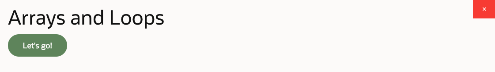
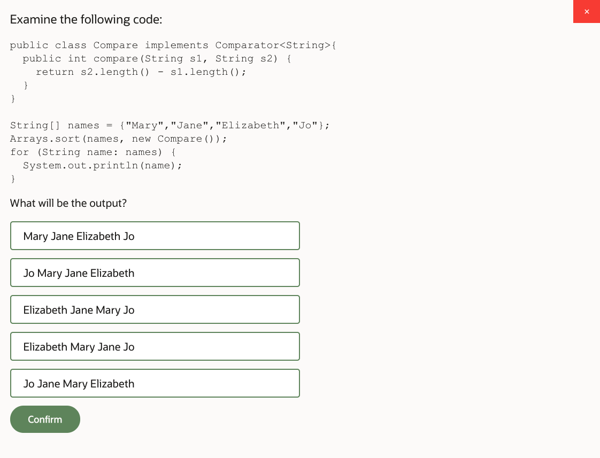
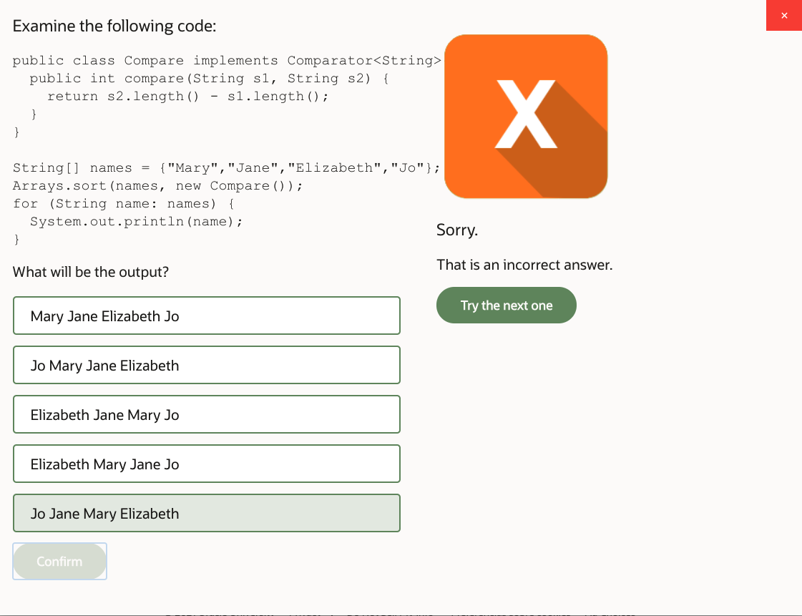
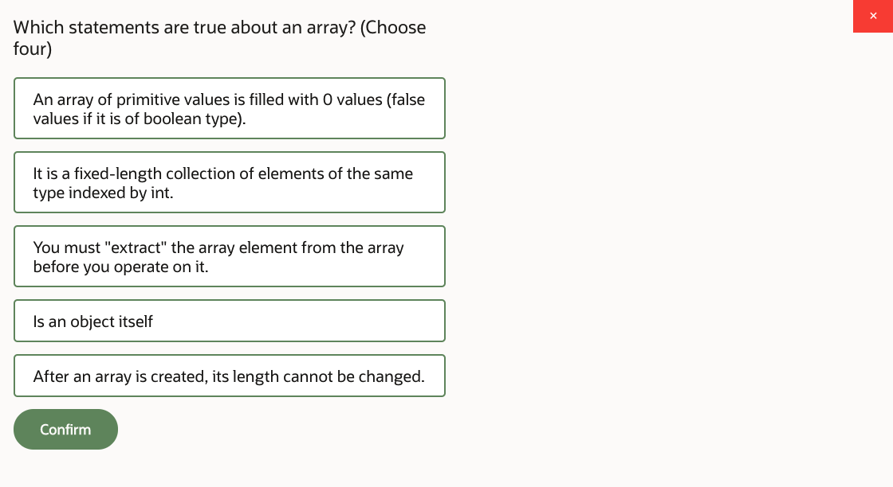
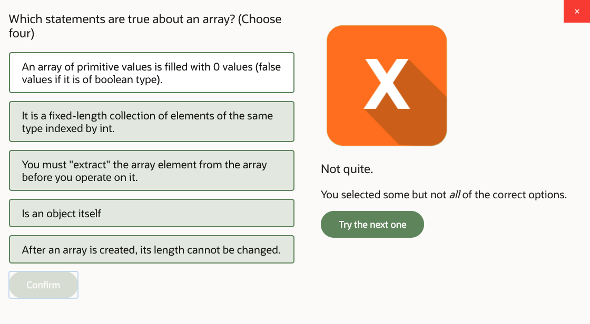
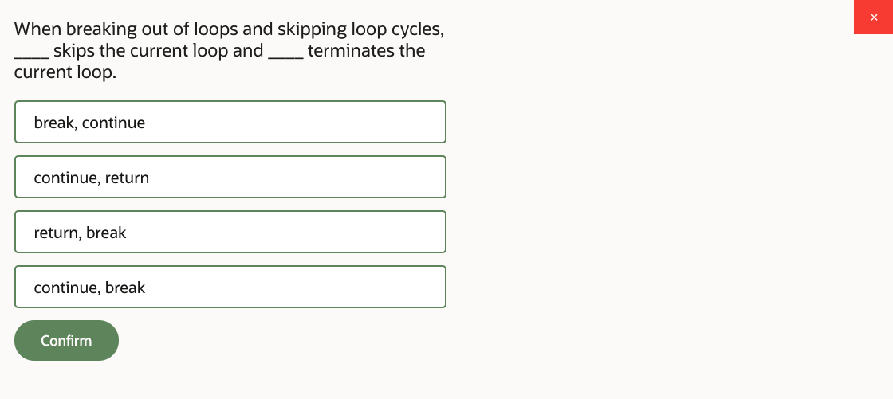
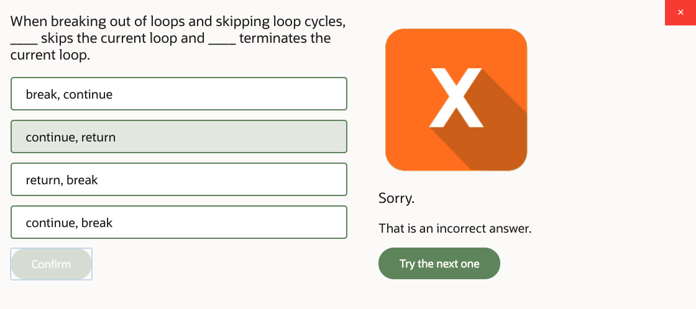
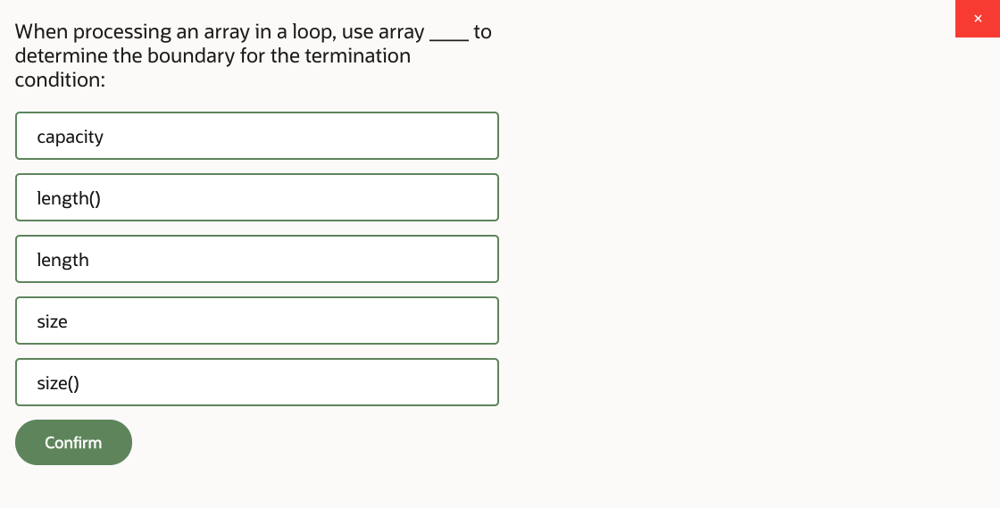
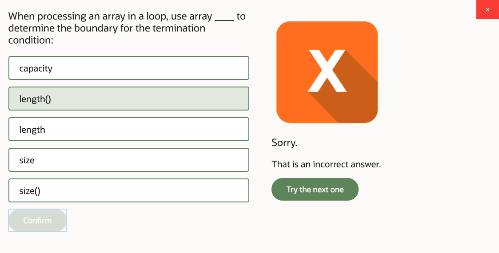
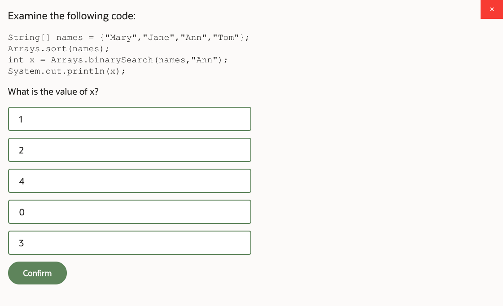
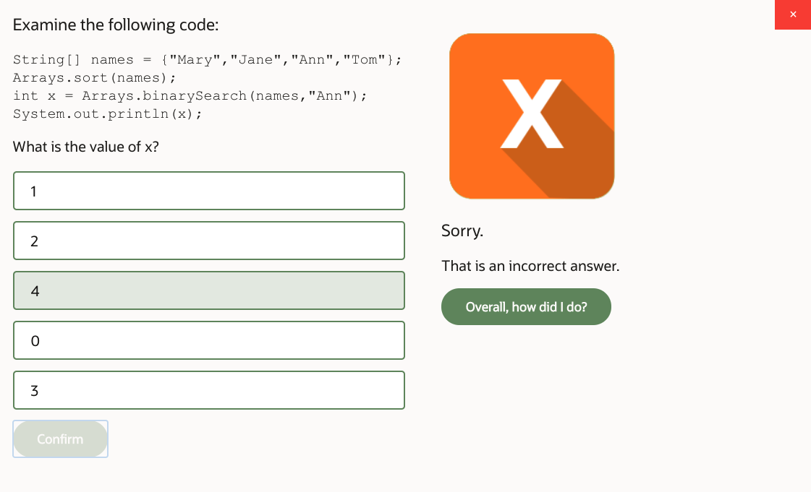
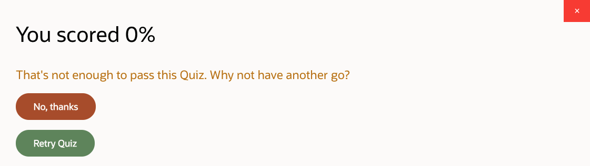
