# 9: Collections

1. Collections, Part 1 New 23m
2. Collections, Part 2 22m
3. Collections, Part 3 17m
4. Practice 9-1: Organize Products and Reviews into a HashMap 24m
5. Practice 9-2: Implement Review Sort and Product Search Features 15m
6. Collections - Score 80% or higher to pass

## 1. Collections, Part 1 New 23m

Let's take a look at the Collections API. This chapter, we're looking at the way the Collections API works, at what are the Collection API interfaces and implementation classes, and some most obviously frequently used types of collections, such as lists, sets, deques, maps, et cetera, how to iterate through the collection content, add some automation classes like a collection class and its functionalities. And also we discuss what are the important concerns regarding concurrent access to collections. We'll actually have a later lesson that covers concurrency API in more detail. But in this particular lesson, at the very end, we're just talking about the fact of concurrency on collections as such, just specifically regarding collections.

Anyway, let's start with the overview of what the Collection API's all about. Now we've looked at how we can handle a number of values wrapped up in the array. Well Collection API provides much more flexible automation, if you like, for the similar type of task that we could use array for. So how to create a collection of different values and manage it?

I would not say that Collection is actually physically using arrays and [INAUDIBLE]. That may or may not be the case. And it depends on the type of the collection. But think about it this way. With arrays, you are confined to the array which is indexed by an integer and is of a certain type. But then generally if you think about it, imagine you ramp up the array into some kind of class. Well, in that case, that class can produce various automations. And whatever it physically stores values inside as actually an array or not is kind of irrelevant. The point is you've got the behaviors that the sorter class provides to manage a number of items that you wanted to manage.

So for example, classes could use generics. You can specify a type of what you want to store in a certain collection. Whilst arrays actually don't use generics. Array is a collection of elements of a specific type. So array, per se, is not using generics.

Arrays are not dynamically expandable. You could use system array copy or array copy off. But as such, the array itself is not expandable. You just have to programmatically create another array and then copy content from one array to another. But the collection classes, they can do these things. They enable generics. They allow you to dynamically expand collection as appropriate. They allow you to provide alternative search and index capabilities. Arrays are always using an int index.

But then if you think about a collection class, it doesn't have to use an int index. It could be more flexible than that. You could perform some validations of elements as you add them to collections. For example, check uniqueness. You don't allow-- you may decide not to allow duplicates to be stored in certain collections-- order elements in a particular order, provide different operations that manage concurrency and threat safety, and provide mechanisms to conveniently iterate through the collection.

Now the Collection API defines a number of interfaces, in the Collection API number of interfaces where each interface describes certain aspect or certain capability of collections. And then these interfaces are implemented with different implementation classes all supporting Collection API. And what you need to understand first is what are these capabilities. What are the features. So first, you look at the interfaces. And then once you understand what these capabilities are, then you look at which specific implementation class would you like to pick and use on which occasion to implement the behaviors that you require from that or the other collection.

Well, let's start looking at the Collections API. What are these interfaces? And what are, well, at least some examples of collection implementation classes. The interfaces and implementation classes of a Collection API allocated in the Java Util package and the top most interface for Collection API is this interface called Iterable.

So it provides a very basic generic feature for all collections. For example, an ability to use collections to iterate through the contents of Collection use FOR EACH loop. So that basically means that because all other interfaces and eventual implementation classes of the Collection API descend from that interface Iterable-- it's like the ultimate parent for them all-- it means that all collections can be used in FOR EACH loops that way, which is great.

Now there is also an interface called Collection, which is an extension of Iterable. But that is adding extra capabilities, just iteration capabilities, but also adding capabilities such as adding and removing elements. So define how you do that.

An interface List describes a collection where elements are indexed by an int. So it's kind of very similar to what you get from the array. In fact the most commonly used implementation class that implements List interface is a class called Array List, which is kind of self-explanatory. Because it feels like an array from the perspective of an integer index behavior.

Set is another interface in the Collections API which performs a validation of what you add to the set. And it does not allow duplicates. So Set checks that what you add to the set is a unique element, essentially. The typical implementation classes for Set are hash set, tree set, sorted set. Sorted set is actually a variant of the set interface which is implemented by the tree set implementation class.

Deque describes double ended queue, which is a collection where you can add elements to top or bottom and remove elements from top or bottom. So with that you can implement algorithms such as First In, First Out or Last In, First Out, something like that. Kind of imagine the Deque as a deck of cards. And you can draw cards from top of the deck or from the bottom of the deck. That's a typical example of the use of-- comparison to what you can compare the behaviors of the deque.

Then there is an interface called Map. A typical implementation for that would be the class called Hash Map. And that is basically a combination of a set of keys and a collection of values. You can think of a map as a table of two columns. That's what the map feels like, where the first column in that table is a set of unique values, quite similar to the idea of a key column and a table. And the second column in that map is type of collection, which is just representing any other values that you want to put into that map. Thus each map entry is comprised of unique key and a value.

So that's a high level overview of the Collection API, kind of the frequently used types of collections. Now, let's start with ArrayList. That's the most basic one. It's probably closest to the idea of the array. Well, kind of obvious from the name, isn't it? So a ArrayList is a class that implements List interface. It has no-arg constructor which creates a list of 10 elements. However, if you start adding more elements to the list, it will just keep expanding.

So if you create ArrayList and you don't specify the size, how many elements, it will just keep expanding as you add in content. But by default internally, it sort of pre-creates the storage for future elements to be placed into that ArrayList of 10 items.

You may specify specific size constructor with initial capacity. And again, it will grow beyond that size if necessary, automatically. You don't need to do any kind of array copy. It will just do the growth itself. So you can specify a particular size. But I guess from performance point of view, it's a good practice to try to guess how many elements you'll eventually need and define the size that way.

And you could also-- and it's a common feature for all collections. You can also initialize one collection using contents from another. So for example, imagine you previously created a set-- well, hash set here. You created a set and you added some stuff to that set. And then you use that set to populate the list. And frankly, it works the other way around as well.

So if in one part of a program you feel like you want to use a collection with certain properties, certain behaviors, you choose to use list. And then another part of the program, exact same values, you want to use them in a collection of a different nature, of a different type of behavior. And you feel like, oh there, I want to use Set. Nice and easy, you can convert one into the other by just passing the other collection to the constructor of the other collection. So these are the ways of creating array lists.

There is also a method called asList. It's a factory method. And the method asList, it's a method of array's class. It creates a list of a fixed size which is very much like an actual array. So fixed size, you cannot resize it. And it accepts an array as an argument or a vararg. It's a comma separated list of parameters. It works as well. It works both ways.

You can also create read-only instance of List by using a method of List of. That creates an immutable list. So you cannot modify anything in it. And as I've mentioned, the list expands as necessary. A small caveat, when I was saying you can't modify anything at the list, you cannot remove elements from read-only list or add elements to read-only list. But if objects you're storing inside the read-only list are themselves mutable, then you can still modify these objects. You wouldn't be able to add or remove them from the list because list is read-only. But if the object stored in the list has set something method, you could still call the set something method.

So contents of the collection and it's immutability have nothing to do with the mutability of Collection itself. Collection might be mutable. But things stored inside it might not necessarily be mutable. That depends what you want to put into that collection. So that's the list object.

Now let's take a look what are the typical operations you perform on the list. There is this example. And I would like to kind of zoom into it and explain exactly what these operations are doing. But first, very briefly, we have operations that allow us to add values, update values, delete values, check existence of values, or search for values. Now let's take just a quick look at the details of that algorithm that we have here.

So first, we create a couple of products-- Food and Drink. And we then create-- well obviously, they allocate it in memory. And then we're creating a list. Now here's some interesting points that I would like to make. First of all, you may specify the initial capacity but that's up to you. Remember the list grows beyond the initial capacity if necessary.

Second, you may constrain the list to use specific type using generics. So you're saying that's a list of products. It will allow you to store subtypes of the product into the list, like food or drink. They could go into that list. That's perfectly fine. However, did you notice that on the left hand side I'm using an interface rather than the actual implementation class as the type. So it's a perfectly valid assignment. You can create a variable type of interface and assign to it any object a reference that actually implements that interface. That works.

But why am I not actually using ArrayList on left hand side? Why is that? Well, I can. But maybe I'll change my mind about the exact type of list I would like to use. Because the ArrayList is not the only class that implements the list. There are some intricate variances and you may wish to use ArrayList on one occasion and maybe some other implementation on another occasion. We'll actually see later in this lesson what are the other variants here.

But polymorphism means that any general behaviors that Lists describes, [INAUDIBLE] describes how they all work. And then you could assign just different implementation to that list variable and get a different implementation of these behaviors.

But the way you declare the variable, you don't really need to know which particular implementation of the list you decided to use on that or the other occasion. So it's actually considered to be a good practice to use an interface as your variable type rather than a specific class.

Anyhow, so we created here a list. And we're saying that its capacity is to store just a couple of products. So that allocates another object in memory, which is that list itself. Internally, you think of a list as something indexed by an integer. That's the nature of ArrayList.

And in this particular case, because we use generics, we restrict the content storage in that list to just products. So on this occasion, we're saying this list will store just products. It's basically not yet initialized in terms of its content. So elements within that array list are null.

Now let's remember how arrays were created and initialized. When you created and initialized the array, you could have an array of primitives or array of objects. You see with Java Collections API, the collections are always of objects. There is no such thing, really, as a collection of primitives. So there's always object references. And by default, they're always null.

What if I want to store a bunch of integers here. Can I do that? Well, I'll have to use the wrapper class you see. Instead of a list of products, I'll say at list of integer. Not int, but integer. And then yeah, sure, I could store numbers there if I like. Why not?

But I can't use a primitive itself. That's just not allowed because primitives don't really function with generics. Generics is an object oriented feature. It's not really the way the primitives work. Because primitives are just simple values in a stack. They're not really references to objects. Anyway, so we have this pair of products. And then we have ArrayList with two slots reserved for reference in this products. Let's add products to the list.

Add one, add the other. And what will happen is instead of nulls we now have actual references stored inside that ArrrayList that refer to the Food and Drink objects that are stored somewhere in a heap. So list is stored somewhere in a heap. Cake and is stored somewhere else in a heap. And then the elements within that list are referring to these objects. So they're not null anymore. We just added some content there.

Now what was going to happen if I will use Add Method with a designated position? Apparently, I can do that as well. So if I say add something to position 2, I could add actually anything I like, including null, funny enough. That will expand the list for me. It will just add extra positions. And as for the position 3, that will also add a reference and apparently will refer to p1. p1 is the cake, isn't it?

So sure, the uniqueness is not checked by the list. You can add the same object to the list twice if you feel like it. And as you can see, you can add null to the list again if you feel like it.

Now what's going to happen if I will will use the method Add and I qualify the position. And then I add something here. So that position 2 was null [INAUDIBLE] adding something to position. Actually, that will push things forward. This is what's going to happen. So if I add a position that is in between existing positions, it pushes the rest of the list forward.

So the elements will be-- the element at position 2 will be inserted to reference-- well, in this particular case, it's also referencing the cake. And previous elements, 2 and 3, became elements 3 and 4. So they were kind of pushed forward here. So that's the add on to the position, which is not at the end but in the middle. That's the behavior.

You can also use the method set. And set allows you to actually update the value on a given position. So position 2, you're changing that from point in referencing p1 to referencing p2 instead. You performed essentially the update of the value. That's what set does.

Now can I have maybe remove things? Sure. And there are two ways in which you can do it. You can remove elements using an index. So that would remove element from position 0. Well, actually, you can remove an element by saying which element that is. So if you're saying remove element p2, what will happen is that the algorithm will search for the first occurrence of the element in here that refers to the p2 object.

Apparently there are a couple of elements that are referring to p2. So remove the first occurrence. So the element at position 0 and element of position 1, these two positions will be gone. Because I asked them to be removed. And the rest of this content will sort of be shifted forward and re-indexed for you. So first two positions are gone. The remaining three positions shifted forward. And obviously index is adjusted. So the list always presents continuous index, basically, starting at zero.

And what's going to happen if you will search and look for something within that list? So there is a Contains method. And it tells you simply true or false, do we have something that you're looking for like p2 in that list? Or maybe we don't. You can also identify which index the element is present. So that looks for first occurrence of a certain element.

So in this particular case, that p1, where is that? p1 is cake, isn't it? So that will be position 2. That's the first occurrence of p1 element in that list. So that index will be equal to 2. And then lastly, so we located that. That's the one we've just looked for.

And lastly, we could get elements on a given index. So that will get us this element at position 2. And actually, you can just invoke methods upon the object stored in that collection straight ahead. You don't need to extract them into some kind of intermediate variable. No you just call a method, like set name. And it changes the name for that product from cake to cookie, updated that. There you go.

Lastly what's going to happen if I will try to add an element at position 4? You obviously see the last valid position is 2. And we've seen before that you can add to position which is plus 1 to the last position. We did it earlier with these lines of code, added position 2, added position 3. That was fine. We could do that.

But what if we're trying to jump the position? Well, that's not going to work. List will insist on actually presenting continuous collection without gaps. You could certainly insert null at a given position. That's fine. That's allowed. But you cannot just jump the position without defining anything at all. So that will be an exception that will be thrown if you tried to do that. You would not be allowed to do it.

## 2. Collections, Part 2 22m

OK, so we've seen the evolution of this arrayList content of these manipulations. Now, let's proceed to a set. And in this particular case, we're using an example of the set interface implemented by the HashSet class. As you can see that certain things are very similar to the way the list works.

For example, you can initialize the HashSet by using previously initialized lists by passing it to the constructor. You could create a HashSet with no parameters at all that creates a HashSet of 16 elements. You can also specify particular capacity like HashSet of 20 elements. But remember, it expands if necessary. So it will just grow, yeah. And there's also this ability to set up the load factor. The default load factor is not 75, but you can change it to a different load factor.

Why do we need the load factor? What it is. Why do we care, right? Well, you see, the HashSet checks-- like any other set-- checks the uniqueness of what you're actually adding to the set. So you cannot add the same element to the HashSet twice. That's not allowed.

Now, there is an implication here. In order to check the uniqueness, you have to basically look at the elements that are already in that set, right? Well, in a small size set, that's not a problem. But as the HashSet will grow, when you will start adding more and more elements to it, to check the uniqueness, to check that the new element you are adding does not overlap with anything that is in that set already, you would have to deal with a larger and larger set of elements. And eventually your performance will start to degrade.

So it will degrade with the growth of the set, which is not good. So can we improve that? And apparently, HashSet has a building algorithm, which is actually trying to improve that. And the algorithm is based on the idea that every element that's placed in a set is added to a kind of bucket of elements, to a segment of elements. And the set is subdivided into multiple such segments, into multiple buckets. And the elements are grouped into these buckets based on their hash codes.

So all elements, all objects that are added to the set with certain similar hash codes are in one bucket. Then another group of objects with different hash codes are in a different bucket. And that means when the HashSet accepts an element that you are trying to add to it, it only needs to get its hash code. And it only needs to check one of the buckets, the one which is in range of that hash code value.

It doesn't really need to scroll through the entire hash set to validate if this element occurs or not. It is enough for it to just check subset. So it's much quicker, obviously. And it's a more scalable approach. But then, for performance reasons to redistribute the contents as you start adding more and more elements, there is this idea of a load factor.

If a subset, if the bucket within a set grows over certain capacity, so you add in let's say by default more than 75% of entries are already added, then at that stage the HashSet we'll just create an additional bucket to accept more elements. So we'll not fill every bucket to capacity. It will kind of leave space within every sort of internal group of object storages to accept x for objects that may fall into that range of hash codes that is the basis of grouping. It's an automatic process. It's not like you have to code any of that.

HashSet already has the relevant algorithms. But is just for you to appreciate what exactly it's trying to do and why there is this load factor parameter. So you could basically specify how full you want internal storage within the set to get before the set starts reshuffling the buckets and optimizing that storage.

So say for example default is 75%. And I'm saying, actually, I allow it to be up to the 85% full instead, right? OK, so these other ways of creating HashSets. Oh, one more note, set.off, which creates read only set, very similar to the list of which remember, created read only list.

Now, let's take a look at the operations we perform on a set, yeah? So operations allow us to insert, delete elements check existence. Again, let's just zoom in and play around with this example a little bit. So first, we act upon the same premise that we have few objects which we allocate into memory of food, drink, and another food. Yeah, those three products basically, so cake, tea, and cookie, lovely.

Now, we create the actual HashSet. And again, you could specify the size. But default is 16 elements. And we're saying that we're using generics. We'll accept any products to be added to that set. And just like with the list, we probably would like to use the interface name here. So maybe we change our mind, and instead of HashSet later on decide to use another type of set implementation, right? So we wouldn't have to re-code anything because our code is done coded to the interface type.

Anyway, so we created that HashSet. And by default, remember it creates capacity, storage capacity for 16 elements. Well, it didn't specify the size. So default is 16. And I'm not drawing all the 16 elements. Yeah, whatever, you know that they're there.

And the values are not yet added. Yeah, so I haven't any actually added anything. Now let's start adding values. So add, just add. And that would add an element, and add another one. And then we'll add another element and so on. Yeah, so just simply call the menu add.

Oh, well, that's interesting. We add in the same element twice. So what's going to happen in this case? Well, actually nothing, except that this method add apparently returns your Boolean value. Boolean indicator of true or false, which indicates whatever actually added something or not.

So if the Add method returns you false, you know that it actually ignored whatever you just tried to do, right? And why would it ignore it? Because the element P2 is already present in that collection. So it's not going to put it again because such checks the uniqueness. And then the next thing we do we add another element, P3. And this one will actually be added here, of course. Because that's not yet present in that particular collection.

Now, what about remove? Sure, we can do that. Remove a particular element, yeah? And we'll search through and remove that element. OK, and what else we could do, we could remove again. How strange that is. Well, again it just returns you Boolean. If it has nothing to remove, then you won't remove anything. And if it has something to remove, well then, you know what it just removed.

So there's also a menu.contains which you can invoke. And that basically tells you true or false whenever the certain element is or is not present in that set. So we've looked at the way we manipulate with the set content, right? Now, let's take a look at the Deque, ArrayDeque is an implementation of that interface and allows us to create this double ended kind of queue, where we could add and remove things from top or bottom of a queue.

Again, the way of creating an ArrayDeque, you can create an ArrayDeque with no parameters that grace the Deque of 16 elements, or you can specify capacity. And it expands if required automatically. And you can populate ArrayDeque using the contents of another collection, for example, using the list, or set, or whatever you like.

So now, how do we manipulate with ArrayDeques? OK? There are several algorithms that are available here. And again, let's zoom in and take a look at exactly what these algorithms are supposed to do, yeah? But basically they implement first in first out, or last in first out behaviors. But let's take a closer look.

The example here, again, assumes we have a couple of products, a few products that we allocate, cake, tea, cookie, whatever, just some products. And then we create Deque object, ArrayDeque object to store this product. And again, it creates an ArrayDeque of 16 elements. That's a default. I would not draw all the elements. But that's basically what it feels like.

Now, let's take a look at what will happen if we'll just try to get something from the ArrayDeque and there's nothing in there. Well, if you just try to do the poll and get the element, then you'll just get null if there's nothing inside, OK? So that's nothing particularly exciting here. What will happen if we'll try to add elements?

There are two ways of adding things. You can offer element first. And that will add it to the head of that Deque, to the top of the Deque. So let's say we call the offerFirst first, and we put the cake there, right? Now, we call offerFirst again. What's going to happen is that cake will be moved to the next position.

And on the first position, well, we added something else. We added tea, yeah? So we actually kind of shifted the contents of the Deque forward, and we added something to the top. That's all for first method.

Now, when you then try to get values, you could do the pollFirst method. Poll method gets the first element from the head of the Deque and actually removes it from the Deque. So that will be gone. And then the contents will shift forward and the first element in the Deque would become-- you know, whichever element was previously second will become first. So that's pollFirst.

You can grab the element from the Deque without actually removing it. That's the peak first method. That allows you to get the first element but not physically remove it out. The poll will remove it.

Now, the next thing you could do is offerLast. That allows you to add things to the tail of the Deque. So let's say offerLast, and that adds it to the last position just after the last valid element that wasn't a Deque, right? So offering the element there. And again, you can keep offering. And what will happen is that further elements will be added behind that last position.

And guess what, there is the opposite of pollFirst. There is an ability to pollLast. And that will remove the last element, return it to you and remove the last element from the deck, OK? And use also peakLast. And that allows you to look at what the last element is without actually physically removing it as such.

And lastly, if you try to offer a null element, you will fail at that. That is not allowed. You cannot offer first or last a null element. You actually have to specify what it is that you want to add.

There you go. That's how the ArrayDeque works, all right. So with ArrayDeques, we can do first in first out, or last in first out algorithms. And just generally treat it as kind of a flexible way of adding and removing things from top or bottom of a deck.

Next, HashMap, HashMap is a combination of two collections. It's like a table of two columns which stores the first column as your keys and second column as your values. So this is a key value pairs basically.

You can construct a HashMap using nor constructor, which creates a map of 16 elements which expands if necessary. You can specify initial capacity. You can also specify another HashMap and maybe kind of grab items from one map and put them in another potentially. And also you can have this method off, which creates a map of specified, predefined entries.

The entries could be specified as key comma value, the comma next key comma next value. Or this key value pairs could be wrapped up into the object called map.entry. So you can do it that way. It's up to you, yes. So there's a method of entries that allows your first group key value pairs into entries before you add them to the map.

There is a slight performance advantage of using off entries versus method of. But in small maps, that's not dramatic, OK. So yeah, off method creates a read only map as well. That's important to point out.

Now, how do we manipulate with maps? OK, so we can put, remove, get elements and sort of check existence of elements within the map. Again, let's zoom into this example and observe how it actually works. In this scenario, we're looking at a pair of products, again, cake and tea. And then we are allocating map, a HashMap.

And notice that this map is using two columns, essentially one key column, which is a type of product. And the second one is a value, which is the integer. And let's assume that we're storing something like products and their quantities, like the order, yeah.

So for example, the products will be what? This cake and tea, and then we order them in some quantities. But it's important to understand that the key is actually a set. So that means it's unique, right? And while the value is just released. So you could add the same quantity to different products if you like. But you cannot duplicate the product in a map.

Anyway, so you've allocated this HashMap. By default, it comes as a map of 16 entries because I didn't specify the size in the constructor. But it will expand as necessary. And while there are no values in that map yet, so let's start adding something. And when we add values, we basically just say what it is that we want to add, product P1, P2, and the integer, well, in this case, the value of 2.

Strictly speaking, I should draw here instead of the actual number 2, I should draw the arrow from here pointing to another chunk of memory where the integer object is stored. Because integer is not a primitive. It's the wrapper class. So it's stored in a heap, yeah.

But just to sort of declutter the graphics, I'm just drawing here the number 2. In fact, you need to realize is a reference to the integer object really, rather than a primitive, yeah. Because you cannot use primitives with Collection API as you have to use objects.

Anyway, so we've added some entries into that map. What will happen if we'll just try to put a different value for an existing element? So this P1 already exists in a map, right? But now we put in 5 instead of 2. Well, that will act as an update statement. So that value of 2 will be replaced with a value of 5.

Put method actually returns you the old value. So you can look at that n1 and you know what it was there, that there was value of 2. And so it's an update. But you can find out what was the previous value that you're actually updating. So that Put method returns you that.

Of course, if you try to remove something, well, then, the entire entry will be gone from the map. So you are removing the product 2 which is that t, which is this entry, right? And it will be just gone, OK.

What if we will try to check if something is or isn't in a map? Do we have the product P2 in that map, contains key P2? Well, not anymore. We just removed it so that has t or variable will be false. The containKey method will return you false.

You could also try to locate a value within a map, so contains value method. And you can look for something that has a value of-- well, in this case, and 1 is 2 right? And again, it's no longer present. And will be value of 5 because we've just updated it, right? OK, and what about this example?

What if we try to get something from the map, right? What do we actually get? If you say, get me P1, which is that cake, you're not actually getting cake, no, no, no, no. You're getting the quantity for it, which is 5 in this case, OK? That's how the HashMap behaves, right? And it's the key value pair collection, right?

So next one, we're looking at the way in which we can iterate through collections. Several examples, the first example is released. And it's pretty straightforward. You added some content to it. And then you could just use it in a forEach loop. It's as simple as that. You could use any collection in forEach loop because they all implement interable interface.

So it could be HashSet. It could be arrayList, whatever you want, Deque here. You could just iterate. Now, you could use this technique. Out of the collection, you can get an iterator object. An iterator object has a method called hasNext, which basically checks if the next element exists or not. And you can put it inside a while loop for example, because it returns a Boolean, true or false. If the next element exists, it returns you true. If it doesn't exist, it returns you false. The method next allows you to retrieve next element, and you keep iterating.

You could also remove values using the iterator. So there's a remove method. When it comes to the HashMap, you've got a choice here. You may get a set of keys out of it and iterate through the set of keys. Or you can get collection of values and iterate for a collection of values, whichever way you want, really.

So for example, the first example here gets the set of keys. And then for every key in the map, which is the map of products, using products as keys, you could get the actual quantity, yeah. You could get whatever quantity was stored there. And the second example, you just get all the quantities. And you ignore what keys are, yeah?

For example, if you want to compute something like a total, you don't really need the keys in this case, you can just get the values instead and iterate for the collection of values. So as you can see, the forEach works nicely. And if you want to do a little bit more sort of trans-coding, then I guess you could use iterator instead of the forEach loop. But that's how you iterate.

## 3. Collections, Part 3 17m

Now, all the behaviors of the collection include abilities to convert the collection to the array. So I have here an array list, and then I decided, actually, I want to extract contents from that array list and put it into their [INAUDIBLE]. Well, you could do that. And notice that array here is actually smaller than the number of items in that list.

So when I call the method toArray, what happens is that this method will check if the capacity of the array is enough to store whatever we try to store, to put that collection into it. And if it's not, it will actually make it bigger. So it allows you to resize. You also have the removeIf capability. That's another generic behavior that all lists have.

And the way the removeIf works, well, that's rather interesting. The removeIf accepts a parameter type of predicate. Predicate is an interface, so removeIf expects you to pass an argument, which is some kind of object that implements predicate interface. What a predicate interface does, well, it actually has only one method that you are interested in at this stage, and that's a method called test.

So that's the abstract method described by the predicate interface. It's just one abstract method. So there are actually some other methods in a predicate that are not abstract, but, you know, like default, and whatever. But just one abstract method that you need to override. Method test accepts whatever object you need as an parameter. And you can use generics to define what it is that you wanted to test.

So in this particular case, predicate working with products, yeah, test, and then returns you Boolean. And the logic of the removeIf is that it expects you to override the method test, basically, to implement the predicate, override the method test. And just test elements in that collection, and return true or false.

And based on that, if it's true, if the predicate here, test method returns true, the element will be removed from the collection for you, right. And you don't need to write a loop. You don't need to write an iterator. You just say, this is my condition. These are the elements I want to remove, like, any product which name is longer than three. In this particular case, that's the logic, right. OK.

Now another automation class that you may use with collections is a class called Collections. Don't confuse it with Collection interface. No, it's a class. So Collections class has various behaviors that allow you to automate tasks of managing collections. For example, you can fill collection with values. So populate the collection with values.

You can search through the collection. So, for example, in this case, the last example shows the fill method. Yeah. And it fills all the collections with pies. Yeah. OK. You can search. And search, in this particular case, you're looking for a particular product, product p2. Yeah. And you just want to get it from that collection. Yeah. You want to find out if it's there or not. OK.

What else do we have? We have an ability to sort. And you could sort using the natural ordering, if the elements in the collection implement Comparable interface, or you can supply comparator as an additional parameter, and do whatever other ordering you want.

And you can reverse the collection. So it's, basically, like ascending, descending order. So you can reverse the opposite order. And also you can reshuffle the collections. So if it wasn't any particular order, the shuffle method will break the order, and just shuffle it. Yeah. So these are the automations provided by the Collections class.

Now, the last bit that we'd like to discuss in this chapter is, what will happen if the collection has to be accessed concurrently from multiple threads? Well, it could be a problem. Because, if the contents of your collection can be concurrently updated by multiple different threads, potentially, it's possible that two different threads will try to jump onto the collection at the same time, and may corrupt data, may corrupt that collection, or may get erroneous values, because another thread is currently updating something.

So, you know, you kind of get halfway through preformed actions, yeah, the updates that are not complete. It is a concern. However, it is only a concern if the collection or contents of the collection is mutable. If collection is read only, if it's immutable, then, well, access away. You know, there's no problem accessing that from different threads in this scenario. Right. So, but if the contents is mutable, if collection allows you to add and remove elements, then that's a concern.

And once, again, there is a clearer distinction. Even if the collection itself is immutable, it does not automatically mean that elements inside the collection are immutable, as well, not necessarily, that depends. So elements within the collection, you have to consider are they thread-safe? Are they immutable or not? But that's a separate question from the collection management.

Now, let's take a look at how we can address these problems. How can we solve the concurrency access problems? There are three ways in which they can be solved. First, most simple, fastest, and most straightforward approach will make it unmodifiable, make it read only. If it's immutable, if you cannot add elements or remove or update elements, then you are perfectly fine. There is no way you can corrupt the data collection, because you just don't allow it to change it. Right.

And you can simply take any existing collection, for example, set or list, and using Collection class, called the method unmodifiable set, or unmodifiable list. And it, basically, turns your collection into the read-only collection. Well, in this case, example shows your set, which is read only. So that's it. You won't be able to add anything or remove anything, but then it will be automatically safe to be utilized from multiple different threads.

Another approached-- approach is to make the collections synchronized. Synchronized approach means that only one thread at a time will be allowed to add or update or remove contents. So for example, if one thread tries to add something, and another thread tries to add something, as well, at the same time to that collection, if collection is synchronized, then only one thread will be allowed to actually perform that operation.

And the other thread will be blocked, and will wait for the first thread to complete whatever it's doing. There is an obvious scalability problem here. Because if you've got lots of threads simultaneously trying to change the contents of that collection, then your performance will gradually start to degrade, while, actually, not that gradually. It will start to degrade.

And then the more concurrent updates you trying to perform, the worse it will get, because, basically, you kind of created a bottleneck in the program's performance. Every thread will have to stop, and will have to yield to another thread to allow that one to complete whatever it's doing before it can proceed. So only one thread at a time will be allowed to manipulate with the contents of that collection.

However, if that is a concern, if you want to have an updatable collection, and you want it to be thread safe, your unmodifiable option is not what you want to do. Well, then you could take any collection, in this case, I'm using Map as an example. But, again, it could at list, could be set, and just wrap it up into, let's say, for example, synchronizeMap, or synchronizeSet, or synchronizedList. Yeah.

And I will create you a variant of collection, which prevents threads from adding, removing, or updating elements within it simultaneously. Only one thread at a time will be allowed-- allowed to do that. That will slow down the program, and it's not particularly scalable, but it works.

Lastly, there is an approach called copy-on-write. In this particular case, I'm using CopyOnWriteArrayList, but, again, it could be set, whatever. It could be other collection types. So, imagine I've got two different threads trying to add or remove or modify that collection in some way. If that is the copy-on-write variant, then what will happen behind the scenes is that a replica of the collection will be created specifically for each thread.

And each thread will operate on its own independent copy. So they don't clash between each other. These copies are, basically, local to each thread. So they perform their changes, and they can do it simultaneously, because they're not clashing with each other. And then copy-on-write, well, in this case, CopyOnWriteArrayList will merge these copies into a single copy. That works like a charm. It's a faster way of doing parallel updates.

But, obviously, it consumes memory, because you just creating replicas of the collection. Of course, you need to realize, you're not replicating objects inside that collection. You're only replicating collection. Remember how it works? Yeah. We've seen the examples, collection contains references to other places in memory where actual objects are stored. So this does not duplicate objects. It only duplicates that collection of references per each thread.

So it's not that bad, memory consumption-wise. But I guess if the collection is big enough, and you've got significant amount of concurrent threads, and they all simultaneously want to change something, then sooner or later, you will be running out of memory. Yeah, because you're creating copies of the same collection over and over again, even though you're not actually duplicating objects that this collection reference. And you're still duplicating collection itself. So it has some impact on memory utilization, of course. OK.

Whichever way you do it, read-only approach, synchronized approach, copy-on-write approach, it works with these different collection types. And it's important for you to understand, if you're dealing with concurrent access, you have to make a decision which way you want to handle it, right, because, otherwise, you risking corrupting the Collections data. So the decision is not that difficult. That's, basically, these are the options you have. More on that will be in the later lesson that is dedicated specifically to the question of concurrency.

One more thing that we need to mention. There are some classes in the Collections API that are considered to be Legacy classes. They came from kind of a very first version of the Collections API, much, much older version of Java. But they're still there. They haven't been removed. You know, and there are occasional situations where you can encounter these in the existing code.

So a couple of examples. A Vector, which is the old API equivalent of ArrayList. If you compare ArrayList operations and Vector operations, you'll find out that they're practically identical. Likewise, HashTable is a legacy equivalent of HashMap. Again, if you look at the operations, you'll find that they are almost identical.

So whatever was true about ArrayList is also true about a Vector kind of thing. And the same story about HashTable and HashMap, with one important distinction, with one exception. There is a crucial difference between the new Collection API and the old Collection API. These old classes like Vector and HashTable are synchronized by default.

With a new API, with ArrayList, HashMap, HashSet, et cetera, they are thread unsafe by default. They're not, by default, read only. They're not, by default, synchronized. They're not, by default, copy-on-write. You choose what you want them to be depending on the situation in a program. But the old classes were, by default, thread safe. They were, by default, synchronized.

And that was a problem, because synchronization costs resources. And if you don't need multi-access access to a particular collection, then why waste resources on synchronizing them. Especially, because we know that synchronize is probably the least scalable option, right. It's certainly safe, and it certainly works, it's just resource consumption-wise, it's the worst option out of them all, in terms of CPU utilization, because you're stopping threads, and you're forcing threats to queue when they access these collections.

Only one thread at a time can, essentially, use HashTable or Vector. The reason this mentioned in this page is, because you can encounter them. They are realistic Legacy classes that are still used throughout many applications. You're not advised to use them in your day-to-day coding, because of these side effects, such as synchronization. You're advised to use the new API instead, but, just in case, if you encounter them, you know what they actually do. Yeah. OK.

So that is it for this lesson. We looked at the concurrence. So that is it for this lesson. We looked at the Java Collection API, and what are the interfaces and implementation classes on the Collection API. We looked at typical types of collections, list, set, deques, maps, and their behaviors, how we iterate through collection content, how we can sort collections-- actually, there's an alternation class for that called Collections, right-- how can we access collections concurrently. OK.

During the exercise, you will be asked to create a HashMap storing products and reviews. Your previous exercise, you were creating product, an array of reviews. So there's one product, an array of reviews associated with it. This time, you're asked to create a HashMap, where the product will be the key, add a value per each product, there will be a list of reviews.

So the HashMap will contain product as a first column, and a list of reviews as the second column. And then you will be asked to actually write additional mechanisms, like sorting mechanism, or searching mechanism, to manipulate that content, and adjust the code to move from single product to the actual collection of products expressed via this HashMap.

## 4. Practice 9-1: Organize Products and Reviews into a HashMap 24m

 
Let's take a look at the exercises for lesson 9, which will be about Collection API. So what exactly do we intend to do here? Currently, as it stands at the end of the exercise for lesson 8, in the ProductManager class we have a single product and an array of reviews.

What we need to do is change that to be a HashMap, where the key in a Map will be the product object, and then the value in the HashMap will be a list of reviews. So we'll be able to store multiple products and multiple Reviews. In addition to that, we need to figure out how to add and change these entries, and some kind of a mechanism for sorting this list-- this collection-- I suppose, when it comes to laying it out and printing it for our users.

OK. Well, let's start with the assumptions that you either complete the exercise for lesson 8 or you open the solution for it. So if you completed the exercise for lesson 8, you can continue an existing project. Otherwise you open a solution project and you continue from there.

So in the actual algorithm that we need to write, the first thing we need to do is to change the way we store products and reviews, and turn that from single object and array into a HashMap. So that's in the ProductManager class. Replace the declaration of product and reviews variables with this HashMap. Let's do that.

So obviously, that will break some existing code there, but that's fine. We're going to fix it. So currently in the ProductManager, we have a single product and an array of reviews. So let's get rid of that and replace that with the HashMap.

You'd need to import relevant components. So fix imports. That will fix imports for HashMap and for java.util.List as well. There's another class called List in the java.awt package, so that means we'll show you which ones you are actually importing. So it gives you a choice.

OK, so we have this products HashMap, but obviously at the moment, the rest of this class isn't really using it. It's still referring to the old variables which we just removed, so that needs to be fixed. OK. So edit imports.

Now, modify both versions of createProduct method to put the new instance of that product into the ArrayList-- put that product into the HashMap, and the new instance of ArrayList to be associated with the product. So our assumption is, when you create the product, there are no reviews for it yet. So you just put an empty ArrayList for storing future reviews, but there are no actual entries there as such.

However, make sure you do not try to put the product into the map if such product is already present. So we don't want to just demolish the product that's already in the map, right? We only want to add a product if it's new.

OK, so what we need to do is modify the logic. Change the line of code that creates the product instance in both createProduct methods to assign it, not to the instance variable product which it was assigning before, but to the local variable product.

So all you are really changing in this situation is where you previously used an instance variable-- which you just commented out-- you now declare that as a local variable. That's two versions of createProduct, and we're now using a local variable for product instead of the instance variable.

But we still need to add the code that will put that product into the products HashMap, and first we need to check if such a product is already in the map or not, so that is still to come. Before returning the product object from these methods, place it into the products map, together with a fresh new ArrayList for reviews.

Do not place this new map entry if the product already exists. So two things need to be done. We need to check if it exists and we need to place it there. Fortunately, there is a method provided by the HashMap which does exactly that. It's called putIfAbsent.

So yeah, just use that method. So what we're putting into the map is that product and an empty-- for the moment-- ArrayList. Well, it is intended to store reviews. Make sure you import the ArrayList, and you do it in both versions of createProduct method. It's a factory method, so it creates Foods and Drinks. And not just creating Food and Drink-- they're also putting that into the HashMap if such a Food or Drink object is not yet present in a map.

Now you may ask yourself a question. How come a Food or Drink may already be in that map if we just created that? That's a very good point, and that depends on the equality of objects. How do we consider that Food and Drink to be the same or not?

For example, if you will look into Product class, you will find there a method equals. And at the moment, it says if the ID and name of a particular product is the same, then it's the same product. So in other words, this is how this could happen. If you try to create a product with the exact same ID and name twice, then the second time you try it, that product won't be placed into the map. It's only the first time when you will succeed.

The putIfAbsent method will basically call equals upon the product and see if it's already in a map or not-- just do the comparison. And the equals method, as you can see in our case, compares products by using their IDs and names. That's part of the Product class design. So this is how it could happen, right?

OK. So you could use a simple put method, of course, to put things into the map, but then you have to check if such entry is present in a map or not. Because you see, if you just call the put, what will happen? It will act as an update.

So if you just say, I want to put the product and a new ArrayList of reviews into the map, if such product already exists, it will just replace this ArrayList of reviews. And we don't want that to happen-- we don't want to replace an existing ArrayList of reviews with an empty one. We don't want to lose that reviews information that's associated with the product. That's why we're using the putIfAbsent method.

OK, so we added to the import of ArrayList. Now, modify the logic of reviewProduct method in the ProductManager to use that map. So obviously, we can see that reviewProduct is not yet doing it, because it's still referring to the old array that we've just commented out.

So we need to change that to start using the ArrayList that we want to put into the HashMap of products. Right. To do that, we need to remove the block of code from the beginning of the reviewProduct method that actually verifies the array's full, and recreates the array, and checks the capacity-- none of that is needed anymore.

You don't need to rescale an array, so you don't need that. So what we need to do is change the logic in the reviewProduct method so it will locate that entry in the HashMap that corresponds to that product and get from it the list of reviews.

So the method reviewProduct accepts a product as an argument. We essentially use it as a search condition. We take that product, we pass it to the get method upon the HashMap, and we get back the list of reviews.

It's possible that that list of reviews is empty and there are no reviews inside, or there might be some existing reviews, in which case what we're about to do is just add an additional review to that list. But remember, the ArrayList that we're getting will automatically expand if necessary, so the old code that tried to expand the array is just no longer needed.

Now, if you need to add a review to the product, remember the apply method that applies the rating to the product-- that reviews the product and applies the rating-- recreates the product object. So that basically means that whichever product object you had in that HashMap before had to be replaced with a new one, because you're recreating the object from scratch, because the product object itself is immutable.

So you're just creating a replica of it with a different rating value. So that means you need to actually remove that entry from the map. You know which product that is. You've got the list of reviews from the map, and now you're going to remove that entire entry-- entire entry.

So just get rid of it, and we will recreate this entry in a moment. We're taking it out of the map and we are going to recreate it. And once again, the reason behind it is because the product is a key inside the map. The applyRating method recreates the product, so we need to get rid of the old one and replace a new one after we apply the rating.

OK. And the HashMap doesn't have a method to update the key. There is only the method put, which updates the value for a given key, but it doesn't update the key itself. So the only way to change the key in a map and replace the product is just remove the entry and put it again.

So next, you need to create a new review object, of course, and append it to this reviews list. Fortunately, we already have the reviews list, so just append it. That's pretty straightforward. And then your review object is a combination of rating and comments.

Take that and append this to the review list. Rating and comments are parameters that we're receiving here in this method. OK. Make sure you put a semicolon at the end, of course. Next.

Iterate through the list of reviews to calculate the total sum for all ratings. You still need a sum variable-- that you already have, actually-- but you won't need the i variable to maintain the index now. You can dispense with that.

And you wouldn't need the while loop. You can do this calculation in a forEach loop, so the calculation will look much, much shorter, basically. The algorithm will just basically compute the sum by eating rating for all reviews. It's as simple as that.

You don't need to check if your review is null, not null. You don't need to check the length. Just get the next review, get the rating from it, get the ordinal value so you get a numeric value for the rating, and do the running total. That's all you need to do.

So as you can see, using the Collections API greatly simplifies the code. So what I'm going to do is just-- for a moment, I'll do the-- I know I'm duplicating code. I'll start with int sum 0, format that, and then I'm just going to comment out that old block of code so you could visually see for yourselves how much easier it is to use the Collection API rather than just basic arrays. That's much easier logic indeed.

OK, so we calculated, now, the total sum of all reviews-- of all ratings. Now once that's done, after the loop, what do you need to do is just change the way you're calculating the total. And the only difference is that you can now get the size from the reviews collection instead of calculating it through the i variable, which is what you were for the array index.

You can get that sum, reviews.size, and they will tell you what's going on with the number of reviews-- how many reviews you've got-- and you calculate the total. And of course, previously you were use an instance variable product, and now you're using a local variable product.

When you're apply the rating, you're updating a variable product, which is-- well, because the instance variable is literally commented out now. We placed a comment on it as the first step in this exercise, so we don't have the instance variable product anymore. We're just recreating the product. So that's the change of logic.

And then the extraction will be to actually put the product, together with this new reviews collection, back into the HashMap. Well, technically speaking, it's the same reviews collection that you got from the map in the first place-- that list of reviews that you retrieved for the get method. You just added a new review to that list.

But the product that was in that HashMap is now essentially dispensed of, because the applyRating method has recreated the product object. So we create a new entry within a HashMap that has a new product, which is a replica of the old one but with a different rating, and the collection of reviews for that product, which is basically the same as the old collection of reviews plus the additional review that we just added. And then we return this updated product back from the reviewProduct method.

So as you can see, the code has dramatically been simplified. So all of that old logic is no longer needed. You can get rid of it. It serves no purpose anymore. There's still some other changes you need to make to other methods here, but as far as the creation of products and addition of reviews is concerned, that's done.

So you fix that code, and as you can see, the code becomes much more straightforward and much more simple with Collections API. Just for verification reasons, this is the resulting logic of the method, so you can compare if you're doing the same thing. Yeah, you are.

Now, printProductReport needs a bit of fixing. So first of all, we need to add an extra argument to the printProductReport method. Currently, it operates on whichever project was current in the ProductManager, but we don't have an instance variable product anymore. We just commented it, right?

So we will operate now on a parameter. We'll say for which product we'd like to print that report. So instead of an instance variable product, we'll just use a parameter now-- print report for whichever product.

The other change is how we get the list of reviews. At the beginning of this method, we need to retrieve the list of reviews for that product from the HashMap. So we know which product that is. Let's get ourselves a list of reviews.

And also, some logic simplification will be applicable in the later algorithm, because we don't need to check for the review being null, because we know that the iterator for the list will automatically give us all valid reviews. So we can simplify that iterator.

However, there is still one piece of code that we need to do. We need to check if there are no reviews at all. The no reviews at all case will now be checked with these reviews.isEmpty method, and the checks if the review is null is just simply no longer needed. You can get rid of that altogether.

And instead of saying reviews at position 0 is null, we'll just simply ask if there are no reviews in the reviews collection. So otherwise we iterate through reviews and we print that information. The rest of the logic will be the same as in the previous exercise.

OK. So this is the overall result of what the printProductReport method would look like now. It's, again, slightly simplified, slightly more automated. The next thing we need to fix is the class Shop itself, because the class Shop still refers to the old way of printing the product where this parameter didn't exist. So obviously, now that needs to be fixed.

Let's go to the main method of the Shop class. And what we're going to do is, when we create the printProductReport method invocation, we just pass the product to it. So let's go to the Shop. And when we printProductReport, just say printProductReport for product p1, for example-- for whichever product we need.

Now the beauty of it is that we don't really have to change anything else, you see. We radically changed the internal storage within our ProductManager. We previously used product as just an instance variable and the reviews as an array. We changed it to HashMap, we allow multiple products to be stored, we allow multiple reviews for the product, of course, in that flexible way of using ArrayList.

But apart from indicating which product to report, everything else stays the same. ProductManager class methods didn't really change. The internal implementation did, but those method signatures-- for createProduct, for reviewProduct-- remained the same, which is good because that is how you do the encapsulation. You hide how data is physically stored within a given class and just provide methods to the external world to inform them how to operate with that class.

Classes like Shop don't really need to know exactly what ProductManager is doing internally. Anyway, you can just run it, I guess. So see? Everything else checks up. You're printing your first product report, but no ratings, and no reviews were entered. And then you add extra reviews, and obviously you print that information as well.

So it's a very small change. We're passing an extra parameter to the printProductReport. However, now what you're asked to do is create more Product objects and more reviews for these products to test this multi-product storage ability.

You may use existing values-- just uncomment that-- or you may just copy them from the manual. So let's just add more instances of products. Create product 2, and then we do reviews on that, so we wouldn't be confused as to the order in which the printouts are coming up.

So not-reviewed product 1, reviewed product 1, reviewed product 2. And you could keep going with more of these. The values that are used in here are the same, essentially, as products that you had in your source code. It's just extra reviews that were added to your code-- so a bunch of other reviews just to have more content to play with.

OK. Again, let's do the nice formatting. You don't have to fix all the carriage returns. That's entirely for your readability. reasons. And we're printing the product report after every group. OK. So very quickly do that, just to make the code a little bit more readable, I guess.

OK. Yeah, and we'll be ready to test. So you can fast forward me formatting things. OK. And then we'll just run it. Just execute that code.

So as you can see, we have this functionality working perfectly fine. We are capable of adding multiple different products, multiple reviews per product-- it's all correctly taken away. Nice.

## 5. Practice 9-2: Implement Review Sort and Product Search Features 15m

Now, there's an extra task here to implement the sorting for reviews. So at the moment, the reviews are coming up in whichever order we were adding them. But what if we'd like to sort that order, and also provide some product search features? Well, to do that, we could implement a comparable interface on a review

so let's go to the review and say that we'd like to implement comparable interface comparing reviews. That would entail us overriding abstract methods provided by comparable, which is the method compare to. Click on implement all abstract methods, and that means we'll generate you're compare to method where you obviously need to replace the dummy code with an actual comparison algorithm.

So the question is now how would you like these reviews to be compared? What's the ground of comparison, how would you sort things? Now make sure you have a nice name for parameter. I think this piece of text was created with slightly different version of NetBeans where it generated the code called arg0 by default-- the program arg0.

This one generates it as 0-- whatever. Let's call it other. This is just like a slightly different version of NetBeans at the time when this text was written and the time when I'm recording it. So there might be some discrepancies like this, but that doesn't matter. It's just a parameter name.

You can call it whatever you like. Let's call it other. And what we need to do is-- the task is to sort the reviews based on their stars rating. So remember, the logic of compare to method is that you need to return positive or negative integer or 0.

0, the comparison yields you that the objects are the same. Minus 1 if current object is less than parameter. And plus 1 is the current object is greater than parameter. But actually, instead of plus 1 and minus 1, you can return any positive or negative number. It doesn't have to be plus 1 and minus 1.

So what you can do is get an ordinal for every rating for the current object and for that other object, and just subtract one from the other. And you get either 0 if the ordinal for the rating is the same, or you get positive or you get a negative value. That's all you need to do-- just subtract. You're done.

So now reviews are sorted in sortable-- potentially-- in the order of the ordinals, which is essentially their ratings. What we need to do now is in the print product report, add a sort capability. You can use sort method of the collection class to do the trick. So just before you print out, I guess. So in the product manager, where do we print reviews here.

We do the sorting. And make sure you import the collections class. That's fine. Run it. As you can see, all of these reviews are common with appropriate number of stars in, well, sorted order. So no longer random order-- no longer the order in which they were added.

Great. So that's done. Now implement a method that searches for a specific product in that collection of products and that hash map. So suppose we could use for that a product ID. So that would be in the product manager, method find a product, that accepts integer ID.

And just add that find product method somewhere. So obviously, logic needs to be still added to that. So how do we do the search? Let's start by declaring a result variable, which will be null for a moment. So that's the product that we intend to find.

And then what we need to do is iterate through all products in that hash map. That could be done by retrieving the key set, and you get your for each loop to get through all products in that hash map. So we're stepping through that collection.

And once that's done, just check if the ID of the product that's current product that we use in the iteration is the same as the parameter. In which, case assign it to the result, and break out of the loop, and at the end, return the result.

Just align the code nicely. There you go. So we reserved that as null. If nothing is found, well, we can not return null if there is no product with such ID. But otherwise, we return whichever product we manage to find.

Great. Create an overloaded version of review product and print product report methods that actually accepts an integer ID instead of the product. And what you can do is basically use that integer ID to pass it to the find product method, and will find the product for you.

So for example, current version of, let's say, print product report accepts the product. And what you can do instead is to say actually, I'm OK just accepting the products ID. Then you will invoke this print product report with a product parameter.

And how do you get the product parameter? You invoke find product. Pass in that ID, and there you go. It's as simple as that. So you sorted out the print product report, and now you also need to in the same way sort out the review product.

So same idea except the integer ID instead of the product object. So basically, you just need to invoke the same method review product, but this time, you need to return whatever it returns. So basically, you need to just invoke the existing method review product.

But instead of the ID which is an int, do the find product with that ID method call. And then just pass the remaining parameters rating and comments as is. And of course, the review product returns a value, so make sure you return that value as well.

There you go. So that's an overloaded version of the method. Just for convenience, should you wish to use a product ID, instead of the product object, that will also work. And same thing with printing products should you wish to use ID instead of the actual product object, that will also work. The find method will match them. It will find that product object for a given ID.

So we've sorted these two methods. Of course, now you can benefit from this approach. And eventually, we'll change the shop class maybe to use IDs instead of product objects. But there's one more thing that we want to do.

How do we decide if the product is the same or a different product? Because that's crucial for a hash map. Hash map needs to be able to check you don't have duplicate products that you get in specific product. Currently, products are compared by their IDs and names.

So what you're asked to do is basically just compare them purely based on IDs. So if two products have a same ID, then consider them to be the same product. So essentially, that part of the equals method, you're asked to get rid of that and just compare products using IDs.

So I guess that simplifies the logic a little bit, but as you can see, the program worked either way. This is not like you have to do it. It's more like a design decision. So if we are given the interface to the invoker of the product manager that relies upon identifying the product object just based on its ID-- find product just by using ID. And we kind of treat that as true identity of the product, would it make sense that the equals method of the product does the same thing and just basically compares ID just to match that. And so that whoever uses the product manager class will have logical predictable behavior.

Now of course, we could recompile that, and clean and rebuild. If you haven't done any typos or anything, that should rebuild fine. However, notice that a shop class, every time it needs to review the product or something, it uses the product object rather than ID.

Well, you can now change that. So now you need to basically remove all of these references-- P1, P2, P3, P4, et cetera, and replace them with product IDs.

Well, in fact, the idea is quite simple. If the product manager is already storing all of the products in a hash map and you can find them by using the ID, then why would you want to return and maintain the reference to the product here in a shop? There is absolutely no need to do it. You can simply operate on business [INAUDIBLE] values such as IDs and just forget about maintaining these P1, P2, P3, et cetera references, and let the product manager maintain them for you.

They're already there and inside the product manager in the hash map. So everywhere where you print in product reports, where you create new reviews, when you create new products, you can just switch to using IDs. I'm going to fast-forward the video to the point where I've made all replacements, but alternatively, you can just basically copy-paste that whole text from the manual.

Actually, we could do copy-paste. That's pretty straightforward. So just select that code. [INAUDIBLE] selected from? Oh, that first create product I haven't selected.

And then I selected the rest of that code, so it's fine. And just replace that remaining code from what you've copied from the manual. And just replace the remaining code with what you copied from the manual. Rearrange the formats, and realign lines if you need to, but that's basically it.

So you're now printing all the products, [INAUDIBLE] reviews, and everything without maintaining references to individual product objects at all relying upon the product manager class to handle it for you. So I suppose the code looks much neater now-- much nicer. Less complexity.

I suppose it's easier to utilize this when we have the convenience overload method. So you can run it, test it, and that's basically it. You're getting the exact same print outs, exact same behaviors, but now you're utilizing the overloaded versions of your methods, and the ability to find a product based on it ID. So that's the end of this practice.

## 6. Collections - Score 80% or higher to pass

Collections

View Quiz

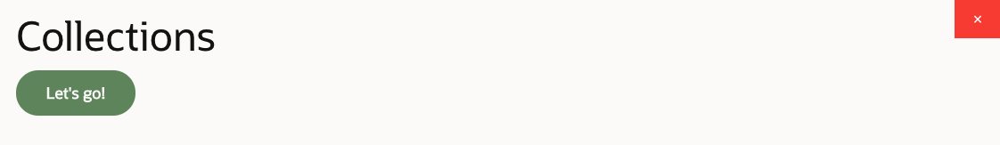
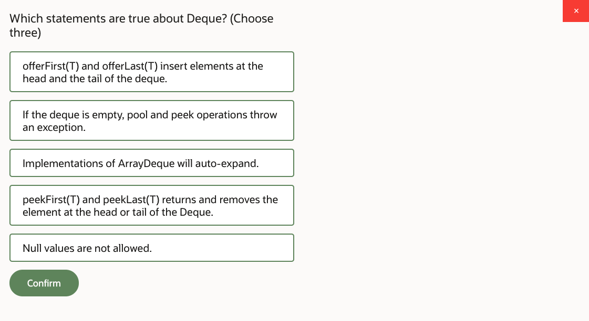
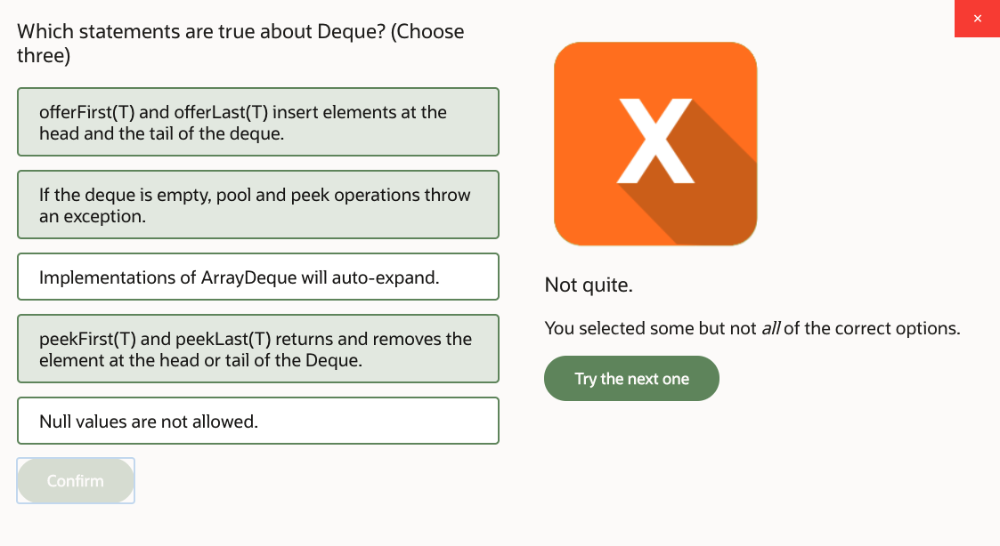
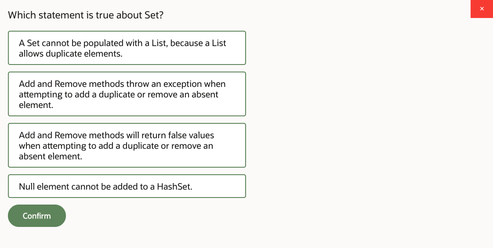
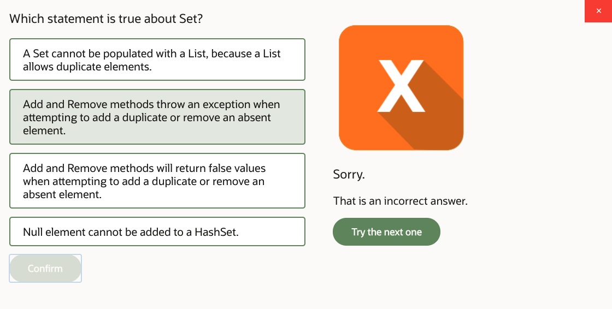
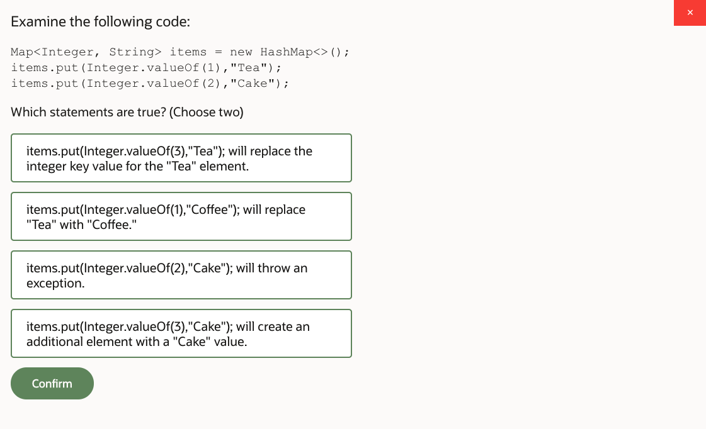
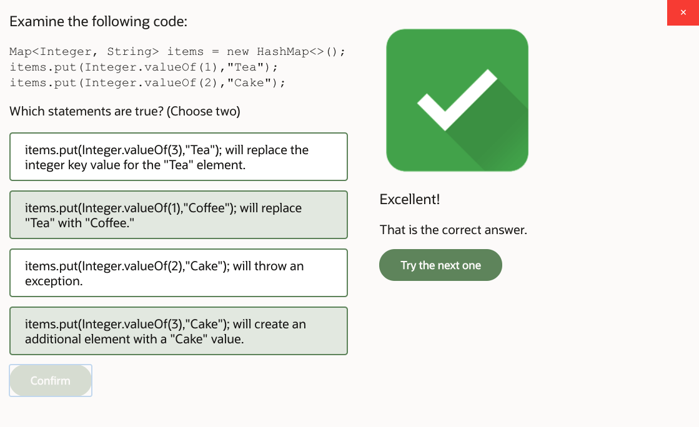
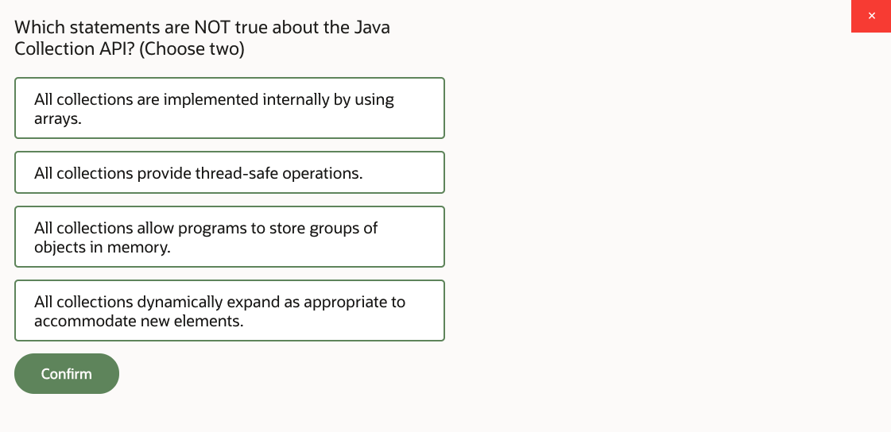
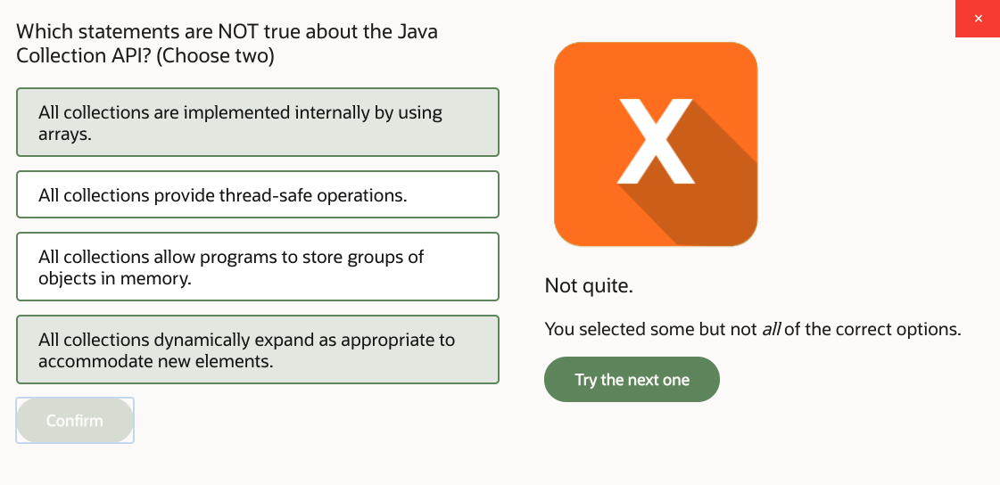
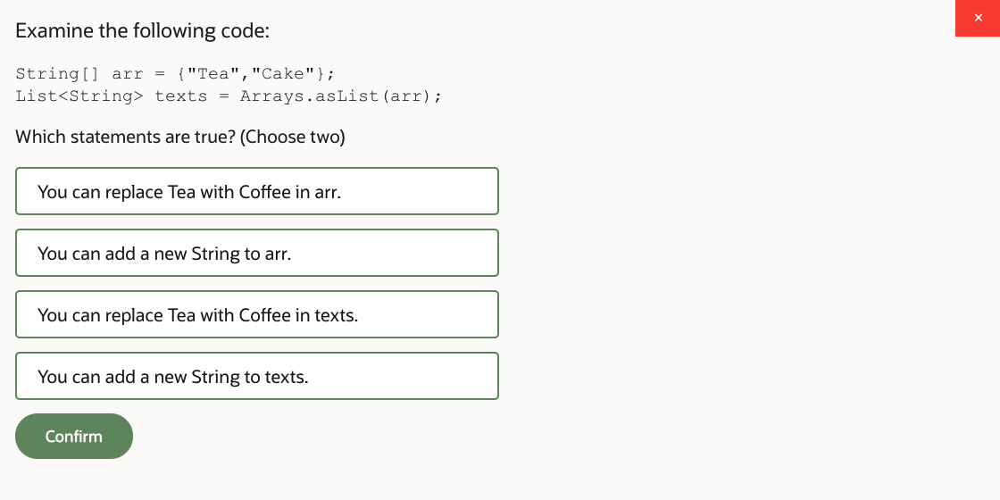
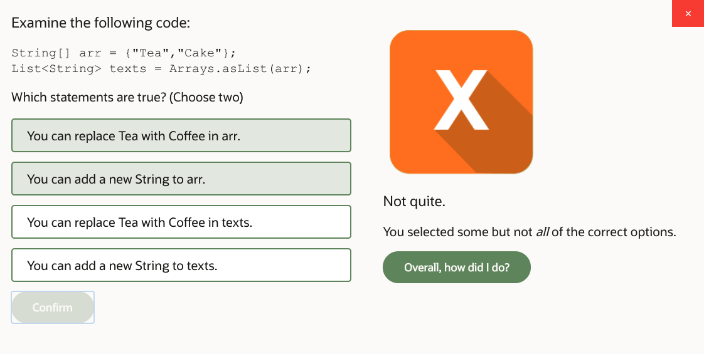
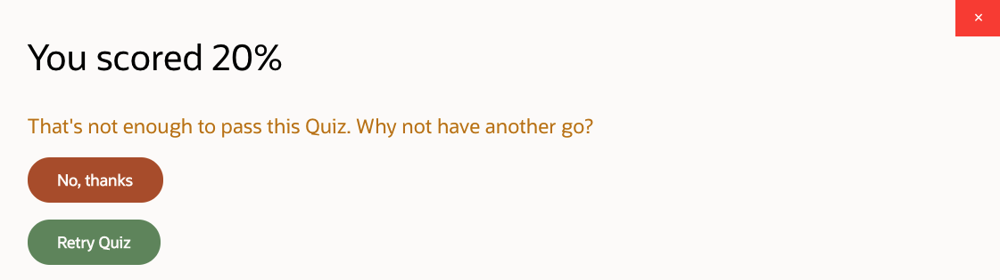

