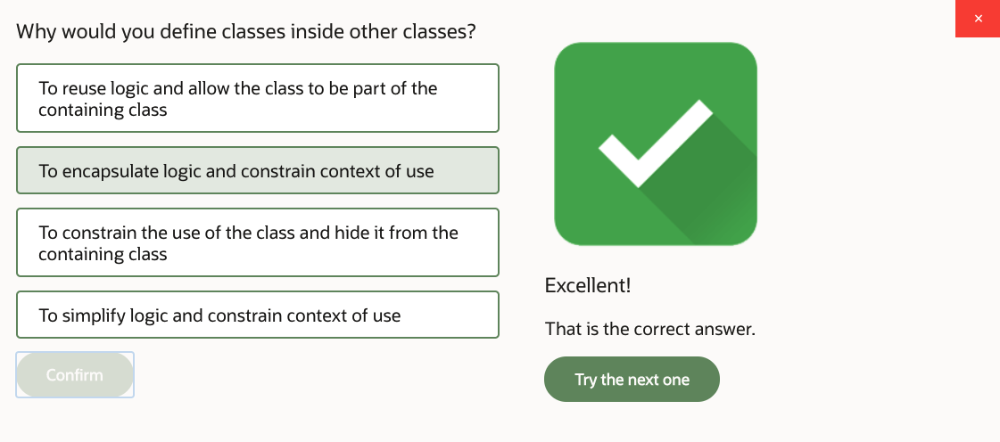
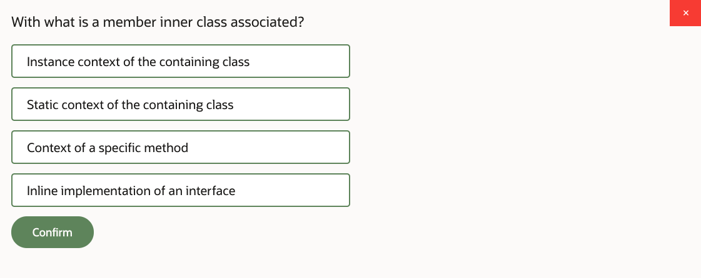
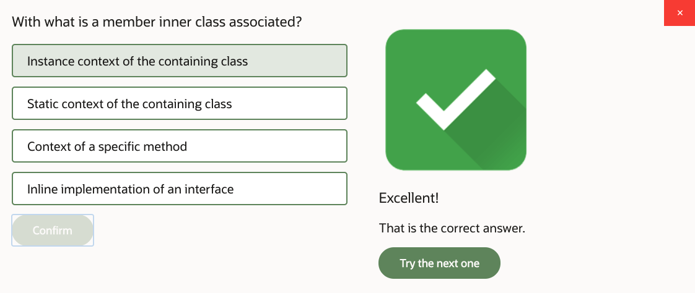
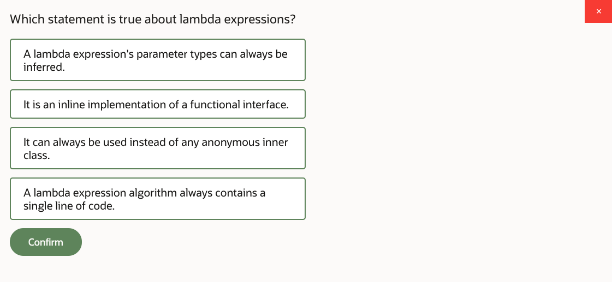
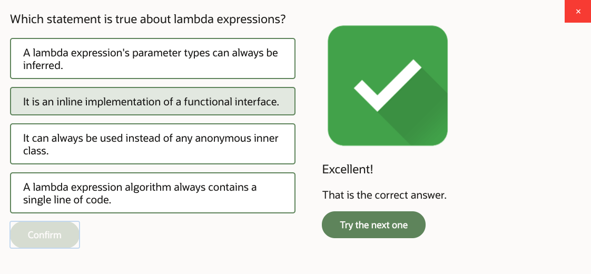
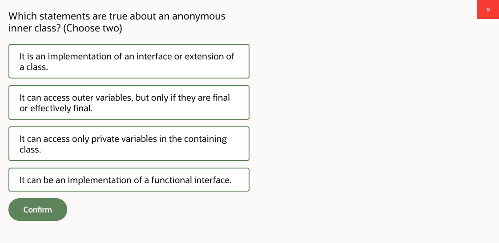
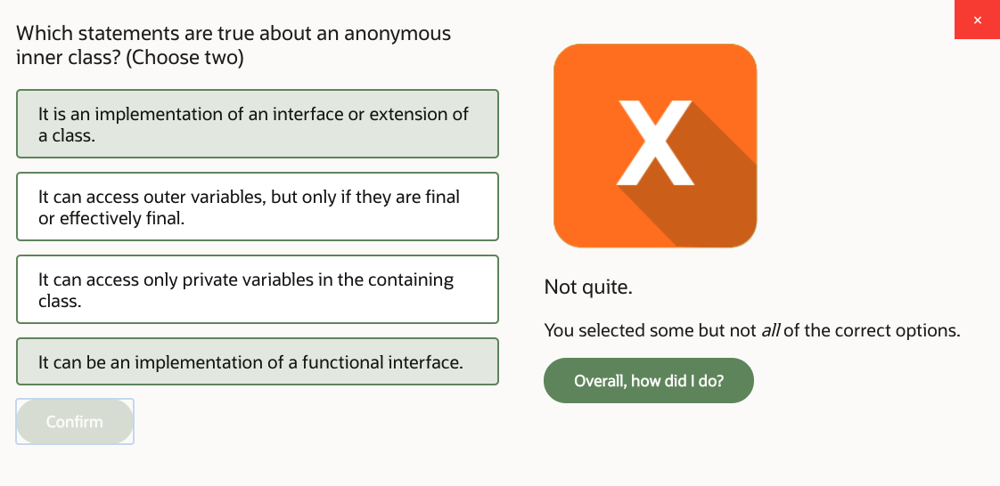

# 10: Nested Classes and Lambda Expressions

1. Nested Classes and Lambda Expressions, Part 1 28m
2. Nested Classes and Lambda Expressions, Part 2 21m
3. Practice 10-1: Refactor ProductManger to use a Nested Class 26m
4. Practice 10-2: Produce Customized Product Reports 14m
5. Nested Classes and Lambda Expressions - Score 80% or higher to pass

## 1. Nested Classes and Lambda Expressions, Part 1 28m

Let's take a look at nested classes and lambda expressions. In this lesson, we're looking at the types of nested classes, and static, member, local, and anonymous. And then we'll also study what other lambda expressions, which is kind of a very interesting way of writing logic in Java through this sort of lambda expression style, which actually relates to the nested classes.

Anyway, we'll start with nested classes first. There are different types of nested classes, but what's common between all of these types is that they represent cases when one class is written inside another. And the reason why would you want to do that-- why would you want to put one class inside another-- is because you want to constrain the context in which it is used.

So usually, you would like to probably do kind of a more reusable code. So introduce a code with a greater degree of usability. But occasionally, you may wish to design some code that is intentionally restrictive in a way it is reused so you don't want the code to be reused everywhere. You want that particular class to only be used in a certain context.

And that's where you can put the class. You can nest it in another context. So there are several types of such nested classes, and the first type is called static nested. And that's where the inner sort of this nested class is placed inside the outer class in its static context. Member in a class is associated with an instance context of the outer class.

A local inner class is associated with the context of specific method. So it's inside the method. An anonymous inner class is just an inline implementation of an interface or an extension of a class. Now we'll start by looking at this example. There are a couple of examples here.

The examples you're actually looking at are static nested in this page, but we'll see other examples in a moment. But first, what these two examples show is that there is a class inside a class. So there's this outer class, and then there is this nested class.

And as you can see, there's a word static present on it which places this nested class in a static context of the outer class. So remember, static context is the one that's shared between all instances. However, notice the difference.

In the left-hand side example, the static nested class is public. But on the right-hand side example here, this same sort of static nested class is actually not public. It's private.

So here's an interesting thing. If you make static nested class private, then a code outside of the outer class won't be able to actually see it. So only operations of the outer class will be able to access that static nested class. So that, for example, outer class provides some kind of method which actually creates instances of this static nested-- yeah, sure, you can do that.

But from the perspective of the world around the outer class, well, you would be able to call a method upon the outer class which presumably internally creates some instances of static nested. Absolutely-- why not? But you won't be able to actually see the static nested class directly from outside of the outer class. So you kind of hide that class inside the outer.

On the left-hand side scenario here, the class is public, which actually makes it possible to observe it outside of the outer class. We're using this dot notation. Outer class, dot, static nested class. And actually, we can instantiate it directly from outside of the outer class by using new operator, and again using this strange kind of dot notation when one class is sort of inside another.

That's your choice. You could decide which way you want to implement this class inside a class scenario. You could make it private, you can make it public. That's your call, really. But this is the consequence.

Where would you be able to observe that class from? Just from the outer class or from the world around the outer class as well. Anyway, let's take a closer look at these examples. So zooming into the actual example of static nested class-- what it feels like. So imagine you have this class order.

And then for-- order represents different orders. Customers can place orders, order products, whatever. But how about orders generally are associated with the way they can be shipped? Shipping mode-- maybe fast shipment, normal shipment, priority shipment, whatever. Just a way to deliver that order.

What we're trying to say-- by creating class shipping mode inside the class order, we're trying to say that shipping mode is something that only is used by orders. Nothing else in our application uses that shipping mode. It's only valid in the context of the order.

By making shipping mode static nested class, we imply that a specific instance of order has no relation to the shipping mode. It's the overall type order that relates to shipping modes. So each shipping mode is something that belongs to all orders.

It's all orders that potentially can use fast, normal, priority, or whatever other shipment. You can create different instances of shipping mode. Sure, you can. As many as you like, actually. So yeah, why not?

But you can only do it in the context of the order class. Moreover, you just made it private, so no code outside of the order class can possibly see the shipping mode class in the first place. So you could call a static method upon the order, like that create shipping mode method, and ask the order to create some shipping modes of the order class.

But instances of the order, well, they kind of collectively share whatever static context the order has. And the shipping mode instances are all related to the static context of the order. They're not related to specific orders in this particular example.

What the code inside a shipping mode can have-- well, it's a normal class as you could see. You can have variables inside, that you can have constructors, you could have other methods. This is pretty much like any other class, except it's written inside another class.

Also the code inside a shipping mode class can actually observe outer class variables and call outer class methods even if they're private. So static, nested classes, or any nested classes, actually, can access the code of the outer class directly. However, because the static nested class relates to the static context of the order, the only thing you would be able to see within the order class from within the shipping mode class-- if inside of shipping mode, you're looking at the order, you only see static methods and static variables of the order.

Inside of class shipping mode, you can't address specific orders, like that order or this order. In a way, what you need to realize-- the keyword this inside of shipping mode class means an instance of shipping mode. The keyword this doesn't mean this order-- uh-uh. It means this shipping mode.

So it refers to the instance of this static nested class, not the instance of the outer class. And because this nested class is static, it cannot actually even see instances of the outer class as such. This is not something that you can observe from a static context. But you can see variables and methods of the outer class if they're static as well from within the shipping mode.

So that's one modeling case. Let's take a look at the next example, which is the member inner class. It's kind of very similar syntax wise. You also place the class inside another class. But this time, you don't stick the keyword static onto it.

So the difference is that this particular inner class is related to the context of an instance of the order, not the static context of the order. But specific instance of the order. What it is that we're trying to model here-- why this class item is inside the order-- what's the point? If the class item that represents order item, I guess, is something that you just write separately, like an independent class in a separate source file, whatever, you could do that.

But then what stops you from creating an item without creating the order? Nothing. If it's an independent class, you can just go and create an item-- new item. Fine. By placing an item class as a member inner class into the order, you're essentially saying you have to instantiate the order first. You have to have an instance of the order.

And only then you will be able to create instances of items. So you create here order one, order two. And then you call some method that presumably, internally, this method creates new item, and that creates instances of items. So it maybe stores them in some kind of-- inside the order.

So each order will have its own collection of items. And each item will belong to specific instance of the order. Apart from that, this looks like a normal class. You can have variables, you can have methods, you can have constructors. It's just you embedded it inside an outer class.

The code inside a class item can see instance variables and instance methods of the order. You can even if they're private, actually. And it can see static variables and methods of the order even if they're private. Because from the instance point of view, you could see whatever is going on in the instance, and you can see whatever is going on in the static context.

Remember, static nested class can only see static context of the outer class-- cannot see instances of the outer class, because it doesn't work the other way around. There's only one static context, but lots of instances. So the other way around, the reference is ambiguous.

But from the instance point of view, the reference in the outer class, or its static context, or its instance context is unambiguous in a situation with a member in inner class. So we created here a design decision that forces whoever uses this API to create items in the context of a specific order. This is why this is modeled as a member inner class.

Next one, a very rare case-- extremely rare. I've seen only a few examples of that. I've been doing Java since version 1, so for a very long time. So this is kind of a situation when the class is declared inside a method. So it's extremely restrictive in terms of its usability.

This class can only be used in a context of a specific method. That's probably why it's so rare. So defining the class inside a method, why would you want to do that? Well, I guess if you have a very complex algorithm that you cannot just express as a normal logic of the method, because it's so complex you want to modularize it, you want that algorithm to be wrapped up into the class of its own.

But then you're saying that you don't want that algorithm to be reusable. You want that logic of calculating tax, of finding rates, or whatever to be specific to the order, and moreover specific to the manage tax method, and you don't want that code to be callable from anywhere else. It might be like a security concern, or a very tight restriction imposed upon your code.

So you can create a class inside a method. It's a normal class. You can have like variables, methods, whatnot. You can have instances of that class as you could see. [INAUDIBLE] create new instance of that order tax manager and call methods upon it. But you can only do that in this method, nowhere else.

The code inside is order tax manager can actually see variables outside of the class here. It can observe-- like let's say location, for example, it's a variable-- well, parameter is a variable, really. You could address these variables.

However, there is a restriction. Variables that you want to observe from outside of the order tax manager-- so the code inside this class can see variables outside if they're final or effectively final. You don't have to physically put final keyword. Effectively, final is a concept in Java that basically allows the compiler to figure out if you never reassign the variable.

So the compiler can look at the code and could say, well, yeah, he didn't mark it as final, but he never actually assigned anything to it but just a single time when he initialized it first. So then it will be treated as effectively final even though the final keyword might not necessarily be physically present.

If you want to access some data outside of this class that's not final, well, you just pass it as an argument to a method. When you call a method, you can pass parameters. And then you can pass whatever you like.

It's the case when you want to access a variable that hasn't been passed as an argument to any of the methods here-- just directly see some data outside of that class-- well, then that data has to be either final or effectively final. But from that, this class can actually observe data in its surroundings. And it can see the instance variables, and it can see local method variables, and it can see the class static variables provided their final or effectively final, or else they have to be passed as arguments to operations of this class.

So it's an extremely restrictive way of creating classes. It's just restricted to a single method, essentially. Now this is probably the most common type of inner class-- anonymous inner class. It's all over the place in Java-- lots of different places.

You could see anonymous classes used over and over again. And what anonymous inner class represents is an inline implementation of an interface or extension of the class. Here is how we come to realize the importance of anonymous inner classes.

Imagine you have a class order. So it has variables, methods, whatnot. And among all sorts of different methods, let's say it has a method that calculates discount. Of course, there are other variables and methods, but whatever. So there's a method that gets a discount in the order.

Now let's say I have a concept of an online order, and I want to extend the order, and I want to override. Maybe in the online order scenario, I have a different way of calculating discount. It doesn't matter what the discount. It's just different. Whatever.

So some other algorithm. I can override the method and introduce a different algorithm here. But then you look at this class, and you're thinking, did I just create the entire class for the sake of overriding just one method? Was it worth it creating a whole separate class and just overriding one method?

But sometimes, that's what you want. Sometimes, you only want to override a particular method, and they don't really care about changing other methods. You just inherit them as they are. Well, actually, in this case, you don't have to go and create a separate file, a separate class that extends the class order.

You could do better. You could do anonymous inner class. And the syntax of that is that you just create a new instance of order like you do usually. But instead of putting semicolon here, like this is just new order-- no.

You actually open a curly bracket, you close the character bracket, you then put a semicolon. And then in between these curly brackets, you override whatever methods you like of that class order. You just override them. Essentially, between that curly bracket and that curly bracket, you just created here a class.

This is the class body, except that you didn't call it anything. This class doesn't have a name. This class basically implicitly extends order. When you were saying new order, and then providing an actual class body, that class body has no name, but it extends order. And that's how you override its methods.

And down due to polymorphism, when you call that variable order dot get discount, you actually get that particular implementation of the method. Because remember, the lowest implementation of the method down the hierarchy is automatically invoked. That's the definition of polymorphism in Java.

Actually, instead of extending the class here, you could send new, and then the name of the interface, and then that body. Well, how come you can instantiate the interface? That doesn't make any sense because interface is totally abstract.

Well, if you actually then provide a body for it, then body will be the class that implements that interface. Anonymous class, it doesn't have a name, but it implements a given interface, and then you override the methods. Well, whichever methods you need to override in that interface.

That's anonymous inner class for you. It's a really useful technique. Here's some examples. Imagine I have a list of products and I want to sort it. And maybe I want to sort products by comparing their names, or maybe I want to sort products by comparing their prices.

Would you create different comparators? You can create different competitors, but would you want to create a separate class every time you have the whim of just sorting the products in different way? Well, you don't really have to create a separate class every time. You can do it inline.

You just say new comparators-- use generics comparator product, open curly bracket, closed curly bracket, and override compare method. And then when you call sort again, you just override it with a different algorithm. This is anonymous inner class defined directly inline inside a call to the method sort basically.

Because the method sort second parameter is expecting you to pass comparator object. And you pass here an implementation of comparator interface, which is your anonymous inner class. It's a typical thing to do with functional interfaces.

Because you see, the functional interface only ever describes one abstract method that you need to override-- just one, which is an ideal scenario for anonymous inner class. If you have to override 10 different methods, then chances are you probably want to create a separate class here. Just like normal class implements whatever interface or extends whatever other class, and override whatever methods you need to do override.

But if it's just one method, as in functional interfaces, then constructing the whole separate class seems like a bit of overkill. You can just do it inline, and it works perfectly fine. So it's a convenient approach to functional interface implementation.

So there you go. These are various types of classes-- nested classes, inner classes. That we can basically write a class inside a class. So we've covered these types. Now let's take a look at lambda expressions.

And what you need to realize is that actually, lambda expressions in Java are really a way of doing something very similar to what you can achieve with the anonymous inner class. Lambda expression's logic is really, really similar to the anonymous inner class idea.

Here's an example of what the lambda expression looks like, feels like, and how it actually works. So same example-- we have the sort method of collection. We want to sort products. What do we know about this scenario?

Let's put it this way-- what does the compiler know about this scenario? When a compiler looks at this chunk of code, the compiler understands that a collection is using generics product in this particular case. The compiler knows that the first parameter of the source method is the collection you would like to sort, and it understands what is the type of the object in that collection-- that its product.

And then compile also understands that the second parameter is a comparator interface. So first parameter collection, you would like to sort. Second parameter, something that implements comparator. This is unambiguous because that's the definition of the method sort.

So this is your invocation context. The compiler is aware about it. So certainly, you could write an anonymous inner class. You can say new comparator of product, and then you override the method compare. Good, you can do that.

But you see, the trick is that you couldn't have possibly done anything else here. The only part of this chunk of code in the anonymous inner class that's actually up to you would be the names of your parameters, because you can call them whatever you like. They don't have to be called P1, P2-- you can call them whatever you want.

And the actual statement, how do you compare things? Well, in this particular case, I P1 get name, compare to P2 get name. That's my custom part. This is my custom algorithm, my grounds of comparison. So parameter names and the actual algorithm is what I need to come up with.

But you see, the rest of this code is completely determined by the context in which you're making the call. A sort method requires you to implement comparator. It's like, you can't really do anything else here-- you implement a comparator. And it's a comparator of products because that's the list you're trying to sort.

So the generic from the list should be the same here. And thus, you know exactly what should be the type of parameters. It should be product, because that's what you're sorting through. And then most importantly, comparator is a functional interface. It has only one abstract method.

So it's not like you have a choice which method you're overriding. Of course, you're overriding public and compare with two parameters because that's the only abstract method you're supposed to override in comparator anyway.

So all you need to do is to provide parameter names, and you need to write an expression-- how do you actually compare things? The rest of it can be guessed by a compiler from the context. And it's pretty unambiguous. It's not like it could possibly be anything else.

So lambda expression is doing exactly that. When you create a lambda expression, you do it in some context. In this case, in the context of method sort. And you say, well, my parameters are called P1 and P2.

And then you put this lambda token, and then you basically write a statement of what do you want to return. So you don't need to write a return keyword, you don't need to put the method body around it, you don't need to put the class body around it, you don't need to write that you're overriding method compare, you don't need to write that you're implementing comparator interface, you don't need to say it's actually type of generic type of product. All of that is unambiguously guessed from the invocation context.

All you need to do is write the actual logic-- the function that you want to perform. Hence, lambda expressions are often referred to as a functional programming style. They rely upon the concept of a functional interface, the interface that describes single abstract method, which makes it unambiguous what it is that you are trying to override, which method you're trying to implement. And then it allows you to guess-- well, it allows the compiler to guess from the context what exactly is going on.

And you, as a programmer, can focus on just writing the expression that is your logic. You don't need to write the whole thing about the anonymous inner class around it. So this is it. That's what the code does. That's your lambda expression.

## 2. Nested Classes and Lambda Expressions, Part 2 21m

Some other syntactical tricks around lambdas that you may need to know. First of all, lambda expression can be pre-coded beforehand. This is the first example. I could say comparator, compare in strings. You see, in this case, it's not in the context of a method call. I just declare it as an independent variable. So part of my context is missing. Is that comparator comparing strings, or products, or what?

If I'll be doing it inside a method sort directly, I wouldn't need to say it. But because I'm doing it outside of the sort method, I'm just creating this comparator before I actually pass it to the sort method later. Then I have to say which generic I'm using. But then the rest of it is unambiguous. It's obvious which method I'm overriding. And it's obvious that a method should return an int, so you can write an expression. What do you want to return, and how do you call your parameters? OK, and then you can take that variable, and you can pass it as an argument. So apparently a lambda expression can be assigned to a variable, and can be passed as an argument, as a reference.

The other interesting thing here is the application of type. It looks excessive, because the type can be guessed by a compiler anyway. So you could just say s, instead of saying string s, right? Or you could just-- you don't have to say var s. You don't. Because the compiler can guess it for you, what is the type, right? So you could use var to explicitly to let the compiler guess what is inferred type here is. But as you can see from early examples, you didn't have to say anything about the type. The compiler can guess it from what generics you are using.

However, if you just write s1, s2, or just s here, and just a variable name, just a parameter name; then you can't apply any modifiers. You can't use keywords like final. You can't use annotations applied to that parameter. So if you want to apply additional modifiers, such as the final keyword, then you have to either say what type of the parameter that is, or you have to use the word var, and explicitly tell the compiler, go guess what the type is. But the reason why you put it here is because you want to apply extra modifiers. They cannot be applied to just the variable name. You have to somehow indicate, well, there is some type going on here. So there is a type that you associate with that variable. Type, of course, will be associated with a variable anyway, but it's just syntactically required to imply the type explicitly, if you want to use additional modifiers.

Lastly, you can actually write the body for the lambda expression, open curly bracket, close curly bracket, and actually write the method body. But in that case, you can't just write an expression like you did here, what it is that you want to return. If you decided to wrap it up into the actual method body, then you have to be formal about it. You have to put a return statement. You have to put semicolon on the side. So it's like a proper algorithm, proper method body. You can do that as well, if you like.

Now, this is a very convoluted way of creating lambda expressions. It's called method references. The problem with this approach and why it's so convoluted, why it's sometimes very difficult to understand what the code is doing, is because it's hinged on the idea of semantically identical method. So let me explain that.

There is this strange syntax, class, colon, colon, method; or object, colon, colon, method; or class, colon, colon, new. This double colon sign, which allows you to say which method would you like to call, by using a method reference. Now what's strange about it is that your lambda expression which should be really an implementation of a functional interface, it can be achieved without you explicitly writing the implementation of correct functional interface.

Let me show you this example. So I've got this class called text filter, right? And there's a pair of methods. One method it's called removeA, and the other is called sourceText. If you look at these methods, then you realize this removeA method, it accepts an object string as an argument, and returns Boolean. And it really looks like a method test from the predicate interface. The predicate, we use it and removeIf. Remember, we covered it earlier. So the predicate interface has a method test. And it accepts whatever object you need as an argument, and returns Boolean, and then removeIf, for example, you can use the predicate to decide whatever you want to remove something or not.

You could write a lambda expression that would look like this, s is my parameter name, lambda token, and then you call that removeA method. But you see here, where you're making this TextFilter.removeA s, you're actually writing a return statement for the test method of the predicate. That's what you're doing. However, because the signature of the removeA is semantically identical to the signature of test method of a predicate interface, instead of actually writing a lambda that implements the predicate interfaces, the previous line of code; you could achieve exact same result by saying TextFilter, colon, colon, removeA, by using a method referencing.

And Java compiler will figure out that this method is really what you're using instead of the predicate. So it understands that. How does it know that it needs to figure out it, with regards to the predicate interface? Well, that's because that's what removeIf method expects. RemoveIf method accepts predicate as an argument, right? So based on that, Java compiler understands which interface you're supposed to be implementing. It's a functional interface. There's only one method there, and it just basically checks if they removeA method matches the logic of the test method of the predicate. And indeed it does. It accepts the parameter, and it returns Boolean. So yeah, it's fine. It can be used in place of an actual test method of the predicate.

Another example here is this sortText method. You see a couple of parameters, and returns an int, and you guess what we're looking at here, is a comparator. It's clearly very similar to compare method of a comparator interface. Once again, the class textFilter does not implement comparator. It does not implement predicate. These methods have different names. But what they do have is same parameters and same return types. So that's why we call them semantically identical.

So yes, of course, you can write a sort, and you lambda expression, and you say, OK, well that's a comparator that I would like to implement. These are two parameters of comparator, compare method, that's a lambda token. This is what I want to return when I'm comparing things. But actually, a filter by the way, is I just created an instance of textFilter and called it filter. That's that variable. Filter sort text is an invocation of this method. But actually, I can just say filter, colon, colon, and sortText. Then it will also work. It's a method referencing, and it works just like the lambda expression above.

Now lastly, here's another example. A class string has a method called compareToIgnoreCase, which is very similar to compare method. It does the same thing as compare, but it also ignores the case sensitivity of a string. So surely compareToIgnoreCase looks like comparable interface. It compares an object to another object, but one of them is a parameter, and another is the current string. That's the logic of that. So you can use it instead of compareTo method, for example. You can use the compareToIgnoreCase.

However, and here is a really strange thing. CompareToIgnoreCase is actually an instance method of a string. It is an instance method. But when you use method referencing, you're actually allowed to say string as in type, not as in variable, right, but as in class itself, colon, colon, and then refer to the instance method. And basically the lambda expression, as you observe it above this line, works exactly as this line. So we're saying there is a method that is semantically identical to what the compare algorithm is supposed to be doing. And then a compiler is smart enough to figure out how to call that method in the context of lambda expression, if you just basically say which method you want to call, without actually writing a proper lambda.

I find this syntax very confusing, because you effectively refer into an instance method, but you're not using an instance reference. You're not using a variable. You're saying which class it is, and the whole instance then is implied. And the compiler just guesses it for you. I mean, it's cool, compiler guesses it for you. But then it's difficult to read the code and understand it, right? Which is why I find sometimes method referencing problematic.

But the good news is it's your choice. I mean if you prefer that style, certainly it is shorter to write it that way. Then you don't have to spell out the entire lambda expression. You can just do method referencing instead, right? So there you go.

Now remember, interfaces, apart from having abstract methods, also may contain default, private, and static methods. With private methods, we're not really interested, because they are not visible outside of the interface anyway. So the only place you can call a private method in the interface is default method, for example. There you can call private methods. But otherwise, they're just hidden inside the interface. But we could be interested in the default and static methods, because we could still call them from around that interface.

Now, we already mentioned that functional interfaces only provide one abstract method you're supposed to override. And it's a precondition for us to use lambda expressions. If you want to write a lambda expression, it has to be some functional interface that you're trying to implement. That's given, right? That's the whole notion of lambdas.

Now that said, you may still wish to invoke other methods, like these default and static methods. So let's take a look at some examples of that. And the first example is comparator. Now we know the comparator. We used it before. And we were overriding there a method compare. And we could implement it as lambda. And here is some examples. I've got these two comparators. One is comparing product names, another is comparing product prices. So I've got this list of products, and I want to sort them in different ways using these comparators.

But then there are some methods in a comparator that you don't need to override. They're methods that are default methods. They're called thenComparing and reversed. And there are a pair of static methods as well called nullsFirst, nullsLast. This is how it works. Suppose you want to combine several different comparators together. And then you can take one comparator, and you can call the method thenCompare upon it, and then pass another comparator as an argument then, that it can bind. Reversed changes the order, like ascending, descending; the opposite order of whatever your sorting is. So you could do that.

And for example, imagine you a null. And then the question is, well, where do you put the null if you're sorting through that list? So you can say, OK, put the nulls first, for example, and then sort by name. So they appear to be quite useful. You don't need to override them, but you only will provide lambda expression that essentially overrides the abstract method. But then you can use other methods, just because the interface provides them.

Now let's take a look at another example, which is the predicate. Again, predicate, we've seen it before. We've implemented it. RemoveIf method is a good example of that, where the predicate is used. So we override in there a single abstract method test, a return in Boolean. We've got again, the list of products here. We've got a couple of predicates. One predicate looks for anything that's an instance of food. The other predicate looks at prices greater than, less than, whatever. So anyway, so we've got some conditions. We're filtering products by type. Are they food? Are they drink? And we're filtering products by price.

Now default methods available in the predicate are called and, or, and negate. They allow us to combine different predicates together. And negate as in do the opposite of what the predicate logic says, turn true to false, and false to true. It acts like an exclamation mark, pretty much.

And there are a couple of static methods-- the not method, which kind of reverses the supplied predicate; and there's also an interesting one called isEqual. It allows you to form the object, and then say remove if everything looks like that object. So you can provide another object, which basically is like an image of what needs to be removed from the collection, so search by example essentially.

OK, so a couple of predicates we have defined. And then we say foodFilter.negate. So currently, food filter is looking for anything that's instance of food. And if I call negate, well, I will be looking for everything else, basically. And then you combine it with and or or method, and you pass another filter in this particular case, the predicate that's a price filter.

OK, and another example here, remove everything that looks like cake, is equal to that food cake. Lovely. So these are default and static methods, and just a couple of examples showing us that in addition to the obvious thing that a lambda expression does, we can supplement it with these extra methods that functional interfaces may provide.

Well, we've looked in this lesson at two important areas. First was nested classes, which allows us to impose restrictions on a code, where we would like to call the code from. If it should be restricted to context of a class, static nested; context of any instance of some class, member inner; context of specific method, local inner; just in line implementation of some interface or extension of the class, anonymous inner.

So these are the cases where we'd like to restrict where a certain class can be used. And then with anonymous inner classes, we can make the code look much shorter. If we implement in functional interfaces, we can actually implement them as lambda expressions. The expression itself just writes the parameter names and the logic of the body of the math that you're essentially overriding, single abstract method given to you by a functional interface. And the rest of the context is basically inferred, so compiler can figure out exactly which interface you're implementing, or exactly what generics you are using, and which method you're supposed to override; just from the context of that invocation.

In this exercise, you're asked to do a couple of tasks. First, you're asked to take the code that already exists in your product manager class, extract it from the Product Manager, and place it into the static nested class-- some code, which code-- code that deals with text resources, and code the deals with formatting, with presentation of text in some ways, like localized formats or just format enough text. The idea behind this practice is not just to show you the use case for nested classes or whatever. There's another design goal here at work, and that is it's generally advised to group functionalities that relate to the interface, to the way you present things, separately from the functionalities that relate to the business logic.

So if the product manager class currently in your current state of the exercise, presents you with a mix of business logic and text formats, it would be more maintainable, it would be better code from the perspective of future extensibility and maintenance, if you segregate these functionalities, and you put aside into separate class everything that relates to the user interface, the formatting of values, and you keep the business logic separately from that. And that is the rationale behind what you're asked to do in the exercise, to put certain functions of the Product Manager aside, and wrap them up, and encapsulate into the static nested class, which kind of acts as a helper of formatting required text resources.

Another part of the exercise tells you to perform the sorting of products. And for that, you are asked to implement comparator interface, and you're asked to use different lambda expressions, so sort products in different ways. OK.

## 3. Practice 10-1: Refactor ProductManger to use a Nested Class 26m

Let's take a look at practices for Lesson 10, which cover nested classes and lumped expressions. Now in this practice, you need to change the design of the product management class to create a static nested helper class to encapsulate all the management of the tax resources and localization. Now this is a strange practical exercise because in that section of the practice, you're not actually writing much of a new code. You're almost only just kind of cutting and pasting it. You're moving the code. You refactoring it. You're changing its location.

So code that's currently in the product manager class needs to be kind of alienated, moved into separate class, nested class. Now the reason for this design, for this change in the design is to separate the business logic of the application-- what do you do in terms of storing products and reviews and doing that part from the part that visualizes the information. For example, applies the locale or parse as values or formats values or print reports or anything like that.

So that's the first part. And then there's another part of this exercise, which actually implements different sorting options for products using lumped expressions. OK, so now there is a strange thing about this exercise, as I say, yeah. Because you're not really writing any code in the first part of the exercise, you're mostly just moving the code around, you've got a choice here. You can actually do the exercise properly in which case you follow the instructions of the lab 10-1A. And that tells you how to cut the code, where to paste it, how to rearrange it.

Or alternatively, you can skip the 10-1A and proceed to 10-1B where that is already done for you. In this case, the assumption is that you've taken an already refactoring code where the code has already been moved into the static nested class, and then you just sort of you know read through that transcript of 10-1B exercise to understand what the new code is doing and why it was refactored like that. So I'm going to show you how to actually follow the practice 10-1A.

But just in case, if you don't want to do a lot of cut and pasting, then you can just read through the transcript of 10-1B. Regardless of which way you do it, you still need to do the exercise 10-2 after that. So either you've finished 10-1A or you load essentially a solution and read through that in 10-1B. But do you then do the 10-2, which is the exercise that practices lumped expressions, right?

OK, well let's start with 10-1A. The assumption is that you've finished the previous exercise for lesson 9 and that you decided to actually do the lab step by step. Right, if you finished the previous exercise, you don't really need to open a solution. You can just continue in a previously created project or else you can open the solution for practice 9. Now your job here is to create a static class a nested class called resource formatter. So this one would be responsible for formatting values, supply and localization.

And we'll take this functionality, it's currently in the product manager. And we move it to this resource formatter. So let's open the product manager. And just anywhere, well, it doesn't matter really, put the resource formatter static nested class. Just nicely realign the code. Yeah, and we'll be moving code inside here. So we'll be cutting the code from the product manager and move it into this static nested class instead.

Right, so what do we need to move? We need to move the declarations that relate to the formatting, to the locale, to resource bundle, to datetime format, to number format. Fair enough. So let's find these variables. A locale number date format resource bundle, cut them. You retain the part that deals with data like product map. That's fine. That's still in the product manager. But we cut and we paste the other components inside this resource formatter.

OK, of course now we need to initialize them. Previously, these were initialized from the constructor of the product manager. But now we're initializing them through local method, which we need to add to the resource formatter. In fact, we can add that as a constructor of resource formatter. And that's precisely what you do next. So you create a constructor for resource formatter to accept the locale. OK, formatted nicely, and then move the initialization code for the locale resource data and money format from the constructor of the product manager where these code currently resides here.

Yeah, from the product manager constructor, move that to the constructor of these nested class here, to the resource formatter constructor. OK, so we're initializing all of these resources. Same logic, we just moved it from one class to the separate class which is nested. OK, so we did that. Now what? Now we need to add a method to format information about a product. So we'll have a dedicated method to do the formatting of product data. And that's the signature of that method.

Return in string, accept the product, which kind of makes sense. Yeah, and put that into the resource formatter. Of course, we need to add more logic to this method. But we'll deal with that in a moment. So now we have a dedicated method to format the product. How do we format the product? Well actually, we already have the required logic. This logic comes from the printProductReport method, which is currently doing that formatting.

Let's check it out. So what's going on in printProductReport? We have here the format for the product. There it is. That's the chunk, well, append [INAUDIBLE] to the StringBuilder. But obviously, well, we just format the product here as an argument within the StringBuilder, append method, right? So if we take that out, so obviously something needs to go into the append method in a moment. Yeah, but if we take that out and we put that logic into form our product method and we return basically the format it's result-- let's just make sure you put correct semicolons at the end of the line, yeah, so there you go.

You use this locale given product name, price, rating, best before dates which you extract from the product, all of these properties. You use the resource bundle here that you've loaded. You use the formatters. So all of that was previously done in the method that printed product report, right? But now we can actually use it inside a method format product. So we can call it later, yeah, from print product report, I guess. OK, so we moved that code.

Now the same thing needs to be done for formatting of the reviews. So we add a method to format reviews. Again, same idea here. So what exactly goes into the format review method? Well, I guess that message format here. When we were printing product report, we're printing reviews as well. Again, the logic will have to be sort of added to this append methods, which is kind of currently missing. But we'll figure it out. So we format in the reviews.

Right, and again we need to make sure we return the text value of the formatted result. OK, so the reviews, we've sorted them out, yeah. Now one more thing that we could add to our resource formatter is the method called getText just to get any other text from resource bundle that does not require formatting and substitution of parameters.

To remind you what's going on in a resource bundle, we've got the product message which requires us to substitute several values. We've got review that requires us to substitute a couple of values. But we may have other key value pairs that require no substitution, which we can just get as text. Yeah, there's no need to substitute any parameters. So that means we could have a method to just simply get the text and return the resource from the resource bundle pretty much as ease. And that is the next thing you're adding to the resource formatter.

OK, so we can format the product. We can format the review. And we can get any other text from the bundle, basically. Now inside the product manager, what we need to do is create resource formatter instance, and probably more than one because we could initialize different instances of resource formatters for different locales that we'd like to support. Right, this could be done with a simple static variable which will store the map of different resource formatters per locale.

So you want to have like that locale corresponds to this formatter-- that locale to that formatter, et cetera. Just store them as a hash map, I guess. The key is a string which is the name of the locale. Value is which instance of resource formatter would you like to initialize? So this code goes into the product manager, just sort of a declaration of all the locales you would like to globally support. And format this code nicely, yes. So we've got this formatter's map. Yeah, and we just put there all of the different formatters for matching locales. So we create essentially a number of different resource formatter instances for different locales.

Right, next what you are asked to do-- you may choose other locales, whatever you like, it doesn't matter. The next thing what you asked to do is to add a new instance variable to the product manager class which will represent the chosen locale. So this is like hash map of whatever locales you may choose from, and then you just say which one you actually want to use at any given point in time. So you have like just a variable for the selected formatter.

OK, which one do you want to use? So we add that as just an instance variable, you know. Which formatter you would like to use out of that entire list? OK, how do we initialize it? Well, we need an operation to set that formatter to select and choose that formatter. So in the product manager, the operation should basically accept which language tag you would like to use, which locale you would like to use and pick the locale from the list of locales and assign the selected locale to the formatter variable.

The other extra condition is which locale to select from that hash map if the language tag supplied corresponds to no language tag that's currently in that hash map. So in other words, you just need to set a default. Fortunately, the hash map has the method to do it. It's called get or default. So you can have a method that accepts the language tag and then select the formatter from the hash map of formatters.

And if the matching formatter language tag is not found, then it just gets one with whatever locale you'd like and presumably, you're assuming that this one is in that map. Yes, it kind of defaults to one of them. OK, so this goes anywhere in the product manager.

So the product manager has this ability to choose the locale based on the language tag provided. And if the language tag matches no existing locale, then it just basically gets a default one which is the [? EMGB. ?] Yeah, it could be any one of them frankly.

Good, and then it sets it to the formatter variable. Now another operation in the product manager that should return the set of supported locales. So just basically whoever wants to know which locales we're supporting, we're just returning supported locales. All we need to return is the key in that map, the language tag. We don't need to return the entire hash map. So it's simply a key set. And that is key set of strings, because the first element in that map is a string, right? OK, so now there is an ability here to report which locales we actually support.

The product manager will tell which is which locales are supported. You may need to add an import of set. No? That's fine. Next so we added a setting [? board. ?] Add additional overloaded version of the product manager constructor, which accepts string language tag and allows you to trigger the change of the locale based on language tag. So we have a constructor for locale. We cut the code out of it. And now we're doing the similar constructor, but this time, would like this one to use the language tag idea instead of locale, so a different way of initializing.

And I suppose this constructor can simply invoke the change locale method, passing language tag as an argument, semicolon at the end. Yeah, so we're invoking that method. We're triggering the change at the locale. What about the other constructor with the locale? Yeah, well we could still use it. And all we need to do is get the language tag out of the locale object which we're getting as an argument. So we can retrieve it. Yeah, that string language can be retrieved from the locale that we're getting.

OK, and if anybody calls the constructor and a product manager pass an actual locale object that will get a language back that will call the other constructor with the language tag, that will do the switching. Or else you could just call the constructor with a language tag. That will do the change of the locale and switch to whichever locale you decided to select. Nice, so now modify the logic of the print report to actually utilize the resource form order. So the text depends where we format the product. We cut the format and logic out of it.

So all we need to do now is in a print report method, just invoke formatter and call the method format product, passing the product as an argument. That will invoke this method here, format product. Well, guess what you need to do with the review.

Formatter-- don't format review instead of format product, obviously. Yeah, and that will format information about a review. And finally in the is empty clause, what we need to do is retrieve the text from the bundle so as this get text method that we could utilize on a formatter to retrieve the extra text. Get text, no reviews. That's that same clause, that same case that you want to print when no reviews are available.

So print product reports now doesn't really perform any formatting. It's no longer concerned with which locale you've selected. You may select the locale separately and then the resource formatter will handle all the required formattings, whatever you need. The print report simply says, just do the formatting for me and figure it out. You know, do the formatting without actually having to write all of that code, which was previously embedded inside a print product report method.

And the idea is that for a given product manager, we can now have a support for different localizations implemented for this additional resource formatter class, which kind of helps the product manager do all the necessary localization and resource bundles and the value formattings. But the product manager, all the product manager needs to decide is which locale to use based on the user requirements, really, to just test initialization of which locale to select and the list of supporting locales. And that's it.

OK, so we changed the logic of print product report. And now I guess, yeah, that's just a confirmation of where the logic is changed. And now we are ready to provide translations for locales. So what you can do is in resource properties file here, you can right mouse button click on it and say add locale. And select any locale you like from the list. And fill the translation for your resource bundle. The example in a manual shows translation to Russian, but you may choose any other language you like. It's up to you.

So you could do the add locale, yeah? And just basically select whichever locale you fancy. And let's do the one, the same example that's in the manual. So that creates a translation of your bundle. It doesn't really translate anything, but it just creates a replica of the original resource bundle file with the relevant country language extensions. And now you could provide the translations. You actually have the translation text in the manual. But if you want to use a different locale, that's entirely up to you. So that's your choice. Translating all of these values, nice.

Now optionally, you may repeat this process for other languages. So you've got a number of languages, remember, that we've configured here in the product manager. If you want to use different languages, that's fine. For different countries, just make sure you change it here, and then you add the resource bundles with translations. And you're ready. Yeah, if you don't add translations for whatever languages, everything will still work, but your resources will be defaulting to this bundle, to the generic one basically.

OK, now let's test this functionality. So now what we can do is that we could go to the shop class and utilize this new way of initializing the product manager using language tag constructor instead of locale constructor. That's an overload in way of constructing that. And in a shop, we could just basically replace the locale with whichever language tag you like. OK, and I guess print some product information and then switch the locale to another one to see different output. Yeah, you can switch to whichever locale you like.

After you print in some product info, just flip the locale to a different one. You only have resource bundle at this stage for one alternative locale, but if you want to provide more, there are translations of bundles, you can. And even if you switch to locale which is one of these locales that are in a product manager list here, but not translated as a bundle, you'll still see the difference in the currency and date formats.

Yeah, that's obviously a part of the format and logic. And yeah, just run and see what will happen. So first product will be printed in British English, and then all the products will be printed in Russian because we did that switch at that stage. And certainly you could switch to other locales if you want to.

OK, so that's the end of this segment. We refactored the code. We placed it into this resource formatter and enabled the switch of locales, yet in a way that didn't really affect the rest of the product manager class design.

So the business logic remained the same. It's just the application of formattings and localizations that is now indeed different. As I say, you have an alternative way of doing this exercise. Instead of actually performing all of these copy-paste, cut-paste steps, you could just open the solution instead and read through the transcript which basically explains the type of design changes that you've just performed.

So that's based on the solution for lesson 9 and basically explains how the code was moved, right, from the product manager to the resource formatter. So all the changes we just made-- this formatter object, this static sort of map of predefined supported formatters, the addition of translation bundles, et cetera.

## 4. Practice 10-2: Produce Customized Product Reports 14m

Whichever way you do this exercise, after that, you still need to perform the practice 10.2 which tells you to produce customized product reports. So either you perform 10.1a and then you continue to 10.2, or you perform 10.1b, you open the solution, and then you still continue to 10.2. What happens here is that you're asked to add to the product manager class a print products method, which accepts the sorter object-- comparator basically-- which compares products between each other, and enables the sorting capabilities within the product manager when we're printing product reports.

So that's a new method that we will need to add to print product reports and sort the products as we do that. So we take this print product method and we place it into the product manager class. So far, just to remind you, in the product manager, we have this very basic print product report, but that just operates on a single product.

And what we want to do now is instead we would like to have a method that will be capable of printing multiple products, and do it in a particular order. And we need a comparator import from Java to your package. So we will need to implement here some kind of sorting and printing algorithm.

Let's take a look what we should do. So in the print products method, we should get a list of products for a given product key. So remember, we have a hash map of products which key is the product, and the value is the list of reviews.

So what we want to do here is get the keys from the product hash map. And keys, obviously, in the hash map are stored as set. What we want to do is get it as a list, because we feel like list is more appropriate in this case. And it's perfectly normal-- you may store the collection as one type, a set in one place of the program, but then you want to use it in a different way in a different part of the program, so you convert it to a different collection type essentially. So this is what we're doing. We're getting all of the product keys from the hash set, and we presented them as a list.

And then we will apply the sorter to the product list. So we performed the sorting. Now we haven't specified a condition of sorting-- what exactly will happen, because we expect that to come in as a parameter, as an argument. So now we need to perform the actual assembly of the text based on these products, so we create a stringbuilder.txt where we'll assemble the text to.

And just iterate through the list, and just append the formatted text, and a carriage return-- new line for every product. That's pretty straightforward. So at the end, I suppose all we need to do is just to print the result-- just print this list of products. Let's try that.

So now we're going to go to the shop class, and we're going to invoke that print products method, and supply the lambda expression that will implement the comparator, and sort the products in the right order. Now before we do that, in the shop class, we're told to basically place comments on all change locales and print product report method calls. So we wouldn't have any other print outs basically.

We are simply not to print any reports at this stage simply because we don't want to clutter the output, and we want to just have a clean test of the logic of this new method we're about to create that will do the printing and sorting. You need to retain the remaining code that actually adds reviews and creates products.

That is still valid code. It's just that we will now utilize this new method which is designed to print products. And as you can see, the print products method expects us to pass comparator object as an argument-- this sorter, this comparator.

So what that sorter object-- what that comparator are meant to be doing is that it's meant to compare products, and order them based on their ratings. So we take two products and we compare their ratings. Shall we give it a try?

Ratings will have ordinals. Ordinals is an integer value for an entry in the enum, and we can just subtract one integer from another-- get either a positive or a negative value, and that's how we sort these products. So parameters here-- product 1, product 2. That's what we're comparing.

Lambda token. And the value that we need to return-- well, we can do ascending/descending order. That sort of depends which way we're going to do it-- product 1 first or product 2 first. Get the rating, get the ordinal value for the rating, subtract from another product, get rating.

And get the ordinal value, and there you go. That's your sorting algorithm. It's pretty straightforward. Well, it will print, so just run it, I guess. Running that, you'll get the list here. And as you can see, this is the order by the number of stars.

Let's just swap around P1 and P2, and you'll get the reverse order, basically, if you do that. Just run it again, and voila, your order is reversed. So the two star comes first, five star comes last. So you can do it in whichever order you like, and it's as simple as just changing which ordinal is subtracted from which ordinal.

The other option is to implement other types of comparators. So you could keep on doing that, but sorting using other conditions. So for example, let's say we will try to compare prices-- that's our next assignment. So now compare using big decimal prices.

Fortunately, big decimal class already implements comparator interface, so that's even easier. You don't even need to do any kind of math. You can simply pick up the existing big decimal math that will do the job.

So you can get price from one product and then simply invoke compare to method, and compare it to the price of another product-- get price. So we'll have two different print outs now.

Let's just run it again. So we'll see two lists of products, one compared by rating, and another compared by prices. So you can see that the order is actually changing here. So this is the price order and that's the rating order.

And I guess that's the whole idea. When you're printing products, the entire logic of how things should be printed is already embedded in the print products method. But you can supply different criterion for ordering these lines of code-- lines of output. So you could do these different comparators.

Can you can buy multiple comparators? Certainly, you can. You could basically take this rating sorter and create it as an object. Because you now added that as an object, you'll have to actually import comparator, because when you were doing it as embedded lambda expression, you didn't have to do it.

So you could simply take that comparator object, and what do you-- let's import the comparator-- you essentially just move the exact same lambda expression out of this print products method call, and you are supplying it as a separate object. So this goes into a separate object.

Actually, you can just pass that object as a parameter to the print products. That's your sorter. So you could do that. But of course, the idea is that you could take it further because you could have not just the ordinal rating sorter, but you can have a price sorter done in the exact same way. So we'll do that as well.

Add the price sorter-- same idea. And again, you could use them separately, of course. So if I just pass them as parameters to compare products individually, then the behavior of the problem doesn't really change.

All that's changing is I'm creating kind of a-- pre-creating these comparator objects rather than doing that in line. That's the only difference. However, now that I have them as separate components, I can combine them together. I could do this trick, then comparing. And I could decide which order I'd like to them to be combined in.

So for example, I could say do the rating sorter first, and then do the other sorter-- the price sorter-- or the other way around. You could swap this, and you could say do the one-- oh, and you can apply method reverse actually. You can reverse the condition that way. Or you can apply the price sorter before the rating sorter.

So combine them whichever way you want. Anyway, let's just print that and see what will happen. So now we have a more complex sorting first ratings, and then prices within each rating. And the second example is doing the same thing, but in reverse order because we applied here reversed method.

So as you can see, it's quite a flexible design. You can now change your mind about how you would like to arrange things. But the beauty of the way in which the code is designed is that all the actual format and logic is actually completely tucked away in a different class. You don't need to know how it's done.

That's encapsulated by the product manager, and it's in our formatter class, and that's the static formatter class.

And all you're doing here is that you're just specifying criterion of what you want to achieve with lambdas, and observing the results done by the logic of the product manager, which does kind of the whole formatting thing with the help of resource formatter, and just applies whatever sort of expression you wanted it to apply at that stage. So it's pretty straightforward. I guess that concludes the exercise.

## 5. Nested Classes and Lambda Expressions - Score 80% or higher to pass

Nested Classes and Lambda Expressions

View Quiz

