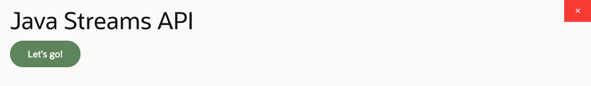
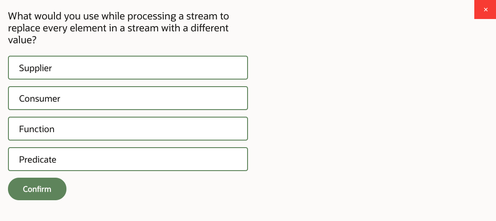
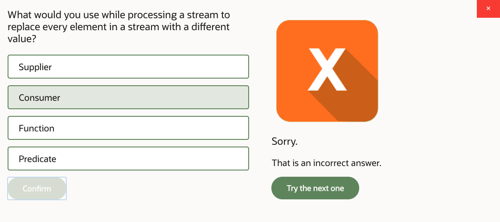
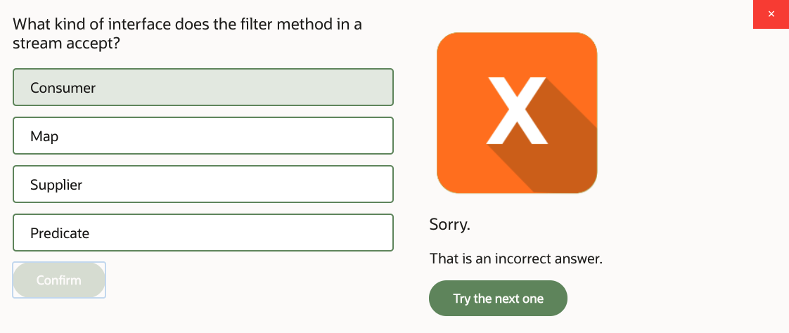
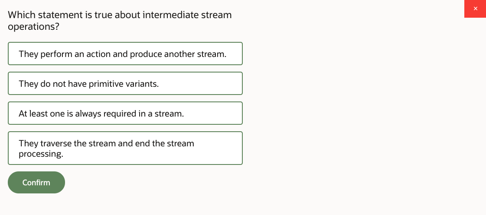
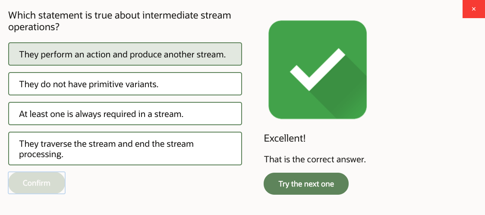
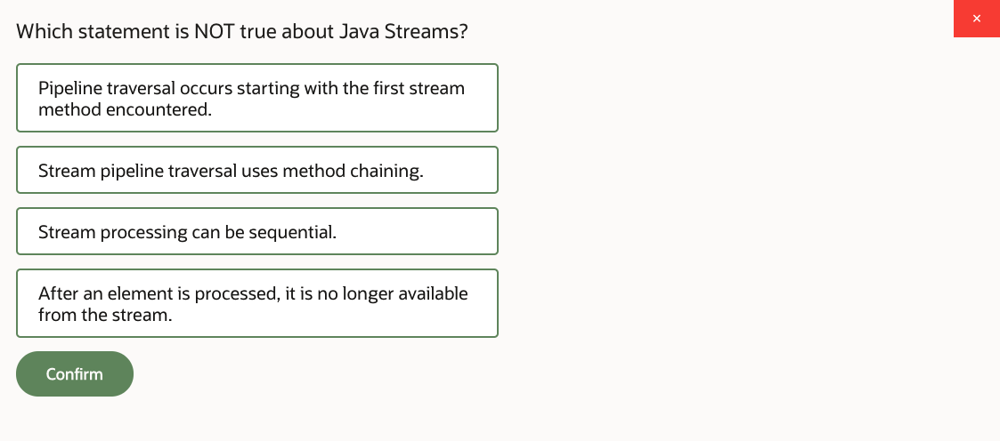
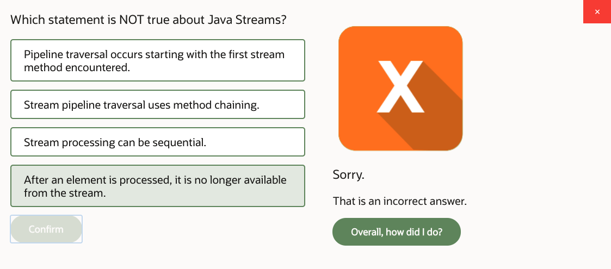

# 11: Java Streams API

1. Java Streams API, Part 1 24m
2. Java Streams API, Part 2 25m
3. Java Streams API, Part 3 23m
4. Practice 11-1: Modify ProductManager to Use Streams 28m
5. Practice 11-2: Add Discount Per Rating Calculation 12m
6. Java Streams API - Score 80% or higher to pass

## 1. Java Streams API, Part 1 24m

Java Streams API. In this lesson, we are going to take a look at the way in which Java Streams API works, and the way we process stream pipelines, and the way in which we apply lambda expressions to process these stream pipelines. So there is a series of functional interfaces that we could use to process streams information, and we can implement them as lambdas.

Also, we discuss some aspects of parallel versus sequential stream processing. OK, so what are the streams, right? Well, stream is an immutable flow of elements which can be processed sequentially, which is the default, or parallelly.

You could vaguely compare the way the streams process content to a loop. But that's not entirely correct. The loop is always processing things sequentially. Whilst with streams, that could be parallel or sequential mode, depending on what you want to achieve.

Now it's important to understand that the way the stream processing works is through a series of operations you apply to the stream. So you could apply different actions to the stream. And each one of these actions you supply a lambda expression, which is an implementation of a functional interface, which implements these or the other type of action.

So in this particular example here, I'm just sort of comparing it to the loop so it will be easier to understand what a stream is doing. Imagine you have some kind of a list of products, and you need to process that. And surely, you could do the traditional sort of iteration mechanism. Just write a loop, and look for products with certain prices. And then apply discounts to them.

But equally so, you could have done it with a Stream API, which is this example. And as I say, the advantage of doing it through streams is that you can parallelize it. But also, well, there's actually a number of other interesting optimizations, if you like, that you can achieve with a stream processing.

For example, in spite of the fact that all of these actions that you apply to the stream handling appear as a sequence of things you wanted to do. Well, actually, they're not applied sequentially. In fact, they're kind of fused into a single data pass.

And so for example, if you're saying, oh, I want to filter that information, and then I want to do something, well, actually, these actions are happening at the end of the stream processing at the same time. It's not that they are actually sequentially performed, one after another.

So the idea is that the entire set of values that go through the stream is being processed with all of the actions applied to the elements once, for a single data pass. And actually, it's possible that what it is that we specified to doing these actions may be an algorithm that requires to determine a certain result.

And if that result can be achieved before we completed the entire data pass, then the remaining content in stream can be ignored. The stream doesn't have to process everything that is in that collection from which the stream has been created. It may be just some of these elements. But it depends on the algorithm that we're trying to achieve.

Oh, yes, and another interesting point is that it is possible that the source of the stream can actually just keep generating data. So you can have an infinite flow within a stream. And again, that idea of terminating the stream once you've achieved a certain result may come in very important to this situation because you may define operations that act on an infinite inbound flow of elements but then produce some finite result and terminate the stream processing when that result can be reached.

Stream API handling is described through a series of interfaces. The top level interface there is called BaseStream. which defines core string behaviors, such as, for example, managing the stream in parallel or sequential mode. And then the BaseStream interface is then extended via a series of other interfaces known as Stream, DoubleStream, IntStream, LongStream.

Now you could do everything you want with just a stream interface, technically. It describes all the required operations. The reason we have Double, Int, and LongStreams is purely to avoid extra boxing, unboxing of primitives when we convert a primitive to the object and object to the primitive.

The idea of a stream interface is that it describes how you handle the contents of the stream if that contents is objects. But what if the stream contains, say, Double numbers, or Int numbers, or Long numbers, right? Well, clearly, they aren't objects, so they're primitives. That's what we're saying.

And then if you want to perform operations that require a conversion between the object and a primitive of the boxing, unboxing, that could have certain performance consequences, exert certain pressure on your memory and CPU. For example, a primitive would be stored in one memory area. We'll say in the stack, for example.

And then the object will be stored in a heap. And you can imagine that copying values from stack to heap all the time is not going to do anything great for your application performance. So you'd rather avoid it if you can. In other words, all the functionalities that you need are described via stream interface. And what the Double, Int, and LongStreamers are doing is that they just provide a specific version of a stream interface which is just designed to handle a particular type of primitive to avoid the boxing or unboxing.

All streams can use generics. And as I say, these primitive variants help us to avoid unnecessary conversions of primitive objects and vice versa. Stream can be obtained from any collection or array by using static methods of a stream class.

So for example, Stream.of, so you can just grab an array of objects, for example, pass it to the of method. The of method is a [INAUDIBLE] method that actually accepts comma separated list of parameters or will accept the array and produce your stream from it.

However, you can also generate streams. Well, in this particular case, there are a couple of examples. One is the object stream, Stream.of, and then we just produce stream using some objects. And the other example is IntStream and just generating numbers.

Actually, this first example is kind of interesting because what it's doing is basically generating an infinite flow of numbers, math random. And they just keep generating them, so it just keeps going, generating random numbers.

However, I then apply a condition to it, a kind of a process in action. And this process in action says, well, take these numbers until you randomly generate number 3. Take while number not equal 3, basically. So when the random number actually is 3, then you stop taking them.

So you're saying, OK, you produce some finite result out of that infinite stream. So you stop taking numbers from the stream. And what do you do next is that you're basically summing all these numbers up.

So you're creating a set of randomly generated numbers. We don't know how many numbers there are in a set. We know that if we generate number 3, we'll end that set, and then we just produce the sum of it. And that's how the stream functions.

So the second example here, we're generating a stream of objects, and then we apply some processing to that, or maybe changing prices, or whatever.

So you could take any collection, like for example, this array list. And all collections have a method called stream, so just list.stream. There you go.

You could ask the stream to be processed in parallel mode or sequential mode. Default is sequential, but you may wish do it in parallel. And then you apply various processes and actions to the stream, which will obviously be discussed in the course of this lesson.

Another example here is, if you have an array, with the help of a arrays class, you can convert an array to stream, and then apply stream processing actions. So all of these particular page was focusing at is, what are the types of streams you can handle, object or primitive streams? And how can you create one, generate it, get it out of a collection, convert an array to a stream? And then whatever processing we want to apply, well, that depends.

OK, so we produce the stream. Now what? Now we process the stream pipeline. And to process the stream pipeline, we could use a series of different operations. What this page is trying to do is to categorize these operations.

And also, it talks about what are the functional interfaces that we need to implement to pass those parameters to these operations, to instruct the stream processing, what it is that we want to actually achieve. So we tell the stream what we want to do by implementing these functional interfaces and by passing them to the operations that a stream provides. That's how we instruct the stream what we want it to achieve.

So if we're trying to categorize the operations that are available on streams, we could say that they roughly could be split into two big categories-- intermediate and terminal. The intermediate operations are those that are applied to the stream, and they result in the stream continuing to produce stuff. So this is not the end of a stream. This is an action that you do in the middle of the processing, and then you continue the stream processing after it.

Terminal operations, well, they end the stream. That's it. If you apply the terminal operation, you don't consider that there's something else you want to do with a stream after that. That's it. That's the end of your processing.

You also have a variant of operations, which is known as short-circuit. Short-circuit operations-- we've actually seen the example of that, the takeWhile was an example on a previous page-- short-circuit operations can produce a finite result, even if presented with an infinite input, even if the stream keeps on pushing the data through. So there's a kind of idea that these operations can potentially, sooner or later, end that stream processing, because they have this sense of producing some kind of result out of the stream content.

Now with regards to what are the functions that we could apply to the stream processing, well, actually, it's not that difficult at all because, well, that's a complete list, basically. These are the functions you can apply. They are all defined as interfaces in the java.util.function package. They all are functional interfaces, which means they have only one abstract method you need to override, which means that you can easily implement them as lambda expressions.

The categories of these operations are Predicate, and that's the one we use in the methods such as filter. And the Predicate is-- actually, you've seen the Predicate before in this course. We used the Predicate interface in the removeIf method that we applied to collection when we conditionally removed items.

So you know the Predicate is doing tests. It has a method test which returns Boolean. And the idea is that we can use it as a kind of a-- if you compared it to SQL, you could say it's a bit like a WHERE clause, isn't it? You're filtering data in a stream. You're saying what it is that you want to get from that stream, the condition, basically.

Then you've got the idea of a function. Function, and there's a variant of the Function called UnaryOperator. UnaryOperator is an interface that extends Function interface, so it's a variant of that. And a Function is used in a method such as Map. And the purpose of the Function is to perform conversion.

For example, if you have a stream of certain types of objects, you can apply Function to it, and it converts it to another type of object. Imagine you have a stream of products, and then you want to extract a price. And then at the end, you have a stream which is no longer a stream of products. It's a stream of, what surprise, big decimal? Yeah? So I don't know, stream of big decimals, for example.

So the type of object has changed, and a Function can do exactly that job, take data from the stream which is of one type and one end, and result in a data in a stream which is another type on another end of the Function.

UnaryOperator is doing a similar job, but its purpose is to convert the value rather than a type. So if the Function changes contents in the stream from type A to type B, then a UnaryOperator retains the same type but does something with a value, modifies it somehow. For example, if you had a stream of lowercase characters or strings, and you want to get a stream of uppercase strings, well, UnaryOperator could do it because the type is not changing. It's still a string, but you just change the case. I suppose that's a good example of a notion of what Unary interface could do.

And finally, you've got one more interface, which is-- actually two, I'm sorry, two more interfaces. So there's a Consumer interface. And Consumer is processing elements. Examples of that, well, say operations such as peek, or operations such as forEach. Actually, peek and forEach are pretty much identical. They're doing the same job. The only difference is peek is an intermediate operation, and forEach is terminal.

So they both can perform actions. That's the purpose of Consumer. You have an element in the stream, and you want to do something when you see that element. So you describe in the Consumer the action, what it is that you want to do.

And there might be some actions you perform as intermediate actions, so you do that. And then you continue doing something else with the stream. Or there might be actions that you do at the end, kind of final actions. That's when the Consumer is used in forEach.

Finally, one more, and that is Supplier. Supplier is used to generate stream content. Actually, funny enough, you've seen the implementation of Supplier on a previous page. Let's see, if we go to back to the page before, you've seen here the method generate, which was generating random numbers. So that was a lambda expression that actually implemented a Supplier interface, generating values, supplying them to that stream.

So that's the overview of what are the operations that are available on streams and what are the functional interfaces via which you specify what it is that you want to do with the stream content. Let's take a look at these functional interfaces in a little bit more detail.

Well, as I say, these are the interfaces located in java.util.function package. They all are functional interfaces. They have single abstract [INAUDIBLE] that you're supposed to override. So what are these methods, and how do we use them?

Predicate interface describes the method test that returns Boolean. And it's a condition you can apply to the contents of the stream to do filtration, for example. So we accept the element from the stream. Our job is to write the lambda expression to describe how do we want to test that element, and then return true or false whenever the element should be retained in the stream or discarded.

Now the next one is a Function interface, which converts types. It accepts in the apply method one type and returns another. So that's for conversion of types of elements within a stream. The UnaryOperator is a variant of the Function. It does the exact same apply method. The only difference is it accepts and returns same type, rather than different types. And that is handy to convert actual values.

Now Consumer, that one has a method accept, which is void. And it's just to perform an action, to do something. And finally, Supplier has a method get, which returns the value. And that generates values into the stream.

If we take a look at this particular example here, we have the array list of products. And we take data from that list, and we push it into the stream. So that's the method stream, that creates the stream.

And now we apply various operations to that stream, and we'll start with filtering it. And we were saying that our Predicate would like to get only those products that don't have discount. OK, discount is zero.

Then we perform an action, but that's not a terminal action. That's an intermediate action. That's a peek method. So our action implement in Consumer will be to apply a discount, for example.

Then we perform the mapping. And the mapping is when we apply Function interface. But in this particular case, we are taking, as an input, a product, and we're returning, as a result, the best before, which presumably is a local date. So from that map call onwards, what we're actually handling is no longer a product. From that point onwards, it became a stream of local dates, not stream of products, because we just converted the type.

And then we're performing the last action here, which is actually plusDays. And you can clearly see that's the method of local date class. Yeah, we added one day, moving, pushing the best before date forward. So we apply the discount and calculated what would be the next day. OK, that's an example of how these functional interfaces allow us to describe stream processing.

Because streams have primitive variance-- so if the stream contains primitive content rather than the object content, functional interfaces also have variants to cater for these primitive versions of a stream. So for example, let's just take a look at some examples. Let's say Function interface. Function interface is the base interface which takes one object type and returns another object type.

But you could say that you want to take an object and return a primitive instead. So take something and convert to Int, something and convert to Long, something and convert to Double. So as a Supplier, it has variants to produce objects, to produce integers, to produce longs, to produce doubles.

With a Predicate, maybe you apply the condition, the Predicate, not to an object but to a primitive. So that will be Int, Long, or DoublePredicate. It depends on what sort of data you apply the condition to.

What if the stream already contains primitives? Well, in that case, maybe it contains integers, and you want to produce objects out of it, so there's that variant of the function interface here, like IntFunction or LongFunction.

What if you have one stream of primitives, and you want to create another stream of primitives out of it? Again, there's a variant of the functional interface for every whichever way conversion. So as for UnaryOperators, that's when you're just modifying the value, but you're not changing the type. And also, they're primitive variants for Consumers, so consuming, like Integers, or Longs, or Doubles.

So here's an example. I have an object stream which contains strings "ONE," "TWO," "THREE," "FOUR." So clearly, these are just text objects. But what do I do? I map it to Int. So that would basically implement the ToIntFunction interface via the lambda expression.

And how do I map it to Int? Well, I take each string's length. So basically, the stream that I'm getting after this mapToInt call, instead of strings "ONE," "TWO," "THREE," "FOUR," it contains actual lengths, like three letters for "ONE", three letters for "TWO," 5 letters for "THREE." and 4 letters for "FOUR." So these are the numbers, how many letters each word has.

Are we performing some action? It's rather daft just printing it to the console, nothing exciting. But obviously, we're just saying we're not trying to convert that Int to an object. We treat the Int as an Int. So we use an IntConsumer in this case.

And then, finally, the filter operation here, again, we're not performing the conversion of an Int to an object. We keep just treating it as an integer. And we're saying, well, filter those that are greater than 3. So that will be "FIVE," and "FOUR." And then we're doing the sum, which is "NINE." So we calculated the length of all words within that stream for those wards that are longer than three letters. And we actually printed them out.

OK. But we printed all words because we did the print here before the filter. So that's rather important to point out, that we could have done it the other way around. We could have done the filtration first, then the peek. Yeah, sure, that's up to you.

## 2. Java Streams API, Part 2 25m

Now, there are also variants of these functional interfaces that are designed to handle two parameters instead of one. So, all the interfaces we've seen so far, they all accept a single parameter, single argument-- predicate function, consumer, whatever. But then we have what we call a Bi variants. Bi-argument variants meaning they have two parameters rather than one.

Why would you need these Bi-argument variants? What's the point of that? Well, let me give you a practical example. Look at this. This is a hash map. And hash map is a pair of values. And what if I want to process these pairs, right? I don't want to process just products or just integers, presumably quantity of that product, or just these quantities, I want to process them both at the same time.

So in a stream for each operation, here, I'm using BiConsumer, basically. And the first parameter is the product, and second parameter is, presumably, quantity for that integer. Yeah. And maybe, I'm doing some kind of mathematical operation, getting a price, multiplying to quantity, processing both, basically.

With a more traditional sort of way of handling the stream without the pair of arguments, you'll have to somehow figure out, well, you know, getting just products, and then-- that would not be that convenient, right? Just handling both at the same time makes perfect sense in this case. So that's why you have Bi variants of the same functional interfaces.

Let's take a look at the ways in which we perform different operations and streams now. So we'll start with actions. Actions are handled via peek forEach, and there is a variant forEach called forEachOrdered operations. They all work with the same interface, consumer interface. They all accept the implementation of consumer, which, basically, implements the Accept method. And, surely, you can do it as a Lambda expression.

You can also implement the relevant Consumer interfaces, provide the relevant Lambdas beforehand. You can precode them, assigned to a variable, and then just pass the variable as an argument to peek and forEach, or you could do it in line. You can also combine different Consumers together with a default method that exists in the Consumer interface, which is called andThen.

So that allows you to, say, oh, I've got this condition, and I've got-- sorry-- this action and that action, and I want to fuse these actions together. So, for example, if you want to set the best before date and set discount for all products in a certain stream, then you could say, do that, andThen that.

Alternatively, you could apply this action separately. Maybe you want to apply the action which sets the best before date, you know, expired product action, sets before-- best before date first. But then you want to do some filtering, and only to those objects that are left in the stream after you apply the filtering, only to those you want to apply that discount. Right? Well, that's up to you, right? So that's the idea of why would you have a peek.

Why wouldn't you just do everything in forEach? Because, maybe, some actions are to be applied in the middle of a stream processing, and, possibly, if you have further filters after that, then they are not applied to all elements in a stream. They're just applied to some. OK. So that was actions.

Now let's filter our data in a stream, and that's done with a filter operation, which accepts the predicate interface. And, actually, we've discussed the predicate interface before. You've pretty much seen this exact page in the earlier chapter which talked about the default and static methods available in the predicate.

And so, you should remember that these methods are and, or, and negate that allow you to combine predicates together or reverse the meaning of the predicate, and also have a couple of static methods such as not is equal. So they, again, either negate the supply predicate, or the isEqual method allows you to query data, essentially, using the object Example, filter by example.

So you could kind of roughly compare what filtration is doing, what predicates are doing, to kind of a where clause in SQL query. Yeah. That's roughly similar idea. Again, you can precode the relevant predicates, or you could describe them in line. You can combine them together in a single filter, or maybe you would like to apply them separately in a series of different filters. It's up to you. OK. So that was the product and filtration of a stream content.

Now we're looking at the value mappings. So that's done with methods such as map, or its primitive variants, such as, for example, mapToInt. And they implement a Function interface or primitive variant of a Function interface. And they act as an implementation of a method Apply. Again, you can do it precoded as a Lambda expression.

Notice the slight difference between Function and UnaryOperator. Function describes what type you convert to what type. So that's the source and destination types, and UnaryOperator describes as and go type, because it's not actually changing the type, it's just changing the value. Also with primitive variants, one of the types is which primitive that is. And the other type is, well, a generic that you supply.

So in this particular example, the logic goes like this. We want to look at some stream content. And we want to get a name out of the product. So we had products, and then we want to get streams, name of the product. And then we apply trimming to that name, so we remove spaces. And then we measure the length of the product name. I want them, which is doing the sum.

So the result of this stream processing will, basically, be the total sum of all product name lengths. Yeah. OK. So you could combine different predicates together with the-- sorry-- different functions together with methods such as andThen and compose. The method, andThen, applies this parameter to what your calling method, andThen upon, so it means like you have the nameMapper, and then you apply the trimMapper.

The compose does the exact same thing in the opposite direction. Say, if you'll say, nameMapper.compose, and then parse trimMapper, it will attempt to apply trimMapper first, and then nameMapper second, which I find a little bit counterintuitive. So to me, the andThen is kind of easier to comprehend. But they're, essentially, doing the same thing. It's just the order in which they are applied. That's the only difference.

And the variant of the static method that is available on a function interface called Identity, basically, just returns the same value. So it's not actually doing a conversion, as such. Yeah. So it just maps the same value.

Now, the next one we would like to take a quick look at is a flatMap. so we've looked at a map, which mapped every element in the stream to a different type, or mapped every element, maybe changed the value for it. But flatMap is doing something else, which is rather interesting. Imagine the following scenario. Imagine you've got orders, and inside each order, you've got items. And there's a mechanism that allows you to retrieve these items, presumably items, products. Yeah.

So what we call is items, but these are product objects. So, presumably, we can get them as a stream of products, stream of which products are in that or the other order. Lovely. So that means that each order is associated with its own stream of what a products are in each order. So I've got several streams.

And if I have a list of orders, then I'll have stream of orders first, right? So list of orders. I get a stream out of it. And then, I want to get for each order a stream of its items. So, I've got several different streams. What a method flatMap will do, it will allow me to combine these different streams into a single stream. It allows me to ignore the origin from which order these or the other item came, and just join them to one stream.

So subsequent actions apply, will be applied, not per order, they will be applied to items, regardless of which order they came from. In this particular case, I'm saying I would like to know how many teas I've sold on all of the orders. So I'm getting them, tea from all orders. That's why the flatMap. And then I'm converting to price double, and then I'm doing an assume.

So I figured out the total amount of sales of teas, regardless of which order they came from. The flatMap allows me to do this kind of stream merger. OK. Now other intermediate stream operations are distinct, sorted, skip, takeWhile, dropWhile, and limit. Well, let's just take a look at examples. It will be pretty straightforward from the examples what it is that operations are doing.

So, imagine you have a stream, ACBDBD. So, obviously, there are some duplicates in that stream. But we decided to apply distinct operation. And if we do that, then after we apply distinct, the string will contain ACBD, so the duplicates will, essentially, be checked out, suppressed. Then we sort it, so it becomes ABCD.

And then we say, oh, we'd like to just keep the first two, so that becomes CD. Yeah. And then we do whatever we like with the result. Example on the right-hand side, we had a stream of BCAEDF. And we have here an operation that says, take contents from the stream, while it is not D. So will take BCAE, but will not take D and F. Yeah. So these two will not take them.

So stream contents we dropped-- we took only the first four elements here, until we encounter D. The dropWhile is doing kind of the opposite. We're saying drop contents from the stream until we reach certain condition. So the condition here, element equals C, which, basically, means we just drop to B. Yes, so the result is CAE.

And then limit is how many elements you actually want to take. So in a sense it's kind of opposite of skip, right? And we're saying limit to two elements. So we just take C and A elements. And then we perform actions on whatever is left in that stream. OK. So these are various intermediate operations.

Short-Circuit Terminal Operations-- they could produce a finite result for potentially an infinite input. Here are some examples. I have a stream of three strings, red, green, and blue. And I'm saying, I want to find out if all of them match certain condition. Are they all equal to green? Well, no. Yeah. My allMatch will say false. So returns me false.

The next one I'd like to test is anyMatch. Is any one of them green? Oh, yeah, it is. There is a green element, indeed. So anyGreen will be true. The next one is noneMatch. Well, that will be false, because there is a green element, indeed. So, yeah, we're testing if none of them is green. And, of course, one of them is.

FindAny returns me any element. I don't know which one, especially if I start doing parallel processing. Then it will be anybody's guess. Yeah. So it grabs whatever element. Find first, grabs the first element. But, actually, in a parallel process, again, findFirst becomes anybody's guess, because you don't know, in a parallel process, in the stream-- well, we'll talk about parallel a little later-- but in a parallel process, then a stream is subdivided into subsets, which are processed in parallel.

So when you do an operations like findFirst, which subset will yield you the first element first is unknown. So it, basically, gives you a random element from the stream. Well, not entirely random, but, yeah, so it's unpredictable. Let's put it this way. Also it's important to note that what you're getting back is not the original object type that you have in a stream, like string in this case. you're actually getting it wrapped up into the optional object.

Well, why is that? What's the optional object? You see, here's the problem. What if the stream contains nothing, as in no values at all. Well, you know, you try to use the stream out of some source, and that source contains no information, so you have nothing in your stream. Or maybe prior to these operations, you applied some filtering, and, anyway, you ended up with nothing in your stream, right.

So by the time this information is processed, by the time you call these methods, there's no data. So what would you rather do-- fall over with no point or exception, because you just try to process now basically, or you return an object that has a mechanism to verify if data is or isn't present? So there is an option in the optional class, a method in the optional class, the allows you to actually check if there is a contents, if there is an actual result produced.

And then you can get it. So you don't have to, necessarily, produce an exception if a stream is empty. You can kind of gracefully handle that situation. That's why these operations return you an optional object. We'll actually see more examples of that, well, on this page, specifically.

So process in stream using count, min, max, sum, and average are pretty self-explanatory. Count counts the number of elements. And, obviously, in this particular example here, I first apply some kind of filtering. So I'm saying, only those color strings that contain letter R, so that will be red and green, but not blue. Yeah. So, there you go.

The other example here is sum, we've seen that. It's just producing a sum of all elements. In this particular case, I'm basically get in string lengths. Average-- now with an average, note, that it returns you an optional double. And this is how you handle the optional double. There's a method called isPresent, if the value is present. This is the compound assignment question mark, get the value, if it's present, get the value. If it's not present, give me a zero.

Why does it return you an optional double? Well, think about it for a moment. How do you calculate the average? You need all elements divided by quantity of elements, correct? Well, what if there are no elements in the stream? Then we are in trouble, because quantity will be zero. You don't want to be dividing by zero, do you?

So, that's why, instead of actually attempting to do a stupid thing, and divide by zero, an average method just returns an optional double object, and says, well, check if it's there. Yeah. Maybe the stream was empty, and then decide what do you want to do. Do you want to count average as zero then, or what? Yeah. It's your decision. OK.

Min and max-- so here examples are, basically, finding the longest and the shortest word. Yeah. I'm using compareTo method of a string which does the-- oh, no, that's-- sorry-- it's-- the next pair of examples are min and max. And here I am, basically, looking at the alphabetical order. I'm using compareTo method of a string.

And, basically, trying to figure out which is the first one in the alphabetical order, which is the last one in alphabetical order, yeah, with these min and max functions. And, again, if stream is empty, then you wouldn't have any results. So how do you handle that situation?

Get your optional wrapper around the object, check if the value is present, and then based on that, decide what do you want to do. Yeah. Do you want to get the value if it's present? Or do you want to just maybe assign something that indicates the absence of value? That's your kind of custom algorithm at this point. OK.

Now, function reduce-- actually the reduce method is a more general case for all of these other functions, such as count, min, max, et cetera. So reduce is like a general way of doing the same thing. If count, min, max, average are specialized methods that have a particular algorithm, then reduce is a generic way of doing the string reduction.

By reduction, we mean, getting all data from a stream and producing some value. Yeah, just one value out of whatever was in the stream. And, obviously, you can kind of sense that it's exactly what count, min, max, sum, average were doing. They were producing one value based on whatever stream content we had. So reduce is a general way of doing it.

Now why would you want to use a reduce? Because you want to have a reduction that's neither one of the simple ones, like count, min, max, sum, whatever. You want to do cost and reduction, basically. And the reduce method is an overloaded method. It has several ways of passing parameters to it. What this example is doing, let me explain. What this example is doing is that it's passing here to reduce method an expression that accumulates string values.

Suppose I have a stream of strings. And then I want to, well, product names, whatever, stream of products, then I get names, so strings, yeah, after the mapper anyway. And then I want to concatenate them all into one string. So my mechanism of reducing the contents of producing one value out of entire stream content is just concatenate them. Take one product concatenate-- product name concatenate with another product name. These are just string concatenations.

Of course, if the stream is empty, I get the optional object, because then I have nothing to concatenate at all, so what do I do? So that's, otherwise, I produce just space separated least of all product names, essentially, as one stream. Now, another way of doing the reduction is to provide an extra parameter called identity, which is basically default value. In this case, I'm not getting the optional object. I'm getting the stream, because the identity object has provided the initial value.

So even if the stream is completely empty, at least I get whatever I specified as my identity, as this initial default value, if you like. And then the rest of algorithm is doing the same thing, which is concatenating text. And, finally, there is this interesting mechanism, which starts with an identity, then does the accumulation of values, and then does this, which is known as combiner.

Now this variant of the reduction function is actually designed to handle streams in a parallel mode. What, basically, you could do, you can ask the stream to be processed in parallel, which will split the initial stream into subsets, and it will apply the accumulator function to each subset. And then, well, that produces a result, combine the results together.

So the result of all of these three examples is exactly the same. You produce and space separately, list of product names, strings, But, the last example here is sort of designed to do it in a parallelized mode by splitting the stream into subsets, accumulating intermediate results per subset, and then combining these intermediate results together into one final result. OK. So that's reduction.

Now, the next thing I want to show you is apparently further automation over reduction mechanism, which could be done with Collector, class and a collect, Collector interface and collect method. So Collectors are a kind of a variant of what we could achieve with reduction, I guess, yeah, but much more automated variant. So what Collectors could do. They could combine several actions in one go.

They could combine a way to produce content in the stream, the supplier, a way to accumulate that content-- content that supplier produces, and then combine it. So it's exactly what the reduction function was doing in the previous page plus it also contains a supplier of values. Right. So you can generate stuff. You can accumulate it. And you can combine their accumulated results.

There are also a number of pre-written Collectors you could use. So in a collect method, you can just specify which Collector you would like to use. And then you can also apply post-processing to the collector. It's called a finisher. So if you need to, for example, perform some kind of aggregation of values, you know, calculate something.

And then you want to do final, like, conversion or formatting over the result, well, that could be done by a finisher, well, let's take a look, actually, because that's just a pattern of what the collect method is doing. But I want you to take a look at the actual examples.

## 3. Java Streams API, Part 3 23m

So the first example here is a prewritten collector which is doing the summarizingDouble. So there's a class called Collectors which provides a number of already written collectors so you could just use them.

And the first example is summarizingDouble collector. And what it's doing is that it's calculating this object called DoubleSummaryStatistics. It contains inside the average, the mean, the max, the count. Assume everything in one go so you don't have to do this calculation separately. summarizingDouble collector does them all in one go, in one data pass.

Another example, where we use the mapping and joining collectors. And this one is doing the exact same thing as the earlier page was showing us with the concatenation of all product names, get a product name. Yeah, that's my mapping, and concatenating them all. And in this case, I'm basically converting them them to comma separated list. My joining character is a comma. You could have done it with reduced method, but the mapping and joining collectors are kind of gracefully handling the complexity for you, I guess.

This last example is an example of a gathering collector. So collectors class provide us with a series of methods, such as toList, toSet. You get the idea. So what if we have a stream, and then we want-- well, there's a stream of all products, right? And then we apply the filter to it, so we're only filtering those products that are drinks. And then we want to collect them to another list.

So if the original stream contained all possible products, then this new list that we just produced after we call collectors to list, there will be a list of products that only contain strings, because we filtered everything else out. So yeah, there you go. That's a very handy way of performing the conversion of a string content to a collection.

Also, you can combine collectors together using Collectors.collectingAndThen method. Correction, you can apply finisher to the collection processing using collectors class collectingAndThen method. Append a function that performs a finishing kind of action upon whatever collector was doing.

So for example, imagine you calculated some kind of number, and then you want to nicely format that number string, something like that. So your collector could be doing the mathematical part, and then a finisher will do the string formatting part or something like that. So your collector can perform the mathematical part-- well, in this example. And then the finisher could apply in a nice string format into that result.

The contents of the stream can be grouped and partitioned. Again, as you can see, we're using the same collectors class, same collect method. So it's further ultimations of how the collectors work.

And The first one is partitioningBy, which basically takes the entire stream content and applies some kind of Boolean expression here, which is a predicate, as you can guess, which splits the stream into two groups, a group for which this expression returned true, and a group for which this expression returned false.

And the result is a map object which uses Boolean as the map key. So there are only two entries in that map, true and false entry. And then each entry will contain the list of whatever we want to put inside that map, in this particular case, a list of products, for example,

The groupingBy allows you to use a function to derive the grouping key. And again, you end up with a map. So in this particular case, I'm grouping all products by their best before date. So for each best before date, I'll have an entry in the map, and then a list of products associated with that particular best before date that's grouping for you.

A couple of more operations called flatMapping and filtering, now these are quite advanced. So let me, again, talk you through the example here. Imagine following a data structure if I have an order and the order has Customer, LocalDate, and the List of items, products that this order contains.

These are the actual data examples. So imagine that I have an order ordered by Joe. That's the date. These are the products, Bob, date, products, blah, blah, blah. So that's some stream of values.

So what I want to do, I have this stream of orders, and I want to perform a collect operation upon it. And I'm using this groupingBy and flatMapping collectors. The groupingBy, OK, I'm grouping orders by Customer. So that means that I will end up with two groups, right? I have Joe and I have Bob, so two groups, fine.

And what I then want to do is I want to ignore order and just grab items from all orders. So the question I'm trying to address here is which products each customer ordered. I don't want to know which order they ordered them on. I just want to get the list of these products per customer.

So on one occasion, Joe ordered tea and cake. But then on another occasion, Joe ordered coffee and cake, hmm. So here's the idea. I just want to know if it's tea, coffee, and cake. I don't want to have the information about which order they came from.

And actually, I want to suppress duplicates. But that's easy. I can just collect the result to Set. And Set, remember, is a set of unique values so I can suppress whatever duplicates I encounter. And then I have another group here, and another group is for Bob. But Bob only ordered coffee, so that's that.

Next example is a filtering method. So again, the premise of the example is very similar. I'm doing the groupBy of these orders by customers. I have a couple of groups, Joe and Bob.

Oh, but look at the filtering condition. The condition here looks for orders ordered on a certain date. And it just happens so that Joe ordered something on that date and Bob didn't. So on the 22nd, Bob did not order anything.

So if I'll be using a method filter, I will just lose information about Bob altogether. It will not be in the stream, and that's it. But if I'm using method filtering, that works with respect to the group.

So even if the group contains no date inside, the filtering method does not destroy the group. The filtering method says, OK, well, there is a customer called Bob. It's a valid groupBy option. Or just it happens not to have any products ordered on that date. Oh, well. So we will have the Bob or reference an empty group.

If you'd use filter, rather than filtering, in this scenario, then there will be only one group for Joe, and information about Bob will just disappear from the result. OK, so that's kind of an intricate variant of what you can do with the more advanced sort of mapping and filtering options. And these variants work in a context of grouping operations inside collect methods. So it's a grouping of data within streams.

Finally, we need to say a few words about parallel stream processing. Default processing is sequential. But you may request parallel processing from the stream, just invoke the method parallel. Actually, you can also invoke the method sequential. But that sounds silly. Why would you want to do that? Because it's sequential by default.

Well, you see, the logic of how the parallel versus sequential processing is applied is that you can actually call parallel and sequential in that stream several times. But in fact, all the calls will be ignored, except whichever one is the last call. So if I call here parallel, and somewhere later, I call sequential, and somewhere later, I call parallel again, the overall stream processing will be whichever call I've made last in that chain of calls.

If I call parallel last, then the entire stream has turned into parallel mode. If I call sequential last, entire stream turns into sequential processing mode. All previous calls to parallel sequential are simply ignored. OK, so that's that.

Now how the parallel actually physically functions? So the entire inbound content that a stream produces will be split into subsets. And these subsets could be split into further subsets. And these could be split into further subsets. And then the processing will be applied to each subset, and then the results will be combined.

There are several things you really need to understand about the way it functions. The purpose of this subset division is to be able to process subsets on different CPU course in parallel. So imagine you've got this massive server side hardware, and you've got a really big screen with lots of data in it. And you have to apply CPU-intensive processing, like you do in floating point calculations, et cetera.

Doing that sequentially, well, you could do that much in a single CPU if you're doing it in a straightforward sequence. But if you split the data into subsets and assign each subset to be handled by another CPU core, then all of a sudden, you can actually take advantage of that service side hardware. You can properly exploit it. You can take advantage of parallel CPU capabilities, perform these calculations on different CPU cores, and combine results.

However, what you need to realize is the parallelism introduced in this scenario is completely stochastic. There is no way on earth you can predict which subset will be processed earlier or later than the other subset. Nobody can predict that.

Quite simply, think about it this way. You assign a task to a particular CPU core. At that very moment, your operating system could just decide to utilize that CPU score. Or another process in the OS could decide to utilize that CPU score for some other reasons. And you have absolutely no control over it.

So it means that although, seemingly, that CPU core can handle your computation, well, it could be busy with something else. And therefore, your computation will become delayed. And you can't possibly predict if that's going to happen or not.

What you know is, eventually, your calculation will be performed. And sooner or later, you'll get your results. And there is a good probability you'll get the results sooner rather than later, because you took advantage of the multitude of CPU cores. And hopefully, then, [INAUDIBLE] completely busy. So you'll find your CPU time to execute these operations and produce the results quicker.

But you cannot predict the order in which that will actually happen. So that means only certain algorithms are suitable for parallel processing. Not every task, and not in any circumstance the parallel processing will be appropriate, only in some cases.

To that end, we actually have this set of guidelines that helps you understand what cases are suitable and what cases are not suitable for parallel processing. So there are three criteria you need to consider.

First, stateless criteria-- a state of one element must not affect a state of another. If you're performing some actions in a parallel processing, and this action order is unpredictable, as we've just figured out, and you cannot guarantee that a certain element gets into a certain subset, so that means if there's a dependency between elements where the states are interdependent, well, you're in trouble. You won't be able to produce a meaningful result out of the parallel process. And you can only do it sequentially.

So for example, imagine that you're processing product discounts. And if the product discount decision is just purely based on whatever circumstances, but not on discount given so far to other products, then yeah, I suppose you can parallelize it. But if the discount on a given product would affect the discount on some other product because you don't know the order in which that will happen in a parallel mode, well, you can't really paralyze that algorithm, can you?

OK, the next limitation is the non-interfering factor. In parallel processing, you mustn't modify the source of information. You mustn't perform changes to the actual data in a stream itself, because if you start modifying the source of that stream, then the data mutates, and in the parallel processing mode, go figure what results you get.

It will be, again, not really predictable because you don't know which subset will be processed when with regards to parallelism on different CPU cores, and what's going to happen if you are modifying the source of information. So the rule of thumb-- do not add, modify, or remove data, or in this case, products from that list during the parallel processing. Just make sure you're not changing that.

And finally, associative principle, the results must not be affected by the order of operants. So there you go. So for example, if there is a particular order of products in the list, and the later you get through the order of products in that list as you progress, then the mechanism of how you calculate and discount changes, that's not suitable for parallel processing. It could only be done sequentially.

So the reasons, once again, for these limitations are stochastic operations or nature of a string processing. You can't predict the order in which CPU cores will complete their tasks. The workload is dynamically changing. Things are happening at the same time, so you cannot establish dependencies between elements. There you go. That's why you have these limitations.

Finally, there are a few other things that you should be aware when considering parallel processing. There are certain things you really shouldn't do when you're doing the parallel processing. The first thing you shouldn't do is perform operations that require sequential access to a shared resource.

Here's a classic, [INAUDIBLE] printer. It prints the console, doesn't it? A console is a sequential access device. Only one thread can possibly print to the console at any given point in time. Doing it in a parallel stream defeats the point of parallelism, because you then-- think about it. You split your stream, assigning the data to be handled by different CPU cores. And then you're asking all of these CPU cores to stand in one queue, waiting to access the console.

What was the point of assigning different CPU cores if you're actually forcing them to then do things sequentially, right in the middle of a stream processing. Well, that doesn't make any sense. It's sheer waste of resources.

Another example here is the example of adding elements to a list. And again, think about it. You are mutating content. Though in this case. You are changing that list. So you're doing it in multiple threads at the same time, which has a high probability of actually corrupting data in that list. It's your shared resource, the access to which must be enforced as sequential. You cannot just do it in parallel like this. It will corrupt the data.

Well, there are certain things you can do. For example, if you use collectors to list, oh, that works perfectly fine. There is no problem with this particular approach because that correctly handles the parallelism. Collectors to list method is aware of a possibility of the stream being processed in parallel. And it will not concurrently modify the list, so it's doing it correctly.

Another example here is a concurrent map, collectors to concurrent map, which is basically same idea. Again, you're asking the collector to do the difficult part of combining parallel results produced by individual CPU cores, correctly combining them into one result in this particular example collection of the type of map.

So lastly, parallelism is not always beneficial in the first place. Even if your algorithm is suitable for parallel processing, it doesn't mean you actually will gain any performance out of it. If a stream is small, if your machine has a single CPU core, then what do you expect from parallelism? It will be quicker to process data sequentially, especially if it's a tiny data set. Then it just doesn't matter.

Or, for example, if your processing really does not involve any significant amount of CPU, why you need to then assign it to different CPU course if the amount of CPU time you actually require to process things is tiny? However, in large data sets scenario, like 10,000-plus elements with multicore machine, yeah, especially if you need to do complex floating point calculations, well, then it could be beneficial.

So consider these before doing the parallelism. Consider these factors. Make sure you're not doing something inappropriate for parallel processing. And consider the nature of your task and the amount of data you need to process. Whether you will gain any advantage from parallelism or not, well, it's anybody's guess. So these are criteria you need to follow to make that decision.

OK, well, that is the end of the chapter. We looked at the Java Streams API at a way in which we process the stream pipelines, by applying a variety of different functional interfaces lambdas to the stream to express what sort of functionalities we want to get, how to process that information.

And finally, we also talked about some considerations regarding the possible parallel processing over stream content. In the practical exercise for this chapter, you're actually asked to basically go to the existing code of your Product Management Application and replace all loops with streams. Everywhere where you use a loop so far, just put a stream process in instead. And of course, replace the algorithms with appropriate calls to stream operations and lambda expressions to implement these behaviors.

Also, you will be asked to add a method to calculate the total discount per product rating, which guess what, involves you into doing some practice of grouping of elements within a stream, and then applying group operations, like total prorating computation with stream items.

I want you to take note during this exercise at how dramatically smaller your code will look once you remove some of the loop constructs and replace them with streams, because your lambda expressions and this fluent notation, the idea that you could just express a sequence of different method calls that you want to apply to the stream, that's highly readable syntax. So it probably will get a much neater way of presenting your business logic in this scenario.

## 4. Practice 11-1: Modify ProductManager to Use Streams 28m

Let's take a look at practices for Lesson 11. In this lesson, we're exploring Java Streams API. And basically, our task is to look at the way in which we process products and reviews and change that processing that's currently present in a product management class from loops to streams. And we also had methods to calculate various things, such as calculating total discount, per product rating, for example. So we can explore more advanced stream manipulations. So we use the streams instead of loops, basically.

Well, let's first start with assumptions. And the first assumption we're making is that you finished the exercise for Lesson 10. If you didn't open the solution for Lesson 10 and start from the solution, if you did, you can continue using your existing project from Lesson 10 onwards.

So our first task in this exercise is to look at the method Find product in the Product Management class. Currently, the method Find product accepts the product ID and performs the loop. Well, let's just open that and see that. And what we need to do is basically, instead of the loop, process that content through the stream.

So we'll start with commenting out the loop. So find that method in the Product Manager-- the method Find product. And so just temporarily comment that content. And we'll replace it with the streams approach instead of the loop approach.

So as you can guess, what we need to do is look at the content of the product's HashMap and find products with a matching ID. And we can do it using a stream rather than a loop. And that's our next assignment, basically, rewrite the same algorithm as the stream.

So here's what you're told to do. Reproduce the same algorithm inside the body of Find product, use the keySet method. Well, we are using keySet method anyway to obtain the set of products from the HashMap product's HashMap Then call a stream upon it to actually start streaming these contents of the set, apply the filter to look for products with a matching ID, and use [INAUDIBLE] expression that implements predicate. That's to implement the filter. And then use the FindFirst method. Find whichever first occurrence of the product that matches the filtering condition.

Here is, though, the problem. What could possibly happen in this scenario. If you're filtering by product ID, and we know that product ID is the way the product checks the uniqueness. Because that's the grounds of equality check in the equals method. So it you check the product class equals method compares product IDs. And we know the set does not allow duplicates.

So products in a set will all come with unique IDs. That's why just looking by a filter and then grabbing the first element is sufficient, because we know that elements with the same ID-- same products with same ID-- don't repeat in that list. So that's fine in the set.

But there's still a possibility that the ID you're looking for is not a valid product ID. In other words, it's just not in that set. Or maybe the set is empty. You have no products there at all. That's also a possibility.

So potentially FindFirst may return you no product. And to prevent the code from getting an exception at this point, that you are having an uninitialized object. Instead the FindFirst method returns an optional object. And then we apply the method or else get to the optional, which allows us to either get the value from the optional object if it's present-- if we found that product.

Or else we could decide what we want to do. We can return null from this Find product method saying, well, we didn't find anything. Well, you can, I don't know, perform another other action. Yeah, whatever it is you feel like is appropriate action to perform when the product is not found.

So you need to implement lambda expression, which implements supply interface for the or-else-get logic. So here's the result. Here, that's what you eventually need to write. Obviously, try to write it yourself, but this is the solution. You get the products, you get the keySet, you return the stream, you apply filter filtering byproduct ID, you call FindFirst and then or else get. In this case, the decision is to just return null, I guess, which is basically exactly what the existing algorithm that we've just commented out, what the previous version of the algorithm was doing. It reserved the product that was null. And if nothing was found in the loop, it was basically returning null.

So you reproduced the exact same algorithm, but you did it without doing the loop. And you can do it in line directly inside return statement without a need to actually introduce any intermediate variables. I guess this just sounds more convenient way of styling your code. I hope it's more readable. You have a more task-oriented approach here, where you can clearly see what your conditions are and what your actions are.

And you don't really need to read an algorithm, or if statements, or deal with breaks, or anything like that. That's a re-implementation of the same algorithm used in a stream. So find product-- done, what else we can do here with streams? Oh, there's an optional remark here. You may remove the commented section. Sure, I mean, that's just for your benefit so you can compare them like-to-like and read the code side by side. But that's up to you.

Anyway, so moving on-- we are now looking at the next method, which is review product. And again, the same approach, we comment out the existing logic. So you need to find the method review product, locate that version that takes product rating and string arguments.

Because there are two versions of review product-- the one with the named ID and the one with the product. And the one with the named basically does the call to the find product and then calls the review with the product. So the actual algorithm is inside a review product here. That's what you need to sort out-- this algorithm.

And what you are asked to do with this method is basically comment some of this code. Specifically, place the comment on the section of the code that actually calculates the average figure. Because you still need to get the products from the lists of reviews-- sorry, from the product's HashMap You still need to get that in order to be able to stream the content and handle a removal of the product from that HashMap and then later, addition of the product to that HashMap again.

So basically, the section that you need to comment out is this one in the middle from insum here to actually calculating the new rating based on the average-- based on the average of reviews. So that's the section that we would like to replace with the stream processing.

Now, what we need to do is reproduce the same algorithm as you've just commented out, but this time using streams and lambda expressions. So the algorithm should be placed just before the commented section, somewhere in that method body.

So what we need to do, we need to get a stream of reviews. So we have a list of reviews, we need to turn it into stream. That's fine. Then we need to map every review object in the stream to a int. Because we're about to do sums. So of course, using an int will be more efficient for math point of view. So map to int, extracting the rating value from the review object. Then apply lambda expression that implements to int function interface, because obviously, we're handling ints.

To provide conversion for each review object to an equivalent int value-- so we are doing the extraction-- and then calculate average. The average method returns this optional double. Again, for the reason that there might not be any reviews, for example. Yeah, and this has nothing to calculate the average on.

So we use the method called or else for the optional double. And we either return the actual optional double value, which is the average, in this case. Or we return zero if we are dealing with a situation when there are no actual reviews available for that product, which is plausible.

Then that gets us the average value. You could do the conversion of that to an int because you need to realize the average you're getting is float. It's a floating point number. And a rating that you need to assign is an integer. So you need to figure out the rounding of the float number to an int to calculate the rating, which is number of stars, which is from 1 to 5. Technically, from 0 to 5, because you could still have unrated products.

So it's still doing the math round. And then you invoke convert method to provide the conversion. You already have this. It's part of the ratable interface as a static method and ratable. That takes the integer number of stars that you've calculated and creates the rating based on that. After that, the rating can be passed to the apply rating method. And then you can utilize it.

So you write this code in a form of lambda. That's your task. This is the solution. Let me talk you through that again. So let's put this code into the review product method. And let me just make sure we all are comfortable with what it's doing.

So first, the action that we eventually wanted to take is to apply rating to the product. That's what we eventually want to achieve. And apply rate and method returns a new incarnation of the product, which we will eventually replace inside a HashMap

Whilst we're trying to achieve that, what we need to do is perform the conversion from the integer value of rating to the object rating. So that's math round. And what we are rounding is what the stream processing returns. The round method accepts the result of the stream processing, which is mapping every rate into an int, calculating average, returning that, or else returning zero.

Well, the reason why you need the int casting of the round-- of result returned by round function is because in this case, round internally here handles a double number. That's what the average or else is returning. And hence, it produces the long number. And a convert method of ratable expects us to return an int. So that's why we're doing the casting. Essentially, it's this casting of long to int.

And thus, we calculated the rating. And we applied it to the product, so we recreated the product object. Now, you may remove, obviously, the commented section.

And now what we still need to do, in this situation, is to realize that everything is really done. We don't need to do any further actions in this algorithm. We place that rating-- we added the rating as a review to the list of reviews. We removed the product from the HashMap and then added it back again once we refreshed the rating. And we did the calculation. So yeah, that's it, that's pretty straightforward. So that loop is no longer needed that we had before.

The next thing you asked to do is locate the print product report method, which is also having to loop. So that's the version of the method with product argument rather than int argument. So we've got overloaded method here, print product report. And you are asked to place a comment on a for loop and on the if statement after the for loop. So this is the part that we will be replacing with streams processing.

So what we're commenting out is the logic that it reads through all reviews, does the formatting, and if no reviews are present, then just start with the text that no reviews are present. So just before this section, we need to put-- well, instead of this section, essentially, we need to put the stream processing equivalent of the same logic.

And we'll have two cases here. We'll have the case where we don't even want to enter the stream in the first place. If there are no reviews at all, then what's the point? You don't need to do any stream processing. So you can do the if-else statement here, and you could say do I really need to process the list of reviews?

Yeah, if there are no reviews, just don't worry about it, just output no reviews and carriage return. And then the stream processing will go inside the else clause. So we only get to process a stream if we need to, if there are any reviews on that list in the first place.

So inside the else block, what we need to build is an algorithm that will do the iteration through the list of reviews, take every object, and format it with the format review method. So it's a simple case of mapping, essentially, every review object in a stream to string. The format method takes the review as an input and converts it to string as the output.

And then you could use-- what you need to do is just produce one string out of the entire result. So you can use a simple joining collector that concatenates strings together. So there you go. That's all you need to do.

You are pending the result of this joining to the stream buffer txt. So let's just format that. You may need to import collectors. So you're saying append whatever is the result of the joining. Take the stream out of reviews, map every review to string using format review method, and collect everything into one string, and append it in one go to this string buffer. Now, obviously, you can now get rid of that older algorithm, but first, you may wish to compare how your loop and if are compared to the stream processing, basically.

So we've converted several different cases of using loops in this scenario to using streams instead. Now, there's an alternative here that you could look at, which is, we're launching a stream of reviews. And we're doing the for-each. And we're just basically appending every review individually to the StringBuilder. I guess you could do that instead of collector.

But in parallel processing situation, if you ever need to process the collection of reviews using parallel mode, the collectors joining works correctly. And the for-each may have some problems in parallel mode. So because of the unpredictable order in which the parallelism will transpire, it will actually physically work. It cannot really control the order in which these reviews will be added to that StringBuilder.

And in parallel mode, doing the for-each and mutating appending text, the StringBuilder will corrupt it. So you will basically break it, whilst the collectors joining won't, because it first assembles the text and then applies it to the StringBuilder in one go. So all the intermediate text assembly which has to happen in parallel will happen without actually touching the StringBuilder object. That's the advantage of collectors joining behavior, because it's doing it separately.

So even though, in this particular case, we're not using parallel processing. And I doubt it will be justified, because we have such a small number of reviews, really. It's a very tiny data set. We will not win anything from parallelism here. But in theory, yeah, if you deal with much, much larger data sets and multi-core CPU machines and everything, then this would be a concern. And this approach is beneficial, compared to simple for-each approach. But both will work in non-parallel mode-- in sequential mode.

Finally, we also are told to do a similar thing with a print products method-- print products. And it's currently doing this processing of the array list of keys and product list and sorting them. So comment out these lines of code. Comment out that first.

The next thing that you are asked to comment out is the for loop. But you are asked to leave the StringBuilder in place because you still need that. You still need a declaration of StringBuilder. So comment out everything around it, basically. And that's what we'll eventually print out.

So these are the two blocks that we'll be replacing. How you obtain the collection-- the stream of products from the products HashMap, how you sort it, and how you append it to the StringBuilder. These are the bits of logic that require replacement. But StringBuilder initialization stays the same.

So what we need to do is reproduce the same algorithm that we just commented out, but this time, using streams. And the logic goes like this. We need a key set from the products map, open a stream for it, use the sorted operation to apply the sorting condition to it.

Well, you could use for-each and append, or you can use collectors, like in previous example, yeah, whichever way. It works the same. Again, the for-each is probably not ideal if you're dealing with parallelism. But let's just for hell of it, do a different approach than we did in the previous case.

So let's append that processing. Let me talk you through that. So we obtained a key set from the products map. This would be our set of products. We open a stream for it, we apply the sorter that we get in comparator. Then we get an s parameter. And then in for-each, we are processing the content by just appending it to StringBuilder. As I say, alternatively, you could do joining collector instead of that line. It works the same.

Well, I think the notes would say that. Let me check. Yeah, absolutely, the notes mention that the alternative approach is also possible. But we can try different approaches.

Now, there is one more thing that you are asked to do here in the print products method. So we have a sorter passed in as an argument-- the comparator. But how about a filter? Maybe we would like to apply custom conditions to that stream processing. You know, don't just print all products, print some products.

So you're asked to add an additional parameter to the print products method, which will be the filter-- the predicate. Well, let's do that. And make sure you've got all the import statements in place, import the predicate interface.

So what we need to do with the predicate now is apply it-- just apply it. So after you did the sorting, do the filter. Call the filter operation, the parameter is also called filter. That's it. That's all you need to do.

So obviously, the idea is that whoever invokes the print product method can supply an actual condition. The print products will just accept whatever condition is given. It accepts whichever sorting order is given, and it accepts whichever condition will be given.

Now that we have specified the filtering possibility in the print products method, we need to actually create a filter and pass it to that method, and just generally test all these new functionalities that we've developed. And we do it from the shop class. So that's our next action. We need to update this logic in the shop class and see how these replace functionalities would transpire.

So un-comment the last invocation of print product report method, the one that's print product 106, and place comments on all other print product methods, except the last one, so basically, just to have one focused test. So just make sure you're doing that.

So this 106 printing, this is the one. So we go to the Shop. And we're told to make sure that it's only the 106 print product report that we will use. I'll un-comment that one.

But now, we also need to fix some of the issues that we encounter with print products method. You see, we added a new parameter to the method, which is the filter which we previously never had. So the filter needs to be specified. And the suggestion is that you can pass extra parameters to the print product methods that implement that predicate.

And let's say, for example, looking at any products which price less than 2-- so cheap kind of products. Lovely, we add that filter to the print products method.

So we could do it on just-- it's enough to do it on one of the invocations of print products, let's say, which one the course author is referring to here. The one which does the rating ordering-- order by rating. So we could add that filter here. And basically comment the rest of the invocations of print products, because well, you have to add filters to them. Because we got rid of the previous version of the print products method, which worked just with the sorting condition, but without a filter.

But frankly, that's enough for you to test. So you can now commence with the actual testing, run the application, and see what will happen. As you would expect, the print product report will work pretty much as usual. So this is the print product report which prints out all reviews for the product. Except that now it works with the streams.

And then the print products method, well, this one does the filtration. So it's applying the filter, and it only shows us those products which price is less than 2. So you can clearly see that chocolate of price 2.5 is not displayed in that list. Because previously, it was just printing all products at all. Great. So we could see how the filtering functionality has been triggered.

## 5. Practice 11-2: Add Discount Per Rating Calculation 12m

Now let's proceed to the next section of the exercise, which asks to calculate discount-- per rating. So we need to figure out the amount of discount given to products of different rating types of different ratings. Yeah, well one star, two star, three star, five star, whatever. OK. The result of this calculation should be formatted and assembled into map object. So put these into the map. So the map will be rating-- will be the key in a map. Right, and then the total sum of all discounts would be the value, and that's the task.

Well I guess we do it in a product manager. Yeah, and we just need a new method to deal with that method will be called get discounts, and it should return as a map. Now the exercise here says-- formatted values. So-- it would be the number of stars-- and a rating taxed, and the conversion of a total sum of discount to string, which is again taxed. So the return type of again this account method should be map of taxed and taxed basically, where the first string value represents the rating number of stars, and the second screen value represents-- a text formatted total sum-- of discounts, text formatted total sum of discounts. OK.

So that's the method we need to add. Seems like I'm selecting extra-- piece of text that I'll get rid of. Yeah, and let's put it somewhere in product manager. Let's put it here, just another method. OK. Get rid of the extra-- character that we copied, and on of course, nicely format that, just to realign all lines of code, and we still need to add the actual stream assembly. You know, the logic of how we do that calculation.

We start here by-- looking at these-- task, right? Add a total sum of discounts per rating calculation to compute the value that you return in this method. Hence, we need a key set of all products from the hash map of products. We get a stream from it. Sure we need string products first because that's where we get the prices, that's where we get discounts, that's where we get ratings from.

We then can use the collect method to assemble the calculation results into the map, but this time it's a different map. Yeah, so we had a map of products and rate and review, and now we assemble in different map of screen representations of rating and total discounts.

You will need to pass two parameters to these collect operation. The first one will be a grouping-- collector. Oh yes, we do in the grouping collector-- because we're grouping by-- rating, right, products group by rating. And then-- followed by the formated total discount for every rating and formatted value. So that's collectors grouping by method that will employ-- and to create an actual value you use the rating star's property.

Then use collectors and then method to produce formatted value of the total discount per rating. Collecting and then you need to pass two parameters to this operation. The first one perform and assume discount calculation, and a second format and the discount value. And finally, you can use some in double method to perform the actual calculation of the discount. To format the text the total discount as text, use format money object that's available in resource formater.

OK. So this is the solution to this approach, yeah. Let's just take a look at the code. This is what you were supposed to write, or at least try to write it yourself, yeah, but-- OK. So we get the key set of the product's map. Stream that, grouping by collector, we're grouping by product stars, and then some in double-- with the actual calculation of discounts, get in the double value of discount, and then-- formatting that in the finalize or we formatting that discount as a monetary value.

Format money format, that's an interesting thing. Did you notice it's private. So but because resource fomratter-- ease-- and-- nestic static class inside the product manager. So it's inside it. Apparently you can access as private-- variables directly from the outer class, from the product manager. So you can kind of bypass the fact that that's just another class in a private variable. But that's because it's the nested class inside a product manager. That's why you can do it. OK. So that's your calculation. So some in double produces a double value collection, and then appends finish logic to do the last sort of text formatting of that value.

Trying to write it without screens, gosh, there will be a lot of code. You know with loops and yeah. That will be not very trivial at all. So streams seemed to be really helpful institution, plus in theory, if you get a really large collection of products-- as in like tens of thousands, doing this calculation as a stream could significantly improve your performance because you can in very large collections and good hardware, you can implement parallelism.

And this approach that you observe here is perfectly paralyzing. We're doing something that, you know, these discount values don't have dependencies between each other. They're just specific to each product. We can easily subdivide the large collection of products into subsets. Yeah, that's what the collectors will do for us. And-- calculate each subset in parallel, and then collect the results together and format the result nicely. And so that's all paralyzable quite nicely.

Anyway what we need to do is just test this logic of the get discounts method. Now remember what they get discounts returns a map, right? So when you call it from the shop-- you then need to process the results of the gets discounts. You need process that map of results, and I guess you could do it in a stream as well.

Let's put it somewhere here. Yeah, we print in products whatever. After that we need to basically invoke-- that-- discounts get discounts method. And that gives us a stream. Well gives us a hash map, but we can get a stream out of it to process the content, right? And that's our next assignment. So call the get discounts, and then you need to process whatever it gives you. In using a B consumer interface basically. So you're doing a for each on their elements of that hash map, and for each processors two parameters, the rating and the discount, and you just told to bring that basically. So-- that's all you need to do. OK.

Yeah, so this is a big consumer. We consume in two objects, the rating and the discount. Both starter-- string, and we just print that out. Well you can run it, and see what's going to happen, right? So this is the total amount of discount per rating, and apparently-- the three star products attracted some discount. Yeah, there's-- a little discount available there, and other products didn't.

Now, the thing is it depends on your time of day because the drink discounts are applicable between certain periods of time. If we look at the drink class, the way that applies the discount that was part of the earlier exercise, the drink applies discounts between 17:30 and 18:30. So my current time here on this machine is 20 minutes past 4:00, so that's outside of that period. Actually, you know what? We'll be generous, just playing around really.

So what if-- we are within the period of the drinks discount? Would that affect that calculation? Let's just try it again. [INAUDIBLE] compiles the code. So yes, apparently the discount has changed. So we now have other discounts popping up, yeah in you know, other rating categories and actually even the three star rating categories now different. Yeah, that just shows that this is exactly what's happening behind the scenes the get discount operation on the food and drinks are invoked and whichever is algorithm that's appropriate to these get discount, methods will be invoked, and that will affect the obviously the outcome of your calculation.

Beauty of polymorphic, yeah, that was designed. We've managed to achieve much earlier in this course. We've coded how-- our classes should behave, and now we benefited from you know, these classes just doing what they were supposed to be doing.

OK. So yeah I've changed-- these values back, and some will now get different discount values. Yeah. But you could see how the algorithm is triggered. So there you go. That is-- the end of your test, and the end of the exercise.

## 6. Java Streams API - Score 80% or higher to pass

Java Streams API

View Quiz

