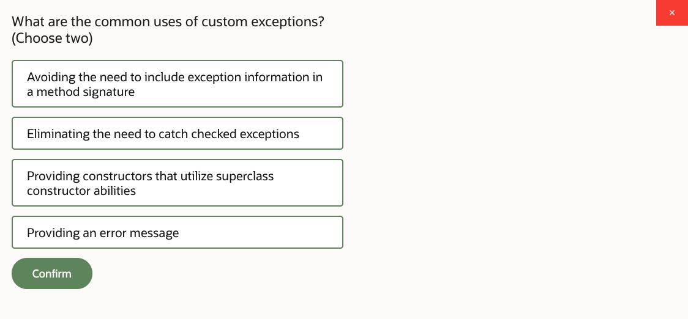
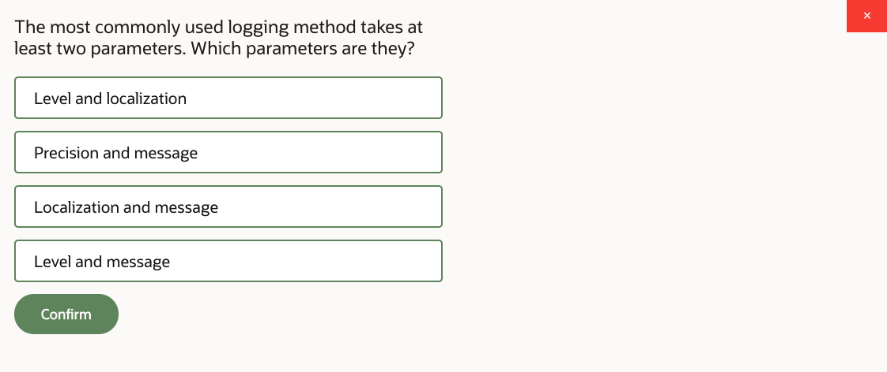
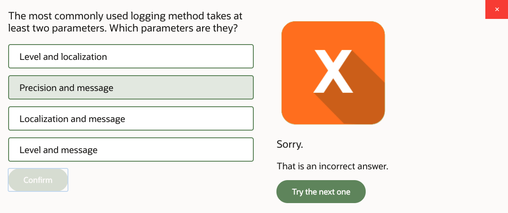
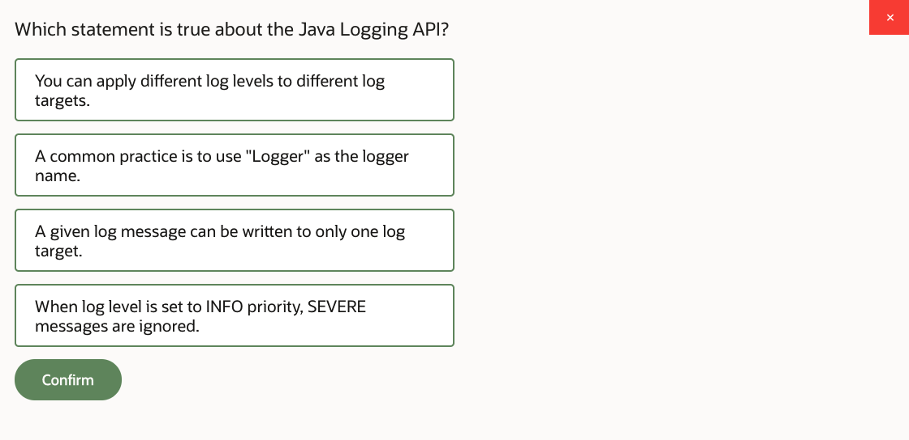
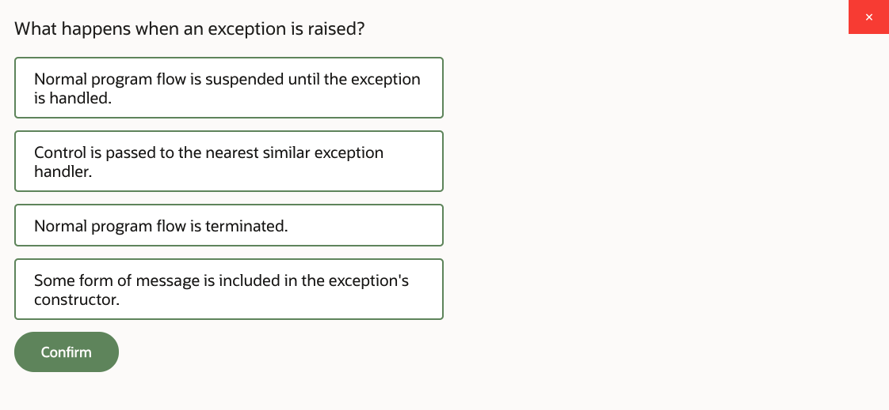
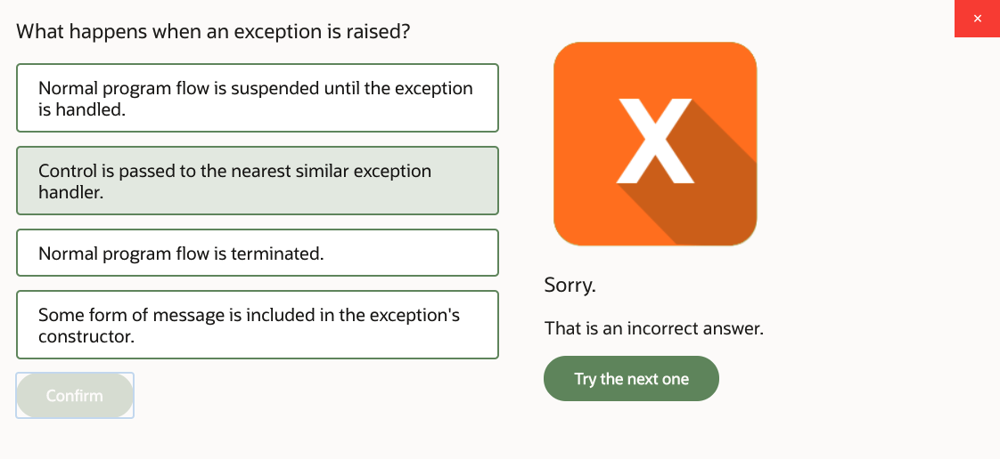
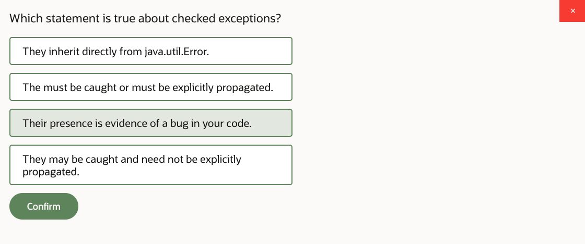
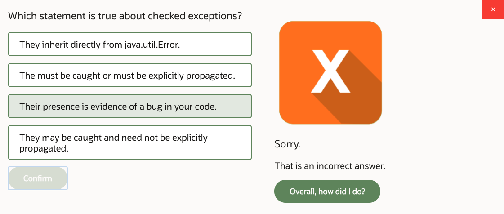
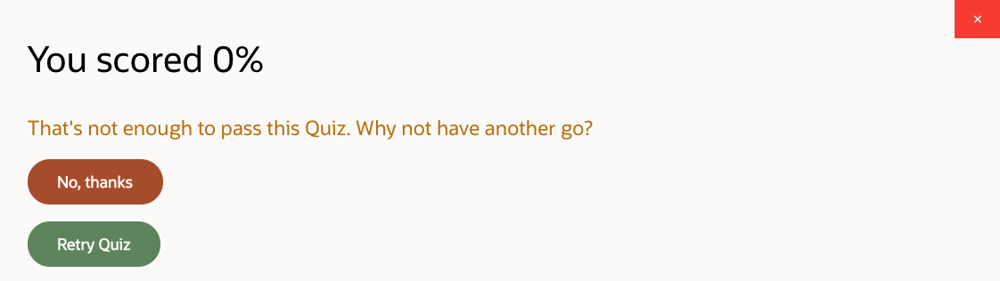

# 12: Handle Exceptions and Fix Bugs

1. Handle Exceptions and Fix Bugs, Part 1 24m
2. Handle Exceptions and Fix Bugs, Part 2 24m
3. Handle Exceptions and Fix Bugs, Part 3 19m
4. Practice 12-1: Use Exception Handling to Fix Logical Errors…Part1 12m
5. Practice 12-1: Use Exception Handling to Fix Logical Errors…Part2 17m
6. Practice 12-2: Add Text Parsing Operations…Part 1 23m
7. Practice 12-2: Add Text Parsing Operations…Part 2 21m
8. Handle Exceptions and Bugs - Score 80% or higher to pass

## 1. Handle Exceptions and Fix Bugs, Part 1 24m

 
Handling exceptions and fixing bugs. In this lesson, we're going to take a look at the Java Logging API, so we need to know how to log things, including various exceptions and errors, but just generally how to do logging as well; describe what are the exceptions and error types we've got in Java and how to construct custom types of exceptions; and then introduce programming structures that we could use to actually handle exceptions-- try/catch/finally syntax; how to throw exceptions, how to let the exception pass to the invoker, how to catch the exception, various enhancements on try blocks, such this try block with parameters. And at the end of the lesson, we also look at debugger, how to use debugger, and how to create tests with assertions, so testing our program.

Let's start with logging. Java Logging API allows us, well, to write logs. And now, there is a bit here which relates to the module info. Modules are covered in the last lesson of this course. So there's a lesson dedicated to modules. If you're not using modular deployment, then you can just simply ignore that part. But if you are using modular deployment, then you need to create the module-info and say that you're required to use a logging API. But we'll discuss details of the modules later, so for now, you can ignore it for a moment.

Anyway, so the java.util.logging package contains the logging API artifacts. And among them, there is this class called logger. So you could use that to establish the relationship between that class of yours and a logger associated with it. Now, conventionally, each logger should be given a name. And there is an idea that you should name your logger after your class, basically. So get the class name, and use that as your logger name. This way, it will be easier to configure your loggers because you would be able to set up a different level of detail for different loggers, so you can increase and decrease that level of detail dependent on requirements. And if you configure logger per class, well, it makes sense that you may wish to increase or decrease level of logging for different classes if necessary.

So now, the level of logging can be set from least detailed to most detailed. And the least detailed is severe logging, and the most detailed is finest logging. And you could see this progression of different log levels. Every time you write the log message, you can associate it with a particular level. So you could say, I want to log an error. Or, I just want to log in info. And actually, as a matter of fact, instead of using method log and then say Level.INFO, you could use the method called info, so there's shortcut methods for different logger levels that are available.

The logger would accept parameters, such as the message, and actually, you could have parameter for a short message and then parameter for longer, more detailed message, which I guess is what you want to do if you're logging information about errors because you probably would like to log extra level of detail about what actually happened, what kind of exception has occurred. Now, setting up the logger level would allow you to turn certain logger messages on and off. So you could set up the threshold beyond which the logger messages is simply ignored, so you don't have to all the time log everything. You could change that logger level as required.

The log methods-- well, there's this generic log method that you could use to just write log messages. There's also logp, or "log precise," which takes additional parameters, such as not just the class for which you're writing that log message but specific method as well as the class name for which the logger is activated. A logrb is doing the login with resource bundle, which basically allows you to grab messages from resource bundles-- for example, for localization purposes-- and use these to write your logs instead of hard coding logger messages that's just text within the program itself.

You've got some logger methods that only work if you turn your logger level to finer or finest. These are entering, exiting, and throwing. These methods are used to reflect log messages that you may wish to write upon entry or exit from the method or an exception being thrown from the method. And then you also have a shortcut methods for different levels, like severe, warning, config, et cetera. Essentially, these methods are just shortcuts to what you could otherwise achieve with just the log method and specify the level parameter.

Now, the concept of guarded logging is relatively simple. What if you set a log level in a way that subsequent log messages are actually ignored? So if your cutoff threshold is info level and then you're saying, don't write anything more detailed than info-- that's what set level means-- you're literally saying, just ignore whatever log messages are more detailed than that, right? And then you have this-- OK, log me FINE, message, which is more detailed than info, so it will be ignored.

However, although that log method on a fine level will not actually be written anywhere, it will still have to perform that concatenation, because that concatenation occurs before you invoke the log method. You first concatenate some text. So it seems like you're wasting time concatenating the text reproduced in the message, because, well, you're just going to discard it. You're not going to write it into the log in this particular situation.

There are a couple of things in which you can work around this problem. The first is you could put an IF statement and say, well, actually, if the loggable level is set to a level at which this FINE will actually be written-- OK, so that's one way of checking that. You can basically verify if your current log level threshold is set in a way that you actually write in a message. And then, yeah, that makes sense. You'll concatenate your things, right?

The other approach is to use the method which allows you to substitute parameters into the logger message. This way, the actual substitution of an argument inside the message will happen after the decision will be taken to log it or not. So in other words, it will not actually happen if the logger sets to info and you're logging on level finest. That method log will not be trying to take the ID and put it inside that message. It will only try to do it if the level actually matches the currently set up a logging level threshold. So it's recommended that you don't do unnecessary efforts in your program and produce messages only for them to be ignored a moment later, just because your logger level threshold is set that way.

So where do these logs go? Where are they written? Well, they could be written to different devices, to different destinations. This could be console devices, memory devices, files, sockets, streams-- eh, whatever. You can configure different destinations. Actually, you can configure different simultaneous destinations. So writing something to the logger will eventually produce messages that could go to different handlers.

Now, the level of logging can be controlled by setting it up on the root level for the entire run time, and you can also set up different logging levels for specific packages or for a particular class, maybe, so change that logger level. You can also change the logger level on a particular handler. So for example, one handler is configured to point to file. Another handler is configured to point to the console and actually could be configured with different detail levels. So they'll filter out messages that are above the threshold for the set. Each handler can be associated with a logger format, and you could use formats like XML logging or just plain text, simple logging. And, as I say, it could be associated with a particular destination.

Where do you create this configuration? There's a file called logging.properties. There, you can identify which handlers you like to use. So you can create handlers. And you could configure each handler and say which format you wanted to use, for example for file handler, where would you like files to be written to, what's the naming convention, what's the format, what's the file size, what's the rollover, because, basically, you reach a certain size of the log file you want to roll over and create a new file. And that will happen automatically. The Logging API will do whatever you tell it to do. And also, you could set different levels for logging in this file in logging.properties. OK, so now, for different packages, for different classes, you can basically say what the logging levels should be. You can also set the logging level programmatically. Well, that's a logger configuration.

And now we change subject, and we'll talk about exceptions. So exceptions reflect unexpected events that may occur within our program. And what they do is that they interrupt normal flow, normal execution of the program. The control will be passed to the exception handler, if you provided one. And then you could take actions. If that exception happened, what do you want to do? Take some actions.

All Java exceptions are represented with actual classes. So there's a class per exception type. And these classes extend-- eventually, the parent level class-- there is a class called Throwable, so all other exception-handling classes descend from that Throwable supertype. You can categorize all of these different classes that is sent from Throwable in different categories. This page shows just some examples, like typical, frequently occurring types of exceptions. This is, by far, not the complete list, and surely you can create your own exception types, but, again, extending one of these classes or extending Throwable-- so you can create your own custom exceptions, basically plugging them in into the same class hierarchy.

However, regardless of what are these particular exception types, regardless of what they are, we can generally categorize all of these exceptions into two groups-- checked versus unchecked. Now, the difference between these two groups is this. If your code can potentially produce checked exception, one of the exceptions that classified as checked-- you have to catch that exception. Java Compiler will insist on either writing code that catches it or propagate that exception to the calling method but eventually catch it somewhere, I guess.

If you're not catching the exception in the method where it occurs, if you decided to propagate it to the invoker, OK, well, sooner or later, in that invoker, you will have to write the error handling code or invoker, all of invoker-- the exception can be propagated throughout multiple method calls. You don't have to handle it immediately where it occurs. You may decide to handle it somewhere else. But the point is-- checked exceptions-- the compiler will require you to handle it somewhere, if not immediately-- OK, then in invoking method, but it has to be handled. And if you want to say, OK, I don't want to handle it in my method, then you have to explicitly say, I want to propagate it to the invoker. So that's a requirement for checked exceptions.

However, for runtime exceptions, for unchecked exceptions, that is actually not the requirement. You don't have to catch them. You don't have to explicitly tell how they're propagated through the invoker. This is basically implied. Now, why some exceptions are considered checked and why some exceptions are considered unchecked? What is the rationale behind this difference? Unchecked exceptions are usually evidence of bugs in a code. They're usually something you just coded wrong.

Look at the particular examples of the unchecked exceptions-- out of memory error. You ran out of RAM. OK, suppose you catch it. So what? What you could possibly do now? You already ran out of RAM. That's too late. You should have thought about how you're utilizing your memory earlier. Or for example, arithmetic exception-- suppose you divided by 0 or something like that. Or NullPointerException-- you're trying to access the object reference that hasn't been initialized.

So this is clearly something that you just missed in your code. You forgot to initialize something. You're doing something strange with mathematics, like division by 0. Or you were allocating memory and you never released references, so you keep holding on to too much memory and eventually ran out of it. These are the things that the exception catching at runtime is not really going to help you much. You have to fix your code. You have to go back to the program and just basically fix the actual logic.

However, checked exceptions are of a different nature. They represent genuine problems that have nothing to do with your quality of coding. Think about it this way. Imagine you're accessing a file on a file system and you coded everything fine. You're using correct path. You're reading, writing, whatever you need to do, and everything is fine from your program's point of view. But hey, hard drive corruption happens. This is completely out of your program's control. There's nothing you could possibly write differently in your code to prevent that from happening. It's just genuine external circumstance upon which you have no influence whatsoever.

This is considered to be a good example of a checked exception because you actually have to generally do something about it with regards to that problem within your code. You have to programmatically handle this situation because it occurred to no fault of yours as a programmer. It occurred just because it generally can happen. So such exceptions-- you are actually required to write code to do something about them.

So general rule of thumb is that any Java class that extends the class runtime exception or class error is considered to be unchecked exception, and any class that extends the class exception is considered to be checked. So children of exception are checked exceptions. Everything else is runtime exception, except one peculiar moment that runtime exception itself was a child of exception. I know. It's just the way the class hierarchy is written. So it seems like all children of exception, except runtime exception, are checked exceptions, right? This is the rule, how you identify if exception is checked or unchecked.

OK, so that's a classification of exceptions. Want to create your own one? Absolutely, no problem at all. Let's do that. Just create a class that extends class-- say, exception, for example. OK, so what do you extend in a class? I hope you remember what you need to do first thing. You have to identify which constructor's on a parent you need to call because when you create an instance of your exception, first thing you need to do is invoke the superclass constructor.

So exception class provides us with several different constructor. [INAUDIBLE] some examples-- so constructor with no parameters, constructor with an error message. There's another one, constructor with an error message and throwable cause. Now, the way it works is this. You could catch some exception and then put it inside another exception as a throwable cause, pass it to the constructor of another exception, and then throw another exception instead.

So you have some problem which could have been-- I don't know-- maybe some kind of system problem or low level code issue, like IO exception, for example. And then you wrap it up into this product exception, customize a nice error message around it, and throw it as your custom exception instead of raw, technical fault that occurred underneath. This technique is also referred to as piggyback exceptions.

A good example of why you would do this wrapping of one exception into the other could be the situation when you have a particular way in which you want your program to be presented to others. You've written a class. You've written some methods in that class. And you don't want to tell anybody else who's using this class exactly what you're doing inside. You're doing a hiding of your implementation, right?

So if your code directly throws IO exception to the caller, then the caller knows you were doing input, output. If you throw an SQL exception to the caller, the caller knows you're doing something with the database. But if you throw in product exception, then the caller doesn't really need to know what exactly you were doing within your code, right?

And yet, if you don't want information about the regional cause of the problem to be just lost, then you can wrap it up into your custom exception, keep it as the cause inside, and let the caller decide if they're interested in investigating the cause or not. But at least, they will get the same presentation of an error from your program, regardless of what it is your program is actually doing internally. So that's why you have this additional way of wrapping up exception into another exception.

Now, how do you throw the exception? Well, there is a keyword, throw, and it allows you to actually produce exception. Throw will interrupt the flow of the program and will trigger the exception propagation. What do you throw? You throw an instance of some exception. So first, create an instance of exception-- new-- whatever exception you need. And it could be any existing exception-- checked, unchecked, custom, whatever. Just create an instance of whatever exception you like. Of course, utilize the exception constructor.

This example just uses nor constructor, but you could specify error messages and whatever you need. And then throw it. I guess you'll do it based on some conditions. At the moment, this is just a comment, just to show you the syntax. But generally speaking, you will have some kind of-- I don't know-- IF statement. You test some condition. And then you say, OK, well, in that case, throw that exception. Throwing the exception which is a runtime exception will simply interrupt your flow, and that's that. You don't need to do anything else about it. It will just interrupt the program.

However, if you throw the exceptions that are checked, you will have to catch them. And if you don't want to catch the exception inside this method, then you have to propagate it to the caller. And to propagate exceptions to the invoking method, you use throws clause as a part of a method definition. You don't need to include, into the throws clause, runtime exceptions, such as NullPointer. Remember, that is descended of runtime exception. You don't need to include these into the throws clause because they're implicitly present, if you like, in a throws clause. So you don't have to actually say throws runtime exception because that's implied anyway.

But with regard to checked exceptions, if you don't want to catch them inside this method, then you must include them into throws clause. Compiler will refuse to compile your code if you don't do one of two things. If you throw the exception and you don't catch it in this method, then you have to put it in throws clause. If you throw a checked exception and you do catch it inside this method, well, then you don't need to put it in throws clause because compiler will be satisfied that they are actually catching it.

So the throws clause can list any number of different exceptions, just a comma-separated list. Don't confuse the keyword "throws" as part of the method definition, and it's a promise saying that this method can potentially produce a certain exception or certain exceptions. Throw is an actual action. This is like, OK, I'm producing the exception. That's it. So that's the difference. OK, and once the exception is produced, this algorithm will terminate, and the control will be passed to the nearest exception handler that a program will be able to find, which is either inside this method or inside the colon method to which you'll throw that exception. Through the throws clause, it will be propagated to the invoker.

## 2. Handle Exceptions and Fix Bugs, Part 2 24m

 
OK. Now how to catch it? OK, so we throw the exception. Now we'd like to catch it. So suppose this method doThings, which we just-- in our previous page. Suppose it was throwing us some exceptions, and we'd like to catch them.

What you need to do is put it inside a try block. A call to this method goes inside a try block. How many different things can you put in a try block? As many as you like. You can have multiple different statements inside a try block.

However, bear in mind the following rule. Once the exception is encountered inside the try block-- so we've got different lines of code there inside a try. Once an exception's encountered somewhere inside a try, the rest of the try block after that line of code that calls the exception will be terminated.

When some statement in a try block produces the exception, the rest of the try block is not going to be executed. The control will be passed to a catch block now. So we'll try to catch the exception. And what will happen in this case is that the Java runtime will basically start looking for which catch matches the exception that just occurred. So it looks for the first catch block that matches the type of error that happened inside a try.

You can write catch blocks specific to particular exception types. You can actually list more than one exception with an or, basically saying, if that exception or that exception occurs, use this catch block, right?

But you may technically just write one catch and say, catch Exception. And that caters for all exceptions no matter what, because that's the parent class of all other exceptions anyway. That's their common supertype.

Well the thing is, although you can do that-- you can write this generic catch-- it's advisable that you may wish to put in front of it other catches which are more specific. For example, imagine the method doThings can throw you IOException, right? So you can say, catch IOException in front of the block that catches any other exceptions.

NoSuchFileException is actually descendant of the IOException, so putting just the catch of IOException technically will suffice, because it will also catch NoSuchFileExceptions. So why would you want to have these more specific catch blocks in front of more generic catch blocks? What's the point?

Well, the point is really simple-- if you want to do different actions. If you can't find a file, you want to do one thing, and if you can't write or read to the file, you want to do something else, well, then you have to put a more specific exception handler in front of a more generic exception handler, and associate a more specific one with different actions. That's basically the idea.

And by the way, these specific handlers must be placed in front of generic. You cannot swap these two catch blocks around. The code will not compile. Because remember, what the compiler will say is that if you try to put generic exception handlers in front of specifics, the compiler will say, well sorry, that specific one is not reachable, because the algorithm looks for the first matching handler for the first matching catch.

And once it's found, it would not even try to look for other catch blocks. So the specific ones are written in front of more generic ones, and you just trace it up the hierarchy. So you decide how many different handlers for exceptions you need-- how specific you want to get-- based on different actions that you would like to perform when this or the other exception type occurs.

If it's the same action, list several exceptions with an or symbol, or just catch the generic exception if it's all the same to you-- if you don't really care about doing different actions for different types of errors. It depends.

Once you've processed the catch block and you handled your exception, you also have this interesting construct called finally. Now here's how the finally block works. A finally block is executed, regardless of whatever exceptions did or did not occur in a try block. It doesn't matter.

Try block throws an exception, the finally block is executed. Try block does not throw any exceptions, the finally block is executed. It's executed no matter what. And the typical rationale for using a finally block is, if your try block handles some kind of resources-- like open files and get database connections, et cetera-- then maybe you'd like to close these resources-- perform a cleanup. And that's the purpose of the finally block.

Think about it this way. If I open the file, regardless of whatever I successfully manage to read or write using that file, I still need to close it. It doesn't matter if I have exceptions or I didn't. I still need to close the file. So that's the purpose of the finally block-- to ensure that the resources are properly closed, properly cleaned up, if you have open-ended resources in a try.

Technically speaking, writing a finally block is optional. You don't have to do it. And it depends what you're trying to do in a try block. So maybe you don't deal with any resources-- then you don't care about a finally block. But if you do, then you can add a finally block.

So the rules go like this. Try block must be followed by one or more catch, or by finally, or by both one or more catch and finally. So there you go. Try block identifies the scope for the exception handling. Catches are used to have different actions for different type of exceptions. And then finally block for final cleanup after you finished doing whatever this algorithm is supposed to be doing.

Now let's just try to understand the execution flow when the exception actually happens. So I mentioned the following example. You invoke this program, method main. So the first thing that will happen, method main will be invoked, of course.

Then method main goes and associates the value of 5 with the primitive x-- integer x-- and a value of 0 with y. So we progress through the code, and then we reached this line 5, where we invoke the method divide. So far so good.

We're passing these two values to the method divide, which means that our algorithm will travel from line 5 to line 8. This is that method. And then it will go to line 9, and oops, that's when we have a problem. We're dividing by 0, which will most certainly cause an ArithmeticException, at which stage the execution of the program will be terminated. You'll never progress to line 10.

Line 9, you got an exception, that's it. You terminate that method. The rest of the method is not executed. Now, what is the nature of ArithmeticException? This is a runtime exception, so you're not required to write try catch for it, and you're not required to put it in a throws clause.

It's implicitly propagated as if it's in a throws clause. It's implicitly propagated to the invoking method. So the method divide terminates at line 9, and control is passed to the invoking method. The invoking method is method main. The control is passed back to line 5.

So Java Virtual Machine still thinks, well, maybe you have an exception handler inside that method, right? Let's take a look, says the Java Virtual Machine. We'll pass the exception to the calling method, and no, you don't have a try catch block here. You're not catching that exception.

So the Java virtual machine says, oh, well. Then we'll just terminate the rest of this method as well. So the line number 6 will never be invoked, because the line number 5 fails, and there's no handler, and it just terminates the rest of the method, which basically means we just exit the method main.

But there is something else that will happen-- not just we'll exit the method main. Apparently, in this situation, Java Virtual Machine will actually print you to the console what we call a stack trace. And a stack trace contains the execution path of a program from the moment the exception occurred.

So you could see that it happened on line 9 in the method divide, and then was propagated to line 5, and you could see which exception actually happened and what was the cause. Division by 0, it's ArithmeticException, and you can actually see exactly how it was propagated from the moment it happened, which is the first at entry, and then to which method that it was passed on.

And you may have multiple different method calls in between the point where the exception happened and a point where you exited the program, because you never caught the exception. So this is the reaction of a Java Virtual Machine to the unhandled runtime exception. Try to find a handler for it. It fails. Just exit the main method eventually, and then print out that stack trace.

OK. Now let's take a look at the example where we actually actively throw the exception. Can we do that? Absolutely we can, of course. So same general idea. You have this method divide. We then invoke that operation.

But this time we're actually checking if the value is 0, right? And we're saying, oh well, well if it is 0, then I'll just throw ArithmeticException. So you could do it explicitly if you like. We never reach that attempt to divide because we just decided to throw an exception beforehand, which is perfectly plausible. You could do that.

You could customize their message, by the way. But because that's a runtime exception, and you're not obliged to write try catch blocks, and you don't need to include anything into the throws clause-- it's implicitly included into the throws, essentially, propagated to the caller-- then you'll have the exact same behavior at the end.

The program will terminate the rest of this method, control will be passed to where you called it from, no handler, terminate that method, exit and print the stack trace. The only difference, really, is this time the stack trace actually contains your custom error message. There you go. So apart from that, the behavior is exactly the same.

Now, what if I'm throwing a checked exception? So in this particular case, I'm throwing NoSuchFileException, right? Well, maybe I want to validate if the file name is actually valid, whatever. In this case, it's null, so obviously that's invalid.

So yeah, I decided to throw NoSuchFileException programmatically. This code will, because I'm throwing an exception that's classified as checked, I must either catch it right here inside this method, or if I don't want to do that, then I add throws clause, and list which exceptions I'm throwing.

I could list specific type. I could say throws NoSuchFileException, and it will work. Or if I want to, I can say, throws IOException. Well, there's several reasons to do it. First of all, IOException is a parent of NoSuchFileException. That's why it will work, because NoSuchFileException is compatible to the IOException type, because it's a descendant of it.

But another reason might be that you have other actions inside this method that actually do further input output, like reading and writing files. So in addition to NoSuchFileException, other IOExceptions could also happen, right?

So in the throws clause, you could just be more generic about it, and just say, well, there are various IOExceptions that could occur. NoSuchFileException is one of them, so I'll just say, throws IOException. That will be enough.

And when you do that, the rest of this method after this throw basically will terminate, because you just throw the exception. The control will be passed to a place where the method was invoked from. But this time, the rules of the checked exception will be applied again, and the compiler will again say, OK, well, where is the try catch?

So the idea is that you could do this throws clause, and you can repeat it in one method, and an invoking method, and an invoking method, and on and on, but I guess somewhere you will eventually write the try catch block. That's the idea, right? So eventually, you stop doing the throws, and you actually catch it. So you catch the exception, and you do whatever you want to do.

When exception happens, you can perform whatever actions in a catch block that you feel like you want to perform at that stage. What this example is doing is actually exactly what the previous pages were showing Java Virtual Machine was doing for you, printing stack trace.

So basically it just prints the exact same information about where exception originated and how was propagated from one method to another. But certainly, rather than just printing stack trace, you could decide that you want to perform other actions, sure. Perform whatever actions you feel you need to perform.

OK, let's take a closer look at exactly what could happen in the exception handling process. So I've got a try block, and I'm trying to do some actions here. In this particular case, trying to read files. We'll talk about that in more detail-- about file IO-- in a later chapter.

But basically, there might be several things that could go wrong in this situation. I might be able not to find a valid path-- that some.txt which I'm trying to read. So file not found. What could happen is that file could actually be found, but when I'm trying to read from the file, there might be some kind of hard drive corruption, some kind of issue reading from that file. So I could get other IOExceptions.

The thing is, what I need to decide is, what do I want to do in these situations? So I could write log messages, for example, which makes sense-- write information about what happened into the log. OK. But then what else can I do?

I can take redeeming actions here, or I may decide that I don't want to do whatever the rest of the method should be doing. You see, the thing is, if I catch the exception and I don't do anything about it-- if I just have a catch block and I don't do anything else-- than what will happen is the rest of the method after these catch-- try, catch, finally, the rest of the method after that curly bracket closes.

If there are other lines of code inside this method, they will continue. It's only the try block that's interrupted. If the exception has been successfully intercepted, then the rest of the method continues as usual. That might be valid, that might not be valid.

It depends, and you may have a situation when you want to terminate the rest of the method, so you put a return statement. Or you may decide you want to catch one exception and throw some other exception, wrapping up the original exception into your custom one. Sure, you could do that.

Again, the rest of the method will not be executed in this case, because you're essentially just throwing exception again. Well, a different type, but you're still throwing the exception, right? So that's your choice. You may decide what you want to do about the rest of this method's code. Do you want to proceed to it, or you don't.

And lastly, remember you opened a file here, so how about closing it? So that reader-- when you read from the file, you have to use the method close to actually clean up and close that file. Interesting point is that it can also throw you exceptions, and you may wish to catch these as well. So you may have another try catch here, catching those exceptions that occur when you just try to close the resource.

Also notice that this code is placed into the finally block, and a reason for that-- if you decide not to execute the rest of the method-- because you return, or because you throw another exception. Even if you do the explicit return from the method-- even if you throw another exception-- the rest of this method is not executed, but the finally block is still executed.

Remember, finally is executed no matter what. If exceptions occur, if exception does not occur, if you return from the catch, if you throw exception from the catch, finally block is still executed, so it's an ideal medium to perform the cleanup after you finish doing whatever you're supposed to be doing in that try catch construct.

OK, so there is apparently an interesting automation that helps you deal with finally blocks. It's called try with resources. If the resource you want to open implements an interface called AutoCloseable-- and actually, let me tell you, pretty much all the standard Java IO resources, JDBC resources, everything, database connectivity, file IO, all that stuff-- they all implement AutoCloseable interface. So this is a very common thing, right?

Anyway, so if the resource you're trying to handle implements AutoCloseable, it provides the method close, basically. It allows the closure of the resource. What you can do when you create a try block-- don't just open the curly bracket immediately.

Instead, put parameters in a try, and these parameters in a try block initialize whatever resources you need. And if these resources implement AutoCloseable, which is a kind of precondition-- you won't be able to put them in a try block parameters if they don't implement AutoCloseable interface, right?

OK, so you have some resources that implement AutoCloseable. What will happen next is that when you write your try block and you write your catches, the finally block is automatically created for you. You don't see it. It's not visible. It's just done. It's implicitly formed.

And inside that finally block, the closure of relevant resources will automatically happen. This is a really neat trick. It allows you to code much safer, because you're not concerned with forgetting to close something. It's all automatically cleaned up and closed for you. So that's resource auto-closure.

There is, however, a small problem related to auto-closure. Remember, earlier we were looking at a code example when we called a close method, and that close method throws us an exception. So in a finally block, you can put another try catch and catch it, right? Sure you can.

However, the problem is, now that we're using AutoCloseable objects-- and actually, this is how you can implement AutoCloseable. You just create a class, say implements AutoCloseable, and override the method close, right? That's all you need to do.

So if you are doing the AutoCloseable object, and a finally block is formed for you-- it's implicitly created-- and then the close method, for whatever mysterious reason, throws you an exception, how do you know that that happened? How do you know that the closure failed, because you don't write the try catch block here, because you don't write the finally, right? It seems there is nowhere where you can put the code to actually react to the close method throwing you an exception.

So in this particular case, I'm kind of faking that situation. I have this doThings method that throws the exception, and then I'm pretty much unconditionally throwing the exception from the close method, just to reproduce the problem-- just to make sure that it will be visible.

Anyway, so then I have a try with parameters. I create this SomeResource instance and to try with parameters. So that basically means the implicit finally block will try to call the close method. I call this method doThings. I make sure it triggers the actual exception. So I've got an if statement here, which conditionally triggers it.

So I make sure the exception is triggered. Fine. Anyway, so I have a catch. And in that catch, I'm catching the exception, but that would be that exception which is this "Action failed" one. That's what I'm catching here.

Oh, but when I'm doing this catch, I can do this line of code-- getSuppressed. The suppressed exceptions are returned to me as a Throwable array-- array of Throwable objects. And if there is nothing inside the Throwable array-- if there is nothing inside-- then that means you don't have any suppressed exceptions.

But if there is something there in that Throwable array, well, then you can iterate through it and you can get what exceptions occurred. So this way, you will be informed about the exceptions that were thrown from implicitly formed finally block.

They are called suppressed because, well, you don't see them, right? They happen, but then you don't really see them immediately. So you can retrieve that information from the getSuppressed method. You can find out if you had any suppressed exceptions or not, and then decide what do you want to do about them.

## 3. Handle Exceptions and Fix Bugs, Part 3 19m

In this particular example, we're looking at the process of catching one exception and wrapping it up into another exception. Just use the constructor, which allows you to pass any other throwable object as an argument, right? And I suppose in this particular situation what is happening is that you're saying, internally maybe I'm working with a file, and I get some errors. And then I just pack the IO exception, which actually is what I'm handling, into my custom exception, and I throw that.

So they invoker, invoker, of this do things method doesn't really need to know that I'm throwing the IO exception. It doesn't need to know that. It can catch custom exception, which I designed it myself, whatever it is, and handled that.

And if the invoker is actually interested in the original cause of that problem, well, they can get the cause and find out what has been packed inside that custom exception. So the throwable cause may or may not be present. You can try to get it, and then see if it is actually there, and what it is. So that's kind of it regarding the exception handling.

There are a few things I want to talk about in addition in this chapter, and that would be Java Debugger and also assertions. So in terms of exception handling, that's that. But Java Debugger allows you to place breakpoints in a code, and, well, debug it, do the step-by-step execution, and find out what's wrong with your code, maybe troubleshoot it.

Now, there is a command line tool, jdb, which is provided with Java Development Kit, but different integrated development environments, such as NetBeans, provide visual wraparound the jdb so that you can visualize the debugger. You could please breakpoints in your code. Just click on this line with the line numbers and then launched the program using debug mode rather than normal runtime mode. What will happen when you do that?

Well, you will get this Debugger toolbar appearing, and this Debugger toolbar basically visualizes jdb actions. You can stop the debugger session. You can pause it. You can continue to run it until the next breakpoint.

And then-- well, here are some examples. Suppose you're stopped at this line of code. So this is where your breakpoint was, line number six, and you stopped there. And then you click on this button, which is called Step Over, and that means you progress to the next line of code.

In the next line of code, you invoke in method get discounts. So you decide you want to investigate how the get discount works. So you click on these button six, which is called Step Into. And it basically steps inside that method, and you could see what that is doing.

So you looked at that. And you say, OK, I'm not interested in that. Let's go back to where we called it from. And you click on the Step Out button, and that returns your algorithm back to the line of code from which invocation happened.

So you can step over individual expressions, step over the entire line of code, tracing to the particular method call, jump out of the method call. You can even do temporary breakpoints. You can just place your cursor anywhere in a source code and say, run to cursor, and it will act like there is a breakpoint there.

Moreover, funny enough, you can change your code, apply changes, and continue a debugging session. So that's also possible. Also, NetBeans will display this window, which is the presentation of data within your program, the state of your objects.

So you can see all the variables you've got. And because you can have quite a lot of different variables, you can actually select a variable, a specific one, and select it, and say, Add To Watches. And then it will appear at the top of the list as a variable you are watching rather than just having to scroll up, and down, and find a particular variable in which you might be interested.

You can also modify variable values. You can just type new values if you like to see what would be the reaction of the program to the data change, data state change. So that's Debugger. It's pretty straightforward.

Lastly, there is this small topic that talks about assertions. Assertions is a very, very basic way of doing testing in your code. There are much more advanced and elaborate tested frameworks available out there, out of which probably the most prominent is JUnit.

But it's an open source. It's not part of Java Development Kit. It's an additional piece of software that you use as a testing environment. It's a JUnit, but within Java Development Kit itself without any kind of extra additions.

There is this construct, which is called assert, and it works like this. You can write and assert expression in such a code, which is any Boolean expression. And if this Boolean expression is true, then everything is fine. And if these Boolean expression yields you false, then an assertion error will be thrown.

So you'll get an error that will get-- your algorithm will be interrupted. You may customize the error message if you like. That's pretty much it.

So if this assertion is false, application terminates with error. You place these assertions in your code. You run the program. Trust me, nothing happens.

In order for assertions to take any effect, you actually have to switch them on. There is a command line switch minus EA or Enable Assertions. Without you turning it on, assertions are just ignored, just completely ignored. They're not part of your algorithm as such. They're just tests.

So what you need to remember, though, is that the way you you're writing the assertion expressions, you have to be really careful about what you do in these Boolean expressions. Make sure you just test conditions, just test conditions. Make sure you never modify anything-- you never change the data state, you never perform an action. Because in a normal runtime, assertions are not used.

You cannot use an assertion to validate user input, for example. It makes no sense, because in a normal runtime, they're disabled. If your assertion changes the data state of the program in any way, then what are you testing? Because in normal runtime where assertions are not used, the program will behave differently, and that invalidates your test in the first place, right?

So you should only test Boolean conditions. The idea is you arrive at a certain stage in a program and you're saying, if I got here, then this condition must be true or else I got something wrong with my prior algorithm. That that's the premise of what you're trying to test here.

You're trying to test the validity of your algorithm. Have you written your code properly? So that's a very straightforward piece of information about adding some basic testing directly into your code. But probably, in more advanced cases, you will be looking for utilizing frameworks, such as JUnit.

Now, we're almost at the end of this chapter. However, there are a couple of questions that may help you to understand the exception handling process better. So what I want to do now is pose these questions for you, and I will encourage you to just pause the video, think about what the answer is, and then I will go to the next page and just basically show you the answer. So pause for a second, and then we'll look at the answer.

So question, in this particular case, which operations, A, B, C, D, E, F, whichever operations, will be invoked in this scenario? So somebody calls the method do things. What do you need to do? It's to look at the code and say, which operations will be invoked in this particular scenario? So if you'd like to pause the video, think about it, and unpause.

Let's go to the next page and see the answer. So this is what will happen. In a try block, you invoke method A. Then you invoke method B. But then what is happening when you're invoking method A?

The control is passed to the method A. The method A checks a condition, which is false. So it's not actually throwing anything, right? That's not going to happen. The condition is false.

So we get to the end of method A. Control is returned back to the try block. Method A continuous to B. There are no exceptions. Or presumably, the B method doesn't throw any exceptions.

So then we go to the finally block, because no catch needs to be activated. We go to the finally block. We execute method E, and then we'll continue to the rest of this method.

We call method F. So the correct answer is A, B, E, F. So that was kind of normal flow with no exceptions.

Now, let's take a look at a slightly different example. Which operations are going to be invoked in this scenario? Again, think about it, pause the video. And then when you're ready, unpause, and we'll take a look at the next page, which contains the answer.

In this scenario, what will happen is, when you invoke method A, the control is passed here, but this time, the condition is true-- so actually does throw the exception. You will never reach this line of code through IO exception. No. It will terminate and throw a null pointer, right?

Null pointer exception is a runtime exception, so it doesn't need to be listed explicitly in a throws clause. It will be propagated to the calling method anyway. Fine.

So the control is returned back to the try block. But this time, the rest of the try block will terminate, because method A terminates with null pointer exception. So that means the method B will not be executed. That will not happen.

So where the control is passed on to, do you have a catch block that catches null pointer exception? You don't. Do have a catch that catches exception, just like any exception? No, you don't.

So that means that none of these catch blocks will be triggered. That means your control is going directly to the finally block, and method E will be executed, because that's executed anyway. But because the exception was actually never caught, that means that the rest of the method will not be executed. You never managed to catch that exception.

That means the rest of the method is still terminated. So method F will not be executed. The correct answer, methods A and E will be executed, but that's that.

Let's take a look at the next example. Again, look at this code, pause the video, think about it, and answer the question. Which operations are going to be invoked in this scenario? Let's take a look at the answer.

In this particular case, you are invoking a method again. This time, you are throwing no such file exception. No such file is a descendant of IO exception, so throws IO exception clause kind of covers it.

So we find this is OK. We are actually propagating this to the invoker. So there is no such file exception travels to the invoker.

The rest of the try block terminated. You never proceed to method B, because method A throws the exception. And we actually do have a catch for no such file exception, and that's what we were throwing.

It doesn't matter that here, in a throws clause, you were actually using the parent type. What matters is, that do you have a catch which is specific? If you do, then that catch will be triggered.

So after the end of the call to the method A, which obviously terminates an error, the runtime will start looking for match and catch. And that exists, so the method C will be invoked. Fine.

Then the exception will be caught. That's it. Everything is fine.

From this point onwards, Java Virtual Machine thinks that you've corrected the problem. Whatever the problem you had, you corrected. You can proceed.

So the finally block will be executed, because that's executed anyway. And because the exception has been successfully caught, the rest of the method is also executed. The algorithm just precedes.

Everything is fine. You caught the exception. So the correct answer, A, C, E, F.

And one more. Take a look at this example. Which operations are going to be invoked in this scenario? Again, pause the video, think about the answer. And when you're ready, unpause, and let me show you the answer.

In this scenario, the A method is invoked. We throw the exception, which is IO exception. That's fine.

The control is passed back to the try block. The B method will not be invoked, because the try block terminates. And the control is passed to the next exception handler that matches the problem.

Well, we don't have an exception handler that matches IO exception. We have one which matches no such file, but that's not what we were throwing. We will throw in a parent of that, which is IO exception.

However, we do have a catch which catches just any exception. So that's where the control will go, right? So that one caters for all exceptions, including the IO exception.

We invoke method D. Oh, interesting. We then return.

So the return statement means that the rest of the method do things will not be executed, except, of course, the finally block, which is always executed. So the method E will still be executed, but F won't be, because we just say we want to terminate the rest of this method. So the correct answer in this case is methods A, D, and E. They will be executed, and, well, nothing else.

Actually, you could be a little bit more brutal than that and just terminate the entire Java runtime if you don't want to continue, but that's fairly dramatic action to do, right, just exiting the Java runtime. So I suppose just terminating, arrest, of this particular method is probably less dramatic. Well, that is it for this particular lesson.

We looked at the Logger API. We'll look at a type of exceptions and errors that can happen in Java, the categories of exceptions and errors. What do we do about creating custom exceptions?

How do we propagate exceptions? How do we catch and handle exceptions? Try blocks with parameters, which is a really cool feature-- kind of automatic closure and cleanup of resources-- the use of Debugger and the use of assertions.

In the practical exercise for this session, you're asked to write code that will handle some exceptions that a Product Management Application can throw. But before you write that code, there's a significant chunk of the exercise which just performs analysis of what could go wrong, which types of exceptions and where you need to be concerned with. So what are the circumstances where things could go wrong?

And then, yes, you start right in exception handling propagating code, mitigating these errors. Also, you're asked to add some code the does the tax number and date parsing, parsing of these values. Because apparently, if you supply a wrong taxed that cannot be parsed as a number or a date, well, you'll get an exception. So it's a very good use case for actually testing if your input is incorrect and then handling exceptions related to the error of the numeric or date formatting.

## 4. Practice 12-1: Use Exception Handling to Fix Logical Errors…Part1 12m

Let's take a look at Practices for Lesson 12. In this set of exercises, we're looking at how we handle exceptions and fix bugs within our codes. Basically, it's exception handling, and these are the tasks that we will perform. We need to change the way the shop class handles some values to actually create circumstances where product management class will start throwing exceptions, will produce some exceptions.

So then we need to figure out, OK, if we produce some exceptions, how do we catch them? What do we do about them? Handle them, maybe propagate to the calling method, or catch immediately, or later.

A good example of what could go wrong and the requirement to handle exceptions could be centered around parsing values supplied by users. Like if a user types some text, and then that text, we try to comprehend it as a number or a date. And yet, what the user types isn't the number or date in any way.

Well, I guess we'll have a problem, right? And parsing such text values will cause exceptions. That's a kind of a classic issue that you probably would run into in many different pieces of software, validating the input and deciding what would do about that. So it's a good example of exception handling.

OK, so let's start by just discussing the assumptions for the exercise. You either have to complete Practice for Lesson 11 first, or if you didn't, then you need to open a solution for Lesson 11 and start from that. If you have completed the previous exercise, you may continue with the previously used project.

So let's start with the main method of the shop class. In this main method of shop, we are printing some products. We're printing some product reports, and so creating reviews, creating products, creating some reports

What you have to do is uncomment the first evocation of the PrintProductReport report method, which is, well, that one. Just to tell you how it runs, if we'll run that code, the first invocation here says, here's the product, not reviewed-- fine.

So we're looking at a product 101, which is the one we just created. But what if we'll change that to be product 42? And guess what, we never created product 42. There's no such product. So try to run that code, and we inevitably get an exception.

So here's the issue. It's a NullPointerException. It occurred within our code, and you could trace where it happened. So initially, it happened in a collections class when it was trying to perform sorting. Ah, so the findProductReport report apparently was-- we could guess-- does some sorting.

And when we try to do the sorting, there was nothing to sort, so we add a NullPointerException. So that was invoked from the ProductManager line 102, from findProductReport 97. That's a chain of method invocations. We called if printProductReport. Then that one calls FindProduct. And then the next method calls printProductReport, which is actually trying to do some printing.

And then, eventually, the exception is propagated to this line number 42, which is right where we've made this method call. So you can actually see the entire trace.

So let me just point out something. So in that trace, why the product was null-- and here's a tricky one-- the actual method that returned us a null product wasn't in that trace. There was a method findProduct, but you don't really see that, do you?

It's not mentioned, because findProduct just returned now. It never experienced any problem. We didn't try to use product object in any way. Let me just click on this line here, and you'll see what I'm talking about. So printProductReport calls findProduct. FindProduct does whatever it does, returns the product object.

Well, it's supposed to return the product object. But what really happens if it can't find one, then it just simply returns null. So that behavior here, in the manual, the product object is null because when product returns nothing.

Here's the orElseGet. This is why it's returning null. But because it's not actually trying to do anything with the product at this stage, it's not even trying to operate on it, it just quietly returns null to the invoker. And it's the invoking method that then tries to use that product, calls this other findProduct method.

And here, at the line where we invoke in collection sort, that's actually the first place where we really try to do something with that product, when we're trying to do the sorting and whatever. And that's where we're failing, because what we're trying to do is basically try to get reviews for that product. And that is simply not possible. There are no reviews. This product doesn't have any, because this product doesn't exist. So there is nothing to sort, and that's why we have an exception.

OK, so sometimes trying to understand the nature of a problem may require some investigations. It might not be that obvious what causes the exception because the actual method produced in the exception is not necessarily present in stack trace. Well, it's technically not really producing an exception. It's leading to it. Let's put it this way. The methods produced in the exception is in a stack trace. But the method that return is null, that one isn't.

So what we need to do is make findProduct method actually throw the exception rather than return null. So at least we'll know immediately that we have a problem. Not just quietly do this, return null, and that's that.

So instead of the method orElseGet, we could use a method get. Or there is another way of doing it. You could do the invocation orElseThrow. Now the difference is this. If you want to throw custom exception, your own exception, whichever one, then you use the method orElseThrow.

If, however you're happy with that just return and you know such element exception-- so that's precoded exception-- no such element exception will be thrown by the method get if the object you're trying to get is now basically, if it cannot be found. So unless you want to do custom exceptions, just simply call method get. That will do the trick.

Once again, that is the method findProduct here. Instead of orElseGet. Just go get. OK, nothing else is going to change. Let's just simply run it again. We're still using the wrong value. We're using a product that doesn't exist-- yep. But that could happen.

And now, finally, oh gosh, well, that's good. We're not trying-- we're not even getting to that part. We're just doing the sorting because it's the get method now that throws no such element exception, that interrupts the findProduct, that the entire method invocation chain.

Great, so we're reporting on the error, and now we finally see the real cause of the error, what is really going on. Because we're not s to operate on the object that's null, we immediately produce no such element exception. So that's much better than just some NullPointer, and then go figure why that was produced. OK, so we tested that. And as I say, instead of no such element exception, you could have decided to throw some custom errors instead.

Right. But that's an important point. You've noticed that you still didn't have to catch it, because no such element exception is also a runtime exception, so it does not require to actually explicitly write the try-catch block, or do anything to propagate it. That's automatically propagated as any other runtime exception.

What else can lead to the invocation of the findProduct method? Is that the only way that it could happen? Well, obviously, you can just explicitly call findProduct. But here's another one. So let's comment out the product report so it would not produce us the exception. And we'll try to, now, the same trick with a wrong product ID on the review product when we're reviewing the product.

So just the first one-- well, could be any, really, but we don't need to go too far. Just use the wrong ID, and we'll find out if we'll run that, that likewise, same exception is produced by findProduct method from exactly same place. And you can see how that leads to that, because apparently, the method we're invoking here, the ReviewProduct method also calls the findProduct. ReviewProduct also calls the findProduct, so there you go. It's part of its algorithm.

So hence, when we're looking for a nonexistent idea, we get an exact same error. So what this particular part of the exercise tries to reinforce is the idea that you may get to an erroneous situation, to the exception, in different paths and different ways. There is not necessarily one path that can lead to the issue. There might be other methods calling this method, and the problem could be quite wide. And it's actually good that we're now honestly reporting the real reason for the error, that we cannot find a particular element, that element of such ID not found.

## 5. Practice 12-1: Use Exception Handling to Fix Logical Errors…Part2 17m

So now what we are asked to do next is to actually create custom exception. OK, so it's a Java class. That's what we need to do, great new class. And the class that we are asked to create will be called Product Manager Exception. And we are asked to put it in labs.pm.data. Let's do that.

So create new class. And the package data, yeah? Oh, just making sure. Product Manager Exception, lovely. Right. So I guess what we'll need to do is decide what type of exception that would be. So we need to decide what is the parent for this exception type.

You can just say extends Exception. Yeah, and that's precisely what the manual tells you to do. But you could be a little bit more elaborate and decide maybe it's a specific subtype of exception. That's up to you. It depends what you're trying to model.

Provide constructors in the ProductManager to match constructors of the superclass. There are several different versions of constructor available in the parent. And you could just utilize them.

So there's constructor with no parameters, constructor with a string error message, and constructor with a string error message and Throwable calls, which allows you to wrap other exceptions up inside these exceptions. So just add these constructors, and let's realign the code nicely. There you go, so something like that. Cool. Oh, right.

So next, once we've modeled our custom exception, let's produce it. So remember, instead of using the method Get, we could use method orElseThrow. And this time, we'll be throwing our own exception. And the error message will be "Product with whatever idea not found," which kind of makes sense. That's what you want to do.

OK, so that's in the FindProduct method in the ProductManager class, instead of get. We will do this orElseThrow. Let me just realign it a little bit. So what we're doing here, we're doing stream, just for readability reasons, because the lengthy lines, they're difficult to read.

Stream, keyset, stream, filter, FindFirst, and then, orElseThrow. You don't have to do these alignments, but it's just purely for my own benefit [CHUCKLES]. I just find it more readable that way.

OK, great. So we throw in this exception now. So remember, originally, we were just returning now, which was the cause of grief. And then we're throwing no such element exception. And now we're throwing custom exception.

But ah, unlike previous cases where the exceptions that we were producing were runtime exceptions, this one is a class that extends exception. So it's not a runtime exception. It's actually checked exception.

So therefore, here's the warning-- unreported check exception. It must be called or declared to be thrown. So decide what you want to do-- add Throws class or surround with try-catch. Lots add a Throws class. Let's throw it to the invoker, shall we?

OK. And is that what the exercise tells us to do? Well, yes, it is exactly what the exercise tells you to do, add a Throws class. So it's kind of logical. You're saying, I have a problem. Let's throw it to whoever calls this method, and let them deal with the situation, what's going to happen when product is not found.

So where are the issues now shifted to? To any other method that calls FindProduct. And we already know what these methods are. And actually, even if we didn't know, well, that's pretty obvious. That's review product method that calls that, and you can see that's immediately indicated.

Actually, if you just hit the Compile in NetBeans, let's do that. Let's just compile that code. And it will be obvious where you'd need to put these additional try-catches. So basically, unreported exceptions, the compiler will tell you, there they are. That's the one, and that's another.

So there are two places-- review product and print product report, as we probably already knew, because these were the ways we tested earlier how that NullPointer, and then later no such element exception could have emerged through these two different methods, because they were calling in FindProduct.

OK, so again, we need to decide what we want to do with these methods. Do we want to catch the exception there, or again throw it to the invoker? So the suggestion on this occasion is to actually handle the error. Add error handlers to review product and print product reports.

To do that, you can simply do the same click on this side where the line numbers are. But this time, instead of saying ad Throws class, say surround statement with try-catch. OK, let's do that, surround statement with try-catch.

And this is what's going to happen. You still have your original statement. But now the try block placed around it, and there's a catch here. There's a bit of a problem, though, because you see, when you're catching the exception, once the exception is called, then Java considers this to be solved. You manage to solve the problem.

So that means that although the try block has been interrupted when the exception occurs, the rest of the method after the catch, so any logic that you could've placed here, that will still continue because your exception has been called and handled. Your method promises to return a product, but you see, now it's not guaranteed. It only returns it if everything is fine in a try block. But then, if not, what's going to happen? It's not returning anything.

So that seems to be a problem. That seems to be clearly a problem, and we need to solve this.

OK, so, so far so good, we added the try-catch block. The autogenerated code was added for handling it. Question is, what are you going to do next? So we're trying to review the product. What do we do if we can't return now?

I don't know. Your choice, you decide what is going to happen next. You may decide that you don't want to catch the exception here. You may continue with a Throws class instead. Or, you may say that you'll return null if the product cannot be reviewed. So that return value will just be null then.

I guess, again, it's shifting the issue somewhere else in your code. That's a possibility. It depends on the logic, I guess, but these are your choices. We essentially explored both possibilities.

We explored the possibility of propagating the exception to the caller. And we can continue with that if we like. In the review product, we can continue propagating exceptions to the caller. Or we can decide, OK, we'll just handle it here.

Next, in the try-catch here, you are-- oh, so yes, we finished the review product. Now we do the same thing with printProductReport, because it has a very similar problem, so the other method, printProductReport throws us exactly the same exception.

And again, we're told to build the try-catch here. But this time, you see, we don't have that problem with return statement. The method is void, so there's no obligation for it to return anything. We just handle the exception, we write a log, and that's it. We're not obliged to do any other actions.

So that's interesting. There's kind of an extra concern when a method is supposed to return you the value like there was a case for review which does not really exist in a situation where the method is void, then you are not under obligation to actually continue once the exception occurred. You don't really have to do anything. So again, this is just exploring these two different sort of scenarios.

Now the next thing that you are asked to do is to customize the logger setup for the ProductManager class. Since you can see, currently, what we're doing is that we're getting the logger for ProductManager.class.getNames. So it's basically the logger that has the current class name.

And we'll do it in every catch. And that's fine. We can do it. But we can also centralize that and just preinitialize that logger once so we don't have to retrieve it every time, and just basically make that very same logger retrieval action, get logger action, populate a constant, but within this class, within the ProductManager class. Just declare somewhere on top of it-- well, anywhere, really.

Oh, yeah. So declare the logger variable, get the logger for the current class name, which kind of makes sense. And from now on, every time you want to reference that logger, well, you have these constants to work with. Just use it, really. So when you want to invoke log method, you can now say logger.log.

So that's a review product, and same thing in the printProductReport. So these are the same exception. And we basically just do the same thing with a logger and just use one initialized object. That's a small optimization, but it could be handy, I guess, so you don't have to repeat that line of code over and over again.

Now what else are we asked to customize? We're asked to change that behavior. At the moment, this error is categorized as severe problem. But let's think about it. Is it really a severe problem? If the facts-- say imagine some kind of user interface. I know we're not building one, but imagine there is a user interface and a user typed their own product ID, so what?

Yes, it's an error, but that's not the end of the world. It's just the user made a typo. It's not severe. It's not like our program should report total crash. That's what kind of severe issues are. So I guess you can just categorize it as a simple information-type of problem. Yeah, it's just an info, really. So instead of level severe, use info.

And also, you don't have to do the short and long messages. You could shorten the whole error message significantly. So let's do the info level. And we asked to basically report a shorter message. And that would be just ExceptionGetMessage.

It's our custom exception. We already built a nice error message there, so we might as well use it. So repeat that same pattern in the other logger, in both log methods. To remind you, our error message was product with ID whatever not found. So that was how the exception was formed.

So we're writing it as just an information. Things happen. The user typed their own value. This is what it was. Nice. So we're doing that reporting of errors, and now we can just run the test again. So uncomment the first invocation of printProductReports. That's interesting, because you see, we'll see what we're getting with that.

Previously, we were told to comment out that line, and now we're told to uncomment that. Remember what was the behavior earlier. We encountered this error, printProductReport, line 42. And the program didn't continue after this line. It was terminated here. And then we had the stack trace.

However, now the error is actually handled. It is intercepted. So the program will continue to the next line, and actually will have the same error again, well, with a different method this time. Right, let's just run it, see what the behavior of the program would be.

Interesting. So yes, we do have these errors. But then, the program just continues printing the rest of the stuff because the rest of the stuff is perfectly fine. You're still somewhere a little later down the line. You're printing product report for the product 106. And you're printing products with whatever price range, so this whole stuff works. It's not a problem. You're printing your discounts.

So because the error was handled on both of these occasions, the fact that it was raised, well, didn't lead to overall program termination. The exception has been correctly handled, and we have our loggers writing messages, as you can see. Nice. So that's the behavior we wanted to achieve.

Right. Place comments on all remaining lines of code, and rerun. And that's basically just sort of that the rest of the lines of code will not interfere with what you're observing. But actually, as you could see, the program perfectly runs anyway. And eventually, you're asked to just basically correct the value back. So we tested how the exceptions behave, and we asked to correct values back.

OK, so we fixed these product numbers. Let's just place the code to the state which corresponds to what exercise tells us to do, so comment the rest of that method. And we'll continue to the next part of the exercise here.

So we have our test. We've done that. We know what will happen if we put the wrong numbers. The problem will continue because the exception is now handled. So we applied to the correct values now.

## 6. Practice 12-2: Add Text Parsing Operations…Part 1 23m

The next thing we're asked to do is to produce other types of errors, this time related to errors in parsing values supplied by users.

Suppose your user wants to provide some input, and we have a problem with that input. It could be the user. It could be files that you read. And we actually will read some files later. So, some kind of a format that we expect as an input and that format is erroneous, and we need to be able to handle that. So that's the assumption of this exercise.

Later on, we'll actually deal with delimited files, but for now, let's assume the data comes in some kind of comma-delimited format, and we just want to parse the data.

So first, let's create a config file. And that's just a properties file, really. Let's do that. We'll create a config. Just click on the New button on the toolbar. You could right-mouse button click, as well, actually. And create a property file. Call it config. And it should be in the labs/PM/data package, according to the menu. So put it in there. So that's our config file.

What are we going to put there? We're going to put there formats in which we expect the data to arrive. There is one format that describes how the product is formatted, and the other one for reviews. And that's just comma-delimited, as you can see. We'll just describe this format. So we expect products and reviews to arrive in that particular delimited format.

Now, here's an example of what we think this format should be. The pattern. It should contain information. That's a review pattern. The review should contain information about the product for which the review is written. That's position 0. The rating number of stars and the comment-- so these are 0, 1, 2 positions.

With the product, it's a little bit more intricate. We expect the data to arrive in a different pattern. The first position, position 0, will be an indicator D or F, for drink and for food, so we know what type of product that is. And then there will be product IDs. There will be product name, prices, ratings, and expiry date, best before dates. That is the expected format for the product.

So, simple comma-delimited format but, of course, we could have used more advanced ways of handling things, but you need to realize comma-delimited format is not object-oriented. So it doesn't really have any other way of distinguishing subtypes. It cannot use polymorphism. We actually have to indicate a specific subtype of a product through a value, in this particular case D, F.

Also, there might be a bit of a problem with this particular format because we're using comma delimited. And, actually, comma sometimes can be part of the value, especially if you consider localizations, like, for example, localized numbers. If you're using French numeric localization, then the comma is actually used instead of decimal dot. So we might have a problem there.

But what are we going to assume, we're going to assume the dates arrive in ISO format-- year, month, day-- and then the numbers also arrive kind of in ISO format, just with decimal dot. We kind of ignore localizations. That's our assumption.

So what we need to do is this configuration file-- the properties file that describes our data shape, if you like-- we will load that configuration in a product manager. So it's just loading resource bundle, as usual. Let's put that bundle. And it's not locale-dependent, remember? That's one of the assumptions we're making. It's not specific to a particular locale.

So at the top somewhere, just declare additional resource bundle, and it's not specific to any particular locale. And we'll just load in the bundle. Nice.

So we have this config bundle. Now, how are we going to use that?

Oh, there's another comment here. We're using the class called resource bundle to load it-- ResourceBundle.getBundle. There is another way of loading property files, and it's called properties class. So, through the properties class you can also load this property file into memory, pretty much the same as resource bundle.

But here's a crucial difference. Resource bundle considers this config property file to be part of your class path. In other words, if you deploy the program, this is part of your deployment. It goes into the actual deployment.

The property class can also load .property files, but a properties class uses OS-specific file system path, which means you are assuming this config file is not part of your program deployment. It's just placed somewhere in the operating system, in some folder, whatever.

When you deal with configs either assumption is plausible. Sometimes you want config file to be just a file somewhere, and you point where it is and load it. Sometimes you want config to be part of the program itself. So in this particular case, we consider it to be part of the program itself. But just in case, it's another approach to managing configurations.

Now, there are a couple of instances here of message formats that we'd like to handle-- the message format for review and a message format for the product. Once again, they're not designed as part of your static nested class resource formatter, which otherwise deals with bundles, and resources, and formats, because that's locale-specific. This static nested class implies that you have to qualify the locale. And what we're trying to do is locale independence, so it's not part of our formatter.

This design is part of the overall product manager, because we assume that has nothing to do with data shape, which is localization-specific, but it has everything to do with data shape that's just your business data. It's ignorant to the presentation to the users. It's just the data that your application uses in its raw state.

So we initialize this message format by basically loading relevant keys from the config bundle. So these become values initialized by the product manager class-- which format we use for reviews, which format we use for products. Nice.

And, as you can see, these keys, if you look at the config property file, then these are your keys.

Next, we need an operation in the product manager class that will actually do the parsing of this comma-separated text and will construct a relevant review or product object. Let's start with review. Let's construct the review first.

The method will work like this. It will accept the text, the string, which is coming from the comma-delimited information, and will parse the review, just parse the text, really, converting that to shape of review object. So that's the method. Just add it to the product manager. You can get it anywhere, but the suggestion is to add it after the print product. So somewhere at the end, after the print product. Somewhere here. But it doesn't matter. It's just we need to put it somewhere. The order of methods is irrelevant. But, nevertheless, let's put it here.

So what would we do with that method? Inside this method, we need to parse the text. And we already have an initialized variable for a message format which we just created a moment ago. So we need to parse the text value, and that will give us an object array of all components inside that value.

So, as you can imagine, this object array should be comprised of three elements. These are the elements-- 0, 1, 2-- that comprise the delimited review text. That's what would be in that array of values. That's what a parse method does.

Now that we have these three values, we're approaching another interesting problem. As you notice, we have here a warning that says there's a parse exception that's not reported. Hmm. Of course. So we need to do something about it. And the suggestion is to surround it with try/catch. We could add a throws clause, or we can handle it. So there you go. Surrounding it with try/catch.

With a catch, you ask to customize the logger, so that's the default code that is generated. And then you ask to change the logger, and this time let's print the warning rather than info. So we're kind of saying, well, if that's a situation which is like we're loading our primary business data and we have a problem with that, like loading comma-delimited file, then probably it's a little bit more severe than a simple typo in a product ID that the user can make when they're doing the search. So this is like loading actual data type of problem. So that's how you judge what sort of error level you need to use.

So we figure out what type of error message we'd like to produce. Now, we need to create a review object based on the values that we acquired. And there are, once again, three values that should be there-- an int to indicate the product ID for which this review is, the int to indicate the number of stars, and the string with comments. And we already have the method that can produce us a review. This method is called reviewProduct. And it does accept an integer ID, a rating, and comments.

So, fine. We can just call that method. All we need to do is just parse these values in the object array as corresponding types. So parseInt for the int of ID. parseInt for the rateable object, but convert it, obviously, to rateable. Fortunately, rateable interface has the convert method that allows us to do the conversion, convert the integer to the enum representation of rating. And just cast the last object to string because, well, it's string.

So these are three elements from that object array which we are using to convert into a product review component, product review object. And as you can see, that's values at position 0, values at position 1, values at position 2, which indeed correspond to these three components that we've expressed in a format. And we expect the data to arrive in that particular form.

So if we have exceptions, we catch them. We try to parse these values. Now what? Now let's test it.

So what we could do when we're creating the review, when we're producing a review, we can actually use this method, parseReview. Let's try that. So take that line of code, go to the shop class, and use it there. So we have our product 101. We have different ways of constructing reviews. Let's just focus on replacing the first review for a moment. So instead of creating a review like this, where we provide all the values, what we could do is provide one string with comma-delimited values-- 101, 4, a nice cup of tea. So 4 corresponds to a four-star rating. So these two lines of code are basically complete equivalents. Let's run that, see what will happen.

So we're running it. The first printout says product not reviewed. That's that earlier printout here. And then the next one that prints the product report says, OK, well, it has been reviewed. And as you can see, a review has been applied. The review object has been produced. And that's because of the way the product manager API has been written.

We already had the method to review products that's doing all the logic of applying the review to the product. We call the same method. We don't invent some kind of new method. All we're doing is that we're wrapping up that call in a parse review which is doing the parsing of text values, and then channel the logic to existing methods in the product manager that's already doing the business logic.

We now are capable of supplying all of these different values as just comma-delimited text, basically, instead of having to supply them as individual objects. That opens up a potential to, say, for example, writing some code that loads it from files or receive that from somebody who sends us data in that form. Why not?

So we've done the test. And, as you can, see everything sort of checks up nicely in that test. Now, what will happen if we try to add a review for a nonexistent product? Hmm. Interesting. Let's try that.

So, here, the comma-delimited value, 101, actually corresponds to the product you've created before. But what if we'll do something that clearly isn't the product you've created before? Run that. And you get exact same exception-- product with ID 42 not found. Because behind the scenes, remember, it's the same method, findProduct, that eventually will be called from the method that's reviewing the product.

And parseReview parses the integer. The integer itself is fine. There's no problem there. It's still 42 is an integer. But then the business logic method says, OK, but that's not a real product code. That's just some integer but not a real product code. So therefore, the second printout here will say, oh, well product not reviewed. Because review wasn't really added because it didn't belong to the product 101.

Another thing that's worth testing is a situation where you are trying to parse an invalid value. x, for example, is definitely not a valid value for an int. So let's say, for example, here, we're trying to rate it as x, which clearly is not one of the valid values of our rating enum, which considers it to be from 0 to 5. OK. So let's try that, and we'll get a different error.

This time, we get a number format exception. And please note that we never catch that. There is no handler for number format exception anywhere in our code. We have a different handler. We have a handler for the parse exception, but not the handler for the number format. What is the difference? The number format happens after you've already successfully parsed that thing.

So your text was parsed. You extracted three values. You extract the value, which was 101, x, and then that text with comments. The error occurred not on this line of code. You can see that it occurred in this line of code, 143, so that next line here. And you can see that the problem was with this particular chunk of logic. When you try to parse it as an int, you can see that's parseInt method that's complaining here. And that parseInt says, sorry, x is not an int. And understandably so.

So that's another interesting problem you can run into, the problem that you are supplying the erroneous value, although overall format of that message is technically correct. Overall format conforms to what the config says we are supposed to expect. We're just having a problem with one of the values, that x instead of the actual valid rating, instead of a number. So, interesting.

And one more thing that's worth testing, and that's the situation when we will forget the comma, like so. So that means that we have a different type of error. That will lead to the error that will produce a message that does not conform to this format. And we could try that. There you go.

Now, on this occasion, we're having a parse error, which was actually handled. It was handled. We now have another error, which is the product not found, because there's no product with ID 1014.

Both of these errors were handled. Both of them were handled, so that's why we actually can see both, because they were caught. And that means that, once they were caught, the program can then proceed and say, oh, well. We have a problem. We logged it, but then we continue. That's why we have a second printout still printed.

So that's interesting. These are the different circumstances that may lead to errors in this situation.

Now what I think we should do is consider resolving this, especially the one that we didn't really manage to handle so far, which is number format exception, which is, remember, caused by that x value. If you remember, that was the number format exception. That was the one that we never actually even addressed.

We didn't have to write the try/catch block there because that's a runtime exception, so we're not really obliged to do it.

## 7. Practice 12-2: Add Text Parsing Operations…Part 2 21m

Anyway, what the suggestion here is, is to put that logic into the parseReview method. In the ProductManager, locate the ParseException, ProductManager, locate in a parseReview, the ParseException, so this catch. And add to this catch an additional exception that we'd like to handle, this one, NumberFormatException.

Now here's the thing. Do you need to build a separate catch? Yeah? Theoretically, you can build two different catches. But ask yourself this question. Is there something different you want to do? Is there a different log action or compensation action or activity that you would like to perform which will be different in a situation when the overall message format is wrong, or in a situation when a particular value is wrong?

If you don't really care much for the difference between these two possibilities, if you're saying, well, whichever one of them, really. is that the whole message is wrong, the particular valley is wrong, we still want to do pretty much the same thing, then you can build one catch with an Or, rather than two different catches. That's up to you.

OK, so we're asked to build that piece of logic. And there's an explanation of why would you build this Or condition. One more thing, capturing several exceptions in the same catch is possible in Java since version 7 onwards, but not in earlier versions. They had to build just different catch blocks explicitly. So it's kind of relatively new feature. I mean, we're on 11, but still, version 7 is not that far behind in history. It's far, but not that far. We still have plenty of Java 7 programs around.

So you could always catch more generic exception, I guess, and just catch just exception that will cover all the types. That's your choice. You may decide how you want to do it.

OK, so that's basically the result. Now what else you're told to do in this exercise? So please note, this whole chunk is just notes. So it basically shows you what are the possible alternatives. You could, for example, catch some of these exceptions and throw your ProductManagerException instead. That's a possibility. And then just wrap up into SingleExceptionHandler. You could do it that way.

So it depends on what sort of logic would you like to achieve. But that's just an old section. It's not a code that you're asked to write. Basically, in terms of handling, you've kind of done that. Yeah, you added ParseException. You added NumberFormatException. All the notes we're doing is just exploring alternative approaches.

Anyway, well, you can run and test it, and now you can see the difference in behavior that the second review is now printed, the second print product is now printed, although the review were never added because we still have an erroneous value. But at least we're now capturing it, so we could see that there is this exception. We see the message, so yeah, we're good. Yeah.

There was handled, and the program was able to proceed, even though it had that particular problem. OK, so clean up the test code. You can restore back the value 4 instead of X. And yeah, we'll be fine.

So the next thing that the course also tells us to do is basically just replace all of these different review products calls with just parseReviews. So that's all we're doing here, just adding more reviews

So let's do that. I'm going to leave for a moment the old block of code for comparison, just to sort of relate the difference. So previously, we supplied individual values for review product method. And now we're supplying one string for the parseReview that parses it. And then internally, it calls the review product. So it's just some kind of alternative way of doing it. And let's test it again, and we'll see the printout of all of these reviews.

I suppose what we're getting at here is that if one of them is wrong, all of the other ones will still work because the exception has been called and handled and everything is fine. And yes, one of them is erroneous, but others are still fine. So the program is still able to proceed, even though on a particular occasion, it encountered a problem. That's kind of the benefit of this approach.

Also, please note that the logger messages are printed in their own thread. And that basically means the logger works independently in a parallel thread from your main method. So there is no order where the logger writes to the console and you write into the console. The order in which these lines appear is stochastic. It's random.

Next time you're on this program, these same messages may come in a different order. When you print into the console from a single thread, from this particular method main, everything is in order. But when another thread is trying to print to the console as well, at the same time, then the order in which they do it is stochastic.

That's never a problem because you usually channel the log to a log file rather than to the console. You never print your own messages to the same place as the logger. It's kind of very unusual. But in our situation, we're didn't really configure the logger to write to log files, which is printing to the console, which is a default logger action. So yeah, but we could have configured it to actually use files instead. OK, so that's the behavior of the program right now.

Now, what else you have to do? Open the ProductManager class, locate the parseReview method, remove the last parameter, detail stack trace from it. So yeah, I think I removed it already, or maybe I didn't. Let me check.

So ProductManager, parseReview-- oh, no, no, I'm still printing it here. So let's remove that last parameter. So what we'll do is we'll just print the error message. We'll not print the entire stack trace. OK, let's try that, just trying again. And, oh, produce the error, of course, let's produce the error. And we'll see the error message, but we would not see the entire stack trace printed anymore.

So it's up to you. How much information do you want to print? Do you want to print just a short message or the entire trace? That's your call. So you can easily test that. OK, so that's just sort of a cleanup operation.

Now the next thing, very similar to the previous exercise, but this time, we're doing parseProduct. So we had parseReview, and now we add another one, which is parsing the product, somewhere here, nearby the parseReview method. And you expect it to be really similar to what the parseReview method was doing.

So again, we're just grabbing a different type of pattern for the product, a different type of pattern. We are saying that we will take the product format, which is this message this time. It's this message.

OK, we'll parse the text which we'll supply with that format. We'll expect that format. Now again, you notice that it's throwing us an exception. So we expect the six sentiments here that indicate the product data structure. But we need a try-catch block around it. Again, you can Right-Click here, or just do this surround with try-catch. Yeah, it works either way, so let's do that.

OK, and what else do we do? So we change here the logger. That's a default logger. But do we-- oh, no, no, we're just-- yeah, we're changing it just to print the error message. And also, we're kind of saving time.

There's a logic here that says these are several exceptions you will be handling. There's a parse exception that's already added for you, but there will also be a number format and Date/Time parse exceptions, because we're about to parse numbers and dates and times. So you might as well immediately add the additional catch capabilities to this particular block. And we just print in here the error message to the log.

OK, so after the parsed exception-- oh, I've added parsed exception twice, but I only need it once. After the parsed exception, do the NumberFormatException and the Date/Time. The Date/Time will require an import, so add an import as well. And produce your error message. It's very similar to what the other method was doing really, and there's not much of a difference here. Nice.

So now, again, just like with the parseReview, what we'll need to do is construct a new product. But to do that, we need to be able to parse all the product components. We need to parse the product ID. We need to parse the product name. So one by one, let's add the relevant parsing bits here.

In a parsed product, we got our array of values. And the first one-- wow, first one is not the product ID. The product ID is the second value. The first one, we expect to be either Food or Drink, D or F indicator. The product ID is the second one. So that's why we are doing here the string values of position 1, because we kind of expect the first one to have a different sense, if you like.

OK. And so name-- yeah, let's set that. And that's a simple cast into string because we know that that object is string anyway. Then, with big decimal, we're parsing it as a double value. That's the next one. We create a big decimal which will represent the price. OK, we did that. What else we need to do?

We need to do the parsing of rating. OK, very similar to a previous code example, that's rating for the next position. Lovely, ratable conversion parsed in the int. And then we need to do the switch which will analyze the next parsed value-- is a drink or is it food?

OK, so that's how we handle the drink versus food difference. We're doing a switch, and we're saying, when we parse the one on the very first position, on index 0, it could be D, or it could be F. And that's where we will consider creating drinks and foods-- nice.

So how do we create drinks and foods? Well, there's a method to create a product. So if it's a drink we create a product with ID, Name, Price, and Rating. That's what we expect to do if that's a drink, so case D. And then we break because we don't want to proceed to the next case.

When it's food, when it's the other case. well, in that situation, there's an extra beat we'd like to parse. And that's the best before date. For the drink, we pretty much ignore it, and we set the drink best before date to today. Regardless of what that comma separated piece of data says, we just set it to today anyway.

For the food, we'll calculate it based on what value was supplied in a comma delimited file. That's the business logic here. So we'll parse the local date here right, as our next value from the comma delimited text.

And we call the createProduct, this time, with additional parameter. And if you look at the way the createProduct overloaded method it is written, it has two versions, one creating drinks, one creating foods. And the difference is presence of best before. We assume that drinks always expire today. Yeah, that's our assumption.

OK. Well, we don't really need a break because that's the last case. But I mean, if you want to put the break, you can. But that's the last case, so that's fine. We will exit that switch case anyway.

So now, when we're creating the product, instead of-- well, call in createProduct method, as before, you called parseProduct. With that text, let's give that a try. So go into shop class and testing the logic. So we are going to comment out this line of code and instead create this parseProduct.

And as you could see, it's doing the exact same thing. It says it's a drink, 101, name's Tea, price $1.99, star rating-- not rated. And the date is pretty much irrelevant because it's going to derived anyway, yes, current date, whatever it is.

Right. You can run and see what's going to happen. Everything will work fine. So it precedes-- because after the parsing, it does the same call to the createProduct as we were calling anyway. So the extra beat is just parsing of the text. And of course, you can break the text values now and see what's going to happen if you will be parsing wrong values.

You also are asked here to see what will happen if you will provide a dummy parameter. So trigger the parse exception. So if we will create erroneous value, let's just do that. This is erroneous value because it doesn't have the same number of commas as a format expects. Format expects six values on this one, and there's only five, so we have one values missing. And we have, obviously, the parse exception.

And then subsequently, the rest of the code still works, but we have an exception from every findProduct. Every time we try to write a review for product 101, we're failing because you can't write a review for product 101. We failed at it in the first place.

But the program continues to run because exception is considered to be caught, so maybe there are other products that are still valid. And you can still continue.

OK, so that is the test. Here, you can obviously see what will happen if you produce erroneous values. You could use the previous test examples. However, what we suggested we could do is test-- so yes, first, let's fix this one. So let's just make sure that this one is fine, so we'll play nicely.

But then let's do another test. In this other test, let's create a different product, parseProduct 103, cake. So let's try that. And what we're going to do is put erroneous date here. So 49, whichever way you look at it, is not a possible value for a date.

And obviously, if it's a food, the date parsing will be triggered. So let's try that, see what will happen. And you will get your invalid value for day of month. Oh, very nice. Where that is coming from, this is coming from this particular catch. This is the error message produced by Date/Time parse exception.

And we're just printing it as part of our message, as you could see. Our message says, error parsing product, gives us the entire text, and then appends whatever the exception message was originally present in whatever exception was triggered. So yeah, you can basically test what's going to happen in these cases.

Anyway, so if we'll replace the erroneous text with proper values now, we should be fine. So let's just put this correct code in place. Let me see, so print product 101. Yeah. Oh, yeah, that's basically the line of code I need to fix.

Actually, I could just fix the value from-- was it 49 to 19, and that'll do. Yeah. The rest of the text is the same as in a manual already, so-- and we can run that. And we see that everything is fine.

And actually, if we want to print the report on the other product, then surely, we can printProductReport-- oh, sorry, I didn't copy that. Copy, Paste of the printProductReport for the product 103. And we'll see that it prints nicely. Yeah, that shouldn't be a problem, so that's your cake. Yeah, that's printed.

OK, so we tested what's going to happen in these different erroneous situations when the formats of values are wrong, and how to handle these situations, how to reflect problems in a log. And most importantly, when should you decide to terminate the block of code or continue with that?

And I guess in all of these cases, we've just sort of decided that the actual creation of the product or review should be terminated. But then overall, the program can continue. There's nothing wrong with that, really.

Overall, the program can continue. There's nothing wrong with an individual review or a product being erroneous. Well, you discard one, and then continue with the rest of the logic. Well, this it.

## 8. Handle Exceptions and Bugs - Score 80% or higher to pass

Handle Exceptions and Bugs

View Quiz

