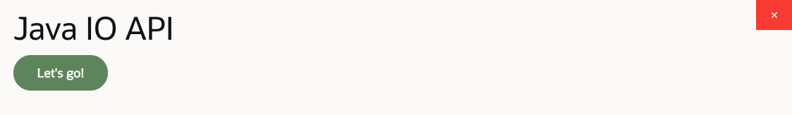
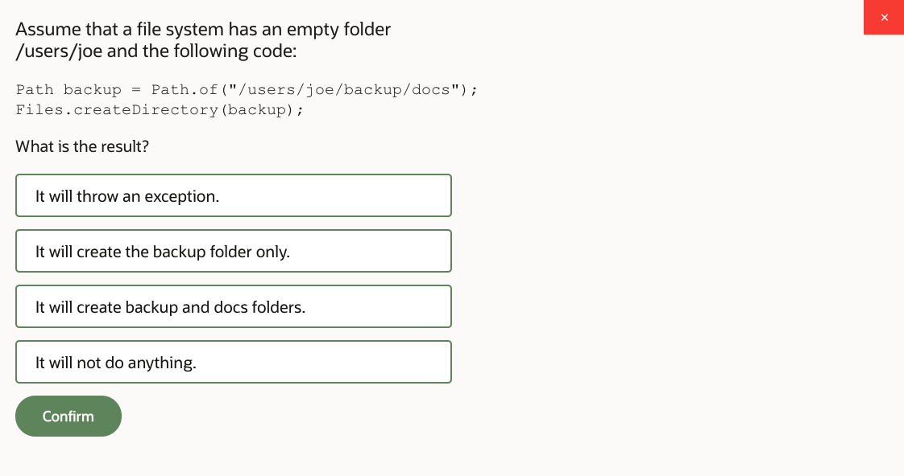
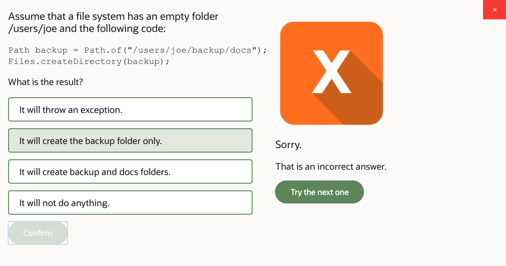
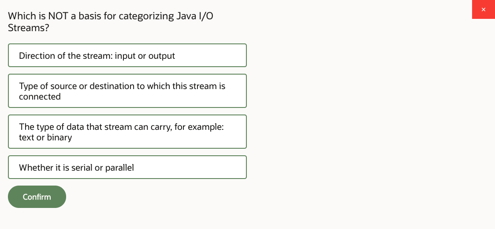
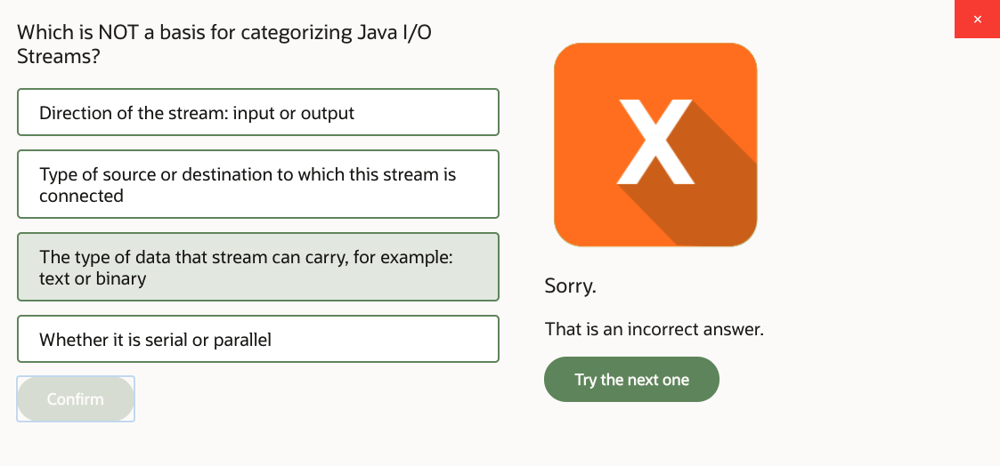
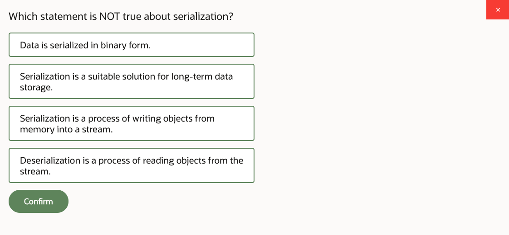
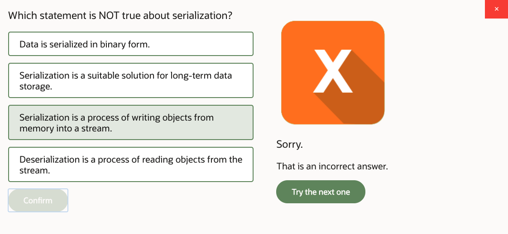
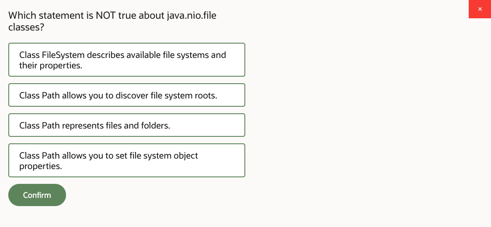
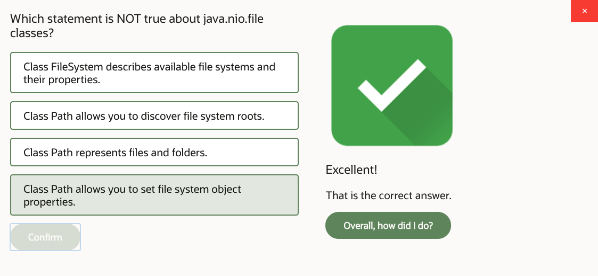
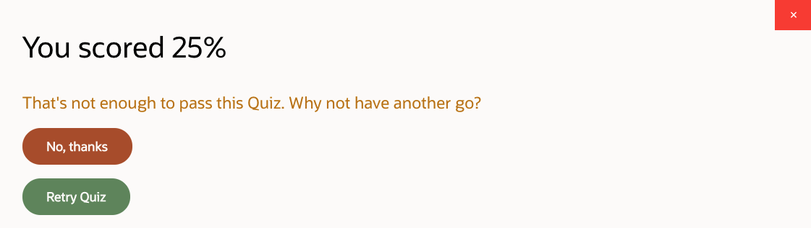

# 13: Java IO API

1. Java IO API, Part 1 26m
2. Java IO API, Part 2 26m
3. Java IO API, Part 3 15m
4. Java IO API, Part 4 17m
5. Practice 13-1: Print Product Report to a File 16m
6. Practice 13-2: Bulk-Load Data from Files…Part 1 17m
7. Practice 13-2: Bulk-Load Data from Files…Part 2 18m
8. Practice 13-3: Implement Memory Swap Mechanism 24m
9. Java IO API - Score 80% or higher to pass

## 1. Java IO API, Part 1 26m

Java IO API. In this lesson, we're looking at the Java Input-Output API, Java IO, and we learn how to read and write different types of information-- text information, binary data. So basically, write and read information in and out of our Java program.

We also learn the process called serialization. How can we serialize and deserialize Java objects? And then just generally look at different examples of IO, working with the file systems. So let's take a closer look at the IO API.

We'll start with the very basics-- the concept of what Input-Output API actually represents. Well, it's the API that allows us to read or write information. Reading means getting information from some source. Reading is the input direction. Writing is delivering information to destination-- to a particular target. That's the output direction.

So you could think about it as the data coming into the Java program or going out of the Java program, for example. But it actually depends, because what is the source and what is the destination? Well, there could be different types of sources and destinations. This could be files, this could be memory devices, this could be network sockets, consoles-- so depends, right? Depends where the information needs to go or where it's coming from.

The transfer of the information is managed by Java classes that we categorize as streams. Now, we used the word stream before in the streams chapter, but that's not the same thing. There we talked about streams of objects, and here we're talking about a completely different API. It's just data streams-- just information, which is like text or binary data-- and really has nothing to do with the word stream that we used before for the Streams API.

So we categorize this as input-output streams. It's probably unfortunately the same word is used to describe two different concepts, but then again you can appreciate that either way, we're talking about some kind of flow of information, right? So hence the term stream. The information may arrive from different sources, may be passed to different destinations, and may be handled within the program through the series of these interconnected streams or pipes that manage that data.

What these streams can do is apply extra processing to the data. So for example, the data that comes in can be filtered, can be modified, or before you send the data out to a certain destination you can prepare it. So streams can apply additional handling. And they could be connected to each other, so with a series of different interconnected streams, you can achieve whichever algorithm of handling you want to achieve.

So to get our head around what are these input-output streams, we need to look at the IO API. And probably the easiest way to understand this API is first to look at the top-level abstract classes within that API. And apparently, we'll find that there are four of them. There are InputStream, OutputStream, Reader, and Writer. So these are four top-level classes for which the rest of the IO API descends.

InputReader represents the input direction-- reading direction. And there are various implementations available of the InputStream, and specific subclasses-- concrete subclasses-- of an InputStream, because InputStream, OutputStream, Reader, and Writer are abstract classes, but there are various implementations, some of which are presented on this page, but obviously there are more.

So for example, FileInputStream. That's the type of stream that reads from a file. Or PipedInputStream, that's the type of input stream that reads from memory pipes. Or ObjectInputStream, that's the type of stream that reads objects.

And you can kind of see the symmetry here. If we want to write data out, then we'll use OutputStream and descendants of that OutputStream class. Depending on the type of the source or destination or type of functionality that we want to achieve from the stream-- what type of data we transfer-- we'll just use a different type of read or write stream. That's why we have these subclasses.

In addition to binary read and write streams, we also have character read and write streams, and they descend from abstract classes Reader and Writer. And again, you have various subclasses here. They may perform different functionalities. They may perform some content buffering or transformation of content. For example, conversion of character data to binary data or binary data to character data conversions, or maybe some special convenience method classes which just give us a particular way of handling information.

The point is, what do you need to do is figure out, in your IO program scenario, which type of stream you want to handle. Is it binary? Is it text? Then decide which features you want to get out of that stream handling.

And based on that, you select an appropriate subclass or subclasses of InputStream, OutputStream, Reader, or Writer that you would like to use. You can interconnect them together, and then you can start channeling the information, reading and writing data in and out of different devices around the Java program.

So let's take a look at the binary read and write actions first. So these are the abstract classes that define the binary IO, InputStream and OutputStream. The InputStream has a method read that reads binary data. It's an overloaded method.

There's several versions of it, and actually more versions of it in notes. But the general gist of what the read method is doing is that it reads data, populating it into the buffer. So you can specify the binary byte array buffer, and you can put data in there. You may not necessarily populate the entire buffer. You may populate part of it. That's why you have additional parameters such as offset and length-- so which portion of the buffer you want to populate.

And most importantly, the read method returns you an integer, and that integer is an index within that buffer. And that index helps you to understand how much information you've actually written to the buffer. So you may say, oh, I've got a big buffer, but how much did you actually put inside? Maybe it's not the whole buffer. Maybe the stream didn't provide you with enough information to populate the entire buffer.

If the stream did provide enough information to populate the entire buffer, then that int returned from the read method will basically be buffer length. But if there's not enough information in the stream, then it will be some position within that buffer, which is indicated by the integer.

You can also mark positions within a stream, but not all streams allow you to place the marker. For example, imagine that you're reading live data from the network. And if the corresponding counterpart network device does not allow you to place a marker in a stream and return later to that marker, oh well, well, it just doesn't support this functionality then, right? So it depends on the type of the stream which you are handling. Some streams support markers, others not.

You can interconnect streams between each other. And one of the things you can do-- you can read data from the input and transfer it to go to the output. So interconnect different output and input streams together.

You may check if more data is available from a stream. You can fast-forward. Skip is like ignoring data. So if read actually reads data, then skip just fast-forwards, and you can say how far you want to forward to-- basically, how much data do you want to skip. You may reset the stream, and eventually you need to close the stream. Actually, you must close streams when you've finished handling them.

The OutputStream-- well, it's a pretty symmetrical idea. You've got the read method in the InputStream, write method in the OutputStream. And as you can see, you're writing a buffer. You may not necessarily have to write the entire buffer. That's why you have additional parameters like offset and length.

There's also closure. There's one more thing that the OutputStream can do, and that's flush. Well, the idea of flush is that streams may be connected to one another, and eventually they reach a certain destination, but there is this potential problem. What if you have written data to the stream, but that data didn't reach the destination where the stream is pointing to, eventually?

To push data from the stream-- to guarantee that it actually goes through-- you have the method flush. Normally, the flash occurs automatically when you close the stream. But what if you don't want to close the stream just yet, and you want to continue writing, and yet so far, what you've written to the stream-- you just want to make sure it actually reaches the other end-- reaches the destination. So that's why you might wish to call the method flush.

OK, so let's take a look at an example then. This is a very basic example of binary data reading and writing. First of all, of these Java IO API streams implement the AutoCloseable interface, so you can use them within try with parameters. So the implicit finally block, doing the closure of streams is formed for you, which is good news-- less for you to remember that you need to write. So that's just automated.

So you can do try with parameters. And in this particular case, I decided I want a couple of streams. One to point to a file, another to point to another file, and I will read from one stream and write to the other.

The example is slightly artificial, because I'm not actually doing anything with the data. I'm reading data from one file and just directly writing into the other, which is frankly pointless, because we'll see later there's just a method to copy the file. You could have used that. You didn't really need to do all of that stream reading and writing just to copy a file.

But presumably, in between reading and writing, there will be extra actions that you would like to perform with that data. These actions are not present in this example, but we assume you could have written them.

So anyway, let's imagine there is some kind of binary file, and I want to read the contents from it. And I organized the buffer. So set up the binary array, and that's what I will be populating with the data from the file.

I also set the length marker, which is a position within that buffer-- how much data I've actually managed to read. I set it to 0 first. Then organize the while loop. And in this while loop, what I'm doing is I'm basically populating the buffer with data from the file. Just read the whole lot-- whatever is the data chunk.

If the file is bigger than the buffer size, then it will take several reads to actually get data from the file, then get next chunk. So I'm reading it in chunks-- size of buffer. And every time I read in that chunk, the read method returns me length.

And the length that I will get at the very end-- which will happen when I call the read method, and it's just-- that's it. The file is over. There's no more data. Then the read method returns me an impossible position within the buffer. This is a byte array, so a byte array index starts from 0.

So if the file has ended, then the read method will return me length of minus 1. So that is a clear indicator that that's it. I just got to the end. There's nothing more to read. Length is minus 1. So I can have that as a termination condition. I keep reading until I get to the end, basically.

When I'm taking the data from the buffer, I then write it to another file. As I say, in between that read and write I may have done some intelligent processing, but this example is ignoring that. So anyway, I'm writing to another file and using the buffer, carrying contents through the buffer.

And I start in the buffer at position 0, so from the beginning of the buffer, and I go until length. Well usually, the length is just the length of the buffer on all intermediate reads, except the one read before the last one. The last one returns minus 1, end of file.

But the one before the last one, the file might not be divisible by that length of the buffer. So the very last actual data read that returns data may return you the buffer that's not entirely full, so there's some content in it, but it's not to the capacity. And the length variable basically tells you how much information you've got.

So on the last read, that will be smaller than the actual buffer size. And the idea is that when you're writing, you don't want to write data in the buffer beyond the length position, because there's just some garbage in the last positions there which is remaining from previous reads. So you don't want to write that information at the last write action.

There you go. That's the logic of a very simple loop that processes information, gets it from one file, and just puts it in the other. So you could see both directions, basically. You can see the input direction, you can see the output direction.

Now, the next topic will be equivalent actions performed with Reader and Writer, which basically handle characters rather than bytes. Very similar. Indeed, you have a read method reading character, populating character buffer, offset, length. So very, very similar to the binary read-write, except this one is character read-write.

And write method, again, very similar. You've got the concept of writing the buffer given a starting point and length. You've got flush, you've got close methods. You've got marking capabilities if they're supported. There is additional method in Reader called ready, just checking if the input stream is ready to feed you data. OK, so let's take a look at the example.

This is pretty symmetrical to what we've seen before, but this time we're considering reading and writing files which are actually text files. So we have to consider which specific character encoding these files are using. So just as an example here, I'm using an assumption that the files are unicode-- UTF-8 encoded. OK, well, depends, right? But let's assume that they are.

So you've got the classical Charset, and you can basically create Charsets for different character sets, and tell Reader and Writer which specific Charset you're supposed to use. That's important, because you need to know how many bits per character you're using. To be able to convert data into chars, you have to know how it was encoded in the first place.

But apart from that, you create your buffer, set the length to 0, keep reading until you get a minus 1, and then write. It's the exact same logic. The only difference is you deal here with characters rather than binary data.

OK, so that's that. OK, moving on. Again, it's try with parameters, of course, so an automatic finally block is formed for you.

Now, you may wish to read information from a source which is in one format, but then you may wish to transfer that data through a series of streams until you get a different format, or until you get some convenience methods that you prefer to use. Same with writing. When you write data, you may wish to use some convenient method you want to use, but eventually, the destination where you write might be of a different nature.

So you may connect one stream to another as much as you like until you get to the point which is convenient for you-- you're in reading or writing direction. Think about it this way. It might be helpful to write code to handle these byte arrays and char arrays. It's doable, but can we automate it? That's what I'm saying. Can we get some kind of automation for that?

Well, here's an example. I'm using file input and file output streams. These are binary streams, and yet I'm connecting them to-- well, seems like text files, right? So what I want to do is I want to treat them as, indeed, binary streams, fine. But then I want to take these bytes and transfer them to characters. Or vice versa-- take characters and translate them to bytes. So I can do that.

And for that I can use classes such as InputStreamReader and OutputStreamWriter. And you can guess, just by looking at these class names, what it is that they're doing, because you know that everything that's called stream is binary, and everything that's called reader or writer is character.

So if the class has both in a name-- it's a stream and a reader or it's a stream and a writer-- you can guess that's a conversion, right? So it's the way of converting chars to bytes or bytes to chars. Which stream you want to connect it to? Pass it as an argument to the constructor, and you could qualify which character set would you like to use for that conversion.

OK. When you read in data, you may wish to bufferize it. I feel like it's not particularly convenient to read the byte or char array, and I would like the stream to take care of bufferization for me. So I can use classes such as BufferedReader to do that.

Also, when you're writing data, maybe you'd like to automate that as well, and have some kind of convenience method like printing lines, for example. That's done with the PrintWriter class.

So this example does exactly that. I'm wrapping up the InputStreamReader and OutputStreamWriter into BufferedReader and PrintWriter-- just passing them to the constructor. OK, this is a try with parameters block as usual, so there's an implicit finally that closes these streams.

I reserve a line-- a string-- line of text, and I'm reading lines. That's what BufferedReader does for me. It allows me to read the file line by line, rather than deal with the char buffer. It will deal with the char buffer internally for me, basically.

The indicator of the end of file, in which case, is null. If I'm reading the line and it returns null, well, that's the end of file then-- end of stream. File in this particular case, but generally, this could be a stream that's not necessarily pointing to a file. As I say, the sources and destinations may vary, but I guess file is just a very nice example. It's easy to understand how it works.

And then I want to print these lines to another file. Again, I would imagine in between this reading and printing you would be doing something else with that text. Otherwise, the whole example is a little bit pointless. But what else you do with the text is irrelevant to the question at hand. We want to know how to read or how to write at this stage.

So I'm wrapping up the OutputStreamWriter into PrintWriter, which allows me to use methods such as println instead of a char buffer, which I would imagine is more convenient. OK. So that's the idea of interconnecting streams between each other until you get to a stream which is convenient for you to use.

Now, console-- standard input and output. Well, System.in represents the input direction on a console, System.out represents the output direction, and System.error represents the standard error output. The interesting thing is that a System.in is actually a binary stream, and System.out and System.error are technically also binary streams.

Think about it this way. What is the console in Java? Historically, Java was designed as a language to run on a variety of different devices. Actually, it was initially intended for the consumer electronics market. So the presence of a text-based console isn't given.

It's not necessarily that you will actually have a console, and it's not necessarily that the console will be text-based. We don't know. It depends. It depends where this Java program is running. So it's not actually guaranteed that you will have the System.in or System.out of a nature that will be compatible with the idea of just plain text, right? Depends.

Now in this particular example, what we are doing is that we are connecting system input, which is the input from the console, to a Scanner. Now, Scanner is an interesting class, because what it allows us to do is it allows us to analyze what's coming in through the stream-- the input that's coming in from the stream, in this case.

I reserve a text variable, which is just string-- null. Just reserve it for a second. And then what I do is I just print the line of text to the console. This is just like normal System.out.println. And I'm telling the user who observes the console, type exit if you want to quit, which will make sense in a moment.

Otherwise, I'm saying, OK, type whatever value and press Enter. So the value you type could be anything, but if that anything happens to be the word exit, then we expect the program to react differently. And that's what we just told the user.

Now I'm having a while loop in which I will read data from the console. How would I do that? I use the Scanner. Scanner has a method called nextLine. And what did I just tell the user to do? To press Enter. Lovely.

So every time the user presses Enter, that causes the Scanner to get me the next line. Scanner will read that from the system input. And it will do all these conversions for me, figuring out how to present it as a string, so I don't need to do the byte array, char array, or whatever. The Scanner will figure it out.

And what I'm doing next-- I'm populating that txt variable from that next line, and I'm checking if the value is exit, in which case I'm going to leave that while loop. Otherwise, I'm going to continue within the while loop, and all I'll do-- I'll just echo whatever the user types back to the user, just printing it to the console again.

So that's pretty straightforward, and it's a very basic interaction loop you can organize between the program and console. It's just asking people to type things, right? OK. Remember that that isn't really the way you normally write user interfaces, of course.

A console is a sequential access device. It's very primitive. It only allows you to read or write one thing at a time from just one thread, so the use for this style of program is quite limited. But nevertheless, occasionally may wish to organize some kind of console interaction with the user, and this is what it would look like.

## 2. Java IO API, Part 2 26m

As a matter of fact, there is another way of doing that. There's a class called Console. So with the class system, there is a method that gets you the system console-- system.console. However, not all Java environments provide you consoles. It depends where you run the Java program. You may be in the environment, which just is not provisioning that. In which case, when you call system console, you get back null.

So the presence of the console in the environment where the program is executed is not guaranteed. In which case, console is not present, little you can do. You just-- that's it, you don't do anything in this case.

Now, what about if it is present? From the console, you can get writer, PrintWriter. So it's text way of writing things out. Then you can start typing whatever text to the console.

You can also read lines from the console. That's pretty much what a scanner was doing, wasn't it? So the console gives you that functionality. But actually, instead of just the method readLine, you have other interesting capabilities.

For example, you have this readPassword. And the difference between readLine and readPassword is that user types text. If that's readLine, you can see that on a console. A user can actually see the characters that they type.

But if you use the method readPassword, then when a user process the character on a console-- on a keyboard. And it's not actually E-code to the console. The user doesn't see what been typed.

So yeah, there you go. So there are a couple of convenient methods here. You can get reader and writer from the console to interact with the console as a text-based device-- printing to it or reading from it. So that's organizing the interaction with the user, with a bit of an ultimatum given by the console class.

Now, that's that for basic input, output. We're going to change subject, and we're going to move on to an area of serialization. What's that? What's serialization? So you have objects in your Java memory, create an instance, or whatever you need. These are objects in a heap.

What serialization allows you to do is that it allows you to grab an object from a heap and put it into the stream, so take the Java object and write it to the stream in a binary form. This is actually pretty much a memory dump. And then you can read the data from the stream and restore it to Java memory as an object.

Where the streams point to-- anywhere you want. For example, if you point such object input and object output streams eventually to files, what you will do is, basically create a swap file. So you are grabbing data from memory, dumping it to the file, and then receiving it back. It's a bit like a swap file.

Or maybe you want to point it to the network socket, in which case, you send an object across the network to another Java runtime, which can restore it to memory. You're exchanging data between different Java virtual machines across the network. So the purpose of serialization and deserialization process may vary. But generally, the idea is, you grab data from RAM, dump it to the stream. That's serialization. Or you restore it back from the stream. That's deserialization.

One thing that this process is not suitable for is long-term data storage-- categorically not. And a reason why serialization is not useful in this scenario, for temporary storage, it's fine. But long-term data storage is problematic for the following reason. What if your code-- Java code-- changes? What if you changed your class? You recompile, you've got a new version of that class. That means the previous shape of an object in memory is not compatible with the new shape of the object that you get from that class. Because you just changed the code.

So that means that whatever you previously saved will not match your new version of code any longer, so you won't be able to restore the data. And so there is this problem that you need to be aware of. If you want to save data for long-term storage, consider not saving it as is in a Java binary sort of data dump form, but rather transform that information to some kind of format that's most suitable for long-term storage.

You may storage it in relational databases, a record, I don't know, comma separated file, JSON object, XML document. There are all sorts of options which would guarantee good practices in terms of maintaining the long-term system state. But for temporary memory dump or just transient information transfer between couple of machines, you could just simply write and read data in a regional binary form, which is exactly what serialization allows you to achieve.

So first, let's try to understand what will be serialized. So if you want to serialize an object in Java memory, what exactly does that entail? Let's say, for example, I have here a PriceList class. So some kind of class called PriceList. I'll create a PriceList and I give it a date, you know what is the date for that PriceList, and then I add some items to that PriceList which are different products-- Food and Drink.

Internally, the PriceList is organized to have the date, to have this hash set of products. That's what I'm adding. I don't have a complete code for this PriceList class, but you can see it has a few instance variables, including the date and these products.

It also has this string. I don't know what it is, just some kind of hash code. I don't really care what it is, frankly. But imagine there is some kind of checksum or something for that price list that I generate, so some kind of value like that. It doesn't matter, just some variable.

And of course, I have a Product. And Product is what is stored inside that set. And products-- let's assume for a moment they have names and prices, fine. So when I create this PriceList and I add these items, what exactly I've got in a heap, I've got the PriceList itself, which references the string hash.

What else is referenced? The date-- local date object, right? It references the HashSet. That, in turn, has entries. And each entry in a HashSet corresponds to a product-- food or drink. And they, in turn, reference string for name and big decimal for price.

So you've got a hierarchy of objects in Java Heap referencing each other. You can think about it as a price list being a root of a tree-like structure, where other objects are branches and leaves on that tree. So this is the in-memory structure you have.

If you try to serialize the PriceList object-- this one, this particular object, this list-- what you will try to do is create a deep copy. It's not just that root of the tree that you're trying to serialize. It's the entire tree that is a subject of serialization.

If you don't want to serialize a particular value in that tree, or cut off a branch, or not serialize some value, then you declare such variable as transient. That excludes it from serialization. Otherwise, everything is assumed to be a subject of serialization. By default, your instance variables are serialized. So you kind of switch off serialization by saying something is transient.

But there's one more thing that you need to be aware of. If you're trying to serialize an object that does not implement serializable interface, you'll get an exception. So the classes ObjectInput and ObjectOutputStream refuse to serialize data that isn't marked as implements and serializable. You'll just get an exception.

A serializable interface does not require you to override any particular methods. It's a marker interface. You just say implements serializable, and that's that. But if your object does not say that and you try to serialize it, you end up with exception.

Interesting thing is that existing JDK classes that we used so far in this course, like LocalDate, HashSet, String, BigDecimal, they all implement serializable interface already. So you don't really need to do anything about them. All you care is to mark your classes as either serializable or not, depending on what you're trying to achieve.

If you leave an instance attribute in your class which isn't serializable, and you try to serialize the class-- so say, for example, PriceList is serializable, and then you have some instance variable which isn't-- you'll end up with exception. But if you mark that variable as transient, then you don't. Because the transient attributes are just ignored by serialization process.

So this way, you can have variables inside the class that is serializable, and these variables are not serializable, and yet, not get the exception, because you've excluded them from serialization. But generally, you can just use transient keyword to exclude anything you want from serialization.

Even if string is perfectly serializable object in general, you don't want to sterilize this particular variable hash for whatever reason. You decided you don't want to write the checksum out. I don't know why, but you decided to exclude it. Oh, yes, and one more thing, all primitives are also serializable. So if you have an int or something, that's serializable by default.

Now, how do you actually do it? So you create your PriceList, you add your items. And then you have this ObjectOutputStream. It's try with parameters, as usual, so implicit final block.

And in this particular case, I'm pointing to a file. Let's call it swap file. And take that list and I write it-- out.write. What I'm doing next is completely irrelevant from perspective for serialization process. But what I'm doing is basically setting that list to null, just clear that object reference.

Why do I do that? Just to prove the point that I explicitly de-referenced the original PriceList object. The list is not pointing to it any longer. I'm reading it to the file, and I de-referenced it. And then obviously, by the end of this try block, the output stream is closed. There's implicit finally that closes the stream.

Now I've got the next try block in which I'll try to read the data from that swap file. So I'm reading the object back. When I read the object, the read object method returns me generic object. So I may wish to perform a casting. Actually, I may wish to check if it's an instance of PriceList, just in case.

Because go figure, when I'm reading from file, you never know. What if it is not a price list that I'm reading? But anyway, you could do the instance self-check. And then eventually, what do you do? You cast it to the appropriate type. So in this particular case, I'm casting it to PriceList, and I'm reassigning the variable.

I was making a point that the object may as well be gone from Java. I don't know if it was actually gone from memory or not. That depends on the garbage collector. But the point is, I wasn't referencing it. And when I read it from the swap file, well, I've just restored an independent copy of that object in a heap, created a new fresh copy of that object in a heap. And then our list variable now references that copy.

You need to catch some exceptions, of course. There are several things that can go wrong. You may have problems with the file, per se, with input, output, reading and writing from file.

But there's one more thing that you can potentially have a problem with. And that is ClassNotFound. Here's the story. What if this first chunk of code that's writing the file is in one Java program, and the second chunk of code that's reading the file is in a different Java program? Do both of these programs have exact same definition of a PriceList class?

If the class path on these two programs is actually different, potentially, what could happen is, the program that was writing the file has the PriceList class. And the program that's reading the file, well, doesn't. Then you end up with ClassNotFound exception. Because you're trying to do something which is not matching the way that was written. And frankly, the worst possible outcome here is that if you do have the PriceList class in this program, but it's of a different version.

You see what I mean? What if you are reading some code, and you're reading some files, and that's fine, you have a PriceList class. And then you change the PriceList class, and some time later, after you change it, you try to read the data from files. And just what are you reading from the file will not match your expectation. So casting to that PriceList type will just not work properly. And you may end up with ClassNotFound exception.

Now, one more thing that you may wish to consider, when you're writing information out of a Java program, you are letting it go to the external world outside of your Java virtual machine. And basically, you don't know how secure is that external environment. Well, actually, it's probably not secure. That's kind of a safe assumption.

So there are certain pieces of information within your program that you may find sensitive. Imagine you have payment details, or a credit card number, or something like that. And you just don't want to write it out in plain text to a file. Because that's not particularly secure, is it?

So consider scrambling values. Before you write the value out, if you've got a particularly sensitive piece of information, consider scrambling that piece of information-- creating a message digest. So to do that, to do the message digest , you need to specify an encoding algorithm for encryption [INAUDIBLE].

So in this particular case, this example uses SHA-256. And there are other encryption algorithms available. And you get a message digest for a given algorithm. The rest of this code is pretty obvious. I'm creating here a stream to write binary data. An object output stream, which is serialization, basically.

And I'm writing the object, but before I will write that object-- before I do that actual write-- first thing I do is I prepare that message digest. And if I have a particularly sensitive piece of information that I don't want to write as is, then maybe I would like to take that information and scramble it first. See what I mean?

So scramble the data, get the hash out of it, convert it to some text representation-- because hash is just a number, really-- convert it to text representation. And 16 means hex string. And then return the value as scrambled text, basically. That's what I'm doing here.

So the example here scrambles data, generate and secure hash. And that might be something worthwhile considering if you deal with sensitive information, which you don't want to just leave as is in the external world. More on security and encryption information can be found in Security appendix in this course.

Now, serialization process can be customized. Now, of course, the obvious customizations that you can do is just make something transient. That's just, add a keyword transient onto variable, and you're done. But you may wish to do further programmatic customizations to the serialization or deserialization process.

And apparently, there is a pair of methods you can write into your class to do such customizations. And these methods are called WriteObject and ReadObject. They accept, respectively, object output and object input streams and throw exceptions-- I/O exception. And when you are reading, then you can also throw ClassNotFoundException. This is possible, again, as a consequence.

Now, notice something really odd happening here. Do you notice these methods are private? Hmm, let me tell you, these methods are invoked by the ObjectInput and ObjectOutputStream classes.

What's going on? Another class-- ObjectInputStream or ObjectOutputStream-- can invoke private method upon your class? Isn't private supposed to make it impossible? Isn't the definition of private that it's something that only this class can possibly access?

Well, generally, it is. But then think about it for a moment. What about all of the other variables here? They were private. That didn't stop ObjectInput or ObjectOutputStream to actually grabbing these values and dumping them to the stream or restoring them from a stream.

Apparently, you may bypass private access modifier. It's actually possible in Java. You could do it. And ObjectInput and ObjectOutputStream are doing exactly that.

There's an API in Java which is called reflection or introspection API, which basically allows you to look at the object and ignore whatever access modifiers it has, and just get to the contents of the object directly. And ObjectInput and ObjectOutputStream do precisely that. They operate-- they bypass normal methods.

They don't go for getters or setters, or constructors. They just get data from the heap straight ahead and restore it back to the heap straight ahead, and they don't care if it's private or not. So they invoke this private method, right?

Anyway, what do you do inside these methods? Well, you do whatever you like, but don't forget, if you don't want to disable what the ObjectInput and ObjectOutputStreams are actually doing by default, then don't forget to call these-- defaultRight, defaultRead. So that just tells the ObjectInput and ObjectOutputStream to do whatever they usually do. But in addition to that, you may perform other actions.

So in this particular case, I'm writing Object, which is an Instant. Instant, remember, is a time stamp. So essentially, the file or whatever destination I'm writing this product to, I will write the product itself and the timestamp-- the instant and the timestamp. And when I'm reading the object back, I'm doing the default read, I'm restoring this product.

But look, I have this transient variable. Transient variable was actually never saved into the stream in the first place. When you were writing it, this hash variable was just ignored. So when I'm reading data from the stream, I know that the hash will not be restored. It will be null. So maybe I have some kind of a method that generates that hash for me. Oh, I can just regenerate it.

So when you perform serialization, you may customize it by writing extra objects. When you perform deserialization, you may customize it by maybe calculating values, re-computing values for transient fields, or just doing other customizations, I guess, whatever you need to do. So it's optional to have these two methods. And you only create them if you really need some kind of programmatic customization, augmentation of the serialization and deserialization process.

To make sure you're not restoring the object which is not matching its serialized version, you can mark your classes with this attribute called serialVersionUID. The point of which is simply indicating a version of your code. So if I create a product class and I mark it with serialVersionUID 1, and if I modify the code of a product, I just increment the version.

And what will happen in the serialization-deserialization process is that ObjectInput and ObjectOutputStreams will actually look at that data. And they will check if current version of the class you currently have in your class path matches previously serialized version that is coming from the stream. And if there is a mismatch, you'll get an InvalidClassException.

So you wouldn't accidentally restore something that is not what your program expects. Because the side effects are really unpredictable. It depends what exactly was changed in the code. Sometimes, the mismatched code is actually successfully restored. It depends on the nature of the change between two versions of the program.

So you may be in a position where you're restoring data from a stream, you seem to be OK, until sometime later when you discover a discrepancy. That the object you restored does not behave in the same way as the class that you currently have in your class path. So you're better off not restoring it in the first place. And to achieve that, you need the serialVersionUID so that the stream will throw you the exception, rather than restore an inconsistent object.

And once again, the reason why serialization and deserialization is not suitable for long-term storage is precisely because your code can change, can be recompiled, and then whatever you previously serialized will no longer be valid. Consider using other data formats for storing information-- XML, JSON, comma separated, I don't know, relational database records, depends. Consider that these are more appropriate for long-term information storage.

So that concludes the topic of serialization.

## 3. Java IO API, Part 3 15m

Next segment in this lesson talks about filesystems. The working with a filesystems entails handling of folders, files, different paths. The API that we use in this lesson comes from the package java.nio.file. There is an older version of the filesystem handling the API. That is a java.io package and is represented with a class called File. This is a legacy API java.io.file. It's not per se switched off or anything. No, you could still use it, you can still use it. It's still valid. But you're encouraged to use the new API, basically, the new API instead.

File class functionalities are, in a new API, distributed between several different classes-- Path, Files, and FileSystem. So these three were kind of combined in one class in the older API. There are conversion methods. You can convert any path object to a file using toFile method and you can convert a file to path using toPath method. So you could kind of migrate from the old to new API and vice versa as required.

Now, path class represents files and folders in your filesystems-- different paths, files and folders. Just represents them. Path class does not do anything with these files and folders. To perform actions upon files and folders, you use a class called Files. Don't confuse that with the old class File-- that's different one, yeah? So Files gets you operations that you could use to handle path objects. You know, copy the file, delete the file, these type-- copy path, delete path, which could be file or folder, this sort of thing. So that's Files class. And a FileSystem represents the overall filesystem.

So in this particular example, we see that we get the default filesystem for our current machine, and from there we get file stores. Well, I guess on Unix system, you'll get a file store which is your root, which is just slash, but then on Windows you can get different drives like C drive, D drive, whatever. These are your file stores, so these are basically multiple volumes of the filesystem. And file stores get you a stream-- recognize that-- for each, so you can basically iterate through all file stores and find out which ones you've got and what do you want to do with them. You can get root directories from each file store. Right? So for example, as I say, roots like slash or C colon for each file store. And then you could also find out what is the current OS path node separator, but in some operation systems it's forward slash, some operation systems use backslash, so you could find out what it is, basically.

Now let's just construct some paths, I guess-- see how we can create paths. So path represents file or folder, and each path is an immutable object. In other words, pretty much like local date, local time, big decimal string. You create a path, you can't change it. What you can do is create another path. Every time you try to modify a path, you just create another path, right? That's the idea.

So there is a very simple way of constructing paths. It's the method of, and you can just specify the path as one string or you could do the kind of fragments of the path comma separated as a vararg method, so you could specify as many parameters as you need. So these are your path nodes.

So in this particular case, I'm constructing the path from root of the filesystem down to folder users/joe/docs and then file called some.txt. That's my first path. I can retrieve information from that path, but different bits and pieces from it, like get me a file name, for example, so that will return me some.txt. getParent-- that will return me users/joe/docs, which is, you know, parent folder where this file sits, right?

Path.of dot-- let's assume I launched this program, I launched this Java program, when I was actually physically at a command line inside the folder Joe. Let's assume that for a moment. In which case, if I say what's the current folder path.of dot, that would be users/joe. That's the assumption we're making. So we launched the program being in that folder-- that's our current folder.

Resolve. Resolve method allows you to take the path which points to a certain location, like in this particular case Docs folder, which is users/joe/docs, and then append a relative path to that. So relative path assumes that you're qualifying a path from some point to a filesystem which isn't slash, which isn't root. So remember dot means current folder, double dot means parent folder. So if I'm in the folder Docs, the parent folder will be Joe, right? That's the parent of Docs. And then from Joe, I go down to the folder Pics, and from there I go to acme.jpg. So this particular relative path that I resolve is basically leading from the Docs folder to the acme.jpg file. And that's what it looks like.

There's another one called resolve sibling. So for example, if my path references some.txt and then there is another file in the same folder, or another folder in the same folder or whatever which is other.txt, then I can just resolve it, and resolve sibling basically implies that I'm resolving within a current folder. OK.

Normalize. The method normalize allows you to take a path which contain these redundancies like go to one folder then go one folder up, et cetera, et cetera, yeah? So take these redundant nodes and basically get rid of them. In a way, what you could say is that the path which goes users/joe/docs then go to parent, then pics, then acme.jpg could have been expressed as users/joe/pics/acme.jpg, and that's exactly the result of normalized method call. You'll get the redundant part docs double dot out and you'll retain the actual path towards a particular object without redundant elements. That's what normalize will do.

To real path. Prior to this point in this algorithm, all of these other examples that we observed actually could have been completely virtual. When you create a path object, the physical existence of this path on a filesystem is not verified or validated in any way. It's not actually a requirement for any of these paths to really exist. So you can specify the path that's completely fictional, and then a method to real path is the way to actually say, does it exist? Does it actually, physically present on a filesystem? So there you go.

And then there's one more method that we need to talk about, and it's called relativize, and that allows you to do kind of opposite of normalize. If you have one path which says the path pointing to some file, and then have another path which is the path pointed to Acme file, the method relativize allows you to construct the path from one location to another using relative paths. Once again, relative path is the one that does not start with a slash. Relative path is the one that starts from whichever location and goes to another location which isn't the root of your filesystem, which isn't a slash.

So in this case, from some towards acme.jpg, the path will be go to the parent folder Docs, go to the parent of that folder Joe, so dot dot dot dot, then from Joe go to Pics and from there go to acme.jpg. Yeah? That's the way to construct the path. So on this page, what we've observed, it's just basically construction of various path objects. We were not doing anything with them-- we were just referencing things on a filesystem. And actually, even until the point where you call to real path method they are not necessarily even real paths

Now, you can navigate around the filesystem with the path object, but to perform actual actions with paths, you use another class, which is class Files. So let's take a look at the navigation capabilities provided by Files class. First, we created here a couple of paths. There's a slash users/joe, right? That's one. And then we have another one called p1, and that's slash users/joe/docs/some.txt. So a couple of path objects.

And what I could do is I can ask the path object, well, what's the name count? And that will tell me how many elements have got in that path. Each subfolder will be yet another element, so Users is a path element at position 0, Joe is position 1, Docs at position 2, and some.txt position 3. So when I get in the name count, I know how many positions. I've got, and if I start getting the name of the path element at a particular position, that will tell me one of these-- yeah?-- one of these names. So I can write an iterator and step through that and analyze what are the elements of the path.

Now, we then create another path object. This one considers that a current folder is dot-- is probably users/joe in this case-- and then we construct there the path, which is pics/s.txt. So there is this s.txt path. And remember, none of these paths actually have to exist for real, so I can construct the path p2, which is not actually physically yet present on the filesystem. So I created this s.txt path and it may as well be virtual. I don't know, possible.

Now, what will I do with that? I have another path, p1, that, remember, points to some.txt file, right? And then what I do is I use the Files class to create a symbolic link that creates basically a shortcut to another part of the filesystem. So this s.txt becomes an alias, a link, linking this location in the filesystem to a target, and a target that specifies p1, which is the some.txt file.

OK, so you can do this-- you can create symbolic links. What else can you do? With the Files class, you can do the listing of contents in the folder. So list, and then which folder you want to list. So this is that path called Joe, yeah? You got slash users/joe. And that will tell me what is the contents of the users/joe folder, and apparently that contains folder Docs and folder Pics and that's precisely what the list method will do. Please note what the list method returns-- as stream, so you can apply all the stream operations to it. In this particular case, I'm just doing for each, but well, guess what, I can make it as sophisticated as I want it to be. It's the stream of path objects.

Another interesting method, which is kind of similar to list, is method walk. Well, it's kind of doing similar thing to the list, but in addition to that, it also walks down the actual paths. So it's not just listing which are the objects inside a given folder, but it goes into the subfolders and subfolders of subfolders and on and on, sort of zooming down the filesystem. Again, it returns you the stream and you can decide what you want to do with the stream.

In this particular case, I'm using a method map to get basically text representation of every file name, of every path, and then I'm using a filter and I'm filtering those paths which names end in txt, and then I'll print them. So that will be basically printing me only txt file names, which I can pick by walking down the filesystem trees starting on a folder Joe. So it ignores the folder names, because they don't end on txt, and they ignore the acme.jpg because that didn't end in txt, either, and everything else which did end in txt, well, I could see that printed out inside that forEach, basically.

And finally, to traverse the symbolic link which I've created earlier, I could use a method readSymbolicLink. If I do that, if I readSymbolicLink, then I essentially navigate from that link to the target file where that link points to. So these are the ways of traversing the filesystem, navigating the filesystem.

## 4. Java IO API, Part 4 17m

What else we could do with the files class? Well, actually quite a lot. You may analyze your file path properties in detail. So files class has this series of different methods that allow you to see if it's a folder, if it's hidden, readable, writeable, executable, is it a symbolical link, is it a regular file. So lots and lots of different behaviors like this.

It can even tell you if something is the same file or not. Imagine two different paths. One of these paths may be an absolute path, another might be a relative path. Consider that you may have symbolic links. How do you know that two paths that may not look like each other at all actually point to the same place in the file system because that could happen. You know, with symbolical links and with relative paths, you may have completely different representation of the same physical location in a file system. So the method isSameFile helps you to identify that. You can basically compare these two paths. It will tell you true if they're the same or false if they're not actually pointing to the same part of the file system.

You can try to guess what a file content is. ProbeContent will tell you what possibly that content type is. And you may work with file attributes-- size, creation time, last modified time, last access time, et cetera, et cetera, even who owns the file or folder-- you know, what is the owner, what is the group. So work with permissions, you can do the POSIX permissions. You can do DOS permissions. There are more examples in the notes. And actually, there is a verbose explanation of the POSIX permissions in notes for this page.

But generally speaking from the perspective of this course, all you need to know is that files class helps you to investigate properties of file system path objects. Not only you can look at the properties, you can actually set properties as well. OK, so set permissions, set last modified time, whatever you need. So whatever you are getting you can also set. These properties are writeable as well. OK, so this is the look up for the user principal service on a file system, and then you're kind of saying assign file ownership to a particular user or group, assign certain permissions, define last modified time as current timestamp. There you go.

OK, so files class also allows you to create paths. Remember, path is kind of virtual. It doesn't really have to exist. So you can create a path, but it doesn't mean it physically exists on a file system. If you want to create it, there are methods to do it, such as createFile, which creates a file, or createDirectory, or createDirectories. If you've got like a folder inside a folder inside a folder and you want to create the entire set of folders in one go, not just one by one, then you use the method createDirectories. If you just want to create one immediate child folder, then you use the method createDirectory. And then if you want to create a file, you use the method createFile.

Note another interesting thing. Do you see this-- Files.lines? Apparently, the first part of this chapter that tells you you have to open the stream to read from the file, do the loop, read the line. Actually, there is Files.lines method that just does it for you. It gives you stream of lines.

Guess what internally it's doing? Well, it opens the file stream, and buffer the reader, and reads lines, and gives you them as a stream. So you can apply all the usual stream operations-- filter, map, for each, whatever you need. And equally so, you can write text to a file-- just, you know, writeString, for example. You don't really need to write code that does, you know, open file reader, organize the loop, write stuff, file writer, and write stuff. You could just do that, you know-- writeString and that's it. So convenience methods, really. That's what the files class provides us with.

You could also create temporary files and folders, which is pretty straightforward-- creating temporary directory, creating temporary files. Now, there is this deleteIfExists, so you know, cleaning up if you don't need them. And I guess temporary directories and files needs to be cleaned up.

Now, it's not guaranteed that the temporary files will actually be destroyed when you exit Java program because you may have various situations. For example, if your Java program crashes, then it may not have an opportunity to actually get rid of the temporary files and folders. So you may consider when you start up the program, first thing you do is clean up previous temporary data just in case if it hasn't been deleted for you. OK, so the Java virtual machine will attempt to delete these temporary files and folders, but what I'm saying is that that may not always happen, right?

OK, copying and moving paths. It's pretty straightforward. Files.copy does the copy. Files.move does the move. There are additional parameters you may wish to consider, like when you're copying or when you're moving, consider copying all the attributes, like permissions for example. Also decide what do you want to do if there is a destination file which is just like the one you're copying or moving. Do you want to replace the existing files or not?

And finally, if you're doing the move, what if you have a problem during the move? Do you undo the entire move-- that's called atomic-- or not, or you just sort of leave some of the staff moved as is, and then if you encounter the problem, oh, well, then you stop at that stage? So that's your choice. You may decide whether it's an atomic move or not.

Now, the scenario here is pretty simple. So what I'm doing here is that imagine I have this folder docs, which is that first source path. And I want to grab everything in the folder docs, including the folder docs, and just sort of copy that to the folder backup. So that's what I'm doing. I'm copying to the folder backup.

To do that, I'm listing the contents of this folder, so I'm doing Files.list. And I'm listing everything that's in the docs folder. And then for each line on that listing for everything that's in the folder doc, I'm doing that transfer. I'm copying them file by file. And you can see I'm doing it in lambda expression inside a stream for each action. Yeah, so there you go. Movement-- well, I'm taking the contents of these backup docs, and I'm moving it into the archive. So I'm doing the move action here.

OK, all right. Deleting paths-- you can't delete a non-empty directory. That's not allowed, so you may have a problem here. If I want to delete this backup, and docs, and everything inside, how do I go about that?

I'm calling the method walk. So I'm walking down that file system tree starting at backup, and going down to docs, and, you know, all the subfolders and files within them. So walking down that file system tree. I then do the sorted call on the stream. So walk gives me a stream, remember?

And sorting in reverseOrder. And that means that when I will process this stream, I will start from a leaf element here and go upwards. So when I'm doing the deletion, I'm deleting first those files that are at the bottom of the tree, and only then I progress to the folder above them, and only then I progress to the folder above that folder. So basically, I guarantee this way, that I'm not trying to delete a folder that actually has something inside because I started at the bottom of the tree and I make sure I delete the internal contents of folders first before I progress to the parent folder.

OK, consider there is another method called deleteIfExists, so it performs an extra check. I mean, you may try to delete something and it's just not there. There is a possibility that the path you're trying to qualify physically doesn't exist. So in that case, you may run into trouble. And you may guard your code with deleteIfExists method not to throw an exception if the path you're trying to delete isn't present in the first place.

OK, well, that's pretty much it really regarding the basics of the file IO. The remaining part of the chapter simply contains a few extra examples that just illustrate what else you can do with input/output. So they're just illustrations of, like, extra possibilities that you may wish to consider.

For example, treat file system objects by packaging them into ZIP archives or, you know, extracting them from ZIPs. So you've got this ZIP stream. That's a good example of an input or output stream when you're basically grabbing some files and folders. So these are your paths. You created a ZIP file first, of course. You created that ZIP file, and then you're grabbing some files and folders doing the walk-- Files.walk.

And every time you encounter directory, if that's not a directory-- sorry, if it's not a directory, you create a ZipEntry if it's not a directory. And if it is a directory, then you're grouping these entries into the folders within a ZIP. So for directories, you create folders in a ZIP. For files, you just create ZIP entries. And then you put these files into the ZIP archive. You're writing them, you know, just reading all bytes from the path and writing these bytes to the archive.

You may specify a different level of compression in a ZIP here, then you close your entries. There you go. That zips up the file system branching to the archives. So it's pretty straightforward, really. You may even treat a ZIP file itself as if it's a file system. So there is this File Systems class, right? And you can create a newFileSystem. As a type of file system, you could qualify that you want to create file system which is ZIP-- ZIP file system. So you qualify a path to the ZIP file and say, basically, mount that archive as if it's a file system. And you can walk down that as if it's like just normal paths. So it's essentially mounting the archive as the file system.

The only problem is if you create archives like this, you cannot specify compression. So this file system approach can read the archives, but when you write them using this approach rather than what you've seen on a previous page, when you write them, then the compression is not implemented by this particular ZIP provider. It's basically, you know, whoever wrote the ZIP file system class just didn't implement that part of the algorithm. So there you go. Compression is not implemented here, but it is implemented in the previous example. Lovely.

One more example-- this time, something else. Just another use case for the IO API. And this time, we're dealing with URLs, network resources. OK, so what if you'd like to access an HTTP resource? Now, ignore the modules part for now. We'll discuss what modules are in a later chapter. But just in case if you are using module deployment, you actually have to consider it in this particular case, but we'll talk about modules later.

So in this example, what I'm doing is that I'm basically creating an URI pointing to some internet location, right? Create an HTTP request. Say go to that URL. Use HTTP method GET. Build a request. And then I create a HttpClient object and I send that request.

And here's an interesting thing. I can channel the HTTP response to a path. Wow, so I can literally just download it into the file. This is my path. Inside of folder docs, I created a file called index.html. That's the path. And I just to send a request, and I channel the response to go to that path, so it just downloads the file for me.

And notice that all this low-level coding, like how do you read data from a stream, put into char or byte array, read it from that array, you know, buffer-- that's done for you. The method send figures out how to do it basically. You just channel it to a proper destination. Under the hood, yes, it's doing all the input and output stream handlings, of course. But what I'm trying to say is that there are lots of different higher-level Java APIs that exploit Java IO, but give you convenience wrappers around these IO artifacts. And these are just some examples-- ZIP archives, HTTP resources, and there are plenty more. These are just some examples.

OK, well, we've learned how the Java IO works, how do we read and write text and binary data, how do we apply Java serialization and deserialization, and then how we work with a file system. During the exercise, you will be asked to write product and review reports to text files. You're also asked to bulk-load data from comma-delimited files. And then finally, you will be asked to serialize and deserialize Java objects using temporary files.

## 5. Practice 13-1: Print Product Report to a File 16m

Let's take a look at the Java IO API. Practice for the Java IO API will cover the following topics. In this practice, we're going to look at how we can load information about products and reviews from files, which are comma delimited, bulk load data from comma delimited files.

Also, we are looking at how we can serialize and deserialize Java objects and just print product reviews to text files. So different interactions, both text and binary. Now, of course, comma delimited files is a rather primitive format, and you would normally-- modern production programs would not use such a primitive format. You probably will use something like JSON, or XML, or maybe even relational databases.

But we actually have a chance to explore these in other areas, for example, database access. That's part of this course's Appendix B [? to ?] C. And API, such as JAVA Persistence API, or, for example, XML, JSON, mappings, APIs, are actually covered in other courses as well, such as Development Applications for Java EE 7 Platform. So these are more advanced forms of reading and writing data.

But for starters, if you look at a basic IO, I guess we could use basic formats. Yeah, and we'll proceed to more advanced forms later, I guess, or in other trainings. Well, let's start with the first part of this exercise. The assumption is that either you completed the previous lab for Lesson 12 or you could start with solution for Lesson 12 if you like. If you have completed the previous exercise, then you just continue with the previously written project.

So first of all, we need some additional stuff to be configured in our project. So that's a config property file. And what we need to do is to put some properties that correspond to folders that we would like to use in our scenario here. We need folder to contain reports, data files, and a temporary folder. So these are the entries you're asked to place in the config properties.

Let's put them in-- config properties. At the moment, it contains entries that indicate a format of the product and review. And well, now we are saying that there will be some folder where we'll write reports, some folder where we'll take data from, or a temporary folder. Nice.

Now, we also need, in the same file, to add properties that describe what are the naming conventions for our files. And we need several types of files. We need a text file where we will be dumping the product reports to, so write in product report in text format. We also need a format for files that represents products and reviews, a CSV comma delimited files, and a format for file name for temporary file. So these are basically file names, future file names, and we place them in the config as well.

Perfect. So we'll obviously have to use substitution parameters here for file names. Now, in the product manager class, we need to construct paths that will point to relevant folders-- to the data folder, to the temp folder, and to the report folder.

Add these three instance variables to the product manager class. So Open product manager, find, well, anywhere really, place to add them, and just add these variables. You would need to fix imports and nicely format everything.

So I guess you can just put them on the same line. It doesn't have to be different lines. Well, whichever way you would like to format that really.

So yeah, we've initialize these paths towards the reports folder, data folder, and a temporary folder and made an import of Java and a IO file path object. Now, the next thing we need to do is modify the way we print in product reports, because we want to use that file to actually print the report to.

So looking at the print product report, and we need which one? Print product reports is a product object, because there are two of them. There's one with an int, and there's another one with the product. So locate the one with the product parameter rather than with an int. This one.

And in this print product report method, we will-- instead of printing the report to the console, we're going to print it to the file. So to do that, we need to create this product file. We need to resolve the path towards the product file.

So we have the config where the report file name is. Now, let me remind you, the config has the report file name property. There it is, and that's that property.

So we need to retrieve that part and then substitute here a product ID. That's basically the task-- substitute the product ID. What else we need to do?

We also need to resolve that against the product folder, reports folder, the product file within the reports folder, and that's the path we need to create. Now, we also would remove the StringBuilder here. We don't need that, because we'll just directly print to the file.

So instead of that txt StringBuilder, let's resolve that file path. Again, format the code nicely-- fine. So once again, just to explain what we're doing, we resolve in here the path towards a specific file, which is formatted as the resource from the config with the inserted product ID-- spot of the file name. And that's our product file, and it resides inside a reports folder.

So since we commented out the txt StringBuilder, we still have-- we're still using these in this code, but we will be replacing it. And instead, we'll be outputting the print product report to file. So for now, we still have, obviously, errors related to that.

So next thing we have to do is add Try With Parameters block. Let's try that. Put Try With Parameters Block around basically all of these append method calls. So starting from here, and that's where the Try With Parameter starts, and ending below. And I guess you don't need that printout txt, because, well, we're about to stop using the txt object completely, but we'll sort it out.

So surround this appending of text with a Try With Parameters. And inside this Try With Parameters block, what you need to do is initialize the new PrintWriter object. So PrintWriter to write that text.

PrintWriter actually has the method append just like the StringBuilder so you can use the exact same logic here. The PrintWriter then refers to the output StringWriter, which used in UDF code page converts chars to bytes, and that refers to the output stream, which is pointing to a file. The option Create, well, that basically creates the file if it doesn't exist, or overrides the file if necessary.

So that's what we put inside the Try block, inside these parameters of the Try. Let's put that in and fix all imports. And yeah, there you go. So we didn't format the code nicely, but that's basically the idea.

So we have our Try With Parameters. We initialize this output variable, and we're going to start using it instead txt basically. There's one more thing that we need to check, and that is-- so we, yeah, we fixed the imports-- that is not just change the txt to the out, but also change the way you handle the line separator.

Because previously, we were just doing slash n. But you see, when you write an external file, you have to consider the different operating systems used different line separators. So in Unix and on Windows, that's apparently different.

And there is a way of telling which line separator you want to use per each operating system for the class system. So the system line separator will do the trick. Let's ask it, and call that method, and it will tell us what is the current OS way of doing it.

Because we write an external file, it kind of makes sense to consult overriding system on these matters. And you use the out. As you can see, PrintWriter out also has the method append, so you're fine.

We'll use this out.append. We replace all slash hands with the system line separator. And that's basically it. The rest of the algorithm is still the same-- not much of a difference really.

Of course, you now notice that you still have a problem. And the problem is that this tribe log is not culminating in any catch. So it obviously tells you that you still have unreported exceptions. There are two exceptions that could happen here, IO and unsupported encoding, but the unsupporting encoding is a variant of IO basically.

Anyway, so you have to still consider what you do with exceptions, of course. So what we're going to do, are we're going to add a catch block? Well, no. Apparently, you're asked to do something else.

You aren't asked-- you're asked add a throws clause to the method, a throws IO exception. And you could do it by doing this throws clause. So there you go. It added the throws clause.

Apparently, even though you have a tribe log, you don't actually have a catch immediately after that. Now, you would wonder, why would you want to have a tribe log and not have a catch? Well, because the final block is still formed for you. That's Try With Parameters, so still have a final block here where the [INAUDIBLE] stream is actually properly closed.

Even though you decided to do the actual catch somewhere else, because you just did the throws clause, but the final block is still formed for you. You can get rid of that txt thing. You don't need it anymore.

So we're channeling the output to the file, but we still need to catch that IO exception somewhere, of course. Now, where do we add that? Well, print product report with product parameter is invoked from product report with ID. So we could add it here.

Again, you can click here and just say, Surround with Try Catch or Add a Catch Clause. If there is already a try catch block, you can just add an additional catch clause like that. Lovely.

And do we need to change anything regarding the logger? Well, yeah. We're told to change the error message basically.

Apart from that, everything else stays the same. So we're just adding another catch, and we're catching all IO-related exceptions. Actually, that could be changed to variable logger, and then we add in a nice error message here.

So is that a severe error? Well, if you didn't manage to successfully write a file, maybe. Yeah, that's kind of a serious problem, I guess. So the error level could remain severe maybe. That does make sense.

So now we just need to test that code. All we need to do is just run it pretty much as is. Let's just execute, because we have a couple of print statements here, printing this report 101, 103. And let's go to the shop, and just basically hit the Run button, and that should print us some reports.

There should be no output to produced, because we're not really printing anything to the console anymore. We're printing things to files instead. So now, you can basically using a desktop shortcut open the file system navigator and just look at what reports were produced for you.

So this is our desktop shortcut. And you could go to the folder, Labs. You could see in the config file where the folder is. We've configured it Labs, and then Reports.

So you can just open these files, and you can see which reports you're printing here. There you go. So these are reports on our products.

Nice. And you could see how the file name part on it's formed. That you substitute in product ID as part of the file name.

If you print the same product report twice, you just override the file. That's all what will happen. It simply overrides the file.

## 6. Practice 13-2: Bulk-Load Data from Files…Part 1 17m

OK, the next task for us will be to bulk load data from files. So what do we need to do in this practice is to write logic that loads products and reviews from comma-delimited files. We need to modify the methods parseProduct and parseReview and handle the actual input from files there. At the moment, they are doing the comma-delimited parsing, but they're not actually doing things with files, per se.

Existing algorithms and reviewing product objects to the product map collection-- however, the problem is that such approach is probably not suitable for bulk data load because, every time you invoke the right review method when you create a review, you recalculate and all the average ratings and everything. Let's just take a look at the logic in the product manager, and you see what the problem is.

So say, for example, you're doing the review, and every time you're trying to actually parse the review, you immediately create that review object, and that causes the recalculation of the rating for the product. And if you do it in bulk, you will be scrolling through the collection of products, the map of products, over and over and over again. So that's not particularly efficient approach. That's the problem with this.

So we need to change that a little bit. So we'll use a collectors to do the bulk loading. We will not load each product and review one by one. We will bulk load them instead. So certain other changes would have to be done to the format. The format of the product remains pretty much the same. But with the review, what we'll do is we'll put the review in a slightly different format that will be number of stars. There will be comments. But the actual file name will contain the product ID. So the products ID for review will not be part of review data. It will be part of the file name instead. And yeah, so that's the idea.

Right, that means that we need to change review data format in a config file. So it will have one property less. Review data format will only have two properties because the product ID will go as part of the Review File Name, as you can see. There it is. Yeah, that would be the product, basically. That's what we expect. OK, so we modify that format.

Now, the next thing-- we need to modify the parseReview operation in the product manager to construct new review object, of course. But the thing is, we don't want it-- remember, we want it to enable the bulk load. We don't want it to immediately add the review to the list of reviews on a given product, so slightly different take on the algorithm. The signature of the parseReview will change.

At the moment, the parseReview method-- let's, again, find the parseReview. Let's take a look. So parseReview, at the moment, is void. What we want to do is we want it to return the review value. So we want to return the review. And obviously, the return statement will be required. We don't want to automatically add it to the list of reviews. Yeah, we just want to return it

So inside, we reserve the review variable. We'll need that in the parser review. And then what we want to do is, at the end, return it. So when we parse the review, we do the whole parsing, and we eventually return the value.

There's one more thing that we need to modify, and it's actual creation of review object. Instead of invoking the method review product, which, remember, automatically adds a review to the hashmap of products and causes the recalculation of the rating-- instead, we will do it as just initializing that review object here. So really, the rest of the algorithm stays the same. All you're changing here is you're saying, review equals new review, and you're constructing a review for a given rating and a given text. So the two parameters here, rating and text.

The rating will be the first parameter. So that will be values at position 0. And text will be second parameter. And we're just not going to have the third parameter at all. So we expect the [INAUDIBLE] only to have the number of stars and the comments. The second one is comments. So that's a review object. We create it. We'll return it. Nice. So that's done.

Now, we need to do a similar thing with parseProduct method. Again, at the moment, as you can see, parseProduct is void. We want it to return product. And we want to change the way we form that product object. So let's do that. So first of all, parseProduct method, should return product. We reserve the product variable here, and we should really return it at the end.

OK, in the middle of this method where we call in to create product here-- two places. We're creating drinks, and we're creating foods. We'll still integrate a product, but we will be just initializing the local product variable instead. So for food-- we initialize it to food. One is drink. We initialize it to drink. So that's the only difference. We basically-- instead of calling Create Product, we just create a new instance of drink or a new instance of food.

The rest of the logic stays the same. That's because we're preparing these not to automatically add things to the hashmap of products, because we're preparing this for massive bulk load of data. So we need to be able to create reviews and products without immediately adding them to hashmap. OK, so that's why we're just constructing their instances. In a way, we simplify the code. But we'll see where we get with that.

Now, we need the bulk loading methods. So we need two methods to bulk load reviews and bulk load products. Add an operation to the product manager that loads reviews, bulk loads reviews, from a file. That should be called Load Reviews. Well, put it anywhere. And yeah, accepts the product as an argument, basically. And we'll find out why.

So here's the idea. If we want to load reviews, what do we need to know? We need to know the product ID, because, knowing the product ID, we can tell which review file we need to read because review file contains the product ID as part of a name. And that's how we identify which review file to read. And that's what we're going to do in loadReviews method. And from here, when we'll load the file, we can then call the parseReview and do the parsing and obtain the review object as required.

Now we need to initialize the path that will basically read the review file, right? And the path is Reviews Data File, and it should reside within the data folder. So we'll need to resolve it under the data folder. Reviews Data File is the resource from the config. And part of the Reviews Data File name is the product ID. So that's how we initialize that path, OK? And that goes into here, this list method. Let's do some nice formatting. Let's do some nice formatting, make sure all the values are laid out nicely. So something like that. That'll do.

So we know from which folder we're going to read our reviews and from which file the review for a particular product should come from or reviews from a particular product should come from because there might be multiple reviews, obviously. We also need to reserve this list of reviews variable, which we will populate in a moment. So that's our list of reviews. Done. Reserve that. And yeah, file is there. List of reviews is prepared.

Now we need to start actually producing some reviews. How do we do that? We need to perform, first, a check if reviews are there at all. So not all products will actually have reviews in the first place. So the file does not necessarily exist, and that's what we could check. If a file does not exist, then we know there are no reviews for that product. It's as simple as that. There's nothing there to read. Fine. Then the list of reviews will be empty. OK, that's a possibility.

The other possibility, of course, is that there are some reviews, so the file exists, and that would be our else clause. And in the else clause, what we need to do is use method lines that reads all lines from the file. We have a file already. We just need to specify which Charset because it's a character file-- which Charset we'd like to use to read lines.

Now, every line from that file will be passed to the parseReview method. parseReview accepts a string, remember, and returns us a review object. So we'll get a stream of reviews. The lines method returns us a stream. The map takes the text returned by lines method, passes it to parseMethod. That converts it to the review. That's why we change the parseReview to return review object. And now we could do Collectors.toList and collect them altogether to the list in nice, scalable fashion. We're not trying to do the loop here. We're doing it in a much more scalable way with a stream instead.

So that's the else clause. And we add in it after this if. Again, some nice formattings. If you need to add any imports, fix imports, this Charset needs to be imported. But there's still some exceptions that we will have to consider handling, of course. So there's still some work to do here, because we're doing the input, output that would potentially throw in errors. So we imported the Charset. That's done.

And now we need to consider exception handling. What we need is a try-catch block to catch [INAUDIBLE] exceptions, because we clearly are producing them, right? Again, you can right-click here and just say that you would like to surround the statement with try-catch. Nice.

And then what do we want to do with a catch? The actions in the catch-- change the level to Warning, because we're just having a problem here reading a particular review, which is not the end of the world. It's the problem, but it's a Warning problem, not severe problem. OK, so there you go, and just produce the error message in the log.

Now, remember, we promised to return the list of reviews. So obviously, the return statement is still missing. So don't forget we would like to return reviews at the end, which makes sense. OK, so now the list of reviews is formed. It could have been the empty list if there-- no review file at all, or it could be list populated with reviews that we parse one-by-one, [INAUDIBLE] the stream, and load from file. Great. So that's done.

Now we'll do the similar thing for loading products. So we have the method loads reviews, but we don't yet have a method that loads product. So we'll do that. So the difference between loadReviews and loadProducts is the way you trigger the method to run. With loadProducts, the parameter should be a file, which file to read the product from. With loadReviews, all we need is the product ID because, from there, we can derive which file to read because a review file contains the product ID as part of a file name. So we can figure that out just based on the product ID. That's the difference.

Now, of course, within the loadProducts method, what do we need to do is reserve the product variable because we eventually will return it. But of course, first, we'll need to figure out how do we-- well, read the product, right? So that will be done with the help of the parseProduct method, which, fortunately, we already have. It's just that-- what do we pass as an argument to the parseProduct? We need to parse the line of text from the product file, right?

So again, we'll use files lines to read the text. We need to resolve the file path using the data folder. And if we fail to do that, we'll throw the exception. If there's no product for us to read, we'll raise an exception because maybe the actual text in the file is missing. Maybe the product file-- .CSV file exists, but there are no lines of text there, so that would be a problem, obviously.

OK, and that's what goes into the loadProduct. So we parse in the product. That's an existing method that returns us a product. We just changed it to actually return it, and we're reading data from the file. Again, we'll still have some issues here. We'll need to handle Io exception. And the suggestion is, because we're throwing it, we're reading the file-- there's also no such element exception, but that's the runtime exception. So you're not obliged to actually explicitly catch it.

So yeah, in this case, we're asked to do the try-catch block. Good. Let's do that, yeah? So again, you can right-click here on the left-hand sidebar and say, Surround Statement with try-catch. And there you go. Fix the logger. What do we want to do with the logger? Let's see. Just write a warning message again. It's exact same idea as we've previously encountered.

## 7. Practice 13-2: Bulk-Load Data from Files…Part 2 18m

The other thing that you're told to change is change the way you handle an exception. At the moment, you're handling an IO exception. But remember, there's another one that could be thrown here-- no such element.

So you could do the or, or you could just do this-- just catch any exception. I mean, you could build separate catch blocks, but again, the question is is it really the case since you want to do different things? Or you don't really care-- you're just saying either way, it's an error load in the product. No matter which one of these errors-- IO or no such element.

Don't forget, you have to return the product because we promised to return it. But otherwise, that should be fine. So doing the logger, and eventually, add a return statement.

Now finally, we need to trigger this load product and load reviews methods from somewhere. And for that, we'll create a private method inside of product manager called load all data. So we'll be kind of bulk loading the whole thing.

Let's do that. And let's just add it somewhere. Notice that all of these methods were private. Because we want the product manager format.

We want a product manager to be able to handle its own information loading. Now what that method should do-- it should go to the data folder, and it should list files. So just see what CSV files are available.

And we're looking for product files, because all we need to do is first list all products. Because once we loaded them, then we know the products IDs. And with these products IDs, we can start loading reviews so we know which review files to read.

So we're listing products first. And for every product that we found in the listing, we need to-- well, fill for it, obviously, because we're using only files that start with the word "product." you can figure out why by looking at the config-- because that's what we expect. Product files start with the word "product."

So that's what we're filtering in the listing of files. Then we basically will call the method load product for the method map. Remember what the map does? We had a list of system paths, and we convert it-- string of subfile system paths-- and we convert it to the stream of products, because load product returns as a product for a given file path. So that's the one we've just written.

Additional filtration-- well, discard any nulls. Here's the thing-- remember, it is plausible that load product will still return us null if we have an error-- if there's something wrong with a particular product file. And what we want to do-- yes, we log the error. That's fine.

But we want to exclude such products that are not initialized as nulls. We want exclude them from the stream, we want to discard them, filter them out. And then use the collector and collect products to a map where the key in a map will be the product object-- the one that you've just loaded. And a value in the map will be the list of reviews.

And fortunately, there is a method that can return us a list of reviews for a given product, and that's the method load reviews. Now it all came together. So once you listed the product files, from there, you can do the collection-- collect everything-- and put it into the map together with reviews.

Wow. So we're doing the bulk load in one go for both products and reviews. And to ensure that this design would work-- so this is a really important design decision that we had to take, really-- to ensure that this will work what we need to do is for our folders and files in that particular way, and prepare methods that will deal with loading of individual products or list of reviews out of which, we'll then be able to construct our product review hash map. So all that's left to do is when we're doing the listing of the data folder, we need to catch the unreported exception.

So yeah, trying to catch block as usual. Let's do that. Surround statement with try catch. And then we're advised to do in a catch is just change the way we produce the error. In this particular case, I guess that will be a severe. error. If we fail to load products in the first place, that's a major problem because product manager won't be able to function.

It's OK not to be able to load a couple of reviews, I guess, but it's not OK to fail to load them all. So that's a severe error, I would imagine. So we catch an error exception, and we write in that information using our already customized logger.

Now any other adjustments that we may wish to make to our code? Well, yes, because we need to trigger that load data method. We just need to make sure it runs. And we could go to the product manager constructor and invoke that load all data method from there.

Product manager-- let's go to the constructor with a language tag. That's the one. And call the load data from here. The constructor with locale basically then calls the constructor with the language tag anyway, so that means that this method will be triggered whichever way you construct the instance of product manager.

And that's when you load in all data, and that method will basically populate the this products hash map with all the products and all reviews loaded from CSV files. That's what's going to happen. Anything else we need to change?

We need to make sure the parse product and parse review are also private. And previously, we made them public because we called them from a shop class. That's what we're doing in a shop. Just a reminder, we were calling parts product and parts reviews.

But now, we don't really need to do that anymore in a shop because we imply that this will be loaded from files for us immediately when we construct the instance of product manager. So we'll just bulk load data. So we don't need to parse product and parse review to be public anymore, because we're not going to call them from outside of product manager.

We still need these methods because they're doing the parsing, and we clearly use them. But they just don't need to be public, so make them private. parse product and parse review. So all of this loading and parsing chunk of logic became private to the product manager class.

Nice. So we expect when we create an instance of product manager for it to be fully initialized automatically. To test the updated logic, all we need to do is instantiate the product manager, and just start printing product reports.

Go to the shop-- all of these other methods are now private. So we can't really call them anymore, but not that you have to. You can just call your print product reports. Now before we do the printing of reports, let me show you where the data is coming from.

So labs, you could find it in your config properties file, basically, if you wondering. So in the config properties, there is this data folder. That's where the data is coming from. So if you go and check this labs data, you've got a bunch of CSV files for products and reviews.

So lots and lots of them. So it's quite a few. And they, as we mentioned, contain comma delimited information that's on products. And then if you find an equivalent file for review somewhere, reviews for the product 101, that's for the product 101.

And not all products would have reviews. Some will, some won't. But anyway-- so that's a generated set of delimited files that we'll tap into. Make sure everything compiles just in case-- but they can just hit the Run button, because NetBeans automatically compiles anyway.

But clean and rebuild, if you like, just to make sure you don't have any typos, and you're ready to run it. And you'll get your reports. Where do you get your reports printed to? The reports folder.

So we could go to Labs, Reports, and see these reports printed for our products. That's the report for product 101, and that is the report for the product 103. It actually has some reviews.

But you obviously see that we are not initializing any reviews here. We're not creating products here, we're not doing any parsings here. We rely upon a product manager to bulk load the data for us from the delimited files, and just come out automatically initialized.

So yeah, we're running our project, and then we can look up the folders, and see how they all came up, and look at the report files. Now what's going to happen if you print nonexistent product, just out of interest? Can that happen? Yeah, of course.

You ask it, print me product report for products 42. But in fact, the products only exist in a range of 101 to 163. Yeah, you can see the data folder. So if I tried to do something silly, like printing one of these, well, I'll just get an error that product 42 isn't found.

Fine. But the data will still be loaded. It's just a question of I can't really print that product report. What about the other reports? Let me just prove it by printing some report-- 104 for example. Let's just try that.

Obviously, you could see that the other reports are printed, but I was just printing something that's not in that folder. So you'll see additional reports coming up. Other reports are still printed to your files. The report for product 42 is not, obviously, because it can't be printed-- you just get an error.

But report 104, yeah. There you go. It has been printed nicely. You can see that some-- [INAUDIBLE]. Yeah, whatever. So you could test the reaction to the error case sort of scenario.

And you could use other methods. There are methods like print products. You could call that one. That doesn't print to files, but it allows you to specify filtering conditions and order by clauses. And so we could use that method as well.

Actually, you can just uncomment that because it should already be somewhere in your source code. There it is. Yeah, you can just uncomment that. And you'll see more products printed. This time, they will be printed here because the print products method does not really channel the output to the file. It just brings to the console.

So this information is coming from that bulk loaded data set. Fantastic. So we've done some tests. Now here's an interesting thing. What if we'll add another product. Can we do that? Well, apparently we can. We can just-- the old code that was in the product manager class that dealt with the addition of reviews and products is still there.

Yes, we added the ability to bulk load, but we didn't disable any of the existing methods that were just creating products and reviews. So yeah, you could do that. You could certainly do that.

And let's try. Let's do that. Let's just add another product. Let's remove this bogus print report for product 42, which makes no sense anyway. Oh, and just paste that.

So we add in an extra product, kombucha. And that's 164. And to test that we successfully added that, we could print the product report for it. Print product report 164.

Let's do that. Obviously, let's just check for a moment-- we don't have that here. And if we check the labs data, we don't have 164 product either. 163 is the last valid product.

So let's run that. And then let's check the reports folder. Do we have that 164 in reports? Yep, we do. So apparently, we managed to add that to the hash map of products and reviews. Has it been added to file system?

No, we never write data to this folder. We read from it, we bulk load, but we never actually save anything to this folder. So the product 164 hasn't been saved to the file system because we just did the loading. We haven't done the writing.

We could have, I guess. It's just a matter of when you create a product, add in the logic that also writes it to the file system. Well, we could have, but that's not what's happening in this particular program. Nevertheless, you can obviously compile run, and you can see the report printed out.

So we're adding it to memory of the Java program, but we're not saving it to the data file. We're just saving it to report file. So optionally, you can clean up all the test logic, and just basically remove the comments around the bits that you don't need. The remaining kind of test cases is really simple.

What happens when you print the report on existing product, what happens if you add new product and more reviews, and print them, and what happens when you just sort of trying to get discounts, or trying to print whatever products were filtering conditions. But that's really it. That's kind of the logic that we could use to ubiquitously test our application.

That's kind of sufficient subset to perform required testing. You can get rid of the rest of it, or just comment out the rest of the code. So once again, just make sure we understand how the program works.

So we could see this is calculating discounts, average discounts-- sorry, total discounts per product rating. This is doing the report on all products with a given price bracket less than two price. And the printing of reports, that goes directly into the reporting file system. These two are not equal to the [INAUDIBLE].

## 8. Practice 13-3: Implement Memory Swap Mechanism 24m

In the memory swap mechanism exercise and this practice, we're look at how we can serialize our objects and deserialize them. Right, so we need to be able, for example, to implement some kind of memory swap mechanism, such as take products from memory, dump them to temporary files, and then load them back if necessary. To achieve that, we need to make sure that products and reviews implement a serializable interface. OK, let's do that. Let's add serializable to a product and to review. So class product should-- it already implements readable, but will also implement serializable that is in Java IO needs to be imported.

And so is review. Review implements comparable apparently already. That's fine. It implements serializable as well. There you go. Now food and drink are subclasses of product. The product implements serializable, then food and drinks are kind of-- well, they are subclasses of products. So whatever product implements, they kind of implicitly have that capability. So they're considered to be serializable automatically if their parent, which is product says it is, right?

Fine. So we've managed to make our components serializable. That's just a permission, remember? That's just an indicator that allows objects of that type to be serialized. Now we need a method that will perform the serialization. In a product manager, I guess let's create a method called dump data. OK, nice, dump data. So product manager, put it somewhere nearby load all data. I guess, so that will be kind of logically close. But one loads-- another dumps. Yeah.

But the order of methods is irrelevant. It's just for your own sort of logical readability, nothing more than that. So within this dump data method, we'll basically take the products map and write it to a temporary file. By the way, where the temporary file goes, with for that, we created a config folder with a temp file name-- pardon, and the temp folder. So that's where the temporary files will be placed.

OK, yeah just a reminder, yeah, that's part of the configuration. So now what we want to do is prepare here a try catch block because obviously we'll be catching some exceptions inside dump data. Right, we expect exceptions-- we might as well write try catch immediately. You can add it later after you write your logic, but yeah, the order is irrelevant. So we'll prepare the try catch straight ahead. And if we have a problem, I guess we categorize that as a severe error.

Right, of course, the rest of the logic still needs to be written inside as try, so still to come. Inside a try block we need to ensure that a temporary folder actually exists. The create directory method verifies that a path exists and before trying to create it, but we probably don't want to try to create it if it's already there. Yeah, so kind of doesn't exist, let's create it. Then if it does exist, well, don't do anything. Yeah, that's why we need an if check to verify its existence first, and then create directory if necessary.

OK, done. So going forward, after this if block, we need to resolve the path to the actual temporary file. Temporary file, remember, needs an extra value substitution. See in the config here, it has kind of a variable part that we'll need to substitute. And what we propose we should do is to put there a timestamp, an instant. So when you create that file, I guess, it's just part of the file name basically. Well, why not? And put it inside the temp folder.

So this is that substitution of a value as part of the file name. That's done with a message format and then resolving that as a sub-path within the temporary folder. The incident needs to be imported. So do that. Yeah, OK, file has been created. We imported an instant, yeah. Now inside these same try block inside this try immediately after you created the temp file, create another try with resources block.

Oh, the try block can be inside a try block. Yes, absolutely. And this new try with resources block should initialize an object output stream so we can actually write the file. And it will point to this new temp file that we've just managed to arrange. If the file doesn't exist, create it. OK.

We also want by the end of this try to actually close the output stream. That's why it's try with parameters. So the closure will finally block will automatically occur immediately after we leave this try. So we don't leave that output stream open. OK, let's just do the imports first. Import the object output stream, which we initialize in here to point a file. So now we have an import here. We added that. Now what we do is inside the inner try block we need to write that products map to the output stream. For that, we can just use write object methods. Yeah, that's it.

There's another thing we want to do inside this inner try block, and it's creating a brand new empty hash map and assigning to products. That's interesting. Let's try to grasp the logic of what's going on here. So we have taken the products map from memory with all the products and reviews inside and dump it to the file. And then we basically reset at the reference in the products map to point a new empty hash map with no products and reviews there whatsoever. We just swapped the entire set of products and reviews out of RAM and reset it-- the reference to that memory to point to an empty object. That's what this inner try block is doing.

Should we proceed to reset in these products map if we fail to write it? We shouldn't. If we fail the write object here, if there's an exception here, we shouldn't proceed to the next line. This is why these two lines are grouped together into one try block, because we don't want the next thing to happen if the previous thing fails. The next thing we need to have a reverse sort of flip side of that behavior. And that's the restore data method.

OK, that one will read products from the file. Yeah, so we had the one that writes, and we'll have the one that reads. I probably copied slightly more data than I want from the PDF. But we'll just erase the unnecessary bit of text. OK, so we read in the data from the file, from the temporary files. Very similar. We'll have a try catch block catching exceptions here. Right, nicely format everything.

OK, and yeah. And we're catching-- notice, we're catching all exceptions, not just IO. The reason is that apart from IO exception, we can also have class not found. That's the other thing that could go wrong, and also we could get no such element if we're trying to locate nonexistent file, for example, if there is no swap file, for example. Then we'll get that problem. So the number of exceptions can happen. If you care to do different handling for these exceptions, just write different catches. If it's the same handling you want to do for all of them, have a single catch. Just catch in generic exception, that'll do.

OK, so inside this block, what we need to do is initialize the path towards the same temporary file, exactly the same file that we were just dumping. How do we do that? Well, I guess we can just list which files are available in temp folder. We know that temp folder path, and we just do the listing. And we're looking at any files that end with temp. That's our filter in the list method. Find first, or else throw an exception. That's how we can end up with no such element exception if we didn't find any temp files.

Yeah, but otherwise we pick up whichever first file we get. Right, the logic could be a bit more precise. We could really put more code here to really look for the file with the latest timestamp. Yeah, but we kind of assume that' it's just one temporary file in that folder. We either get it or not. Yeah, well, there's always a space for improvement. But this is the assumption done in this particular exercise. Just assume that there is only one temporary file in that folder.

OK, listing files. Yeah, I think it will be a little bit more readable if I'll do something like this, yeah. So align list filter-- find first, and then at the end or else throw. Yeah, kind of makes sense what we're doing. OK, so we are looking for that temp file. Now we need to use data from that file to actually restore the hash map of products and reviews. So next we'll add another try with resources blocks. It's very similar to what we were doing in dump data. But this time, we're obviously using an input stream, object input stream instead of object output stream and files input stream because we're reading.

Yeah, and there is one more thing that we want to do. When we read file, temporary file, and we load everything from it to memory, I guess what we want to do is delete and close. So we don't want that file to stay in the file system really. Yeah, I want to get rid of it which kind of explains why we expect in only one file in that folder. Yeah, we dump. We create a file. We restore. We delete it after we restore.

OK, so make sure you've got correct imports of object input stream. Format everything nicely. Align whichever way you want to align. That's up to you, just so long as you feel that the code is nicely readable. Yeah, OK. So we have an input stream. Now we need to restore what we're reading from the stream. Object input stream has a method read object, returns as well, presentation of an object as generic object. We cast it to hash map and assign it back to that product's variable. Remember, the one that we previously set out to be just an empty hash map.

But now we can now restore back the content from the temporary file. Make sure everything compiles, OK. Just heat, clean, and build. There are a few notes here that are worth considering. You will get here a warning message here. You'll get a warning message. And the warning says that you use an unchecked or unsafe operations. And that's at that point when are you doing this sort of restoration of the object.

OK, well, the reason for it is because you are restoring the hash map from the file. You lose generics information. What are you reading from that data dump doesn't have the generics specification. Like it restores the hash map, but there is no information there that says it's actually hash map of products and reviews. It's just a hash map. Yes, there are products and reviews inside, but that's not something that is compiler validated. It's just loaded from the file as is. So during deserialization, compiler has no chance to check that you are actually correctly using generics. Go figure what comes in from the file, right?

We sort of assume that that's the correct data there. But what if it isn't? So in this situation, compiler says, you are doing something that I cannot validate. Compiler says it's fine. If you load in actual products and reviews into that hash map from that file, you're perfectly fine. But the compiler just says, I can't guarantee that what you're reading from that file will be actually products and reviews. Let's just hope that they are. Yeah, so exactly because it's just an external file, you don't really know. Maybe it's corrupted or maybe somebody wrote something into that file which isn't what do you expect.

Right, so there is this warning. More on the generics and annotations, which is related to this warning, would be found in appendices. A and D, this really kind of interesting in-depth coverage of why this warning occurs and how you can basically say, suppress it. So make sure it doesn't come up and the rationale behind how the generics and annotations actually handle this situation. OK, so that's in appendices.

Now back to what we're discussing, if you don't want that warning to come up-- in other words, if you're saying, I'm sure that that file contains products and reviews, yes. You're telling to the compiler, and no, you can't vouch for it. But I can. I know that it's fine. Then you put this annotation called suppress warnings. And that basically-- you suppress unchecked warnings. And it basically tells the compiler don't worry. I'm sure I'm loading right information. That's not just hash map of something. That's the hash map of what I want it to be, of products and reviews.

OK, right. So it's simply to tell the compiler that you know what you're doing because compiler cannot validate it for you. Compile again, and you'll see that everything will compile nicely with a warning disappearing because you basically tell the compiler don't worry about it. I know what I'm doing here. Good, so we're moving on. We just need to test it. So here's the thought. Yeah, what if in the shop, we'll have these product manager-- remember it bulk loads data, so we can print like product 101 report, and then we'll have the additional product added. Again, it's added only to memory. It's just, yeah, something we add to that hash map and some reviews.

Then we dump and restore it. And we know that when we dump, we completely clean that reference towards the hash map, from products referenced from the hash map. Yeah, so we just re-initialize that part completely. We know that. And then we just try to print product reports again and see if they will come up. So let's add these two lines of code to the shop. And we can actually print some product reports after that as well.

Why not just to see that they also coming up? If you really, really want to see that thing happening sort of in action, dumping data, restoring data, let's just-- you know what, let's just bring different reports. So for example, print report for the product 105 or something. And for complete clarity of what's going on, we'll probably just also go to Reports folder and just erase everything. So you don't have to do it, but because the files automatically overwritten. But the reason why I'm erasing everything so you could see that they will be formed. And for example, the report for the product 105 which is clearly something that will have to be printed after I restore data.

And actually, you don't even have to print that report file before you dump. Yeah, so you can see that everything will be-- everything that will be arriving in that folder will be arriving-- let's prove it. Let's not print any reports prior to us dumping data. So whatever we'll see in that folder will be after we restore. Yeah, OK. Anyway, so build your test case. Run it. You'll see things coming up on a console here. These are the print products and get discounts.

Yeah, and clearly you're appearing after we restored data. And you can also see that product 105 and 164 reports were also produced. And again, the data here clearly is coming from the hash map of products after it has been restored. As for the temp folder, well, the restore data method erases everything from here. Yeah, so the file will be gone. Yeah, I mean, again, you could-- I suppose, go to the product manager and change these delete and close option.

I think there might be even a note in the exercise that tells you that. Yes, so instead of delete and close, if you want, you can leave the option as read, instead of delete and close. And see what will happen basically, yeah? So then you would be able to observe that file. Let's change it to read, yeah? That basically means you're not trying to delete it. You're just reading the file, but you're not trying to delete it. And if I'll run this application again, then the temp folder, the file will not be gone. This is your temporary file. Well, it is a binary file. There's nothing much to see there. There's just basically a binary data dump of your products hash map.

But yeah, it's there. You can obviously get rid of it-- get rid of that file manually. And if you want to do any such experiments, don't forget to restore back the delete and close option. So your program will eventually be cleaning them. So yeah, that's just if you want to play around with it a bit. And then finally, we asked to change access to dump and restore data to private inner product manager.

Well, here's the thinking behind it. It's very unlikely that you will ever want to trigger dump data or restore data methods from the class shop. At the moment, that's how we're doing it, but we're doing it frankly for testing reasons. The reality is that what you probably want to do is in the product manager periodically check how much memory you're utilizing. For example, when you add products and reviews, you can see how much RAM you're using. And then decide, OK, I'm using too much memory. I've got too many objects. How about I'll just dump them to a file?

And even then, maybe you don't want to dump the entire hash map of products. Maybe you want to write an algorithm here that dumps some of the products, but not all. Yeah, I don't know, something like that. So you may make some decisions about what exactly you want to swap and how you would like to restore. And it should be really driven based on your memory utilization or number of objects-- your initialized-- so some kind of an automation around calls towards these two methods.

For testing reasons, yeah, we can call them from the shop class. But that's not really the production way of doing it. Yeah, so you can enhance that. Finally, just a final bit of clean up, you asked to remove all logic from the shop, except just the basic initialization of product manager. So the rest of it goes, yeah. Just initialize the product manager cause in later exercises, we'll have to build different sort of test cases here. Yeah, there you go. That is the end of this particular segment.

## 9. Java IO API - Score 80% or higher to pass

Java IO API

View Quiz

