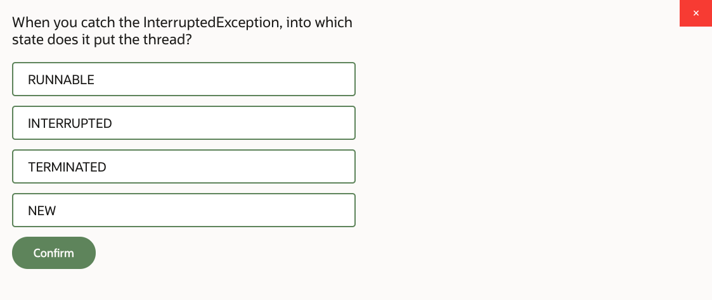
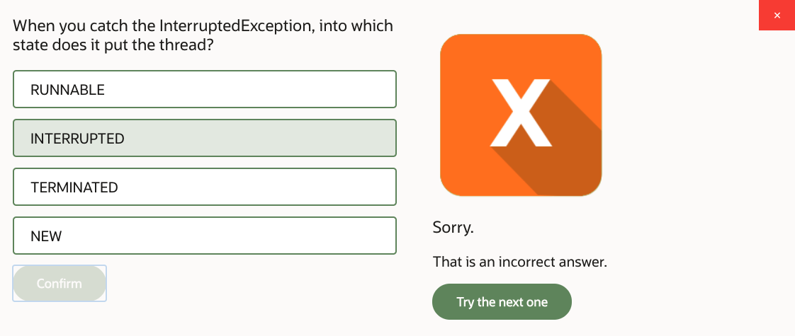
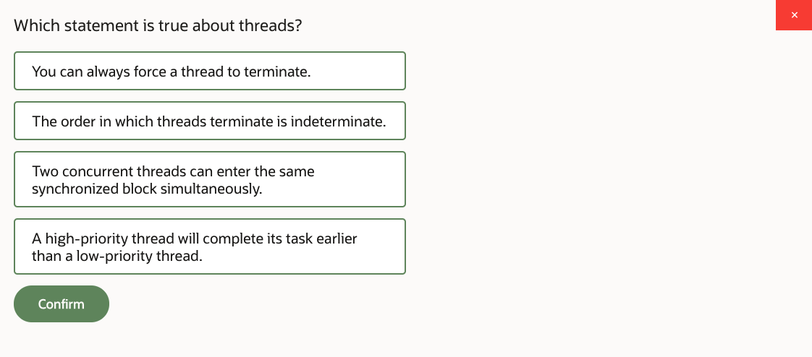
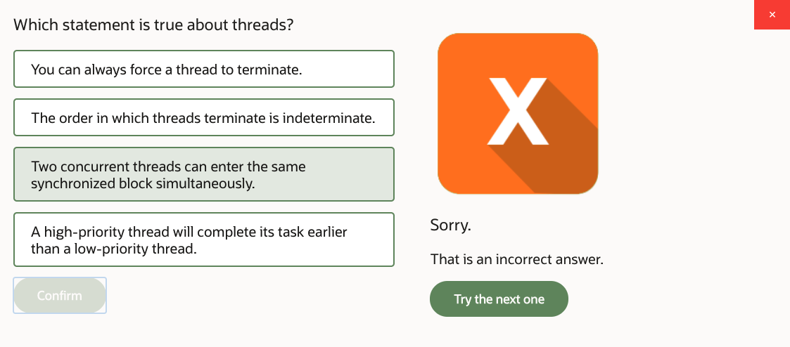
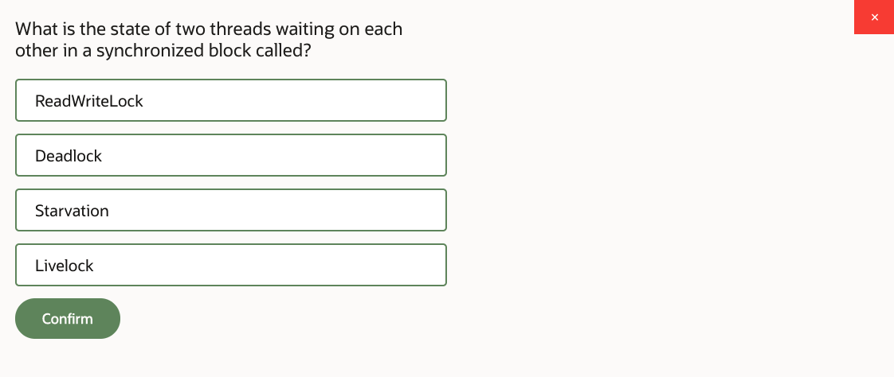
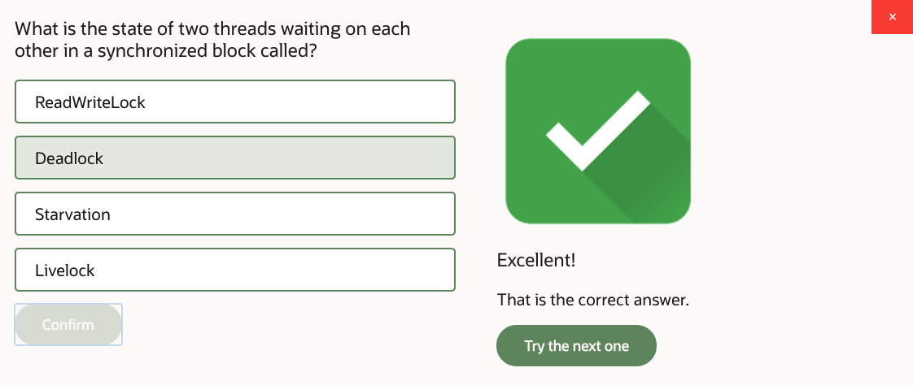
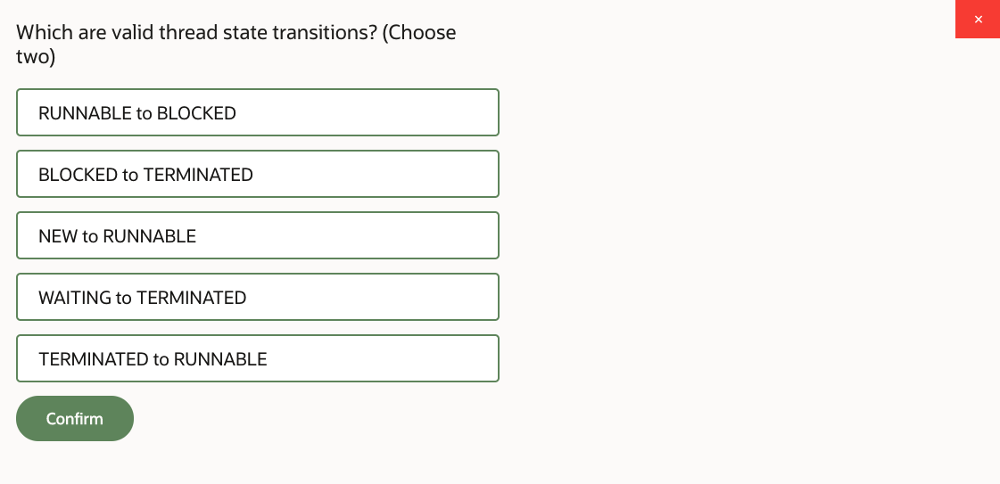
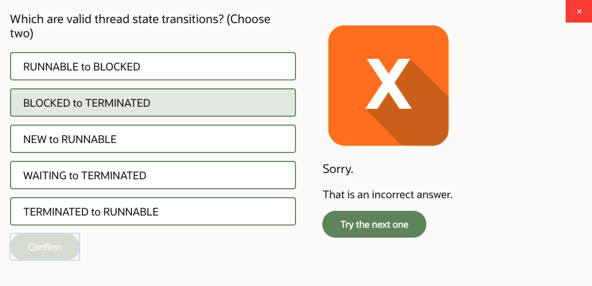
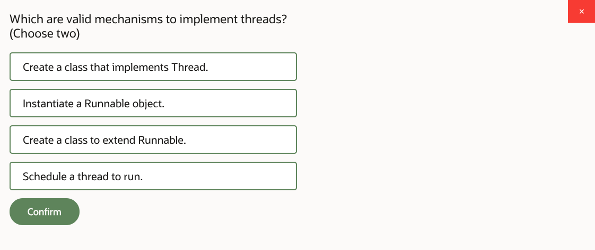
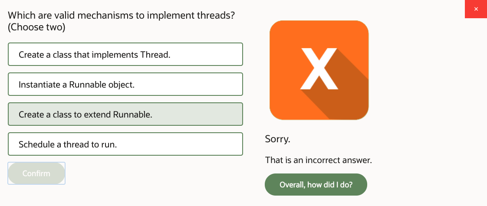

# 14: Java Concurrency and Multithreading

1. Java Concurrency and Multithreading, Part 1 29m
2. Java Concurrency and Multithreading, Part 2 New 28m
3. Java Concurrency and Multithreading, Part 3 16m
4. Java Concurrency and Multithreading, Part 4 20m
5. Practice 14-1: Redesign ProductManager as a Singleton 22m
6. Practice 14-2: Ensure ProductManager Memory Safety 25m
7. Practice 14-3: Simulate Concurrent Callers…Part 1 15m
8. Practice 14-3: Simulate Concurrent Callers…Part 2 17m
9. Java Concurrency and Multithreading - Score 80% or higher to pass

## 1. Java Concurrency and Multithreading, Part 1 29m

Java concurrency and multi-threading. In this lesson, we're looking at what multi-threading is, how it works, how to control thread lifecycle, how to control execution order, automate tasks around the execution of concurrent tasks and concurrent management. And ensure memory safety.

We will employ different mechanisms to do that-- multiple variables, atomic actions, locking. So yes, a variety of different mechanisms that we need to study that help us to properly control concurrency within a Java program. Now first of all, let's start with some concepts.

So what's concurrency, what's multi-threading, how it all works. Thread in a Java program is an execution path. It may involve a series of different method calls, and you carry out whatever business logic you need to carry out within a given thread.

Your main method, technically speaking, well, that's just a thread. But then you can start all the threads from within method main-- launch other threads if you need to. Each thread can be an object that basically is an implementation of a runnable interface. So imagine you created some class that implements runnable. And runnable interface describes a single method run, and that's where you put your thread actions.

However, what you do, you don't call method run directly. Instead, you wrap up runnable object into an object type of thread. So pass runnable into the constructor thread, and then ask thread to start. So what will happen then is the thread scheduler will try to execute the method run, but it will do it in a separate thread from that one other method main. So method run will be executed at a different thread.

What it practically means is that the thread scheduler will try to allocate a portion of CPU time-- a time slice-- to execute the actions of your method run. Of course, you may have a machine with multiple CPUs, so it's possible that there's some degree of hardware capability of actually executing different things at the same time.

But even though you may have like you know multicore CPU and there's some degree of hardware parallelism, you still need to realize that you may launch more threads than your physical hardware parallelism level allows to carry out. In which case, what will happen is that threads will start to do kind of time sharing. So there will be a portion of time-- allocated to execute logic of a run method of one thread on a given CPU core, but then it will have to yield to another thread, so another portion of time will be allocated on a CPU core.

And they will kind of have to take turns. That's why concurrency doesn't necessarily mean actual physical parallel execution. So the degree of physical parallelism depends. And of course, you need to remember your Java program isn't the only piece of software running on that machine.

There might be other programs, there might be the operating system itself. So certainly, the CPU cores could be doing other tasks which have nothing to do with your Java program, per se. And you kind of have to time share the segments of time on your CPU to carry out your logic.

Therefore, how exactly one thread will be allocated time on a given CPU core and in which order threads will actually perform their actions is really not predictable. This is the stochastic process. If a particular thread has been launched earlier than another, it doesn't mean it will finish earlier. We just we can't predict that, we can't guarantee that.

It's all the balance of probabilities, because we don't know how physically, the time slices will be allocated on CPUs because we are not in control of this process. And frankly, nobody is because even a thread scheduler in Java has to yield to other OS tasks that also need to grab the CPU time.

Generally speaking, what I'd suggest is a good analogy for what we're trying to do here-- how to envisage what that process feels like. Think about it this way-- it's just a comparison, really. Think about what you do in a method run-- the logic that you write in a method run-- it's like you want to travel from one place to another.

This is your algorithm. You carry out a series of actions inside a method run, and you say and I want to travel from A to B. So this is my route, this is my path that I would like to take. So that's the logic of the method run.

Now what the thread is-- a thread is like a car in which you will travel. So you have your route, you know where you want to go, and then you take a thread to actually physically drive-- you progress down that route. And exact same route, exact same logic of a run method can theoretically be passed to multiple different threads like with different cars traveling on the same general path from A to B.

So you're asking the car to start, and you start driving. However, what you need to realize is all of these threads, all of these cars, have to share the same physical roads. So your CPU cores are like physical roads.

You don't build a road per car. That would be rather expensive. So each CPU core can accommodate basically that much traffic, and then your car's basically have to yield to each other. We say that cars drive on road simultaneously, don't we?

But in reality, do they really? I mean, two different cars can't occupy the same physical spot on the road at the same time. Well, that's known as collision, and rather be avoided. So the exact same thing happens in a CPU. You can't put two different pieces of logic from different threads to take the same time slice on the same CPU core. That's kind of impossible to have to yield to each other.

Overall, the program has a chance of actually achieving more by loading the CPU cores with different tasks, and exploiting the fact that you actually have multiple CPUs or CPU cores. If you program will be single threaded, it will never take advantage of any CPU core but just one.

But of course, if you created multiple threads, now you can exploit the fact that you have these different CPU cores-- you can load them with processing. But it still doesn't mean that all of the processing actually physically happens at the same time. So there's some degree of parallelism, but it depends.

So that's just the general concept of how concurrency functions in Java. Now let's take a look closer at how you implement the actual thread. So first, and probably the most common practice here, is to implement runnable interface, override method run within which you explore what it is that you want to do, what should be the logic of the thread. And then create a new instance of thread, and pass your class that implements runnable object-- that implements runnable to constructor of the thread. And then ask the thread to start.

This is kind of the most common obvious practice. However, thread class itself actually happens to already implement runnable interface. So the alternative is that you can create your class that extends class thread. Because thread implements runnable, that means your class sort of by proxy also implements runnable, because it kind of inherits that from a thread.

And you can override method run, and you can create an instance of your class-- well, in this case it extends runnable, and thus extends thread, and thus implements the runnable interface. And then you can start your thread. But the problem is this is rather inflexible design.

Remember what was the comparison I gave you on a previous page. I was talking about the run method being the route, and a thread being a car in which you take that route. So you're kind of hard coding the route with the car now. You're kind of saying that this car can only drive on that route.

So that's not particularly flexible. When you have a separate class that implements runnable interface, you may create an instance of that, and then decide to pass it onto different threads. Start that route multiple times-- launch that algorithm multiple times.

But here, every time you do that, you actually have to create a new instance of your class because each one of these will be a separate physical thread object. Whilst in the common practice scenario where you implement runnable interface, you can theoretically just create one instance of your class, and then just pass that one instance to multiple different thread constructors.

So you wouldn't have to duplicate that lateral object in memory. So there you go. By the way, the name of the class is completely irrelevant, so you can call it whatever you like. And finally, runnable interface happens to be a functional interface. [INAUDIBLE] has just one method run-- abstract method that you need to override-- run. That's it.

So can you implement it as lambda? Yeah, you can. So you can create a lambda expression and, well, that's just the same as really implementing runnable interface. So for example, if you have a very small amount of actions you want to perform-- you don't want to create a full-blown class out of runnable.

There's just something that you want to launch has another thread, but that's not a massive amount of code, and then you can, I guess, just embed it into the lambda expression, and pass it to the thread, and start the thread. So these other ways of actually physically writing the code that will implement the logic of your thread. Now how to control thread lifecycle? So thread could be in these different states-- new, runnable, blocked, waiting, timed_waiting, terminated.

These are the possible states in which the thread can be. Transitions between the states are pictured on this page, and what you need to realize is that these transitions, how you can go from one state to another, are essentially limited. You can go from whatever state to runnable both state, and from runnable state to whatever other state except new.

So new could go to runnable, runnable can go to any other state. Any other state can return back to runnable-- well, except terminated of course, because when you terminate the thread, that's it. You're not running anymore.

So for example-- what it means. If you want to go from, let's say, blocked to waiting state, just for sake of argument, then you have to transit through the runnable state. So suppose I'm in waiting state, then I want to go blocked, so I need to go waiting, runnable, runnable, blocked. That's the transition.

And when eventually, your thread finishes whatever it's doing, I suppose you'd get to the terminated state, so from there, you cannot really return back to any other state. And before you launched anything, the thread is considered to be new state, so it's not yet running, and it first needs to transit to the runnable state before you do anything else. So runnable is like a key state of a thread, which basically means it's currently doing stuff.

That's runnable state. It's currently executing some logic. Also you need to realize that all of these actions are not executed with a precision of like a nanoseconds. No, no, no. When you transit from one state to another, what you need to realize is the thread scheduler has to find a time slot for your thread to do things on a given CPU core.

And if you're CPU cores are extremely busy, if they're doing stuff, well, there might not be a chance for your thread to do something right now, so there might be a small delay whilst the thread scheduler looks for the next available slot of time on a given CPU core. So there's some kind of small delay that may happen.

But generally, that's kind of the plot of how you can transit from one thread state to another. We'll obviously we'll have to look at the code closer, but so far, the example goes like this. You have an implementation of runnable-- in this particular case, some lambda expression, but as I said, it could be a class.

And then you take this runnable object, and you pass it to a couple of different threads. So apparently, you can share one runnable object, and then physically launch it several times. So one algorithm which you want to launch multiple times in parallel-- we could do that.

You call the start method, and that puts the thread into the runnable ball state. So from new to runnable. That will happen after you invoke the start. Now you can check if the thread is still running-- is alive. Because when it gets terminated state, well, then it's not alive.

But otherwise, it's still alive. It might be temporarily blocked, it might be waiting, but it's still alive. So until you get to the terminated state. And then if you want to find out which specific state the thread is in, you can call the method get state and find out what's going on-- which current state it's in.

Although you need to realize that by the time you get the information about the state, things could have changed, and the thread could then go to another state. So when you call get state, you would know what the state thread was in at the time when you made that call, but because of the parallelism behind the scenes, the state could have changed since then. So you're kind of getting information that is not exactly necessarily up-to-date.

Anyway, lastly, what you can not do-- if you started a certain thread, you cannot start it again. So you cannot go from runnable to runnable again. That recursive transition is not possible. So you can go from new to runnable, but not from runnable to runnable.

And I suppose it's kind of not really a problem, because thinking about it, you can just create another thread, right? And use the exact same runnable object, pass to the constructor to yet another thread object, and just start another one. So if you want to start another thread, sure, you can do that. But it has to be another thread. You can not double start the same one.

So next, we will take a look at specific transitions. And the first transition I would like you to consider is a transition that takes the thread from runnable state to some other state, like terminated, for example, or I don't know-- timed_waiting or something like that. So going from runnable to some other state means that you interrupt the thread.

And a good example of thread interruption is certainly termination-- interrupt and stop doing whatever you're doing. You may think from some perspective that putting thread temporarily to the waiting state is also considered an interruption, because your thread is currently not really doing anything. So it pauses for some time, or pauses indefinitely, whatever. But it's not currently runnable.

Now how do you actually control that? You can tell the thread to interrupt. There is a method you can call upon a thread which says, OK, I'd like you to interrupt. And nothing is going to happen when you call that method.

You have to code the reaction to that call within a thread itself. You have to decide what you want to do when you receive an interrupt signal. To write that logic, within a runnable object within run method-- so remember, this lambda expression implements run-- what you do is that you get current thread-- thread dot concurrent thread. And

Then with the current thread, you check if you receive an interrupted signal. And you can do it periodically. You can write a while loop and just sort of check, did anybody ask me to interrupt? Next cycle, did anybody ask me to interrupt?

So check that interrupted signal. And so you can loop, and you can keep checking that. And if you receive that interrupted signal, then you decide what you want to do. And basically, think about it this way. If you reach the end of a run method-- you got to the end of the run method-- well, that's it.

Then your thread is done. It's over, it's terminated. So if you have a while loop, and then your thread actions are inside that loop, and then you're checking the interrupted signal, and when you receive it, you decide to exit the loop, if there's nothing else the thread is doing, really, then you just got to terminated state.

So I guess you can simply return from the while loop-- break from the while loop, and return from the method when you receive the interrupted signal. And that terminates the thread. But unless you code that logic, nothing's going to happen.

You can call the interrupt method, but nothing's going to happen. You actually have to decide what you want to do when you receive the interrupt signal. Now do you have to terminate the thread at that stage? Do you have to return? Do you have to break out of that loop?

No, you don't. You may, but you don't have to do it. So you may decide that you interpret the interrupted signal in a different way. You may interpret that as a temporary pause rather than as actual termination. Talking of temporary pause, there is a method sleep that you can invoke, and you can specify an amount of milliseconds-- so 1,000 is a second basically.

So you could put the thread asleep for a period of time. That's timed_waiting state. So we are saying to the thread, well, just don't do anything for a while. However, the sleep method can potentially throw you and interrupted exception. That's very interesting.

Think about it this way. When you are running state, you keep going through this loop. And when you're actually running, there is a possibility it will check for it's interrupted signal. Your logic is executed, and sooner or later, that check will be performed.

But when you're sleeping, your thread is not running. It's asleep, it's in timed_waiting state. So is it currently when you sleep and perform any is interrupted checks? No, it isn't, because it's asleep.

You're not progressing through the algorithm. You're not doing anything. So if, at the point in time when you were actually asleep, somebody calls an interrupt method upon the thread, what happens then?

There is no possibility that your is interrupted code will be invoked because you're not running it. And that's why the sleep method at this stage will be interrupted. So if an interrupt signal arrives at a time when your thread was asleep, the sleep method will interrupt the sleep, and will throw interrupted exception.

But that's what you do to interrupt the method execution-- you throw an exception. So you can catch that, and then you decide what do you want to do. So essentially, inside this catch block, you are reacting to an interrupt signal pretty much like if you were checking this interrupted condition. It's the same idea.

And surely, you may take again the decision-- what do you want to do? You receive an interrupted signal, but that doesn't mean you have to exit. You may break out of that loop and return from the method, or you may decide not to. That is your choice. How your thread reacts to the interrupt signal is your decision.

And so hopefully, you now understand why there are two types of checks that you perform. You're checking whenever you got an interrupted exception. If your thread is not currently run or running state, that's the only chance for you to know that somebody sends you an interrupt signal.

Or you just check is interrupted method. If the thread currently is in a running state, then you know somebody sent you the interrupt signal. If you do neither, then the thread does not react to interrupt signal at all. Now you can block the thread. First, you need to select a monitor object.

A monitor object, think about it as kind of a traffic light. So your thread goes to the monitor object and turns it red. Literally, your thread itself turns its own traffic light on.

So your thread says I want to be blocked, and turns the traffic light red. What is that monitoring object, what is that traffic light? Well, it could be class, it could be could be current object instance, or it could be any other object you just select-- you can arbitrarily select whatever object you like.

So class, current object, or arbitrary object. These are your choices. To enter the blocked state, you use the synchronized keyword. If you apply that to an instance method like this example-- public void, synchronized a-- that will put the a method, potentially, in a blocked state against the current object-- against this.

If you're doing it on a static method, that will allow you to use a class as a monitor rather than a current object. So it'll block your thread against the overall class. And finally, if you just call some method that doesn't have a synchronized keyword inside that method c, you may have-- or when you call the method c, for example.

When you call the method c, or inside of method c, you may build a synchronized block, and then you may choose any object you like which is not necessarily current-- it's just arbitrary object-- whatever you want-- as the monitor object. So synchronized block of code where an arbitrary object is used as an argument. That basically means you're blocking against that particular object.

Now what would be the runtime reaction to this code? So imagine you're running multiple different threads, and they could be different instances of that some class, for example. If these threads are associated with different instances of some, and you use class-- so synchronize against static context-- then all those different instances of some will be blocking each other against the class itself. Because remember, class context is shared between all instances.

If you choose a current instance to be your monitor, then each instance of some will have it's own monitor. So they will not be blocking each other. However, if you launch more than one thread using the same instance of some, in between these threads, they will be blocking each other when they are using current object as the monitor.

And finally, if you choose to use any other arbitrary object as your monitor, then whichever threads approach that particular object instance will be blocking each other. The reaction to blocking is pretty simple. If two or more threads approach the part of the algorithm that is synchronized against the particular monitor, if these threads are actually sharing that monitor-- in other words, if they are on that class or if they're sharing that object-- then only one thread will be allowed to enter the synchronized block.

Whichever one got there first. And then the next thread that got to that synchronized block will have to wait-- will be blocked waiting for the previous thread to complete execution of a synchronized block before it can proceed. Once the thread exits, the first [INAUDIBLE] exits the synchronized block-- completes the synchronized method-- that would signal to any other thread that's currently blocked against that same monitor that it can proceed.

So if you select, for example, a class as the object monitor, then any thread that uses that particular class entering this static synchronized method will block. It doesn't matter. If you choose the object as a monitor, then only those threads that share a particular object, they will be blocking each other.

And threads that are using another instance of that class, they will have their own monitor, and they will block each other, but not the first group of threads. So you may group them, basically. It's as simple as that.

You may decide which kind of units of synchronization you need. So that allows you to control, to a degree, the order of execution. Because we discussed that already-- the order of execution of threads is actually stochastic, so you cannot really predict it. But when threads enter a synchronized block, well, they have to do it in order. Only one thread can pass through the synchronized block at any given point in time for a given monitor.

## 2. Java Concurrency and Multithreading, Part 2 New 28m

Now let's try to make thread wait until notified. That could be an indefinite or timed waiting state. So what is happening here is that we're trying to control, again, the execution order. What we're trying to do is to put a thread into the state where it just suspends itself. This could be achieved using method wait, which allows you to suspend your thread, potentially indefinitely, until it is awakened by another thread.

Or you may use an overloaded version of the method weight, which allows you to specify time out. Which would allow your thread to resume even if it hasn't received a signal from another thread to wake up. Either way, the important point here is that a thread can use the method weight to suspend itself. In this waiting-- or time waiting state, thread is just not doing anything.

Think about it this way, it's a bit like you get to the crossroads and you turn traffic light red, and you're waiting for somebody else to get to the same crossroad and turn it green for you. This is what the waiting state feels like. You stopped and you're waiting for somebody else to turn your light green. So let's take a look at the mechanic of how the actual method weight works.

We'll start with electing absolutely any object-- could be anything-- as your traffic light-- as your monitor object. So any object that would be your monitor-- could be anything. Then you build synchronized [INAUDIBLE] against this object-- against that monitor-- and then you invoke method wait upon that object. So your thread there waits against that traffic light. Calling method way turns the traffic light red-- lovely. Then you are now in that waited state.

Now some other thread somewhere else may take the same monitor object, same instance, and, again, in a synchronized block, invoke method notify. Or you could call notifyAll, notify or notifyAll. Methods notify and notifyAll will cause this thread, or multiple threads that are waiting against a given monitor to wake and transit from their waiting or time waiting states.

So note that it has to be done in a synchronized block. It needs the same monitor in order to be able to wake up that thread. Now the idea is that if you may have multiple different runnable objects that are waiting against the same monitor. Not just this thread, but another thread also waiting to use the same monitor. So they're all blocked against the same monitor.

And there could be a call to the method notify, which will stochastically chose and notify just one of these threads and tell it, OK, you can now resume. But if you call method notifyAll, then you will be waking up all of the threads waiting against that monitor, right?

So they will all be allowed to resume their execution. Waiting or timed waiting states can also be interrupted by an invocation of a dropped method, potentially. And this is why when you call a method wait, you have to catch the interrupted exception because, potentially, that's another way in which the waiting or timed waiting state can be interrupted.

OK. So that's the idea. The wait notify mechanics allow you to exert some degree of control over the order of execution. What do you want a thread that pulls itself against a given monitor and then other threads to tell it when to wake up. However, there is a nuanced difference in the way threads transit from waiting and time waiting state back to runnable state.

So depends how did you place the thread into these waiting and time waiting states, and then that would affect how you transit back to the runnable state. So earlier we've seen an example, use a method sleep, well, actually there's an example here as well. Yes, so method sleep that allows you to suspend the thread for a period of time.

When timeout of the sleep method is over or thread is interrupted, it just transmits from the timed waiting to a runnable state. This is what we've discussed before, we should know that. But apparently there is a little bit more to this when you're transiting from waiting or timed waiting states using the wait notify mechanics. So let's take a closer look at these transitions.

Let's assume you place your thread into a waiting or timed waiting state using methods wait, with or without timeout parameters. So next, you want to wake this thread using notify or notifyAll methods. Apparently in this scenario, there is a short period where the thread actually goes into the block state first just before it goes into the runnable state.

Usually it's a very brief period, and may even go completely undetected even if you constantly pull for the thread state using the getState method. So this is indeed very nuanced behavior, which is all often ignored. Basically, because, logically, you're invoking notify or notifyAll methods to put your thread into the runnable state, that's what you want to do.

And that brief transition through the block state, it's just a side effect of a wait, notify method mechanics, the way they're actually implemented in Java. Yeah, so just to note that technically there is this extra transition going on under the hood, although logically, you're just transiting to the runnable state in your program.

Working with common thread properties. A thread could be given a name, if you like. [? It's just ?] name, call it my thread, whatever. Yeah. OK, what else? Threads do have unique IDs, so you can get the thread ID, which is the number basically. So you could do custom naming, but it has an ID anyway. Thread could be declared as daemon or user. User thread is default.

What's a daemon thread? Well, what's the user thread? OK. So when you launch a thread, by default, it's considered to be user thread. And the rules go like this, if at least one user thread is still running, then the overall Java virtual machine must not exit. So your method main is a user thread, whilst the method main is running, your Java virtual machine is still running. But think about it.

Now you launched another user thread, you get to the end of the main method. That's it, you got to the end, but your Java virtual machine does not exit. It's still running, it's still running because there's another thread that's still doing stuff, right, and it's your user tasks that you were doing. However, if you launch a daemon thread, that's as simple as just saying, setDaemon true, right.

So launch a daemon thread, that thread may still be running, but when all user threads finish, even though the daemon thread is still running, Java virtual machine will just exit. So setDaemon basically means you're telling Java virtual machine, don't wait for this one, if you need to exit, exit. If all other user threads came to completion, that's it, you may terminate.

So this could be some kind of a background task like, I don't know, background logging or whatever. So something that isn't carrying out the primary business logic of a program, but some kind of utility or service task running in the background of your program. And if all other tasks that your program is supposed to complete are over, then you just happy to terminate and you don't wait for this one to complete, you terminated and that's that.

And you can always check if the thread is daemon or not, yeah. There is also concept of a thread priority. A priority is a construct which allows you to attempt to control the size of the time slice given to a thread on a CPU. So the thread with a higher priority, presumably, will get more CPU time than a thread with lower priority.

Why did I just use the word presumable? Well, because it depends on your platform. There are platforms where the priority can be controlled with 10 degrees of priorities, one is lowest, 10 is highest. Yeah. But then there are other platforms that don't have that level of control. Not every platform can actually distinguish 10 levels of priorities. So there are cases where you can set priority three or set priority four and there is no difference at all.

And anyway, you have to remember that even with priorities you cannot guarantee the order of executions. Because you never know, your CPU could be busy doing something else and it's just like you driving a car and you get into traffic, there is little you can do about it. Your CPUs busy doing other tasks. So even if you tell your thread, oh, you're a high priority. Well, yeah, but what if some other action in the operation system takes over your CPU?

Then it doesn't matter. You still don't get your time slices, right. So it's all probabilistic, you have a chance to get more CPU time, but would you actually get it? Maybe, maybe not. And finally, there is this useful utility method called join. Now, you can do what the join method does without actually calling method join with a fairly intricate way of doing that.

With basically blocking one thread until another one finishes, right. And then you join that same execution path. But obviously, doing all that wait and notify and synchronize blocks might be a handful. So instead, you can simply say, I've got this thread and I want to wait for another thread to complete whatever it's doing, and then just continue after that. So that's the join method for you, yeah. Wait for another thread to terminate and then you proceed, right.

That allows you to put threads in certain order, to a degree, right. So you can control the order that way by just queuing your thread after another. OK. Now, even though all of these thread maintenance mechanisms are available for you and allow you to control the thread lifecycle, you may quite, obviously, find them a handful to code.

So there's a set of classes that help you to automate this process. They're called executors. You'll find them in a java.util.concurrent package. And what these executors do, they organize threads for you so you don't need to write this low level code that attempts to start, pause, and control threads, and pass execution from one to another. Executors automate that.

So what are the executors? Well, you can create various executors using a class called executors, and create an ExecutorService objects. So what are they, right? Fixed thread pool, this one allows you to define a pool of threads and reuse them. So you can assign your runnable tasks for example, to the fixed thread pool, and you say how many concurrent threads you like to have.

And then it will just execute your runnable tasks using these threads. It will organize the whole assignment of the task to the thread, and the whole controlling will be done. Next one, work stealing thread pool. It maintains the pool with a given level of parallelism. The idea is that you are saying, I would like certain level of parallelism to be achieved.

I'll give you some tasks to perform, and if one task finishes earlier then please take the resources that that task was using, like that particular CPU core, and reassign it to be used by another task, right. So by another thread. So the work stealing thread pool will circulate your logic around different CPU cores to achieve a given level of parallelism.

Single thread executor, just create one thread. Cached thread pool allows you to create new threads as needed, or reuse existing threads. So you basically precreate a number of threads and you assign whatever job you want them to do to that pool. Scheduled thread pool allows you to execute your tasks with delay, or periodically, or both, actually.

And there's a variant of that which is called single thread scheduled executor, and that's doing the same thing, but just for one thread. So you can do it for the pool, you could do it for a single thread. So for example, if you need to periodically do something, that's the way to achieve that. Now what's an unconfigurable one? Unconfigurable ExecutorService allows you to take any other one of the previously defined executors pools and freeze its configuration.

So basically, it allows you to say, oh, I have a fixed thread pool or have work stealing thread pool, whatever it is, yeah. A set of properties, and then wrap it up into the unconfigurable ExecutorService object, and that will freeze the properties. It will not allow you to change them afterwards. So it's kind of precaution so you wouldn't accidentally mess around your own configuration.

Anyway, so here's an example. We have this runnable task, again, that's just a lambda here, but obviously it's something that implements runnable interface. You decide what actions you want to perform. This example starts scheduled thread pool, and we decided we want the pool of three threads. Why not. And then I would like that runnable task here, yeah, to be scheduled at fixed rate. Right.

So there are different ways in which you can do it, and one of them is fixed rate scheduling. And the parameters here define that the task is to be executed every 5 seconds, with initial delay of 10 seconds. OK. You don't need to worry about calling method start, wrapping it up in a thread object, doing all of these wait and notifies, that's just done. Yeah. So that's so much easier, that's an automation.

You still need to appreciate what's going on behind the scenes, you still need to understand the stochastic mechanics of thread scheduling. The fact that, well, it has to find a time slot on a CPU. And you have to be respectful of how well that is organized. So that means you need to know the mechanics we described in the first part of the chapter to be able to successfully write these logic here inside a run method.

But then the controlling part around it, well, that would be done for you by the ExecutorService, which is quite nice. And then finally, what I'm doing here is I'm freezing the configuration. I'm just taking my scheduled ExecutorService and wrapping up in the unconfigurable ExecutorService, yeah. So from that moment onwards, I wouldn't be able to change its properties. So freeze the properties. Let's take a look at further examples.

This is a holistic example. I've showing you the entire lifecycle of the ExecutorService. Just because, there's no particular reason, instead of the previous example, which was scheduled ExecutorService, I'm using fixed thread pool service on this occasion. Just to show you that this is that easy. You can just pick the type, yes, executors, which type of service you want to create.

So this time we're doing a fixed thread pool. Then imagine I've got this runnable component, yeah. And again, I'm just doing it as a lambda expression here, that's a runnable object. Write the logic whatever you wanted to do. And what I want to do is launch it 10 times. Oh, well that's interesting. Because my thread pool is just a three threads, and yet I asked 10 runnables to be allocated to that pool, right.

So 10 runnable objects, run them within that thread pool. And it's just three threads. Well, that's not your problem. It's the problem of the ExecutorService. It will have to time share. It will basically have to do three at the time, and it will do three at a time. So it will grab whatever tasks you gave it and will start executing them. And as the first one finishes, then it will be able to bring in-- so it brings in first three, right?

Then if one of them finishes, it brings the fourth, and on and on until it exhausts the 10 instances of the runnable that you asked it to process, basically. So just pass them to the execute method and that will take care of the rest. To stop accepting new tasks, you can call shutdown method upon the executor. So that basically means, that's it, not accepting any further assignments.

And then you could define a grace period for the executor to actually finish whatever you've assigned it to do. So that's called awaitTermination, right. OK. And eventually when you want to shut down that ExecutorService completely, you use the method shutdownNow. So once again, shutdown does not really shut down. shutdown just stops excepting tasks, it's a very misleading method name, but hey, such is life.

And shutdownNow actually terminates the execution. And I guess you want to give your ExecutorService some kind of grace period, just allowing it to complete the job first. And then, eventually, if you've got any outstanding threads that are still running, maybe they're stuck or whatever, you can just shut down that entire ExecutorService. Now, on this page you also have another interesting example right at the end here.

So when you are handling a call like awaitTermination, you can potentially get an interrupted exception, because you're waiting for something to happen. And if your thread that's currently awaiting termination, not these threads that you put in ExecutorService. No, no, no, this one that tries to control the ExecutorService. It goes to sleep, essentially. awaitTermination means, internally, there is a code that puts the thread asleep, well, for 30 seconds in this case.

So that means that it can throw you an interrupted exception, because somebody else may send you an interrupt signal whilst you've been in that awaitTermination sleeping state, right. So it's essentially timed waiting. OK, so what happens when you get the interrupt exception? Oh, you decide what you want to do. Maybe you want to shut down the thread pool right now and not wait for completion, I don't know, depends.

But there is another interesting piece of code here, which is doing this, get me the current thread and repropagate the interrupt. Apparently this is what you can do. When you receive an interrupt signal, you may react to it and then you may propagate it again. You may say, OK, continue the interrupt signal. Because you may have multiple levels of different code blocks.

And in some level you receive an interrupted signal, but there might be outer levels where your thread might still be waiting for things. And of course, if you reacted to the interrupt signal on one level, that's not automatically propagated to any other levels who may explicitly say, just continue repropagating in the interrupted signal and signal to anything in that thread that the interrupt has been received.

But that's up to you. You don't have to do it. It depends on the logic on the scope of that interrupt signal that you want to achieve. Right. Now, we've seen so far how we can implement threads using runnable interface. Well, actually we have an alternative. So runnable gives us the method run, which is void method. And you can all, obviously, implement runnable interface, override that method, and tell your thread what you want it to do.

Alternatively, you can implement callable interface. Which gives you a method call, which returns the value, so it's not void. Apart from returning value, the logic of call is basically the same as the logic of run. There's not much difference at all, but as I say, it returns the value. So dependent on what you want your thread to do, do you want it to be like shoot and forget the task, then you implement runnable? Or do you want it to be tasks actually derives something and returns it to you?

Well, then you probably want it to be callable. OK. However, you obviously need to realize if you launch a parallel execution path, you know, concurrent thing to happen somewhere. Then you can't really tell when it really produced the result, right? The call method, yeah, OK, you can trigger it to run in another thread, but when would that thread finish? When would it return you the value? Well, that's anybody's guess, right.

We didn't know, it's stochastic by nature. We figured that out already. So there is an interesting trick you can play. The value returned by the call method is wrapped up in the object called future. The way it works is that when you submit the callable object to the executor, so you tell an executor, go and execute that callable, right. Submit method returns you the future object immediately.

That thread hasn't produced any response yet. It did not return anything from the call method. It probably hasn't even been launched yet. You tell it to submit and then it has to go and find the time and a CPU to actually execute logic, and then it will start execution. But you get in this future object immediately, before any of the actual execution happens. And there is nothing inside that future object at that stage, it's empty.

You're using the generics to describe what sort of return value you expect. So it's basically what your call method is supposed to return, right. You send callable of string. So that's your generic and a call method then returns string. It doesn't have to be string, it could be any object, it doesn't matter. And then your future object will basically say, OK, I'm expecting a string to be present there, right. So whichever type you expect.

And you get the future object immediately. And there is absolutely nothing inside, it's a box that's empty. But the thing is, you're not waiting for submit method to do anything. You continue after that. So when you got this future object, your algorithm just continues. Whatever the submit method is doing goes its merry way, and you go your merry way. And you're doing these things concurrently.

Some time later, you may wonder if the result has been produced. I doubt you want to do it immediately. You don't want to do that result.get on the next line of code, because, well, it's probably not yet ready. So that means before you try to do the result.get, think about it, you may do something else. You may do all the tasks, you may perform other actions.

And eventually when you feel like it, you say, OK, let's check if the result is actually been placed inside a future object, and you call method get. If the result hasn't been produced yet, the method get will block your thread. It will be waiting, basically. So you may describe a time period for how long you would like to wait for the result to be produced. And otherwise, you just call it and you say, OK, well, we're not going to wait.

There's probably some kind of problem there, yeah. So in this particular case I'm saying, get method wait for 10 seconds, and if the result is not available within that period of time, then just forget it. OK. But otherwise, you just get the value. Whatever call method has actually returned. It's a very convenient mechanism.

## 3. Java Concurrency and Multithreading, Part 3 16m

We have discussed that we can try to control the order of thread executions. We know that the general approach to multithreading to the concurrency is that we can't really predict that order. It is stochastic, because we don't know which order the CPUs will carry out their tasks. But you may try to control it. However, what you need to realize, trying to control the order of thread executions may lead to locking problems.

And these are the typical locking problem scenarios, and they all arise from one premise, from you attempting to control the execution order. You're not embracing the stochastic order in which threads are executed. You're trying to control it. It may be a requirement in your program. I understand. But you have to be aware that every time you try to do it, you're risking running into one of these typical problems.

So what are they? The first one is called starvation. You've got a block of code-- synchronized block of code. Your thread enters that block, and it stays there. What will happen with any other thread that tries to enter the same block against the same monitor object? Well, it will get blocked, right? And if it's getting blocked, then it's not proceeding anywhere. And if your code does not leave that block, then any other thread will just stay blocked.

So you literally stop your program dead in its tracks from perspective of any other thread. They're not doing anything. They're waiting for you to get out of that block. And if it takes eternity to get out of the block, if you just have a very lengthy algorithm, takes a lot of time to carry it out, well, you will experience a serious degradation in performance, because other threads won't be able to do anything. They'll be just waiting for it. Well, any other thread that uses the same a object, that synchronizes against the same monitor.

Next example is livelock. Imagine two threads that are very polite to each other. And each one of these threads is asking the other one, are you finished? Are you finished? And the other one says, oh, no, are you finished? And they kind of form an indefinite loop. It's like having two people stand in front of the door telling each other, oh, after you, no, no, no, after you, and nobody's going anywhere, because they just keep yielding to one another.

So again, that's a bit of a problem. That's always the logical flaw in the algorithm, right? But you may get to the situation if you're trying to be kind of graceful to another thread and keep checking what it's doing, and that in return is very graceful to you, and you literally form an indefinite loop here.

Well, lastly, the deadlock situation. The deadlock situation occurs when you are using different object monitors for synchronized blocks in reverse order. So for example, there is one thread that says I will enter the synchronized block against the object a. Fine. So far, so good. And then I'll enter the synchronized block against the object b. However, there was another thread that did the exact same thing, but it entered the synchronized block against b first. So that's blocked now, and then it tries to enter the synchronized block against a. But then the first thread already blocked that.

So they literally block each other. And that happens simply because they're just doing it in reverse order, right? So that's called a deadlock. And again, the program is just stopped, and it's not moving anywhere. You just stop the program, literally. Well, that's a bit of a problem, isn't it?

Here's the real problem. You will have a really difficult time troubleshooting and debugging any of these problems. That's near to impossible. And a reason why it's so difficult to troubleshoot or debug is that none of these problems may happen in the test environment.

If your workload is not high enough, if your threads are not competing for CPU time, if there's plenty of CPU time, you may never experience the issue. If you don't have high enough degree of concurrency. It's all stochastic. The occurrence of these issues is basically based on probabilities of how many threads you're running and how many concurrent actions you're trying to execute at the same time, how busy is your CPU, how many CPU cores you have, how busy they are with whatever tasks you gave them.

So you may not experience it in a test, and then it could surface in a production. And again, by looking at any given algorithm in a program on its own, everything may look absolutely fine. You're looking at the algorithm, and nothing wrong with that. It's when it interacts with another thread, with another algorithm, that's when you have a problem. So it's very difficult to trace and to find where the issue occurs.

And in some of these cases, you may not actually get any exceptions. The program just slows down or just deadlocks, and you may not actually see any obvious tangible error from it. Or the program goes into indefinite loop. There are no errors. Your CPU is spinning, and then nothing is happening, right? So you're kind of wondering what's going on. Well, hey, it could be a livelock, right?

So what's a solution to this problem? Well, embrace the stochastic nature of threads. Don't try to control the order of execution. Let them do things in parallel, concurrently, as much as they can. And try to avoid these collisions where you have to ensure that there is a certain order to the execution. That means thinking about the algorithms in a little bit different way, so kind of engineering your code in the first place not to have dependencies between threads to allow them to do things in parallel as much as you can.

Throughout the remaining part of this chapter, we'll actually try to address these problems. We'll try to see how we can engineer the program in a way that will allow us not to run into these issues. I'm not saying you will never run into them. There is still a probability that you write the code in a way that gets you there. But there are certain things you probably want to consider that will allow you to avoid these problems altogether. Anyway, well let's take a look.

So the first issue which we need to consider when thinking about controlling the order of executions is actually memory safety. So here's the thing. A heap memory, whatever you have in a heap, is potentially shared between all threads. However, each thread has its own stack.

So values that are in a stack are not visible to any other threads. Whatever you do in a stack, you can do it in parallel with others, concurrently without the threads, without having to really be concerned about memory safety or data corruption or the order of execution. Whatever you do in your stack, no other thread can possibly see. This is your stuff. It's only when you get to the objects in a heap, that's when you have to consider what other threads can see and what other threads can do.

Now, the next point is that if you-- objects in a heap are immutable. If you're just reading from them, and you don't write to them, then again, there is no issue here. Different threads can read from shared heap as much as they like. They don't really cause any concurrence issues just by getting values. It's only when you try to write into the heap memory, that's when you get a problem. That's when the order of execution becomes important.

So now we know how to isolate the problem and what we could do to void it almost on all occasions. First of all, embrace the immutable design as much as you can. Then consider creating copies of objects that will be specific to a given thread that other threads don't look at. So then you're safe to modify them as much as you like, and then you can synchronize them with main memory. But that means you minimize the impact on other threads, and you allow things to happen concurrently. So that's the idea.

Otherwise, as I say, you may run into problems because if two different threads try to write to the same memory and heap at the same time, they might corrupt that memory. And of course, if a particular thread reads from the heap and another thread writes to the heap to the same place, then because these things happen concurrently, what could happen is that you will be reading something that is half-written. So another thread writes it but hasn't finished writing it, and you're already reading that information, and you've got an inconsistent data, basically. So these are the typical kind of problems that you have to consider.

To ensure consistent access to information, you can use various tricks. And one of these tricks is use of volatile keyword. There are others, but let's start here. So what a volatile keyword allows you to do.

Here's the problem, first. Let's understand what is the-- trying to solve, what issue we're trying to solve. Look at this object here, shared object, right? So if I create a new instance of shared, where is that allocated? New shared is allocated in heap, and there s is referenced in that heap object. That much is obvious, right?

So we place the shared object in here. And then we have here some logic that says while s.y less than 1, blah, blah, blah, do whatever you need. And that's what you're doing inside your run method, which is what you ask the thread to run. There is another thread that actually changes the values of x and y and sets them to a different value.

So unless this thread modifies x or y, y specifically, and sets y to 2, then this thread, notice it's never incrementing y, right? So this thread will keep on going, keep that loop going, because y is less than 1. Well, it is 0 by default, isn't it? So unless another thread sets it to 2, this thread will keep on going.

But here's the problem. When you compile this code and when you run it, Java Virtual Machine has a code optimizer built into it. It's called HotSpot VM. But anyway, what it can do is that it can do some optimizations of the byte code at the execution time. And one of these optimizations, the Java virtual machine knows that it's kind of-- resource y is not very nice to call copy values from heap to stack all the time.

So what it will decide-- and it's probabilistic. It may decide it, maybe not. But anyway, what could happen is that it could take these values x and y from the heap and cache them in a stack of an individual thread. So that means that this thread looks at its own copy of y. It's not actually referencing that y variable in a heap. Because Java optimizer just had a thought of let's cache it locally within that thread that will run quicker.

So that means when another thread sets y to 2, actually it could be that it's just set in its own cached copy. It's not actually modifying the heap memory. So these threads are not looking at the same copy of the variable y. Your code clearly states that it's the same copy of the variable y. That's what you coded. But the realities that due to the byte code optimization, the actual virtual machine may decide to have two independent copies of variable y here and just ignore the heap altogether because it's quicker that way.

In a single threaded program scenario, that's not a problem. The fact that Java virtual machine may decide to grab something from the heap and place it directly in a stack has absolutely no effect on a single threaded program, but it always does on a multi-threaded, because then this memory is not shared any longer. So you place the volatile keyword on a variable, you force it not to be optimized that way. You're forcing the Java Virtual Machine to actually keep it in a heap and make sure that any stack representations of that value are actually synchronized with a heap.

Obviously, you just turned off the code optimization, so that means your program started running slightly slower, because it has to jump from stack to heap every time. But then when you're changing the variable y to 2, the other while loop will actually see it. Otherwise it will be none wiser. That's the problem.

And the stochastic nature of the thread still has to be raised. Because when you say y equals 2, that doesn't mean that the other thread will react to that immediately. No, no, no. It's going in a while loop, so it may take some time till the next iteration. That thread may not get the time slot on a CPU immediately.

So it will still be some time, few milliseconds and nanoseconds. I don't know. Just some kind of not immediate execution. But eventually, it will react, because you are now forcing these two representations of variable y to actually point to the same object in a heap, to the same y variable in a heap. So that's the nature of volatile keyword, basically disabling local caching.

## 4. Java Concurrency and Multithreading, Part 4 20m

What's an atomic action? Well, an atomic action is an action that you can perform within a single CPU cycle without being interrupted. So something you could do without being interrupted.

The problem is that most of the program actions are not actually guaranteed to be atomic. Even something as simple as arithmetic, like plus, plus, minus, minus, or whatever arithmetic operation. Even they're not guaranteed to be atomic.

A classic example-- think about a 64-bit variable on a 32 bit CPU. Well, you may encounter the 32 bit CPU. Well, Java is cross-platform, so it can run wherever. And there's no way you can do that in one take. You have to split the number into two, you have to perform the operation in two parts of the number, and then you have to combine them.

That potentially could take a certain amount of time. And you never know-- maybe your thread halfway through this action ran over the allocated time slot on a CPU, in which case, well, it will be interrupted.

When it will resume again, it will just continue from the point where it was interrupted. That's fine. So you action will eventually complete correctly. But what's going to happen in between the point in time when your action was interrupted and the point in time when the thread resumed?

What if another thread looked at that value? Oh, then you're in trouble, because who knows what that value currently looks like because it was halfway through the modification. So how to solve it?

Theoretically, you can write synchronized blocks around any such code, and then when one thread enters synchronized block, any other thread cannot enter there. But if you start doing synchronized block around every arithmetic, rest assured you're kind of almost guaranteeing the deadlock. It's a matter of just when you will code to that.

So that's probably not a very bright idea, and you slow down your program incredibly because you're causing all the threads to wait for each other. Is there a non-blocking way of achieving the same thing? Well, yes. If you will ask the thread to create a modification not in the main memory, but in a local cache.

It's almost opposite of volatile. Let's take a value from the heap, create the representation of this value which will be local to a particular thread so no other thread can look at it. Then you can start modifying it. If you get interrupted, OK.

[LAUGHS]

Nobody else can see what you're doing. Eventually, you resume, you complete your operation, and then the memory can be synchronized with the main memory. So from the perspective of any other thread, the action appears as if it's not interrupted, as if it was complete.

Although, internally, maybe it was interrupted, maybe it wasn't. You don't care. That's the point. And to achieve that, you could use special variable types. Remember wrapper classes like Boolean, integer, long, blah, blah, blah.

So you've got an equivalent for each one of these, and actually for generic reference as well for generic object. They're called atomic. AtomicBoolean, AtomicInteger, AtomicLong, AtomicReference. And basically, they give you methods that allow you to perform modifications of values.

So you call methods such as, for example, increment and get. And that's a set of plus plus basically. So you have methods that are equivalent of relevant operations or relevant operators. And when you call these methods, they are acting as atomic actions.

They guarantee that no other thread will see your data halfway through the modification. And you are achieving that without writing synchronized blocks. How cool is that? And it's not really difficult to do. It's just that when you have the shared data, you have to consider that anything that you do apart from probably very basic assignment, which is likely not to be interrupted.

But everything else is probably incorruptible, in theory. So there you go. Now of course, you can use the synchronized blocks to control the order of execution. We talked about it before. Synchronized blocks are known as intrinsic locking.

Now what I would like you to look at in this particular example is a practical aspect of the synchronized block-- what it would feel like in real code. So imagine I've got this array list, and I want to be able to add things to that list from different threads concurrently.

Well, you can't with a normal array list just start adding things from different threads concurrently because that's a shared memory. The add method is definitely not an atomic action, so you will be putting things into that array list, and there will be a high degree of probability that two different threads will attempt to put things at the same slot in that list, because when one thread was putting things, another started putting things as well.

The index within the array list hasn't been incremented yet, and then you just corrupt the memory. So you can create a synchronized block, and only allow one thread at a time to enter that block. So only one thread at a time will be able to add things to the list.

And therefore, you guarantee that the list will not be corrupted. The only problem is you're kind of slowing down your program at this stage. You're creating a bottleneck. Only one thread can enter that block at a time, but you guaranteed the memory safety.

So that's the very simple kind of intrinsic lock that you could build. So performance and scalability are not great in this scenario, but memory safety has been ensured. Is there a better way of doing that? Well, apparently, you've got automations that allow you to automate this intrinsic locking.

Instead of using just array list, which you'd use in normal non-concurrent sort of execution scenarios, you can take that list and you can wrap it up into synchronized lists-- collections synchronized lists, and pass your normal list as an argument. And then when you add things to that list, you don't need to build synchronized block around the add method-- add, remove whatever.

You don't need to build synchronize blocks around these methods. The synchronized list will take care of that. Great. So that's an automation, isn't it? Except when you read from the list, because when you to read through that list and you read from it, because the list could be undergoing modification at a time when you were actually reading things, you don't want to read information that is halfway through being added, or removed, or changed.

So that means when you're reading from the list, you still have to build a synchronized block around the read operation when you're getting elements and you're processing them. Even though the list was synchronized, that only ensures the safety of adds, removes, set methods.

But consistency of information you're reading, that is still on you. You still have to do it in a synchronized block. So that was a mechanism that you could use to automate intrinsic locking. So fine.

Can you just do it without blocking completely? Well, yeah, you can. Wrap up your list in the copy on write array list.

The examples in this chapter are all lists, but it could be set, it could be any collection. Whatever. So anyway, it could be set for example-- CopyOnWriteArraySet instead.

But anyway, you're wrapping up your list in this case to this copy on write wrapper. Notice, no synchronized blocks need to be written, because what's going to happen is that every time you try to add to the list, or remove, or modify the list in any way, a copy will be created which will be specific to your thread.

Each thread will get its own copy. And they will perform modifications on their own copies, and then these copies will be merged automatically for you. Wow. And when you read from the list, you just read. Everything is fine.

So the only issue here is the size of that collection and the number of concurrent threads. Because if it's really big, then you have to create a copy per thread, and then you risk running out of memory, theoretically. Of course, you're not duplicating the actual objects there inside the collection, you're just basically duplicating the collection itself, which is only references.

But still, sooner or later, you'll run out of RAM, I guess. So depending on size of that collection. But otherwise, it would work rather smoothly without you having to do any kind of bottlenecks in the program of multi-threaded execution. You don't have to synchronize anything.

So that's great. And that embraces the stochastic probabilistic nature of the concurrency, because you don't have to control the order in which they do it. They could do it in whatever order they like. You don't care.

Also consider that if you're mostly reading from that collection rather than writing-- so the amount of reads is greater than amount of writes-- that's probably the approach that you should select. Because if you're writing a lot, having lots of these copies being constantly created and merged again will exert a certain toll on your CPU. You will be wasting resources on that.

But if you're mostly reading from the collection, then performance-wise you should be OK. So it's a ratio between the amount of reads and writes that you need to perform. So now what if none of these mechanisms satisfies you, and you still want to do locking, but you really don't want to do this low level synchronized blocks? Is there an alternative to that?

Well, there is, and that's done via a series of different classes available in java.util.concurrent.locks package. And I'm showing you one example here which is called ReentrantReadWriteLock, but there are others. That's definitely not the only type of locking you can achieve.

So there's a whole set of classes there that are used to automate the locking. But ReentrantReadWriteLock lock is probably the most obvious one you would like to use. So here's how it works. You create this read/write lock object, and from it, you obtain a read and write lock object.

When you are working with this shared resource-- let's say this array list is to be shared between multiple concurrent threads. Fine. So when you're doing that, when you're getting values from that collection, when you're retrieving values, you put a read lock around it.

You do a lock, and then in the final block, you're doing the unlock-- lock/unlock pair. And you're doing your reads between the lock and unlock. And if you're just reading, then threads can do it concurrently. They're not stopping to yield to one another. They're just reading.

When you do an operation that mutates the collection-- add, set, remove-- so you're modifying content-- in these occasions, you could put a write lock. Again, same principle-- lock/unlock around whatever action you need to perform. The write locks cause only one thread at a time to be able to actually perform whatever is inside that lock/unlock block.

But they also will at that stage stop the readers. The read locks will be paused in whatever read operations. So the idea is that you pause whoever writes-- sorry, you pause whoever reads whilst you're writing. But otherwise, you don't pause whoever reads.

And then you only allow one thread at a time to write so others have to wait for it. And you are achieving that without having to do intricate synchronized blocks or doing these wait and notifies. That's much easier, really.

So again, that's an automation. Behind the scenes, it's implemented with the techniques we've been discussing throughout this lesson. But you don't need to write kind of low level code to achieve it. You still need to understand the principles of how the multi-threading generally functions, but when you're practically writing this code, you really don't have to get into this really low level of coding.

You could use these higher level APIs that automate the executors, that help you to achieve appropriate locking. Or even in some occasions like this copy and write technique, get away without any locking at all. So there you go.

So that's the end of the lesson. However, just very briefly, during this lesson I kind of interchangeably use the words parallel and concurrent, which terminologically, people do. But strictly speaking, parallel means that you're really executing something at the same time.

Whereas concurrent is the more appropriate term most of the time because it implies that you are describing probabilistic nature of something really happening in parallel, or maybe not. So when you're coding Java threads, you are kind of thinking are they really executed in parallel? Maybe if you really have multiple CPU cores, and they're free at the time.

So yeah, that might actually happen at really the same time. But then generally speaking, you'd probably say, no-- really, they're executed concurrently because it might be at the same time, or they might have to take turns, and it depends on the amount of traffic on your CPU. So there you go.

It's just a terminological observation. People use these words interchangeably, but strictly speaking, there is a slight difference in the meaning. And you look at the chapter title, and it's obviously talking about concurrency. So describe how the multi-threading works, look at the thread life cycles and execution orders, automate the management of threads and concurrent tasks. And most importantly, ensure thread safety and memory safety.

And try to avoid excessive locking, especially with intrinsic locks. Embrace the stochastic nature of the concurrency in Java. In terms of what you're asked to do during the practice, well, first, you're asked to write a piece of code that simulates concurrent callers.

So you're running Java SE here which is just sort of a simple command line Java program. But what this practice asks you to do is kind of stretch your imagination a little bit and say, what if I actually have concurrent invokers simultaneously accessing this product manager object? Well, then I'll have to consider how to properly protect information within it from being corrupted, from being correctly concurrently accessed.

So that means that we need to consider how do we manage information within that product manager. And the first chunk of this exercise basically performs the analysis of what are the concerns-- which objects you need to consider are shared and therefore require extra attention. What are these possible collision points for these concurrent callers within that program of yours?

Functionality wise, what do you want to achieve is use the same data in that map of products that you have in memory, products and reviews. But every concurrent caller should use its on lockout. So it's like different users each prefer to use their own language. They jump onto that shared data set in memory, and they're trying to do things with that.

So we introduce this piece of business logic in the application. What you need to do is protect that shared data cache from being corrupted, make sure you're consistently accessing that. And to achieve that, you need to introduce some kind of locking strategy.

When, for example, you add or remove products or something like that, you don't want that memory to be corrupted by concurrent callers. However, there is one more issue that you will need to solve. You can create code that protects the shared data cache from being corrupted.

But what about your file system? You are reading and writing files. For example, printing product reports. If two different threads try to print the product report at the same time for the same product, well, they will collide on the file name. So you'll have a situation where they will try to write to the same physical destination, same path on a file system at the same time, and that's going to be a problem.

So there are different ways of solving that, but how about just give files different names? You can use the thread identity as part of a name, right? And then you won't collide because you will ensure that every concurrent caller uses it's own destination. So this just illustrates the example of thinking not just about what happens in your Java memory, per se, but generally what's happening around your program.

If you're having an environment where you do things concurrently, then any shared resource is a potential source of contention. And that could be an object in Java memory or it could be a file in a file system. It could be anything, really. So you have to consider that when you're writing software that accommodates concurrent callers.

## 5. Practice 14-1: Redesign ProductManager as a Singleton 22m

Let's take a look at the practices for Lesson 14 where we discuss concurrency and multi threading. In this set of exercises, we need to consider what are the implications of concurrent access to the product manager application.

Now, the assumption that we'll make-- the design assumption that we'll make-- is we'll try to create a single instance of a product manager to contain the data cache. So all of these products and reviews that we've loaded from CSV files into memory, it will be that one data cache.

And then, this single instance, the shared data cache, will be accessed by multiple different concurrent callers. So these different concurrent callers, they kind of emulate like, you know, maybe remote callers accessing centralized server or something like that, yeah? We're not actually doing remote calls here. But we'd nevertheless do the concurrent access to that single product manager object.

Now, what these different callers will be able to do is they will share the data cache. But what we want them to do is set their own locales. So each caller could say, oh, I prefer this language of that language, right? So they would use different localizations. They will present the information in different ways but share the common data cache.

So we obviously need to consider safety-- memory safety-- on access in that shared cache, memory safety of products and reviews, and apply some kind of concurrency management and lock in strategy.

We also need to figure out what's going on with, you know, our ability to print files. Because think about it. If one instance of the product manager will start printing files onto the file system, like these product reports, on behalf of different clients concurrently, well, then, obviously, if two different clients will ask to print the same product report to the same folder, well it's going to be a problem, right? Because, you know, you will concurrently try to write the same file, yeah? And corrupt data, obviously.

So what we need to do is somehow distinguish these files, maybe generate reports that are specific to particular clients. So that's another concern. Any kind of shared resource you have that concurrent callers share, be it a data cache within the product manager or files on a file system, would require some kind of consideration. Lock in policies, concurrency management, or, in case with files, just make sure you write files with different names or, you know, different paths, and you'll be fine, right? So you wouldn't clash on access into single resource.

The product manager would require protection from, you know, concurrent access with probably read and write locks. I guess we'd need read locks when we querying product data, like finding products or printing reports or getting discounts. But we need write locks when we are trying to actually create values, like creating products or adding reviews to products. So there, we'd need write locks.

And finally, the shop will simulate concurrent callers-- the clients-- that will, you know, access that instance of product manager.

OK. Well, their first chunk of these exercise basically just tells us things about this scenario, yeah? So each concurrent caller-- each concurrent caller could have created its own instance of product manager and use its own cache. But in our particular scenario in this lesson, concurrent callers use a single instance of product manager. These are kind of two alternative possible designs, how you could have approached it.

If each concurrent caller uses its own cache, well, that simplifies the whole story greatly. Because then, everybody use their own memory cache. That's a separate copy of products and reviews per caller. Which means we don't really have to be concerned with, you know, concurrently managing the same shared memory. Each invoker will be able to assign its own locale, provide its own for margin resources, and operate on its own data cache. Independently from other concurrent callers.

But of course, this approach will consume significantly more memory, because you will be duplicating actual products and reviews per caller. So, the different approach would be to have this single instance of product manager where we create this memory map of products and reviews shared by everyone.

But, that shared cache, yes, it saved memory. But potentially, may lead to data corruption by concurrent callers. So we have to be aware of that and apply relevant locking policies.

OK. In order for invokers to be able to select different locales, we have to manage it again concurrently, because otherwise, the product manager is just one instance. So we have to make these selection of locales kind of detached from the actual instance of the product manager. So selection of locale has to be a separate action, right?

Now, in both of these scenarios, the folders and files have to be segregated for different concurrent callers, so they wouldn't step on each other toes, really, when exiting the file system.

Now the pre proposed design of a single instance of the product manager is very similar to the idea of a singleton enterprise Java being in Java EE. And the design where the product manager is instantiated per different caller with its own data cache and everything is kind of similar to the stateful enterprise Java being, again, as per Java specification.

What we are about to do in this lesson will be fairly elaborate, code intensive way of doing what you can otherwise achieve with a single line of code with just a small annotation in the Java EE environment.

When you are writing code for the Java EE server, the server takes care of concurrency management for you. You just tell it what strategy you like, singleton, you know, stateful, stateless being, whatever you need. And the server will manage the whole concurrency access for you.

Well, this course is Java SE course. So, we can't benefit from the Java EE automations. We'll have to do this job manually. And that's what we're about to do. But just to let you know, there's a great deal of automation of entire content of this chapter and entire content of this lab available through the Java EE technology. So, that's something to look forward to, I guess, maybe as a follow up from this course if you want to learn more about it.

OK. Let's do it the hard way, yeah? So, first, we need some redesign of the product manager to make it act as a shared memories singleton. The assumption for this exercise that you have completed previous lab and then, if you have, you can just continue with a previous exercise project. Or else you open a solution for the previous exercise, yeah? OK.

So, the first thing we need to do is change the resource formatter and product managers, how the instances of resource format product manager are related. Currently, resource formatter is selected and associated with each product manager instance. So, every time you create a product manager, you say, which resource formatter you apply to that. That's the current design. You can clearly see that.

Let's take a look at a product manager. You can clearly see that. Which formatter out of this list formatters you use is clearly just an instance variable here, resource formatter. So obviously, it's per instance of product manager, this kind of one to one relationship between them.

What we want to achieve is to have many to one relationship between the resource formatter so that every user could select their own formatter and the product manager, which will be single instance that all concurrent callers will share. So that basically means, the resource formatter would not be an instance variable anymore.

OK. Well, that will break the code, obviously. We'll refer to it at the moment as an instance variable, so we'll have to sort it out. But, yeah. So that's the change in design.

So what we want to achieve is that all operations in a product manager should be kind of agnostic to the formatter, yeah? And then, when a formatter is needed, we'll just apply it to a specific operation. So it won't be an instance variable in a product manager. It will become local parameter for different operations.

Specifically, the operations that need formatter are: get discounts, print products, print product report, and change locale. These are the four operations that actually act on a formatter. Once you accommodate it out, you can actually see which ones will stop compiling. You can see which ones are referring to it. So this is the list of operations that require adjustment. Because we will essentially flip the formatter for these operations individually. We'll change the formatter [INAUDIBLE] when we perform these actions. It will still being a shared instance variable in the product manager.

So we'll start with get discounts, print product, print product report methods with these, yeah? So may get discount method use additional parameter. And this additional parameter will be the language tag. This is the way to switch different resource formatters. In order to change the locale, you need a language tag, and then you can reassign which formatter you're going to use.

So we just had this language tag parameter as an additional parameter to all of these operations, yeah? So let's start with get discounts. Let's find this get discounts operation. And we just add this parameter to the get discounts method, right? There you go.

As you can see, the get discounts method refers to the formatter, yeah? Which is no longer an instance variable. But not to worry, yeah? What we're going to do is inside the get discounts method, we'll actually initialize the formatter as a local variable, OK?

And the logic of how we initialize the formatter would be similar to what we've been doing before. We will get one of the formatters from the least of all resource formatters initialized for the product manager. And if we couldn't find the resource formatter with matching language tag, we'll default it to some language. In this particular case, ENGB. British English. So that's what we need to add to the logic of the get discounts method. And it's the first line of code before we do anything else.

Now, as you could see, these piece of code here, which complained that formatter is not initialized is not even declared because we remove the declaration of a formatter from the product manager as an instance variable. This piece of code will stop complaining, because we now have the formatter as a local variable. And, you know, the get discounts method will just imply that whoever calls it will have to say, I'd like these to be formatted using whatever language.

Actually, if you think about it, that's a much more flexible design than hard coding the language as part of the product manager instance definition itself, right? Because you would be able to just change your mind about which locale you would like to use and how things should be formatted on per method call basis.

OK. So we did that. Now, we're doing a similar thing. It's basically more or less a repetition. We're doing the same thing. We'll add in language tag and we initialize in resource formatter for the print products method. So find print products. There it is. OK, add additional parameter. And add the same initialization of a formatter object, yeah? We pick up which formatter we'd like to use. OK, so it's very symmetrical, isn't it?

And, so we do that. That's find products, yeah? We sorted that out. You can do the copy paste literally. And then the same thing for the print product report. The exact same thing. I would need to add the string language tag and to that method. And again, initialize the formatter within this method locally.

So. Print product report. Add language tag parameter. And initialize formatter. There you go. So, these were the methods they were referring to the formatter as an instance variable. And we switched it to use a local variable, which we just pick up.

Now there is one more thing that we need to consider. There is also a place where the print product report is invoked from an overloaded version of that same method. So here, we added this screen language tag. But what about this invocation of print product report? Here is the language tag, it's still missing. So we just need to make sure that this language tag parameter is present in both versions of the print report method. Because it's an overloaded method. So yeah. Just repeat the language tag. Make sure it's present in the other version of print product as well. And yeah, just pass it on. Language tag. Yeah. Just sort of pass it through so it eventually reaches this point here.

We have other discrepancies which are basically left over from the earlier version of our application code. For example, if we look into shop class here, then obviously, when we call the print product report methods, these are still not using language tags. Yeah? So, I guess something like this will be in order, yeah? We'll have to, you know, add the language tag here.

But I suppose one of the advantages of this new design is that we could change our mind about what language tag we use. And of course, now that the language tag became part of a design of an individual method that just sort of print things, I don't think we're going to need that as an instance component any longer. A formatter and associated locale or should be decoupled from the product manager itself. So this invocation of the product manager constructor should no longer be a valid thing. But we'll address it in a moment.

So, yeah. So that's the introduction of an ability to qualify the language, not as part of the product manager itself, but more like a part of an individual method call. And we managed to achieve that.

So now, on the level of the product manager, this ability to switch locales is no longer valid. And we need to redesign it. And we start by commenting now the change locale method in a product manager. So, this one goes. We don't need it anymore. We don't need the language tag any longer as a parameter of the constructor. We don't need to call change locale. We still need to load data. And we don't even need this entire constructor with locale. So that goes.

So the idea is that now, the only way to instantiate the product manager will be just without any parameters, not qualify what a locale is in the first place. Because we don't need to. We removed it as an instance component against the product manager completely. OK.

Now, next, we're looking at-- so we removed all this, you know, locale setting functionality for product manager. Now we want to turn product manager into singleton. How are we going to achieve that? So what we want is to guarantee that there will be only one instance of the product manager ever created. To achieve that, we can make product manager constructor private.

That means we won't be able to create an instance of product manager from someplace like shop. So this line of code that tries to create product manager is no longer possible. Because the constructor is private. Where can we create an instance of product manager? Well only from within the product manager itself. OK.

So then we can control how many instances we create. So we made a private constructor. And we can hard code a single static final variable to contain an instance of product manager. Just that. So.

This is the only instance we'll have. And it's private. And the reason it's private is because we'll have a method to retrieve that only instance. The public method that will return it to us. So that's that method. OK? Let me format it nicely.

So what's happening is we have a public method, static method, called get instance, and returns the same PM instance over and over and over again, no matter how many times we call that method. Every invoke that invokes it gets the same product manager instance. We only create one. And we share it between however many callers want to get it. So instead of calling this product manager constructor directly, what we can do is call the method-- oh. On a class, of course. It's a static method. Product manager. Get instance. Making typos. But there you go. Yeah? Nice.

So, that's a consistent way of retrieving an instance of product manager. And if you repeat that line of code and you do it again and again and again, you will still be getting exact same instance of the product manager over and over and over again. Perfect. Make sure the code compiles. Right?

Now, we kind of asked to do it in two steps, because you asked to compile the code first and then go and fix the shop class. Because apparently, you've seen that I've been fixing these lines of code in a shop. But they will be already fixed because I was fixing them as I was explaining changes. So I should have no compiler errors at this stage. It should be fine. Yeah. There you go.

But if you just modify the product manager class first, and you didn't fix the shop, then obviously, when you compile, you have errors-- compilation errors related to the shop. And until you replace that code in a shop to get things just like this, the shop would not compile, obviously. Because it's still referring to the constructor, which was the old one. And you changed it and you made it private anyway.

OK. So we turned this product manager into singleton. Perfect.

## 6. Practice 14-2: Ensure ProductManager Memory Safety 25m

Now then, it is a singleton. We have a concern that we need to resolve, and that is to ensure the memory safety of the product manager. So when concurrent callers access at the same time, we don't want them to step on each other toes and corrupt memory. What memory is considered to be safe? Well, anything that's immutable, therefore cannot be changed by concurrent callers. Or, for example, threat-specific variables, so if you have any local variables, they are threat safe. But otherwise, anything that's mutable and is accessed as a shared resource will require some kind of consideration. So lock-in policy of some sort-- you know, managing concurrent callers.

First, I guess, what we should try to do is make our product manager as immutable as we can. If there's something that doesn't need to be a variable and can be a constant, make it a constant. So that includes all of your configs, folders, message formats, even the list of supported locales. You can make all of that final and just sort of take it out of the consideration that you need to ensure memory safety. So just basically mark as many instance variables as you can as final. If you don't need to modify them, that's fine-- just making a file.

Actually, there's something interesting that I'd like to point out. Did you see this hint? Apparently, NetBeans performs code analysis for you and it checks if potentially you can make something final. And how does the NetBeans guess in that? Well, it's looking at the entire application code and it says, do I ever reassign that variable? And if I don't, then, well, maybe it should be final. So yeah.

So there is this kind of hint that you can follow that sort of advises you that because you never reassign certain variables, you may as well make them final. Now, of course, if you need to add later code that does reassign them, that would not be the case. Yeah, of course. But now it's a valid suggestion, yeah? OK.

So we made everything we can immutable, but not everything. Everything we can, but not everything. This map of products is still something that has to be mutable. We are potentially changing it at several places where it's reset it. For example, how about this method that loadsData? Right? loadsData actually recreates that product's map. As you could see, products equals, right? So we are assigning something to it.

And then the other places where that information is changed when, you know, you add in products, you add in reviews, you recreate in that map, you load in data, you're doing this dump and restore data methods. So essentially, that piece of information which is this product map cannot be made immutable, because our design, our code is actually on several occasions recreating this object, right? So there's several places in the code where it's recreated.

OK, well, that means that that's the place where we have to consider distinguishing read, write, access to that hash map, and doing appropriate lock-in policies. There's a whole bunch of text here that analyzes which methods require write access, which methods require read access to that hash map. So the write access is what load methods are doing, or loadReview or reviewProducts and, you know, restoreData-- which, again, writes the products map-- create and review products that modify the content. They all need write access.

Read access can be applied to those methods that don't modify this products map, that just read data from it. This could be methods such as dumpData, findProduct, getDiscounts, printProducts, printProductReports-- they only read from that product map, except probably dumpData.

This is the only exception from this pattern. And it's not because of the nature of dumpData-- it's just when we're doing the serialization here, there's one old thing that we also do, which we can actually comment out, I guess, and this is the assignment of products map to an empty map. This is an extra action. The actual serialization happens before that-- we already serialize it. Do we need to reset memory to forget the reference to the map object at the point when we serialize it? No, we don't. I mean, we can, but that is something that doesn't have to happen.

So this particular line of code-- this particular line of code will require dumpData to have write lock, write access to the products map. But otherwise, except this line of code, overall method just reads. And because this line of code frankly just demonstrates the fact that you can forget the product map at this point, but you don't have to, means that you can just comment it out, I guess. That's not a task in the exercise per se, but just a consideration of how you decide whenever something should have read access or write access. And you look at the functionalities of methods and you decide what it is that they do-- do they modify the object or do they just read from the object?

So OK, so we have this analysis. Now, what are the solutions? How do we protect information in that map? Theoretically, we could have created concurrent hash map, which will create appropriate locks for us automatically when we add things or remove things or modify things in a map. Unfortunately, that is not the way our product manager class works. Here's the problem. If you look at the method reviewProduct here-- reviewProduct method-- you realize that it's not just simply removing the product from the map, but it's also adding it, and this has to be one kind of consistent transaction.

With removal of the entry from the map, adding the reviews, recalculating the new product rate, and adding it back to the map, the concurrent hash map can only protect access to the map when we are doing one of these actions. So, for example, just remove or just put, and that's that. That is what the concurrent hash map will guarantee to be an atomic action, but not the sequence of actions as the reviewProduct does.

If we want the entire sequence of actions to become atomic, the concurrent hash map doesn't cut it. We need to actually make our own locking around that map object. So that concurrent hash map will not be the solution in our scenario. The other thing we could have done is just make these methods synchronized, but again, that's not very scalable. So synchronization is rather be avoided due to performance degradations.

So the other alternative will be to apply read and write locks to these methods. And once again, we understand now which methods require which type of locking, right, because we know where we're reading, where we're writing data.

Now, there is a number of operations, such as dumpData, restoreData, loadData, loadProducts, and loadReview which actually private. So they're already marked as private. That doesn't make them threat safe, so theoretically, we should place locks on all of them as well. But they could be still invoked from the same product manager concurrently when other invokers call other public operations.

But for the purposes of this practice, we'll ignore such possibility, because in fact, our code isn't really doing that anywhere. We're not really calling these methods from other publicly available methods as such. So the only way we're calling them is through initialization of the product manager instance, when we bulk load data, and that's pretty safe because product manager instance is preloaded as a singleton so we should be fine there.

OK. However, in other methods, such as, for example, creating products, creating reviews, et cetera, we do need the read/write locks. So we'll start introducing a read/write lock mechanism into the product manager. Create read and read/write lock. OK. Make sure it's got appropriate imports, and then Create Write and Read Lock Objects. So this singleton instance of the product manager will be associated with read and write lock capabilities. Do the import.

OK. So now we have the read and write locks. Now we need to start using that pardon, which we'll apply, would be that we have a try block where we allocate the lock-- the read or write lock-- and a finally block when we release it. And that would be the pardon that we'll repeat in several methods. So these are those methods that perform the access to the product hash map to add, remove, or read elements from that product hash map.

Let's start with createProduct. Clearly createProduct does access the hash map and, you know, creates products there. So first what you're asked to do is decouple the declaration and initialization of the product variable. Do that. And as you can see, we got two versions of createProduct. One creates an instance of food, another creates an instance of drink, and that's the same code pardon-- you just do the same thing on both occasions. So when you're creating an instance of food, when you're creating an instance of drink, it's the same idea.

We now need to add an actual lock to these methods, a writeLock, because we don't want concurrent callers to add products at the same time. So we add the writeLock here and here, and then we need a finally block to release the writeLocks in both of these methods. So we need a catch. If things go wrong, obviously, we then return now that we didn't manage to add any product, and in a finally block, we perform the unlocking of that lock. Great.

So if we run into trouble-- for some reason, we cannot add the product, our lock needs to be released anyway-- and if we did add the product or our lock needs to be released anyway, so it's in the finally block. Yep. So add this logic to both versions of createProduct method for food and for drink. So that's pretty symmetrical, as you could see, yeah?

OK, so the addition of products into the hash map and production of the product object is now safe. That method that actually adds them to the hash map is this one, that putIfAbsent, putIfAbsent, as you could see, yeah? So that's the part where we're updating the hash map. And technically speaking, you'd really need the lock only around putIfAbsent, you know, to be specific. But I suppose what we could do is just lock a little bit earlier if you have any other concerns regarding the way you're constructing the food or drink, if you've got other concerns regarding the objects mutating because you're actually writing values into memory, you can widen that lock scope if required.

Now in the findProduct, we only read. We don't really write to memory. So findProduct does not require the writeLock, but it still needs the readLock because we don't want to be reading products if they're currently undergoing changes. So let's find a findProduct method and introduce the readLock there. There's our findProduct. Just create a readLock at the beginning here and release the lock in a finally block. We don't really need to catch any exceptions, so the reason here for try catch is to guarantee that no matter what, you release the lock-- to make sure that the lock is released regardless of any circumstances. And remember, this is how the finally block works. It's guaranteed to be invoked, right? So that's what we want.

Now, what about reviewProduct method? This one needs writeLock. There is already try catch, so we can just add the writeLock to the existing try catch construct. The reviewProduct needs the writeLock because we're actually modifying that hash map of products there, yeah? We're creating reviews.

Now, as you could see, we got two versions of reviewProduct, one with an integer rating and comments and another with product rating and comments. And the exercise tells you to put it into the version of the method with int rather than product parameters, so that's this one, the first one. OK, so we put a writeLock here and then we add a finally block after that to release the lock. It's again the same pattern. And make sure this code is nicely formatted.

What about the other version of reviewProduct? Well, you see, you call it from here, right, so you've got this version of the method and then the other version of the method is called from within it, right? That's that. So if you make sure that you don't call the other version anyhow but in the context of this method, then you can simply make this reviewProduct private and nobody would be able to call that version of reviewProduct except from this reviewProduct, presumably.

Again, if there is a possibility that you call this reviewProduct from another method somewhere inside the product manager, then you still need to consider putting locks here. But we know that we're not going to call it from anywhere but here, so it's kind of OK to make sure that you have the lock around it here. OK, and that's precisely what you're told to do to make the other version of reviewProduct private.

We're acting here an assumption that we are not going to call this other version from concurrent callers directly, yeah? So making something private does not guarantee on its own that to be memory safe, as the note's saying here that's not really realistic design in kind of grand scheme of things. But it will work in this situation, when we know that reviewProduct is not invoked anywhere but from another version of reviewProduct which already has the lock, so we get away with it.

Now, the printProductReport is a little bit more intricate case, this one, and the reason why it's a little bit more intricate-- so we need to find a version of printProductReport with int and string arguments because there's another one with product argument. OK, so the reason why it's a little bit more intricate is that technically speaking, we're just finding the product, right? So we're just reading from the product map. We don't really need a writeLock here, because we're just doing the read.

However, there is another concern that OK, we're not writing to the product hash map, but we are writing to the filesystem. So that's a bit of a problem. So there are two things that we need to resolve here. We need to resolve a readLock on the access to the products hash map, and then we need to figure out what do we do when we're accessing the filesystem so two different concurrent callers don't attempt to write the same file at the same time? But when it's regarding the access to the product hash map, we only need to readLock, because we're not writing to that hash map here. And then in a finally block, we release the lock. OK, so that's done. Now again, format the code nicely if you like. Yeah.

Now the next thing we need to do is to decide what do we do with the other version of printProductReport? And again, the same idea. Let's make it private. We assume that we're not going to call it anywhere but from the already protected version of the printProductReport, where we have appropriate locks in place.

OK. Now here's the additional concern that we have regarding the access to the filesystem. Either we have to make this printProductReport completely synchronized-- so only one caller can possibly call it at any given point in time to prevent anybody from writing the file at the same time-- or we can simply make every caller, every concurrent caller, use a different file so they don't write to the same one. And we could do that by distinguishing which concurrent caller is writing which file by adding an extra parameter, basically, to the printProductReport the string client. Yeah?

So we ask to add this additional parameter, string client well, let's do that-- to both versions of the printProductReport, to this one and that one. And obviously, we'll have to pass it as an argument when we invoke it.

OK, so how are we going to use that string client? Well, we're going to use it as part of funneling to make sure that every client writes its own file and doesn't step on the toes of another client. The pardon for the file name is in the config file, reportFile, so we just open Config Properties and where is reportFile? Here. We just add an extra component to this reportFile to ensure that we can distinguish which report belongs to which client so they don't write the same report concurrently.

And that means we need to substitute an extra parameter when we're creating the file name, so that's a piece of code that actually creates the file name. Where is it? Message format somewhere. Oh yeah, there it is. Yeah? So we're currently substituting just a product ID, and what we need to do is add here a client as well. There you go. So now file name will be reflecting for which product that report is-- products ID-- and for which client that report is, the client identity. Lovely. So by client, we mean some concurrent caller, yeah?

So now what we need to do is to modify the printProducts method to use a readLock. We're just reading from the collection of products-- we're not really writing anything to it. So yeah, so it's just a readLock, really. OK, put the readLock into the printProducts. Let's do that. We are supposed to put the readLock here. And at the end, release that lock in a finally block. So to guarantee that we're really properly releasing that lock.

OK, so that's printing products to make sure we're consistently access the hash map of products. This prints just to the console. Right, well, of course, if concurrent callers invoke this method at the same time, then the console is sequential access device, so really, actual printing would have to be sequential. Only one caller could print to the console at any given point in time.

But the way the potential design could be is that if we need to channel these two different devices, then we can potentially do it concurrently. But what we could do is we could do the formatting of the required text separately in just using local variables, and then return the result to the invoker just when the printing is needed. So different concurrent invokers could then independently decide what to do with the text.

In another words, instead of just doing System.out.printIn here, just return text, return string, and then let the caller decide what they want to do with that text. Right? So not necessarily printing it to the console, but maybe caller would like to put it somewhere else. That's up to the invoker of the method, really, which is, generally speaking, a preferable design, but well, this is the way it is designed already, so.

And then finally, similar thing-- the getDiscounts method, which actually, the getDiscounts is designed that way. getDiscounts just returns us taxed values wrapped up into the map, but it's not trying to print anything anywhere. It's just doing pure sort of formatting and returning of the resulting values. Anyway, so we'll put a readLock there as well, around the getDiscounts. OK. Put a try block. And the finally block at the end of that method's logic. All existing logic will go inside this try/finally pair.

OK, I'll reformat the code so we are now correctly protecting the hash map of products to ensure that various readers and writers don't corrupt data as they access that shared singleton data store.

## 7. Practice 14-3: Simulate Concurrent Callers…Part 1 15m

But product management is ready to accept concurrent calls. Now what we need to do is to simulate such concurrent callers to create code in a shop class that will mimic different concurrent clients. We wouldn't do real remote connectivity clients. We'll just create different concurrent execution paths to access the same product manager instance.

Each client needs to generate its own unique identity, which we'll use to distinguish file names. Because remember, we have that as part of our print in a final design. What we will also do is generate random product IDs. So each client will randomly pick up different products to work with and also randomly select the locale from the list of locales.

Then these clients would then get discounts, pre-review product and print product operations. So they will be actually updating the hash map with products by adding reviews. And then there will be call in some operations that all require read logs such as get discounts, or print products and remember print products need to print to the file system.

So we're testing all of the cases, concurrent read and concurrent right access as well as the output to the file system. What then these concurrent clients will do is just basically generate a log of their actions so we'll see how they behave.

To launch this concurrent client, we'll use and executer service. To coordinate what it is that the concurrent clients will do. And after that, we'll need to retrieve the log of actions produced by each client so we can then print this log to the console. Printing these logs will not be the parallel activity. That will be sequential activity. So these concurrent callers will generate text concurrently.

But then we'll just print it sequentially. So we'll see each client succeed its log, not in order in which it was executed, but we'll just see each client succeed with a log printed in whichever order we print them. They will be generated concurrently, OK.

So we'll do these changes in a shop class. And first what we need to do is declare there a variable that will control how many concurrents we'd like to have, declare a variable called client count. And we'll make it an atomicInteger. Because what we're about to do is to increment these client count as we create concurrent clients. And we want that to be an atomic action so we'll ensure that multiple different concurrent invokers can consistently operate on that variable.

So atomicInteger, OK, just to put it somewhere in the shop in a main method. Nice, OK? We need an import, all right? That's it.

Now, we need to create callable objects to represent concurrent clients. We can do it with a simple lambda expression, just sort of pre-code a callable client object. We are bound to put some code there. But the reason why we are using callable is because we want to return text string. And that string will contain the activity log of the client. So whatever it was doing, we'll collect and return in a form of that text.

So creating that, right, and again, we need an import of Java 2 concurrent callable. We're about to add more code to that concurrent callable object. What we need to do then is organize the code inside that lambda expression here, which is the body of the call method essentially.

And the first thing we do is we are forming the string which will be our client ID, which will consist of the word client and to counter this atomic integer increment and get. So that's what we'll do to derive the unique client identity so ensure that every client has its own unique number, which is a kind of simple increment you can get from that integer object.

Now, we need to declare a string which will be the thread name and initialize it to whichever current thread name, just get whatever is the current thread name so we'll know which thread is assigned to which concurrent client. So that's just the name of a thread, perfect. Again, something we do within the callable object. We identified current thread.

Next we need an int value for the product ID. Remember we need to randomly generate it, so which products this concurrent caller will work on. Now, in a thread, there is this thread local random class which allows us to generate a random number. We want to use this one rather than just math random because we need to obtain the reference to the current thread random context. We don't want different threads to accidentally get the same random number. We don't want that to coincide.

I mean, they can potentially get the same number, but we don't want to thread dependency on generating thread numbers. So the thread local random, you get the current object from it and then next int and you derive an integer. The next int generates an int value. And what we need to do is to set up the random number between 0 and 63.

That's because our product IDs are between 101 and 163. So if we generate between 0 and 63 and add 101, that will do the trick basically. And we will get one of the product numbers, so generating that random product identity, perfect. Again, an import will be required. So we'll add that, OK.

Now, the next thing we need to do is declare a new string for the language tag. We want to pickup our language randomly out of the list of supported locales provided by the product manager.

So the product manager has this supported locales method. Let let's just check out what it's doing, right? So supported locales method, there it is. And it just returns the set of keys from the formatter And a formatter remember is a hash map. So set of keys is these strings, names of locales and for each locale we have a different resource formatter

So we're getting that from the product manager, we get in the supported locales. And then we just need to randomly pick one from that list. And to randomly pick one from the list, we'll need to generate how many locales to keep basically and then find first. So there is this set of local components there.

We want to generate a number between 0 and 4. Why is that? Well, let's take a look. 0, 1, 2, 3, so between 0 and 4. Yeah, so that's what we're trying to do, pick up one of these. If you've got a bigger list, generate a bigger number. So you know, if you had more locales. Anyway, so generating one random number.

And then with that random number, picking up the element from that list. You can use a stream skip that number of elements and just grab whichever next element you are grabbing, OK. So that will randomly pick up one of the language tags from that collection of locales. Again, let's nicely format our code. So grabbing one of the supported locales, anyway.

Next, we will initialize a new stringbuilder, a stringbuilder which will be the log of our actions. And eventually, we'll turn that into string and return from the call method of a callable, from our lambda expression. So that will reflect what this particular concurrent client will do, whatever actions we perform we'll write them, append them to that log.

Now, eventually, return log to string. Well, instead of that dummy, empty string here. We'll be returning the actual log to string. Whatever else you do, you should do here. And any action you perform, you can add it to the log, yeah? OK.

Next, so let's start writing things to that log. What we need to do is append text that identifies the start and the end of each concurrent client set of actions. So to start, we'll say, client, this thread name, client, ID, yeah. And we derive the client ID remember with the word client and the increment in Get so there will be a number.

Then we will know which thread it is, which thread name and start of the log. And at the end, we'll do the end of the log. So these are the two lines we want to append. They clearly identify which one of the concurrent clients will be writing that log from start to finish.

And that's the start. One loss to many, I guess. And where's the end? Where is the end? Here, oh, there should be a space there, which I accidentally removed I think. Not a problem, we'll just add a space. Yeah, that's it, OK.

So we indicate where we're starting the log of activities and where we ended. It's not a real log as in writing the log file because what we're trying to do here is fake remote callers. So the reason why we're using the stream builder is to simulate kind of different machines really that are accessing the shared component.

We're not really doing different remote machines. But we isolate in these chunks of texts to act like consoles of different machines, basically. We just write into these chunks of texts so we could see them separately, OK.

So now, what we want to do is actually use the product manager, invoke the product manager. And the scenario that we will run is that we will append to the log whatever we perform, whatever actions we perform. And the first action we're asked to do is to run the method called get discounts, with a given language tag, which we randomly pick, remember, yeah? OK, and then basically append that to the log, OK. So we could do that.

But there's one more thing that these comments are telling us. So we need to join all elements returned by that map. The get discounts method returns us a map of strings, yeah? So that would be the key E's rating and the value E's discount.

So for every type of rated product, one star, two star, three star, et cetera we'll have a discount value. And we just need to merge them using collectors joining into basically one text. So we are merging the key. We're merging the value. And then we join in with a slash n which is new line. And we wrap in all of that information that get discount methods gets us.

Now, as you notice, this lambda expression calls PM get discounts, which basically means that you have to create an instance of product manager prior to this point. Just make sure that this lambda expression is after you instantiated the product manager, yeah?

OK. So remember, this is one shared object that we all share, yeah? Actually, you can get this PM object inside this lambda as well. You could have written it here. Because the get instance returns the same PM object for everyone, same product manager instance for all callers. It's a singleton.

Anyway, so what we want to do is write to the log the result of us calling the method get discount and concatenating the keys and values from the hash maps that get discount method returns into one string and then followed by the new line slash n, OK.

That's that. Import collector, yeah, class because we're doing the joining here. And notice that get discounts method we pass in the language tag which is what we've randomly figured out, random language.

## 8. Practice 14-3: Simulate Concurrent Callers…Part 2 17m

OK, next, we then test our concurrent invocation of Product Manager by actually adding a new product review. So the task is to invoke the operation that we will have to use a [? write ?] [? log, ?] basically. And we want to review the product. We provide product ID, which is randomly generated, remember? We provide new rate and value and a dummy text, yet another review.

So in other words, all concurrent callers will create the same review. They will all use four stars, and they will all use yet another review. But they will apply it to different products, because every concurrent caller generates some product ID. Actually, they might coincide. They may generate same product ID. We don't know. It's random. But there you go. We're just basically constructing yet another review.

OK. So we managed to review the product. We're [? appending ?] [? then ?] the message that tells us what it is that we just performed, the action we just performed, to the log. And so append the message that indicates if the product has been reviewed or not-- just sort of confirmation.

All right, and we could use a ternary operator, and because-- remember, the review would-- product would be null if we fail to process it correctly. That method will return us now. So we'd know if something went wrong.

OK, so we can append a simple printout that says, if the product is not known, then we'll print into the log, add the information about which product we've just reviewed. And otherwise, we will say not reviewed. OK. [CHUCKLES] It's not very inventive, but that's all we're doing-- reviewed or not reviewed. But we know which product it is.

And then we invoke print product's report [? math. ?] That actually has to create a file. And remember the file will have an extra parameter of which client ID that is. That's just the word "client" plus the generated integer. So well, let's print that. We print in product report. Now the product report goes into the file.

And then after that, we need to reflect the fact that we've managed to print some file. We'll put that into the log. We'll say that client with whatever identity has generated whatever product report file. So there you go. Just reflect the fact that we've performed this action in a log. OK, so these are the tasks we want our client to perform.

Now what we need to do is to actually create concurrent callable object instances. So we have this callable object. We just need to kind of launch it and tell it to do things. And then as we create these callable objects, each one of them returns us string, which is the result produced by this log of actions. And we collect them to the list.

To do that, we use collectors to list, and we can use the [? lambda ?] expression to generate a stream of such concurrent callers. And this [? lambda ?] expression basically uses a supplier to create new objects, new client objects. We put a limit of five, so we're creating five concurrent clients here. There you go.

So we'll obviously do that after we've completed the lambda expression. So we finished writing what our concurrent line meant to be doing. Make sure you've got all the required imports. Actually, it's a Java util list you need and Java util stream.

So we imported these. You don't need this two print product reports at the end. We can get rid of them. They're not really doing anything anymore. And they, anyway, use the wrong number of parameters, because now the print product report also uses the client. Yeah, there's an extra parameter, which we are actually using here.

So that's the correct way of doing print product report now. Anyway, so we created five clients, which are these callable objects. And we collect results that they will eventually produce to the list of callable strings. Great.

So now what we need to do after we added correct imports statements, we will launch these with an executor service. Just out of interest, we'll create an execute a service of three threads. Notice that a number of client, concurrent clients, is bigger than the number of threads we allocate to execute them.

So what we are trying to achieve with that-- so add in imports. You could use fix imports command instead. Anyway, what we're trying to achieve with that is to say that the thread name will be recycled. For different client IDs.

So the client ID is unique to the client. And we should have five of them. But thread names will only have three, and we expect them to be reused, reassigned by the executor service for different clients. They kind of have to compete for a limited number of threads that we'll allow them to use.

So we added some imports. Now we need to actually trigger the invocation. Well that's pretty straightforward. We just do the invoke all action on these clients-- executor service, invoke all. And what we expect the clients to return is a number of strings basically wrapped up in a future object. Invoke all clients-- I think we're missing here an appropriate exception handler.

As you could see, that would be our next step, to add that try catch and catch the interrupted exception. OK, so click here. And surround this statement with try catch.

What do we want to do inside a catch? OK, just write a simple log message. Just say an error invoking clients. Sure. Whatever. So change the log error message instead of null to something more meaningful. Perfect.

So we launched our clients. And now we're ready to process the results. First, we should stop accepting further calls and prevent further executor submissions. And with that, we'll just use the service-- executor service shutdown method. So we'll do that inside a try block. Say thank you very much-- no more submissions. We invoked all our clients.

And next, what we need to do is process the results returned by these clients. And we can process them with a simple stream [INAUDIBLE] in this future string objects. So get these results, and iterate through these results.

I suppose the idea here is that you could do other actions before you process these results. Your main method is a different thread. And it doesn't have to immediately jump onto the results produced by these threads. It could do other things and eventually process these results.

But anyway, what we'll want to do is just print them. We'll print them to the console. So printouts from all of these different logs will occur on a console at this stage, sequentially, as we get through them. Inside is for each as we iterate in a for each and get each result. So they will appear on a console sequentially.

Now, there's another actual problem here. The get method that can also throw us interrupted exception. And what you've got to realize, that this is, technically speaking, a different method. We now are inside the [? lambda ?] expression, which is an implementation of a method.

Well, this is consumer, the for each method. It's a method [? except ?] of the consumer interface, which basically means that this catch, which exists in a main method, has nothing to do with the exception being thrown in essentially an [? except ?] method of consumer. So that would require a separate try catch. We'll have to catch exceptions for that get method separately, independently from the whatever we're doing in the main method, independently from that.

So you could select that line and do surround statement with try catch. And you get your catch clauses for whatever exceptions you need to process when you invoke in that method get. And that will be interrupted and execution exceptions, potentially.

Now, [? you're ?] asked to somewhat optimize that logic. You don't really need two different catch blocks. You can add just one catch block with an or and perform same action on both of these occasions. Just say, well, if we have a problem here when we're trying to get the result, just-- oh, catch, sorry-- just print the log message that we have an error retrieving the client log, which they've generated for us.

And yeah, that will do. Just make sure I've got all the correct curly brackets in place. Yeah. Nice. So try, get the result, catch, and display any logger messages if we have a problem. And that would be the end of this [? lambda ?] expression that processes the results returned by our concurrent clients. And we're ready to run. We're ready to run.

Then before I run that, just very quickly, what I'm going to do is erase from the Reports folder any previous reports-- not because I have to do it, but I was just thinking, if you want to see a clean run and see only reports generated by these new clients, well, you could just get rid of whatever existing reports. So that wouldn't confuse us as to being in that folder.

But yeah, anyway, so we can go to this folder and verify what will be generated. Just run it, basically. Just run it. Hit the Run button, and then see what will happen.

So the Log window will display us different execution logs from different clients. And note, they don't come in any particular order. So the fact that a certain client was launched first doesn't mean it will produce the result first. So we don't know that. We also don't know how exactly they were assigned to threads. That's stochastic.

So for example, client 2 was assigned to a thread here, and then the client 1 was assigned to some other thread. And look, client 4 was assigned to the same thread. Oh, and client 5 was assigned-- [CHUCKLES] so they're recycling threads, basically, because we gave smaller number or threads to run a bigger number of clients.

You could also see that they're picking up locales randomly. Potentially, they could, like client 5 and 4, both pick the locale that formats things in euros. For the life of me, I don't remember which locales I've got-- a French. Yeah, so only once-- it's basically like they picked up-- two of them accidentally picked up the same locale.

But there's another one that's a Russian locale, and there's another one that's Chinese. And that's another Russian locale. So go figure. They were just picking them up randomly here. So that's why these reports coming up with different formatted sort of numbers.

And in the Reports folder, let's take a look. We now have a number of reports per product per client. So you can see that each client used its own identity as part of the file name so they will not accidentally overwrite the same file. And look, this could happen. This actually nearly happened. We have the product 126 and another product 126, as you can see-- and yeah, printed twice.

And by the way, we could see that there were two reviews added to the product 126, because two different clients operated on the same product. It's actually quite a lucky coincidence. Yet another review is that review that was added by our clients.

So you could see these two different clients printing information about products. They use different locales, as you could see, and they printed to different files. But they managed to correctly, each one of them, add a review object to that product. These two reviews are independently added, one by each one of the clients.

So there you go. We managed to execute our code, emulate in concurrent callers using callable objects in a way that did not create a clash between these callers, correctly handled the singleton, which is our Product Manager, correctly managed the data cache, managed to actually update it, to add some reviews, managed to generate some files, and hopefully, in a way, learned a few tricks as to how we need to first arrange the actual object that is to be shared by concurrent callers, and then just generally have some sort of an idea of how we organize the concurrent invocations, where frankly, the use of the executor service was a great help.

We just formed the logic of what each concurrent client is supposed to be doing, and passed it on to the executor service, see how many threads we like, and pretty much everything else magically happened. All we were doing next is getting results, which we collected through each of the concurrent client logs. Well, this concludes your exercise.

## 9. Java Concurrency and Multithreading - Score 80% or higher to pass

Java Concurrency and Multithreading

View Quiz

