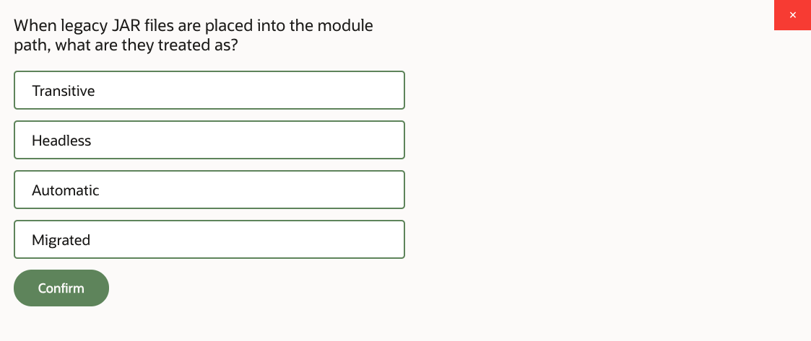
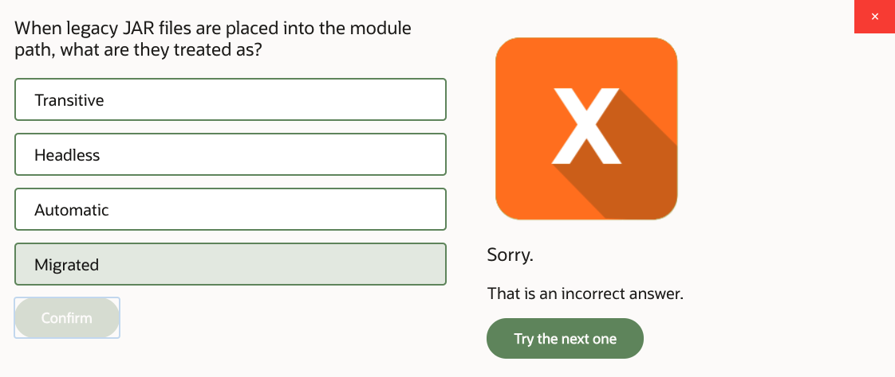
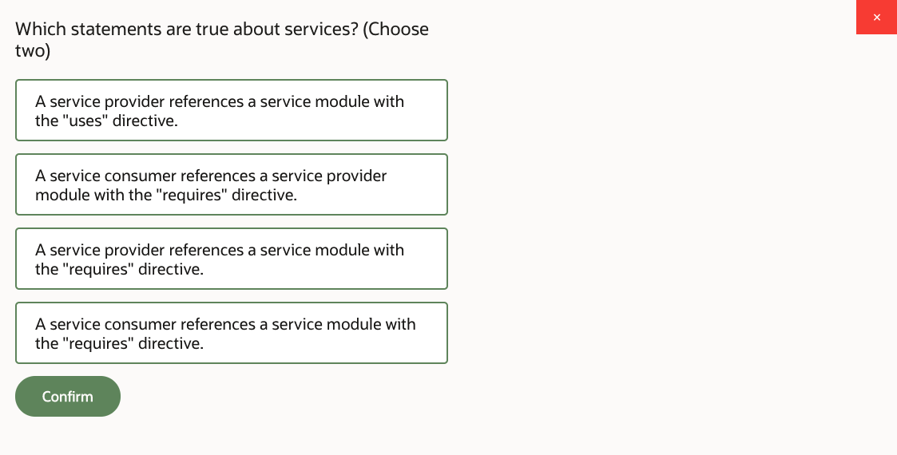
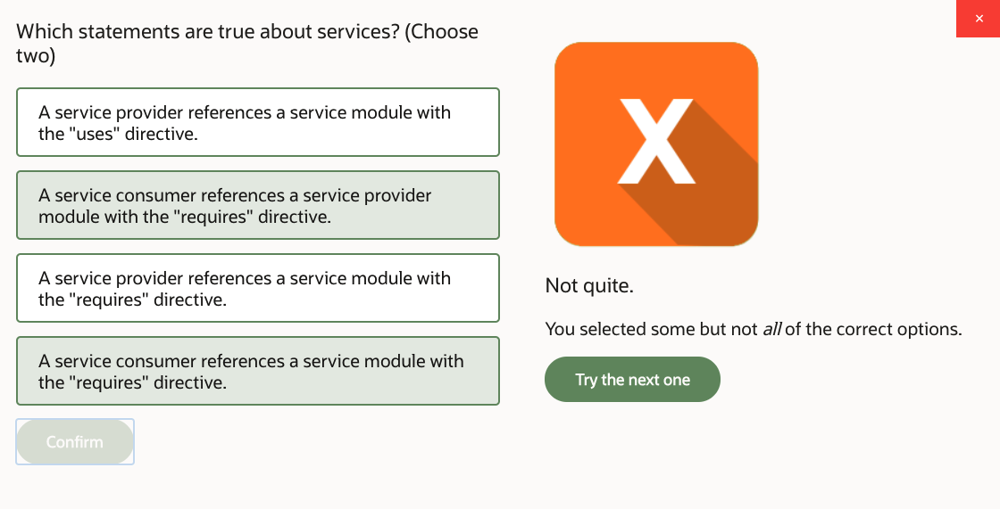
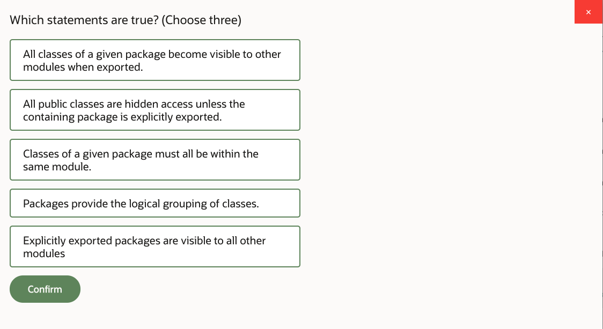
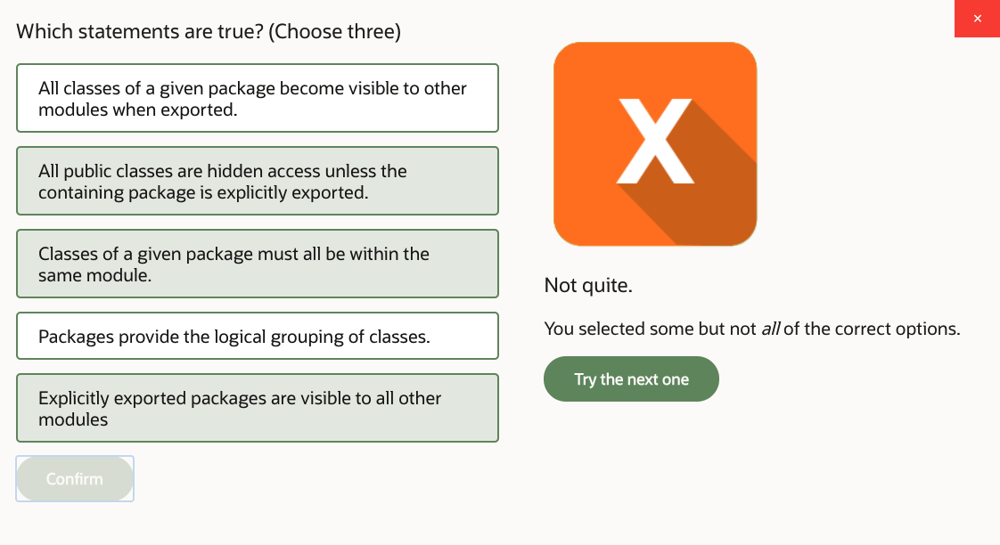
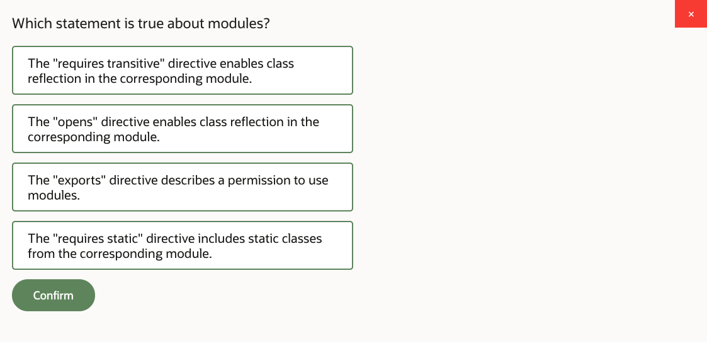
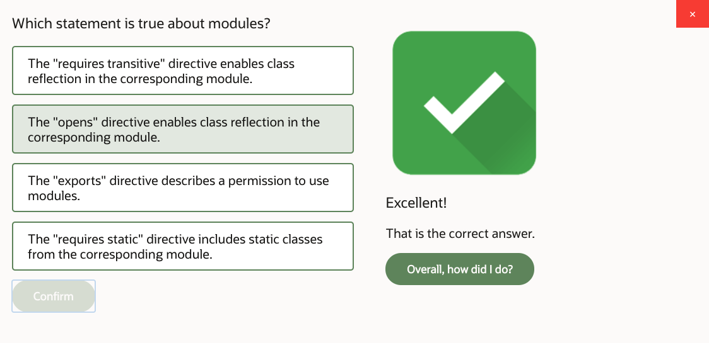

# 15: Open Module Content

1. Open Module Content, Part 1 24m
2. Open Module Content, Part 2 21m
3. Open Module Content, Part 3 19m
4. Practice 15-1: Convert ProductManagement Application into a Module 12m
5. Practice 15-2: Separate Application into Several Modules 25m
6. Open Module Content - Score 80% or higher to pass

## 1. Open Module Content, Part 1 24m

Java modules. In this lesson, we're looking at a relatively new feature that has emerged in Version 9 of Java language, which is Java modular system. And what we need to do is understand what the modules are there for, compare modular and non-modular Java application deployments, understand how modules can improve structures of code in our program and actually improved the deployment as well.

Use modules to define different constructs such as services, for example, and also use modules to deploy the application as a runtime image. So we see and compare how to deploy modular and non-modular Java applications and kind of compare how modular and non-modular applications behave. So we know what the differences are, and what are the advantages of using modules.

Well, we'll start by looking at how non-modular job applications are deployed. So before Version 9 of Java, before modules were introduced, what it is that you do to deploy the application. Well, first, of course, you need to compile code, right? So Java, Java compiler.

And what do you do to compile is that you set up the class path that points to where your classes are, were any other libraries where they're supposed to be. Then you point to the folder where you want to store the compiled output and where you want to grab sources from. So that's your compilation process.

You compile your code, then you can package your code into the archive called JAR. jar stands for Java Archive, and in fact, it's just a zip file, really. But for some mysterious reason, zip files are never called zip files in Java. They're called anything but zips. So JARs, and you'll hear other names. And for example, in Java EE web archives, WAR files, enterprise archives, ER files, et cetera. But in Java SE, which is what is the point of this course, we can package code in JAR files. But all of these different archive types are, in fact, just zip archives.

So you can place code inside the archive. And that's done with a JAR utility. You create your JAR file. Optionally, you may add to the jar file a descriptor called MANIFEST MF. And basically, that describes what your archive contains. And it may, for example, set up the class path, if you like. But I guess what else you could do there is to describe which class in that archive contains method main, so what it is that you want to execute as main executable.

So you run this utility. You take the compiled classes from a given folder. So presumably that's that -d target, where you store compiled results to. So grab files from there, the actual class files, and then store them in that archive. That's what JAR utility will do.

To execute the application, all you need to do is just use Java runtime minus JAR option and point to that JAR file. And see, the information about the class path, or where is the class with method main is all contained in MANIFEST.MF. And all required classes are either described for a class path or are already present in that JAR. So that's enough information to run the application. You don't even need to specify in this command line what is the main class, cause, well, it's in the descriptor anyway. So that's how you can deploy and run simple Java SE program.

Now let's take a look at characteristics of these non-modular applications. So before Java 9, modules were not introduced-- well, were deployed just like we've seen in this previous page. But there were certain concerns regarding non-modular style of Java applications.

Now, what are these concerns? Well, first of all, we know that Java code is logically grouped into packages. Classes are grouped into packages. We know that. However, packages do not impose physical restrictions on how they're used. Let me give you some examples.

Imagine you have a class which you described as public, public class, whatever. It's in a certain package. And maybe it has some public methods. Because it is public, and because methods are public, you can call them from anywhere you like. Any other class in any other package can call that particular class.

You cannot really physically restrict that to say, well, actually, only classes in some other package can access that. That can't be done. You cannot selectively select-- selectively qualify who can actually call something that's public. If it's public, it's public. Anybody can call it. Right, so there's no sense of a physical restriction.

Another example of an absence of a physical restriction is a situation where you can apparently bypass encapsulation. So in this particular code sample here, I have package a, which contains classes X and Y. And notice that one of these classes, specifically Y class, is not public. It has a default access modify. And we know the default access modify has a package visibility. So strictly speaking, class Y is not visible outside of package a, right?

Fair enough. You restricted that class to be used just by that package. That you can do. However, although the Java compiler will refuse to compile code if you try to do this import a.Y-- because you see this is in package b, right? So package b, the class Z, is in another package. It can certainly see class X, because it's public, and you can't possibly restrict that. If it's public it's visible anywhere.

But package b, class Z cannot see the class Y in a package a, because that's not public. So that import won't compile. But you can still look at that class and see what it has and operate with it through the Reflection API. You can specify package and class name as a string and actually load the class like this. You can load the class into memory, even though you have no access to it, according to the access modifier.

So you can do it programmatically, Class.forName. And you can actually introspect it. You can get information about which fields it has, which methods it has. So apparently, you can bypass access modifiers. You could see the fields and methods even if they're private. Apparently you can do that.

So even though it seems like access modifiers and packages are supposed to restrict your access-- well, they kind of logically do. And at some level, they do restrict you. Like compiler will refuse to directly compile code that accesses the private variable or class in another package that isn't public, which you are not supposed to see. But for a Reflection API, you can still access that. So you can kind of bypass the encapsulation, and there is no physical restriction that is imposed on this class Z that prevents it from doing it.

Another thing that we need to be aware of is, as you observed with early examples, when you execute a Java program, its classes are placed in JAR files, as we've seen, and accessed from the class path, which is fine. This is how you supply Java code to the runtime. But when you run in your program, how do you know if you didn't forget to put some classes into the class path? How did you know that the way you formed your JARs actually contain all code you need, that you didn't forget to include some folder into the JAR and some classes?

Or maybe you're missing the jar from your class path. How do you know that that's the case or it isn't the case, right? Well, of course. When your program eventually runs into the code construct that requires a certain class when you're trying to load it, yeah, certainly you'll have an error at that stage.

But you won't have an error at a startup time of the program if classes you require are not immediately needed, are not immediately loaded to memory. |n that case, well, the program will attempt to run and may fail later, which is kind of not great, because you're not enforcing the fact that a certain subset of code really must be deployed consistently with that program. That is, class path does not enforce it, right?

And we've seen that we can bypass encapsulation, essentially. And you cannot really impose restrictions upon where something that's public is visible from. It's kind of, it's public, visible from anywhere. So these are some of the issues that we have with non-modular pre-Java 9 packaging and deployment style of code. And the modules are designed to address these issues. So let's take a look at how it's actually done.

So what's the module? Module is a high-level code aggregation that is comprised of one or more closely related packages and possibly other resources that you may decide to include into the module. So you think about a group of packages, which are sort of always used together or closely related. And that's your module. You aggregate them.

Each module is described with a Java class called module-info, which is stored in a root folder of the module. And each module must have a unique name, and the module name must be universally unique. To achieve that, it's advised-- although strictly speaking, you don't have to do it, but it's advisable-- you follow the naming convention, because you want it to be universally unique. You follow the naming convention, which is known as reverse dns, which is basically saying naming convention as a use for packages.

When you call a package, you're supposed to use your company domain name followed by whatever naming convention you're adopted within a company. So you take your company domain name, you write it in reverse, and then you put whatever qualify for the packages that you want to use in your program following naming convention you adopted. So that's reverse dns.

The presence of the company domain name at the front of the package naming system helps you to enforce universal uniqueness. So with the module names, the advice is to use the same convention. And I guess the rationale behind it is that when you group several packages together, you kind of look at your packages, and you select one of these packages to act as your module name. It's typically kind of a root package in a group of packages. So you select that to be your module name.

Now, what modules do is that they explicitly describe which are the modules they would like to use. So module says which are the modules it wants to use. And also, the modules describe explicitly which exact code out of this module is allowed to be used by other modules. And you can actually specify by which other modules.

So even though you may have a class which is public and it sits in some package, well, it's not given that this class will be seen outside of a given module. You actually have to allow it explicitly. So we can impose, now, physical restrictions.

And by the way, the way they're imposed blocks the Reflection API from wandering in and bypassing encapsulation, unless you explicitly permit it, actually. You can explicitly allow Reflection, sure. But unless you explicitly allow Reflection to happen, classes in other packages, classes in other modules will not be able to bypass encapsulation on your classes within your module. So you kind of protect the code that way.

We also could form something called services with modules, which is a rather flexible way of joining modules together. And one more thing, the consistency of deployment is actually enforced. So in other words, you can not accidentally partially deploy your code.

If you have a package, and you have certain classes in that package, with non-modular deployments, you can easily forget to put all the required classes into a given archive. And then you may put some classes in another archive, and then you get the package that is split between couple of archives. Some classes are in one place, other classes are in another place.

And then what could happen is that you replace one archive, and you forget to replace another one, and you've got different versions, and the code stops working. That's not fun, right? With the modules, that's not possible. When you package the module, it actually enforces a common deployment pattern. So you have to deploy all classes that belong to a given package into that same archive, into that module. You can't split it.

Even though the actual packages might not be visible to other modules, you're not necessarily exporting them to other modules. You may hide the package inside a given module. But regardless, whenever you export it or not, or it's hidden in the module, all classes that belong to a certain package will be enforced to be deployed together. So that's one of the advantages, because you don't get fragmented or inconsistent deployments.

The general structure of the module file is right here. Yes, you're describing the module. You're describing which other module you're using, which packages you export, which packages you open. That basically opens packages with Reflection API permission to actually bypass encapsulation. But you have to explicitly say you allow that.

And then you can describe services and describe how you provide services. And actually, modules can also have versions. But we're going to see the examples of all of these elements in a moment. So so far, that's the general concept of what the modules are trying to do.

Now, modular system-- Java Platform Modular System-- has been introduced in JDK 9, and the entire Java Development Kit itself has been repackaged as modules. So now, all the standard JDK APIs are also modularized. So as they say, the modules are packed in the archive. Each module has a descriptor, which is the module info.

Now, technically, module info is placed in a root folder of a module, right? But what if you want to place several modules in the same folder, for some strange reason? Well, you can't, because then you'll have a conflict, because module info is a fixed name. So two different modules can't really physically sit inside the same folder, because then they will clash on the module info file, right?

So if you want to do something like that, then I guess what you could do is just create a folder which will have the same name as module name, and then put your module there. And then you can have several folders per module, and then a module info file will be sitting in each folder there. That's up to you. It's how you organize your file system.

But basically, you need to have a modules info file per module. It's a kind of fixed, given descriptor that you have to create. The module names must be unique, and it's typically named after the primary package contained within a module. Remember, module is a group of packages. So just select one of these packages to act as your primary package.

Packages in a module are considered to be hidden and not visible to other modules unless they're explicitly exposed. So you decide what exactly out of your module should be visible to others.

Now, one of the interesting things that is enabled with this particular approach is when you deploy your application-- because you know, now, what are the dependencies between modules, how exactly one group of classes in one module uses other classes that are in another module. That is explicitly described, right?

So you have these dependencies. That means that when you deploy your application, you no longer have to carry archives with Java classes with your application for just in case. You can now tell exactly what you do and what you don't need in your deployment. You can trace the dependencies and create much smaller deployment footprint of the application, because you don't need to package things in there that you know your application is not going to use. And you can tell, because the modules explicitly spell out what is used and what is not used.

Now, of course, there are certain things that will not be allowed. For example, you cannot have module a have a dependency with module b and module b have a dependency with module a. So the circular kind of loop of dependencies will not be allowed. So that's prevented. If you try to create a module like that, you'll fail. You will be prevented from doing it.

And also, when you start the application, Java actually verifies that all required modules to run your code are physically present. Their presence is verified at startup, which is great. The application won't even run if you're missing important deployment artifacts. So that's verified.

A different variable is used to describe path that leads to modules. It's called module path instead of class path. So we put modularized JARs in a module path rather than class path. And so yes, so if you have missing modules or something, that's detected at startup.

Another interesting thing is that with module path application starts quicker. And the reason behind it is when you need to load class into memory, with a class path, you don't know which exact archive that class is in, because there is no requirement. And there is no guarantee that classes from the same package are in the same archive.

So Java Virtual Machine Class Loader would have to scan all the archives in a class path to find the class and load it to memory. With a module path, it doesn't need to, because it knows exactly which module the class is in. So it doesn't need to scan the entire module path.

And in the situation when your application deployment is comprised of lots of different JARs, lots of different archives, the module path could turn out to be a performance advantage, because you don't have to scan this entire set of archives. You scan just one archive to load that specific class. So yeah, indeed, that's much faster.

Now, what are the modules that are already present in the Java Development Kit? There are several groups of modules. The first group is known as Java SE modules, and they constitute core Java platform and just general purpose APIs that comprise the Java SE. They all start with the name Java, so java.base, java.se, java.logging.

Actually, if you remember, we encountered some of them. For example, when we were covering the lesson on exception handling in the first part of the lesson, talked about login API. And we mentioned there that if you want to use login API and you want to do modular deployment, well, then you need to include that particular module.

Anyway, so these are the modules that comprise the core Java SE. There's also a set of modules that start with the name jdk, like jdk.httpserver, jdk.jconsole, jdk.jshell, et cetera. Now, these modules are what we call implementation-specific. For example, OpenJDK or Oracle JDK or some third-party provider JDK may or may not package extra modules. It's up to specific JDK provider. They may add stuff. But then again, they don't have to.

So every JDK provides the Java SE modules, and then they may provide some extras. And the extras are marked as modules that names starting with jdk. And then you create your own modules or use third-party modules, whatever else you need. And that's just normal reverse dns [INAUDIBLE] for everything else.

If you want to find which modules you've got, just do this command, list-modules. It will tell you. It will give you the entire list of all modules that currently available.

## 2. Open Module Content, Part 2 21m

Now, let's define a module, and let's define which are the modules your module wants to use. Right? So define dependencies. So you create a module-info file, and in a module info file you say, OK, I've got a module, and give it some name, right? com.some, whatever, just a unique name. Remember, it has to be universally unique.

So anyway, you describe your module name, and then, in the body of this module info, you're describing which are the modules you need. So for example, you say, "requires java.logging." That means that you want to use classes from another module. That's fine. But there are also some interesting variants of "requires directive," "requires transitive," and "requires static."

OK, well, "requires transitive" works like this. I need org.acme module. Fine. If somebody else, some other module, needs com.some, this module-- so some other module says they need that one, com.some-- then they will implicitly be given a requirement to also use org.acme. So they won't have to write "requires org.acme," but it will be implied that they actually need it. Yeah?

So you are saying, I need that module, and anybody who needs me, they'll need that module as well, right? That's transitive. "Requires static" is an interesting one because this is the case where you can say that you need that module at compile time, but actually you don't insist on that module being present at runtime. So for example, if your program has an ability to introduce some kind of an extra feature that may or may not be required-- so something that you may wish to use but not necessarily use-- then the contents that implement that feature, classes that implement that feature, they may be placed into the module, and you then describe the static dependency with that module.

You see, if it's not static dependency, then upon a startup of the application, the presence of the com.foo module will be required. And if that is an optional extra, then you don't want that to be required at startup, right? So that's why you describe this dependency as static. Finally, one directive, which is "requires java.base," is essentially implied for all modules. So there's this module, java.base, which is implied for all modules. You don't have to say, "requires java.base." It's kind of implicitly present in every module anyway.

And guess what is in java.base. Well, all of these kind of core Java classes that we've observed throughout this course, probably except from the logger. Yeah? That wasn't Java logging. But everything else, like object, string, system, collections, local date, the big decimals, whatever, yeah? Whatever you were looking at throughout this course, except the logging API, which was in a separate module. Everything else was in java.base, basically. So you kind of use that anyway, yeah? It's an implicit dependency.

So we define which are the modules we'd like to use now. Which packages out of a given module we allow others to use. Hmm, so that's the other side of the dependency, right? Not only you need to say, oh, I need that module. But that module needs to allow you to use whatever is inside it. So that's done with an exports directive.

Here's an example. There's this module, demos, and imagine that it has different packages and classes inside. So there is this package, demos.a, which contains public class L and class M, which isn't public. This one is visible only inside the package demos.a, right? OK, then there's the package demos.b, and there's the package demos.c. Now, first of all, notice that the module demos never exports package demos.c, which actually means that, although this package has a public class O, this class-- I know it's public, yes-- but it will not be visible outside of its module.

Only classes inside this module will be able to see and use the class O. All other modules won't be aware about it at all because we didn't export the package demos.c. Now, we did export package demos.a, which means that class L would be visible to everybody else. But what about M? Oh, no, it won't be. Not even through introspection, not even for a reflection API, in no way. It is not public, so you can't see it, even though the package it's in has been exported. Only the public, [? publicly ?] visible content that should be visible outside of the package will be observable by other modules.

And also, you can make this interesting restriction. You could say, OK, we'll allow other modules to use package demos.b, but not just any other module. Only the module called other. So that module called other, it says, "requires demos," right? And it can use what was allowed to be used by everybody, which is class L in the package A, and it can also see class B in the package N because it was specifically allowed for the module other. Module foo can only see L in the package A, and that's that. And module some can't see any of that because it never said it requires module demos in the first place, right?

And anyhow, nobody can see demos.c content. That's kind of prohibited no matter what. Now, all of these examples-- previous page, this page, and subsequent pages-- all of these directives, like requires, exports, they support comma-separated enumeration of values. So you can say exports this, comma that, comma that, comma, that, yeah? Requires that, that, that, that, as comma-separated. Or you could do separate lines of code. That's up to you. So there's no requirement to write it one way or the other.

OK, so we describe which content out of the module would allow others to use. Here's an example. So imagine you structure your application so it will be comprised of a couple of modules. There will be this module shop, and the module shop will contain front end kind of client application. OK. There will be another module. Let's call this one Product Management, pm, right? And this one will contain the business logic, sort of backend stuff, right? Maybe persistence to the database, something like that.

There might be part of the pm module that you don't want others to know about at all. Like, are you using a database, or are using a file system, or what it is that you use. None of the shop applications business, yeah? That module doesn't need to know. That's what you're saying. What the other module needs to know is how to access your business logic. That's model class, with ProductManager. What data to use. That's product class that represents information. And that's what you export. And the class database is left buried inside this module, not visible to the other one, yeah? And then the front end module just says, oh, I need that module, pm, right?

So this is an interesting way of kind of giving your application much better structure and describing specifically what is or isn't allowed to be used across in other modules. Now, the reason why I use additional subfolders is because otherwise I'll have a conflict between module info files. Because I'm kind of saying, oh, these sources are in the same superfolder, yeah? But of course, I can just create different projects.

I can have one project for one module, another project for another module. Then I don't technically need these intermediate folders. So long as the folders where module infos are stored are physically different, you're all right. OK, now open module directive. So this is kind of, in a way, alternative to the exports. The primary difference between opens and exports is that, when you use the opens directive, you allow the contents of a certain package to be used, including the use through a reflection API.

So otherwise it's similar to the export. But you see, remember, with an export directive, the class that wasn't public wasn't actually visible outside of this module. With an opened directive, through the reflection API, a code in other modules can actually see it, right? Also note that because you can operate on classes through the reflection API, that means you can dynamically investigate where the classes are. So technically speaking, other modules don't really need the requires directive, right? Because they can on fly find what classes are available in other packages, so long as these packages are opened to them, right? They need to be open to them in the first place.

And you may decide to open the contents of some package only to some other module, but not to everybody. And whatever you decide not to open remains private in that module, right? So you have full control over the use cases where you feel like it's OK to use reflection API, which we know could bypass encapsulation, right? But you're saying, eh, that's fine. There are certain cases where you allow that. Then there might be other packages that you say, OK, it's just exports. It's not opens directive. You are more strict about it, and then you may decide not to export or open some other packages, and they just remain private within a given module.

OK, now, you can open an entire module. If you do that, if you just say "open module" and then the module name, essentially the entire contents of the module becomes open to everybody else. This is as close as you can get to the non-modular Java behavior. So before modules were introduced, all of your Java archives were essentially kind of open modules, where anybody could just use code from these archives whichever way they like. So that's how pre-modular applications behave.

And you can make a module that behaves in a similar way if you choose to do that for whatever reason, yeah? So maybe you need that code to be introspective. And actually, good use cases for that, to use reflection API. There are very good cases for that. Let me give you some examples. When you use some APIs, like for example JAXB, Java for XML Binding, or JSONP, when you parse in Java classes and turn them to JSON objects, or JPA, when you use Java Persistence API.

All of these different APIs, what they do, where they take the Java object and they map it to, I don't know, database table or XML document or JSON object-- well, actually if you serialization, right, you essentially bypass encapsulation, right? Because you're going to look at what is essentially private variables in another class and, you know, dump them to a stream, right? Or store them from a stream. And all of these cases require a code to look at classes without a filter of, strictly speaking, proper encapsulation, right? So these are the cases where you may wish to open packages, or even the entire module, if all the content in that module is appropriate to be used in such situations. OK, so that's open module.

Now, services. Oh, wow, it's getting really interesting now. So what a service is. You can describe an abstract class or an interface with some methods, which I kind of don't write, but presumably there are some methods here in that interface, or it could be an abstract class. Anyway, so describe that interface or class. Then you say that it's in a certain module, and you export the package where that interface or class is, right? So that's your module that defines a shape of a future service.

Methods that that interface describes, or that abstract class describes, presumably abstract methods, they need to be implemented somehow. They're not implemented yet, but you have described all the relevant method signatures. You say, I would like to have a service that looks like this, right? OK, so that's the purpose of this module. Now, in another place in your application, you create another module. The module names are not meaningful here. I call this module service not because it has to be called that, but just to indicate something. You know, that's the module that contains a service.

But the name is obviously up to you. So is the module called application. It's not really a proper module name, but just to indicate the nature of what that module represents. So suppose you're now writing module that is your application. Good. You're saying you want to use that module that is that service. Fine. So just normal requires, right? You require that module that describes a service. But then you're saying something else. You put in this directive that says "uses." And the uses directive says, oh, well, there is this interface-- an abstract class, right-- which describes a certain service, and I would like to use it.

So "uses" and which interface or class describes that service. OK, lovely. So far so good, right? Now, what you're missing, obviously, is an actual implementation of the interface. That hasn't yet been provided. So let's provide it. We create yet another module. Let's call it provider. Again, that's not a relevant name, as in proper name, but it kind of reflects the nature or the purpose of this module. Of course, you call it with a proper unique name. But anyway, you have this module, and the intention of this module is to provide an implementation for the L interface, right?

So inside this module, we actually create a class, some class M, that implements the interface L. Lovely. Of course, in order to be able to see the interface L, we have to say, "requires," that module that contains the interface, right? So we need to require that. Yeah, of course. And now we're saying that we would like to provide an implementation of the L interface, and we designate which class actually implements it. So provides L service implemented by-- that's done with the keyword, yeah? "With" that class. So which class implements that service.

So this is that provider module. But please look at the module info for the application. Does it say requires provider module? No, it does not. The module info file for the module that constitutes the application that uses the service only references the service. The provider only references the service. There is no hardcoded reference between the actual place where the service is used and the provider that implements that service interface. These are not referencing each other.

OK. So how does the application locate the provider if there is no requires instruction here? Well, actually, that's done dynamically. There is a class called ServiceLoader. It has a method called load, and you say which interface or abstract calls constitutes your service so that L matches that service that you described. And it gives you the ServiceLoader object for L type, which then gives you a stream of all available providers found in a module path.

So it looks down the module path, and it locates any modules that say, we provide L with that implementation. That's what the ServiceLoader will do. It will dynamically discover which modules provide implementations. And it gives you a stream. So find first-- you know that, that's the stream method. So you can do this. Filter, map, you know, whatever, yeah? So findFirst get basically means I'm just getting the first available implementation of the L-- I'm kind of not really picky which one, which provider specifically I want to choose.

But you can be picky. It's a stream. You can do the filter. You could search for a particular provider. You could decide which provider you would like to use, whatever criteria you want to apply, and yeah, then decide that you would go with that or the other provider. You never, in your code, in your application, physically reference the M class. You code to the interface. You use interface as the type.

Your variable will be type of L. What the provider will return you when you call the get method, that will return you class M or some other class that implements L from another provider. Go figure if you have more providers, right? But you don't hardcode which specific provider you're using. You're only using methods as described by that interface or by that abstract class. And of course, due to the Java polymorphism, as usual, the lowest available implementation of the method will be automatically invoked, so whichever provider you just loaded, it would be that provider's implementation of the methods described by that interface

OK, again, here is the realistic-- give or take-- example. So we have a module that will consume the service. We'll have a module that will describe the service, so it's pm module, and it describes that ProductManager interface, presumably. And we're using that. And we could have more than one provider. This is an example that shows us that-- say, for example, how do we store products? One provider could use file system. Another provider could use a database, right? And then using ServiceLoader, the client application can pick and choose which one of these providers it prefers to use.

You could look up the list of the providers as a stream and decide which one you would like to select. Lovely. Without hardcoding that dependency. So that means you can dynamically choose to supply other providers. Just add them to a module path, yeah? And you're done. You won't need to rewrite that consumer application in any way, which is great.

## 3. Open Module Content, Part 3 19m

One more feature that you could use with modular archives is versions. So you can compile your code and place it into the archive several times with versions, and then a version number subfolders. So you can have a subfolder for each version of Java Development Kit. Generally speaking, that's not really required. You don't really have to do it.

You could still have a default version provided in the root of the archive. But what if, in different versions of Java, you have different modules in the JDK itself? And actually, that's the case. That's true. There are situations where the JDK itself, and the collection of modules that it provides, is changed. So you kind of have little control over it. If a new version of Java Development Kit is released, and in that new version there are different modules, well, how do you-- what do you do about it, right?

You may create an altered version of the module info file and refer to different modules if you need to. So that's kind of alternative assemblies of the application. Java bytecode is actually kind of compatible. So you know, you can get away without recompiling with every JDK, as such. But if you want to have a tight control of the exact, specific assembly of modules per version of JDK, well, that's the approach you may take. And so that's called multi-release JAR, yeah? The JAR that contains different versions of the program for different versions of the actual Java virtual machine, the actual JDK.

OK, so now, how do you actually produce the module, right? You compile your code first. The only difference is, instead of class path, you use module path. And you put the path to the archives, to the JAR file that contains your modules. The rest of the logic of the Java compiler is exactly the same, minus the folder we would like to store the compiled output, where do you grab your sources from. So compile the code.

Then you run JAR utility, and again, that's the same JAR utility you've run so far, even if you didn't use modules. And again, the difference is that what you will do is that you specify the path to the modular JAR. And there's a slight twist on how you qualify the main class if you need to do that. Instead of actually manually creating manifest.mf and saying where the main class is-- which I guess you could do-- but you could instead say, dash, dash, main-class, and then qualify the package and the class name, just as parameters in the JAR utility, and then path to the compiled module code, and that will assemble the module JAR for you.

If you want to verify what exactly went into that module JAR, launch Java runtime, Java, then specify module path and put the path to that compiled module that you just created, right? To that JAR. And then use the command code describe-module, and you can actually specify specific module names if you've got, like, multiple JARs in your module path. Then you may say describing this module, describing that module, yeah? So it will give you a description of the module, and you will be able to see what that module is, which are the modules it requires. So you'll be able to trace the dependencies, et cetera.

And that helps you, I guess, to validate if you've packaged everything correctly. So did you actually include everything you need. OK, so that's compiling and packaging, which is relatively similar to the way you did any other compilation of Java, except that you use module path instead of class path. And now, how do you actually run modular application?

OK, well you could just simply say java minus p, or dash, dash module path, which is synonymous. It's up to you. Same thing. Path to your modules, minus m, module name, slash package, class name that contains main class. Or, if you qualified where the main class is in the module, if you use that qualification, then you can just do minus m and module name. Then you don't have to say which package and class name contains method main if the module already contains that information. And then command line parameters as usual.

Now, the interesting point is, what's going to happen if I will place components into minus cp? Minus cp stands for Class Path. You can actually say class-path, yeah? Minus cp or class-path. So what's going to happen then? Can you take the modular JAR, which is intended to be used in module path, and place it in a class path? Apparently you can, and it works. And this is crucial for backward compatibility.

Maybe you've got a situation when you have some of the contents already packaged as modules, and then maybe some other parts of the application are not yet modularized, so you're kind of in this transitional period. And yeah, you may just use the modular JAR and a class path, and it all will still work, right? Can you use module path minus p and the class path simultaneously? Again, yes, you can. You can use them at the same time.

The result would be that any classes that you place in the class path-- so you're running your application as a module, yeah? Minus p, module path, minus m, which module you're running. But then you also put minus cp as well, right? So you add that. So anything you put in a class path in that situation will be treated as one big unnamed module, which technically will be just open module. OK? And we've already discussed it, didn't we? Where we're saying, doesn't open module remind us of how the class path works, yeah?

So that's exactly what's going to happen. If you will try to use class path together with module path, the application will run, and it will just treat everything in the class path as one big unnamed open module, which is a good measure for a period of migration when your code is not entirely modularized and maybe you have some, like, third-party JAR files that are still non-modular. So yeah, you may have to put them in a class path to just get by, I guess. Now, another legacy migration trick that you could use-- you can take non-modular JAR, non-modular JAR, and put it in the module path, right?

So non-modular JAR not in the class path, where it will be open module, but in the module path. In which case it will be treated as an automatic module. An automatic module can be referenced by all the modules with the requires directive as if it's a proper module. The only problem here is that you don't have a module info file, right? So that module is not described with module info. So what is the name of the module? By default, that would be the name of your JAR file. But as you may guess, JAR file names are not guaranteed to be universally unique. So that's a bit of a problem.

To work around this, you could put in a JAR file, in the manifest.mf, an extra instruction called Automatic-Module-Name and basically give it a name. So temporary measure, I know. Eventually, you probably would like to repackage with the proper module info. But meanwhile, before that happened, if you wish to use a non-modular JAR in the module path and referencing using not just a JAR file name but a proper kind of logical module name, well, you can kind of give temporarily that Automatic-Module-Name in a manifest.mf to get by. Again, this is a measure that you could use in a migration of the non-modular code to the modular world.

OK, now, this is interesting. If you're running pure modular code, this is a prerequisite. Your entire application, with all of its libraries, has to be modular, right? So everything is packaged into modular JARs. Properly. You've migrated to that modular world. Now you can take advantage of a utility called jlink. It allows you to create something called a Java runtime image. What a Java runtime image looks like? Well, actually, you could see right here on this page.

Java runtime image actually contains inside Java runtime. It's embedded into the runtime image. It contains the configuration and the code of your application and any other modules you would like to use in a lib folder. That will be whatever modules you'd like to use, right? And it's essentially a self-contained application. You can distribute this application to another machine, and you don't need to install a separate Java runtime on that machine. You don't. Everything you need is inside the JIMAGE. So it can run on another machine without actual prior installation of Java runtime.

Moreover, this JIMAGE will not contain inside the entire Java Development Kit with all of its classes. Oh, no, it won't. It will only contain the subset which is actually required to run your application. So you don't need to install the entire JDK. You don't need to install old classes. You can package the application with the minimum required set that allows it to run. So whatever modules you have, whatever parts of JDK you need to execute that code. Your application deployment footprint with a JIMAGE becomes dramatically smaller, like 10 times smaller. Actually, possibly more than that, yeah?

I mean, 10 times smaller is easy without compression or optimization. But you could do some optimization or you can do compression as well, and then you'll get it even smaller than that. Also, an interesting point is that what you producing is actually platform-specific deployment. You can create a JIMAGE for different platforms. So what you can do is, instead of just using your current machine JDK-- for example, imagine you're running on Linux, right? OK, so you've got a Linux JDK.

And then you go and you download dedicate JDK for Windows because you feel like it. Of course, you can't run it on Linux, but you can load it onto this Linux machine. You unpack it into the local machine folder. And when you run this jlink, you point to JAVA_HOME, jmods folder of the Windows JDK instead of Linux JDK. Well, you could do that. And that will produce a module JIMAGE which is for that platform. So you can have, like, several JDKs of different platforms placed in your local machine, right, and then just run the jlink with each one of them and have an application package specifically for whichever platform.

The code will not require recompilation. You use the same JAR files. You don't compile code again. No, no, no. Java code is still perfectly portable. But what you're doing is that you're creating a self-contained image that does not require an installation of Java runtime for that target platform on a target machine because everything you need is in the image itself. So specify module path, what you want to include, specify jmods folder for whichever JDK, if you want to assemble a JIMAGE for different a platform's JDK. Which modules you would like to add. Maybe which services you want to bind, if you're using services.

You may optionally designate launcher. Launcher is like a shell script, like a shortcut, via which you can launch your application. So kind of alias, yeah? Which triggers the application to run. And then the output folder we would like to store the JIMAGE to, right? To verify how you package the JIMAGE, you could do image folder, slash bin, slash java, minus version; image folder, slash bin, slash java, list-modules. So you know, interrogate what's in that image.

To run it, you could simply say image folder, bin, java, minus m, module name. Or, if you created a launcher command, image, bin, launcher command, yeah? That's it. That's all you need to run. That's just like a shortcut you can create on your target machine, right? No need to [? shape a ?] separate Java runtime with it. Everything you need is self-contained, and the application memory footprint is dramatically smaller.

There are also lots of different optimizations you can apply to jlink. That's just kind of an idea of what you could do. Because you're creating platform-specific deployments, you can specify what are the endian [? bits. ?] You can specify compression. You can exclude headers. You could stream debug information. You could specify particular tuning for a certain type of virtual machine. Yeah. So anyway.

Oh, for example, imagine that you create an application with different locale supports. And you can actually say which locales you want to include into that deployment. So you can have locale-specific versions of the application, just tailored to a particular country or language. Again, the purpose of which is to make the application smaller if necessary. And then make it self-contained so you can actually execute it pretty much anywhere you like without having to [? shape ?] and supply Java runtime or install anything in addition to that particular image.

OK, so that's what you can do with the power of modules. Once again, if you don't have modular JARs, you can't use jlink. It does not work with the pre-modular world. It requires you to actually use modules. Yeah, there you go. So in this lesson, we looked at how to modularize a Java application. Hopefully you can now have a sense that modularization brings in better structure to your code. It allows you to enforce certain rules regarding the encapsulation. It makes your code run faster because of the reduced search time, because the Java class loader knows where to grab the class from because it knows where dependencies between modules are.

Maintainability of your code is significantly improved because you're not playing a guessing game. What will happen if I'll change my class? What else in this world would I affect? Well, actually, you can tell it from the dependencies now, right? You know exactly what are you exporting, which parts of your module are visible to others, yeah? And you know how the application modules are interlinked. So there you go. And you could do some interesting dynamic binding of implementations with services, and you can create optimized runtime images. And that gives you interesting opportunities in terms of how you deploy and distribute and execute your Java application code across different platforms.

In terms of the practice exercise, in this practice, you're asked to kind of compare modular and non-modular deployment formats. And you're moving to modules. So your application so far that you've written throughout this course is non-modular, right? We just used traditional class path. We didn't create any modules. So now what you're going to do is actually you're going to migrate it to modular format. And you'll be amazed how easy it could be in some cases. So you could just create a module, right?

We'll do that. And then-- oh, that will be a difficult part. Then you're asked to break your application into several modules. So if you just want to take an application and convert it to module, that's pretty trivial. But if you want to break it apart into several modules, well, there's a bit more to it because you have to think about the dependencies between modules, what's used from where, yeah? Kind of you know figure that part out, yeah? But you're asked to do that as well. And then, eventually, you're asked to produce an actual runtime image and execute that. So let's give it a try.

## 4. Practice 15-1: Convert ProductManagement Application into a Module 12m

Let's take a look at practices for lesson 15. And we'll be creating some Java modules here, so we'll do modular and non-modular and modular deployments, but focus on modules, of course. So first, what we're going to do is we're going to take our non-modular version of the Product Management Application pretty much as is. Just deploy and see how we can run it in non-modular fashion. Then we're going to say, OK, let's turn it into the modular application. So that's pretty easy. After that, the next part of the exercise, we will split it into several modules. Right? So create an actual kind of a structure where the modules potentially represent reusable units, could be used in different contexts.

OK, so let's start with the first assumption, which is if you have completed previous exercise for lesson 14, then you can continue with the previous exercises, a practice project, or else you open a solution for practice 14 and you start with a solution. Now, first what we're asked to do is to execute non-modular version of the application. The assumption is your application is already compiled. If not, you hit the Clean Rebuild button just to create a fresh compiled version of the application. But probably it's already compiled, because you've performed previous exercise anyway. And you can just run your code.

Now, how do you run it? Well, there's several ways in which you can do it. You can use the command line that you observe here in the output log of NetBeans where you just set a class path, path to the product management jar, and then the name of the class with the main method. You can do it that way. Or alternatively, you can do it like this. Open the terminal window, go to the folder which is the folder that contains your project. Now, we assume that that's home/oracle/labs/practices/ProductManagement. But if you open the solution, then that would be a different folder, yeah? So look at which folder you are using.

And then the command that you need to execute is quite simply this-- Java minus jar-- then you point to distribution folder where NetBeans has generated and the jar file, too. And just point to that jar file. There you go. Right? And that just runs your program as usual, yeah? As usual. There's nothing kind of special about it. So this is just non-modular run. The reason why you can just run it as jar is because in NetBeans approach of properties, which class contains method main is something that's already designated. So when NetBeans-- when you hit in this Clean Rebuild and NetBeans generates a jar file for you, it basically automatically puts into the jar the description of which class contains method main, basically. So you could do just minus jar and run the application. So it's highly automated, as you could see. Yeah? And this is classic non-modular way of running your application.

Now let's turn this application, this Product Management Application, into a module. OK? So what we need to do is create the module-info class. All right? In the Product Management, Create New, Java Module Info. OK. Just great. Just great. So what would we put into this module-info? Well, we need to give it a nice name and just describe what the module really is and if we're using any other sort of dependencies to other modules, right? We'll do that.

So what we want the module-info to contain. First of all, we want it to be called labs.pm because that's our main package. We have labs.pm app, labs.pm data, so labs.pm looks like a good name for the module. Technically speaking, you really should use your company domain name to make sure that module name is universally unique. So yeah, but, well, for a set of exercises, that will do.

So we have a good module name. However, did you notice that there's a problem with the shop class, with labs.pm data product manager class? I'll tell you what the problem is-- it's the use of Logger We use Logger API in both of these occasions and the Logger apparently is another module that's not body. It's not Java base. It's not included by default. So you need to create a dependency. You need to say, my labs.pm module requires the Logger module. Right, so that's much better, yeah? So we qualified requirement to use another module-- logging.

Just rebuild it. Just rebuild it. Just hit that Clean and Rebuild button. Everything will be recompiled and the errors will disappear, because we now actually have the relevant dependency explicitly set. And notice that NetBeans immediately tells you there's a different way of running your application, right? So Java minus p instead of cp, so it's module path, yeah? Slightly different structure with jar inside there because it's now modular jar, and minus m-- which module? Module labs.pm. Yeah? So you can designate that. And you can actually, after that, designate which class contains method main here. So which module in which class contains method main.

Anyway so yeah, so that's pretty straightforward. We just created ourselves a module. But we could do better. We can turn it into the Java image and process our module with JLINK utility. All we need to do to achieve that is to create a JLINK distribution for that project. So we need to go to the Product Management Application. Then we need to get into Properties and in Properties, we need to get to this Build Packaging section and tick this box-- Create JLINK Distribution. OK, so that will do it.

We can also optionally, if we feel like it, create a launcher. Launcher's like a shell script that triggers the application, and actually, we advise to create a launcher called Shop. Sort of shortcut to, you know, launch the application, right? Great. So we have our JLINK packaging requested. And how to actually do it? Just hit the Rebuild button again. It's clean and build again, and that will now produce us the jimage. So kind of an extra step will be taken by NetBeans to actually generate the jimage for us.

Right. Where the jimage was placed to? Well, it was in the Distribution folder under the Project folder. So if we are in terminal window, if you already opened that, you need to be in home/oracle/labs/practices/ProductManagement. Are we? Yes, we are. That's the right folder. And what we could do is just see what's inside that distribution JLINK jimage. Yeah? And its size-- it's 48 megabytes, and that is pretty small and we haven't even done things like-- well, we could have actually, is you can see there are things like compression. We haven't even done that. We didn't perform any kind of tuning actions like strip debug information. Nah, just package date as is.

Let's see what's inside the jimage right? Let's list the modules that we've included, and that would explain a lot as to why, you know, that is fairly small image size. We have the Java base. We have a Java login. Well, Java base is always required, yeah? It's implicitly required. And we have our labs.pm module, and that's that. The rest of the Java Development Kit with, trust me, lots of different other APIs and libraries is not included because we don't need it. We only have a small subset.

If you want to execute it, again, that's pretty straightforward. Just use that launcher Shop. Yeah, remember, we created that. And yeah, just run that. Well, that's it, yeah? Our application is running, doing whatever it's supposed to be doing. But now, everything, including the actual Java Runtime, is self-contained within that JLINK folder. Everything we need. We can distribute that folder to other machines potentially. We can create a runtime out of it without actually even having to install separate Java Runtime on that target machine. Everything we need is inside, including the Java executable, actually. You could see that. Let me just very quickly show you that.

Let's go to that folder. So it's inside Labs, Practices, yeah? Dist. And that's the JLINK folder and that's your Product Management Application. And here is your-- well. Lib folder contains all the modules and libraries and whatever you need, then you've got Include folder with like headers and things like that and the Bean folder with the actual Java Runtime. That's the launcher script.

OK, so kind of a minimal distribution of your application, everything that is required for your application to be able to successfully run is inside that folder. So we executed with a launcher. And that's pretty much it. It's pretty easy to create a modularized deployment. It's really just that.

## 5. Practice 15-2: Separate Application into Several Modules 25m

We could do better because we can not just turn this application into a single module, but we can split it into several different modules. And that's what we're going to do in the next exercise. Our task here is to create a module that represents the application client, the front end part, and service that represents business logic capabilities and data structures, so that will contain that product manager part, and then another module which contains a service implementation.

And that's an interesting one because that one will contain all the code required to handle the file system, so assuming that our data storage is CSV files on a file system, delimited files in the file system. Now, to achieve that, what needs to happen is the code of the product manager class has to be split, it has to be divided, refactored so that all the code that accesses paths and files is separated from the code that's doing the business logic. At the moment, that's all in the same class, in the same product manager class.

But that needs to be segregated. And there's a lot of refactoring. There's a lot of cut and pasting. So to avoid that, what you are told to do is not to continue with the previous project but to open a refactored version of this project.

So we'll close this one. We'll close this one. And we will continue with the different version of this project, which is in Oracle labs Practice 15-2 folder. So we'll open a different version.

It's not precisely a solution. It's actually a starting point for the exercise. So this is the Practice 15-2, Product Management Application. The same application, but it has been restructured if you allow me to show you what happened here.

So we have the resource form order is now part of our shop client, together with our resource bundles. That's our front end user interface basically. Then the data package contains classes such as food, drink, product, rateable, rating, review. So all the kind of pieces of information that our application handles.

The service package contains the product manager and product manager exception. But now look at the product manager. It's no longer a class. It's an interface.

And all of its behaviors that we previously modeled as just a class, they became abstract methods. So we describe what we want product manager to generally be able to do. So we refactored all of these methods to be abstract methods. Creating products, reviews, finding products, blah, blah, blah, the rest of the logic.

And now we have the labs file service. And that's an implementation of that product manager interface using a file system. So product file manager with config and all of the code that handles actual physical file system paths, yeah? You know, read and write in files and actual implementation of all of the abstract methods that interface defines.

The logic inside these methods is pretty much the same as you've written throughout the rest of this course. There's not much of a difference there at all. But there's been a clear split here, implemented between the part that, say for example, accesses the file system to load data and load products. And a part that just describes what the business functionalities are, regardless of whatever the physical storage is, a file system or a database or whatever you like.

Actually, actually, there is a version of this application in the labs demos folder, which is already modularized and refactored. And that one contains an alternative implementation using a database instead of the file system. So instead of this lab's file service, we will have the database implementation available there, so kind of alternative implementation.

And the whole tree case that from perspective of the shop class which will be our client, it wouldn't really matter because eventually what we would like to do for the shop class is to be able to pick up the implementation like, is it a file? Or is it a database implementation using the modular services? That's what we are aiming to achieve.

That's not yet the case. This application is not yet modularized. All that happens in the application, is it just presents us with a code that has been split between these packages. But in terms of what modules you have, you still have one module at this stage, lapse PM. You don't yet have modular services. Everything is prepared to have them. But they actually were not created yet. So that's a starting point, yeah?

And as you could see what happened is that we moved abstract method definitions to the interface with segregated data from the description of how we handle the data, from the service. And we provided a separate class that implements the service to actually contain logic. And we also segregated resource format into the client, yeah? So this is a potential starting point for us to split this into further modules.

But at the moment, it's just one module. There's no further segregation done yet, OK. Well, we'll get there. So we try to understand what these contained within that application. And everything I was telling you is basically in this paragraphs of texts that tell you the purpose of each class, like what the product manager is now doing, what resource firm order is now doing, and how the code was moved around, yeah?

And all of these abstract methods are listed here. What do we expect the product manager to do? The fact that we can now have different implementations, for example, file system or database implementations, right, potentially. And yeah, and the code was segregated into different packages.

You may do what I just did. So open the source codes and just study how the code is structured. Now, let's create another application. This time there will be a Java modular project. So there's a separate type of project. And that means it's dedicated to handle modules.

Now, as you notice, you can create a module in a normal project. And that works. You could do it. But there is a separate type of project that's specifically designed to handle modules. And we'll use that now. So new project, all right? And we will choose a different type which is Java modular project, OK, this one Java module project.

Now, we need to set up some project properties. So this would be Oracle labs, modules, product management. Let's go to a different folder, folder, modules. And the project will be called product management, which will create a relevant subfolder inside the module's project. That's good, OK? Let's create that.

So we have our module application. This module application is actually empty. There is kind of nothing inside there yet. Well, we'll be adding code to it, OK.

Now, before we add any further code to that module application, we can straight ahead setup some of the application properties. And what do we need to setup? We need to set up that we want jlink distribution created here.

So let's do that. We want jlink distribution. How do we call our jlink distribution? We give it the same name shop. And where did we also need to change some documentation settings?

So that includes linking the documentation. So we're basically replicating same properties as we've already had in the other project here. We're just replicating them into this new project. HTML 5 offer version browser window title. Let's set it to product manage.

And the jlink Java doc options, to link to the actual main documentation, if we run Java documents basically, and to make sure that we refer to the online Java APIs as well. OK, so that's pretty straightforward. We set it up of project properties in line with the current other projects that we're using.

Oh yeah, and I forgot, also change the license headers. That's the other thing. Let's go back there. And so any new classes we create will be with an appropriate license header. And I think it's GPL3. Yeah, OK, good. So hopefully I haven't forgotten anything else, yeah?

Now what we'll do is we'll create several modules inside that new project. OK, so just create new module. And the first module will be created, creating is labs client. OK? So new module labs client. And that's the folder where it will be placed, inside sources, labs client. Just make sure that you understand where it will appear, good.

So we do that. And then we'll repeat it several times. So a few other modules, labs PM, that would be our service module. Labs file, that would be our implementation module. Well, for file or for database implementations, right?

So finish that and continue creating modules here. So just add more modules, labs PM. And module labs file, right? So we finished creating our modules. We have client, PM, and lab file module.

Great, let's proceed. So we have our modules in place. Now, what we'll do is we'll start copying code from the project where everything is sort of in one module. We'll copy these packages into different modules basically, into the project that has different modules. So what goes where?

We start by taking the client, lab's client package from the first known modular, well, single modular application and put it inside the labs client classes location here. So labs client package, copy, labs classes, labs client classes based. Well, don't worry about any warnings. We'll sort them out in a moment. OK.

So we have that. Then we do the same thing with the file service. With the file service we copy labs file service into labs file here. Labs file service copy to labs file classes based, OK?

Then we copy two more packages, the labs PM data and labs PM service into the labs PM module. Labs PM data, labs PM service. You can select two. Copy, and they go into here, labs PM. Didn't select it to properly paste, OK. So we've moved our package. You see, you can see that whatever code we had in these packages has been copied.

At this stage, you don't really need that other Product Management Application, frankly. You can even close that because we continue to work with this copy that has separate modules now. But anyway, so if you want to close that other Product Management Application, you can now do it via the closed menu and continue without it. That's fine. Let's do that. So it would not stand in the way, just in case.

OK. Now, we still need to do some module descriptions. So the module PM, we'll have to export labs PM service and labs PM packages. So let's find the module labs PM.

It's one of these, verities, yeah? Labs PM lab's PM service, labs PM data, OK. So that's what that PM module provides, these two packages.

Now, we'll look at the labs file, labs file will require Java logging and will also require labs PM, which is the other module we just formed, yeah? So we'll need Java login, we'll need labs PM. And we will provide an implementation for the product manager using the file product manager, implemented with file product manager, OK.

Ignore the warnings for a moment. We'll sort them out later. In a client module we need login as well, and we require labs PM. And we'll use the product manager service. So that's in the client module, OK.

Next, at the moment, the client is not really using the service, right? So we need to make it use the service. There is a statement in the shop that just directly instantiates product file manager and directly imports that. And we're going to get rid of that. So remove that direct reference to the product file manager. We don't need it anymore. And we're not going to instantiate the product file manager like this directly.

Now, we'll use the service lookup. We'll find which service implementations are available. And to do that, we need to use the service loader, basically. So service loader looking for available implementations of the product manager interface service, OK? Let's do that. We'll put a service loader here, OK?

And we obviously need to import Java tools ServiceLoader, lovely. The next thing we need to do is we need to get from the service loader, first available implementation. We could make a smart code that looks for particular implementations. But we'll just get the first available.

And that will be coincidentally, the product file manager service implementation. But notice we will not reference the product file manager directly. We remove the import, yeah? We're not referencing it directly. We basically are just doing this service loader file first, find first, and getting it from the service loader.

Now, as you can see, when we're trying to get it from the service loader, we could do some smart logic here and basically look at what are the services, what are the availability of the services. But there's only one available at the moment. For example, if you'd like to print out the list of available ones, you can just print them to the console like this. But you don't need to do it at the moment.

Now, what you need to do is keep the clean and rebuild. Because you need all of that stuff to recompile. Now, these messages about the warning about NetShare engine, that's basically a bug and a patch in NetBeans. So just ignore it. Just ignore it.

And as you can see, rebuild is successful. Again, there are few bugs here that NetBeans may still display like warnings that something is wrong. But if you just sort of reopened files, so that's a bogus warning. And look, it has disappeared, interesting. So yeah, bug plain and simple. Just re-opening these should eventually clear, yeah, there you go. We just reopen the project, reopen files, and it clears it up.

There's little I can do about it. It's the product problem. Try using maybe a later version of NetBeans in the future. But at a time when this course was written that was what was available. So we just leave with that. It's my [INAUDIBLE] I know, but a simple reopening of the project and reopening of the file cleans it up.

And as you can see, there was no problem compiling it. The compiler did its job. Everything was fine. You could just run it immediately. But it was just annoying that the errors were displayed where they were really numb, yeah? OK.

So one more thing, when you hit the wrong button, you would have the pop-up windows saying that you need to specify where is the main class. Because I don't think we did that. Because we created a project and yeah, there you go.

So just say shop was your main class. Just make sure that it runs, and you'll see that it's running perfectly fine. Yeah, your logic, whatever shop is doing. And that's executed so it's printing some information about products. It's actually creating products and reviews as well. Yeah? OK, so that's our client printing things.

But in addition to that, apparently we also had remember, instructed to produce a J image in project properties. So that has been done as well. Well, we can rebuild again if you like. So that is to make sure that all of our latest sort of selections like where is the class main were accepted, so we make sure that happened.

And then you can just run it from command line. You can open the terminal window, get to the modules product management folder. Let's go there and look at the size of the generated J image. So again, size is the same as we've seen earlier, yeah? But really, why would it be different? We didn't significantly change the application.

We distributed it in several modules. But the code essentially remained the same. You can make it smaller by doing compressions. But you don't have to do that. You can list which modules are inside. You can see which modules are inside. Let's do that, OK.

So we have login module. We have base module. And we have client file and PM modules. And then we can basically execute it. We can use the launcher, or we can use the MINUS sem command, which module we would like to run.

So launcher command or we could specify-- yeah, so there you go. That's your launcher executing. Alternatively, you may run this application using the Java executable, Java embedded inside, that J edge instead of using the launcher shop, which is basically executing the same command anyway.

Well, there you go. This is your deployed application. Now, what you are asked to do is to investigate the application structure. That might be educational. If you go back to the NetBeans and you open the module in for files for these different modules, so just go to relevant module info files and look at this graph, that will graphically represent your module dependencies.

I mean, in the application that is relatively small like this one, that's pretty straightforward. But imagine more complex deployments where you really have lots of modules and lots of dependencies. Yeah, that might prove to be useful to be able to visually understand which modules depend on which modules, which kind of networks of modules you are ending up with. You can sort of align it nicely and observe how things are related, OK. Well, that's basically the end of this exercise.

## 6. Open Module Content - Score 80% or higher to pass

Open Module Content

View Quiz

