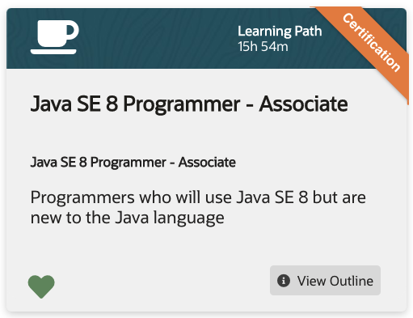
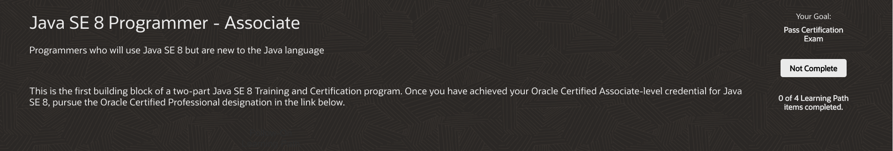
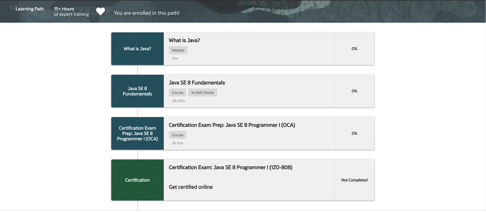

# Java SE 8 Programmer - Associate

Learning Path 15h 54m

* [What is Java?](518-Java-SE-8-Programmer-Associate/01-What-is-Java.md)

   Module - 17m

* [Java SE 8 Fundamentals](518-Java-SE-8-Programmer-Associate/02-Java-SE-8-Fundamentals.md)

   Course - 14 Skill Checks - 12h 25m

* [Certification Exam Prep: Java SE 8 Programmer I (OCA)](518-Java-SE-8-Programmer-Associate/03-Java-SE-8-Programmer-I.md)

   Course - 3h 12m

