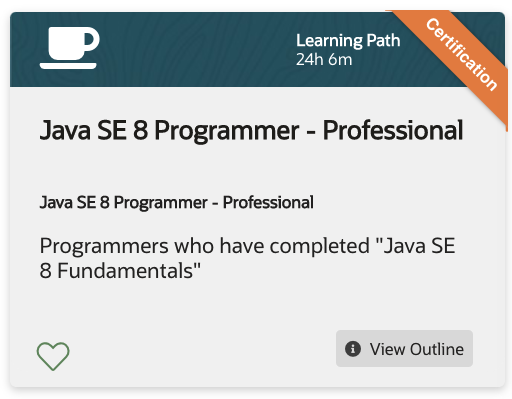
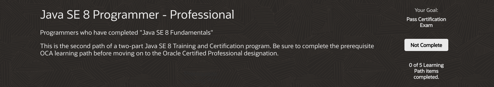

# Java SE 8 Programmer - Professional

Learning Path 24h 6m

  
* [Java SE 8 Programming](520-Java-SE-8-Programmer-Professional/01-Java-SE-8-Programming.md)	

   Course - 18 Skill Checks - Lab - 17h 56m

* [Certification Exam Prep: Java SE 8 Programmer II OCP](520-Java-SE-8-Programmer-Professional/02-Java-SE-8-Programmer-II-OCP.md)	

   Course - 1h 43m

* [Lambda Expressions	- Lambda Expressions for Cloud Services](520-Java-SE-8-Programmer-Professional/03-Lambda-Expressions.md)

   Course - 1 Skill Check - 2h 3m

* [Java SE 8 Advanced Topics](520-Java-SE-8-Programmer-Professional/04-Java-SE-8-Advanced-Topics.md)

   Course - 1 Skill Check - 2h 26m
