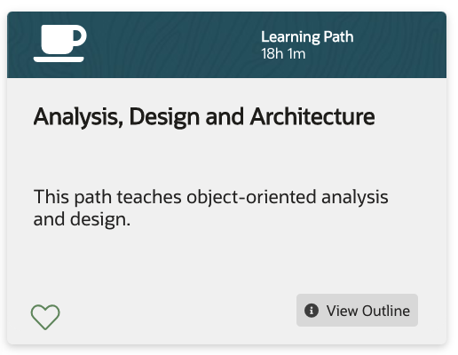
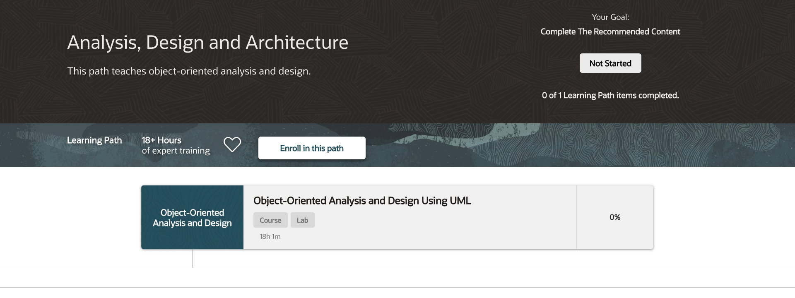

# Analysis, Design and Architecture

Learning Path 18h 1m

* [Object-Oriented Analysis and Design Object-Oriented Analysis and Design Using UML](530-Analysis-Design-and-Architecture/01-Object-Oriented-Analysis-and-Design.md)

BOOKS

* 📕 Object-Oriented Analysis and Design Using UML Ed 2: Student Guide I
* 📕 Object-Oriented Analysis and Design Using UML Ed 2: Student Guide II
* 📕 Object-Oriented Analysis and Design Using UML Ed 2: Activity Guide
