# 1. Introducción 40:13

* Instalación de las Herramientas de Desarollo 06:45
* Creación del primer Servlet 13:12
* Añadiendo contenido dinámico con JSP 07:47
* Diferencia en la ejecución de una página HTML y una JSP 04:37
* El Modelo 1 VS el Modelo Vista Controlador (MVC) 07:52

## Instalación de las Herramientas de Desarollo 06:45

En este curso vamos a desarrollar una aplicación web dinámica basada en *JSP* y *Servlets* implementando una arquitectura conocida como MVC Modelo Vista Controlador.

Al final de este curso vamos a desplegar nuestra aplicación en un servidor web gratuito para que conozcas cómo se configura y cómo desplegarlo con una URL real.

[1-herramientas](images/1-que-es%20un%20servlet.png))

Vamos a instalar nuestras herramientas de desarrollo para nuestra aplicación web las cuales van a ser:

* [Eclipse](http://www.eclipse.org) 
* [MySQL](https://dev.mysql.com/downloads/mysql/)
* [Workbench](https://dev.mysql.com/downloads/workbench/)
* [Apache Tomcat](http://tomcat.apache.org/)

**NOTA**: El el video origina se instala todo en un Mac y *se ven todos los detallos para cada herramienta*.

## Creación del primer Servlet 13:12

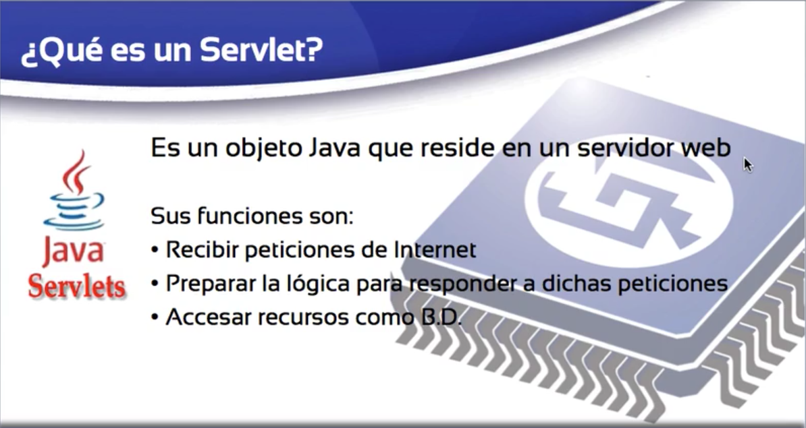

Vamos a crear nuestro primer Servlet.

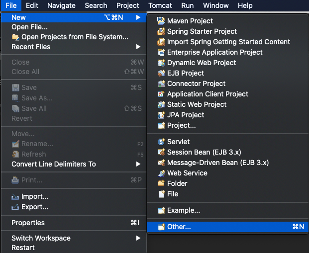

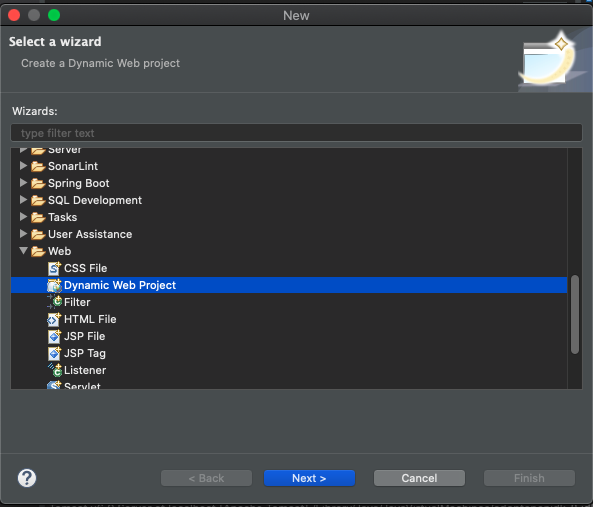

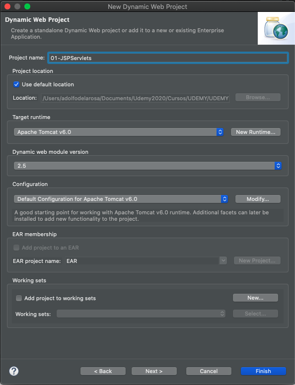

 Asegúrate de tener seleccionada la versión 2.5. Si no seleccionas la versión 2.5 no nos va a generar el archivo descriptor **web.xml** y va a usar anotaciones, para efectos de este curso usaremos el archivo **web.xml** así que vamos a usar la versión 2.5 en nombre del proyecto.

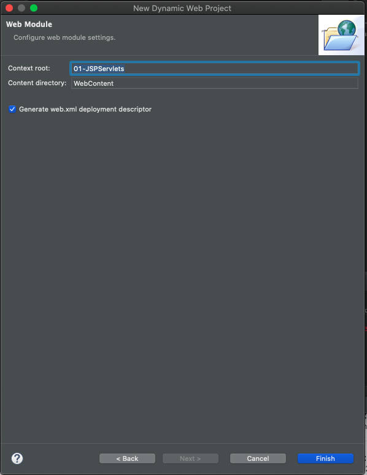

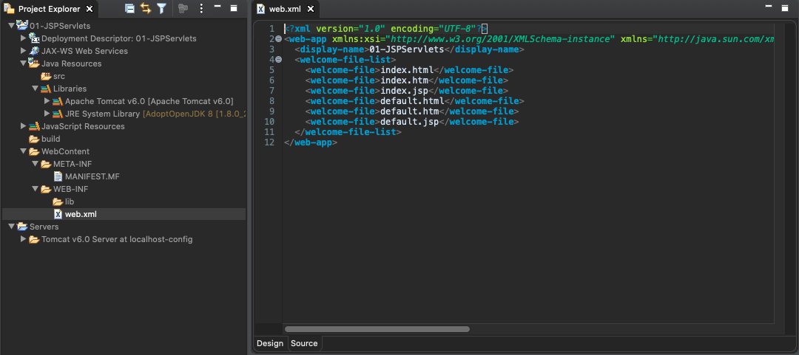

*Estructura del proyecto 01-JSPServlets*

En la carpeta **Java Resources** se almacenan todos los *Servlets* que almacenan la lógica o reglas de negocios de nuestra aplicación. 

En la carpeta **WebContent** se almacena toda la parte web es decir *JSPs*, *css*, *javascript*, etc. 

Vamos a crear un nuevo Servlet:

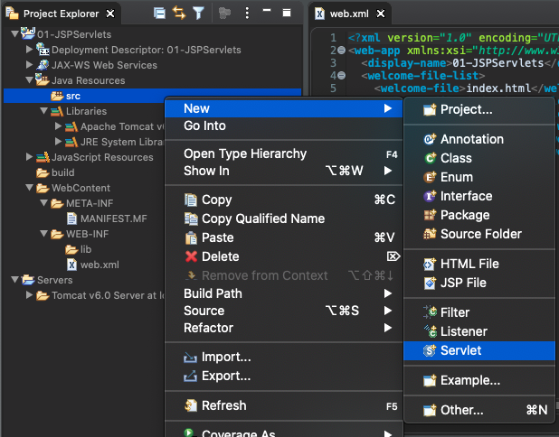

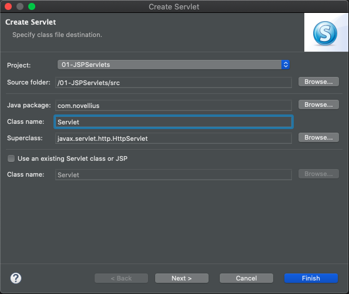

Introducimos el *nombre del paquete* y el *nombre de la clase*.

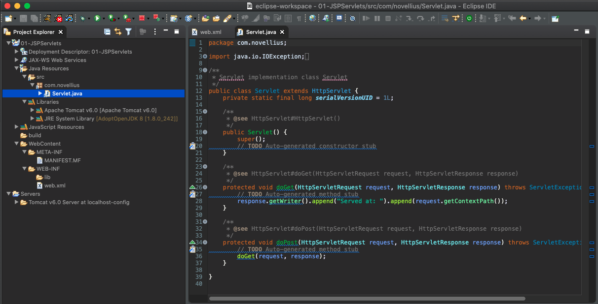

Un Servlet tiene un ciclo de vida y podemos ver información sobre esto en los siguientes enlaces:

* [Servlet Lifecycle](https://docs.oracle.com/javaee/6/tutorial/doc/bnafi.html)
* [Servlets - Life Cycle](https://www.tutorialspoint.com/servlets/servlets-life-cycle.htm)
* [Servlet Life Cycle](https://www.javatpoint.com/life-cycle-of-a-servlet)
* [Life Cycle of a Servlet](https://www.geeksforgeeks.org/life-cycle-of-a-servlet/)

Se generó el código para nuestro Servlet:

```java
package com.novellius;

import java.io.IOException;
import javax.servlet.ServletException;
import javax.servlet.http.HttpServlet;
import javax.servlet.http.HttpServletRequest;
import javax.servlet.http.HttpServletResponse;

/**
 * Servlet implementation class Servlet
 */
public class Servlet extends HttpServlet {
	private static final long serialVersionUID = 1L;
       
    /**
     * @see HttpServlet#HttpServlet()
     */
    public Servlet() {
        super();
        // TODO Auto-generated constructor stub
    }

	/**
	 * @see HttpServlet#doGet(HttpServletRequest request, HttpServletResponse response)
	 */
	protected void doGet(HttpServletRequest request, HttpServletResponse response) throws ServletException, IOException {
		// TODO Auto-generated method stub
		response.getWriter().append("Served at: ").append(request.getContextPath());
	}

	/**
	 * @see HttpServlet#doPost(HttpServletRequest request, HttpServletResponse response)
	 */
	protected void doPost(HttpServletRequest request, HttpServletResponse response) throws ServletException, IOException {
		// TODO Auto-generated method stub
		doGet(request, response);
	}

}
```
*Servlet.java*

Observaciones sobre el Servlet:

* El Servlet hereda de `HttpServlet`
* Cuenta con un constructor
* Tiene dos métodos:
   * `doGet()`
   * `doPost()`
   * Estos dos métodos tienen dos parámetros:
      * `request`
      * `response`

Podemos **ejecutar el servlet** de la siguiente manera:

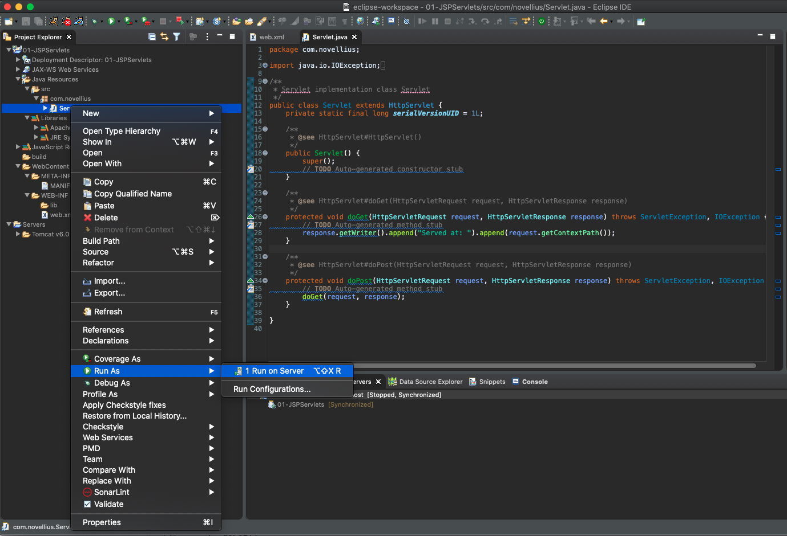

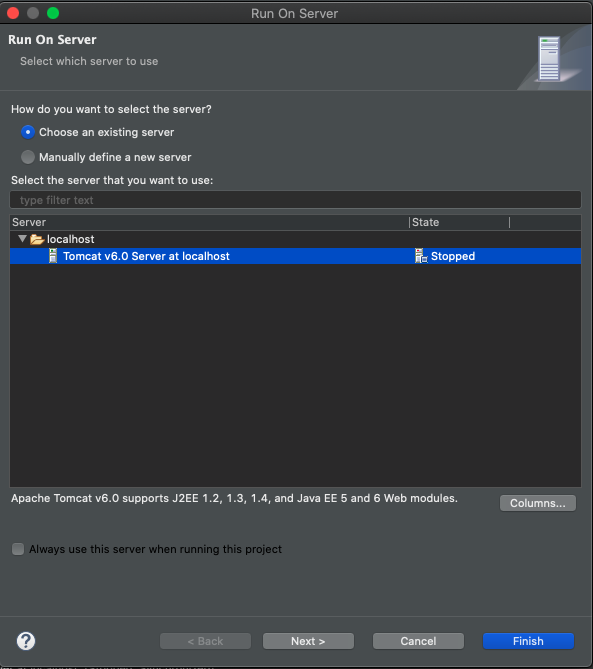

Se nos pide que indiquemos en que servidor se va a ejecutar el Servlet. Una vez que pinchemos en *Finish* se carga nuestro servidor y se ejecuta nuestro Servlet.

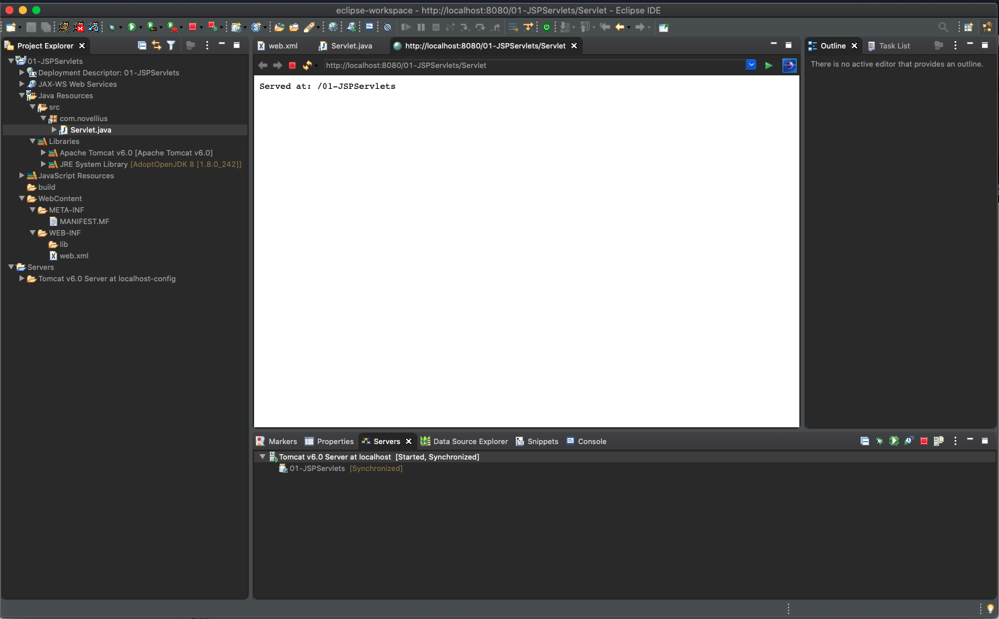

También podemos cargar el URL `http://localhost:8080/01-JSPServlets/Servlet` en un navegador:

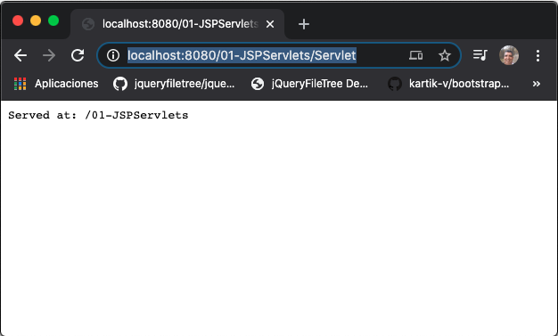

Vamos a hacer algunos cambios en el método `doGet()` para mostrar un HTML, ingrese el siguiente código en `doGet()`:

```java
protected void doGet(HttpServletRequest request, HttpServletResponse response) throws ServletException, IOException {
		// TODO Auto-generated method stub
		//response.getWriter().append("Served at: ").append(request.getContextPath());
		
		PrintWriter out = response.getWriter();
		
		out.println("<!DOCTYPE html>");
		out.println("<html>");
		out.println("<head>");
		out.println("<title>Page Title</title>");
		out.println("</head>");
		out.println("<body>");
		out.println("<h1>Primer Servlet</h1>");
		out.println("<p>Creación del primer Servlet.</p>");
		out.println("</body>");
		out.println("</html>");
	}
```

Al ejecutarlo tenemos:

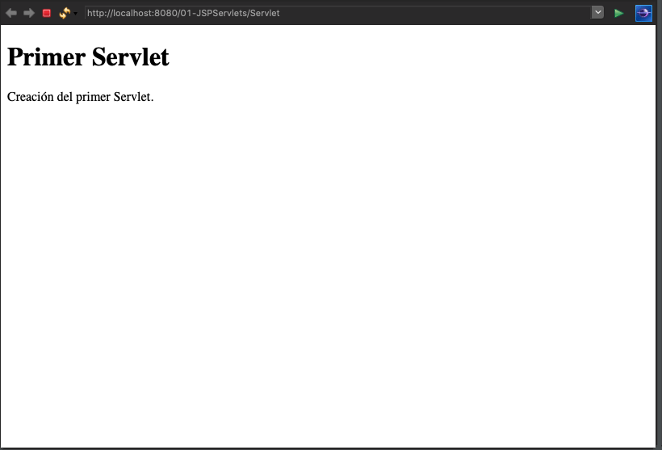

## Añadiendo contenido dinámico con JSP 07:47

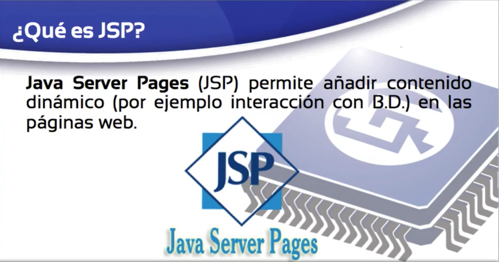

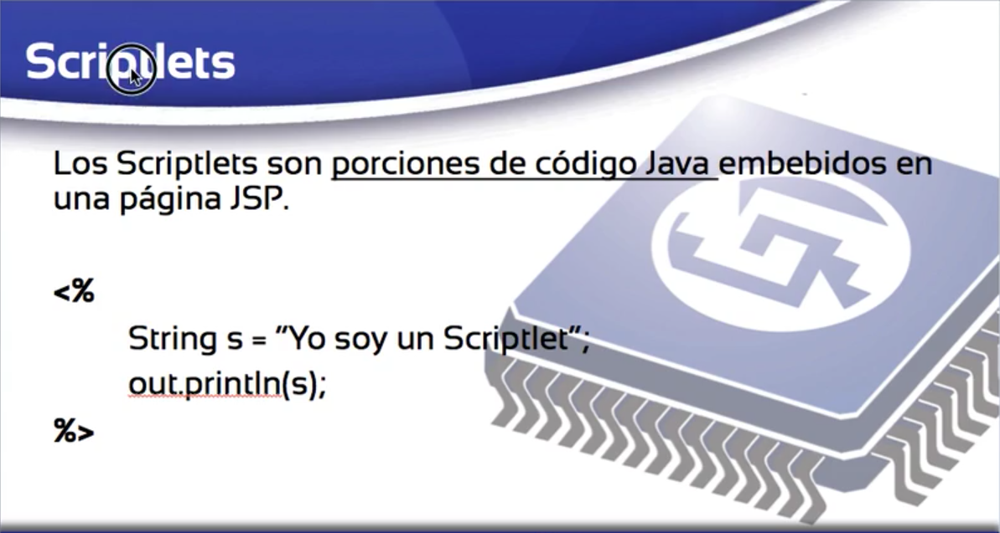

JSP combina los *Scriptlets*, *directivas JSP* más código HTML para generar contenido dinámico.

Vamos a crear un JSP:

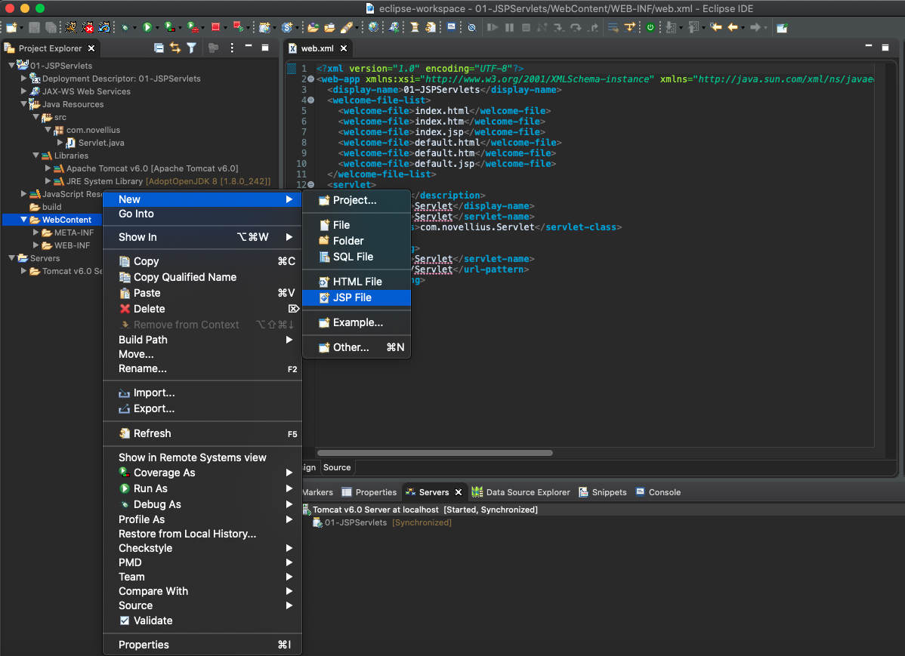

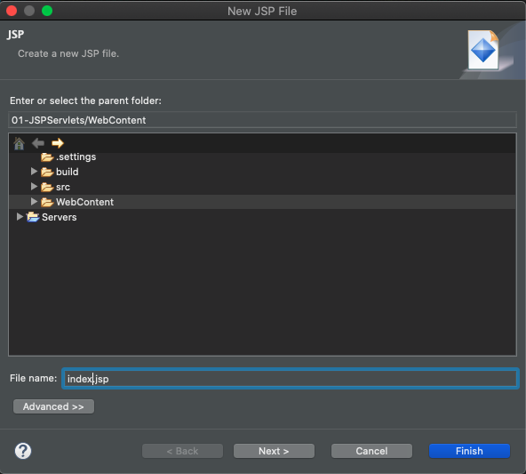

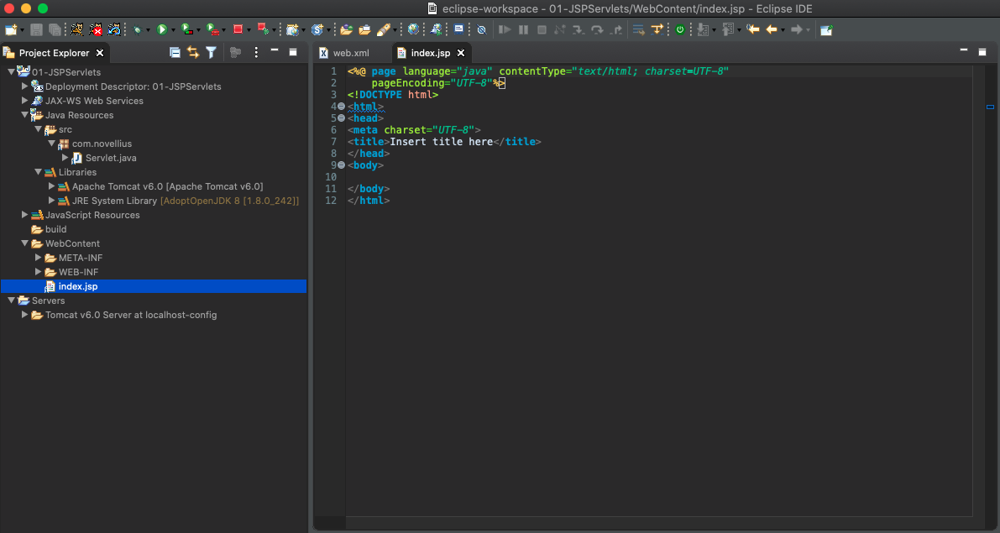

*index.jsp*

Hemos creado nuestro JSP `index.jsp` con el siguiente código:

```jsp
<%@ page language="java" contentType="text/html; charset=UTF-8"
    pageEncoding="UTF-8"%>
<!DOCTYPE html>
<html>
<head>
<meta charset="UTF-8">
<title>Insert title here</title>
</head>
<body>

</body>
</html>
```

Es un código HTML pero que incluye una directiva al inicio, que nos indica que en esta página va a ver código Java con texto HTML y con un juego de carácteres UTF-8.

Vamos a scribir el siguiente *Scriptlet* dentro del tag `body`:

```jsp
 <%
 	String s = "Este mensaje no es muy dinámico";
   	out.println(s);
 %>
```

Y vamos a ejecutar el archivo `index.jsp` con:

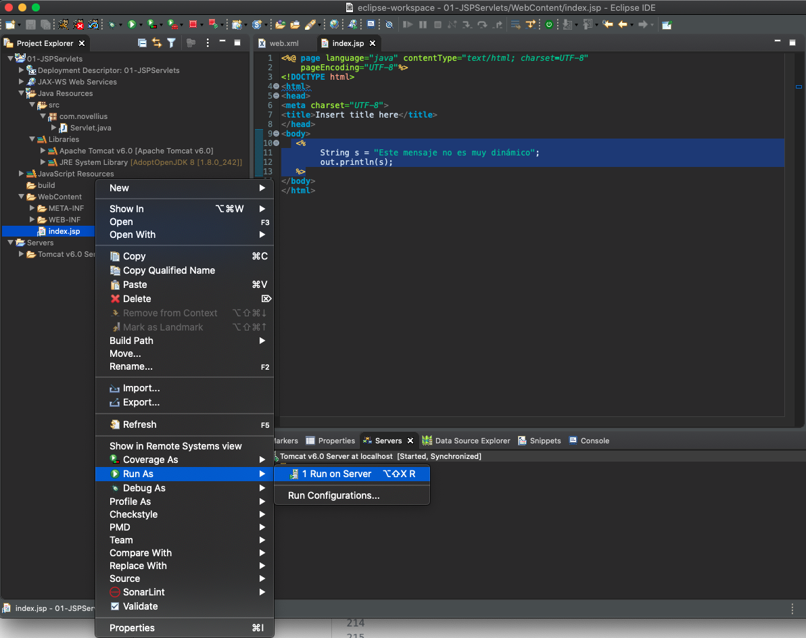

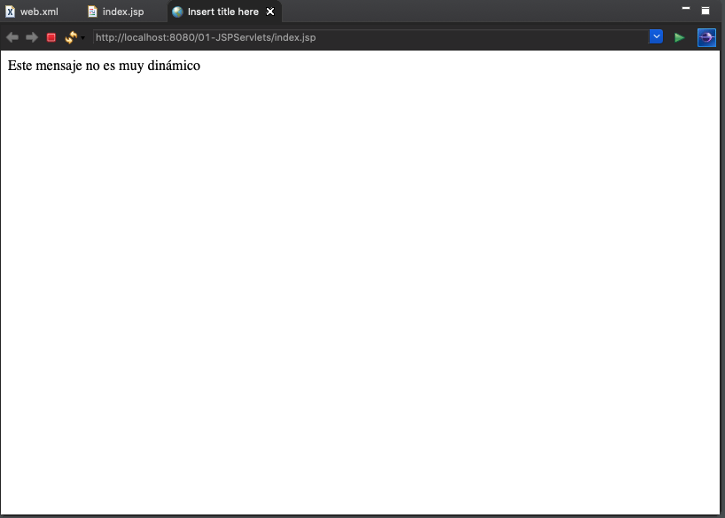

Como vemos por default la ejecución se muestra dentro del mismo Eclipse pero se puede configurar para que la ejecución se haga en nuestro navegador preferido con:

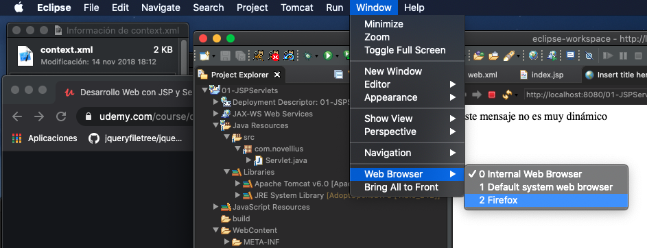

Si no aparcere tu navegador preferido se puede añadir entrando a las *Preferencias > General > Web Browser* :

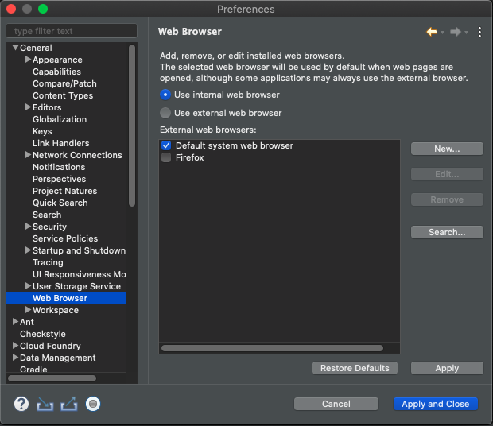

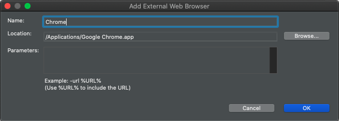

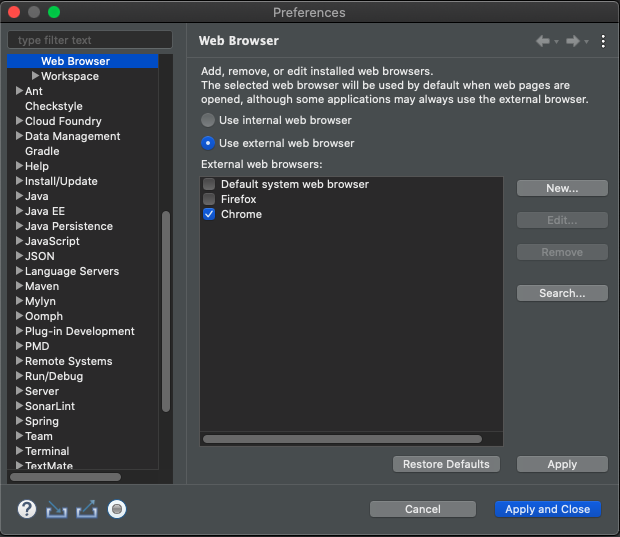

Y ahora cuando se ejecute nuestro archivo lo hara en Chrome:

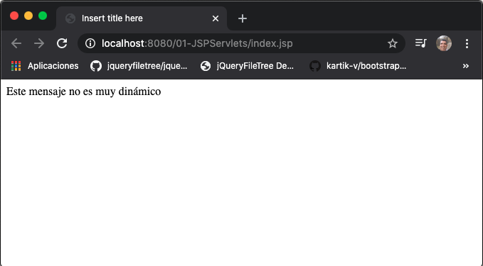

Vamos a dejar nuestro archivo `index.jsp` con el siguiente código:

```jsp
 <%@ page language="java" contentType="text/html; charset=UTF-8"
    pageEncoding="UTF-8"%>
<!DOCTYPE html>
<html>
<head>
<meta charset="UTF-8">
<title>Insert title here</title>
</head>
<body>
   <%
   	String s = "Este mensaje no es muy dinámico";
   	out.println(s);
   %>
   
    <p>Este mensaje tampoco es muy dinámico</p>
   
   <%
   	out.println("Este mensaje SI es muy dinámico <br><br>" + request.getHeader("USER-AGENT"));
   %>
</body>
</html>
```

Y lo ejecutamos:

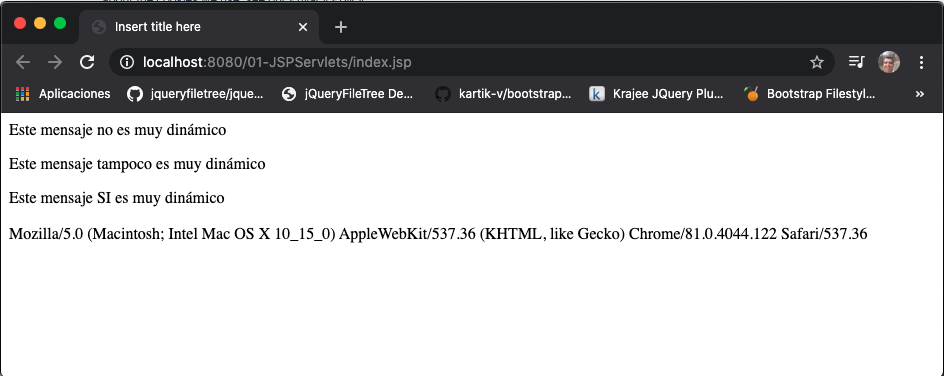

## Diferencia en la ejecución de una página HTML y una JSP 04:37

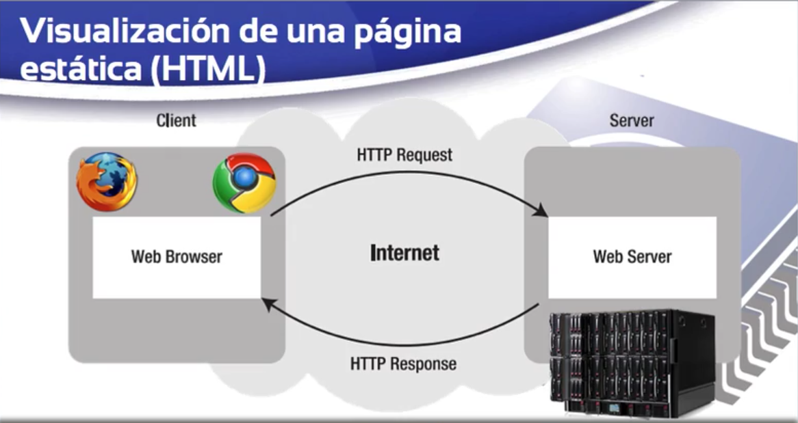

Cuando ejecutamos una página HTML el cliente que es el navegador Web, envia una petición HTTP al servidor.

Creación de una página HTML.

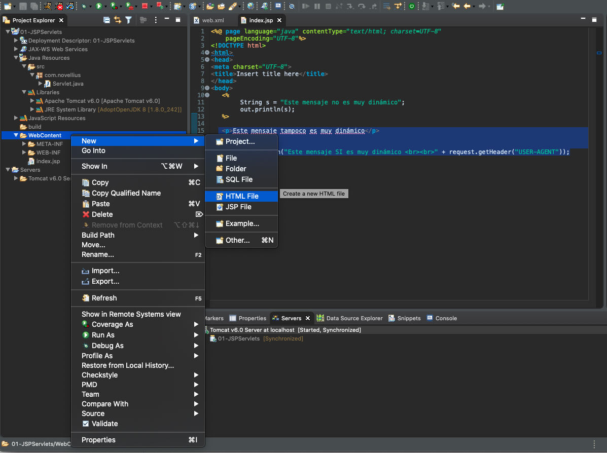

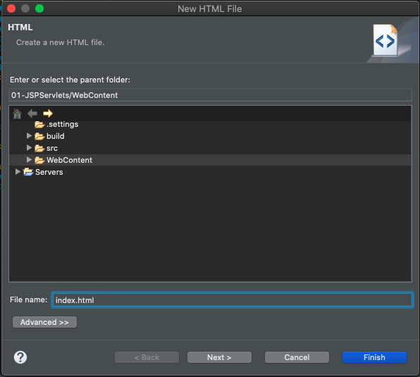

Nos crea el siguiente código:

```html
<!DOCTYPE html>
<html>
<head>
<meta charset="UTF-8">
<title>Insert title here</title>
</head>
<body>

</body>
</html>
```

Vamos a meter el encabezado `<h1>Index.html</h1>` en el body y ejecutamos el archivo.

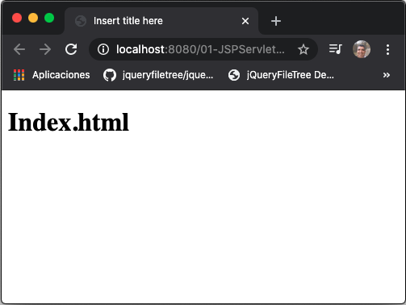

Cuando escribiendo el URL `http://localhost:8080/01-JSPServlets/index.html` en el navegador y pulsamos enter, el navegador web hace una petición HTTP al servidor el cual contiene un *servidor web* en este caso Tomcat, el servidor busca el recurso solicitado la página `index.html` y cuando la encuentra envía una respuesta HTTP al navegador, es cuando vemos el resultado.

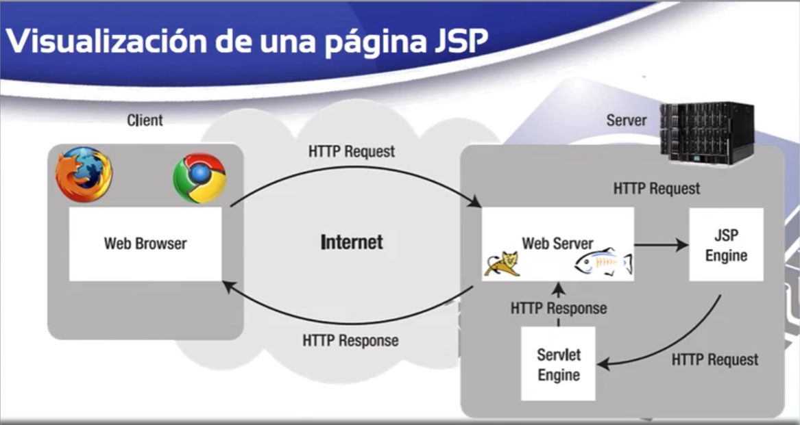

Cuando ejecutamos un JSP es diferente, el cliente o navegador web hace la petición HTTP al introducir un URL por ejemplo `http://localhost:8080/01-JSPServlets/index.jsp`, la petición HTTP llega al servidor web **el cual debe ser compoatible con JSP y Servlets** por ejemplo Tomcat, Glassfish, Jetty, JBOSS, el servidor recibe la petición HTTP y la redirige a un motor JSP el cual busca la página JSP cuando la encuentra la transforma en un Servlet a través de un motor de Servlets y cuando ya la tiene la regresa al navegador el cual se encarga de renderizar el Servlet que recibio como respuesta.

## El Modelo 1 VS el Modelo Vista Controlador (MVC) 07:52

Existen dos modelos para la arquitectura de aplicaciones JSP.

* Modelo 1
* Modelo Vista Controlador MVC

### Modelo 1 JSP

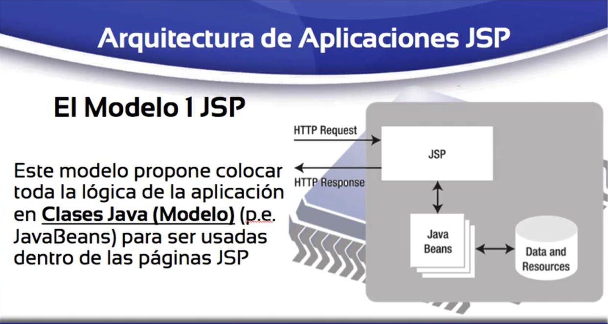

El Modelo 1 propone una vista y un modelo, la vista es una página JSP la cual maneja las peticiones hechas a través de URLs y el modelo que son clases Java y JavaBeans que tienen acceso a la BD.

Este modelo esta bien para sitios web pequeños, para sitios grandes se complica la códificación y mantenimento.

### Modelo MVC


En el Modelo MVC el que atiende las peticiones ya no es un JSP es directamente un Servlet llamando **Controlador (Controller)** el cual tiene dos funciones principales:

* El Controlador decidira que **Vista** (JSP) debe mostrarse de acuerdo a la solicitud recibida
* El Controlador puede instanciar objetos JavaBeans que interactuen con la BD y recibir los datos procesados para proporcionarselos a los JSP y sean pintados en la vista.

Por lo que en resumen el **Controlador** es un Servlet que controla de acuerdo a ciertas acciones que Vista será devuelta, la **Vista** es todo el conjuto de páginas JSPs y el **Modelo** son clases Java y JavaBeans que interactuan con la BD.

El modelo MVC es recomendable por ser robusto, segura y facíl de mantener.

### Ejemplo 04-JSPServlet

Vamos a crear un proyecto y lo llamaremos 04-JSPServlet, dentro de este proyecto creamos un Servlet llmado `Servlet.java` y un JSP llmado `index.jsp`. Nuestro Servlet será el Controlador y nuestro JSP será la Vista. 

Vamos a insertar el código dentro de estos dos archivos, en el JSP simplemente vamos a insertar el encabezado:

`<h1>Modelo Vista Controlador MVC</h1>`

En el Servlet dentro del método `doGet()` vamos a insertar el siguiente código:

```java
protected void doGet(HttpServletRequest request, HttpServletResponse response) throws ServletException, IOException {
    
    getServletContext().getRequestDispatcher("/index.jsp").forward(request, response);		

}
```
* `getServletContext()`: Retorna un objeto ServletContext que guarda la información referente al servidor.
* `getRequestDispatcher()`: Método que acepta una ruta como parámetro.
* `forward(request, response)`: Método que redirige a la ruta indicada.

Para ejecutar este proyecto ya no lo vamos a hacer sobre el archivo `Servlet.java` o sobre el archivo `Index.jsp`, lo que haremos es ejecutar el proyecto en el servidor:

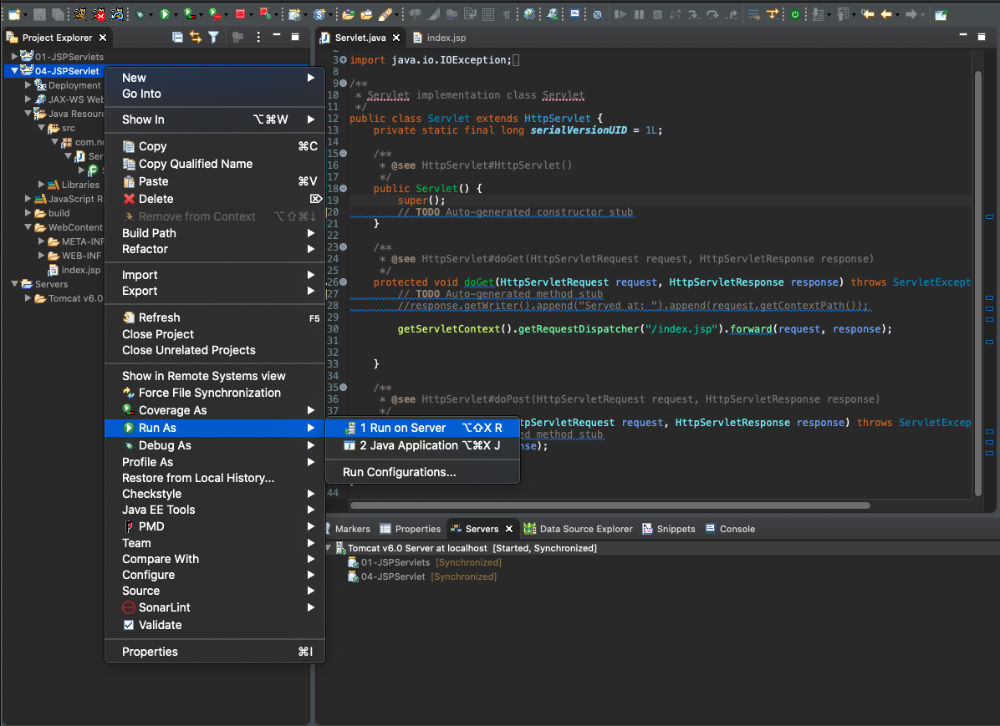

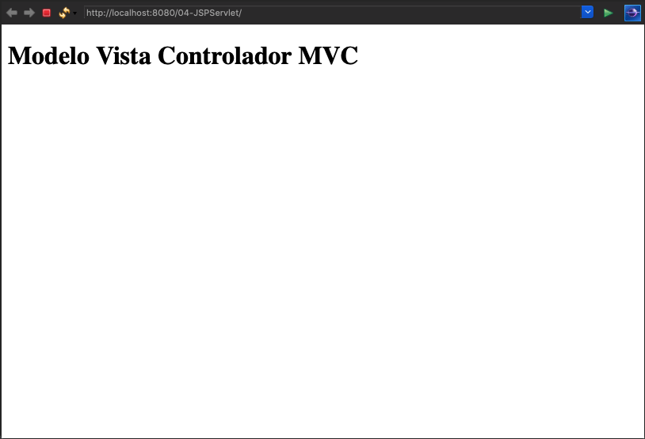

La URL que estamos ejecutando es: `http://localhost:8080/04-JSPServlet/` es importante observar que al final ya no pone *el nombre del archivo* `Servlet` o `index.html`, solo esta el Protocolo, Dominio y la ruta o contexto, el cual podríamos eliminar si entramos a los *Web Modules* de Tomcat.

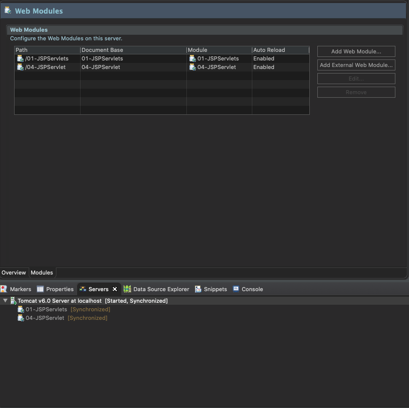
