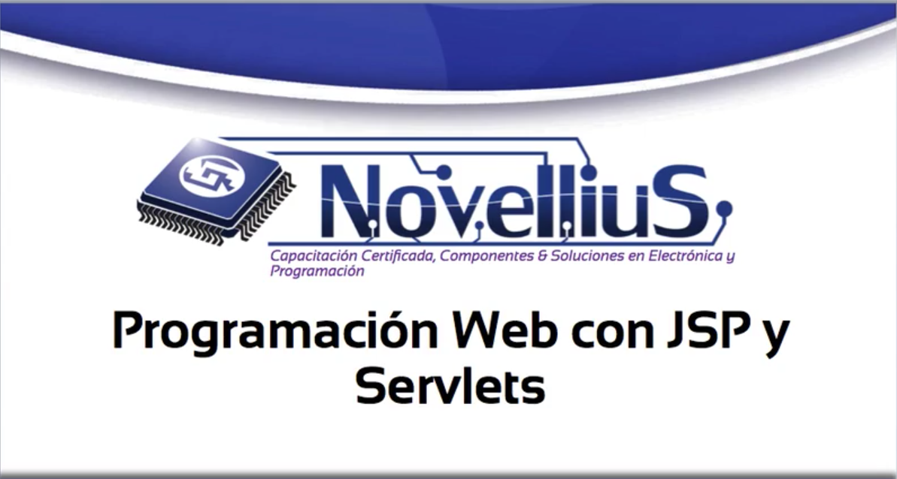

# 1. Introducción 40:13

* Instalación de las Herramientas de Desarollo 06:45
* Creación del primer Servlet 13:12
* Añadiendo contenido dinámico con JSP 07:47
* Diferencia en la ejecución de una página HTML y una JSP 04:37
* El Modelo 1 VS el Modelo Vista Controlador (MVC) 07:52

## Instalación de las Herramientas de Desarollo 06:45

En este curso vamos a desarrollar una aplicación web dinámica basada en *JSP* y *Servlets* implementando una arquitectura conocida como MVC Modelo Vista Controlador.

Al final de este curso vamos a desplegar nuestra aplicación en un servidor web gratuito para que conozcas cómo se configura y cómo desplegarlo con una URL real.

Vamos a instalar nuestras herramientas de desarrollo para nuestra aplicación web las cuales van a ser:

* Eclipse en la versión extendida de nuestro IDE Mahi Esquivel server.
* Para crear una base de datos Esquivel Workbench para diseñar nuestra base de datos
* Apache Tomcat para desplegar un pequeño servidor web local

visita por favor Eclipse punto org diagonal downloads y aquí vamos a ver que hay bastantes versiones

de Eclipse que nosotros necesitamos como mencioné anteriormente es la versión.

He aquí una descripción nos indica que es para cuestiones web.

Tú puedes también descargar la versión estándar y anexar un plugin para convertirla en la versión web

o descargar directamente la versión y no necesitas la versión estándar más el plugin.

Entonces yo tengo una mac de 64 bits voy a descargar la versión de 64 bits vamos a hacer click aquí.

Yo ya lo tengo descargado.

Entonces voy a causa de esta descarga cuando termines de descargarlo va a aparecer este archivo Eclipse

Standard Kepler etc.

Si yo le doy un click Mac me va a verista archivo estaba compresora y me genera esta carpeta eclipse

no se instala como tal o por lo menos que yo sepa no. hasta Windows Mac y Linux sino simplemente es

como un ejecutable.

Entonces lo que tú puedes hacer es arrastrar esta carpeta en aplicaciones como yo lo he hecho y de aquí

tomar este punto app ponerlo en Tuvok y ya puedes trabajar con Eclipse ok.

Una vez instalado Eclipse vamos a instalar mi Esquivel para Mac.

Entonces por favor visita este link que está haciendo pantalla y como ves esta pagina Agen automáticamente

me genera qué tipo de plataforma o sistema operativo más bien estoy usando yo en este caso me auto descubrió

que estoy en Mac y como mi make 64bits voy a descargar este archivo

el cual es un DMG yo lo descargué automáticamente porque ya tengo una cuenta de Oracles.

Si no tienes una cuenta de Oracle te va a pedir o que te registres o que inicies sesión.

También descargada si que va a pasar mi descarga y me va a aparecer este MG que dice me describe el

punto donde con 5.6 puntos 17 si eres de un clic en ese quién me va a abrir estos 4 archivos estos 4

archivos son parte de la instalación pero no todos son forzosos.

El único que instala el Esquivel es el primero si yo le doy doble click.

Esto no tiene gran complicación no podemos continuar continuar siguiente acepto etcétera etcétera.

Yo no lo voy a entrar porque ya lo tengo instalado cuando ya lo tenga instalado Mayes que vuelva a estar

instalado en mi Mac.

Sin embargo si yo quiero que cuando habrá preferencias del sistema me aparezca esta pequeña aparatado

de maíz Esquivel tengo que instalar este Maya esquivé el punto preppy si no no me va a parecer y lo

voy a tener que ejecutar y detener desde mi terminal.

Ahora si tú quieres que automáticamente el servicio se inicie cada vez que arrancas tu Mac instale este

paquete.

De lo contrario con este paquete que es el primero es suficiente cuando instales todo te va a pasar

este apartado si le damos clic vamos a ver que mi servicio está ejecutándose yo lo puedo detener

y yo lo puedo iniciar nuevamente y este check box me indica si yo quiero automáticamente iniciar el

servicio.

Ok ahora vamos a irnos con el maíz que viene.

Este es un IDE para trabajar con bases de datos generar diagramas de relación generar scripts etc etc.

Yo te voy a enseñar y rápidamente vamos a crear un diagrama de relación y generar nuestro script Jaizkibel

y crear nuestra base de datos.

Para descargar esto visita este LINK.

De dice que el punto com diagonal Down Dodds diagonal Tux diagonal Workbench.

También te descubre automáticamente qué plataforma o sistema operativo estás usando en este caso pues

sólo hay un archivo que es para 32bits que aunque yo tengo una matriz 64bits a mí no me ha resultado

ningún problema en usar esta versión entonces lo descartó nuevamente.

Si no tienes una cuenta en Oracle crea una porque si no no te deja descargar estos archivos como yo

lo tengo descargado voy a pasar esta descarga me va a crear o a descargar más bien un archivo

de M.G. con el patch el cual es este si le das doble click.

Esto si no tiene mayor problema nada más lo arrastras a tu carpeta Aplicaciones y está instalado entonces

ya acabo de instalar Eclipse Workbench Mischel solo me resta instalar mi servidor web lo cual lo vamos

a realizar en el siguiente tutorial y a crear nuestro primer servlet hasta la próxima.

Utilizamos cookies para ofrecerte la mejor experiencia en línea. Al usar nuestro sitio web, accedes a usarlas con arreglo a nuestra política de cookies.Aquí puedes encontrar más información.

## Creación del primer Servlet 13:12
## Añadiendo contenido dinámico con JSP 07:47
## Diferencia en la ejecución de una página HTML y una JSP 04:37
## El Modelo 1 VS el Modelo Vista Controlador (MVC) 07:52
