# 3. Bases de Datos 26:30

* Introducción 02:45
* Diseño de un diagrama E-R sencillo 09:35
* Generación del script SQL 06:22
* Configuración de la BD mediante JNDI 07:48

## Introducción 02:45

[JSP Tutorial](https://www.tutorialspoint.com/jsp/index.htm)

## Diseño de un diagrama E-R sencillo 09:35

En esta lección diseñaremos un diagrama Entidad-Relación que nos permitira realizar operaciones sobre la base de datos. 

Lo primero que debemos asegurarnos es que MySQL se esta ejecutando. 

En Mac debemos entrar en las **preferencias del Sistema**.


Pulsamos en el simbolo de MySQL


Y nos aseguramos de que se esta ejecutando y si no es así pulsamos el botón para levantar MySQL.

Una vez comprobado esto entramos a **Workbeanch** 


Vamos entrar a la conexión por defecto `Local instance 3306`, nos pedirá la contraseña que asigmas al instalar MySQL para el usuario `root` en este caso es `password`.


Esta conexión por default esta alojada en `127.0.0.1:3306` tiene un usuario `root` con contraseña `password` y esta asociada a una BD test. En la realidad no es aconsejable usar un usuario `root` y deberiamos tener una contraseña robusta, ademas de tener una ruta y puerto diferente por cuestiones de seguridad.

Una vez que ingresamos los datos de acceso muestra lo siguiente:


### Crear una Base de Datos

Para crear una nueva base de datos pulsamos sobre el icono de *Create New Schema...*


Nos pide un nombre para el nuevo esquema, introducimos `administradores` y presionamos el botón `Apply`


Me genera el Script para generar el nuevo esquema presionamos el botón `Apply` para aplicarlo.


Finalmente me indica que todo se a ejecutado correctamente.


Y en la lista de esquemas ya me aparece el de `administradores`.


### Crear la conexión con la Base de Datos

Retornamos al inicio en Workbeanch y vamos a presionar el simbolo de **+** en **MySQL Connections.


Nos muestra la siguiente pantalla.


Aquí vamos a meter los datos para nuestra nueva conexión, solo metemos `administradores` en el nombre del esquema y esquema por default. 


Vamos a presionar el botón `Test Connection` para probar la conexión, nos pide los accesos.


Y nos indica que la conexión a ido perfecta.


Por lo que presionamos el boton `OK` y nos aparecerá una conexión directa a `administradores`.


Si la presionamos entraremos directamente a la base de datos `administradores` activada para poder usarla.


### Crear el Diagrama Entidad-Relación de la Base de Datos

Podríamos crear la BD con Scrips SQL directamente pero lo haremos de una forma distinta creando un diagrama E-R. Vamos al inicio de Workbeanch y en la parte lateral izquierda el segundo icono nos permitira acceder a la seccion de los modelos.


Vamos a presionar el icono de los Modelos.


Tenemos un modelo llamado `sakilla_full` el cual a sido creado al instalar MySQL. Nosotros presionamos en el signo de **+** para crear nuestro modelo.


Vamos a dar doble click en el icono `mydb` para cambiar el nombre y poner `administradores`.


Ahora podemos dar doble click en `Add Diagram` y nos aparecera la interfaz para crear mi diagrama E-R. 


Podemos ver la BD administradores en los paneles de la izquierda donde se listan tablas, vistas y procedimientos almacenados. por ahora todo esta vacío. 

En la parte central tenemos varios botones que nos permitiran crear tablas, vistas, procedimientos almacenados, relaciones entre las tablas, podemos insertar imagenes, textos, etc. Usaremos algunos de estos botones para crear nuestro diagrama, vamos a seguir los siguientes pasos:

##### Crear tabla administrador

* Pulsar en el botón `New Table` y pulsamos en la rejilla, aparecerá una tabla.
* Editemos la tabla dandole doble click
* Podremos el nombre de `administrador` a la tabla.
* Vamos a insertar los campos:
   * `id` Con los atributos PK, NN y AI
   * `email`
   * `contrasena`
   * `nombre`
   * `estado`


* Salvamos nuestro diagrama pulsando el botón `Savel Model`, nospide el nombre y sitio en el que lo queremos guardar.


##### Crear tabla pregunta

* Pulsar en el botón `New Table` y pulsamos en la rejilla, aparecerá una tabla.
* Editemos la tabla dandole doble click
* Podremos el nombre de `pregunta` a la tabla.
* Vamos a insertar los campos:
   * `idpregunta` Con los atributos PK, NN y AI
   * `pregunta`

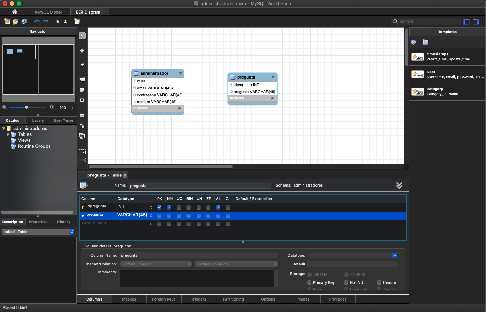

##### Crear relación entre las tablas

* Vamos a seleccionar una Relación No-Identificada (segundo botón de las relaciones)
* Damos clic en la tabla `administrador` y después en la tabla `pregunta` para que nos cree la relación.

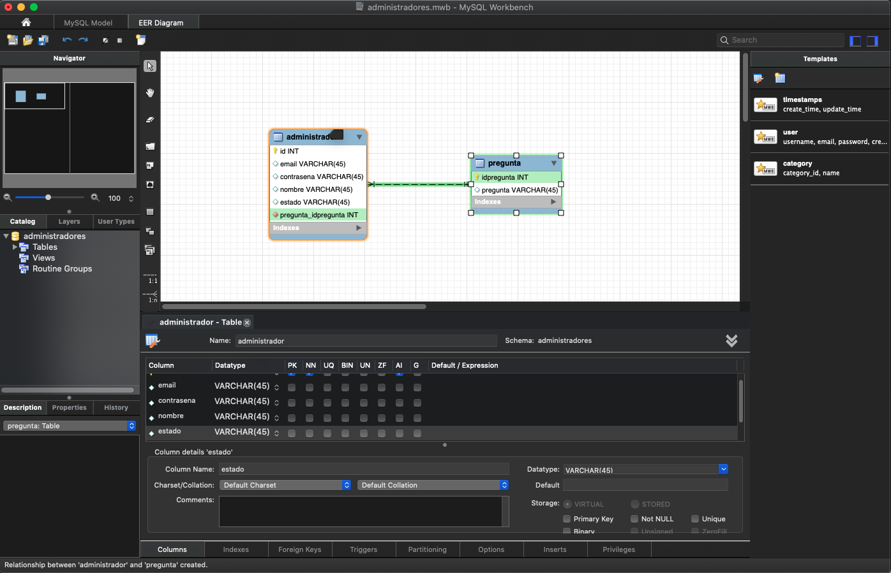

Observamos que al crear la relación nos ha insertado el campo `pregunta_idpregunta` dentro de la tabla `administrador`, lo cual nos permite claramente ver la relación entre las tablas. Podemos cambiar el nombre de ese campo le pondremos simplemente `idpregunta`, podemos salvar nuestro modelo.

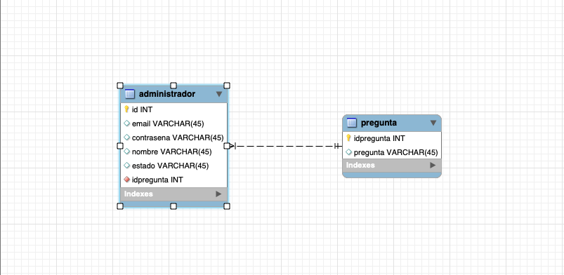

### Generación del script SQL 06:22

En esta lección crearemos el Script para generar la BD a partir del modelo creado, para lo cual nos vamos al menú *Database > Forward Engineer*

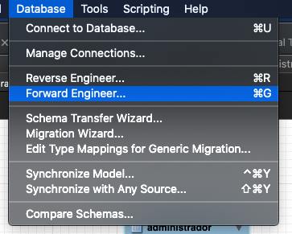

Al seleccionarla nos aparece:

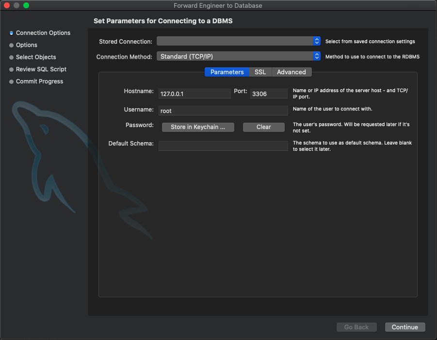

Esta opción lo que hara es **crear el Script SQL y ejecutarlo sobre una conexión creada anteriormente** 

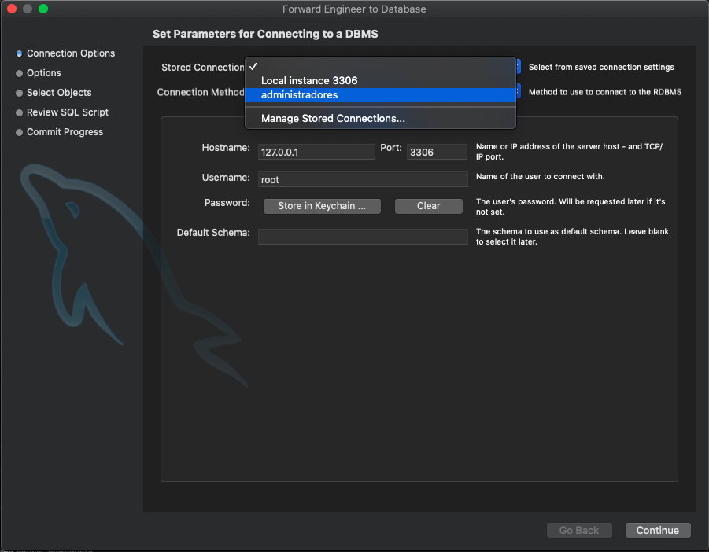

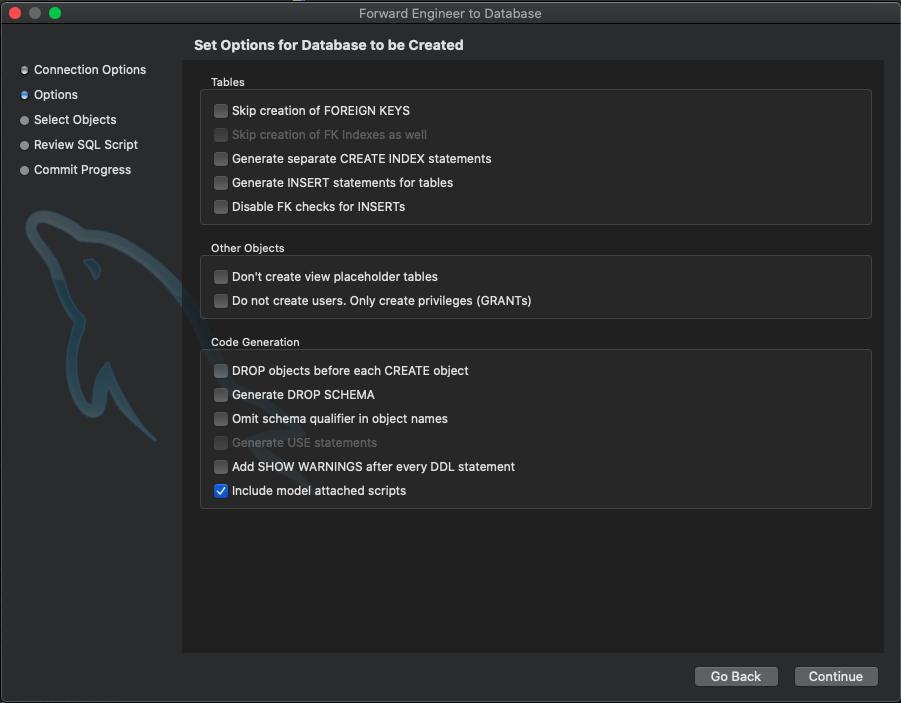

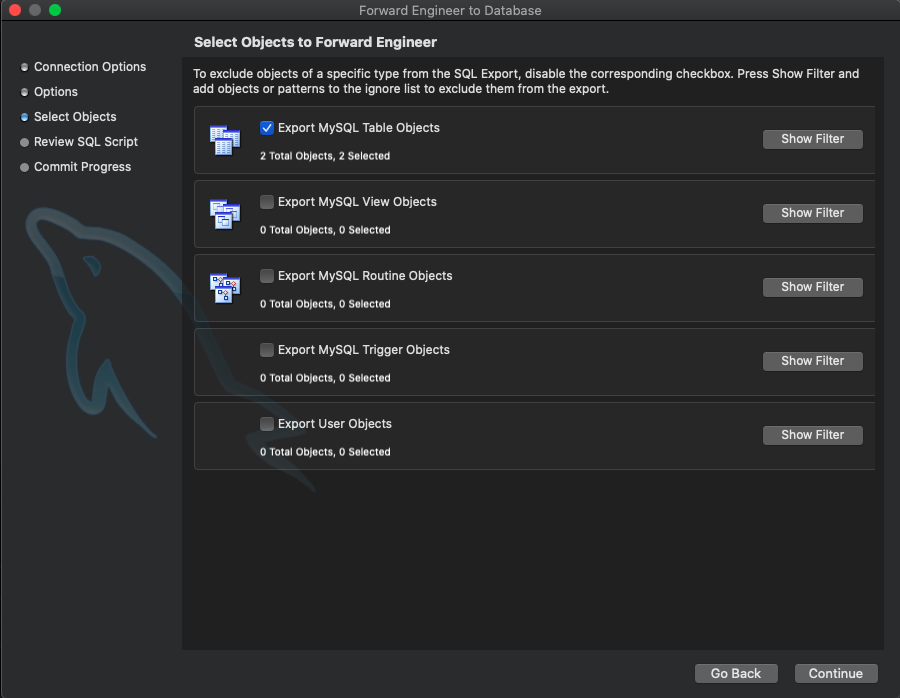

Finalmente nos crea el Script SQL el cual podemos salvar en un archivo o copiar.

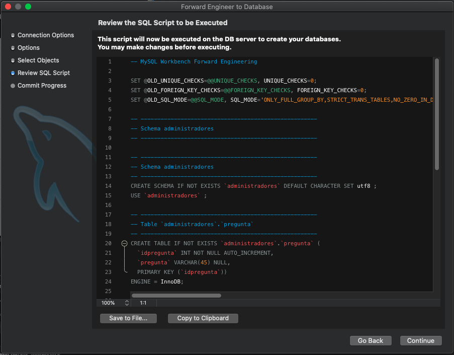

Este es el Script generado:

```sql
-- MySQL Workbench Forward Engineering

SET @OLD_UNIQUE_CHECKS=@@UNIQUE_CHECKS, UNIQUE_CHECKS=0;
SET @OLD_FOREIGN_KEY_CHECKS=@@FOREIGN_KEY_CHECKS, FOREIGN_KEY_CHECKS=0;
SET @OLD_SQL_MODE=@@SQL_MODE, SQL_MODE='ONLY_FULL_GROUP_BY,STRICT_TRANS_TABLES,NO_ZERO_IN_DATE,NO_ZERO_DATE,ERROR_FOR_DIVISION_BY_ZERO,NO_ENGINE_SUBSTITUTION';

-- -----------------------------------------------------
-- Schema administradores
-- -----------------------------------------------------

-- -----------------------------------------------------
-- Schema administradores
-- -----------------------------------------------------
CREATE SCHEMA IF NOT EXISTS `administradores` DEFAULT CHARACTER SET utf8 ;
USE `administradores` ;

-- -----------------------------------------------------
-- Table `administradores`.`pregunta`
-- -----------------------------------------------------
CREATE TABLE IF NOT EXISTS `administradores`.`pregunta` (
  `idpregunta` INT NOT NULL AUTO_INCREMENT,
  `pregunta` VARCHAR(45) NULL,
  PRIMARY KEY (`idpregunta`))
ENGINE = InnoDB;


-- -----------------------------------------------------
-- Table `administradores`.`administrador`
-- -----------------------------------------------------
CREATE TABLE IF NOT EXISTS `administradores`.`administrador` (
  `id` INT NOT NULL AUTO_INCREMENT,
  `email` VARCHAR(45) NULL,
  `contrasena` VARCHAR(45) NULL,
  `nombre` VARCHAR(45) NULL,
  `estado` VARCHAR(45) NULL,
  `idpregunta` INT NOT NULL,
  PRIMARY KEY (`id`),
  INDEX `fk_administrador_pregunta_idx` (`idpregunta` ASC) VISIBLE,
  CONSTRAINT `fk_administrador_pregunta`
    FOREIGN KEY (`idpregunta`)
    REFERENCES `administradores`.`pregunta` (`idpregunta`)
    ON DELETE NO ACTION
    ON UPDATE NO ACTION)
ENGINE = InnoDB;


SET SQL_MODE=@OLD_SQL_MODE;
SET FOREIGN_KEY_CHECKS=@OLD_FOREIGN_KEY_CHECKS;
SET UNIQUE_CHECKS=@OLD_UNIQUE_CHECKS;
```

Al presionar continue me resume las tareas que ha realizado


* Conectarse a la BD
* Ejecuta el Script SQL
* Lee cambios hechos en en el servidor
* Salva el estado de sincronización

como podemos ver todo se ha ejecutado correctamente en caso de algún posible error tenemos el botón `Show log` para ver el log y solucionar el problema.

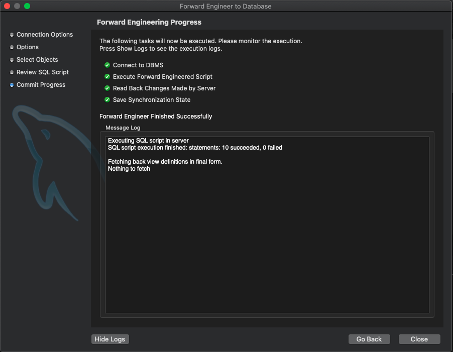

Cerramos el popup.

Una vez hecho todo esto podemos regresar a la sección de conexiones y entrar a nuestra conexión **administradores**, donde podremos ver que las tablas han sido creadas en nuetra BD.

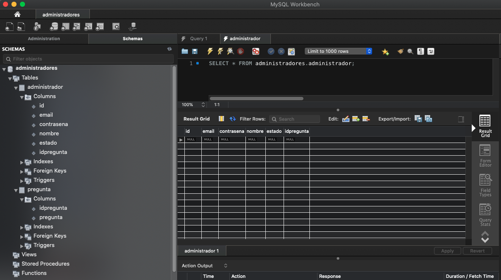

### Insertar datos en la tabla preguntas

Para insertar datos en una tabla lo haremos a través de sentencias `insert` de `SQL`, vamos a insertar lo siguiente:

```sql
insert into pregunta(idpregunta, pregunta) values(1, 'Nombre de la primer mascota');
insert into pregunta(idpregunta, pregunta) values(2, 'Apellido de soltera de la madre');
```

Una vez que insertemos las instrucciones las podemos ejecutar.

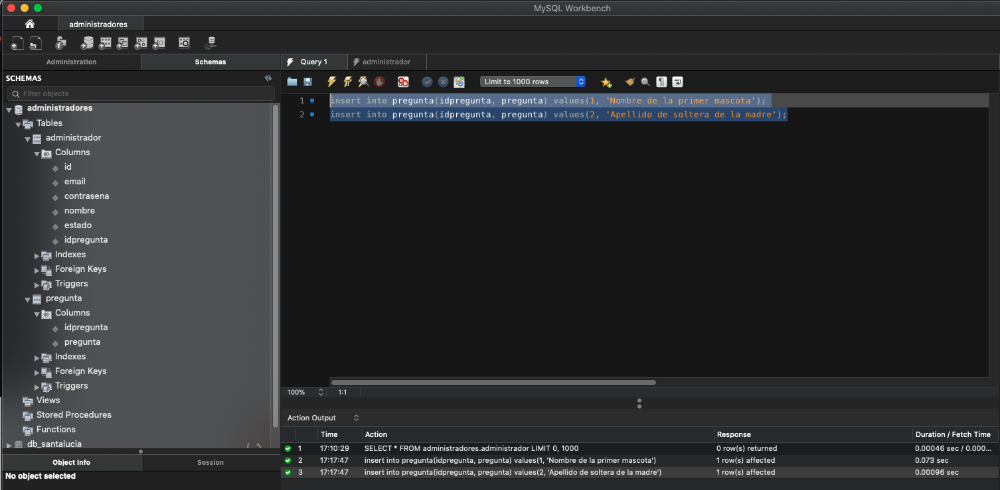

También podríamos guardar las el script pulsando el botón `Save script to file`

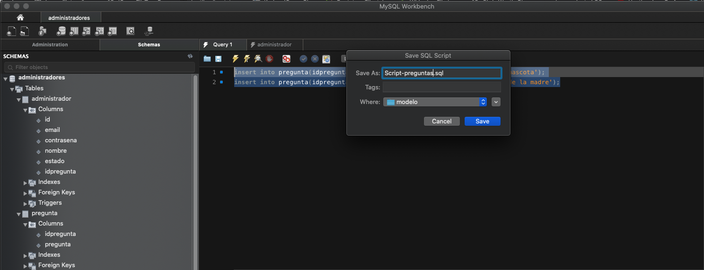

Para ver los datos insertados en la tabla podemos dar el `select` automatico que tenemos en el contexto de la tabla.

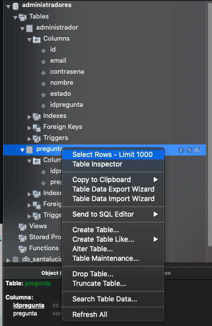

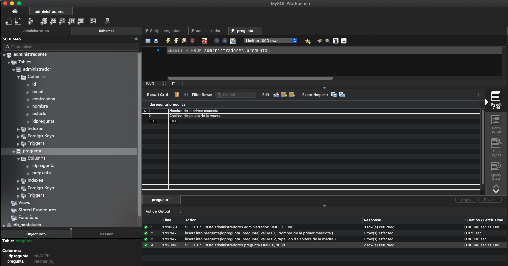

También podemos insertar directamente registros en la tabla 

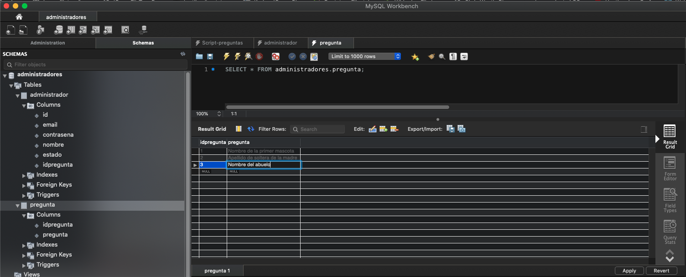

Al presionar el botón `Apply` nos presenta el Script necesario para insertar el registro, presionamos nuevamente el botón `Apply`.

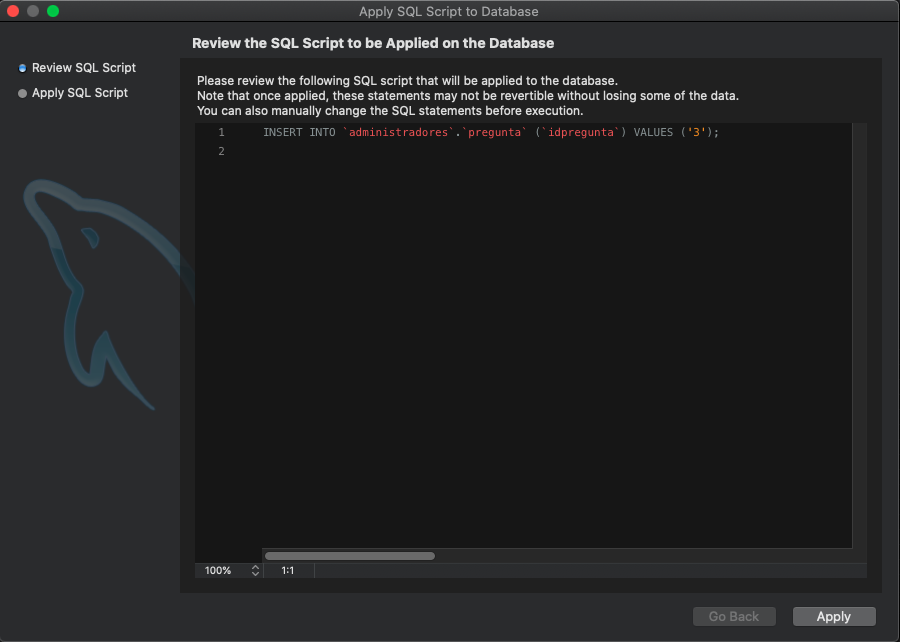

Nos indica que todo ha ido bien.

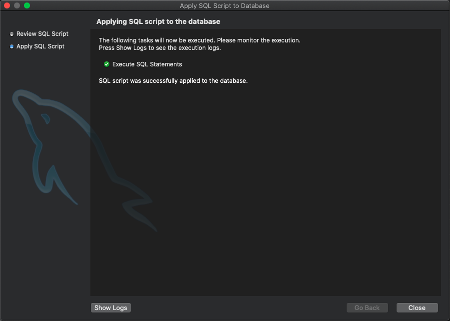

Y ya podemos ver la tabla con los tres registros insertados.

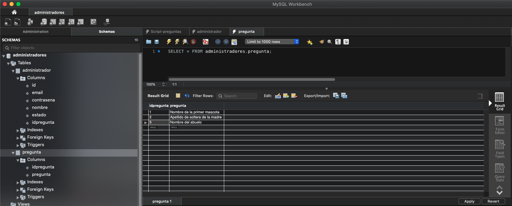

## Configuración de la BD mediante JNDI 07:48

