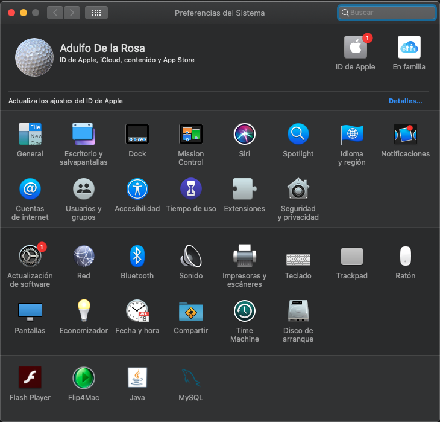
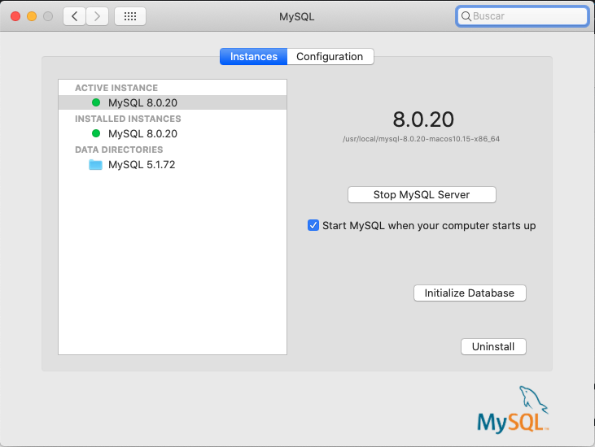
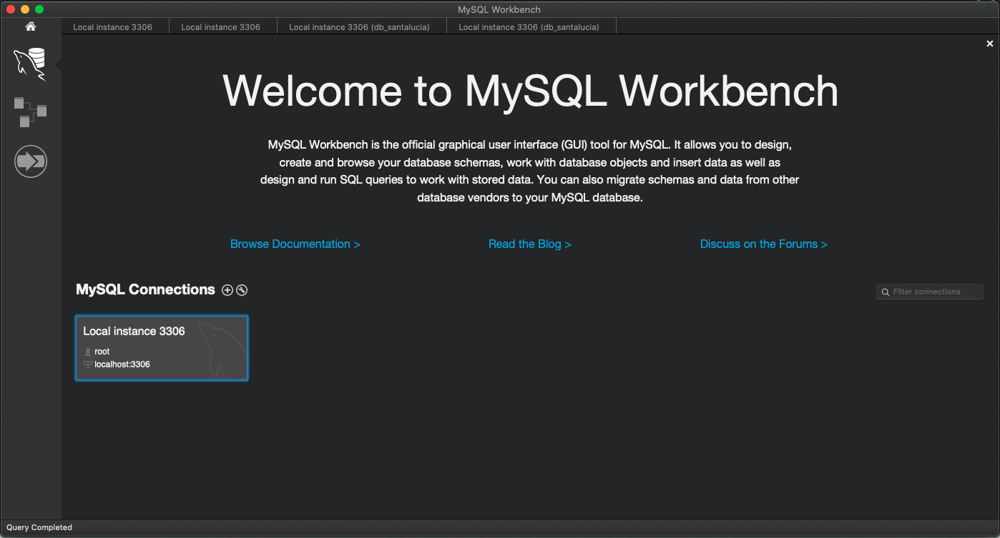
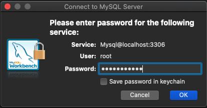
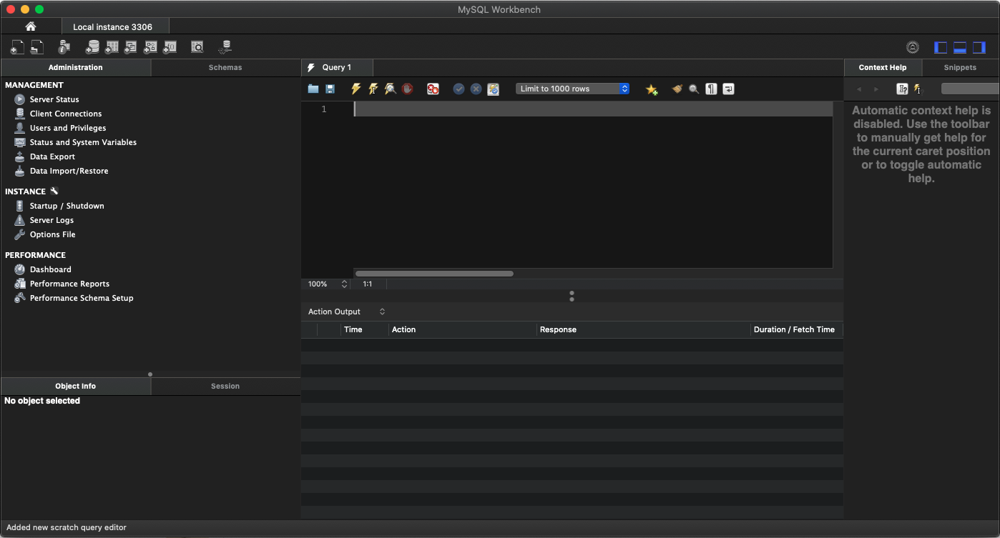

# 3. Bases de Datos 26:30

* Introducción 02:45
* Diseño de un diagrama E-R sencillo 09:35
* Generación del script SQL 06:22
* Configuración de la BD mediante JNDI 07:48

## Introducción 02:45

[JSP Tutorial](https://www.tutorialspoint.com/jsp/index.htm)

## Diseño de un diagrama E-R sencillo 09:35

En esta lección diseñaremos un diagrama Entidad-Relación que nos permitira realizar operaciones sobre la base de datos. 

Lo primero que debemos asegurarnos es que MySQL se esta ejecutando. 

En Mac debemos entrar en las **preferencias del Sistema**.

Pulsamos en el simbolo de MySQL

Y nos aseguramos de que se esta ejecutando y si no es así pulsamos el botón para levantar MySQL.

Una vez comprobado esto entramos a **Workbeanch** 

Vamos entrar a la conexión por defecto `Local instance 3306`, nos pedirá la contraseña que asigmas al instalar MySQL para el usuario `root` en este caso es `password`.

Esta conexión por default esta alojada en `127.0.0.1:3306` tiene un usuario `root` con contraseña `password` y esta asociada a una BD test. En la realidad no es aconsejable usar un usuario `root` y deberiamos tener una contraseña robusta, ademas de tener una ruta y puerto diferente por cuestiones de seguridad.

Una vez que ingresamos los datos nos muestra lo siguiente:

## Generación del script SQL 06:22

## Configuración de la BD mediante JNDI 07:48

