# 3. Bases de Datos 26:30

* Introducción 02:45
* Diseño de un diagrama E-R sencillo 09:35
* Generación del script SQL 06:22
* Configuración de la BD mediante JNDI 07:48

## Introducción 02:45

[JSP Tutorial](https://www.tutorialspoint.com/jsp/index.htm)

## Diseño de un diagrama E-R sencillo 09:35

En esta lección diseñaremos un diagrama Entidad-Relación que nos permitira realizar operaciones sobre la base de datos. 

Lo primero que debemos asegurarnos es que MySQL se esta ejecutando. 

En Mac debemos entrar en las **preferencias del Sistema**.

Pulsamos en el simbolo de MySQL

Y nos aseguramos de que se esta ejecutando y si no es así pulsamos el botón para levantar MySQL.

Una vez comprobado esto entramos a **Workbeanch** 

Vamos entrar a la conexión por defecto `Local instance 3306`, nos pedirá la contraseña que asigmas al instalar MySQL para el usuario `root` en este caso es `password`.

Esta conexión por default esta alojada en `127.0.0.1:3306` tiene un usuario `root` con contraseña `password` y esta asociada a una BD test. En la realidad no es aconsejable usar un usuario `root` y deberiamos tener una contraseña robusta, ademas de tener una ruta y puerto diferente por cuestiones de seguridad.

Una vez que ingresamos los datos de acceso muestra lo siguiente:

### Crear una Base de Datos

Para crear una nueva base de datos pulsamos sobre el icono de *Create New Schema...*

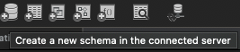

Nos pide un nombre para el nuevo esquema, introducimos `administradores` y presionamos el botón `Apply`

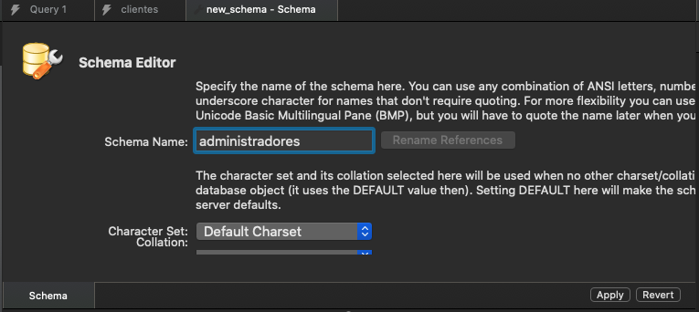

Me genera el Script para generar el nuevo esquema presionamos el botón `Apply` para aplicarlo.

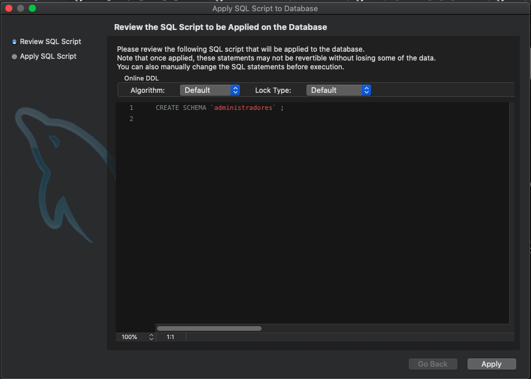

Finalmente me indica que todo se a ejecutado correctamente.

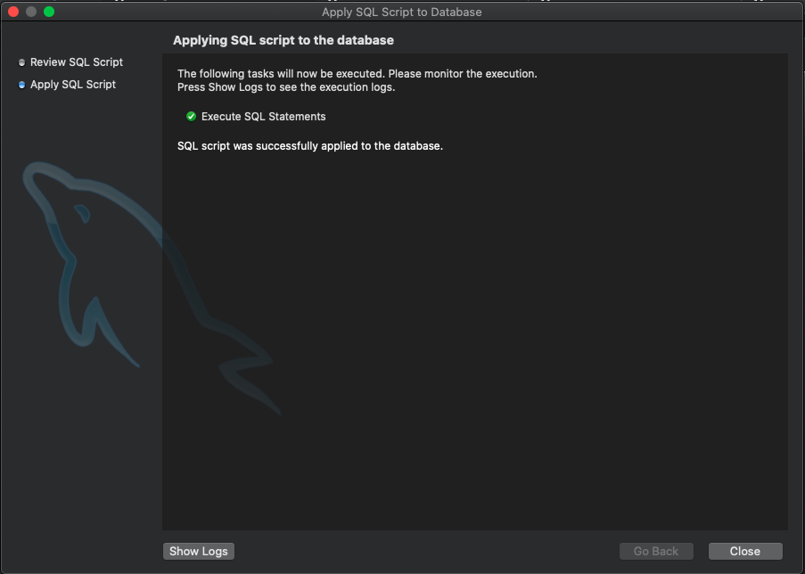

Y en la lista de esquemas ya me aparece el de `administradores`.

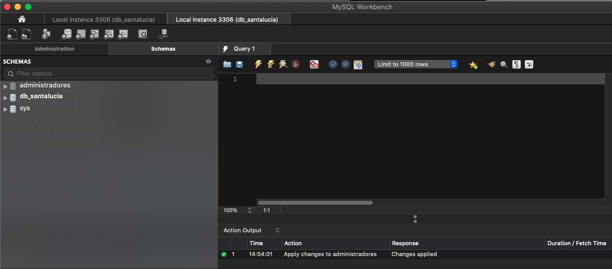

### Crear la conexión con la Base de Datos

Retornamos al inicio en Workbeanch y vamos a presionar el simbolo de **+** en **MySQL Connections.

Nos muestra la siguiente pantalla.

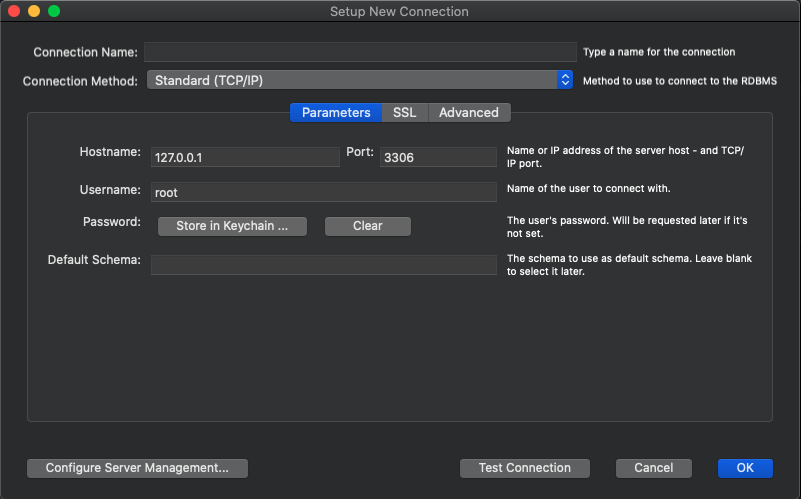

Aquí vamos a meter los datos para nuestra nueva conexión, solo metemos `administradores` en el nombre del esquema y esquema por default. 

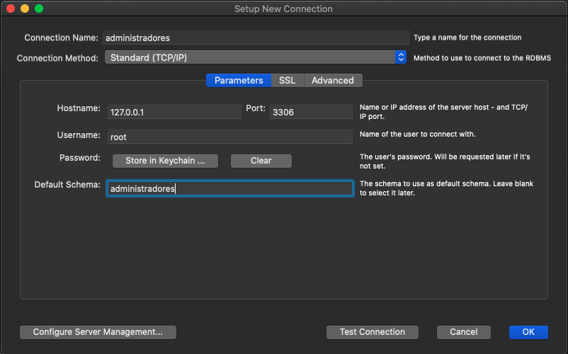

Vamos a presionar el botón `Test Connection` para probar la conexión, nos pide los accesos.

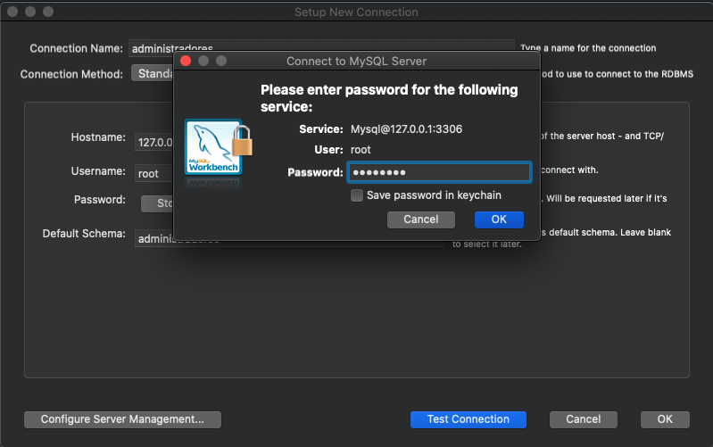

Y nos indica que la conexión a ido perfecta.

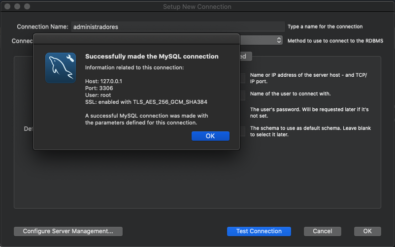

Por lo que presionamos el boton `OK` y nos aparecerá una conexión directa a `administradores`.

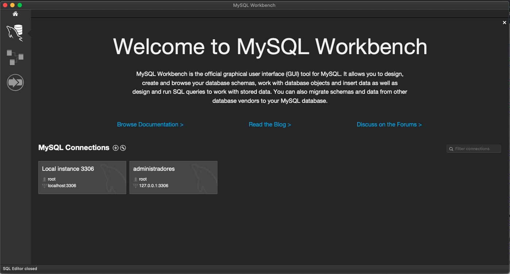

Si la presionamos entraremos directamente a la base de datos `administradores` activada para poder usarla.

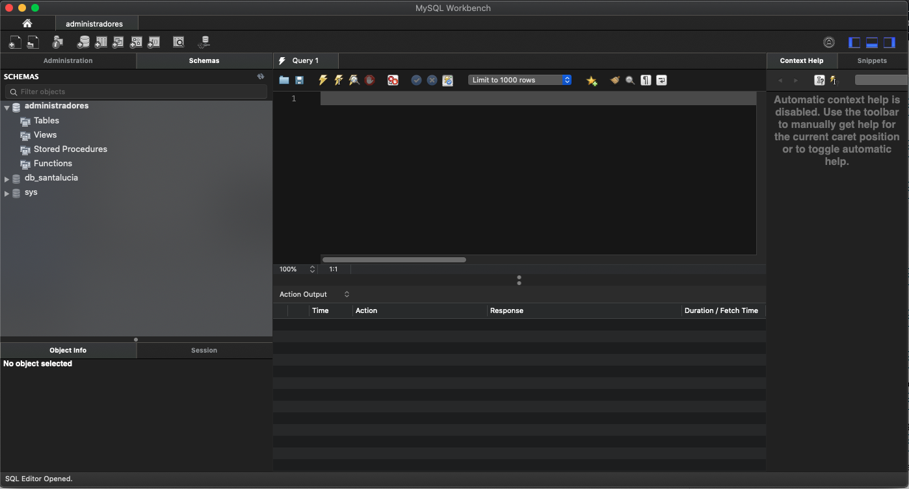

### Crear el Diagrama Entidad-Relación de la Base de Datos

Podríamos crear la BD con Scrips SQL directamente pero lo haremos de una forma distinta creando un diagrama E-R. Vamos al inicio de Workbeanch y en la parte lateral izquierda el segundo icono nos permitira acceder a la seccion de los modelos.

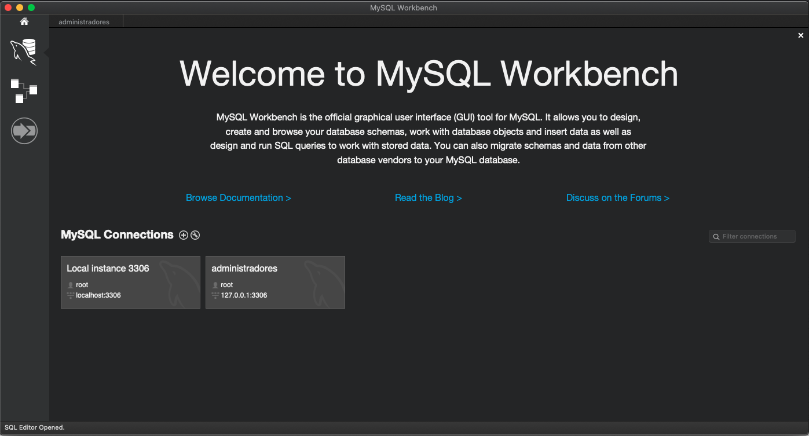

Vamos a presionar el icono de los Modelos.

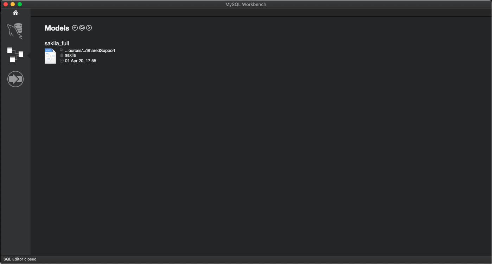

Tenemos un modelo llamado `sakilla_full` el cual a sido creado al instalar MySQL. Nosotros presionamos en el signo de **+** para crear nuestro modelo.

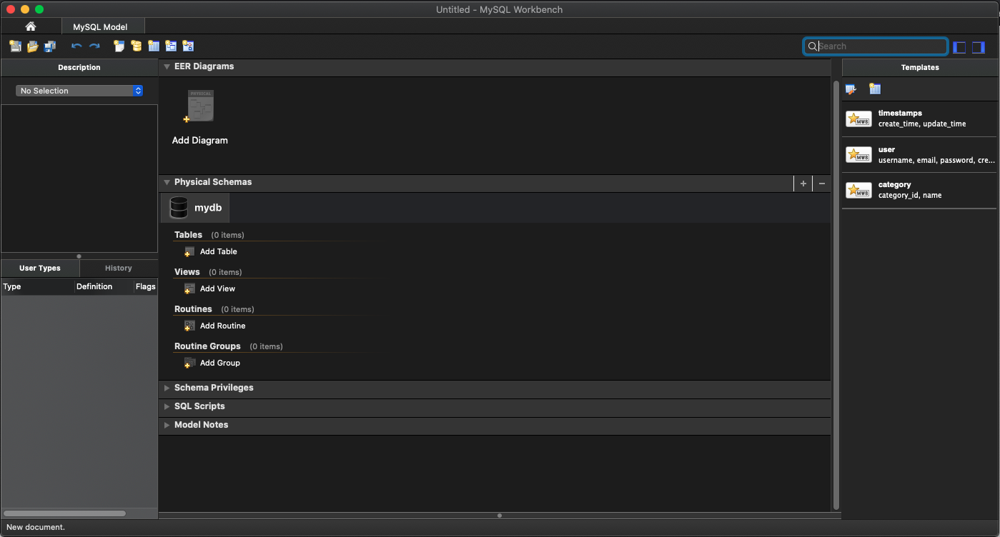

Vamos a dar doble click en el icono `mydb` para cambiar el nombre y poner `administradores`.

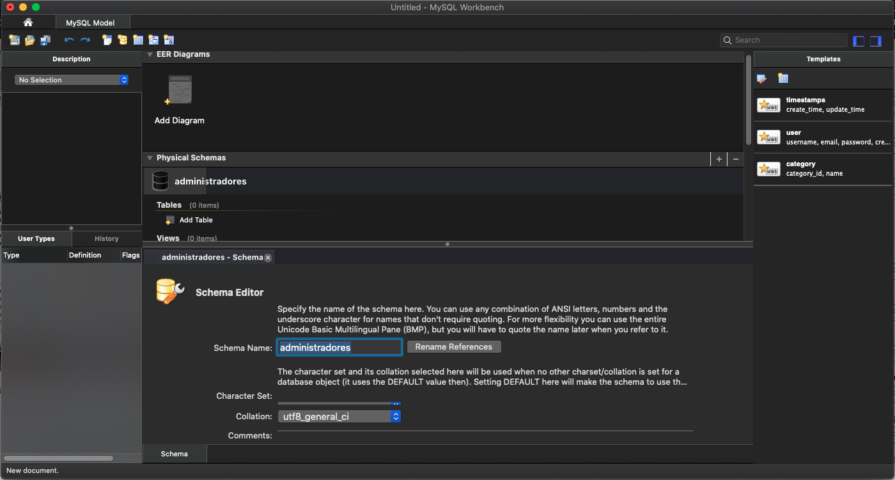

Ahora podemos dar doble click en `Add Diagram` y nos aparecera la interfaz para crear mi diagrama E-R. 

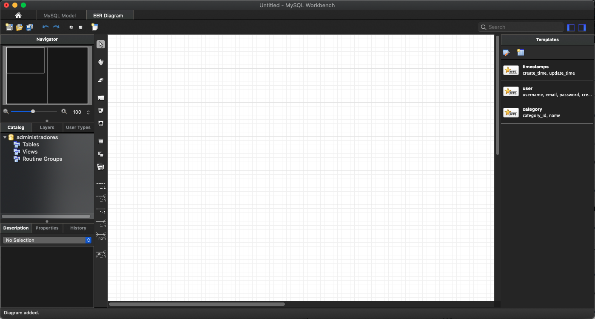

Podemos ver la BD administradores en los paneles de la izquierda donde se listan tablas, vistas y procedimientos almacenados. por ahora todo esta vacío. 

En la parte central tenemos varios botones que nos permitiran crear tablas, vistas, procedimientos almacenados, relaciones entre las tablas, podemos insertar imagenes, textos, etc. Usaremos algunos de estos botones para crear nuestro diagrama, vamos a seguir los siguientes pasos:

##### Crear tabla administrador

* Pulsar en el botón `New Table` y pulsamos en la rejilla, aparecerá una tabla.
* Editemos la tabla dandole doble click
* Podremos el nombre de `administrador` a la tabla.
* Vamos a insertar los campos:
   * `id` Con los atributos PK, NN y AI
   * `email`
   * `contrasena`
   * `nombre`

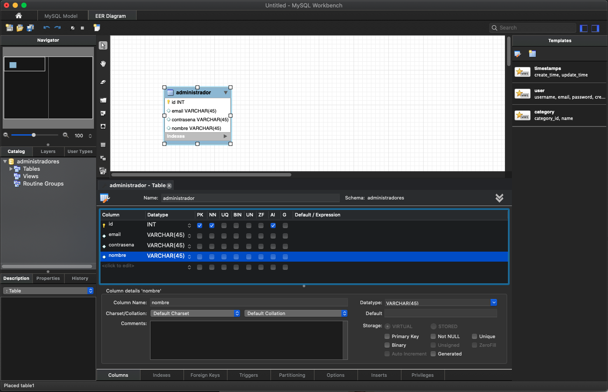

* Salvamos nuestro diagrama pulsando el botón `Savel Model`, nospide el nombre y sitio en el que lo queremos guardar.

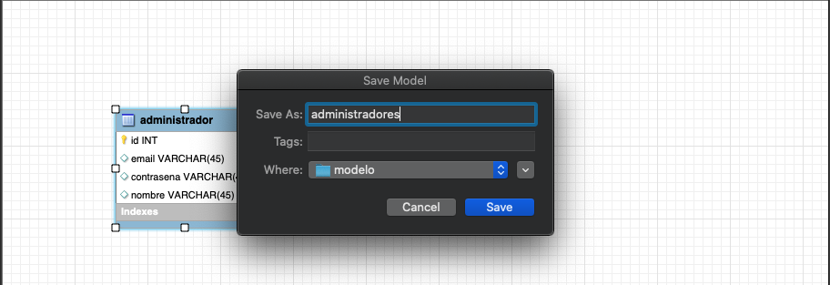

##### Crear tabla pregunta

* Pulsar en el botón `New Table` y pulsamos en la rejilla, aparecerá una tabla.
* Editemos la tabla dandole doble click
* Podremos el nombre de `pregunta` a la tabla.
* Vamos a insertar los campos:
   * `id` Con los atributos PK, NN y AI
   * `pregunta` tipo `TEXT`

   

## Generación del script SQL 06:22

## Configuración de la BD mediante JNDI 07:48

