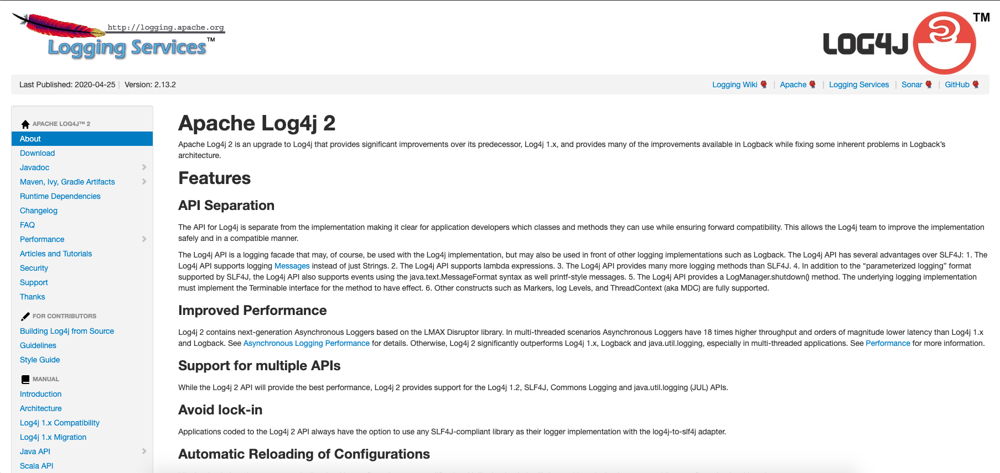
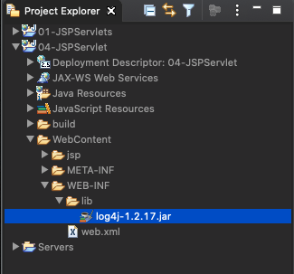
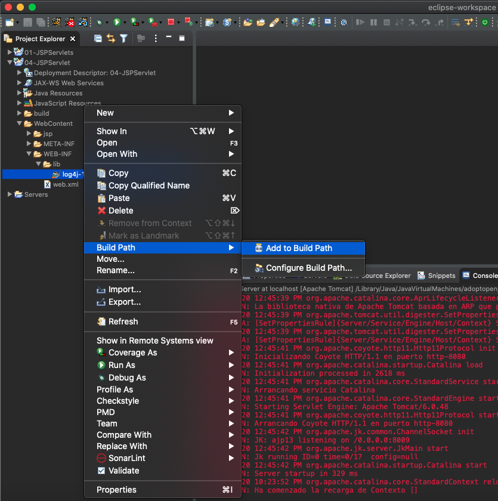
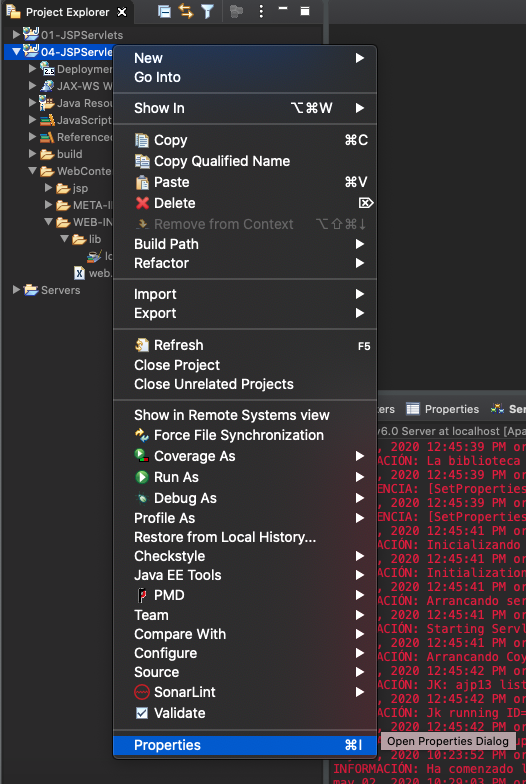
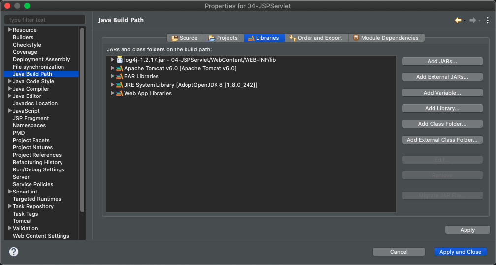
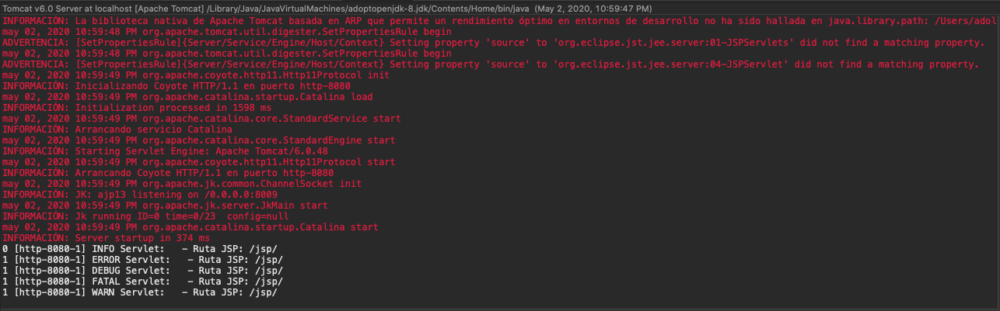
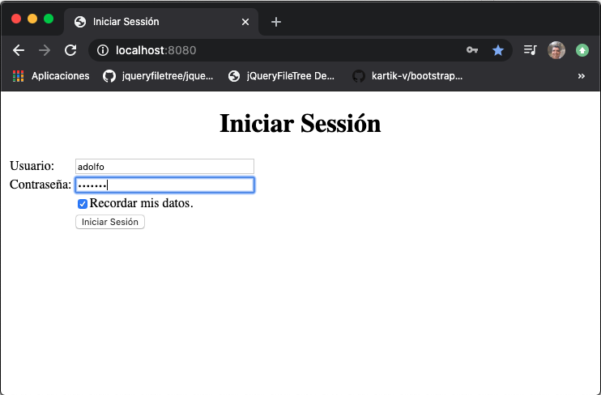
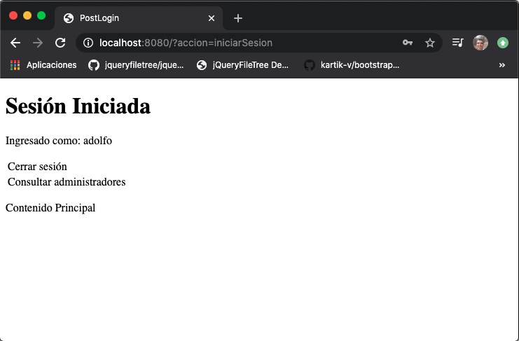

# 4. Implementación del Modelo 01:01:06

* Configuración de Log4J 06:14
* Preparación de la Vista 04:44
* Creación de un JavaBean 04:55
* Creación de una consulta a través del Modelo 09:48
* Código del Controlador para validar el Login 10:53
* Completando el código del controlador para implementar el Login 09:25
* Como cerrar la sesión de un usuario 03:50
* Uso de cookies 11:17

## Configuración de Log4J 06:14

En esta lección vamos a configurar un Logger llamado **Log4J** especialmente diseñado para Tomcat, con esto vamos a aprender a configurar recursos de terceros. 

[Apache Log4j 2](https://logging.apache.org/log4j/2.x/)



### Añadir Libreria Log4J

Vamos a descargar el ZIP de la versión más actual `apache-log4j-2.13.2-bin.zip` pero vamos a terminar instalando `log4j-1.2.17.zip` la versión que se usa en el tutorial. Descomprimimos el ZIP dentro de la carpeta desempaquetada tenemos el archivo `log4j-1.2.17.jar`, los archivos JAR son librerías Java que alguien más ya compilo, empaqueto y distribuyo para el uso de terceros.   


Copiamos el archivo `log4j-1.2.17.jar` en nuestro proyecto Eclipse en la carpeta **WebContent/WEB-INF/lib** 



Para terminar la configuración de la librería vamos a añadirlo en la **Build Path**:



Para comprobar que se añadio correctamente en el proyecto pulsamos sobre el proyecto para ver las propiedades:



En la pestaña `Library` vemos que se a añadido nuestro archivo jar `log4j-1.2.17.jar`



### Usar Libreria Log4J

Ahora vamos a proceder a usar la Libreria Log4J dentro de nuestro Servlet. Lo primero que vamos a hacer es definir una variable estática de tipo `Logger`.

`private static final Logger log = LogManager.getLogger("Servlet: ");`

Ahora dentro de nuestro método `init()` vamos a terminar de configurar el Logger.

```java
//Configurar Logger
BasicConfigurator.configure();
```

Con esto ya podemos usar el Logger para enviar mensajes a la consola:

```java
log.info("Ruta JSP: " + rutaJsp);
```

Con la instrucción anterior mandamos un mesaje de tipo INFO de la clase Servlet con el mesaje `Ruta JSP: /jsp/`, lo que se visualiza en la consola es lo siguiente:

```sh
0 [http-8080-1] INFO Servlet:   - Ruta JSP: /jsp/
```

Esto puede pensarse que es similar a usar un `System.out.println("Ruta JSP: " + rutaJsp)` pero sin embargo el uso de el Logger es más potente por que podemos darle prioridad a los mensajes usando diferentes tipos de Logs, por ejemplo:

```java
log.info("Ruta JSP: " + rutaJsp);
log.error("Ruta JSP: " + rutaJsp);
log.debug("Ruta JSP: " + rutaJsp);
log.fatal("Ruta JSP: " + rutaJsp);
```

Veamos el código completo del archivo `Servlet.java`

```java
package com.novellius;

import java.io.IOException;

import javax.servlet.RequestDispatcher;
import javax.servlet.ServletConfig;
import javax.servlet.ServletContext;
import javax.servlet.ServletException;
import javax.servlet.http.HttpServlet;
import javax.servlet.http.HttpServletRequest;
import javax.servlet.http.HttpServletResponse;
import javax.servlet.http.HttpSession;

import org.apache.log4j.BasicConfigurator;
import org.apache.log4j.LogManager;
import org.apache.log4j.Logger;

/**
 * Servlet implementation class Servlet
 */
public class Servlet extends HttpServlet {
	private static final long serialVersionUID = 1L;
	
	private static final Logger log = LogManager.getLogger("Servlet: ");
	
	private String rutaJsp;
       
    /**
     * @see HttpServlet#HttpServlet()
     */
    public Servlet() {
        super();
        // TODO Auto-generated constructor stub
    }

	@Override
	public void init(ServletConfig config) throws ServletException {
		// TODO Auto-generated method stub
		super.init(config);
		
		//System.out.println(config.getInitParameter("rutaJsp"));
		rutaJsp = config.getInitParameter("rutaJsp");
		
		//Configurar Logger
		BasicConfigurator.configure();
		
		log.info("Ruta JSP: " + rutaJsp);
		log.error("Ruta JSP: " + rutaJsp);
		log.debug("Ruta JSP: " + rutaJsp);
		log.fatal("Ruta JSP: " + rutaJsp);
    log.warn("Ruta JSP: " + rutaJsp);
	}

	/**
	 * @see HttpServlet#doGet(HttpServletRequest request, HttpServletResponse response)
	 */
	protected void doGet(HttpServletRequest request, HttpServletResponse response) throws ServletException, IOException {

		String accion = request.getParameter("accion");
		
		
		if (accion != null) {
			if(accion.equals("inicio")) {
				setRespuestaControlador("index").forward(request, response);
			} else  if(accion.equals("login")) {
				setRespuestaControlador(accion).forward(request, response);
			}
		}else {
			setRespuestaControlador("index").forward(request, response);
		}
	}

	/**
	 * @see HttpServlet#doPost(HttpServletRequest request, HttpServletResponse response)
	 */
	protected void doPost(HttpServletRequest request, HttpServletResponse response) throws ServletException, IOException {
		
		String accion = request.getParameter("accion");
		
		
		if (accion != null) {
			
			if(accion.equals("iniciarSesion")) {
				
				//System.out.println("Usuario: " + request.getParameter("usuario"));
				//System.out.println("Contraseña: " + request.getParameter("contrasena"));
				
				String usuario = request.getParameter("usuario");
				String contrasena = request.getParameter("contrasena");
				
				// Ámbito Request
				request.setAttribute("usuario", usuario);
				request.setAttribute("contrasena", contrasena);
				
				// Ámbito Sesión
				HttpSession sesion = request.getSession();
				sesion.setAttribute("usuario", usuario);
				sesion.setAttribute("contrasena", contrasena);
				
				// Ámbito Contexto
				ServletContext contexto = getServletContext();
				contexto.setAttribute("usuario", usuario);
				contexto.setAttribute("contrasena", contrasena);
				
				setRespuestaControlador("postLogin").forward(request, response);
			}
			
		}else {
			setRespuestaControlador("index").forward(request, response);
		}
		
	}
	
	public RequestDispatcher setRespuestaControlador(String vista) {
		String url = rutaJsp + vista + ".jsp";
		return getServletContext().getRequestDispatcher(url);
	}
}
```

*Servlet.java*

Al ejecutar el proyecto en la consola vemos lo siguiente:


		
## Preparación de la Vista 04:44

En esta lección vamos a modificar nuestra vista, la pantalla de Login debe ser la primer vista que mostraremos y una vez que se logee el usuario mostraremos la página de bienvenida al sistema, en este momento tenemos 3 JSPs `index.jsp`, `login.jsp` y `postLogin.jsp`, al final de la lección estro habrá cambiado para adecuarlo a nuestro objetivo.

Veamos el código:

```java
package com.novellius;

import java.io.IOException;

import javax.servlet.RequestDispatcher;
import javax.servlet.ServletConfig;
import javax.servlet.ServletContext;
import javax.servlet.ServletException;
import javax.servlet.http.HttpServlet;
import javax.servlet.http.HttpServletRequest;
import javax.servlet.http.HttpServletResponse;
import javax.servlet.http.HttpSession;

import org.apache.log4j.BasicConfigurator;
import org.apache.log4j.LogManager;
import org.apache.log4j.Logger;

/**
 * Servlet implementation class Servlet
 */
public class Servlet extends HttpServlet {
   private static final long serialVersionUID = 1L;
	
   private static final Logger log = LogManager.getLogger("Servlet: ");
	
   private String rutaJsp;
       
   /**
   * @see HttpServlet#HttpServlet()
   */
   public Servlet() {
      super();
      // TODO Auto-generated constructor stub
   }

   @Override
   public void init(ServletConfig config) throws ServletException {
      // TODO Auto-generated method stub
      super.init(config);
		
      //System.out.println(config.getInitParameter("rutaJsp"));
      rutaJsp = config.getInitParameter("rutaJsp");
		
      //Configurar Logger
      BasicConfigurator.configure();   
   }


   /**
   * @see HttpServlet#doGet(HttpServletRequest request, HttpServletResponse response)
   */
   protected void doGet(HttpServletRequest request, HttpServletResponse response) throws ServletException, IOException {

      String accion = request.getParameter("accion");
			
      if (accion != null) {
         if(accion.equals("login")) {
	    setRespuestaControlador(accion).forward(request, response);
	  }
      }else {
         setRespuestaControlador("login").forward(request, response);
      }
   }

   /**
   * @see HttpServlet#doPost(HttpServletRequest request, HttpServletResponse response)
   */
   protected void doPost(HttpServletRequest request, HttpServletResponse response) throws ServletException, IOException {
		
      String accion = request.getParameter("accion");
			
      if (accion != null) {
			
         if(accion.equals("iniciarSesion")) {
				
      	    String usuario = request.getParameter("usuario");
	    String contrasena = request.getParameter("contrasena");
				
	    // Ámbito Request
	    request.setAttribute("usuario", usuario);
	    request.setAttribute("contrasena", contrasena);
				
	    // Ámbito Sesión
	    HttpSession sesion = request.getSession();
	    sesion.setAttribute("usuario", usuario);
	    sesion.setAttribute("contrasena", contrasena);
				
	    // Ámbito Contexto
	    ServletContext contexto = getServletContext();
	    contexto.setAttribute("usuario", usuario);
	    contexto.setAttribute("contrasena", contrasena);
				
	    setRespuestaControlador("postLogin").forward(request, response);
	 }
			
      }else {
	 setRespuestaControlador("login").forward(request, response);
      }
		
   }
	
   public RequestDispatcher setRespuestaControlador(String vista) {
      String url = rutaJsp + vista + ".jsp";
      return getServletContext().getRequestDispatcher(url);
   }
}
```

*Servlet.java*

Como hemos borrado el JSP `index.jsp` eliminamos sus referencias y hacemos que `login.jsp` sea la primer vista en cargarse.

```html
<%@ page language="java" contentType="text/html; charset=UTF-8"
    pageEncoding="UTF-8"%>
<!DOCTYPE html>
<html>
<head>
<meta charset="UTF-8">
<title>Iniciar Sessión</title>
</head>
<body>
   <h1 align="center">Iniciar Sessión</h1>
	
   <form method="post" action="?accion=iniciarSesion">
      <table>
	 <tr>
	    <td>Usuario: </td>
	    <td><input type="text" name="usuario" size="35"/></td>
	 </tr>
	 <tr>
	    <td>Contraseña: </td>
	    <td><input type="password" name="contrasena" size="35" /></td>
	 </tr>
	 <tr>
	    <td>&nbsp;</td>
	    <td><input type="checkbox" checked="checked" />Recordar mis datos.</td>
	 </tr>
	 <tr>
	    <td>&nbsp;</td>
	    <td><input type="submit" value="Iniciar Sesión" /></td>
	 </tr>
      </table>	
   </form>
	
</body>
</html>
```

*login.jsp*

Hemos añadido el tamaño en nuestros dos input de usuario y password, y hemos añadido un check para recordar los datos.

```html
<%@ page language="java" contentType="text/html; charset=UTF-8"
    pageEncoding="UTF-8"%>
<!DOCTYPE html>
<html>
<head>
<meta charset="UTF-8">
<title>PostLogin</title>
</head>
<body>
   <h1>Sesión Iniciada</h1>
	
   <p>Ingresado como: <%= request.getAttribute("usuario") %></p>
	   
   <table>
      <tr>
	 <td>Cerrar sesión</td> 
      </tr>
      <tr>
	 <td>Consultar administradores</td>
      </tr>
   </table>
   <p>
      Contenido Principal
   </p>
	
</body>
</html>
```

*postLogin.jsp*

Cambios en lo que presenta al Logearse.

Ejecución del código:





## Creación de un JavaBean 04:55

## Creación de una consulta a través del Modelo 09:48

## Código del Controlador para validar el Login 10:53

## Completando el código del controlador para implementar el Login 09:25

## Como cerrar la sesión de un usuario 03:50

## Uso de cookies 11:17
