# 4. Implementación del Modelo 01:01:06

* Configuración de Log4J 06:14
* Preparación de la Vista 04:44
* Creación de un JavaBean 04:55
* Creación de una consulta a través del Modelo 09:48
* Código del Controlador para validar el Login 10:53
* Completando el código del controlador para implementar el Login 09:25
* Como cerrar la sesión de un usuario 03:50
* Uso de cookies 11:17

## Configuración de Log4J 06:14

En esta lección vamos a configurar un Logger llamado **Log4J** especialmente diseñado para Tomcat, con esto vamos a aprender a configurar recursos de terceros. 

[Apache Log4j 2](https://logging.apache.org/log4j/2.x/)


### Añadir Libreria Log4J

Vamos a descargar el ZIP de la versión más actual `apache-log4j-2.13.2-bin.zip` pero vamos a terminar instalando `log4j-1.2.17.zip` la versión que se usa en el tutorial. Descomprimimos el ZIP dentro de la carpeta desempaquetada tenemos el archivo `log4j-1.2.17.jar`, los archivos JAR son librerías Java que alguien más ya compilo, empaqueto y distribuyo para el uso de terceros.   


Copiamos el archivo `log4j-1.2.17.jar` en nuestro proyecto Eclipse en la carpeta **WebContent/WEB-INF/lib** 


Para terminar la configuración de la librería vamos a añadirlo en la **Build Path**:


Para comprobar que se añadio correctamente en el proyecto pulsamos sobre el proyecto para ver las propiedades:


En la pestaña `Library` vemos que se a añadido nuestro archivo jar `log4j-1.2.17.jar`


### Usar Libreria Log4J

Ahora vamos a proceder a usar la Libreria Log4J dentro de nuestro Servlet. Lo primero que vamos a hacer es definir una variable estática de tipo `Logger`.

`private static final Logger log = LogManager.getLogger("Servlet: ");`

Ahora dentro de nuestro método `init()` vamos a terminar de configurar el Logger.

```java
//Configurar Logger
BasicConfigurator.configure();
```

Con esto ya podemos usar el Logger para enviar mensajes a la consola:

```java
log.info("Ruta JSP: " + rutaJsp);
```

Con la instrucción anterior mandamos un mesaje de tipo INFO de la clase Servlet con el mesaje `Ruta JSP: /jsp/`, lo que se visualiza en la consola es lo siguiente:

```sh
0 [http-8080-1] INFO Servlet:   - Ruta JSP: /jsp/
```

Esto puede pensarse que es similar a usar un `System.out.println("Ruta JSP: " + rutaJsp)` pero sin embargo el uso de el Logger es más potente por que podemos darle prioridad a los mensajes usando diferentes tipos de Logs, por ejemplo:

```java
log.info("Ruta JSP: " + rutaJsp);
log.error("Ruta JSP: " + rutaJsp);
log.debug("Ruta JSP: " + rutaJsp);
log.fatal("Ruta JSP: " + rutaJsp);
```

Veamos el código completo del archivo `Servlet.java`

```java
package com.novellius;

import java.io.IOException;

import javax.servlet.RequestDispatcher;
import javax.servlet.ServletConfig;
import javax.servlet.ServletContext;
import javax.servlet.ServletException;
import javax.servlet.http.HttpServlet;
import javax.servlet.http.HttpServletRequest;
import javax.servlet.http.HttpServletResponse;
import javax.servlet.http.HttpSession;

import org.apache.log4j.BasicConfigurator;
import org.apache.log4j.LogManager;
import org.apache.log4j.Logger;

/**
 * Servlet implementation class Servlet
 */
public class Servlet extends HttpServlet {
	private static final long serialVersionUID = 1L;
	
	private static final Logger log = LogManager.getLogger("Servlet: ");
	
	private String rutaJsp;
       
    /**
     * @see HttpServlet#HttpServlet()
     */
    public Servlet() {
        super();
        // TODO Auto-generated constructor stub
    }

	@Override
	public void init(ServletConfig config) throws ServletException {
		// TODO Auto-generated method stub
		super.init(config);
		
		//System.out.println(config.getInitParameter("rutaJsp"));
		rutaJsp = config.getInitParameter("rutaJsp");
		
		//Configurar Logger
		BasicConfigurator.configure();
		
		log.info("Ruta JSP: " + rutaJsp);
		log.error("Ruta JSP: " + rutaJsp);
		log.debug("Ruta JSP: " + rutaJsp);
		log.fatal("Ruta JSP: " + rutaJsp);
    log.warn("Ruta JSP: " + rutaJsp);
	}

	/**
	 * @see HttpServlet#doGet(HttpServletRequest request, HttpServletResponse response)
	 */
	protected void doGet(HttpServletRequest request, HttpServletResponse response) throws ServletException, IOException {

		String accion = request.getParameter("accion");
		
		
		if (accion != null) {
			if(accion.equals("inicio")) {
				setRespuestaControlador("index").forward(request, response);
			} else  if(accion.equals("login")) {
				setRespuestaControlador(accion).forward(request, response);
			}
		}else {
			setRespuestaControlador("index").forward(request, response);
		}
	}

	/**
	 * @see HttpServlet#doPost(HttpServletRequest request, HttpServletResponse response)
	 */
	protected void doPost(HttpServletRequest request, HttpServletResponse response) throws ServletException, IOException {
		
		String accion = request.getParameter("accion");
		
		
		if (accion != null) {
			
			if(accion.equals("iniciarSesion")) {
				
				//System.out.println("Usuario: " + request.getParameter("usuario"));
				//System.out.println("Contraseña: " + request.getParameter("contrasena"));
				
				String usuario = request.getParameter("usuario");
				String contrasena = request.getParameter("contrasena");
				
				// Ámbito Request
				request.setAttribute("usuario", usuario);
				request.setAttribute("contrasena", contrasena);
				
				// Ámbito Sesión
				HttpSession sesion = request.getSession();
				sesion.setAttribute("usuario", usuario);
				sesion.setAttribute("contrasena", contrasena);
				
				// Ámbito Contexto
				ServletContext contexto = getServletContext();
				contexto.setAttribute("usuario", usuario);
				contexto.setAttribute("contrasena", contrasena);
				
				setRespuestaControlador("postLogin").forward(request, response);
			}
			
		}else {
			setRespuestaControlador("index").forward(request, response);
		}
		
	}
	
	public RequestDispatcher setRespuestaControlador(String vista) {
		String url = rutaJsp + vista + ".jsp";
		return getServletContext().getRequestDispatcher(url);
	}
}
```

*Servlet.java*

Al ejecutar el proyecto en la consola vemos lo siguiente:


		
## Preparación de la Vista 04:44

En esta lección vamos a modificar nuestra vista, la pantalla de Login debe ser la primer vista que mostraremos y una vez que se logee el usuario mostraremos la página de bienvenida al sistema, en este momento tenemos 3 JSPs `index.jsp`, `login.jsp` y `postLogin.jsp`, al final de la lección estro habrá cambiado para adecuarlo a nuestro objetivo.

Veamos el código:

```java
package com.novellius;

import java.io.IOException;

import javax.servlet.RequestDispatcher;
import javax.servlet.ServletConfig;
import javax.servlet.ServletContext;
import javax.servlet.ServletException;
import javax.servlet.http.HttpServlet;
import javax.servlet.http.HttpServletRequest;
import javax.servlet.http.HttpServletResponse;
import javax.servlet.http.HttpSession;

import org.apache.log4j.BasicConfigurator;
import org.apache.log4j.LogManager;
import org.apache.log4j.Logger;

/**
 * Servlet implementation class Servlet
 */
public class Servlet extends HttpServlet {
   private static final long serialVersionUID = 1L;
	
   private static final Logger log = LogManager.getLogger("Servlet: ");
	
   private String rutaJsp;
       
   /**
   * @see HttpServlet#HttpServlet()
   */
   public Servlet() {
      super();
      // TODO Auto-generated constructor stub
   }

   @Override
   public void init(ServletConfig config) throws ServletException {
      // TODO Auto-generated method stub
      super.init(config);
		
      //System.out.println(config.getInitParameter("rutaJsp"));
      rutaJsp = config.getInitParameter("rutaJsp");
		
      //Configurar Logger
      BasicConfigurator.configure();   
   }


   /**
   * @see HttpServlet#doGet(HttpServletRequest request, HttpServletResponse response)
   */
   protected void doGet(HttpServletRequest request, HttpServletResponse response) throws ServletException, IOException {

      String accion = request.getParameter("accion");
			
      if (accion != null) {
         if(accion.equals("login")) {
	    setRespuestaControlador(accion).forward(request, response);
	  }
      }else {
         setRespuestaControlador("login").forward(request, response);
      }
   }

   /**
   * @see HttpServlet#doPost(HttpServletRequest request, HttpServletResponse response)
   */
   protected void doPost(HttpServletRequest request, HttpServletResponse response) throws ServletException, IOException {
		
      String accion = request.getParameter("accion");
			
      if (accion != null) {
			
         if(accion.equals("iniciarSesion")) {
				
      	    String usuario = request.getParameter("usuario");
	    String contrasena = request.getParameter("contrasena");
				
	    // Ámbito Request
	    request.setAttribute("usuario", usuario);
	    request.setAttribute("contrasena", contrasena);
				
	    // Ámbito Sesión
	    HttpSession sesion = request.getSession();
	    sesion.setAttribute("usuario", usuario);
	    sesion.setAttribute("contrasena", contrasena);
				
	    // Ámbito Contexto
	    ServletContext contexto = getServletContext();
	    contexto.setAttribute("usuario", usuario);
	    contexto.setAttribute("contrasena", contrasena);
				
	    setRespuestaControlador("postLogin").forward(request, response);
	 }
			
      }else {
	 setRespuestaControlador("login").forward(request, response);
      }
		
   }
	
   public RequestDispatcher setRespuestaControlador(String vista) {
      String url = rutaJsp + vista + ".jsp";
      return getServletContext().getRequestDispatcher(url);
   }
}
```

*Servlet.java*

Como hemos borrado el JSP `index.jsp` eliminamos sus referencias y hacemos que `login.jsp` sea la primer vista en cargarse.

```html
<%@ page language="java" contentType="text/html; charset=UTF-8"
    pageEncoding="UTF-8"%>
<!DOCTYPE html>
<html>
<head>
<meta charset="UTF-8">
<title>Iniciar Sessión</title>
</head>
<body>
   <h1 align="center">Iniciar Sessión</h1>
	
   <form method="post" action="?accion=iniciarSesion">
      <table>
	 <tr>
	    <td>Usuario: </td>
	    <td><input type="text" name="usuario" size="35"/></td>
	 </tr>
	 <tr>
	    <td>Contraseña: </td>
	    <td><input type="password" name="contrasena" size="35" /></td>
	 </tr>
	 <tr>
	    <td>&nbsp;</td>
	    <td><input type="checkbox" checked="checked" />Recordar mis datos.</td>
	 </tr>
	 <tr>
	    <td>&nbsp;</td>
	    <td><input type="submit" value="Iniciar Sesión" /></td>
	 </tr>
      </table>	
   </form>
	
</body>
</html>
```

*login.jsp*

Hemos añadido el tamaño en nuestros dos input de usuario y password, y hemos añadido un check para recordar los datos.

```html
<%@ page language="java" contentType="text/html; charset=UTF-8"
    pageEncoding="UTF-8"%>
<!DOCTYPE html>
<html>
<head>
<meta charset="UTF-8">
<title>PostLogin</title>
</head>
<body>
   <h1>Sesión Iniciada</h1>
	
   <p>Ingresado como: <%= request.getAttribute("usuario") %></p>
	   
   <table>
      <tr>
	 <td>Cerrar sesión</td> 
      </tr>
      <tr>
	 <td>Consultar administradores</td>
      </tr>
   </table>
   <p>
      Contenido Principal
   </p>
	
</body>
</html>
```

*postLogin.jsp*

Cambios en lo que presenta al Logearse.

Ejecución del código:


## Creación de un JavaBean 04:55

[JavaBeans Component API](https://docs.oracle.com/javase/8/docs/technotes/guides/beans/index.html)

En esta lección vamos a crear dos JavaBeans que representarán a las dos entidades que tenemos en nuestra BD, `administrador` y `pregunta`. 

### ¿Qué es un JavaBean?

Java Bean es una clase Java normal que tiene propiedades privadas con su método público getter y setter.

Los Java Beans se usan generalmente como clase auxiliar.

### Creación de un JavaBean

Vamos a crear una nuevo paquete llamado `beans` y alli vamos a crear el JavaBean `Administrador`.

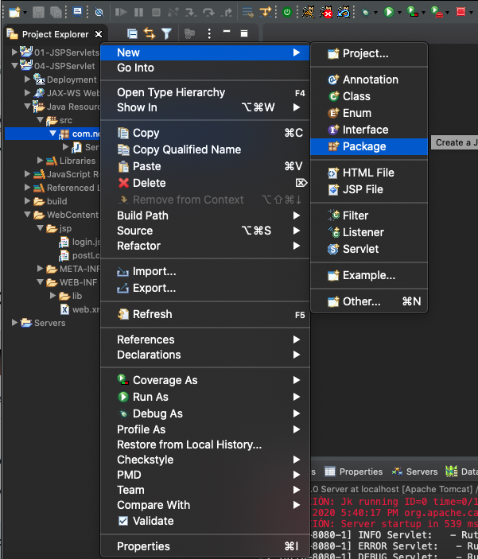

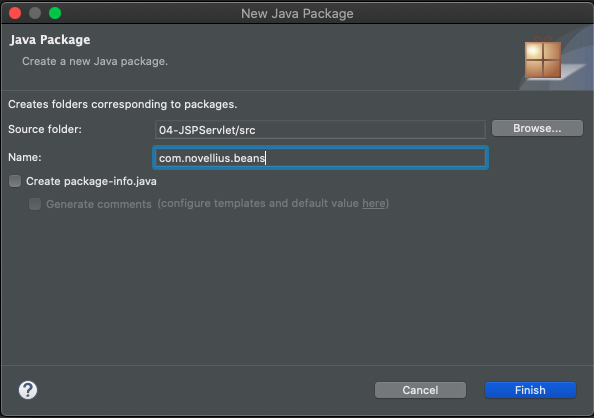

Dentro de este nuevo paquete crearemos el JavaBean `Administrador`, que es una clase Java.

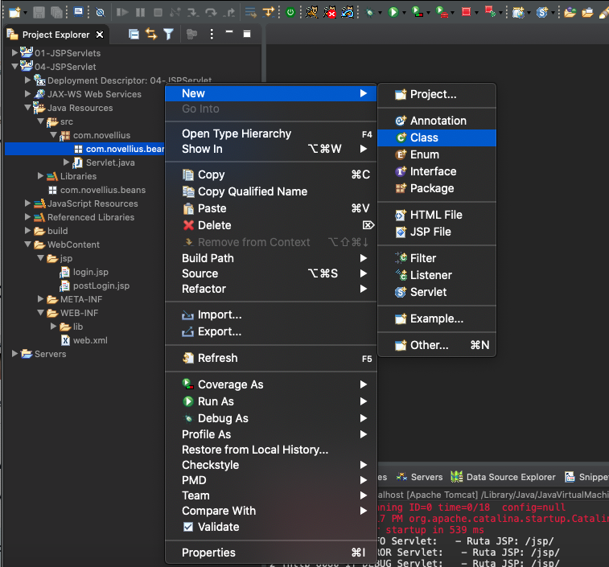

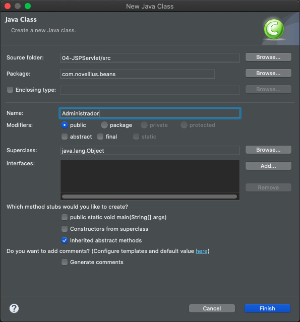

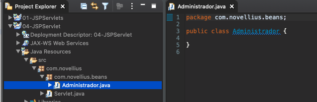

Dentro de esta clase vamos a crear las propiedades equivalentes a los campos de la Tabla Administrador que creamos en la BD.

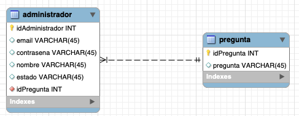

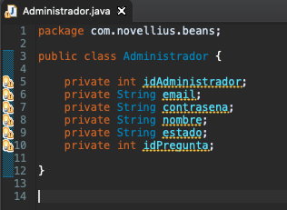

Ahora vamos a generar los getters y setters de nuestras propiedades para lo cual nos auxiliamos de Eclipse que nos ayuda a crearlas.

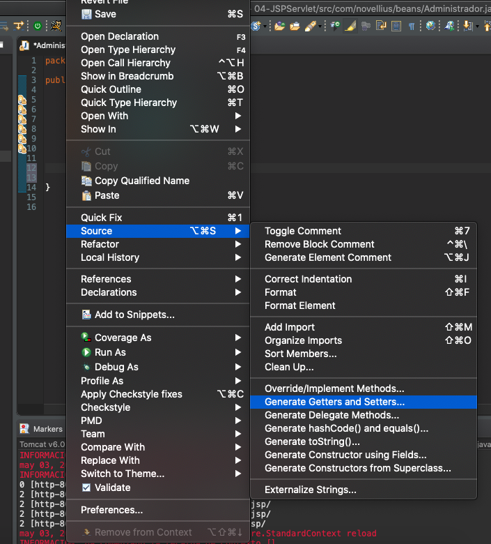

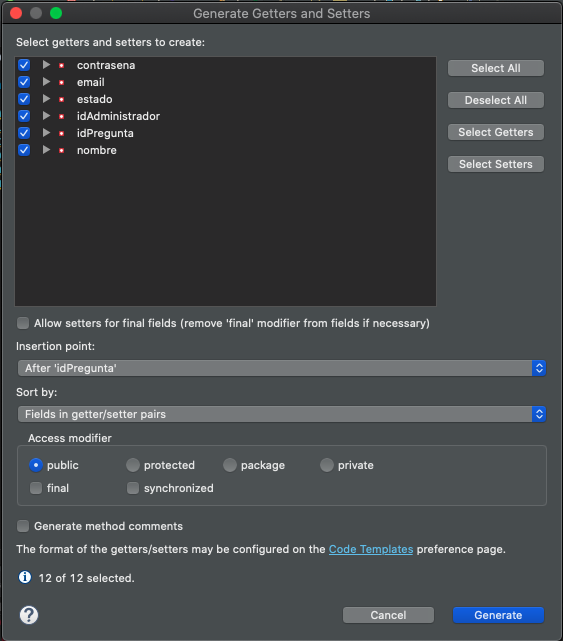

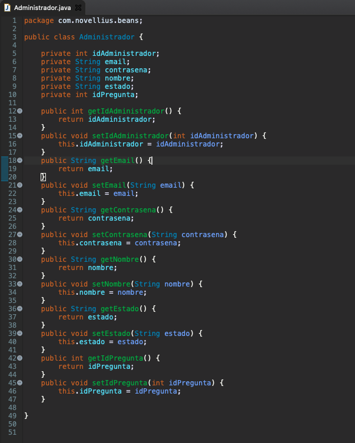

También vamos a generar un Constructor ayudandonos nuevamente de Eclipse.

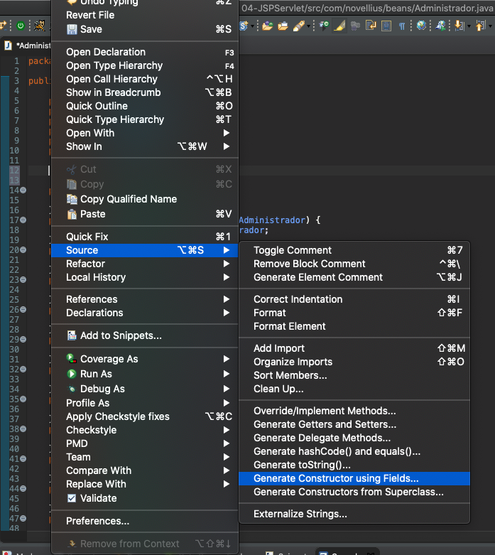

No vamos a incluir la propiedad `idAdministrador` por que representa un campo autogenerado.

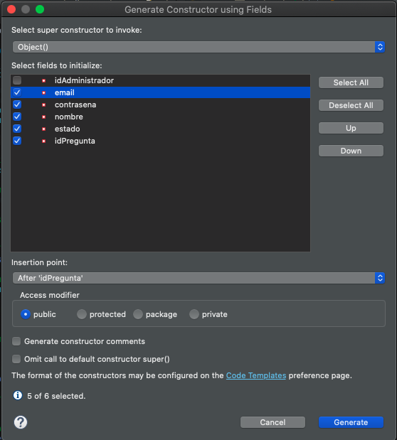

Nos inserta el código del constructor.

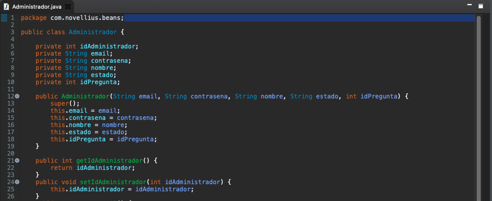

Vamos a quitarle el `super` que ha insertado, con esto tenemos listo nuestro JavaBean `Administrador` veamos el código completo:

```java
package com.novellius.beans;

public class Administrador {
	
	private int idAdministrador;
	private String email;
	private String contrasena;
	private String nombre;
	private String estado;
	private int idPregunta;
	
	public Administrador(String email, String contrasena, String nombre, String estado, int idPregunta) {
		this.email = email;
		this.contrasena = contrasena;
		this.nombre = nombre;
		this.estado = estado;
		this.idPregunta = idPregunta;
	}
	
	public int getIdAdministrador() {
		return idAdministrador;
	}
	public void setIdAdministrador(int idAdministrador) {
		this.idAdministrador = idAdministrador;
	}
	public String getEmail() {
		return email;
	}
	public void setEmail(String email) {
		this.email = email;
	}
	public String getContrasena() {
		return contrasena;
	}
	public void setContrasena(String contrasena) {
		this.contrasena = contrasena;
	}
	public String getNombre() {
		return nombre;
	}
	public void setNombre(String nombre) {
		this.nombre = nombre;
	}
	public String getEstado() {
		return estado;
	}
	public void setEstado(String estado) {
		this.estado = estado;
	}
	public int getIdPregunta() {
		return idPregunta;
	}
	public void setIdPregunta(int idPregunta) {
		this.idPregunta = idPregunta;
	}
	
}
```

*Administrador.java*

## Creación de una consulta a través del Modelo 09:48

En esta lección vamos a crear una clase que forma parte del modelo y que nos va a permitir validar los datos del usuario haciendo una consulta a la BD para ver si sus datos de acceso son correctos.

Crearemos un paquete `modelo`, dentro crearemos la clase `Cuenta` y también crearemos el paquete `beans` arrastraremos aquí el bean `Administrador` y eliminaremos el otro paquete `beans`, nuestra estructura quedará así:

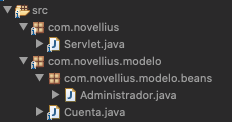

El código de nuestra clase `Cuenta` es el siguiente:

```java
package com.novellius.modelo;

import java.sql.Connection;
import java.sql.PreparedStatement;
import java.sql.ResultSet;
import java.sql.SQLException;

import org.apache.log4j.LogManager;
import org.apache.log4j.Logger;

public class Cuenta {
	
	private static final Logger log = LogManager.getLogger("Cuenta: ");
	private Connection con;

	public Cuenta(Connection con) {
		this.con = con;
	}
	
	public boolean login(String email, String contrasena) {
		
		
		// El uso de los comodines (?) en lugar de la concatenación, nos permite evitar la SQL INYECTION (; delete database) 
		String sql = "SELECT count(*) as count FROM administrador WHERE email = ? AND contrasena = ? ";
		
		//Permite saber si encontro o no el registro en la BD
		int noRegistros = 0;
		
		try {
			//Preparar la sentencia
			PreparedStatement st = con.prepareStatement(sql);
			
			//Pasar valores a los dos comodines
			st.setString(1, email);
			st.setString(2, contrasena);
			
			// Ejecutar la consulta y almacenarla en un ResultSet
			ResultSet rs = st.executeQuery();
			
			//Comprobar que la consulta obtuvo resultados
			if(rs.next()) {
				noRegistros = rs.getInt("count");
			}
			
			//Cerrar el Result Set
			rs.close();
		} catch (SQLException e) {
			log.error("Al realizar Login: " + e.getMessage());
			// Si hay una excepción retornamos false
			return false;
		}
		
		// Verificamos si hubo coincidencias en la BD
		if (noRegistros == 0 ) {
			return false;
		}else {
			return true;
		}
	}
}
```

Mietras desarrollabamos el código Eclipse nos avisaba de que un grupo de instrucciones necesitaban un `try`, nos hemos ayudado de Eclipse para rodear un grupo de instrucciones un un `try-catch` usando la siguiente opcion:

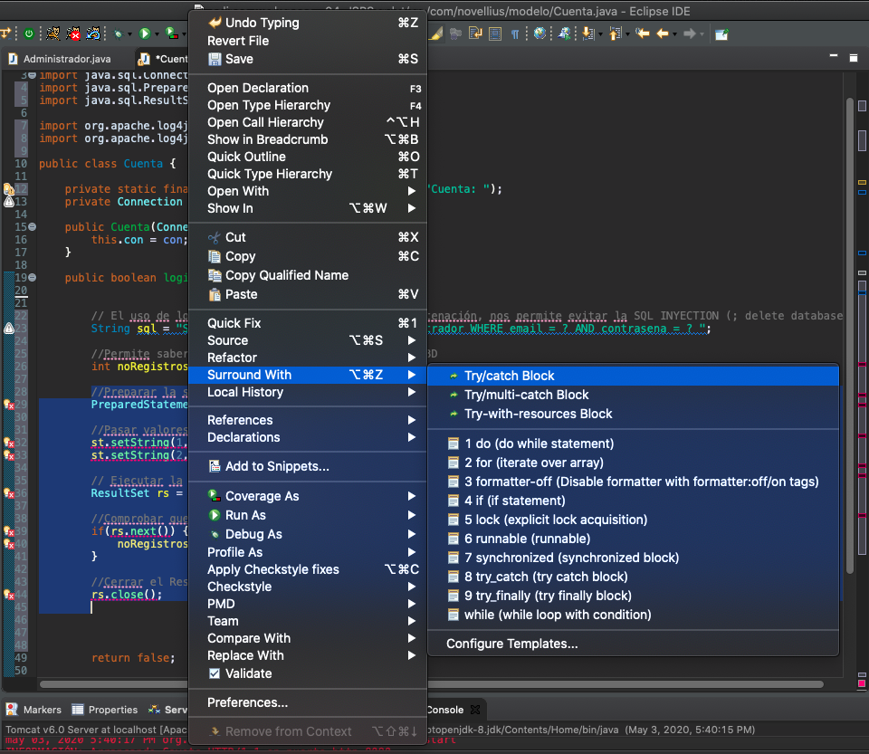

## Código del Controlador para validar el Login 10:53

En esta lección vamos a códificar el Servlet para que realice el loggin del usuario desde la vista `login.jsp`..

En el método `init()` haremos la configuración JNDI.

```java
//Confuguración JNDI
try {
   InitialContext initContext = new InitialContext();
   Context env = (Context) initContext.lookup("java:comp/env");
   ds = (DataSource) env.lookup("jdbc/novellius");
} catch (NamingException e) {
   log.error("Al configurar JNDI: " + e.getMessage());
}
```

En el metodo `doPost()` haremos la conexión y la desconexión

```java
//Conexión a la BD
try {
   con = ds.getConnection();
} catch (SQLException e) {
   log.error("Error al crear conexión: " + e.getMessage());
}

. . .

//Conexión a la BD
try {
   con.close();
} catch (SQLException e) {
   //Enviar a una vista de error
   log.error("Error al cerrar conexión: " + e.getMessage());
}
```

Luego de hacer la colección vamos a invocar al metodo `login` de la clase `Cuenta` para ver si encuentra los datos ingresados en la BD. Por lo cual será neceario ingresar un registro en la tabla `administrador` de nuestra BD.


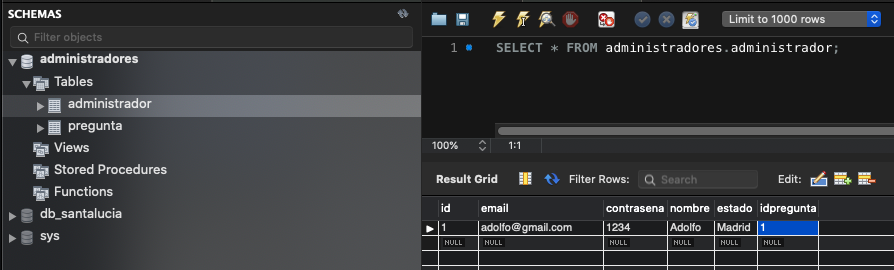

Al hacer nuestra primer prueba nos manda un primer error:

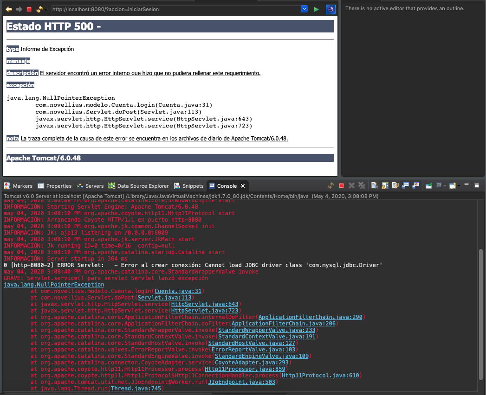

El error extacto es:

### Incluir Driver JDBC

`0 [http-8080-2] ERROR Servlet:   - Error al crear conexión: Cannot load JDBC driver class 'com.mysql.jdbc.Driver'`

Este error lo que nos indica que no pudo cargar el Driver JDBC, debemos añadir el jar de ese driver. Para descargarlo entramos a [MySQL Connectors](https://www.mysql.com/products/connector/). Descargaremos **JDBC Driver for MySQL (Connector/J)** Seleccionamos la plataforma independiente para usarlo en MAC.

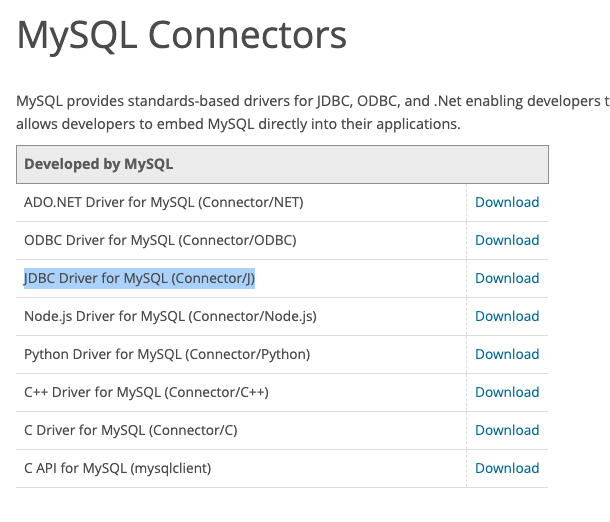

Nos descarga el archivo `mysql-connector-java-8.0.20.zip` lo descomprimimos y copiamos el archivo `mysql-connector-java-8.0.20.jar` para incluirlo en la carpeta `WEB-INF/lib` y lo añadimos en el Build-Path.

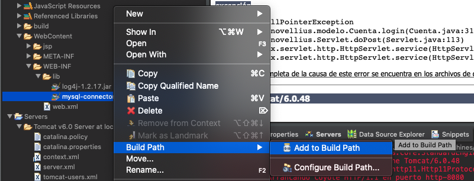

**NOTA: Fue necesario instalar Tomcat 9, ya que al usar el driver `mysql-connector-java-8.0.20.jar`, que es el más actual a la fecha (05/2020) la versión de Tomcat 6 no lo soportabá**

### Ejecutar el Código

Reinciamos el servidor y ejecutamos el proyecto, primero vamos simplemente a pulsar el botón sin ingresar ningún dato.


En la consola se nos indica que:

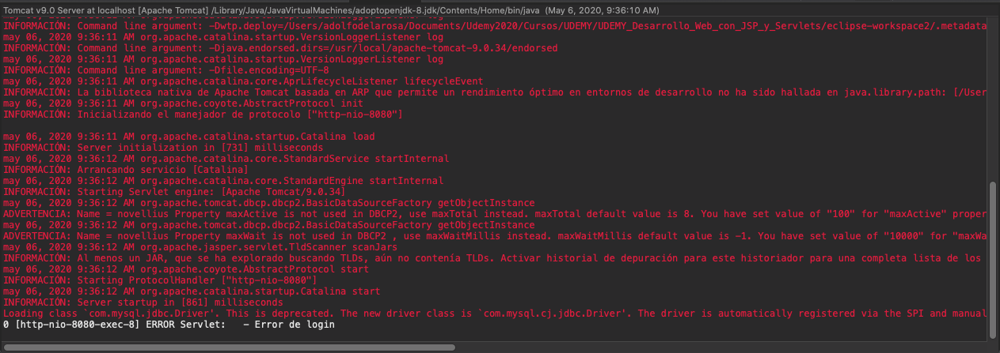

Ahora vamos a intentarlo nuevamente ingresado los mismos datos que el registro que insertamos en la BD.

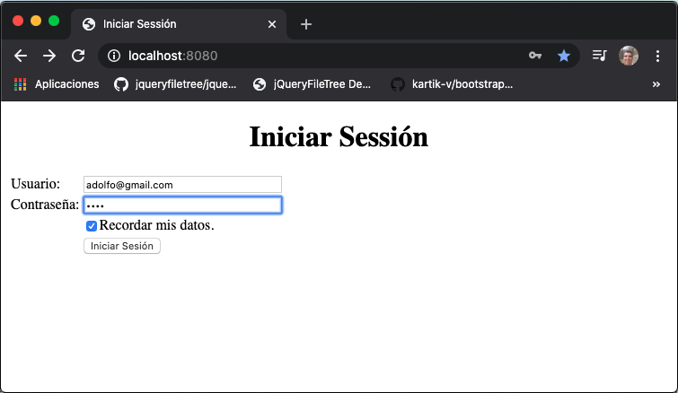

El Login es correcto:

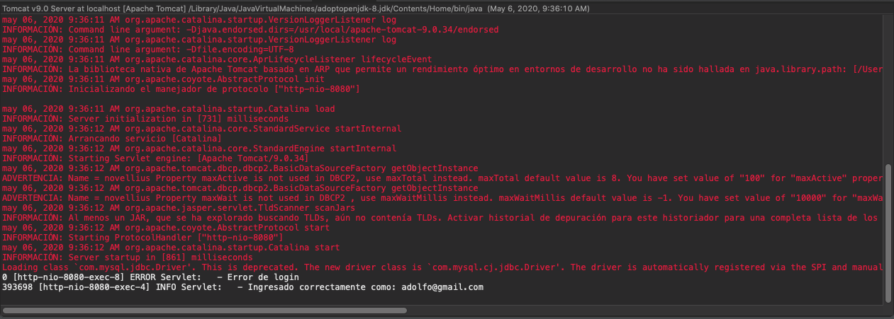

## Completando el código del controlador para implementar el Login 09:25

En esta lección seguiremos afinando nuestro código de Login.

Vamos a empezar metiendo un Scriptler en nuestro `login.jsp` para que muestre un error en caso de que el lógin no sea correcto.

```jsp
<%= request.getAttribute("error") %>
```

Este error lo alimentamos desde nuestro `Servlet.java` y será necesario indicar también que en caso de que exista un error se quede en la misma vista de login, por que si no ponemos nada mostrará una pantalla en blanco al pulsar el botón de `iniciar sesión` y no veremos nuestro mensaje, por lo que redirigimos la vista al mismo `login.jsp`

```java
request.setAttribute("error", "Nombre de usuario o contraseña incorrectos.");
setRespuestaControlador("postLogin").forward(request, response);
```

Usando `request` solo mandamos el atributo una sola vez. Lo que si guardaremos en sesión es al usuario y redirigimos a la siguiente vista.

```java
sesion.setAttribute("usuario", usuario);
setRespuestaControlador("postLogin").forward(request, response);
```
Al ejecutar mi aplicación vemos que al cargar la vista aparece un **null** en el lugar donde irá nuestro mensaje de error en caso de existir.

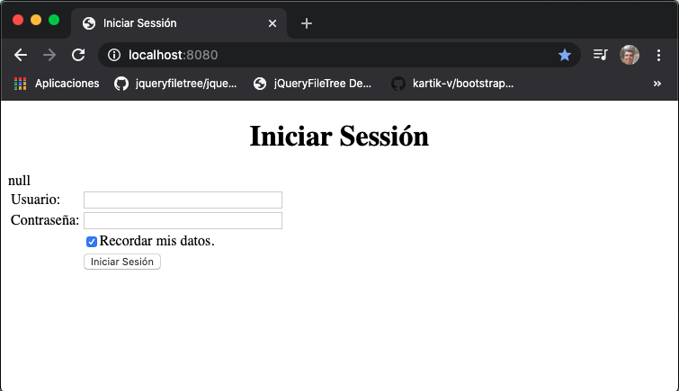

Al pulsar el botón `iniciar sesión` sin ingresar ningún dato nos muestra el mensaje de error.

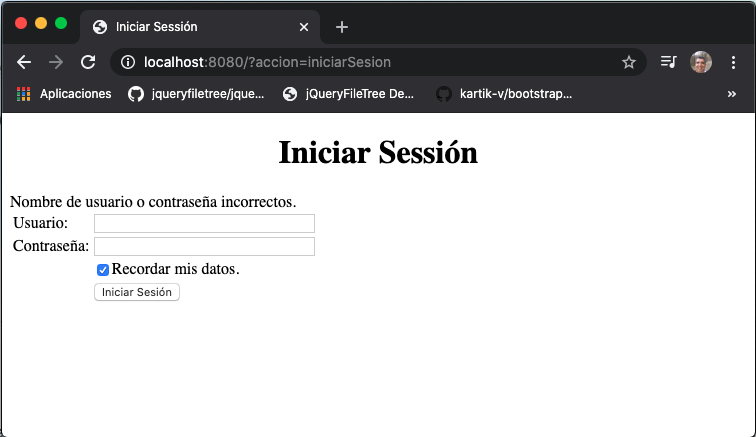

Para evitar que nos aparezca **null** tenemos que afinar nuestro Scriptler:

```java
<p style="color: red; font-weight: bold;">
   <%
	String error = (String) request.getAttribute("error");

	if (error != null){
		out.println(error);
	}

   %>
</p>
```

En este caso solo se imprimira el mensaje si es diferente de nulo, además hemos puesto un estilo para que el mensaje de error aparezca en rojo.

Ejecutando la aplicación tenemos:

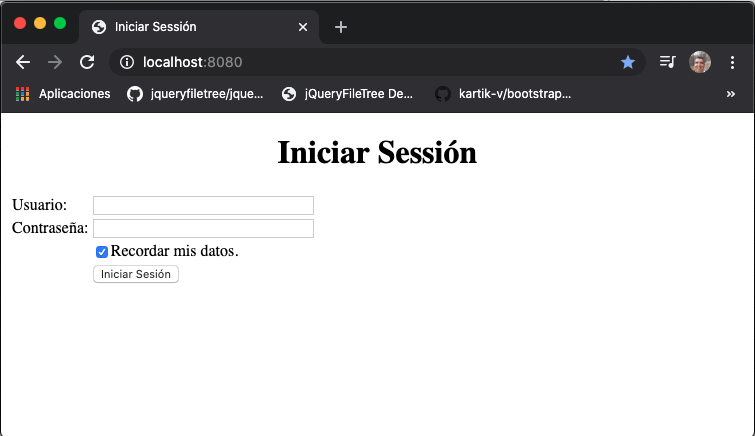

Al pulsar el botón `iniciar sesión` sin ingresar ningún dato nos muestra el mensaje de error.

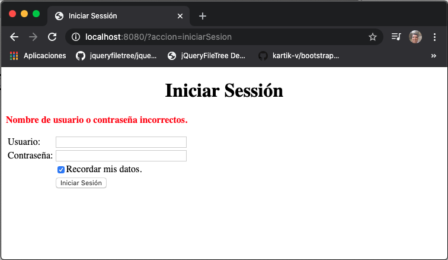

Si metemos los datos correctos

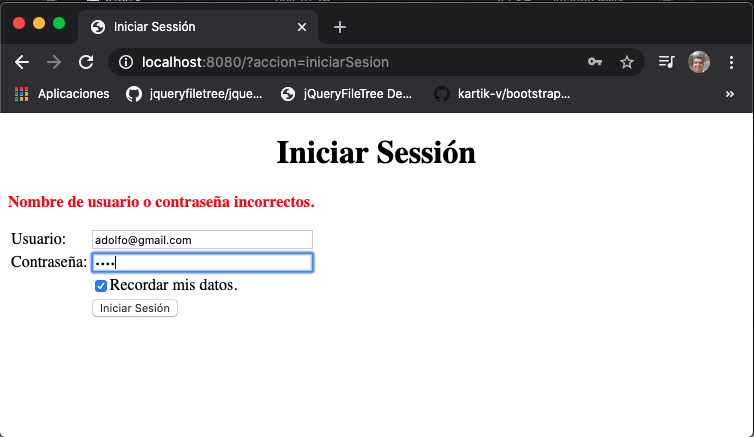

Nos redirigida a la siguiente vista.


#### Ver código completo

```java
package com.novellius;

import java.io.IOException;
import java.sql.Connection;
import java.sql.DriverManager;
import java.sql.SQLException;

import javax.naming.Context;
import javax.naming.InitialContext;
import javax.naming.NamingException;
import javax.servlet.RequestDispatcher;
import javax.servlet.ServletConfig;
import javax.servlet.ServletContext;
import javax.servlet.ServletException;
import javax.servlet.http.HttpServlet;
import javax.servlet.http.HttpServletRequest;
import javax.servlet.http.HttpServletResponse;
import javax.servlet.http.HttpSession;
import javax.sql.DataSource;

import org.apache.log4j.BasicConfigurator;
import org.apache.log4j.LogManager;
import org.apache.log4j.Logger;

import com.novellius.modelo.Cuenta;

/**
 * Servlet implementation class Servlet
 */
public class Servlet extends HttpServlet {
   private static final long serialVersionUID = 1L;
	
   private static final Logger log = LogManager.getLogger("Servlet: ");
   private String rutaJsp;
	
   //Variables para interctuar con la BD
   private DataSource ds;
   private Connection con;
       
   /**
    * @see HttpServlet#HttpServlet()
    */
   public Servlet() {
       super();
       // TODO Auto-generated constructor stub
   }

   @Override
   public void init(ServletConfig config) throws ServletException {
      // TODO Auto-generated method stub
      super.init(config);
		
      //System.out.println(config.getInitParameter("rutaJsp"));
      rutaJsp = config.getInitParameter("rutaJsp");
		
      //Configurar Logger
      BasicConfigurator.configure();
      
	
      //Confuguración JNDI
      try {
         InitialContext initContext = new InitialContext();
         Context env = (Context) initContext.lookup("java:comp/env");
         ds = (DataSource) env.lookup("jdbc/novellius");
      } catch (NamingException e) {
         log.error("Al configurar JNDI: " + e.getMessage());
      }
   }

   /**
    * @see HttpServlet#doGet(HttpServletRequest request, HttpServletResponse response)
    */
   protected void doGet(HttpServletRequest request, HttpServletResponse response) throws ServletException, IOException {

      String accion = request.getParameter("accion");
			
      if (accion != null) {
         if(accion.equals("login")) {
            setRespuestaControlador(accion).forward(request, response);
         }
      }else {
         setRespuestaControlador("login").forward(request, response);
      }
   }

   /**
    * @see HttpServlet#doPost(HttpServletRequest request, HttpServletResponse response)
    */
   protected void doPost(HttpServletRequest request, HttpServletResponse response) throws ServletException, IOException {
		
      String accion = request.getParameter("accion");
      HttpSession sesion = request.getSession();
		
      //Conexión a la BD
      try {
         con = ds.getConnection();
      } catch (SQLException e) {
         //Enviar a una vista de error
         log.error("Error al crear conexión: " + e.getMessage());
      }
			
      if (accion != null) {
			
         if(accion.equals("iniciarSesion")) {
				
            String usuario = request.getParameter("usuario");
	    String contrasena = request.getParameter("contrasena");
				
            //Invocar consulta SQL
            Cuenta cuenta = new Cuenta(con);
				
            if(cuenta.login(usuario, contrasena)) {
               log.info("Ingresado correctamente como: " + usuario);
								
	       // Ámbito sesión
	       sesion.setAttribute("usuario", usuario);
	       setRespuestaControlador("postLogin").forward(request, response);
					
            } else {
               log.error("Error de login");
               request.setAttribute("error", "Nombre de usuario o contraseña incorrectos.");
               setRespuestaControlador("login").forward(request, response);
            }
         }
			
      }else {
         setRespuestaControlador("login").forward(request, response);
      }
		
      //Conexión a la BD
      try {
	 con.close();
      } catch (SQLException e) {
	 //Enviar a una vista de error
	 log.error("Error al cerrar conexión: " + e.getMessage());
      }	
   }
	
   public RequestDispatcher setRespuestaControlador(String vista) {
      String url = rutaJsp + vista + ".jsp";
      return getServletContext().getRequestDispatcher(url);
   }
}
```

*Servlet.java*

```html
<%@ page language="java" contentType="text/html; charset=UTF-8"
    pageEncoding="UTF-8"%>
<!DOCTYPE html>
<html>
<head>
<meta charset="UTF-8">
<title>Iniciar Sessión</title>
</head>
<body>
   <h1 align="center">Iniciar Sessión</h1>
	
   <p style="color: red; font-weight: bold;">
   <%
      String error = (String) request.getAttribute("error");
	
      if (error != null){
         out.println(error);
      }
	
   %>
   </p>
	   
   <form method="post" action="?accion=iniciarSesion">
      <table>
         <tr>
	    <td>Usuario: </td>
	    <td><input type="text" name="usuario" size="35"/></td>
	 </tr>
	 <tr>
	    <td>Contraseña: </td>
	    <td><input type="password" name="contrasena" size="35" /></td>
	 </tr>
	 <tr>
	    <td>&nbsp;</td>
	    <td><input type="checkbox" checked="checked" />Recordar mis datos.</td>
	 </tr>
         <tr>
	    <td>&nbsp;</td>
	    <td><input type="submit" value="Iniciar Sesión" /></td>
	 </tr>
      </table>	
   </form>
	
</body>
</html>
```

*login.jsp*


```html
<%@ page language="java" contentType="text/html; charset=UTF-8"
    pageEncoding="UTF-8"%>
<!DOCTYPE html>
<html>
<head>
<meta charset="UTF-8">
<title>PostLogin</title>
</head>
<body>
   <h1>Sesión Iniciada</h1>
	
   <p>Ingresado como: <%= session.getAttribute("usuario") %></p>
	
	
   <table>
      <tr>
         <td>Cerrar sesión</td>
      </tr>
      <tr>
         <td>Consultar administradores</td>
      </tr>
   </table>
   <p>
      Contenido Principal
   </p>

</body>
</html>
```

*postLogin.jsp*

## Como cerrar la sesión de un usuario 03:50

En esta lección veremos como cerrar la sesión del usuario.

En la vista `postLogin.jsp` ponemos un enlace en el texto `Cerrar sesión`.

```html
<td><a href="?accion=logout">Cerrar sesión</a></td>
```

Al hacer este tipo de link se procesará a través de el método `doGet()`, por lo que en nuestro `Servlet.java` vamos a incluir el manejo de esta acción:

```java
protected void doGet(HttpServletRequest request, HttpServletResponse response) throws ServletException, IOException {

   String accion = request.getParameter("accion");
   //Recuperamos la sesión
   HttpSession sesion = request.getSession();
		
   if (accion != null) {
      if(accion.equals("login")) {
         setRespuestaControlador(accion).forward(request, response);
      }else if(accion.equals("logout")) {
         //Destruir la sesión
	 sesion.invalidate();
	 log.info("Sesión destruida");
	 setRespuestaControlador("login").forward(request, response);
      }
   }else {
      setRespuestaControlador("login").forward(request, response);
   }
}
```

Para comprobar que el valor de la sesión esta activo a través de la aplicación vamos a poner el valor de `usuario` en `login.jsp` para poder comprobarlo.

```html
. . .
<h1 align="center">Iniciar Sessión</h1>
<%= session.getAttribute("usuario") %>
 . . .	
```

Ejecutando el código tenemos:

Al cargar la aplicación nos pinta **null** por que el valor `usuario` de la sesión no tiene valor en este momento.


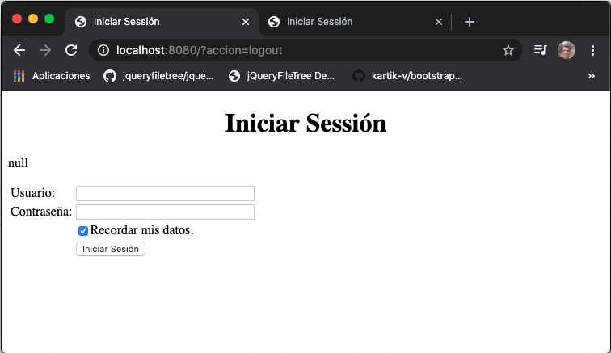

Ingresamos los datos de acceso

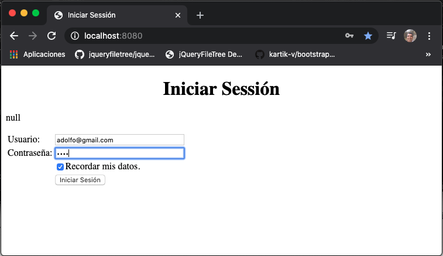

Entramos a nuestra siguiente vista

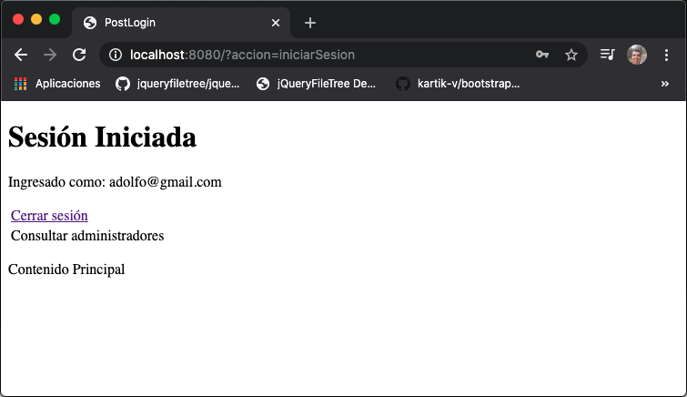

Si en este momento volvemos a cargar la vista de login tenemos:

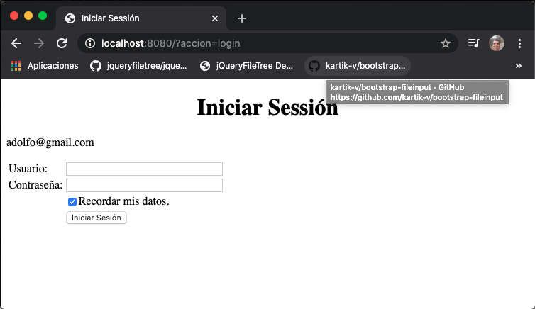

el valor `usuario` de la sesión ya tiene un valor y lo muestra, si regresamos a la vista de iniciar sesión


y pulsamos en la opción de `Cerrar sesión` volvemos a estar como al inicio.


#### Ver código completo

```java
package com.novellius;

import java.io.IOException;
import java.sql.Connection;
import java.sql.DriverManager;
import java.sql.SQLException;

import javax.naming.Context;
import javax.naming.InitialContext;
import javax.naming.NamingException;
import javax.servlet.RequestDispatcher;
import javax.servlet.ServletConfig;
import javax.servlet.ServletContext;
import javax.servlet.ServletException;
import javax.servlet.http.HttpServlet;
import javax.servlet.http.HttpServletRequest;
import javax.servlet.http.HttpServletResponse;
import javax.servlet.http.HttpSession;
import javax.sql.DataSource;

import org.apache.log4j.BasicConfigurator;
import org.apache.log4j.LogManager;
import org.apache.log4j.Logger;

import com.novellius.modelo.Cuenta;

/**
 * Servlet implementation class Servlet
 */
public class Servlet extends HttpServlet {
   private static final long serialVersionUID = 1L;
	
   private static final Logger log = LogManager.getLogger("Servlet: ");
   private String rutaJsp;
	
   //Variables para interctuar con la BD
   private DataSource ds;
   private Connection con;
       
   /**
    * @see HttpServlet#HttpServlet()
    */
   public Servlet() {
       super();
       // TODO Auto-generated constructor stub
   }

   @Override
   public void init(ServletConfig config) throws ServletException {
      // TODO Auto-generated method stub
      super.init(config);
		
      //System.out.println(config.getInitParameter("rutaJsp"));
      rutaJsp = config.getInitParameter("rutaJsp");
		
      //Configurar Logger
      BasicConfigurator.configure();
      
	
      //Confuguración JNDI
      try {
         InitialContext initContext = new InitialContext();
         Context env = (Context) initContext.lookup("java:comp/env");
         ds = (DataSource) env.lookup("jdbc/novellius");
      } catch (NamingException e) {
         log.error("Al configurar JNDI: " + e.getMessage());
      }
   }

   /**
    * @see HttpServlet#doGet(HttpServletRequest request, HttpServletResponse response)
    */
   protected void doGet(HttpServletRequest request, HttpServletResponse response) throws ServletException, IOException {

      String accion = request.getParameter("accion");
      HttpSession sesion = request.getSession();
		
		
      if (accion != null) {
         if(accion.equals("login")) {
            setRespuestaControlador(accion).forward(request, response);
         }else if(accion.equals("logout")) {
	    sesion.invalidate();
	    log.info("Sesión destruida");
	    setRespuestaControlador("login").forward(request, response);
	 }
      }else {
         setRespuestaControlador("login").forward(request, response);
      }
   }

   /**
    * @see HttpServlet#doPost(HttpServletRequest request, HttpServletResponse response)
    */
   protected void doPost(HttpServletRequest request, HttpServletResponse response) throws ServletException, IOException {
		
      String accion = request.getParameter("accion");
      HttpSession sesion = request.getSession();
		
      //Conexión a la BD
      try {
         con = ds.getConnection();
      } catch (SQLException e) {
         //Enviar a una vista de error
         log.error("Error al crear conexión: " + e.getMessage());
      }
			
      if (accion != null) {
			
         if(accion.equals("iniciarSesion")) {
				
            String usuario = request.getParameter("usuario");
	    String contrasena = request.getParameter("contrasena");
				
            //Invocar consulta SQL
            Cuenta cuenta = new Cuenta(con);
				
            if(cuenta.login(usuario, contrasena)) {
               log.info("Ingresado correctamente como: " + usuario);
								
	       // Ámbito sesión
	       sesion.setAttribute("usuario", usuario);
	       setRespuestaControlador("postLogin").forward(request, response);
					
            } else {
               log.error("Error de login");
               request.setAttribute("error", "Nombre de usuario o contraseña incorrectos.");
               setRespuestaControlador("login").forward(request, response);
            }
         }
			
      }else {
         setRespuestaControlador("login").forward(request, response);
      }
		
      //Conexión a la BD
      try {
	 con.close();
      } catch (SQLException e) {
	 //Enviar a una vista de error
	 log.error("Error al cerrar conexión: " + e.getMessage());
      }	
   }
	
   public RequestDispatcher setRespuestaControlador(String vista) {
      String url = rutaJsp + vista + ".jsp";
      return getServletContext().getRequestDispatcher(url);
   }
}
```

*Servlet.java*

```html
<%@ page language="java" contentType="text/html; charset=UTF-8"
    pageEncoding="UTF-8"%>
<!DOCTYPE html>
<html>
<head>
<meta charset="UTF-8">
<title>Iniciar Sessión</title>
</head>
<body>
   <h1 align="center">Iniciar Sessión</h1>
   <%= session.getAttribute("usuario") %>
	
   <p style="color: red; font-weight: bold;">
   <%
      String error = (String) request.getAttribute("error");
	
      if (error != null){
         out.println(error);
      }
	
   %>
   </p>
	   
   <form method="post" action="?accion=iniciarSesion">
      <table>
         <tr>
	    <td>Usuario: </td>
	    <td><input type="text" name="usuario" size="35"/></td>
	 </tr>
	 <tr>
	    <td>Contraseña: </td>
	    <td><input type="password" name="contrasena" size="35" /></td>
	 </tr>
	 <tr>
	    <td>&nbsp;</td>
	    <td><input type="checkbox" checked="checked" />Recordar mis datos.</td>
	 </tr>
         <tr>
	    <td>&nbsp;</td>
	    <td><input type="submit" value="Iniciar Sesión" /></td>
	 </tr>
      </table>	
   </form>
	
</body>
</html>
```

*login.jsp*


```html
<%@ page language="java" contentType="text/html; charset=UTF-8"
    pageEncoding="UTF-8"%>
<!DOCTYPE html>
<html>
<head>
<meta charset="UTF-8">
<title>PostLogin</title>
</head>
<body>
   <h1>Sesión Iniciada</h1>
	
   <p>Ingresado como: <%= session.getAttribute("usuario") %></p>

   <table>
      <tr>
         <td><a href="?accion=logout">Cerrar sesión</a></td>
      </tr>
      <tr>
         <td>Consultar administradores</td>
      </tr>
   </table>
   <p>
      Contenido Principal
   </p>

</body>
</html>
```

*postLogin.jsp*


## Uso de cookies 11:17

En esta lección aprenderemos el uso de Cookies en Java. Guardaremos los datos de acceso cuando estos sean correctos, para que en próximas ejecuciones de nuestra aplicación nos los coloque previamente y evitar que estar escribiendolos cada vez. 

El check que tenemos en nuestro formulario juega un papel importante, hasta ahora era un simple adorno pero ahora nos servira para saber si queremos realmente recordar los datos de acceso. Empezaremos por ponerle un nombre para poder identificarlo, pero sobre todo para poder recuperarlo como parámetro, los parámetros deben tener el atributo `name`.

```html
<td><input name="ckbox" type="checkbox" checked="checked" />Recordar mis datos.</td>
```

El Cookie lo crearemos en el momento de presinar el botón `Iniciar Sesión` y esto se maneja en nuestro método `doPost()` con la acción `iniciarSesion`.

El componente Input de tipo `checkbox` nos regresa el valor `on` en caso de estar seleccionado y `null` en caso de no estarlo, por lo que debemos manejar esta posibilidad para evitar un `NillPointerException`. En el caso de que nuestro check este seleccionado crearemos la Cookie solo cuando metemos datos de acceso correctos:


```java
// Creación de la Cookie
try {
   if (request.getParameter("chbox").equals("on")) {
      // Creo Cookies
      Cookie cookieUsurio = new Cookie("usuario", usuario);
      Cookie cookieContrasena = new Cookie("contrasena", contrasena);
	
      // Tiempo de vida 1 día
      cookieUsurio.setMaxAge(60 * 60 * 24);
      cookieContrasena.setMaxAge(60 * 60 * 24);
	
      // Añado las cookies
      response.addCookie(cookieUsurio);
      response.addCookie(cookieContrasena);
   }
} catch (NullPointerException e) {
   log.info("chbox vacio");
}
```

Lo que tenemos que hacer ahora es que en la vista `login.jsp` es recuperar las cookies y pintarlas en los input text en caso de existir.


