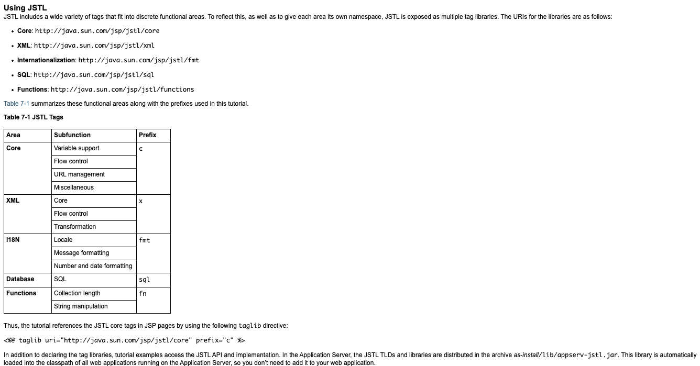
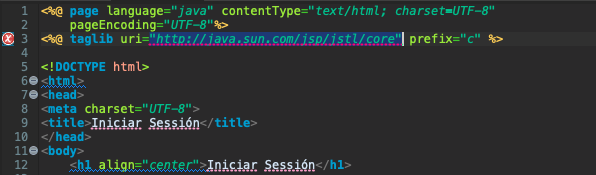

# 5. JSTL 01:11:31

* Introducción a JSTL 07:25
* Mi primer mensaje con c:out 04:35
* Uso de las etiquetas c:if y c:choose 03:54
* Creación de una consulta en el modelo 08:34
* Iteraciones con c:foreach 13:15
* Creación de una consulta con JSTL 08:44
* Manejo de excepciones en JSTL 04:19
* Manejo de parámetros HTTP con param 08:00
* Inserción de un registro en la B.D. con JSTL 07:41
* Funciones en JSTL 05:04

## Introducción a JSTL 07:25

[JavaServer Pages Standard Tag Library](https://www.oracle.com/java/technologies/Java-server-tag-library.html)

[Using JSTL](https://docs.oracle.com/javaee/5/tutorial/doc/bnake.html)

[JSP - Standard Tag Library (JSTL) Tutorial](https://www.tutorialspoint.com/jsp/jsp_standard_tag_library.htm)

[JSTL (JSP Standard Tag Library)](https://www.javatpoint.com/jstl)

[JSTL Tutorial, JSTL Tags Example](https://www.journaldev.com/2090/jstl-tutorial-jstl-tags-example)

[JSTL](http://www.jtech.ua.es/j2ee/restringido/cw/sesion08-apuntes.html)

[Uso de JSTL](https://desarrollo-java.readthedocs.io/es/latest/tutorial6.md.html)

JavaServer Pages Standard Tag Library (JSTL) encapsula como etiquetas simples la funcionalidad principal común a muchas aplicaciones web. JSTL tiene soporte para tareas comunes y estructurales como iteración y condicionales, etiquetas para manipular documentos XML, etiquetas de internacionalización y etiquetas SQL. También proporciona un marco para integrar etiquetas personalizadas existentes con etiquetas JSTL.

La JSTL 1.2 Maintenace Release se alinea con el Unified Expression Language (EL) que se entrega como parte de la JavaServer Pages (JSP) 2.1 specification. Gracias a Unified EL, las JSTL tags, como las JSTL iteration tags, ahora se pueden usar con componentes JavaServer Faces de una manera intuitiva.

### Configurar taglibs JSTL en nuestro proyeyecto

Para poder usar los tags de JSTL dentro de nuestra aplicación debemos añadir una directiva que nos permitirá usar un conjunto de etiquetas segun un tema determinado, en el siguiente enlace se explican todos los grupos de taglibs que existen y nos indica que directiva debemos añadir a nuestro proyecto para poder usarla.

[Using JSTL](https://docs.oracle.com/javaee/5/tutorial/doc/bnake.html)

Existen básicamente 5 áreas `Core, XML, I18N, Database, Functions` cada una con sus funcionalidades, por ejemplo para añadir el uso de `Core` debemos añadir la directiva `<%@ taglib uri="http://java.sun.com/jsp/jstl/core" prefix="c" %>` en la vista que vaya a usar los tagslibs de `Core`.

En nuestro caso copiaremos la directiva en la vista `login.jsp`

Cuando lo añadimos en la vista nos marca un error esto es debido a que como es un recurso de un tercero, necesito añadir el **.jar** correspondiente para poder utilizarlo, podemos ayudarnos de los repositorios de Maven para poder descargar `jstl-api-1.2.jar`.

[JSTL](https://mvnrepository.com/artifact/jstl/jstl)

[JavaServer Pages(TM) Standard Tag Library » 1.2](https://mvnrepository.com/artifact/javax.servlet.jsp.jstl/jstl-api/1.2)

Una vez que hemos descargado el archivo jar `jstl-api-1.2.jar` lo copiamos a nuestra libreria y lo añadimos al Build Path.

## Mi primer mensaje con c:out 04:35
## Uso de las etiquetas c:if y c:choose 03:54
## Creación de una consulta en el modelo 08:34
## Iteraciones con c:foreach 13:15
## Creación de una consulta con JSTL 08:44
## Manejo de excepciones en JSTL 04:19
## Manejo de parámetros HTTP con param 08:00
## Inserción de un registro en la B.D. con JSTL 07:41
## Funciones en JSTL 05:04
