# 6. Envío de correos electrónicos 40:42

* Configuración previa 04:18
* Creación de una clase manejadora de correos 17:13
* Implementación de envío de correos electrónicos en la Vista y el Controlador 12:34
* Completando el código de envío de correos 06:37

## Configuración previa 04:18

Para poder enviar correos con Java necesitamos:

* un cuenta de Correo
* Un API 

### Configurar Cuenta de Correo

Para poder envíar correos en Java hay que configurar una cuenta de correos desde donde vamos envíar los correos, esta puede ser una cuenta hotmail, gmail o una cuenta de un servidor que tengamos contratado, este último caso es el que configuraremos aquí.

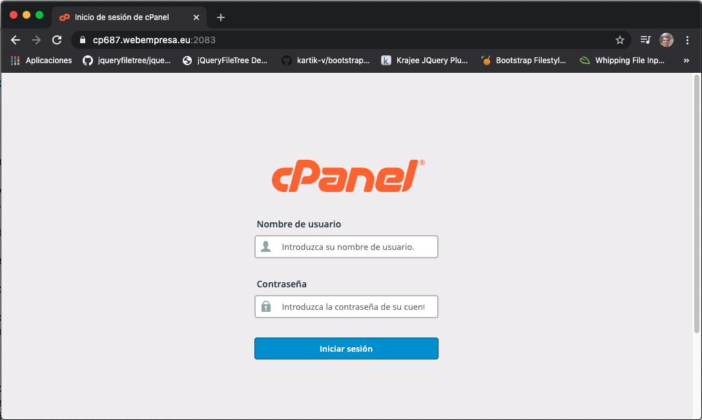

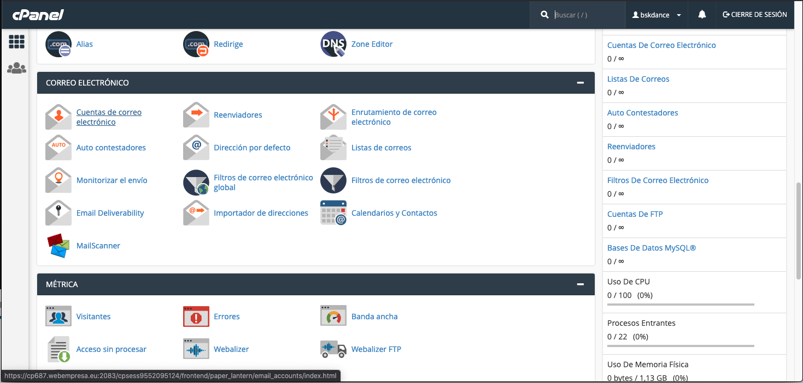

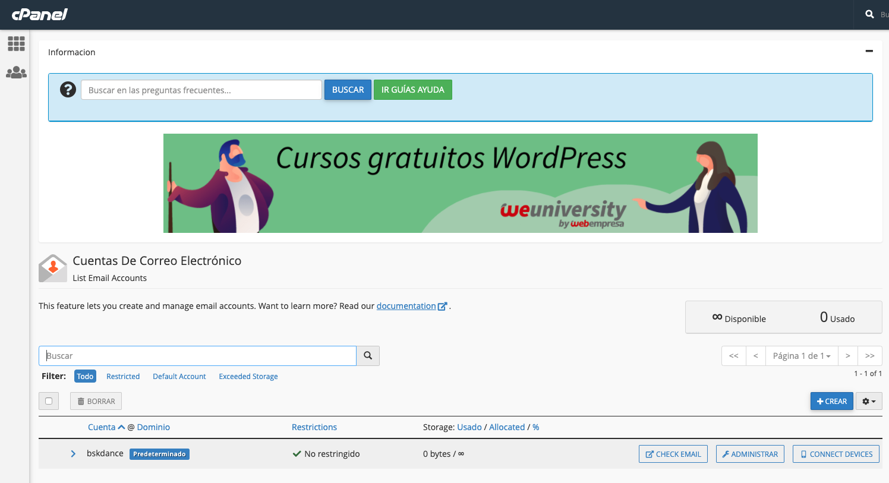

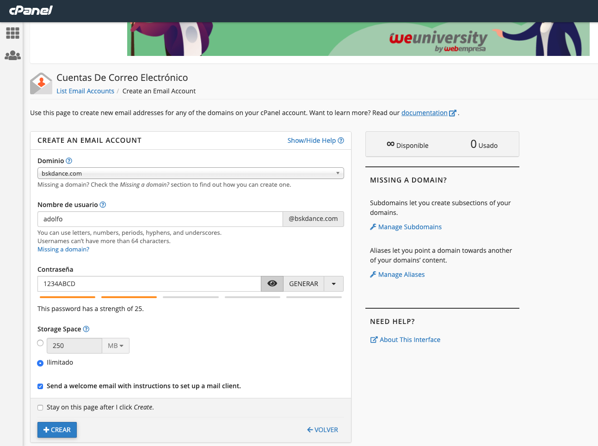

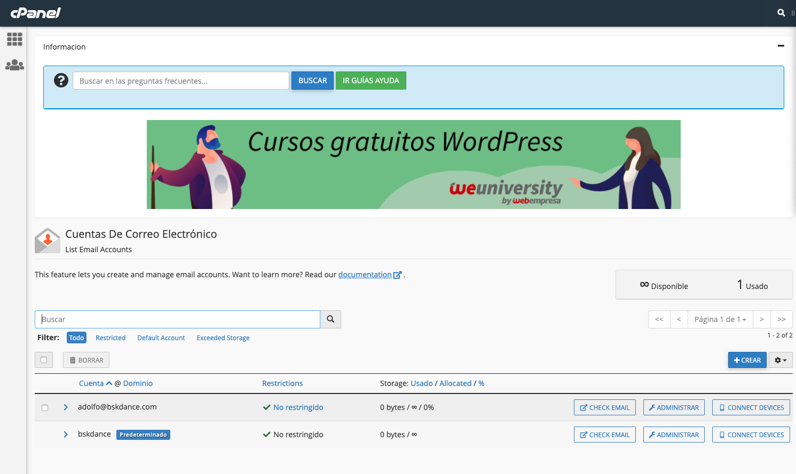

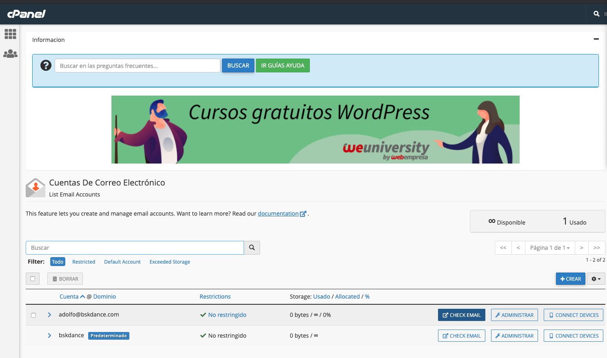

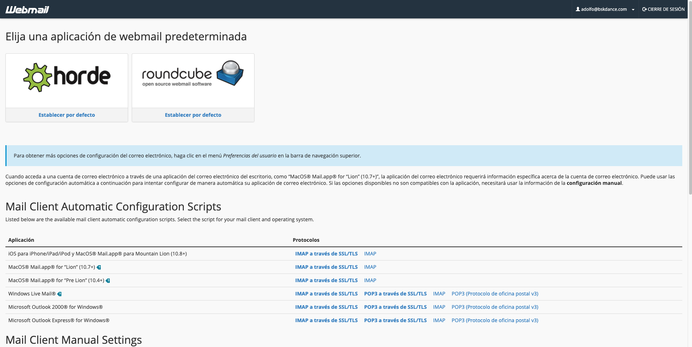

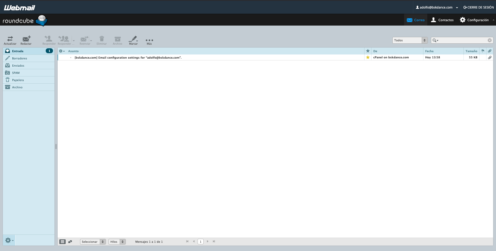

### Configigurar JavaMail API (compat) » 1.4.7

[JavaMail API (compat) » 1.4.7](https://mvnrepository.com/artifact/javax.mail/mail/1.4.7)

Necesitamos descargar la librería `javax.mail.jar`, en enlace abterior nos permite descargar `mail-1.4.7.jar`
el cual lo añadimos en la carpeta `lib` y lo añadimos al Build Path.

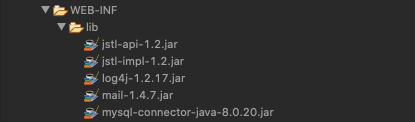

## Creación de una clase manejadora de correos 17:13

En esta lección vamos a crear una clase manejadora de correos. 

La nueva clase la crearemos en un nuevo paquete llamado `util` dentro de este paquete crearemos la clase `ManejadorCorreos.java` esta clase tiene que hacer los siguientes pasos:

* Iniciarlizar las propiedades de conexión como Host, Puerto, Usuario, Autenticación
* Inicializar una sesión de email con todas las propiedades previamente definidas
* Composición del mensaje pasando como parámetro la sesión. Establece emisor, destinatario, asunto y mensaje
* Crear un objeto que modela un objeto para el transportedel transporte, crea un canal de comunicación para el mensaje. 

Una vez hecho todo esto crearemos una clase de prueba `TestManejadorCorreos.java` para el envio de correos, con un método `public static void main(String[] args)`.

#### Ejecutar la aplicación

Ejecutamos la aplicación como una Java Aplicación, no usamos el Server.

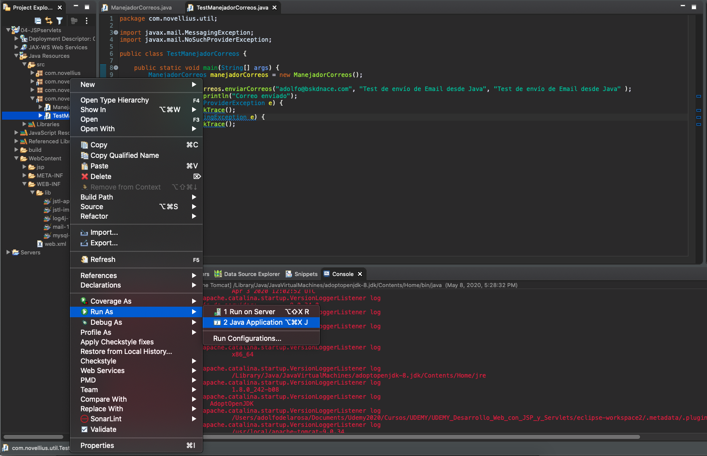

Se ejecuta `TestManejadorCorreos.java` y nos muestra en consola que el Correo se ha envíado.

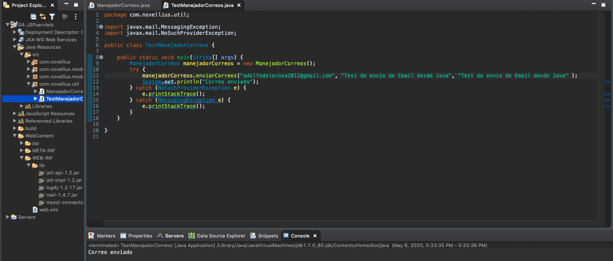

Si abrimos nuestro correo vemos el nuevo email

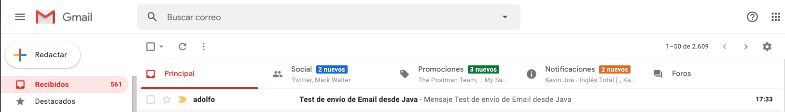

Y si lo abrimos vemos el contenido que definimos en nuestra clase `ManejadorCorreos.java`

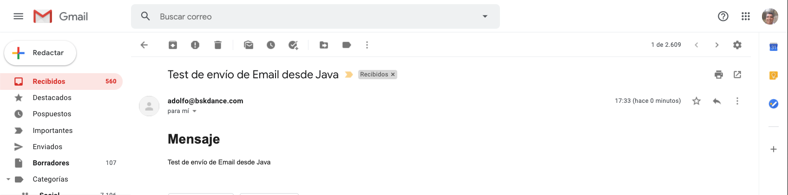

Si por el contrario existe alguna excepción al ejecutar la clase se nos muestra en la consola, en este caso, el problema que el email emisor era incorrecto.

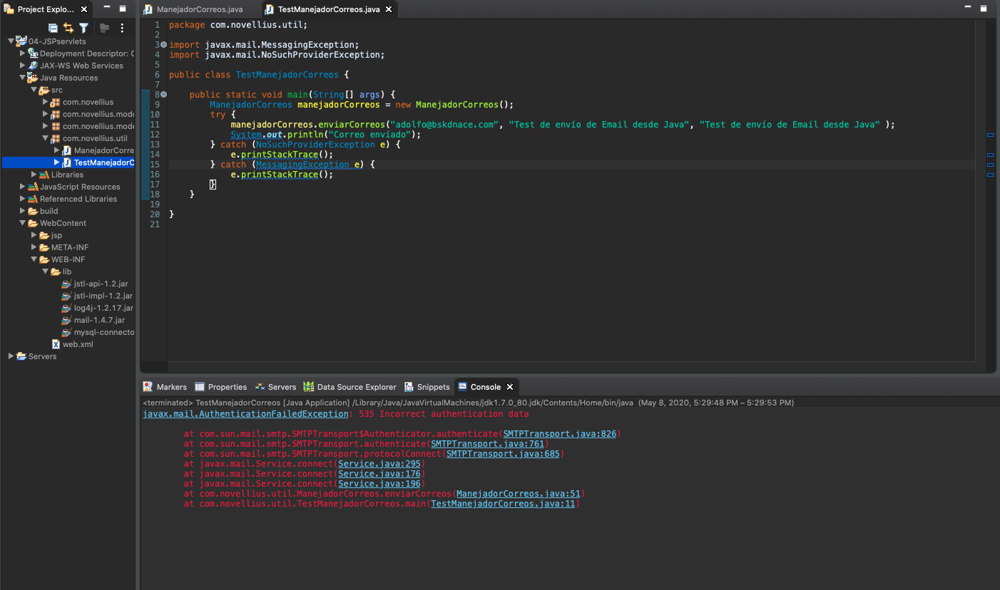

#### Código de Manejador de Correos

```java
package com.novellius.util;

import java.util.Properties;

import javax.mail.Message;
import javax.mail.MessagingException;
import javax.mail.NoSuchProviderException;
import javax.mail.Session;
import javax.mail.Transport;
import javax.mail.internet.InternetAddress;
import javax.mail.internet.MimeMessage;

public class ManejadorCorreos {
	
   // Propiedades de la clase
   private Properties props; // Datos del correo que va a enviar el mensaje HOST, PUERTO, EMAIL, AUTENTICACIÓN
   private Session sesion; // Sesión de javax.mail, una vez que se implementa la conexión esta sesión se conecta a ella para establecer un canal y poder enviar el mensaje y después cierra la conexión 
   private Transport transport; // Crean las conexiones para el email
   private MimeMessage msg; // Aquí se compone el cuerpo del mensaje
	
   //Constructor
   public ManejadorCorreos() {
		
      // Inicializar y llenar las propiedades básicas para poder conectar y enviar un correo
      props = new Properties();
      props.setProperty("mail.smtp.host", "mail.bskdance.com"); // Host del correo saliente
      props.setProperty("mail.smtp.port", "26"); // Puerto del correo saliente
      props.setProperty("mail.smtp.user", "adolfo@bskdance.com"); // Usuario del correo saliente
      props.setProperty("mail.smtp.auth", "true"); // Autenticación
		
   }
	
   //Método para enviar el correo
   //Dispara las excepciones hacia arriba para que el Servlet maneje la excepción y 
   //redirija a una vista que muestre un mensaje de error
   public void enviarCorreos(String destinatario, String asunto, String mensaje) throws MessagingException, NoSuchProviderException {
		
      //Inicializar sesión con las propiedades definidas
      sesion = Session.getDefaultInstance(props);
		
      //Composición del mensaje, establece emisor, destinatario, asunto y mensaje
      msg = new MimeMessage(sesion);
      msg.setFrom(new InternetAddress("adolfo@bskdance.com"));
      msg.addRecipient(Message.RecipientType.TO, new InternetAddress(destinatario));
      msg.setSubject(asunto);
      msg.setText("<h1>Mensaje</h1>"
               +  "<p>" + mensaje + "</p>", "UTF-8", "html"); //Puedi mandar texto plano o html
	
      // Crear un objeto que modela un objeto para el transportedel transporte, crea un canal de comunicación para el mensaje. 
      transport = sesion.getTransport("smtp"); // Protocolo para enviar emails
      transport.connect("adolfo@bskdance.com", "1234ABCD"); //Claves de autenticación
      transport.sendMessage(msg, msg.getAllRecipients()); // Envío del correo (se puede envíar a varios destinatarios si son un array)
      transport.close(); // Cerrar la conexión
   }
}
```

*ManejadorCorreos.java*

```java
package com.novellius.util;

import javax.mail.MessagingException;
import javax.mail.NoSuchProviderException;

public class TestManejadorCorreos {
	
   public static void main(String[] args) {
      ManejadorCorreos manejadorCorreos = new ManejadorCorreos();
      try {
         manejadorCorreos.enviarCorreos("adolfodelarosa2012@gmail.com", "Test de envío de Email desde Java", "Test de envío de Email desde Java" );
         System.out.println("Correo envíado");
      } catch (NoSuchProviderException e) {
         e.printStackTrace();
      } catch (MessagingException e) {
         e.printStackTrace();
      }
   }
}
```

*TestManejadorCorreos.java*

## Implementación de envío de correos electrónicos en la Vista y el Controlador 12:34

En esta lección vamos a implementar el envío de correos electrónicos en la Vista y el Controlador. 

Lo primero que haremos es incluir una opción a nuestro menú en la vista `postLogin.jsp`.

```html
<tr>
   <td><a href="?accion=enviarCorreo" >Enviar correo electrónico</a></td>
</tr>
```

Manejamos esta nueva acción en nuestro Servlet.

```java
} else if (accion.contentEquals("enviarCorreo")) {
   setRespuestaControlador(accion).forward(request, response);
}
```

Creamos la nueva vista `enviarCorreo.jsp`

```html
<h1>Enviar Correo electrónico</h1>

<form method="post" action="?accion=enviarCorreo">
		
   <p>Para: <input type="text" name="destinatario" size="35" /></p>
   <p>Asunto: <input type="text" name="asunto" size="35" /></p>
   <p>Mensaje: <input type="text" name="destinatario" size="35" /></p>
		
   <input type="submit" value="Enviar Correo" />
</form>
```

Tenemos una nueva acción `enviarCorreo` que debemos manejar en el método `doPost()` del Servlet. Hemos agregado el conjunto de caracteres UTF-8 al método `doPost()` para que los emails lleguen con acentos.

```java

//Establecer un juego de carácteres para los parámetros que llegan al método POST
request.setCharacterEncoding("UTF-8");

....

} else if(accion.contentEquals("enviarCorreo")) {
   ManejadorCorreos manejadorCorreos = new ManejadorCorreos();
   try {
      manejadorCorreos.enviarCorreos(request.getParameter("destinatario"), request.getParameter("asunto"), request.getParameter("mensaje"));
      log.info("correo enviado correctamente");
   } catch (Exception e) {
      log.error("Al enviar correo: " + e.getMessage());
      e.printStackTrace();
      setRespuestaControlador("errorCorreo").forward(request, response);
   }
}
```

Vamos a crear la nueva vista `errorCorreo.jsp` 

```html
<%@ page language="java" contentType="text/html; charset=UTF-8"
    pageEncoding="UTF-8"%>
<!DOCTYPE html>
<html>
<head>
<meta charset="UTF-8">
<title>Error correo</title>
</head>
<body>
   <h1>Ocurrió un error al enviar el correo</h1>
   
   <p>Ha habido un error al enviar el email</p>
   
   <a href="?accion="menu"></a>

</body>
</html>
```

Metemos en el método `doGet()` la acción de `menu`:

```java
} else if (accion.equals("menu")) {
   setRespuestaControlador("postLogin").forward(request, response);
}
```

### Ejecución de la aplicación

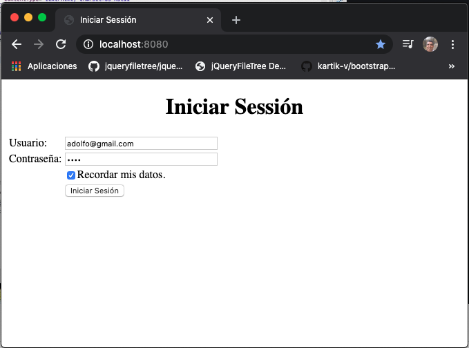

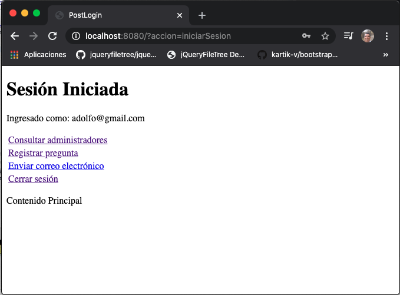

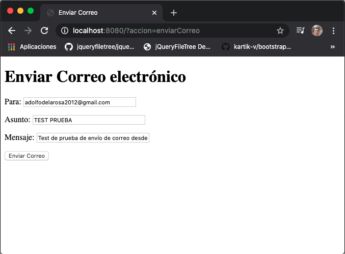

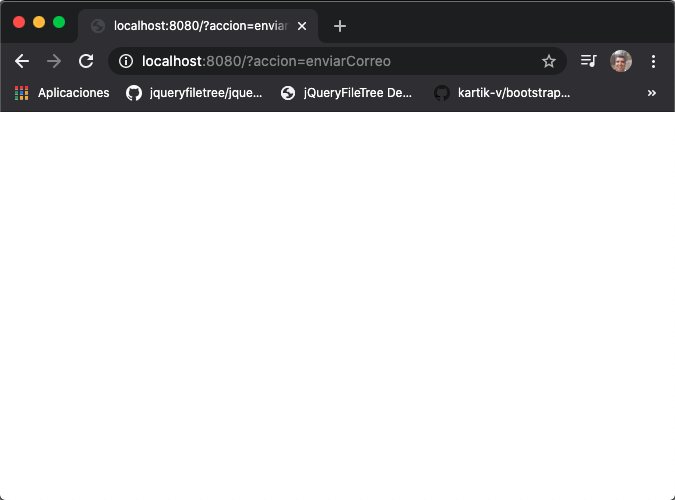

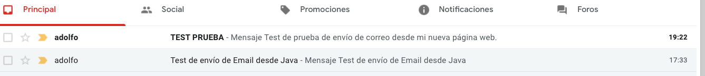

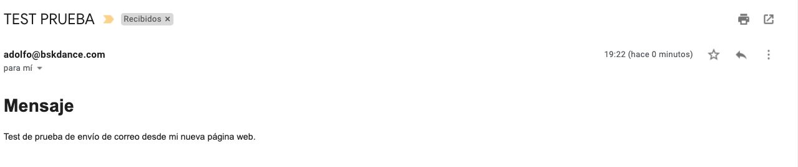

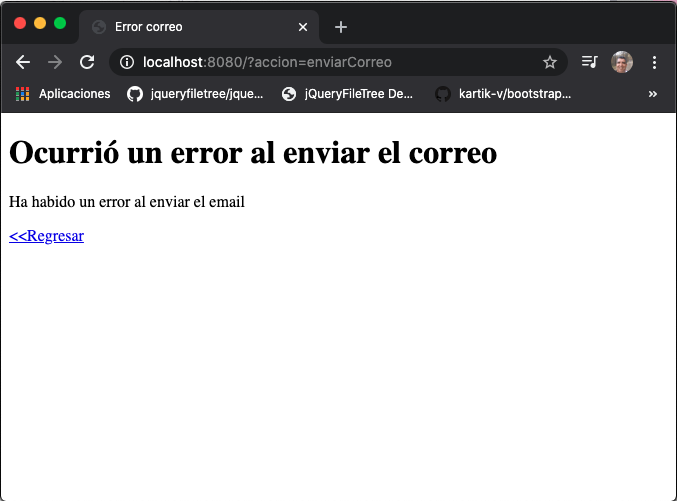

## Completando el código de envío de correos 06:37
