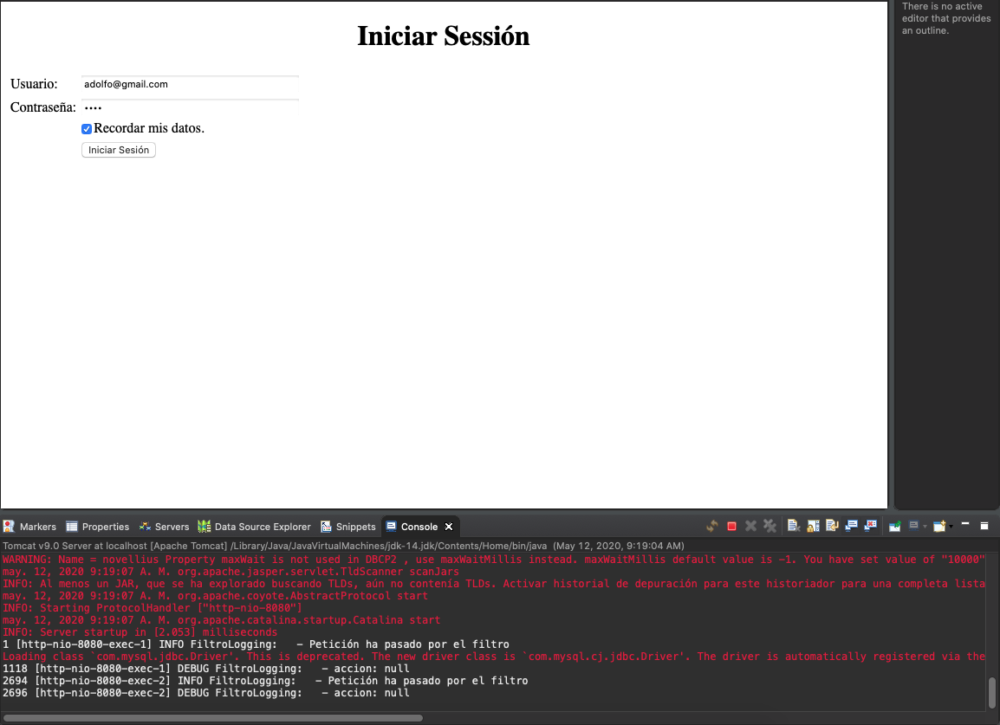
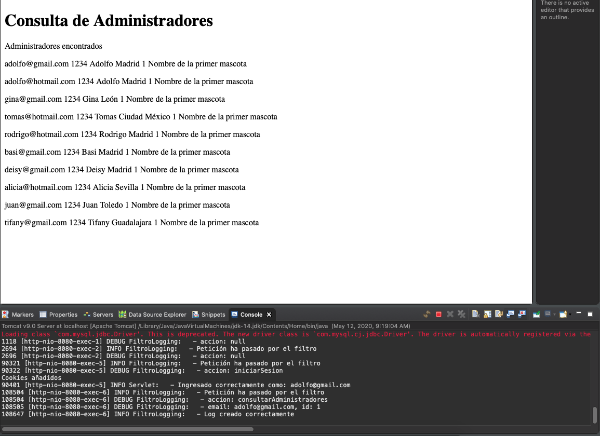
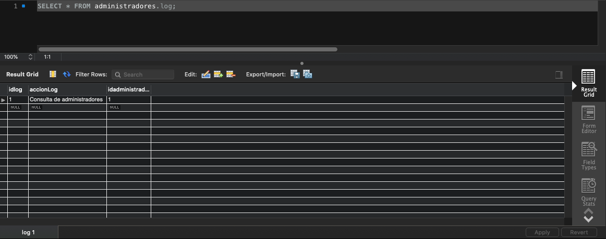
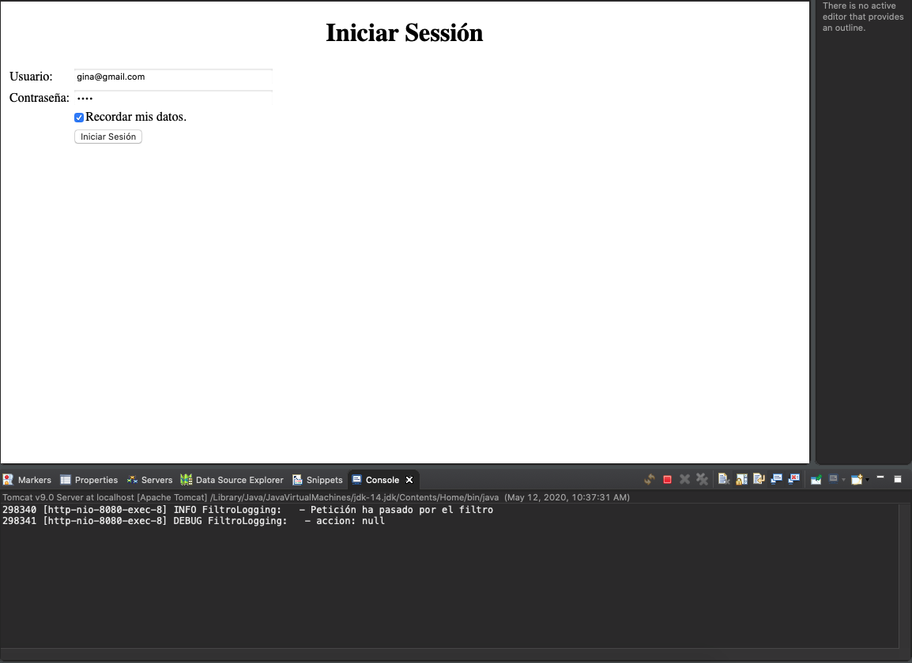
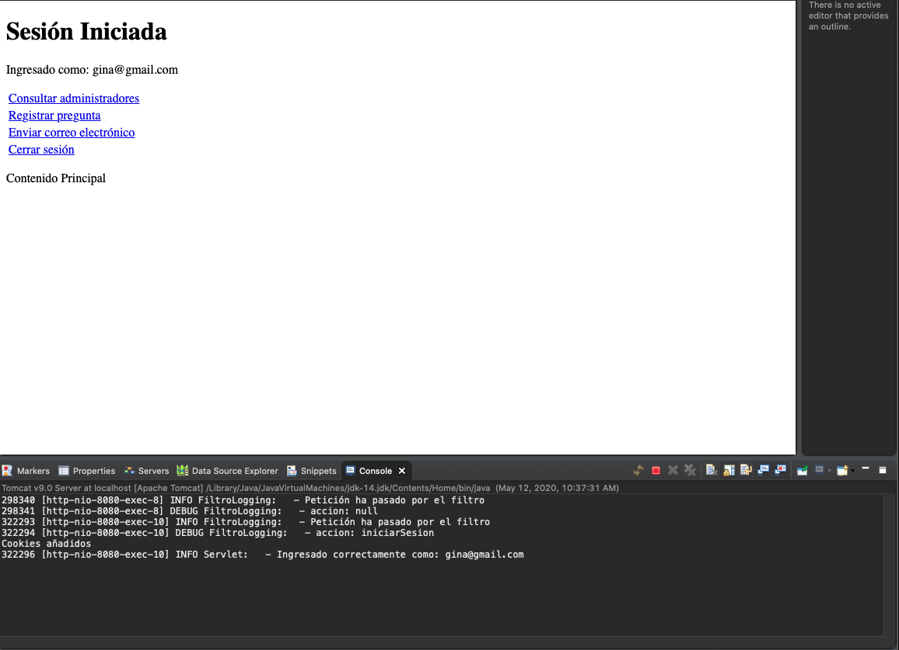
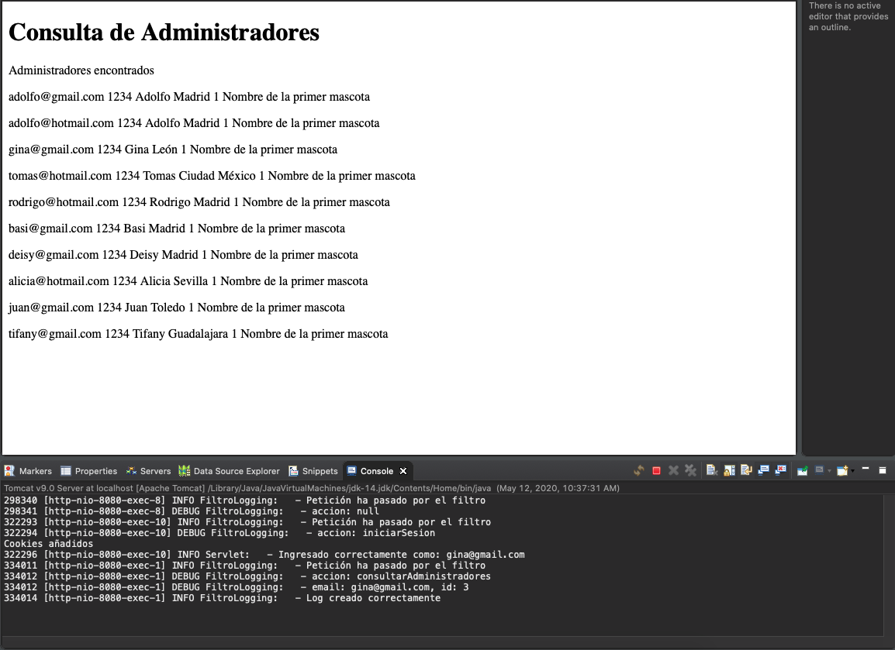
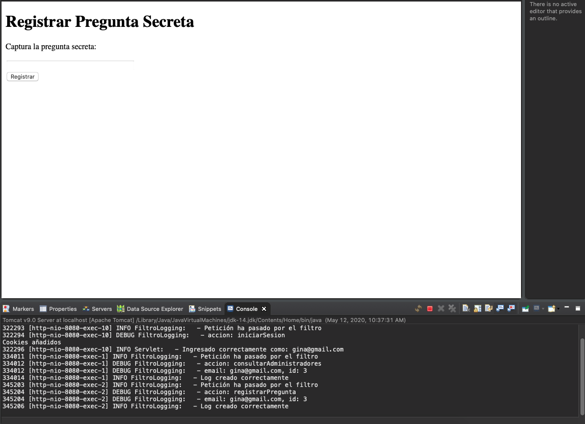
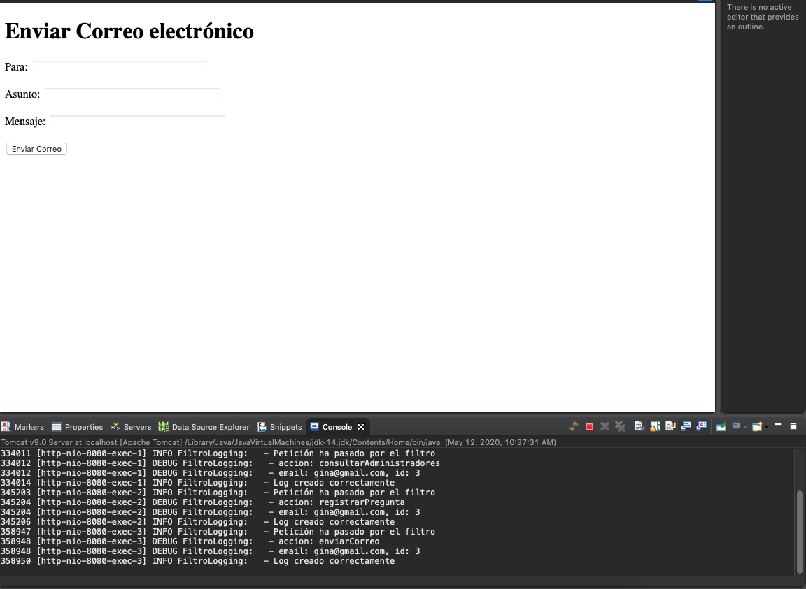
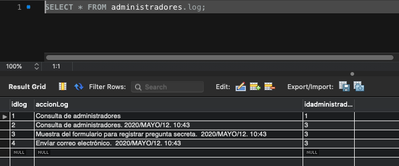
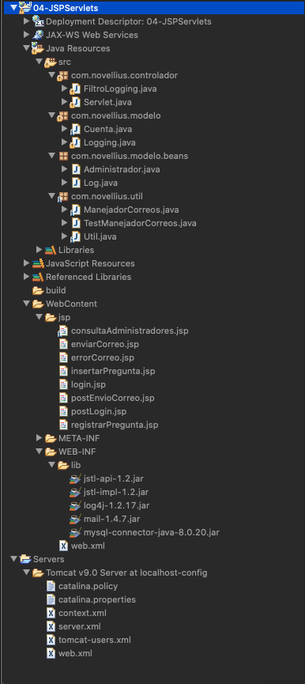

# 7. Implementación de un Logger a través de Filtros 01:02:17

En este capítulo veremos el uso de filtros, crearemos un módulo de Logger para registrar todos los movimientos del administrador y registrarlos en la BD. 

* Creación de la tabla de Log 04:32
* Definición y creación de un SerlvetFilter básico 06:17
* Código del modelo para crear el Logger 12:48
* Implementación del Logger en el SerlvetFilter 19:49
* Completando el módulo de Logging 18:51

## Creación de la tabla de Log 04:32

En esta lección vamos a crear una nueva tabla llamada `log` la cual se relacionara con la tabla `administrador`, es decir que un administrador pueden tener varios logs.


Una vez creada la tabla vamos a generar el código para que se genere la BD.


Seleccionamos la conección `administradores`


Marcamos el check drop objects before each CREATE object, para eliminar el esquema previo antes de generarlo nuevamente.


Continuamos


Se nos muestra el código generado 


Ejecuta todas las tareas correctamente 


Tenemos nuestras tres tablas generadas


Como se borrarón los datos de las tablas `administrador` y `pregunta` vamos a ejecutar los siguientes scripts:

```sql
INSERT INTO `pregunta` (`idpregunta`,`pregunta`) VALUES (1,'Nombre de la primer mascota');
INSERT INTO `pregunta` (`idpregunta`,`pregunta`) VALUES (2,'Apellido de soltera de la madre');
INSERT INTO `pregunta` (`idpregunta`,`pregunta`) VALUES (3,'Nombre del abuelo paterno');
INSERT INTO `pregunta` (`idpregunta`,`pregunta`) VALUES (4,'Nombre de escuela primaría');
INSERT INTO `administrador` (`id`,`email`,`contrasena`,`nombre`,`estado`,`idpregunta`) VALUES (1,'adolfo@gmail.com','1234','Adolfo','Madrid',1);
INSERT INTO `administrador` (`id`,`email`,`contrasena`,`nombre`,`estado`,`idpregunta`) VALUES (2,'adolfo@hotmail.com','1234','Adolfo','Madrid',1);
INSERT INTO `administrador` (`id`,`email`,`contrasena`,`nombre`,`estado`,`idpregunta`) VALUES (3,'gina@gmail.com','1234','Gina','León',1);
INSERT INTO `administrador` (`id`,`email`,`contrasena`,`nombre`,`estado`,`idpregunta`) VALUES (4,'tomas@hotmail.com','1234','Tomas','Ciudad México',1);
INSERT INTO `administrador` (`id`,`email`,`contrasena`,`nombre`,`estado`,`idpregunta`) VALUES (5,'rodrigo@hotmail.com','1234','Rodrigo','Madrid',1);
INSERT INTO `administrador` (`id`,`email`,`contrasena`,`nombre`,`estado`,`idpregunta`) VALUES (6,'basi@gmail.com','1234','Basi','Madrid',1);
INSERT INTO `administrador` (`id`,`email`,`contrasena`,`nombre`,`estado`,`idpregunta`) VALUES (7,'deisy@gmail.com','1234','Deisy','Madrid',1);
INSERT INTO `administrador` (`id`,`email`,`contrasena`,`nombre`,`estado`,`idpregunta`) VALUES (8,'alicia@hotmail.com','1234','Alicia','Sevilla',1);
INSERT INTO `administrador` (`id`,`email`,`contrasena`,`nombre`,`estado`,`idpregunta`) VALUES (9,'juan@gmail.com','1234','Juan','Toledo',1);
INSERT INTO `administrador` (`id`,`email`,`contrasena`,`nombre`,`estado`,`idpregunta`) VALUES (10,'tifany@gmail.com','1234','Tifany','Guadalajara',1);
```
## Definición y creación de un SerlvetFilter básico 06:17

En esta lección veremos que es un Filtro y crearemos un SerlvetFilter básico.

### ¿Qué es un Filter?

El filter es una capa entre el cliente y el Servlet cada que se hace un request/response.


En el filter podemos realizar tareas intermedias de acuerdo a las peticiones o respuestas que se hagan, para nuestro ejemplo iinterceptaremos la "acción" que se realiza y la registraremos en la BD.

### Creación del Filter.

1. Creamos el paquete `com.novellius.controlador`
2. Movemos `Servlet.java` en este nuevo paquete
3. Es necesario modificar `web.xml` para indicar la nueva posición del Servlet

```html
<servlet-class>com.novellius.controlador.Servlet</servlet-class>
```

4. Dentro del nuevo paquete creamos un nuevo `Filter`


5.Se crea una plantilla en `FiltroLogging.java`, para comprobar que funciona, implementaremos el Logger en este archivo y mandaremos un mensaje en el método `doFilter`:

```java
public void doFilter(ServletRequest request, ServletResponse response, FilterChain chain) throws IOException, ServletException {
		
		log.info("Petición ha pasado por el filtro");
		
		// pass the request along the filter chain
		chain.doFilter(request, response);
	}
```

6. En teoría se debería haber metido una etiqueta `<filter>` y `<filter-mapping>` en `web.xml` pero si no lo hace la metemos manualmente:

```html
<filter>
	<display-name>FiltroLogging</display-name>
	<filter-name>FiltroLogging</filter-name>
	<filter-class>com.novellius.controlador.FiltroLogging</filter-class>
</filter>
<filter-mapping>
	<filter-name>FiltroLogging</filter-name>
	<url-pattern>/*</url-pattern>
</filter-mapping>
```

7. Ejecutamos el proyecto

Al cargar el proyecto ya paso por el filtro


Al hacer el loggin pasa nuevamente por el filtro


Y al entrar a cualquier opción del menú vuelve a pasar por el filtro


## Código del modelo para crear el Logger 12:48

En esta lección vamos a crear las clases del modelo para insertar en la BD en nuestro Logger.

1. En el paquete `modelo.beans` vamos a crear el bean `Log`

```java
package com.novellius.modelo.beans;

public class Log {
	
   private int idLog;
   private String accionLog;
   private int idAdministrador;
	
   public Log() {
   }
		
   public Log(int idLog, String accionLog, int idAdministrador) {
      super();
      this.idLog = idLog;
      this.accionLog = accionLog;
      this.idAdministrador = idAdministrador;
   }
	
   public int getIdLog() {
      return idLog;
   }
   public void setIdLog(int idLog) {
      this.idLog = idLog;
   }
   public String getAccionLog() {
      return accionLog;
   }
   public void setAccionLog(String accionLog) {
      this.accionLog = accionLog;
   }
   public int getIdAdministrador() {
      return idAdministrador;
   }
   public void setIdAdministrador(int idAdministrador) {
      this.idAdministrador = idAdministrador;
   }
}
```

2. En el paquete `modelo` creamos la clase `Logging.java`

```java
package com.novellius.modelo;

import java.sql.Connection;
import java.sql.PreparedStatement;
import java.sql.SQLException;

import org.apache.log4j.LogManager;
import org.apache.log4j.Logger;

public class Logging {

   private static final Logger log = LogManager.getLogger("Logging: ");
   private Connection con;

   public Logging(Connection con) {
      this.con = con;
   }
	
   public boolean registrarLog(String accionLog, int idAdministrador) {
		
      try {
         PreparedStatement st = con.prepareStatement("INSERT INTO log (accionLog, idadministrador) VALUES (?, ?)");
	 st.setString(1, accionLog);
	 st.setInt(2,  idAdministrador);
	 st.executeUpdate();
			
	 st.close();
			
	 return true;

      } catch (SQLException e) {
         // TODO Auto-generated catch block
	 e.printStackTrace();
         return false;
      }
   }	
}
```


3. En `Servlet.java` es necesario colocar el `id` del administrador en la sesión como lo hacemos con el `usuario`

```java
if (cuenta.login(usuario, contrasena)) {
   log.info("Ingresado correctamente como: " + usuario);

   // Ámbito sesión
   sesion.setAttribute("usuario", usuario);
   //sesion.setAttribute("id", id);
   sesion.setAttribute("id", new Cuenta(con).obtenerIdAdmin(usuario));
   setRespuestaControlador("postLogin").forward(request, response);
} 
```

   Pero el id lo tenemos que sacar de algún lado, tenemos dos opciónes crear un método en la clase `Cuenta.java` que me regrese el id de un administrador en base a su email o que cuando invoco la acción `iniciarSesion` además de queme pase el `usuario` y `contrasena` también pase el `id`, en esta ocasión obtaremos por la primer soluión pero es mejor la segunda.

4. En `Cuenta.java` creamos el método que me regrese el `id` de un administrador en base a su `email`:

```java
public int obtenerIdAdmin(String emailAdmin) {
		
   try {
      PreparedStatement st = con.prepareStatement("SELECT id FROM administrador WHERE email = ?");
      st.setString(1, emailAdmin);
			
      ResultSet rs = st.executeQuery();
			
      /*
      if(rs.next()) {
         return rs.getInt("id");
      } else {
         return 0;
      }
      */
			
      return (rs.next()) ? rs.getInt("id") : 0;
		
   } catch (SQLException e) {
      // TODO Auto-generated catch block
      e.printStackTrace();
      return 0;
   }		
}
```

## Implementación del Logger en el SerlvetFilter 19:49

En esta lección vamos a implementar el Logger en el SerlvetFilter, es decir vamos a detectar que acción se esta ejecutando y la vamos a registrar en la BD. Como trabajaremos con la BD necesitamos implementar el JNDI, abrir conexiciones a la BD,  insertar registros en la tabla `log` y cerrar la conexión, vamos a seguir los siguientes pasos.

1. En el método `init()` de `FiltroLogging.java` implementamos JNDI.

```java
...
private DataSource ds;
....

// Confuguración JNDI
try {
      InitialContext initContext = new InitialContext();
      Context env = (Context) initContext.lookup("java:comp/env");
      ds = (DataSource) env.lookup("jdbc/novellius");
   } catch (NamingException e) {
      log.error("Al configurar JNDI: " + e.getMessage());
   }
```

2. En el método `doFilter()` vamos a abrir la conexión de la BD, detectaremos la acción ejecutada, la insertaremos en la BD y cerraremos la conexión a la BD.

```java
public void doFilter(ServletRequest request, ServletResponse response, FilterChain chain) throws IOException, ServletException {
		
   log.info("Petición ha pasado por el filtro");
		
   // Conexión a la BD
   try {
      con = ds.getConnection();
   } catch (SQLException e) {
      // Enviar a una vista de error
      log.error("Error al crear conexión: " + e.getMessage());
   }
		
   //Necesitamos recuperar el parámetro "accion" que se hace con request.getParameter("accion"); (En Servlet.java)
   //Donde request es un HttpServletRequest, pero aquí el request es un ServletRequest Por lo que 
   //Necesito hacer cast entre HttpServletRequest - ServletRequest y HttpServletResponse - ServletResponse
   // por que son diferentes tipos entre Servlet y Filter
   HttpServletRequest servletRequest = (HttpServletRequest) request;
   HttpServletResponse  servletResponse = (HttpServletResponse) response;
		
   //Recuperar parámetro accion
   String accion = servletRequest.getParameter("accion");
		
   log.debug("accion: " + accion);
		
   //Recuperamos instancia de session para poder recuperar los atributos que se subierón a la sesión
   HttpSession sesion = servletRequest.getSession();
		
   if(accion != null) {
      //Si hay usuario logeado
      if(sesion.getAttribute("usuario") != null) {
	 int idAdmin = (int) sesion.getAttribute("id");
			
	 if(accion.equals("consultarAdministradores")) {
	    	
	     log.debug("email: " + sesion.getAttribute("usuario") + ", id: " + idAdmin);
					
	     if(new Logging(con).registrarLog("Consulta de administradores", idAdmin)) {
		 log.info("Log creado correctamente");
	     } else {
		 log.error("Error al crear el log");
	     }
					
	   }			
       }
   }
		 
		
   // Cerrar Conexión a la BD
   try {
      con.close();
   } catch (SQLException e) {
      // Enviar a una vista de error
     log.error("Error al cerrar conexión: " + e.getMessage());
   }
				
   // pass the request along the filter chain
   chain.doFilter(request, response);
}
```

Ejecutar la aplicación:



Seleccionamos la opción de Consultra Administradores


Antes de mostrar la lista de los Administradores se ejcuta el filtro quien registra la Acción en la BD.



Si consultamos la BD observamos el nuevo registro.



## Completando el módulo de Logging 18:51

En esta lección vamos a crear nuevas entradas para nuestro Logger y añadiremos fecha y hora en que se realizan.

1. En el paquete `com.novellius.util` vamos a crear la clase `Util.java` 

```java
package com.novellius.util;

import java.util.Calendar;
import java.util.GregorianCalendar;

public class Util {

	private Calendar calendar;

	public Util() {
		calendar = new GregorianCalendar();
	}
	public String getAnio() {
		return String.valueOf(calendar.get(Calendar.YEAR));
	}

	public String getMes() {
		int mesEntero = Calendar.MONTH + 1;
		String mes = "";

		switch (mesEntero) {
		case 1: {
			mes = "ENERO";
			break;
		}
		case 2: {
			mes = "FEBRERO";
			break;
		}
		case 3: {
			mes = "MARZO";
			break;
		}
		case 4: {
			mes = "ABRIL";
			break;
		}
		case 5: {
			mes = "MAYO";
			break;
		}
		case 6: {
			mes = "JUNIO";
			break;
		}
		case 7: {
			mes = "JULIO";
			break;
		}
		case 8: {
			mes = "AGOSTO";
			break;
		}
		case 9: {
			mes = "SEPTIEMBRE";
			break;
		}
		case 10: {
			mes = "OCTUBRE";
			break;
		}
		case 11: {
			mes = "NOVIEMBRE";
			break;
		}
		case 12: {
			mes = "DICIEMBRE";
			break;
		}
		}

		return mes;

	}

	public String getDia() {
		if (calendar.get(Calendar.DAY_OF_MONTH) <= 9) {
			return "0" + String.valueOf(calendar.get(Calendar.DAY_OF_MONTH));
		} else {
			return String.valueOf(calendar.get(Calendar.DAY_OF_MONTH));
		}
	}

	public String getHora() {
		if (calendar.get(Calendar.MINUTE) <= 9) {

			return String
					.valueOf(calendar.get(Calendar.HOUR_OF_DAY) + "0:" + String.valueOf(calendar.get(Calendar.MINUTE)));
		} else {
			return String
					.valueOf(calendar.get(Calendar.HOUR_OF_DAY) + ":" + String.valueOf(calendar.get(Calendar.MINUTE)));
		}
	}
}
```

2. En `FiltroLogging` vamos a añadir nuevas entradas:

```java
public void doFilter(ServletRequest request, ServletResponse response, FilterChain chain) throws IOException, ServletException {
		
   log.info("Petición ha pasado por el filtro");
		
   // Conexión a la BD
   try {
      con = ds.getConnection();
   } catch (SQLException e) {
      // Enviar a una vista de error
      log.error("Error al crear conexión: " + e.getMessage());
   }
		
   //Necesitamos recuperar el parámetro "accion" que se hace con request.getParameter("accion"); (En Servlet.java)
   //Donde request es un HttpServletRequest, pero aquí el request es un ServletRequest Por lo que 
   //Necesito hacer cast entre HttpServletRequest - ServletRequest y HttpServletResponse - ServletResponse
   // por que son diferentes tipos entre Servlet y Filter
   HttpServletRequest servletRequest = (HttpServletRequest) request;
   HttpServletResponse  servletResponse = (HttpServletResponse) response;
		
   //Recuperar parámetro accion
   String accion = servletRequest.getParameter("accion");
		
   log.debug("accion: " + accion);
		
   //Recuperamos instancia de session para poder recuperar los atributos que se subierón a la sesión
   HttpSession sesion = servletRequest.getSession();
		
   if(accion != null) {
      //Si hay usuario logeado
      if(sesion.getAttribute("usuario") != null) {
				
         Util util = new Util();
	 String fechaYHora = util.getAnio() + "/" + util.getMes() + "/" + util.getDia() + ". " + util.getHora();
			
	 int idAdmin = (int) sesion.getAttribute("id");
				
	 if(accion.equals("consultarAdministradores")) {
	 				
	    log.debug("email: " + sesion.getAttribute("usuario") + ", id: " + idAdmin);
					
	    if(new Logging(con).registrarLog("Consulta de administradores. " + fechaYHora, idAdmin)) {
	       log.info("Log creado correctamente");
	    } else {
	       log.error("Error al crear el log");
	    }
					
	 }else if(accion.equals("registrarPregunta")) {
					
	    log.debug("email: " + sesion.getAttribute("usuario") + ", id: " + idAdmin);
					
	    if(new Logging(con).registrarLog("Muestra del formulario para registrar pregunta secreta.  " + fechaYHora, idAdmin)) {
	       log.info("Log creado correctamente");
 	    } else {
	       log.error("Error al crear el log");
	    }
	 }else if(accion.equals("enviarCorreo")) {
					
	    log.debug("email: " + sesion.getAttribute("usuario") + ", id: " + idAdmin);
					
	    if(new Logging(con).registrarLog("Envíar correo electrónico.  " + fechaYHora, idAdmin)) {
	      log.info("Log creado correctamente");
	    } else {
	      log.error("Error al crear el log");
	    }
	 }
      }
   }
		 
		
   // Cerrar Conexión a la BD
   try {
      con.close();
   } catch (SQLException e) {
      // Enviar a una vista de error
      log.error("Error al cerrar conexión: " + e.getMessage());
   }
				
   // pass the request along the filter chain
   chain.doFilter(request, response);
}
```

Ejecución de la aplicación:

Iniciamos sesión con usuario diferente:



Vamos a seleccionar Consulta de administradores



Se registra la acción en el Logger.



Ahora con Registrar Pregunta



Seguimos con Envíar Correo



Vemos como en la BD se va registrando cada acción.



## Código Final hasta el momento




*FiltroLogging.java*

```java
package com.novellius.controlador;

import java.io.IOException;
import java.sql.Connection;
import java.sql.SQLException;

import javax.naming.Context;
import javax.naming.InitialContext;
import javax.naming.NamingException;
import javax.servlet.Filter;
import javax.servlet.FilterChain;
import javax.servlet.FilterConfig;
import javax.servlet.ServletException;
import javax.servlet.ServletRequest;
import javax.servlet.ServletResponse;
import javax.servlet.annotation.WebFilter;
import javax.servlet.http.HttpServletRequest;
import javax.servlet.http.HttpServletResponse;
import javax.servlet.http.HttpSession;
import javax.sql.DataSource;

import org.apache.log4j.LogManager;
import org.apache.log4j.Logger;

import com.novellius.modelo.Logging;
import com.novellius.util.Util;

/**
 * Servlet Filter implementation class FiltroLogging
 */
@WebFilter("/FiltroLogging")
public class FiltroLogging implements Filter {
	
	private static final Logger log = LogManager.getLogger("FiltroLogging: ");
	private DataSource ds;
	private Connection con;

    /**
     * Default constructor. 
     */
    public FiltroLogging() {
        // TODO Auto-generated constructor stub
    }

	/**
	 * @see Filter#destroy()
	 */
	public void destroy() {
		// TODO Auto-generated method stub
	}

	/**
	 * @see Filter#doFilter(ServletRequest, ServletResponse, FilterChain)
	 */
	public void doFilter(ServletRequest request, ServletResponse response, FilterChain chain) throws IOException, ServletException {
		
		log.info("Petición ha pasado por el filtro");
		
		// Conexión a la BD
		try {
		    con = ds.getConnection();
		} catch (SQLException e) {
		   // Enviar a una vista de error
			log.error("Error al crear conexión: " + e.getMessage());
		}
		
		//Necesitamos recuperar el parámetro "accion" que se hace con request.getParameter("accion"); (En Servlet.java)
		//Donde request es un HttpServletRequest, pero aquí el request es un ServletRequest Por lo que 
		//Necesito hacer cast entre HttpServletRequest - ServletRequest y HttpServletResponse - ServletResponse
		// por que son diferentes tipos entre Servlet y Filter
		HttpServletRequest servletRequest = (HttpServletRequest) request;
		HttpServletResponse  servletResponse = (HttpServletResponse) response;
		
		//Recuperar parámetro accion
		String accion = servletRequest.getParameter("accion");
		
		log.debug("accion: " + accion);
		
		//Recuperamos instancia de session para poder recuperar los atributos que se subierón a la sesión
		HttpSession sesion = servletRequest.getSession();
		
		if(accion != null) {
			//Si hay usuario logeado
			if(sesion.getAttribute("usuario") != null) {
				
				Util util = new Util();
				String fechaYHora = util.getAnio() + "/" + util.getMes() + "/" + util.getDia() + ". " + util.getHora();
			
				int idAdmin = (int) sesion.getAttribute("id");
				
				if(accion.equals("consultarAdministradores")) {
					
					log.debug("email: " + sesion.getAttribute("usuario") + ", id: " + idAdmin);
					
					if(new Logging(con).registrarLog("Consulta de administradores. " + fechaYHora, idAdmin)) {
						log.info("Log creado correctamente");
					} else {
						log.error("Error al crear el log");
					}
					
				}else if(accion.equals("registrarPregunta")) {
					
					log.debug("email: " + sesion.getAttribute("usuario") + ", id: " + idAdmin);
					
					if(new Logging(con).registrarLog("Muestra del formulario para registrar pregunta secreta.  " + fechaYHora, idAdmin)) {
						log.info("Log creado correctamente");
					} else {
						log.error("Error al crear el log");
					}
				}else if(accion.equals("enviarCorreo")) {
					
					log.debug("email: " + sesion.getAttribute("usuario") + ", id: " + idAdmin);
					
					if(new Logging(con).registrarLog("Envíar correo electrónico.  " + fechaYHora, idAdmin)) {
						log.info("Log creado correctamente");
					} else {
						log.error("Error al crear el log");
					}
				}
			}
		}
		 
		
		// Cerrar Conexión a la BD
		try {
			con.close();
		} catch (SQLException e) {
			// Enviar a una vista de error
			log.error("Error al cerrar conexión: " + e.getMessage());
		}
				
		// pass the request along the filter chain
		chain.doFilter(request, response);
	}

	/**
	 * @see Filter#init(FilterConfig)
	 */
	public void init(FilterConfig fConfig) throws ServletException {
		// Confuguración JNDI
		try {
			InitialContext initContext = new InitialContext();
			Context env = (Context) initContext.lookup("java:comp/env");
			ds = (DataSource) env.lookup("jdbc/novellius");
		} catch (NamingException e) {
			log.error("Al configurar JNDI: " + e.getMessage());
		}
	}

}
```

*Servlet.java*

```java
package com.novellius.controlador;

import java.io.IOException;
import java.sql.Connection;
import java.sql.DriverManager;
import java.sql.SQLException;
import java.util.ArrayList;

import javax.mail.MessagingException;
import javax.mail.NoSuchProviderException;
import javax.naming.Context;
import javax.naming.InitialContext;
import javax.naming.NamingException;
import javax.servlet.RequestDispatcher;
import javax.servlet.ServletConfig;
import javax.servlet.ServletContext;
import javax.servlet.ServletException;
import javax.servlet.http.Cookie;
import javax.servlet.http.HttpServlet;
import javax.servlet.http.HttpServletRequest;
import javax.servlet.http.HttpServletResponse;
import javax.servlet.http.HttpSession;
import javax.sql.DataSource;

import org.apache.log4j.BasicConfigurator;
import org.apache.log4j.LogManager;
import org.apache.log4j.Logger;

import com.novellius.modelo.Cuenta;
import com.novellius.modelo.beans.Administrador;
import com.novellius.util.ManejadorCorreos;

/**
 * Servlet implementation class Servlet
 */
public class Servlet extends HttpServlet {
	private static final long serialVersionUID = 1L;

	private static final Logger log = LogManager.getLogger("Servlet: ");
	private String rutaJsp;

	// Variables para interctuar con la BD
	private DataSource ds;
	private Connection con;

	/**
	 * @see HttpServlet#HttpServlet()
	 */
	public Servlet() {
		super();
		// TODO Auto-generated constructor stub
	}

	@Override
	public void init(ServletConfig config) throws ServletException {
		// TODO Auto-generated method stub
		super.init(config);

		// System.out.println(config.getInitParameter("rutaJsp"));
		rutaJsp = config.getInitParameter("rutaJsp");

		// Configurar Logger
		BasicConfigurator.configure();

		// Confuguración JNDI
		try {
			InitialContext initContext = new InitialContext();
			Context env = (Context) initContext.lookup("java:comp/env");
			ds = (DataSource) env.lookup("jdbc/novellius");
		} catch (NamingException e) {
			log.error("Al configurar JNDI: " + e.getMessage());
		}
	}

	/**
	 * @see HttpServlet#doGet(HttpServletRequest request, HttpServletResponse
	 *      response)
	 */
	protected void doGet(HttpServletRequest request, HttpServletResponse response)
			throws ServletException, IOException {

		String accion = request.getParameter("accion");
		HttpSession sesion = request.getSession();
		
		// Conexión a la BD
		try {
		   con = ds.getConnection();
		} catch (SQLException e) {
		   // Enviar a una vista de error
		  log.error("Error al crear conexión: " + e.getMessage());
		}

		if (accion != null) {
			if (accion.equals("login")) {
				setRespuestaControlador(accion).forward(request, response);
			} else if (accion.equals("menu")) {
				setRespuestaControlador("postLogin").forward(request, response);
			} else if (accion.equals("logout")) {
				sesion.invalidate();
				log.info("Sesión destruida");
				setRespuestaControlador("login").forward(request, response);
			} else if (accion.equals("consultarAdministradores")) {
				
				//Intanciación anónima me evito 
				//Cuenta cuenta = new Cuenta(con);
				ArrayList<Administrador> administradores = new Cuenta(con).consultarAdministradores();
				
				if(administradores.isEmpty()) {
					request.setAttribute("mensaje", "No se encotrarón administradores");
				}else {
					request.setAttribute("mensaje", "Administradores encontrados");
					// Vamos a cargar los administradores encontrados en la sesión
					sesion.setAttribute("administradores", administradores);
				}
				setRespuestaControlador("consultaAdministradores").forward(request, response);
			} else if (accion.contentEquals("registrarPregunta")) {
				setRespuestaControlador(accion).forward(request, response);
			} else if (accion.contentEquals("insertarPregunta")) {
				setRespuestaControlador(accion).forward(request, response);
			} else if (accion.contentEquals("enviarCorreo")) {
				setRespuestaControlador(accion).forward(request, response);
			}
		} else {
			setRespuestaControlador("login").forward(request, response);
		}
		
		// Conexión a la BD
		try {
		   con.close();
		} catch (SQLException e) {
		   // Enviar a una vista de error
		   log.error("Error al cerrar conexión: " + e.getMessage());
		}
	}

	/**
	 * @see HttpServlet#doPost(HttpServletRequest request, HttpServletResponse
	 *      response)
	 */
	protected void doPost(HttpServletRequest request, HttpServletResponse response)
			throws ServletException, IOException {
		
		//Establecer un juego de carácteres para los parámetros que llegan al método POST
		request.setCharacterEncoding("UTF-8");

		String accion = request.getParameter("accion");
		HttpSession sesion = request.getSession();

		// Conexión a la BD
		try {
			con = ds.getConnection();
		} catch (SQLException e) {
			// Enviar a una vista de error
			log.error("Error al crear conexión: " + e.getMessage());

		}

		if (accion != null) {

			if (accion.equals("iniciarSesion")) {

				String usuario = request.getParameter("usuario");
				String contrasena = request.getParameter("contrasena");
				
				
				// Creación de la Cookie
				Cookie cookieUsurio = new Cookie("usuario", usuario);
				Cookie cookieContrasena = new Cookie("contrasena", contrasena);
				
				try {
						
				   if (request.getParameter("ckbox").equals("on")) {
						
						// Tiempo de vida 1 día
						cookieUsurio.setMaxAge(60 * 60 * 24);
						cookieContrasena.setMaxAge(60 * 60 * 24);
						// Añado las cookies
						response.addCookie(cookieUsurio);
						response.addCookie(cookieContrasena);
						
						System.out.println("Cookies añadidos");
					}
				} catch (NullPointerException e) {
					log.info("chbox vacio");
					
					
					// Expira las cookies
					cookieUsurio.setMaxAge(0);
					cookieContrasena.setMaxAge(0);
					// Añado las cookies
					response.addCookie(cookieUsurio);
					response.addCookie(cookieContrasena);
				}

				// Invocar consulta SQL
				Cuenta cuenta = new Cuenta(con);

				if (cuenta.login(usuario, contrasena)) {
					log.info("Ingresado correctamente como: " + usuario);


					// Ámbito sesión
					sesion.setAttribute("usuario", usuario);
					sesion.setAttribute("id", new Cuenta(con).obtenerIdAdmin(usuario));
					setRespuestaControlador("postLogin").forward(request, response);

				} else {
					log.error("Error de login");
					request.setAttribute("error", "Nombre de usuario o contraseña incorrectos.");
					
					setRespuestaControlador("login").forward(request, response);
				}
			} else if(accion.contentEquals("enviarCorreo")) {
				ManejadorCorreos manejadorCorreos = new ManejadorCorreos();
				try {
					manejadorCorreos.enviarCorreos(request.getParameter("destinatario"), request.getParameter("asunto"), request.getParameter("mensaje"));
					log.info("correo enviado correctamente");
					setRespuestaControlador("postEnvioCorreo").forward(request, response);
				} catch (Exception e) {
					log.error("Al enviar correo: " + e.getMessage());
					e.printStackTrace();
					setRespuestaControlador("errorCorreo").forward(request, response);
				}
			}

		} else {
			setRespuestaControlador("login").forward(request, response);
		}

		// Conexión a la BD
		try {
			con.close();
		} catch (SQLException e) {
			// Enviar a una vista de error
			log.error("Error al cerrar conexión: " + e.getMessage());
		}

	}

	public RequestDispatcher setRespuestaControlador(String vista) {
		String url = rutaJsp + vista + ".jsp";
		return getServletContext().getRequestDispatcher(url);
	}
}
```

*Cuenta.java*

```java
package com.novellius.modelo;

import java.sql.Connection;
import java.sql.PreparedStatement;
import java.sql.ResultSet;
import java.sql.SQLException;
import java.util.ArrayList;

import org.apache.log4j.LogManager;
import org.apache.log4j.Logger;

import com.novellius.modelo.beans.Administrador;

public class Cuenta {
	
	private static final Logger log = LogManager.getLogger("Cuenta: ");
	private Connection con;

	public Cuenta(Connection con) {
		this.con = con;
	}
	
	public boolean login(String email, String contrasena) {
		
		
		// El uso de los comodines (?) en lugar de la concatenación, nos permite evitar la SQL INYECTION (; delete database) 
		String sql = "SELECT count(*) as count FROM administrador WHERE email = ? AND contrasena = ? ";
		
		//Permite saber si encontro o no el registro en la BD
		int noRegistros = 0;
		
		try {
			//Preparar la sentencia
			PreparedStatement st = con.prepareStatement(sql);
			
			//Pasar valores a los dos comodines
			st.setString(1, email);
			st.setString(2, contrasena);
			
			// Ejecutar la consulta y almacenarla en un ResultSet
			ResultSet rs = st.executeQuery();
			
			//Comprobar que la consulta obtuvo resultados
			if(rs.next()) {
				noRegistros = rs.getInt("count");
			}
			
			//Cerrar el Result Set
			rs.close();
		} catch (SQLException e) {
			log.error("Al realizar Login: " + e.getMessage());
			// Si hay una excepción retornamos false
			return false;
		}
		
		// Verificamos si hubo coincidencias en la BD
		if (noRegistros == 0 ) {
			return false;
		}else {
			return true;
		}
	}
	
	public ArrayList<Administrador> consultarAdministradores(){
		
		ArrayList<Administrador> administradores = new ArrayList<Administrador>();
		
		String sql = "SELECT * FROM administrador";
		
		try {
			PreparedStatement st = con.prepareStatement(sql);
			
			ResultSet rs = st.executeQuery();
			
			while(rs.next()) {
				
				Administrador administrador = new Administrador(
						rs.getString("email"),
						rs.getString("contrasena"),
						rs.getString("nombre"),
						rs.getString("estado"),
						rs.getInt("idPregunta")
				);
				
				administradores.add(administrador);
			}
			rs.close();
		} catch (SQLException e) {
			administradores.clear();
			log.error("Al consultar administradores: " + e.getMessage());
		}
		
		return administradores;
	}
	
	public int obtenerIdAdmin(String emailAdmin) {
		
		try {
			PreparedStatement st = con.prepareStatement("SELECT id FROM administrador WHERE email = ?");
			st.setString(1, emailAdmin);
			
			ResultSet rs = st.executeQuery();
			
			/*
			if(rs.next()) {
				return rs.getInt("id");
			} else {
				return 0;
			}
			*/
			
			return (rs.next()) ? rs.getInt("id") : 0;

		
		} catch (SQLException e) {
			// TODO Auto-generated catch block
			e.printStackTrace();
			return 0;
		}
		
	}
}
```

*Logging.java*

```java
package com.novellius.modelo;

import java.sql.Connection;
import java.sql.PreparedStatement;
import java.sql.SQLException;

import org.apache.log4j.LogManager;
import org.apache.log4j.Logger;

public class Logging {

	private static final Logger log = LogManager.getLogger("Logging: ");
	private Connection con;

	public Logging(Connection con) {
		this.con = con;
	}
	
	public boolean registrarLog(String accionLog, int idAdministrador) {
		
		try {
			PreparedStatement st = con.prepareStatement("INSERT INTO log (accionLog, idadministrador) VALUES (?, ?)");
			st.setString(1, accionLog);
			st.setInt(2,  idAdministrador);
			st.executeUpdate();
			
			st.close();
			
			return true;

		} catch (SQLException e) {
			// TODO Auto-generated catch block
			e.printStackTrace();
			return false;
		}
	}
	
}
```

*Administrador.java*

```java
package com.novellius.modelo.beans;

public class Administrador {
	
	private int idAdministrador;
	private String email;
	private String contrasena;
	private String nombre;
	private String estado;
	private int idPregunta;
	
	public Administrador(String email, String contrasena, String nombre, String estado, int idPregunta) {
		this.email = email;
		this.contrasena = contrasena;
		this.nombre = nombre;
		this.estado = estado;
		this.idPregunta = idPregunta;
	}
	
	public int getIdAdministrador() {
		return idAdministrador;
	}
	public void setIdAdministrador(int idAdministrador) {
		this.idAdministrador = idAdministrador;
	}
	public String getEmail() {
		return email;
	}
	public void setEmail(String email) {
		this.email = email;
	}
	public String getContrasena() {
		return contrasena;
	}
	public void setContrasena(String contrasena) {
		this.contrasena = contrasena;
	}
	public String getNombre() {
		return nombre;
	}
	public void setNombre(String nombre) {
		this.nombre = nombre;
	}
	public String getEstado() {
		return estado;
	}
	public void setEstado(String estado) {
		this.estado = estado;
	}
	public int getIdPregunta() {
		return idPregunta;
	}
	public void setIdPregunta(int idPregunta) {
		this.idPregunta = idPregunta;
	}
	
}
```

*Log.java*

```java
package com.novellius.modelo.beans;

public class Log {
	
	private int idLog;
	private String accionLog;
	private int idAdministrador;
	
	public Log() {
		
	}
	
	
	public Log(int idLog, String accionLog, int idAdministrador) {
		super();
		this.idLog = idLog;
		this.accionLog = accionLog;
		this.idAdministrador = idAdministrador;
	}
	
	public int getIdLog() {
		return idLog;
	}
	public void setIdLog(int idLog) {
		this.idLog = idLog;
	}
	public String getAccionLog() {
		return accionLog;
	}
	public void setAccionLog(String accionLog) {
		this.accionLog = accionLog;
	}
	public int getIdAdministrador() {
		return idAdministrador;
	}
	public void setIdAdministrador(int idAdministrador) {
		this.idAdministrador = idAdministrador;
	}
}
```

*ManejadorCorreos.java*

```java
package com.novellius.util;

import java.util.Properties;

import javax.mail.Message;
import javax.mail.MessagingException;
import javax.mail.NoSuchProviderException;
import javax.mail.Session;
import javax.mail.Transport;
import javax.mail.internet.InternetAddress;
import javax.mail.internet.MimeMessage;

public class ManejadorCorreos {
	
	// Propiedades de la clase
	private Properties props; // Datos del correo que va a enviar el mensaje HOST, PUERTO, EMAIL, AUTENTICACIÓN
	private Session sesion; // Sesión de javax.mail, una vez que se implementa la conexión esta sesión se conecta a ella para establecer un canal y poder enviar el mensaje y después cierra la conexión 
	private Transport transport; // Crean las conexiones para el email
	private MimeMessage msg; // Aquí se compone el cuerpo del mensaje
	
	//Constructor
	public ManejadorCorreos() {
		
		// Inicializar y llenar las propiedades básicas para poder conectar y enviar un correo
		props = new Properties();
		props.setProperty("mail.smtp.host", "mail.bskdance.com"); // Host del correo saliente
		props.setProperty("mail.smtp.port", "26"); // Puerto del correo saliente
		props.setProperty("mail.smtp.user", "adolfo@bskdance.com"); // Usuario del correo saliente
		props.setProperty("mail.smtp.auth", "true"); // Autenticación
		
	}
	
	//Método para enviar el correo
	//Dispara las excepciones hacia arriba para que el Servlet maneje la excepción y 
	//redirija a una vista que muestre un mensaje de error
	public void enviarCorreos(String destinatario, String asunto, String mensaje) throws MessagingException, NoSuchProviderException {
		
		//Inicializar sesión con las propiedades definidas
		sesion = Session.getDefaultInstance(props);
		
		//Composición del mensaje, establece emisor, destinatario, asunto y mensaje
		msg = new MimeMessage(sesion);
		msg.setFrom(new InternetAddress("adolfo@bskdance.com"));
		msg.addRecipient(Message.RecipientType.TO, new InternetAddress(destinatario));
		msg.setSubject(asunto);
		msg.setText("<h1>Mensaje</h1>"
		          +	"<p>" + mensaje + "</p>", "UTF-8", "html"); //Puedi mandar texto plano o html
	
		// Crear un objeto que modela un objeto para el transportedel transporte, crea un canal de comunicación para el mensaje. 
		transport = sesion.getTransport("smtp"); // Protocolo para enviar emails
		transport.connect("adolfo@bskdance.com", "1234ABCD"); //Claves de autenticación
		transport.sendMessage(msg, msg.getAllRecipients()); // Envío del correo (se puede envíar a varios destinatarios si son un array)
		transport.close(); // Cerrar la conexión
	}

}
```

*TestManejadorCorreos.java*

```java
package com.novellius.util;

import javax.mail.MessagingException;
import javax.mail.NoSuchProviderException;

public class TestManejadorCorreos {
	
	public static void main(String[] args) {
		ManejadorCorreos manejadorCorreos = new ManejadorCorreos();
		try {
			manejadorCorreos.enviarCorreos("adolfodelarosa2012@gmail.com", "Test de envío de Email desde Java", "Test de envío de Email desde Java" );
			System.out.println("Correo envíado");
		} catch (NoSuchProviderException e) {
			e.printStackTrace();
		} catch (MessagingException e) {
			e.printStackTrace();
		}
	}
}
```

*Util.java*

```java
package com.novellius.util;

import java.util.Calendar;
import java.util.GregorianCalendar;

public class Util {

	private Calendar calendar;

	public Util() {
		calendar = new GregorianCalendar();
	}
	
	public String getAnio() {
		return String.valueOf(calendar.get(Calendar.YEAR));
	}

	public String getMes() {
		int mesEntero = calendar.get(Calendar.MONTH) + 1;
		String mes = "";

		switch (mesEntero) {
		case 1: {
			mes = "ENERO";
			break;
		}
		case 2: {
			mes = "FEBRERO";
			break;
		}
		case 3: {
			mes = "MARZO";
			break;
		}
		case 4: {
			mes = "ABRIL";
			break;
		}
		case 5: {
			mes = "MAYO";
			break;
		}
		case 6: {
			mes = "JUNIO";
			break;
		}
		case 7: {
			mes = "JULIO";
			break;
		}
		case 8: {
			mes = "AGOSTO";
			break;
		}
		case 9: {
			mes = "SEPTIEMBRE";
			break;
		}
		case 10: {
			mes = "OCTUBRE";
			break;
		}
		case 11: {
			mes = "NOVIEMBRE";
			break;
		}
		case 12: {
			mes = "DICIEMBRE";
			break;
		}
		}

		return mes;

	}

	public String getDia() {
		if (calendar.get(Calendar.DAY_OF_MONTH) <= 9) {
			return "0" + String.valueOf(calendar.get(Calendar.DAY_OF_MONTH));
		} else {
			return String.valueOf(calendar.get(Calendar.DAY_OF_MONTH));
		}
	}

	public String getHora() {
		if (calendar.get(Calendar.MINUTE) <= 9) {

			return String
					.valueOf(calendar.get(Calendar.HOUR_OF_DAY) + "0:" + String.valueOf(calendar.get(Calendar.MINUTE)));
		} else {
			return String
					.valueOf(calendar.get(Calendar.HOUR_OF_DAY) + ":" + String.valueOf(calendar.get(Calendar.MINUTE)));
		}
	}
}
```

*consultaAdministradores.jsp*

```html
<%@ page language="java" contentType="text/html; charset=UTF-8"
    pageEncoding="UTF-8"%>
<%@ taglib uri="http://java.sun.com/jsp/jstl/core" prefix="c" %>   
<%@ taglib uri = "http://java.sun.com/jsp/jstl/sql" prefix = "sql"%> 
    
<!DOCTYPE html>
<html>
<head>
<meta charset="UTF-8">
<title>Consulta de Administradores</title>
</head>
<body>
	<h1>Consulta de Administradores</h1>
	
	<c:out value="${requestScope.mensaje}" />
	
	<c:forEach var="admin" items="${sessionScope.administradores }">
		
		<p>
		<c:out value="${admin.email}" /> ${admin.contrasena} ${admin.nombre} ${admin.estado} ${admin.idPregunta} 
		<!-- Crea la variable id -->
		<c:set var="id" value="${admin.idPregunta}" />
		
		<c:catch var="ex">
		   <!-- Ejecutar query, usa la variable creada para formar el query -->
		   <sql:query var="rs" dataSource="jdbc/novellius">
		      SELECT pregunta FROM pregunta WHERE idpregunta = ${id};
		   </sql:query>
		
		   <!--  Recorre los datos recuperados y pinta el campo pregunta -->
		   <c:forEach var="row" items="${rs.rows}">
		      ${row.pregunta}
		   </c:forEach>
		</c:catch>
		
		<c:if test="${ex != null}">
		   <span style="color:red;">*** Error en la conexión con la tabla "pregunta" ***</span>
		</c:if>
		</p>
	</c:forEach>

</body>
</html>
```

*enviarCorreo.jsp.jsp*

```html
<%@ page language="java" contentType="text/html; charset=UTF-8"
    pageEncoding="UTF-8"%>
<!DOCTYPE html>
<html>
<head>
<meta charset="UTF-8">
<title>Enviar Correo</title>
</head>
<body>
    <h1>Enviar Correo electrónico</h1>
	<form method="post" action="?accion=enviarCorreo">
		
		<p>Para: <input type="text" name="destinatario" size="35" /></p>
		<p>Asunto: <input type="text" name="asunto" size="35" /></p>
		<p>Mensaje: <input type="text" name="mensaje" size="35" /></p>
		
		<input type="submit" value="Enviar Correo" />
	</form>
</body>
</html>
```

*errorCorreo.jsp.jsp*

```html
<%@ page language="java" contentType="text/html; charset=UTF-8"
    pageEncoding="UTF-8"%>
<!DOCTYPE html>
<html>
<head>
<meta charset="UTF-8">
<title>Error correo</title>
</head>
<body>
   <h1>Ocurrió un error al enviar el correo</h1>
   
   <p>Ha habido un error al enviar el email</p>
   
   <a href="?accion="menu"> &lt;&lt;Regresar</a>

</body>
</html>
```

*insertarPregunta.jsp.jsp*

```html
<%@ page language="java" contentType="text/html; charset=UTF-8"
    pageEncoding="UTF-8"%>
    
<%@ taglib uri="http://java.sun.com/jsp/jstl/core" prefix="c" %>  
<%@ taglib uri = "http://java.sun.com/jsp/jstl/sql" prefix = "sql"%>
<%@ taglib uri="http://java.sun.com/jsp/jstl/functions" prefix="fn" %>
    
<!DOCTYPE html>
<html>
<head>
<meta charset="UTF-8">
<title>Insertar Pregunta Secreta</title>
</head>
<body>
	<h1>Insertar Pregunta Secreta</h1>
	
	<c:set var="pregunta" value="${param.pregunta}" />
	<p>La pregunta secreta capturada es:</p>
	"${pregunta}" con una longitud de ${fn:length(pregunta)} carácteres
	
	
	<c:catch var="ex">
	    <!-- Insertar registro-->
		<sql:update var="row" dataSource="jdbc/novellius" sql="INSERT INTO pregunta (pregunta) VALUES (?)">
		   <sql:param value="${param.pregunta}" />
		</sql:update>
		<!-- Analiza la respuesta de la ejecución del query-->
		<c:choose>
			<c:when test="${row != 0 }"> <p>Pregunta registrada correctamente.</p></c:when>
			<c:otherwise><p>Error al registrar la pregunta</p></c:otherwise>
		</c:choose>
	</c:catch>
	
	<!-- En caso de una excepción envía mensaje -->
	<c:if test="${ex != null}">
		<p style="color:red;">Error en la conexión a la BD.</p>
	</c:if>
</body>
</html>
```

*login.jsp*

```html
<%@ page language="java" contentType="text/html; charset=UTF-8"
    pageEncoding="UTF-8"%>
<%@ taglib uri="http://java.sun.com/jsp/jstl/core" prefix="c" %>
	
<!DOCTYPE html>
<html>
<head>
<meta charset="UTF-8">
<title>Iniciar Sessión</title>
</head>
<body>
	<h1 align="center">Iniciar Sessión</h1>
	
	
	<p style="color: red; font-weight: bold;">
	<c:out value="${requestScope.error}" />
	</p>
	
	<form method="post" action="?accion=iniciarSesion">
	
		<%
		   String usuario = "";
		   String contrasena = "";	
		   
		   //Leyendo Cookies
		   Cookie[] cookies = request.getCookies();
		   if (cookies != null){
				
		       // Si existen cookies recorremos el array
			   for(Cookie cookie : cookies){
					//Busca las cookies de usuario y contraeña
					if(cookie.getName().equals("usuario")){
						usuario = cookie.getValue();   
					}else if(cookie.getName().equals("contrasena")){
						contrasena = cookie.getValue();   
					}
			    }
		    }
		   
		%>
		<table>
			<tr>
				<td>Usuario: </td>
				<td><input type="text" name="usuario" size="35" value="<%= usuario %>" /></td>
			</tr>
			<tr>
				<td>Contraseña: </td>
				<td><input type="password" name="contrasena" size="35" value="<%= contrasena %>" /></td>
			</tr>
			<tr>
				<td>&nbsp;</td>
				<td><input name="ckbox" type="checkbox" checked="checked" />Recordar mis datos.</td>
			</tr>
			<tr>
				<td>&nbsp;</td>
				<td><input type="submit" value="Iniciar Sesión" /></td>
			</tr>
		</table>	
	</form>
	
</body>
</html>
```

*postEnvioCorreo.jsp.jsp*

```html
<%@ page language="java" contentType="text/html; charset=UTF-8"
    pageEncoding="UTF-8"%>
<!DOCTYPE html>
<html>
<head>
<meta charset="UTF-8">
<title>Correo Enviado</title>
</head>
<body>
	<h1>Correo Enviado</h1>
	<p>Destinatario: ${param.destinatario}</p>
	<p>Asunto: ${param.asunto}</p>
	<p>Mensaje: ${param.mensaje}</p>
</body>
</html>
```

*postLogin.jsp*

```html
<%@ page language="java" contentType="text/html; charset=UTF-8"
    pageEncoding="UTF-8"%>
<!DOCTYPE html>
<html>
<head>
<meta charset="UTF-8">
<title>PostLogin</title>
</head>
<body>
	<h1>Sesión Iniciada</h1>
	
	<p>Ingresado como: <%= session.getAttribute("usuario") %></p>
	
	
	<table>
		<tr>
			<td><a href="?accion=consultarAdministradores" >Consultar administradores</a></td>
		</tr>
		<tr>
			<td><a href="?accion=registrarPregunta" >Registrar pregunta</a></td>
		</tr>
		<tr>
			<td><a href="?accion=enviarCorreo" >Enviar correo electrónico</a></td>
		</tr>
		<tr>
			<td><a href="?accion=logout">Cerrar sesión</a></td>
		</tr>
	</table>
	<p>
		Contenido Principal
	</p>

</body>
</html>
```

*registrarPregunta.jsp*

```html
<%@ page language="java" contentType="text/html; charset=UTF-8"
    pageEncoding="UTF-8"%>  
<!DOCTYPE html>
<html>
<head>
<meta charset="UTF-8">
<title>Registrar Pregunta</title>
</head>
<body>
	<h1>Registrar Pregunta Secreta</h1>
	<form>
		<p>Captura la pregunta secreta:</p>
		<input type="text" name="pregunta" size="35" /> <br/>
		<input type="hidden" name="accion" value="insertarPregunta" />
		
		<input type="submit" value="Registrar" />
	</form>
</body>
</html>
```

