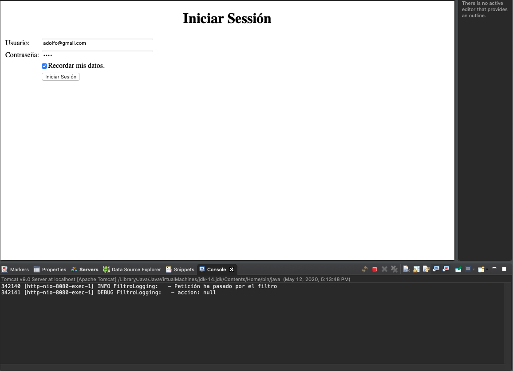
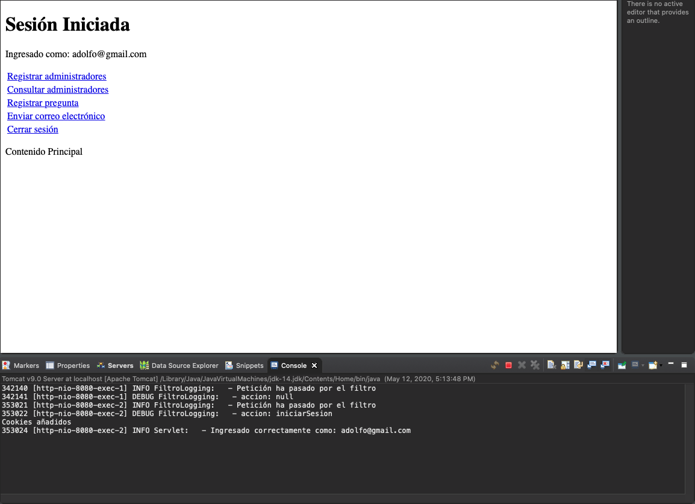
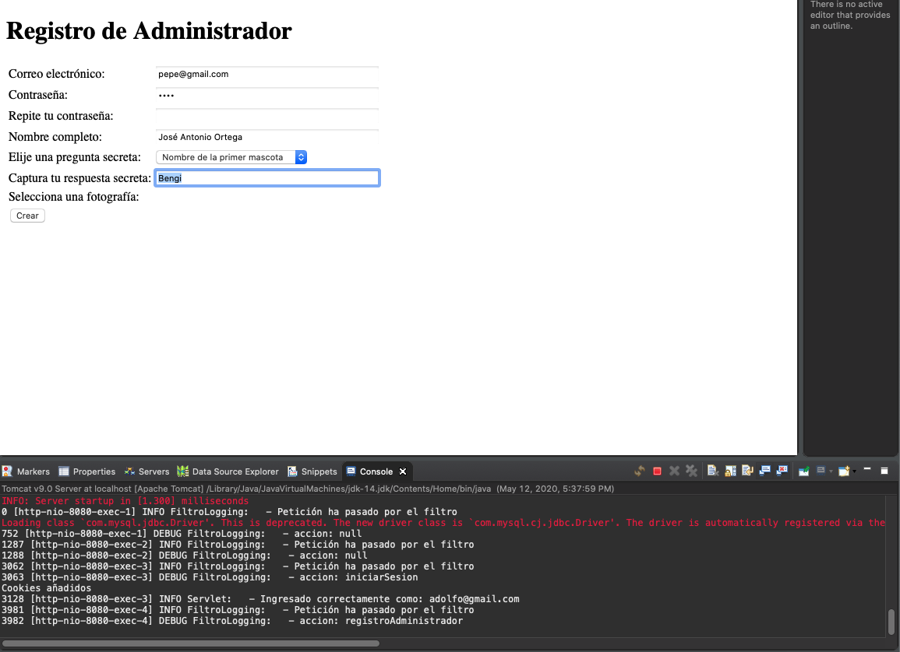
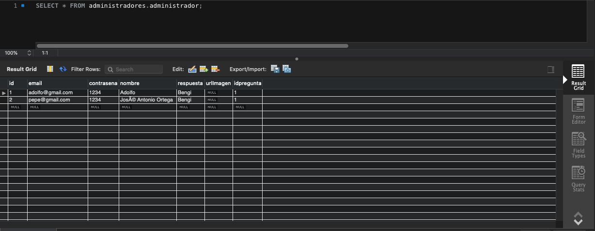
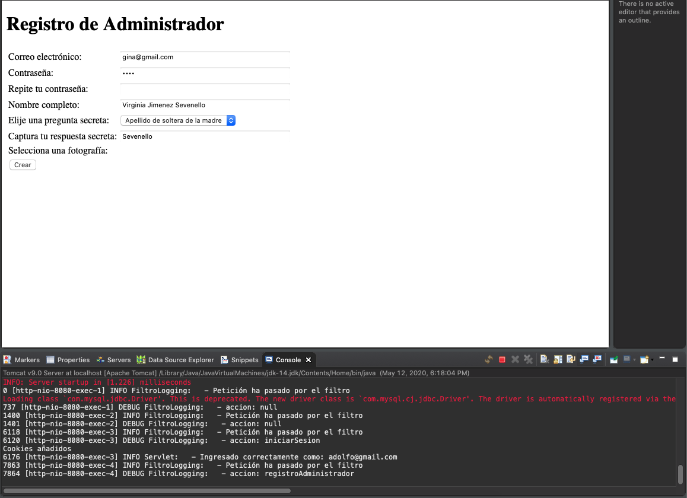
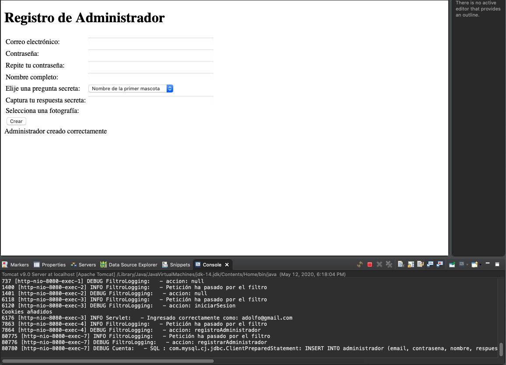
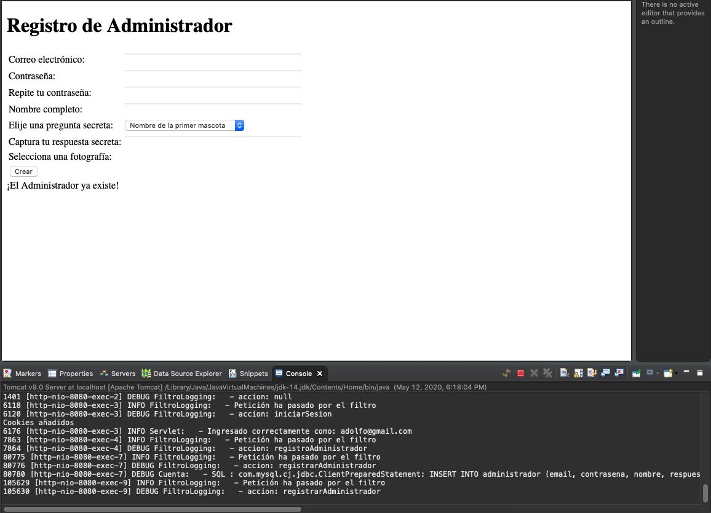
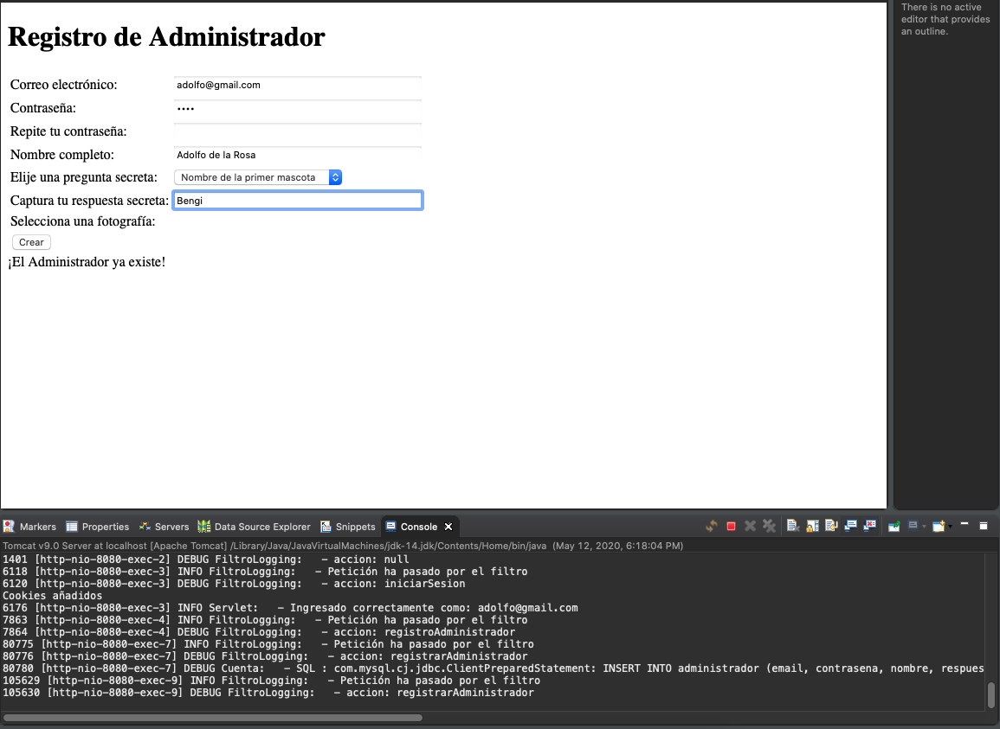
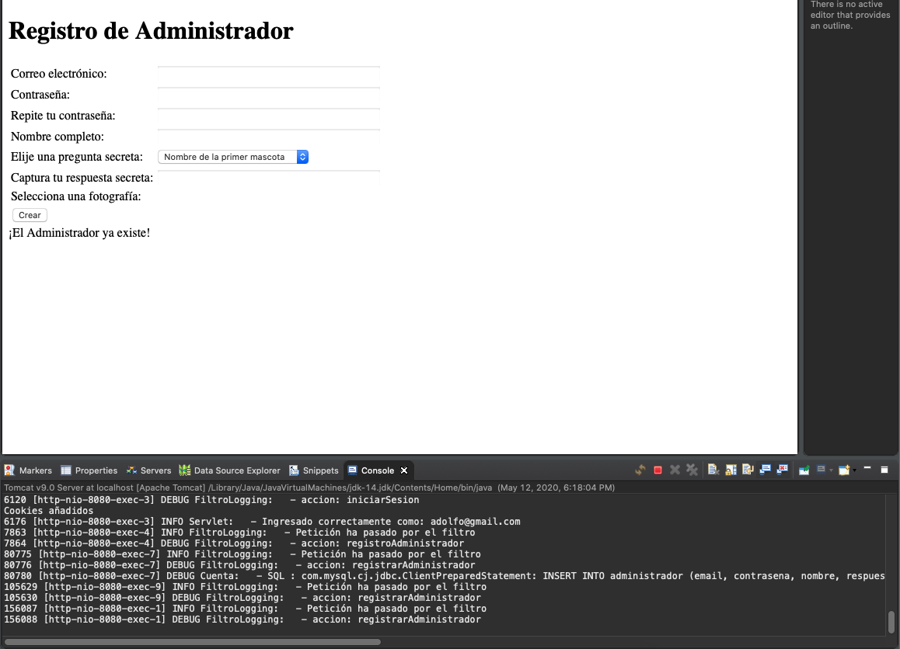
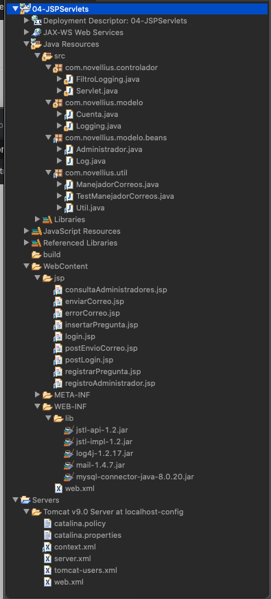

# 8. Creación de un módulo de registro de administradores 46:43

* Introducción 02:01
* Modificación de la Base de Datos 02:24
* Creación de la vista 11:51
* Código del modelo para insertar el administrador 08:22
* Código del controlador para procesar la petición de registro 14:22
* Creación de un mecanismo para evitar administradores duplicados 07:43

## Introducción 02:01

:+1:

## Modificación de la Base de Datos 02:24

Necesitamos modificar la BD, modificando la tabla `administrador` cambiando el campo `estado` por respuesta y añadiendo el campo `urlImagen`.


Volvemos a generar la BD.


Podemos comprobar que en la tabla `administrador` ya estan nuestros dos nuevos campos.


Insertamos las siguientes preguntas:

```sql
INSERT INTO `pregunta` (`idpregunta`,`pregunta`) VALUES (1,'Nombre de la primer mascota');
INSERT INTO `pregunta` (`idpregunta`,`pregunta`) VALUES (2,'Apellido de soltera de la madre');
INSERT INTO `pregunta` (`idpregunta`,`pregunta`) VALUES (3,'Nombre del abuelo paterno');
INSERT INTO `pregunta` (`idpregunta`,`pregunta`) VALUES (4,'Nombre de escuela primaría');
```


Insertamos el siguiente administrador


```sql
INSERT INTO `administradores`.`administrador` (`id`, `email`, `contrasena`, `nombre`, `respuesta`, `urlImagen`, `idpregunta`) VALUES ('1', 'adolfo@gmail.com', '1234', 'Adolfo', 'Bengi', NULL, '1');
```


## Creación de la vista 11:51

En esta lección crearemos la vista `registroAdministrador.jsp` para que el administrador se pueda registrar.

```html
<%@ page language="java" contentType="text/html; charset=UTF-8"
    pageEncoding="UTF-8"%>

<%@ taglib uri="http://java.sun.com/jsp/jstl/core" prefix="c" %>   
<%@ taglib uri = "http://java.sun.com/jsp/jstl/sql" prefix = "sql"%>
    
    
<!DOCTYPE html>
<html>
<head>
<meta charset="UTF-8">
<title>Registro de Administrador</title>
</head>
<body>
	<h1>Registro de Administrador</h1>
	
	<form action="?accion=registrarAdministrador" method="post">
	
		<table>
			<tr>
				<td>Correo electrónico: </td>
				<td><input type="text" name="email" size="40"></td>
			</tr>
			<tr>
				<td>Contraseña: </td>
				<td><input type="password" name="contrasena" size="40"></td>
			</tr>
			<tr>
				<td>Repite tu contraseña: </td>
				<td><input type="password" size="40"></td>
			</tr>
			<tr>
				<td>Nombre completo: </td>
				<td><input type="text" name="nombre" size="40"></td>
			</tr>
			<tr>
				
				<td>Elije una pregunta secreta: </td>
				<td>
					<c:catch var="ex">
					   <!-- Ejecutar query, usa la variable creada para formar el query -->
					   <sql:query var="rs" dataSource="jdbc/novellius">
					      SELECT * FROM pregunta;
					   </sql:query>
					
					   <!--  Recorre los datos recuperados y pinta el campo pregunta -->
            <select name="pregunta">
					      <c:forEach var="row" items="${rs.rows}">
					     		<option value="${row.idpregunta}">${row.pregunta}</option>
                </c:forEach>
					   </select>		
					   
					</c:catch>
					
					<c:if test="${ex != null}">
					   <span style="color:red;">*** Error en la conexión con la tabla "pregunta" ***</span>
					</c:if>
				</td>
			</tr>
			<tr>
				<td>Captura tu respuesta secreta: </td>
				<td><input type="text" name="respuesta" size="40"></td>
			</tr>
			<tr>
				<td>Selecciona una fotografía: </td>
				<td></td>
			</tr>
      			<tr>
				<td><input type="submit" value="Crear" /></td>
				<td></td>
			</tr>
		</table>
	</form>
	<c:out value="${requestScope.msg}" />
</body>
</html>
```

## Código del modelo para insertar el administrador 08:22

En esta lección vamos a crear el modelo para insertar el administrador en la BD. Como hemos cambiado la tabla `administrador` tendremos que modificar nuestro JavaBean `administrador.java` y nuestra vista `consultaAdministradores.jsp` y crear el método para insertar el administrador. 

1. Abrimos la clase `Administrador.java` vamos a eliminar la propiedad `estado`, y agregar las propiedades `respuesta` y `urlImagen` y creamos sus getters y setters, generar el método `toString()`, generar 3 constructores.

```java
package com.novellius.modelo.beans;

public class Administrador {
	
	private int idAdministrador;
	private String email;
	private String contrasena;
	private String nombre;
	private String respuesta;
	private String urlImagen;
	private int idPregunta;
	
	public Administrador() {
		// TODO Auto-generated constructor stub
	}
	
	public Administrador(String email, String contrasena, String nombre, String respuesta, String urlImagen,
			int idPregunta) {
		this.email = email;
		this.contrasena = contrasena;
		this.nombre = nombre;
		this.respuesta = respuesta;
		this.urlImagen = urlImagen;
		this.idPregunta = idPregunta;
	}
	
	public Administrador(int idAdministrador, String email, String contrasena, String nombre, String respuesta,
			String urlImagen, int idPregunta) {
		this.idAdministrador = idAdministrador;
		this.email = email;
		this.contrasena = contrasena;
		this.nombre = nombre;
		this.respuesta = respuesta;
		this.urlImagen = urlImagen;
		this.idPregunta = idPregunta;
	}

	public int getIdAdministrador() {
		return idAdministrador;
	}
	public void setIdAdministrador(int idAdministrador) {
		this.idAdministrador = idAdministrador;
	}
	public String getEmail() {
		return email;
	}
	public void setEmail(String email) {
		this.email = email;
	}
	public String getContrasena() {
		return contrasena;
	}
	public void setContrasena(String contrasena) {
		this.contrasena = contrasena;
	}
	public String getNombre() {
		return nombre;
	}
	public void setNombre(String nombre) {
		this.nombre = nombre;
	}
	public String getRespuesta() {
		return respuesta;
	}

	public void setRespuesta(String respuesta) {
		this.respuesta = respuesta;
	}

	public String getUrlImagen() {
		return urlImagen;
	}

	public void setUrlImagen(String urlImagen) {
		this.urlImagen = urlImagen;
	}

	public int getIdPregunta() {
		return idPregunta;
	}
	public void setIdPregunta(int idPregunta) {
		this.idPregunta = idPregunta;
	}
	@Override
	public String toString() {
		return "Administrador [idAdministrador=" + idAdministrador + ", email=" + email + ", contrasena=" + contrasena
				+ ", nombre=" + nombre + ", respuesta=" + respuesta + ", urlImagen=" + urlImagen + ", idPregunta="
				+ idPregunta + "]";
	}
}
```

2. Vamos a modificar los errores generados en `Cuenta.java`

```java
...
while(rs.next()) {
				
   Administrador administrador = new Administrador(
	    rs.getString("email"),
	    rs.getString("contrasena"),
	    rs.getString("nombre"),
	    rs.getString("respuesta"),
	    rs.getString("urlImagen"),
	    rs.getInt("idPregunta")
	 );
				
	 administradores.add(administrador);
}
...
```

3. También en `Cuenta.java` vamos a crear nuestro método de inserción.

```java
	public boolean registrarAdministrador(Administrador administrador) {
		try {
			PreparedStatement st = con.prepareStatement("INSERT INTO administrador ("
					+ "email, contrasena, nombre, respuesta, urlImagen, idpregunta ) "
					+ "VALUES (?,?,?,?,?,?) ");
			
			st.setString( 1, administrador.getEmail());
			st.setString( 2, administrador.getContrasena());
			st.setString( 3, administrador.getNombre());
			st.setString( 4, administrador.getRespuesta());
			st.setString( 5, administrador.getUrlImagen());
			st.setInt(6, administrador.getIdPregunta());
			
			log.debug("SQL : " + st.toString());
			
			st.executeUpdate();
			
			st.close();
			
			return true;
			
		} catch (SQLException e) {
			log.error("Al registrar administrador: " + e.getMessage());
			e.printStackTrace();
			return false;
		}	
	}
```
 
## Código del controlador para procesar la petición de registro 14:22

En esta lección vamos a crear el código del controlador para registrar la petición de registro del administrador.

1. Añadir una opción en nuestro menú `postLogin.jsp`.

```html
<tr>
   <td><a href="?accion=registroAdministrador" >Registrar administradores</a></td>
</tr>
```

2. Manejar esta nueva acción en el método `doGet()` del `Servlet.java`

```java
} else if (accion.contentEquals("registrarAdministrador")) {
   setRespuestaControlador(accion).forward(request, response);
} 
```

3. Procesar la petición de registrar administrador en el método `doPost()` del `Servlet.java`

```java
} else if(accion.contentEquals("registrarAdministrador")) {
				
	Administrador administrador = new Administrador();
	administrador.setEmail(request.getParameter("email"));
	administrador.setContrasena(request.getParameter("contrasena"));
	administrador.setNombre(request.getParameter("nombre"));
	administrador.setRespuesta(request.getParameter("respuesta"));
	// administrador.setUrlImagen(request.getParameter("urlImagen"));
	administrador.setIdPregunta(Integer.parseInt(request.getParameter("pregunta")));
				
	//Forma normal
	//Cuenta cuenta = new Cuenta(con);
	//cuenta.registrarAdministrador(administrador);
				
	//Insertar en la BD
	//forma anónima
	if(new Cuenta(con).registrarAdministrador(administrador)) {
		request.setAttribute("msg", "Administrador creado correctamente");
	}else {
		request.setAttribute("msg", "Error al crear Administrador");
	}
				
	//Redirige a la misma página
	setRespuestaControlador("registroAdministrador").forward(request, response);
}
```

4. Vamos a modificar `FiltroLogging.java` por que según el profesor da problemas de cache.

```java
if(sesion.getAttribute("usuario") != null && sesion.getAttribute("id") != null ) {
```

Ejecutando la Aplicación:



Seleccionamos la opción de Registrar administrador. 



Ingresamos los datos del administrador nuevo 



Una vez registrado el administrador regresa a la misma página y nos indica con un mensaje que el administrador ha sido insertado.


Vemos que el administrador se ha almacenado enla BD


## Creación de un mecanismo para evitar administradores duplicados 07:43

En esta lección vamos a crear un mecanismo para evitar administradores duplicados, una posibilidad de duplicado se puede dar cuando refrescamos la página.

1. En `cuenta.java` vamos a crear el método `existeAdministrador(String email)`.

```java
public boolean existeAdministrador(String email) {
		
	try {
		PreparedStatement st = con.prepareStatement("SELECT * FROM administrador WHERE email = ? ");
		st.setString(1, email);
			
		ResultSet rs = st.executeQuery();
			
		return(rs.next()) ? true : false;
		
	} catch (SQLException e) {
		log.error("Al consultar existencia de administrador: " + e.getMessage());
		e.printStackTrace();
		return false;
	}	
}
```

2. En `Servlet.java` vamos a meter la validación.

```java
....
if (! new Cuenta(con).existeAdministrador(request.getParameter("email"))) {
	//Insertar en la BD
	//forma anonima
	if (new Cuenta(con).registrarAdministrador(administrador)) {
		request.setAttribute("msg", "Administrador creado correctamente");
	} else {
		request.setAttribute("msg", "Error al crear Administrador");
	} 
}else {
	request.setAttribute("msg", "¡El Administrador ya existe!");
}

//Redirige a la misma página
setRespuestaControlador("registroAdministrador").forward(request, response);

....
```

Ejecución de la aplicación:


Seleccionamos la opción de Registrar administrador. 


Ingresamos los datos del administrador nuevo 



Nos indica que el Administrador es creado correctamente.



Si refrescamos la página nos avisa que ¡El Administrador ya existe! 



Si ingresamos un administrador que ya existe 



Nos avisa que ¡El Administrador ya existe! 



En nuestra BD vemos que solo se inserto el nuevo registro.


## Código Completo hasta la Fecha



*FiltroLogging.java*

```java
package com.novellius.controlador;

import java.io.IOException;
import java.sql.Connection;
import java.sql.SQLException;

import javax.naming.Context;
import javax.naming.InitialContext;
import javax.naming.NamingException;
import javax.servlet.Filter;
import javax.servlet.FilterChain;
import javax.servlet.FilterConfig;
import javax.servlet.ServletException;
import javax.servlet.ServletRequest;
import javax.servlet.ServletResponse;
import javax.servlet.annotation.WebFilter;
import javax.servlet.http.HttpServletRequest;
import javax.servlet.http.HttpServletResponse;
import javax.servlet.http.HttpSession;
import javax.sql.DataSource;

import org.apache.log4j.LogManager;
import org.apache.log4j.Logger;

import com.novellius.modelo.Logging;
import com.novellius.util.Util;

/**
 * Servlet Filter implementation class FiltroLogging
 */
@WebFilter("/FiltroLogging")
public class FiltroLogging implements Filter {
	
	private static final Logger log = LogManager.getLogger("FiltroLogging: ");
	private DataSource ds;
	private Connection con;

    /**
     * Default constructor. 
     */
    public FiltroLogging() {
        // TODO Auto-generated constructor stub
    }

	/**
	 * @see Filter#destroy()
	 */
	public void destroy() {
		// TODO Auto-generated method stub
	}

	/**
	 * @see Filter#doFilter(ServletRequest, ServletResponse, FilterChain)
	 */
	public void doFilter(ServletRequest request, ServletResponse response, FilterChain chain) throws IOException, ServletException {
		
		log.info("Petición ha pasado por el filtro");
		
		// Conexión a la BD
		try {
		    con = ds.getConnection();
		} catch (SQLException e) {
		   // Enviar a una vista de error
			log.error("Error al crear conexión: " + e.getMessage());
		}
		
		//Necesitamos recuperar el parámetro "accion" que se hace con request.getParameter("accion"); (En Servlet.java)
		//Donde request es un HttpServletRequest, pero aquí el request es un ServletRequest Por lo que 
		//Necesito hacer cast entre HttpServletRequest - ServletRequest y HttpServletResponse - ServletResponse
		// por que son diferentes tipos entre Servlet y Filter
		HttpServletRequest servletRequest = (HttpServletRequest) request;
		HttpServletResponse  servletResponse = (HttpServletResponse) response;
		
		//Recuperar parámetro accion
		String accion = servletRequest.getParameter("accion");
		
		log.debug("accion: " + accion);
		
		//Recuperamos instancia de session para poder recuperar los atributos que se subierón a la sesión
		HttpSession sesion = servletRequest.getSession();
		
		if(accion != null) {
			//Si hay usuario logeado
			if(sesion.getAttribute("usuario") != null && sesion.getAttribute("id") != null ) {
				
				Util util = new Util();
				String fechaYHora = util.getAnio() + "/" + util.getMes() + "/" + util.getDia() + ". " + util.getHora();
			
				int idAdmin = (int) sesion.getAttribute("id");
				
				if(accion.equals("consultarAdministradores")) {
					
					log.debug("email: " + sesion.getAttribute("usuario") + ", id: " + idAdmin);
					
					if(new Logging(con).registrarLog("Consulta de administradores. " + fechaYHora, idAdmin)) {
						log.info("Log creado correctamente");
					} else {
						log.error("Error al crear el log");
					}
					
				}else if(accion.equals("registrarPregunta")) {
					
					log.debug("email: " + sesion.getAttribute("usuario") + ", id: " + idAdmin);
					
					if(new Logging(con).registrarLog("Muestra del formulario para registrar pregunta secreta.  " + fechaYHora, idAdmin)) {
						log.info("Log creado correctamente");
					} else {
						log.error("Error al crear el log");
					}
				}else if(accion.equals("enviarCorreo")) {
					
					log.debug("email: " + sesion.getAttribute("usuario") + ", id: " + idAdmin);
					
					if(new Logging(con).registrarLog("Envíar correo electrónico.  " + fechaYHora, idAdmin)) {
						log.info("Log creado correctamente");
					} else {
						log.error("Error al crear el log");
					}
				}
			}
		}
		 
		
		// Cerrar Conexión a la BD
		try {
			con.close();
		} catch (SQLException e) {
			// Enviar a una vista de error
			log.error("Error al cerrar conexión: " + e.getMessage());
		}
				
		// pass the request along the filter chain
		chain.doFilter(request, response);
	}

	/**
	 * @see Filter#init(FilterConfig)
	 */
	public void init(FilterConfig fConfig) throws ServletException {
		// Confuguración JNDI
		try {
			InitialContext initContext = new InitialContext();
			Context env = (Context) initContext.lookup("java:comp/env");
			ds = (DataSource) env.lookup("jdbc/novellius");
		} catch (NamingException e) {
			log.error("Al configurar JNDI: " + e.getMessage());
		}
	}

}
```

*Servlet.java*

```java
package com.novellius.controlador;

import java.io.IOException;
import java.sql.Connection;
import java.sql.DriverManager;
import java.sql.SQLException;
import java.util.ArrayList;

import javax.mail.MessagingException;
import javax.mail.NoSuchProviderException;
import javax.naming.Context;
import javax.naming.InitialContext;
import javax.naming.NamingException;
import javax.servlet.RequestDispatcher;
import javax.servlet.ServletConfig;
import javax.servlet.ServletContext;
import javax.servlet.ServletException;
import javax.servlet.http.Cookie;
import javax.servlet.http.HttpServlet;
import javax.servlet.http.HttpServletRequest;
import javax.servlet.http.HttpServletResponse;
import javax.servlet.http.HttpSession;
import javax.sql.DataSource;

import org.apache.log4j.BasicConfigurator;
import org.apache.log4j.LogManager;
import org.apache.log4j.Logger;

import com.novellius.modelo.Cuenta;
import com.novellius.modelo.beans.Administrador;
import com.novellius.util.ManejadorCorreos;

/**
 * Servlet implementation class Servlet
 */
public class Servlet extends HttpServlet {
	private static final long serialVersionUID = 1L;

	private static final Logger log = LogManager.getLogger("Servlet: ");
	private String rutaJsp;

	// Variables para interctuar con la BD
	private DataSource ds;
	private Connection con;

	/**
	 * @see HttpServlet#HttpServlet()
	 */
	public Servlet() {
		super();
		// TODO Auto-generated constructor stub
	}

	@Override
	public void init(ServletConfig config) throws ServletException {
		// TODO Auto-generated method stub
		super.init(config);

		// System.out.println(config.getInitParameter("rutaJsp"));
		rutaJsp = config.getInitParameter("rutaJsp");

		// Configurar Logger
		BasicConfigurator.configure();

		// Confuguración JNDI
		try {
			InitialContext initContext = new InitialContext();
			Context env = (Context) initContext.lookup("java:comp/env");
			ds = (DataSource) env.lookup("jdbc/novellius");
		} catch (NamingException e) {
			log.error("Al configurar JNDI: " + e.getMessage());
		}
	}

	/**
	 * @see HttpServlet#doGet(HttpServletRequest request, HttpServletResponse
	 *      response)
	 */
	protected void doGet(HttpServletRequest request, HttpServletResponse response)
			throws ServletException, IOException {

		String accion = request.getParameter("accion");
		HttpSession sesion = request.getSession();
		
		// Conexión a la BD
		try {
		   con = ds.getConnection();
		} catch (SQLException e) {
		   // Enviar a una vista de error
		  log.error("Error al crear conexión: " + e.getMessage());
		}

		if (accion != null) {
			if (accion.equals("login")) {
				setRespuestaControlador(accion).forward(request, response);
			} else if (accion.equals("menu")) {
				setRespuestaControlador("postLogin").forward(request, response);
			} else if (accion.equals("logout")) {
				sesion.invalidate();
				log.info("Sesión destruida");
				setRespuestaControlador("login").forward(request, response);
			} else if (accion.contentEquals("registroAdministrador")) {
				setRespuestaControlador(accion).forward(request, response);
			} else if (accion.equals("consultarAdministradores")) {
				
				//Intanciación anónima me evito 
				//Cuenta cuenta = new Cuenta(con);
				ArrayList<Administrador> administradores = new Cuenta(con).consultarAdministradores();
				
				if(administradores.isEmpty()) {
					request.setAttribute("mensaje", "No se encotrarón administradores");
				}else {
					request.setAttribute("mensaje", "Administradores encontrados");
					// Vamos a cargar los administradores encontrados en la sesión
					sesion.setAttribute("administradores", administradores);
				}
				setRespuestaControlador("consultaAdministradores").forward(request, response);
			} else if (accion.contentEquals("registrarPregunta")) {
				setRespuestaControlador(accion).forward(request, response);
			} else if (accion.contentEquals("insertarPregunta")) {
				setRespuestaControlador(accion).forward(request, response);
			} else if (accion.contentEquals("enviarCorreo")) {
				setRespuestaControlador(accion).forward(request, response);
			}
		} else {
			setRespuestaControlador("login").forward(request, response);
		}
		
		// Conexión a la BD
		try {
		   con.close();
		} catch (SQLException e) {
		   // Enviar a una vista de error
		   log.error("Error al cerrar conexión: " + e.getMessage());
		}
	}

	/**
	 * @see HttpServlet#doPost(HttpServletRequest request, HttpServletResponse
	 *      response)
	 */
	protected void doPost(HttpServletRequest request, HttpServletResponse response)
			throws ServletException, IOException {
		
		//Establecer un juego de carácteres para los parámetros que llegan al método POST
		request.setCharacterEncoding("UTF-8");

		String accion = request.getParameter("accion");
		HttpSession sesion = request.getSession();

		// Conexión a la BD
		try {
			con = ds.getConnection();
		} catch (SQLException e) {
			// Enviar a una vista de error
			log.error("Error al crear conexión: " + e.getMessage());

		}

		if (accion != null) {

			if (accion.equals("iniciarSesion")) {

				String usuario = request.getParameter("usuario");
				String contrasena = request.getParameter("contrasena");
				
				
				// Creación de la Cookie
				Cookie cookieUsurio = new Cookie("usuario", usuario);
				Cookie cookieContrasena = new Cookie("contrasena", contrasena);
				
				try {
						
				   if (request.getParameter("ckbox").equals("on")) {
						
						// Tiempo de vida 1 día
						cookieUsurio.setMaxAge(60 * 60 * 24);
						cookieContrasena.setMaxAge(60 * 60 * 24);
						// Añado las cookies
						response.addCookie(cookieUsurio);
						response.addCookie(cookieContrasena);
						
						System.out.println("Cookies añadidos");
					}
				} catch (NullPointerException e) {
					log.info("chbox vacio");
					
					
					// Expira las cookies
					cookieUsurio.setMaxAge(0);
					cookieContrasena.setMaxAge(0);
					// Añado las cookies
					response.addCookie(cookieUsurio);
					response.addCookie(cookieContrasena);
				}

				// Invocar consulta SQL
				Cuenta cuenta = new Cuenta(con);

				if (cuenta.login(usuario, contrasena)) {
					log.info("Ingresado correctamente como: " + usuario);


					// Ámbito sesión
					sesion.setAttribute("usuario", usuario);
					sesion.setAttribute("id", new Cuenta(con).obtenerIdAdmin(usuario));
					setRespuestaControlador("postLogin").forward(request, response);

				} else {
					log.error("Error de login");
					request.setAttribute("error", "Nombre de usuario o contraseña incorrectos.");
					
					setRespuestaControlador("login").forward(request, response);
				}
			} else if(accion.contentEquals("enviarCorreo")) {
				ManejadorCorreos manejadorCorreos = new ManejadorCorreos();
				try {
					manejadorCorreos.enviarCorreos(request.getParameter("destinatario"), request.getParameter("asunto"), request.getParameter("mensaje"));
					log.info("correo enviado correctamente");
					setRespuestaControlador("postEnvioCorreo").forward(request, response);
				} catch (Exception e) {
					log.error("Al enviar correo: " + e.getMessage());
					e.printStackTrace();
					setRespuestaControlador("errorCorreo").forward(request, response);
				}
			} else if(accion.contentEquals("registrarAdministrador")) {
				
				Administrador administrador = new Administrador();
				administrador.setEmail(request.getParameter("email"));
				administrador.setContrasena(request.getParameter("contrasena"));
				administrador.setNombre(request.getParameter("nombre"));
				administrador.setRespuesta(request.getParameter("respuesta"));
				// administrador.setUrlImagen(request.getParameter("urlImagen"));
				administrador.setIdPregunta(Integer.parseInt(request.getParameter("pregunta")));
				
				//Forma normal
				//Cuenta cuenta = new Cuenta(con);
				//cuenta.registrarAdministrador(administrador);
				
				if (! new Cuenta(con).existeAdministrador(request.getParameter("email"))) {
					//Insertar en la BD
					//forma anonima
					if (new Cuenta(con).registrarAdministrador(administrador)) {
						request.setAttribute("msg", "Administrador creado correctamente");
					} else {
						request.setAttribute("msg", "Error al crear Administrador");
					} 
				}else {
					request.setAttribute("msg", "¡El Administrador ya existe!");
				}
				//Redirige a la misma página
				setRespuestaControlador("registroAdministrador").forward(request, response);
			}

		} else {
			setRespuestaControlador("login").forward(request, response);
		}

		// Conexión a la BD
		try {
			con.close();
		} catch (SQLException e) {
			// Enviar a una vista de error
			log.error("Error al cerrar conexión: " + e.getMessage());
		}

	}

	public RequestDispatcher setRespuestaControlador(String vista) {
		String url = rutaJsp + vista + ".jsp";
		return getServletContext().getRequestDispatcher(url);
	}
}
```

*Cuenta.java*

```java
package com.novellius.modelo;

import java.sql.Connection;
import java.sql.PreparedStatement;
import java.sql.ResultSet;
import java.sql.SQLException;
import java.util.ArrayList;

import org.apache.log4j.LogManager;
import org.apache.log4j.Logger;

import com.novellius.modelo.beans.Administrador;

public class Cuenta {
	
	private static final Logger log = LogManager.getLogger("Cuenta: ");
	private Connection con;

	public Cuenta(Connection con) {
		this.con = con;
	}
	
	public boolean login(String email, String contrasena) {
		
		
		// El uso de los comodines (?) en lugar de la concatenación, nos permite evitar la SQL INYECTION (; delete database) 
		String sql = "SELECT count(*) as count FROM administrador WHERE email = ? AND contrasena = ? ";
		
		//Permite saber si encontro o no el registro en la BD
		int noRegistros = 0;
		
		try {
			//Preparar la sentencia
			PreparedStatement st = con.prepareStatement(sql);
			
			//Pasar valores a los dos comodines
			st.setString(1, email);
			st.setString(2, contrasena);
			
			// Ejecutar la consulta y almacenarla en un ResultSet
			ResultSet rs = st.executeQuery();
			
			//Comprobar que la consulta obtuvo resultados
			if(rs.next()) {
				noRegistros = rs.getInt("count");
			}
			
			//Cerrar el Result Set
			rs.close();
		} catch (SQLException e) {
			log.error("Al realizar Login: " + e.getMessage());
			// Si hay una excepción retornamos false
			return false;
		}
		
		// Verificamos si hubo coincidencias en la BD
		if (noRegistros == 0 ) {
			return false;
		}else {
			return true;
		}
	}
	
	public ArrayList<Administrador> consultarAdministradores(){
		
		ArrayList<Administrador> administradores = new ArrayList<Administrador>();
		
		String sql = "SELECT * FROM administrador";
		
		try {
			PreparedStatement st = con.prepareStatement(sql);
			
			ResultSet rs = st.executeQuery();
			
			while(rs.next()) {
				
				Administrador administrador = new Administrador(
						rs.getString("email"),
						rs.getString("contrasena"),
						rs.getString("nombre"),
						rs.getString("respuesta"),
						rs.getString("urlImagen"),
						rs.getInt("idPregunta")
				);
				
				administradores.add(administrador);
			}
			rs.close();
		} catch (SQLException e) {
			administradores.clear();
			log.error("Al consultar administradores: " + e.getMessage());
		}
		
		return administradores;
	}
	
	public int obtenerIdAdmin(String emailAdmin) {
		
		try {
			PreparedStatement st = con.prepareStatement("SELECT id FROM administrador WHERE email = ?");
			st.setString(1, emailAdmin);
			
			ResultSet rs = st.executeQuery();
			
			/*
			if(rs.next()) {
				return rs.getInt("id");
			} else {
				return 0;
			}
			*/
			
			return (rs.next()) ? rs.getInt("id") : 0;

		
		} catch (SQLException e) {
			// TODO Auto-generated catch block
			e.printStackTrace();
			return 0;
		}
		
	}
	
	public boolean registrarAdministrador(Administrador administrador) {
		try {
			PreparedStatement st = con.prepareStatement("INSERT INTO administrador ("
					+ "email, contrasena, nombre, respuesta, urlImagen, idpregunta ) "
					+ "VALUES (?,?,?,?,?,?) ");
			
			st.setString( 1, administrador.getEmail());
			st.setString( 2, administrador.getContrasena());
			st.setString( 3, administrador.getNombre());
			st.setString( 4, administrador.getRespuesta());
			st.setString( 5, administrador.getUrlImagen());
			st.setInt(6, administrador.getIdPregunta());
			
			log.debug("SQL : " + st.toString());
			
			st.executeUpdate();
			
			st.close();
			
			return true;
			
		} catch (SQLException e) {
			log.error("Al registrar administrador: " + e.getMessage());
			e.printStackTrace();
			return false;
		}	
	}
	
	
	public boolean existeAdministrador(String email) {
		
		try {
			PreparedStatement st = con.prepareStatement("SELECT * FROM administrador WHERE email = ? ");
			st.setString(1, email);
			
			ResultSet rs = st.executeQuery();
			
			return(rs.next()) ? true : false;
		} catch (SQLException e) {
			log.error("Al consultar existencia de administrador: " + e.getMessage());
			e.printStackTrace();
			return false;
		}
		
	}
}
```

*Logging.java*

```java
package com.novellius.modelo;

import java.sql.Connection;
import java.sql.PreparedStatement;
import java.sql.SQLException;

import org.apache.log4j.LogManager;
import org.apache.log4j.Logger;

public class Logging {

	private static final Logger log = LogManager.getLogger("Logging: ");
	private Connection con;

	public Logging(Connection con) {
		this.con = con;
	}
	
	public boolean registrarLog(String accionLog, int idAdministrador) {
		
		try {
			PreparedStatement st = con.prepareStatement("INSERT INTO log (accionLog, idadministrador) VALUES (?, ?)");
			st.setString(1, accionLog);
			st.setInt(2,  idAdministrador);
			st.executeUpdate();
			
			st.close();
			
			return true;

		} catch (SQLException e) {
			// TODO Auto-generated catch block
			e.printStackTrace();
			return false;
		}
	}
	
}
```

*Administrador.java*

```java
package com.novellius.modelo.beans;

public class Administrador {
	
	private int idAdministrador;
	private String email;
	private String contrasena;
	private String nombre;
	private String respuesta;
	private String urlImagen;
	private int idPregunta;
	
	public Administrador() {
		// TODO Auto-generated constructor stub
	}
	
	public Administrador(String email, String contrasena, String nombre, String respuesta, String urlImagen,
			int idPregunta) {
		this.email = email;
		this.contrasena = contrasena;
		this.nombre = nombre;
		this.respuesta = respuesta;
		this.urlImagen = urlImagen;
		this.idPregunta = idPregunta;
	}
	
	public Administrador(int idAdministrador, String email, String contrasena, String nombre, String respuesta,
			String urlImagen, int idPregunta) {
		this.idAdministrador = idAdministrador;
		this.email = email;
		this.contrasena = contrasena;
		this.nombre = nombre;
		this.respuesta = respuesta;
		this.urlImagen = urlImagen;
		this.idPregunta = idPregunta;
	}

	

	public int getIdAdministrador() {
		return idAdministrador;
	}
	public void setIdAdministrador(int idAdministrador) {
		this.idAdministrador = idAdministrador;
	}
	public String getEmail() {
		return email;
	}
	public void setEmail(String email) {
		this.email = email;
	}
	public String getContrasena() {
		return contrasena;
	}
	public void setContrasena(String contrasena) {
		this.contrasena = contrasena;
	}
	public String getNombre() {
		return nombre;
	}
	public void setNombre(String nombre) {
		this.nombre = nombre;
	}
	public String getRespuesta() {
		return respuesta;
	}

	public void setRespuesta(String respuesta) {
		this.respuesta = respuesta;
	}

	public String getUrlImagen() {
		return urlImagen;
	}

	public void setUrlImagen(String urlImagen) {
		this.urlImagen = urlImagen;
	}

	public int getIdPregunta() {
		return idPregunta;
	}
	public void setIdPregunta(int idPregunta) {
		this.idPregunta = idPregunta;
	}
	@Override
	public String toString() {
		return "Administrador [idAdministrador=" + idAdministrador + ", email=" + email + ", contrasena=" + contrasena
				+ ", nombre=" + nombre + ", respuesta=" + respuesta + ", urlImagen=" + urlImagen + ", idPregunta="
				+ idPregunta + "]";
	}
}
```

*Log.java*

```java
package com.novellius.modelo.beans;

public class Log {
	
	private int idLog;
	private String accionLog;
	private int idAdministrador;
	
	public Log() {
		
	}
	
	
	public Log(int idLog, String accionLog, int idAdministrador) {
		super();
		this.idLog = idLog;
		this.accionLog = accionLog;
		this.idAdministrador = idAdministrador;
	}
	
	public int getIdLog() {
		return idLog;
	}
	public void setIdLog(int idLog) {
		this.idLog = idLog;
	}
	public String getAccionLog() {
		return accionLog;
	}
	public void setAccionLog(String accionLog) {
		this.accionLog = accionLog;
	}
	public int getIdAdministrador() {
		return idAdministrador;
	}
	public void setIdAdministrador(int idAdministrador) {
		this.idAdministrador = idAdministrador;
	}
}
```

*ManejadorCorreos.java*

```java
package com.novellius.util;

import java.util.Properties;

import javax.mail.Message;
import javax.mail.MessagingException;
import javax.mail.NoSuchProviderException;
import javax.mail.Session;
import javax.mail.Transport;
import javax.mail.internet.InternetAddress;
import javax.mail.internet.MimeMessage;

public class ManejadorCorreos {
	
	// Propiedades de la clase
	private Properties props; // Datos del correo que va a enviar el mensaje HOST, PUERTO, EMAIL, AUTENTICACIÓN
	private Session sesion; // Sesión de javax.mail, una vez que se implementa la conexión esta sesión se conecta a ella para establecer un canal y poder enviar el mensaje y después cierra la conexión 
	private Transport transport; // Crean las conexiones para el email
	private MimeMessage msg; // Aquí se compone el cuerpo del mensaje
	
	//Constructor
	public ManejadorCorreos() {
		
		// Inicializar y llenar las propiedades básicas para poder conectar y enviar un correo
		props = new Properties();
		props.setProperty("mail.smtp.host", "mail.bskdance.com"); // Host del correo saliente
		props.setProperty("mail.smtp.port", "26"); // Puerto del correo saliente
		props.setProperty("mail.smtp.user", "adolfo@bskdance.com"); // Usuario del correo saliente
		props.setProperty("mail.smtp.auth", "true"); // Autenticación
		
	}
	
	//Método para enviar el correo
	//Dispara las excepciones hacia arriba para que el Servlet maneje la excepción y 
	//redirija a una vista que muestre un mensaje de error
	public void enviarCorreos(String destinatario, String asunto, String mensaje) throws MessagingException, NoSuchProviderException {
		
		//Inicializar sesión con las propiedades definidas
		sesion = Session.getDefaultInstance(props);
		
		//Composición del mensaje, establece emisor, destinatario, asunto y mensaje
		msg = new MimeMessage(sesion);
		msg.setFrom(new InternetAddress("adolfo@bskdance.com"));
		msg.addRecipient(Message.RecipientType.TO, new InternetAddress(destinatario));
		msg.setSubject(asunto);
		msg.setText("<h1>Mensaje</h1>"
		          +	"<p>" + mensaje + "</p>", "UTF-8", "html"); //Puedi mandar texto plano o html
	
		// Crear un objeto que modela un objeto para el transportedel transporte, crea un canal de comunicación para el mensaje. 
		transport = sesion.getTransport("smtp"); // Protocolo para enviar emails
		transport.connect("adolfo@bskdance.com", "1234ABCD"); //Claves de autenticación
		transport.sendMessage(msg, msg.getAllRecipients()); // Envío del correo (se puede envíar a varios destinatarios si son un array)
		transport.close(); // Cerrar la conexión
	}

}
```

*TestManejadorCorreos.java*

```java
package com.novellius.util;

import javax.mail.MessagingException;
import javax.mail.NoSuchProviderException;

public class TestManejadorCorreos {
	
	public static void main(String[] args) {
		ManejadorCorreos manejadorCorreos = new ManejadorCorreos();
		try {
			manejadorCorreos.enviarCorreos("adolfodelarosa2012@gmail.com", "Test de envío de Email desde Java", "Test de envío de Email desde Java" );
			System.out.println("Correo envíado");
		} catch (NoSuchProviderException e) {
			e.printStackTrace();
		} catch (MessagingException e) {
			e.printStackTrace();
		}
	}
}
```

*Util.java*

```java
package com.novellius.util;

import java.util.Calendar;
import java.util.GregorianCalendar;

public class Util {

	private Calendar calendar;

	public Util() {
		calendar = new GregorianCalendar();
	}
	
	public String getAnio() {
		return String.valueOf(calendar.get(Calendar.YEAR));
	}

	public String getMes() {
		int mesEntero = calendar.get(Calendar.MONTH) + 1;
		String mes = "";

		switch (mesEntero) {
		case 1: {
			mes = "ENERO";
			break;
		}
		case 2: {
			mes = "FEBRERO";
			break;
		}
		case 3: {
			mes = "MARZO";
			break;
		}
		case 4: {
			mes = "ABRIL";
			break;
		}
		case 5: {
			mes = "MAYO";
			break;
		}
		case 6: {
			mes = "JUNIO";
			break;
		}
		case 7: {
			mes = "JULIO";
			break;
		}
		case 8: {
			mes = "AGOSTO";
			break;
		}
		case 9: {
			mes = "SEPTIEMBRE";
			break;
		}
		case 10: {
			mes = "OCTUBRE";
			break;
		}
		case 11: {
			mes = "NOVIEMBRE";
			break;
		}
		case 12: {
			mes = "DICIEMBRE";
			break;
		}
		}

		return mes;

	}

	public String getDia() {
		if (calendar.get(Calendar.DAY_OF_MONTH) <= 9) {
			return "0" + String.valueOf(calendar.get(Calendar.DAY_OF_MONTH));
		} else {
			return String.valueOf(calendar.get(Calendar.DAY_OF_MONTH));
		}
	}

	public String getHora() {
		if (calendar.get(Calendar.MINUTE) <= 9) {

			return String
					.valueOf(calendar.get(Calendar.HOUR_OF_DAY) + "0:" + String.valueOf(calendar.get(Calendar.MINUTE)));
		} else {
			return String
					.valueOf(calendar.get(Calendar.HOUR_OF_DAY) + ":" + String.valueOf(calendar.get(Calendar.MINUTE)));
		}
	}
}
```
