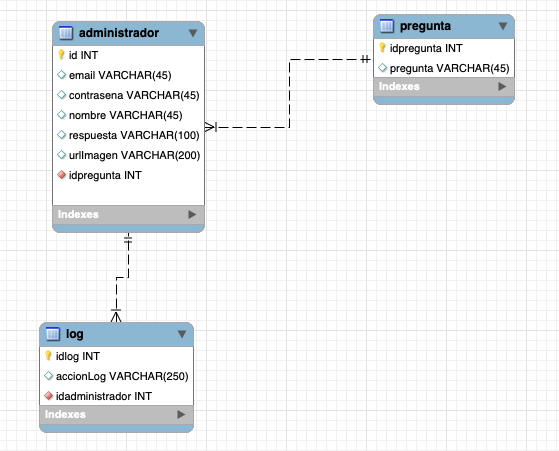
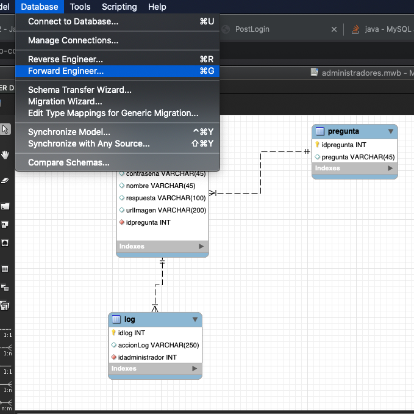
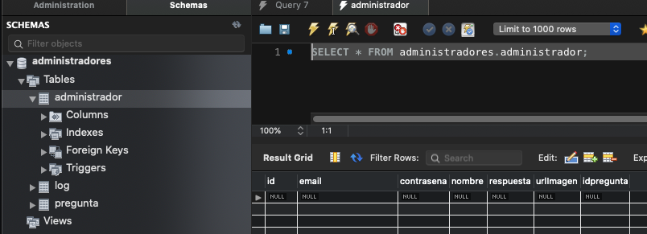
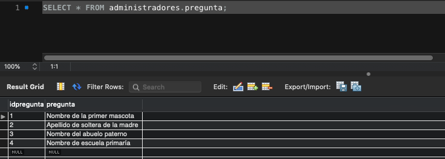
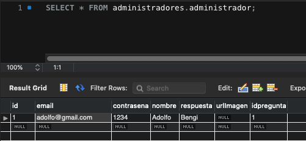

# 8. Creación de un módulo de registro de administradores 46:43

* Introducción 02:01
* Modificación de la Base de Datos 02:24
* Creación de la vista 11:51
* Código del modelo para insertar el administrador 08:22
* Código del controlador para procesar la petición de registro 14:22
* Creación de un mecanismo para evitar administradores duplicados 07:43

## Introducción 02:01

:+1:

## Modificación de la Base de Datos 02:24

Necesitamos modificar la BD, modificando la tabla `administrador` cambiando el campo `estado` por respuesta y añadiendo el campo `urlImagen`.



Volvemos a generar la BD.



Podemos comprobar que en la tabla `administrador` ya estan nuestros dos nuevos campos.



Insertamos las siguientes preguntas:

```sql
INSERT INTO `pregunta` (`idpregunta`,`pregunta`) VALUES (1,'Nombre de la primer mascota');
INSERT INTO `pregunta` (`idpregunta`,`pregunta`) VALUES (2,'Apellido de soltera de la madre');
INSERT INTO `pregunta` (`idpregunta`,`pregunta`) VALUES (3,'Nombre del abuelo paterno');
INSERT INTO `pregunta` (`idpregunta`,`pregunta`) VALUES (4,'Nombre de escuela primaría');
```



Insertamos el siguiente administrador


```sql
INSERT INTO `administradores`.`administrador` (`id`, `email`, `contrasena`, `nombre`, `respuesta`, `urlImagen`, `idpregunta`) VALUES ('1', 'adolfo@gmail.com', '1234', 'Adolfo', 'Bengi', NULL, '1');
```



## Creación de la vista 11:51

En esta lección crearemos la vista `registrarAdministrador.jsp` para que el administrador se pueda registrar.

```html
<%@ page language="java" contentType="text/html; charset=UTF-8"
    pageEncoding="UTF-8"%>

<%@ taglib uri="http://java.sun.com/jsp/jstl/core" prefix="c" %>   
<%@ taglib uri = "http://java.sun.com/jsp/jstl/sql" prefix = "sql"%>
    
    
<!DOCTYPE html>
<html>
<head>
<meta charset="UTF-8">
<title>Registro de Administrador</title>
</head>
<body>
	<h1>Registro de Administrador</h1>
	<form action="?accion=registrarAdmin" method="post">
	
		<table>
			<tr>
				<td>Correo electrónico: </td>
				<td><input type="text" name="email" size="40"></td>
			</tr>
			<tr>
				<td>Contraseña: </td>
				<td><input type="password" name="contrasena" size="40"></td>
			</tr>
			<tr>
				<td>Repite tu contraseña: </td>
				<td><input type="password" size="40"></td>
			</tr>
			<tr>
				<td>Nombre completo: </td>
				<td><input type="text" name="nombre" size="40"></td>
			</tr>
			<tr>
				
				<td>Elije una pregunta secreta: </td>
				<td>
					<c:catch var="ex">
					   <!-- Ejecutar query, usa la variable creada para formar el query -->
					   <sql:query var="rs" dataSource="jdbc/novellius">
					      SELECT * FROM pregunta;
					   </sql:query>
					
					   <!--  Recorre los datos recuperados y pinta el campo pregunta -->
            <select name="pregunta">
					      <c:forEach var="row" items="${rs.rows}">
					     		<option value="${row.id}">${row.pregunta}</option>
                </c:forEach>
					   </select>		
					   
					</c:catch>
					
					<c:if test="${ex != null}">
					   <span style="color:red;">*** Error en la conexión con la tabla "pregunta" ***</span>
					</c:if>
				</td>
			</tr>
			<tr>
				<td>Captura tu respuesta secreta: </td>
				<td><input type="text" name="respuesta" size="40"></td>
			</tr>
			<tr>
				<td>Selecciona una fotografía: </td>
				<td></td>
			</tr>
      <tr>
				<td><input type="summit" value="Crear" /></td>
				<td></td>
			</tr>
		</table>
	</form>
</body>
</html>
```

## Código del modelo para insertar el administrador 08:22

En esta lección vamos a crear el modelo para insertar el administrador en la BD. Como hemos cambiado la tabla `administrador` tendremos que modificar nuestro JavaBean `administrador.java` y nuestra vista `consultaAdministradores.jsp` y crear el método para insertar el administrador. 

1. Abrimos la clase `Administrador.java` vamos a eliminar la propiedad `estado`, y agregar las propiedades `respuesta` y `urlImagen` y creamos sus getters y setters, generar el método `toString()`, generar dos constructores.

```java
package com.novellius.modelo.beans;

public class Administrador {
	
	private int idAdministrador;
	private String email;
	private String contrasena;
	private String nombre;
	private String respuesta;
	private String urlImagen;
	private int idPregunta;
	
	public Administrador(String email, String contrasena, String nombre, String respuesta, String urlImagen,
			int idPregunta) {
		this.email = email;
		this.contrasena = contrasena;
		this.nombre = nombre;
		this.respuesta = respuesta;
		this.urlImagen = urlImagen;
		this.idPregunta = idPregunta;
	}
	
	public Administrador(int idAdministrador, String email, String contrasena, String nombre, String respuesta,
			String urlImagen, int idPregunta) {
		this.idAdministrador = idAdministrador;
		this.email = email;
		this.contrasena = contrasena;
		this.nombre = nombre;
		this.respuesta = respuesta;
		this.urlImagen = urlImagen;
		this.idPregunta = idPregunta;
	}

	public int getIdAdministrador() {
		return idAdministrador;
	}
	public void setIdAdministrador(int idAdministrador) {
		this.idAdministrador = idAdministrador;
	}
	public String getEmail() {
		return email;
	}
	public void setEmail(String email) {
		this.email = email;
	}
	public String getContrasena() {
		return contrasena;
	}
	public void setContrasena(String contrasena) {
		this.contrasena = contrasena;
	}
	public String getNombre() {
		return nombre;
	}
	public void setNombre(String nombre) {
		this.nombre = nombre;
	}
	public String getRespuesta() {
		return respuesta;
	}

	public void setRespuesta(String respuesta) {
		this.respuesta = respuesta;
	}

	public String getUrlImagen() {
		return urlImagen;
	}

	public void setUrlImagen(String urlImagen) {
		this.urlImagen = urlImagen;
	}

	public int getIdPregunta() {
		return idPregunta;
	}
	public void setIdPregunta(int idPregunta) {
		this.idPregunta = idPregunta;
	}
	@Override
	public String toString() {
		return "Administrador [idAdministrador=" + idAdministrador + ", email=" + email + ", contrasena=" + contrasena
				+ ", nombre=" + nombre + ", respuesta=" + respuesta + ", urlImagen=" + urlImagen + ", idPregunta="
				+ idPregunta + "]";
	}
}
```

2. Vamos a modificar los errores generados en `Cuenta.java`

```java
...
while(rs.next()) {
				
   Administrador administrador = new Administrador(
	    rs.getString("email"),
	    rs.getString("contrasena"),
	    rs.getString("nombre"),
	    rs.getString("respuesta"),
	    rs.getString("urlImagen"),
	    rs.getInt("idPregunta")
	 );
				
	 administradores.add(administrador);
}
...
```

3. También en `Cuenta.java` vamos a crear nuestro método de inserción.

```java
public boolean registrarAdministrador(Administrador administrador) {
		try {
			PreparedStatement st = con.prepareStatement("INSERT INTO administrador ("
					+ "email, contrasena, nombre, respuesta, urlImagen, id ) "
					+ "VALUES (?,?,?,?,?,?");
			
			st.setString( 1, administrador.getEmail());
			st.setString( 2, administrador.getContrasena());
			st.setString( 3, administrador.getNombre());
			st.setString( 4, administrador.getRespuesta());
			st.setString( 5, administrador.getUrlImagen());
			st.setInt(6, administrador.getIdAdministrador());
			
			st.executeUpdate();
			
			st.close();
			
			return true;
			
		} catch (SQLException e) {
			log.error("Al registrar administrador: " + e.getMessage());
			e.printStackTrace();
			return false;
		}	
	}
```
 
## Código del controlador para procesar la petición de registro 14:22

En esta lección vamos a crear el código del controlador para registrar la petición de registro del administrador.

1. Añadir una opción en nuestro menú `postLogin.jsp`.

```html
<tr>
   <td><a href="?accion=registrarAdministrador" >Registrar administradores</a></td>
</tr>
```

2. Manejar esta nueva acción en el método `doGet()` del `Servlet.java`

```java
} else if (accion.contentEquals("registrarAdministrador")) {
   setRespuestaControlador(accion).forward(request, response);
} 
```
## Creación de un mecanismo para evitar administradores duplicados 07:43
