# 9. AJAX 01:24:27

* Introducción 02:01
* Creación del script AJAX para enviar una petición HTTP 12:41
* Enviando una petición asíncrona a un Servlet 11:36
* Creación de una función para cargar un archivo 14:26
* Creación de un método para validar una imagen y su tamaño máximo 12:14
* Informando al usuario el resultado de la carga de la imagen 10:43
* Como solucionar problemas de caché en Tomcat 02:53
* Almacenando la ruta de la imagen en la Base de Datos 10:59
* Mostrando al usuario la imagen almacenada en el servidor 06:54

## Introducción 02:01

En esta lección explicaremos lo que es AJAX.

AJAX = JavaScript asíncrono y XML.

AJAX no es un lenguaje de programación.

AJAX solo usa una combinación de:

* Un objeto incorporado XMLHttpRequest del navegador (para solicitar datos de un servidor web)
* JavaScript y HTML DOM (para mostrar o usar los datos)

AJAX es el sueño de un desarrollador, porque puedes:

* Leer datos de un servidor web: después de que la página se haya cargado
* Actualizar una página web sin volver a cargar la página
* Enviar datos a un servidor web: en segundo plano

## Creación del script AJAX para enviar una petición HTTP 12:41

En esta lección vamos a crear un archivo JS donde codificaremos una función para crear una petición HTTP y envviarla a un Servlet. 

1. Crear la carpeta `js` dentro de nuestra carpeta `webcontent`
2. Crear dentro de la carpeta `js` un archivo JS llamado `ajax.js`

   

   
   
3. Insertar el siguiente código:

```js
function cargarImagen(){
	//Crea un formulario con código
	var formdata = new FormData();
	//Permite elejir un archivo del ordenador.
	formdata.append("file", document.getElementById("file").files[0]); //0 indica que selecciona el primer archivo seleccionado
	
	//Construye petición HTTP
	var xhr = new XMLHttpRequest();
	//Establecer parámetros de la petición HTTP, método, url, asyncrono
	xhr.ope("post", "/ServletAjax?accion=cargarImagen", true);
	//Enviar el formulario a a la petición
	xhr.send(formdata);
	
	//Analisa el resultado de la petición
	xhr.onload = function(){
		if(this.status == 200){
			alert("Petición enviada correctamente");
		}
	};
}
```

## Enviando una petición asíncrona a un Servlet 11:36

En esta lección probaremos el Script hecho en `ajax.js` 

1. Añadiremos dos inputs en `registroAdministrador.jsp`

```html
<tr>
   <td>Selecciona una fotografía: </td>
   <td>
      <input type="file" id="file"/> 
      <input type="button" value="cargar" onclick="cargarImagen();" />
   </td>
</tr>
```

El primer input de tipo file nos permite cargar un archivo del ordenador, el id debe ser el mismo `file` que se recupera en el script. El segundo input invoca a la función `argarImagen()` que se encuentra en el archivo `ajax.js`.

3. Debemos importar el archivo `ajax.js` dentro de nuestro archivo `registroAdministrador.jsp`. **Debemos tener en cuenta el CONTEXTO de la aplicación**, por lo cual usamos `<c:url` que añade el contexto a la ruta de nuestro archivo. 

```html
<head>
<meta charset="UTF-8">
<title>Registro de Administrador</title>
<!-- /04-JSPServlets/js/ajax.js -->
<script type="text/javascript" src='<c:url value="/js/ajax.js" /> '></script>
</head>
```

4. Creación de un nuevo Servlet llamado `ServletAjax.java` en la carpeta controlador. Cuando lo creamos en el archivo `web.xml` debería haberme metido el siguiente código:

```html
<servlet>
    <description></description>
    <display-name>ServletAjax</display-name>
    <servlet-name>ServletAjax</servlet-name>
    <servlet-class>com.novellius.controlador.ServletAjax</servlet-class>
  </servlet>
  <servlet-mapping>
    <servlet-name>ServletAjax</servlet-name>
    <url-pattern>/ServletAjax</url-pattern>
  </servlet-mapping>
```

NOTA: Por mi configuración lo tuve que meter manualmente, por que al crear el Servlet le metio la anotación `@WebServlet("/ServletAjax")` que quite para tratarlo tradicionalmente.

5. Ingresar el siguiente código en el método `doPost()` de `ServletAjax.java`

```java
protected void doPost(HttpServletRequest request, HttpServletResponse response) throws ServletException, IOException {
		
   String accion = request.getParameter("accion");
		
   if(accion != null) {
      if(accion.equals("cargarImagen")) {
	 System.out.println("Petición AJAX recibida correctamente");
      }
   }
}
```

### Probar la aplicación.


Del menú seleccionamos registrar Administrador


Podemos ver los dos nuevos inputs insertados.


Si presionamos el botón `cargar` nos aparece el `alert` que pusimos en nuestro script en `ajax.js` el cual a su vez invoca el `ServletAjax` el cual pinta en la consola el mensaje `Petición AJAX recibida correctamente`. 


## Creación de una función para cargar un archivo 14:26

En esta lección vamos a crear un método para cargar un archivo en una ruta dada. 

Vamos a usar dos APIs 

* [Commons FileUpload](http://commons.apache.org/proper/commons-fileupload/)

   El paquete Commons FileUpload facilita agregar capacidad robusta y de alto rendimiento de carga de archivos a sus servlets y aplicaciones web.

   FileUpload analiza las solicitudes HTTP que cumplen con RFC 1867, "Form-based File Upload in HTML". Es decir, si se envía una solicitud HTTP utilizando el método POST, y con un tipo de contenido de "multipart/form-data", FileUpload puede analizar esa solicitud y hacer que los resultados estén disponibles de manera fácil para el llamante.

* [Commons IO](https://commons.apache.org/proper/commons-io/)

   Commons IO es una biblioteca de utilidades para ayudar con el desarrollo de la funcionalidad IO.

   Hay seis áreas principales incluidas:

   * Utility classes - con métodos estáticos para realizar tareas comunes
   * Input - implementaciones útiles de  Input Stream y Reader
   * Output - implementaciones útiles de Output Stream y Writer
   * Filters - diversas implementaciones de filtros de archivos
   * Comparators - varias implementaciones de java.util.Comparator para archivos
   * File Monitor - un componente para monitorear eventos del file system

1. Descargamos el zip `commons-fileupload-1.4-bin.zip` de el API Commons FileUpload.
2. Descomprimimos el zip y copiamos `commons-fileupload-1.4.jar` en la carpeta `lib` y lo añadimos en el Build path.
3. Descargamos el zip `commons-io-2.6-bin.zip` de el API Commons IO
4. Descomprimimos el zip y copiamos `commons-io-2.6.jar` en la carpeta `lib` y lo añadimos en el Build path.


5. Crear el método `cargarImagen()` en `Servletajax.java`

```java
public String cargarImagen(HttpServletRequest request, String urlDestino) {
		
   String valorRetorno = "";
		
   //Objeto FileItem del API commons-fileupload recibe a través de POST un tipo "multipart/form-data"  
   //donde se pueden seleccionar varios archivos.
   //Todos los objetos que viajan por el objeto request del Servlet se tiene que obtener en forma de 
   //lista 		  
   // La clase ServletFileUpload maneja una serie de archivos en un widget HTML 		
   // La clase DiskFileItemFactory es una fabrica de File Items que los mantiene en memoria y si son muy grandes en disco
   try {
      List<FileItem> items = new ServletFileUpload(new DiskFileItemFactory()).parseRequest(request);
			
      //Ya que tengo la lista de todos los archivos que me llegan la itero
      for(FileItem item : items) {
				
         String nombreImagen = item.getName();
         long tamanioImagen = item.getSize();
				
         //Validar archivo de imágen y tamaño máximo
			
         File archivoCargado = new File(urlDestino, nombreImagen);
         item.write(archivoCargado);
      }
   } catch (Exception e) {
      log.error("Error al cargar imágen: " + e.getMessage());
      e.printStackTrace();
      valorRetorno ="*error al cargar imágen*";
   }
		
   return valorRetorno;
}
```

6. Hacer la llamada a nuestro método `cargarImagen()` cuando invocamos la acción `cargarImagen`

```java
protected void doPost(HttpServletRequest request, HttpServletResponse response) throws ServletException, IOException {
		
   String accion = request.getParameter("accion");
		
   if(accion != null) {
      if(accion.equals("cargarImagen")) {
	 // "/users/adolfodelarosa/archivos" es una carpeta en nuestro ordenador
	 String s = cargarImagen(request, "/users/adolfodelarosa/archivos");
	 log.info(s);
      }
   }
}
```


### Ejecutar nuestra aplicación


Hemos seleccionado la imágen `MiFoto`


La petición al Script se ha hecho correctamente


Y se ha invocado a `ServletAjax.java` pero hemos quitado el mensaje en la consola


Pero si revisamos la carpeta del ordenador vemos como se ha escrito el archivo cargado


## Creación de un método para validar una imagen y su tamaño máximo 12:14

En esta lección vamos a validar que el archivo cargado sea una imágen y que tenga un tamaño máximo.

1. Crear en `ServletAjax.java` el método `isImagenValida()`.

```java
public boolean isImagenValido(FileItem archivo) {
		
   String nombre = archivo.getName();
		
   if(! nombre.isEmpty()) {
      String extension3 = nombre.substring(nombre.length() - 3, nombre.length()).toLowerCase();
      String extension4 = nombre.substring(nombre.length() - 4, nombre.length()).toLowerCase();
			
      if( extension3.equals("jpg") || extension3.equals("bmp") || extension3.equals("png") || 
          extension3.equals("xcf") || extension3.equals("gif") || extension3.equals("eps") || 
          extension3.equals("pcx") || extension3.equals("dng") || extension3.equals("wmp") || 
          extension3.equals("psb") || extension3.equals("jp2") ||
          extension4.equals("tiff") || extension4.equals("jpeg") ){
				
	 return true;
				
      } else {
         return false;
      }
			
   }else {
      return false;
   }
}
```

2. Validar el archivo antes de cargarlo.

```java
//Ya que tengo la lista de todos los archivos que me llegan la itero
for(FileItem item : items) {
				
   String nombreImagen = item.getName();
   long tamanioImagen = item.getSize();
				
   //Validar archivo de imágen y tamaño máximo
   if(isImagenValido(item)) {
      if( tamanioImagen > 0 && tamanioImagen < 5242880 ) {			
         File archivoCargado = new File(urlDestino, nombreImagen);
	 item.write(archivoCargado);
	 valorRetorno ="* Imágen cargada correctamente *";
      }else {
	 valorRetorno ="* El amaño máximo de Imágen es de 5MB *";
      }
   } else {
      valorRetorno ="* El archivo a cargar no es una Imágen *";
   }
}
```
### Ejecución del Código


Comenzamos cargando un archivo tipo `doc`


Se nos indica que no es un archivo tipo Imágen


Intentamos cargar una Imágen mayor de 5MB


Se nos indica que el archivo excede el tamaño máximo de 5MB.


Intentamos cargar una Imágen menor de 5MB


Se nos indica que la imágen ha sido cargada correctamente


Si vemos la carpeta destino vemos el nuevo archivo almacenado en dicha carpeta.


## Informando al usuario el resultado de la carga de la imagen 10:43

En esta lección vamos a informar al usuario el resultado de la carga de la imágen en lugar de solo mostrar el mensaje por consola.

1. Vamos a modificar la vista `registroAdministrador.jsp` para que muestre el mensaje:

```html
<tr>
   <td>Selecciona una fotografía: </td>
   <td>
      <p> 
	 <input type="file" id="file"/> 
	 <input type="button" value="cargar" onclick="cargarImagen();" />
      </p>
      <p id="respuesta" style="font-weight:bold;"></p>
   </td>
</tr>
```

2. El mensaje `respuesta` se lo debe mandar el `ServletAjax` a la petición AJAX echa en el Script JS.

```java
protected void doPost(HttpServletRequest request, HttpServletResponse response) throws ServletException, IOException {
		
		
   //Establecer un juego de carácteres para los parámetros que llegan al método POST
   request.setCharacterEncoding("UTF-8");
   response.setContentType("text/html; charset-UTF-8"); 
   PrintWriter out = response.getWriter();
						
   String accion = request.getParameter("accion");
		
   if(accion != null) {
      if(accion.equals("cargarImagen")) {
	 // /users/adolfodelarosa/archivos es una carpeta en nuestro ordenador
	 String s = cargarImagen(request, "/users/adolfodelarosa/archivos");
	 log.info(s);
	 //Esto regresa un mensaje
	 out.println(s);
      }
   }
}
```

3. Damos un formato a los mensajes retornados:

```java
public String cargarImagen(HttpServletRequest request, String urlDestino) {
		
   String valorRetorno = "";
		
   //Objeto FileItem del API commons-fileupload recibe a través de POST un tipo "multipart/form-data"  
   //donde se pueden seleccionar varios archivos.
   //Todos los objetos que viajan por el objeto request del Servlet se tiene que obtener en forma de 
   //lista 		
   // La clase ServletFileUpload maneja una serie de archivos en un widget HTML 		
   // La clase DiskFileItemFactory es una fabrica de File Items que los mantiene en memoria y si son muy grandes en disco
   try {
      List<FileItem> items = new ServletFileUpload(new DiskFileItemFactory()).parseRequest(request);
			
      //Ya que tengo la lista de todos los archivos que me llegan la itero
      for(FileItem item : items) {
				
         String nombreImagen = item.getName();
	 long tamanioImagen = item.getSize();
				
	 //Validar archivo de imágen y tamaño máximo (5MB)
	 if(isImagenValido(item)) {
					
	    if( tamanioImagen > 0 && tamanioImagen < 5242880 ) {
				
	       File archivoCargado = new File(urlDestino, nombreImagen);
	       item.write(archivoCargado);
	       valorRetorno ="<span style=\"color: green;\">* Imágen cargada correctamente *</span>";
	    }else {
	       valorRetorno ="<span style=\"color: red;\">* El Tamaño máximo de Imágen es de 5MB *</span>";
	    }
	 } else {
	    valorRetorno ="<span style=\"color: red;\">* El archivo a cargar no es una Imágen *</span>";
	 }
      }
   } catch (Exception e) {
      log.error("Error al cargar imágen: " + e.getMessage());
      e.printStackTrace();
      valorRetorno ="<span style=\"color: red;\">*error al cargar imágen*</span>";
   }
		
   return valorRetorno;
}
```

4. En el Script `ajax.js` recuperamos el mensaje que devuelve `ServletAjax` y lo desplegamos en la vista:

```js
function cargarImagen(){
	
   document.getElementById("respuesta").innerHTML = "Cargando imágen, espere ...";
	
   //Crea un formulario con código
   var formdata = new FormData();
   //Permite elejir un archivo del ordenador.
   formdata.append("file", document.getElementById("file").files[0]); //0 indica que selecciona el primer archivo seleccionado
	
   //Construye petición HTTP
   var xhr = new XMLHttpRequest();
   //Establecer parámetros de la petición HTTP, método, url, asyncrono
   xhr.open("post", "/ServletAjax?accion=cargarImagen", true);
   //Enviar el formulario a a la petición
   xhr.send(formdata);
	
   //Analisa el resultado de la petición
   xhr.onload = function(){
      if(this.status == 200){
         //El método cargarImagen() del ServletAjax devuelve texto
         //Recupera la respuesta del Servlet y la muestra en el mensaje de respuesta
         document.getElementById("respuesta").innerHTML = xhr.responseText;
      }
   };
}
```

### Ejecutar la aplicación

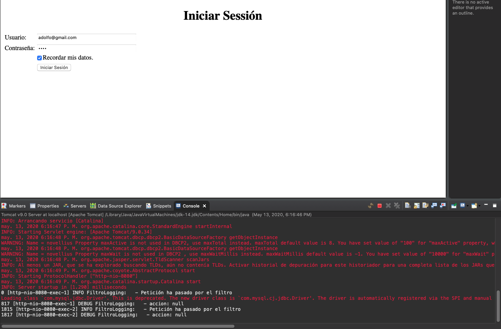

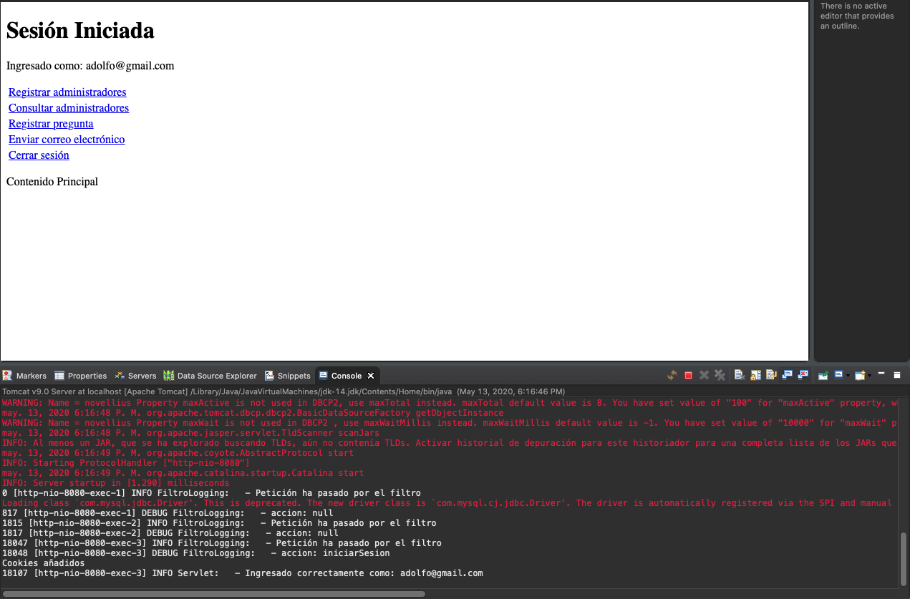

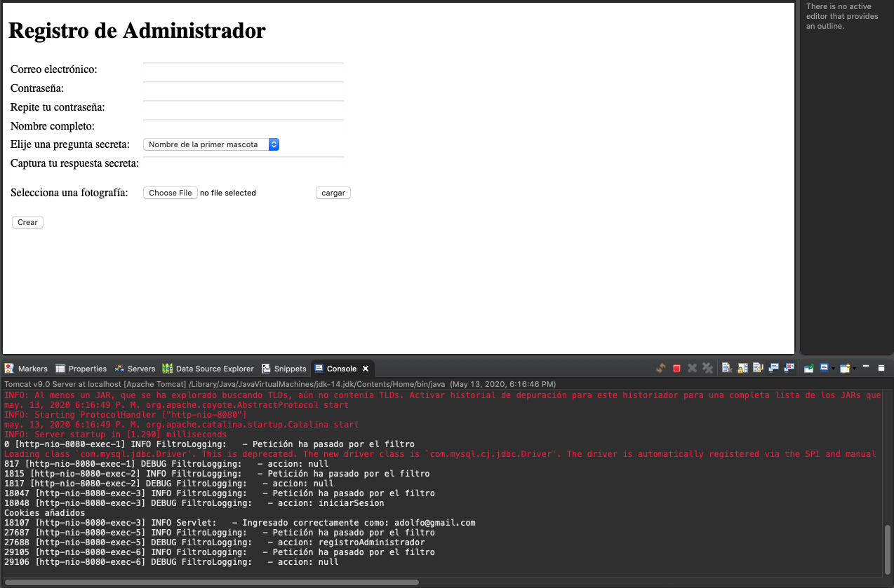

Si presionamos el botón `cargar` sin seleccionar ningún archivo nos muestra un mensaje de error.

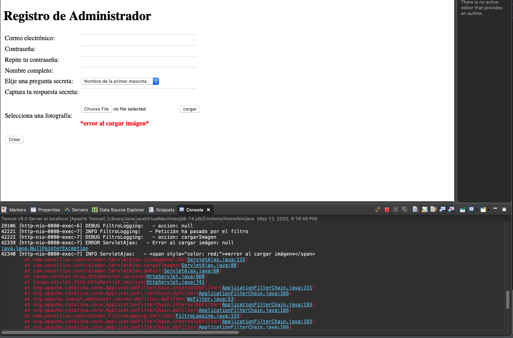

Si seleccionamos un archivo más grande de 5MB.

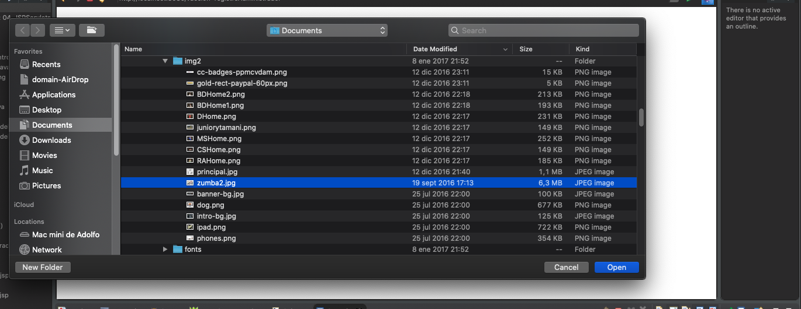

Nos muestra el mensaje de error `*El Tamaño máximo de Imágen es de 5MB*`

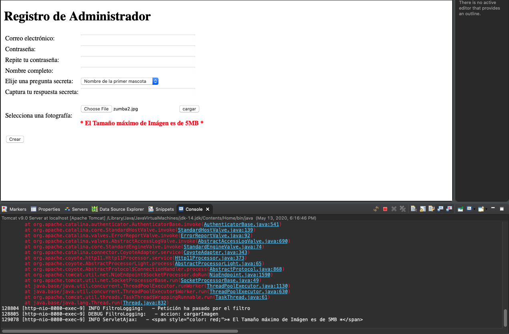

Si seleccionamos un archivo de tipo `doc`

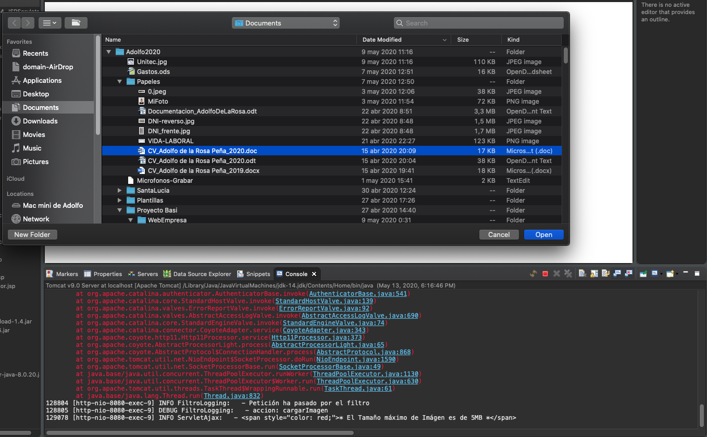

Nos muestra el mensaje de error `* El archivo a cargar no es una Imágen *`

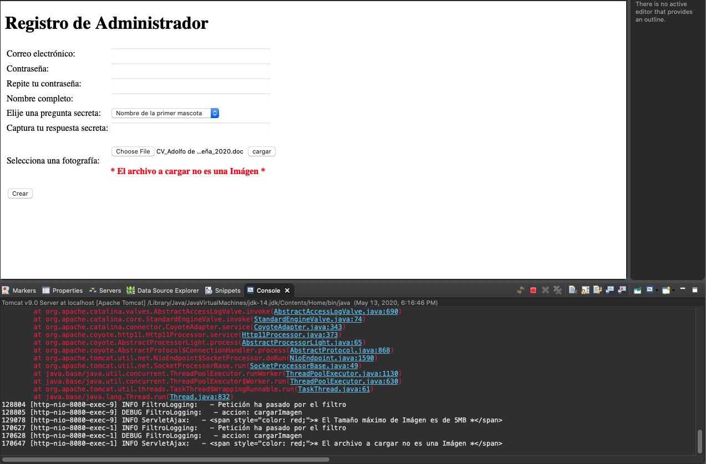

Si seleccionamos un archivo de imágen menor de 5MB

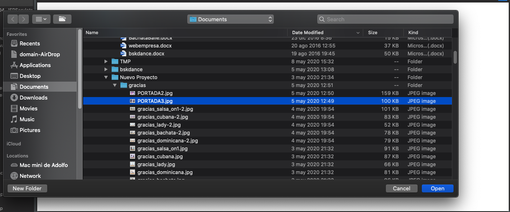

Nos indica que `* Imágen cargada correctamente *`

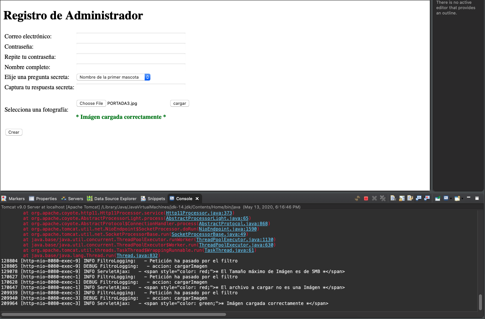

Lo podemos ver en la carpeta de almacenamiento de las imágenes

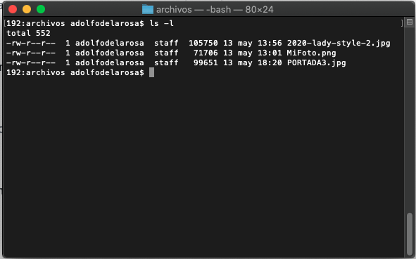

## Como solucionar problemas de caché en Tomcat 02:53

En ocaciones tenemos problemas de caché en Tomcat y no se ejecuta bien nuestra aplicación, cuando pase eso podemos seguir los siguientes pasos:

1. Parar el servidor Tomcat

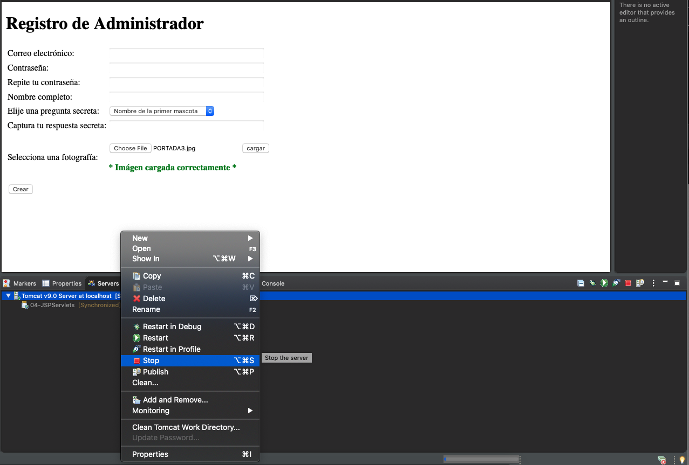

2. Limpiar el Proyecto

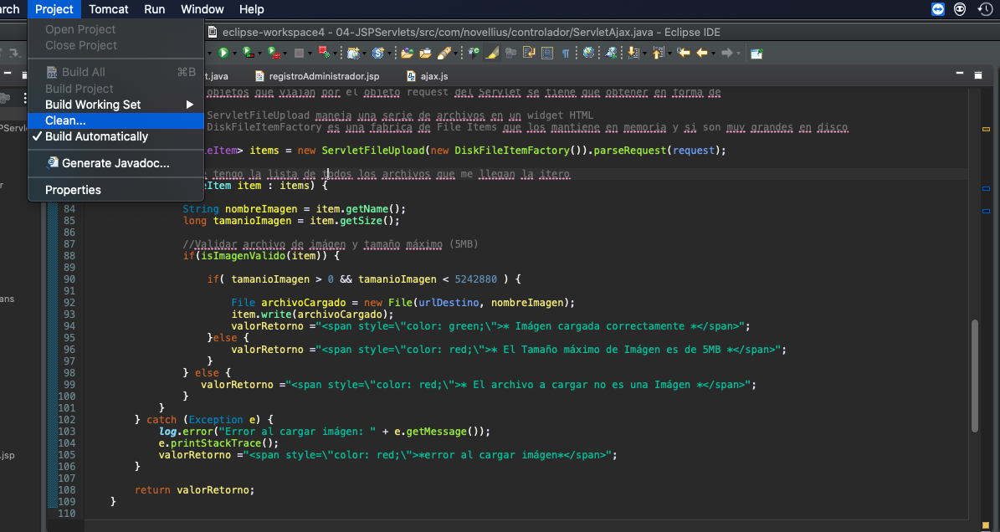

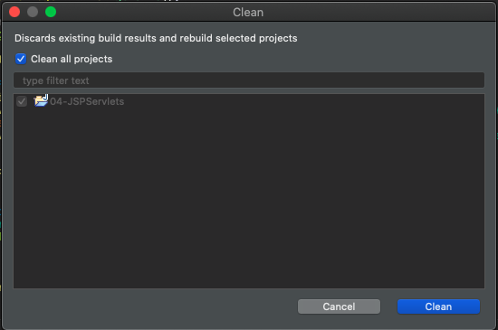

3. Limpiar el directorio de trabajo de Tomcat

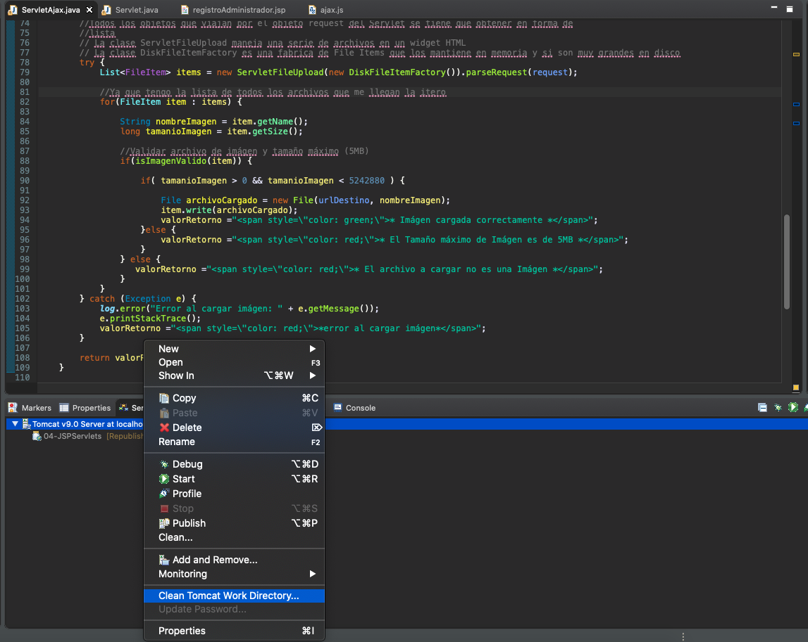

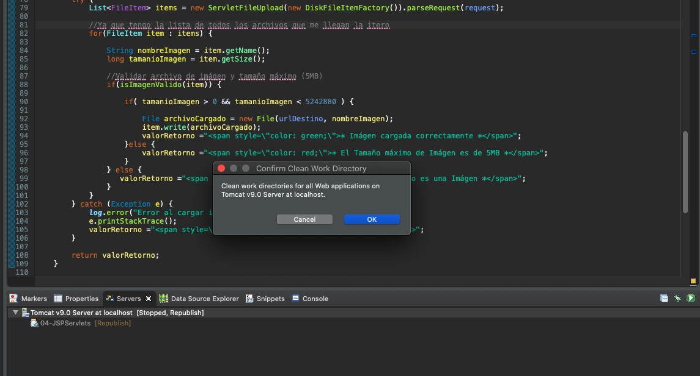

4. También puede Remover y luego añadir nuevamente el proyecto

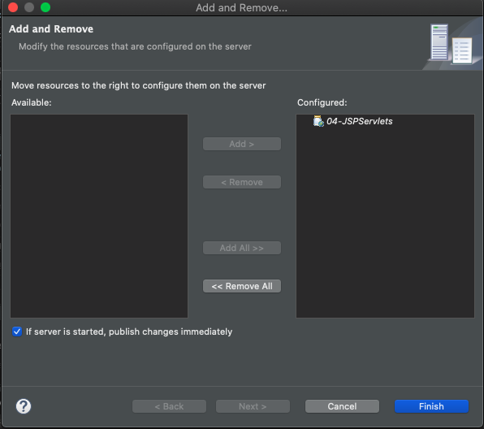

5. Si todo esto no funciona cierre y abra Eclipse  y repita los pasos anteriores.

## Almacenando la ruta de la imagen en la Base de Datos 10:59

En esta lección vamos a almacenar la ruta de la imágen en la BD.

Actualmente estamos almacenando nuestras imágenes en una carpeta externa a nuestro proyecto `/users/adolfodelarosa/archivos` vamos a cambiar esa ruta para que sea interna a nuetro proyecto y y que el proyecto la pueda leer como un recurso más de la aplicación y poder mostrar la imágen asociada a cada administrador.

1. En `WebContent` vamos a crear la carpeta `imagenes`
2. Vamos a copiar una imágen `emoji-mujer-1.png` dentro de la carpeta `imagenes`.
3. Vamos a acceder a esa imágen en nuestro servidor con la ruta `http://localhost:8080/imagenes/emoji-mujer-1.png`


Una vez visto esto nosotros tenemos que almacenar en la BD en el campo `urlImagen` de la tabla `administrador` algo como `/imagenes/emoji-mujer-1.png` ya que lo restante (contexto) lo puedo recuperar con la etiqueta `<c:out`

4. En `ServletAjax` cambiamos la ruta `/users/adolfodelarosa/archivos` por la nueva ruta donde se van a guardar mis imagenes dentro del proyecto `/Users/adolfodelarosa/Documents/Udemy2020/Cursos/UDEMY/UDEMY_Desarrollo_Web_con_JSP_y_Servlets/eclipse-workspace4/04-JSPServlets/WebContent/imagenes`.

5. En `ServletAjax` en el método `cargarImagen` vamos a guardar en una nueva propiedad `nombreImagen` el nombre de la imágen.

```java
... 
if(isImagenValido(item)) {
					
   if( tamanioImagen > 0 && tamanioImagen < 5242880 ) {
   				
      File archivoCargado = new File(urlDestino, nombreImagen);
      item.write(archivoCargado);
      this.nombreImagen = nombreImagen;
...
```

6. En `ServletAjax` vamos a guardar en sesión la ruta y nombre de la imágen:

```java
protected void doPost(HttpServletRequest request, HttpServletResponse response) throws ServletException, IOException {
		
		
   //Establecer un juego de carácteres para los parámetros que llegan al método POST
   request.setCharacterEncoding("UTF-8");
   response.setContentType("text/html; charset-UTF-8"); 
   PrintWriter out = response.getWriter();
						
   String accion = request.getParameter("accion");
		
   HttpSession sesion = request.getSesion();
		
   if(accion != null) {
      if(accion.equals("cargarImagen")) {
	 // /users/adolfodelarosa/archivos es una carpeta en nuestro ordenador
	 String s = cargarImagen(request, 
	            "/Users/adolfodelarosa/Documents/Udemy2020/Cursos/UDEMY/UDEMY_Desarrollo_Web_con_JSP_y_Servlets/eclipse-workspace4/04-JSPServlets/WebContent/imagenes");
	 sesion.setAttribute("urlImagen", "/imagenes/" + nombreImagen);
	 log.info(s);
	 //Esto regresa un mensaje
	 out.println(s);
      }
   }
}
```

7. En `Servlet.java` en el manejo de la acción `registrarAdministrador` recuperamos de la sesión el `urlImagen` y se lo asignamos a la propiedad `urlImagen`.

```java
} else if(accion.contentEquals("registrarAdministrador")) {
				
   Administrador administrador = new Administrador();
   administrador.setEmail(request.getParameter("email"));
   administrador.setContrasena(request.getParameter("contrasena"));
   administrador.setNombre(request.getParameter("nombre"));
   administrador.setRespuesta(request.getParameter("respuesta"));
   if( ! sesion.getAttribute("urlImagen").equals("")) {
      administrador.setUrlImagen((String)sesion.getAttribute("urlImagen"));
   }
   administrador.setIdPregunta(Integer.parseInt(request.getParameter("pregunta")));
				
   //Forma normal
   //Cuenta cuenta = new Cuenta(con);
   //cuenta.registrarAdministrador(administrador);
				
   if (! new Cuenta(con).existeAdministrador(request.getParameter("email"))) {
      //Insertar en la BD
      //forma anonima
      if (new Cuenta(con).registrarAdministrador(administrador)) {
         request.setAttribute("msg", "Administrador creado correctamente");
      } else {
         request.setAttribute("msg", "Error al crear Administrador");
      } 
   }else {
      request.setAttribute("msg", "¡El Administrador ya existe!");
   }
   //Redirige a la misma página
   setRespuestaControlador("registroAdministrador").forward(request, response);
}
```

### Ejecutando la Aplicación

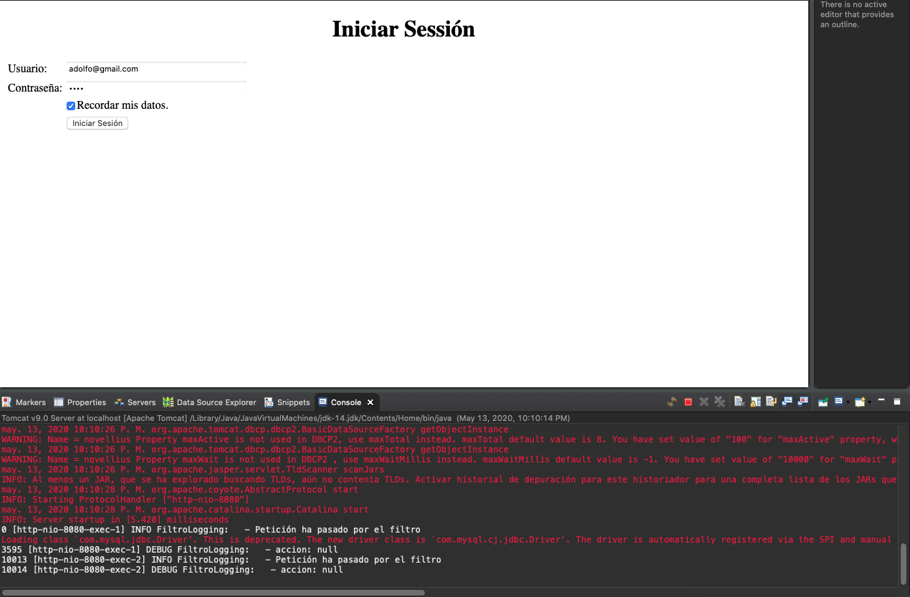

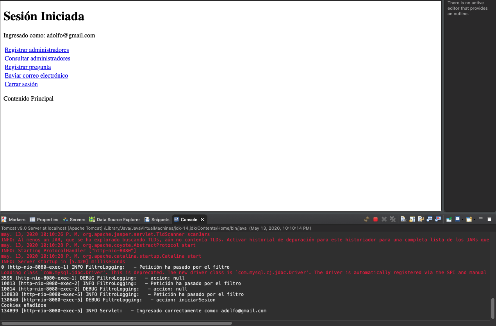

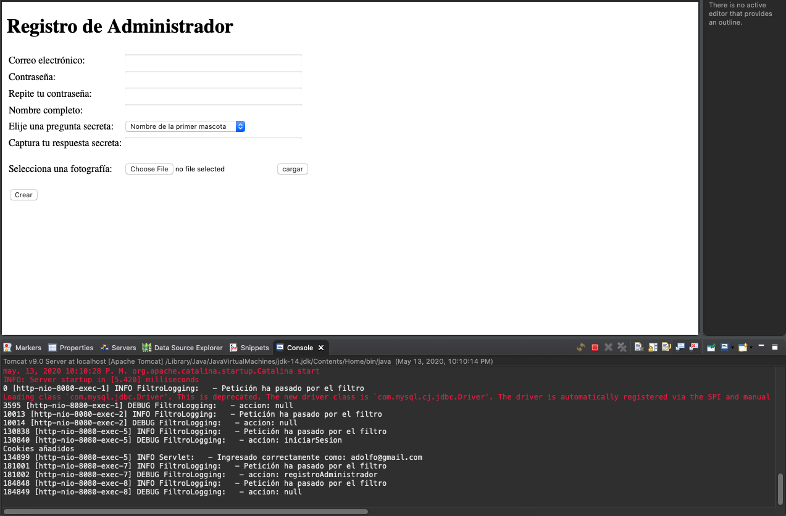

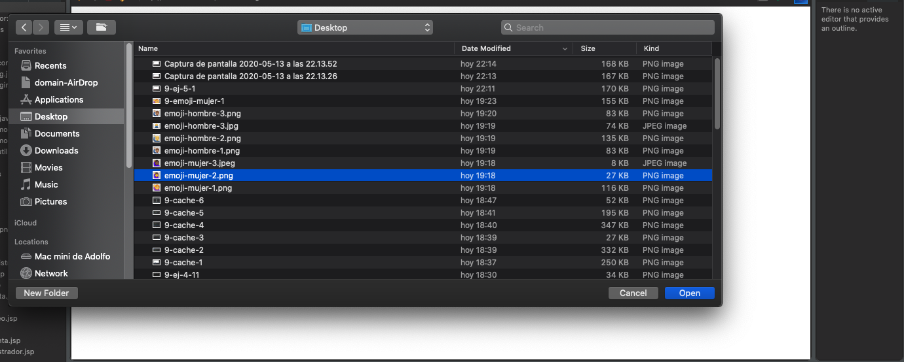

Metemos todos los datos del administrador

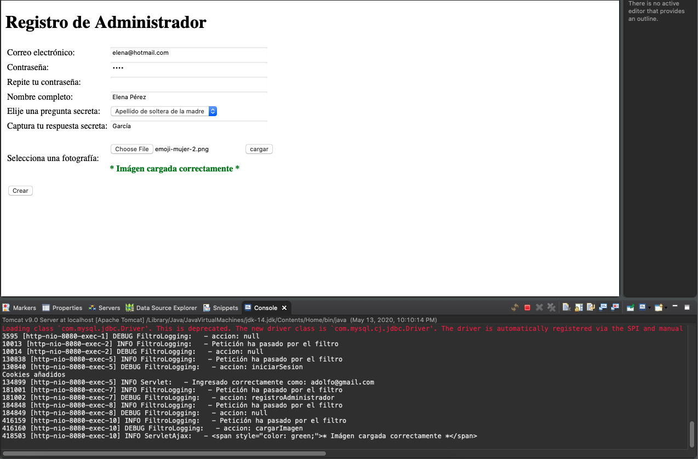

Al presionar el botón `crear` se registra el administrador incluyendo la imágen

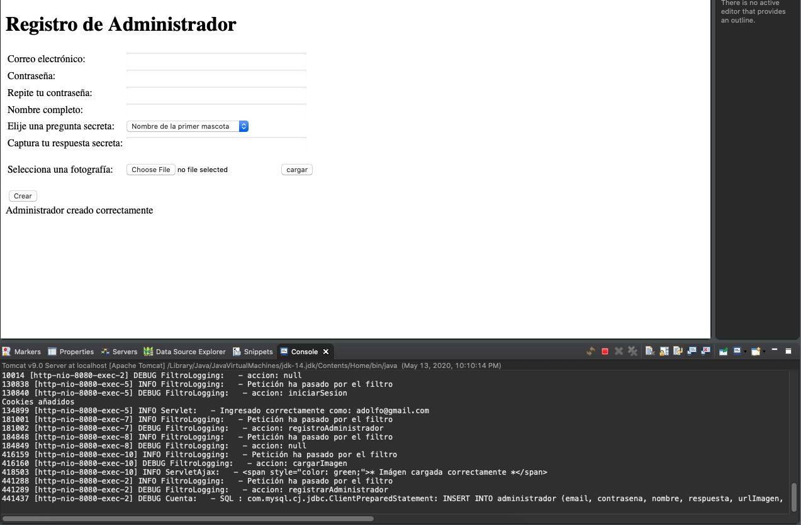

Tenemos que refrescar la carpeta `imagen` para ver la imágen que se ha subido

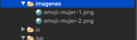

Si cargamos el URL de la imágen podemos ver la imágen

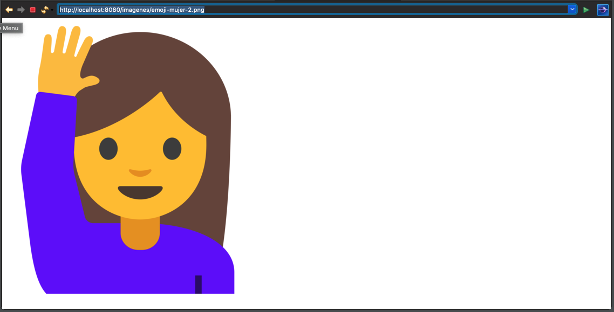

Si vemos la BD vemos que en el nuevo registro tiene el urlImagen lleno

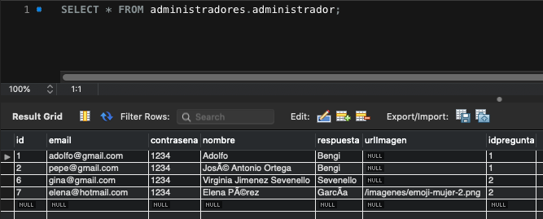

## Mostrando al usuario la imagen almacenada en el servidor 06:54

En esta lección vamos a modificar la vista `consultaAdministradores.jsp` para que muestren la imágen del administrador.

```html
<%@ page language="java" contentType="text/html; charset=UTF-8"
    pageEncoding="UTF-8"%>
<%@ taglib uri="http://java.sun.com/jsp/jstl/core" prefix="c" %>   
<%@ taglib uri = "http://java.sun.com/jsp/jstl/sql" prefix = "sql"%> 
    
<!DOCTYPE html>
<html>
<head>
<meta charset="UTF-8">
<title>Consulta de Administradores</title>
</head>
<body>
	<h1>Consulta de Administradores</h1>
	
	<c:out value="${requestScope.mensaje}" />
	
	<table>
		<tr>
			<td>CORREO ELECTRÓNICO</td>
			<td>NOMBRE COMPLETO</td>
			<td>PREGUNTA SECRETA</td>
			<td>RESPUESTA SECRETA</td>
			<td>FOTOGRAFÍA</td>
		</tr>
		

	
		<c:forEach var="admin" items="${sessionScope.administradores }">
			
			<tr>
				<td><c:out value="${admin.email}" /></td>
			 	<td>${admin.nombre}</td>
			 	<td> 
					<!-- Crea la variable id -->
					<c:set var="id" value="${admin.idPregunta}" />
					
					<c:catch var="ex">
					   <!-- Ejecutar query, usa la variable creada para formar el query -->
					   <sql:query var="rs" dataSource="jdbc/novellius">
					      SELECT pregunta FROM pregunta WHERE idpregunta = ${id};
					   </sql:query>
					
					   <!--  Recorre los datos recuperados y pinta el campo pregunta -->
					   <c:forEach var="row" items="${rs.rows}">
					      ${row.pregunta}
					   </c:forEach>
					</c:catch>
					
					<c:if test="${ex != null}">
					   <span style="color:red;">*** Error en la conexión con la tabla "pregunta" ***</span>
					</c:if>
				</td>
				<td>${admin.respuesta}</td>
				<td>' width="100" height="100" ></td>
			</tr>
		</c:forEach>
	</table>

</body>
</html>
```

### Al ejecutar la Aplicación

Si consultamos los administradores tenemos:

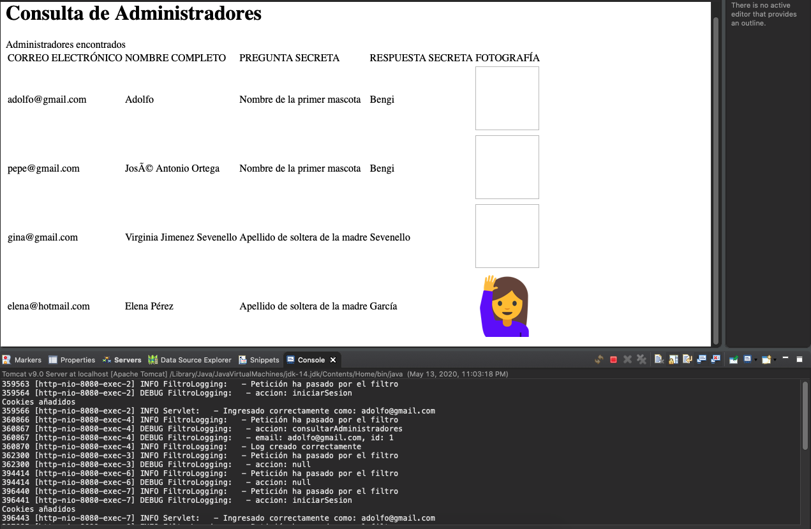

### Código Final de la Aplicación

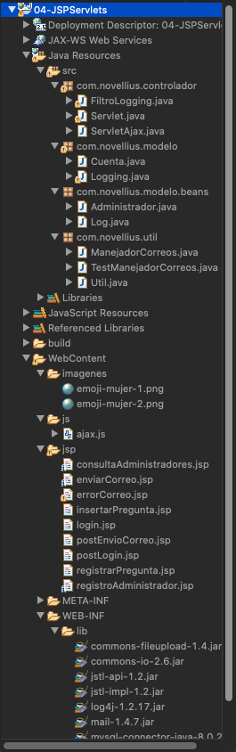

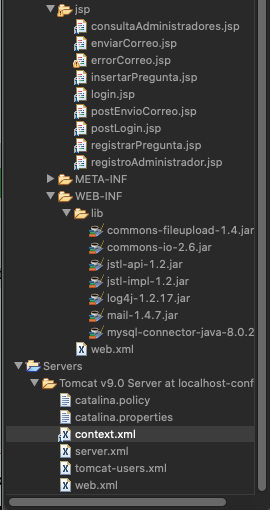

*FiltroLogging.java*

```java
package com.novellius.controlador;

import java.io.IOException;
import java.sql.Connection;
import java.sql.SQLException;

import javax.naming.Context;
import javax.naming.InitialContext;
import javax.naming.NamingException;
import javax.servlet.Filter;
import javax.servlet.FilterChain;
import javax.servlet.FilterConfig;
import javax.servlet.ServletException;
import javax.servlet.ServletRequest;
import javax.servlet.ServletResponse;
import javax.servlet.annotation.WebFilter;
import javax.servlet.http.HttpServletRequest;
import javax.servlet.http.HttpServletResponse;
import javax.servlet.http.HttpSession;
import javax.sql.DataSource;

import org.apache.log4j.LogManager;
import org.apache.log4j.Logger;

import com.novellius.modelo.Logging;
import com.novellius.util.Util;

/**
 * Servlet Filter implementation class FiltroLogging
 */
@WebFilter("/FiltroLogging")
public class FiltroLogging implements Filter {
	
	private static final Logger log = LogManager.getLogger("FiltroLogging: ");
	private DataSource ds;
	private Connection con;

    /**
     * Default constructor. 
     */
    public FiltroLogging() {
        // TODO Auto-generated constructor stub
    }

	/**
	 * @see Filter#destroy()
	 */
	public void destroy() {
		// TODO Auto-generated method stub
	}

	/**
	 * @see Filter#doFilter(ServletRequest, ServletResponse, FilterChain)
	 */
	public void doFilter(ServletRequest request, ServletResponse response, FilterChain chain) throws IOException, ServletException {
		
		log.info("Petición ha pasado por el filtro");
		
		// Conexión a la BD
		try {
		    con = ds.getConnection();
		} catch (SQLException e) {
		   // Enviar a una vista de error
			log.error("Error al crear conexión: " + e.getMessage());
		}
		
		//Necesitamos recuperar el parámetro "accion" que se hace con request.getParameter("accion"); (En Servlet.java)
		//Donde request es un HttpServletRequest, pero aquí el request es un ServletRequest Por lo que 
		//Necesito hacer cast entre HttpServletRequest - ServletRequest y HttpServletResponse - ServletResponse
		// por que son diferentes tipos entre Servlet y Filter
		HttpServletRequest servletRequest = (HttpServletRequest) request;
		HttpServletResponse  servletResponse = (HttpServletResponse) response;
		
		//Recuperar parámetro accion
		String accion = servletRequest.getParameter("accion");
		
		log.debug("accion: " + accion);
		
		//Recuperamos instancia de session para poder recuperar los atributos que se subierón a la sesión
		HttpSession sesion = servletRequest.getSession();
		
		if(accion != null) {
			//Si hay usuario logeado
			if(sesion.getAttribute("usuario") != null && sesion.getAttribute("id") != null ) {
				
				Util util = new Util();
				String fechaYHora = util.getAnio() + "/" + util.getMes() + "/" + util.getDia() + ". " + util.getHora();
			
				int idAdmin = (int) sesion.getAttribute("id");
				
				if(accion.equals("consultarAdministradores")) {
					
					log.debug("email: " + sesion.getAttribute("usuario") + ", id: " + idAdmin);
					
					if(new Logging(con).registrarLog("Consulta de administradores. " + fechaYHora, idAdmin)) {
						log.info("Log creado correctamente");
					} else {
						log.error("Error al crear el log");
					}
					
				}else if(accion.equals("registrarPregunta")) {
					
					log.debug("email: " + sesion.getAttribute("usuario") + ", id: " + idAdmin);
					
					if(new Logging(con).registrarLog("Muestra del formulario para registrar pregunta secreta.  " + fechaYHora, idAdmin)) {
						log.info("Log creado correctamente");
					} else {
						log.error("Error al crear el log");
					}
				}else if(accion.equals("enviarCorreo")) {
					
					log.debug("email: " + sesion.getAttribute("usuario") + ", id: " + idAdmin);
					
					if(new Logging(con).registrarLog("Envíar correo electrónico.  " + fechaYHora, idAdmin)) {
						log.info("Log creado correctamente");
					} else {
						log.error("Error al crear el log");
					}
				}
			}
		}
		 
		
		// Cerrar Conexión a la BD
		try {
			con.close();
		} catch (SQLException e) {
			// Enviar a una vista de error
			log.error("Error al cerrar conexión: " + e.getMessage());
		}
				
		// pass the request along the filter chain
		chain.doFilter(request, response);
	}

	/**
	 * @see Filter#init(FilterConfig)
	 */
	public void init(FilterConfig fConfig) throws ServletException {
		// Confuguración JNDI
		try {
			InitialContext initContext = new InitialContext();
			Context env = (Context) initContext.lookup("java:comp/env");
			ds = (DataSource) env.lookup("jdbc/novellius");
		} catch (NamingException e) {
			log.error("Al configurar JNDI: " + e.getMessage());
		}
	}

}
```

*Servlet.java*

```java
package com.novellius.controlador;

import java.io.IOException;
import java.sql.Connection;
import java.sql.DriverManager;
import java.sql.SQLException;
import java.util.ArrayList;

import javax.mail.MessagingException;
import javax.mail.NoSuchProviderException;
import javax.naming.Context;
import javax.naming.InitialContext;
import javax.naming.NamingException;
import javax.servlet.RequestDispatcher;
import javax.servlet.ServletConfig;
import javax.servlet.ServletContext;
import javax.servlet.ServletException;
import javax.servlet.http.Cookie;
import javax.servlet.http.HttpServlet;
import javax.servlet.http.HttpServletRequest;
import javax.servlet.http.HttpServletResponse;
import javax.servlet.http.HttpSession;
import javax.sql.DataSource;

import org.apache.log4j.BasicConfigurator;
import org.apache.log4j.LogManager;
import org.apache.log4j.Logger;

import com.novellius.modelo.Cuenta;
import com.novellius.modelo.beans.Administrador;
import com.novellius.util.ManejadorCorreos;

/**
 * Servlet implementation class Servlet
 */
public class Servlet extends HttpServlet {
	private static final long serialVersionUID = 1L;

	private static final Logger log = LogManager.getLogger("Servlet: ");
	private String rutaJsp;

	// Variables para interctuar con la BD
	private DataSource ds;
	private Connection con;

	/**
	 * @see HttpServlet#HttpServlet()
	 */
	public Servlet() {
		super();
		// TODO Auto-generated constructor stub
	}

	@Override
	public void init(ServletConfig config) throws ServletException {
		// TODO Auto-generated method stub
		super.init(config);

		// System.out.println(config.getInitParameter("rutaJsp"));
		rutaJsp = config.getInitParameter("rutaJsp");

		// Configurar Logger
		BasicConfigurator.configure();

		// Confuguración JNDI
		try {
			InitialContext initContext = new InitialContext();
			Context env = (Context) initContext.lookup("java:comp/env");
			ds = (DataSource) env.lookup("jdbc/novellius");
		} catch (NamingException e) {
			log.error("Al configurar JNDI: " + e.getMessage());
		}
	}

	/**
	 * @see HttpServlet#doGet(HttpServletRequest request, HttpServletResponse
	 *      response)
	 */
	protected void doGet(HttpServletRequest request, HttpServletResponse response)
			throws ServletException, IOException {

		String accion = request.getParameter("accion");
		HttpSession sesion = request.getSession();
		
		// Conexión a la BD
		try {
		   con = ds.getConnection();
		} catch (SQLException e) {
		   // Enviar a una vista de error
		  log.error("Error al crear conexión: " + e.getMessage());
		}

		if (accion != null) {
			if (accion.equals("login")) {
				setRespuestaControlador(accion).forward(request, response);
			} else if (accion.equals("menu")) {
				setRespuestaControlador("postLogin").forward(request, response);
			} else if (accion.equals("logout")) {
				sesion.invalidate();
				log.info("Sesión destruida");
				setRespuestaControlador("login").forward(request, response);
			} else if (accion.contentEquals("registroAdministrador")) {
				setRespuestaControlador(accion).forward(request, response);
			} else if (accion.equals("consultarAdministradores")) {
				
				//Intanciación anónima me evito 
				//Cuenta cuenta = new Cuenta(con);
				ArrayList<Administrador> administradores = new Cuenta(con).consultarAdministradores();
				
				if(administradores.isEmpty()) {
					request.setAttribute("mensaje", "No se encotrarón administradores");
				}else {
					request.setAttribute("mensaje", "Administradores encontrados");
					// Vamos a cargar los administradores encontrados en la sesión
					sesion.setAttribute("administradores", administradores);
				}
				setRespuestaControlador("consultaAdministradores").forward(request, response);
			} else if (accion.contentEquals("registrarPregunta")) {
				setRespuestaControlador(accion).forward(request, response);
			} else if (accion.contentEquals("insertarPregunta")) {
				setRespuestaControlador(accion).forward(request, response);
			} else if (accion.contentEquals("enviarCorreo")) {
				setRespuestaControlador(accion).forward(request, response);
			}
		} else {
			setRespuestaControlador("login").forward(request, response);
		}
		
		// Conexión a la BD
		try {
		   con.close();
		} catch (SQLException e) {
		   // Enviar a una vista de error
		   log.error("Error al cerrar conexión: " + e.getMessage());
		}
	}

	/**
	 * @see HttpServlet#doPost(HttpServletRequest request, HttpServletResponse
	 *      response)
	 */
	protected void doPost(HttpServletRequest request, HttpServletResponse response)
			throws ServletException, IOException {
		
		//Establecer un juego de carácteres para los parámetros que llegan al método POST
		request.setCharacterEncoding("UTF-8");

		String accion = request.getParameter("accion");
		HttpSession sesion = request.getSession();

		// Conexión a la BD
		try {
			con = ds.getConnection();
		} catch (SQLException e) {
			// Enviar a una vista de error
			log.error("Error al crear conexión: " + e.getMessage());

		}

		if (accion != null) {

			if (accion.equals("iniciarSesion")) {

				String usuario = request.getParameter("usuario");
				String contrasena = request.getParameter("contrasena");
				
				
				// Creación de la Cookie
				Cookie cookieUsurio = new Cookie("usuario", usuario);
				Cookie cookieContrasena = new Cookie("contrasena", contrasena);
				
				try {
						
				   if (request.getParameter("ckbox").equals("on")) {
						
						// Tiempo de vida 1 día
						cookieUsurio.setMaxAge(60 * 60 * 24);
						cookieContrasena.setMaxAge(60 * 60 * 24);
						// Añado las cookies
						response.addCookie(cookieUsurio);
						response.addCookie(cookieContrasena);
						
						System.out.println("Cookies añadidos");
					}
				} catch (NullPointerException e) {
					log.info("chbox vacio");
					
					
					// Expira las cookies
					cookieUsurio.setMaxAge(0);
					cookieContrasena.setMaxAge(0);
					// Añado las cookies
					response.addCookie(cookieUsurio);
					response.addCookie(cookieContrasena);
				}

				// Invocar consulta SQL
				Cuenta cuenta = new Cuenta(con);

				if (cuenta.login(usuario, contrasena)) {
					log.info("Ingresado correctamente como: " + usuario);


					// Ámbito sesión
					sesion.setAttribute("usuario", usuario);
					sesion.setAttribute("id", new Cuenta(con).obtenerIdAdmin(usuario));
					setRespuestaControlador("postLogin").forward(request, response);

				} else {
					log.error("Error de login");
					request.setAttribute("error", "Nombre de usuario o contraseña incorrectos.");
					
					setRespuestaControlador("login").forward(request, response);
				}
			} else if(accion.contentEquals("enviarCorreo")) {
				ManejadorCorreos manejadorCorreos = new ManejadorCorreos();
				try {
					manejadorCorreos.enviarCorreos(request.getParameter("destinatario"), request.getParameter("asunto"), request.getParameter("mensaje"));
					log.info("correo enviado correctamente");
					setRespuestaControlador("postEnvioCorreo").forward(request, response);
				} catch (Exception e) {
					log.error("Al enviar correo: " + e.getMessage());
					e.printStackTrace();
					setRespuestaControlador("errorCorreo").forward(request, response);
				}
			} else if(accion.contentEquals("registrarAdministrador")) {
				
				Administrador administrador = new Administrador();
				administrador.setEmail(request.getParameter("email"));
				administrador.setContrasena(request.getParameter("contrasena"));
				administrador.setNombre(request.getParameter("nombre"));
				administrador.setRespuesta(request.getParameter("respuesta"));
				if( ! sesion.getAttribute("urlImagen").equals("")) {
					administrador.setUrlImagen((String)sesion.getAttribute("urlImagen"));
				}
				administrador.setIdPregunta(Integer.parseInt(request.getParameter("pregunta")));
				
				//Forma normal
				//Cuenta cuenta = new Cuenta(con);
				//cuenta.registrarAdministrador(administrador);
				
				if (! new Cuenta(con).existeAdministrador(request.getParameter("email"))) {
					//Insertar en la BD
					//forma anonima
					if (new Cuenta(con).registrarAdministrador(administrador)) {
						request.setAttribute("msg", "Administrador creado correctamente");
					} else {
						request.setAttribute("msg", "Error al crear Administrador");
					} 
				}else {
					request.setAttribute("msg", "¡El Administrador ya existe!");
				}
				//Redirige a la misma página
				setRespuestaControlador("registroAdministrador").forward(request, response);
			}

		} else {
			setRespuestaControlador("login").forward(request, response);
		}

		// Conexión a la BD
		try {
			con.close();
		} catch (SQLException e) {
			// Enviar a una vista de error
			log.error("Error al cerrar conexión: " + e.getMessage());
		}

	}

	public RequestDispatcher setRespuestaControlador(String vista) {
		String url = rutaJsp + vista + ".jsp";
		return getServletContext().getRequestDispatcher(url);
	}
}

```

*ServletAjax.java*

```java
package com.novellius.controlador;

import java.io.File;
import java.io.IOException;
import java.io.PrintWriter;
import java.util.List;

import javax.servlet.ServletException;
import javax.servlet.http.HttpServlet;
import javax.servlet.http.HttpServletRequest;
import javax.servlet.http.HttpServletResponse;
import javax.servlet.http.HttpSession;

import org.apache.commons.fileupload.FileItem;
import org.apache.commons.fileupload.disk.DiskFileItemFactory;
import org.apache.commons.fileupload.servlet.ServletFileUpload;
import org.apache.log4j.LogManager;
import org.apache.log4j.Logger;

/**
 * Servlet implementation class ServletAjax
 */
public class ServletAjax extends HttpServlet {
	private static final long serialVersionUID = 1L;
	private static final Logger log = LogManager.getLogger("ServletAjax: ");
	private String nombreImagen = "";
	
    /**
     * @see HttpServlet#HttpServlet()
     */
    public ServletAjax() {
        super();
        // TODO Auto-generated constructor stub
    }

	/**
	 * @see HttpServlet#doGet(HttpServletRequest request, HttpServletResponse response)
	 */
	protected void doGet(HttpServletRequest request, HttpServletResponse response) throws ServletException, IOException {
		// TODO Auto-generated method stub
		response.getWriter().append("Served at: ").append(request.getContextPath());
	}

	/**
	 * @see HttpServlet#doPost(HttpServletRequest request, HttpServletResponse response)
	 */
	protected void doPost(HttpServletRequest request, HttpServletResponse response) throws ServletException, IOException {
		
		
		//Establecer un juego de carácteres para los parámetros que llegan al método POST
		request.setCharacterEncoding("UTF-8");
		response.setContentType("text/html; charset-UTF-8"); 
		PrintWriter out = response.getWriter();
		
				
		String accion = request.getParameter("accion");
		
		HttpSession sesion = request.getSession();
		
		if(accion != null) {
			if(accion.equals("cargarImagen")) {
				// /users/adolfodelarosa/archivos es una carpeta en nuestro ordenador
				String s = cargarImagen(request, "/Users/adolfodelarosa/Documents/Udemy2020/Cursos/UDEMY/UDEMY_Desarrollo_Web_con_JSP_y_Servlets/eclipse-workspace4/04-JSPServlets/WebContent/imagenes");
				sesion.setAttribute("urlImagen", "/imagenes/" + nombreImagen);
				log.info(s);
				//Esto regresa un mensaje
				out.println(s);
			}
		}
	}
	
	public String cargarImagen(HttpServletRequest request, String urlDestino) {
		
		String valorRetorno = "";
		
		//Objeto FileItem del API commons-fileupload recibe a través de POST un tipo "multipart/form-data"  
		//donde se pueden seleccionar varios archivos.
		//Todos los objetos que viajan por el objeto request del Servlet se tiene que obtener en forma de 
		//lista 		
		// La clase ServletFileUpload maneja una serie de archivos en un widget HTML 		
		// La clase DiskFileItemFactory es una fabrica de File Items que los mantiene en memoria y si son muy grandes en disco
		try {
			List<FileItem> items = new ServletFileUpload(new DiskFileItemFactory()).parseRequest(request);
			
			//Ya que tengo la lista de todos los archivos que me llegan la itero
			for(FileItem item : items) {
				
				String nombreImagen = item.getName();
				long tamanioImagen = item.getSize();
				
				//Validar archivo de imágen y tamaño máximo (5MB)
				if(isImagenValido(item)) {
					
					if( tamanioImagen > 0 && tamanioImagen < 5242880 ) {
				
						File archivoCargado = new File(urlDestino, nombreImagen);
						item.write(archivoCargado);
						this.nombreImagen = nombreImagen;
						valorRetorno ="<span style=\"color: green;\">* Imágen cargada correctamente *</span>";
					}else {
						valorRetorno ="<span style=\"color: red;\">* El Tamaño máximo de Imágen es de 5MB *</span>";
					}
				} else {
				   valorRetorno ="<span style=\"color: red;\">* El archivo a cargar no es una Imágen *</span>";
				}
			}
		} catch (Exception e) {
			log.error("Error al cargar imágen: " + e.getMessage());
			e.printStackTrace();
			valorRetorno ="<span style=\"color: red;\">*error al cargar imágen*</span>";
		}
		
		return valorRetorno;
	}
	
	public boolean isImagenValido(FileItem archivo) {
		
		String nombre = archivo.getName();
		
		if(! nombre.isEmpty()) {
			String extension3 = nombre.substring(nombre.length() - 3, nombre.length()).toLowerCase();
			String extension4 = nombre.substring(nombre.length() - 4, nombre.length()).toLowerCase();
			
			if( extension3.equals("jpg") || extension3.equals("bmp") || extension3.equals("png") || 
				extension3.equals("xcf") || extension3.equals("gif") || extension3.equals("eps") || 
				extension3.equals("pcx") || extension3.equals("dng") || extension3.equals("wmp") || 
				extension3.equals("psb") || extension3.equals("jp2") ||
                extension4.equals("tiff") || extension4.equals("jpeg") ){
				
				return true;
				
			} else {
				return false;
			}
			
		}else {
			return false;
		}
	}

}

```

*Cuenta.java*

```java
package com.novellius.modelo;

import java.sql.Connection;
import java.sql.PreparedStatement;
import java.sql.ResultSet;
import java.sql.SQLException;
import java.util.ArrayList;

import org.apache.log4j.LogManager;
import org.apache.log4j.Logger;

import com.novellius.modelo.beans.Administrador;

public class Cuenta {
	
	private static final Logger log = LogManager.getLogger("Cuenta: ");
	private Connection con;

	public Cuenta(Connection con) {
		this.con = con;
	}
	
	public boolean login(String email, String contrasena) {
		
		
		// El uso de los comodines (?) en lugar de la concatenación, nos permite evitar la SQL INYECTION (; delete database) 
		String sql = "SELECT count(*) as count FROM administrador WHERE email = ? AND contrasena = ? ";
		
		//Permite saber si encontro o no el registro en la BD
		int noRegistros = 0;
		
		try {
			//Preparar la sentencia
			PreparedStatement st = con.prepareStatement(sql);
			
			//Pasar valores a los dos comodines
			st.setString(1, email);
			st.setString(2, contrasena);
			
			// Ejecutar la consulta y almacenarla en un ResultSet
			ResultSet rs = st.executeQuery();
			
			//Comprobar que la consulta obtuvo resultados
			if(rs.next()) {
				noRegistros = rs.getInt("count");
			}
			
			//Cerrar el Result Set
			rs.close();
		} catch (SQLException e) {
			log.error("Al realizar Login: " + e.getMessage());
			// Si hay una excepción retornamos false
			return false;
		}
		
		// Verificamos si hubo coincidencias en la BD
		if (noRegistros == 0 ) {
			return false;
		}else {
			return true;
		}
	}
	
	public ArrayList<Administrador> consultarAdministradores(){
		
		ArrayList<Administrador> administradores = new ArrayList<Administrador>();
		
		String sql = "SELECT * FROM administrador";
		
		try {
			PreparedStatement st = con.prepareStatement(sql);
			
			ResultSet rs = st.executeQuery();
			
			while(rs.next()) {
				
				Administrador administrador = new Administrador(
						rs.getString("email"),
						rs.getString("contrasena"),
						rs.getString("nombre"),
						rs.getString("respuesta"),
						rs.getString("urlImagen"),
						rs.getInt("idPregunta")
				);
				
				administradores.add(administrador);
			}
			rs.close();
		} catch (SQLException e) {
			administradores.clear();
			log.error("Al consultar administradores: " + e.getMessage());
		}
		
		return administradores;
	}
	
	public int obtenerIdAdmin(String emailAdmin) {
		
		try {
			PreparedStatement st = con.prepareStatement("SELECT id FROM administrador WHERE email = ?");
			st.setString(1, emailAdmin);
			
			ResultSet rs = st.executeQuery();
			
			/*
			if(rs.next()) {
				return rs.getInt("id");
			} else {
				return 0;
			}
			*/
			
			return (rs.next()) ? rs.getInt("id") : 0;

		
		} catch (SQLException e) {
			// TODO Auto-generated catch block
			e.printStackTrace();
			return 0;
		}
		
	}
	
	public boolean registrarAdministrador(Administrador administrador) {
		try {
			PreparedStatement st = con.prepareStatement("INSERT INTO administrador ("
					+ "email, contrasena, nombre, respuesta, urlImagen, idpregunta ) "
					+ "VALUES (?,?,?,?,?,?) ");
			
			st.setString( 1, administrador.getEmail());
			st.setString( 2, administrador.getContrasena());
			st.setString( 3, administrador.getNombre());
			st.setString( 4, administrador.getRespuesta());
			st.setString( 5, administrador.getUrlImagen());
			st.setInt(6, administrador.getIdPregunta());
			
			log.debug("SQL : " + st.toString());
			
			st.executeUpdate();
			
			st.close();
			
			return true;
			
		} catch (SQLException e) {
			log.error("Al registrar administrador: " + e.getMessage());
			e.printStackTrace();
			return false;
		}	
	}
	
	
	public boolean existeAdministrador(String email) {
		
		try {
			PreparedStatement st = con.prepareStatement("SELECT * FROM administrador WHERE email = ? ");
			st.setString(1, email);
			
			ResultSet rs = st.executeQuery();
			
			return(rs.next()) ? true : false;
		} catch (SQLException e) {
			log.error("Al consultar existencia de administrador: " + e.getMessage());
			e.printStackTrace();
			return false;
		}
		
	}
}
```

*Logging.java*

```java
package com.novellius.modelo;

import java.sql.Connection;
import java.sql.PreparedStatement;
import java.sql.SQLException;

import org.apache.log4j.LogManager;
import org.apache.log4j.Logger;

public class Logging {

	private static final Logger log = LogManager.getLogger("Logging: ");
	private Connection con;

	public Logging(Connection con) {
		this.con = con;
	}
	
	public boolean registrarLog(String accionLog, int idAdministrador) {
		
		try {
			PreparedStatement st = con.prepareStatement("INSERT INTO log (accionLog, idadministrador) VALUES (?, ?)");
			st.setString(1, accionLog);
			st.setInt(2,  idAdministrador);
			st.executeUpdate();
			
			st.close();
			
			return true;

		} catch (SQLException e) {
			// TODO Auto-generated catch block
			e.printStackTrace();
			return false;
		}
	}
	
}

```

*Administrador.java*

```java
package com.novellius.modelo.beans;

public class Administrador {
	
	private int idAdministrador;
	private String email;
	private String contrasena;
	private String nombre;
	private String respuesta;
	private String urlImagen;
	private int idPregunta;
	
	public Administrador() {
		// TODO Auto-generated constructor stub
	}
	
	public Administrador(String email, String contrasena, String nombre, String respuesta, String urlImagen,
			int idPregunta) {
		this.email = email;
		this.contrasena = contrasena;
		this.nombre = nombre;
		this.respuesta = respuesta;
		this.urlImagen = urlImagen;
		this.idPregunta = idPregunta;
	}
	
	public Administrador(int idAdministrador, String email, String contrasena, String nombre, String respuesta,
			String urlImagen, int idPregunta) {
		this.idAdministrador = idAdministrador;
		this.email = email;
		this.contrasena = contrasena;
		this.nombre = nombre;
		this.respuesta = respuesta;
		this.urlImagen = urlImagen;
		this.idPregunta = idPregunta;
	}

	

	public int getIdAdministrador() {
		return idAdministrador;
	}
	public void setIdAdministrador(int idAdministrador) {
		this.idAdministrador = idAdministrador;
	}
	public String getEmail() {
		return email;
	}
	public void setEmail(String email) {
		this.email = email;
	}
	public String getContrasena() {
		return contrasena;
	}
	public void setContrasena(String contrasena) {
		this.contrasena = contrasena;
	}
	public String getNombre() {
		return nombre;
	}
	public void setNombre(String nombre) {
		this.nombre = nombre;
	}
	public String getRespuesta() {
		return respuesta;
	}

	public void setRespuesta(String respuesta) {
		this.respuesta = respuesta;
	}

	public String getUrlImagen() {
		return urlImagen;
	}

	public void setUrlImagen(String urlImagen) {
		this.urlImagen = urlImagen;
	}

	public int getIdPregunta() {
		return idPregunta;
	}
	public void setIdPregunta(int idPregunta) {
		this.idPregunta = idPregunta;
	}
	@Override
	public String toString() {
		return "Administrador [idAdministrador=" + idAdministrador + ", email=" + email + ", contrasena=" + contrasena
				+ ", nombre=" + nombre + ", respuesta=" + respuesta + ", urlImagen=" + urlImagen + ", idPregunta="
				+ idPregunta + "]";
	}
}


```

*.java*

```java
```

*Log.java*

```java
package com.novellius.modelo.beans;

public class Log {
	
	private int idLog;
	private String accionLog;
	private int idAdministrador;
	
	public Log() {
		
	}
	
	
	public Log(int idLog, String accionLog, int idAdministrador) {
		super();
		this.idLog = idLog;
		this.accionLog = accionLog;
		this.idAdministrador = idAdministrador;
	}
	
	public int getIdLog() {
		return idLog;
	}
	public void setIdLog(int idLog) {
		this.idLog = idLog;
	}
	public String getAccionLog() {
		return accionLog;
	}
	public void setAccionLog(String accionLog) {
		this.accionLog = accionLog;
	}
	public int getIdAdministrador() {
		return idAdministrador;
	}
	public void setIdAdministrador(int idAdministrador) {
		this.idAdministrador = idAdministrador;
	}
}

```

*ManejadorCorreos.java*

```java
package com.novellius.util;

import java.util.Properties;

import javax.mail.Message;
import javax.mail.MessagingException;
import javax.mail.NoSuchProviderException;
import javax.mail.Session;
import javax.mail.Transport;
import javax.mail.internet.InternetAddress;
import javax.mail.internet.MimeMessage;

public class ManejadorCorreos {
	
	// Propiedades de la clase
	private Properties props; // Datos del correo que va a enviar el mensaje HOST, PUERTO, EMAIL, AUTENTICACIÓN
	private Session sesion; // Sesión de javax.mail, una vez que se implementa la conexión esta sesión se conecta a ella para establecer un canal y poder enviar el mensaje y después cierra la conexión 
	private Transport transport; // Crean las conexiones para el email
	private MimeMessage msg; // Aquí se compone el cuerpo del mensaje
	
	//Constructor
	public ManejadorCorreos() {
		
		// Inicializar y llenar las propiedades básicas para poder conectar y enviar un correo
		props = new Properties();
		props.setProperty("mail.smtp.host", "mail.bskdance.com"); // Host del correo saliente
		props.setProperty("mail.smtp.port", "26"); // Puerto del correo saliente
		props.setProperty("mail.smtp.user", "adolfo@bskdance.com"); // Usuario del correo saliente
		props.setProperty("mail.smtp.auth", "true"); // Autenticación
		
	}
	
	//Método para enviar el correo
	//Dispara las excepciones hacia arriba para que el Servlet maneje la excepción y 
	//redirija a una vista que muestre un mensaje de error
	public void enviarCorreos(String destinatario, String asunto, String mensaje) throws MessagingException, NoSuchProviderException {
		
		//Inicializar sesión con las propiedades definidas
		sesion = Session.getDefaultInstance(props);
		
		//Composición del mensaje, establece emisor, destinatario, asunto y mensaje
		msg = new MimeMessage(sesion);
		msg.setFrom(new InternetAddress("adolfo@bskdance.com"));
		msg.addRecipient(Message.RecipientType.TO, new InternetAddress(destinatario));
		msg.setSubject(asunto);
		msg.setText("<h1>Mensaje</h1>"
		          +	"<p>" + mensaje + "</p>", "UTF-8", "html"); //Puedi mandar texto plano o html
	
		// Crear un objeto que modela un objeto para el transportedel transporte, crea un canal de comunicación para el mensaje. 
		transport = sesion.getTransport("smtp"); // Protocolo para enviar emails
		transport.connect("adolfo@bskdance.com", "1234ABCD"); //Claves de autenticación
		transport.sendMessage(msg, msg.getAllRecipients()); // Envío del correo (se puede envíar a varios destinatarios si son un array)
		transport.close(); // Cerrar la conexión
	}

}
```

*TestManejadorCorreos.java*

```java
package com.novellius.util;

import javax.mail.MessagingException;
import javax.mail.NoSuchProviderException;

public class TestManejadorCorreos {
	
	public static void main(String[] args) {
		ManejadorCorreos manejadorCorreos = new ManejadorCorreos();
		try {
			manejadorCorreos.enviarCorreos("adolfodelarosa2012@gmail.com", "Test de envío de Email desde Java", "Test de envío de Email desde Java" );
			System.out.println("Correo envíado");
		} catch (NoSuchProviderException e) {
			e.printStackTrace();
		} catch (MessagingException e) {
			e.printStackTrace();
		}
	}
}
```

*Util.java*

```java
package com.novellius.util;

import java.util.Calendar;
import java.util.GregorianCalendar;

public class Util {

	private Calendar calendar;

	public Util() {
		calendar = new GregorianCalendar();
	}
	
	public String getAnio() {
		return String.valueOf(calendar.get(Calendar.YEAR));
	}

	public String getMes() {
		int mesEntero = calendar.get(Calendar.MONTH) + 1;
		String mes = "";

		switch (mesEntero) {
		case 1: {
			mes = "ENERO";
			break;
		}
		case 2: {
			mes = "FEBRERO";
			break;
		}
		case 3: {
			mes = "MARZO";
			break;
		}
		case 4: {
			mes = "ABRIL";
			break;
		}
		case 5: {
			mes = "MAYO";
			break;
		}
		case 6: {
			mes = "JUNIO";
			break;
		}
		case 7: {
			mes = "JULIO";
			break;
		}
		case 8: {
			mes = "AGOSTO";
			break;
		}
		case 9: {
			mes = "SEPTIEMBRE";
			break;
		}
		case 10: {
			mes = "OCTUBRE";
			break;
		}
		case 11: {
			mes = "NOVIEMBRE";
			break;
		}
		case 12: {
			mes = "DICIEMBRE";
			break;
		}
		}

		return mes;

	}

	public String getDia() {
		if (calendar.get(Calendar.DAY_OF_MONTH) <= 9) {
			return "0" + String.valueOf(calendar.get(Calendar.DAY_OF_MONTH));
		} else {
			return String.valueOf(calendar.get(Calendar.DAY_OF_MONTH));
		}
	}

	public String getHora() {
		if (calendar.get(Calendar.MINUTE) <= 9) {

			return String
					.valueOf(calendar.get(Calendar.HOUR_OF_DAY) + "0:" + String.valueOf(calendar.get(Calendar.MINUTE)));
		} else {
			return String
					.valueOf(calendar.get(Calendar.HOUR_OF_DAY) + ":" + String.valueOf(calendar.get(Calendar.MINUTE)));
		}
	}
}
```

*ajax.js*

```html
function cargarImagen(){
	
	document.getElementById("respuesta").innerHTML = "Cargando imágen, espere ...";
	
	//Crea un formulario con código
	var formdata = new FormData();
	//Permite elejir un archivo del ordenador.
	formdata.append("file", document.getElementById("file").files[0]); //0 indica que selecciona el primer archivo seleccionado
	
	//Construye petición HTTP
	var xhr = new XMLHttpRequest();
	//Establecer parámetros de la petición HTTP, método, url, asyncrono
	xhr.open("post", "/ServletAjax?accion=cargarImagen", true);
	//Enviar el formulario a a la petición
	xhr.send(formdata);
	
	//Analisa el resultado de la petición
	xhr.onload = function(){
		if(this.status == 200){
			//El método cargarImagen() del ServletAjax devuelve texto
			//Recupera la respuesta del Servlet y la muestra en el mensaje de respuesta
			document.getElementById("respuesta").innerHTML = xhr.responseText;
		}
	};
}
```

*consultaAdministradores.jsp*

```html
<%@ page language="java" contentType="text/html; charset=UTF-8"
    pageEncoding="UTF-8"%>
<%@ taglib uri="http://java.sun.com/jsp/jstl/core" prefix="c" %>   
<%@ taglib uri = "http://java.sun.com/jsp/jstl/sql" prefix = "sql"%> 
    
<!DOCTYPE html>
<html>
<head>
<meta charset="UTF-8">
<title>Consulta de Administradores</title>
</head>
<body>
	<h1>Consulta de Administradores</h1>
	
	<c:out value="${requestScope.mensaje}" />
	
	<table>
		<tr>
			<td>CORREO ELECTRÓNICO</td>
			<td>NOMBRE COMPLETO</td>
			<td>PREGUNTA SECRETA</td>
			<td>RESPUESTA SECRETA</td>
			<td>FOTOGRAFÍA</td>
		</tr>
		

	
		<c:forEach var="admin" items="${sessionScope.administradores }">
			
			<tr>
				<td><c:out value="${admin.email}" /></td>
			 	<td>${admin.nombre}</td>
			 	<td> 
					<!-- Crea la variable id -->
					<c:set var="id" value="${admin.idPregunta}" />
					
					<c:catch var="ex">
					   <!-- Ejecutar query, usa la variable creada para formar el query -->
					   <sql:query var="rs" dataSource="jdbc/novellius">
					      SELECT pregunta FROM pregunta WHERE idpregunta = ${id};
					   </sql:query>
					
					   <!--  Recorre los datos recuperados y pinta el campo pregunta -->
					   <c:forEach var="row" items="${rs.rows}">
					      ${row.pregunta}
					   </c:forEach>
					</c:catch>
					
					<c:if test="${ex != null}">
					   <span style="color:red;">*** Error en la conexión con la tabla "pregunta" ***</span>
					</c:if>
				</td>
				<td>${admin.respuesta}</td>
				<td>' width="100" height="100" ></td>
			</tr>
		</c:forEach>
	</table>

</body>
</html>
```

*enviarCorreo.jsp*

```html
<%@ page language="java" contentType="text/html; charset=UTF-8"
    pageEncoding="UTF-8"%>
<!DOCTYPE html>
<html>
<head>
<meta charset="UTF-8">
<title>Enviar Correo</title>
</head>
<body>
    <h1>Enviar Correo electrónico</h1>
	<form method="post" action="?accion=enviarCorreo">
		
		<p>Para: <input type="text" name="destinatario" size="35" /></p>
		<p>Asunto: <input type="text" name="asunto" size="35" /></p>
		<p>Mensaje: <input type="text" name="mensaje" size="35" /></p>
		
		<input type="submit" value="Enviar Correo" />
	</form>

```

*errorCorreo.jsp*

```html
<%@ page language="java" contentType="text/html; charset=UTF-8"
    pageEncoding="UTF-8"%>
<!DOCTYPE html>
<html>
<head>
<meta charset="UTF-8">
<title>Error correo</title>
</head>
<body>
   <h1>Ocurrió un error al enviar el correo</h1>
   
   <p>Ha habido un error al enviar el email</p>
   
   <a href="?accion="menu"> &lt;&lt;Regresar</a>

</body>
</html>
```

*insertarPregunta.jsp*

```html
<%@ page language="java" contentType="text/html; charset=UTF-8"
    pageEncoding="UTF-8"%>
    
<%@ taglib uri="http://java.sun.com/jsp/jstl/core" prefix="c" %>  
<%@ taglib uri = "http://java.sun.com/jsp/jstl/sql" prefix = "sql"%>
<%@ taglib uri="http://java.sun.com/jsp/jstl/functions" prefix="fn" %>
    
<!DOCTYPE html>
<html>
<head>
<meta charset="UTF-8">
<title>Insertar Pregunta Secreta</title>
</head>
<body>
	<h1>Insertar Pregunta Secreta</h1>
	
	<c:set var="pregunta" value="${param.pregunta}" />
	<p>La pregunta secreta capturada es:</p>
	"${pregunta}" con una longitud de ${fn:length(pregunta)} carácteres
	
	
	<c:catch var="ex">
	    <!-- Insertar registro-->
		<sql:update var="row" dataSource="jdbc/novellius" sql="INSERT INTO pregunta (pregunta) VALUES (?)">
		   <sql:param value="${param.pregunta}" />
		</sql:update>
		<!-- Analiza la respuesta de la ejecución del query-->
		<c:choose>
			<c:when test="${row != 0 }"> <p>Pregunta registrada correctamente.</p></c:when>
			<c:otherwise><p>Error al registrar la pregunta</p></c:otherwise>
		</c:choose>
	</c:catch>
	
	<!-- En caso de una excepción envía mensaje -->
	<c:if test="${ex != null}">
		<p style="color:red;">Error en la conexión a la BD.</p>
	</c:if>
</body>
</html>
```

*login.jsp*

```html
<%@ page language="java" contentType="text/html; charset=UTF-8"
    pageEncoding="UTF-8"%>
<%@ taglib uri="http://java.sun.com/jsp/jstl/core" prefix="c" %>
	
<!DOCTYPE html>
<html>
<head>
<meta charset="UTF-8">
<title>Iniciar Sessión</title>
</head>
<body>
	<h1 align="center">Iniciar Sessión</h1>
	
	
	<p style="color: red; font-weight: bold;">
	<c:out value="${requestScope.error}" />
	</p>
	
	<form method="post" action="?accion=iniciarSesion">
	
		<%
		   String usuario = "";
		   String contrasena = "";	
		   
		   //Leyendo Cookies
		   Cookie[] cookies = request.getCookies();
		   if (cookies != null){
				
		       // Si existen cookies recorremos el array
			   for(Cookie cookie : cookies){
					//Busca las cookies de usuario y contraeña
					if(cookie.getName().equals("usuario")){
						usuario = cookie.getValue();   
					}else if(cookie.getName().equals("contrasena")){
						contrasena = cookie.getValue();   
					}
			    }
		    }
		   
		%>
		<table>
			<tr>
				<td>Usuario: </td>
				<td><input type="text" name="usuario" size="35" value="<%= usuario %>" /></td>
			</tr>
			<tr>
				<td>Contraseña: </td>
				<td><input type="password" name="contrasena" size="35" value="<%= contrasena %>" /></td>
			</tr>
			<tr>
				<td>&nbsp;</td>
				<td><input name="ckbox" type="checkbox" checked="checked" />Recordar mis datos.</td>
			</tr>
			<tr>
				<td>&nbsp;</td>
				<td><input type="submit" value="Iniciar Sesión" /></td>
			</tr>
		</table>	
	</form>
	
</body>
</html>

```

*postEnvioCorreo.jsp*

```html
<%@ page language="java" contentType="text/html; charset=UTF-8"
    pageEncoding="UTF-8"%>
<!DOCTYPE html>
<html>
<head>
<meta charset="UTF-8">
<title>Correo Enviado</title>
</head>
<body>
	<h1>Correo Enviado</h1>
	<p>Destinatario: ${param.destinatario}</p>
	<p>Asunto: ${param.asunto}</p>
	<p>Mensaje: ${param.mensaje}</p>
</body>
</html>
```

*.jsp*

```html
```

*postLogin.jsp*

```html
<%@ page language="java" contentType="text/html; charset=UTF-8"
    pageEncoding="UTF-8"%>
<!DOCTYPE html>
<html>
<head>
<meta charset="UTF-8">
<title>PostLogin</title>
</head>
<body>
	<h1>Sesión Iniciada</h1>
	
	<p>Ingresado como: <%= session.getAttribute("usuario") %></p>
	
	
	<table>
		<tr>
			<td><a href="?accion=registroAdministrador" >Registrar administradores</a></td>
		</tr>
		<tr>
			<td><a href="?accion=consultarAdministradores" >Consultar administradores</a></td>
		</tr>
		<tr>
			<td><a href="?accion=registrarPregunta" >Registrar pregunta</a></td>
		</tr>
		<tr>
			<td><a href="?accion=enviarCorreo" >Enviar correo electrónico</a></td>
		</tr>
		<tr>
			<td><a href="?accion=logout">Cerrar sesión</a></td>
		</tr>
	</table>
	<p>
		Contenido Principal
	</p>

</body>
</html>

```

*registrarPregunta.jsp*

```html
<%@ page language="java" contentType="text/html; charset=UTF-8"
    pageEncoding="UTF-8"%>  
<!DOCTYPE html>
<html>
<head>
<meta charset="UTF-8">
<title>Registrar Pregunta</title>
</head>
<body>
	<h1>Registrar Pregunta Secreta</h1>
	<form>
		<p>Captura la pregunta secreta:</p>
		<input type="text" name="pregunta" size="35" /> <br/>
		<input type="hidden" name="accion" value="insertarPregunta" />
		
		<input type="submit" value="Registrar" />
	</form>
</body>
</html>
```

*registroAdministrador.jsp*

```html
<%@ page language="java" contentType="text/html; charset=UTF-8"
    pageEncoding="UTF-8"%>

<%@ taglib uri="http://java.sun.com/jsp/jstl/core" prefix="c" %>   
<%@ taglib uri = "http://java.sun.com/jsp/jstl/sql" prefix = "sql"%>
    
    
<!DOCTYPE html>
<html>
<head>
<meta charset="UTF-8">
<title>Registro de Administrador</title>
<!-- /04-JSPServlets/js/ajax.js -->
<script type="text/javascript" src='<c:url value="/js/ajax.js" /> '></script>
</head>
<body>
	<h1>Registro de Administrador</h1>
	
	
	<form action="?accion=registrarAdministrador" method="post">
	
		<table>
			<tr>
				<td>Correo electrónico: </td>
				<td><input type="text" name="email" size="40"></td>
			</tr>
			<tr>
				<td>Contraseña: </td>
				<td><input type="password" name="contrasena" size="40"></td>
			</tr>
			<tr>
				<td>Repite tu contraseña: </td>
				<td><input type="password" size="40"></td>
			</tr>
			<tr>
				<td>Nombre completo: </td>
				<td><input type="text" name="nombre" size="40"></td>
			</tr>
			<tr>
				
				<td>Elije una pregunta secreta: </td>
				<td>
					<c:catch var="ex">
					   <!-- Ejecutar query, usa la variable creada para formar el query -->
					   <sql:query var="rs" dataSource="jdbc/novellius">
					      SELECT * FROM pregunta;
					   </sql:query>
					
					   <!--  Recorre los datos recuperados y pinta el campo pregunta -->
					   <select name="pregunta">
					   		<c:forEach var="row" items="${rs.rows}">
					     		<option value="${row.idpregunta}">${row.pregunta}</option>
					   		</c:forEach>
					   </select>
					</c:catch>
					
					<c:if test="${ex != null}">
					   <span style="color:red;">*** Error en la conexión con la tabla "pregunta" ***</span>
					</c:if>
				</td>
			</tr>
			<tr>
				<td>Captura tu respuesta secreta: </td>
				<td><input type="text" name="respuesta" size="40"></td>
			</tr>
			<tr>
				<td>Selecciona una fotografía: </td>
				<td>
					<p> 
				    <input type="file" id="file"/> 
				    <input type="button" value="cargar" onclick="cargarImagen();" />
				    </p>
				    <p id="respuesta" style="font-weight:bold;"></p>
				</td>
			</tr>
			<tr>
				<td><input type="submit" value="Crear" /></td>
				<td></td>
			</tr>
		</table>
	</form>
	<c:out value="${requestScope.msg}" />
</body>
</html>
```

*context.xml*

```html
<?xml version="1.0" encoding="UTF-8"?>
<!--
  Licensed to the Apache Software Foundation (ASF) under one or more
  contributor license agreements.  See the NOTICE file distributed with
  this work for additional information regarding copyright ownership.
  The ASF licenses this file to You under the Apache License, Version 2.0
  (the "License"); you may not use this file except in compliance with
  the License.  You may obtain a copy of the License at

      http://www.apache.org/licenses/LICENSE-2.0

  Unless required by applicable law or agreed to in writing, software
  distributed under the License is distributed on an "AS IS" BASIS,
  WITHOUT WARRANTIES OR CONDITIONS OF ANY KIND, either express or implied.
  See the License for the specific language governing permissions and
  limitations under the License.
--><!-- The contents of this file will be loaded for each web application --><Context>

    <!-- Default set of monitored resources. If one of these changes, the    -->
    <!-- web application will be reloaded.                                   -->
    <WatchedResource>WEB-INF/web.xml</WatchedResource>
    <WatchedResource>WEB-INF/tomcat-web.xml</WatchedResource>
    <WatchedResource>${catalina.base}/conf/web.xml</WatchedResource>

    <!-- Uncomment this to disable session persistence across Tomcat restarts -->
    <!--
    <Manager pathname="" />
    -->
    
     <Resource name="jdbc/novellius" 
              auth="Container" 
              type="javax.sql.DataSource"
              maxActive="100" 
              maxIdle="30" 
              maxWait="10000"
              driverClassName="com.mysql.jdbc.Driver"
              url="jdbc:mysql://localhost:3306/administradores"
              username="root" 
              password="password" 
    />
</Context>
```
