# 10. Validación de Datos 34:57

* Comprobando la integridad de los datos en el servidor 16:02
* Validando los datos en el cliente con JQuery 18:55

## Comprobando la integridad de los datos en el servidor 16:02

En esta lección validaremos los datos en el servidor. Es importante validar los datos para no comprometer su integridad. Nos valdemos de el API [Commons Validator](http://commons.apache.org/proper/commons-validator/) para realizar algunas validaciones estandar como pueden ser:

* ABANumberCheckDigit
* CalendarValidator
* CreditCardValidator
* EmailValidator
* IBANCheckDigit
* PercentValidator
* TimeValidator
* UrlValidator

Entre muchas más.

1. Descargar el archivo `commons-validator-1.6-bin.zip` descomprimirlo, copiar el archivo `commons-validator-1.6.jar` dentro de la carpeta `lib` y añadirlo a la Build path.

2. Abrir el bean `Administrador.java` donde crearemos un método de validación de este bean 

```java
public boolean isValidAdministrador() {
   sb = new StringBuilder();
   boolean valorRetorno = false;
		
   //Uso de Commonds validate para el Email
   EmailValidator emailValidator = EmailValidator.getInstance();
   if(! emailValidator.isValid(email)) {
      sb.append("* Email invalido");
      valorRetorno = false;
   }
		
   if(contrasena.equals("")) {
      sb.append("* Contraseña no puede estar vacía");
      valorRetorno =  false;
   }
		
   if(contrasena.length() < 4) {
      sb.append("* Contraseña debe contener mínimo 4 caracteres");
      valorRetorno =  false;
   }
				
   if(nombre.equals("")) {
      sb.append("* Nombre no puede estar vacío.");
      valorRetorno =  false;
   }
		
   if(sb.length() == 0) {
      valorRetorno = true;
   }
		
   return valorRetorno;
}
```

3. Tambén en `Administrador.java` creamos un método para retornar el valor de nuestro StringBuilder `sb``

```java
public String getErrorForm() {
   return (sb != null) ? sb.toString() : new StringBuilder().toString();//cadena vacía sino se cumple
}
```

4. En `Servlet.java` antes de insertar el registro a la BD haremos la validación.

```java
...
} else if(accion.contentEquals("registrarAdministrador")) {
				
   Administrador administrador = new Administrador();
   administrador.setEmail(request.getParameter("email"));
   administrador.setContrasena(request.getParameter("contrasena"));
   administrador.setNombre(request.getParameter("nombre"));
   administrador.setRespuesta(request.getParameter("respuesta"));
				
   if (sesion.getAttribute("urlImagen") != null) {
      if (!sesion.getAttribute("urlImagen").equals("")) {
	 administrador.setUrlImagen((String) sesion.getAttribute("urlImagen"));
      } 
   }
   administrador.setIdPregunta(Integer.parseInt(request.getParameter("pregunta")));
				
   if (administrador.isValidAdministrador()) {
      if (!new Cuenta(con).existeAdministrador(request.getParameter("email"))) {
	 //Insertar en la BD
	 //forma anonima
	 if (new Cuenta(con).registrarAdministrador(administrador)) {
	    request.setAttribute("msg", "Administrador creado correctamente");
	 } else {
	    request.setAttribute("msg", "Error al crear Administrador");
	 }
      } else {
         request.setAttribute("msg", "¡El Administrador ya existe!");
      } 
   } else {
      request.setAttribute("msg", administrador.getErrorForm());
   }
   //Redirige a la misma página
   setRespuestaControlador("registroAdministrador").forward(request, response);
}
...
```

### Ejecución de la Aplicación


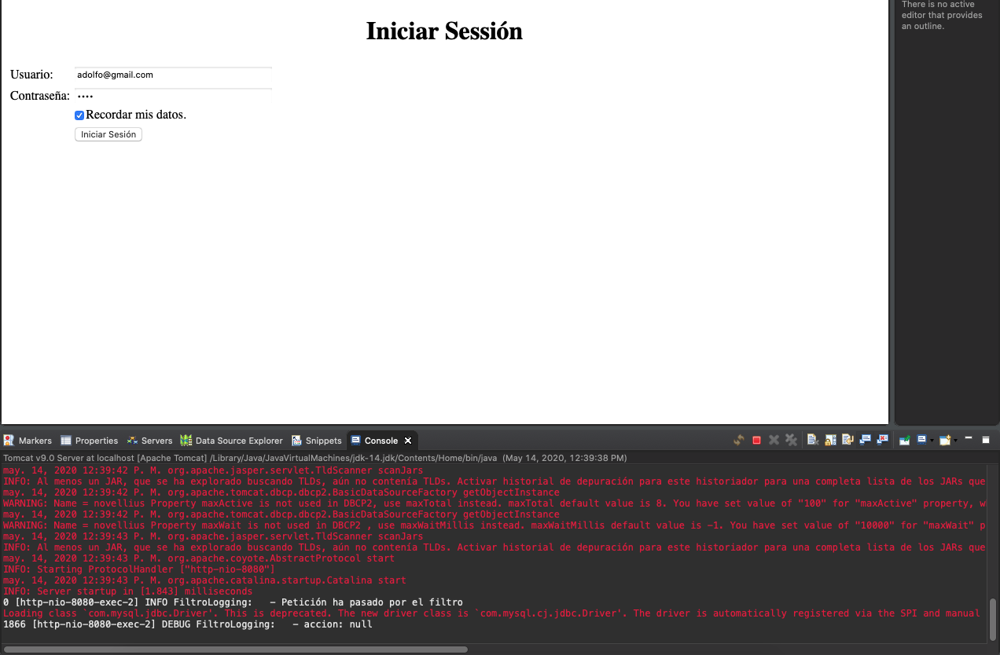

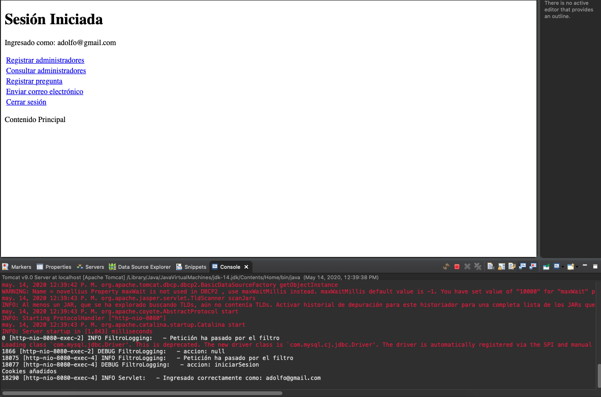

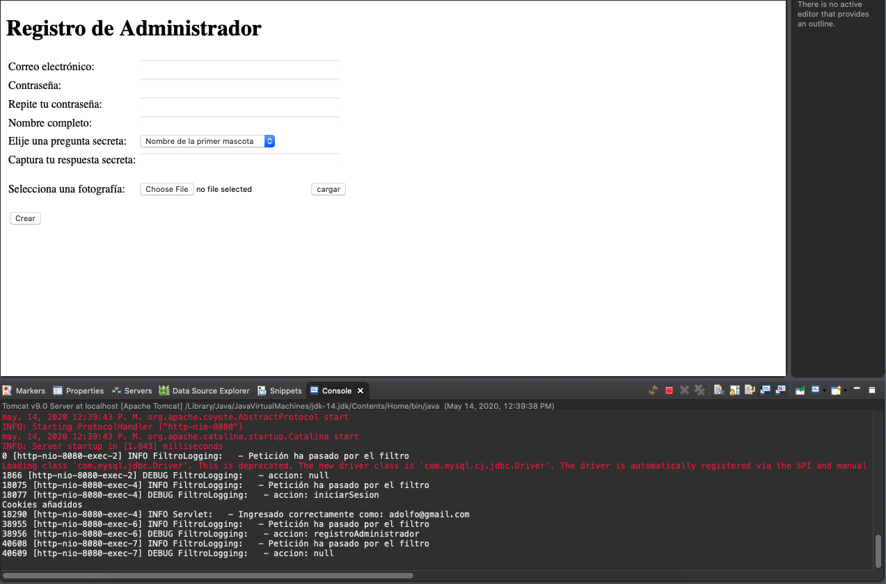

Si presionamos el botón Crear sin introducir ningún dato se muestran los mensajes de validación.

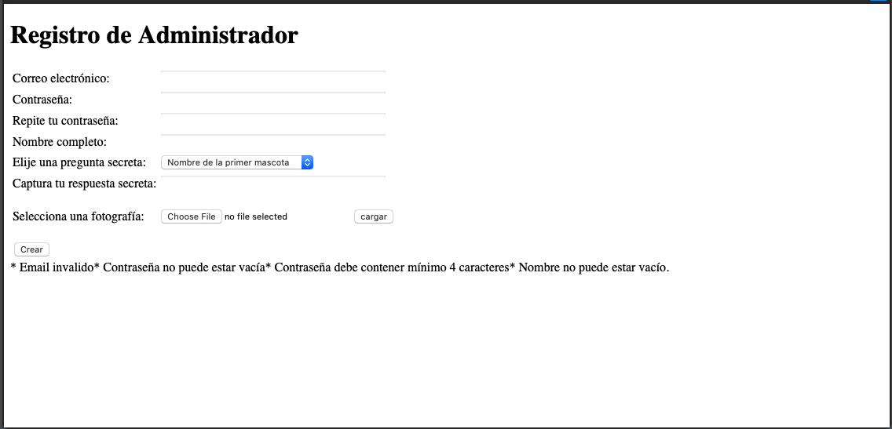

Si metemos una validación de menos de 3 caracteres muestra estas validaciones

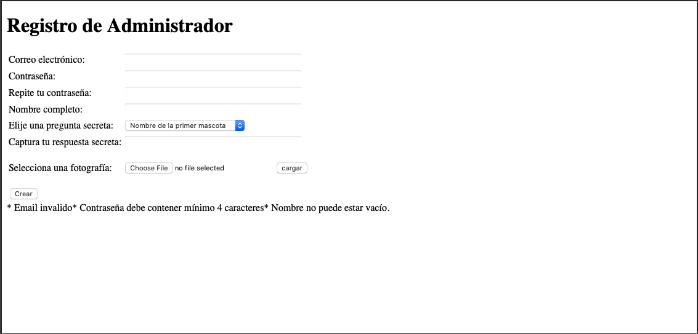

si se mete una contraseña de 4

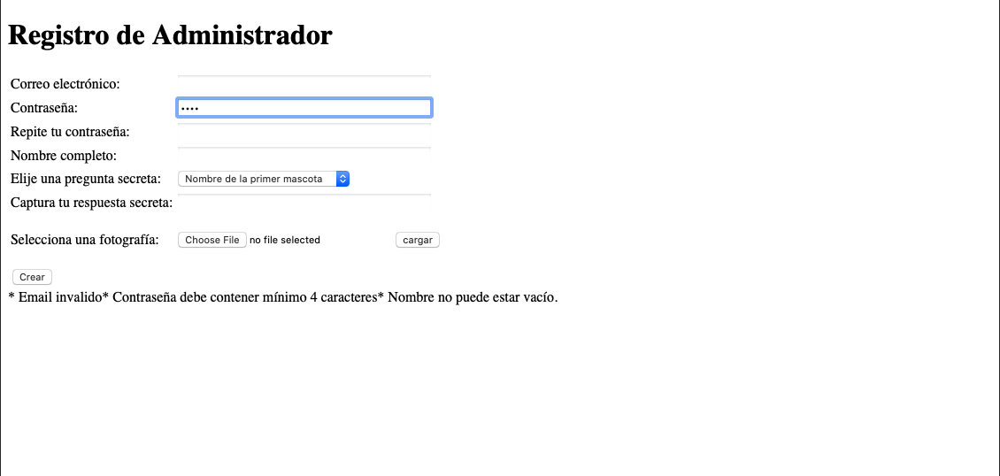

Solo muetra las validaciones de email y nombre


Si metemos un email invalido


Muestra la validación


si metermos todos los datos


Nos indica que el administrador a sido dado de alta 


Y vemos el registro en la BD.

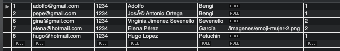

## Validando los datos en el cliente con JQuery 18:55

En esta lección vamos a hacer validaciones de los datos en el cliente con JQuery. Nos vasaremos en el siguiente proyecto para hacerlo igual en nuestro formulario de registrar Administradores.

[A jQuery inline form validation, because validation is a mess](http://www.position-absolute.com/articles/jquery-form-validator-because-form-validation-is-a-mess/)

[Descargar el proyecto](https://github.com/posabsolute/jQuery-Validation-Engine)

1. Copiar de la carpeta descargada los archivos `jquery-1.8.2.min.js`, `jquery.validationEngine-es.js` y  `jquery.validationEngine.js`.

2. Crear la carpeta `css` dentro de nuestra carpeta `WebContent`.

3. Copiar en css el archivo `validationEngine.jquery.css`.

4. En nuestro `registroAdministrador.jsp` importamos los `js` y `css` copiados.

```html
script type="text/javascript" src='<c:url value="/js/jquery-1.8.2.min.js" />'> </script>
<script type="text/javascript" src='<c:url value="/js/jquery.validationEngine-es.js" />'> </script>
<script type="text/javascript" src='<c:url value="/js/jquery.validationEngine.js" />'> </script>

<link rel="stylesheet" href='<c:url value="/css/validationEngine.jquery.css" />' type="text/css"/>
```

5. Insertar el siguiente código en el tag `head`.

```html
<script>
jQuery(document).ready(function(){
   // binds form submission and fields to the validation engine
   jQuery("#formValidado").validationEngine();
});

</script>
```

6. Identificar mi formulario con el `id=formValidado`

`<form action="?accion=registrarAdministrador" method="post" id="formValidado">`

7. Meter las clases a los campos que quiero validar

```html
<form action="?accion=registrarAdministrador" method="post" id="formValidado">
	
		<table>
			<tr>
				<td>Correo electrónico: </td>
				<td><input class="validate[required,custom[email]]" type="text" name="email" size="40"></td>
			</tr>
			<tr>
				<td>Contraseña: </td>
				<td><input type="password" class="validate[required,minSize[4]]" name="contrasena" size="40"></td>
			</tr>
			<tr>
				<td>Repite tu contraseña: </td>
				<td><input class="validate[required,equals[contrasena]]" type="password" size="40"></td>
			</tr>
			<tr>
				<td>Nombre completo: </td>
				<td><input class="validate[required,custom[onlyLetterNumber]]" type="text" name="nombre" size="40"></td>
			</tr>
			<tr>
				
				<td>Elije una pregunta secreta: </td>
				<td>
					<c:catch var="ex">
					   <!-- Ejecutar query, usa la variable creada para formar el query -->
					   <sql:query var="rs" dataSource="jdbc/novellius">
					      SELECT * FROM pregunta;
					   </sql:query>
					
					   <!--  Recorre los datos recuperados y pinta el campo pregunta -->
					   <select name="pregunta">
					   		<c:forEach var="row" items="${rs.rows}">
					     		<option value="${row.idpregunta}">${row.pregunta}</option>
					   		</c:forEach>
					   </select>
					</c:catch>
					
					<c:if test="${ex != null}">
					   <span style="color:red;">*** Error en la conexión con la tabla "pregunta" ***</span>
					</c:if>
				</td>
			</tr>
			<tr>
				<td>Captura tu respuesta secreta: </td>
				<td><input class="validate[required]" type="text" name="respuesta" size="40"></td>
			</tr>
			<tr>
				<td>Selecciona una fotografía: </td>
				<td>
					<p> 
				    <input type="file" id="file"/> 
				    <input type="button" value="cargar" onclick="cargarImagen();" />
				    </p>
				    <p id="respuesta" style="font-weight:bold;"></p>
				</td>
			</tr>
			<tr>
				<td><input type="submit" value="Crear" /></td>
				<td></td>
			</tr>
		</table>
	</form>
```

### Probar la Aplicación

Podemos ver los diferentes mensajes según los datos que se introduzcan

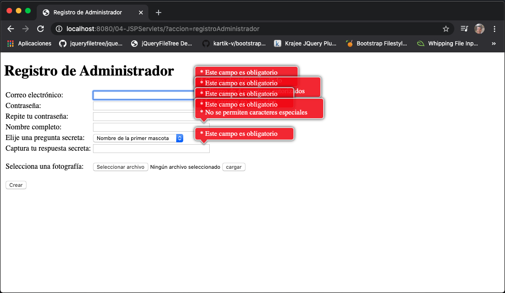

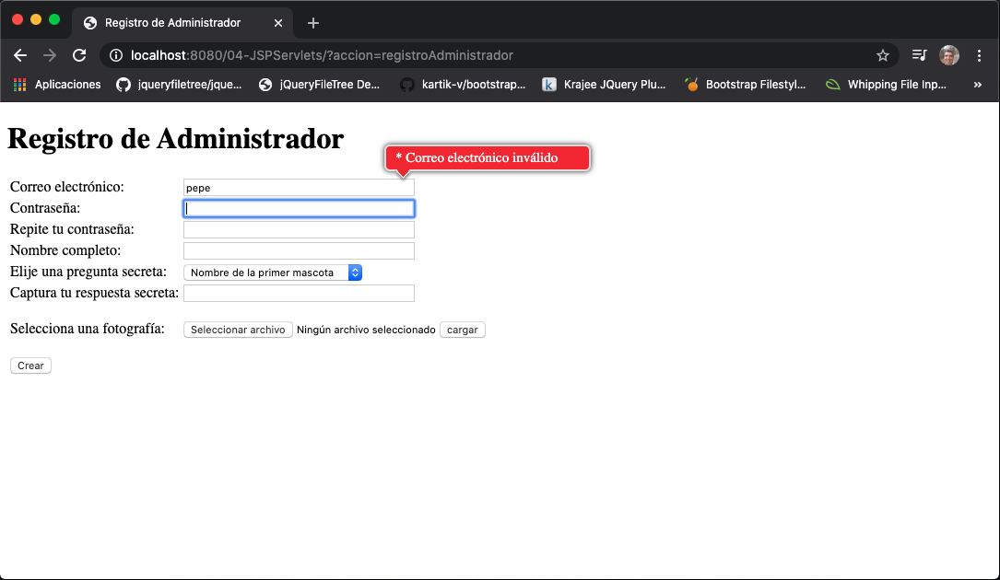

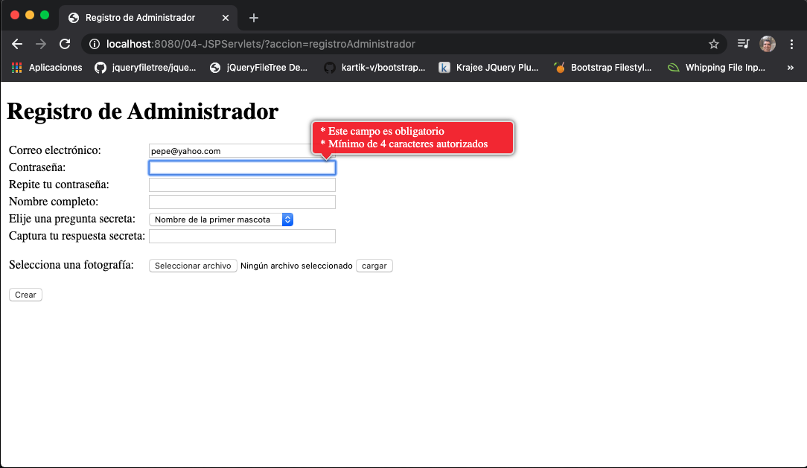

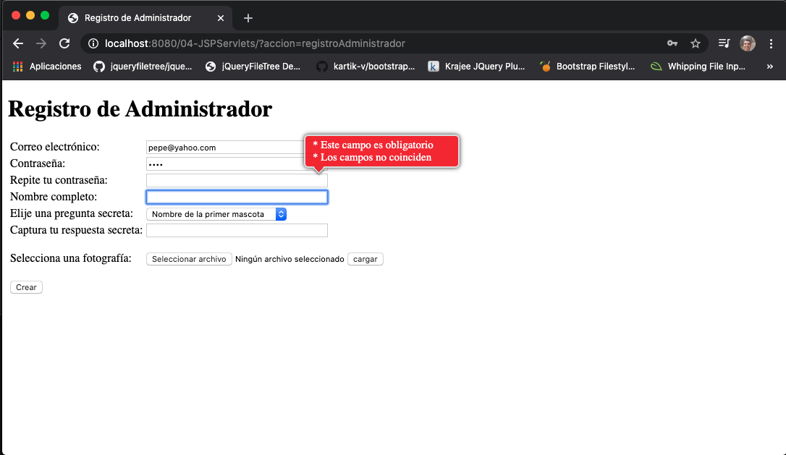

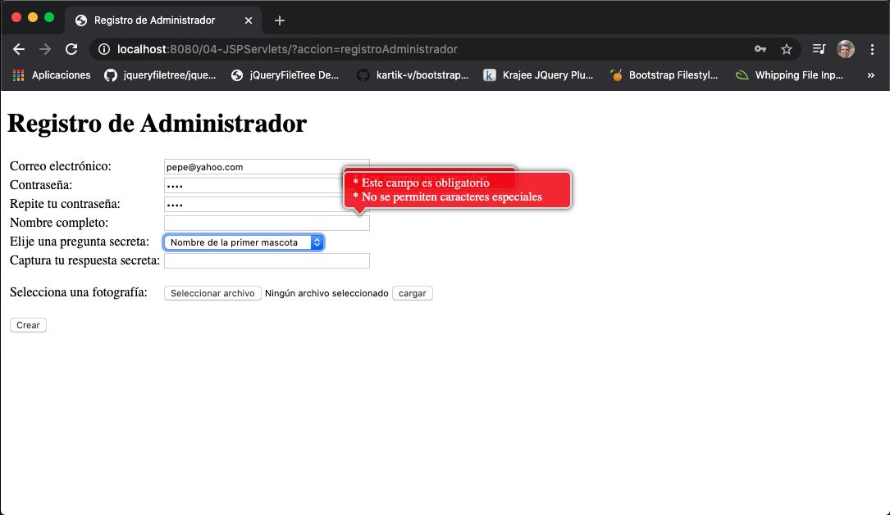

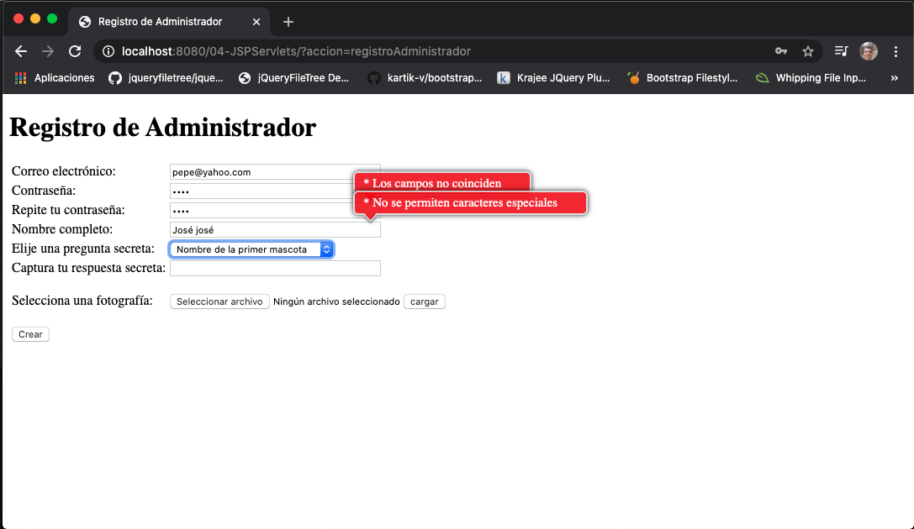

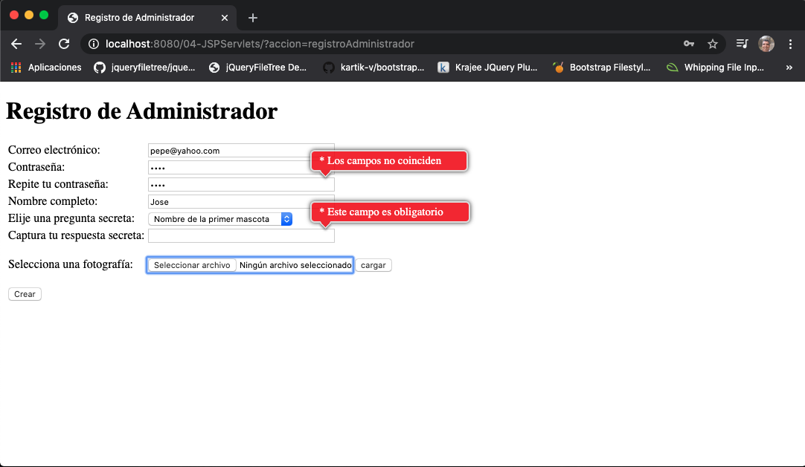

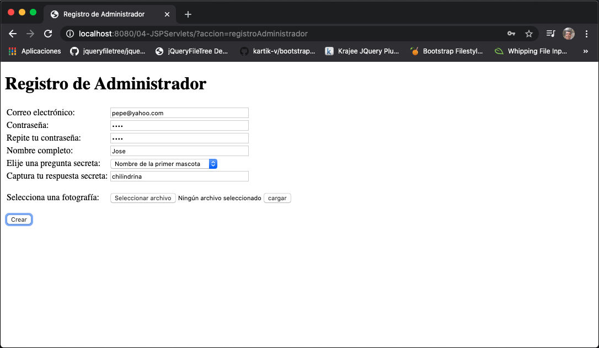
