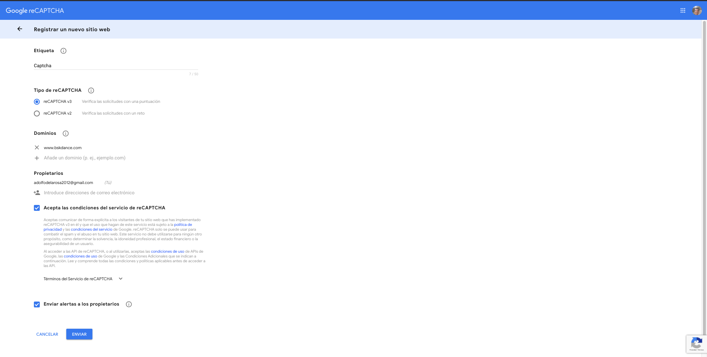
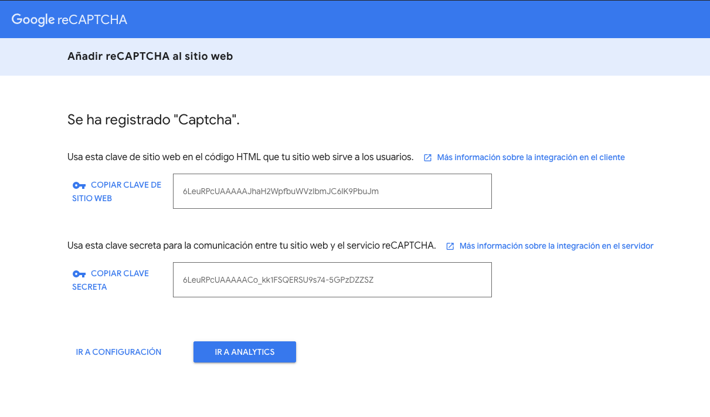
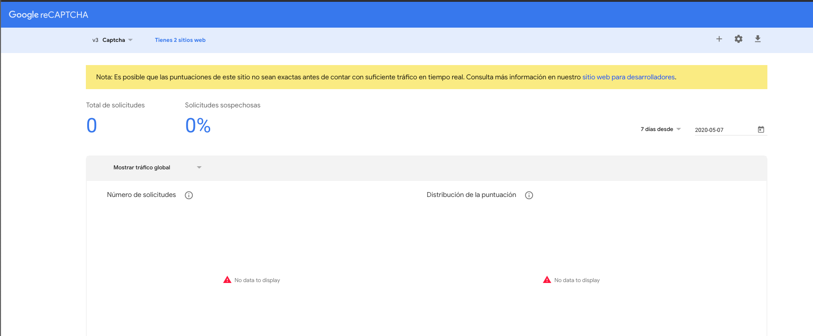
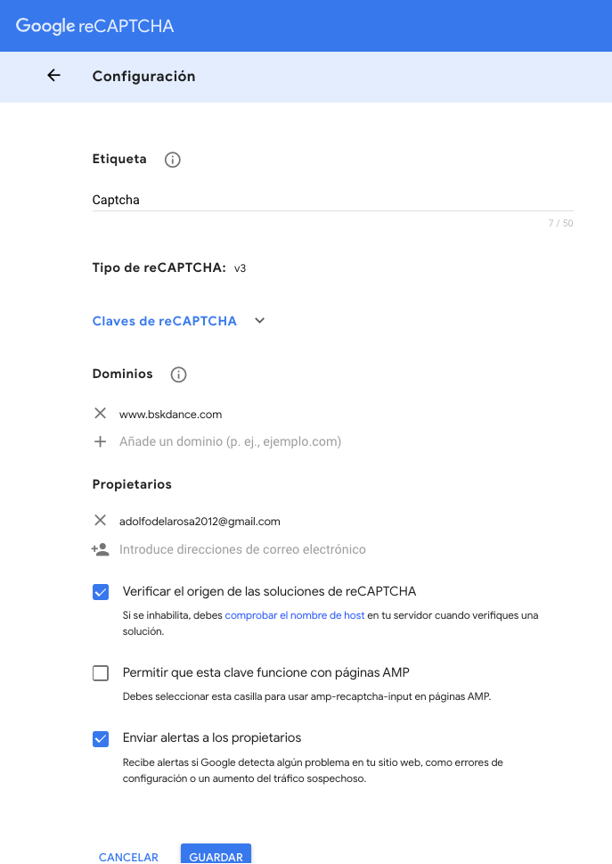
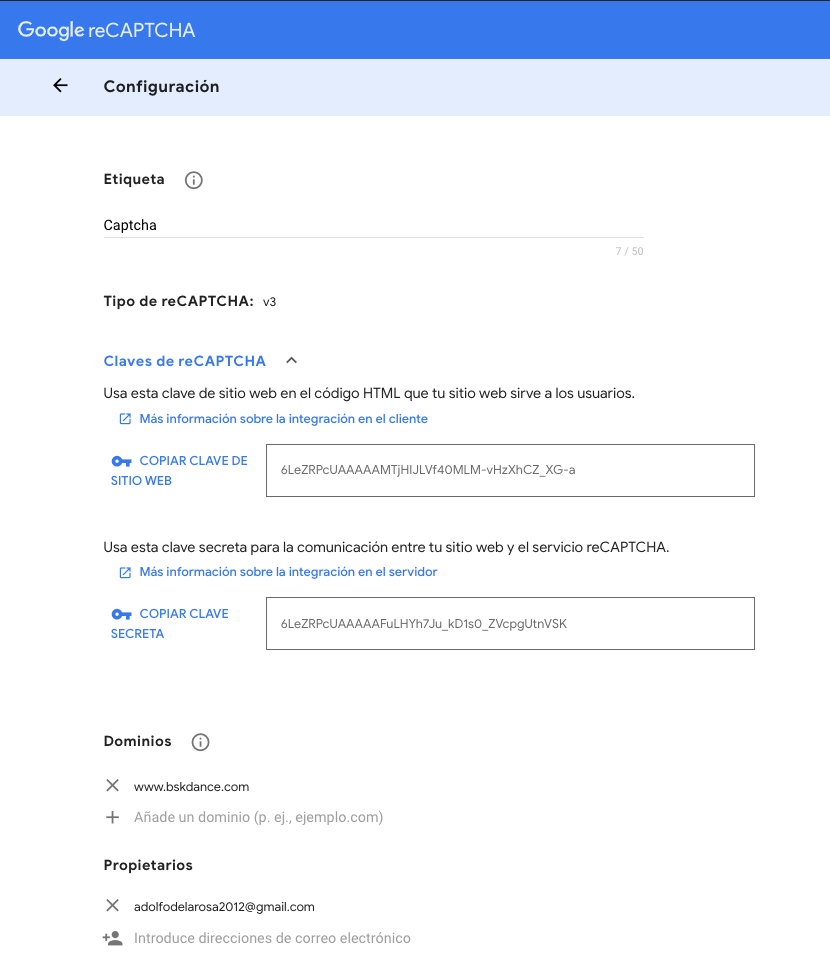

# 11. Google ReCaptcha 13:37

* Como crear una cuenta y obtener Google ReCaptcha 02:36
* Mostrando el ReCaptcha al usuario 04:14
* Verificando la respuesta del usuario 06:47

## Como crear una cuenta y obtener Google ReCaptcha 02:36

CAPTCHA

Weaponhealth Captcha o simplemente CAPTCHA son las siglas de Completely Automated Public Turing test to tell Computers and Humans Apart (prueba de Turing completamente automática y pública para diferenciar ordenadores de humanos).​ Son pruebas desafío-respuesta controladas por máquinas (no es necesario ningún tipo de mantenimiento ni de intervención humana para su realización, y es implementado en un ordenador) que son utilizadas para determinar cuándo el usuario es un humano o un programa automático (bot). 

Para poder usar un Captcha hay que registrar un sitio para que nos genere una clave pública y una clave privada que usaremos más adelante en nuestro código.

1. Entrar al sitio [Google reCAPTCHA](https://www.google.com/recaptcha/intro/v3.html)

2. Presionar el botón `admin console`

3. Introducir un sitio donde usaremos el captcha

   
   
4 . Nos genere una clave pública y una clave privada  

   

5. Se ha creado nuestra configuración

   
   
6. Si pulsamos el engrane podremos ver la configuración de nuestro captcha.

   
   
   
   
7. Si presionamos en [Más información sobre la integración en el cliente](https://developers.google.com/recaptcha/docs/v3) nos llevara a la documentación oficial de Google reCaptcha, donde se nos indican las instrucciones para integrar el Captchat en nuestro sitio web.   

## Mostrando el ReCaptcha al usuario 04:14
## Verificando la respuesta del usuario 06:47
