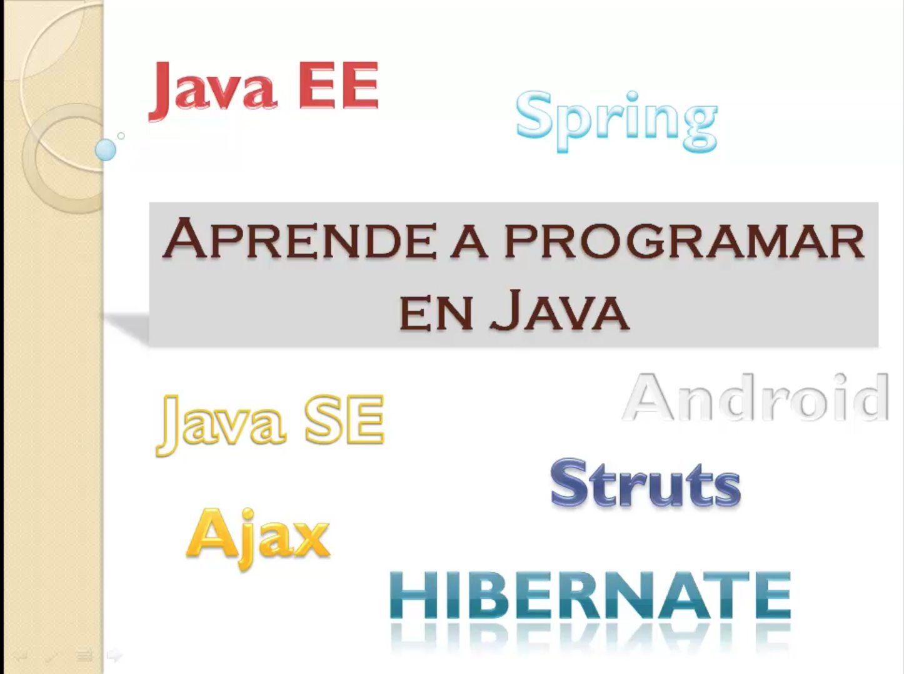
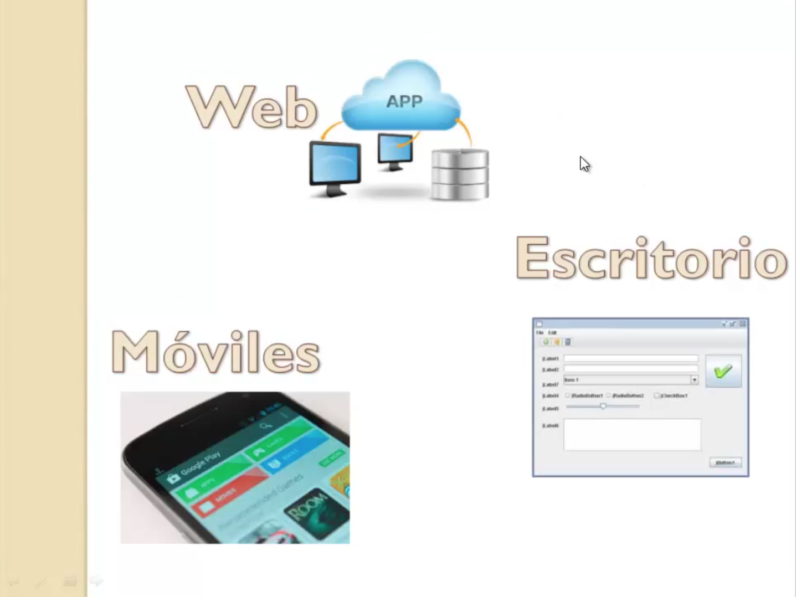
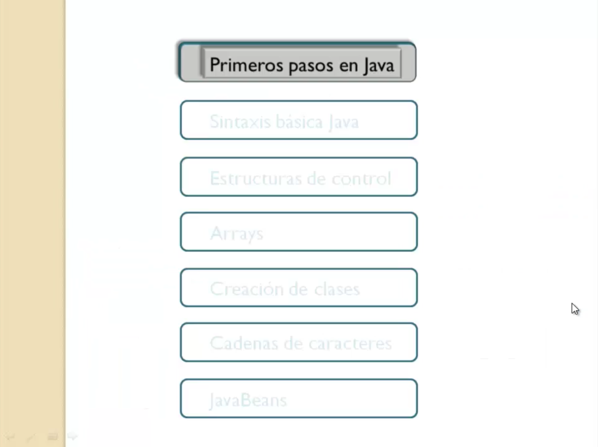
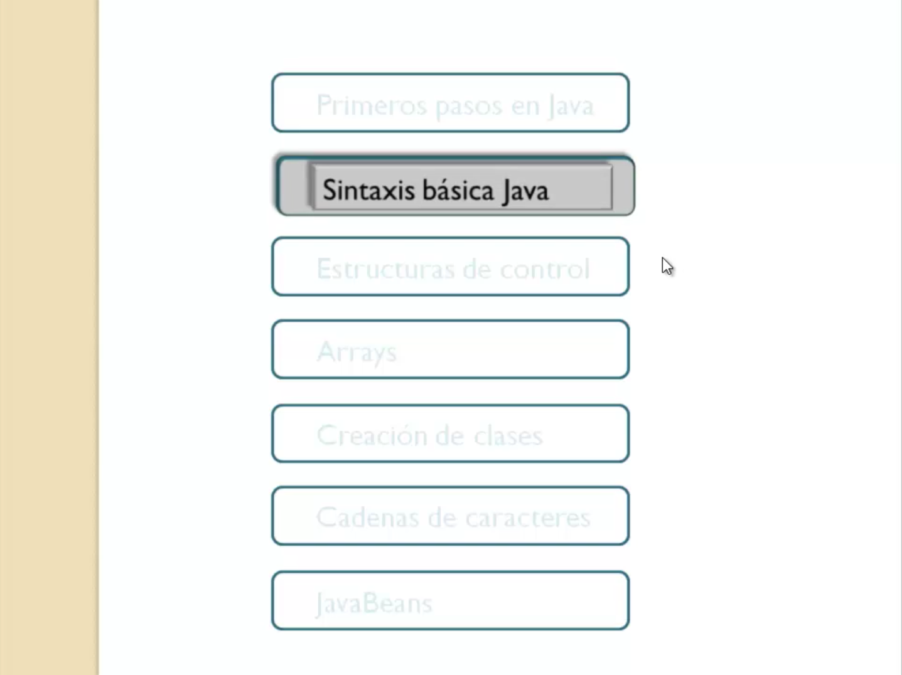
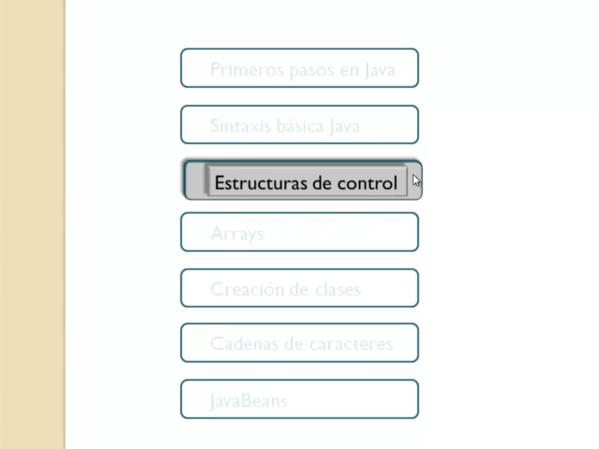
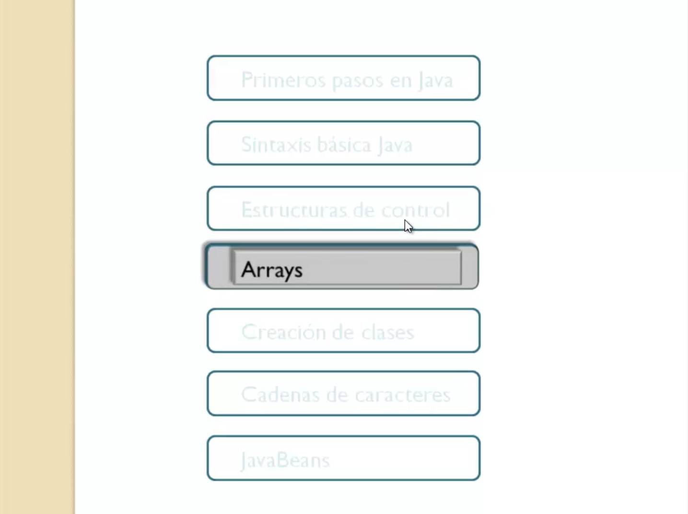
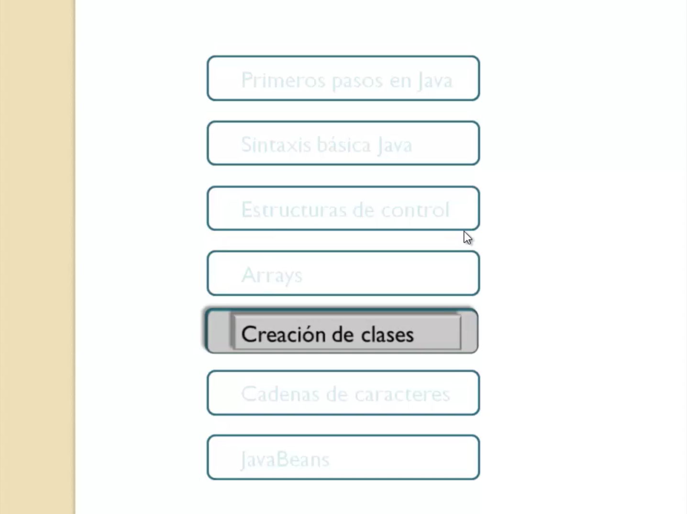
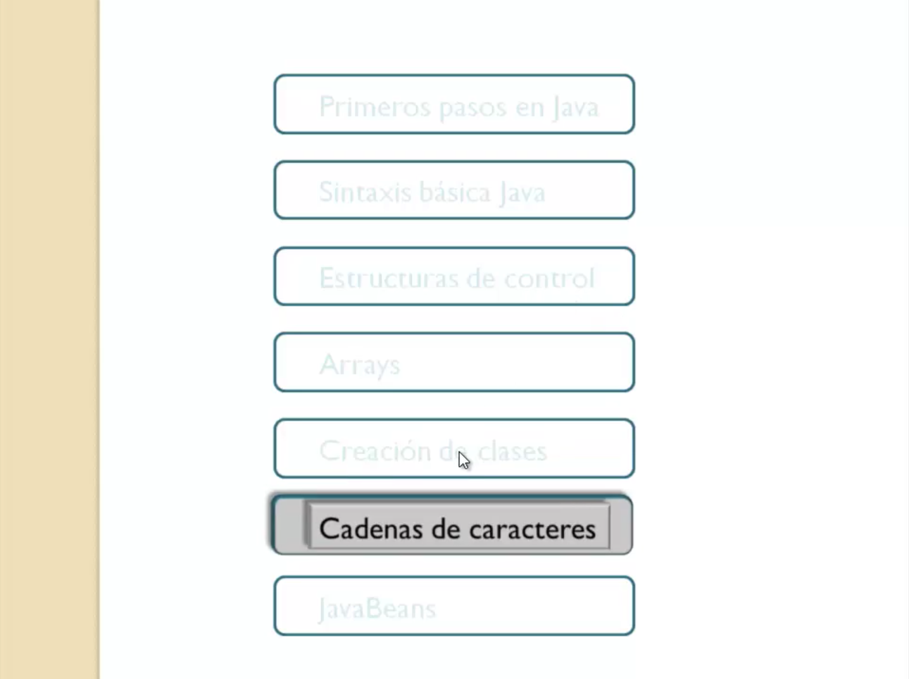
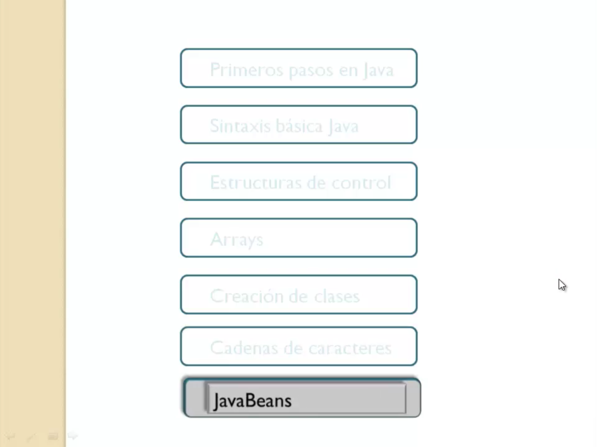

# 0. Presentación del curso 05:59
   * 00 Presentación del curso 05:59
   
# 00 Presentación del curso 05:59

Quiero darte la bienvenida a este curso de aprende a programar en Java. El ecosistema Java es muy amplio va desde Java estándar, Java Enterprise, Android, Spring. Java como sabéis es el lenguaje de programación más utilizado por la comunidad de desarrolladores a nivel mundial.

Muchas de las aplicaciones que utilizamos en el día a día están desarrolladas en Java, con Java puedes crear todo lo que serían los programas llamamos aplicaciones web es decir correo electrónico, buscadores, tienda virtual lo que estamos acostumbrados a utilizar en el día a día a través de nuestros navegadores.

También programas de escritorio que son aquellos programas que se instalan en nuestros equipos basados en ventanas con sus elementos gráficos y como no también aplicaciones para dispositivos móviles. Quién no tiene un teléfono Android con alguna o varias aplicaciones instaladas. Todos estos tipos de programas se pueden crear en Java.

Obviamente hay otras tecnologías para construir programas de estas características pero evidentemente Java es el lenguaje más utilizado.

¿Qué voy a aprender yo en este curso?

Voy a aprender a desarrollar todo este tipo de programas. Para crear un programa de escritorio web móvil etc. se necesitan dos cosas un lenguaje de programación Java y lo que llamamos una API o un conjunto de APIs que no es ni más ni menos que un juego de librería de utilidades que se utilizan para poder construir estos programas. Lo que vamos a aprender en este curso es la base de todo el lenguaje Java. Te voy a enseñar a programar en Java a conocer la sintaxis del lenguaje y a utilizarlo para construir aplicaciones obviamente ya en cursos posteriores ya más específicos irás aprendiendo cómo utilizar el API para desarrollar aplicaciones escritorio, aplicaciones web etc., pero el punto de entrada por donde alguien cualquier persona que quiera aprender Java a programar en Java tendría que empezar con este curso. Así siempre has pensado bueno quiero aprender a hacer programas Java pero no sé por dónde empezar pues este es el punto de comienzo este curso que vas a empezar ahora mismo y cómo tenemos dividido el curso.

Bueno lo tenemos dividido en siete secciones, en una primera sección primeros pasos en Java, vamos a aprender a configurar nuestro entorno de desarrollo, primeros conocimientos sobre la plataforma Java, las ediciones que hay etc. y haremos un primer programa para familiarizarnos con el lenguaje.

Después ya entramos en el estudio de la sintaxis básica de Java los tipos de datos y las instrucciones básicas para empezar ya con las estructuras de un programa.

A partir de ahí ya entramos en las estructuras de control, todo lenguaje de programación dispone de instrucciones, estructuras de control para controlar el flujo de ejecución del programa, lo que vamos a ver en esta sección, todo adornado con bastantes ejercicios prácticos pues es cómo crear estas instrucciones, cuáles hay, qué tipos existen y las que se deben utilizar en cada caso.

Después pasaremos a estudiar los arrays, cualquier programa de lenguaje de programación utiliza arrays para manejar conjuntos de datos. Vamos a ver en Java cómo podemos trabajar con este tipo de estructuras.

Las clases es digamos el corazón de un programa Java, saber distinguir el concepto de clase, de objetos, métodos, cómo estructuran nuestros programas en clases, es algo fundamental y que digamos muchos programadores les cuesta trabajo llegar a adquirir esa práctica. Lo que pretendemos en esta sección es que aprendas a diferenciar lo que es la clase el objeto y también a ir pensando en cómo estructurar tus programas en clases.

Después vamos a analizar el mundo de las cadenas de caracteres. Digamos que podemos decir que cualquier programa de los que te he comentado antes con aplicaciones web, de escritorio móviles, etc. en cualquiera de sus tipos de aplicaciones una de las tareas más habituales es manipular cadenas de caracteres, como se hace en Java eso es lo que vamos a estudiar aquí.

Obviamente cada sección siempre se apoya en todo lo que vas aprendiendo en secciones anteriores.

Y por último, el último tema que hemos dedicado a este curso de aprende a programar en Java de conocimiento y la sintaxis es la utilización de Java Beans que es una clase muy habitual que se utiliza en muchos programas para encapsular tipos básicos. Es lo que en otro lenguaje se conoce como un tipo estructurado, pues en Java lo llamamos Java Bean y se utiliza muchísimo y vamos a ver aquí cómo crearlos y cómo manejarlos dentro de un programa.

Bueno pues esto va a ser la manera en la que vamos a estructurar este curso, que consta de unas treinta y una lecciones aproximadamente,  en varias de las lecciones se propone la realización de una serie de ejercicios propuestos, que los puedes encontrar en uno de los apéndices del curso, al finalizar esas lecciones pues te recomendará un ejercicio determinado que estaría muy bien que lo realices para ir afianzando todos los conceptos que te va ir enseñando a lo largo de este curso.
