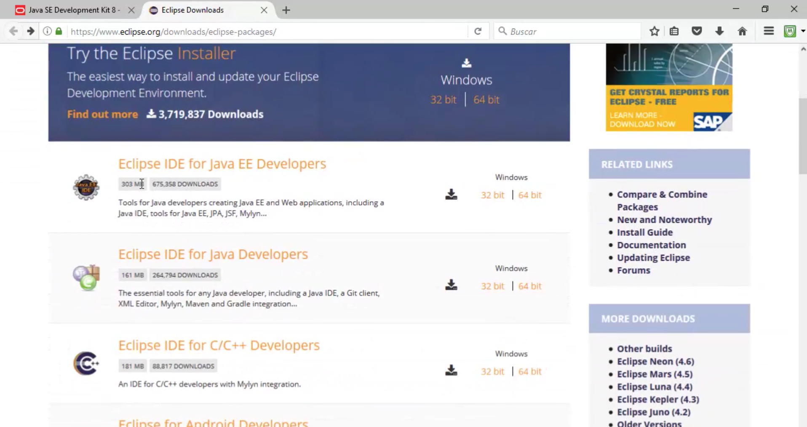

# 1. Primeros pasos en Java 30:26
   * 01 Introducción a Java 08:16
   * 02 Software necesario  05:12
   * 03 Primer programa en Java 10:11
   * 04 Reglas sintácticas y estructura de un programa Java 06:47
   
# 01 Introducción a Java 08:16

Hola en este primer video del curso te voy a introducir en algunas de las características fundamentales de lo que sería la tecnología Java no sólo el lenguaje sino todo lo que le rodea en general.

Lo primero que tenemos que ver es que Java es un lenguaje que fue desarrollado a mediados de los años noventa por la empresa Sun Microsystems. 

Es un lenguaje orientado a objetos que ya iremos viendo poco a poco a largo del curso que significa eso pero bueno entonces no había muchos lenguajes orientados a objetos, cuando apareció Java estaba C++, SmalTalk y era una característica interesante para un nuevo lenguaje de programación.

Pero quizá lo más importante es que Java es un lenguaje de programación multiplataforma, ahora en un momento vamos a ver qué significa eso.

También muy importante que sepamos y lo tendremos que tener en cuenta siempre que Java no es solamente un lenguaje. Cuando hablamos de Java estamos hablando de un lenguaje de programación, sí pero también de un conjunto de librerías de objetos que tenemos a nuestra disposición para poder hacer los programas.

También comentarte que Java ha ido evolucionando a lo largo de estos veintitantos años desde la versión 1 que apareció a mediados de los noventa hasta la 1.8, actualmente la 1.14.

Bien pues te decía que una de las principales características por no decir la principal es que Java es un lenguaje multiplataforma, qué significa eso, pues que tú puedes desarrollar un programa, compilarlo y una vez compilado ejecutarlo en cualquier parte, es decir en cualquier sistema operativo, algo totalmente novedoso en la época en la que apareció Java porque hoy en día hay algún otro lenguaje también que tiene esta característica.

Tú desarrollas un programa en Java, lo que tendríamos es un código fuente un archivo con Java y a partir de ahí cuando se compila para que pueda ser ejecutado por el ordenador, se genera los llamados Byte Codes, archivos con extensión `.class` estos archivos no son como los ejecutables clásicos, los `.exe` que solamente se pueden ejecutar en aquella máquina para la que se han compilado, sino que un Byte Codes `.class` puede ser ejecutado en cualquier sistema operativo. Cómo es posible eso. Eso es gracias a la máquina virtual Java JVM. Has oído hablar de alguna vez verdad.

La máquina virtual Java no es más que un software, una especie de extensión del sistema operativo que de lo que se encarga es de traducir en tiempo de ejecución, es decir cuando tú le dices ejecutar este programa Java, lo que hace la máquina virtual Java es traducir ese `.class` a lo que sería ya el ejecutable puro del sistema operativo para el cual estás realizando la ejecución del programa.

Entonces todas las máquinas virtuales, porque hay máquinas virtuales para cada uno de los distintos sistemas operativos que tenemos hoy en día, máquina virtual para Windows, para Linux, para Solaris, todas funcionan igual traducen el `.class` a digamos el código binario propio de ese sistema operativo.

Eso permite pues eso cuando haces un programa no tener que estar preocupándote de si esto va a ir para Windows o para Linux porque ese resultado de la compilación se podrá ejecutar en cualquier sistema operativo.

Esta característica que entonces en aquellos años era muy muy novedosa pues hizo que Java fuera aceptado por gran cantidad de fabricantes software de la época como Oracle, IBM etc.

Otra de las características que hemos mencionado es que es un lenguaje orientado a objetos. Bueno eso tiene muchas implicaciones ya que a medida que vayas aprendiendo Java ya las irás viendo porque no es una cosa, no es cuestión de un momento, pero bueno de momento decirte que una de esas características de los lenguajes orientados a objetos es que a la hora de hacer un programa Java, tu puedes hacer uso de múltiples objetos.

¿Qué son realmente los objetos? puedes imagínatelo como una especie de cajas negras, en su interior tenemos unas funciones o métodos que realizan tareas, entonces programar en Java es realmente ir cogiendo esos objetos y llamando a esas funciones a métodos de uno y otro y a partir de ir confeccionando la tarea realizada.

Esa es una de las características de los lenguajes orientados a objetos, el hecho de usar objetos ya creados, cajas negras con sus funciones para hacer tareas pero hay más implicaciones que ya las irás aprendiendo.

Java es más que un lenguaje ya lo hemos dicho al principio cuando hablamos de Java no solamente es un lenguaje de programación, eso es digamos una pequeña parte de ese mundo pero muy importante por supuesto, de hecho en este curso nuestro objetivo es eso enseñarte el lenguaje Java a utilizar las estructuras sintácticas de ese lenguaje, pero el mundo Java es algo más que su lenguaje y son librerías de objetos, son los objetos como los que te he enseñado en la transparencia anterior objetos que te van a permitir hacer un montón de cosas, como acceder a base de datos, realizar operaciones de entrada salida, comunicar aplicaciones con el exterior, generar páginas web lo que se te ocurra porque hay miles y miles de tipos de objetos a nuestra disposición para hacer los programas.

Algunos nombres de librerías clásicas son JDBC para acceder a base de datos, Util para utilidades, IO entrada-salida, Net para comunicaciones hay muchísimas más y a lo largo de tu vida de aprendizaje de Java irás conociendo muchas de esas librerías.

Por último en esta introducción quería comentarte lo que llamamos las ediciones Java. Vamos a ver son tantísimas las librerías de clases, de tipos de objetos, definitiva a nuestra disposición a la hora de hacer aplicaciones que Sun Mycrosystems cuando empezó a ir creando y más y más de esos tipos de objetos o clase como se le llama tuvo que hacer una división, una organización, todo ese conjunto de clases de tipos de objetos que tenemos pues se dividen en tres grandes bloques aunque aquí hay cuatro.

El primer bloque **Java Standar Edition Java SE** este conjunto de tipos de objetos o librerías de clase forman todo lo que es las clases de uso general que se utilizan para hacer cualquier programa y muy especialmente si te vas a dedicar a hacer lo que se llamarían los programas de escritorios, es decir las típicas aplicaciones los típicos Programa basados en Ventanas donde se instala el programa en la máquina donde va a ser utilizada por el usuario tipo Word o algún programa de ese tipo, eso es lo que se conoce como una aplicación de escritorio todo lo necesario para crear esos programas están en Java Standar Edition Java SE.

**Java Enterprise Edition Java EE** probablemente la versión más importante, porque aquí encontramos todo lo necesario para poder crear aplicaciones para entornos web, que es digamos donde Java está más especializado en creación de aplicaciones para web como el típico Gmail, Hotmail, aplicaciones tipo tienda virtual, es decir todo lo que utilizas a través de la web son aplicaciones web, ese tipo de programas se pueden construir con Java utilizando el conjunto de objetos proporcionados por el Java Enterprise Edition.
 
Tenemos también un **Java Micro Edition Java ME** especialmente pensado para la creación de aplicaciones para dispositivos electrónicos.

Y por último comentarte **Android** no podríamos decir que es una edición de Java porque no fue lanzada por Sum Microsystems sino por Google, que es la librería de clases o el tipo de objetos Android especialmente pensado como sabes para crear programas que se van a ejecutar en los smartphones, tabletas y dispositivos electrónicos que tengan ese sistema operativo de Google que es Android.

Tenemos clases para crear cualquier tipo de aplicación es decir con Java se van a poder realizar y desarrollar cualquier tipo de programa que puedas imaginar cómo ves el reto que tienes por delante es muy interesante y muy apasionante, animo.

# 02 Software necesario  05:12

Bueno pues después de haber introducido la lección 1 a la tecnología Java imagino que estarás deseando ya ver como hacen tus primeros programas con este lenguaje.

Bien con lo que vamos a ver en esta leccion es qué software necesitamos instalar en nuestros equipos para poder crear programas Java y probarlos.

Son fundamentalmente dos tipos de programas los que vamos a necesitar para poder programar en Java con nuestro ordenador. Por un lado tenemos lo que se conoce como el JDK Java Development Kit, que es el conjunto de herramientas básicas para poder crear un programa Java, compilarlo, testearlo, esas herramientas las proporciona Oracle, no te lo dije en la lección anterior pero Microsystems es la empresa que inventó Java, desarrollo Java pero fue comprada posteriormente por Oracle y actualmente Oracle el que gestiona todo Java, todas las ediciones, las versiones etc. Entonces desde la página web de Oracle vamos a poder descargar ese JDK con las herramientas básicas, que las podríamos utilizar nosotros desde línea de comandos para poder compilar nuestros programas, ejecutarlos, pero eso es una cosa un poquito rudimentaria y lo normal lo habitual es que los programadores utilicen un segundo programa conocido como entorno de desarrollo, el IDE que de una forma más sencilla a través de menús, botones en barra de herramientas, etc. te permite hacer todas esas operaciones. Por debajo los entornos de desarrollo utilizarán el JDK.

Como te decía el Java Development Kit nos incluye todo lo necesario para programar en Java. ¿Qué ncluye realmente el JDK? Por supuesto la Máquina Virtual Java, la librerías de clases o de tipos de objetos de lo que se conoce como Java Estándar que lo vimos en la lección anterior y unas herramienta básica que se utilizan en línea de comandos para compilar y ejecutar los programas.

Desde donde vamos a descargar el JDK desde esta dirección.

Vamos a verla en el navegador, esta es la dirección. Como veis al entrar tenemos este botón que dice download Java.

Y aquí vemos todas las posibles descargas que podemos hacer del JDK en función del sistema operativo que tengamos, tenemos para Linux, para Solaris, para Windows por supuesto, no es más que un `exe` lo descargamos, lo ejecutamos y vamos siguiendo todos los pasos, las opciones que vienen por defecto, sin tener que modificar nada y ya con eso tendríamos el JDK instalado en nuestro equipo.

Habitualmente mira donde se te va a instalar en el caso de Windows por ejemplo que es lo que tengo yo en los archivos de programa Java ves aquí está JDK, bueno yo tengo varios pero bueno este sería el actual JDK 8, está JDK 9 a punto de salir también en cualquiera de los dos JDK.

 pues como veis el 8 1.8 tiene aquí una serie de carpetas.

En fin es donde están estos EXE Java C Java que son las herramientas básicas que te comentaba desde línea de comandos para poder compilar un programa ejecutarlo terminaba de la máquina virtual pero vaya que nosotros no vamos a utilizar esos comandos de esa manera los vamos a utilizar a través del entorno de desarrollo entorno de desarrollo pues es un programa que te facilita la creación de tus propios programas Java combinándolos ejecutándolo utiliza por debajo el JDK pero para ti como programador te va de resultar mucho más sencillo su uso puesto que lo vas a utilizar como un programa con el que utilizar Word o cualquier otro programa de escritorio.

Cuáles son los entornos de desarrollo o ides que se les llama también más habituales.

Pues tenemos en Nevins muy sencillo de manejar y el eclipse que es el que se utiliza mayoritariamente por la comunidad de programadores desarrolladores Java Eclipse lo vas a poder descargar desde esta dirección.

Si nos vamos al navegador que tengo también esa dirección aquí verás que al entrar en ella tienes una serie de opciones Eclipse IDE Java Developer Java etc..

Yo te recomiendo que te descargues está el Eclipse IDE por Java Java Developers.

Por qué.

Porque este te va a permitir crear no solamente los programas de Java estándar sino también incluye toda una serie de plantillas menús etcétera para desarrollar aplicaciones web con Java.

Acuérdate que lo decíamos en la lección 1 la edición Java Enterprise Edition es la que te permite crear aplicaciones web por lo tanto está mucho más completo que ésta.

Si por ejemplo optamos por 64 bit por lo que nos vamos a encontrar es la descarga de un ZIP es decir el eclipse no es más que un archivo zip lo imprimimos y una vez que esté descomprimido verás que hay una carpeta.

Se llama eclipse donde tienes ahí el eclipse punto ExE que luego te puedes crear un acceso directo al escritorio como tengo yo por aquí y simplemente ejecutándolo ya directamente entrarás en el entorno de desarrollo.

El siguiente video vamos a ver precisamente como crear nuestro primer programa una vez que tengamos instaladas estas herramientas.

# 03 Primer programa en Java 10:11

Muy bien.

Estás listo para crear tu primer programa Java.

Yo creo que sí.

Si ya tienes instalada las herramientas que comentábamos en el video anterior pues venga vamos a lo que vamos a hacer es iniciar el entorno de desarrollo Eclipse.

Vale si ya te has creado un acceso directo al escritorio.

Bueno pues si no te vas a la carpeta donde lo hayas descomprimido doble click y se ejecutaría en Eclipse punto ExE al ejecutarse al cabo de un ratito te va a aparecer esta ventanita.

Este cuadro de diálogo en el que te pide que selecciones lo que se llama el Workspace qué es eso.

Espais no es ni más ni menos que una carpeta de tu disco donde vas a ir guardando todos los proyectos o ejercicios que se le llama proyectos en Eclipse que vas a ir realizando relativos a un determinado tema.

Por ejemplo si ahora vamos a hacer proyectos de Java básico pues crearíamos en una carpeta en nuestro disco por ejemplo que tenéis aquí ejercicios unaumento a través del botón de buscar la carpeta donde quieres guardar tus ejercicios y a partir de ahí todos los proyectos que se hagan se van a crear en esa carpeta cada proyecto en una carpeta si luego vas a crear otros ejercicios ya Paraguay. vital pues cambiaría de Whores Espais mencionaría otra carpeta diferente y ahí crearían los proyectos relativos a ese otro tipo de programas que vas a realizar.

Bueno nosotros ya hemos seleccionado este Wheres Paix pues venga ok se va iniciando Eclipse la tardanza de lo que te va a arrancar el entorno de desarrollo pues ya depende un poco de las características de tu equipo.

Posiblemente la primera vez que inicias Eclipse tarde un poquito más que el resto de las veces andar configurando algunos archivos etc. Vamos a ver si ahora en mi caso como es bueno pues esto ya aprovecho para contarte Eclipse las versiones que van apareciendo en vez de la 1 la 2 3 le va dando nombres de planetas de satélites en este caso estamos ante la versión Eclipse Mars pero bueno todas son bastante parecidas creo que hay una después de este eclipse Mars que posiblemente me parece que es la Neon que a lo mejor es la que te habrás instalado tú.

Bueno todas funcionan muy parecido bien vamos a maximizar ahora el entorno de desarrollo y bueno la primera vez que entras en un buen Espais como en nuestro caso porque es la primera vez que entramos en este buen Espais estas ventanas no te van a tener que aparecer a ti no Zenani por ser mi juego lo tengo configurado la primera vez que entramos en un buen Espais tenemos una pestaña de bienvenida la cerramos vale y eso solamente va a aparecer la primera del resto de veces te aparecerá ya lo que estás viendo ahora mismo solo que en este proyecto Explorer Explorador de paquetes aquí vas a tener una carpeta por cada uno de los proyectos que tenga ya creado en ese pais.

Vale pero luego ya estas otras pestañas depende de otras opciones que tengas instaladas en Eclipse.

Posiblemente esta no te va a aparecer la voy a cerrar.

Bueno y luego otra cosa importante es qué tipo de programas estoy haciendo yo con Eclipse son programas para web son programas Java estándar.

Por qué digo eso porque todo depende de cómo quieras configurar tu entorno en función del tipo de programas que vas a organizar es lo que se llama la perspectiva ves que perspectiva es simplemente adaptar las ventanitas estas que tienes aquí al tipo de programa que estás haciendo.

Si nosotros ahora mismo tenemos una perspectiva Java la por defecto si nosotros vamos a hacer programas Java estándar Java normal mejor cambiar a otra perspectiva más simple y eso lo hacemos a través de este botoncito que dice Open Perspective llegamos y aparecerá una lista con hay bastantes posibles perspectivas dependiendo de los tipo de programas que vas a estar haciendo.

Vamos a seleccionar la perspectiva Java y entonces se adaptará nuestro entorno a este tipo de programas que vamos a realizar simplemente ves que desaparecen algunas pestañas que no son necesarias para este tipo de programas.

Bueno volvemos vamos a crear nuestro primer programa o proyecto como se le llama en Eclipse como es un proyecto de Java estándar vamos a Feil New y elegimos la opción Java problema que es lo mismo que decir Java estándar value a la legislación Java proyectã aparecerá otro cuadro de diálogo en el que se nos va a solicitar el nombre del proyecto yo lo nombrando por el orden de los proyectos que voy a ir haciendo.

01.

Primer programa y esto es lo que va a hacer es crearnos una carpeta dentro de los países que elegimos aquí al principio ves que te van a coger la versión Java estándar 8 que ya a partir del JDK ya lo han detectado que tienen instalado el siguiente paso no vamos a tener que hacer nada simplemente desinformativo de unas carpetita que se te van a crear ahí dentro del explorador de paquetes para ese proyecto.

Bueno vamos a finish SRC donde va a estar creado el código fuente finalizamos y lo que vamos a hacer es crear nuestro primer archivo de código que es lo que se conoce como una clase porque aquí en Java como vas ir viendo todos los programas se estructuran en clases.

Pero bueno vamos a ir comentando si acaso en la lección si vamos a dar con el botón derecho colocado dentro del proyecto New Class y a esa clase que se va a crear un archivo como el punto Java los archivos de código fuente de Java le tenemos que dar un nombre.

Vamos a llamarle por ejemplo saludo porque el primer programa que vamos a hacer va a ser tan simple como generar el típico mensaje de saludo.

Hola mundo.

Otra cosa distinta a ser un poquito más originales.

Esto de package de momento lo vamos a dejar ahí vacío no vamos a poner nada y vamos a marcar esta casita porque queremos que se nos genere un método una función dentro de esa clase conocido como La función principal o función main método es el punto de entrada a cualquier programa Java como vas a ver después.

Lo voy a explicar en la lección siguiente.

Bueno vamos a finalizar y como vamos a ver ahora pues se nos creará en un momentito la clase y aparecerá aquí.

Bueno no es.

Aquí tienes.

Saludos mundo.

Este es el archivo colgando de tu proyecto proyecto zero 1 primer programa Java Espais y aquí lo tenemos.

Vale esto también es cierto que aparece a lo mejor ahí el tamaño es un poco pequeño y no lo ves bien lo puedes ajustar siempre a través de la opción de menú window Preferences en general apariencia colores y fuentes pues aquí tenemos una opción vamos a ver donde dice Betsy texto fuente del texto la editamos y Reséndez.

Es un tamaño muy pequeñito vamos a pasar a 14 con lo cual sólo veremos un poco mejor lo ajustas a tus necesidades y a lo que más te guste.

El caso es que aquí vemos la estructura de lo que es el club una clase Java public class.

Saludos te lo explicaré mejor en la próxima elección nosotros vamos a ir al grano a hacer nuestro primer programa que va a ser sacar el mensaje de saludo y esa instrucción de sacar el mensaje de saludo voy a.

Hoy eso que aparece ahí todo lo borro directamente y ahí escribo la siguiente instrucción.

Existen cunto o cunto brinda N.N.

Bueno vamos a ir viendo por qué está aquí todavía hoy actualizando algunas cosillas en catalán un poco hoy junto.

Pregunta ln y entre paréntesis y entre comillas el texto que quieres que muestre tu programa Bienvenido a Java con un punto y coma aquí al final has de saber también que si cometes alguno vamos a ir guardando vale si cometes un error de sintaxis porque Java tiene una sintaxis muy rígida como ahora vamos a ir viendo después en las siguientes elecciones.

Por ejemplo se me olvida el punto y coma o alguna cosa así pues ya en seguida el entorno de desarrollo Eclipse te va a ir dando avisos oye que se te falta el punto y coma te va marcando con una crucecita y te va avisando para que lo vayas corrigiendo.

No todos los errores son tan fáciles de detectar como este pero bueno pues este instruccion sistema Punto a Punto Prin LN.

Luego la analizaremos si es la que te hace la función de sacar un mensaje por pantalla y esto dónde va a salir en una ventana.

Bueno es simplemente lo que sería lo que llamamos la consola o ventana de salida es decir son programas que se comunican con el usuario a través de una ventana conocida como la consola que vas a ver ahora quien eclipse un poquito más abajo.

Bien ya hemos hecho nuestro programa al guardar ya automáticamente clips se te va compilando va generando y al punto Clas si tú lo que quieres es ejecutar esto decirle a la máquina virtual Java oye ese punto clave que se ha generado correspondiente a este código fuente ejecuta.

Simplemente quedar aquí al play vale si te aparece esta ventana pues tienes que elegir que esto es una aplicación Java o la aplicación o key y automáticamente la máquina virtual Java va a buscar el método y lo va a ejecutar y mira ese es el resultado de esta pestañita llamada console.

Ahí es donde se saca el mensaje.

Bueno pues por supuesto esto ha sido el primer programa.

No todos los programas evidentemente son tan simple como éste.

Vamos a cumplir dándolos a medida que vayamos aprendiendo cosas.

Pero bueno ya has hecho tu primer ejercicio tu primer programa y nos va a servir para ir cogiendo confianza y aprendiendo todo lo que nos espera que es la verdad.

Muchísimo.

# 04 Reglas sintácticas y estructura de un programa Java 06:47  

En esta elección veremos algunas reglas sintácticas básicas y cómo la estructura de un programa Java en primer lugar hablemos de las reglas sintácticas básicas.

Java es un lenguaje sensitivo.

Qué significa eso.

Pues que hace distinción entre mayúsculas y minúsculas.

No es lo mismo a la hora por ejemplo pues como veremos a declarar una variable o crear una clase utilizar mayúsculas o minúsculas.

Las palabras reservadas que se utilizan en el lenguaje Java tienen una determinada sintaxis de mayúsculas minúsculas que hay que respetar.

Por otro lado todas las instrucciones terminan en punto y coma.

Los bloques de sentencias van a venir delimitados siempre por llaves.

Sólo has visto ya en el ejercicio que vimos en la lección anterior y lo vamos a ir viendo ahora cuando veamos las estructuras básicas del lenguaje.

Y luego está el tema de los comentarios se pueden poner comentarios en un programa para indicar determinadas notas que le sirven al programador pueden ocupar una línea en cuyo caso se crearían con la doble barra o varias líneas barra asterisco la línea del comentario y finalizarían con asterisco barra.

Y cómo es una estructura de un programa Java.

Vamos a ver un programa Java se estructura en clases ya viste en el ejercicio que vimos en el primer ejercicio Java del video anterior cómo el código estaba creado dentro de una clase y qué es eso de una clase.

Bueno vamos a decir que de momento una clase es la estructura donde se definen las funciones o métodos que es como se le llama Java a las funciones se le llama métodos que va a exponer un determinado tipo de objeto.

Aquí vamos a utilizar muchos objetos como ya hemos dicho al principio de las primeras lecciones y los objetos pertenecen a clases los objetos exponemos unos métodos más funciones y esos métodos están definidos dentro de las clases pues así como se programa en Java a base de ir creando clases incluso han creado un programa simple como el que hemos visto en el vídeo anterior.

Tendrás que crear una clase y dentro de esa clase como mínimo va a haber un método que es el método main que ahora te explicaremos la estructura un poquito más adelante.

Aquí tienes un ejemplo ves una clase se define con la palabra clase el nombre que le queramos dar a la clase.

Es habitual seguir una regla en la cual los nombres de clases siempre comienzan por mayúscula que sensitive.

Como decíamos antes eso hay que tenerlo en cuenta y si es un nombre compuesto la primera letra de cada palabra se escribirá en mayúsculas es nombre clase y luego están los métodos los métodos o las funciones o los métodos se definen por un nombre.

Aquí este método se llamaría método este método dos unos parámetros o valores que van a recibir cuando se hace la llamada a un método se le pueden enviar datos desde el punto de llamada y aquí ves en este primer método que tenemos este ejemplo que se recibiría un parámetro del tipo entero se pueden recibir más de uno serían declarados aquí por comas.

Tipo del dato o de parámetro el nombre komas siguiente tipo nombre etcétera o puede que no reciban nada en cuyo caso a la hora de definir el método tienes que poner también igualmente los paréntesis hay un tipo de evolución lo que va a devolver el método después de ejecutar su tarea devuelve un resultado que no devuelve nada.

Entonces utilizaríamos la palabra bolita que va a devolver un resultado de una operación que haga internamente el método pues entonces indica haríamos el tipo de devolución.

En este segundo método que estás viendo aquí abajo Método 2 el tipo de evoluciones y para indicar dentro del método que vas a devolver vas a retornar algo se utilizaría la palabra retuve como estar viendo bien.

Por ejemplo si comparamos esto con el programa que vimos en el vídeo anterior verás que efectivamente un programa creado a base de una clase Class saludo esta palabra Public aquí no está puesto porque realmente no es obligatorio eso dependerá desde donde se quieren hacer las llamadas a esas clases ya cuando se analicen las clases en detalle ya hablaremos de las posibles valores que se pueden poner durante la declaración de una clase y también de los métodos porque como ves esta clase de saludo hay un único método que también tiene la palabra públic delante se puede poner publi y no ponerlo.

Ya veremos los llamados modificadores de acceso.

Bueno como te decía pues en el caso del ejercicio que vimos anteriormente pues había un método que es el método main.

El tipo de evolución es guay se llama Main recibe unos parámetros y en este caso se mostraba un mensaje de saludo como es Veidt no devuelve ningún resultado no se utiliza la palabra Retour método main lo vemos ahora un poquito más en detalle pues es el punto de entrada un programa Java puedes tener un programa Java con muchas clases cada clase tendrá su grupo de métodos pero en una tiene que haber un método llamado Moine.

Con la estructura que tienes aquí definida con la que ya has visto y que es hay que respetarlo al cien por cien porque ese es el punto de entrada al programa Java y ese es el método que llamará la máquina virtual Java.

Cuando nosotros le digamos ejecutamos este programa cuando llegamos a la máquina virtual Java pues buscará el método main que tenga esta estructura de código y lo ejecutará a partir de aquí se crearán objetos de otras clases se llamarán otros métodos etcétera.

Como te decía tiene que ser públic para que pueda ser llamado desde fuera de esa clase concretamente por la máquina virtual Java el método main tiene que ser también estático esto es una palabra que unos métodos lo tienen otros no.

En el caso de que lleven la palabra Static porque lo tiene que llevar quien lo llame podrá llamarlo sin necesidad de crear un objeto de esta clase.

En el caso de México como lo va a llamar la máquina virtual Java tiene que ser estática para que la máquina virtual Java no tenga que crear objetos el tipo de evolución que Boito vale no devuelve ningún resultado.

El nombre tiene que ser éste.

Los nombres de método suelen ser habitualmente en minúsculas.

Tiene que ser así nombre tal cual lo estás viendo y luego los parámetros que puede recibir el mail.

Y es que cuando la máquina virtual Java llama a este método opcionalmente le puede proporcionar cierta información en la llamada aunque no se suele usar habitualmente pero aquí lo recibiría a través de una red de cadena de caracteres.

En los siguientes métodos vamos a ir viendo ya más sobre la sintaxis de Java que instrucciones puedes poner en el mail para realizar tu código llámalo método otros objetos etc..

