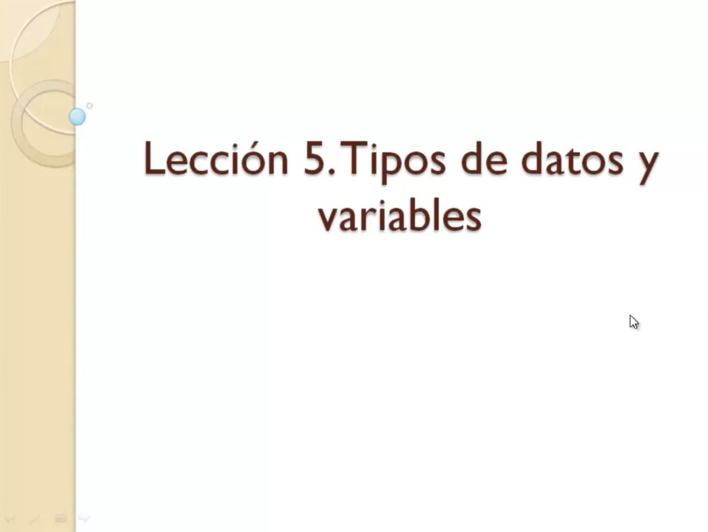
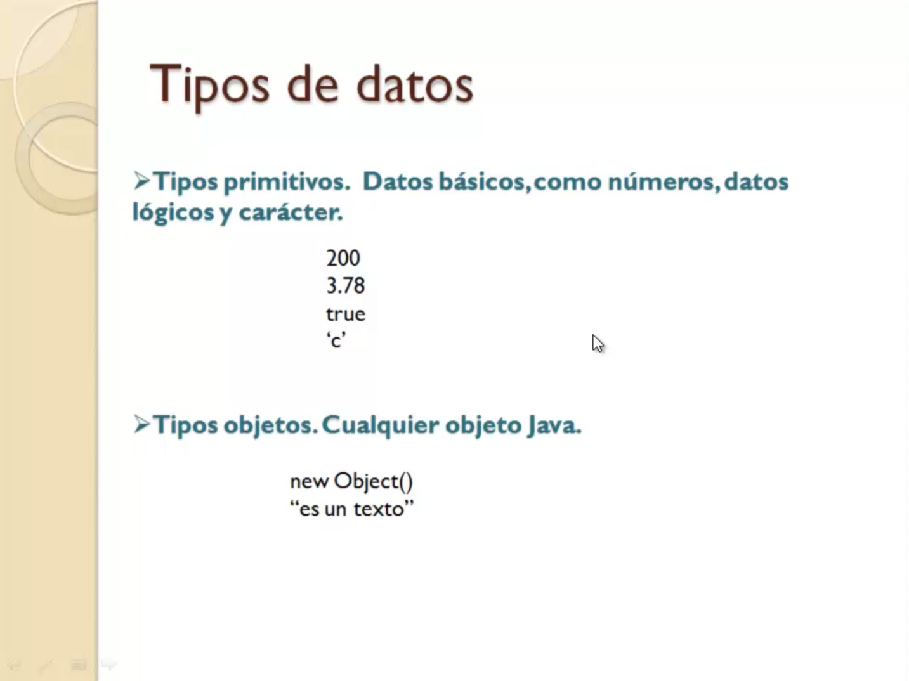
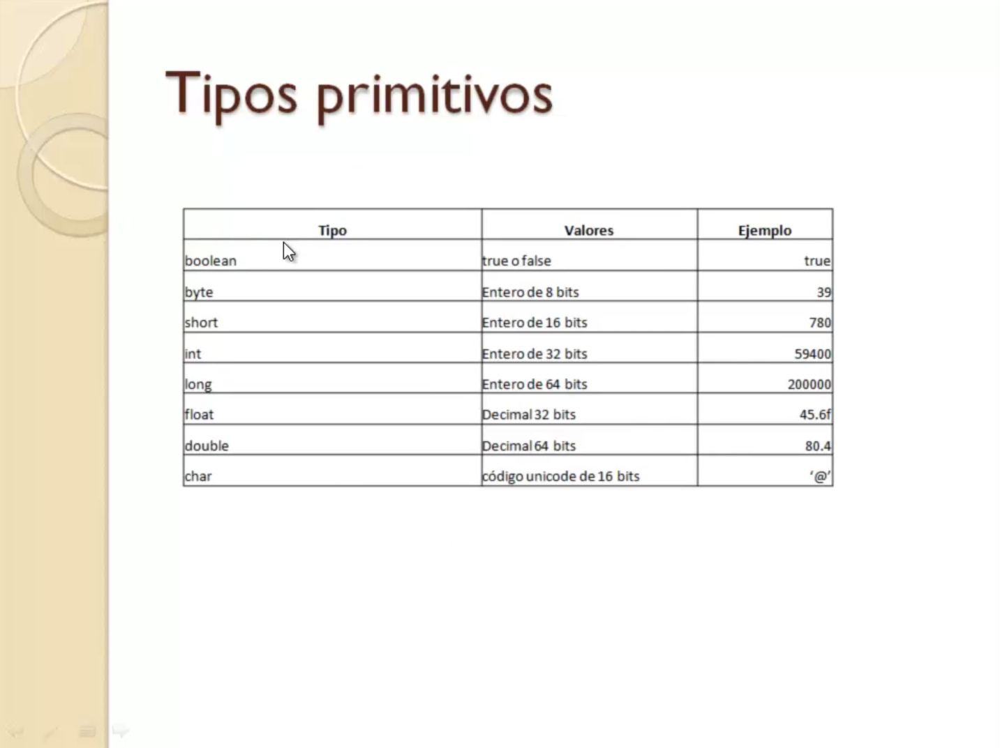
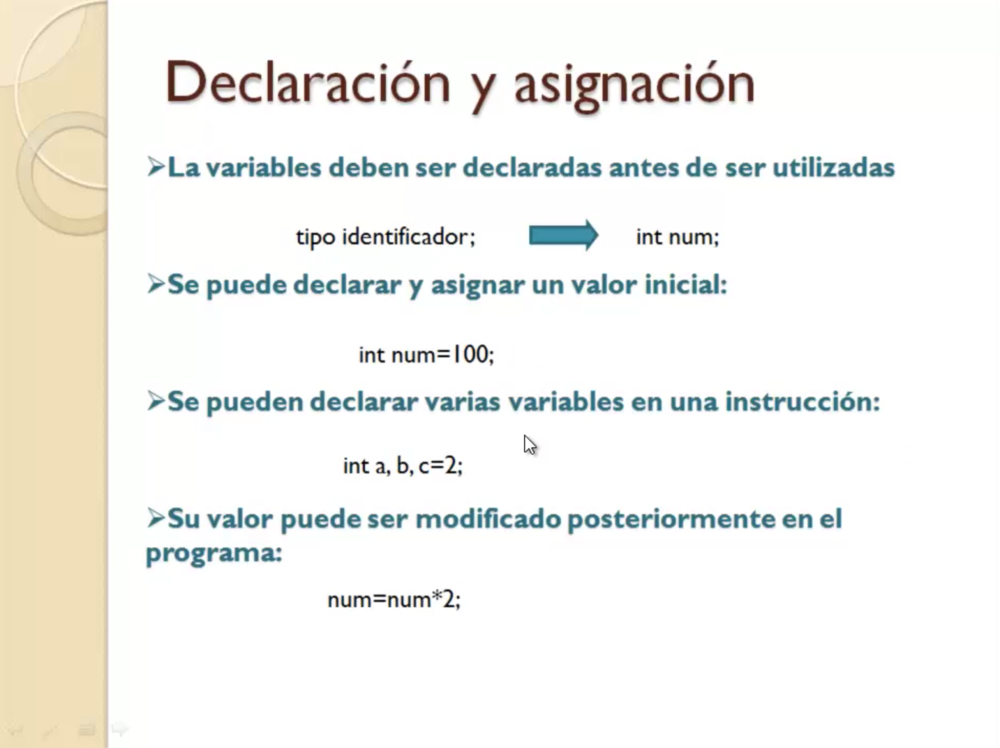
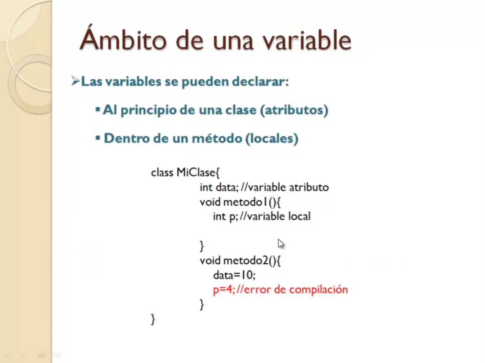
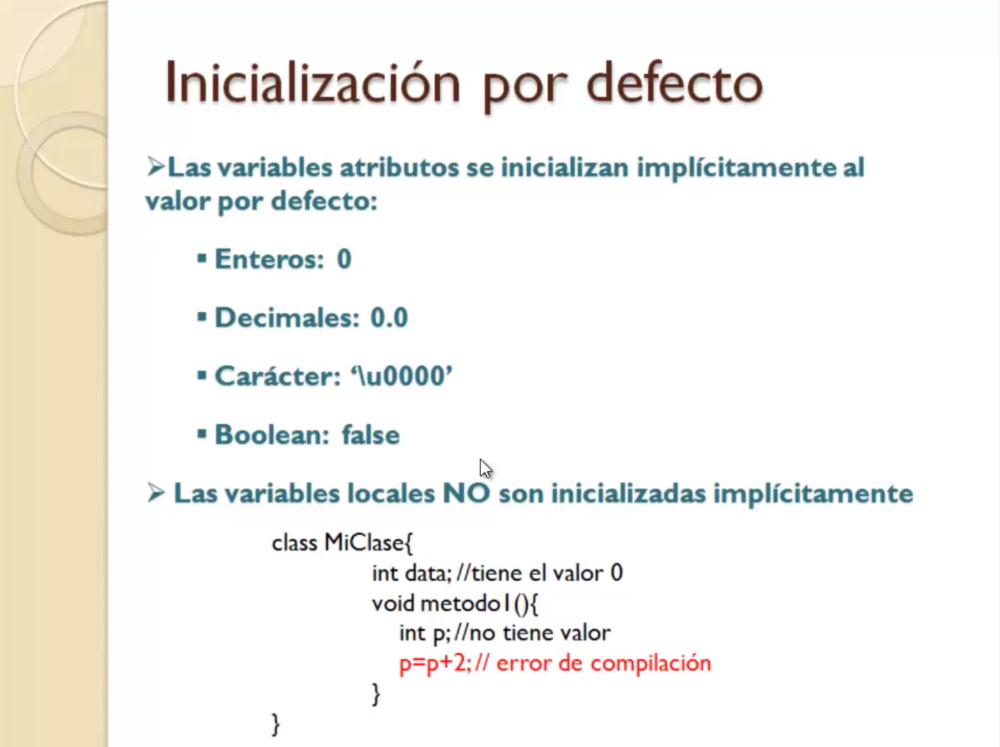
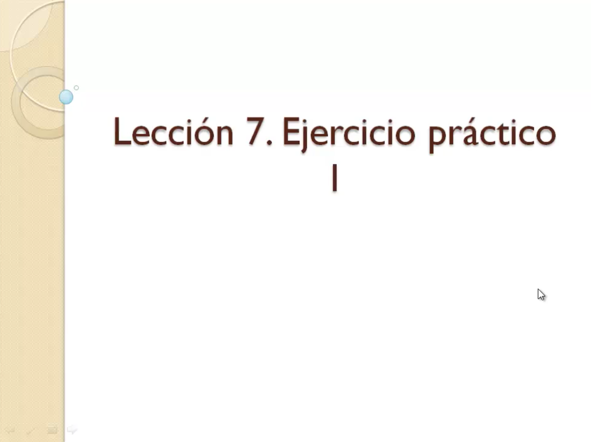
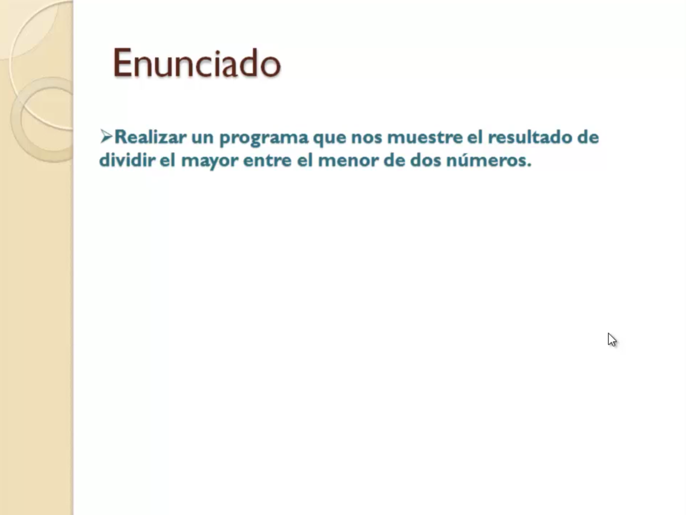
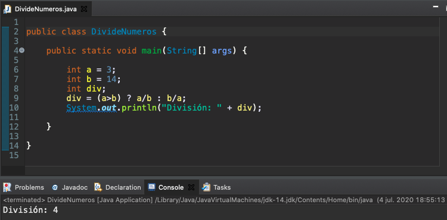
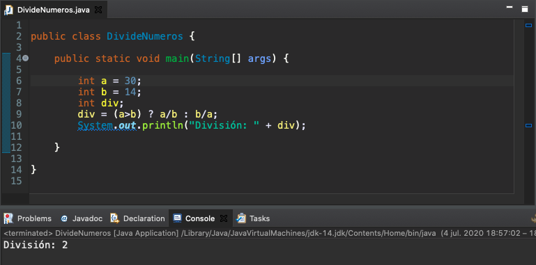

# 2. Sistaxis básica de Java 16:10
   * 05 Tipos de datos y variables I 02:34
   * 05 Tipos de datos y variables II 04:46
   * 06 Operadores 04:11
   * 07 Ejercicio práctico I 04:39
   
# 05 Tipos de datos y variables I 02:34



A partir de esta lección vamos a centrarnos en el conocimiento de la sintaxis del lenguaje Java y empezamos por los elementos principales de cualquier lenguaje de programación como son sus tipos de datos y las variables donde se almacena.



En Java distinguimos dos grandes grupos de tipos de datos.

Por un lado tenemos los tipos primitivos que harían referencia a los datos básicos de cualquier programa, como números, datos del tipo lógico y caracteres. Aquí ves cuatro ejemplos que hacen referencia a los tipos primitivos que utilizamos en Java que serían los números enteros, números decimales, datos lógicos palabras reservadas TRUE y FALSE o los caracteres que se representarían entre comillas simples.

Por otro lado tenemos los tipos objetos, en Java hay miles de objetos que podríamos manejar a parte de los que podríamos crear nosotros, los proporcionados por las ediciones Java estándar Edition, como te hemos comentado en lecciones anteriores y también son datos manejados en un programa. Vamos a dejar de momento los tipos objetos de lado y centrémonos en los tipos primitivos.



En la siguiente tabla tienes una lista con los ocho tipos primitivos que podemos utilizar en el lenguaje Java, antes decíamos que eran cuatro tipos porque realmente en los tipos enteros tenemos cuatro subtipos en Java que sería `byte`, `short`, `int` y `long` dependiendo de a qué rango queremos llegar de número. Por ejemplo que con `byte` solamente tenemos 8 bits con lo cual llegaríamos nada más a alcanzar números entre -128 y +128, según vamos aumentando en bits podemos abarcar un rango mayor. Por eso tenemos hasta cuatro tipos, para los tipos más pequeñitos y los más grandes que serán con `long`.

Por otro lado tenemos los tipos `boolean` que solamente hace referencia a las palabras reservadas True  o False, Verdadero o Falso.

Los decimales que también tenemos dos subtipos el `float` para decimales de pequeño rango y el `double` para abarcar los decimales de un rango muy alto hasta 64 bits, 64 bits sería el tamaño que ocuparía en memoria un dato de tipo doble.

Y por último tenemos los `char`, el tipo `char` hace referencia a cualquier caracter que internamente se representa con su código Unicode de 16 bits su combinación Unicode.

En el siguiente lección vamos ya a adentrarnos en el estudio de las variables.

# 05 Tipos de datos y variables II 04:46

En la primera parte de esta lección hemos estado hablando de los tipos de datos del lenguaje Java nos hemos centrado en los tipos primitivos.


Ahora vamos a analizar las variables, las variables es el elemento de programación que utilizamos para almacenar los datos dentro de un programa.

¿Qué es exactamente una variable?.

No es ni más ni menos que un espacio de memoria, una caja la podríamos imaginar, donde se almacena un dato de un determinado tipo, a las variables se les asigna un nombre o identificador, a la hora de definir identificadores para las variables podríamos utilizar en principio cualquier combinación de caracteres y símbolos. Sin embargo hay que tener en cuenta una serie de reglas, en primer lugar no podríamos utilizar como identificador una palabra reservada de Java `class`, `for`, son palabras reservadas y no podemos utilizarlos como identificadores. Además los identificadores pueden contener como hemos dicho cualquier letra, números y los caracteres de subrayado `_` y y de dólar `$`, por ejemplo puntos, guiones, comas no podríamos utilizar como parte del nombre del identificador, aunque puede contener letras, números y estos dos caracteres `_` y `$`.

Todo identificador debe comenzar o bien por una letra o por uno de estos dos caracteres `_` y `$`, nunca por un número, aunque sí lo pueden contener en el resto de la parte del identificador.



Las variables hay que declararlas antes de ser utilizadas, en la declaración es cuando le vamos a indicar ese identificador que queremos asignar a la variable y de qué tipo es. Esta sería la sintaxis Java para declarar una variable el tipo de dato que va a almacenar,  identificador asignado, por supuesto terminado en punto y coma, aquí tienes un ejemplo `int num;` de cómo se declararía la variable de la transparencia anterior.

También podemos declarar la variable y en la misma línea la misma instrucción asignarle un valor `int num=100;`.

Se pueden declarar varias variables en la misma línea separándolas por comas `int a, b, c=2;`, algunas se les puede dar un valor inicial y otras como en este caso a y b no.

Una vez que ya se declaró una variable se le puede usar asignándole un valor o incluso utilizándolo dentro de un programa para hacer operaciones con ella, en este caso `num=num*2;` cogemos la variable, la multiplicamos por un número y el resultado se asigna a, en este caso otra vez a la misma variable.

Como ves siempre las instrucciones en Java, la asignación de datos es de derecha a izquierda.



Bien *ámbito de una variable*, qué es eso del ámbito de una variable, el ámbito de una variable una variable básicamente se refiere a donde podemos declarar una variable y además utilizarla, realmente en Java hay dos ámbitos posibles o dos lugares posibles en donde se puede declarar una variable *al principio de la clase*, es decir fuera de cualquiera de los métodos de la clase, a esas variables como `data` las llamamos *variables atributos* y podrían ser utilizadas por cualquier método que estuviera definido dentro de esa clase, a su vez cada método puede tener sus propias variables, como en el caso de `p`, el `metodo1` tiene declarada la variable `p`, en este caso estamos hablando de variables locales utilizadas únicamente dentro de esos métodos. En el caso del `metodo2` podría evidentemente acceder a la variable `data` porque es una variable atributo y es compartida podríamos acceder a ella tanto aquí como aquí pero no podríamos acceder a la variable tanto en el `metodo1` como en el `metodo2` pero en el `metodo2` no podemos acceder a `p` por que es local al `metodo1`.  



Otra cosa que tenemos que conocer sobre las variables es qué valores se les asignan a las variables por defecto cuando se declaran. Hay que distinguir si estamos hablando de variables atributos o variables locales, porque las variables atributos si se inicializan implícitamente cuando se declaran, las variables que sean de tipo entero se van inicializar automáticamente a 0, las decimales a 0.0, las cáracter a lo que llamaríamos el carácter nulo `\u0000` que es esta combinación hexadecimal se puede representar así. Las variables de tipo lógico Boolean se inicializan automáticamente a `false`.

Pero qué pasa con las variables locales, cuando tú declara una variable local y no le asigna un valor a esa variable no tiene ningún valor. En el ejemplo de la diapositiva tienes una variable atributo `data` 
que automáticamente adquiere el valor 0 o como acabamos de decir, pero si declara una variable local y no le asigna un valor, esa variable no tiene valor, por lo tanto, intentar hacer una operación con ella sin haberla asignado previamente de manera explícita un valor, daría un error de compilación.

### Material adicional

[L5-Literales_y_conversion_de_tipos.pdf](/temarios/611_Aprende_a_programar_en_Java/pdfs/L5-Literales_y_conversion_de_tipos.pdf)


# 06 Operadores 04:11

## Operadores Utilizados en Java

Los operadores son símbolos que se emplean en un programa para operar con los datos del mismo. Por ejemplo:  

```java
int a=5; //asignación a una variable  

int b=10; //asignación a una variable  

int c=a+b;  //suma de dos variables y asignación a otra  
```
 
En Java existen muchos operadores, que podemos clasificar en los siguientes grupos en función del tipo de operación que realizan  

* Aritméticos  
* Asignación  
* Condicionales  
* Lógicos  
* Otros  

## Operadores Aritméticos

Se emplean con tipos numéricos para realizar operaciones aritméticas en un programa. La siguiente tabla te muestra cuales son estos operadores y la operación que realizan.  

   

Operador | Descripción      
---------|------------
`+`      | Suma dos valores numéricos.        
`-`      | Resta dos valores numéricos.      
`*`      | Multiplica dos números.      
`/`      | Divide dos números. El tipo de resultado   depende de los operandos, pues en el caso de que ambos sean enteros, el resultado de la división siempre será entero.      
`%`      | Calcula el resto de la división entre   dos números.      
`++`     | Incrementa una variable numérica en una unidad y deposita el resultado en la variable.      
`--`     | Decrementa una variable en una unidad y   deposita el resultado en la variable.      

   
A continuación te presento algunos ejemplos:  

```java
int a=3, b=8;  

int c=b/a; //el resultado es 2, la división entre enteros es siempre entero  

int n=a%2; //resto de dividir a entre 2  

a++; //equivale a a=a+1  

n--; //equivale a n=n-1;  
```
 

Respecto a los operadores `++` y `--`, hay que tener en cuenta que y pueden ir delante o detrás de la variable. Aunque depende de donde se pongan, pueden afectar de forma diferente:   

```java
int a=3, b;  

b=a++; //b toma el valor 3  


int a=3, b;  

b=++a; //b toma el valor 4  
```
 
Fíjate en el primer caso, cuando el operador se coloca después de la variable, **la operación de asignación se realiza antes** del incremento.  

## Operadores de asignación

Asignan el resultado de la expresión que aparece a la derecha del operador a la variable que se indica a la izquierda del mismo:  

variable = expresión  

La siguiente tabla resume los operadores de asignación existentes en Java:  

Operador | Descripción 
---------|------------
`=`      | Asigna la expresión de la derecha, a la   variable situada a la izquierda del operador.     
`+=`     | Suma la expresión de la derecha, a la   variable situada a la izquierda del operador y deposita el resultado en la   variable      
`-=`     | Resta la expresión de la derecha a la   variable situada a la izquierda del operador y deposita el resultado en la   variable      
`*=`     | Multiplica la expresión de la derecha   con la variable y deposita el resultado en la variable.      
`/=`     | Divide la variable situada a la   izquierda entre la expresión de la derecha, depositando el resultado en la   variable.      
`%=`     | Calcula el resto de la división entre la   variable situada a la izquierda y la expresión de la derecha, depositando el   resultado en la variable.      

Ejemplos:  

```java
int a=3, b=2;  

a+=10;  //equivale a a=a+10;  

b*=2; //equivale a b=b*2;  

b%3; //equivale a b=b%3;  
```
 
## Operadores condicionales

Evalúan dos operandos y dan como resultado un valor boolean (true o false). Habitualmente se emplean en instrucciones de control de flujo.  

En la siguiente tabla te muestro los operadores condicionales empleados en Java. Fíjate en el primero de ellos (`==`), utilizado para comprobar la igualdad de dos datos, se utiliza un doble igual en lugar del simple:  

Operador | Descripción      
---------|------------
`==`     | Compara dos valores, en caso que sean   iguales el resultado de la operación será true      
`<`      | Si el operando de la izquierda es menor   que el de la derecha el resultado es true      
`>`      | Si el operando de la izquierda es mayor   que el de la derecha el resultado es true      
`<=`     | Si el operando de la izquierda es menor   o igual que el de la derecha el resultado es true 
`>=`     | Si el operando de la izquierda es mayor   o igual que el de la derecha el resultado es true 
`!=`     | Si el valor de los operandos es   diferente el resultado es true.      

Ejemplos:  

```java
int a=3;  

int c=5;  

if(a>c) //comprueba si a es mayor que c  

if(a==3) //comprueba si a es igual a 3  

if(c!=0) //comprueba si c es diferente a 0  
```
 
### Operadores lógicos

Evalúan expresiones de tipo boolean, dando como resultado también un boolean. Son tres los operadores lógicos de Java:  

Operador | Descripción      
---------|------------
`&&`     | Operador AND El resultado es verdadero únicamente si ambos operando son verdaderos      
`1||1`     | Operador OR El resultado es verdadero si alguno de los operandos es verdadero      
`!`      | Operador NOT Se aplica sobre un único operando, su resultado es el contrario al valor del operando      

A continuación te mostramos algunos ejemplos:  

```java
int a=3;  

int c=9;  

int n=0;  

if(a>n && a<c) //verdadero  

if(a==2 || c>10) //falso   if(!(n==0)) //falso
```
 
### Otros operadores

Además de los que te he presentado, Java dispone de otros operadores que no entran en una categoría específica. Entre los más importantes están:  

* **new**. Se utiliza para crear objetos a partir de una clase. Lo veremos en la sección de arrays  

* **instanceof**. Se emplea para comprobar si un objeto es de un determinado tipo. De momento, no veremos su uso  

* **Operador ternario (?:)**. Se utiliza para realizar una operación u otra, en función de una condición:  

`variable = (condicion)?expresion1:expresion2;`  

Si la condición es verdadera, se ejecutará la expresión1 y el resultado se almacenará en la variable, pero si la condición es falsa se ejecutará expresión2 y será este resultado el que se guarde en la variable  

En el siguiente ejemplo se guarda en la variable div el resultado de dividir el mayor entre el menor de dos números:  

```java
int a=3;  

int b=9;  

int div;    div=(a>b)?a/b:b/a;
```
 
### Precedencia de operadores

En Java, salvo las que implican asignación, las operaciones se ejecutan de izquierda a derecha. Sin embargo, hay operaciones que tienen preferencia sobre otras. Por ejemplo, dada la siguiente instrucción:  

```java
int a=3+4*5;
```

¿Cuál sería el valor de la variable a?. La respuesta es 23, pues aunque primero aparece la suma y después la multiplicación, como esta tiene preferencia sobre la primera, se ejecuta antes la operación `4*5` y después, el resultado se suma a 3.  

Si quisiéramos realizar primero la suma, podemos recurrir al uso de paréntesis o corchetes:  

`int a=(3+4)*5; //el resultado es 35`  

La siguiente tabla nos muestra la preferencia de los operadores Java en orden decreciente, de modo que los operadores de la parte superior tienen más preferencia que los de la parte inferior:  

### Operador      

`() []`

`++ --`      

`* / %`      

`+ -`      

`> >= < <=`      

`== !=`      

`&&`      

`||`      

`?:`      

`= += -= *= /= %=`      

### Material adicional

[L6-Operadores.pdf](/temarios/611_Aprende_a_programar_en_Java/pdfs/L6-Operadores.pdf)

# 07 Ejercicio práctico I 04:39  



Bueno de momento con los tipos de datos variables y operadores no podemos hacer grandes programas aún en Java, pero te vamos a mostrar este ejercicio práctico donde ponemos en práctica algunos de los operadores que hemos visto en la lección anterior.



El enunciado del ejercicio consiste en realizar un programa que a partir de los números que vamos a tener almacenados en dos variables nos muestra el resultado de dividir el mayor entre el menor de ambos números.

Para ello nos vamos a ir a nuestro entorno de desarrollo Eclipse y damos File - New - Java Project.

Y ahí nos aparecerá un cuadro de diálogo en el que nos van a pedir el nombre del proyecto, la localización donde tuviéramos el Workspace que creamos al principio, donde teníamos el primer programa. Vamos a llamarle `601-02_Ejercicio_Practico_1`, lo siguiente que tenemos que hacer es crear una clase con su método main que es donde vamos a crear todo el código de nuestro primer programa, vamos a llamarle `DivideNumeros` elegimos método main para que nos lo cree.

Y sobre ese método es donde vamos a crear todo el código de este sencillo programa que vamos a hacer.

```java
public class DivideNumeros {

   public static void main(String[] args) {
		
      int a = 3;
      int b = 14;
      int div;
      div = (a>b) ? a/b : b/a;
      System.out.println("División: " + div);

   }

}
```

Declaramos dos variables con dos números cualquiera en una vamos a poner por ejemplo el tres en otro vamos a poner el 14 por ejemplo y vamos a declarar una variable donde vamos a almacenar el resultado de la decisión.

Cómo calculamos la división entre el mayor y el menor de los dos números.

Pues vamos a aplicar el operador ternario, el operador ternario establece una condición por ejemplo `(a>b)` y si `a` fuera mayor que `b` entonces lo que vamos a devolver sería el resultado de dividir `a/b` si no devplveriamos `b/a`. El resultado de la operación se va a almacenar en la variable `div` y por lo tanto que `a` es mayor pues `a/b` que no `b/a`. Siempre obtenemos como resultado la división entre el mayor y el menor de ambos números como es una división entera el resultado va a ser entero también, es decir se va a despreciar los decimales con la instrucción. Con la instrucción `System.out.println()` mostramos un mensaje usando `+` para concatenar.

El programa es muy sencillo lo vamos a ejecutar.



Finalmente se ha dividido 14 entre 3 y nos da 4 se desprecian los decimales y eso lo que sale si ponemos un valor mayor en entonces la división sería al revéz.



Vamos a verlo para que ver que efectivamente siempre va a garantizar que se divide mayor entre menor.
