# 3. Estructuras de control 52:19
   * 08 Instrucción alternativa simple. If 03:11
   * 09 Ejercicio práctico II 04:30
   * 10 Instrucción alternativa múltiple 04:57
   * 11 Ejercicio práctico III 05:58
   * 12 Instrucción repetitiva for 08:17
   * 13 Ejercicio práctico IV 07:13
   * 14 Ejercicio práctico V 05:38
   * 15 Instrucción repetitiva while 04:53
   * 16 Ejercicio práctico VI 04:05
   * 17 Salida forzada de un bucle 03:37
   
# 08 Instrucción alternativa simple. If 03:11

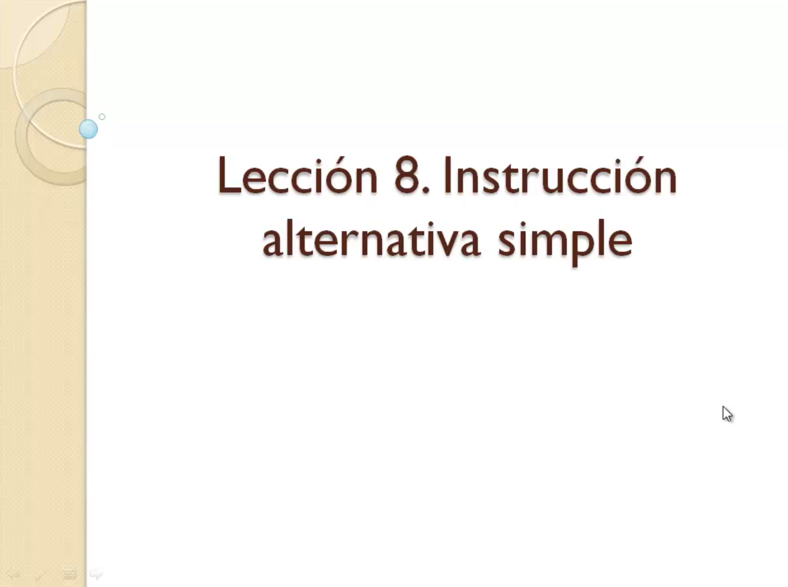

Después de los tipos de datos variables y operadores es el momento de abordar el estudio de las instrucciones de control de flujo que nos van a permitir introducir cierta lógica dentro de nuestros programas.

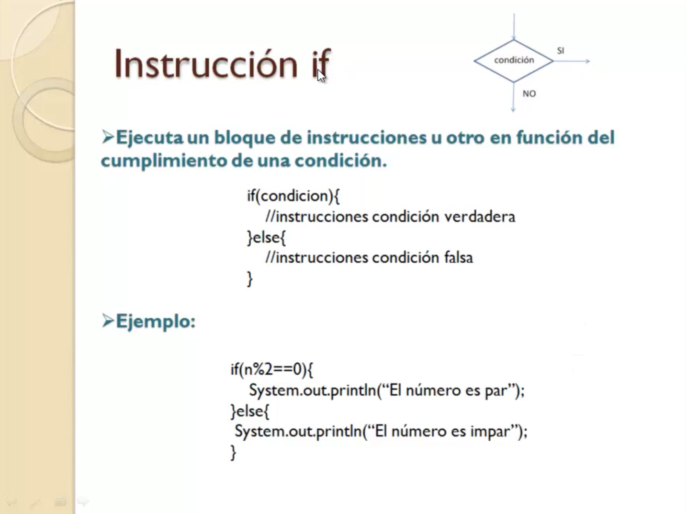

Empezamos con la instrucción de tipo alternativa simple, una alternativa simple es un tipo instrucción llamada `if` es el nombre de la instrucción y la característica principal es que se evalúa una condición que puede dar como resultado verdadero o falso, si el resultado, la condición es verdadera el programa tomá un camino y si es falso toma otro diferente.

La estructura de esta instrucción es la que ves `if` entre paréntesis la condición a evaluar, si el resultado de esa condición es verdadero pues se van a ejecutar las instrucciones que hay dentro del bloque delimitado por las llaves que vienen entre `if`, si no se ejecutarán las instrucciones indicadas en este otro bloque llamado `else` que también tiene sus llaves para delimitar el conjunto de instrucciones a ejecutar.

En el ejemplo que te proponemos aquí simplemente a partir de una variable se comprueba si el resto de la división es cero es decir si es un número par, si es así se muestra un mensaje y si no otro mensaje diferente.

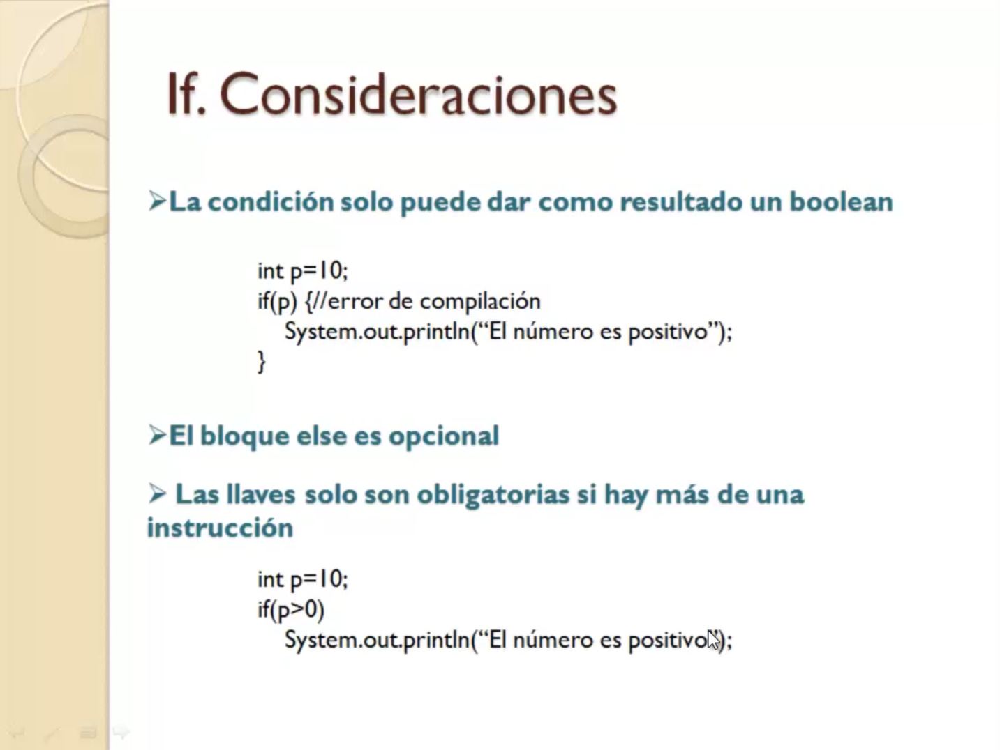

Es importante tener en cuenta una serie de consideraciones cuando utilizamos la instrucción `if`. La primera es referente a la condición, importante que tengamos claro que la condición a evaluar tiene que dar como resultado obligatoriamente un tipo boolean no puede dar un valor numérico, char, etc. tiene que ser boolean.

Por ejemplo en el primer caso simplemente preguntamos si la variable `p`, `p` es un número porque es una variable entera y eso no está permitido dentro de la condición del `if`, por lo tanto se produciría un error de compilación, nisiquiera compilaría el programa.

Otra cosa que también tenemos que decir es que el bloque `else` es opcional, puede ser que si la condición se cumple queramos hacer algo y si no se cumple simplemente no queremos hacer nada entonces simplemente continuaría el programa después de la instrucción que venga a continuación de la llave de cierre del `if`.

Las llaves solamente son obligatorias si hay más de una instrucción dentro del bloque `if` como `else`, es decir si solamente queremos realizar una determinada tarea, una única instrucción no sería necesario utilizar las llaves como ves en el segundo ejemplo que tenemos aquí, simplemente queríamos sacar un mensaje que el número es positivo si el número contenido en la variable `p` es mayor que cero, aunque no es obligatorio poner la llave yo siempre recomiendo hacerlo porque es una manera de organizar nuestro código y que quede más claro.

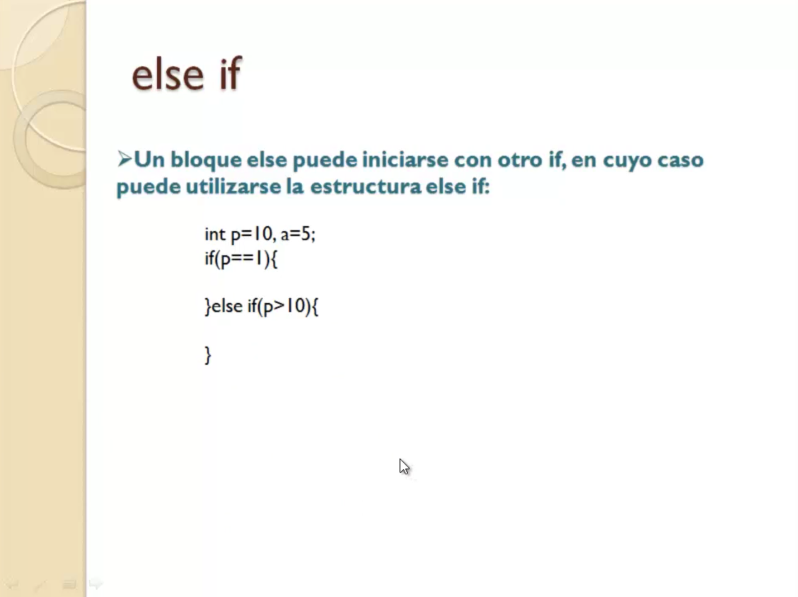

El bloque `else if` es una manera de crear un `if` dentro de un bloque `else` es decir puede ocurrir que si no se cumple una condición queramos evaluar otra, en ese caso utilizaremos este bloque llamado `else if`, en este caso como ves se comprueba si el contiene de una variable es igual a 1 y si no queremos comprobar si es otro valor diferente, si `p` es mayor que 10, en ese caso en vez de abrir la llave y poner otro `if` anidado utilizamos la expresión `else if`.

# 09 :computer: Ejercicio práctico II `601-03_Ejercicio_Practico_2` 04:30

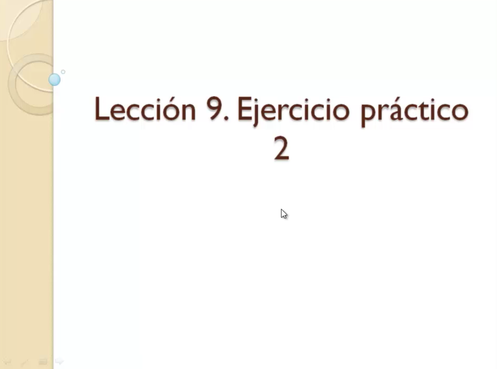

Seguidamente vamos a realizar un ejercicio en el que vamos a poner en práctica el uso de la instrucción y vista la lección anterior.

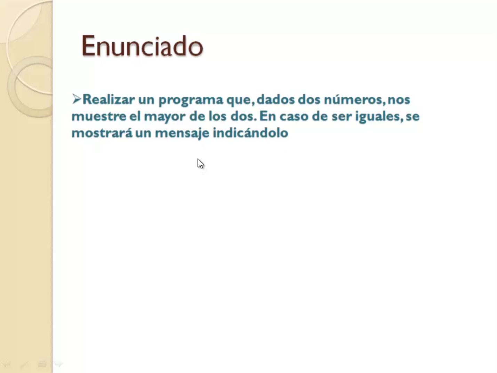

El ejercicio va a consistir en un programa que dados dos números nos va a mostrar cuál es el mayor de los dos en caso de que sean iguales pues nos saldrá un mensaje indicando que se trata de dos números iguales.

Vamos a ir de nuevo a nuestro entorno de desarrollo Eclipse y vamos a crear el siguiente proyecto java `601-03_Ejercicio_Practico_2` y añadiremos una clase `MayorNumeros` con su método `main`. 

Vamos a incluir el siguiente codigo en la clase.

*`MayorNumeros`*

```java

public class MayorNumeros {

	public static void main(String[] args) {
		int a=10;
		int b=45;
		
		if(a>b) {
			System.out.println("El número mayor es: " + a);
		}else if(b>a) {
			System.out.println("El número mayor es: " + b);
		}else {
			System.out.println("Los dos números son iguales.");
		}

	}

}
```

Vamos a probar los tres casos que existen.

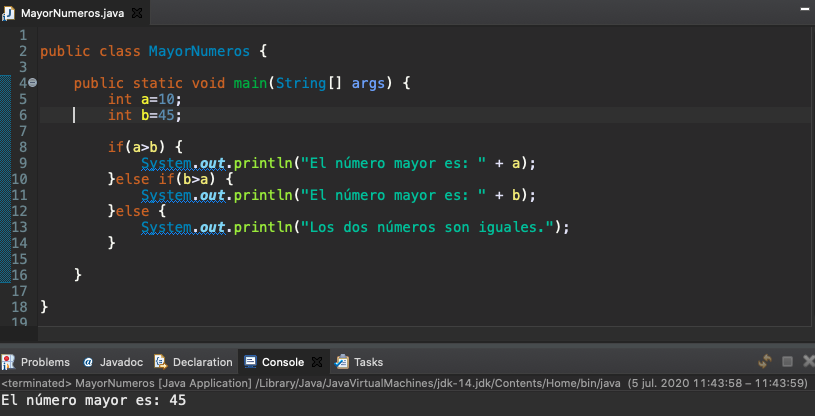


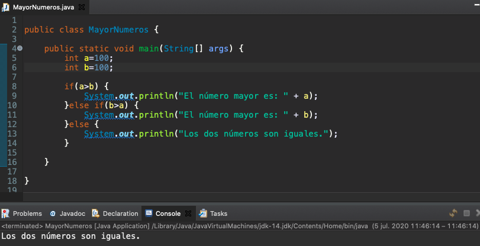

Has visto la utilización de la estructura de control alternativa `if`.

Aprovechamos para comentar lo que vimos en la lección anterior, es que es obligatorio que esa condición sea de tipo boolean, el resultado sea verdadero o falso. 

Yo no puedo hacer por ejemplo `if(a)` por que da un error de compilación al tratarse de un resultado numérico y mucho cuidado también porque es muy habitual cuando se está aprendiendo Java a la pregunta si una variable es igual a un determinado valor `if(a=0)` porque el operador de comparación no es el `=` sino el doble igual `==` aquí `if(a=0)` pensaría que estás asignando cero a la variable y estás preguntando por `a` eso da un error de compilación porque el resultado sería numérico si lo que quieres es comparar si `a` es  igual tienes que utilizar el doble igual `if(a==0)`.

# 10 Instrucción alternativa múltiple 04:57

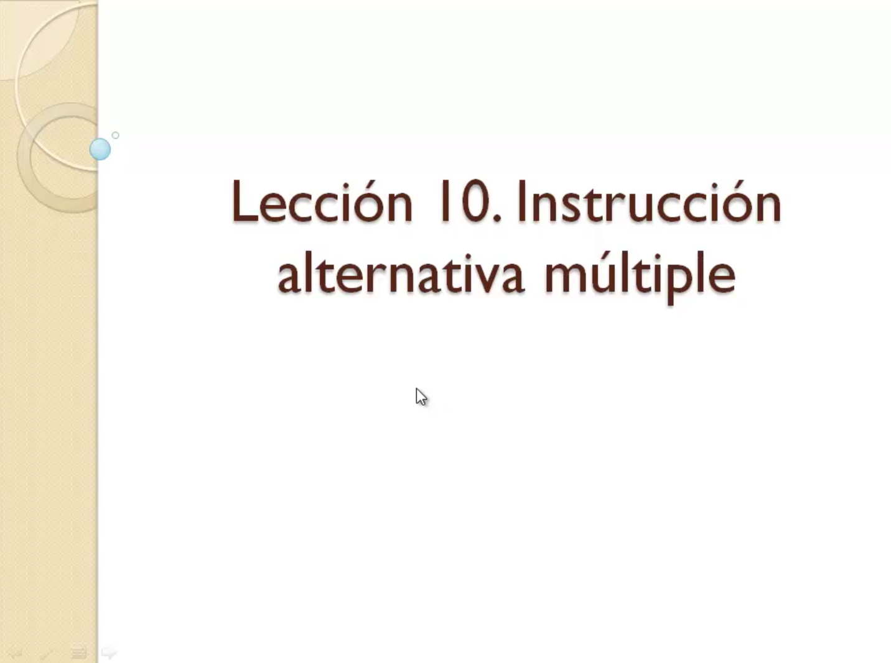

A continuación te voy a presentar la instrucción alternativa múltiple.

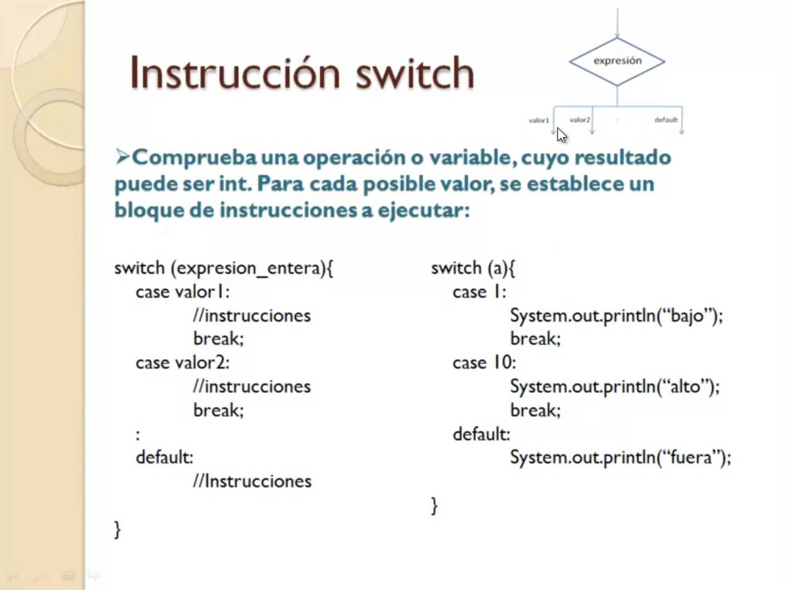

La instrucción alternativa múltiple a diferencia de la simple, evalua una expresión, no una condición, la expresión puede dar como resultado múltiples valores en función de cada valor ejecutaremos distintas tareas.

La instrucción alternativa múltiple en Java es la instrucción `switch`, `switch` tiene este formato entre paréntesis la expresión a evaluar `switch(expresion_entera)` que puede ser una operación matemática o incluso una simple variable y para cada posible valor utilizamos bloques `case`, `case valor 1:` significa que si el resultado de esa expresión coincide con valor 1 se ejecutarán las instrucciones en ese `case`. Si coincidiera con valor 2 se ejecutarán las instrucciones en ese `case`, etc.. Podemos poner tanto `case` como consideremos apropiados, como opciones queremos evaluar, en caso de que no coincida el resultado de la expresión con ninguno de los valores indicados en `case` entraría en el bloque `default`. Como ves cada `case` lleva al final del bloque de instrucciones una instrucción `break` que lo que hace es que se salga de la instrucción `switch`, porque si no ponemos la instrucción `break` cuando el programa entra en un `case` al ejecutar las instrucciones si no encuentra `break` aunque no cumpliese con el siguiente `case` entraría en él.

En el ejemplo simplemente evaluamos una variable `a` que supuestamente es una variable o debería ser una variable entera. Si el contenido de la variable `a` es 1 entonces imprimiríamos el mensaje `bajo`. Si el contenido de la variable `a` es 10 entonces imprimiríamos el mensaje `alto` y si no es ni 1 ni 10 imprimiríamos el mensaje `fuera`.
 
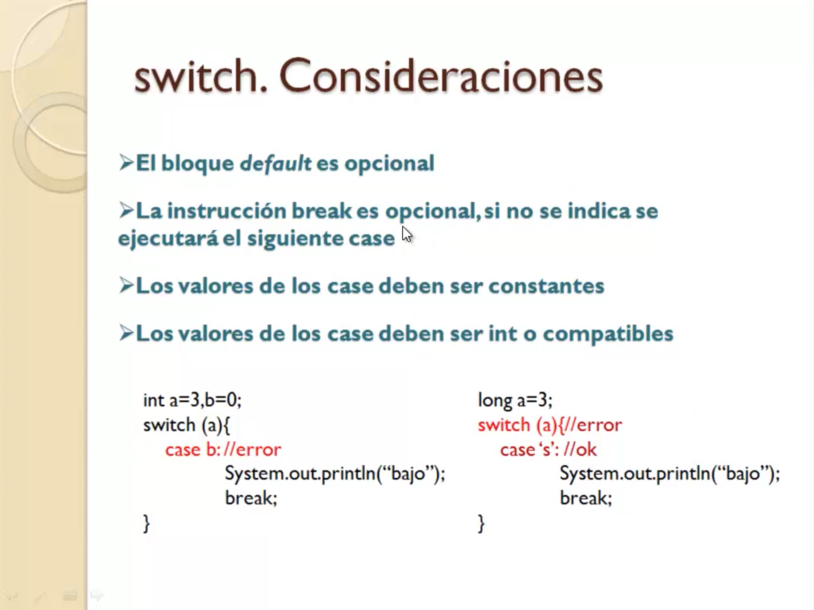

Consideraciones que tenemos tener en cuenta sobre `switch`.

Lo primero el bloque `default` es opcional.

La instrucción `break` es opcional, no es obligatoria pero si no la ponemos cuando termine de ejecutar las instrucciones del `case` pasará al siguiente `case`. Eso que puede parecer un problema o una limitación no lo es, puede ser que haya veces en las que no nos interese poner un break.

Otra consideración muy importante es que los valores del `case` deben ser **valores literales** o constantes, en el primer ejemplo de la diapositiva en el case usamos el valor de la variable `b`, en vez de utilizar un número hemos puesto una variable, eso no es posible, no me lo permite sería un error de compilación todos los valores indicados en `case` deben ser fijos, constantes.

Otra consideración también muy importante es que los valores de los `case` deben ser enteros de tipo `int` o compatibles. En el segundo ejemplo nosotros no podríamos evaluar una expresión que nos devolvieron `long` sería un error de compilación, en cambio en uno de los `case` sí que podría ser por ejemplo un tipo `char`, ¿por que?, porque `char` es compatible con enteros. Ya lo dijimos cuando estudiamos los tipos de datos almacena el valor Unicode, valor entero, por lo tanto sí podría utilizarse como valor de los `case` un `char`, un `byte`, un `short` e `int`, pero no un `long` en los `case` ni en las expresiones.

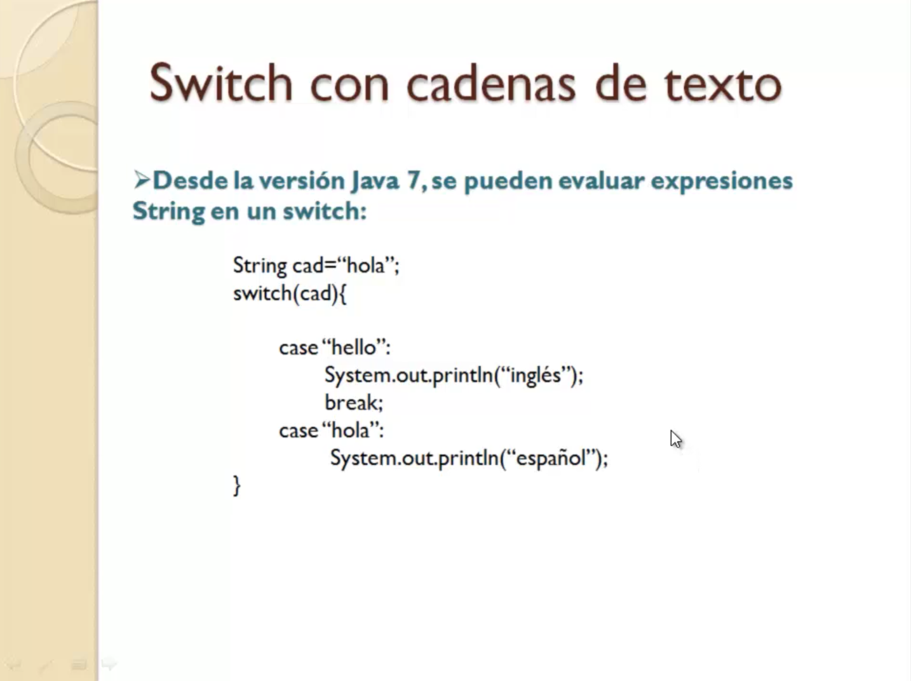

Aunque no conocemos el tipo de texto que lo veremos más adelante en lecciones posteriores pues comentar que desde la versión Java 7 es posible utilizar `Strings` cadenas de caracteres en un `switch`.

Como ves en el ejemplo de la diapositiva tienes una variable de tipo cadena de caracteres `Strings` y es posible utilizar como expresión del `switch` un `String` estamos evaluando la variable `cad`, en ese caso los valores de los `case` deben ser obligatoriamente de tipo texto y como decíamos en las consideraciones anteriores no podemos poner variables, tienen que ser literales, valores fijos, si `cad` es `String` sólo podríamos utilizar en cada `case` valores de tipo texto, además fijos, literales. 

# 11 :computer: Ejercicio práctico III `601-04-Ejercicio_Practico_3` 05:58

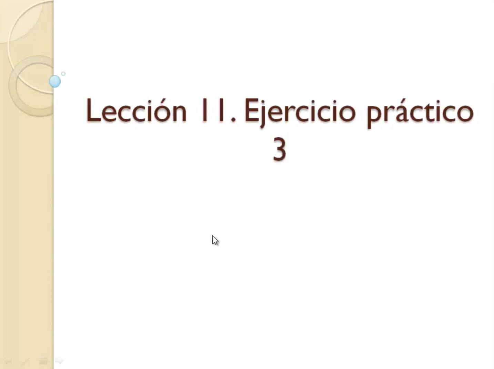

Para ver el funcionamiento de la instrucción `switch` explicada en la lección anterior vamos a ver el siguiente ejercicio práctico en este ejercicio.

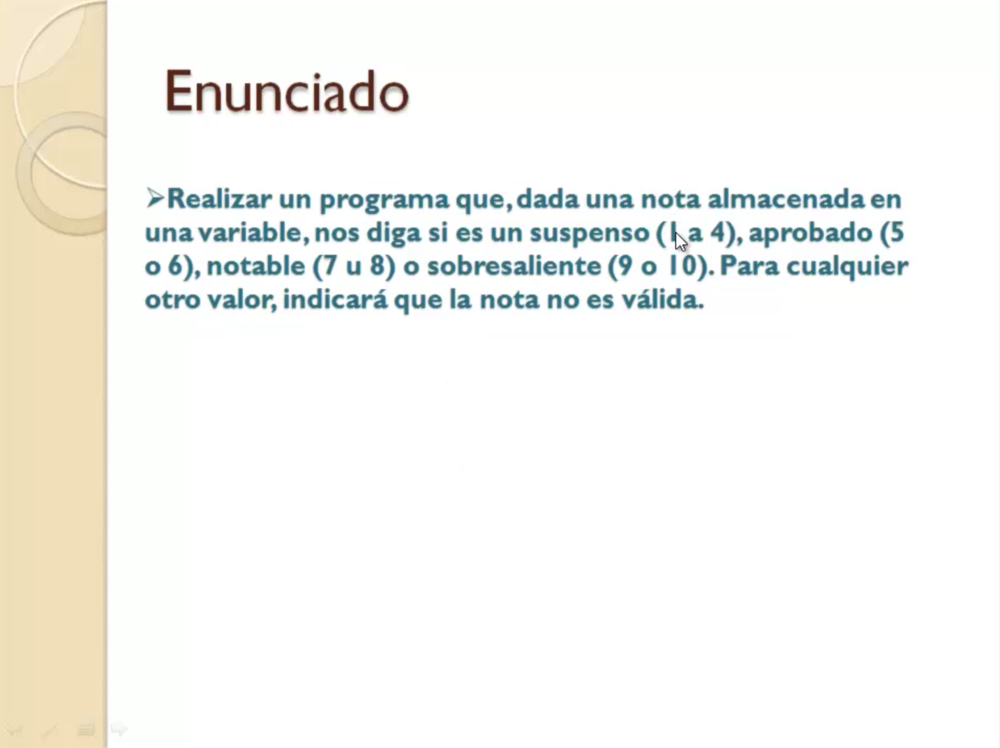

Vamos a hacer un programa que da una nota almacenada en una variable nos va a indicar si se trata de un suspenso si se está entre el rango de 1 a 4, aprobado 5 y 6, notable 7 y 8 o sobresaliente si es un 9 ó 10, si es otro valor diferente a estos debe mostrar un mensaje indicando que se trata de una nota no válida.

Vamos a nuestro entorno de desarrollo Eclipse y a crear un proyecto `601-04-Ejercicio_Practico_3`, añadimos la clase `CalculoNota` e insertamos el siguiente código.

*`CalculoNota`*

```java
public class CalculoNota {

   public static void main(String[] args) {
		
      int nota = 32;
		
      switch (nota) {
         case 1:
         case 2:
         case 3:
         case 4:
            System.out.println("Suspenso");
            break;
         case 5:
         case 6:
       	    System.out.println("Aprobado");
            break;
         case 7:
         case 8:
            System.out.println("Notable");
            break;
         case 9:
         case 10:
            System.out.println("Sobresaliente");
            break;
         default:
            System.out.println("Nota no válida");
  	
      }
   }
}

```

Esta es precisamente la situación en la cual vamos a tener algunos `cases` sin la instrucción `break`. 

Están contemplados todas las opciones que hemos dicho agrupadas, es decir todos aquellos posibles valores que vayan a dar el mismo mensaje están agrupados.

Vamos a probar la aplicación con varios casos.

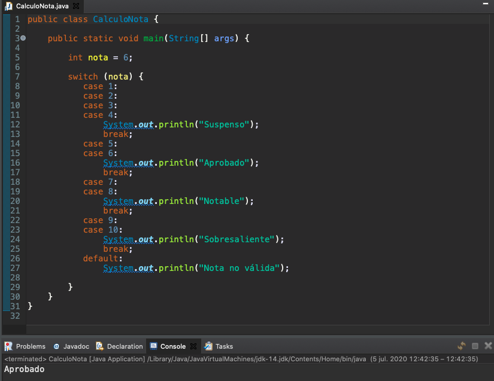

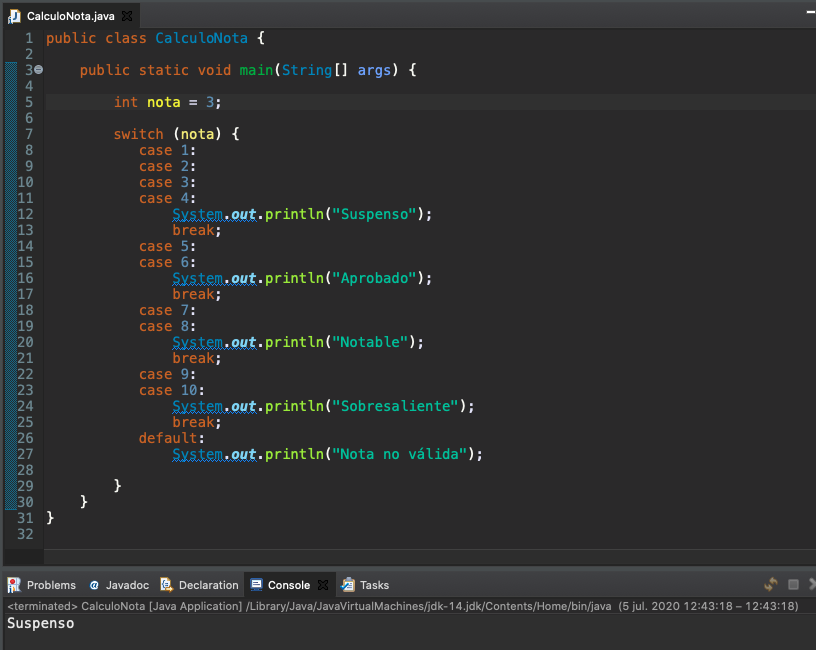


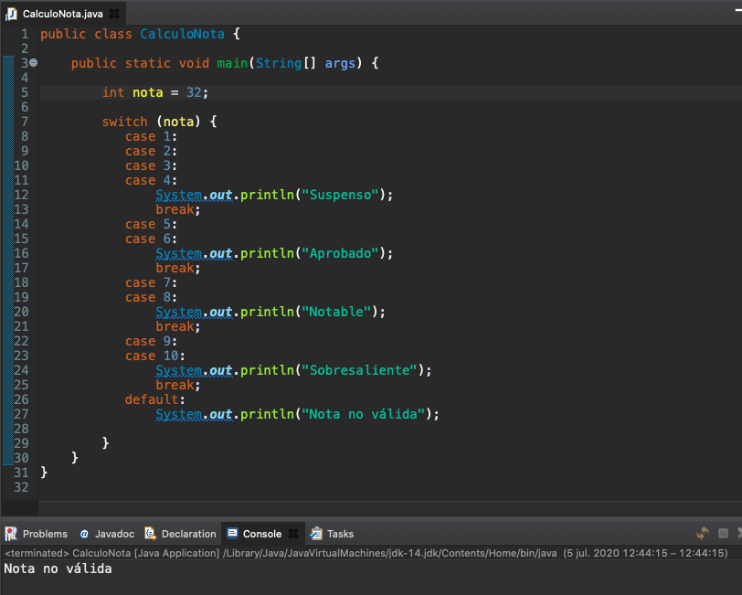

Vemos un caso claro de utilización de `switch` que hay varios posibles valores a evaluar con diferentes acciones y además donde algunos de esos no tienen `break` porque nos interesa que cuando entre en ellos se pasen también al siguiente.

# 12 Instrucción repetitiva for 08:17

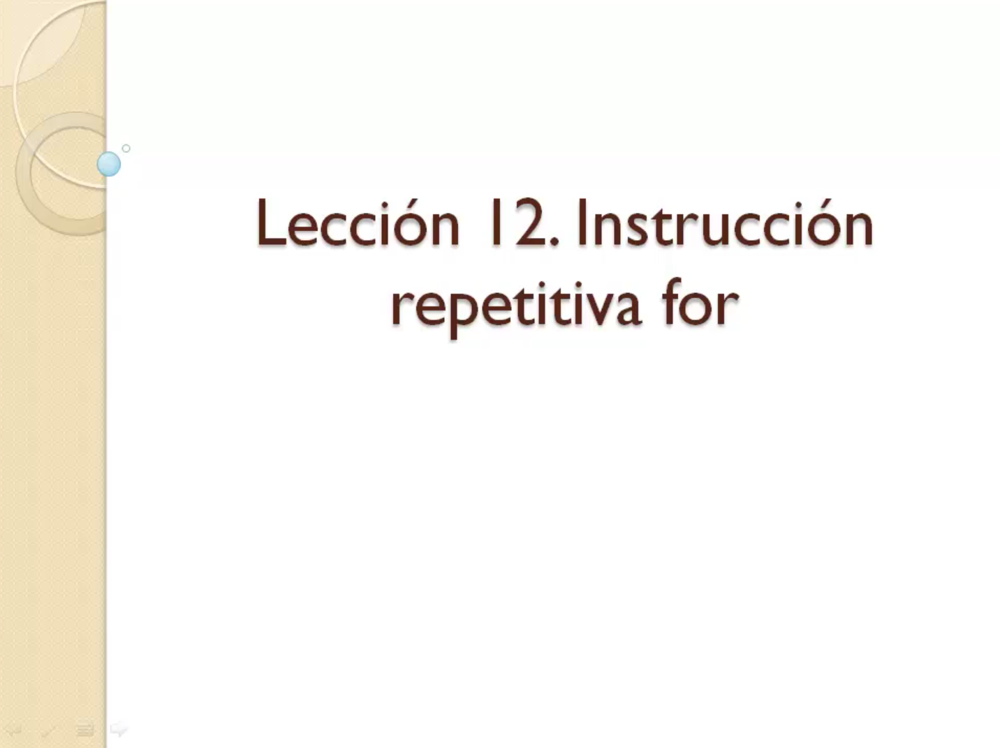

Después de ver las instrucciones de tipo alternativa como la simple `if` o la multiple `switch` es el momento de hablar de otro tipo de instrucciones de control de flujo en un programa Java como son las **instrucciones repetitivas**, conocidas también como **bucles** y empezamos hablando de la instrucción `for`.

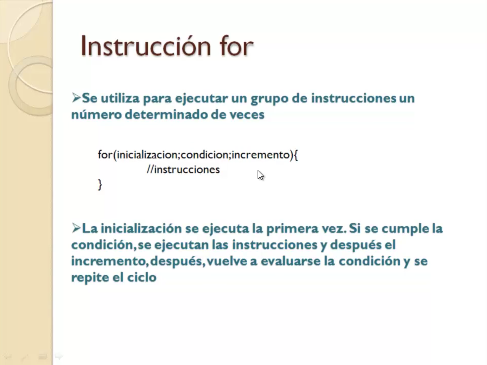

La instruccion `for` se utiliza para ejecutar un grupo de instrucciones un número determinado de veces.

En la diapositiva tienes cómo sería su formato, utilizamos la palabra reservada `for` y entre paréntesis tenemos tres instrucciones.

La instrucción llamada `inicializacion;`, `condicion;` que siempre debe devolver un boolean e `incremento` y en el interior entre llaves las instrucciones a ejecutar por el `for`. Las instrucciones se van a ejecutar un número definido de veces, ese número definido de veces va a venir determinado por las tres instrucciones `(inicializacion;condicion;incremento)`.

Cómo funciona esto, lo vamos a entender ahora mejor como un ejemplo pero te explico, inicialmente al entrar en el `for` se ejecutaría la instrucción de `inicializacion;` que como su nombre indica habitualmente consiste en inicializar una variable, una variable que llamamos variable de control del `for` porque la vamos a utilizar para controlar ese número de veces que se va a ejecutar el bloque de sentencias.

Después de la `inicializacion` comprobaríamos una `condicion` es una condición del tipo con operadores condicionales siempre va a dar como resultado un booleano. Lógicamente en esa condición va a estar implicada esa variable que hemos inicializar. Si la condición se cumple se va a ejecutar el bloque de instrucciones al finalizar el bloque de instrucciones se ejecuta `incremento` que como su nombre indica habitualmente va a ser el incremento o decremento de la variable de control que se inicializo la primera vez. Tras ejecutar el incremento volvemos a comprobar la condición, se sigue cumpliendo pues ejecutamos las instrucciones de nuevo, al finalizar otra vez `incremento` y otra vez `condicion` se sigue cumpliendo, otra vez las instrucciones y así hasta que llega un momento en el que tras la ejecución de `incremento`, `condicion` ya no se cumpla en ese momento ya no se van a ejecutar las instrucciones que tenemos definidas dentro del bucle.

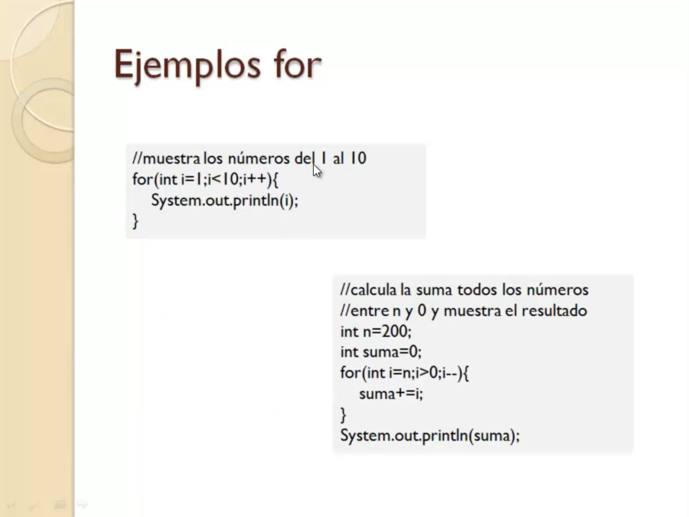

Como te decía lo mejor es verlo como un ejemplo ya verás que es muy sencillo su funcionamiento, aquí tenemos un pequeño bloque de código que se encarga de mostrarnos los números en pantalla del 1 al 10 los números naturales 1 2 3 hasta 10.

```java
//Muestra los números del 1 al 10
for(int i=1; i<10; i++){
   System.out.println(i);
}
```

Cómo funciona.

Fíjate al entrar en el `for` se ejecutaría esta instrucción `int i=1` que lo que hace es declarar una variable, aunque la declaración de la variable podría estar fuera, pero es habitual que si esa variable sólo la vamos a usar dentro del `for` se declare aquí mismo, se declara variable `i` y se asignan `1`, se comprueba la condición `i<10`, si, ejecutamos, como `i` se inicializo a 1 imprimiría el número 1.

Al finalizar se ejecuta incremento `i++` cómo ves lo que haces es sumarle 1 a `i` y otra vez a comprobar, ahora `i` vale 2, 2 es menor que 10, si, puedes ejecutaría otra vez y se mostrará el mensaje 2.

Otra vez se incrementa 3, 3 es menor que 10, si, eso sacaría también el 3 y así hasta el momento en el que la `i` valga 10. En ese caso 10 es menor que 10, no, ya deja de cumplirse la condición y se saldría fuera del bucle, por lo tanto fíjate aquí hay un pequeño fallo en el mensaje `//Muestra los números del 1 al 10`, no muestra los números del 1 al 10 sino del 1 al 9, porque la condición de salida, la condición de entrada mejor dicho es `i<10` es decir la condición de salida es que en el momento que valga 10 ya no se va a ejecutar.

Por lo tanto realmente si imprimiría los números del 1 al 9.

Aquí tienes otro caso.

```java
//Calcula la suma de todos los números
//entre n y 0 y muestra el resultado
int n = 200;
int suma = 0;
for(int i=n; i>0; i--){
   suma += i;
}
System.out.println(suma);
```

Otro ejemplo de un programa que va calculando la suma de todos los números comprendidos entre un número dado `n` y `0` mostrando el resultado en pantalla. En este caso para que veas que no siempre hay que empezar desde el número más pequeño hasta el número final, hemos empezado inicializando la variable de control en el número al que hay que alcanzar 200 y lo que vamos haciendo es que la vamos decrementando, fíjate 200, 200 es mayor que 0, si, por lo tanto la variable `suma` que está inicializa a 0 le sumamos el número 200, que hacemos después, la operación de incremento, que en este caso sería de decremento, le restamos 1 ,ahora son 199, 199 es mayor que 0, si, ahora lo que había acumulado en suma que era 200, le sumamos 199, volvemos al decremento, 198, 198 es mayor que 0, si, entonces volvemos a sumar 198 y así hasta el número 1. Cuando vamos decrementando e `i` vale 1 es el último número que sumamos, al decrementar la `i` valiendo 1, tendremos que vale 0, cuyo caso ya deja de cumplirse la condición y salimos del `for`, por lo tanto hemos sumado todos los números entre `n` y 0 no incluido, sería entre `n` y 1. Después mostraremos el resultado.

Como ves su funcionamiento es muy sencillo y se dice que ejecuta el grupo de instrucciones un número definido de veces porque suele ser un número concreto 20, 30, 40 veces, viene determinado siempre por esa variable de control y el valor máximo o mínimo a alcanzar.


Consideraciones que tenemos que tener en cuenta sobre el uso del `for`.

Hemos visto que habitualmente en un `for` hay tres instrucciones pero no son obligatorias.

Podrías tener un `for(;;){...}` en el cual no hemos puesto ni inicialización, ni incremento, ni condición, esto es un bucle infinito estaría ejecutando esto indefinidamente. Es un caso extremo, no se suelen utilizar desde luego pero te viene a indicar que puede ser que falte una de las tres instrucciones, las dos o incluso todas para hacer un bucle infinito. Ya digo no es habitual, no suele ser práctico hacerlo pero podríamos crear un bucle infinito si no ponemos ninguna de las instrucciones ni la de inicialización, ni comprobación, ni tampoco la de incremento.

Otra consideración, es que en la inicialización e incremento, la primera y tercera instrucción, habitualmente es una sola instrucción pero podrían ser dos o mas instrucciones como se muestra en la diapositiva. O sea yo quiero inicializar una variable y sumarle 2 o se podrían poner más de una instruciones separadas por comas, lo mismo en el incremento puedes incrementar la variable y además asignar esa variable a otra variable que tengo por ahí, separada por comas pondría todas las instrucciones que fueran necesarias, la condición es una única instrucción, aunque podría incluir algún operador lógico de manera que la comprobación incluyera si es menor que 10 y mayor que no sé qué valor y menor tanto podría ser una condición más compleja, pero eso sí siempre devolviendo booleano.

Otras consideración es que la variable de control que habitualmente la declaramos aquí dentro de la instrucción de inicialización, pero no tiene por qué, podría haberse declarado antes, ya que si la declares aquí dentro del `for` en inicialización solamente la podríamos utilizar dentro de ese bloque, si por lo que sea, esa variable también se tiene que usar fuera habría que declararla antes y en su lugar no ponemos nada el punto y coma para indicar la delimitación de las tres secciones si son siempre obligatorios ponerlos.

Esto es todo sobre `for` en la siguiente lección vamos a ver varios ejemplos de utilización del `for` por que es una de las instituciones más utilizadas en cualquier programa Java.

# 13 :computer: Ejercicio práctico IV 601-05-Ejercicio_Practico_4 07:13

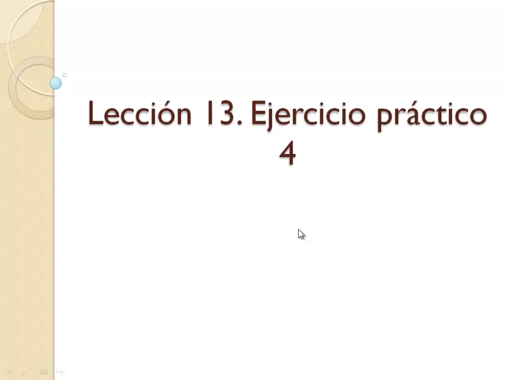

Muy bien pues vamos a ver un ejercicio en el que vamos a poner en práctica el uso de la instrucción repetitiva o bucle `for`.

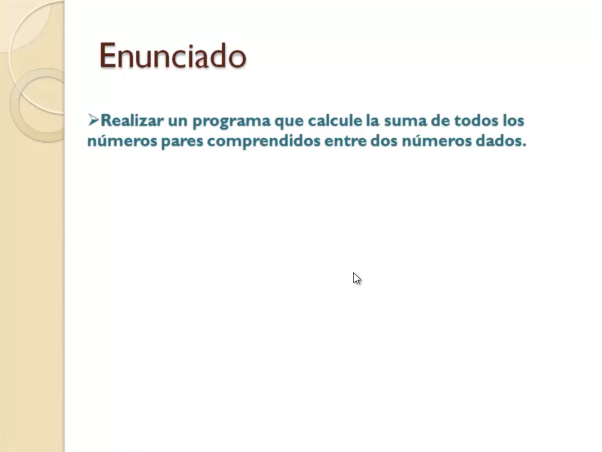

El ejercicio va a consistir en un programa que dados dos números nos va a calcular la suma de todos los números pares comprendidos entre ambos números, extremos incluidos.

Vamos al entorno de desarrollo Eclipse y vamos a crear el proyecto `601-05-Ejercicio_Practico_4` y añadimos la clase `SumaPares` con el siguiente código.

*`SumaPares`*

```java
```


Así es como vamos a llamar a la clase y crearemos el método main dentro de ella que es donde vamos a meter el código de nuestro programa.

Bueno pues aquí lo primero que vamos a hacer es declarar dos variables cualquiera como hemos hecho otras veces con dos números inventados ve por ejemplo que en principio se trataría de dos números que en un programa real serían obtenidos desde el exterior no estarían fijados ahí directamente en el código del programa.

Pero bueno nosotros como esas clases esos elementos que son clases no se van a necesitar para poder leer datos de entrada no las conocemos pues vamos a suponer que tenemos almacenados los números en dos variables aunque en teoría deberíamos desconocer lógicamente lo que valen esas variables incluso no sabemos cuál es la que contiene el número mayor ni cuál la que contiene un número menor.

Por tanto vamos a declarar dos nuevas variables mayor y menor en las que vamos a almacenar cuál sería la primera de ellas el mayor de los dos y en la siguiente el menor para qué.

Para que a la hora de que hagamos en el bucle for destruction for recurramos desde un extremo hasta el otro sepamos cuál es el más pequeño hasta el más mayor.

También vamos a declarar la variable suma donde vamos a ir sumando los números pares que vamos encontrando entre menor y mayor.

Esto es la declaración de las variables.

Pues lo primero que hacemos entonces es eso es obtener cuál es el mayor y el menor de ambos números haríamos la siguiente pregunta si es mayor que entonces está claro que el mayor y el menor en la variable mayor metemos a la variable menor metemos y si no al contrario la variable mayor y en menor almacenamos el número.

Si fueran iguales pues también entraría aquí.

Pero bueno en ese caso es que nos da igual cuál sería el mayor de los dos el bucle iría de uno a otro y realmente solamente haría la suma una vez bueno pues venga vamos a establecer la instrucción for declaremos la variable de control que comienza con el menor de los números inicializar al menor y digamos va a hacer las operaciones que vamos a definir dentro del futuro mientras que esa variable no alcance el valor mayor o sea mientras así sea menor igual que en mayor y menor igual porque vamos a considerar el extremo también es decir vamos a ir comprobando y sumando todos los números pares que encontremos entre menor y mayor si no quisiéramos contemplar los extremos pues entonces habríamos puesto menos vale.

Pues venga entonces cómo sabemos si ahí va a ir pasando.

En este caso los números son 15 más pequeños y 23 en mayor va a empezar en 15 16 17 hasta 23.

Cómo saber si un número es par o no es calculando el resto de la división entre dos.

Si el número que toque en cada recorrido al dividirlo entre dos da resto cero.

Se trata de un número para el resto se calcula con el tanto por ciento.

Vamos incluso si es que es conveniente y poniendo comentarios comprobamos si pero vamos si el número es para 100 números par lo sumamos a la variable suma suma es igual a la suma más de modo que si esto lo vamos haciendo desde el más pequeño hasta el más mayor no nos vamos a encontrar con que en esta variable habremos sumado todos los pares comprendidos dentro de ese rango.

Al final sacamos por pantalla el contenido la variable en suma nos ha quedado ahí un poquito la suma de los pares 3 y concatenados por la variable suma.

Vamos a comprobarlo ejecutamos el botón derecho sobre la clase Java Application y ahora nos debería aparecer el resultado de la suma 76 es decir 16 más 18.

Bueno bueno nos vamos a poner sumarlos si queremos saber si funciona bien o no vamos a probar con números más pequeños.

Por ejemplo 2 y 7 aquí estaríamos sumando dos más cuatro que serían seis más seis que serían doce.

Vale entonces el resultado en este caso debería salir 12.

Vamos a comprobarlo ejecutamos efectivamente y como es el programa está preparado para que no importe el orden en el que hemos definido las variables es decir siempre se compruebe cuál es el mayor y el menor de ambos sucesivos cambios en siete pongo.

El resultado va a tener que ser en vamos a ver que siguen siendo 12 como te decía antes.

Qué pasa si ambos números son iguales.

Bueno pues depende si son para eso son impares en este caso como ambos son como el mismo número impar pues no va a sumar nada va a salirnos la suma cero pero si se trata de un número par pues entonces la suma sería realmente uno de ellos.

En este caso con no pagar cuatro números.

Bueno pues aquí hemos visto un uso bastante claro de la instrucción repetitiva tipo foro que además como veis se ha combinado con una instrucción y más adelante vamos a ver siguiente elección.

Vamos a ver pues otro ejercicios similares para que te quede claro el funcionamiento de esta instrucción.

# 14 Ejercicio práctico V 05:38

Bueno pues como te comentaba en el video anterior vamos a ver un nuevo ejercicio práctico de utilización de la instrucción repetitiva.

En este caso vamos a realizar un programa que dado un número nos indica si se trata de un número primo o no. Recordemos que los números primos son aquellos que sólo son divisibles entre sí mismo y 1 Los primos serían aquellos que pueden ser divididos y visible división exacta entre cualquier número comprendido entre uno y ese mismo número.

Bueno pues vamos a ello como siempre nos vamos a nuestro entorno de desarrollo Eclipse y un nuevo Java proyecto 06 ejercicio práctico 5 5 vamos ya vale.

Pues nada que veamos el ejercicio y nuestra nueva clase comprobar

podremos meter Domain y aquí tenemos el método main de nuestro programa.

Bien vamos a declarar una variable en donde vamos a guardar el número para el cual vamos a hacer la comprobación se supone como ya te he dicho en alguna otra ocasión que este número sería recuperado desde el exterior pero bueno para eso se necesitan clases especiales y demás nosotros nos estamos centrando en la sintaxis del lenguaje Java.

Por lo tanto suponemos que el número está en una variable ponemos 8 como podríamos haber puesto cualquiera.

Vamos a centrarnos en cómo haríamos la comprobación de si es un número primo o no lo es.

Para ello el resultado como se trata de comprobar si cumple una condición o no lo cumple lo vamos a almacenar en una variable de tipo bullían a la que llamamos primo precisamente y que vamos a inicializar al valor Tru.

De esta manera la lógica del problema va a ser la siguiente voy a recorrer todos los números comprendidos entre 2 y ese número que me encuentro a un divisor hago una división exacta entre N y los números por los que va pasando la variable desde 2 a este pues entonces cambia el estado de esta variable y la pongo a falso como diciendo que ese número ya no es primo porque he encontrado una división exacta si no encontramos ninguna división exacta no vamos a tocar esa variable y se va a quedar a lo que nos va a indicar que efectivamente al no haber encontrado ninguna división estamos ante un número primo.

Esa es la lógica del programa que vamos a realizar.

Bueno pues vamos a ello planteamos el Foro de la siguiente manera la variable de control que va a empezar en dos y muy importante va a llegar hasta en menos 1 es decir va a comprobar todos los números entre 2 y el anterior número para ver si encuentra alguna división exacta.

Por supuesto no tenía que comprobar la división con el número no podemos poner igual porque entonces todas las números son divisibles entre sí mismo.

Eso no nos vale para determinar que se trata realmente de un número primo.

Habría que ver que no hay ninguna división exacta entre dos y el anterior año vamos a comprobar cómo se comprobaría una división en una división a tono con el resto.

Como hemos hecho en otras veces es decir si el resto de dividir n entre y ese número por el que estemos comprobando en cada iteración del foro pues es exacta entonces ya está claro que el número no es primo.

Hemos encontrado una división exacta así que directamente ponemos la variable a false Qué pasa que no.

Evidentemente en este caso no vamos a poder es decir si no encuentra la división exacta.

Pues nada que compruebe la siguiente si no hay ninguna división exacta no pasará nunca por aquí y por lo tanto la variable o sea que estamos ante un primo.

Vale hacemos la siguiente pregunta Si primo no hace falta poner primo igual igual tú porque se trata de una variable Gülen es decir directamente si esa variable es tu estamos ante un número primo el número ya sea eso le concatenados aquí el numerito para que se vea de qué número estamos hablando es primo.

Pero si es falso pues el número no es saberlo no explican bien.

Pues nada vamos a comprobarlo en este caso como estamos con el número 8 pues ese sí que no es primo porque es divisible entre dos.

4.

Hola debería dejar de decirnos que no es un número primo ejecutarlo y lo comprobaremos vamos. 

Efectivamente número 8 no es primo pero si ponemos un número un poquito más grande el 17 que sabemos que ese sí que es primo porque no hay divisiones exactas entre 2 y 16 es normal decir que efectivamente eso sí que es efectivamente.

Pues aquí tenemos otro uso clásico de la instrucción por siempre se trata como ves de recorrer realizar un número de tareas un número fijo de veces desde que la variable vale un valor hasta que alcanza un valor final en la siguiente elección probamos a estudiar otra tipo de instrucción repetitiva que es la instrucción Huay.

# 15 Instrucción repetitiva while 04:53

Seguidamente te voy a presentar la última de las instrucciones de control de Java la instrucción repetitiva `while` bueno es la diferencia del `for` que es una instrucción que se ejecuta ejecuta Bloque de sentencias un número determinado de veces con `while` lo que haremos es ejecutar un grupo de instrucciones un número indeterminado de veces mientras se cumpla una determinada condición.

Existen dos variantes de esta instrucción las tienes aquí como es una de ellas sería la instrucción `while` y entre paréntesis la condición a evaluar entre llaves el grupo de instrucciones a ejecutar.

Si la condición es verdadera cuando entra por primera vez en `while` se evalúa la condición si es verdadera ejecuta el bloque de sentencias y después vuelve de nuevo a comprobar la condición si sigue siendo verdadera.

De nuevo a ejecutar el bloque de sentencias en el caso contrario de la otra instrucción.

La otra variante de `while` primero se ejecutaría las instrucciones y después se comprobaría la condición.

Fijate que en este caso después del `while` entre paréntesis condición finalizamos con punto y coma.

Bueno el funcionamiento es comprobar las instrucciones al ejecutar las instrucciones y comprobar la condición al final.

Si la condición se cumple de nuevo volvemos a ejecutar las instrucciones así hasta que deje de cumplirse con la instrucción de `while` se garantiza que las instrucciones se van a ejecutar por lo menos una vez ya que el primero ejecuta y luego comprueba como te decía al principio esto es para ejecutar un bloque de sentencias cuando no sabemos cuántas veces van a ejecutarse dichas sentencias depende de la condición entonces no sabemos cuándo cambiará la condición en principio evidentemente dentro de estos bloques de instrucciones algo hará que en algún momento la condición deje de ser verdadera o sea falsa y por tanto finalice la ejecución del buque.

Importante recordar como decíamos también en Elif que la condición debe dar como resultado siempre un tipo bullían no vale utilizar un valor numérico de texto porque sería un error de compilación siempre tiene que dar como resultado un Bolea.

Vamos a ver un par de ejemplos en la siguiente transparencia en este caso lo que vamos a hacer es un ejemplo similar al que hicimos conforme que es mostrar los números del 1 al 10 movés declaramos una variable que inicializar a 1 y luego comprobamos si esa variable es menor igual.

Si es así se muestra y luego se incrementa la variable volvemos otra vez a evaluar la condición.

Si se sigue cumpliendo ahora ya vale 2 se sigue cumpliendo pues se ejecuta el bloque de instrucciones y ahora tendríamos un 2.

Después se incrementaría 3 si hasta el valor 10 cuando la variable de control toma el valor 11 pues ya la condición no se cumple y dejaría de entrar en el bucle en este caso sería hacer algo como lo haríamos con Forno es la típica utilización de Huay en este otro caso pues tenemos ya algo más propio de utilización del web y es bueno en este caso suponemos que tenemos unas instrucciones para la lectura de números y almacenamiento en una variable y resulta que queremos leer un número pues hasta que ese número sea positivo es decir si se introduce un número negativo no nos vale y queremos volver a leer así hasta que realmente se introduzca un número positivo.

Como no sabemos cuántas veces habrá que hacer esto porque no sabemos cuántos números negativos seguidos nos van a ir introduciendo pues es el típico caso de utilización de Weyl o en este caso dugun.

Como veis primero se realizaría la lectura del números almacenaría en la variable y se comprobaría al final en Uruguay si el número es menor que cero porque si lo es se cumple la condición de volver otra vez de nuevo a entrar en el bucle para realizar un nuevo.

La misma operación lectura número variable y comprobación mientras el número sea negativo.

Esto va a ir ejecutándose cuando sea positivo pues al no cumplir la condición se saldrá del bucle y el programa seguirá adelante muy importante.

Lo que te decimos aquí.

Con respecto a la utilización de `while`.

Cuidado con los bucles infinitos.

Y es que si no se establece correctamente la condición o las instrucciones no las hemos preparado adecuadamente para que en algún momento dejemos de cumplirse la condición nos podemos encontrar con situaciones fácilmente mientras que al principio cuando estamos programando con esto estamos aprendiendo de poder.

Como digo no definir bien la condición o no establecer bien las instrucciones que hagan que en algún momento la condición deje de cumplirse y se salga del bucle lo que provocaría como digo un bucle infinito.

# 16 Ejercicio práctico VI 04:05

Muy bien porque vamos a hacer ahora un ejercicio en el que vamos a poner en práctica el uso de la instrucción repetitiva.

Se trata de un programa en el que nos vamos a ir realizando una suma de números naturales empezando por el 1 hasta llegar a superar a 1000.

Entonces de lo que se trata es de calcular hasta dónde tenemos que llegar empezando por el 1 para poder alcanzar superarme.

Bueno pues en este caso estamos ante una clara situación en el que no sabemos cuántos números tendremos que sumar uno más dos más.

No sabremos hasta cual tenemos que llegar para poder alcanzar.

Es el típico caso de utilización de una instrucción repetitiva.

Bueno pues vamos a nuestro entorno de desarrollo Eclipse y vamos a crear un nuevo proyecto sería ya el proyecto número 7 ejercicio práctico 6 generalizamos añadimos la clase new class suma 1000 vamos a llamarle a la clase con el método main como siempre.

Entonces aquí lo que vamos a hacer ahora cuando aparezca la clase es declarar una variable que digamos va a hacer de contador de números hasta que tengamos que llegar para alcanzar 1000 vamos a declararla con la igualamos la inicializar dos a cero.

Por otro lado tenemos una variable suma donde vamos a ir acumulando las sumas.

Entonces de qué se trata pues de ir sumando hasta alcanzar o superar 1000.

Es decir mientras la suma sea menor que 1000 por lo tanto la instrucción de control del Weyl la condición será Guaire suma menor que aquí en el interior qué es lo que vamos a hacer.

Pues vamos a ir incrementando la variable Contador y se la vamos acumulando a Suma suma más contratos de modo que la primera vez iremos sumando uno más inicial cero la siguiente vez a uno le sumaremos dos la siguiente tres.

Así mientras sea menor que mil en el momento en el que la suma ya haya superado de 1000 pues ya hemos llegado con Irán marcándonos el número al que hemos tenido que llegar.

Por lo tanto el mensaje será el que nos muestre el valor de la variable con hay que sumar hasta que ya lo tenemos nuestras pasiones.

Y bueno pues vamos a probarlo vamos a proyecto aceptamos y vamos a ver Assange nos dice que hay que sumar hasta 45 es decir uno dos más hasta 45 con el resultado de esa suma llegaría a alcanzar o superar.

Si probamos con un número mucho más pequeño por ejemplo 10 pues lo probamos vamos a comprobar como en este caso el número sería 4 0 1 +2 +3 +4 suman justamente 10.

Es decir hay que sumar hasta el número cuatro para alcanzarles.

Efectivamente esta sería la solución utilizando un bucle igual que como es vamos realizando las operaciones sin saber cuántas veces se van a ejecutar esa operación de suma vendrá determinado por esta condición.

# 17 Salida forzada de un bucle 03:37   

Y ya para finalizar con el estudio de las instrucciones de control te voy a explicar cómo realizar una salida forzada de un bucle for joy.

Tenemos dos instrucciones para ello dependiendo de qué tipo de salida queremos realizarla.

Está la instrucción break y continúe instrucción break.

Esta instrucción ya la has visto que lo hemos utilizado en la instrucción de tipo alternativa multiple Switch.

También se puede utilizar en un foro y en un guante para qué.

Para provocar la salida forzada de la instrucción repetitiva es decir si se da alguna condición dentro de la instrucción repetitiva que haga que ya no tengamos que seguir integrando este grupo de instrucciones que finalicemos el bucle.

En definitiva utilizaremos una instrucción breve eso provocará que el control del programa pase justo a la siguiente instrucción que hay dentro de ese o foro.

Aquí por ejemplo tienes un pequeño ejemplo en el cual se van recorriendo una serie de números naturales empezando por uno y bueno si nos encontramos que la variable va recorriendo los números naturales es igual a cierto valor.

8.

Abandonamos es un ejemplo un poco mejor tonto pero bueno ahora vamos a ver ya uno de los ejercicios que hemos hecho un caso muy concreto donde sí que nos vendría bien utilizar un break la otra instruciones continúe continúe.

No provoca una salida forzada del bucle como tal sino de la iteración actual es decir nosotros estamos en un foro o en un way y será una condición que haga que ya no tengamos que seguir ejecutando ese bloque de sentencias para esa digamos para ese valor de la variable de control.

Entonces llamamos a Continue continúe lo que haces ir al final del foro como si saltarse todas las instrucciones que quedan y por lo tanto volver otra vez de nuevo a ejecutar la operación incremento a comprobar la condición y si se cumple volver a entrar.

Es decir no es una salida que haga que salgamos completamente del foro o Caraguay sino que simplemente de la iteración actual como te decía Vamos a ver un ejemplo práctico de utilización en este caso de break uno de los ejercicios que hemos realizado en una de las lecciones anteriores.

Concretamente se trata el ejercicio práctico 5 No sé si recordarás que era el ejercicio en el que a partir de un número comprobamos si se trataba de un número primo o no íbamos recorriendo todos los números entre dos y ese número y comprobando si las divisiones entre el número y el número por el que estamos recorriendo eran exactas en cuyo caso ya no era primo.

Entonces claro si yo ya encuentro que hay una división exacta con uno de los números con el que estoy tirando para qué voy a seguir comprobando más.

Es decir si por ejemplo en este número pongamos que fuera 16 vale al hacer la división entre dos me encuentro con que el resto es cero.

Ya no es primo.

Para qué voy a seguir comprobando el 3 el 4 etc. Es decir digamos que si no salimos del bucle en este caso ponemos aquí un break evitamos iteraciones ya que no nos llevan a ningún sitio puesto que si ya has comprobado ya has visto que realmente el número no es primo porque te has encontrado el resto de una división que es igual a cero una división exacta pues no necesitas seguir comprobando esto es lo que haría es mejorar el rendimiento de los programas en este caso el funcionamiento sería el mismo pero como te digo evitaría iteraciones que no tendrían sentido puesto que ya has determinado el resultado de la operación.
