# 4. Arrays 32:20
   * 18 Concepto de array, declaración y creación 07:45
   * 19 Recorrido de un array 05:34
   * 20 Ejercicio práctico VII 09:12
   * 21 Ejercicio práctico VIII 09:49
   
# 18 Concepto de array, declaración y creación 07:45

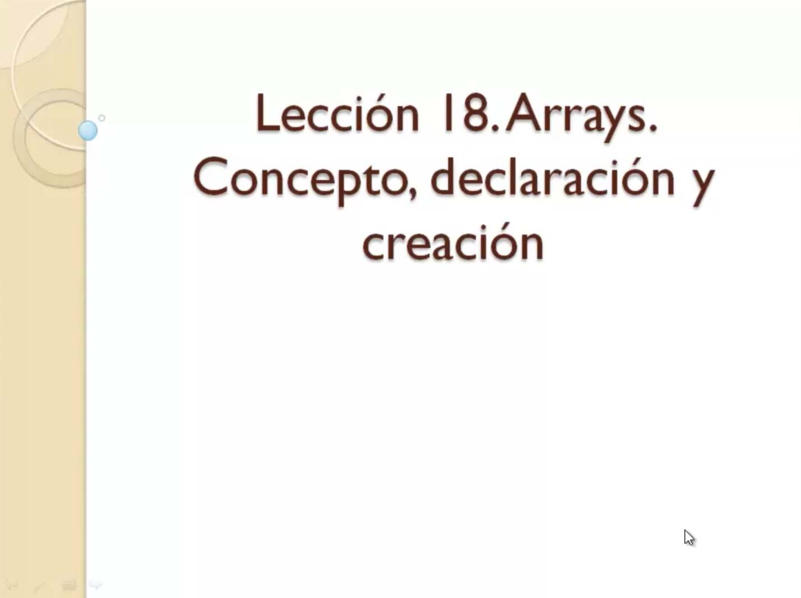

En esta lección te voy a explicar una estructura de programación muy utilizada en cualquier lenguaje que es el array.

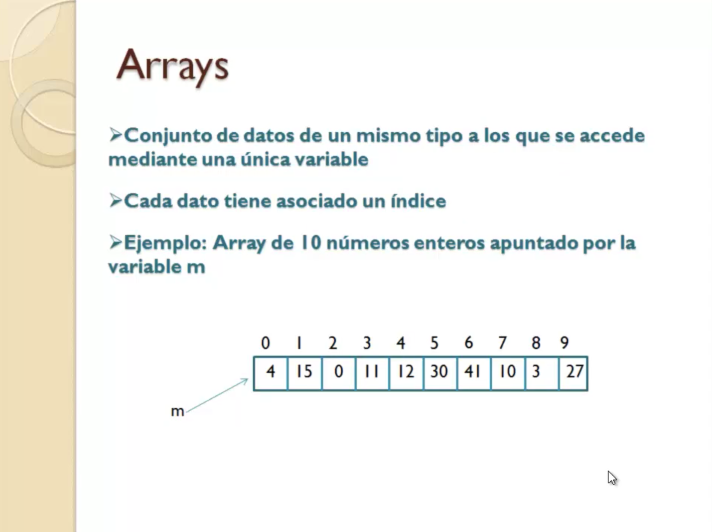

¿Qué que es un Array? Un Array es un conjunto de datos de un mismo tipo a los que vamos a poder acceder no con varias variables sino con una única variable. 

Vamos a ver si nos imaginamos una variable como una caja en la que almacenamos un dato de un determinado tipo. Podríamos decir que un Array es como un conjunto de cajas pegadas una detrás de otra, lo que pasa es que en vez de tener un nombre cada una de esas cajas hay un único nombre, una única variable que permite acceder a un único identificador que es lo que se asigna a las variables, para acceder a todas esas posiciones, a todas esas cajas que conforman el array. Y cómo podemos hacer para que con una única variable, un único identificador podamos acceder a todas esas posiciones, cada una de ellas tiene asociado un índice, el primer elemento de ese conjunto de datos que forman el array tendría posición 0, el siguiente 1 y así sucesivamente.

Aquí ves en este ejemplo de la diapositiva un array de 10 números enteros donde tenemos una serie de números almacenados 4,15,0 etc. y cada uno asociado a una posición.

Cuando se trata de hacer una operación o un grupo de operaciones con un conjunto de datos en el mismo grupo de operaciones con todos esos datos, en vez de tenerlos cada uno en una variable es mejor almacenarlos en un array de modo que podríamos utilizar las estructuras repetitivas tipo `for` o `while` para poder ejecutar las mismas instrucciones con todos los elementos que conforman dicho array, ya lo verás en los ejemplos que vamos a hacer en posteriores lecciones.

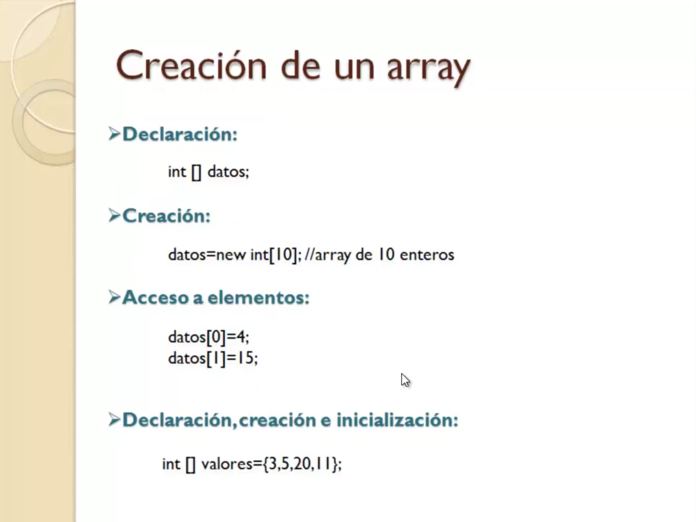

Lo primero cómo creamos un array, para crear un array dado que va a estar almacenada en una variable hay que declarar dicha variable, fíjate cómo sería la declaración:

`int [] datos;`

tipo de datos que vamos a almacenar en el array, corchete y cierre de corchete y nombre de la variable donde se va a almacenar, no se indica tamaño ni nada.

Es en el momento de la creación del array cuando ya le damos un tamaño a través del operador `new` muy utilizado en Java para construir objetos a partir de clases, porque en definitiva eso no es importante pero que sepas que un array es un objeto, bueno pues para construir un array utilizamos el operador `new` seguido del tipo de dato de ese array y ahora ya si entre corchetes indicaremos el tamaño del array.

`datos = new int[10]; //array de 10 enteros`

Por ejemplo si es un array de tamaño 10 indicaremos el número 10 entre corchetes.

Esta instrucción crea un objeto array y lo almacena en la variable `datos` la variable que va a almacenar el objeto o la referencia al objeto de array para poder después utilizar dicha variable para acceder a él.

Y cómo se accedería a ese Array, como se accedería a cada uno de los elementos, cada una de las posiciones utilizaríamos el nombre de la variable como ves aquí:

```java
datos[0]=4;
datos[1]=15;
```

En este caso queremos acceder a la posición 0 para almacenar el número 4 y a la posición 1 para almacenar el número 15 etc.

Por supuesto si de lo que se trata es de mostrar el contenido de las posiciones también esta expresión `datos[i]` haría referencia al dato para leerlo y hacer alguna operación con el. 

Podemos hacer la declaración, la creación y la inicialización del array, asignación de datos a cada una de las posiciones todo en una misma instrucción.

`int [] valores = {3, 5, 20, 11}`

Declaramos el tipo y en este caso corchetes apertura cierre vacíos, nombre la variable y a continuación el signo igual y entre llaves la lista de datos que van a conformar ese array.

Esto ya hará que implícitamente al ejecutarse este programa que se construya un array en este caso de tamaño 4 y cada una de esas posiciones desde cero hasta la 3 sera inicializado con uno de esos valores que ves.

La primera con 3, la siguiente con 5, el siguiente con 20 y la siguiente con 11.

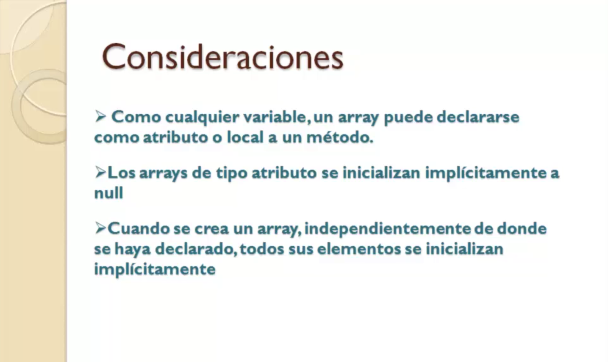

Consideraciones que tenemos que tener en cuenta cuando vamos a trabajar con una array, como cualquier variable se puede declarar o bien como atributo al principio de la clase o bien como una variable local dentro de un método, si se declara como un atributo implícitamente un array es inicializado a `null`, `null` es una palabra reservada de Java que la utilizaremos con objetos, representa el objeto nulo. Evidentemente si es local esa variable no se inicializa a nada, ya sabemos que las variables locales hay que asignarles algo antes de ser utilizadas.

Cuando creamos un array independientemente de que sea atributo o sea una variable local todos sus elementos se van a inicializar implícitamente asignando un cero a cada una de las posiciones de ese datos.

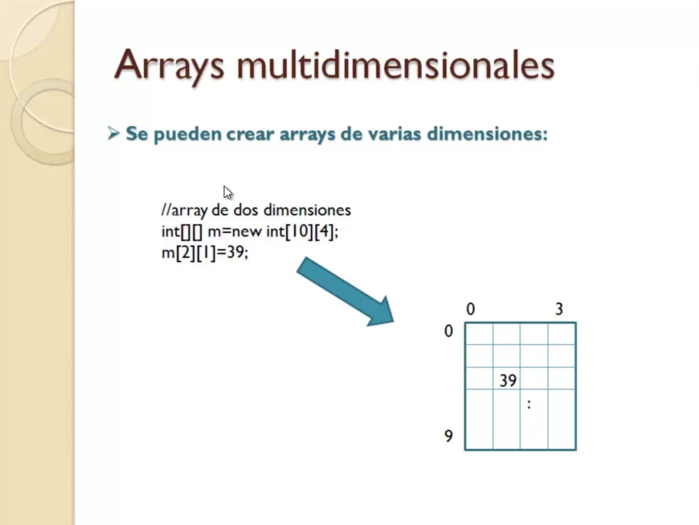

Por ultimo comentarte que podemos también trabajar aunque no es habitual porque no se utilizan demasiado con arrays de varias dimensiones, es decir nosotros nos imaginamos un array como los que hemos visto antes como una fila, un conjunto de cajitas una detrás de otra. Pero podemos tener arrays de dos dimensiones que podemos imaginar como una especie de tabla de datos repartidas en filas y columnas 

En el ejemplo de la diapositiva es que como utilizaríamos un array de dos dimensiones

`int [][] m = new int[10][4]`

El primer número representaría las filas de esa tabla y el segundo las columnas de modo que un array `[10][4]` como en este caso sería realmente un array de 10 por cuatro elementos, 40 elementos.

Para acceder a cada una de las posiciones evidentemente tenemos que utilizar dos índices para la primera dimensión y para la segunda dimensión.

`m[2][1]`

En la siguiente lección vamos a ver cómo utilizar un array directamente desde un programa para recorrerlo de cara a almacenar información y ejecutar un grupo de instrucciones que se ejecuten con cada una de las posiciones del array y también para la lectura de la información que es para lo que más vamos a utilizar.

# 19 Recorrido de un array 05:34

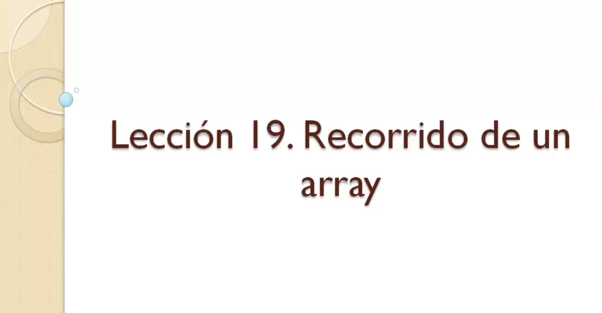

En la lección anterior hemos estudiado que son los arrays, en esta lección vamos a ver cómo recorrer el contenido de un array utilizando una instrucción `for`.

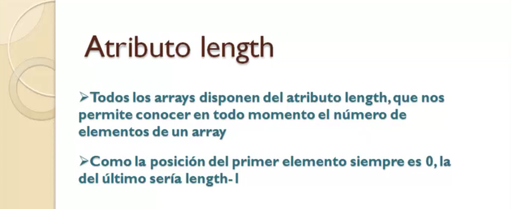

En primer lugar vamos a hablar de un atributo que exponen todos los objetos array sean del tipo que sean llamado `length`, que significa que exponen un atributo, bueno los arrays son objetos entonces disponen de propiedades o atributos que es como les llamamos habitualmente en Java, disponen de métodos pero en el caso de los arrays lo que nos interesa es uno de esos atributos concretamente `length` que nos va a decir en todo momento cuál es la longitud de un array, hay que tener en cuenta que un array es una estructura de datos estática, una vez que lo creamos le damos un tamaño, pues ese tamaño no puede ser modificado, entonces si el array está siendo tratado en muchas partes del programa es posible que en algún momento no sepamos exactamente qué tamaño va a tener o qué tamaño tiene porque no sabemos o desconocemos en una parte del código en qué momento se habrá creado y de qué tamaño sea. Entonces si en algún momento necesitamos conocer su tamaño a través del atributo `length`, utilizando la expresión `nombreArray.length` puedes saber cuántos elementos tiene, eso qué significa.

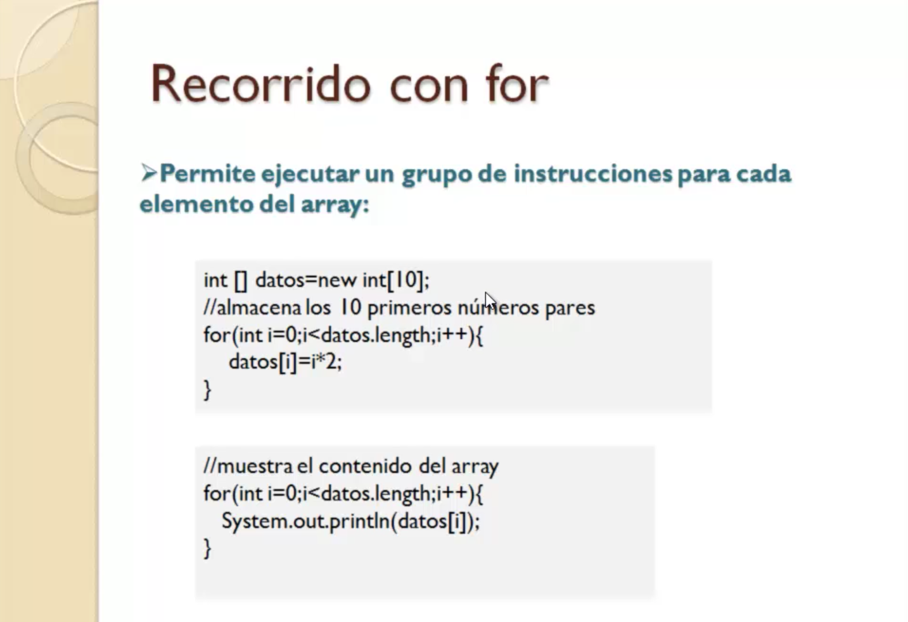

Lo vemos aquí, que si yo quiero recorrer el contenido de un array para hacer algo con él, como almacenar información en cada una de sus posiciones o como comúnmente se hace para leer el valor de cada una de esas posiciones, podemos utilizar esta estructura:

```java
int [] datos = new int[10];
//almacena los 10 primeros números pares
for(int i=0; i < datos.length; i++){
   datos[i] = i*2;
}
```

Todos los arrays comienzan en la posición 0 por lo que la ultima sera `length-1`.

Entonces si nosotros planteamos un `for` cuya variable de control empieza en 0 y llegue hasta la condición `i < datos.length` significará que va a ir pasando por todos los números desde 0 justo a longitud menos 1, usando ese número, esa variable de control podemos acceder a la posición del array, lo que va a hacer que este bucle haga lo que tiene que hacer en este caso por ejemplo es multiplicar la variable control por dos es decir ir calculando los números pares entre cero en adelante y almacenarlos en cada posición del array.

Pues claro la primera vez que entramos accederemos a la posición cero, la siguiente sala 1 con la variable acuerdate y el incremento que se incrementa al ejecutar al final de bloque instrucciones del `for` y así hasta la última posición, porque la condición de salida es que sea menor que la longitud del array.

En este caso vamos a almacenar los diez primeros números pares.

Otro ejemplo que en este caso lo que hacemos es leer, recuperar.

```java
//Muestra el contenido del array
for(int i=0; i < datos.length; i++){
   System.out.println(datos[i]);
}
```

Si queremos recuperar todo el contenido del array, todas las posiciones una por una desde la primera hasta la última volvemos a plantear el mismo `for` desde la posición cero que sería la del primer elemento hasta la última menos uno o lo que es lo mismo mientras la condición sea menor que la longitud.

En ese caso como ves estamos con la variable de control `i` accediendo a cada una de esas posiciones del array y mostrando su contenido por pantalla.

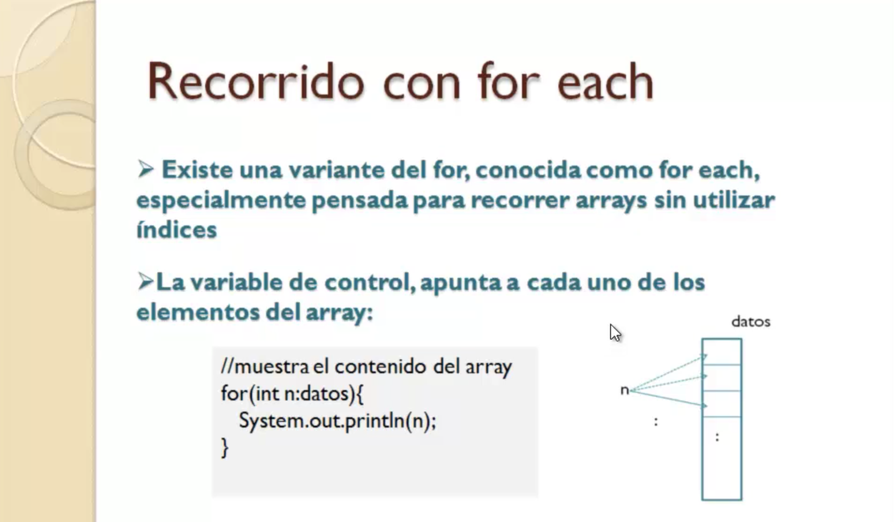

Existe una forma de recorrer también el array sin utilizar índices con la instrucción conocida como `for each` es una variante del `for` que no te la conté en el momento cuando vimos la sesión de control porque es especifica de arrays y también de colecciones que es otra estructura de datos un poquito más compleja.

Bueno en el caso de los arrays existe una variante como decía el `for` que se llama `for each` que nos permite recorrer el contenido de un array, **siempre de lectura, muy importante eso siempre lectura, sin necesidad de índices**.

Cómo funciona esto.

```java
//Muestra el contenido del array
for(int n:datos){
   System.out.println(n);
}
```

Aquí la tiene en esta variante del `for` no hay tres instrucciones como en el `for` clásico sino solamente una, declaramos una variable de control dos puntos el array que vamos a recorrer, no tenemos que indicar nada más, esto cómo se interpreta, se interpreta que para cada elemento del array, por eso lo llamamos habitualmente `for each` a pesar de que el nombre de la instrucción realmente es `for`, para cada uno de los segmentos del array hacer el `System.out.println(n)`, la variable `n` no es un índice es una variable del tipo de dato del array. Si tenemos un array de tipo entero, la variable `n` que declaramos es de tipo entero y lo que hace esa variable es ir, como ves apuntando a cada una de las posiciones del array, repito no representa un índice es una variable que va a ir adquiriendo cada uno de los valores del array.

Por lo tanto cuando hacemos referencia a `n` en el interior del `for` nos estamos refiriendo al contenido de esa posición, la posición actual, ya se encarga Java de ir cogiendo esa variable e ir apuntándola a cada uno de los elementos del array sin que nosotros le digamos dónde hay que empezar o dónde hay que terminar.

Es una instrucción que encontramos en el lenguaje Java desde la versión Java 5 ya son bastantes años la que con la que contamos con esta instrucción.

Y como digo si no necesitas el índice para nada resulta bastante más compacta.

# 20 Ejercicio práctico VII 09:12


Muy bien vamos a realizar un par de ejercicios donde pongamos en práctica el uso de los arrays en Java.


En este primer ejercicio vamos a realizar un programa en el que a partir de un array que tiene almacenados 10 números enteros cualquiera se nos va a mostrar en pantalla la media de esos valores almacenados así como también su valor máximo.

Vamos a nuestro entorno de desarrollo Eclipse y vamos a crear el proyecto Java `601-07-Ejercicio_Practico_7` y creamos la clase principal `CalculosArray`.


*`CalculosArray`*

```java
public class CalculosArray {

   public static void main(String[] args) {
		
		
      double media = 0;
      int max;
		
      int [] datos = { 4, 8, 2, 11, 8, 9, 23, 7, 11, 14};
		
      max = datos[0];
		
     for(int dato:datos) {
	media=media + dato;
	if(dato > max) {
	   max = dato;
	}
     }
     media = media/datos.length;
		
     System.out.println("La media es: " + media) ;
     System.out.println("El valor máximo es: " + max);

   }
}
```

Vamos a ejecutar el programa.

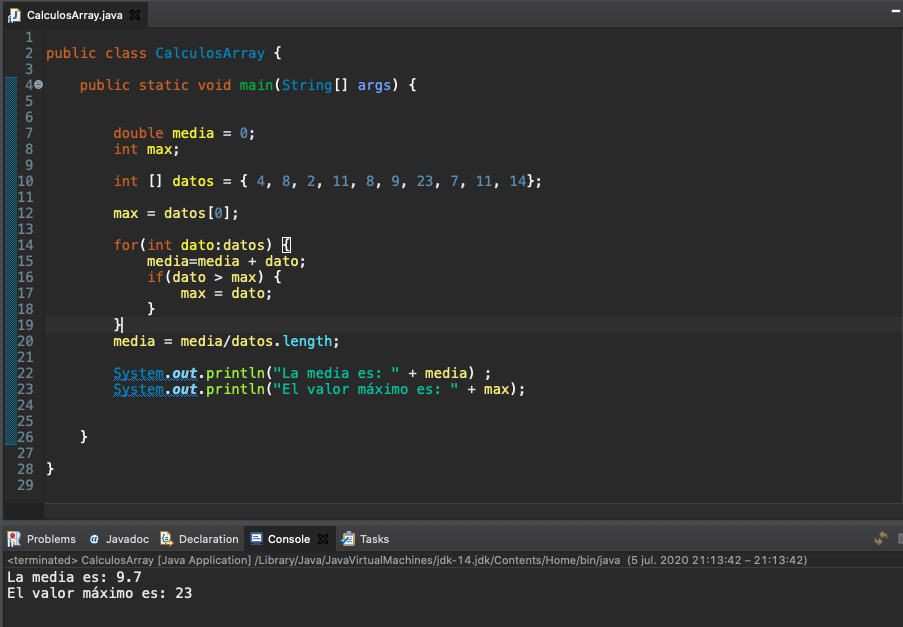

En la siguiente lección vamos a realizar otro ejercicio de arrays y ahí lo que vamos ya es por primera vez a utilizar operaciones de entrada de datos, es decir en vez de como hemos hecho hasta ahora trabajando siempre con datos introducidos previamente en variables dentro del propio programa podemos hacer algo más interactivo que el usuario pueda introducir datos del exterior.

Por eso te recomiendo que la siguiente lección leas el documento que tenemos dentro de la sección de material adicional que explica el funcionamiento de la clase `Scanner` que es una de las clase de Java estándar, porque hay otras opciones pero quizás `Scanner` es la más sencilla para lectura de datos desde el teclado.


# 21 Ejercicio práctico VIII 09:49   


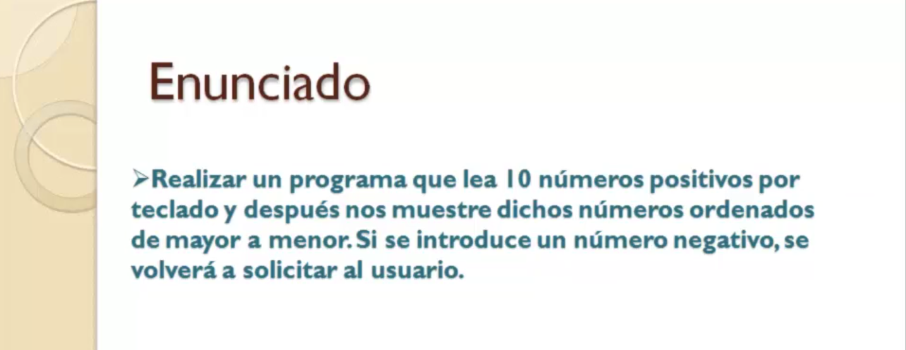

Vamos a continuación a hacer nuestro segundo ejercicio de arrays.

Para ello deberías leerte el documento de [lectura de datos por teclado]() que tenemos en la sección de material adicional dentro de esta lección ya que en este ejemplo vamos a ver el enunciado vamos a hacer un programa en el que se van a leer por el teclado la introducción de diez números el usuario del programa tendrá que introducir diez números uno detrás de otros y le seguirá pidiendo y lo que va a hacer nuestro programa es ordenar los números y presentarlos ordenados de mayor a menor o de menor a mayor eso ya como queramos en este caso vamos a hacerlo de mayor o menor.

Una particularidad del ejercicio es que si se introduce un número negativo mientras el usuario está solicitando esos números el programa le dirá que es erróneo que vuelva de nuevo a intentarlo.

Así hasta conseguir diez números positivos.

Bien pues nada vamos a ello aquí tenemos un entorno de desarrollo Eclipse donde yo ya tengo creado el proyecto número 9 para el ejercicio práctico 8 donde tenemos ya todo preparado para empezar a programar.

De hecho este programa es un poquito más largo pues ya lo tengo yo hecho y vamos a ir pegando partes para ir analizándolas y explicando bien.

En primer lugar lo que vamos a hacer es todo el tema de la declaración de variables y creación del objeto escáner que nos va a servir para realizar la lectura porque claro como te explicamos en el ejercicio creación de un escáner para leer por teclado es recurrir a esta instrucción donde en el escáner le pasa como parámetro por lo que llamaríamos el canal de entrada de datos.

Creamos el objeto escáner y ya lo tenemos listo para leer cómo tenemos que ordenar los números.

Una vez que se ha leído pues tenemos que guardarlos en algún sitio donde en una red de 10 elementos tenemos aquí un par de variables más declaradas una donde vamos a ir guardando el número leído y otra es una variable auxiliar que utilizaremos para la ordenación.

Bueno aquí hay un error que habrá de usar la clase escáner que es lo que pasa porque esa es una clase de Java estándar que se encuentra en un determinado paquete del Java estándar los paquetes Java se utilizan para organizar clases igual que los directorios los utilizamos para organizar archivos.

Los paquetes se usan para organizar las clases entonces Java estándar.

Todas las clases están en sus correspondientes paquetes para que el compilador reconozca esta clase que vamos a usar nosotros.

Hay que importarla con una instrucción aquí que la podemos escribir pero vamos a hacer que lo haga eclipse por nosotros.

Si presionas la combinación de teclas Control Shift o automáticamente te pone Eclipse la sentencia de importación no puedes escribir a mano impor Java punto útil que es el paquete y su paquete puntos Kanner que la clase esta instrucción debe ir siempre delante de la declaración de la clase.

La primera instrucción del archivo o Primera Segunda porque puede haber varios IMPO puede que utilicemos la verdad según vayas haciendo programas cada vez más complejo pues se utilizarán muchas clases entonces habrá que importarlas todas.

Bueno de hecho eso repito la combinación de teclas Control Shift de las mayúsculas o y si no lo puedes escribir a mano.

Una vez que hemos declarado las variables pues bueno vamos a empezar ya con lo que es el código como tal la lógica del programa.

Entonces vamos a ver vamos a pegar esta parte que sería la que se encarga de la solicitud de números por teclado vamos a ver aquí lo tenemos que solicitar la introducción de 10 números positivos entonces vamos a crear Infor de cero hasta al menos uno porque cada número positivo en una posición del array. 

Aquí como estamos utilizando el foro para recorrer el array para escribir obviamente es normal.

Solicitamos el número mandamos el mensaje y el método Next-Gen como te explicamos en ese documento es el que realiza la lectura del dato es decir queda dejar el programa digamos bloqueado a la espera de que el usuario introduzca el número y pulsa Intro en ese momento método función devuelve un resultado que se guarda en esta variable.

Qué pasa si el número es negativo o es que no hay que guardarlo en el array.

Hay que volver a pedir otro número y así si vuelvo a meter otro negativo después del primer negativo pues así hasta que metan uno positivo tenemos un caso claro de utilización de la instrucción repetitiva guey es decir mientras el número sea menor que cero volvemos a sacar un mensaje.

En este caso uno de advertencia el número positivo vuelve a introducir y se le cómo es un buen volver a comprobar que es negativo otra vez lo mismo.

Y así hasta que por fin introduzco un positivo y entonces sigue adelante el programa siga adelante que es el número que se leyó ya por fin positivo se guarda en esa posición y vale.

Puede ser que para conseguir un número positivo hayamos tenido que leer 20 números porque ha metido 19 negativos.

Al final se ha leído el número positivo.

La variable sigue apuntando a esa posición.

No se ha enterado y ya al finalizar el foro vuelve a incrementarse la variable y pasamos para la lectura del segundo número positivo y por lo tanto almacenamiento.

En la segunda posición de la RAE y así hasta 10 min.

Con esto garantizamos tener los números ya positivos leídos dentro de la red.

Ahora vamos a la ordenación vamos a ver tenemos aquí el programa y ya también podemos poner la parte última de mostrar el contenido de dicho rey en pantalla que es bastante sensible.

La ordenación.

Digamos que es lo llamativo de este programa aparte de lo que es ya la lectura de números que la primera vez que lo hacemos porque claro pero bueno la ordenación emplea lo que se llama el método de la burbuja que consiste en que para cada elemento del array vamos comprobando ese elemento con los siguientes y si nos encontramos uno en esos siguientes menor o mayor depende de cómo queramos hacer la ordenación de mayor o menor o de menor a mayor.

En este caso lo queremos hacer una ordenación de mayor a menor.

Entonces si nos encontramos un número lossiguientes mayor que ese número se hace una sustitución. 

Estas tres instituciones que tenemos aquí para hacer una sustitución la sustitución es meter en la posición y lo que hay en casa y lo que ahí había y entonces eso requiere utilizar una variable auxiliar que habíamos declarado que antes guardamos el contenido de la posición y en esa variable auxiliar para digamos sobreescribir el contenido de la posición y con lo que hoy en día y como ayer lo teníamos Salvado lo anterior y en HAWX lo volcamos en la posición.

Es decir es un intercambio una sustitución o no intercambio que ya tenemos hecho el intercambio y entonces haciendo eso con cada elemento de la raíz para cada uno de subsiguientes nos garantiza la ordenación según el criterio que hemos establecido en este caso de mayor a menor.

Si fuera de menor a mayor pues habría que hacer la pregunta al contrario lógicamente una vez que ya se ha ordenado ves que aquí como dependemos de los índices de las posiciones tenemos que utilizar estándares aunque sean operaciones de lectura buena también son de escritura porque vamos a acceder a las posiciones obviamente entonces aquí tenemos que utilizar el estándar pero ya para lo que es mostrar el contenido ya tenemos el argayo ordenado y queremos simplemente mostrar lo que tiene un Follies es la variable de control apuntaría a cada uno de los valores de la red y números y los mostraría separando por una.

Vamos a probarlo vamos a ejecutar el programa y empezamos introduce un número metemos el 5 por ejemplo introduce un número.

Ahora vamos a forzar una equivocación en menos tres que no es positivo.

Vuelvo a intentarlo Bueno pues resulta que vuelvo a meter mi voto otro negativo que no es positivo que volvemos a intentarlo ya por fin le damos el 7 o salga el siguiente mensaje de introducir otro número más nueve.

Ya hemos visto que lo de la equivocación está controlado vamos a ir metiendo ya positivos 8 por ejemplo los que llevamos 3 y ya por fin los números son como ordenados de mayor a menor el mayor que metimos por aquí fue 44 después el 18 11 9 y se ha repetido pues el orden es indiferente evidentemente.

Bueno pues aquí ha visto un ejercicio donde se combinan ya un poquito de todo.

Pues instrucciones repetitivas de tipo for Weyl uso de raíz además una operación muy clásica de la RAE y la primera es que a lo mejor puede resultar poco compleja que es el tema de la ordenación pero bueno nosotros siempre siempre es así con Foro admirados aplicando la metodología que te he dicho instrucciones tan alternativas lógicamente frizz.

Y bueno esta novedad de la lectura de datos con teclado que ya hace que los programas sean más interactivos.

Esto ya lo utilizaremos en el resto de ejercicios prácticos que hagamos más adelante.
