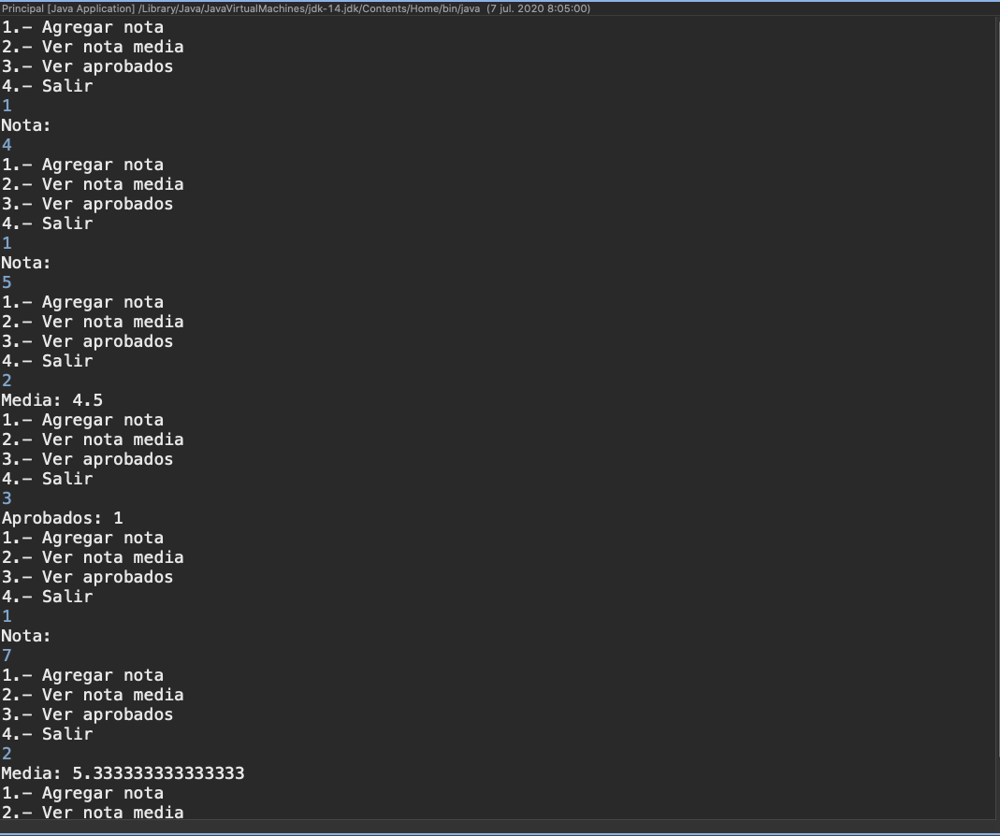

# 5. Creación de clases 31:54
   * 22 Clases, objetos y métodos 07:14
   * 23 Creación de objetos 03:21
   * 24 Creación de clases propias 05:17
   * 25 Ejemplo práctico IX 16:02
   
# 22 Clases, objetos y métodos 07:14


Bueno llevamos desde el principio del curso hablando de lo que es una clase, objetos, métodos, creo que es el momento de entrar en detalle a estos conceptos y de aclarar las diferencias entre ellos.


Lo primero que es una **Clase**, una clase digamos que es el lugar donde se define el comportamiento de un determinado tipo de objeto, la clase podríamos decir que es el molde, mientras que el objeto es el elemento físico obtenido a partir de ese molde.

En programación la clase es código donde se define el comportamiento del objeto a base de *métodos*, de *atributos*, es código y a partir de ese código se pueden crear lo que llamamos *instancias*  de esa clase que son los *objetos* de una clase, puedo crear múltiples objetos. Es sobre el objeto donde voy a ir haciendo las llamadas a los elementos que determinan ese comportamiento del tipo de objeto que se ha definido en la clase es decir los métodos.


Por ejemplo vamos a hacer una similitud con casos del mundo real, cuando hablamos de coches imaginemos una marca y modelo de coche,  una marca es el Ford KV y el modelo que es Prin 2017. Cuando hablamos de eso, el Ford KV modelo Prin 2017 estamos hablando de un tipo de coche, de una clase a partir de esa clase evidentemente se fabrican muchos objetos, muchos coches de esa marca y de ese modelo, los objetos ya son los coches físicos con su matrícula, su color, sus propiedades ya definidas. La clase en el caso de los coches definirá los métodos de las funcionalidades que tienen todo coche arrancar, frenar, acelerar y tiene sus propiedades como el color, la potencia, etc. 


Hemos dicho que el comportamiento de los objetos se define dentro de la clase a base de que, a base de *métodos* y *atributos*, ya hemos visto en todos los ejercicios que hemos hecho hasta el momento cómo se crea una clase, la palabra `class` el nombre que se le da a la clase y entre llaves el contenido los atributos que son variables, básicamente lo que representan las propiedades del tipo de objeto. 

Siguiendo con la similitud de los coches vemos unas posibles propiedades de la clase de la que estamos hablando FourKV sería su potencia, el color mientras que los métodos son las funciones que definen ese comportamiento de los objetos lo que hacen los objetos acelerar, consumo. Los métodos son funciones que reciben unos parámetros, los datos de entrada y pueden devolver unos resultados. Obviamente dentro del código de esos métodos se puede hacer uso de esos atributos para algo, el consumo pues se puede determinar a partir de la potencia y acelerar a partir de un parámetro de intensidad que a lo mejor está determinado también por la potencia, eso ya depende de cada tipo de objeto.


Ya que hemos hablado de los atributos, los atributos y los métodos digamos que como vamos a ver más adelante aunque aquí no aparecen los atributos suelen estar definidos de manera privada es decir para uso interno de la clase, mientras que los métodos suelen estar definidos de forma pública para que se usen desde afuera de la clase, es decir otros objetos que usan esta clase para crear objetos de ella podrán llamar a esos métodos mientras que los atributos suelen ser para uso interno de la propia clase.

Los métodos se aplican sobre los objetos, vamos a entrar un poquito más en detalles sobre la definición y cómo sería la llamada a un método, ya olvidémonos de objetos para llamar a los métodos, hay que tener un objeto sí, pero centrémonos exclusivamente lo que es el método en si, un método se define como ves en la diapositiva, hay un tipo de devolución, un nombre Método y luego una lista de posibles parámetros, parámetros que va a recibir, cada parámetro se define como una variable Java, un tipo y un nombre coma, tipo nombre etc..

El tipo de devolución es lo que va a devolver,  si el método no devuelve ningún resultado por qué hace lo que tiene que hacer y no da ningún resultado al punto de llamada pues el tipo de devolución será `void`.

Cómo se hace la llamada a métodos, la llamada a un método si se aplicará sobre un objeto pero en definitiva lo que es la parte de la llamada a ese método es con el nombre del método y entre paréntesis la lista de datos que coinciden con los parámetros que va a recibir, es decir en esos parámetros que son variables se van a meter datos en la llamada que son los llamados argumentos.

Aquí ves unos ejemplos.

```java
int test(int n) {...}
void mostrar(){...}
```

Tenemos un método llamado test que va a devolver un entero y recibe como un parámetro un número entero. Así es como se declararía independientemente de lo que haga.

Un método que no devuelve nada, como decía antes tipo de devolución void, el nombre del método y bueno puede que no recibe ningún parámetro, si no recibe ningún parámetro se tienen que poner los paréntesis igualmente.

Cómo sería la llamada a esos métodos.

```java
int a = test(25);
mostrar()
```

Poniendo el nombre del método y entre paréntesis el valor o argumento de llamada, el número 25 se volcaría en la variable `n`, lo que hagamos dentro del método con `n` contendría el valor 25 que le hemos pasado. Cómo este método devuelve un resultado fíjate que ponemos la llamada al método a la derecha del igual de una declaración de variable lo que significa que cuando el método termina la ejecución el resultado se guardará en dicha variable.

Tienes también un ejemplo de una llamada a un método que no devuelve nada, como ves no hay variable que tenga que recoger el resultado porque es `void` y a la hora de llamarlo aunque no reciba parámetros los paréntesis deben indicarse.

Con esta explicación de lo que son las clases, objetos, métodos un poco más en detalle ya podemos seguir avanzando en la creación de clases y la utilización dentro de un programa porque como puedes imaginar, un programa no solamente está formado por la clase con el método `main`, se organiza en varias clases, con varios métodos y es lo que vamos a ir viendo en las siguientes lecciones del curso.

# 23 Creación de objetos 03:21


Las clases definen el comportamiento de un determinado tipo de objetos y cómo creamos un objeto a partir de una clase.


Lo primero es que tenemos que saber que a los objetos creados a partir de la clase se les conoce habitualmente también como **instancia de la clase**, de una clase podemos crear múltiples instancias, múltiples objetos.

Y cómo creamos una instancia o un objeto a partir de una clase. Primeramente declaramos una variable de la clase o sea del tipo de objeto que vamos a crear y con el operador `new` a continuación el nombre de la clase y entre paréntesis, eso ya depende de qué tipo de objeto sea, de qué clase trabajemos habrá que proporcionar valores dentro de los paréntesis o no.

El caso es que la instrucción `ClaseA c = new ClaseA()` lo que hace es crear en memoria una instancia un objeto y lo referencia a través de la variable `c`, en este caso así es como la hemos llamado, *referencia* qué significa exactamente, que el objeto como tal está contenido dentro de la variable como ocurre con los tipos primitivos. Por ejemplo cuando declaras una variable de tipo int y le asigna un número ese número queda dentro de la variable. En el caso de los objetos la variable contiene referencias, dejémoslo así, porque no son tampoco exactamente direcciones de memoria, pero bueno es algo que luego me permite utilizando esa variable, acceder a los métodos del objeto, métodos que están definidos dentro de la clase como hemos visto.


Como se hace, utilizando el operador punto, es decir una vez que has creado la instancia y la tienes referenciada por la variable, utilizando un operador punto nombre del método y entre paréntesis los datos que se necesite dependiendo del método que sea podemos hacer la llamada a dichos métodos.


Ejemplos, te presentamos aquí algunos ejemplos de los muchísimos que hay y los posibles tipos de objetos que vas a crear a lo largo de tu vida como programador en Java.

Si acaso empezamos con este medio porque ya lo hemos visto ya lo hemos utilizado esto este tipo de objetos.

```java
Scanner sc= new Scanner(System.in);
System.out.println(sc.nextLine());
```

La clase Scanner concretamente para poder realizar lectura de datos por teclado, declaras una variable del tipo de objeto que vamos a crear Scanner y con el New creás el objeto, se quedaría en memoria y el objeto lo es que es la referencia al mismo se guardaría dentro de la variable. A partir de ahí ya puedes llamar a los métodos `nextLine()`, `nextInt()` para  la lectura en este caso. En el caso de Scanner concretamente  hay que proporcionarle lo que llamamos el canal de entrada `System.in` eso ya depende de cada tipo de objeto.

```java
ArrayList datos= new ArrayList();
datos.add("primero");
```

Aquí tienes otro caso ArrayList, ArrayList es un objeto de tipo colección y bueno para crearlo `new ArrayList()`  nombre de la clase en este caso no hay que proporcionas nada entre paréntesis nos creería la referencia y a partir de ahí llamar a los métodos.

```java
PrintStream ps= new PrintStream("salida.txt");
ps.println("fila de datos");
```

Otro más PrintStream para la escritura por ejemplo en ficheros, en este caso igual declaramos la variable con el New creamos el objeto, en este caso se le proporciona la dirección del fichero y se crearía el objeto y a partir de ahí a escribir.

Y esto es la mecánica de trabajar en todas las aplicaciones Java, ir creando objetos de clases o bien existentes o creadas por nosotros y llamar a los métodos que ofrecen la funcionalidad.

# 24 Creación de clases propias 05:17

### Creación de clases en Java

En esta lección, te voy a enseñar los detalles de la creación de  clases en Java. Realmente, llevamos haciéndolo desde el primer ejemplo que presentamos el primer ejemplo de Java, pero siempre nos limitábamos a crear la clase con el método main y escribir dentro de ella nuestro código.

En un programa real, no se escriben  todas las instrucciones dentro de la clase principal, sino que el código suele organizarse en varias clases. A parte de la principal, se crean clases para implementar las operaciones de lo que sería la lógica de aplicación, además de otras para encapsular o agrupar los datos asociados a una entidad (JavaBean).

A continuación, vamos a recordar como es la estructura de una clase y seguidamente veremos como encapasular la lógica de los programas dentro de una clase. Seguidamente, te presentaré los métodos estáticos y constructores, elementos estos últimos  presentes también en todas las clases Java.

### Estructura de una clase

Como sabemos, una clase define el comportamiento de un tipo de objeto. Dentro de la clase se codifican los métodos que expondrán los objetos creados de dicha clase. Además, las clases pueden contener atributos para almacenar las características de los objetos.

Imaginemos que queremos trabajar con objetos de tipo Coche, una posible implementación de la clase Coche sería:

```java
class Coche{

   private String color;

   private int potencia;

   public void arrancar(){

      :

   }

   public int consumo(){

      :

   }

}
```

El código es similar al que te presenté cuando estudiamos en la lección 22, los principios de las clases. En este ejemplo, verás que los atributos vienen definidos con la palabra *private*, que significa que no queremos que se puedan ver desde fuera de la clase, es decir, al crear el objeto no se tendrá acceso directo a los atributos, son para uso interno de la misma.

Lo métodos, por el contrario, están definidos como *public*, lo que significa que cualquier otra clase que cree objetos de esta podrá llamarlos.

La creación y utilización de un objeto de esta clase, que se realizaría desde cualquier otra clase, por ejemplo la principal, sería:

```java
Coche c=new Coche();

c.arrancar();

System.out.println(c.consumo());
```

Como hemos hecho ya en algunos ejemplos de código que has visto, una vez creado el objeto y almacenada su referencia en la variable, llamamos a los métodos del mismo a través del operador punto.

### Separación de lógica de aplicación en clases independientes

Como te comentaba, utilizaremos la creación de nuevas clases en un programa, a parte de la principal, para encapsular las operaciones de la lógica de aplicación dentro del programa.

Pongamos un ejercicio de ejemplo. Queremos crear una aplicación para calcular operaciones básicas entre dos números (suma, resta, multiplicación y división). El programa obtendrá los números de algún lugar, que ahora no nos interesa para nuestro propósito, y mostrará en pantalla el resultado de las operaciones indicadas.

Para realizar este programa, crearemos dos clases. Una de ellas será la clase principal, con el método main, donde tendremos las instrucciones para obtener los números y presentar los resultados, la otra será una clase a la que llamaremos Calculadora, donde tendremos los métodos con las operaciones a realizar sobre los números.

Y empezamos por esta clase Calculadora. Aquí tenemos el código de como sería dicha clase:

```java
public class Calculadora {

   //atributos donde guardamos los

   //números con los que se va a operar

   private int x,y;

   public int sumar(){

      return x+y;

   }

   public int restar(){

      return x-y;

   }

   public int multiplicar(){

      return x*y;

   }

   public int dividir(){

      return x/y;

   }

   public void guardarX(int x){

      this.x=x;

   }

   public void guardarY(int y){

      this.y=y;

   } 

}
```

Como ves, utilizamos dos atributos para guardar los números con los que vamos a operarar. Por tanto,  además de los métodos que realizan las operaciones, hemos incluido otros dos métodos para poder dar valores a los números.

Puede que te llame la atención las instrucciones

```java
this.x=x;
```

 y

```java
this.y=y;
```

Usamos la palabra reservada *this* para poder referirnos a la variable atributo, y es que, como el parámetro del método tiene el mismo nombre, usamos *this* si queremos llamar al atributo.

A continuación, tenemos lo que sería la clase principal que, a partir de dos números cualquiera, crea un objeto de la clase Calculadora y llama a los métodos correspondientes:

```java
public class Principal {

   public static void main(String[] args){

      int a=25;

      int b=10;

      Calculadora c=new Calculadora();

      c.guardarX(a);

      c.guardarY(b);

      //hacer operaciones

      System.out.println("Suma: "+c.sumar());

      System.out.println("Restar: "+c.restar());

      System.out.println("Multiplicar: "+c.multiplicar());

      System.out.println("Dividir: "+c.dividir());

   }

}
```

### Métodos estáticos

Como puedes ver en el ejercicio anterior, los métodos sumar, restar, multiplicar y dividir utilizan los atributos del objeto para realizar la operación. Si tuviéramos objetos diferentes, cada objeto tendría sus propios atributos y las operaciones, lógicamente, darían resultados distintos.

Pero hay casos en los que los métodos no utilizan los atributos de la clase y la operación que realizan es independiente del objeto, solo trabajan con los parámetros recibidos y la operación daría el mismo resultado con cualquier objeto con el que se le llamara. A estos métodos los llamamos métodos estáticos, y podrían llamarse sin necesidad de crear un objeto de la clase, simplemente usando la expresión:

```java
Clase.metodo();
```

Por ejemplo, imaginamos que queremos añadir a la clase Calculadora un método que reciba un número como parámetro y calcule el factorial del mismo. Este sería el método

```java
public static int factorial(int n){

   int r=1;

   for(int i=1;i<=n;i++){
    
      r=r*i;

   }

   return r;

}
```

El método está declarado con la palabra reservada static. A la hora de llamarlo desde la clase principal sería:

```java
System.out.println("Factorial de 5: "+Calculadora.factorial(5));
```
 

Dentro de los métodos estáticos se podrían utilizar solo atributos que también estuvieran definidos como static, y **no podemos hacer uso de la palabra this**.

### Constructores

Un constructor es un bloque de código que se incluye dentro de una clase y que se ejecuta cada vez que creamos un objeto de dicha clase. Su misión es la de inicializar atributos antes de llamar a cualquier método, dado que pueden recibir parámetros a igual que los métodos. En general, realizar cualquier tarea de inicialización.

Los constructores se definen:

```java
public NombreClase(tipo param1, tipo param2){

 

}
```

Su definición es similar a la de un método, pero su nombre siempre tiene que ser igual que el de la clase y no tienen tipo de devolución (ni siquiera void).

Sería útil incluir un constructor en nuestra clase Calculadora para poder inicializar los atributos durante la creación del objeto:

```java
public class Calculadora {

    //atributos donde guardamos los

    //números con los que se va a operar

    private int x,y;

   //constructor

    public Calculadora(int x, int y){

         this.x=x;

         this.y=y;

   }

    public int sumar(){

        return x+y;

    }

    public int restar(){

        return x-y;

    }

    public int multiplicar(){

        return x*y;

    }

    public int dividir(){

        return x/y;

    }

    public void guardarX(int x){

        this.x=x;

    }

    public void guardarY(int y){

        this.y=y;

    } 

}
```
 

De cara a utilizar la clase en main, podríamos pasar los números al constructor y evitar las llamadas a los método guardarX y guardarY nada más crear el objeto:

```java
public class Principal {

   public static void main(String[] args){

      int a=25;

      int b=10;

      Calculadora c=new Calculadora(a, b);

      //hacer operaciones

      System.out.println("Suma: "+c.sumar());

      System.out.println("Restar: "+c.restar());

      System.out.println("Multiplicar: "+c.multiplicar());

      System.out.println("Dividir: "+c.dividir());

      System.out.println("Factorial de 5: "+Calculadora.factorial(5));

   }

}
```
 
### Constructores por defecto

Hay que decir que toda clase Java incluye un constructor y si nosotros no lo creamos explícitamente, el compilador lo hará por nosotros. Este constructor creado por el compilador se le conoce como constructor por defecto y es un constructor que no recibe parámetros no tampoco incluye código, en otras palabras, que no hace nada, pero es necesario que exista para poder crear un objeto de la clase.

La primera versión de la clase Calculadora que hicimos no tenía constructor creado por nosotros, por lo que el compilador le añadió uno por defecto con el siguiente aspecto:

```java
public Calculadora(){

}
```

Gracias a la existencia de este constructor, pudimos crear objetos de la clase Calculadora de la forma:

```java
Calculadora c=new Calculadora();
```
 
# 25 :computer: Ejemplo práctico IX `601-10-Ejercicio_Practico_9` 16:02 


Después de haber visto la elección anterior cómo crear clases para encapsular la lógica de aplicación de un programa. Vamos a poner en práctica dichos conocimientos en el siguiente ejercicio práctico.


Se trata de un programa en el que al inicio se va a aparecer un menú, hasta ahora no habíamos hecho ningún problema con estas características tan interactivo como el que vamos a realizar ahora.

Dicho menú tendrá cuatro opciones para un programa de gestión de notas y en la primera opción se nos solicitará introduciendo una nota al elegirla el usuario simplemente se le va a pedir que introduzca dicha nota y esa nota se almacenará ,se guardará dentro del programa.

Las notas se van a guardar en un array, como los arrays tienen un tamaño fijo y en nuestro caso vamos a limitarlo a 10 el tamaño del array va a ser 10. Por tanto si se elige la opción 1, teniendo ya 10 elementos nos informará de que el array está lleno y que no se admiten más notas. En cuanto a la opción 2 simplemente se mostrará la media de todas las notas que estén registradas hasta el momento. En la opción 3 el número de aprobados. Y se elija la que se elija tras procesarse dicha opción se volverá de nuevo a presentar el menú y así hasta que se elija la opción 4 que es la que teníamos prevista para abandonar el programa.

Vamos a crear el proyecto de Java en Eclipse llamado `601-10-Ejercicio_Practico_9`.

En este caso lo que vamos a hacer para poder desarrollar dicha aplicación es crearnos dos clases, en una clase vamos a aislar todo lo que sería la lógica del programa, es decir la gestión de las notas, las operaciones donde vamos a añadir la nota, comprobar que sí hay espacio, hacer el cálculo de la media, el cálculo de los aprobados, etc. y la otra clase que es donde tenemos el método principal que es el punto de entrar al programa, esta la vamos a dejar para todo lo que es la interacción con el usuario y la entrada salida, la generación del menú, solicita las opciones y demás es lo que habitualmente se suele hacer en un programa ya mínimamente grande, tener esa separación como mínimo de dos capas y cada una creada con su clase correspondiente.

Entonces primero vamos a crear la clase donde vamos a tener todas esas operaciones sobre el array de notas, donde vamos a almacenar la información, la vamos a llamar `GestionNotas` la vamos a crear en el paquete `logica` y sin método `main`.

*`GestionNotas`*

```java
package logica;

public class GestionNotas {
	
	private double[] notas;
	private int total;
	
	public GestionNotas() {
		notas = new double[10];
		total=0;
	}
	
	public boolean agregarNota(double d) {
		// si hay espacio, la agrega, sino devuelve false
		if(total<10) {
			notas[total]=d;
			total++;
			return true;
		}else {
			return false;
		}
	}
	
	public double media() {
		double m=0;
		for(int i=0; i<total; i++) {
			m+=notas[i];
		}
		return m/total;
	}
	
	public int aprobados() {
		int ap=0;
		for(int i=0; i<total;i++) {
			if(notas[i] >= 5) {
				ap++;
			}
		}
		return ap;
	}
	
}
```

Fíjate que estos métodos no tienen ninguna instrucción de mandar mensajes al usuario ni nada de eso. Es pura lógica de negocio que se llama lógica de aplicación. Son métodos que realizan operaciones más adelante cuando vayas a estudiar el acceso a base de datos y demás  verás que estos métodos harán operaciones de acceder a base de datos, ficheros, etc. pero en cualquier caso esos métodos que hacen la operación correspondiente como acceso a almacenamiento permanente o no y devuelven unos resultados pero en ningún caso van a interaccionar con el usuario. Eso se deja para la otra clase y la otra capa.

Ahora vamos a crear una clase donde vamos a meter el menú, la interacción con el usuario, donde va a estar el método `main`. Vamos a llamarla `Principal` en el paquete `presentacion` y con método `main` y va a tener el siguiente código:

```java
package presentacion;

import java.util.Scanner;

import logica.GestionNotas;

public class Principal {

	public static void main(String[] args) {
		
		//Creamos un objeto de la clase que contiene las operaciones
		//de la lógica de aplicación
		GestionNotas gnotas = new GestionNotas();
		Scanner sc = new Scanner(System.in);
		int op; //opción elegida
		do{
			System.out.println("1.- Agregar nota");
			System.out.println("2.- Ver nota media");
			System.out.println("3.- Ver aprobados");
			System.out.println("4.- Salir");
			
			op = Integer.parseInt(sc.nextLine());
			switch (op) {
			   case 1:
				  System.out.println("Nota: ");
				  double d= Double.parseDouble(sc.nextLine());
				  if(!gnotas.agregarNota(d)) {
					  System.out.println("No se ha podido agregar la nota, sin espacio!"); 
				  }
				  break;
			   case 2:
				   System.out.println("Media: " + gnotas.media());
				   break;
			   case 3:
				   System.out.println("Aprobados: " + gnotas.aprobados());
				   break;
			   case 4:
				   break;
			   default:
				   System.out.println("Debes escribir una opción válida.");
			}
		}while (op!= 4);
	}
}
```

Vemos que vamos a hacer uso de la clase `GestionNotas` y de `Scanner` la cual se debe importar de `java.util.Scanner`. Creamos un objeto gestión notas y a partir de ahí ya podremos llamar a los métodos que hemos visto de añadir nota, media, etc. También creamos el `Scanner` para poder hacer la lectura de datos. 

Montamos el menú que se repite hasta que elija la opción 4 con un `do-while`.

Se está esperando que el usuario introduzca la opción del menú, la leemos y la convertimos en una instrucción para convertir un texto a un entero. Por qué no la leemos con `nextInt()`. Una cosa que comentábamos cuando explicamos en el documento el funcionamiento de `Scanner` es que no se podría utilizar el mismo `Scanner` para leer textos y números, entonces como hay que leer por un lado números y por otro lado textos una opción para olvidarse digamos de tener que tener dos objetos `Scanner` sería leerlo todo como texto, lo lees como texto y si se espera un número se convierte ese texto en número. En el caso de la opción lo convierte a entero.

Pues una vez que ya tenemos el entero lo comprobamos y en función de la opción elegida actuamos si es la opción 1 pues mandamos un mensajito para que introduzca la nota, leemos la nota y vemos que volvemos otra vez a usar siempre el mismo scanner sin preocuparnos de que si una vez tiene que ser entero, doble o texto da igual el mismo escáner para leer todo que es doble lo que está leyendo en este caso usamos `Double.parseDouble(sc.nextLine())` para convertir la nota a doble y llamamos a agregar nota pero agregar nota nos va a dar un resultado booleano en caso de ser falso nos manda un mensaje de que ya no hay espacio para insertar la nota.

Y si la opción es 2 llamamos al método media como método nos devuelve un resultado y lo mostramos como parte del mensaje y si la opción es 3 lo mismo llamamos al método aprobados que nos va a devolver un resultado lo mostramos en el mensaje, fíjate que aquí no hacemos cálculo de media ni interaccionan con el array eso está encapsulado en gestión.

Aquí nos dedicamos a la entradas tenemos contemplado también que si mete un número que no sea ni uno ni dos ni tres ni cuatro pues que le digan que la opción no es válida.

Solo cuando pulso 4 pero el while deja de cumplirse y por lo tanto es que se finaliza el programa. 

Vamos a probarlo ejecutamos el programa principal botón derecho una aplicación y aquí tenéis el menú.


