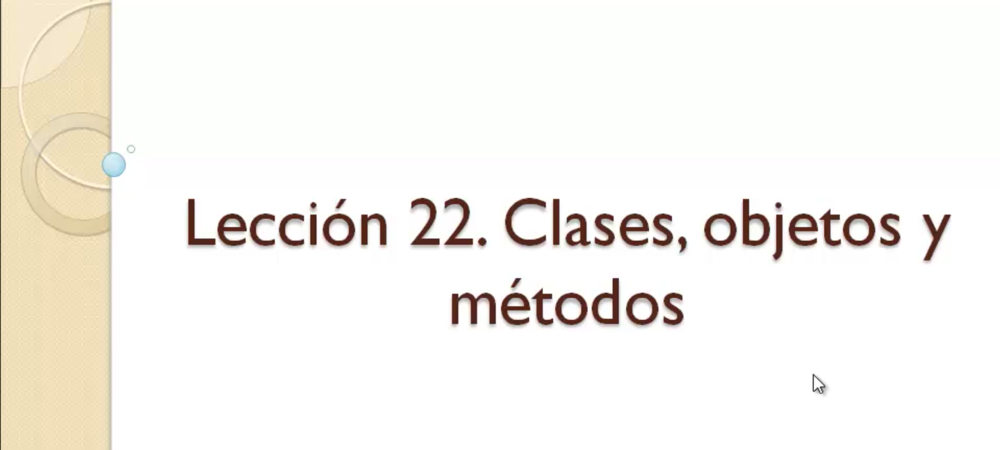
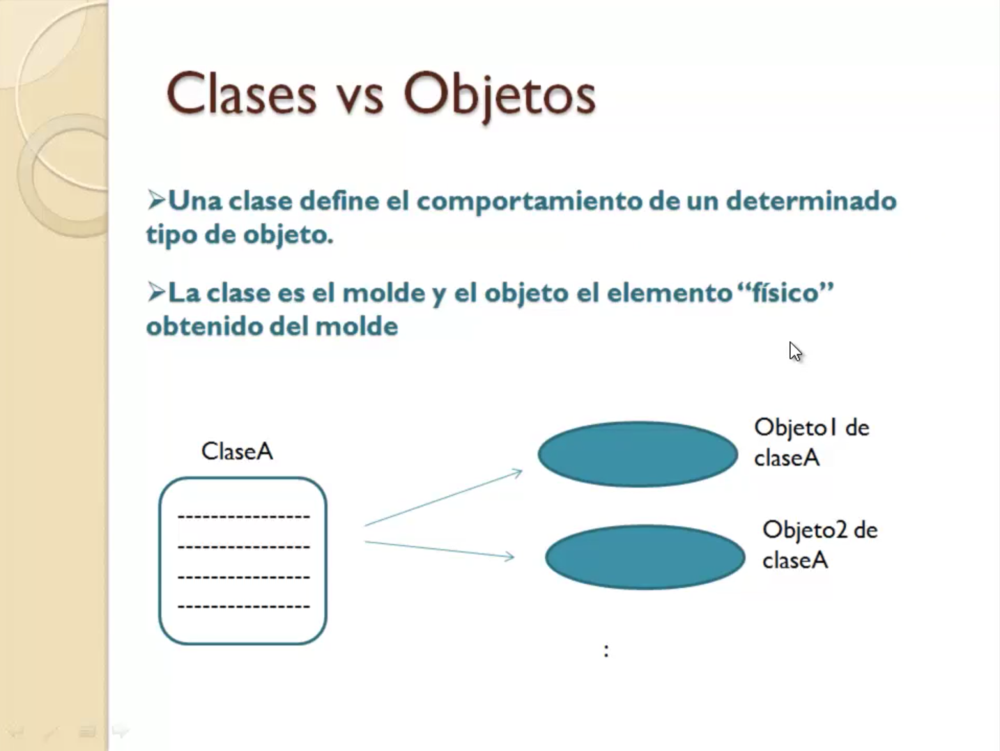
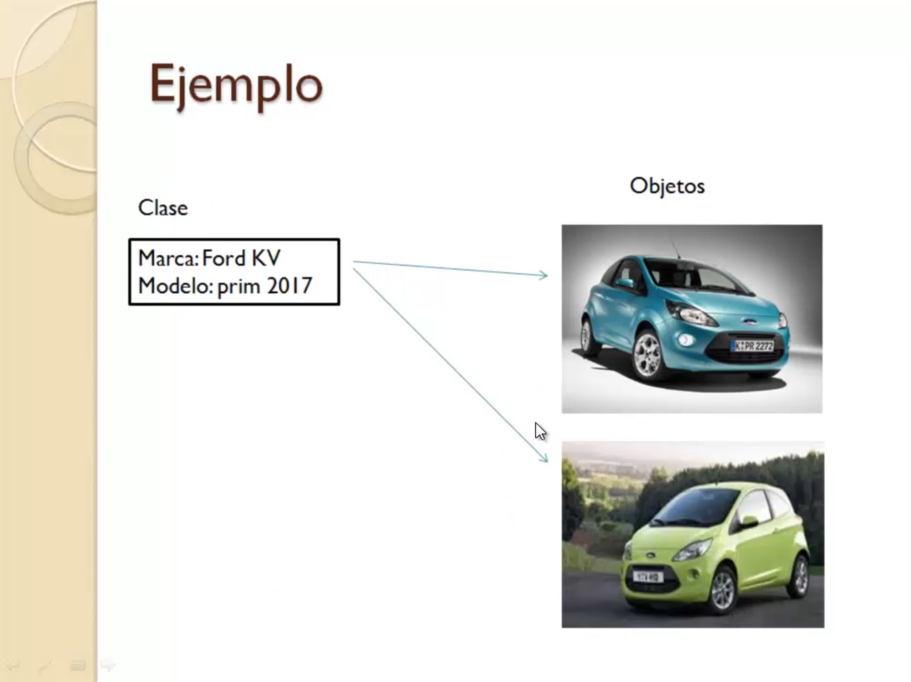
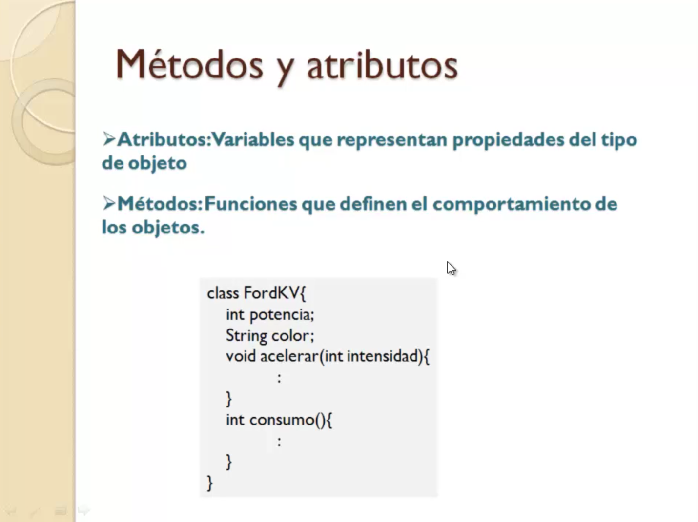
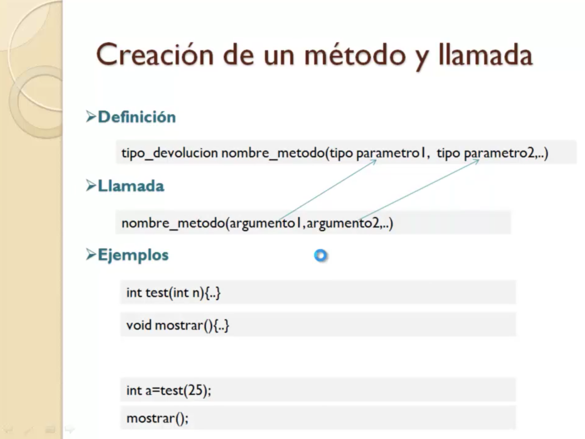
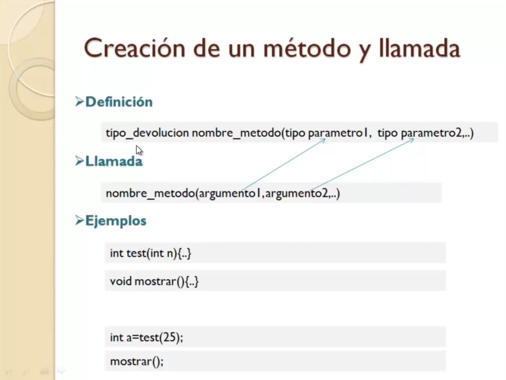
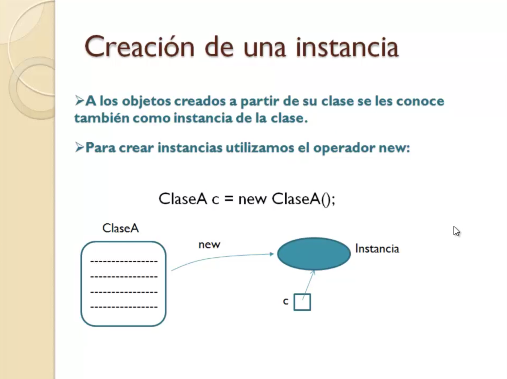
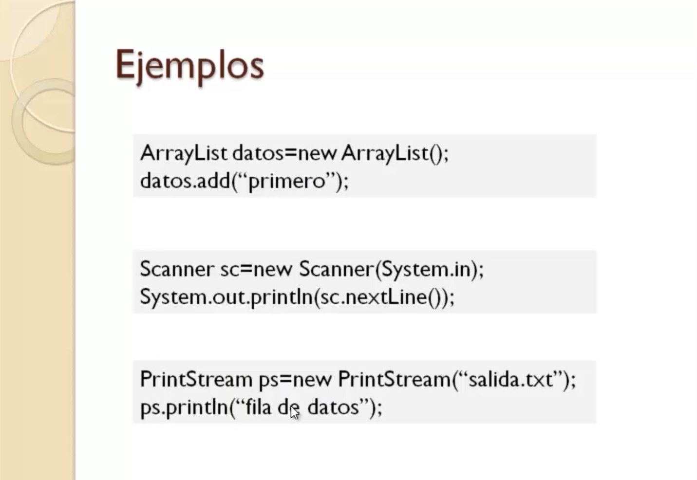
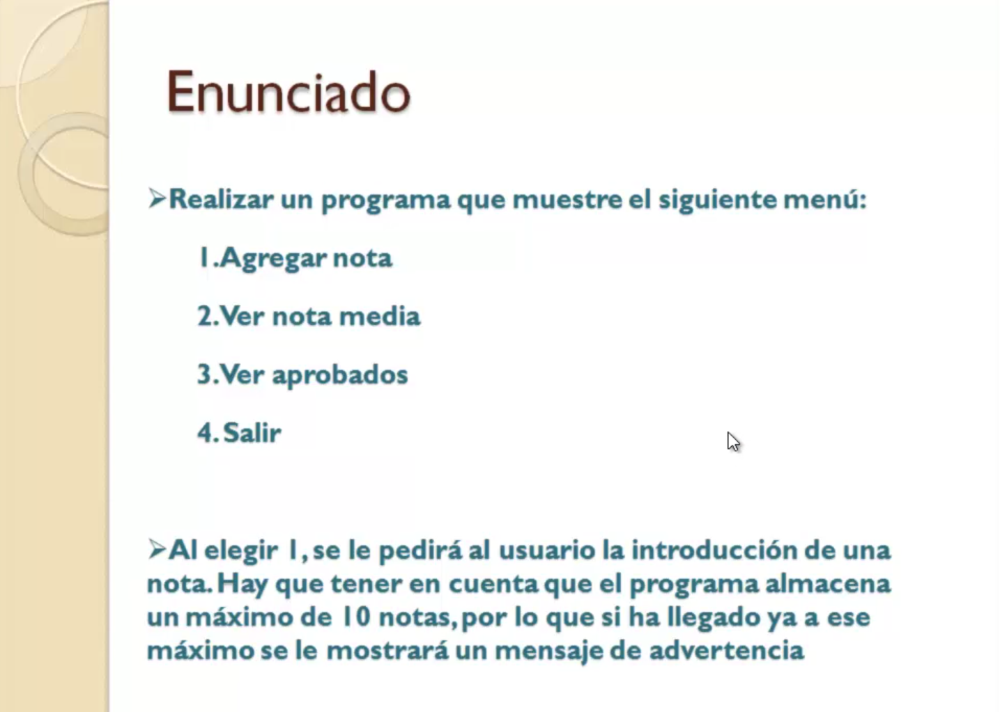
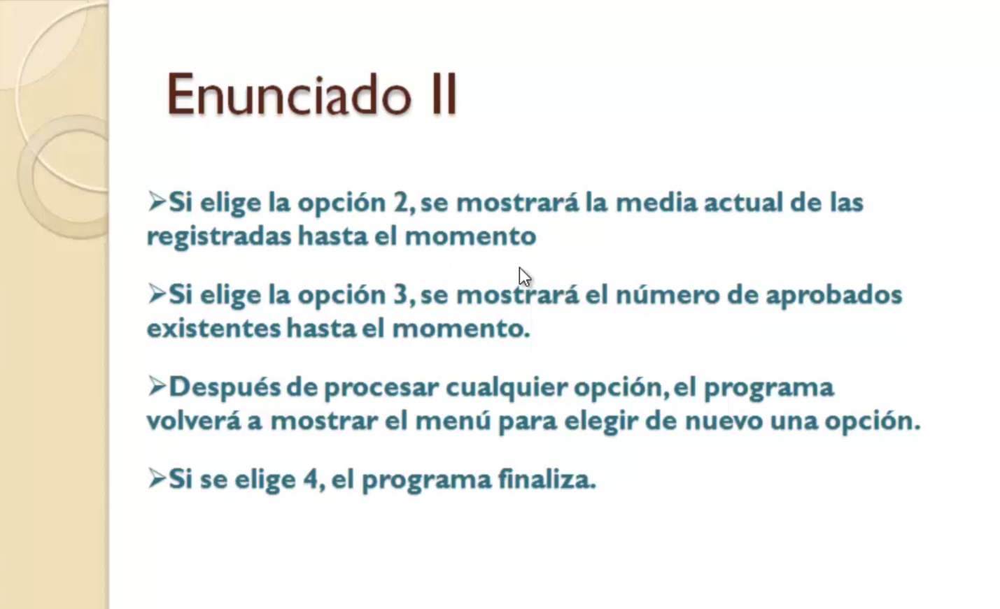

# 5. Creación de clases 31:54
   * 22 Clases, objetos y métodos 07:14
   * 23 Creación de objetos 03:21
   * 24 Creación de clases propias 05:17
   * 25 Ejemplo práctico IX 16:02
   
# 22 Clases, objetos y métodos 07:14








Bueno llevamos desde el principio del curso hablando de lo que es una clase objetos métodos creo que es el momento de entrar en detalle estos conceptos y de aclarar las diferencias entre ellos pues lo primero que es una clase es una clase digamos que es el lugar donde se define el comportamiento de un determinado tipo de objeto la clase podríamos decir que es el molde mientras que el objeto es el elemento físico obtenido a partir de ese molde.

En programación la clase de código donde se define como decimos y comportamiento del objeto a base de métodos de atributos es código y a partir de ese código se pueden crear lo que llamamos instancias que luego veremos de la misma instancia de esa clase que son los objetos de una clase pues puedo crear múltiples objetos sobre el objeto donde voy a ir haciendo las llamadas a los elementos que determinan ese comportamiento del tipo de objeto que se ha definido la clase es decir los métodos las funciones.

Por ejemplo vamos a hacer una similitud con casos del mundo real cuando hablamos de coches.

Imaginemos una marca y modelo de coche equipos inventado una marca y modelo que es el Ford KV modelo Prin 2017.

Bueno pues cuando hablamos de eso el Ford KV modelo Prin 2017 estamos hablando de un tipo de coche de una clase de una clase vale a partir de esa clase evidentemente se fabrican muchos objetos muchos coches de esa marca y ese modelo los objetos ya son pues los coches físicos con su matrícula su color sus propiedades ya definidas la clase en el caso de los coches definirá los métodos de las funcionalidades que tienen todo coche arrancar frenar acelerar y tiene sus propiedades como el color la potencia etcétera hemos dicho que el comportamiento de los objetos se define dentro de la clase a base de que a base de métodos y atributos ya hemos visto en todos los ejercicios que hemos hecho hasta el momento cómo se crea una clase.

La palabra Class el nombre que se le da a la clase y entre llaves el contenido los atributos que son variables.

Básicamente lo que representan las propiedades del tipo de objeto pues siguiendo con la similitud de los coches vemos que unas posibles propiedades de la clase de la que estamos hablando Fourcade sería su potencia el color mientras que los métodos son las funciones que definen ese comportamiento de los objetos lo que hacen los objetos pues siguiendo repito con la similitud pues acelerar consumo.

Los métodos son funciones pues reciben unos parámetros en los datos de entrada y pueden devolver unos resultados.

Obviamente dentro del código de sus métodos se puede hacer uso de esos atributos para algo consumo pues se puede determinar a partir de la potencia y acelerar a partir de un parámetro de intensidad que a lo mejor está determinado también por la potencia.

Eso ya depende de cada tipo de objeto ya que hemos hablado de los atributos los atributos y los métodos pues digamos que como vamos a ver más adelante aunque aquí no aparecen los atributos suelen estar definidos de manera privada es decir para uso interno de la clase mientras que los métodos suelen estar definidos de forma pública para que se usen desde afuera de la clase.

Es decir otros objetos que usan esta clase para crear objetos de ella pues podrán llamar a esos métodos mientras que los atributos suelen ser para uso para uso interno de la propia clase.

Los métodos se aplican sobre los objetos.

Vamos a entrar un poquito más en detalles sobre la definición y cómo sería la llamada a un método ya olvidémonos de objetos para llamar a los métodos.

Hay que tener un objeto sí pero centrémonos exclusivamente lo que es el método sencillo un método se define como ves aquí hay un tipo de devolución un nombre Método y luego una lista de posibles parámetros parámetros que va a recibir cada parámetro se define como una variable Java un tipo y un nombre Koma tipo nombre etc..

El tipo de evolución es lo que va a devolver.

Como digo si el método no devuelve ningún resultado por qué hace lo que tiene que hacer y no da ningún resultado al punto de llamada pues el tipo de evolución será el nombre el método los parámetros bien cómo se hace la llamada nos metemos con los ejemplos la llamada a un método si se aplicará sobre un objeto pero en definitiva lo que es la parte de la llamada ese método es con el nombre del método y entre paréntesis la lista de datos que coinciden con los parámetros que va a recibir es decir en esos parámetros que son variables se van a meter datos en la llamada que son los llamados argumentos.

Si esto fuera un entero X un entero y griega a la hora de llamar a ese método podría poner aquí veinti cinco coma cuatro.

El 25 se volcaría en el parámetro x 4 en el parámetro.

Aquí ves unos ejemplos.

Fíjate en este caso tenemos un método definido como llamado test que va a devolver un entero y recibe como un parámetro un número entero.

Así es como se declararía independientemente de lo que haga un método que no devuelve nada. 

Como decía antes tipo de evolución Veidt el nombre del método y bueno puede que no reciba ningún parámetro si no recibe ningún parámetro se tienen que poner los paréntesis igualmente cómo sería por ejemplo una llamada a ese método 3 agobiando como he dicho antes que habría que poner el objeto delante.

Pero centrémonos en lo que es el método pues poniendo el nombre del método y entre paréntesis el valor o argumento de llamada es el número 25 se volcaría la variable n lo que hagamos aquí dentro del método con n pues afectaría lógicamente o contendría sería con el valor 25 que lo hemos pasado la llamada.

Cómo este método devuelve un resultado.

Pues fíjate que ponemos la llamada al método a la derecha del igual de una declaración de variable lo que significa que cuando el método termina de ejecución el resultado se guardará en dicha variable.

Aquí tienes un ejemplo de una llamada a un método que no devuelve nada.

Como ves no hay variable que tenga que recoger el resultado porque es bait y a la hora de llamarlo aunque no reciba parámetros los paréntesis deben indicarse con esta explicación de lo que es.

Las clases objetos un poco más en detalle el método ya podemos seguir avanzando en la creación de clases y la utilización dentro de un programa porque como puedes imaginar un programa no solamente está formado por la clase con el método que se organiza en varias clases con varios métodos y es lo que vamos a ir viendo en las siguientes lecciones del curso.

# 23 Creación de objetos 03:21






Las clases definen el comportamiento de un determinado tipo de objetos y cómo creamos un objeto a partir de una clase.

Bien lo primero es que tenemos que saber que a los objetos creados a partir de la clase se les conoce habitualmente también como instancia de la clase de una clase.

Podemos crear múltiples instancias múltiples objetos y cómo creamos una instancia o objeto a partir de una clase.

Ya lo habrás visto en el ejemplo que te presenté en la lección anterior donde creamos un objeto de la clase Escanes y es utilizándolo para dormir primeramente declaramos una variable de la clase o sea del tipo de objeto que vamos a crear con el operador new.

A continuación el nombre de la clase y entre paréntesis eso ya depende de qué tipo de objeto sea de qué clase estemos en la que estemos trabajando pues habrá que proporcionar valores dentro de los paréntesis o no.

El caso es que esa instrucción lo que hace es crear en memoria una instancia un objeto y lo referencia a través de la variable C en este caso si es como lo hemos llamado referencia qué significa exactamente que el objeto como tal está contenido dentro de la variable como ocurre con los tipos primitivos.

Por ejemplo cuando declaras una variable de tipo int y le asigna un número ese número queda dentro de la variable.

En el caso de los objetos la variable que contiene son referencias dejémoslo así porque no son tampoco exactamente direcciones de memoria pero bueno es algo que luego me permite utilizando esa variable acceder a los métodos del objeto métodos que están definidos dentro de la clase como hemos visto cómo se hace.

Utilizando el operador punto es decir una vez que has creado la instancia y la tienes referenciada por la variable utilizando un operador punto nombre del método y entre paréntesis los datos que se necesite dependiendo del método que sea podemos hacer la llamada a dichos métodos ejemplos.

Pues bueno te presentamos aquí algunos ejemplos de los muchísimos que hay y los posibles tipos de objetos que vas a crear a lo largo de tu vida como programador en Java.

Si acaso empezamos con este medio porque ya lo hemos visto ya lo hemos utilizado esto este tipo de objetos.

La clase escarnios concretamente para poder realizar lectura de datos por teclado es una variable del tipo de objeto que vamos a crear scaner y con el New creás el objeto se quedaría en memoria y el objeto que la referencia al mismo se guardaría dentro de la variable.

A partir de ahí ya puedes llamar a los métodos Flavin sin parar lectura en este caso en el caso de escanee concretamente pues hay que proporcionarle lo que llamamos el canal de entrada eso ya depende de cada tipo de objeto.

Aquí tienes otro caso a raíz Lish Railways es un objeto de tipo colección y bueno pues para crearlo el New nombre de la clase en este caso no hay que proporcionas nada entre paréntesis nos creería la referencia y a partir de ahí llamar a los métodos otro más Princes Street para la escritura por ejemplo en ficheros en este caso igual de clamo la variable con el niño creamos el objeto en este caso se le proporciona la dirección del fichero y se crearía el objeto y a partir de ahí escribir.

Y esto es.

Veamos la mecánica de trabajo en todas las aplicaciones Java ir creando objetos de clases o bien existentes o creadas por nosotros y llamar a los métodos que ofrecen la funcionalidad.

# 24 Creación de clases propias 05:17

### Creación de clases en Java

En esta lección, te voy a enseñar los detalles de la creación de  clases en Java. Realmente, llevamos haciéndolo desde el primer ejemplo que presentamos el primer ejemplo de Java, pero siempre nos limitábamos a crear la clase con el método main y escribir dentro de ella nuestro código.

En un programa real, no se escriben  todas las instrucciones dentro de la clase principal, sino que el código suele organizarse en varias clases. A parte de la principal, se crean clases para implementar las operaciones de lo que sería la lógica de aplicación, además de otras para encapsular o agrupar los datos asociados a una entidad (JavaBean).

A continuación, vamos a recordar como es la estructura de una clase y seguidamente veremos como encapasular la lógica de los programas dentro de una clase. Seguidamente, te presentaré los métodos estáticos y constructores, elementos estos últimos  presentes también en todas las clases Java.

### Estructura de una clase

Como sabemos, una clase define el comportamiento de un tipo de objeto. Dentro de la clase se codifican los métodos que expondrán los objetos creados de dicha clase. Además, las clases pueden contener atributos para almacenar las características de los objetos.

Imaginemos que queremos trabajar con objetos de tipo Coche, una posible implementación de la clase Coche sería:

```java
class Coche{

   private String color;

   private int potencia;

   public void arrancar(){

      :

   }

   public int consumo(){

      :

   }

}
```

El código es similar al que te presenté cuando estudiamos en la lección 22, los principios de las clases. En este ejemplo, verás que los atributos vienen definidos con la palabra *private*, que significa que no queremos que se puedan ver desde fuera de la clase, es decir, al crear el objeto no se tendrá acceso directo a los atributos, son para uso interno de la misma.

Lo métodos, por el contrario, están definidos como *public*, lo que significa que cualquier otra clase que cree objetos de esta podrá llamarlos.

La creación y utilización de un objeto de esta clase, que se realizaría desde cualquier otra clase, por ejemplo la principal, sería:

```java
Coche c=new Coche();

c.arrancar();

System.out.println(c.consumo());
```

Como hemos hecho ya en algunos ejemplos de código que has visto, una vez creado el objeto y almacenada su referencia en la variable, llamamos a los métodos del mismo a través del operador punto.

### Separación de lógica de aplicación en clases independientes

Como te comentaba, utilizaremos la creación de nuevas clases en un programa, a parte de la principal, para encapsular las operaciones de la lógica de aplicación dentro del programa.

Pongamos un ejercicio de ejemplo. Queremos crear una aplicación para calcular operaciones básicas entre dos números (suma, resta, multiplicación y división). El programa obtendrá los números de algún lugar, que ahora no nos interesa para nuestro propósito, y mostrará en pantalla el resultado de las operaciones indicadas.

Para realizar este programa, crearemos dos clases. Una de ellas será la clase principal, con el método main, donde tendremos las instrucciones para obtener los números y presentar los resultados, la otra será una clase a la que llamaremos Calculadora, donde tendremos los métodos con las operaciones a realizar sobre los números.

Y empezamos por esta clase Calculadora. Aquí tenemos el código de como sería dicha clase:

```java
public class Calculadora {

   //atributos donde guardamos los

   //números con los que se va a operar

   private int x,y;

   public int sumar(){

      return x+y;

   }

   public int restar(){

      return x-y;

   }

   public int multiplicar(){

      return x*y;

   }

   public int dividir(){

      return x/y;

   }

   public void guardarX(int x){

      this.x=x;

   }

   public void guardarY(int y){

      this.y=y;

   } 

}
```

Como ves, utilizamos dos atributos para guardar los números con los que vamos a operarar. Por tanto,  además de los métodos que realizan las operaciones, hemos incluido otros dos métodos para poder dar valores a los números.

Puede que te llame la atención las instrucciones

```java
this.x=x;
```

 y

```java
this.y=y;
```

Usamos la palabra reservada *this* para poder referirnos a la variable atributo, y es que, como el parámetro del método tiene el mismo nombre, usamos *this* si queremos llamar al atributo.

A continuación, tenemos lo que sería la clase principal que, a partir de dos números cualquiera, crea un objeto de la clase Calculadora y llama a los métodos correspondientes:

```java
public class Principal {

   public static void main(String[] args){

      int a=25;

      int b=10;

      Calculadora c=new Calculadora();

      c.guardarX(a);

      c.guardarY(b);

      //hacer operaciones

      System.out.println("Suma: "+c.sumar());

      System.out.println("Restar: "+c.restar());

      System.out.println("Multiplicar: "+c.multiplicar());

      System.out.println("Dividir: "+c.dividir());

   }

}
```

### Métodos estáticos

Como puedes ver en el ejercicio anterior, los métodos sumar, restar, multiplicar y dividir utilizan los atributos del objeto para realizar la operación. Si tuviéramos objetos diferentes, cada objeto tendría sus propios atributos y las operaciones, lógicamente, darían resultados distintos.

Pero hay casos en los que los métodos no utilizan los atributos de la clase y la operación que realizan es independiente del objeto, solo trabajan con los parámetros recibidos y la operación daría el mismo resultado con cualquier objeto con el que se le llamara. A estos métodos los llamamos métodos estáticos, y podrían llamarse sin necesidad de crear un objeto de la clase, simplemente usando la expresión:

```java
Clase.metodo();
```

Por ejemplo, imaginamos que queremos añadir a la clase Calculadora un método que reciba un número como parámetro y calcule el factorial del mismo. Este sería el método

```java
public static int factorial(int n){

   int r=1;

   for(int i=1;i<=n;i++){
    
      r=r*i;

   }

   return r;

}
```

El método está declarado con la palabra reservada static. A la hora de llamarlo desde la clase principal sería:

```java
System.out.println("Factorial de 5: "+Calculadora.factorial(5));
```
 

Dentro de los métodos estáticos se podrían utilizar solo atributos que también estuvieran definidos como static, y **no podemos hacer uso de la palabra this**.

### Constructores

Un constructor es un bloque de código que se incluye dentro de una clase y que se ejecuta cada vez que creamos un objeto de dicha clase. Su misión es la de inicializar atributos antes de llamar a cualquier método, dado que pueden recibir parámetros a igual que los métodos. En general, realizar cualquier tarea de inicialización.

Los constructores se definen:

```java
public NombreClase(tipo param1, tipo param2){

 

}
```

Su definición es similar a la de un método, pero su nombre siempre tiene que ser igual que el de la clase y no tienen tipo de devolución (ni siquiera void).

Sería útil incluir un constructor en nuestra clase Calculadora para poder inicializar los atributos durante la creación del objeto:

```java
public class Calculadora {

    //atributos donde guardamos los

    //números con los que se va a operar

    private int x,y;

   //constructor

    public Calculadora(int x, int y){

         this.x=x;

         this.y=y;

   }

    public int sumar(){

        return x+y;

    }

    public int restar(){

        return x-y;

    }

    public int multiplicar(){

        return x*y;

    }

    public int dividir(){

        return x/y;

    }

    public void guardarX(int x){

        this.x=x;

    }

    public void guardarY(int y){

        this.y=y;

    } 

}
```
 

De cara a utilizar la clase en main, podríamos pasar los números al constructor y evitar las llamadas a los método guardarX y guardarY nada más crear el objeto:

```java
public class Principal {

    public static void main(String[] args){

                int a=25;

                int b=10;

                Calculadora c=new Calculadora(a, b);

              //hacer operaciones

              System.out.println("Suma: "+c.sumar());

              System.out.println("Restar: "+c.restar());

              System.out.println("Multiplicar: "+c.multiplicar());

              System.out.println("Dividir: "+c.dividir());

        System.out.println("Factorial de 5: "+Calculadora.factorial(5));

    }

}
```
 
### Constructores por defecto

Hay que decir que toda clase Java incluye un constructor y si nosotros no lo creamos explícitamente, el compilador lo hará por nosotros. Este constructor creado por el compilador se le conoce como constructor por defecto y es un constructor que no recibe parámetros no tampoco incluye código, en otras palabras, que no hace nada, pero es necesario que exista para poder crear un objeto de la clase.

La primera versión de la clase Calculadora que hicimos no tenía constructor creado por nosotros, por lo que el compilador le añadió uno por defecto con el siguiente aspecto:

```java
public Calculadora(){

}
```

Gracias a la existencia de este constructor, pudimos crear objetos de la clase Calculadora de la forma:

```java
Calculadora c=new Calculadora();
```
 
# 25 Ejemplo práctico IX 16:02 





Después de haber visto la elección anterior cómo crear clases para encapsular la lógica de aplicación de un programa.

Vamos a poner en práctica dichos conocimientos en el siguiente ejercicio práctico se trata de un programa en el que al inicio se va a parecer un menú.

Hasta ahora no habíamos hecho ningún problema con estas características tan interactivo como el que vamos a realizar ahora.

Dicho menú habrá cuatro opciones para un programa para gestión de notas y en la primera opción se nos solicitará introduciendo una nota al elegirla al usuario simplemente se le va a pedir que introduzca dicha nota y esa nota se almacenará se guardará dentro del programa.

Las notas se van a guardar en Arráiz como los arrays tienen un tamaño fijo y en nuestro caso vamos a limitarlo a 10 el tamaño de la raíz va a ser 10.

Por tanto si se elige una opción la opción 1 teniendo ya 10 elementos nos informará de que la raíz está lleno y que no se admiten más notas en cuanto a la opción 2 pues simplemente se mostrará la media de todas las notas que estén registradas hasta el momento en la opción 3 el número de aprobados y se elija la que se elija Tras procesarse dicha opción se volverá de nuevo a presentar el menú y así hasta que se elija la opción 4 que es la que teníamos prevista para abandonar el programa.

Bien pues vamos a ver cómo abordaría el desarrollo de esta aplicación.

Vamos a crear el proyecto de Java Eclipse sería el número 10 ejercicio práctico 9.

Bueno pues en este caso lo que vamos a hacer para poder desarrollar dicha aplicación es crearnos dos clases en una clase.

Vamos a aislar todo lo que sería como decimos la lógica del programa es decir la gestión de las notas las operaciones donde vamos.

Pues eso añadir la nota.

Comprobar que sí hay espacio y espacio hacer el cálculo de la media el cálculo de los aprobados etcétera y otra clase que es donde tenemos el método principal que es el punto de entrar al programa. 

Eso la vamos a dejar para todo lo que es la interacción con el usuario y la entrada salida.

Vaya pues eso la generación del menú solicita las opciones y demás es lo que habitualmente se suele hacer en un programa ya mínimamente grande tener esa separación como mínimo de dos capas y cada una creada con su clase correspondiente.

Entonces primero vamos a crear la clase donde vamos a añadir como digo a tener todas esas operaciones sobre la raíz de notas que vamos a almacenar la información así que botón derecho My Class y vamos a crearnos una nota una clase ciertos.

Pero en esta clase no vamos a añadir método porque solamente va haber uno dentro de cada programa método mail una clase un método y esa va a ser la que contenga todo lo que las operaciones de entrada salida e interacción con el usuario.

Otra cosa que vamos a hacer como novedad es separar nuestras clases en paquetes para que no estén sólo hay dos clases.

Pero bueno aún así está bien la costumbre de crearnos dos tres paquetes dependiendo de el grupo de clases que tengamos asociadas a la diferentes funcionalidad de cada una.

Pues eso las clases que tienen que ver con lo que la lógica de aplicación la vamos a meter en un paquete que podríamos llamar gestión lógico vamos a llamarlo simplemente La gestión notas dentro del paquete lógica.

Como digo no hay metrosde pero estamos aquí tenemos nuestra clase donde vamos a tener por un lado lo que son los atributos que se necesiten para la realización de las operaciones.

Por supuesto la Rey y un atributo también para llevar la cuenta de cuántas notas tenemos introducidas en cada momento.

Vamos a equip porque ya tenemos hecho el programa y sería estas dos variables que tenemos aquí como te digo pues notas donde vamos a almacenar las notas.

Total que va a llevar la cuenta de las notas que tenemos almacenada en cada momento.

Por supuesto vamos a tener un constructor que como ya hemos comentado es para qué se utiliza los constructores son bloques de código que se ejecutan al crear un objeto de una clase.

Aprovechamos ese bloque de código para hacer tareas de inicialización en este caso no hace falta que se nos proporcione ningún atributo porque lo único que queremos hacer es darle tamaño 10 a ese Array lo hacemos aquí y asignarle cero al total de notas aunque esta instrucción realmente no la pusiéramos por defecto ya sabes que las variables de tipo atributo se inicializar.

En el caso de las numéricas a cero esta sea redundante.

Pero bueno ahí está queda como explícitamente lo hemos hecho esa inicialización.

Bien pues a partir de ahí ahora ya irían los métodos llamados que llamamos de lógica aplicación que van a llamar la otra capa a capa presentación para hacer las operaciones y operaciones son almacenas nota calcula la media calcula el número de aprobados.

Eso en esta versión si luego decidimos ampliarla pues simplemente sería ir añadiendo nuevos métodos a esta clase o en el caso de programas más grandes podría crear otras clases donde se hicieran otras operaciones con otro tipo de entes con las notas y a lo mejor habría una gestión de usuarios y eso serían otra clase independiente etcétera.

Vamos a ver esos métodos que ya los tenemos aquí desarrollados y ahora los explico. 

Copiamos Podemos y bueno pues vamos a verlos.

El primero de ellos es el método agregarlo recibe como parámetro doble con la nota agrega y nos devuelve un bullían indicando si se ha podido agregar o no.

Nosotros lo que hacemos aquí es comprobar si el espacio es la variable total con la que se supone que va a llevar la cuenta de las notas introducidas.

Si el menor de 10 hay espacio en esa posición que nos va a marcar total pues ahí es donde metemos la nueva nota incrementamos la variable para indicar que tenemos una nota más return true.

Por qué.

Porque la hemos añadido ha sido exitosa la operación.

Si no pues simplemente devolvemos falso para que la capa de presentación sepa que no se ha podido añadir y ya opté por mandar el mensaje correspondiente al usuario.

La media es simplemente recorrer desde la posición cero hasta la anterior total o total siempre te va a decir cuántas hay.

Ya sabes que si las posiciones empiezan por cero pues la posición del último es total menos 1 y las vamos sumando para después calcular la media dividiendo el total de los aprobados.

Pues lo mismo un recorrido de la raíz desde la posición 0 hasta la anterior la total vale pues qué hacemos en ese recorrido.

Comprobar si se trata de un número mayor igual que 5 en cuyo caso tenemos un aprobado más vamos incrementando la variable probados con cada nota que nos encontremos igual o superior a 5 y devolvemos el valor.

Fíjate que estos métodos no tienen ninguna instrucción de mandar mensajes al usuario ni nada.

Es pura lógica de negocio que se llama lógica de aplicación.

Son métodos que realizan operaciones más adelante cuando vayas a estudiar el acceso a base de datos y demás.

Verás que estos métodos harán operaciones de acceder a base de datos ficheros etcétera pero en cualquier caso es Nexon métodos que hacen la operación correspondiente como acceso a almacenamiento permanente o no y devuelven unos resultados pero en ningún caso van a interaccionar con el usuario.

Eso se deja para la otra clase y la otra capa vale entonces.

Bueno pues esto sería la clase gestión notas ahora vamos a crear una clase donde vamos a meter en el menú la interacción con el usuario donde va a estar el método.

Entonces vamos a crear una nueva clase que podríamos llamar por ejemplo principal y el rey también pues eso lo vamos a separar en un parque independiente porque si no tenemos la lógica aplicación.

Esto sería presentación y si como digo el método de penalizamos que tenemos nuestro método más clásico de siempre y cuál es el código que vamos a tener ahí.

Vamos a verlo porque lo tenemos aquí un poquito más abajo.

Vamos a ver todos estas instrucciones van a ser las que van a formar parte de ese método. 

Tenemos bien cómo es aquí lo primero pues vamos vemos que vamos a hacer uso de las clases no las que acabamos de crear escáner para lectura de datos y ya nos está protestando el compilador indicando que no puede resolver esos tipos accurate lo que te conté cuando hicimos el ejercicio en el que utilizamos la clase escaner que había que importarla para poder usarla.

Cómo se hace eso.

Pues con una sentencia impor que se genera automáticamente con la combinación de teclas Control.

Si y automáticamente pues no nos las va a importar.

Puede ocurrir como en este caso que haya alguna clase que se encuentran varios paquetes realmente serían varias clases distintas claro.

Eclipse ha detectado que en la clase una de las que tenemos que importar escaner tiene tres clases escaner en paquetes diferentes nosotros es ésta la útil del paquete Java útil de Java estándar la que nos interesa ya las importamos y ahora ya se pueden utilizar.

Fíjate que eso también lo puedes ver en la clase que acabamos de crear.

Gestión notas como cuando metes una clase en un paquete aparece esa sentencia packages al principio del archivo de código oculto Java.

Las importaciones siempre van después de.

Esto significa que la clase está empaquetada en ese paquete.

Estos son las instrucciones de importación y después la definición de la clase siempre es en ese orden.

No podríamos poner los IMPO antes de paquetes en ningún caso vamos al código.

Entonces decimos que gestión notas es la clase que acabamos de crear en su momento pues es la que contiene los métodos para hacer todas esas operaciones que temo que te explique la lección anterior que hay que crear un objeto de la clase para poder llamar a esos métodos.

Pues eso es lo que estamos haciendo creamos un objeto gestión notas y a partir de ahí ya podremos llamar a los métodos que hemos visto de añadir nota media etcétera.

También creamos el escáner para poder hacer la lectura de datos de los datos al usuario que vamos a guardar en esta variable entre otras variables esta simplemente es para leer la opción elegida logado otra variable.

Cuando vayamos a leer la nota y demás. 

Cómo montamos lo que se repetición del menú hasta que elija la opción 4.

Pues fíjate una instrucción de tipo repetitivo du guay guay mientras la opción elegida distinto de 4 se va a mostrar este menú población 1 2 3 y 4.

Después de mostrar la situación del sistema Pinel en las opciones de menú como es se está esperando que el usuario introduzca la opción real decline la leemos y la convertimos en una instrucción para convertir un texto a un entero vale.

Por qué no lo hemos leído con éxito.

Una cosa que comentábamos cuando explicamos explica en el documento el funcionamiento de escáner es que no se podría utilizar el mismo escáner para leer textos y números.

Entonces como hay que leer por un lado números y por otro lado a lo mejor hay que leer textos pues una opción para olvidarse digamos de tener que tener dos objetos escáner sería leerlo todo como texto y no te preocupas de tener como dos escáner diferentes.

Todo lo lees como texto y si se espera un número se convierte ese texto en número.

En este caso esperamos que sea un entero pues esta instrucción que ves aquí es una llamada un método estático de una clase que se llama ITD método es Sain pues coge el texto.

En este caso texto leído y lo convierte a entero.

Pues una vez que ya tenemos el entero lo comprobamos y en función de la opción elegida actuamos si es la opción 1 pues mandamos un mensajito para que introduzca la nota leemos la nota y ver que volvemos otra vez lo mismo usar siempre Medline para preocuparnos de que si una vez tiene que ser entero doblez o texto da igual el mismo escáner para leer de todo que es doble lo que está leyendo en este caso pues fíjate doble Parse doble método estático Parse doble de la clase Doble entonces transformamos texto leído al doble y llamamos a agregar nota pero agregar nota nos va a dar un resultado si es false Nos estamos preguntando de esta manera si no el resultado de la llamada al método.

Si esto es False Not false Bartók es una forma abreviada en vez de utilizar esto podríamos haber hecho la pregunta de la siguiente manera igual false sería lo mismo vale lo que pasa es que en programación seamos es costumbre de preguntar así como es algo de tipo Gülen pues sí es simplemente que es igual a Trump sería como lo estás viendo ahora.

Así se quedaría pero si lo que preguntamos si es igual a false sería y Nott lo que por lo que preguntes.

Bien el caso es que si no se ha podido añadir sacamos el mensaje no se ha podido agregar notas sin estar muy bien Breathe para que no entren en el siguiente bloque. 

Y bueno si la opción es 2 llamamos al método media como método nos devuelve un resultado y lo mostramos como parte del mensaje y si la opción 3 por lo mismo llamamos al método aprobados que nos va a devolver un resultado lo mostramos en el mensaje.

Fíjate que aquí no hacemos cálculo de media ni interaccionan con el array eso está encapsulado en gestión.

Aquí nos dedicamos a la entradas tenemos contemplado también que si mete un número que no sea ni uno ni dos ni tres ni cuatro pues que le digan que la opción no es válida.

Y vuelvo a Atarés solo cuando os 4 pues claro no haremos nada evidentemente y habrá que ir Weinberger de cumplirse y por lo tanto es que se finaliza el programa. 

Bueno vamos a ver es ahora esa llave copiarse.

Porque además vamos a probarlo ejecutamos el programa principal botón derecho una aplicación y aquí tenéis el menú.

Vamos a ver vamos a agregar un par de notas.

Veamos un cuadro vuelve a salir al menú 1 agregamos un 6.

Vuelve a salir el menú.

Vamos a ver la nota media que debería ser 5 2 2 2 efectivamente media 5 ahora vía legislación 3 nos dice que hay un aprobado.

Vamos a agregar una nota más ponemos un 7 la media debe haber subido.

Evidentemente si elegimos dos la medida sube a 5 con 66 y si elegimos tres o es que hay dos aprobados vamos a terminar el programa con salir y como estos finalizará el programa ya han visto aquí un caso práctico y muy concreto de la separación de código en varias clases.
