# 6. Cadenas de caracteres 30:23
   * 26 La clase String 04:04
   * 27 Principales métodos de la clase String 09:22
   * 28 Ejercicio práctico X 08:05
   * 29 Ejercicio práctico XI 08:52
   
# 26 La clase String 04:04

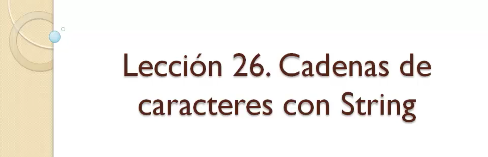

En esta lección voy a hablarte de una de las clases más importantes de Java, la clase 
`String` a través de la clase `String` podemos representar cualquier tipo de texto en Java.

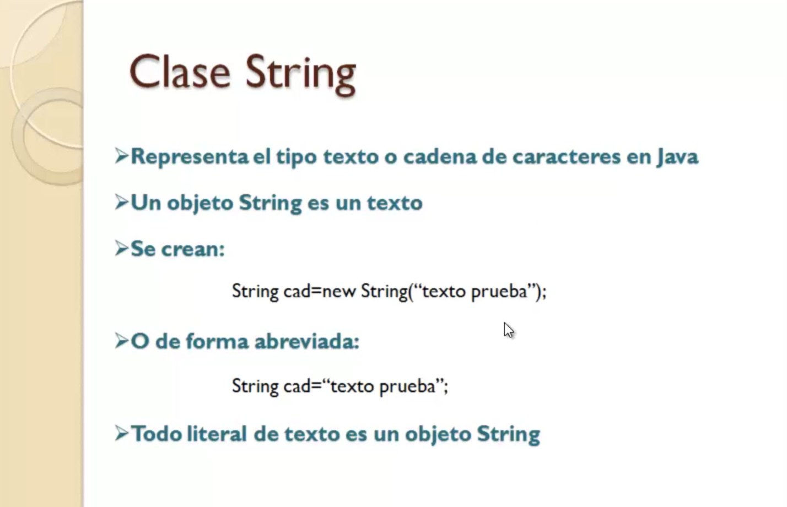

Un texto es una cadena de caracteres y como digo se representa a través de la clase `String` porque todos los objetos de la clase `String` son textos.

Cómo creamos un objeto `String`.

Lo podemos crear de dos maneras una sería utilizando la forma tradicional de crear objetos Java usando `new` .

```java
String cad = new String("texto prueba");
```

Esto haría que en la variable `cad` se almacenarse una referencia a ese objeto y a partir de ella pudiéramos llamar a los métodos de la clase `String`, que estudiaremos en la lección siguiente. Como la clase `String` se utiliza muchísimo es decir en manejar objetos en un programa Java y en general en cualquier lenguaje programación es una tarea muy habitual de forma abreviada puedes crear un objeto `String`.

```java
String cad = "texto prueba";
```

Declarando la variable igual y asignando directamente el literal de objeto `String`, es decir como si fuera su número, un tipo primitivo Java, aunque insisto `String` no es un tipo primitivo `String` es una clase y los objetos `String` son los textos, en definitiva son objetos de dicha clase.


A partir de ahí qué operaciones podemos hacer con un objeto `String` pues aparte de llamar a sus métodos podemos por ejemplo unir textos, lo que se llama la *concatenación de textos*. Para ello podemos utilizar el signo igual sino más `+` que es el que se emplea también en sumas aritméticas, si tenemos una variable donde tenemos un texto la variable 1 y otra variable con otro texto, la suma de los dos, de ambas variables, la operación de suma equivaldría a la unión de ambos, es decir en S3 tendríamos el texto `hola adios`.

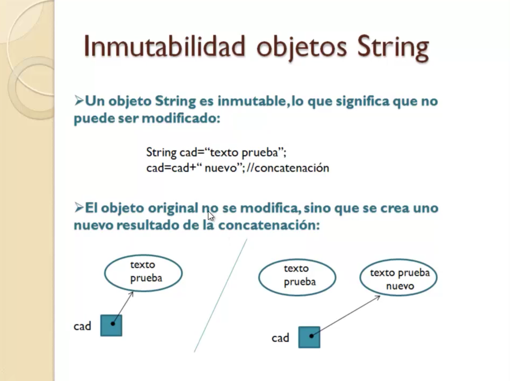

Una de las características más importantes de los objetos `String` es que **se trata de objetos inmutables** y eso significa que no se puede modificar un `String`, una vez que se ha creado no puede ser modificado.

Si yo por ejemplo tengo 

```java
String cad = "texto prueba";
cad= cad + " nuevo"; //concatenación
```
Inicialmente uno tiende a pensar que lo que ha ocurrido es que el objeto texto `cad` ha sido modificado y se le ha unido otra parte adicional, pero no es eso lo que ha ocurrido como resultado de esa concatenación es que se ha generado un nuevo texto, la unión de estos dos textoa es al que está apuntando la variable `cad`.

Esto lo vemos gráficamente de forma muy sencilla tienes el texto en memoria y la variable apuntándolo, tras la concatenación, tras la unión uno tendería a pensar como digo que el texto ha sido modificado pero no, se ha generado como he dicho antes un nuevo texto y la variable está apuntando a ese nuevo texto.

Qué pasa con el objeto anterior `texto prueba` que queda digamos en memoria sin ser referenciado hasta que el recolector de basura que es una de las partes importantes de la máquina virtual Java lo liberará ese espacio de memoria cuando se ponga en funcionamiento dicho recolector.

En esta lección simplemente te he explicado cuáles son los fundamentos de la clase `String`, cómo se crean objetos de `String`, la característica de inmutabilidad, pero el uso de los mismos es a través de las operaciones, aparte de la concatenación como hemos visto antes pero sobre todo de la llamada a sus múltiples métodos que tiene dicha clase, eso lo vamos a ver en la elección siguiente.

# 27 Principales métodos de la clase String 09:22

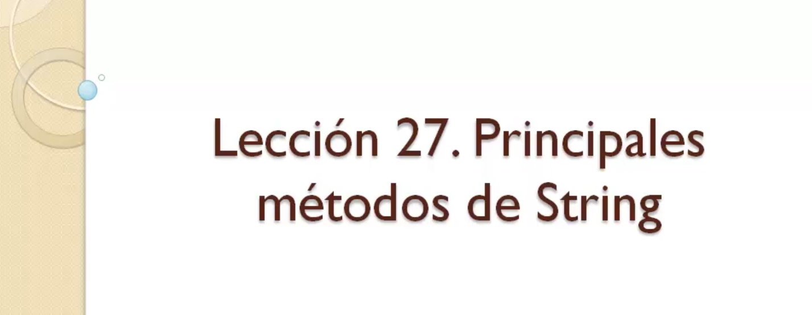

En la lección anterior has estado estudiando la clase `String` cómo has podido comprobar se trata de una de las clases más importantes de Java. Puesto que todos los textos son objetos de dicha clase.

A continuación lo que te voy a enseñar son los principales métodos de `String` y cómo aplicarlos en la manipulación de cadenas de caracteres dentro de un programa.

Pero antes de ello te voy a enseñar la siguiente página 


https://docs.oracle.com/en/java/javase/14/docs/api

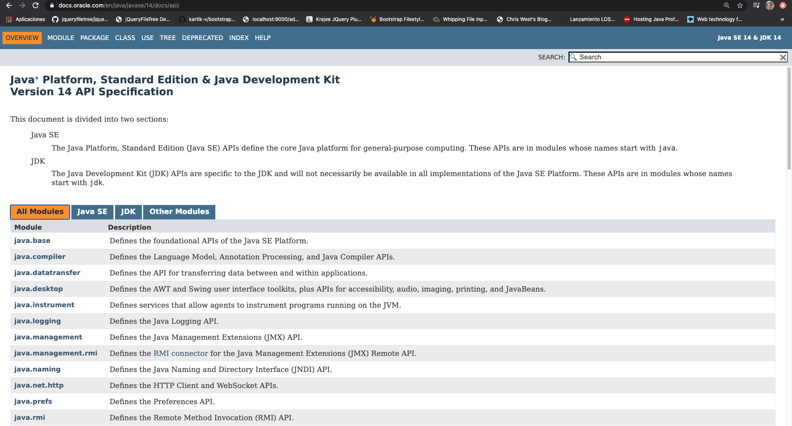

https://docs.oracle.com/en/java/javase/14/docs/api/java.base/java/lang/String.html

Se trata de una dirección de Oracle donde se encuentra la ayuda oficial de las clases de Java estándar lo que llamamos el JavaDoc, en esta dirección encontrarás que está dividida en cuatro pestañas en All Module puedes ver la lista de todos los modulos de clases que forman todo el Java estándar. Como ves la mayoría de los modulos empiezan por Java luego el sub-modulo donde está organizado los distintos tipos de clases que tenemos. 

Tenemos el modulo base `java.base` donde estan definidas las APIs fundamentales de la plataforma Java SE, si entramos en ese modulo vemos.

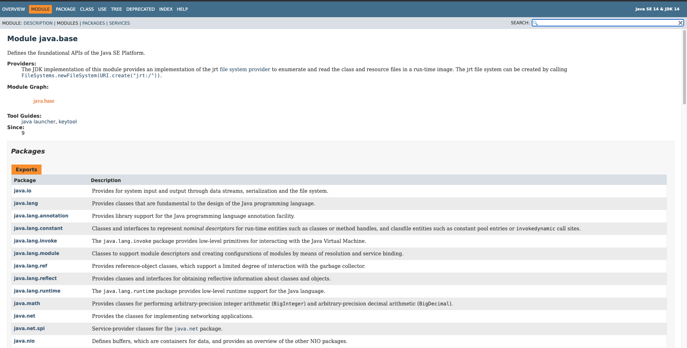

El cual contiene diferentes paquetes que contienen las clases básicas de Java estándar, en el caso concreto de la clase `String` por ejemplo así como otras muchas de uso habitual en Java se encuentra en el paquete `java.lang` ahí es donde está la clase `String` seleccionemo el paquete `java.lang` y en este marco inferior puedes ver la lista de clases que componen dicho paquete.

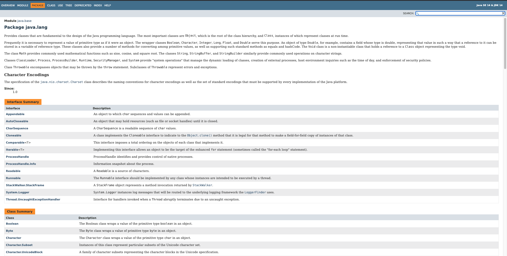

Están ordenadas alfabéticamente por lo tanto estrechen tendríamos aquí una vez que selecciona la clase que va buscando en esta zona central aparece la información de la misma información de la misma.

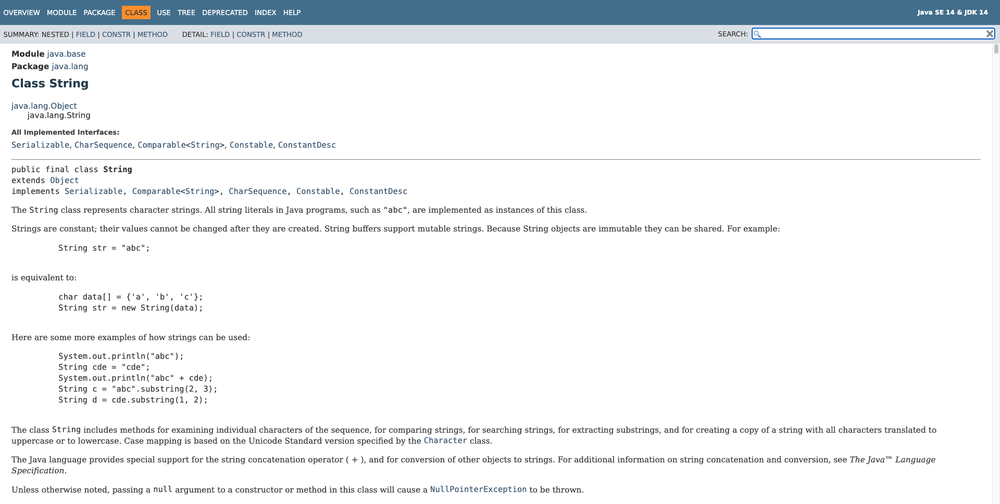

Con una descripción de lo que representa cómo está definida y lo más importante que lo encontramos un poquito más abajo, la lista de constructores para poder crear objetos de dicha clase y especialmente en nuestro caso lo que nos interesa con `String` la lista de métodos.

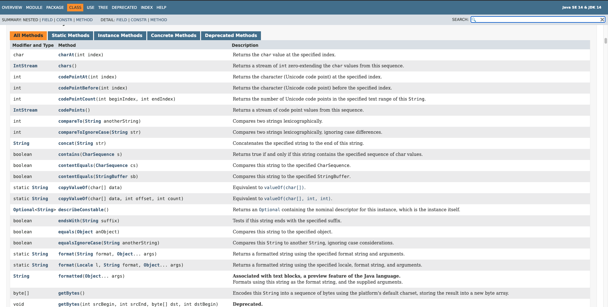

Métodos que expone dicha clase y que puedes aplicar sobre cualquier objeto de tipo `String`.

La ayuda de los métodos como ves se indica nombre del método, el tipo de datos que recibe, la lista de parámetros y lo que devuelve. Hay una pequeña descripción sobre el funcionamiento del método pero si quieres entrar en más detalles harías click en el método que te interesa y ahí te da una información un poquito más detallada.

No se trata de una página que se utilice como estilo típico tutorial de Java porque no se trata de aprender Java con esto es más bien una referencia para los programadores que pueden acudir en cualquier momento a informarse sobre alguna clase que les interesa y obtener información de los métodos, tipo de datos que devuelven, parámetros que reciben etc. Muy importante que la tengan siempre referenciada en tus favoritos de tu navegador para consultarla en cualquier momento.

Vamos a ver algunos de los métodos más importantes.

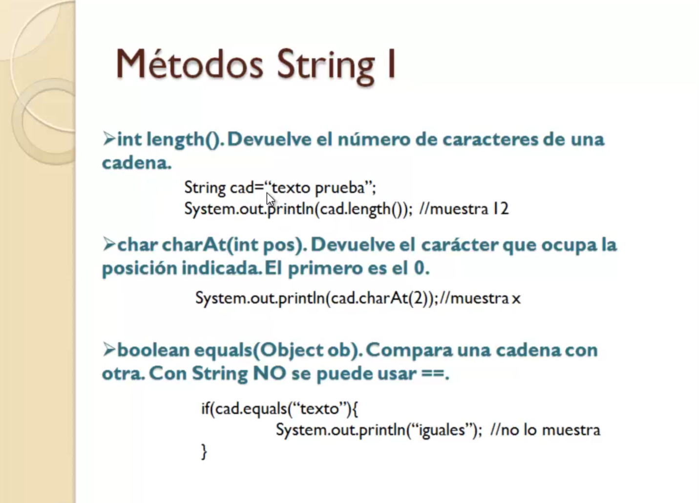

Empezamos por el método `int length()` es bastante sencillo no recibe nada como parámetro y nos devuelve un entero que es el total de caracteres de la cadena.

```java
String cad="texto prueba";
System.out.println(cad.length()); //Muestra 12
```

Va a devolver la longitud, número de caracteres que tiene en este caso incluidos los espacios por supuesto si los contamos que son 12.

Método `char charAt(int pos)` en este caso este método lo vamos a utilizar para saber que carácter ocupa una determinada posición de la cadena, si le pasa como parámetro una posición de la cadena te devuelve el carácter en esa posición.

```java
String cad="texto prueba";
System.out.println(cad.charAt(2)); //Muestra x
```

La primer posición empieza en 0 por lo tanto la posición del último siempre será la longitud total menos 1 puesto que siempre el primero esta en la posición 0.

Método `boolean equals(Object ob)`, en el caso de querer comparar textos no podemos utilizar el operador de comparación de igualdad `==`. Por qué, porque los textos son objetos, **el doble igual `==` se utiliza para comparar tipos primitivos Java**. Si lo utilizas con variables de tipo `String` estarías comparando realmente sus referencias a las direcciones de memoria y aunque fueran textos idénticos si están en zonas de memoria distintos sería falso la comparación entre las dos variables. Por lo tanto hay que utilizar este método `equals(Object ob)` al cual se le pasa como parámetro el texto con el que lo quieres comparar y lo compara contra texto que hay en la variable a la que le estás aplicando dicho método.

```java
String cad="texto prueba";
if(cad.equals("texto"){
   System.out.println("iguales"); //No lo muestra
}
```

En este caso estaríamos comparando `texto prueba` con `texto` nos daría como resultado falso, solamente nos devolvera verdadero si se trata de una coincidencia exacta es decir son iguales todos los caracteres, haciendo distinción entre mayúsculas y minúsculas.

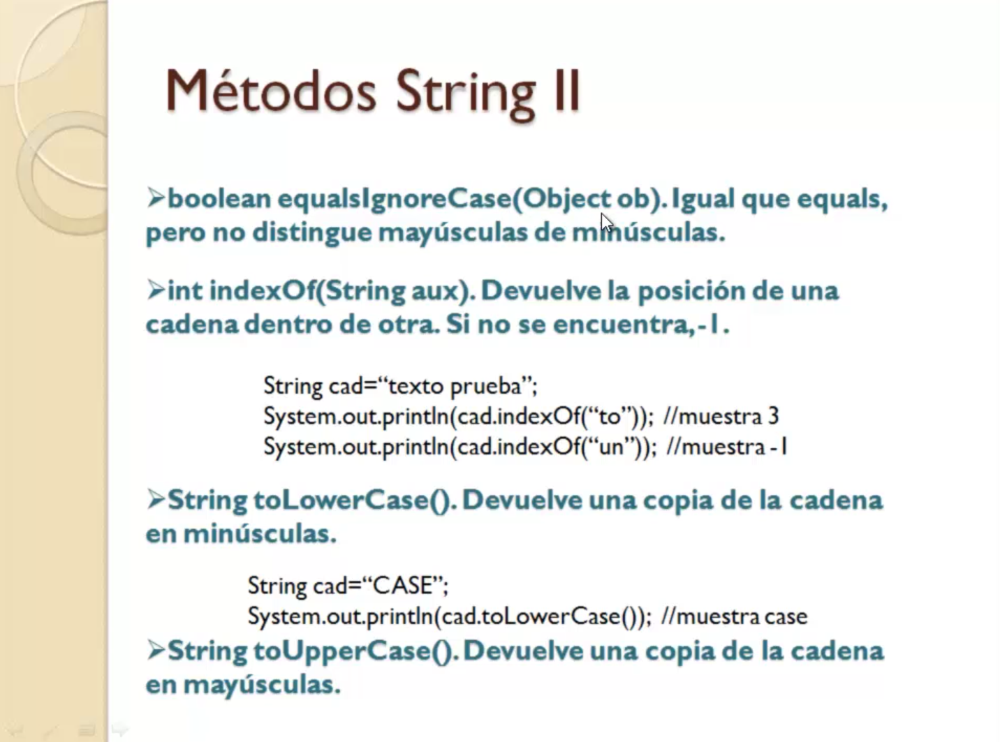
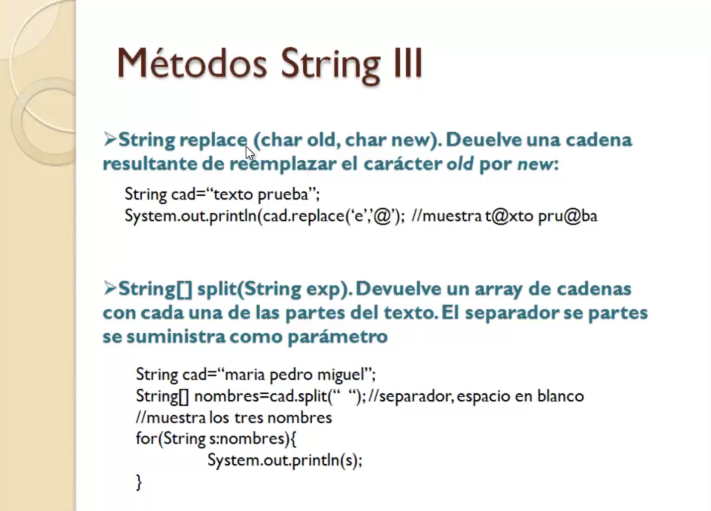
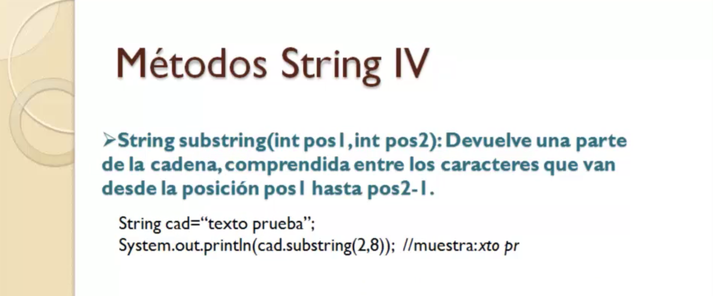


Que no nos interesa la distinción entre mayúsculas y minúsculas pues utilizaríamos este otro cual Signore X hace lo mismo pero en este caso no tiene en cuenta las mayúsculas y minúsculas si una palabra está escrita en mayúsculas y otra minúsculas si son los mismos caracteres nos va a devolver verdadero INDEC sobre todo este método se trata de o tiene como misión mejor dicho indicarnos la posición de una cadena dentro de otra.

Es decir yo tengo la cadena texto prueba y quiero conocer la posición de una parte de esa cadena.

Por ejemplo la cadena formato vale entonces al pasar ese texto a inversor y aplicarlo sobre k me va a dar la posición de este texto concretamente de la primera letra de este subtexto digámoslo así en este caso sería 3.

Qué ocurre si le paso un texto que no está contenido.

La cadena principal me devuelve una método WildCats.

Este método lo que hace es devolvernos una copia de la cadena y digo devolvernos porque los textos como ya vimos en la elección anterior son inmutables no se pueden modificar entonces todos estos métodos calculan un trozo que te convierta en mayúsculas pues son métodos que actúan o generan digamos una copia de la cadena el original permanece intacto.

En este caso tú lo huarpes lo que hace es devolvernos una nueva cadena resultante de transformar todas las letras a minúsculas.

Si sólo aplicamos este texto nos devolvería el mismo pero en minúsculas tú Perquis hace lo contrario vale le damos el texto y nos lo convierte o mejor dicho nos devuelve una copia en mayúsculas.

Método replays.

Pues igual no el nombre puede dar a confusión porque uno puede pensar que es que coge el texto original y reemplaza un carácter por otro.

No vamos a ver el método Replay lo que haces.

Si reemplazar el caracter indicado como primer parámetro por el segundo pero no sobre la cara original que repito es inmutable devuelve una copia con el resultado de ese reemplazo.

En este caso si llamamos a replays y le decimos que sustituye a la e por una arroba lo que nos va a devolver el método es un nuevo texto que sería este pero el que está en la variable seguiría si no se cambia métodos clik muy práctico también cuando tenemos una cadena de caracteres que está formada por una serie de ítems de nombres de países etcétera separados por un carácter espacio como lo que sea pues para hacer búsquedas en esa lista de nombres podríamos decir puede ser muy cómodo transformarlo en una raíz la cadena en la red.

Es lo que hace el método hoplita le pasas como parámetro el carácter de separación.

En este caso la estamos pasando a esta cadena formada por tres nombres el espacio que sería caracteres separación y lo que hace es devolvernos un array con ese contenido de esa cadena donde cada posición del array sería uno de los elementos de la cadena.

En este caso en la posición cero tendríamos este nombre en la posición 1 y la posición 2.

Como veis este array no hay que crearlo con el sino directamente ya claro la variable y el explícate devuelve la rejilla construida en este caso y luego lo recorremos para mostrarnos su contenido no saldría con este pequeño programita.

La lista de los nombres es decir María Pedro íñigo y por último el método subestime.

Este método lo que hace es devolvernos un trozo de la cadena en el que está formado por los caracteres que van entre la posición 1 y la posición 2 no incluida muy importante la posición 1 si se incluye pero las dos veamos este ejemplo.

Texto de prueba nuevamente le aplicamos el método string con los valores 2 y 8 pues nos va a devolver los caracteres que van desde la posición 2 que sería la X hasta la anterior a la 8 8 es la o nos va a devolver hasta la S.

Es decir esto sería lo que nos devolverá bueno has visto alguno de los métodos más interesantes de Street en las siguientes elecciones vamos a hacer algunos ejercicios Aplicando dichos métodos.

# 28 Ejercicio práctico X 08:05


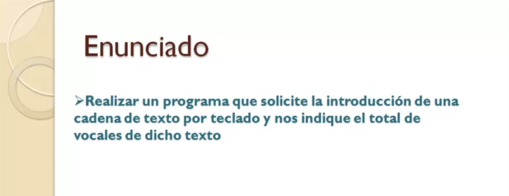

Muy bien pues a continuación vamos a realizar un ejercicio en el que vamos a poner en práctica algunos de los métodos que hemos visto en la elección anterior sobre la clase Street el ejercicio va a consistir en un programa que solicitará al usuario la introducción de una cadena de texto y después de eso nos dirá cuántos vocales contiene dicho texto.

Bueno pues vamos a un entorno de desarrollo para crear el proyecto vamos a ver muy Holler y bueno en este caso ya estamos con el proyecto número 11 correspondiente al ejercicio  práctico 10 Shishio 5 10.

En este caso pues a diferencia del ejercicio anterior que hicimos en la elección donde se presentó la separación de capas no vamos a hacer ningún tipo separacion de capas porque nos queremos centrar en el estudio estos métodos de Street por lo tanto vamos a hacer todo en el método main y vamos a crear la clase base la vamos a llamar contar convocarlas ni siquiera como solamente va a estar esta clase ni siquiera va a hacer falta que hagamos una estructuración en paquetes ni nada con su método Mayne y ya está lo que se trata es centrarnos en este caso en el uso de esos métodos.

Bien lo primero declaramos la variable donde vamos a guardar la cadena que va a introducir el usuario.

Creamos el objeto escaner que como sabes no va a servir para poder leer datos por teclado a partir del canal de entrada van después vamos a declarar unas variables que nos van a servir para llevar la cuenta del número de vocales introducidas.

Vamos a ver si escudamos para hacer las importaciones o importación concretamente de la clase Escanes y como te decía vamos a declarar unas variables Contador bien la otra variable va a ser una variable de tipo Char donde vamos a ir guardando la letra que vamos a ir leyendo en cada iteración por el conjunto de letras de la cadena letra.

Vale pues entonces una vez que tenemos declaradas las variables y creado el objeto scaner pues lo que hacemos es realizar la lectura lo primero lógicamente será mandar un mensaje al usuario para que sepa no tiene que hacer introduce una cadena de texto esa cadena la vamos a leer a través del método de escaner next next Line eximios para ver números lo que queremos es leer una línea de texto que es todo lo que introduzca hasta la pulsación de la tecla Enter.

Bueno pues ahora con un fork vamos a ir recogiendo recorriendo las letras desde la posición cero hasta la última y cuál será la última la posición de la última letra de la cadena.

Pues eso no nos va a marcar el método Lens que vimos en la lección anterior.

Esta junto a la más bien que lo que hacemos en este foro vamos a recuperar la letra que toque en cada momento.

Para eso utilizaremos todos los métodos que vimos Charata que como sabes pues a partir de una posición

te da el carácter que ocupa dicha posición.

Le pasamos la variable que va marcando las posiciones.

Y ahora qué hacemos.

Pues un switch en este switch de una variable Elettra pues vamos a ir comprobando si se trata de una de una de las cinco vocales que hay en los cinco casos deberíamos hacer exactamente lo mismo que es como el tipo Char es un tipo compatible con ir porque realmente es un se almacena como una codificación Unicode podemos utilizar valores tipo Char en los que un switch bien tanto si es a como si estamos hablando de la letra E o de la vamos a ponerlo en las cinco de la O aún como es estaríamos ante una vocal en cualquiera de esos cinco casos.

Pues lo que tenemos que hacer incrementar la variable ContaPlus Contador más que ya sabemos que esto lo que hace es sumarle uno a la variable y volverlo a dejar dentro de la misma variable vamos a si acaso tabular esto para que quede mejor y ya está.

Es decir una vez que ya se haya integrado todas las letras de la cadena todas las pasadas Polyforum pues habremos tenido un contador.

El total de vocales con las que nos hemos ido encontrando en cualquiera de estas 5 al final que hacemos presentará el resultado en n total de vocales y unimos concatenados con el resultado bueno pues vamos a probarlo vamos a ejecutarlo el programa y vamos a introducir una cadena de prueba monja laaplicación vamos a meter un texto.

Esto es una cadena.

Vale que le damos a la tecla de intro ya automáticamente nos hará el cálculo total de vocales 7 está a 1 2 está 3 otra 4 5 la 6 y 7 el agua.

Y qué pasa con esta mayúscula.

Eso no me lo ha contado lo que he puesto en todos los casos es simplemente la comprobación de la minúscula.

Entonces si se introduce una letra mayúscula como es el caso de la primera y no va a coincidir con ninguno de estos Keys no la va a contar ha contado las minúsculas que son los que hemos indicado explícitamente los keys y si quiere hiciéramos también tuviera en cuenta las mayúsculas pues había dos opciones o poner otros cinco keys para las cinco vocales en mayúscula o tenemos otra cosa yo creo que es mejor.

Y es que vamos a hacer lo siguiente Una vez que leemos la cadena por lo que hacemos es transformarla.

O bien a mayúsculas ubiera minúsculas.

Depende de lo que vayamos a comprobar en nuestro caso minúsculas.

Entonces cogemos y llamamos a otro de los métodos que vimos anteriormente que es el método Lower Keys qué hace este método transformar la cadena a minúscula más que transformar porque como ya sabes de la navegación donde estudiamos el tipo string los tipos de string son inmutables los objetos son inmutables no se pueden modificar lo que hace este método es generar una nueva cadena de texto con todo lo que es lo valores la cadena original pero en minúsculas todas las letras.

Entonces ahora ya solamente comprobaría minúsculas es decir introduzcas en mayúsculas minúsculas como te lo traduce toda minúscula o sólo va a contar las minúsculas en este caso si volvemos a probar el ejercicio aunque tecleamos la mayúscula no la va a contabilizar igual porque la transforma en minúsculas.

Esto es una cadena la transforma solamente para a la hora de contarlo en este caso como veis pues sale

que tiene ocho vocales.

# 29 Ejercicio práctico XI 08:52 


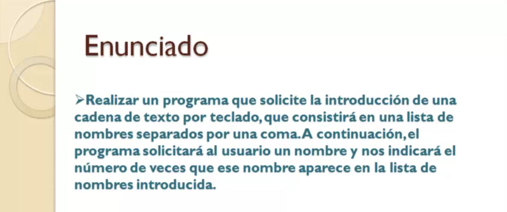

Vamos a realizar un nuevo ejercicio en el que vamos a poner en práctica más métodos de la clase Street en este caso se trata de hacer un programa que va a solicitar al usuario la introducción de una cadena de texto cadena de texto que va a consistir en una serie de nombres nombres de personas separadas por comas.

A continuación el programa le va a solicitar al usuario la introducción de un nombre y qué es lo que va a hacer el programa.

Puedes decirnos cuántas veces aparece este nombre en la lista de nombres introducidas en primer lugar.

Bueno pues vamos a ello.

Creamos el nuevo proyecto que será el proyecto número 12 correspondiente al ejercicio práctico dice 12.

Ejercicio

práctico.

Once y bueno pues igual que hicimos en el ejercicio anterior no vamos a meternos en temas de capas de separación en clases y demás sino que todo lo vamos a hacer en el método mail porque de lo que se trata es de centrarnos en los métodos de la clase Street así que vamos a crear la clase con el método main buscador nombres la podemos llamar con su método y tampoco hace falta que definamos ningún paquete especial.

Bueno pues lo primero vamos a declarar las variables donde vamos a guardar por un lado la cadena con la lista de nombres vamos a llamarla en vez de cartonista y la variable nom donde vamos a almacenar el nombre que se va a introducir.

En segundo lugar vamos a tener que buscar en la lista principal el objeto escaner antes de los frutos cuando bajamos aquí vamos a declarar la variable numérica contador que va a llevar la cuenta la inicial vamos a hacer lógicamente de las veces que aparece el nombre en la lista y así creamos la clase scaner el objeto de la clase escaner o mejor dicho a partir del canal de entrada y control mayúscula o para que nos importe el paquete más importe de la clase de paquete pues abre un paréntesis aquí cerramos.

Pues nada empezamos ya el programa lo primero lo vamos a solicitar al usuario la introducción de la lista de nombres introduce la lista de nombres leeremos esa lista y la almacena haremos en la variable lista lo leeremos con el escáner utilizando el método explica toda la lista de nombres introducirá una línea y al pulsar la tecla intro se lee bien.

Ahora le vamos a pedir el nombre de nuevo un mensaje introduce nombre a buscar y vamos a ver y a ver cómo queda dentro de las comillas exterminan ahí parentesis y le leemos y metemos la variable no.

Una vez más recurrimos de nuevo a un exploit.

Bueno pues ahora que hacemos cómo buscamos ese nombre en la lista y sobre todo cuántas veces aparece.

Pues aquí deberíamos aplicar el método exploit de la clase string que lo que hace es transformar una cadena a una raíz porque la cadena tiene el aspecto de una lista de datos una serie de datos.

Entonces sería muy cómodo pasarlo a una raíz y recordar esa raíz y hacer la búsqueda dentro de dicha red.

Por lo tanto necesitamos una variable real vamos a declararla también por aquí podríamos declarar justo en el momento en el que lo vamos a utilizar.

Pero bueno tenerlo todo ahí junto todas las declaraciones la llamamos nombres vale.

Entonces qué hacemos.

Pues en la variable nombres no vamos a crear el array con el lío porque es que hay un método de string que ya nos genera ese Array a partir del contenido del método.

Como recordarás que lo vimos en la lección dedicada a los métodos de string es exploit o exploit le vamos a pasar pues el separador la coma que es el que se va a utilizar para separar unos nombres de otros y ahora recorremos el array el comentario es recomendable siempre que pongamos comentarios en los programas o todo cuando son un poquito largos para que veamos y tengamos claro lo que hemos hecho en cada caso.

Cuando volvamos a ver el programa Días más tarde en busca del nombre Introducing entonces lo vamos a recordar como un forista dentro de nombres que se LaVey y cómo preguntamos y el 
nombre está contenido en esa lista.

Claro en la variable que viene apuntando cada uno de los nombres que hay en la red.

Entonces si el contenido es variable es igual a la variable ENUM o ya tenemos una ocurrencia bueno te estás dando cuenta si no lo has hecho.

Pues tengo que incidir en ello que no puedo utilizar el doble igual combinado me dejas perfectamente pero a la hora de ejecutarlo pues no va a funcionar porque no puedo utilizar el nombre igual para comparar cadenas de caracteres.

Por qué.

Porque lo que hace el comparador de igualdad sería comparar los contenidos de las variables en las variables como sabes no está el objeto no está el texto está la referencia al texto.

Entonces si las variables no apuntan a la misma posición de memoria al mismo objeto aunque sea igual sean dos objetos iguales con el mismo texto no me va a decir que son iguales.

Por lo tanto utilizar el método de saber quals sobre cualquiera de ellos sobre N y le paso como parámetro a ese método la variable que apunta al texto con el que quiero comparar.

Entonces si son iguales pues entrar aquí y fomentaremos en 1 incrementaremos la variable Contador hasta el final después del foro simplemente se trataría de sacar un mensaje podríamos haber hecho una pregunta Si Contador es cero para sacar un mensaje diferente pero bueno caso más directo como lo que se trataba era eso de hacer uso de estos métodos exploit.

Bueno pues el mensaje será el nombre aparece más Contador y voy a concatenar por el lado derecho con otra frasecita veces no me aparece tantas veces vale.

Bueno pues vamos a probarlo ejecutamos la aplicación y vamos a introducir una lista de nombres Alicia arcos no van a poner espacio para que no se considera usar los nombres vienen juntos o están pegados a la correa solamente se separan unos de otros por la coma.

Vamos a repetir ese nombre Alicia y será el que introduzcamos para comprobar que efectivamente me cuenta dos Marta pues es suficiente.

Esa es mi lista de nombres ahora me hice el nombre a buscar.

Pues lo voy a indicar.

Alicia si el programa funciona que nos va a decir que aparece dos veces Sebastián.

Si quieres lo volvemos a probar para ver en el caso de que introduzcamos una lista de nombres estos cuatro nombres y nos piden un nombre buscador por ejemplo.

Sí como no está a decir zelotes pues efectivamente que has visto pues otro de los usos de los métodos interesantes de stream como son adecuados para la comparación de igualdad y explica.
