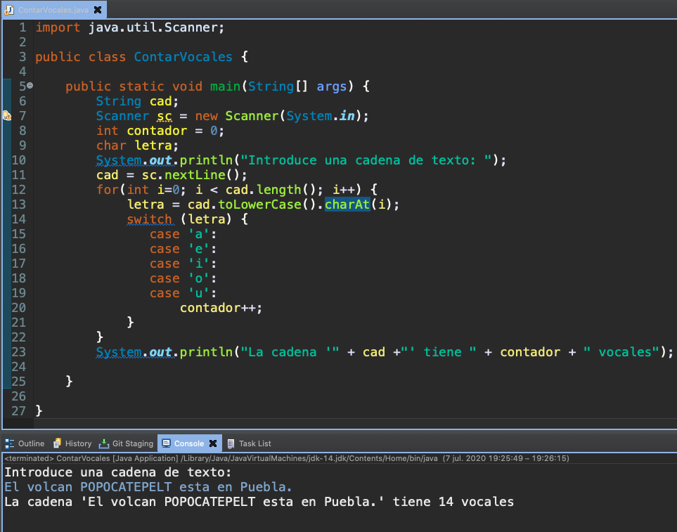
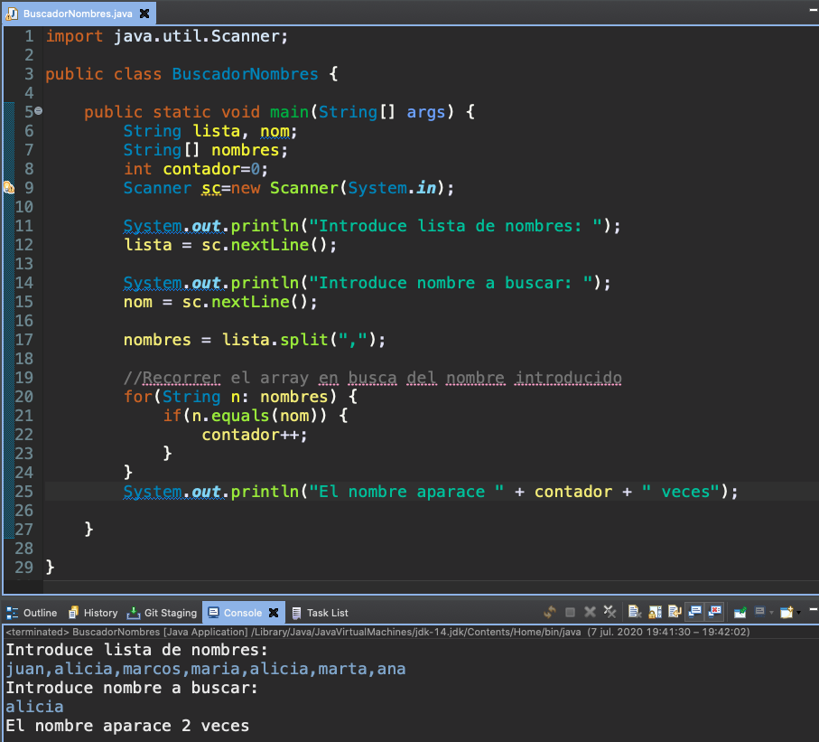

# 6. Cadenas de caracteres 30:23
   * 26 La clase String 04:04
   * 27 Principales métodos de la clase String 09:22
   * 28 Ejercicio práctico X 08:05
   * 29 Ejercicio práctico XI 08:52
   
# 26 La clase String 04:04


En esta lección voy a hablarte de una de las clases más importantes de Java, la clase 
`String` a través de la clase `String` podemos representar cualquier tipo de texto en Java.


Un texto es una cadena de caracteres y como digo se representa a través de la clase `String` porque todos los objetos de la clase `String` son textos.

Cómo creamos un objeto `String`.

Lo podemos crear de dos maneras una sería utilizando la forma tradicional de crear objetos Java usando `new` .

```java
String cad = new String("texto prueba");
```

Esto haría que en la variable `cad` se almacenarse una referencia a ese objeto y a partir de ella pudiéramos llamar a los métodos de la clase `String`, que estudiaremos en la lección siguiente. Como la clase `String` se utiliza muchísimo es decir en manejar objetos en un programa Java y en general en cualquier lenguaje programación es una tarea muy habitual de forma abreviada puedes crear un objeto `String`.

```java
String cad = "texto prueba";
```

Declarando la variable igual y asignando directamente el literal de objeto `String`, es decir como si fuera su número, un tipo primitivo Java, aunque insisto `String` no es un tipo primitivo `String` es una clase y los objetos `String` son los textos, en definitiva son objetos de dicha clase.


A partir de ahí qué operaciones podemos hacer con un objeto `String` pues aparte de llamar a sus métodos podemos por ejemplo unir textos, lo que se llama la *concatenación de textos*. Para ello podemos utilizar el signo igual sino más `+` que es el que se emplea también en sumas aritméticas, si tenemos una variable donde tenemos un texto la variable 1 y otra variable con otro texto, la suma de los dos, de ambas variables, la operación de suma equivaldría a la unión de ambos, es decir en S3 tendríamos el texto `hola adios`.


Una de las características más importantes de los objetos `String` es que **se trata de objetos inmutables** y eso significa que no se puede modificar un `String`, una vez que se ha creado no puede ser modificado.

Si yo por ejemplo tengo 

```java
String cad = "texto prueba";
cad= cad + " nuevo"; //concatenación
```
Inicialmente uno tiende a pensar que lo que ha ocurrido es que el objeto texto `cad` ha sido modificado y se le ha unido otra parte adicional, pero no es eso lo que ha ocurrido como resultado de esa concatenación es que se ha generado un nuevo texto, la unión de estos dos textoa es al que está apuntando la variable `cad`.

Esto lo vemos gráficamente de forma muy sencilla tienes el texto en memoria y la variable apuntándolo, tras la concatenación, tras la unión uno tendería a pensar como digo que el texto ha sido modificado pero no, se ha generado como he dicho antes un nuevo texto y la variable está apuntando a ese nuevo texto.

Qué pasa con el objeto anterior `texto prueba` que queda digamos en memoria sin ser referenciado hasta que el recolector de basura que es una de las partes importantes de la máquina virtual Java lo liberará ese espacio de memoria cuando se ponga en funcionamiento dicho recolector.

En esta lección simplemente te he explicado cuáles son los fundamentos de la clase `String`, cómo se crean objetos de `String`, la característica de inmutabilidad, pero el uso de los mismos es a través de las operaciones, aparte de la concatenación como hemos visto antes pero sobre todo de la llamada a sus múltiples métodos que tiene dicha clase, eso lo vamos a ver en la elección siguiente.

# 27 Principales métodos de la clase String 09:22


En la lección anterior has estado estudiando la clase `String` cómo has podido comprobar se trata de una de las clases más importantes de Java. Puesto que todos los textos son objetos de dicha clase.

A continuación lo que te voy a enseñar son los principales métodos de `String` y cómo aplicarlos en la manipulación de cadenas de caracteres dentro de un programa.

Pero antes de ello te voy a enseñar la siguiente página 


https://docs.oracle.com/en/java/javase/14/docs/api


https://docs.oracle.com/en/java/javase/14/docs/api/java.base/java/lang/String.html

Se trata de una dirección de Oracle donde se encuentra la ayuda oficial de las clases de Java estándar lo que llamamos el JavaDoc, en esta dirección encontrarás que está dividida en cuatro pestañas en All Module puedes ver la lista de todos los modulos de clases que forman todo el Java estándar. Como ves la mayoría de los modulos empiezan por Java luego el sub-modulo donde está organizado los distintos tipos de clases que tenemos. 

Tenemos el modulo base `java.base` donde estan definidas las APIs fundamentales de la plataforma Java SE, si entramos en ese modulo vemos.


El cual contiene diferentes paquetes que contienen las clases básicas de Java estándar, en el caso concreto de la clase `String` por ejemplo así como otras muchas de uso habitual en Java se encuentra en el paquete `java.lang` ahí es donde está la clase `String` seleccionemo el paquete `java.lang` y en este marco inferior puedes ver la lista de clases que componen dicho paquete.


Están ordenadas alfabéticamente por lo tanto estrechen tendríamos aquí una vez que selecciona la clase que va buscando en esta zona central aparece la información de la misma información de la misma.


Con una descripción de lo que representa cómo está definida y lo más importante que lo encontramos un poquito más abajo, la lista de constructores para poder crear objetos de dicha clase y especialmente en nuestro caso lo que nos interesa con `String` la lista de métodos.


Métodos que expone dicha clase y que puedes aplicar sobre cualquier objeto de tipo `String`.

La ayuda de los métodos como ves se indica nombre del método, el tipo de datos que recibe, la lista de parámetros y lo que devuelve. Hay una pequeña descripción sobre el funcionamiento del método pero si quieres entrar en más detalles harías click en el método que te interesa y ahí te da una información un poquito más detallada.

No se trata de una página que se utilice como estilo típico tutorial de Java porque no se trata de aprender Java con esto es más bien una referencia para los programadores que pueden acudir en cualquier momento a informarse sobre alguna clase que les interesa y obtener información de los métodos, tipo de datos que devuelven, parámetros que reciben etc. Muy importante que la tengan siempre referenciada en tus favoritos de tu navegador para consultarla en cualquier momento.

Vamos a ver algunos de los métodos más importantes.


**Método `int length()`**, es bastante sencillo no recibe nada como parámetro y nos devuelve un entero que es el total de caracteres de la cadena.

```java
String cad="texto prueba";
System.out.println(cad.length()); //Muestra 12
```

Va a devolver la longitud, número de caracteres que tiene en este caso incluidos los espacios por supuesto si los contamos que son 12.

**Método `char charAt(int pos)`** en este caso este método lo vamos a utilizar para saber que carácter ocupa una determinada posición de la cadena, si le pasa como parámetro una posición de la cadena te devuelve el carácter en esa posición.

```java
String cad="texto prueba";
System.out.println(cad.charAt(2)); //Muestra x
```

La primer posición empieza en 0 por lo tanto la posición del último siempre será la longitud total menos 1 puesto que siempre el primero esta en la posición 0.

**Método `boolean equals(Object ob)`**, en el caso de querer comparar textos no podemos utilizar el operador de comparación de igualdad `==`. Por qué, porque los textos son objetos, **el doble igual `==` se utiliza para comparar tipos primitivos Java**. Si lo utilizas con variables de tipo `String` estarías comparando realmente sus referencias a las direcciones de memoria y aunque fueran textos idénticos si están en zonas de memoria distintos sería falso la comparación entre las dos variables. Por lo tanto hay que utilizar este método `equals(Object ob)` al cual se le pasa como parámetro el texto con el que lo quieres comparar y lo compara contra texto que hay en la variable a la que le estás aplicando dicho método.

```java
String cad="texto prueba";
if(cad.equals("texto"){
   System.out.println("iguales"); //No lo muestra
}
```

En este caso estaríamos comparando `texto prueba` con `texto` nos daría como resultado falso, solamente nos devolvera verdadero si se trata de una coincidencia exacta es decir son iguales todos los caracteres, haciendo distinción entre mayúsculas y minúsculas.


**Método `boolean equalsIgnoreCase(Object ob)`**, que no nos interesa la distinción entre mayúsculas y minúsculas utilizaríamos este método, hace lo mismo pero en este caso no tiene en cuenta las mayúsculas y minúsculas si una palabra está escrita en mayúsculas y otra en minúsculas, si son los mismos caracteres nos va a devolver verdadero.

**Método `int indexOf(String aux)`**, este método tiene como misión indicarnos la posición de una cadena dentro de otra, es decir yo tengo:

```java
String cad="texto prueba";
System.out.println(cad.indexOf("to")); //Muestra 3
System.out.println(cad.indexOf("un")); //Muestra -1
}
```

Si encuentra la subcadena devuelve el índice donde comienza esa subcadena dentro de la cadena original.

Qué ocurre si le paso un texto que no está contenido en la cadena principal, me devuelve -1.

**Método `String toLowerCase()`**, este método lo que hace es **devolvernos una copia de la cadena** y digo devolvernos porque los textos como ya vimos en la lección anterior son inmutables, no se pueden modificar, entonces todos estos métodos calculan un texto que convierten en mayúsculas, son métodos que actúan o generan una copia de la cadena, el original permanece intacto.

```java
String cad="HOLA";
System.out.println(cad.toLowerCase()); //Muestra hola
}
```

Lo que hace es devolvernos una nueva cadena resultante de transformar todas las letras a minúsculas.

**Método `String toUpperCase()`**, hace lo contrario le damos el texto y nos devuelve una copia en mayúsculas.

```java
String cad="hola";
System.out.println(cad.toUpperCase()); //Muestra HOLA
}
```


**Método `String replace(char old, char new)`**, remplaza el primer caracter indicado como parámetro por el segundo pero no sobre la cadena original que repito es inmutable, devuelve una copia con el resultado de ese reemplazo.

```java
String cad="texto prueba";
System.out.println(cad.replace('e','@')); //Muestra t@xto pru@ba
}
```

**Método `String[] split(String exp)`**, muy práctico también cuando tenemos una cadena de caracteres que está formada por una serie de ítems, de nombres, de países, etc., separados por un carácter una coma, un espacio con lo que sea, para hacer búsquedas en esa lista de nombres podríamos transformarlo en una array y así sería más comoda la busqueda, eso es precisamente lo que hace el método `split`.

```java
String cad="maria pedro miguel";
String[] nombres = cad.split(" "); //saparador, espacio en blanco
//muestra los tres nombres
for(String s: nombres){
   System.out.println(s);
}
```

Al método `split` le pasamos como parámetro el carácter de separación. En este caso le estamos pasando a la cadena `cad` formada por tres nombres el espacio, que sería el caracter de separación y lo que hace es devolvernos un array con el contenido de esa cadena , donde cada posición del array sería uno de los elementos de la cadena.

En este caso en la posición cero tendríamos el nombre `maria` en la posición 1 `pedro` y la posición 2 `miguel`.

Como ves el array `nombres` no hay que crearlo sino directamente declaras la variable y el `split` devuelve el array ya construido, luego lo recorremos para mostrar su contenido.


**Método `String substring(int pos1, int pos2)`**, este método lo que hace es devolvernos un trozo de la cadena que está formado por los caracteres que van entre la posición 1 y la posición 2 **no incluida** muy importante, la posición 1 si se incluye pero la posición 2 no se incluye.

```java
String cad="texto prueba";
System.out.println(cad.substring(2,8)); //Muestra: xto pr
}
```

Has visto alguno de los métodos más interesantes de `String` en las siguientes lecciones vamos a hacer algunos ejercicios aplicando dichos métodos.

# 28 :computer: Ejercicio práctico X `601-11-Ejercicio_Practico_10` 08:05


A continuación vamos a realizar un ejercicio en el que vamos a poner en práctica algunos de los métodos que hemos visto en la lección anterior sobre la clase `String`.


El ejercicio va a consistir en un programa que solicitará al usuario la introducción de una cadena de texto y después de eso nos dirá cuántos vocales contiene dicho texto.

Vamos al entorno de desarrollo para crear el proyecto que vamos a llamar `601-11-Ejercicio_Practico_10`, vamos a crear la clase `ContarVocales` con método `main` que va a contener el siguiente código:

*`ContarVocales`*

```java
import java.util.Scanner;

public class ContarVocales {

   public static void main(String[] args) {
      String cad;
      Scanner sc = new Scanner(System.in);
      int contador = 0;
      char letra;
      System.out.println("Introduce una cadena de texto: ");
      cad = sc.nextLine();
      for(int i=0; i < cad.length(); i++) {
         letra = cad.toLowerCase().charAt(i);
      	 switch (letra) {
            case 'a':
            case 'e':
            case 'i':
            case 'o':
            case 'u':
               contador++;			
         }
      }
      System.out.println("La cadena '" + cad +"' tiene " + contador + " vocales");
   }
}
```

Si ejecutamos el programa tenemos.



# 29 :computer: Ejercicio práctico XI `601-12-Ejercicio_Practico_11` 08:52 


Vamos a realizar un nuevo ejercicio en el que vamos a poner en práctica más métodos de la clase `String`.


En este caso se trata de hacer un programa que va a solicitar al usuario la introducción de una cadena de texto, una cadena de texto que va a consistir en una serie de nombres, nombres de personas separadas por comas. A continuación el programa le va a solicitar al usuario la introducción de un nombre y qué es lo que va a hacer el programa, decirnos cuántas veces aparece este nombre en la lista de nombres introducidas en primer lugar.

Vamos a crear el proyecto `601-12-Ejercicio_Practico_11` con la clase `BuscadorNombres` con método `main` y que contiene el siguiente código.

```java
import java.util.Scanner;

public class BuscadorNombres {

	public static void main(String[] args) {
		String lista, nom;
		String[] nombres;
		int contador=0;
		Scanner sc=new Scanner(System.in);
		
		System.out.println("Introduce lista de nombres: ");
		lista = sc.nextLine();
		
		System.out.println("Introduce nombre a buscar: ");
		nom = sc.nextLine();
		
		nombres = lista.split(",");
		
		//Recorrer el array en busca del nombre introducido
		for(String n: nombres) {
			if(n.equals(nom)) {
				contador++;
			}
		}
		System.out.println("El nombre aparace " + contador + " veces");

	}

}
```

Si ejecutamos el programa tenemos.


