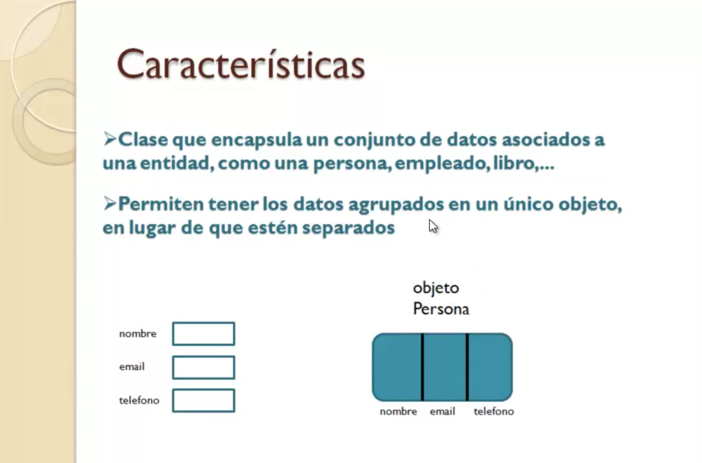
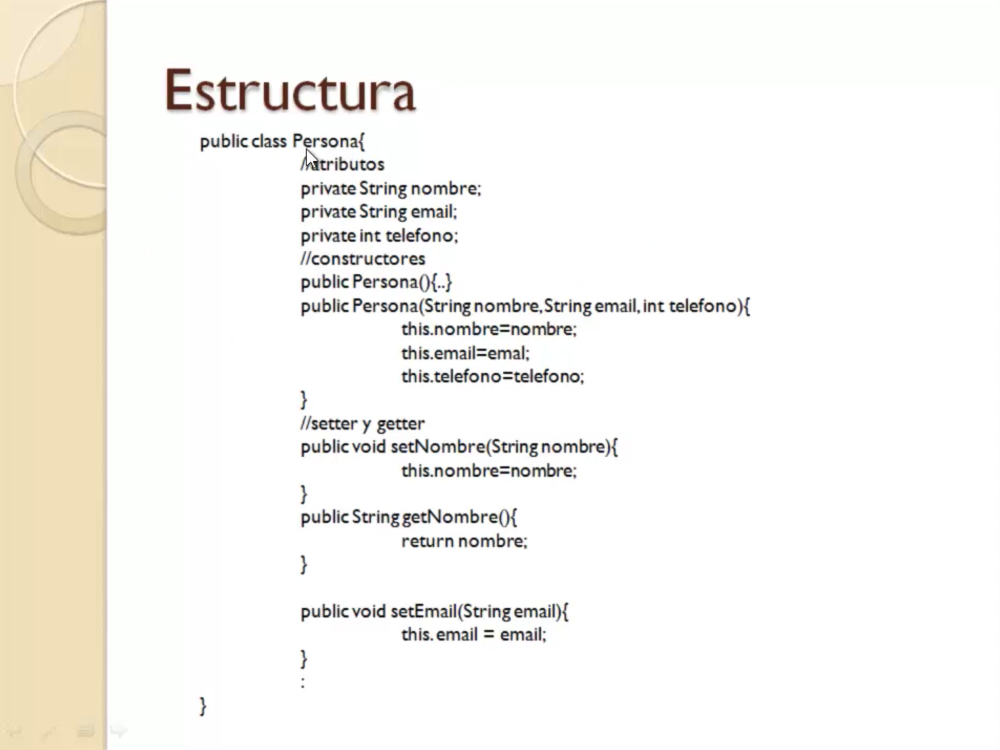
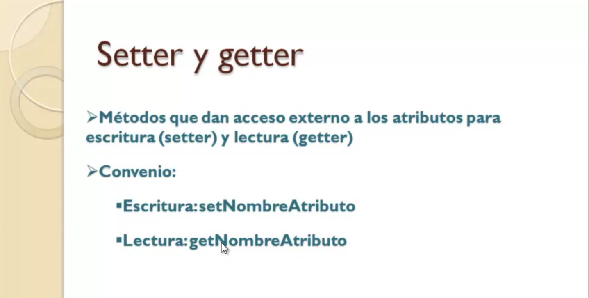
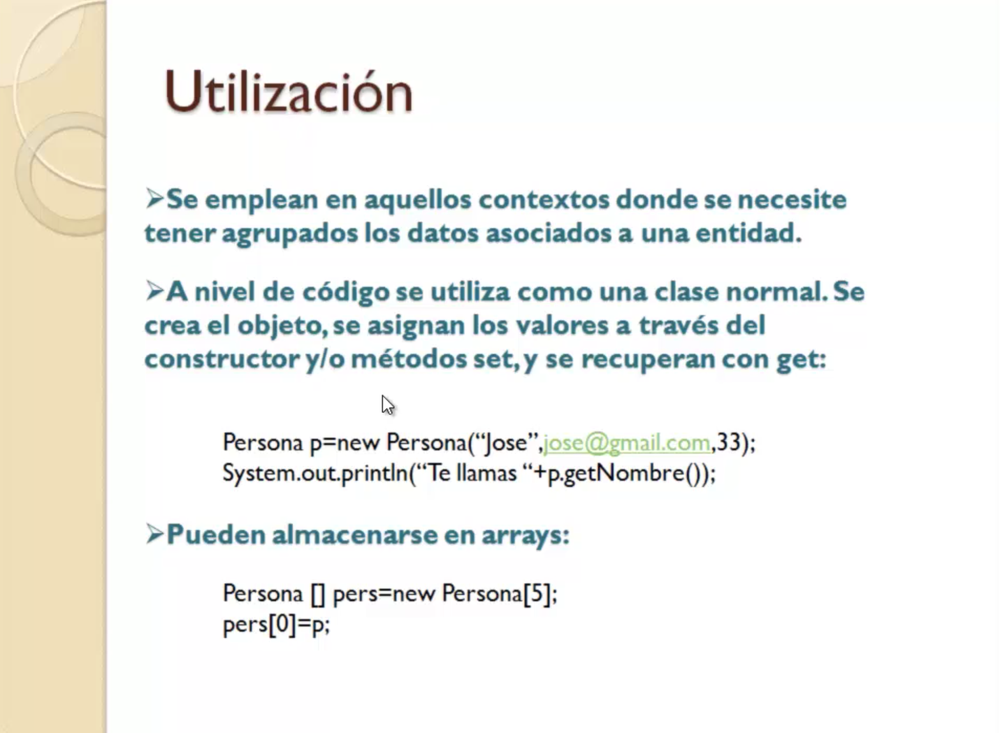
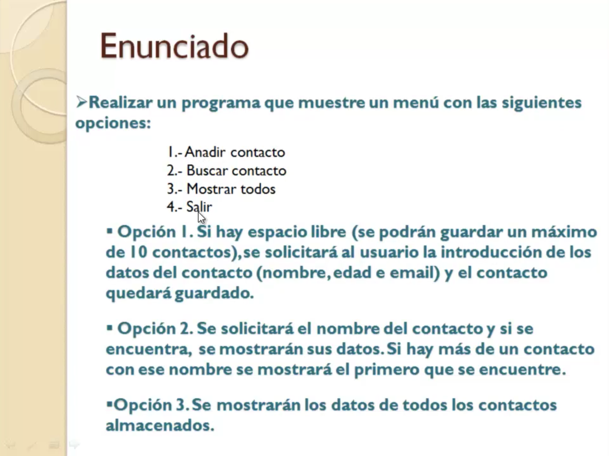

# 7. JavaBeans 18:30
   * 30 JavaBeans 05:10
   * 31 Ejercicio práctio XII 13:20
   
# 30 JavaBeans 05:10


En esta lección voy a enseñarte a utilizar un tipo de clase muy habitual en Java conocida como *Java Bean*.



¿Qué es un Java Bean? Un Java Bean no es una clase que podamos encontrar en el paquete de clases de Java estándar. Se trata de una clase personalizada, creada por nosotros como programadores, cuyo objetivo es encapsular una serie de datos asociados a una determinada entidad o un determinado elemento como una persona, empleado, libro, de modo que en vez de tener los datos de esa persona separados en variables, el nombre por un lado, el email por otro y el teléfono por otro, los tengamos todos agrupados dentro de un mismo objeto. Eso facilita su manipulación y hacer operaciones de crear datos de personas, búsqueda de datos, eliminaciones, etc. 



Como es un Java Bean, un Java Bean es una clase normal de código creada por el programador cuyo nombre suele coincidir con el nombre de la entidad que vamos a representar, en este caso `Persona` y que está formada por una serie de atributos, variables donde vamos a almacenar cada uno de los elementos que identifican a esa entidad.

En este caso tendremos un atributo `String` para el nombre, otro `String` para el email y otro `int` para el teléfono.

Además de eso tendremos los constructores entre los cuales lógicamente habrá uno que a la hora de crear un objeto `Persona` ya le podamos indicar los datos que identifican a esa `Persona` y el constructor se encargue de guardar los atributos.

Pero para acceder una vez que se ha creado el objeto a la información almacenada dentro de su objeto persona tenemos que proporcionar los llamados métodos getters y setters, por qué se les llama así. Bueno porque son los métodos que utilizan para escritura de datos dentro del objeto y recuperación de los datos y se llaman getters y setters porque la nomenclatura para poder nombrarlos es la siguiente.

```java
//setter y getter
public void setNombre(String nombre){
   this.nombre = nombre;
}
public String getNombre(){
   return nombre;
}
```

Los métodos `set` recibirán como parámetro el dato y habitualmente lo que harán será asignarlo a su atributo correspondiente mientras que los `get` recuperan el valor del atributo. Se nombran con `set` o `get` y a continuación el nombre del atributo. En el caso de los `set` devuelven `void` y en el caso de los `get` devuelven el tipo del atributo.

El caso de los `set` no solamente se puede hacer la asignación directamente y ya está, sino que se puede incluir algún tipo de lógica que compruebe el dato a asignar antes de proceder a ello. Esto es una ventaja respecto a por ejemplo exponer directamente como Público los atributos al hacerlo a través de setter podemos meter ese control y evitar que se puedan introducir datos incorrectos dentro de un objeto de este tipo.




Como te decía la nomenclatura de los métodos setter y getter es la que se  muestra en la diapositiva, `get` el nombre del atributo con la primera en mayúscula, `set` el nombre que le hemos dado el atributo con la primera también en mayúscula, nosotros los podemos nombrar como queramos a estos métodos, pero es muy conveniente que sigamos esta nomenclatura clásica tipo Java Bean, porque en un futuro si estos objetos y estos Java Ban los van a manejar determinados Frameworks conjuntos de utilidades que existen en Java, esos Frameworks se encargarán de hacer una serie de cosas con los objetos por nosotros lo van a facilitar la tarea de manipulación de Java Bean pero para ello se debe cumplir esta nomenclatura.



Cómo se utiliza un Java Bean, el contexto de utilización es aquel en el cual queremos tener todos los datos de una determinada entidad agrupados dentro de un objeto para luego almacenarlos en un array o hacer algún tipo de manipulación con ellos.

Si nosotros queremos crear un objeto `Persona` con el nombre y el email de una persona pues lo haríamos de la siguiente manera:

```java
Persona p =new Persona("Jose", "jose@gmail.com", 33);
System.out.println("Te llamas " + p.getNombre());
```

Declararían la variable de tipo `Persona` igual que se declaran variables de tipo `String` de tipo `int`, declaremos en este caso del tipo la clase que hemos definido `Persona` y con el `New` crearíamos el objeto y ya llamaríamos al constructor pasándole los datos correspondientes.

Una vez creado el objeto para acceder a la información almacenada en él, si queremos leer hacemos la llamada al método `get`, en este caso nos devolvería el nombre y lo mostraría junto con el texto que le estamos concatenando.

Por supuesto podemos tener arrays de objetos Java Beans

```java
Persona [] pers =new Persona[5];
pers[0]=p;
```

En este caso tenemos una array de cinco elementos de tipo `Persona` declaró la variable de array de `Persona` y con el `new` crearíamos indicando el nombre de la clase `Persona` entre corchetes el tamaño, a partir de ahí ya en las distintas posiciones se pueden ir almacenando objetos `Persona`.

Como ves se trata de una clase muy práctica y que se utiliza como he dicho antes muchísimo en las aplicaciones Java cuando vamos a trabajar con conjuntos de datos asociados a la entidad. Vas a ver en el siguiente ejercicio un caso muy concreto de utilización y que nos da la idea de lo interesante y de lo ampliamente utilizados que son este tipo de clases.

# 31 :computer: Ejercicio práctio XII `601-13-Ejercicio_Practico_12` 13:20  


En esta lección vamos a realizar un ejercicio en el que vamos a hacer uso de las clases de tipo Java Bean y también de algunos de los elementos vistos en lecciones anteriores como por ejemplo la encapsulación de lógica de aplicación en clases independientes.



El ejercicio en cuestión se trata de un programa en el que al iniciarse aparecerá el menú con cuatro opciones, añadir contacto, buscar contactos, mostrar contactos y salir, es la gestión de una agenda de contactos.

En la opción 1 en caso de que haya espacio libre para añadir contacto porque vamos a limitarlo a 10, se solicitará al usuario la introducción de los datos de dicho contacto que van a ser nombre, edad e email, vamos a limitar a esos tres. Si hay espacio libre como digo pues se solicitará los datos y se quedará guardado el contacto dentro de la aplicación. Vamos a crear una array de 10 elementos como como podéis imaginar.

En la opción 2 para la búsqueda de contactos se va a pedir un nombre del usuario. Si el contacto existe es decir tenemos un contacto almacenado con ese nombre pues se van a mostrar todos los datos del mismo y si no pues habrá un mensaje de advertencia diciendo que no se ha encontrado el contacto, que hay más contactos con ese nombre, pues el primero que se encuentra es el que se muestra.

En la opción 3 se van a mostrar los datos de todos los contactos almacenados hasta el momento.

La opción 4 es para salir.

Vamos a ir al entorno de desarrollo Eclipse y creamos el proyecto `601-13-Ejercicio_Practico_12` vamos a tener el paquete `beans` y la clase `Contacto`, luego vamos a tener un paquete `logica` con la clase `GestionContacto` donde tendremos toda la llógica para poder añadir, buscar y mostrar un contacto y otro paquete `presentacion` con la clase `Principal` encargada de interactuar con el usuario para mostrarle el menú.


Entonces bueno pues ya está hecho parte del mismo.

Eso sí si faltaba una clase que es donde quería yo centrarme ahora que es en la creación de la clase Java Bin esa clase que va a encapsular los datos de contacto y que vamos a utilizar.

Pues eso para agrupar todos los datos del mismo el nombre el email y la edad y que los objetos de esa clase serán almacenados en arrays serán presentados.

Sólo vamos a ir viendo a lo largo del ejercicio lo primero cómo creamos una clase Java en Needish es una clase normal y corriente entonces nos vamos a ir a la opción de menú dentro del menú contextual.

Botón derecho new Java class o clase.

Entonces el asistente que nos aparece ahora simplemente le vamos a indicar el paquete donde queremos guardar la clase Vins el nombre del paquete clásico para guardar clase de este tipo y la clase pues el nombre del elemento que va a representar la entidad que va a representar un contacto vale.

Bueno pues nada más.

Pulsamos el botón finish y ahí tenemos.

Ahora mismo se creará nuestra clase que es una clase normal y corriente.

Como ya vimos en la lección anterior Java bien pues se trata trata de encapsular dentro de una clase de datos asociados a una entidad y esa encapsulación se va a hacer en una serie de atributos que vamos a declarar como Private que van a ser el nombre un entero la edad y el e-mail string.

Además tendremos un constructor o más de un constructor para inicializar los atributos y los famosos Getter setter que nos van a permitir acceder a cada uno de esos atributos una vez que el objeto se ha creado y queramos guardar datos individualmente o recuperarlos.

Bueno pues todo eso no lo puede hacer automáticamente el asistente en nosotros solamente tenemos que definir los atributos como los Besaile a partir de ahí que queremos crear el constructor botón derecho y en sours hay una opción que nos dice generar constructor utilizando campos elegimos esa opción y entonces aparecen los tres campos marcados o tres o atributos que son los que vamos a utilizar en la inicialización dentro del constructor.

Llegamos al botón OK y cómo ves que un constructor para crear un objeto con esos datos que a través del disco se va guardando cada parámetro en su atributo correspondiente.

Esta instrucción super que ves ahí no lo vamos a hacer mucho caso la podemos borrar no tiene relevancia para lo que ahora mismo a nosotros nos importa podríamos crear más constructores alguno que no tenga parámetros pero bueno vamos a dejar eso simplemente y ahora se Ticketek lo mismo botón derecho sours y aparece una opción que es generar translitera queremos etc etc. para los 3 atributos.

Por lo tanto seleccionamos todo y automáticamente como vamos a ver el asistente nos va a crear los y Sepes ya tenemos nuestro Jabari a partir de ahí pues ya hacemos el resto de la aplicación y como ya vimos en algún ejercicio anterior vamos a separarlo en dos capas.

Por un lado lo que sería la lógica de aplicación que va a encapsular todas las operaciones con ese Arráiz donde vamos a meter los contactos las operaciones de alta recuperación búsqueda etc Cetra y luego otra clase que tenemos aquí principal donde vamos a tener la parte del menú es decir la interacción con el usuario la capa de presentación que llamamos habitualmente vamos a ver cómo sería la parte de la capa de lógica de aplicación que nosotros la tenemos definida la clase gestión datos.

Bueno lo primero pues vamos a definir dentro de esa clase un atributo de tipo Array y como ves Array string no es el raid entero esa raiz de objetos contactos es lo bueno que tienen los JAVILALA el objetivo realmente de ellos permitir encapsular dentro de una clase todos los datos asociados a esa entidad entonces en un mismo Array podemos tener todos los datos de todos los contactos no tendríamos que tener una raíz de nombres una raíz de edad y una red de medios vale tenemos aquí a de tipo contando la variable total que nos va a marcar en cada momento cuántos contactos tenemos ya almacenados que va a ser un máximo de 10.

Cómo saber ahora con el constructor.

Pues como ves creamos ese Array indicando como decía tamaño 10 y la variable total inicializar a.

A partir de ahí ya los métodos que vamos a exponer a partir de lo que hemos visto en el menú que tiene que hacer la aplicación para agregar para búsquedas para recuperar todos los contactos pero también vamos a tener uno que nos va a permitir conocer en cada momento si hay espacio libre en el array para poder añadir otro contacto lógicamente es un método que le llamamos así espacio libre no recibe ningún parámetro y nos devuelve un bullían es tan simple como preguntar por el total que es la variable que contiene en cada momento el tamaño actual de la red es decir cuántos contactos tenemos almacenados en menos de 10 hay espacio dentro si no no hay espacio de volver a falso bien el resto ya los métodos un poco ya de digamos lógica la aplicación método agregar como es reciben los datos del contacto nombre email.

Y qué hace.

Pues sí hay espacio crea el objeto contacto y lo guarda en la posición marcada por total.

Después de eso incrementamos una unidad para indicar que tenemos un contacto más y al mismo tiempo para informar de alguna manera al usuario de que es el usuario la capa de presentación en este caso de que se ha podido agregar pues tenemos como tipo de evolución un bullen que nos va a indicar.

Si realmente se pudiera agregar y en caso de que no haya espacio como es falso no se ha podido agregar bien buscar por archivo como parámetro el nombre del contacto a buscar y fíjate el tipo de evolución el objeto o contacto.

Entonces declaramos una variable de tipo contacto que inicialmente le ponemos al valor Null null es la manera de inicializar una variable de tipo objeto inicializar a nada igual que un entero inicializar 0 por ejemplo una variable tipo objetos inicializar anulo en esa variable vamos a guardar el contacto que cumpla con la condición de que su nombre sea igual a éste.

Para ello hay que recorrerlos vale entonces recorremos la raíz de los contactos hasta la posición marcada por total lógicamente no hasta 10 sino hasta la posición marcada por total y vamos preguntando es fíjate. 

Para acceder a la raíz utilizamos los corchetes y la variable de control del Forth y lo que tenemos ahí es un objeto de contacto.

Por lo tanto a eso le aplicamos la llamada a aquel nombre para que nos dé el nombre del contacto y esto es un Extrem a ese string le aplicamos el método que ya hemos estudiado cuando hemos visto los la que dedicada a los métodos de la clase string para preguntar si es igual a ese nombre que tenemos aquí.

Si esto devuelve verdadero pues entonces ya hemos encontrado el contacto ese contacto está en esa posición y es lo que vamos a guardar en C para devolverlo después y que también lo hemos estudiado.

Es una utilidad muy típica pero que está recorriendo ya se encontró lo que buscabas.
Para qué vamos a seguir buscando.

Finalizamos el bucle for con esa instrucción.

No necesitamos seguir comprobando como hice el comentario.

Y por último por recuperar todos los contactos.

La idea vamos a devolver a la capa de presentación todo Larrieu con los contactos que tenemos hasta ese momento.

Vale pues no devolvemos la raíz de 10 que tenemos.

Creamos uno nuevo un nuevo array de contactos cuyo tamaño sea el total que tenemos.

Si tenemos cinco pues creamos una red de cinco si tenemos tres una red de tres.

Vamos recorriendo el array actual que es la variable contactos y vamos volcando uno a uno los contactos que tenemos en el array principal contactos en el array existentes que es este que hemos creado aquí auxiliar únicamente con el tamaño de los que tenemos.

Y eso es lo que devolvemos pues esto sería.

Aquí no hay ninguna instrucción de entrada salida de mostrar resultados pedir datos al usuario.

Eso ya sería cuestión de la clase principal que la tienes aquí.

Creamos el objeto escáner para poder hacer lecturas creamos un objeto gestión contactos la variable donde vamos a guardar la opción y el clásico bucle de Uruguay que ya hemos visto en otro ejercicio anterior para ir presentando el menú.

Vale vamos presentando esto serían las variables donde vamos a ir guardando los datos del contacto que vamos pidiendo para añadirlo y como ves representa las opciones del menú.

Le pedimos al usuario que introduzca una la estamos leyendo siempre con el cliente independientemente de todo lo vamos a leer con Line y si hay que hacer una conversión entera porque lo que están leyendo es un número entero o también puede ser un doble o lo que sea pues como es la enloda como string esta expresión integra el Passaic nos convertiría ese texto string que puede ser o debe ser un número pero leído como texto a tipo numérico para siempre utilizar este método y no combinarlo con el Lexi ni esclavo que como ya te comenté en una lección anterior la combinación de ambos métodos dentro de un mismo objeto escáner puede producir problemas entonces sólo utilizamos bien casos que evaluamos la acción y si es uno fíjate.

Preguntamos hay espacio libre en el método que hemos creado en gestión contactos que nos va a devolver trusa y espacio libre.

Si es así le pedimos los datos del contacto nombre de email y llamamos al método agregado.

Si no hubiera espacio simplemente un mensaje de agenda llena no hay espacio.

En el caso 2 es una búsqueda le pedimos un nombre es Aislinn utilizamos esta variable nombre también y hacemos una llamada a buscar que nos va a devolver el contacto que tenga ese nombre pero como ellos sí lo han encontrado no pues si no lo hubieran encontrado la variable de contacto que tenemos aquí se habría quedado inicializar azul si no pasa por porque no lo encuentra lo que le va a devolver es un Null pues precisamente por eso es por lo que se pregunta aquí si es Null no se ha encontrado.

Ese es el mensaje que nos que se nos muestra si no es Null o sea encontrado y como es.

Llamando a los métodos guetto montamos la frase con los datos nombre y medida del contacto localizarlo. 

En el caso de que queramos recuperar mostrar los nombres de xogo son todos los datos de cada contacto almacenado.

Llamamos a ese otro método recuperar contacto que nos va a devolver un array con el tamaño del que tenga los contactos almacenados es decir son tres tres siete o lo que sea no hay que hacer un Iwaki es decir este método ya me devuelve ese Array lo guardo la variable contacto y a recorrer la variable búsqueda es de tipo de contacto recorremos esa variable que tendrá el array con los contactos que haya que sea. 
No utilizamos índices.

Podemos usar un bit y vamos mostrando los datos de cada contacto.

En la opción 4 no hacemos nada y en ese caso como ya dejaría cumplirse guai no volvería a mostrar el menú y finalizaría el programa.

No se ha visto aquí una aplicación ya muy completa en la que realmente aparecen muchas de las cosas que hemos ido viendo a lo largo del curso.

No solamente los jabalinas sino por supuesto todas las instrucciones de control la separación en capas método el stream.

En fin creo que es un ejercicio bastante completo con el que se te pueden quedar claros muchos de los conceptos estudiados a lo largo de este curso.
