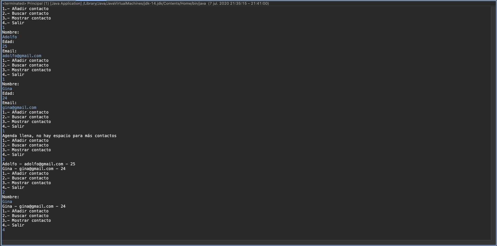

# 7. JavaBeans 18:30
   * 30 JavaBeans 05:10
   * 31 Ejercicio práctio XII 13:20
   
# 30 JavaBeans 05:10


En esta lección voy a enseñarte a utilizar un tipo de clase muy habitual en Java conocida como *Java Bean*.


¿Qué es un Java Bean? Un Java Bean no es una clase que podamos encontrar en el paquete de clases de Java estándar. Se trata de una clase personalizada, creada por nosotros como programadores, cuyo objetivo es encapsular una serie de datos asociados a una determinada entidad o un determinado elemento como una persona, empleado, libro, de modo que en vez de tener los datos de esa persona separados en variables, el nombre por un lado, el email por otro y el teléfono por otro, los tengamos todos agrupados dentro de un mismo objeto. Eso facilita su manipulación y hacer operaciones de crear datos de personas, búsqueda de datos, eliminaciones, etc. 


Como es un Java Bean, un Java Bean es una clase normal de código creada por el programador cuyo nombre suele coincidir con el nombre de la entidad que vamos a representar, en este caso `Persona` y que está formada por una serie de atributos, variables donde vamos a almacenar cada uno de los elementos que identifican a esa entidad.

En este caso tendremos un atributo `String` para el nombre, otro `String` para el email y otro `int` para el teléfono.

Además de eso tendremos los constructores entre los cuales lógicamente habrá uno que a la hora de crear un objeto `Persona` ya le podamos indicar los datos que identifican a esa `Persona` y el constructor se encargue de guardar los atributos.

Pero para acceder una vez que se ha creado el objeto a la información almacenada dentro de su objeto persona tenemos que proporcionar los llamados métodos getters y setters, por qué se les llama así. Bueno porque son los métodos que utilizan para escritura de datos dentro del objeto y recuperación de los datos y se llaman getters y setters porque la nomenclatura para poder nombrarlos es la siguiente.

```java
//setter y getter
public void setNombre(String nombre){
   this.nombre = nombre;
}
public String getNombre(){
   return nombre;
}
```

Los métodos `set` recibirán como parámetro el dato y habitualmente lo que harán será asignarlo a su atributo correspondiente mientras que los `get` recuperan el valor del atributo. Se nombran con `set` o `get` y a continuación el nombre del atributo. En el caso de los `set` devuelven `void` y en el caso de los `get` devuelven el tipo del atributo.

El caso de los `set` no solamente se puede hacer la asignación directamente y ya está, sino que se puede incluir algún tipo de lógica que compruebe el dato a asignar antes de proceder a ello. Esto es una ventaja respecto a por ejemplo exponer directamente como Público los atributos al hacerlo a través de setter podemos meter ese control y evitar que se puedan introducir datos incorrectos dentro de un objeto de este tipo.


Como te decía la nomenclatura de los métodos setter y getter es la que se  muestra en la diapositiva, `get` el nombre del atributo con la primera en mayúscula, `set` el nombre que le hemos dado el atributo con la primera también en mayúscula, nosotros los podemos nombrar como queramos a estos métodos, pero es muy conveniente que sigamos esta nomenclatura clásica tipo Java Bean, porque en un futuro si estos objetos y estos Java Ban los van a manejar determinados Frameworks conjuntos de utilidades que existen en Java, esos Frameworks se encargarán de hacer una serie de cosas con los objetos por nosotros lo van a facilitar la tarea de manipulación de Java Bean pero para ello se debe cumplir esta nomenclatura.


Cómo se utiliza un Java Bean, el contexto de utilización es aquel en el cual queremos tener todos los datos de una determinada entidad agrupados dentro de un objeto para luego almacenarlos en un array o hacer algún tipo de manipulación con ellos.

Si nosotros queremos crear un objeto `Persona` con el nombre y el email de una persona pues lo haríamos de la siguiente manera:

```java
Persona p =new Persona("Jose", "jose@gmail.com", 33);
System.out.println("Te llamas " + p.getNombre());
```

Declararían la variable de tipo `Persona` igual que se declaran variables de tipo `String` de tipo `int`, declaremos en este caso del tipo la clase que hemos definido `Persona` y con el `New` crearíamos el objeto y ya llamaríamos al constructor pasándole los datos correspondientes.

Una vez creado el objeto para acceder a la información almacenada en él, si queremos leer hacemos la llamada al método `get`, en este caso nos devolvería el nombre y lo mostraría junto con el texto que le estamos concatenando.

Por supuesto podemos tener arrays de objetos Java Beans

```java
Persona [] pers =new Persona[5];
pers[0]=p;
```

En este caso tenemos una array de cinco elementos de tipo `Persona` declaró la variable de array de `Persona` y con el `new` crearíamos indicando el nombre de la clase `Persona` entre corchetes el tamaño, a partir de ahí ya en las distintas posiciones se pueden ir almacenando objetos `Persona`.

Como ves se trata de una clase muy práctica y que se utiliza como he dicho antes muchísimo en las aplicaciones Java cuando vamos a trabajar con conjuntos de datos asociados a la entidad. Vas a ver en el siguiente ejercicio un caso muy concreto de utilización y que nos da la idea de lo interesante y de lo ampliamente utilizados que son este tipo de clases.

# 31 :computer: Ejercicio práctio XII `601-13-Ejercicio_Practico_12` 13:20  


En esta lección vamos a realizar un ejercicio en el que vamos a hacer uso de las clases de tipo Java Bean y también de algunos de los elementos vistos en lecciones anteriores como por ejemplo la encapsulación de lógica de aplicación en clases independientes.


El ejercicio en cuestión se trata de un programa en el que al iniciarse aparecerá el menú con cuatro opciones, añadir contacto, buscar contactos, mostrar contactos y salir, es la gestión de una agenda de contactos.

En la opción 1 en caso de que haya espacio libre para añadir contacto porque vamos a limitarlo a 10, se solicitará al usuario la introducción de los datos de dicho contacto que van a ser nombre, edad e email, vamos a limitar a esos tres. Si hay espacio libre como digo pues se solicitará los datos y se quedará guardado el contacto dentro de la aplicación. Vamos a crear una array de 10 elementos como como podéis imaginar.

En la opción 2 para la búsqueda de contactos se va a pedir un nombre del usuario. Si el contacto existe es decir tenemos un contacto almacenado con ese nombre pues se van a mostrar todos los datos del mismo y si no pues habrá un mensaje de advertencia diciendo que no se ha encontrado el contacto, que hay más contactos con ese nombre, pues el primero que se encuentra es el que se muestra.

En la opción 3 se van a mostrar los datos de todos los contactos almacenados hasta el momento.

La opción 4 es para salir.

Vamos a ir al entorno de desarrollo Eclipse y creamos el proyecto `601-13-Ejercicio_Practico_12` vamos a tener el paquete `beans` y la clase `Contacto`, luego vamos a tener un paquete `logica` con la clase `GestionContacto` donde tendremos toda la llógica para poder añadir, buscar y mostrar un contacto y otro paquete `presentacion` con la clase `Principal` encargada de interactuar con el usuario para mostrarle el menú lo que se conoce como la *Capa de Presentación*.


*`Contacto`*

```java
package beans;

public class Contacto {
	
	private String nombre;
	private int edad;
	private String email;
	
	public Contacto(String nombre, int edad, String email) {
		this.nombre = nombre;
		this.edad = edad;
		this.email = email;
	}

	public String getNombre() {
		return nombre;
	}

	public void setNombre(String nombre) {
		this.nombre = nombre;
	}

	public int getEdad() {
		return edad;
	}

	public void setEdad(int edad) {
		this.edad = edad;
	}

	public String getEmail() {
		return email;
	}

	public void setEmail(String email) {
		this.email = email;
	}
}
```

*`GestionContacto`*

```java
package logica;

import beans.Contacto;

public class GestionContactos {
	
	private Contacto[] contactos;
	private int total;
	private int numMaxContactos=2;
	
	public GestionContactos() {
		contactos = new Contacto[numMaxContactos];
		total=0;
	}
	
	public boolean espacioLibre() {
		//Devuelve true si hay sitio para un nuevo Contacto
		if(total<numMaxContactos) {
			return true;
		}else {
			return false;
		}
	}
	
	public boolean agregar(String nombre, int edad, String email) {
		//Si hay espacio, se añade el contacto al array y se devuelve true
		//sino se devuelve fase
		if(total<numMaxContactos) {
			Contacto c = new Contacto(nombre, edad, email);
			contactos[total]=c;
			total++;
			return true;
		}else {
			return false;
		}
	}
	
	public Contacto buscar(String nombre) {
		Contacto c = null;
		for(int i=0; i<total; i++) {
			//si el nombre del contacto al que se accede coincide con el enviado
			//como parámetro, entonces se ha encontrado
			if(contactos[i].getNombre().equals(nombre)) {
				c = contactos[i];
				break; //no necesitamos seguir comprobando
			}
		}
		//Devuelve el contacto encontrado y sino null
		return c;
	}
	
	public Contacto[] recuperarContactos() {
		//Crea un array con el tamaño de los existentes
		//y vuelca en los contactos almacenados
		Contacto[] existentes = new Contacto[total];
		for(int i=0; i<total;i++) {
			existentes[i]=contactos[i];
		}
		return existentes;
	}

}
```

*`Principal`*

```java
package presentacion;

import java.util.Scanner;

import beans.Contacto;
import logica.GestionContactos;

public class Principal {

	public static void main(String[] args) {
		
		Scanner sc = new Scanner(System.in);
		GestionContactos gestor = new GestionContactos();
		int op; //opcion elegida
		do {
			String nombre;
			int edad;
			String email;
			
			System.out.println("1.- Añadir contacto");
			System.out.println("2.- Buscar contacto");
			System.out.println("3.- Mostrar contacto");
			System.out.println("4.- Salir");
			
			op= Integer.parseInt(sc.nextLine());
			
			switch (op) {
			   case 1:
				  if(gestor.espacioLibre()) {
					 System.out.println("Nombre: ");
					 nombre = sc.nextLine();
					 System.out.println("Edad: ");
					 edad = Integer.parseInt(sc.nextLine());
					 System.out.println("Email: ");
					 email = sc.nextLine();
					 //No Utilizamos en este caso el valor devuelto
					 gestor.agregar(nombre, edad, email);
				  }else {
					 System.out.println("Agenda llena, no hay espacio para más contactos");
				  }
				  break;
			   case 2:
				  System.out.println("Nombre: ");
				  nombre = sc.nextLine();
				  Contacto c = gestor.buscar(nombre);
				  //Si es null, es que no se ha encontrado
				  if(c==null) {
					  System.out.println("No se encontró el contacto");
				  }else {
					  System.out.println(c.getNombre() + " - " + c.getEmail() + " - " + c.getEdad());
				  }
				
				  break;
			   case 3:
				   //El la variable se guarda el array devuelto por el 
				   Contacto[] todos= gestor.recuperarContactos();
				   for(Contacto con: todos) {
					   System.out.println(con.getNombre() + " - " + con.getEmail() + " - " + con.getEdad());
				   }
				   break;
			   case 4:
				   break;
			   default:
				   System.out.println("Debes escribir una opción válida");
			}
		}while(op != 4);
	}//Fin main
}
```

Ejecución del programa.


