# 9. Spring • 18 clases • 3h 10m
   * Fundamentos de Spring 06:46
   * Preparación del entorno 03:02
   * Aplicaciones Web con Spring 04:20
   * El controlador en Spring 09:53
   * Aplicación ejemplo: buscador de cursos parte 1 14:59
   * Aplicación ejemplo: buscador de cursos parte 2 13:44
   * El modelo en Spring 14:04
   * Configuración mediante clases 06:32
   * Ejemplo de aplicación configurada mediante clases 05:04
   * Configuración sin web.xml 07:38
   * Acceso a datos en Spring 11:01
   * Implementación de la agenda de contactos en Spring parte 1 18:14
   * Implementación de la agenda de contactos en Spring parte 2 13:16
   * Implementación de la agenda de contactos en Spring parte 3 11:45
   * Implementación de la agenda de contactos en Spring parte 4 11:13
   * Utilización de un datasource del servidor en Spring 08:47
   * Encapsulación de datos de un formulario 13:15
   * Ajax en Spring 16:13
   
## Fundamentos de Spring 06:46


Como primera lección del estudio Sprint vamos a ver los fundamentos de este Framework.


Sprint es un Framework de uso general que se utiliza para la construcción de aplicaciones empresariales en Java y concretamente puede ser utilizado en todas las capas de la aplicación desde la capa de acceso a datos, la última capa, hasta la implementación de las vistas, Spring esta organizado de forma modular, eso qué significa, pues que si nosotros vamos a utilizar este framework, dependiendo para que lo vamos a utilizar solamente necesitaremos ciertos modulos, no es una enorme librería que se distribuye de forma única sino que está organizado como digo en varios módulos, varios archivos Jar, dependiendo de lo que se vaya a necesitar según el desarrollo a realizar.

El objetivo de Spring al final es conseguir que el programador reduzca su código es decir, ***menos código en la aplicación acosta de más configuración*** es decir, la idea es que Spring se encargue de realizar gran parte de las tareas, ¿cómo? indicandolé a través de configuración bien archivos, bien anotaciones o bien algún otro sistema de configuracion qué es lo que tiene que hacer, pero que el programador no lo tenga que hacer sino que sea el framework el que se encargue de ello, eso sería digamos pues la funcionalidad básica de Spring, luego ya hay módulos que están orientados a temas más específicos para ayudarnos en ciertas tareas que vamos a implementar dentro de una aplicación.


Aquí vemos algunos de los módulos más importantes que forman Spring, como podemos comprobar en la parte inferior está el **Core** que es el módulo básico y el que se va a utilizar en cualquier desarrollo es decir usemos Spring para lo que lo usemos siempre vamos a necesitar el Core, podíamos decir que es el *runtime* del entorno ejecución de Spring y el que proporciona la funcionalidad básica que ahora comentaremos, luego ya tenemos sobre el otros módulos **Context** que es realmente una extensión del Core *van siempre juntos*, para temas de seguridad tenemos el módulo de seguridad Security, para acceso a datos JDBC, programación orientada a aspectos AOP, para desarrollo web tenemos **Web** y **WebMVC**. Existen otros módulo más que no están indicados pero dependiendo para que usemos Spring utilizaremos unos u otros módulos, eso si él Core siempre va a estar.


El módulo Core es el que proporciona la funcionalidad básica Spring, esa funcionalidad básica consiste fundamentalmente en dos elementos:

* Instanciación de Objetos
* Inyección de Dependencias

Es decir, **una de las funcionalidades que nos va a ofrecer Spring es engargarse el de *instanciar los objetos* que no lo tenga que hacer el programador, a través de una serie de anotaciones que utilizaremos en nuestras clases le diremos a Spring que tiene que crear instancias de esas clases**, trabajaremos con clases y con interfaces porque el objetivo Spring es poder separar correctamente las capas de una aplicación, al encargarse Spring de instanciar las las clases nosotros no lo vamos a hacer el código y eso nos permitirá hacer uso de esas instancias sin tener que escribir una sola línea de código, lo cual entre capas que utilizan objetos de otras permite que la separación sea muy clara y haya un bajo acoplamiento entre dichas capas. 

¿Que hace Spring con esos objetos que instancia? como digo utilizarlos otras partes de la aplicación, es lo que llamamos ***inyección de dependencia*** es decir, nosotros no creamos las instancias las crea Spring por lo tanto tampoco vamos a ir a localizarlas, ni a decirle a Spring tráeme tal instancia con tales propiedades sino que a nivel de configuración le indicaremos que queremos hacer con la intancia y Spring lo que hará será traernos directamente esa instancia a la variable que nosotros le digamos, que es lo que se llama ***inyección de dependencia*** Spring crea las instancias y no las inyecta en las variables donde las vamos a utilizar, toda la información de cómo tiene que crear la instancia, las propiedades de configuración, etcétera, eso es *configuración* no es código. **El objetivo de que Spring nos cree las instancias es que luego las puede inyectar en otras variables** y de esa manera como indicabamos al principio ***desacoplar capas***.

En la parte inferior de la imagen tenemos Spring que está creando instancias de objetos, para qué esas instancias  luego las inyecte en otras y todo esto al hacerlo Spring, está instancia digámoslo así, no conoce los detalles de creación ni de localización de la otra instancia, con lo cual ***ambas están desacopladas** es la idea principal y básica de Spring que vamos a encontrar en todos los programas.


Hay otros módulos para hacer las tareas adicionales. ¿Cómo utilizarlos en Spring? incorporando las dependencias a través de Maven. Dependiendo de lo que queramos hacer incorporamos uno u otro modulo, para las funcionalidades básicas es suficiente con el Core y Context pero para cualquier otro tipo de aplicación igualmente las necesitaremos siempre. Para una aplicación Web ademas de Core y Context necesitamos incorporar los módulos Web y Webmvc, si necesitamos acceder a BD Spring nos permite acceder de dos maneras diferentes, la forma clasica JDBC simplificando enormemente el trabajo o utilizando una capa de persistencia ORM, para cada una de estas dos formas de acceder a los datos tenemos un módulo independiente ya sea JDBC o ORM. Que queremos securizar aplicaciones hay un módulo especifico que podemos incorporar que es Spring Security.

Esta es una pequeña introducción a Spring.

## Preparación del entorno 03:02


¿Qué herramientas software necesitamos para trabajar con Spring? para desarrollar aplicaciones Spring utilizaremos el entorno de desarrollo Eclipse, eso si podemos instalar un Pluging que nos facilitara la creación, entre otras cosas no nos facilitaría la creación de archivos XML en caso de que optemos por esa opción de configuración.


Concretamente se trata de **Spring Tools 3 (Standalone Edition) 3.9.14 RELEASE**  qué es como digo un añadido que nos facilita la creación de los archivos a traer la nueva opción de menú que nos aparece en el propio IDE.

Para instalar este plugin nos vamos a ir a Eclipse Marketplace buscaremos *Spring Tools* 


y entre todos las opciones que aparece seleccionamos **Spring Tools 3 (Standalone Edition) 3.9.14 RELEASE** pulsamos en el botón Install y aparece la siguiente pantalla.


no es necesario que instalemos todas las opciones que nos aparecerá (yo lo hare), una vez instalado esto supone que cuado le damos en un proyecto la opción New -> Other -> Spring tendremos la opción Spring Bean Configuration File.

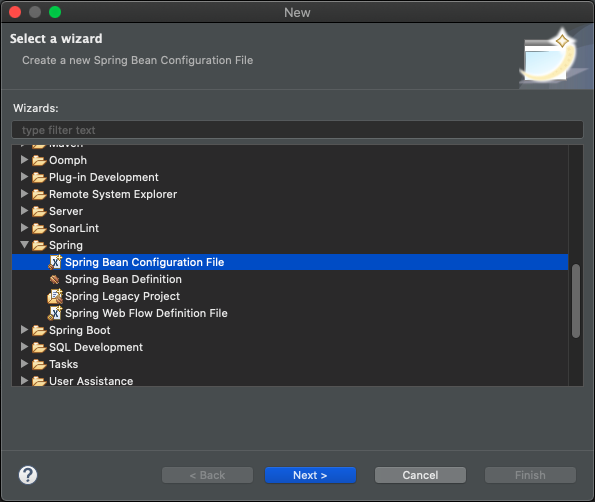

Esta opción nos facilita la creación de archivo de configuración XML gracias a el pluging que intalamos.

## Aplicaciones Web con Spring 04:20


En este curso vamos a utilizar Spring para desarrollar aplicaciones Web.

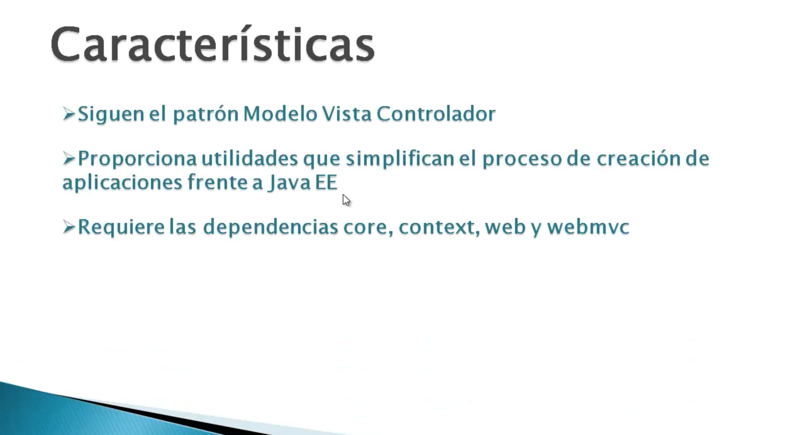

¿Qué es lo que nos aporta Spring en esté ámbito?

En primer lugar las aplicaciones creadas con Spring están pensadas para seguir el patrón Modelo Vista Controlador qué es el patrón que hemos estado implementado en las últimas aplicaciones que hemos estado realizando y nos va a proporcionar utilidades que siguiéndo ese patron nos va simplificar bastante, enormemente el proceso de creación de todas las aplicaciones, frente a los que son los componentes básicos Java servlets y JSP especialmente la parte de servlets que como veremos en el ejercicio que vamos a hacer en la siguiente lección.

¿Qué dependencias necesitamos para poder utilizar Spring dentro de una aplicación Web? Además del *Core* y el *Context* que son las dependencias básicas que en cualquier tipo de aplicación con Spring vamos a necesita siempre, incorporaremos el módulo Web y el módulo WebMvc.

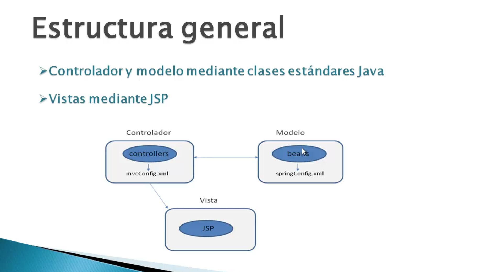

Aquí tienes como sería el esquema global Modelo Vista Controlador de una aplicación web desarrollada con Spring.

Como vemos el ***Modelo se implementaría mediante clases normales al igual que el Controlador*** y cada bloque tendría su archivo de configuración en el que se definen las tareas, digamos, que tiene que realizar Spring. Ya sabemos que en el caso de las aplicaciones Java EE Standard el Controlador esta implementado con Servlets, aquí en Spring no, son clases normales y además no vamos a tener que crear un FromController puesto que ya nos lo proporciona Spring, es decir, ese Servlet que recibe las peticiones y reparte va a seguir existiendo, pero es un Servlet proporcionado por el propio Framework Spring que nosotros no vamos a tener que implementar, solo nos encargaremos de los Controladores de Acción que como ya se indica aquí, ya veremos en el ejercicio que hagamos son clases normales y corrientes que también tendrán su módulo de configuración específico en el que se le dira a Spring las tareas a realizar. Para la Vista vamos a seguir utilizando páginas JSPs, aunque hay ciertas tareas como la recogida de datos de los formularios se van a simplificar gracias a Spring.


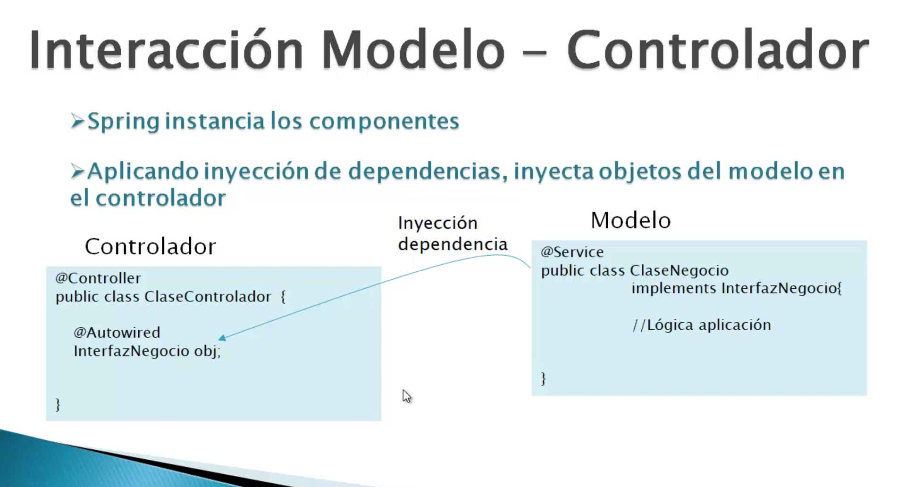

La interacción entre el Modelo y el Controlador son clases normales gestionadas por Spring ¿Cómo se va a realizar? En primer lugar esas clases las va a instanciar Spring, tanto el Modelo como el Controlador, clases que tendrán que estar anotadas con las anotaciones especificas de Spring para indicarle que tiene que instanciar dicha clase, `@Service` en el caso del Modelo, `@Controller` en el caso del Controlador, todo esto lo veremos con 
la aplicación que vamos a implementar. 

Lógicamente el Modelo debe ser utilizado dentro del Controlador ¿Cómo? Aplicando esa otra característica básica que ya comentamos de Spring que es la ***Inyección de Dependencia*** es decir, simplemente declarando una variable del tipo de objeto que queremos y anotandola con `@Autowired` le diremos a Spring que nos inyecte una instancia de este tipo dentro de la variable. Como ya veremos trabajaremos a la hora de implementar el Modelo con parejas *Clase-Interfaz*, en una Interfaz definiendo los métodos y en una Clase se implementarán, de cara a  inyectar la dependencia a la instancia nunca utilizaremos el tipo de la Clase sino el tipo de la Interfaz, lo que nos permite un total desacoplamiento entre estas dos capas, ya que podríamos cambiar de clase, utilizar otra distinta y el cliente decide, este caso el Controlador es el que utiliza la implementación no enterarse, mientras se siga implementando la Interfaz de negocio, con esto conseguiríamos como digo un total desacoplamiento entre capas que es otra de las ventajas que nos ofrece Spring.

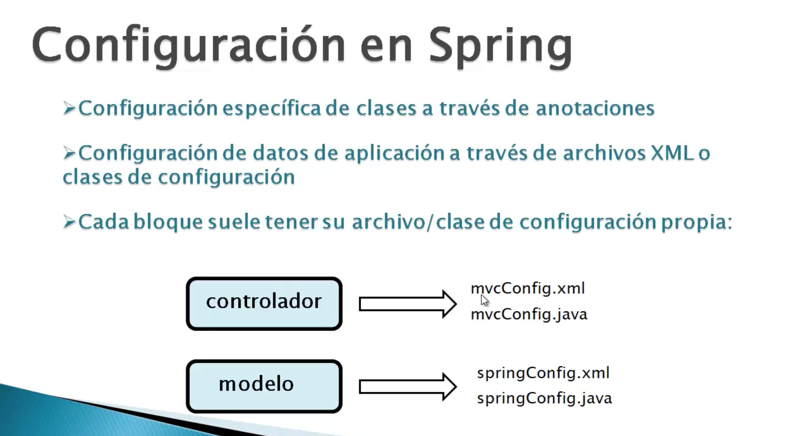

La configuración como hemos comentado anteriormente es habitual que cada módulo, el Controlador, el Modelo lleven su propia configuración, además de la configuración de las anotaciones que ya he comentado en la transparencia anterior y que ya la veremos con más detenimiento cuando hagamos el ejercicio, cada bloque tiene que tener un archivo en el que se le indica a Spring las tareas a realizar, esa configuración se puede indicar a través de XML o de clase de configuración, veremos ambas formas de realizarlo primero utilizaremos XML para ver las tareas, como indicanle a Spring ciertas cosas y luego haremos lo mismo utilizando clases Java.

## El controlador en Spring 09:53


Antes de realizar nuestra primera aplicación con Spring vamos a analizar con detalle cómo es un ***Controlador Spring*** dado que podríamos decir que es una de las partes más críticas y más importantes de la aplicación.

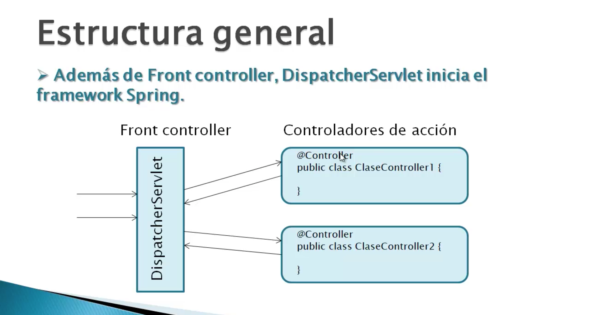

En primer lugar como ya sabemos un ***Controlador*** está formado por dos bloques, el ***Front Controller*** que es el que recibe todas las peticiones del cliente y luego los ***Controladores la Acción*** en este esquema se ves como es la estructura general de un Controlador Spring, por un lado el Front Controller donde tenemos un *DispatcherServlet* que es el que atiende todas las peticiones procedentes del cliente, como ya dijimos en la lección anterior Spring nos proporciona este Servlet, nosotros no lo tenemos que crear, lo único que tenemos que hacer es registrado en nuestro archivo de configuración `web.xml`. 

Lo que tendremos que hacer es la implementación de los *Controladores de Acción* que en lugar de Servlets como pasaba en Java EE en Spring son clases normales anotadas con `@Controller` esas clases, esos Controles de Acción serán invocados desde el DispatcherServlet cuando lleguen las peticiones correspondientes asociada a dicha acción, dentro de está clases tendremos métodos para ser ejecutados cuando se produzcan dichas peticiones, ya veremos ahora como serán la estructura de esos métodos.

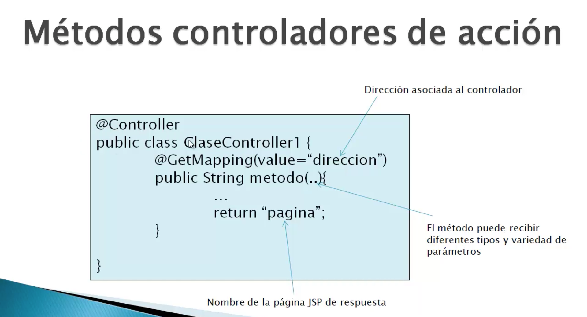

Aquí tenemos una clase Controladora de Acción un poco más en detalle, además de lo que es ***la anotación `@Controller` para anotar la propia clase*** cada método que va a gestionar una petición, porque podríamos tener más de uno en la misma clase, **realmente el Control de Acción como tal es el método no la Clase**, sino el método de gestión a una determinada petición y dentro de una misma Clase podríamos tener más de un método, eso ya va a depender si dentro de una misma clase queremos agrupar peticiones que tengan un tipo de relación entre si dentro de la misma Clase o sino tienen ningun tipo de relación cada método será implementado en una Clase diferente. Los métodos estarán anotados con `@GetMapping` o `@PostMapping` dependiendo si van a atender una petición `GET` o `POST` en la anotación indicaremos un atributo `value` en el que le diremos a Spring cuál es la dirección asociada a ese Controlador de Acción de modo que cuando al Front Controller le llegue una petición que termine en este caso con `/direccion` y sea una petición `GET` automatícamente el DispatcherServlet sabe que esta instancia del Controller Accion que ya la abra creando sabe que tiene que llamar al método que esta bajo la anotación da igual cómo se llame, el nombre del método es indiferente, puede recibir diferentes tipos de parámetros dependiendo de lo que queremos hacer es decir, si necesitamos un HTTP Server Request, un Session, no tenemos más que declarar aquí(parámetros del método) las variables del tipo correspondiente y ya se encargará Spring de inyectarlas, es decir este método es el equivalente al método `service` de los Servlets, lo que pasa es que no se tiene que llamar de una forma especial, da igual como se llame, lo importante es que esté asociado a una determinada URL y un método HTTP de petición a través de una anotación `@GetMapping` o `@PostMapping` que son equivalentes cada una para un tipo de método HTTP. Estos métodos lo que sí que van a devolver es un `String` que va a representar la dirección de la página a la que vamos a navegar o a la que se debería navegar después de procesar la acción, ya sabemos que tras procesar una acción hay que enviarle a una vista al usuario, esa vista que la va a gestionar DispatcherServlet automáticamente ya veremos como, se va a corresponder con la dirección o el nombre de página que indiquemos en el `return`. El método puede recibir los parámetros que nosotros queramos, en los ejemplos que vamos a ver ya veremos qué podemos pasarle, si necesitamos un HTTP Servlet Request no tenemos más que declarar una variable y Spring la inyecta o si simplemente nos interesan ciertos parámetros, con declarar las variables y anotarlas de manera especial también se producirá la inyección de esos datos por parte de Spring dentro del método.

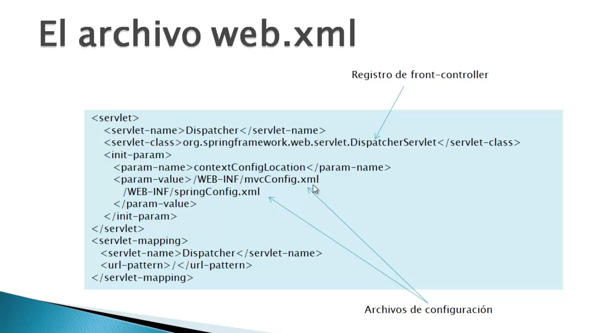

Una vez que ya tenemos implementado el Controlador, el Modelo ahora de momento lo dejamos un poquito de lado al fin al cabo el modelo son clases normales y corrientes como las que ya hemos utilizado con Servlet y JSP ya veremos más detenidamente qué peculiaridades había que tener en cuenta usando Spring, pero centrándonos en el Controlador pues una vez que están implementados los métodos Controladores de Acción en las distintas Clases Controles que tengamos, tenemos que incluir la información de configuración por un lado en el archivo `web.xml`  debemos registrar el DispatcherServlet qué es el Front Controller, el DispatcherServlet necesita un `<init-param>` llamado `contextConfigLocation` cuyo `<param-value>` es la dirección de los archivos de configuración de Spring adicionales aparte del `web.xml` en este caso estamos suponiendo que tenemos en `/WEB-INF/mvcConfig.xml` para el Controlador y `/WEB-INF/springConfig.xml` para el Modelo, los nombres son indiferentes pero comúnmente tienen esos nombres. En el primer ejemplo que vamos a hacer a continuación no vamos a utilizar Modelo por lo que  solamente estaría la dirección `/WEB-INF/mvcConfig.xml` la del Controlador. Por otro lado en `<servlet-mapping>` a través de `<url-pattern>/</url-pattern>` le indicamos la barra qué quiere decir que cualquier petición que llega a esta aplicación web tiene que pasar por el DispatcherServlet, este DispatcherServlet se va a encargar de iniciar Spring, de resolver las anotaciones que le hemos indicado a los distintas Clases para crear las instancias, resuelve la inyección de dependencia.

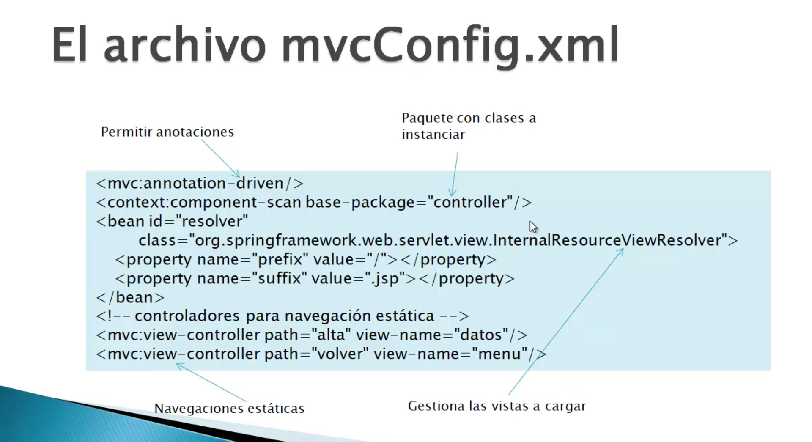

Nos quedaría los archivos de configuración propios de Spring, el `mvcConfig.xml` para el Controlador y el `springConfig.xml` para el Modelo. En el caso del Controlador en la imágen vemos el aspecto de dicho archivo `mvcConfig.xml`, por un lado tenemos una etiqueta `<mvc:annotation-driver/>` qué le indica a Spring que permita el uso de anotaciones para configuración, por ejemplo las anotaciones `@Controller`, `@GetMapping` o `@PostMapping` que vamos a utilizar en la configuaración del Controlador, le indicamos con la etiqueta `<context:component-scan-base-package="controller"/>` en que paquete se encuentra el Controlador, esto lo que hace es decirle a Spring que busque en esos paquetes Clases anotadas con `@Controller` que es nuestro caso o con cualquier otra anotación propia de Spring para instanciar Clases, si es más de uno se separan con comas y busca todas esas clases que tengan esa anotación especial para intanciarlas en el momento que Spring se inicia. Por otro lado tenemos la etiqueta `<bean...>` que es el la que se encarga de resolver las Vistas, ya habíamos visto que los Controladores de Acción (métodos `@GetMapping` o `@PostMapping`) devuelven un `String`, una cadena de caracteres que el DispatcherServlet lo interpreta como la dirección de la página, ¿Por qué? porque eso es lo que le indica todo el contenido de la etiqueta `<bean...>` donde estamos registrando el objeto `InternalResourceViewResolver`, le asignamos un identificador `id` y unas propiedades `prefix` y `suffix`. Finalmente ahí peticiones que no necesitan ser gestionadas por un Control de Acción, sino que simplemente llevar al usuario a una determinada página, como le invitamos al DispatcherServlet que haga esa tarea, a través de los Controladores para navegación estática son etiquetas `<mvc:view-controller path="alta" view-name="datos" />` donde se les indica que cuando llegue una dirección `path="alta"` llevamonos a la página `view-name="datos"`.  

## Aplicación ejemplo: buscador de cursos parte 1 14:59


A continuación vamos a desarrollar nuestra primer aplicación Spring se trata de una aplicación Web buscador de cursos sin BD, los cursos los almacenaremos en memoría para su busqueda.

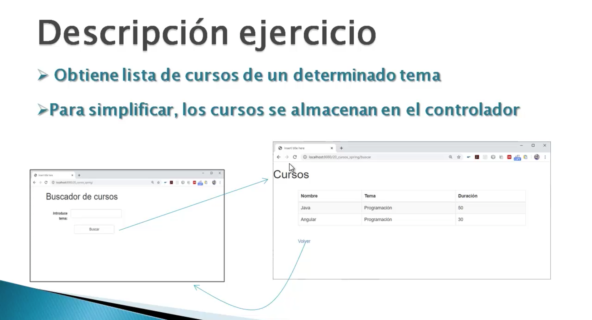

El aspecto de la aplicación lo podemos ver en la imágen, tenemos dos páginas en la primera vamos a poder introducir el tema a buscar, los cursos van a tener un Nombre, Tema y Duración. Cuando introduzcamos el tema y pulsemos el botón `Buscar` nos llevará a otra página donde se listarán todos los cursos de el tema introducido, en dicha página tendremos un enlace `Volver` para regresar a la página inicial.

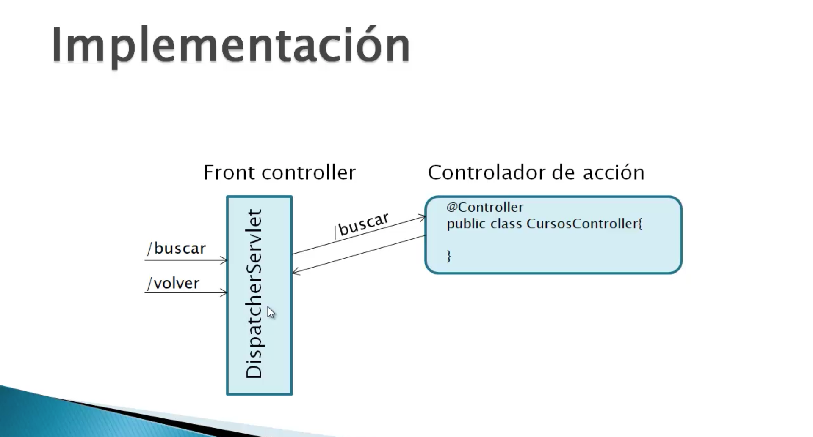

En esta primera aplicación Spring que vamos a desarrollar no vamos a tener Modelo es decir, vamos a tener un Front Controller (DispatcherServlet) al que le van a llegar las peticiones `/buscar` y `/volver`. `/buscar` es la petición del formulario y es la que tiene asociado el Controlador de Acción por lo que tendremos que implementar una clase con `@Controller` en la cual crearemos un método asociado a la petición `/buscar` de tipo `POST` por que viene de un formulario, el enlace `/volver` como es una navegación estatica no lleva asociado ningun Controlador de Acción simplemente nos lleva nuevamente a la página de Inicio. 

Vamos a Eclipse para desarrollar la aplicación.

1. Crear nuevo proyecto Dynamic Web Project con nombre **614-01-Buscador-Cursos**.
   A pesar de que vayamos a usar Spring, como se trata de una aplicación Web el proceso de creación de la aplicación Web es el mismo que hemos seguido con las aplicaciones Java EE Standar.
   
   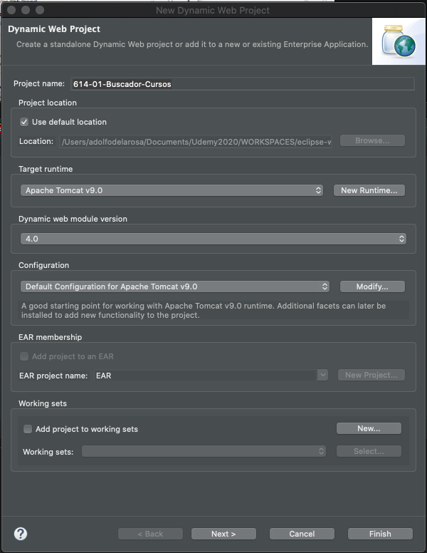
   
   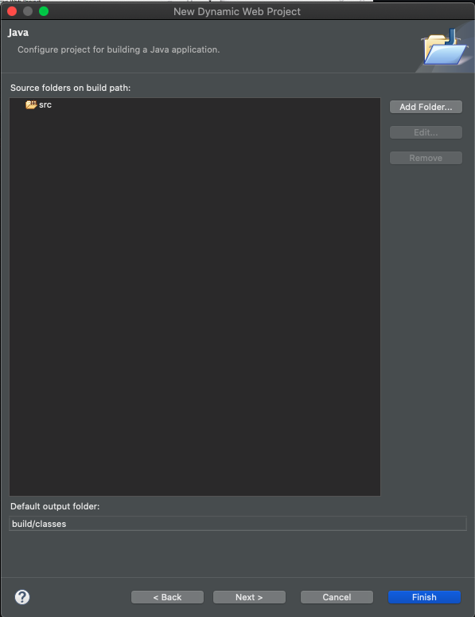
   
   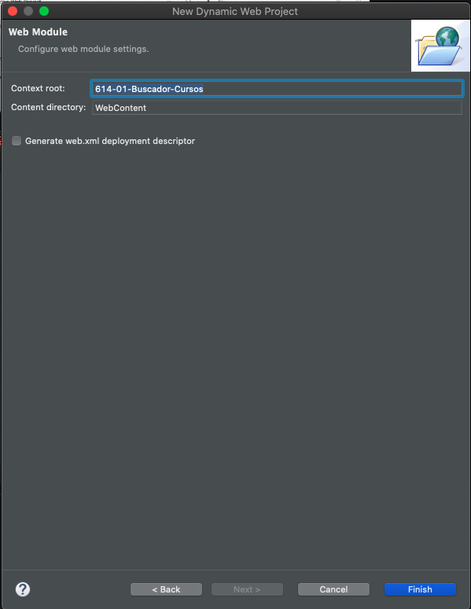
   
   En este ultimo paso deberiamos haber seleccionado el check para generar el archivo `web.xml` ya que necesitamos configurar el DispatcherServlet, pero no lo he seleccionado para posteriormente ver como lo podemos añadir de otra forma.
   
2. Mavemizamos el proyecto para poder incluir las dependencias al proyecto.

   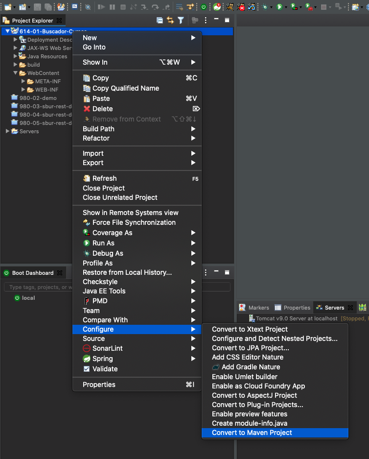
   
   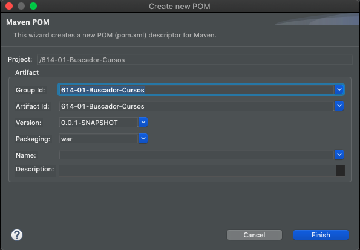
   
   Al Mavenizar el proyecto se incluye el archivo `pom.xml` con el siguiente contenido:

```html
<project xmlns="http://maven.apache.org/POM/4.0.0" xmlns:xsi="http://www.w3.org/2001/XMLSchema-instance" xsi:schemaLocation="http://maven.apache.org/POM/4.0.0 https://maven.apache.org/xsd/maven-4.0.0.xsd">
  <modelVersion>4.0.0</modelVersion>
  <groupId>614-01-Buscador-Cursos</groupId>
  <artifactId>614-01-Buscador-Cursos</artifactId>
  <version>0.0.1-SNAPSHOT</version>
  <packaging>war</packaging>
  <build>
    <sourceDirectory>src</sourceDirectory>
    <plugins>
      <plugin>
        <artifactId>maven-war-plugin</artifactId>
        <version>3.2.3</version>
        <configuration>
          <warSourceDirectory>WebContent</warSourceDirectory>
        </configuration>
      </plugin>
      <plugin>
        <artifactId>maven-compiler-plugin</artifactId>
        <version>3.8.1</version>
        <configuration>
          <release>14</release>
        </configuration>
      </plugin>
    </plugins>
  </build>
</project>
```

3. Ir al repositorio de Maven https://mvnrepository.com/
   
   Nuestro proyecto necesita las dependencias de Spring Core, Context, Web y WebMVC, en el repositorio Maven podemos localizar todas las dependencias que necesitemos.

   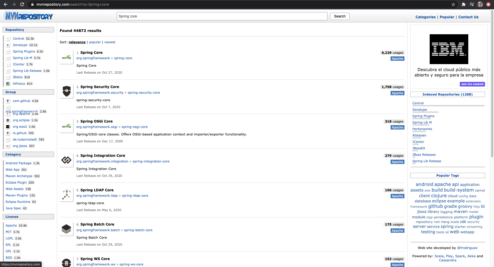
   
   En repositorio vamos a buscar Spring Core
   
   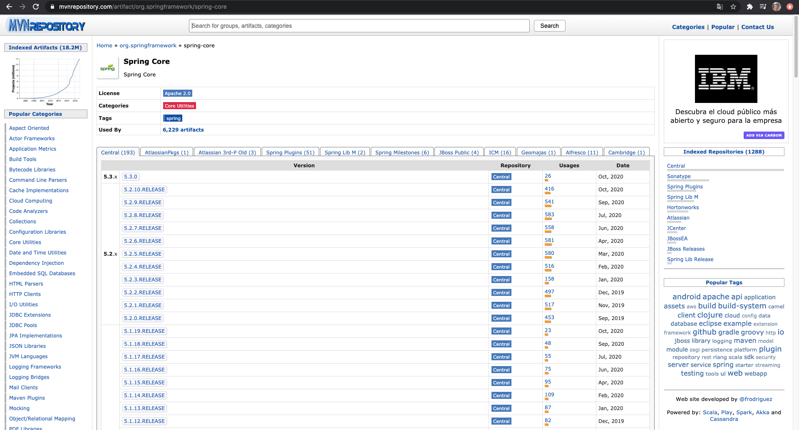
   
   Seleccionamos la versión más reciente en este caso es la `5.2.10.RELEASE` 
   
   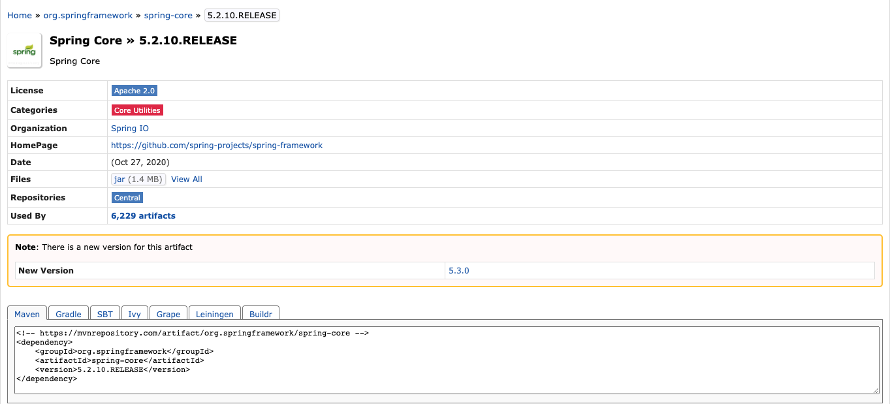
   
   Copiamos la dependecia.

```html
<!-- https://mvnrepository.com/artifact/org.springframework/spring-core -->
<dependency>
    <groupId>org.springframework</groupId>
    <artifactId>spring-core</artifactId>
    <version>5.2.10.RELEASE</version>
</dependency>
```
   Esta dependencia la tenemos que añadir en nuestro archivo `pom.xml`

   Repetimos los mismos pasos para las restantes dependencias.
   
```html
<!-- https://mvnrepository.com/artifact/org.springframework/spring-context -->
<dependency>
    <groupId>org.springframework</groupId>
    <artifactId>spring-context</artifactId>
    <version>5.2.10.RELEASE</version>
</dependency>
```

```html
<!-- https://mvnrepository.com/artifact/org.springframework/spring-web -->
<dependency>
    <groupId>org.springframework</groupId>
    <artifactId>spring-web</artifactId>
    <version>5.2.10.RELEASE</version>
</dependency>
```

```html
<!-- https://mvnrepository.com/artifact/org.springframework/spring-webmvc -->
<dependency>
    <groupId>org.springframework</groupId>
    <artifactId>spring-webmvc</artifactId>
    <version>5.2.10.RELEASE</version>
</dependency>
```
   Una cosa importante es que las versiones de las dependencias que seleccionemos y tengan relación sean la misma en este caso todas tienen la versión `5.2.10.RELEASE` para no mezclar versiones que podría dar algun tipo de incompatibilidad.
   
   También vamos a incluir la dependecia para JSTL.
   
```html
<!-- https://mvnrepository.com/artifact/javax.servlet/jstl -->
<dependency>
    <groupId>javax.servlet</groupId>
    <artifactId>jstl</artifactId>
    <version>1.2</version>
</dependency>
```
   
   Nuestro archivo `pom.xml` final queda así:
   
```html
<project xmlns="http://maven.apache.org/POM/4.0.0" xmlns:xsi="http://www.w3.org/2001/XMLSchema-instance" xsi:schemaLocation="http://maven.apache.org/POM/4.0.0 https://maven.apache.org/xsd/maven-4.0.0.xsd">
  <modelVersion>4.0.0</modelVersion>
  <groupId>614-01-Buscador-Cursos</groupId>
  <artifactId>614-01-Buscador-Cursos</artifactId>
  <version>0.0.1-SNAPSHOT</version>
  <packaging>war</packaging>
  <build>
    <sourceDirectory>src</sourceDirectory>
    <plugins>
      <plugin>
        <artifactId>maven-war-plugin</artifactId>
        <version>3.2.3</version>
        <configuration>
          <warSourceDirectory>WebContent</warSourceDirectory>
        </configuration>
      </plugin>
      <plugin>
        <artifactId>maven-compiler-plugin</artifactId>
        <version>3.8.1</version>
        <configuration>
          <release>14</release>
        </configuration>
      </plugin>
    </plugins>
  </build>
  <dependencies>
  	<!-- https://mvnrepository.com/artifact/org.springframework/spring-core -->
	<dependency>
	    <groupId>org.springframework</groupId>
	    <artifactId>spring-core</artifactId>
	    <version>5.2.10.RELEASE</version>
	</dependency>
	<!-- https://mvnrepository.com/artifact/org.springframework/spring-context -->
	<dependency>
	    <groupId>org.springframework</groupId>
	    <artifactId>spring-context</artifactId>
	    <version>5.2.10.RELEASE</version>
	</dependency>
	<!-- https://mvnrepository.com/artifact/org.springframework/spring-web -->
	<dependency>
	    <groupId>org.springframework</groupId>
	    <artifactId>spring-web</artifactId>
	    <version>5.2.10.RELEASE</version>
	</dependency>
	<!-- https://mvnrepository.com/artifact/org.springframework/spring-webmvc -->
	<dependency>
	    <groupId>org.springframework</groupId>
	    <artifactId>spring-webmvc</artifactId>
	    <version>5.2.10.RELEASE</version>
	</dependency>
	<!-- https://mvnrepository.com/artifact/javax.servlet/jstl -->
	<dependency>
	    <groupId>javax.servlet</groupId>
	    <artifactId>jstl</artifactId>
	    <version>1.2</version>
	</dependency>
  </dependencies>
</project>
```

4. Implentear un JavaBean que encapsule los datos del Curso. Creanos una nueva Clase llamada `Curso` en el paquete `com.formacion.model`. 

   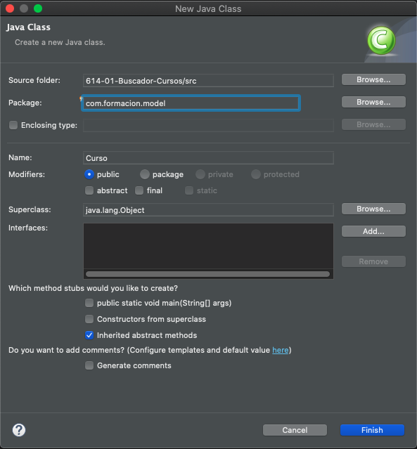
   
   Su contenido es el siguiente:
   
```java
package com.formacion.model;

public class Curso {
	
	private String nombre;
	private String tema;
	private int duracion;
	
	public Curso() {
		super();
	}

	public Curso(String nombre, String tema, int duracion) {
		super();
		this.nombre = nombre;
		this.tema = tema;
		this.duracion = duracion;
	}

	public String getNombre() {
		return nombre;
	}

	public void setNombre(String nombre) {
		this.nombre = nombre;
	}

	public String getTema() {
		return tema;
	}

	public void setTema(String tema) {
		this.tema = tema;
	}

	public int getDuracion() {
		return duracion;
	}

	public void setDuracion(int duracion) {
		this.duracion = duracion;
	}
	
}
```

5. Vamos a definir el Controlador creando una Clase llamada `CursosController` en el paquete `com.formacion.controller`.

   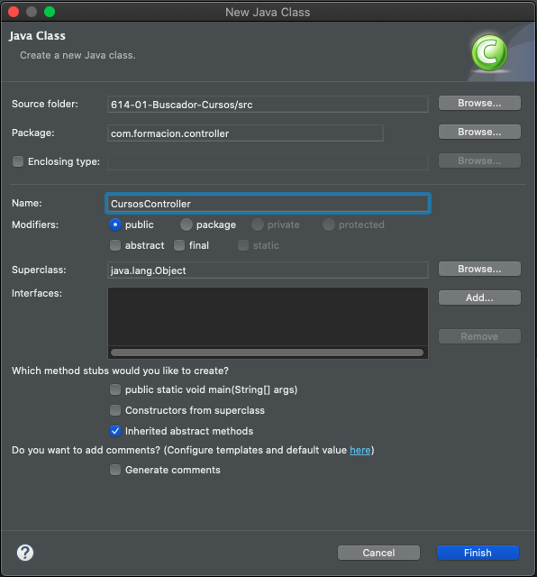
   
   En Spring el Controlador es una Clase Standard Java, ***en Spring no se utilizan Servlets*** sino clases normales Java eso si en el controlador debe estar anotado con `@Controller`.

   En memoria vamos a crear una lista de Cursos que va a ser un atributo de la clase y en el Constructor de  `CursosController` vamos a crear dicha lista.
   
```java
@Controller
public class CursosController {

	List<Curso> cursos;
	
	public CursosController() {
		
		cursos = new ArrayList<>();
		cursos.add(new Curso("Java", "Programación", 50));
		cursos.add(new Curso("Angular", "Programación", 30));
		cursos.add(new Curso("Linux", "Sistemas", 40));
		cursos.add(new Curso("Big Data", "Datos", 30));
		cursos.add(new Curso("SQL", "Datos", 20));
		
	}
}
```

   Ahora vamos a crear el Controlador de Acción a través de un método que va a responder a una petición `POST` por que va a responder a un formulario donde se recoje un dato la tematica de los Cursos a buscar.
   
   * Lo antotamos con `@PostMapping(value="buscar")` y con value indicamos que dirección vamos a asociar a esa posición, es la dirección que ponemos en el `action` del formulario.
   * Debe devolver un `String` que indicará el nombre de la página a donde nos va a redireccionar.
   * El nombre del método es indiferente en este caso se llama `buscador`
   * El método va a recibir un parámetro que es el dato que nos va a llegar en la petición es decir `String tema` pero muy importante a Spring hay que indicarle que en ese parámetro vamos a recibir lo que se manda desde la petición y eso lo hacemos anotando el parámetro con `@RequestParam` donde indicaremos el nombre hipotetico que tendrá ese parámetro es decir `@RequestParam("tema")` (Algo como lo que haciamos con `String tema = request.getParameter("tema");`).
   * Como parámetro también vamos a necesitar un `HttpServletRequest request` por que necesitamos tener acceso al `request` para guardar en un atributo de petición la lista de Cursos que cumplan con la condición de busqueda.
   * Y dentro del método implementamos el filtro de los Cursos usando `Streams`.
   * Guardamos el resutado en un atributo de petición.
   * Retornamos la página a donde se nos redirigirá.
   
```java
  @PostMapping(value="buscar")
	public String buscador(@RequestParam("tema") String tema, HttpServletRequest request) {
		List<Curso> resultado = cursos.stream()
			.filter(curso -> curso.getTema().equalsIgnoreCase(tema))
			.collect(Collectors.toList());
		
		request.setAttribute("cursos", resultado);
		
		return "cursos";
	}
```
   
   Ya será el DispatcherServlet utilizando el objeto que se comento en lecciones anteriores que debe estar registrado en el archivo de configuración para que localice la página a donde se debe redirigir.
   
   La clase completa del Controlaror queda así:
   
```java
package com.formacion.controller;

import java.util.ArrayList;
import java.util.List;
import java.util.stream.Collectors;

import javax.servlet.http.HttpServletRequest;

import org.springframework.stereotype.Controller;
import org.springframework.web.bind.annotation.PostMapping;
import org.springframework.web.bind.annotation.RequestParam;

import com.formacion.model.Curso;

@Controller
public class CursosController {

	List<Curso> cursos;
	
	public CursosController() {
		
		cursos = new ArrayList<>();
		cursos.add(new Curso("Java", "Programación", 50));
		cursos.add(new Curso("Angular", "Programación", 30));
		cursos.add(new Curso("Linux", "Sistemas", 40));
		cursos.add(new Curso("Big Data", "Datos", 30));
		cursos.add(new Curso("SQL", "Datos", 20));
		
	}
	
	@PostMapping(value="buscar")
	public String buscador(@RequestParam("tema") String tema, HttpServletRequest request) {
  
		List<Curso> resultado = cursos.stream()
			.filter(curso -> curso.getTema().equalsIgnoreCase(tema))
			.collect(Collectors.toList());
		
		request.setAttribute("cursos", resultado);
		
		return "cursos";
	}
}
```
   
   Ahora lo que toca es crear las Vistas y posteriormente la configuración que es una parte importate de Spring.

## Aplicación ejemplo: buscador de cursos parte 2 13:44
## El modelo en Spring 14:04
## Configuración mediante clases 06:32
## Ejemplo de aplicación configurada mediante clases 05:04
## Configuración sin web.xml 07:38
## Acceso a datos en Spring 11:01
## Implementación de la agenda de contactos en Spring parte 1 18:14
## Implementación de la agenda de contactos en Spring parte 2 13:16
## Implementación de la agenda de contactos en Spring parte 3 11:45
## Implementación de la agenda de contactos en Spring parte 4 11:13
## Utilización de un datasource del servidor en Spring 08:47
## Encapsulación de datos de un formulario 13:15
## Ajax en Spring 16:13
   
