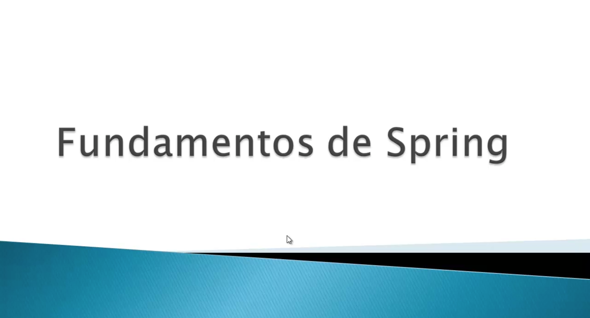
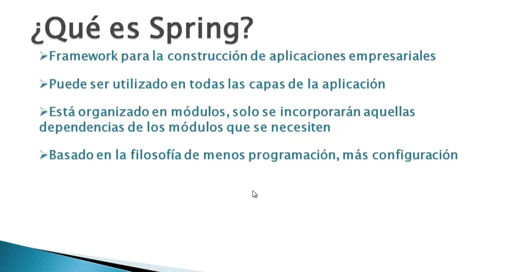
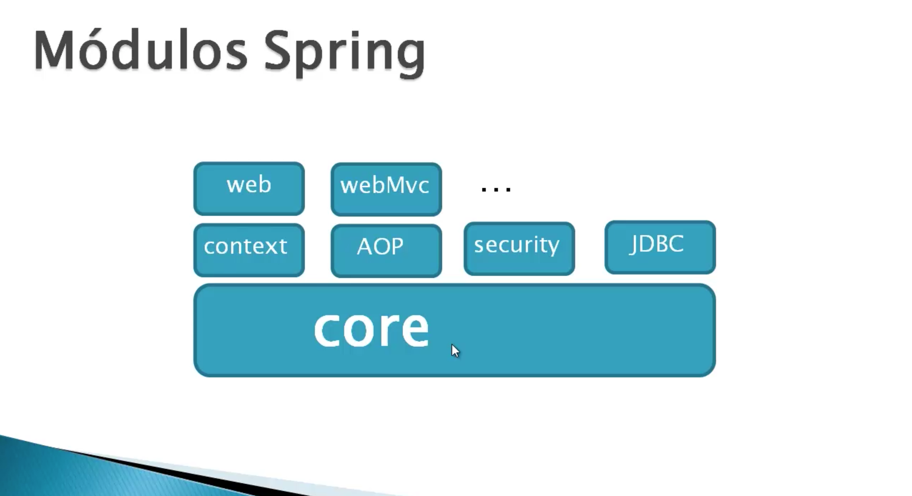
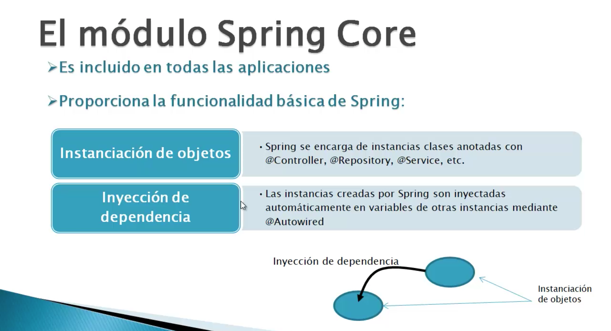
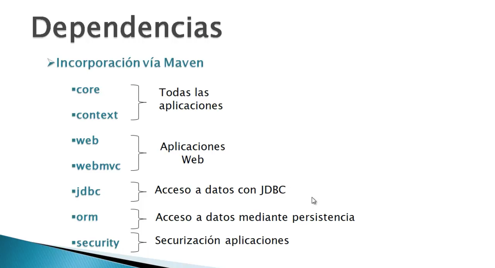
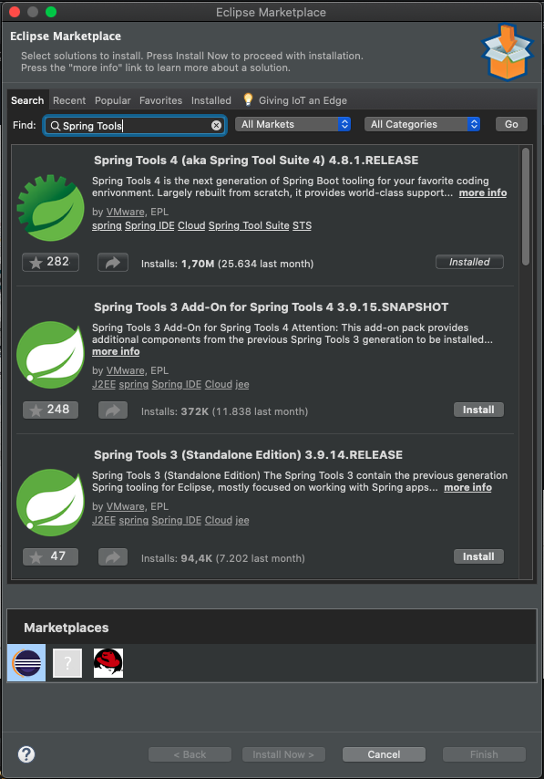
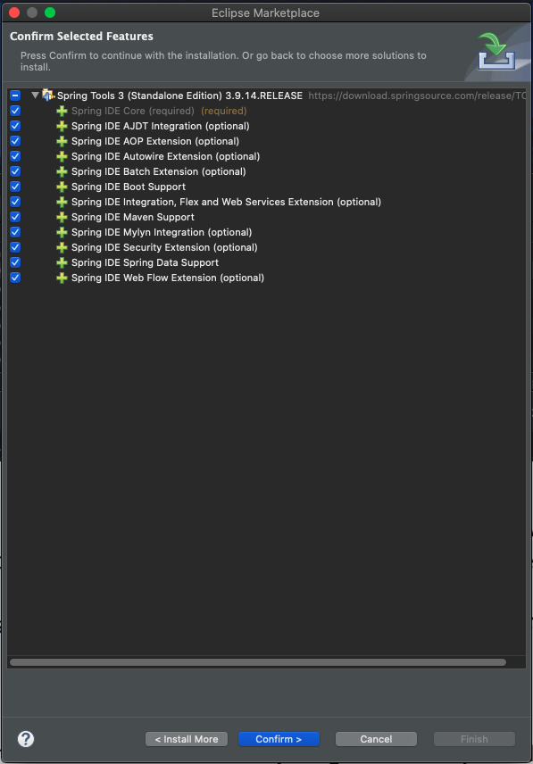

# 9. Spring • 18 clases • 3h 10m
   * Fundamentos de Spring 06:46
   * Preparación del entorno 03:02
   * Aplicaciones Web con Spring 04:20
   * El controlador en Spring 09:53
   * Aplicación ejemplo: buscador de cursos parte 1 14:59
   * Aplicación ejemplo: buscador de cursos parte 2 13:44
   * El modelo en Spring 14:04
   * Configuración mediante clases 06:32
   * Ejemplo de aplicación configurada mediante clases 05:04
   * Configuración sin web.xml 07:38
   * Acceso a datos en Spring 11:01
   * Implementación de la agenda de contactos en Spring parte 1 18:14
   * Implementación de la agenda de contactos en Spring parte 2 13:16
   * Implementación de la agenda de contactos en Spring parte 3 11:45
   * Implementación de la agenda de contactos en Spring parte 4 11:13
   * Utilización de un datasource del servidor en Spring 08:47
   * Encapsulación de datos de un formulario 13:15
   * Ajax en Spring 16:13
   
## Fundamentos de Spring 06:46

Como primera lección del estudio Sprint vamos a ver los fundamentos de este Framework.

Sprint es un Framework de uso general que se utiliza para la construcción de aplicaciones empresariales en Java y concretamente puede ser utilizado en todas las capas de la aplicación desde la capa de acceso a datos, la última capa, hasta la implementación de las vistas, Spring esta organizado de forma modular, eso qué significa, pues que si nosotros vamos a utilizar este framework, dependiendo para que lo vamos a utilizar solamente necesitaremos ciertos modulos, no es una enorme librería que se distribuye de forma única sino que está organizado como digo en varios módulos, varios archivos Jar, dependiendo de lo que se vaya a necesitar según el desarrollo a realizar.

El objetivo de Spring al final es conseguir que el programador reduzca su código es decir, ***menos código en la aplicación acosta de más configuración*** es decir, la idea es que Spring se encargue de realizar gran parte de las tareas, ¿cómo? indicandolé a través de configuración bien archivos, bien anotaciones o bien algún otro sistema de configuracion qué es lo que tiene que hacer, pero que el programador no lo tenga que hacer sino que sea el framework el que se encargue de ello, eso sería digamos pues la funcionalidad básica de Spring, luego ya hay módulos que están orientados a temas más específicos para ayudarnos en ciertas tareas que vamos a implementar dentro de una aplicación.

Aquí vemos algunos de los módulos más importantes que forman Spring, como podemos comprobar en la parte inferior está el **Core** que es el módulo básico y el que se va a utilizar en cualquier desarrollo es decir usemos Spring para lo que lo usemos siempre vamos a necesitar el Core, podíamos decir que es el *runtime* del entorno ejecución de Spring y el que proporciona la funcionalidad básica que ahora comentaremos, luego ya tenemos sobre el otros módulos **Context** que es realmente una extensión del Core *van siempre juntos*, para temas de seguridad tenemos el módulo de seguridad Security, para acceso a datos JDBC, programación orientada a aspectos AOP, para desarrollo web tenemos **Web** y **WebMVC**. Existen otros módulo más que no están indicados pero dependiendo para que usemos Spring utilizaremos unos u otros módulos, eso si él Core siempre va a estar.

El módulo Core es el que proporciona la funcionalidad básica Spring, esa funcionalidad básica consiste fundamentalmente en dos elementos:

* Instanciación de Objetos
* Inyección de Dependencias

Es decir, **una de las funcionalidades que nos va a ofrecer Spring es engargarse el de *instanciar los objetos* que no lo tenga que hacer el programador, a través de una serie de anotaciones que utilizaremos en nuestras clases le diremos a Spring que tiene que crear instancias de esas clases**, trabajaremos con clases y con interfaces porque el objetivo Spring es poder separar correctamente las capas de una aplicación, al encargarse Spring de instanciar las las clases nosotros no lo vamos a hacer el código y eso nos permitirá hacer uso de esas instancias sin tener que escribir una sola línea de código, lo cual entre capas que utilizan objetos de otras permite que la separación sea muy clara y haya un bajo acoplamiento entre dichas capas. 

¿Que hace Spring con esos objetos que instancia? como digo utilizarlos otras partes de la aplicación, es lo que llamamos ***inyección de dependencia*** es decir, nosotros no creamos las instancias las crea Spring por lo tanto tampoco vamos a ir a localizarlas, ni a decirle a Spring tráeme tal instancia con tales propiedades sino que a nivel de configuración le indicaremos que queremos hacer con la intancia y Spring lo que hará será traernos directamente esa instancia a la variable que nosotros le digamos, que es lo que se llama ***inyección de dependencia*** Spring crea las instancias y no las inyecta en las variables donde las vamos a utilizar, toda la información de cómo tiene que crear la instancia, las propiedades de configuración, etcétera, eso es *configuración* no es código. **El objetivo de que Spring nos cree las instancias es que luego las puede inyectar en otras variables** y de esa manera como indicabamos al principio ***desacoplar capas***.

En la parte inferior de la imagen tenemos Spring que está creando instancias de objetos, para qué esas instancias  luego las inyecte en otras y todo esto al hacerlo Spring, está instancia digámoslo así, no conoce los detalles de creación ni de localización de la otra instancia, con lo cual ***ambas están desacopladas** es la idea principal y básica de Spring que vamos a encontrar en todos los programas.

Hay otros módulos para hacer las tareas adicionales. ¿Cómo utilizarlos en Spring? incorporando las dependencias a través de Maven. Dependiendo de lo que queramos hacer incorporamos uno u otro modulo, para las funcionalidades básicas es suficiente con el Core y Context pero para cualquier otro tipo de aplicación igualmente las necesitaremos siempre. Para una aplicación Web ademas de Core y Context necesitamos incorporar los módulos Web y Webmvc, si necesitamos acceder a BD Spring nos permite acceder de dos maneras diferentes, la forma clasica JDBC simplificando enormemente el trabajo o utilizando una capa de persistencia ORM, para cada una de estas dos formas de acceder a los datos tenemos un módulo independiente ya sea JDBC o ORM. Que queremos securizar aplicaciones hay un módulo especifico que podemos incorporar que es Spring Security.

Esta es una pequeña introducción a Spring.

## Preparación del entorno 03:02

¿Qué herramientas software necesitamos para trabajar con Spring? para desarrollar aplicaciones Spring utilizaremos el entorno de desarrollo Eclipse, eso si podemos instalar un Pluging que nos facilitara la creación, entre otras cosas no nos facilitaría la creación de archivos XML en caso de que optemos por esa opción de configuración.

Concretamente se trata de **Spring Tools 3 (Standalone Edition) 3.9.14 RELEASE**  qué es como digo un añadido que nos facilita la creación de los archivos a traer la nueva opción de menú que nos aparece en el propio IDE.

Para instalar este plugin nos vamos a ir a Eclipse Marketplace buscaremos *Spring Tools* 

y entre todos las opciones que aparece seleccionamos **Spring Tools 3 (Standalone Edition) 3.9.14 RELEASE** pulsamos en el botón Install y aparece la siguiente pantalla.

no es necesario que instalemos todas las opciones que nos aparecerá (yo lo hare) ahí pues con por supuesto el sobre requerido el springboard por ejemplo el 
autowired station IES boot Service para que te aparezca la opción de menú y el editor etcétera pues spring dentro de la cuerpos tenemos en Spring bean configuration file que es para lo que digo fundamentalmente pues nos facilita el proceso este mes acabo de cenar ya veremos cuando estemos alguno de los ejercicios pues acuérdate alguna utilizaremos configuración XML y

## Aplicaciones Web con Spring 04:20
## El controlador en Spring 09:53
## Aplicación ejemplo: buscador de cursos parte 1 14:59
## Aplicación ejemplo: buscador de cursos parte 2 13:44
## El modelo en Spring 14:04
## Configuración mediante clases 06:32
## Ejemplo de aplicación configurada mediante clases 05:04
## Configuración sin web.xml 07:38
## Acceso a datos en Spring 11:01
## Implementación de la agenda de contactos en Spring parte 1 18:14
## Implementación de la agenda de contactos en Spring parte 2 13:16
## Implementación de la agenda de contactos en Spring parte 3 11:45
## Implementación de la agenda de contactos en Spring parte 4 11:13
## Utilización de un datasource del servidor en Spring 08:47
## Encapsulación de datos de un formulario 13:15
## Ajax en Spring 16:13
   
