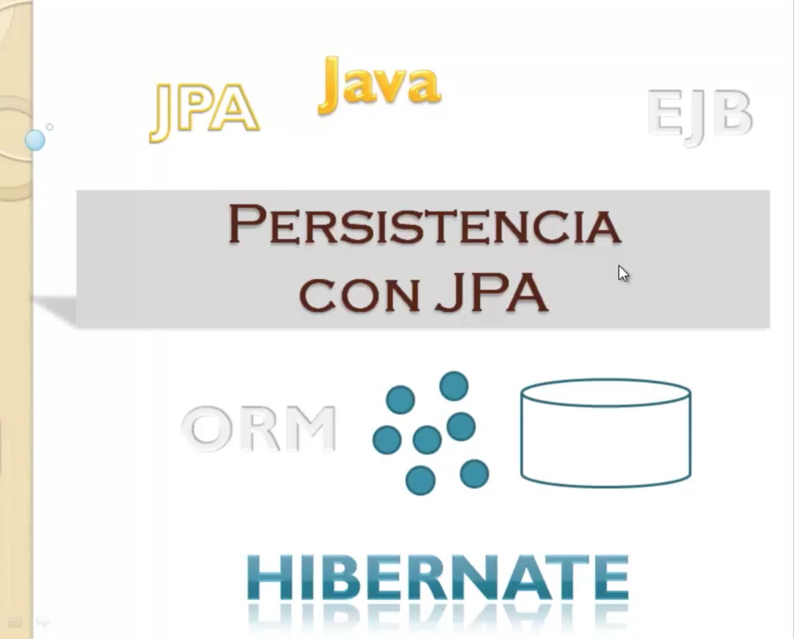
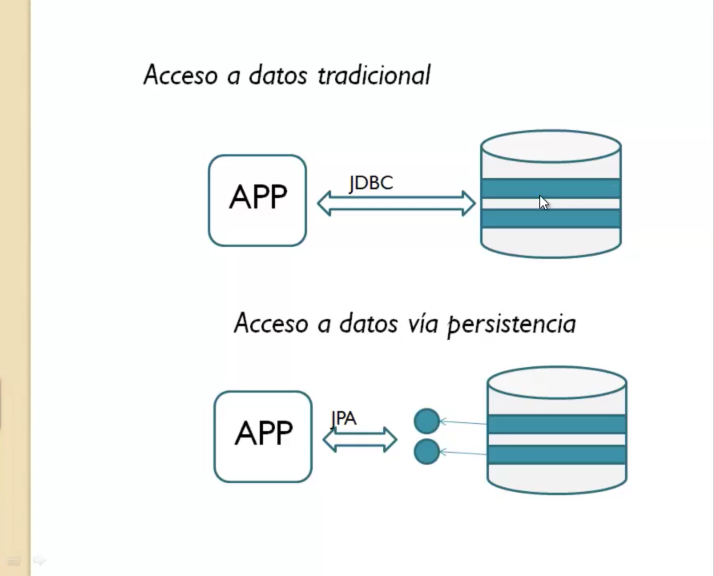
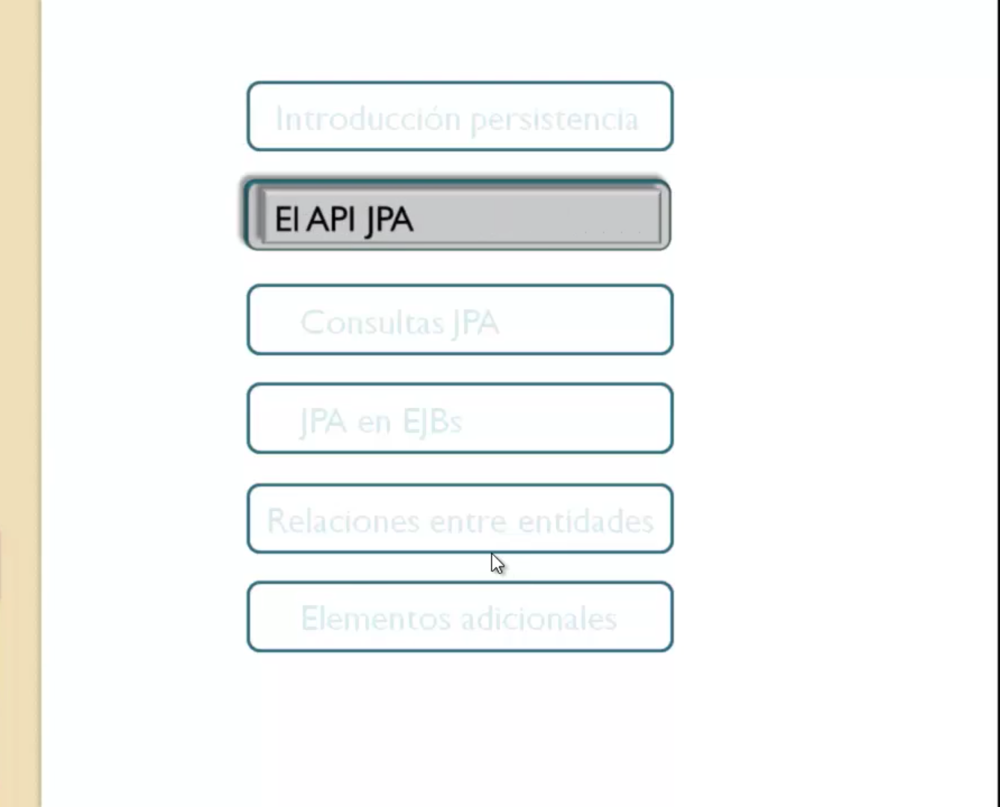
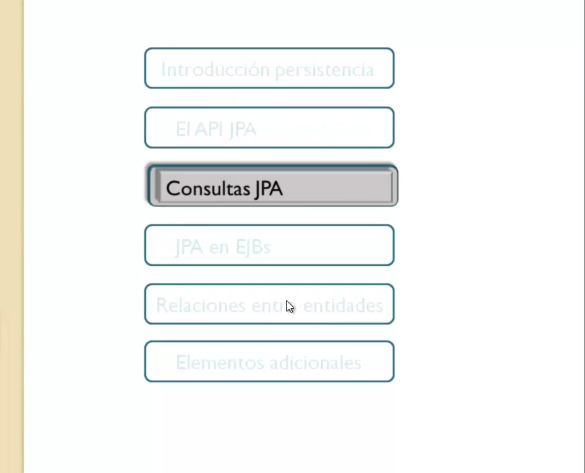
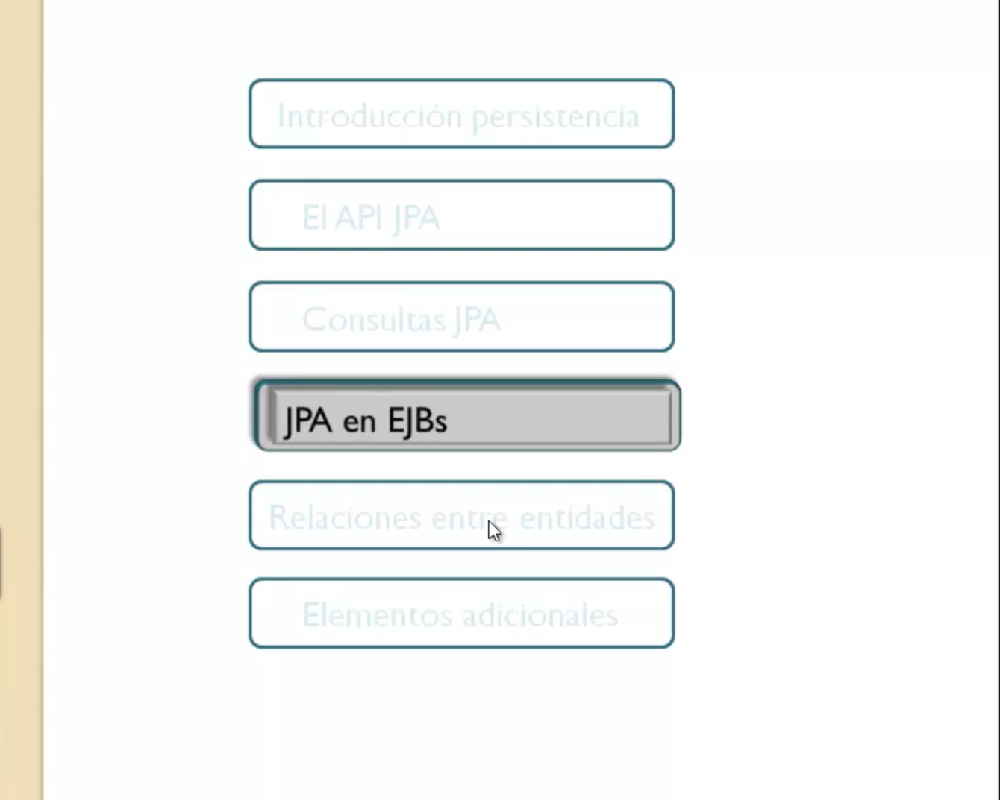
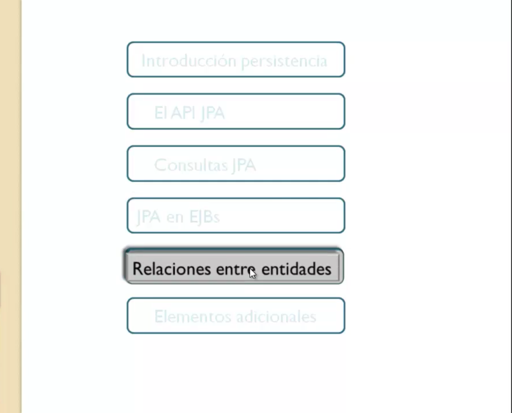
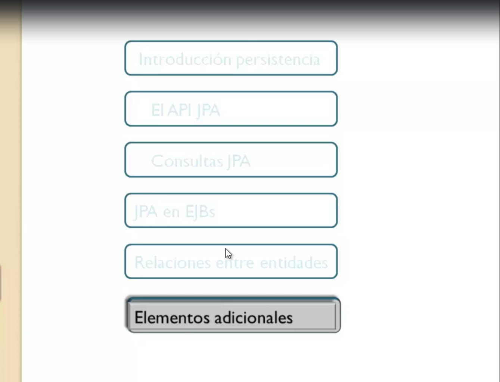

# 1. Presentación del curso 03:07

* 01 Presentación del curso 03:07

## 01 Presentación del curso 03:07

Si te dedicas o te vas a dedicar al desarrollo de aplicaciones Java el conocimiento de JPA te va a resultar imprescindible puesto que el acceso a datos en las aplicaciones a través de una capa de persistencia es algo una tendencia cada vez más extendida en el mundo de la programación.

Como puedes ver en esta imagen pues frente al acceso a datos tradicional desde una aplicación Java que se realiza a través de JDBC decir la aplicación directamente ataca los datos utilizando este API.

La utilización de capa de persistencia permite exponer esos datos de la base de datos en forma de objetos a la aplicación de modo que la aplicación no trabaja contra el mundo relacional es decir tablas relacionadas columnas filas sino que trabaja con objetos.

El API JPA que será motivo de estudio en este curso es el que utilizaríamos dentro de las aplicaciones Java para poder manejar esos objetos de datos y cómo vamos a organizar el curso.

Bueno el curso está organizado en seis secciones la primera es una introducción a lo que es el concepto de persistencia desarrollar un poquito más lo que ha explicado la transparencia anterior el software que tenemos que instalar configuración de una capa de persistencia inicial utilizando JPA para después ya entrar en el análisis de lo que es el API específico Java persistan en API de Java aquí veremos los métodos básicos para realizar operaciones CRUD del objeto Entity Manager.

El principal elemento del APIs JPA para después es la siguiente sección pasado al estudio de las consultas con las que podremos realizar operaciones complejas contra la capa de persistencia la utilización de JPA en Interplay Java un componentes de negocio que es también otra de las especificaciones de Java Enterprise Edition es algo sumamente habitual es decir JPA y JBS van muy unidos entonces aquí lo que te vamos a explicar en estas secciones es primero una breve introducción a lo que es una Interplay Java.

Y cómo hacer uso de JPA dentro de los entrarse el jardín y los beneficios que eso nos va a aportar seguimos con la sección de relaciones entre entidades un tema muy importante puesto que el disponer de entidades relacionadas nos va a simplificar enormemente muchas tareas de código.

Por último vamos a ver algunos elementos adicionales de JPA como por ejemplo la utilización de claves primarias compuestas ajuste de las relaciones para terminar con el estudio de la API criterio con el que vamos a poder desarrollar y crear consultas sin utilizar el lenguaje JPQL que utilizamos en esta sección 3.

El hecho de utilizar unas clases en lugar de un lenguaje adicional nos va a permitir cierta flexibilidad a la hora de construir consultas.

Pues bien la verdad es que es un curso bastante completo vas a aprender mucho.

