# 2. Introducción a la persistencia con JPA 29:16

* 02 Introducción a la persistencia 04:49
* 03 Java persistence API 04:09
* 04 Instalación del software 05:36
* 05 Creación de una capa de persistencia con JPA parte 1 03:47
* 06 Creación de una capa de persistencia con JPA parte 2 10:14
* Autoevaluación I 00:41

## 02 Introducción a la persistencia 04:49

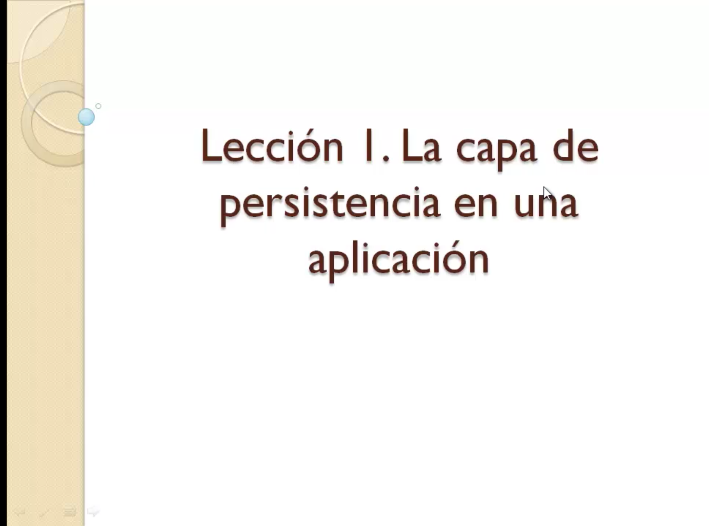

En esta primera lección del curso de persistencia con JPA voy a explicarte lo que es una capa de persistencia y qué beneficios nos va a aportar en la creación de aplicaciones.

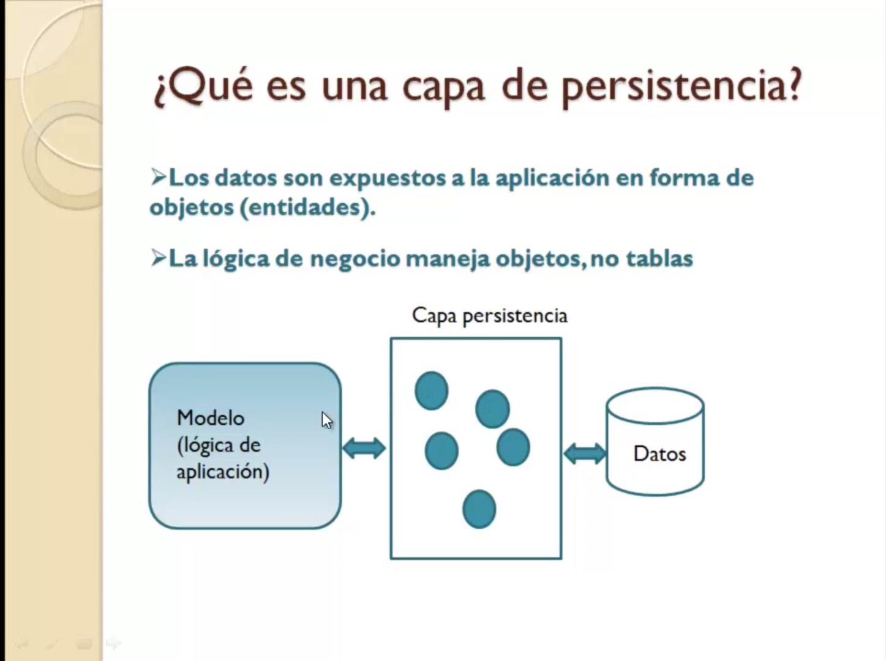

En primer lugar nos preguntamos qué es exactamente una capa de persistencia, pues es una capa que aparecería entre lo que es la lógica de negocio de una aplicación, la lógica aplicación, las instrucciones de acceso a datos etcétera y la propia base de datos.

La idea es que a través de la capa de persistencia los datos de la base de datos, las filas, columnas, las tablas en definitiva, se expongan a la aplicación en forma de objetos, de manera que el programador cuando quiera programar instrucciones para acceder a datos, no tenga que cambiar de mentalidad y pasar del mundo de los objetos al mundo relacional, al mundo de las tablas con sus filas y columnas sino que directamente los datos se han expuesto como objetos y pueda hacer las operaciones de manipulación de datos contra objetos, no contra lo que sería la base de datos relacional.

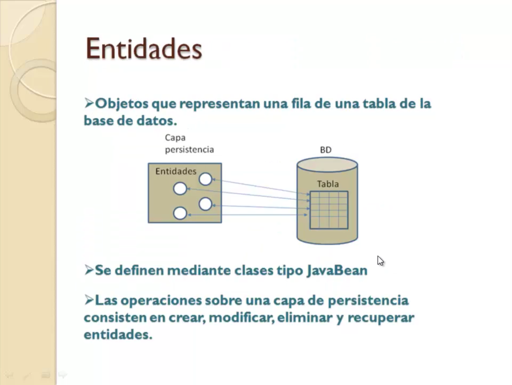

El principal componente de una capa de persistencia es la *Entidad*, esos objetos que se exponen en la capa de persistencia y que realmente representan como se ve en la imagen, filas de una tabla de la base de datos, se les conoce como entidades, a la hora de definirlos los definiremos mediante clases tipo Java Bean estándares, es decir con sus atributos para almacenar cada una de las columnas, de la fila que representan en esa tabla y con sus métodos setter y getter para poder acceder a ellos.

Entonces las operaciones sobre la capa de persistencia que realizará la lógica de negocio consistirá no en mandar instrucciones SQL la base de datos, sino en crear objetos entidades, modificar entidades, eliminar entidades, recuperar entidades, siempre trabajando con este tipo de objetos. 

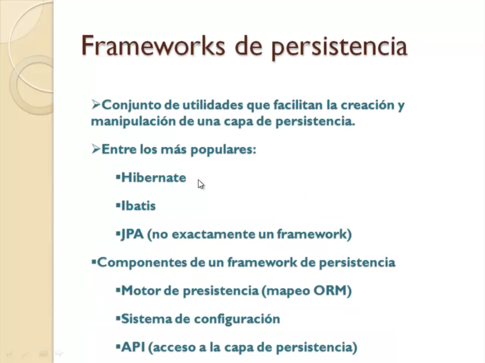

Para trabajar con una capa de persistencia existen los llamados Frameworks de Persistencia, que no son más que utilidades creadas por terceros que nos facilitan tanto la creación de la capa de persistencia, como su posterior manipulación desde una lógica de negocio en una aplicación. 

Entre los Frameworks de persistencia más populares tenemos por ejemplo Hibernate e IBatis y el que nos ocupa en este curso que es JPA y que como vamos a ver más adelante pues no es exactamente un Frameworks sino más bien una especificación. 

Y qué nos ofrece esos Frameworks de persistencia, en primer lugar nos van a ofrecer un motor de persistencia que es un software ya creado, de librerías Java que se encargan de todo lo que es lo que llamamos el mapeo ORM, es decir los datos en las entidades realmente representan filas reales de una tabla una base de datos, quien se encarga de sincronizar esto, el motor de persistencia, cuando nosotros añadamos o modifiquemos entidades esas instrucciones se reflejarán en la base de datos a través del motor de persistencia que se encargará de todas las operaciones JDBC contra dicha tabla de la base de datos.

Además se nos proporciona un sistema de configuración para indicarle al motor de persistencia cómo tiene que trabajar y eso ya depende de cada tipo de Frameworks si es basado en XML, en anotaciones y por supuesto un API es decir el modelo, la lógica de negocio ya no va a utilizar JDBC para acceder a la base de datos porque no va a acceder directamente a la base de datos, va a acceder a la capa de persistencia y eso implica utilizar un conjunto de clases e interfaces específicos para manipular esas entidades y que como ya verás a lo largo del curso mucho más sencillo que el clásico JDBC con sus instrucciones SQL.

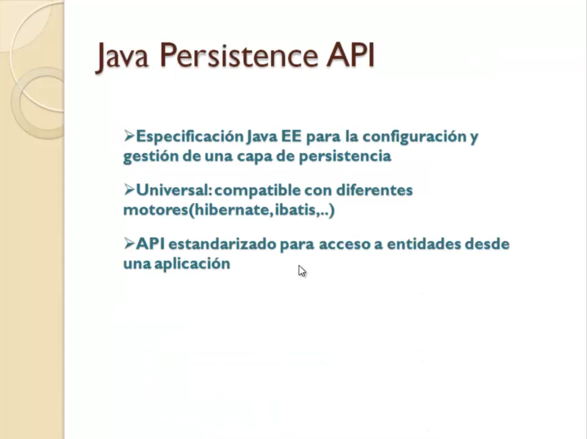

En nuestro caso este curso lo vamos a centrar en JPA Java Persistence API, que es una especificación de Java EE para la configuración y gestión de una capa de persistencia.

La idea es que a diferencia de otros Framework que son muy específicos, es decir por ejemplo Hibernate pues todo lo que proporciona es para trabajar con Hibernate, pues JPA pretende ser universal, es decir pretende ser compatible con otros Framework existentes de manera que por ejemplo, nosotros podríamos tener un motor Hibernate o motor iBatis y trabajar con el mismo API el mismo API JPA cuya idea es que sea compatible con los diferentes Framework de persistencia existentes.

Es un API estandarizado, ya digo forma parte de Java Enterprise Edition y nos va a proporcionar ese acceso estandarizado a la capa de persistencia, independientemente del motor que nosotros queramos utilizar después.

Ya en posteriores lecciones vamos a ir profundizando en cómo se crea la capa de persistencia y cómo utilizar este API dentro de nuestras aplicaciones.

## 03 Java persistence API 04:09

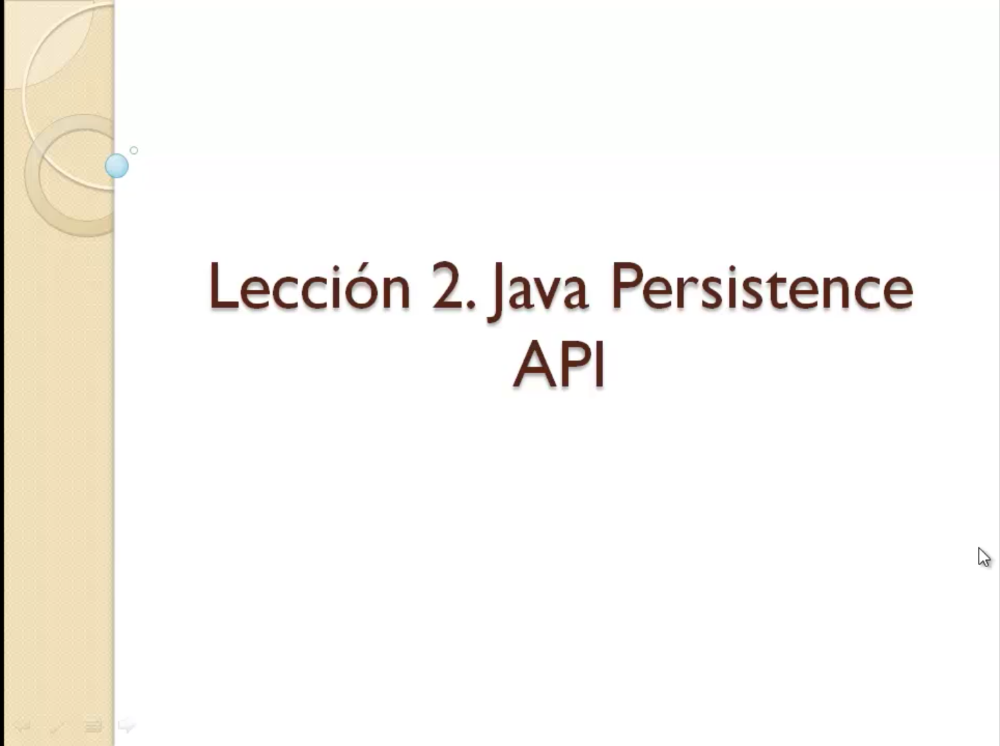

Bien pues en este curso por tanto vamos a abordar el estudio de la persistencia a través de la especificación Java Persistence API de Oracle.

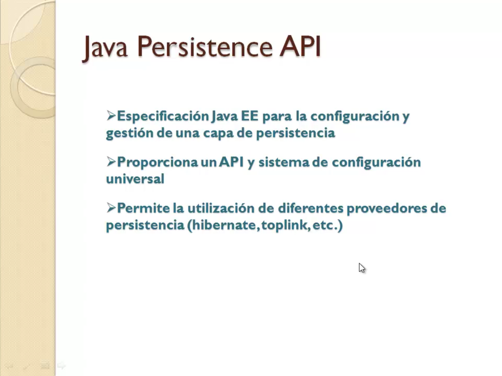

Java Persistence API como decíamos es una especificación que forma parte del Java Enterprise Edition para la creación, configuración y gestión de una capa de persistencia, es decir a través de esta especificación nosotros vamos a poder crear la capa de persistencia y también vamos a poder acceder a ella desde la lógica de negocio de la aplicación utilizando el API y el sistema de configuración universal que proporciona dicha especificación JPA.

Y qué es eso de que proporciona una API un sistema de configuración universal, que vamos a poder utilizar JPA es decir la misma manera de configurar la capa y el mismo juego de clases interfaces para atacar dicha capa, lo vamos a poder utilizar con diferentes proveedores o motores de persistencia existentes y que sean compatibles con JPA, como por ejemplo Hibernate que es uno de los más utilizados Toplink, IBatis etc..

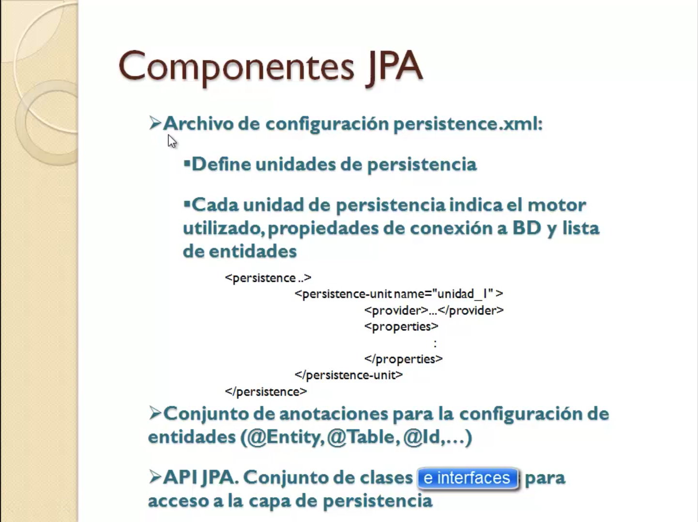

Qué es lo que nos proporciona exactamente la especificación JPA a los programadores para poder construir esa capa de persistencia y acceder a ella desde la lógica de negocio.

Pues en primer lugar podríamos resumirlo en tres componentes.

* En primer lugar el archivo de configuración `persistence.xml`. 

   * Un archivo de configuración `persistence.xml` organiza la información de configuración en lo que se conoce como unidades de persistencia.
   * Dentro de cada nivel de cada unidad de persistencia, lo que se va a indicar es por un lado que motor o que   proveedor de persistencia estamos utilizando para acceder a los datos. Las propiedades de conexión a la base de datos para que ese motor conecte con la base de datos, no olvidemos que al final, el objetivo de la capa de persistencia es exponer los datos como objeto, pero claro ese flujo de información entre los objetos y la base de datos tiene que realizarlo alguien, el motor de persistencia.
   
   Dentro de la Unidad de persistencia viven las etiquetas que se utilizan, se define *el proveedor* motor de persistencia que vamos a utilizar, una serie de propiedades donde le damos los datos de conexión y alguna propiedad específica que pueda necesitar algún proveedor en concreto. Se indica también la lista de entidades que se van a utilizar en esta capa de persistencia dentro de dicha unidad y esto nos permite además el organizarlo así en unidades de persistencia, que una aplicación, una capa persistente puede trabajar por ejemplo con distintas bases de datos. Cada base de datos podría tener su propio proveedor, sus propios datos de conexión, sería una unidad de persistencia, la información de cada base de datos. 
   
* Bien pues no es esa toda la configuración que hay que proporcionar cuando se está creando una capa de persistencia, además del `persistence.xml`, son las *Entidades*, que son las clases que representan los objetos con los datos de la base de datos, tienen que incluir una serie de anotaciones como luego iremos viendo en posteriores elecciones, pero bueno resumiendo por ejemplo `@Entity`, `@Table`, `@Id`, etc.

* Y por último quizá el elemento principal el API JPA. Es precisamente el conjunto de clases e interfaces que vamos a utilizar desde la lógica de negocio para poder acceder a las entidades y hacer las operaciones clásicas de añadir, eliminar, modificar, recuperar, etc.

   Es conocido como API JPA que se utilizará como digo desde la lógica de negocio para acceder a las entidades que han sido configuradas a través de estas anotaciones `@Entity`, `@Table`, `@Id` y cuya información de configuración de gestión de esa capa se encuentra en el `persistence.xml`.
   
En la siguiente lección vamos a ver todos los componentes, los paquetes software que necesitamos para poder trabajar con persistencia con JPA y ya vamos a ir profundizando tanto en la creación de una capa de persistencia, como en su utilización desde las aplicaciones.

## 04 Instalación del software 05:36

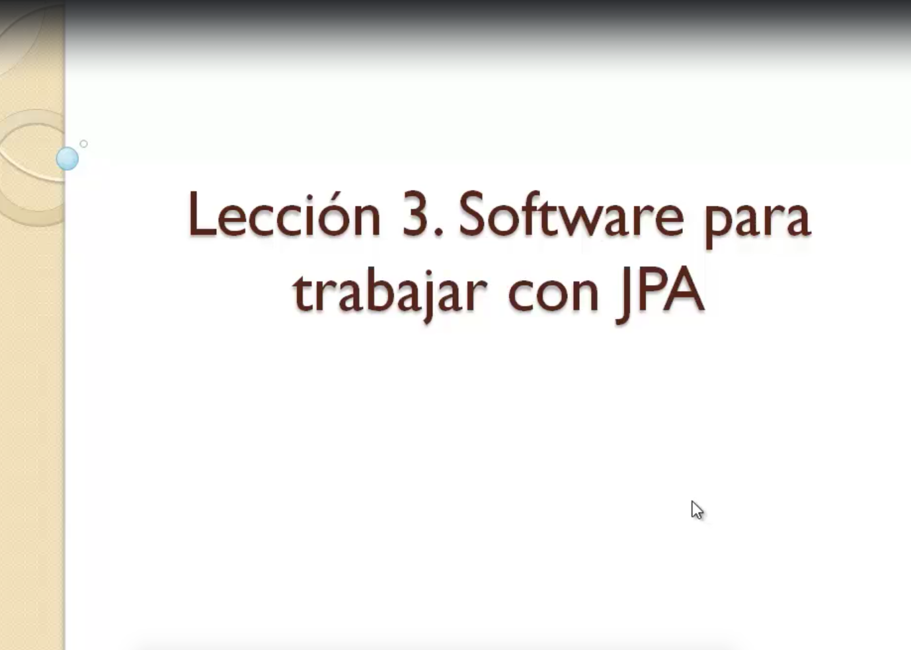

En esta elección vamos a ver los elementos software que necesitamos para poder trabajar con JPA tanto creación de capa de persistencia como su utilización desde las aplicaciones.

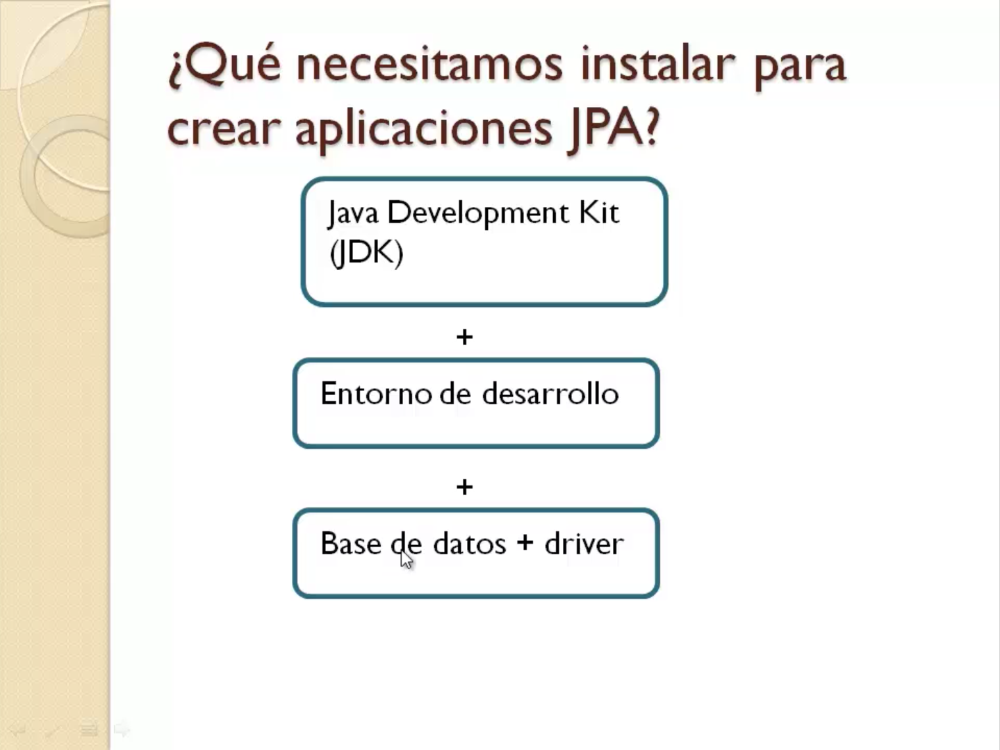

Aquí tenemos resumidos los tres bloques de programas que necesitamos, en primer lugar el Java Development Kit que es el kit de desarrollo Java. Cualquier aplicación JPA está basada en Java y por lo tanto vamos a necesitar este paquete básico un entorno de desarrollo que nos facilite la creación de los programas y por supuesto la base de datos con la que vamos a trabajar. Al hablar de persistencia lógicamente estamos necesitamos una base de datos en la que se almacene dicha información además de un Reimer que va a ser el intermediario que utilice las aplicaciones para poder acceder a la base de datos.

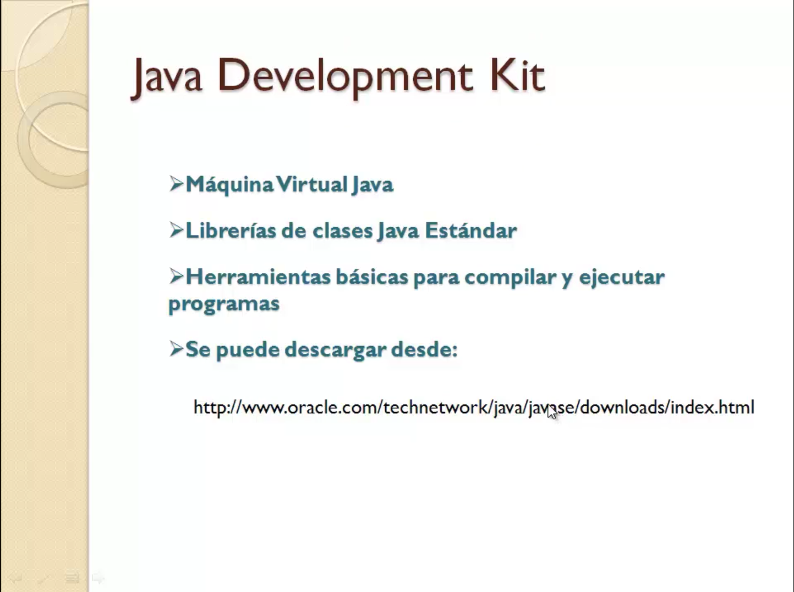

Java Development Kit, como decíamos JDK es el kit básico que nos proporciona Oracle para trabajar con Java y además de la máquina virtual Java, incluye la librería Java estándar, por supuesto herramientas para compilar y ejecutar programas que se usan desde la línea de comandos, pero para eso utilizaremos después de instalar el JDK un entorno de desarrollo que facilitará el uso de estas herramientas y no tengamos que bajar la línea de comandos para manejarlas. En esta dirección vamos a poder descargar el JDK última versión. 

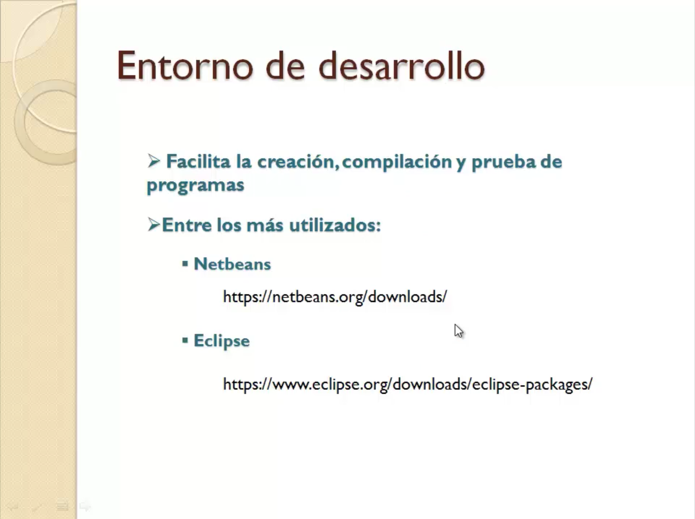

Como decía con el JDK tenemos la base pero no lo vamos a manejar directamente nosotros, necesitamos un entorno de desarrollo que lo maneje por nosotros y nos facilite la tarea de creación de los programas compilación pruebas entre los más utilizados tenemos NetBeans y Eclipse ambos de libre distribución, pero como digo no son los únicos, en este curso vamos a centrarnos en Eclipse que es el más utilizado por la comunidad de desarrolladores Java.

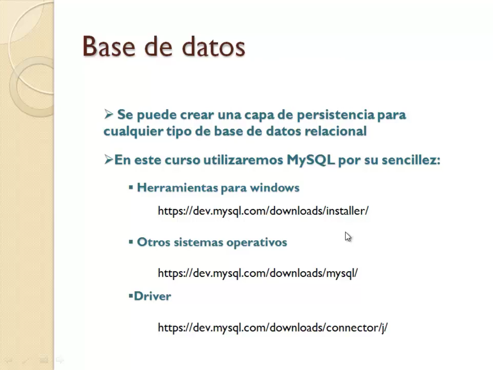

También vamos a necesitar una base de datos y en este curso vamos a utilizar MySQL. Todo lo que vamos a estudiar sería aplicable a cualquier base de datos, pero vamos a utilizar MySQL por su sencillez y su potencia, no solamente sencillos sino también la potencia, va a ser muy sencillo crear bases de datos con MySQL, poblarlas, inspeccionarlas, etc..

Las herramientas para trabajar con mayor SQL en el caso de Windows las encontramos en esta dirección donde podrás encontrar el motor de base de datos y luego alguna herramienta gráfica como Workbeanch que nos facilite la creación y la utilización de dichas bases de datos.

Para otros sistemas operativos esta la dirección y también la web de MySQL concretamente en esta dirección podríamos descargarnos el Driver para manejar la base de datos en el código.

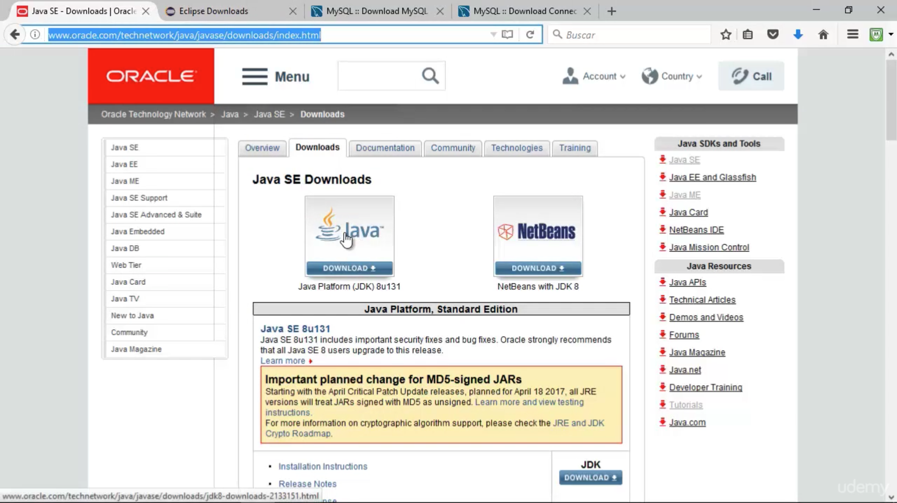

A continuación podéis ver las direcciones que indicábamos antes en la presentación.

Aquí tenemos en primer lugar la dirección de descarga del JDK que sería pulsando este botón que tienes aquí y el proceso de instalación es muy sencillo sería siguiendo todos los pasos hasta el final.

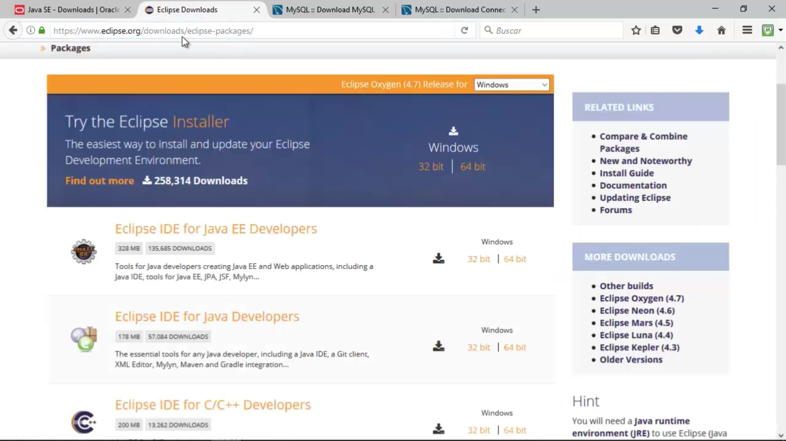

Después nos iríamos a otra dirección para la descarga de Eclipse. En esta dirección puedes encontrar muchos packs de instalación para descargar e instalar Eclipse. Yo recomiendo el Eclipse de Java developers puesto que es el más completo, incluye todo lo necesario para construir aplicaciones web que es donde vamos a utilizar fundamentalmente la persistencia.

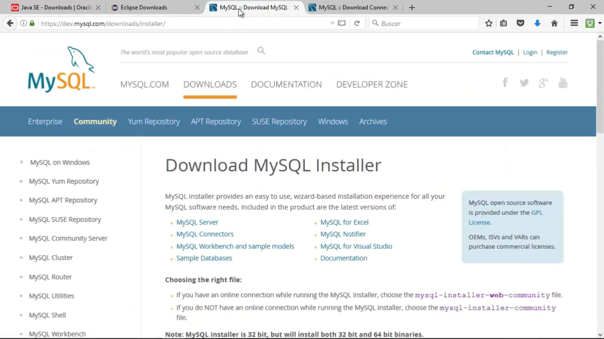

A continuación tenemos la dirección de descarga de MySQL, por un lado podríamos descargar el servidor de MySQL de base de datos y el Workbeanch que es una herramienta gráfica para manejar la base de datos.

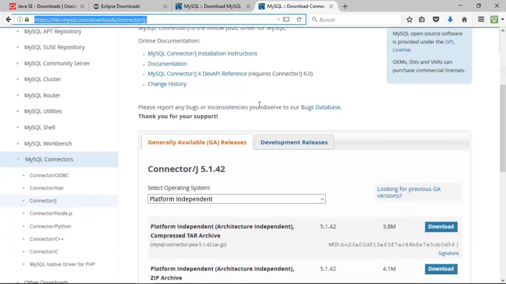

En esta última dirección es donde tendríamos la descarga de el driver de MySQL tienes la última versión que sería 5.1.42. Sobre la descarga e instalación de MySQL si tienes algún problema a la hora de descargar estas versiones de servidor, Workbeanch yo te voy a proporcionar también un conjunto de archivos bueno por un lado aquí tenemos estos tres archivos que vienen ya te digo te lo voy a proporcionar dentro de lo que es el material adicional viene todo comprimido dentro de un archivo y tendrías estos tres.

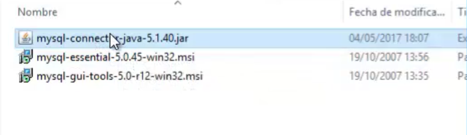

Por un lado tenemos el driver, te lo puedes descargar también, pero te lo incluido si no quieres descargar y con esto hay que hacer nada simplemente se utilizará cuando se nos vaya pidiendo las lecciones que va a seguir estudiando más adelante a lo largo del curso, fundamentalmente para la configuración del motor de persistencia que es el que utiliza el driver para acceder a la base de datos, pero ya te digo con esto no hay que hacer nada simplemente lo tienes.

Los otros dos archivos corresponden a los programas de instalación de MySQL por un lado teníamos SQL Essential que es para instalar el servidor de base de datos y el GUI que se instala posteriormente y que es una herramienta gráfica para manejar de forma sencilla el motor de base de datos y crear bases de datos de forma gráfica e inspeccionar las configurarlas etc. Son un poquito más antiguos de los problemas que tenemos en la página oficial, pero bueno son perfectamente válidos para lo que vamos a ver en el curso y de hecho son los que yo voy a utilizar en esta versión de MySQL, es la que voy a utilizar en los ejercicios que voy a seguir viendo a lo largo de todas las lecciones que te voy a ir presentando.

Esto te lo voy a proporcionar como digo dentro material adicional y son también de libre distribución, los podrías encontrar en Google escribiendo su nombre directamente en Google los encontrarías y también los puedes descargar pero en cualquier caso te lo voy a proporcionar.

## 05 Creación de una capa de persistencia con JPA parte 1 03:47

En esta lección vamos a crear nuestra primera capa de persistencia con JPA y vamos a indicar el proceso que tenemos que seguir para ello.

Básicamente son dos pasos que tendremos que hacer para crear una capa de persistencia:

1. Es crear y configurar las entidades, esa configuración se realiza a través de unas anotaciones que ahora comentaremos.

2. Y en segundo lugar configurar el archivo `persistence.xml`, en el que se debe indicar dentro de la Unidad de persistencia correspondiente:

   * Qué proveedor de persistencia vamos a utilizar, un motor de persistencia.
   * La lista de entidades que van a formar parte de esa unidad de persistencia 
   * Y por supuesto las propiedades de conexión a la base de datos que necesitará dicho proveedor.
   
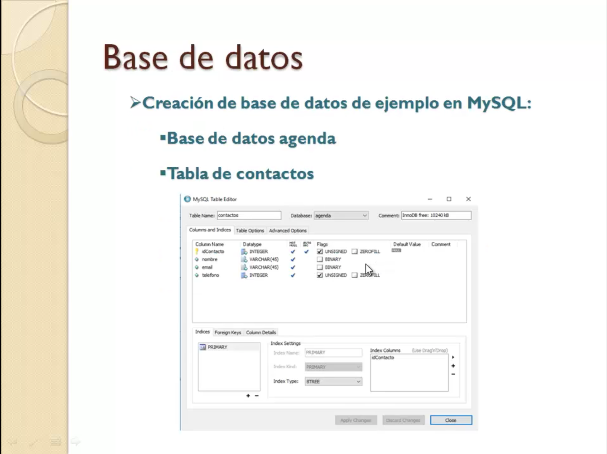

La base de datos con la que vamos a trabajar es una base datos MySQL.
La base de datos se llamara `agenda` la tabla sobre la que vamos a trabajar se llama `contactos`.

Uno de los archivos adicionales de contenido material adicional te explica el proceso para instalar MySQL y para crear esta base de datos con la que vamos a trabajar ahora.

La tabla tiene cuatro campos:

* `idContacto` Integer Auto Unsigned
* `nombre` Varchar(45)
* `email` Varchar(45)
* `telefono` Integer Unsigned

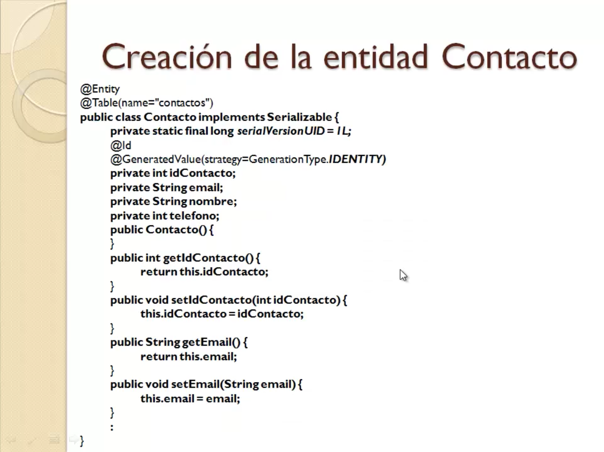

Una vez que lleguemos al primer paso, creación de la entidad, la entidad como tal va a ser una clase tipo Java Bean como las que podemos utilizar para encapsular cualquier conjunto de datos en Java, tendrá sus atributos que corresponderán con los diferentes campos de las columnas de la base de datos cuya información va a almacenar. Recordemos que la entidad los objetos de la entidad, lo que van a almacenar es el contenido de una fila básicamente. Los métodos setter y getter para acceder a dichos campos. Encontraremos unas anotaciones a nivel de clase y a nivel de atributo, que indicarán cierta información al motor de persistencia relativo a esta entidad.

Entre las más interesantes, las más importantes por ejemplo `@Entity` indicará que se trata de una clase de Entidad, esta anotación se utiliza delante de la clase `@Table`  que mapea la entidad con la tabla de la base datos a la que va asociada. Y ya a nivel de atributo por ejemplo, `@Id` que va delante del atributo que hace de clave primaria, toda entidad tiene que tener una clave primaria que le permita al motor de persistencia identificar cada objeto de la capa de persistencia, de la unidad de persistencia e identificar en este caso unos contactos de otros a través del atributo `idContacto` y `@GeneratedValue` que es la estrategia de generación de esta clave primaria, en este caso se trata de un campo identidad autogenerados.

Una anotación que no aparece en el ejemplo, en este listado es `@Column` que sería una anotación que habría que indicar delante de cada columna, de cada atributo, para indicar el nombre de la columna de la base de datos con la que está asociada, obviamente de la tabla contactos, como los atributos coinciden con los nombres de las columnas no es necesario utilizarlos sino coincidieran habría que utilizar la anotación `@Column` delante de cada atributo para indicar exactamente a qué columna está asociado dicho atributo.

`persistence.xml` al final deberán quedar, segunda parte del proceso, algo parecido a la imagen, donde indicaremos la unidad de persistencia, dentro de ella el proveedor que se va a utilizar, la clase de la lista de clase de entidades y como vemos las propiedades de conexión a la base de datos.

Vamos a ver cómo generar todo esto con un ejemplo concreto.

## 06 Creación de una capa de persistencia con JPA parte 2 10:14

El ejercicio que vamos a desarrollar será una aplicación de consola donde vamos a crear una capa de persistencia para posteriormente en la siguiente elección empezar a utilizar la API JPA para acceder a ella.

Para ello vamos a utilizar el entorno de desarrollo Eclipse que instalamos en la elección anterior y nos vamos a situar dentro de la perspectiva Java, si aparece otra perspectiva por defecto atrás de este botoncito elegiremos la perspectiva Java que es la más adecuada para este tipo de proyecto.

Una vez estemos en perspectiva Java, vamos a crear nuestro proyecto con la opción File - New - Java Project.

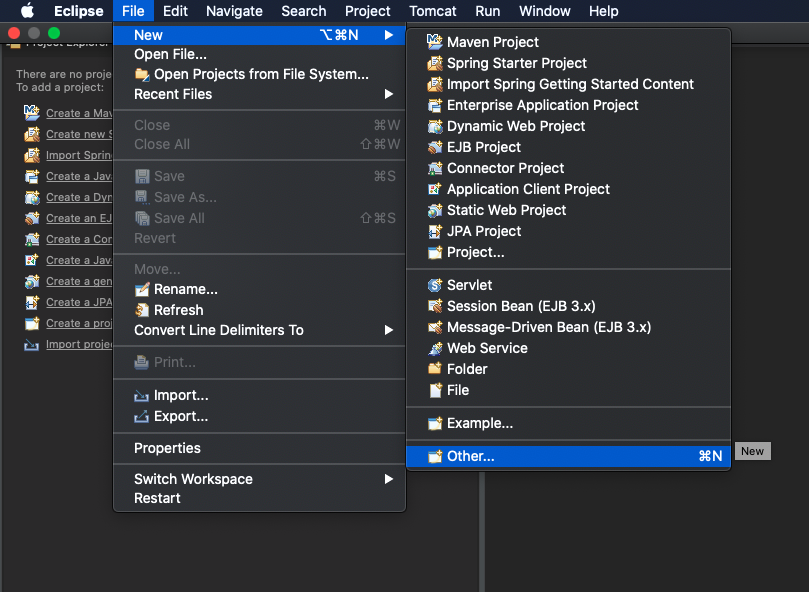

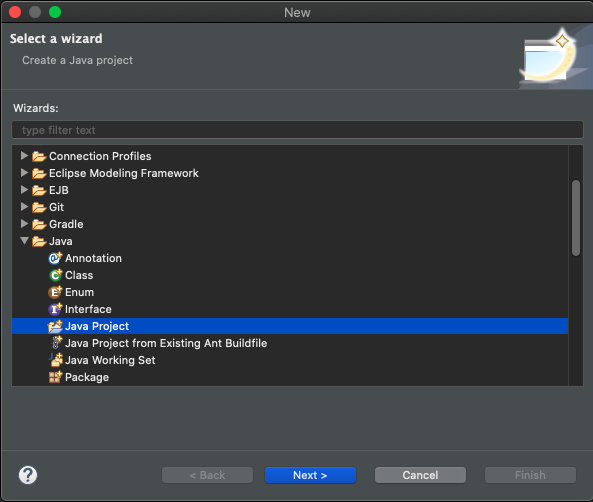

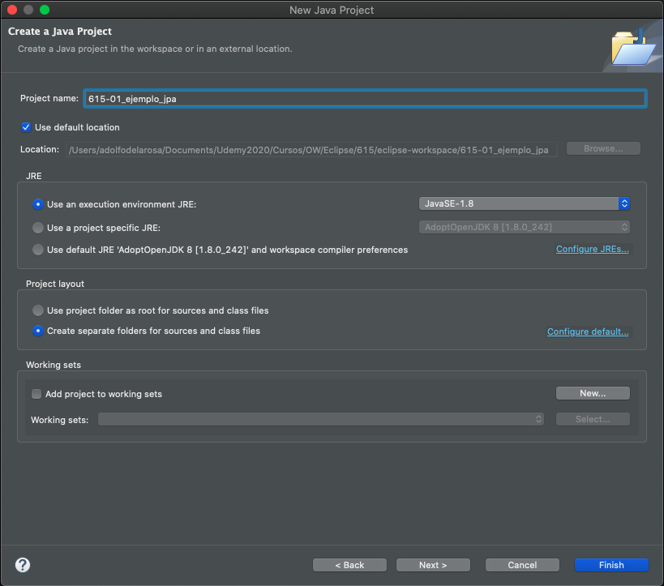

Le vamos a poner de nombre `615-01_ejemplo_jpa`, con el JDK que hemos instalado también previamente a la instalación de Eclipse y aquí directamente vamos a finalizar. Nos crea la siguiente estructura de proeyecto.

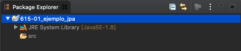

A partir de ahora vamos a crear ya la *Capa de Persistencia*, lo primero es preparar el proyecto para que disponga de alguna de las plantillas y opciones de menú propios de JPA, donde lo que vamos a hacer es a través del botón derecho nos vamos a ir a las propiedades del proyecto

y en `Project Facets` aparecerán o deberían aparecer una lista de propiedades, de características que queramos añadir a nuestro proyecto.

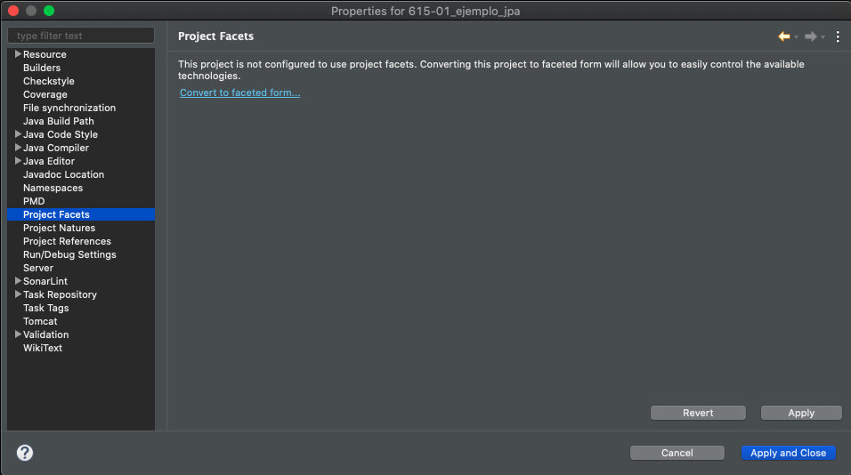

Como es un proyecto Java estándar no suelen aparecer por defecto esas características hay que pulsar en el enlace `Convert to faceted from...`

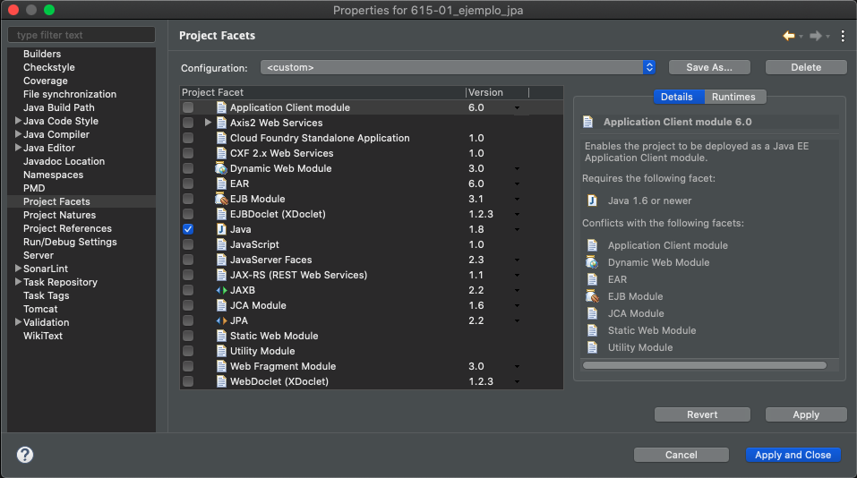

Para que ahora ya aparezcan una serie de características, como digo que hará que Eclipse incorpore nuevos menus, librerías, etc.

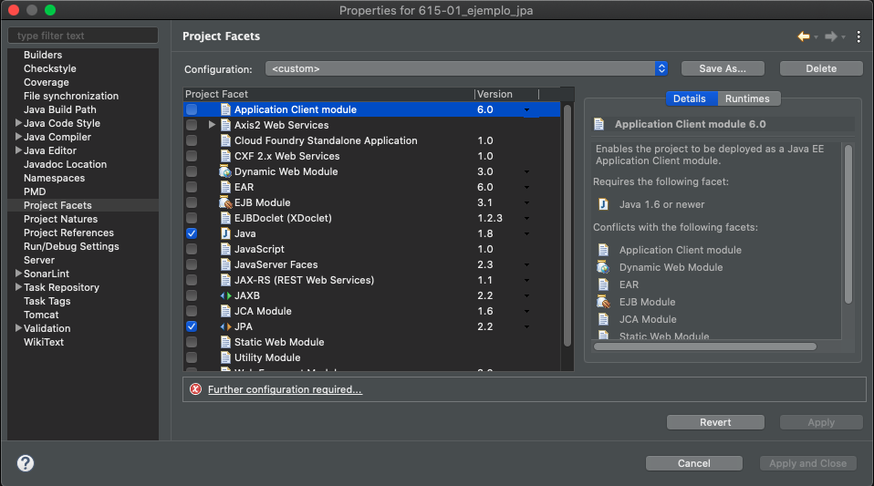

En nuestro caso vamos a activar la opción JPA, al activar la opción JPA aparece este enlace `Futher configuration available...`, antes de darle OK, vamos a pulsar en este enlace para habilitar unas propiedades de JPA

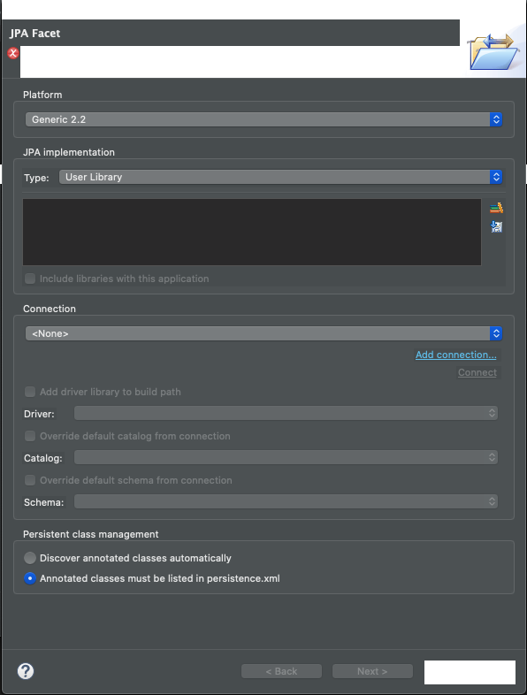

Que concretamente van a consistir en indicarle Eclipse qué motor vamos a utilizar, si no es un motor que lo incorpore el propio Elipse.

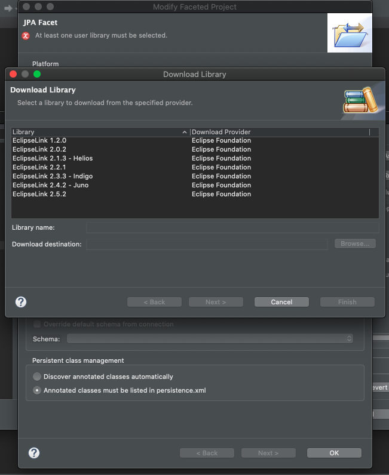

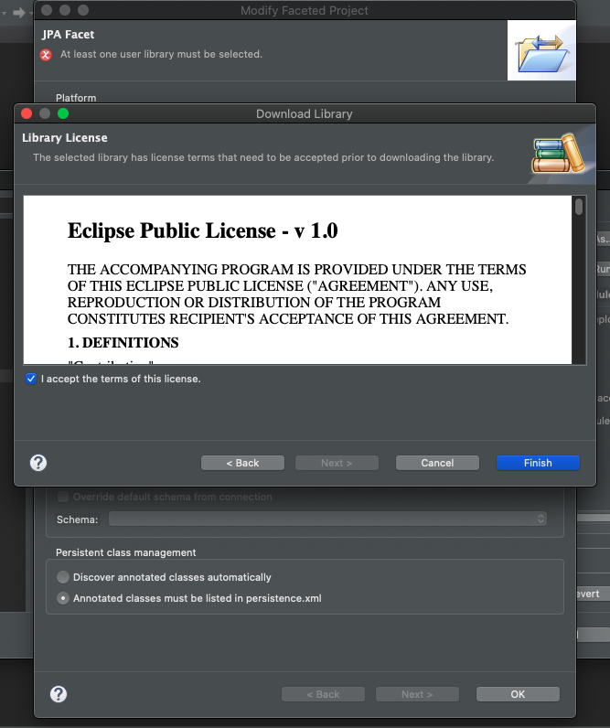

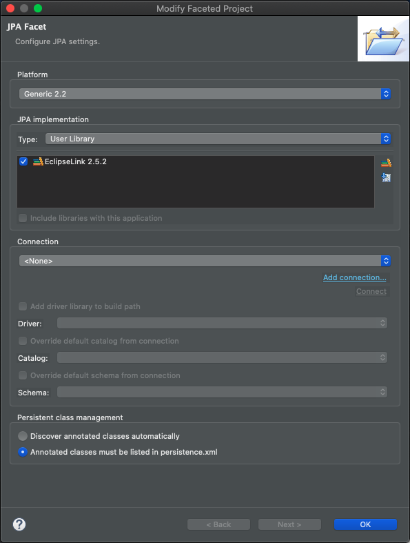

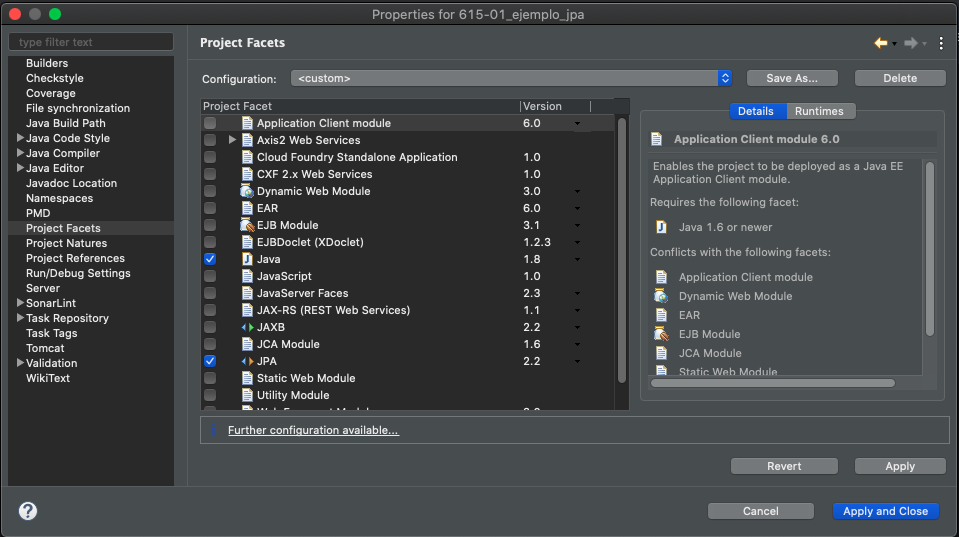

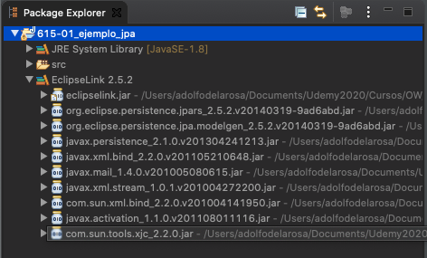

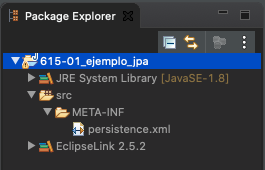

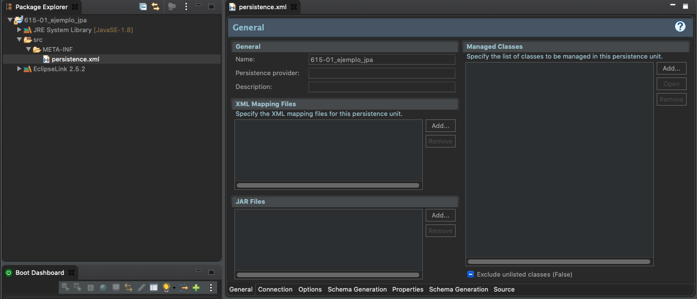

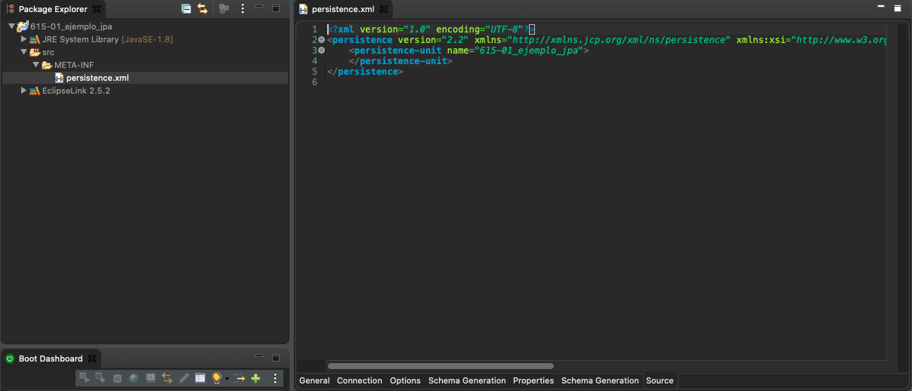

    

Entonces aquí dedicaríamos nada en plataforma generic 2.1 que es la especificación de JPA actual y donde dice tipo simplemente deshabilita haríamos configuración de librería para luego posteriormente añadirla nosotros manualmente pero resulta que Eclipse incorpora ya un motor una librería de motor de proveedor de persistencia que es el eclipse Elim muy parecido a Tomlin de Oracle.

Entonces bueno vamos a elegir la opción user Library y si no nos aparece aquí ninguna librería ya marcada es porque aún no la ha descargado.

En mi caso como ya he utilizado crear un proyecto entre huesped podría la descarga una vez y desaparece pero si no le damos a este botoncito el disco y aparece las posibles librerías a descargar elegiríamos Eclipse Linh 2.5.

El paso siguiente aceptaríamos la licencia y procedería a descargar dicha librería que ya la tendríamos disponible para el resto del proyecto de alguna speaks una vez que ya la tengamos descargada.

Pulsamos okay aquí también pulsamos OK y como veremos en la lista de librerías aquí la tenemos Eclipso

Linh todas las librerías del motor de persistencia Eclipse.

Vale bien pues además ya se ha creado también lo podemos ver a quienes se aprece en metáis.

El archivo persiste en XML pero bueno esto simplemente es una plantilla está preparado para empezar el proceso de creación de las entidades y en segundo lugar la creación del archivo XML porque ya está creado pero si su configuración.

Vamos con la creación de las entidades con el botón derecho nos vamos a la acción JPA Tools generar entidades desde tablas aquí nos aparecerá una lista de posibles conexiones con base datos ya creadas por este asistente.

Asistente cada vez que queramos generar entidades habráque al propio asistente darle unos datos de conexión con la base de datos de la que quiere sacar las entidades.

Y si con Connecta alguna vez con la base de datos de SQL pues mi caso ha sido así porque aparecen aquí unas conexiones creadas.

Pero bueno si no es la primera vez pues entonces habrá creado este botón para crear una conexión contra mayor SQL indicaremos asociamos nombres a conexiones una colección propia de este asistente SQL prueba por ejemplo en el paso siguiente ya nos van a pedir los datos de conexión a la base de datos para que este asistente como digo pueda conectar con ella y extraer la información para generar las entidades en primer lugar debemos indicar el driver de mayor secuela que queremos utilizar este botoncito aquí elegimos la opción más SQL 5.1.1 le damos un nombre un nombre propio interno el del asistente y eso sí en Yarelis aparece un nombre de archivo que realmente no existe tenemos que eliminar y aquí lo que debemos incluir es la localización del archivo jar de nuestro driver que aunque queramos utilizar vamos que va a utilizar el asistente para conectarse con la base de datos en la elección anterior como recuerdas tuvimos que descargar un Reimer vamos a añadirlo vamos al botón de decir lo localizamos la carpeta donde lo tengamos porque no había que instalar nada con ese archivo.

Simplemente había que descargarlo y guardarlo en algún sitio pues no localizamos y ya lo tenemos pulsamos OK y ahora Rellenamos los datos de conexión a la base de datos con nuestra base de datos se llama agenda aquí también indicaremos agenda y los datos los credenciales Rut y Rut era también la contraseña.

Podemos hacer un test de conexión para probar que efectivamente conecta con la base de datos.

En el siguiente paso simplemente es un resumen y finalizamos y ahora se habrá localizado ya.

Efectivamente ahí el esquema parecerá la base de datos agenda la lista de tablas que la conforman.

En nuestro caso sólo nos interesa la tabla contactos que la única que tenemos es tarde usuarios la tengo yo ahí no se va a usar en este ejercicio.

En el siguiente paso que asociaciones entre tablas existen si solo hay una tabla no tienen sentido hablar de asociaciones así que nada.

Siguiente.

Y aquí nos va a preguntar por ejemplo sobre la primera y que va a ser autogenerados o autogenerados si no fuera autogenerados por aquí dejaríamos nuestro caso sí que lo es el tipo de identidad que sea la opción que elegiremos.

Esto se queda por defecto ya que indicaremos el nombre del paquete donde queremos guardar esa clase entidad en el siguiente paso nos va a dar un resumen de cómo se va a llamar la clase.

Normalmente suele llamarse igual que la tabla pero en singular y con la primera letra mayúscula.

En cualquier caso a través de la notación arroba tablet se asocia esta clase con esta tabla y ya está finalizamos y ahora veremos aquí nuestra entidad contacto ya creada.

Como vemos la notación arroba Entity arroba table que veíamos en la transparencia anterior asociada con el nombre de la tabla y arroba columna aparece porque como ya te decía las nombres de los atributos de los campos coinciden con los nombres de las columnas.

Aquí aparece también una notación arroba name Cuadri que introduce automáticamente al asistente pero en este caso no vamos a utilizar para nada ni sería necesario que estuviera ahí ya hablaremos de la escuelas en la lección dedicada a las consultas por lo que la entidad ya está.

Ahora falta rellenar los datos del persiste en XML.

Aquí habría que indicar ya ves que la unidad de persistencia se ha creado como un nombre por defecto y la lista de entidades al crear la entidad y al añadir aquí que forman esa unidad de persistencia faltaría por indicar el probare el Provider es el nombre del proveedor utilizado.

Bueno este dato no es necesario puesto que al utilizar Eclipse Link que es el que trae Eclipse pues el Provider ya viene predeterminado entonces lo obtiene directamente de las librerías.

En cualquier caso podríamos asociable el nombre de nombres asociados a proveedores el que tenemos aquí en la presentación que te enseñantes aquí lo ves o reflejé con Kartli se apunta que existen puntos JPA punto persisten Roballo pero es el proveedor predeterminado y si no se indica nombre pues este es el que va a buscar así que en este caso bueno como no es necesario pues no lo vamos a no lo vamos a utilizar no lo vamos a indicar pero podríamos indicar ese nombre a Eclipse y lo que sí que falta son los datos de conexión a la base de datos pero en vez de incluirlos aquí manualmente podemos hacer lo siguiente cuando vamos al archivo y vamos a abrir ese archivo XML Open width con el editor persisten XML que nos permite abrirlo con verlo de una forma más amigable a través de esta serie de pestañas y si nos vamos a la pestaña Connection pues aquí tendríamos que indicar los datos de conexión a la base de datos lo primero es que la manera en que vamos a conectar con la base de datos va a ser con conexiones directas.

Eso implica elegir alquilación Resource local.

La otra opción JSA es cuando vamos a utilizar lo que se conoce como un data show que ya lo veremos en los casos en los que utilicemos persistencia dentro de un contexto una aplicación.

Ahí veremos cómo utilizar un data pero en este caso son conexiones directas.

Por lo tanto hay que elegir la opción versión local y en vez de incluir los datos aquí como digo manualmente le vamos a decir que los tenga de una de las conexiones que le creamos al asistente que ya están ahí todos los datos SQL prueba ya que toda la información y con esto ya tendrían la información suficiente del proveedor para conectar con la base de datos.

Aquí en Shur vemos cómo quedaría la lista de propiedades cada propiedad con su nombre y su valor correspondiente y esto la capa de persistencia a partir de ahí ya podríamos empezar a utilizarla desde una aplicación a través de la JPA cosa que veremos en posteriores elecciones.

## Autoevaluación I 00:41

Autoevaluación I

1. Una capa de persistencia:
   * Requiere del uso de JDBC para acceder a los datos
   * Expone los registros de la base de datos en forma de objetos
   * Requiere el uso de un navegador compatible
   * Se gestiona desde la vista de una aplicación
 

2. Indica cuál de las siguientes tecnologías corresponde a un framework de persistencia
   * EJB
   * JSF
   * Hibernate
   * Spring

3. Una entidad es
   * Un API de persistencia
   * Un archivo de configuración XML
   * Un framework de persistencia
   * Una clase

4. ¿Dónde se configuran los datos de conexión a la base de datos en JPA?
   * A través de anotaciones
   * En el archivo de configuración persistence.xml
   * A través del API JPA
   * En ficheros de texto .cfg

5. La anotación `@Id` de JPA se utiliza para
   * Indicar la primary key de una entidad
   * Indicar que la clase es una entidad
   * Indicar la tabla a la que se asocia una entidad
   * Indicar el valor predeterminado de un atributo
 

SOLUCIONES:

1.- B

2.- C

3.- D

4.- B

5.- A
