# 3. El API JPA 18:53

* 07 El API JPA 05:48
* 08 Primera aplicación JPA 12:05
* Autoevaluación II 01:00

# 07 El API JPA 05:48

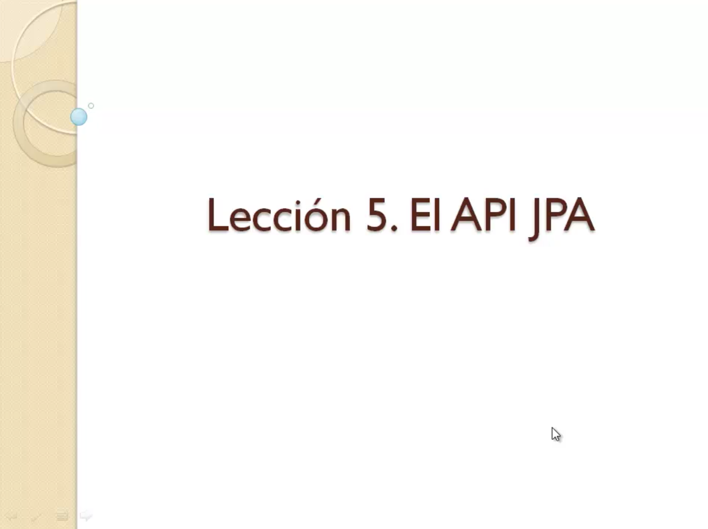

Después de haber estudiado la lección anterior como crear una capa de persistencia vamos a continuación a introducirnos en el uso de la API JPA para poder manejar esa capa de persistencia desde la lógica de una aplicación Java.

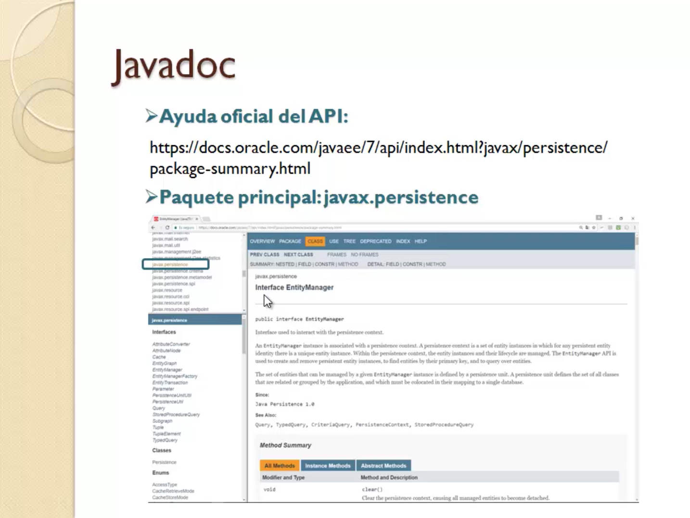

En primer lugar aquí tienes la dirección del Java Doc la ayuda oficial de la API de JPA `https://docs.oracle.com/javaee/7/api/javax/persistence/package-summary.html`, que forma parte como ya sabes de Java Enterprise Edition y que como digo la puedes obtener la puedes ver en esta dirección , para tener a mano las clases e interfaces que vamos a tratar a lo largo de las siguientes elecciones. Otras ayudas pueden ser:

https://www.oracle.com/java/technologies/persistence-jsp.html

https://docs.oracle.com/javaee/7/tutorial/partpersist.htm#BNBPY

El paquete principal `Package javax.persistence`, en donde se encuentran los componentes principales que vamos a estudiar a lo largo de este curso.
El paquete principal Java X persistan en donde se encuentran los componentes principales que vamos a estudiar a lo largo de este curso.

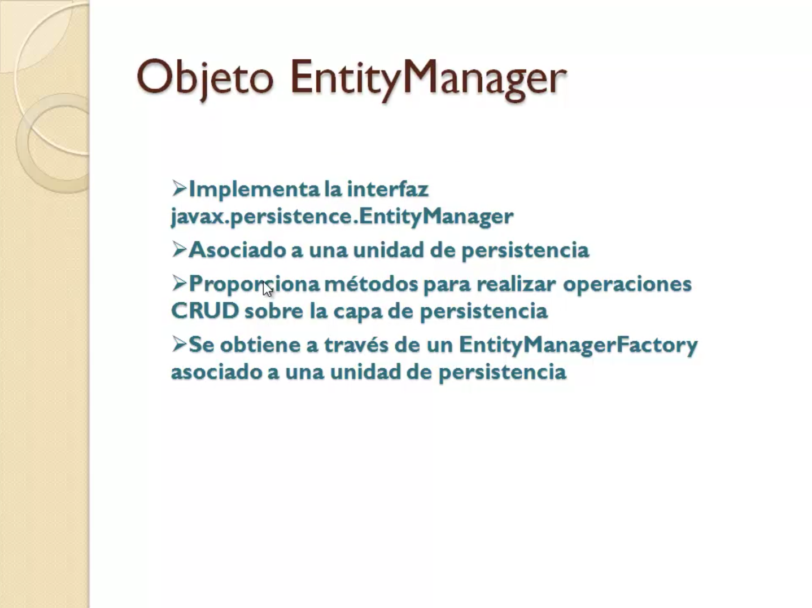

El primero y más importante de todos es el objeto `EntityManager` es una interfaz que se encuentra en el paquete que te comentaba antes `javax.persistence` los objetos que implementan en esta interfaz se encuentran asociados a una unidad de persistencia, a través de estos objetos es con los que vamos a poder acceder desde nuestra aplicación a dicha unidad de persistencia y poder hacer las operaciones básicas que llamamos CRUD, de crear entidades, recuperar entidades, actualizar entidades y eliminar entidades.

Cómo obtenemos un `EntityManager` lo vamos a ver ahora en la siguiente transparencia pero se hará siempre a través de una factoría que se conoce como el `EntityManagerFactory` que se encuentran asociados a la unidad de persistencia de la que queremos obtener los `EntityManager`.

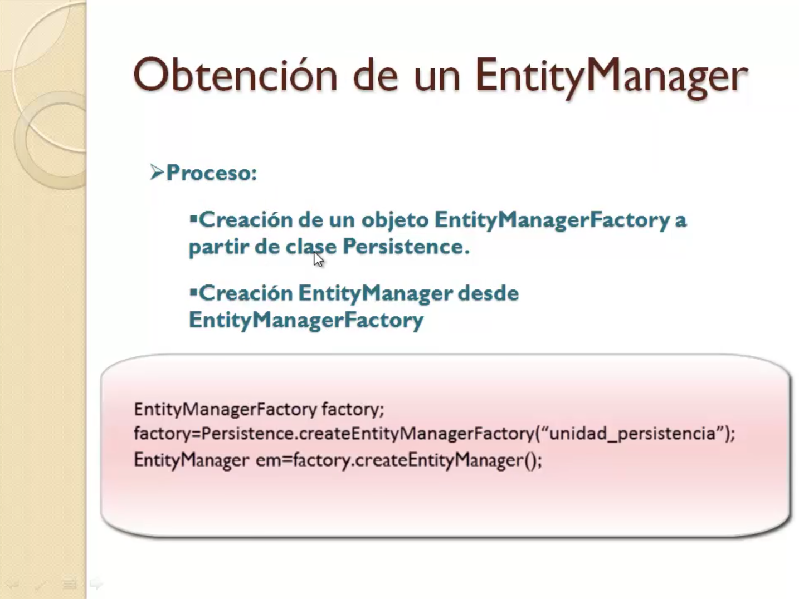

El proceso lo vemos aquí, lo primero que hay que hacer es crear un `EntityManagerFactory` factoría que se crea a partir de la clase `Persistence`, `Persistence` tiene un método estático que se llama `createEntityManagerFactory` al que le indicamos la unidad de persistencia lo vemos aquí, directamente la llamada de ese método nos va a devolver ya una factoría asociada a esa  unidad de persistencia para a partir del, cómo ves crear el `EntityManager` utilizando el método `createEntityManager` de la factoría obtenemos ya el `EntityManager`.

Una vez que tenemos Identity Manager vamos a poder acceder a sus métodos y poder hacer esas operaciones CRUD que comentábamos anteriormente aquí las tenemos.

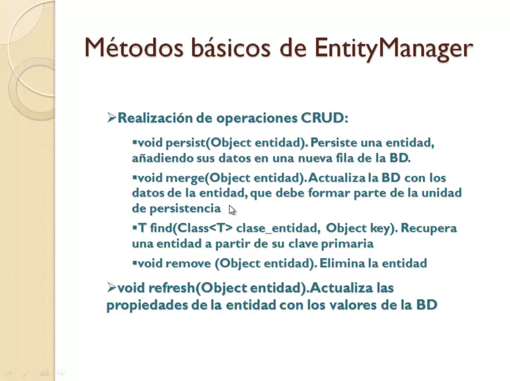

Las operaciones CRUD se realizarían detrás de estos métodos `persist` le proporcionamos el objeto de la entidad que queremos persistir y lo añadiría a la unidad de persistencia, que básicamente se traduce por detrás en insertar una nueva fila en la base de datos con los datos de ese objeto.

Si lo que queremos es actualizar una entidad que ya existe es decir, con datos de un objeto que ya existe en la base de datos su fila, llamaríamos al método `merge`, lo que hace es un `update` de la entidad, que lanzaría esa instrucción por detrás el motor de persistencia hacia la base de datos.

Si lo que queremos es recuperar una entidad a partir de la Primary Key utilizaríamos este método `find`, en el primer parámetro proporcionariamos la clase de la entidad cuyo objeto queremos recuperar y a partir del segundo parámetro la Primary Key, el método `find` nos devolvería ese objeto, vemos una T que es el tipo de la entidad con la que estemos trabajando, Contacto o lo que sea. Si no existiera un objeto con esa clave primaria asociada nos devolvería `null`.

Y por último para eliminar entidades tenemos el método `remove` proporcionamos el objeto de entidad que queremos eliminar y lo eliminaría, traduciría en un delete hacia la base de datos.

Estas son las operaciones básicas.

Te estarás preguntando si yo lo que quiero es recuperar una entidad pero no a partir de su clave primaria sino a partir de otro criterio o eliminar un conjunto de entidades que cumplan una determinada condición, entonces ya tendríamos que recurrir a las consultas que veremos en posteriores elecciones, estos son digamos los métodos básicos del propio `EntityManager` para realizar estas operaciones básicas.

Por último tenemos otro quinto método `refresh` que lo que hace es refrescarnos una entidad, es decir le proporcionamos un objeto entidad y lo que hace es actualizar sus datos con la información existente actualmente en la base de datos, digamos que lo contrario al `merge`.

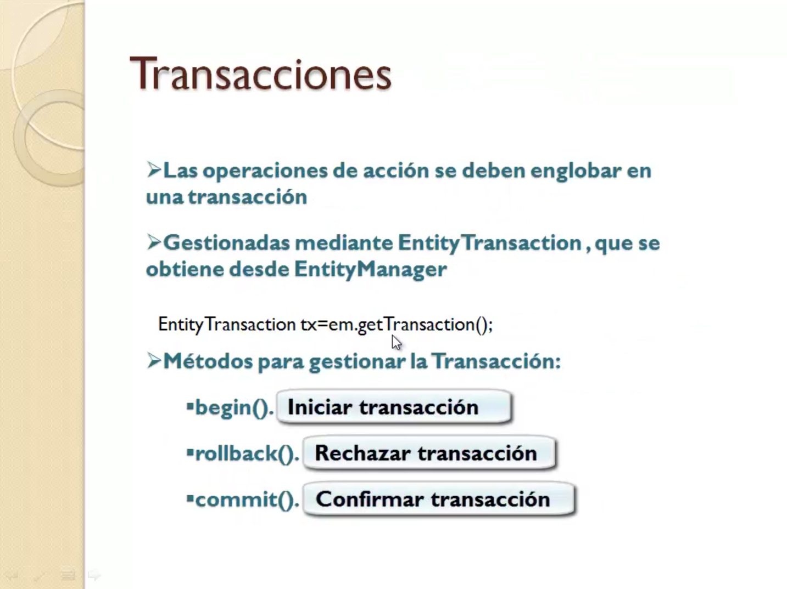

Importante indicar una cosa sobre JPA y es que todas las operaciones de acción es decir eliminar, actualizar y añadir entidades, deben ser incluidas dentro de una transacción, si realizamos un `persist`, un `merge` o un `remove` sin haber marcado una transacción, esas operaciones no se van a realizar físicamente en la base de datos. Entonces esas operaciones como digo deben estar englobadas dentro de una transacción.

Las transacciones, las vamos a gestionar a través del `EntityTransaction` que también se puede obtener a partir del `EntityManager` como ves en la instrucción, dado el `EntityManager` llamando al `getTransaction()` obtendríamos un `EntityTransaction` a partir del `EntityTransaction` podemos marcar la transacción con los métodos clásicos de gestión de transacciones:

* `begin()` para iniciar la transacción.
* `rollback()` si hay que rechazarla 
* `commit()` para confirmar

Si iniciamos una transacción, hacemos una operación y no realizamos un commit, sería como si implícitamente se estuviera haciendo un rollback y por lo tanto no quedaría físicamente registrada esa operación en la base de datos a la que está asociada la capa de persistencia.

Pues bien en la siguiente leccion vamos a ver un primer ejemplo de utilización de este API JPA con las operaciones básicas, a partir de la capa de persistencia creada en la lección anterior.

# 08 Primera aplicación JPA 12:05

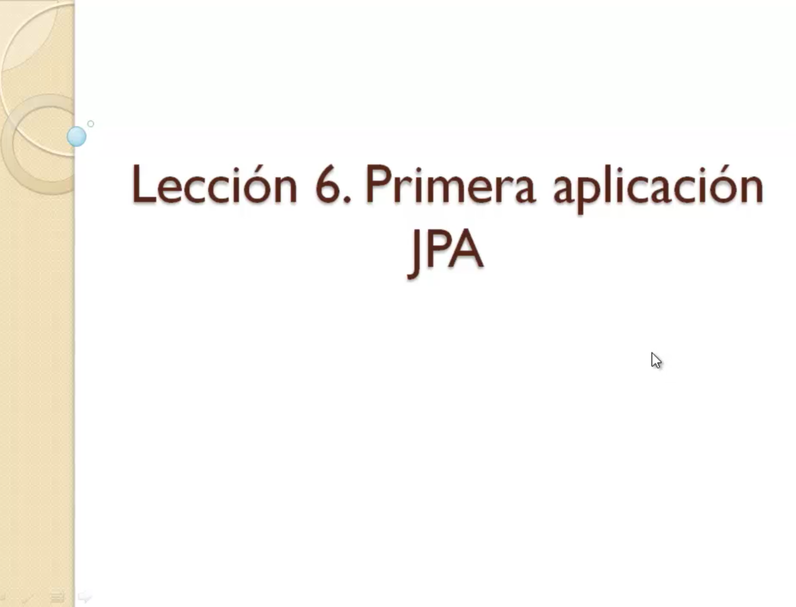

Muy bien vamos a crear nuestra primera aplicación de ejemplo JPA lo que vamos a hacer es realizar una serie de operaciones CRUD de crear, recuperar, actualizar y eliminar entidades contra la capa de persistencia de la base de datos `agenda` de la tabla `contactos` que creamos en una de las lecciones anteriores.

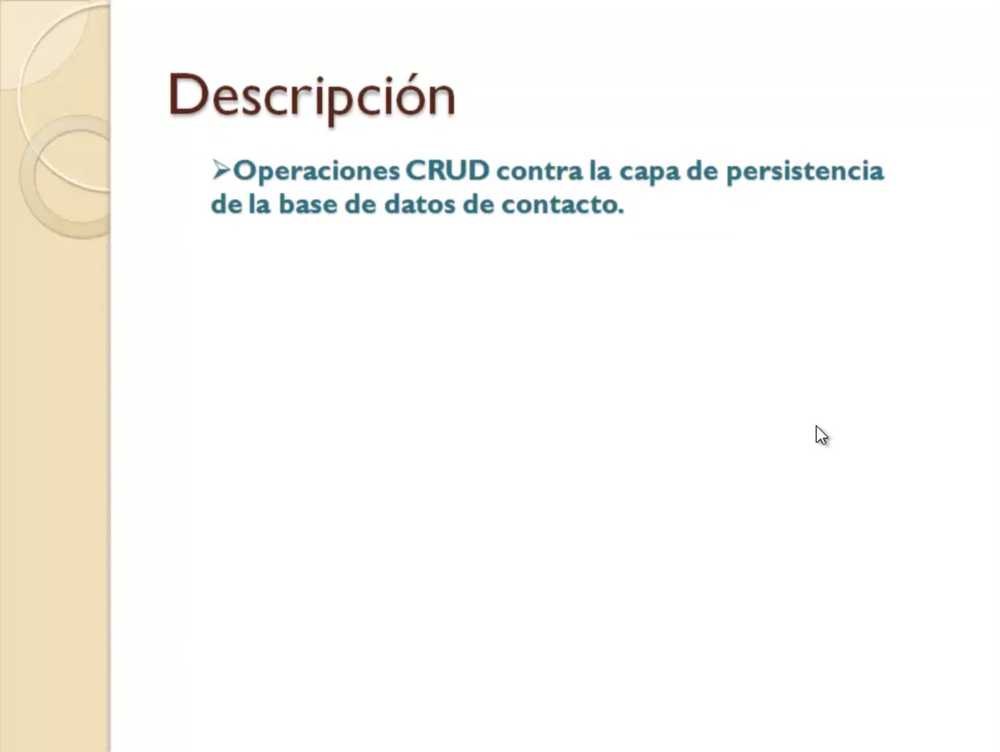

El Código de la aplicación al final quedará algo como esto:

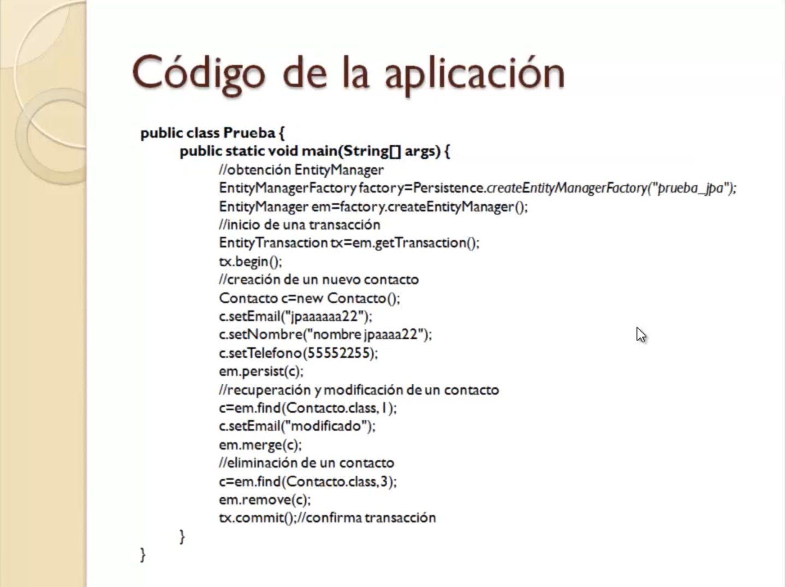

Vamos a obtener un `EntityManagerFactory` para obtener el `EntityManager`, iniciar una transacción y a partir de ahí hacer una serie de operaciones y confirmar en último lugar la transacción con un commit, para comprobar que efectivamente se han realizado sobre la base de datos.

Pues lo primero vamos a abrir es Workbeanch y comprobar el contenido de la tabla contactos.

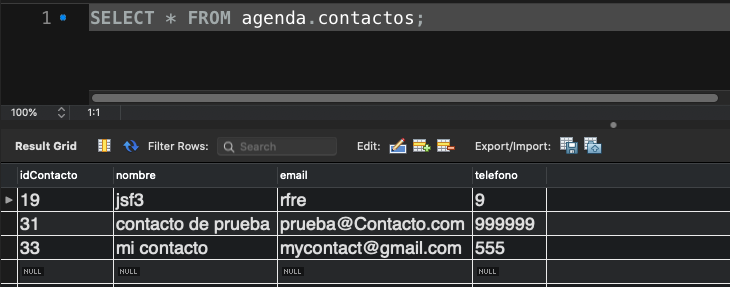

Bueno pues vamos a pasar a desarrollar con Eclipse y recuperaremos el ejercicio primero que hicimos de ejemplo JPA donde como recordarás creamos la capa de persistencia que fue básicamente eso crear la entidad y la configuración de la misma a través de las anotaciones usando el asistente que veíamos en Eclipse. Y  también la configuración del `persistence.xml` que se genera automáticamente los datos de conexión.

Lo que vamos a hacer es crear una clase Java básica de aplicación de consola con su método main donde vamos a realizar una serie de operaciones contra la capa de persistencia (Contacto).

Entonces nos colocamos encima del proyecto vamos presionar el botón derecho, New Class para crear una nueva clase, esta clase la vamos a llamar por ejemplo `Test`, no la vamos a meter en el mismo paquete donde están las entidades más bien en un paquete aparte, por ejemplo `principal`. Y por supuesto con el método `main`.

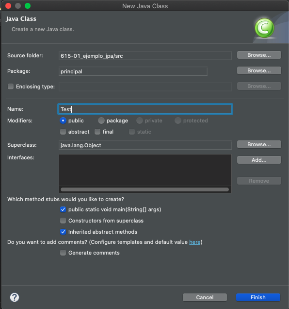

A partir de ahí vamos a esperar que genere la clase 

```java
package principal;

public class Test {

	public static void main(String[] args) {
		// TODO Auto-generated method stub

	}

}
```

Y aquí ya vamos a introducir el código de la aplicación que vamos a hacer para realizar esas operaciones. Qué es lo que tenemos que hacer es crear `EntityManagerFactory` para crear el `EntityManagerFactory` como te comentaba en la lección anterior tenemos que recurrir al método de la clase `Persistence`, `createEntityManagerFactory()`, el cual necesita el nombre de la unidad de persistencia, y como se se llama la unidad de persistencia, ese dato lo tenemos en el archivo `persistence.xml` en la línea `<persistence-unit name="615-01_ejemplo_jpa" transaction-type="RESOURCE_LOCAL">`, sería `615-01_ejemplo_jpa` por lo que el código en `Test` queda así:

```java
EntityManagerFactory factory = Persistence.createEntityManagerFactory("615-01_ejemplo_jpa");
```

Aquí ya tenemos la creación del `EntityManagerFactory` con el cual podremos crear el `EntityManager`

Recuerda en Eclipse Control+Shift+O para importar las clases e interfaces que vayamos utilizando en cada momento.

`EntityManager` a partir de ahí vamos a crear el objeto `factory` recurriendo al método `createEntityManager()` que no recibe ningún parámetro puesto que el nombre de la Unidad de persistencia lo indicamos al crear la factoría.

```java
EntityManagerFactory factory = Persistence.createEntityManagerFactory("615-01_ejemplo_jpa");
EntityManager em = factory.createEntityManager();
```

Pues ya tenemos el `EntityManager` a partir de ahí a poder realizar las operaciones CRUD.

Pero vamos a iniciar una transacción.

```java
EntityManagerFactory factory = Persistence.createEntityManagerFactory("615-01_ejemplo_jpa");
EntityManager em = factory.createEntityManager();

//Inicio de una transacción
EntityTransaction tx = em.getTransaction();
tx.begin();
```

Cómo vemos lo primero que hacemos es iniciar una transacción a través del `EntityTransaction`, `EntityTransaction` también forma parte del `javax.persistence` y dispone de un método `begin()` para iniciar la transacción, aparte por supuesto de los métodos para confirmar y rechazar.

Todas las operaciones CRUD que realicemos ahora de acción, es decir crear, actualizar y eliminar una entidad, en el momento que se confirmen quedarán reflejadas en la base de datos, pero si no hacemos un commit esas operaciones no quedarán en ningún 
sitio.

Vamos a persistir una entidad, creamos un objeto contacto, el asistente de Eclipse que utilizamos para crear las entidades, nos creo las entidades con el constructor sin parámetros, podríamos haber incluido nosotros un constructor explícito con parámetros que permitieran inicializar todos los atributos, pero bueno no está, nada, podemos llamar a los métodos set para inicializar los valores.

```java
EntityManagerFactory factory = Persistence.createEntityManagerFactory("615-01_ejemplo_jpa");
EntityManager em = factory.createEntityManager();

//Inicio de una transacción
EntityTransaction tx = em.getTransaction();
tx.begin();

//Crear una entidad
Contacto c = new Contacto();
c.setNombre("Contacto de prueba");
c.setEmail("prueba@contacto.com");
c.setTelefono(678999888);
```

A partir de ahí ya tenemos un contacto creado, lo persistimos, para ello usamos el método `em.persist(c);` el que comentamos en la lección anterior, con esto quedaría persistido a la espera de que confirmamos la transacción, que lo haremos al final cuando hayamos hecho ya todas las operaciones.

```java
EntityManagerFactory factory = Persistence.createEntityManagerFactory("615-01_ejemplo_jpa");
EntityManager em = factory.createEntityManager();

//Inicio de una transacción
EntityTransaction tx = em.getTransaction();
tx.begin();

//Crear una entidad
Contacto c = new Contacto();
c.setNombre("Contacto de prueba");
c.setEmail("prueba@contacto.com");
c.setTelefono(678999888);
		
//Persistir una entidad
em.persist(c);
```

Que vamos a hacer ahora, vamos a actualizar una entidad, por ejemplo tenemos aquí los datos.

```java
EntityManagerFactory factory = Persistence.createEntityManagerFactory("615-01_ejemplo_jpa");
EntityManager em = factory.createEntityManager();

//Inicio de una transacción
EntityTransaction tx = em.getTransaction();
tx.begin();

//Crear una entidad
Contacto c = new Contacto();
c.setNombre("Contacto de prueba");
c.setEmail("prueba@contacto.com");
c.setTelefono(678999888);
		
//Persistir una entidad
em.persist(c);

//Recuperación y modificación de un contacto
c = em.find(Contacto.class, 19);
c.setEmail("modificado");
em.merge(c);
```

Reutilizamos la misma variable de contacto `c` y lo que hacemos en este caso es llamar a uno de los segundos métodos documentamos del `EntityManager`, `find` para localizar una entidad, cómo funciona `find`, le proporcionas el tipo de la clase objeto, `Contacto.class` lo que queremos nosotros un Contacto y la Primary Key que queremos localizar. Efectivamente debe haber un contacto con el valor de Primary Key que estamos proporcionando.


Después le modificamos el email y hacemos un `merge` con lo cual esto haría que se modificase dicho email en la base de datos y quedaría cambiado, éste email aparecería con el valor de `modificado` una vez que se confirme la transacción.

Vamos ahora a eliminar una entidad, recuperamos la entidad y llamaríamos al método `remove`

```java
EntityManagerFactory factory = Persistence.createEntityManagerFactory("615-01_ejemplo_jpa");
EntityManager em = factory.createEntityManager();

//Inicio de una transacción
EntityTransaction tx = em.getTransaction();
tx.begin();

//Crear una entidad
Contacto c = new Contacto();
c.setNombre("Contacto de prueba");
c.setEmail("prueba@contacto.com");
c.setTelefono(678999888);
		
//Persistir una entidad
em.persist(c);

//Recuperación y modificación de un contacto
c = em.find(Contacto.class, 19);
c.setEmail("modificado");
em.merge(c);

//Eliminación de un contacto
c = em.find(Contacto.class, 33);
em.remove(c);
```

para eliminar un contacto volvemos a hacer una búsqueda y le vamos a proporcionar un identificador de un Primary Key que ya existe, por ejemplo yo tengo el 33, vamos a eliminar este usuario, bien proporcionamos la Primary Key y una vez que lo hemos obtenido, un remove, es así de simple.

Como ves es muy sencillo manejar JPA y realizar operaciones contra la capa de persistencia bastante más que por supuesto con JDBC.

Ahora ya por fin confirmamos la transacción.

```java
EntityManagerFactory factory = Persistence.createEntityManagerFactory("615-01_ejemplo_jpa");
EntityManager em = factory.createEntityManager();

//Inicio de una transacción
EntityTransaction tx = em.getTransaction();
tx.begin();

//Crear una entidad
Contacto c = new Contacto();
c.setNombre("Contacto de prueba");
c.setEmail("prueba@contacto.com");
c.setTelefono(678999888);
		
//Persistir una entidad
em.persist(c);

//Recuperación y modificación de un contacto
c = em.find(Contacto.class, 19);
c.setEmail("modificado");
em.merge(c);

//Eliminación de un contacto
c = em.find(Contacto.class, 33);
em.remove(c);

//Confirmar transacción
tx.commit();
```

Bueno pues ya lo tenemos completo.

```java
package principal;

import javax.persistence.EntityManager;
import javax.persistence.EntityManagerFactory;
import javax.persistence.EntityTransaction;
import javax.persistence.Persistence;

import entidades.Contacto;

public class Test {

	public static void main(String[] args) {
		EntityManagerFactory factory = Persistence.createEntityManagerFactory("615-01_ejemplo_jpa");
		EntityManager em = factory.createEntityManager();
		
		//Inicio de una transacción
		EntityTransaction tx = em.getTransaction();
		tx.begin();
		
		//Crear una entidad
		Contacto c = new Contacto();
		c.setNombre("Contacto de prueba");
		c.setEmail("prueba@contacto.com");
		c.setTelefono(678999888);
		
		//Persistir una entidad
		em.persist(c);
		
		//Recuperación y modificación de un contacto
		c = em.find(Contacto.class, 19);
		c.setEmail("modificado");
		em.merge(c);
		
		//Eliminación de un contacto
		c = em.find(Contacto.class, 33);
		em.remove(c);
		
		//Confirmar transacción
		tx.commit();
		
		System.out.println("Operaciones realizadas");
	}

}
```

Simplemente sería ejecutarlo y ver los resultados. Vamos a ejecutarlo, a la hora de ejecutarlo vamos a ver que va a haber un pequeño problema ya te lo voy anunciando, pero quería que apareciera para que lo vieras.

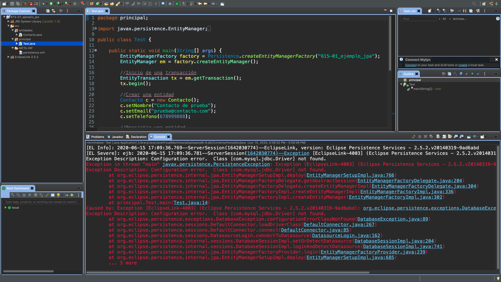

Bueno pues lo típico, ejecutas el programa y de repente empiezan a aparecer excepciones. Error. Qué ha pasado. Bueno no tenemos que alarmarnos, esto es muy habitual, todos vamos a cometer errores y lo que más veces nos va a pasar, cometer errores durante la ejecución de los programas, cuando los encontramos todo lo que tenemos que hacer siempre, sea el programa del tipo que sea, es ir al principio del error o sea todos estos mensajes que empiezan a aparecer aquí de Exception tal y bueno están volcados en la consola, lo que se llama *Los volcarlos de pila de la excepción* pero normalmente suele ser al principio donde está el mensaje que nos va a indicar qué está pasando y efectivamente aquí al principio ya nos dice que falta o que no encuentra el driver de SQL, tened en cuenta que aquí hay un motor de persistencia que se va a encargar de hacer las operaciones contra la base de datos.

Nosotros le hemos dicho en el `persistence.xml` a ese motor de persistencia que la base datos está en esta dirección `jdbc:mysql://localhost:3306/agenda` y que tienen que utilizar este driver `com.mysql.jdbc.Driver`, pero dónde está el driver, no está aquí.

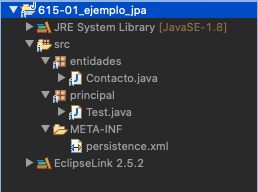

nosotros sí lo utilizamos cuando el asistente, para crear la capa de persistencia pero dentro de lo que es el proyecto no está el Driver, hay que añadir la referencia a esa librería para que la pueda utilizar la aplicación y por lo tanto la pueda utilizar el motor de persistencia, no estaríamos en el Classmate de las clases posibles que puede utilizar este proyecto, está el JRE que son precisamente las clases de Java estándar y el EclipseLink que es el motor de persistencia pero aquí tendríamos que añadir el driver.

Como lo hacemos, botón derecho nos vamos a las propiedades del proyecto 

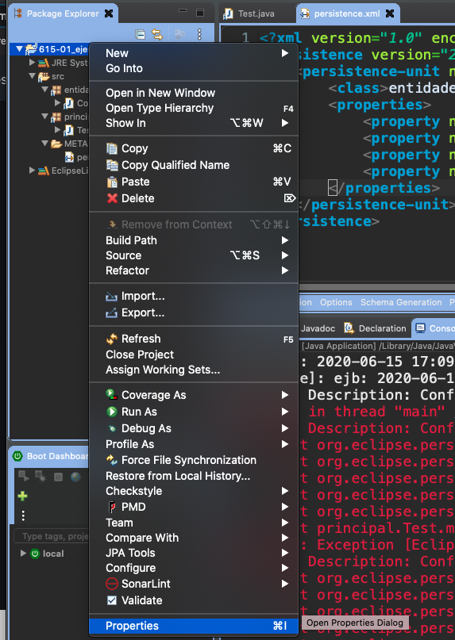

y vamos a Java Build Path 

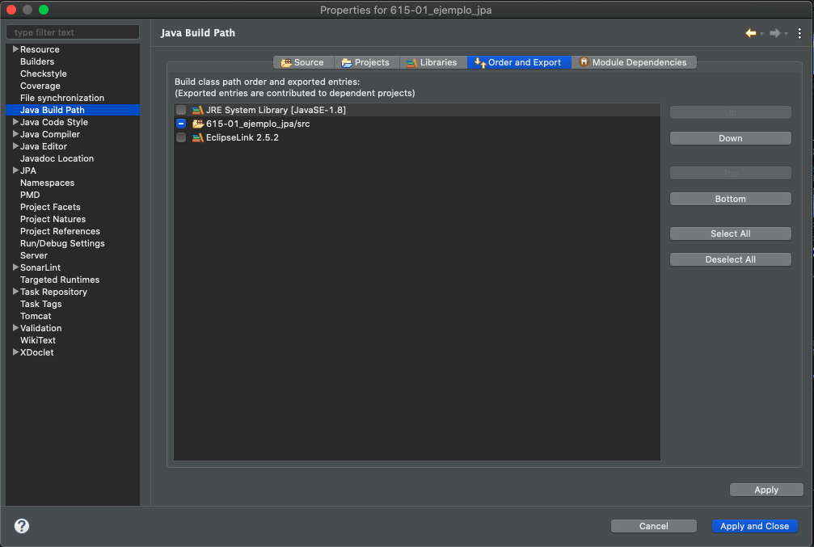

pestaña Libraries

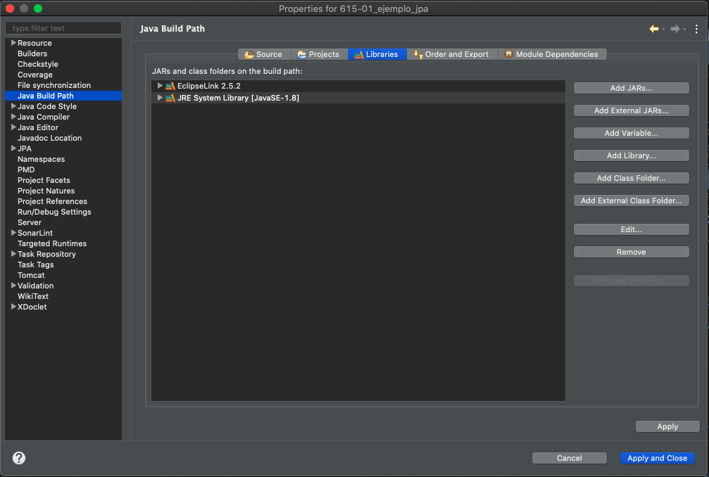

ahí aparece como ves las librerías que te comentaba, pero debemos añadir también el JAR correspondiente al Driver de MySQL, pulsamos el botón `Add External JARs...` y lo localizamos donde lo tengamos almacenado, lo tenemos aquí en esta carpeta. 

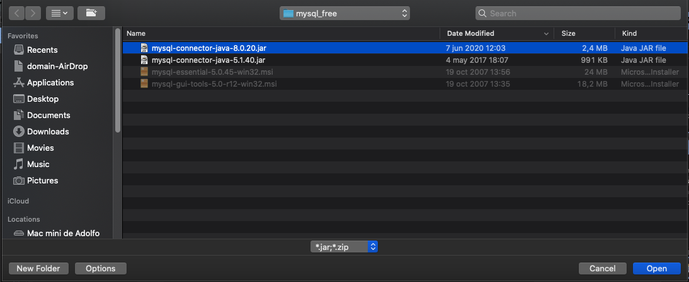

Ahí está lo seleccionamos y ya tenemos el Driver.

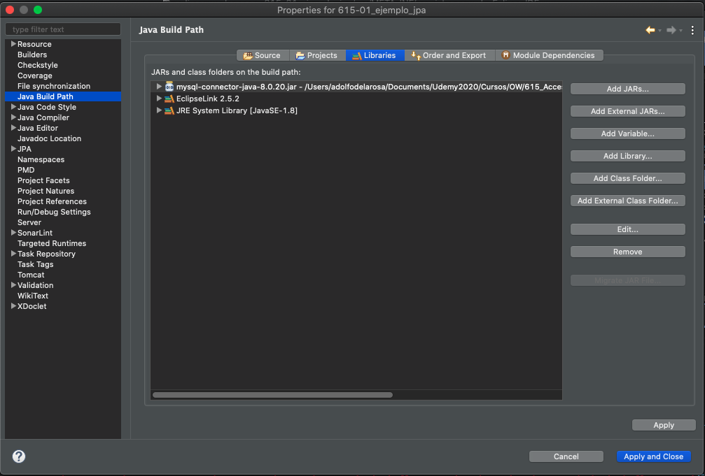

Ahora ya cuando el proveedor de persistencia vaya a hacer las operaciones contra la base de datos e intente tirar de este Driver y al ver que nosotros lo hemos indicado aquí como está dentro de las librerías reconocidas lo localizara y puede hacer las operaciones.

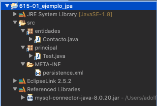

Vamos a ejecutarlo como una Java aplicación y ahora ya no ha habido errores y nos dice operaciones realizadas.

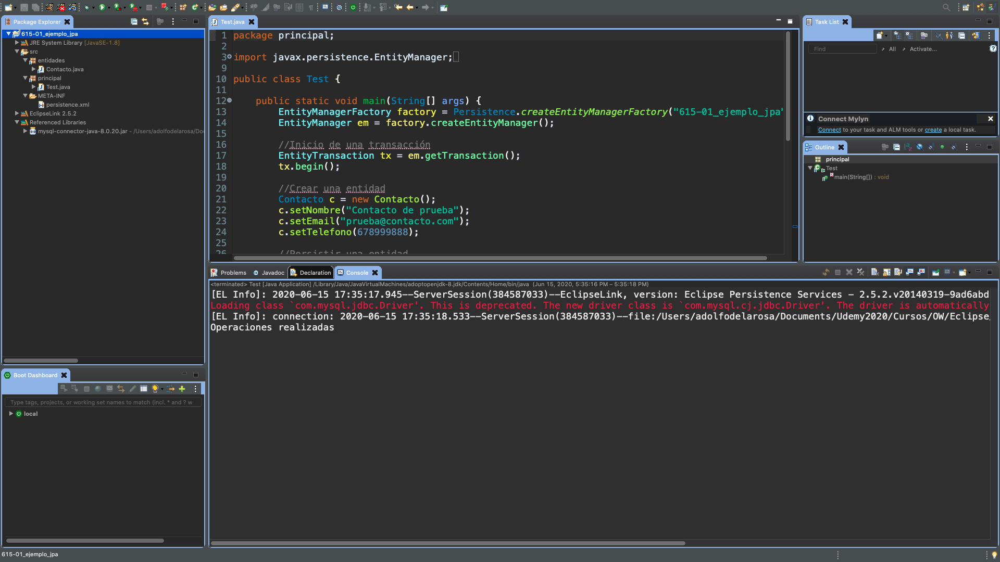

Pero vamos a comprobarlo recordemos que nuestra base de datos tenia los siguientes valores:


Nos vamos a la base de datos refrescamos y ahora tenemos lo siguiente:

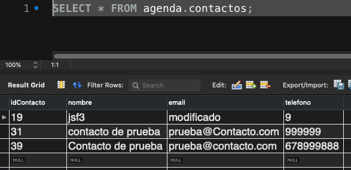

Efectivamente el primero contacto de prueba que hemos hecho se ha añadido con los datos que le hemos indicado.

Se ha modificado el email del contacto 19 ahora contiene el texto `modificado`.

Y se ha eliminado el contacto número 33 ya no existe.

Se ha visto cómo realizar las operaciones básicas a través del `EntityManager`.

Si quisiéramos hacer otras operaciones más complejas de búsqueda de un conjunto de entidades o eliminación por otros criterios tendríamos que recurrir a las consultas que vamos a estudiar ya próximamente.


### :computer: Código Completo - 615-01_ejemplo_jpa 

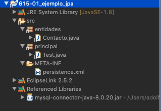

A diferencia de la primera versión de este proyecto se añadio el Driver de MySQL y se añadio la clase `Test`, todo lo demas es exactamente igual.

*`persistence.xml`*

```html
<?xml version="1.0" encoding="UTF-8"?>
<persistence version="2.2" xmlns="http://xmlns.jcp.org/xml/ns/persistence" xmlns:xsi="http://www.w3.org/2001/XMLSchema-instance" xsi:schemaLocation="http://xmlns.jcp.org/xml/ns/persistence http://xmlns.jcp.org/xml/ns/persistence/persistence_2_2.xsd">
	<persistence-unit name="615-01_ejemplo_jpa" transaction-type="RESOURCE_LOCAL">
		<class>entidades.Contacto</class>
		<properties>
			<property name="javax.persistence.jdbc.url" value="jdbc:mysql://localhost:3306/agenda"/>
			<property name="javax.persistence.jdbc.user" value="root"/>
			<property name="javax.persistence.jdbc.password" value="root"/>
			<property name="javax.persistence.jdbc.driver" value="com.mysql.jdbc.Driver"/>
		</properties>
	</persistence-unit>
</persistence>
```

*`Contacto.java`*

```java
package entidades;

import java.io.Serializable;
import javax.persistence.*;


/**
 * The persistent class for the contactos database table.
 * 
 */
@Entity
@Table(name="contactos")
@NamedQuery(name="Contacto.findAll", query="SELECT c FROM Contacto c")
public class Contacto implements Serializable {
	private static final long serialVersionUID = 1L;

	@Id
	@GeneratedValue(strategy=GenerationType.IDENTITY)
	private int idContacto;

	private String email;

	private String nombre;

	private int telefono;

	public Contacto() {
	}

	public int getIdContacto() {
		return this.idContacto;
	}

	public void setIdContacto(int idContacto) {
		this.idContacto = idContacto;
	}

	public String getEmail() {
		return this.email;
	}

	public void setEmail(String email) {
		this.email = email;
	}

	public String getNombre() {
		return this.nombre;
	}

	public void setNombre(String nombre) {
		this.nombre = nombre;
	}

	public int getTelefono() {
		return this.telefono;
	}

	public void setTelefono(int telefono) {
		this.telefono = telefono;
	}

}
```

*`Test.java`*

```java
package principal;

import javax.persistence.EntityManager;
import javax.persistence.EntityManagerFactory;
import javax.persistence.EntityTransaction;
import javax.persistence.Persistence;

import entidades.Contacto;

public class Test {

	public static void main(String[] args) {
		EntityManagerFactory factory = Persistence.createEntityManagerFactory("615-01_ejemplo_jpa");
		EntityManager em = factory.createEntityManager();
		
		//Inicio de una transacción
		EntityTransaction tx = em.getTransaction();
		tx.begin();
		
		//Crear una entidad
		Contacto c = new Contacto();
		c.setNombre("Contacto de prueba");
		c.setEmail("prueba@contacto.com");
		c.setTelefono(678999888);
		
		//Persistir una entidad
		em.persist(c);
		
		//Recuperación y modificación de un contacto
		c = em.find(Contacto.class, 19);
		c.setEmail("modificado");
		em.merge(c);
		
		//Eliminación de un contacto
		c = em.find(Contacto.class, 33);
		em.remove(c);
		
		//Confirmar transacción
		tx.commit();
		
		System.out.println("Operaciones realizadas");
	}

}
```

# Autoevaluación II 01:00

Autoevaluación II

1. Una unidad de persistencia:
   * Es el nombre que se le da al motor de persistencia en JPA
   * Es un conjunto de librerías
   * Define la información de persistencia asociada a una determinada base de datos :+1:
   * Representa el conjunto de anotaciones que se emplean para definir las entidades

2. El objeto EntityManager se obtiene
   * A partir del método getEntityManager() de Persistence
   * Creándolo a partir del constructor sin parámetros de EntityManager
   * A partir del método createEntityManager() de EntityManagerFactory :+1:
   * Spring

3. El método merge() de EntityManager
   * Actualiza la BD con los datos existentes en el objeto de entidad :+1:
   * Almacena un nuevo registro en la BD con los datos de la entidad
   * Refresca la entidad con los datos existentes en la base de datos
   * Elimina una entidad del contexto de persistencia

4. Si llamamos al método find() de EntityManager proporcionando una primary key no existente
   * Se producirá una excepción
   * Se devolverá un objeto nuevo con todos sus campos vacíos
   * Se añadirá un nuevo registro en la base de datos con esa primary key
   * El método devolverá null :+1:

5. ¿Qué sucede si hacemos una llamada a persist() fuera de una transacción?
   * La entidad no será persistida y no se producirá ninguna excepción :+1:
   * La entidad será persistida, pero se producirá una excepción
   * La entidad no será persistida y se producirá una excepción
   * La entidad será persistida y no habrá ningún tipo de error
 


SOLUCIONES:

1.- C

2.- C

3.- A

4.- D

5.- A
